Práctica 99. Resultados de tu manuscrito. Bromeliaceae, análisis de
agrupamiento y de ordenación.
================
José Ramón Martínez Batlle
26-11-2022

NOTA. Este cuaderno es una aplicación a datos de Bromeliaceae en GBIF, a
partir de una simple adaptación del cuaderno general
[practica-99-tu-manuscrito-3-resultados.md (basado en un análisis
demostrativo de la familia
Polygonaceae)](../practica-99-tu-manuscrito-3-resultados.md). Si
comparas este archivo con el original, notarás que, básicamente, edité
el nombre del archivo fuente de la matriz de comunidad (para adaptarlo a
este grupo) y otros detalles menores. Por lo tanto, aunque el código y
los gráficos sí se refieren a Bromeliaceae, probablemente el texto no.

# ¿Qué contiene la sección “Resultados”?

Te recomiendo releer las normas para autores/as del [Anuario de
Investigaciones Científicas de la
UASD](../docs/instrucciones-para-autores-anuario-investigaciones-cientificas-UASD.pdf)
y adherirte a las especificaciones sobre la sección “Resultados” que
allí se indican. Aunque en las referidas normas no se incluyen muchas
pautas significativas, si escribieras para una revista específica,
deberás considerar sus normas y recomendaciones de publicación. Además,
te recomiendo que consultes la sección “Resultados” de algunos
manuscritos publicados en el Anuario.

En los resultados expones el contenido analítico central. Es “el qué”
del manuscrito, en complemento de “el cómo” (metodología) y “el por qué”
(introducción) de tu investigación. En los resultados muestras lo que
encontraste luego de que colectaste (aunque en este caso, no fuiste al
terreno) y analizaste, con tus métodos, los datos fuente.

Algunas recomendaciones generales:

- “Resultados” se supone que es la sección más corta del manuscrito,
  siempre que se usen apropiadamente los recursos gráficos, las tablas y
  la información suplementaria.

- Comienza por realizar tus análisis. Necesitarás una matriz de
  comunidad y una ambiental. La de comunidad la habrás generado en la
  práctica 2; la ambiental explico cómo generarla en este mismo cuaderno
  (ver abajo). En general, la matriz ambiental la producirás mediante
  estadísticos zonales del territorio dominicano. Para aprender más
  sobre la fuente de estadística zonal de República Dominicana, que
  contiene un conjunto de más de 100 variables resumidas por celdas H3,
  visita [este repo](https://github.com/geofis/zonal-statistics). Debes
  visitar dicho repo para poder citarlo apropiadamente.

- Cuando tengas análisis realizados, antes de comenzar a escribir, te
  recomiendo que escribas un guión de tu sección “Resultados”.

- Guión en mano, redacta tu sección “Resultados”, siguiendo también
  estos consejos:

- En esta sección, se espera que presentes lo que has obtenido de manera
  “objetiva”, evitando explicaciones, comentarios, opiniones,
  perspectivas o limitaciones. En teoría, tu redacción es “fría”, lo
  cual no necesariamente significa que tenga que ser aburrida.

- Esta es la sección por excelencia donde usarás *tablas y/o gráficos*.
  Lo más importante a tener en cuenta cuando los uses es que no debes
  duplicar el contenido que muestran dichos recursos en el texto. La
  tabla o gráfico son apoyos que te ayudarán a no entrar en densidades
  innecesarias dentro de los párrafos. Por lo tanto, si colocas una
  tabla o figura, no caigas en la tentación de describirla en párrafos
  de forma exhausitva. Estos recursos deben servir para apoyar el o los
  párrafos donde destacas los principales patrones encontrados.

- *Importante también*: si insertas una tabla o gráfico, debes referirla
  en el texto (e.g. “ver figura X”). De nada sirve incluir una figura o
  una tabla si no la refieres, porque con ello estarás sugiriendo que
  dicho recurso era completamente prescindible.

- El tiempo verbal preferido (por defecto) es el pasado, por ejemplo “…,
  donde se **encontró** una asociación significativa entre … y …”. Sin
  embargo, hay excepciones, como por ejemplo, cuando te refieres a una
  tabla o una figura. Un caso típico es la expresión “tal como se
  muestra en la tabla 1”, donde el verbo está conjugado en presente.

A continuación, te pongo enlaces a referencias que considero útiles,
sobre cómo redactar los resultados (algunas son generales, sobre
artículos en general):

- [Breves pautas, en
  inglés](https://www.editage.com/insights/the-secret-to-writing-the-results-and-discussion-section-of-a-manuscript).
  Puedes usar el traductor [DeepL](https://www.deepl.com/translator),
  porque produce frases más naturales.

Cinco guías, en inglés, que considero están bien elaboradas, sobre cómo
redactar un artículo científico (consulta la sección sobre cómo redactar
los *resultados* en cada una):

- [Demystifying the Journal
  Article](https://www.insidehighered.com/advice/2017/05/09/how-write-effective-journal-article-and-get-it-published-essay)

- [How to write a scientific manuscript for
  publication](https://www.ncbi.nlm.nih.gov/pmc/articles/PMC3626472/)

- [11 steps to structuring a science paper editors will take
  seriously](https://www.elsevier.com/connect/11-steps-to-structuring-a-science-paper-editors-will-take-seriously)

- [Cómo escribir un artículo científico por primera
  vez](https://www.sciencedirect.com/science/article/abs/pii/S1134593417300040)
  (necesitarás usar [SciHub](https://sci-hub.se/) para descargarlo)

- Una muy breve pero con consejos útiles: [Tips for writing the perfect
  IMRAD
  manuscript](https://www.editage.com/insights/tips-for-writing-the-perfect-imrad-manuscript)

# Scripts de ejemplo

Una nota, a título informativo. Cada una se las siguientes secciones
(e.g. “Análisis de agrupamiento”, “Ordenación restringida”), es
reproducible de forma autónoma, es decir, sin dependencia de líneas de
código anteriores. Esto siginifica que las dependencias de una sección
se resuelven dentro de ella misma, sin dependencia de líneas anteriores.

Por esta razón, varias secciones comparten texto y código común, pero
sólo al inicio, porque al avanzar cada una se hace propia. Notarás, por
lo tanto, que el texto “se repite a sí mismo” por esta razón; la otra
opción que tenía era alojar el código común en un único archivo, pero
entonces esto te obligaba a navegar por archivos separados, haciendo
menos didáctico este cuaderno.

## Análisis de agrupamiento

Me basaré en los scripts que comienzan por `aa_` de este
[repo](https://github.com/biogeografia-master/scripts-de-analisis-BCI),
los cuales explico en los vídeos de “Análisis de agrupamiento” (del 13
al 16) de la lista de reproducción [“Ecología Numérica con R” de mi
canal](https://www.youtube.com/playlist?list=PLDcT2n8UzsCRDqjqSeqHI1wsiNOqpYmsJ).

> INICIA texto+código común entre secciones

Fijar un directorio de trabajo no es recomendable, mejor trabaja por
proyecto. En cualquier caso, si no quieres o no puedes crear un
proyecto, usa la sentencia que verás abajo, cambiando `TU_DIRECTORIO`
por la ruta del directorio donde tengas almacenados tus datos y tus
scripts.

``` r
if(interactive()) {
  tryCatch(
    setwd(dirname(rstudioapi::getSourceEditorContext()$path)),
    error = function(e) {
      cat('Probablemente ya el directorio de trabajo está fijado correctamente',
          'o quizá el directorio no existe. Este fue el error devuelto:\n')
      e
    })
}
```

Cargar paquetes.

``` r
library(vegan)
library(sf)
library(tidyverse)
library(tmap)
library(kableExtra)
library(foreach)
library(leaps)
library(caret)
gh_content <- 'https://raw.githubusercontent.com/'
gh_zonal_stats <- paste0(gh_content,
                         'geofis/zonal-statistics/0b2e95aaee87bf326cf132d28f4bd15220bb4ec7/out/')
repo_analisis <- 'biogeografia-master/scripts-de-analisis-BCI/master'
repo_sem202202 <- 'biogeografia-202202/material-de-apoyo/master/practicas/'
devtools::source_url(paste0(gh_content, repo_analisis, '/biodata/funciones.R'))
devtools::source_url(paste0(gh_content, repo_sem202202, 'train.R'))
devtools::source_url(paste0(gh_content, repo_sem202202, 'funciones.R'))
```

Carga tu matriz de comunidad, que habrás generado en la práctica 2, y
elige un umbral para especies raras o rangos de registros de presencia
para seleccionar especies en una nueva matriz de comunidad.

``` r
res <- 5 #Resolución H3, puedes elegir entre 4, 5, 6 o 7, pero cuidado con valores >=6
# IMPORTANTE: la resolución de las celdas H3, debe coincidir con la resolución
# a la cual generaste tu matriz de comunidad. De lo contrario, obtendrás error. Si tu 
# archivo RDS de matriz de comunidad se denomina "matriz_de_comunidad.RDS", y lo creaste
# usando resolución 4, cámbiale el nombre a "matriz_de_comunidad_res_5.RDS". Recuerda,
# puedes usar cualquier resolución, lo único importante es que las resolución usada en la
# creación de la matriz de comunidad, debe ser la misma que en la ambiental.
# Prueba distintas resoluciones, no te enfrasques en quedarte con la misma que
# uso en este ejemplo. Prueba con resolución 5, por ejemplo.
mc_orig <- readRDS('matriz_de_comunidad_bromeliaceae.RDS')
nrow(mc_orig) #Número de filas, equivale a número de hexágonos con registros de presencia
```

    ## [1] 176

``` r
ncol(mc_orig)  #Número de columnas, equivale a número de especies, riqueza
```

    ## [1] 68

``` r
data.frame(Especies = names(mc_orig)) %>% 
  kable(booktabs=T) %>%
  kable_styling(latex_options = c("HOLD_position", "scale_down")) %>%
  gsub(' NA ', '', .) #Lista de especies
```

<table class="table" style="margin-left: auto; margin-right: auto;">
<thead>
<tr>
<th style="text-align:left;">
Especies
</th>
</tr>
</thead>
<tbody>
<tr>
<td style="text-align:left;">
Tillandsia usneoides (L.) L.
</td>
</tr>
<tr>
<td style="text-align:left;">
Tillandsia fasciculata Sw.
</td>
</tr>
<tr>
<td style="text-align:left;">
Aechmea nudicaulis (L.) Griseb.
</td>
</tr>
<tr>
<td style="text-align:left;">
Tillandsia schiedeana Steud.
</td>
</tr>
<tr>
<td style="text-align:left;">
Ananas comosus (L.) Merr.
</td>
</tr>
<tr>
<td style="text-align:left;">
Tillandsia balbisiana Schult. & Schult.f.
</td>
</tr>
<tr>
<td style="text-align:left;">
Tillandsia recurvata (L.) L.
</td>
</tr>
<tr>
<td style="text-align:left;">
Tillandsia utriculata L.
</td>
</tr>
<tr>
<td style="text-align:left;">
Tillandsia fendleri Griseb.
</td>
</tr>
<tr>
<td style="text-align:left;">
Guzmania monostachia (L.) Rusby ex Mez
</td>
</tr>
<tr>
<td style="text-align:left;">
Tillandsia tenuifolia L.
</td>
</tr>
<tr>
<td style="text-align:left;">
Tillandsia juncea (Ruiz & Pav.) Poir.
</td>
</tr>
<tr>
<td style="text-align:left;">
Guzmania berteroniana (Schult. & Schult.f.) Mez
</td>
</tr>
<tr>
<td style="text-align:left;">
Bromelia pinguin L.
</td>
</tr>
<tr>
<td style="text-align:left;">
Tillandsia paucifolia Baker
</td>
</tr>
<tr>
<td style="text-align:left;">
Tillandsia hotteana Urb.
</td>
</tr>
<tr>
<td style="text-align:left;">
Tillandsia flexuosa Sw.
</td>
</tr>
<tr>
<td style="text-align:left;">
Bromeliaceae
</td>
</tr>
<tr>
<td style="text-align:left;">
Guzmania lingulata (L.) Mez
</td>
</tr>
<tr>
<td style="text-align:left;">
Catopsis floribunda L.B.Sm.
</td>
</tr>
<tr>
<td style="text-align:left;">
Tillandsia L.
</td>
</tr>
<tr>
<td style="text-align:left;">
Billbergia pyramidalis (Sims) Lindl.
</td>
</tr>
<tr>
<td style="text-align:left;">
Pitcairnia L’Hér.
</td>
</tr>
<tr>
<td style="text-align:left;">
Tillandsia pruinosa Sw.
</td>
</tr>
<tr>
<td style="text-align:left;">
Tillandsia variabilis Schltdl.
</td>
</tr>
<tr>
<td style="text-align:left;">
Tillandsia setacea Sw.
</td>
</tr>
<tr>
<td style="text-align:left;">
Pitcairnia elizabethae L.B.Sm.
</td>
</tr>
<tr>
<td style="text-align:left;">
Werauhia sintenisii (Baker) J.R.Grant
</td>
</tr>
<tr>
<td style="text-align:left;">
Catopsis nitida (Hook.) Griseb.
</td>
</tr>
<tr>
<td style="text-align:left;">
Racinaea tetrantha (Ruiz & Pav.) M.A.Spencer & L.B.Sm.
</td>
</tr>
<tr>
<td style="text-align:left;">
Racinaea tetrantha var. caribaea (L.B.Sm.) M.A.Spencer & L.B.Sm.
</td>
</tr>
<tr>
<td style="text-align:left;">
Guzmania Ruiz & Pav.
</td>
</tr>
<tr>
<td style="text-align:left;">
Werauhia gibba (L.B.Sm.) J.R.Grant
</td>
</tr>
<tr>
<td style="text-align:left;">
Tillandsia fasciculata var. fasciculata
</td>
</tr>
<tr>
<td style="text-align:left;">
Catopsis Griseb.
</td>
</tr>
<tr>
<td style="text-align:left;">
Tillandsia kuzmae Ehlers
</td>
</tr>
<tr>
<td style="text-align:left;">
Tillandsia compressa Bertero ex Schult. & Schult.f.
</td>
</tr>
<tr>
<td style="text-align:left;">
Zizkaea tuerckheimii (Mez) W.Till & Barfuss
</td>
</tr>
<tr>
<td style="text-align:left;">
Pitcairnia domingensis L.B.Sm.
</td>
</tr>
<tr>
<td style="text-align:left;">
Tillandsia fasciculata var. densispica Mez
</td>
</tr>
<tr>
<td style="text-align:left;">
Tillandsia didistichoides Mez
</td>
</tr>
<tr>
<td style="text-align:left;">
Catopsis sessiliflora (Ruiz & Pav.) Mez
</td>
</tr>
<tr>
<td style="text-align:left;">
Tillandsia compacta Griseb.
</td>
</tr>
<tr>
<td style="text-align:left;">
Racinaea spiculosa var. spiculosa
</td>
</tr>
<tr>
<td style="text-align:left;">
Tillandsia festucoides Brongn. ex Mez
</td>
</tr>
<tr>
<td style="text-align:left;">
Pitcairnia jimenezii L.B.Sm.
</td>
</tr>
<tr>
<td style="text-align:left;">
Tillandsia polystachia (L.) L.
</td>
</tr>
<tr>
<td style="text-align:left;">
Racinaea spiculosa (Griseb.) M.A.Spencer & L.B.Sm.
</td>
</tr>
<tr>
<td style="text-align:left;">
Tillandsia selleana Harms
</td>
</tr>
<tr>
<td style="text-align:left;">
Tillandsia bulbosa Hook.
</td>
</tr>
<tr>
<td style="text-align:left;">
Tillandsia capitata Griseb.
</td>
</tr>
<tr>
<td style="text-align:left;">
Tillandsia fendleri var. fendleri
</td>
</tr>
<tr>
<td style="text-align:left;">
Racinaea lescaillei (C.Wright) M.A.Spencer & L.B.Sm.
</td>
</tr>
<tr>
<td style="text-align:left;">
Guzmania ekmanii (Harms) Harms ex Mez
</td>
</tr>
<tr>
<td style="text-align:left;">
Tillandsia paniculata (L.) L.
</td>
</tr>
<tr>
<td style="text-align:left;">
Tillandsia deppeana Steud.
</td>
</tr>
<tr>
<td style="text-align:left;">
Pitcairnia bromeliifolia L’Hér.
</td>
</tr>
<tr>
<td style="text-align:left;">
Catopsis nutans (Sw.) Griseb.
</td>
</tr>
<tr>
<td style="text-align:left;">
Tillandsia moscosoi L.B.Sm. & Jiménez
</td>
</tr>
<tr>
<td style="text-align:left;">
Pitcairnia fuertesii Mez
</td>
</tr>
<tr>
<td style="text-align:left;">
Pitcairnia samuelssonii L.B.Sm.
</td>
</tr>
<tr>
<td style="text-align:left;">
Tillandsia baliophylla Harms
</td>
</tr>
<tr>
<td style="text-align:left;">
Bromelia karatas L.
</td>
</tr>
<tr>
<td style="text-align:left;">
Tillandsia ariza-juliae L.B.Sm. & Jiménez
</td>
</tr>
<tr>
<td style="text-align:left;">
Catopsis berteroniana (Schult. & Schult.f.) Mez
</td>
</tr>
<tr>
<td style="text-align:left;">
Cipuropsis capituligera (Griseb.) Christenh. & Byng
</td>
</tr>
<tr>
<td style="text-align:left;">
Werauhia ringens (Griseb.) J.R.Grant
</td>
</tr>
<tr>
<td style="text-align:left;">
Pitcairnia angustifolia Aiton
</td>
</tr>
</tbody>
</table>

``` r
unique(word(names(mc_orig), 1, 1)) #Géneros representados
```

    ##  [1] "Tillandsia"   "Aechmea"      "Ananas"       "Guzmania"     "Bromelia"    
    ##  [6] "Bromeliaceae" "Catopsis"     "Billbergia"   "Pitcairnia"   "Werauhia"    
    ## [11] "Racinaea"     "Zizkaea"      "Cipuropsis"

``` r
table(word(names(mc_orig), 1, 1)) #Número de especies por género
```

    ## 
    ##      Aechmea       Ananas   Billbergia     Bromelia Bromeliaceae     Catopsis 
    ##            1            1            1            2            1            6 
    ##   Cipuropsis     Guzmania   Pitcairnia     Racinaea   Tillandsia     Werauhia 
    ##            1            5            8            5           33            3 
    ##      Zizkaea 
    ##            1

``` r
data.frame(`Número de hexágonos` = sort(colSums(mc_orig), decreasing = T), check.names = F) %>% 
  kable(booktabs=T) %>%
  kable_styling(latex_options = c("HOLD_position", "scale_down")) %>%
  gsub(' NA ', '', .) # Número de hexágonos en los que está presente cada especie
```

<table class="table" style="margin-left: auto; margin-right: auto;">
<thead>
<tr>
<th style="text-align:left;">
</th>
<th style="text-align:right;">
Número de hexágonos
</th>
</tr>
</thead>
<tbody>
<tr>
<td style="text-align:left;">
Tillandsia recurvata (L.) L.
</td>
<td style="text-align:right;">
51
</td>
</tr>
<tr>
<td style="text-align:left;">
Tillandsia setacea Sw.
</td>
<td style="text-align:right;">
46
</td>
</tr>
<tr>
<td style="text-align:left;">
Tillandsia fasciculata Sw.
</td>
<td style="text-align:right;">
43
</td>
</tr>
<tr>
<td style="text-align:left;">
Tillandsia juncea (Ruiz & Pav.) Poir.
</td>
<td style="text-align:right;">
43
</td>
</tr>
<tr>
<td style="text-align:left;">
Tillandsia balbisiana Schult. & Schult.f.
</td>
<td style="text-align:right;">
41
</td>
</tr>
<tr>
<td style="text-align:left;">
Tillandsia schiedeana Steud.
</td>
<td style="text-align:right;">
28
</td>
</tr>
<tr>
<td style="text-align:left;">
Tillandsia variabilis Schltdl.
</td>
<td style="text-align:right;">
28
</td>
</tr>
<tr>
<td style="text-align:left;">
Tillandsia usneoides (L.) L.
</td>
<td style="text-align:right;">
24
</td>
</tr>
<tr>
<td style="text-align:left;">
Tillandsia polystachia (L.) L.
</td>
<td style="text-align:right;">
24
</td>
</tr>
<tr>
<td style="text-align:left;">
Catopsis nitida (Hook.) Griseb.
</td>
<td style="text-align:right;">
19
</td>
</tr>
<tr>
<td style="text-align:left;">
Tillandsia pruinosa Sw.
</td>
<td style="text-align:right;">
18
</td>
</tr>
<tr>
<td style="text-align:left;">
Tillandsia tenuifolia L.
</td>
<td style="text-align:right;">
16
</td>
</tr>
<tr>
<td style="text-align:left;">
Tillandsia paucifolia Baker
</td>
<td style="text-align:right;">
15
</td>
</tr>
<tr>
<td style="text-align:left;">
Catopsis floribunda L.B.Sm.
</td>
<td style="text-align:right;">
15
</td>
</tr>
<tr>
<td style="text-align:left;">
Guzmania monostachia (L.) Rusby ex Mez
</td>
<td style="text-align:right;">
14
</td>
</tr>
<tr>
<td style="text-align:left;">
Pitcairnia fuertesii Mez
</td>
<td style="text-align:right;">
14
</td>
</tr>
<tr>
<td style="text-align:left;">
Tillandsia festucoides Brongn. ex Mez
</td>
<td style="text-align:right;">
13
</td>
</tr>
<tr>
<td style="text-align:left;">
Tillandsia utriculata L.
</td>
<td style="text-align:right;">
12
</td>
</tr>
<tr>
<td style="text-align:left;">
Tillandsia didistichoides Mez
</td>
<td style="text-align:right;">
12
</td>
</tr>
<tr>
<td style="text-align:left;">
Tillandsia hotteana Urb.
</td>
<td style="text-align:right;">
11
</td>
</tr>
<tr>
<td style="text-align:left;">
Pitcairnia L’Hér.
</td>
<td style="text-align:right;">
11
</td>
</tr>
<tr>
<td style="text-align:left;">
Zizkaea tuerckheimii (Mez) W.Till & Barfuss
</td>
<td style="text-align:right;">
11
</td>
</tr>
<tr>
<td style="text-align:left;">
Bromelia pinguin L.
</td>
<td style="text-align:right;">
10
</td>
</tr>
<tr>
<td style="text-align:left;">
Tillandsia deppeana Steud.
</td>
<td style="text-align:right;">
9
</td>
</tr>
<tr>
<td style="text-align:left;">
Tillandsia fendleri Griseb.
</td>
<td style="text-align:right;">
8
</td>
</tr>
<tr>
<td style="text-align:left;">
Tillandsia compressa Bertero ex Schult. & Schult.f.
</td>
<td style="text-align:right;">
8
</td>
</tr>
<tr>
<td style="text-align:left;">
Ananas comosus (L.) Merr.
</td>
<td style="text-align:right;">
7
</td>
</tr>
<tr>
<td style="text-align:left;">
Tillandsia flexuosa Sw.
</td>
<td style="text-align:right;">
7
</td>
</tr>
<tr>
<td style="text-align:left;">
Werauhia sintenisii (Baker) J.R.Grant
</td>
<td style="text-align:right;">
7
</td>
</tr>
<tr>
<td style="text-align:left;">
Tillandsia selleana Harms
</td>
<td style="text-align:right;">
7
</td>
</tr>
<tr>
<td style="text-align:left;">
Tillandsia baliophylla Harms
</td>
<td style="text-align:right;">
7
</td>
</tr>
<tr>
<td style="text-align:left;">
Tillandsia L.
</td>
<td style="text-align:right;">
6
</td>
</tr>
<tr>
<td style="text-align:left;">
Tillandsia fasciculata var. densispica Mez
</td>
<td style="text-align:right;">
6
</td>
</tr>
<tr>
<td style="text-align:left;">
Guzmania ekmanii (Harms) Harms ex Mez
</td>
<td style="text-align:right;">
6
</td>
</tr>
<tr>
<td style="text-align:left;">
Catopsis berteroniana (Schult. & Schult.f.) Mez
</td>
<td style="text-align:right;">
6
</td>
</tr>
<tr>
<td style="text-align:left;">
Aechmea nudicaulis (L.) Griseb.
</td>
<td style="text-align:right;">
5
</td>
</tr>
<tr>
<td style="text-align:left;">
Guzmania lingulata (L.) Mez
</td>
<td style="text-align:right;">
5
</td>
</tr>
<tr>
<td style="text-align:left;">
Racinaea tetrantha var. caribaea (L.B.Sm.) M.A.Spencer & L.B.Sm.
</td>
<td style="text-align:right;">
5
</td>
</tr>
<tr>
<td style="text-align:left;">
Tillandsia compacta Griseb.
</td>
<td style="text-align:right;">
5
</td>
</tr>
<tr>
<td style="text-align:left;">
Tillandsia paniculata (L.) L.
</td>
<td style="text-align:right;">
5
</td>
</tr>
<tr>
<td style="text-align:left;">
Catopsis nutans (Sw.) Griseb.
</td>
<td style="text-align:right;">
5
</td>
</tr>
<tr>
<td style="text-align:left;">
Guzmania berteroniana (Schult. & Schult.f.) Mez
</td>
<td style="text-align:right;">
4
</td>
</tr>
<tr>
<td style="text-align:left;">
Pitcairnia elizabethae L.B.Sm.
</td>
<td style="text-align:right;">
4
</td>
</tr>
<tr>
<td style="text-align:left;">
Tillandsia bulbosa Hook.
</td>
<td style="text-align:right;">
4
</td>
</tr>
<tr>
<td style="text-align:left;">
Tillandsia moscosoi L.B.Sm. & Jiménez
</td>
<td style="text-align:right;">
4
</td>
</tr>
<tr>
<td style="text-align:left;">
Tillandsia fasciculata var. fasciculata
</td>
<td style="text-align:right;">
3
</td>
</tr>
<tr>
<td style="text-align:left;">
Pitcairnia domingensis L.B.Sm.
</td>
<td style="text-align:right;">
3
</td>
</tr>
<tr>
<td style="text-align:left;">
Pitcairnia jimenezii L.B.Sm.
</td>
<td style="text-align:right;">
3
</td>
</tr>
<tr>
<td style="text-align:left;">
Racinaea spiculosa (Griseb.) M.A.Spencer & L.B.Sm.
</td>
<td style="text-align:right;">
3
</td>
</tr>
<tr>
<td style="text-align:left;">
Pitcairnia samuelssonii L.B.Sm.
</td>
<td style="text-align:right;">
3
</td>
</tr>
<tr>
<td style="text-align:left;">
Bromelia karatas L.
</td>
<td style="text-align:right;">
3
</td>
</tr>
<tr>
<td style="text-align:left;">
Cipuropsis capituligera (Griseb.) Christenh. & Byng
</td>
<td style="text-align:right;">
3
</td>
</tr>
<tr>
<td style="text-align:left;">
Werauhia gibba (L.B.Sm.) J.R.Grant
</td>
<td style="text-align:right;">
2
</td>
</tr>
<tr>
<td style="text-align:left;">
Tillandsia kuzmae Ehlers
</td>
<td style="text-align:right;">
2
</td>
</tr>
<tr>
<td style="text-align:left;">
Tillandsia capitata Griseb.
</td>
<td style="text-align:right;">
2
</td>
</tr>
<tr>
<td style="text-align:left;">
Racinaea lescaillei (C.Wright) M.A.Spencer & L.B.Sm.
</td>
<td style="text-align:right;">
2
</td>
</tr>
<tr>
<td style="text-align:left;">
Pitcairnia bromeliifolia L’Hér.
</td>
<td style="text-align:right;">
2
</td>
</tr>
<tr>
<td style="text-align:left;">
Tillandsia ariza-juliae L.B.Sm. & Jiménez
</td>
<td style="text-align:right;">
2
</td>
</tr>
<tr>
<td style="text-align:left;">
Bromeliaceae
</td>
<td style="text-align:right;">
1
</td>
</tr>
<tr>
<td style="text-align:left;">
Billbergia pyramidalis (Sims) Lindl.
</td>
<td style="text-align:right;">
1
</td>
</tr>
<tr>
<td style="text-align:left;">
Racinaea tetrantha (Ruiz & Pav.) M.A.Spencer & L.B.Sm.
</td>
<td style="text-align:right;">
1
</td>
</tr>
<tr>
<td style="text-align:left;">
Guzmania Ruiz & Pav.
</td>
<td style="text-align:right;">
1
</td>
</tr>
<tr>
<td style="text-align:left;">
Catopsis Griseb.
</td>
<td style="text-align:right;">
1
</td>
</tr>
<tr>
<td style="text-align:left;">
Catopsis sessiliflora (Ruiz & Pav.) Mez
</td>
<td style="text-align:right;">
1
</td>
</tr>
<tr>
<td style="text-align:left;">
Racinaea spiculosa var. spiculosa
</td>
<td style="text-align:right;">
1
</td>
</tr>
<tr>
<td style="text-align:left;">
Tillandsia fendleri var. fendleri
</td>
<td style="text-align:right;">
1
</td>
</tr>
<tr>
<td style="text-align:left;">
Werauhia ringens (Griseb.) J.R.Grant
</td>
<td style="text-align:right;">
1
</td>
</tr>
<tr>
<td style="text-align:left;">
Pitcairnia angustifolia Aiton
</td>
<td style="text-align:right;">
1
</td>
</tr>
</tbody>
</table>

``` r
# Usa el vector anterior para determinar un umbral o rango de registros para filtrar tu matriz
# ¿En cuántos hexágonos está cada especie? Filtra tus datos usando tu propio criterio.
# Especies que aparecen en pocos hexágonos se consideran "raras". Por ejemplo, si una especie sólo
# aparece en un hexágono en todo el país, es un "singleton", si en dos, "doubleton", y así.
# Estas especies podrían contribuir a generar "ruido" en análisis posteriores, se recomienda excluirlas.
# Elige un valor mínimo (representado por único número entero) o por un rango de enteros (e.g. de 10 a 20),
# para seleccionar las especies que estén mejor representadas de acuerdo a tu criterio.
# Por ejemplo, si usas el valor m, el script considerará a este valor como "el número mínimo de hexágonos
# en los que está representada una especie, y creará una matriz de comunidad de especies seleccionadas
# que están presentes en m hexágonos o más. Si eliges un rango, por ejemplo [m,n], el script generará
# una matriz de comunidad que representadas un mínimo de m hexágonos y un máximo de n hexágonos.
# (ambos extremos inclusive).
en_cuantos_hex <- 2
# Explicación: "en_cuantos_hex <- X", donde X es el número de hexágonos mínimo donde cada especie
# debe estar presente. IMPORTANTE: elige TU PROPIO umbral.
{if(length(en_cuantos_hex)==1) selector <- en_cuantos_hex:max(colSums(mc_orig)) else
  if(length(en_cuantos_hex)==2)
    selector <- min(en_cuantos_hex):max(en_cuantos_hex) else
      stop('Debes indicar uno o dos valores numéricos')}
selector
```

    ##  [1]  2  3  4  5  6  7  8  9 10 11 12 13 14 15 16 17 18 19 20 21 22 23 24 25 26
    ## [26] 27 28 29 30 31 32 33 34 35 36 37 38 39 40 41 42 43 44 45 46 47 48 49 50 51

``` r
mc_orig_seleccionadas <- mc_orig[, colSums(mc_orig) %in% selector]

# Mínimo número de especies por hexágono
data.frame(`Número de especies por hexágono` = sort(rowSums(mc_orig), decreasing = T), check.names = F) %>% 
  kable(booktabs=T) %>%
  kable_styling(latex_options = c("HOLD_position", "scale_down")) %>%
  gsub(' NA ', '', .) # Número de hexágonos en los que está presente cada especie
```

<table class="table" style="margin-left: auto; margin-right: auto;">
<thead>
<tr>
<th style="text-align:left;">
</th>
<th style="text-align:right;">
Número de especies por hexágono
</th>
</tr>
</thead>
<tbody>
<tr>
<td style="text-align:left;">
854cd44bfffffff
</td>
<td style="text-align:right;">
18
</td>
</tr>
<tr>
<td style="text-align:left;">
854cd46bfffffff
</td>
<td style="text-align:right;">
17
</td>
</tr>
<tr>
<td style="text-align:left;">
854cd453fffffff
</td>
<td style="text-align:right;">
16
</td>
</tr>
<tr>
<td style="text-align:left;">
854cd29bfffffff
</td>
<td style="text-align:right;">
16
</td>
</tr>
<tr>
<td style="text-align:left;">
854cd6a7fffffff
</td>
<td style="text-align:right;">
14
</td>
</tr>
<tr>
<td style="text-align:left;">
854cd697fffffff
</td>
<td style="text-align:right;">
14
</td>
</tr>
<tr>
<td style="text-align:left;">
854cd4cbfffffff
</td>
<td style="text-align:right;">
13
</td>
</tr>
<tr>
<td style="text-align:left;">
854cf347fffffff
</td>
<td style="text-align:right;">
13
</td>
</tr>
<tr>
<td style="text-align:left;">
854cd46ffffffff
</td>
<td style="text-align:right;">
12
</td>
</tr>
<tr>
<td style="text-align:left;">
854cd40bfffffff
</td>
<td style="text-align:right;">
11
</td>
</tr>
<tr>
<td style="text-align:left;">
854cd28bfffffff
</td>
<td style="text-align:right;">
10
</td>
</tr>
<tr>
<td style="text-align:left;">
854cd2d7fffffff
</td>
<td style="text-align:right;">
10
</td>
</tr>
<tr>
<td style="text-align:left;">
854cd64ffffffff
</td>
<td style="text-align:right;">
10
</td>
</tr>
<tr>
<td style="text-align:left;">
854c892ffffffff
</td>
<td style="text-align:right;">
9
</td>
</tr>
<tr>
<td style="text-align:left;">
854c898ffffffff
</td>
<td style="text-align:right;">
9
</td>
</tr>
<tr>
<td style="text-align:left;">
854cf373fffffff
</td>
<td style="text-align:right;">
9
</td>
</tr>
<tr>
<td style="text-align:left;">
854cd6b7fffffff
</td>
<td style="text-align:right;">
9
</td>
</tr>
<tr>
<td style="text-align:left;">
854c8927fffffff
</td>
<td style="text-align:right;">
8
</td>
</tr>
<tr>
<td style="text-align:left;">
854cd09bfffffff
</td>
<td style="text-align:right;">
8
</td>
</tr>
<tr>
<td style="text-align:left;">
854cd2dbfffffff
</td>
<td style="text-align:right;">
8
</td>
</tr>
<tr>
<td style="text-align:left;">
854cd44ffffffff
</td>
<td style="text-align:right;">
8
</td>
</tr>
<tr>
<td style="text-align:left;">
85672597fffffff
</td>
<td style="text-align:right;">
8
</td>
</tr>
<tr>
<td style="text-align:left;">
854cd47bfffffff
</td>
<td style="text-align:right;">
8
</td>
</tr>
<tr>
<td style="text-align:left;">
854cd473fffffff
</td>
<td style="text-align:right;">
8
</td>
</tr>
<tr>
<td style="text-align:left;">
854c89bbfffffff
</td>
<td style="text-align:right;">
7
</td>
</tr>
<tr>
<td style="text-align:left;">
854cd467fffffff
</td>
<td style="text-align:right;">
7
</td>
</tr>
<tr>
<td style="text-align:left;">
854cd4cffffffff
</td>
<td style="text-align:right;">
7
</td>
</tr>
<tr>
<td style="text-align:left;">
854cd0d3fffffff
</td>
<td style="text-align:right;">
7
</td>
</tr>
<tr>
<td style="text-align:left;">
854cd43bfffffff
</td>
<td style="text-align:right;">
7
</td>
</tr>
<tr>
<td style="text-align:left;">
854c894bfffffff
</td>
<td style="text-align:right;">
7
</td>
</tr>
<tr>
<td style="text-align:left;">
854cd4c7fffffff
</td>
<td style="text-align:right;">
7
</td>
</tr>
<tr>
<td style="text-align:left;">
854cd6affffffff
</td>
<td style="text-align:right;">
7
</td>
</tr>
<tr>
<td style="text-align:left;">
854cd5b7fffffff
</td>
<td style="text-align:right;">
6
</td>
</tr>
<tr>
<td style="text-align:left;">
854cd5bbfffffff
</td>
<td style="text-align:right;">
6
</td>
</tr>
<tr>
<td style="text-align:left;">
854cd6a3fffffff
</td>
<td style="text-align:right;">
6
</td>
</tr>
<tr>
<td style="text-align:left;">
854cd5b3fffffff
</td>
<td style="text-align:right;">
6
</td>
</tr>
<tr>
<td style="text-align:left;">
854cd457fffffff
</td>
<td style="text-align:right;">
6
</td>
</tr>
<tr>
<td style="text-align:left;">
854cd6b3fffffff
</td>
<td style="text-align:right;">
6
</td>
</tr>
<tr>
<td style="text-align:left;">
854cd093fffffff
</td>
<td style="text-align:right;">
5
</td>
</tr>
<tr>
<td style="text-align:left;">
856725b7fffffff
</td>
<td style="text-align:right;">
5
</td>
</tr>
<tr>
<td style="text-align:left;">
854cf31bfffffff
</td>
<td style="text-align:right;">
5
</td>
</tr>
<tr>
<td style="text-align:left;">
854c89b3fffffff
</td>
<td style="text-align:right;">
5
</td>
</tr>
<tr>
<td style="text-align:left;">
856725a3fffffff
</td>
<td style="text-align:right;">
5
</td>
</tr>
<tr>
<td style="text-align:left;">
854cd687fffffff
</td>
<td style="text-align:right;">
5
</td>
</tr>
<tr>
<td style="text-align:left;">
854c897bfffffff
</td>
<td style="text-align:right;">
5
</td>
</tr>
<tr>
<td style="text-align:left;">
854cd447fffffff
</td>
<td style="text-align:right;">
5
</td>
</tr>
<tr>
<td style="text-align:left;">
854cc653fffffff
</td>
<td style="text-align:right;">
5
</td>
</tr>
<tr>
<td style="text-align:left;">
854cd48ffffffff
</td>
<td style="text-align:right;">
5
</td>
</tr>
<tr>
<td style="text-align:left;">
854cd493fffffff
</td>
<td style="text-align:right;">
5
</td>
</tr>
<tr>
<td style="text-align:left;">
854c89cbfffffff
</td>
<td style="text-align:right;">
5
</td>
</tr>
<tr>
<td style="text-align:left;">
854cd427fffffff
</td>
<td style="text-align:right;">
4
</td>
</tr>
<tr>
<td style="text-align:left;">
854cf20ffffffff
</td>
<td style="text-align:right;">
4
</td>
</tr>
<tr>
<td style="text-align:left;">
854cf24ffffffff
</td>
<td style="text-align:right;">
4
</td>
</tr>
<tr>
<td style="text-align:left;">
854cd0dbfffffff
</td>
<td style="text-align:right;">
4
</td>
</tr>
<tr>
<td style="text-align:left;">
854cd663fffffff
</td>
<td style="text-align:right;">
4
</td>
</tr>
<tr>
<td style="text-align:left;">
856725a7fffffff
</td>
<td style="text-align:right;">
4
</td>
</tr>
<tr>
<td style="text-align:left;">
854cd423fffffff
</td>
<td style="text-align:right;">
4
</td>
</tr>
<tr>
<td style="text-align:left;">
854c893bfffffff
</td>
<td style="text-align:right;">
4
</td>
</tr>
<tr>
<td style="text-align:left;">
854cd63bfffffff
</td>
<td style="text-align:right;">
4
</td>
</tr>
<tr>
<td style="text-align:left;">
85672537fffffff
</td>
<td style="text-align:right;">
4
</td>
</tr>
<tr>
<td style="text-align:left;">
854cd0d7fffffff
</td>
<td style="text-align:right;">
4
</td>
</tr>
<tr>
<td style="text-align:left;">
854cd403fffffff
</td>
<td style="text-align:right;">
4
</td>
</tr>
<tr>
<td style="text-align:left;">
854c89c3fffffff
</td>
<td style="text-align:right;">
4
</td>
</tr>
<tr>
<td style="text-align:left;">
854cd0c7fffffff
</td>
<td style="text-align:right;">
4
</td>
</tr>
<tr>
<td style="text-align:left;">
854c8973fffffff
</td>
<td style="text-align:right;">
4
</td>
</tr>
<tr>
<td style="text-align:left;">
854cd0c3fffffff
</td>
<td style="text-align:right;">
4
</td>
</tr>
<tr>
<td style="text-align:left;">
854c8933fffffff
</td>
<td style="text-align:right;">
4
</td>
</tr>
<tr>
<td style="text-align:left;">
854c8bb3fffffff
</td>
<td style="text-align:right;">
4
</td>
</tr>
<tr>
<td style="text-align:left;">
854cd653fffffff
</td>
<td style="text-align:right;">
4
</td>
</tr>
<tr>
<td style="text-align:left;">
854cf33bfffffff
</td>
<td style="text-align:right;">
4
</td>
</tr>
<tr>
<td style="text-align:left;">
854cf273fffffff
</td>
<td style="text-align:right;">
4
</td>
</tr>
<tr>
<td style="text-align:left;">
854cd4dbfffffff
</td>
<td style="text-align:right;">
4
</td>
</tr>
<tr>
<td style="text-align:left;">
854c8bb7fffffff
</td>
<td style="text-align:right;">
3
</td>
</tr>
<tr>
<td style="text-align:left;">
854cf367fffffff
</td>
<td style="text-align:right;">
3
</td>
</tr>
<tr>
<td style="text-align:left;">
854cd257fffffff
</td>
<td style="text-align:right;">
3
</td>
</tr>
<tr>
<td style="text-align:left;">
854c8baffffffff
</td>
<td style="text-align:right;">
3
</td>
</tr>
<tr>
<td style="text-align:left;">
854c890ffffffff
</td>
<td style="text-align:right;">
3
</td>
</tr>
<tr>
<td style="text-align:left;">
854cd693fffffff
</td>
<td style="text-align:right;">
3
</td>
</tr>
<tr>
<td style="text-align:left;">
854c89b7fffffff
</td>
<td style="text-align:right;">
3
</td>
</tr>
<tr>
<td style="text-align:left;">
854cf37bfffffff
</td>
<td style="text-align:right;">
3
</td>
</tr>
<tr>
<td style="text-align:left;">
854cd68bfffffff
</td>
<td style="text-align:right;">
3
</td>
</tr>
<tr>
<td style="text-align:left;">
854cd497fffffff
</td>
<td style="text-align:right;">
3
</td>
</tr>
<tr>
<td style="text-align:left;">
854cd633fffffff
</td>
<td style="text-align:right;">
3
</td>
</tr>
<tr>
<td style="text-align:left;">
854cf313fffffff
</td>
<td style="text-align:right;">
3
</td>
</tr>
<tr>
<td style="text-align:left;">
854c8937fffffff
</td>
<td style="text-align:right;">
3
</td>
</tr>
<tr>
<td style="text-align:left;">
854cc673fffffff
</td>
<td style="text-align:right;">
3
</td>
</tr>
<tr>
<td style="text-align:left;">
854cc65bfffffff
</td>
<td style="text-align:right;">
3
</td>
</tr>
<tr>
<td style="text-align:left;">
854c890bfffffff
</td>
<td style="text-align:right;">
3
</td>
</tr>
<tr>
<td style="text-align:left;">
854cf30ffffffff
</td>
<td style="text-align:right;">
3
</td>
</tr>
<tr>
<td style="text-align:left;">
854cd42bfffffff
</td>
<td style="text-align:right;">
3
</td>
</tr>
<tr>
<td style="text-align:left;">
854cc6cffffffff
</td>
<td style="text-align:right;">
3
</td>
</tr>
<tr>
<td style="text-align:left;">
854cf35bfffffff
</td>
<td style="text-align:right;">
3
</td>
</tr>
<tr>
<td style="text-align:left;">
854cf36bfffffff
</td>
<td style="text-align:right;">
3
</td>
</tr>
<tr>
<td style="text-align:left;">
854cd5d3fffffff
</td>
<td style="text-align:right;">
3
</td>
</tr>
<tr>
<td style="text-align:left;">
854cd513fffffff
</td>
<td style="text-align:right;">
3
</td>
</tr>
<tr>
<td style="text-align:left;">
854cc643fffffff
</td>
<td style="text-align:right;">
3
</td>
</tr>
<tr>
<td style="text-align:left;">
854cd66bfffffff
</td>
<td style="text-align:right;">
3
</td>
</tr>
<tr>
<td style="text-align:left;">
854cd667fffffff
</td>
<td style="text-align:right;">
3
</td>
</tr>
<tr>
<td style="text-align:left;">
854c8977fffffff
</td>
<td style="text-align:right;">
2
</td>
</tr>
<tr>
<td style="text-align:left;">
854c892bfffffff
</td>
<td style="text-align:right;">
2
</td>
</tr>
<tr>
<td style="text-align:left;">
854cd66ffffffff
</td>
<td style="text-align:right;">
2
</td>
</tr>
<tr>
<td style="text-align:left;">
854c8997fffffff
</td>
<td style="text-align:right;">
2
</td>
</tr>
<tr>
<td style="text-align:left;">
854cd2cbfffffff
</td>
<td style="text-align:right;">
2
</td>
</tr>
<tr>
<td style="text-align:left;">
854cf333fffffff
</td>
<td style="text-align:right;">
2
</td>
</tr>
<tr>
<td style="text-align:left;">
854cf267fffffff
</td>
<td style="text-align:right;">
2
</td>
</tr>
<tr>
<td style="text-align:left;">
854cc66bfffffff
</td>
<td style="text-align:right;">
2
</td>
</tr>
<tr>
<td style="text-align:left;">
854cd677fffffff
</td>
<td style="text-align:right;">
2
</td>
</tr>
<tr>
<td style="text-align:left;">
854cd643fffffff
</td>
<td style="text-align:right;">
2
</td>
</tr>
<tr>
<td style="text-align:left;">
85672587fffffff
</td>
<td style="text-align:right;">
2
</td>
</tr>
<tr>
<td style="text-align:left;">
854c89abfffffff
</td>
<td style="text-align:right;">
2
</td>
</tr>
<tr>
<td style="text-align:left;">
854cd463fffffff
</td>
<td style="text-align:right;">
2
</td>
</tr>
<tr>
<td style="text-align:left;">
854cc657fffffff
</td>
<td style="text-align:right;">
2
</td>
</tr>
<tr>
<td style="text-align:left;">
854cd6d7fffffff
</td>
<td style="text-align:right;">
2
</td>
</tr>
<tr>
<td style="text-align:left;">
854c8bbbfffffff
</td>
<td style="text-align:right;">
2
</td>
</tr>
<tr>
<td style="text-align:left;">
854cd6d3fffffff
</td>
<td style="text-align:right;">
2
</td>
</tr>
<tr>
<td style="text-align:left;">
854cd683fffffff
</td>
<td style="text-align:right;">
2
</td>
</tr>
<tr>
<td style="text-align:left;">
854cd4bbfffffff
</td>
<td style="text-align:right;">
2
</td>
</tr>
<tr>
<td style="text-align:left;">
854cd407fffffff
</td>
<td style="text-align:right;">
2
</td>
</tr>
<tr>
<td style="text-align:left;">
854cd65bfffffff
</td>
<td style="text-align:right;">
2
</td>
</tr>
<tr>
<td style="text-align:left;">
854cd41bfffffff
</td>
<td style="text-align:right;">
2
</td>
</tr>
<tr>
<td style="text-align:left;">
854cc67bfffffff
</td>
<td style="text-align:right;">
2
</td>
</tr>
<tr>
<td style="text-align:left;">
854cf343fffffff
</td>
<td style="text-align:right;">
2
</td>
</tr>
<tr>
<td style="text-align:left;">
854c8b97fffffff
</td>
<td style="text-align:right;">
2
</td>
</tr>
<tr>
<td style="text-align:left;">
854cd5c3fffffff
</td>
<td style="text-align:right;">
2
</td>
</tr>
<tr>
<td style="text-align:left;">
854cf34ffffffff
</td>
<td style="text-align:right;">
2
</td>
</tr>
<tr>
<td style="text-align:left;">
854c89dbfffffff
</td>
<td style="text-align:right;">
2
</td>
</tr>
<tr>
<td style="text-align:left;">
854c8b37fffffff
</td>
<td style="text-align:right;">
2
</td>
</tr>
<tr>
<td style="text-align:left;">
854cd673fffffff
</td>
<td style="text-align:right;">
2
</td>
</tr>
<tr>
<td style="text-align:left;">
854cf26ffffffff
</td>
<td style="text-align:right;">
1
</td>
</tr>
<tr>
<td style="text-align:left;">
854cd64bfffffff
</td>
<td style="text-align:right;">
1
</td>
</tr>
<tr>
<td style="text-align:left;">
854cf303fffffff
</td>
<td style="text-align:right;">
1
</td>
</tr>
<tr>
<td style="text-align:left;">
854cd08bfffffff
</td>
<td style="text-align:right;">
1
</td>
</tr>
<tr>
<td style="text-align:left;">
854cd6dbfffffff
</td>
<td style="text-align:right;">
1
</td>
</tr>
<tr>
<td style="text-align:left;">
854c89a3fffffff
</td>
<td style="text-align:right;">
1
</td>
</tr>
<tr>
<td style="text-align:left;">
854cd2cffffffff
</td>
<td style="text-align:right;">
1
</td>
</tr>
<tr>
<td style="text-align:left;">
854cf263fffffff
</td>
<td style="text-align:right;">
1
</td>
</tr>
<tr>
<td style="text-align:left;">
854cd6c3fffffff
</td>
<td style="text-align:right;">
1
</td>
</tr>
<tr>
<td style="text-align:left;">
854cd21bfffffff
</td>
<td style="text-align:right;">
1
</td>
</tr>
<tr>
<td style="text-align:left;">
856725b3fffffff
</td>
<td style="text-align:right;">
1
</td>
</tr>
<tr>
<td style="text-align:left;">
854cd42ffffffff
</td>
<td style="text-align:right;">
1
</td>
</tr>
<tr>
<td style="text-align:left;">
854cf243fffffff
</td>
<td style="text-align:right;">
1
</td>
</tr>
<tr>
<td style="text-align:left;">
854cd6c7fffffff
</td>
<td style="text-align:right;">
1
</td>
</tr>
<tr>
<td style="text-align:left;">
854cd60ffffffff
</td>
<td style="text-align:right;">
1
</td>
</tr>
<tr>
<td style="text-align:left;">
854c8993fffffff
</td>
<td style="text-align:right;">
1
</td>
</tr>
<tr>
<td style="text-align:left;">
854c89a7fffffff
</td>
<td style="text-align:right;">
1
</td>
</tr>
<tr>
<td style="text-align:left;">
854cd4a7fffffff
</td>
<td style="text-align:right;">
1
</td>
</tr>
<tr>
<td style="text-align:left;">
854cd603fffffff
</td>
<td style="text-align:right;">
1
</td>
</tr>
<tr>
<td style="text-align:left;">
854cd45bfffffff
</td>
<td style="text-align:right;">
1
</td>
</tr>
<tr>
<td style="text-align:left;">
854c894ffffffff
</td>
<td style="text-align:right;">
1
</td>
</tr>
<tr>
<td style="text-align:left;">
854cd443fffffff
</td>
<td style="text-align:right;">
1
</td>
</tr>
<tr>
<td style="text-align:left;">
854cd4d3fffffff
</td>
<td style="text-align:right;">
1
</td>
</tr>
<tr>
<td style="text-align:left;">
854cf24bfffffff
</td>
<td style="text-align:right;">
1
</td>
</tr>
<tr>
<td style="text-align:left;">
854c8983fffffff
</td>
<td style="text-align:right;">
1
</td>
</tr>
<tr>
<td style="text-align:left;">
854cd477fffffff
</td>
<td style="text-align:right;">
1
</td>
</tr>
<tr>
<td style="text-align:left;">
854c8823fffffff
</td>
<td style="text-align:right;">
1
</td>
</tr>
<tr>
<td style="text-align:left;">
854cd623fffffff
</td>
<td style="text-align:right;">
1
</td>
</tr>
<tr>
<td style="text-align:left;">
854c8957fffffff
</td>
<td style="text-align:right;">
1
</td>
</tr>
<tr>
<td style="text-align:left;">
854c8b27fffffff
</td>
<td style="text-align:right;">
1
</td>
</tr>
<tr>
<td style="text-align:left;">
854cf26bfffffff
</td>
<td style="text-align:right;">
1
</td>
</tr>
<tr>
<td style="text-align:left;">
854cd2d3fffffff
</td>
<td style="text-align:right;">
1
</td>
</tr>
<tr>
<td style="text-align:left;">
854c896bfffffff
</td>
<td style="text-align:right;">
1
</td>
</tr>
<tr>
<td style="text-align:left;">
854cd607fffffff
</td>
<td style="text-align:right;">
1
</td>
</tr>
<tr>
<td style="text-align:left;">
854cd40ffffffff
</td>
<td style="text-align:right;">
1
</td>
</tr>
<tr>
<td style="text-align:left;">
854cd2c3fffffff
</td>
<td style="text-align:right;">
1
</td>
</tr>
<tr>
<td style="text-align:left;">
856725bbfffffff
</td>
<td style="text-align:right;">
1
</td>
</tr>
<tr>
<td style="text-align:left;">
854cf363fffffff
</td>
<td style="text-align:right;">
1
</td>
</tr>
<tr>
<td style="text-align:left;">
854cc603fffffff
</td>
<td style="text-align:right;">
1
</td>
</tr>
<tr>
<td style="text-align:left;">
854c8917fffffff
</td>
<td style="text-align:right;">
1
</td>
</tr>
<tr>
<td style="text-align:left;">
854cf357fffffff
</td>
<td style="text-align:right;">
1
</td>
</tr>
<tr>
<td style="text-align:left;">
854c8b87fffffff
</td>
<td style="text-align:right;">
1
</td>
</tr>
<tr>
<td style="text-align:left;">
854cf3cffffffff
</td>
<td style="text-align:right;">
1
</td>
</tr>
<tr>
<td style="text-align:left;">
854cd437fffffff
</td>
<td style="text-align:right;">
1
</td>
</tr>
<tr>
<td style="text-align:left;">
854cf32bfffffff
</td>
<td style="text-align:right;">
1
</td>
</tr>
<tr>
<td style="text-align:left;">
854cd58ffffffff
</td>
<td style="text-align:right;">
1
</td>
</tr>
<tr>
<td style="text-align:left;">
854cd58bfffffff
</td>
<td style="text-align:right;">
1
</td>
</tr>
<tr>
<td style="text-align:left;">
854cc64bfffffff
</td>
<td style="text-align:right;">
1
</td>
</tr>
</tbody>
</table>

``` r
min_especies_por_hex <- 2
# Explicación: "min_especies_por_hex <- Y", donde Y es el número mínimo (inclusive) de especies
# que debe existir en cada hexágono. Por debajo de dicho valor, el hexágono es excluido.
mi_fam <- mc_orig_seleccionadas[rowSums(mc_orig_seleccionadas)>=min_especies_por_hex, ]
nrow(mi_fam)
```

    ## [1] 127

``` r
# mi_fam <- mc_orig_seleccionadas[!rowSums(mc_orig_seleccionadas)==0, ] #Elimina filas sin registros
# rowSums(mi_fam) #Riqueza por hexágonos con especies seleccionadas. Comentado por extenso
all(rowSums(mi_fam)>0) #Debe ser TRUE: todos los hexágonos tienen al menos 1 registro
```

    ## [1] TRUE

``` r
ncol(mi_fam) #Riqueza de especies
```

    ## [1] 58

``` r
# Usar nombres cortos o abreviados para las especies
nombres_largos <- colnames(mi_fam)
(colnames(mi_fam) <- make.cepnames(word(colnames(mi_fam), 1, 2)))
```

    ##  [1] "Tillusne"   "Tillfasc"   "Aechnudi"   "Tillschi"   "Anancomo"  
    ##  [6] "Tillbalb"   "Tillrecu"   "Tillutri"   "Tillfend"   "Guzmmono"  
    ## [11] "Tilltenu"   "Tilljunc"   "Guzmbert"   "Bromping"   "Tillpauc"  
    ## [16] "Tillhott"   "Tillflex"   "Guzmling"   "Catoflor"   "TillL"     
    ## [21] "PitcHér"    "Tillprui"   "Tillvari"   "Tillseta"   "Pitceliz"  
    ## [26] "Werasint"   "Catoniti"   "Racitetr"   "Weragibb"   "Tillfasc.1"
    ## [31] "Tillkuzm"   "Tillcomp"   "Zizktuer"   "Pitcdomi"   "Tillfasc.2"
    ## [36] "Tilldidi"   "Tillcomp.1" "Tillfest"   "Pitcjime"   "Tillpoly"  
    ## [41] "Racispic"   "Tillsell"   "Tillbulb"   "Tillcapi"   "Racilesc"  
    ## [46] "Guzmekma"   "Tillpani"   "Tilldepp"   "Pitcbrom"   "Catonuta"  
    ## [51] "Tillmosc"   "Pitcfuer"   "Pitcsamu"   "Tillbali"   "Bromkara"  
    ## [56] "Tilljuli"   "Catobert"   "Cipucapi"

``` r
(df_equivalencias <- data.frame(
  nombre_original = nombres_largos,
  abreviado = colnames(mi_fam)))
```

    ##                                                     nombre_original  abreviado
    ## 1                                      Tillandsia usneoides (L.) L.   Tillusne
    ## 2                                        Tillandsia fasciculata Sw.   Tillfasc
    ## 3                                   Aechmea nudicaulis (L.) Griseb.   Aechnudi
    ## 4                                      Tillandsia schiedeana Steud.   Tillschi
    ## 5                                         Ananas comosus (L.) Merr.   Anancomo
    ## 6                         Tillandsia balbisiana Schult. & Schult.f.   Tillbalb
    ## 7                                      Tillandsia recurvata (L.) L.   Tillrecu
    ## 8                                          Tillandsia utriculata L.   Tillutri
    ## 9                                       Tillandsia fendleri Griseb.   Tillfend
    ## 10                           Guzmania monostachia (L.) Rusby ex Mez   Guzmmono
    ## 11                                         Tillandsia tenuifolia L.   Tilltenu
    ## 12                            Tillandsia juncea (Ruiz & Pav.) Poir.   Tilljunc
    ## 13                  Guzmania berteroniana (Schult. & Schult.f.) Mez   Guzmbert
    ## 14                                              Bromelia pinguin L.   Bromping
    ## 15                                      Tillandsia paucifolia Baker   Tillpauc
    ## 16                                         Tillandsia hotteana Urb.   Tillhott
    ## 17                                          Tillandsia flexuosa Sw.   Tillflex
    ## 18                                      Guzmania lingulata (L.) Mez   Guzmling
    ## 19                                      Catopsis floribunda L.B.Sm.   Catoflor
    ## 20                                                    Tillandsia L.      TillL
    ## 21                                                Pitcairnia L'Hér.    PitcHér
    ## 22                                          Tillandsia pruinosa Sw.   Tillprui
    ## 23                                   Tillandsia variabilis Schltdl.   Tillvari
    ## 24                                           Tillandsia setacea Sw.   Tillseta
    ## 25                                   Pitcairnia elizabethae L.B.Sm.   Pitceliz
    ## 26                            Werauhia sintenisii (Baker) J.R.Grant   Werasint
    ## 27                                  Catopsis nitida (Hook.) Griseb.   Catoniti
    ## 28 Racinaea tetrantha var. caribaea (L.B.Sm.) M.A.Spencer & L.B.Sm.   Racitetr
    ## 29                               Werauhia gibba (L.B.Sm.) J.R.Grant   Weragibb
    ## 30                          Tillandsia fasciculata var. fasciculata Tillfasc.1
    ## 31                                         Tillandsia kuzmae Ehlers   Tillkuzm
    ## 32              Tillandsia compressa Bertero ex Schult. & Schult.f.   Tillcomp
    ## 33                      Zizkaea tuerckheimii (Mez) W.Till & Barfuss   Zizktuer
    ## 34                                   Pitcairnia domingensis L.B.Sm.   Pitcdomi
    ## 35                       Tillandsia fasciculata var. densispica Mez Tillfasc.2
    ## 36                                    Tillandsia didistichoides Mez   Tilldidi
    ## 37                                      Tillandsia compacta Griseb. Tillcomp.1
    ## 38                            Tillandsia festucoides Brongn. ex Mez   Tillfest
    ## 39                                     Pitcairnia jimenezii L.B.Sm.   Pitcjime
    ## 40                                   Tillandsia polystachia (L.) L.   Tillpoly
    ## 41               Racinaea spiculosa (Griseb.) M.A.Spencer & L.B.Sm.   Racispic
    ## 42                                        Tillandsia selleana Harms   Tillsell
    ## 43                                         Tillandsia bulbosa Hook.   Tillbulb
    ## 44                                      Tillandsia capitata Griseb.   Tillcapi
    ## 45             Racinaea lescaillei (C.Wright) M.A.Spencer & L.B.Sm.   Racilesc
    ## 46                            Guzmania ekmanii (Harms) Harms ex Mez   Guzmekma
    ## 47                                    Tillandsia paniculata (L.) L.   Tillpani
    ## 48                                       Tillandsia deppeana Steud.   Tilldepp
    ## 49                                  Pitcairnia bromeliifolia L'Hér.   Pitcbrom
    ## 50                                    Catopsis nutans (Sw.) Griseb.   Catonuta
    ## 51                            Tillandsia moscosoi L.B.Sm. & Jiménez   Tillmosc
    ## 52                                         Pitcairnia fuertesii Mez   Pitcfuer
    ## 53                                  Pitcairnia samuelssonii L.B.Sm.   Pitcsamu
    ## 54                                     Tillandsia baliophylla Harms   Tillbali
    ## 55                                              Bromelia karatas L.   Bromkara
    ## 56                        Tillandsia ariza-juliae L.B.Sm. & Jiménez   Tilljuli
    ## 57                  Catopsis berteroniana (Schult. & Schult.f.) Mez   Catobert
    ## 58              Cipuropsis capituligera (Griseb.) Christenh. & Byng   Cipucapi

Transforma la matriz de comunidad. Este paso es importante, lo explico
[aquí](https://www.youtube.com/watch?v=yQ10lp0-nHc&list=PLDcT2n8UzsCRDqjqSeqHI1wsiNOqpYmsJ&index=10)

``` r
mi_fam_t <- decostand(mi_fam, 'hellinger') #Hellinger
# Otras transformaciones posibles con datos de presencia/ausencia
# mi_fam_t <- decostand(mi_fam, 'normalize') #Chord
# mi_fam_t <- decostand(log1p(mi_fam), 'normalize') #Chord
# mi_fam_t <- decostand(mi_fam, 'chi.square') #Chi-square
```

Genera la matriz ambiental a partir del archivo de estadística zonal por
celdas H3 de República Dominicana, de acuerdo con la resolución que
prefieras. Para el ejemplo, usé la resolución 5, pero puedes usar/probar
con otra, para lo cual, sólo tendrías que cambiar el objeto `res <- X`,
donde `X` puede ser un número cualquiera entre 4 y 7.

Para aprender más sobre la fuente de estadística zonal de República
Dominicana, que contiene un conjunto de más de 100 variables resumidas
por celdas H3, visita [este
repo](https://github.com/geofis/zonal-statistics). Debes visitar dicho
repo para poder citarlo apropiadamente.

``` r
#Matriz ambiental
tmpfile <- tempfile()
download.file(
  url = paste0(gh_zonal_stats, 'list_with_all_sources_all_resolution.RDS'),
  tmpfile, method = if(Sys.info()[['sysname']]=='Windows') 'curl' else 'libcurl')
tmprds <- readRDS(tmpfile)
za <- tmprds[[paste0('H3 resolution: ', res)]]
unlink(tmpfile)
# Las siguientes líneas están comentadas, porque producen muchos mapas. Descoméntalas y ejecútalas si quieres verlos
# za %>% st_as_sf('geom') %>%
#   pivot_longer(cols = -matches('base|hex_id|geom')) %>% 
#   tm_shape() + tm_fill(col = 'value') +
#   tm_facets(by = 'name', free.scales = T)
za_intermedia <- za %>%
  st_drop_geometry() %>% 
  select(-matches(c(' base'))) %>% 
  column_to_rownames('hex_id')
env <- za_intermedia[match(rownames(mi_fam), rownames(za_intermedia)), ]
all(rownames(mi_fam) == rownames(env)) #Si es TRUE, sigue adelante
```

    ## [1] TRUE

Se puede probar con un subconjunto de variables, generando una matriz
ambiental que seleccione variables según el grupo al que pertenecen, con
ayuda del prefijo.

``` r
# env_selecionada <- env %>%
#   st_drop_geometry() %>%
#   dplyr::select(matches('^ESA '))
# env_selecionada <- env %>%
#   st_drop_geometry() %>%
#   dplyr::select(matches('^G90-GEOM '))
# env_selecionada <- env %>%
#   st_drop_geometry() %>%
#   dplyr::select(matches('^CH-BIO '))
# env_selecionada <- env %>%
#   st_drop_geometry() %>%
#   dplyr::select(matches('^GHH '))
# env_selecionada <- env %>%
#   st_drop_geometry() %>%
#   dplyr::select(matches('^GSL '))
# env_selecionada <- env %>%
#   st_drop_geometry() %>%
#   dplyr::select(matches('^CGL '))
```

> FINALIZA texto+código común entre secciones

### Clúster análisis usando distintos métodos. Interpretación y comparación de resultados

> No olvides ejecutar la parte de código común y reutilizable situada
> arriba. Esta subsección necesita de objetos creados en líneas de
> código previas.

A continuación, el **análisis de agrupamiento** propiamente. La parte
más importante es generar un árbol, a partir de una matriz de
distancias, que haga sentido desde el punto de vista de la comunidad y
la distribución de las especies tal como se encuentran en GBIF. Primero
cargaré paquetes específicos de esta técnica y generaré la matriz de
distancias.

``` r
library(broom)
library(cluster)
library(gclus)
library(pvclust)
mi_fam_d <- vegdist(mi_fam_t, "euc")
```

A continuación, generaré árboles usando distintos métodos, explicados en
el
[repo](https://github.com/biogeografia-master/scripts-de-analisis-BCI),
y en los vídeos (13 a 16) de la lista mencionada arriba [“Ecología
Numérica con R” de mi
canal](https://www.youtube.com/playlist?list=PLDcT2n8UzsCRDqjqSeqHI1wsiNOqpYmsJ).

``` r
lista_cl <- list(
        cl_single = hclust(mi_fam_d, method = 'single'),
        cl_complete = hclust(mi_fam_d, method = 'complete'),
        cl_upgma = hclust(mi_fam_d, method = 'average'),
        cl_ward = hclust(mi_fam_d, method = 'ward.D2')
)
par(mfrow = c(2,2))
invisible(map(names(lista_cl), function(x) plot(lista_cl[[x]], main = x, hang = -1, cex = 0.3)))
```

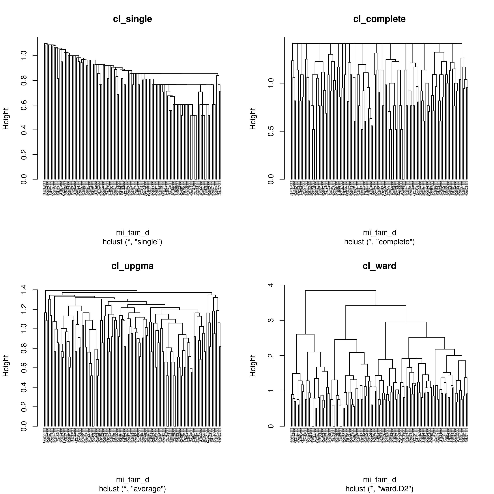<!-- -->

``` r
par(mfrow = c(1,1))
```

A continuación, calcularé la distancia y la correlación cofenéticas. Se
supone que el método con la mayor correlación cofenética explica mejor
el agrupamiento de la comunidad. Consulta el vídeo y material de
referencia. Normalmente, el método UPGMA obtiene la mayor correlación
cofenética, pero esto se debe a que su procedimiento maximiza
precisamente dicha métrica. No es recomendable conservar un único método
de agrupamiento, normalmente es bueno usar al menos dos. Ward es muchas
veces recomendado por basarse en procedimientos de cálculo muy distintos
a los de UPGMA. Consulta referencias.

``` r
map_df(lista_cl, function(x) {
        coph_d <- cophenetic(x)
        corr <- cor(mi_fam_d, coph_d)
        return(corr)
})
```

    ## # A tibble: 1 × 4
    ##   cl_single cl_complete cl_upgma cl_ward
    ##       <dbl>       <dbl>    <dbl>   <dbl>
    ## 1     0.457       0.495    0.667   0.420

Ahora, calcularé las anchuras de silueta, una métrica que ayuda a
determinar en cuántos grupos se organiza la comunidad. En el ejemplo,
dado que muchas especies de Polygonaceae están ausentes en muchos
hexágonos, es esperable que el procedimiento sugiera un número de grupos
alto denominados (ver objeto impreso `n_grupos_optimos`). Considera la
siguiente regla general: muchos grupos: el número ideal es 3 grupos, de
4 a 6 grupos es aceptable, 7 o más grupos se considera mucho y difícil
de interpretar, es un resultado poco útil; 1 grupo es un resultado sin
sentido.

``` r
# UPGMA
anch_sil_upgma <- calcular_anchuras_siluetas(
        mc_orig = mi_fam, 
        distancias = mi_fam_d, 
        cluster = lista_cl$cl_upgma)
anch_sil_upgma
```

    ## $anchuras_siluetas
    ##   [1] 0.00000000 0.08424488 0.07720487 0.06991557 0.05508665 0.04543144
    ##   [7] 0.04394416 0.06760824 0.06625549 0.04399364 0.04776482 0.06384169
    ##  [13] 0.05873414 0.06716271 0.06979485 0.07401636 0.08211264 0.07930068
    ##  [19] 0.08417016 0.08182128 0.07988402 0.08178155 0.08601712 0.08623839
    ##  [25] 0.08639599 0.09405895 0.09379274 0.09074658 0.09115030 0.08886999
    ##  [31] 0.08808297 0.08847972 0.09009970 0.08659886 0.08505266 0.08736664
    ##  [37] 0.08906003 0.08595803 0.09100461 0.09120112 0.09086065 0.09047041
    ##  [43] 0.08617262 0.08651450 0.08629244 0.08460694 0.08484432 0.08523280
    ##  [49] 0.10396650 0.10282227 0.10546489 0.10186928 0.10484984 0.10596411
    ##  [55] 0.10543799 0.10542811 0.10436901 0.10844144 0.10590319 0.10734353
    ##  [61] 0.11669617 0.11852156 0.11880817 0.11810742 0.11700839 0.11609254
    ##  [67] 0.11383529 0.11272640 0.11523537 0.11352321 0.10838490 0.10647222
    ##  [73] 0.10320766 0.10177081 0.10074869 0.10616228 0.10331960 0.10284839
    ##  [79] 0.10309037 0.10185536 0.09925772 0.09625150 0.09353173 0.09249600
    ##  [85] 0.09342250 0.09166328 0.08802664 0.08611758 0.08203674 0.08068945
    ##  [91] 0.07746417 0.08296465 0.07846474 0.07668886 0.07544073 0.07387585
    ##  [97] 0.07119687 0.06915777 0.06680908 0.06496158 0.06193514 0.06363616
    ## [103] 0.06410630 0.06257225 0.06072014 0.05944300 0.05626630 0.05506755
    ## [109] 0.05192975 0.05183782 0.05153972 0.05287595 0.05435460 0.05000688
    ## [115] 0.04667640 0.04464462 0.04261284 0.03976368 0.03881803 0.04310500
    ## [121] 0.04886918 0.04517455 0.04147991 0.04724409 0.03149606 0.01574803
    ## [127] 0.00000000
    ## 
    ## $n_grupos_optimo
    ## [1] 63

``` r
u_dend_reord <- reorder.hclust(lista_cl$cl_upgma, mi_fam_d)
plot(u_dend_reord, hang = -1)
rect.hclust(
        tree = u_dend_reord,
        k = anch_sil_upgma$n_grupos_optimo)
```

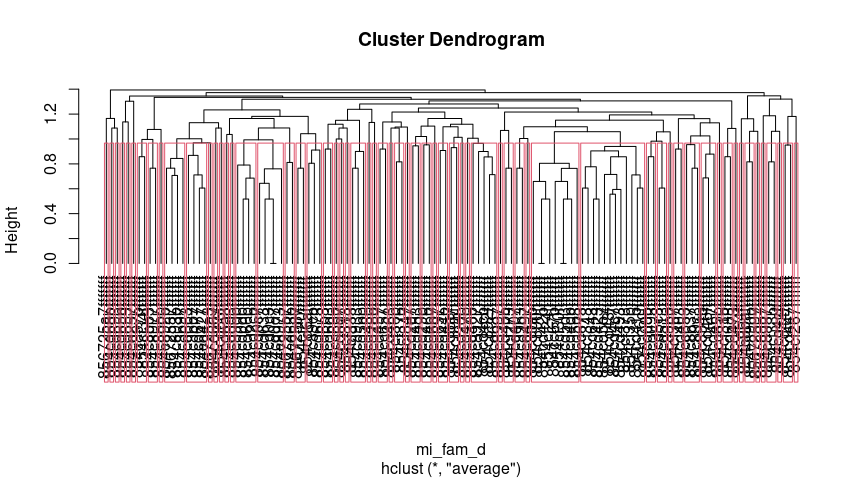<!-- -->

Método Ward.

``` r
# Ward
anch_sil_ward <- calcular_anchuras_siluetas(
        mc_orig = mi_fam, 
        distancias = mi_fam_d, 
        cluster = lista_cl$cl_ward)
anch_sil_ward
```

    ## $anchuras_siluetas
    ##   [1] 0.00000000 0.07094808 0.06117836 0.06122606 0.06056641 0.06949069
    ##   [7] 0.05570558 0.05999353 0.06427680 0.06722724 0.07310521 0.07860084
    ##  [13] 0.08305794 0.08494648 0.09058844 0.09325182 0.09963303 0.09893333
    ##  [19] 0.10182666 0.10215207 0.10500966 0.10592405 0.10803957 0.10491181
    ##  [25] 0.10647951 0.10762858 0.10846012 0.10434916 0.10715151 0.11010536
    ##  [31] 0.11164798 0.11109898 0.11181196 0.10868655 0.10879903 0.11246068
    ##  [37] 0.11630141 0.11749184 0.11794592 0.12014818 0.12086019 0.12165328
    ##  [43] 0.12329240 0.12453410 0.12563105 0.12646550 0.12563184 0.12456321
    ##  [49] 0.12612839 0.12770502 0.12815397 0.12673941 0.12763318 0.12822530
    ##  [55] 0.12800721 0.13036815 0.13055261 0.13033890 0.12882346 0.12876973
    ##  [61] 0.12842927 0.12954353 0.13128697 0.13130431 0.13117434 0.13103814
    ##  [67] 0.12972543 0.12846590 0.12686649 0.12621581 0.12296261 0.12204676
    ##  [73] 0.11978951 0.11812243 0.11707388 0.11509409 0.11489037 0.11364573
    ##  [79] 0.11190937 0.11046267 0.10842608 0.10737329 0.10637843 0.10461922
    ##  [85] 0.10554571 0.10128827 0.10166944 0.10001014 0.09700391 0.09439557
    ##  [91] 0.09075893 0.08884987 0.08507944 0.08250024 0.08062460 0.08591056
    ##  [97] 0.08466243 0.08293610 0.08137122 0.08112562 0.07868620 0.07683936
    ## [103] 0.07449068 0.07264317 0.06998567 0.06968756 0.07102380 0.06974666
    ## [109] 0.06656996 0.06841728 0.06656517 0.06536642 0.06222862 0.05904030
    ## [115] 0.05469258 0.05170126 0.04966948 0.04763770 0.05192466 0.05768884
    ## [121] 0.05674320 0.05463336 0.05093873 0.04724409 0.03149606 0.01574803
    ## [127] 0.00000000
    ## 
    ## $n_grupos_optimo
    ## [1] 64

``` r
w_dend_reord <- reorder.hclust(lista_cl$cl_ward, mi_fam_d)
plot(w_dend_reord, hang = -1)
rect.hclust(
        tree = w_dend_reord,
        k = anch_sil_ward$n_grupos_optimo)
```

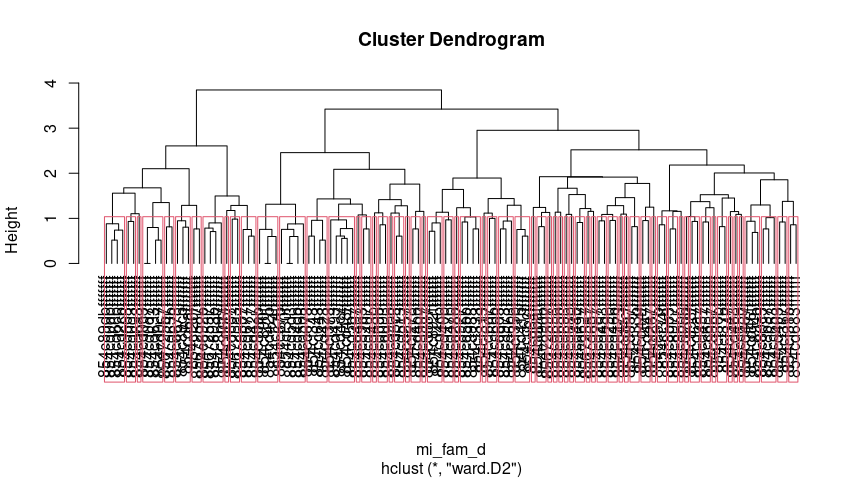<!-- -->

EXPLORA TUS RESULTADOS (usa como referencia
[practica-99-tu-manuscrito-3-resultados.md](../practica-99-tu-manuscrito-3-resultados.md)
y el vídeo correspondiente a tu caso)

``` r
# UPGMA
if(interactive()) dev.new()
cl_pvclust_upgma <-
        pvclust(t(mi_fam_t),
                method.hclust = "average",
                method.dist = "euc",
                iseed = 999, # Resultado reproducible
                parallel = TRUE)
```

    ## Creating a temporary cluster...done:
    ## socket cluster with 7 nodes on host 'localhost'
    ## Multiscale bootstrap... Done.

``` r
# Añadir los valores de p
plot(cl_pvclust_upgma, hang = -1)
# Añadir rectángulos a los grupos significativos
lines(cl_pvclust_upgma)
pvrect(cl_pvclust_upgma, alpha = 0.90, border = 4)
```

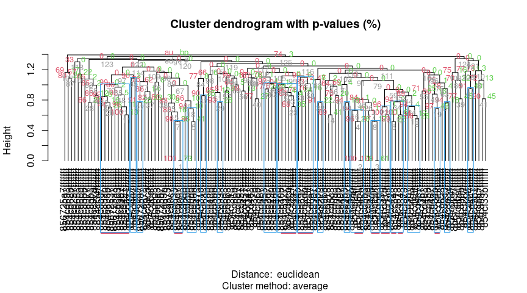<!-- -->

EXPLORA TUS RESULTADOS (usa como referencia
[practica-99-tu-manuscrito-3-resultados.md](../practica-99-tu-manuscrito-3-resultados.md)
y el vídeo correspondiente a tu caso)

``` r
# Ward
if(interactive()) dev.new()
cl_pvclust_ward <-
        pvclust(t(mi_fam_t),
                method.hclust = "ward.D2",
                method.dist = "euc",
                iseed = 999, # Resultado reproducible
                parallel = TRUE)
```

    ## Creating a temporary cluster...done:
    ## socket cluster with 7 nodes on host 'localhost'
    ## Multiscale bootstrap... Done.

``` r
# Añadir los valores de p
plot(cl_pvclust_ward, hang = -1)
# Añadir rectángulos a los grupos significativos
lines(cl_pvclust_ward)
pvrect(cl_pvclust_ward, alpha = 0.91, border = 4)
```

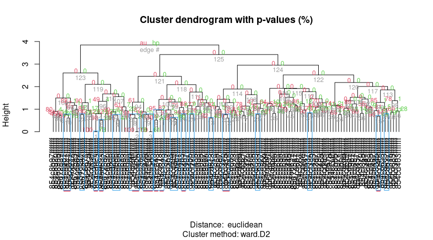<!-- -->

Generaré agrupamientos y los exportaré a archivos, para reutilizarlos
más adelante. Elegir un número de grupos no es tarea sencilla, por el
momento probaré con el número de grupos `k` del siguiente bloque de
código, el cual me permitirá caracterízar los distintos hábitats más
fácilmente en función de las variables ambientales.

``` r
k <- 3
# UPGMA
grupos_upgma <- as.factor(cutree(lista_cl$cl_upgma, k = k))
set.seed(999);sample(grupos_upgma, 10) #¿A qué grupo pertenecen 10 hexágonos seleccionados al azar?
```

    ## 854c892ffffffff 854cd43bfffffff 854cd403fffffff 854c89abfffffff 854cd41bfffffff 
    ##               1               1               1               1               1 
    ## 854cd5b7fffffff 854cd0c7fffffff 854cd5bbfffffff 854cd66ffffffff 854cf367fffffff 
    ##               1               1               1               1               1 
    ## Levels: 1 2 3

``` r
table(grupos_upgma) #¿Cuántos hexágonos hay en cada grupo? ¡¡UPGMA NO HACE MUCHO SENTIDO!!
```

    ## grupos_upgma
    ##   1   2   3 
    ## 113   3  11

``` r
plot(u_dend_reord, hang = -1)
rect.hclust(tree = u_dend_reord, k = k)
```

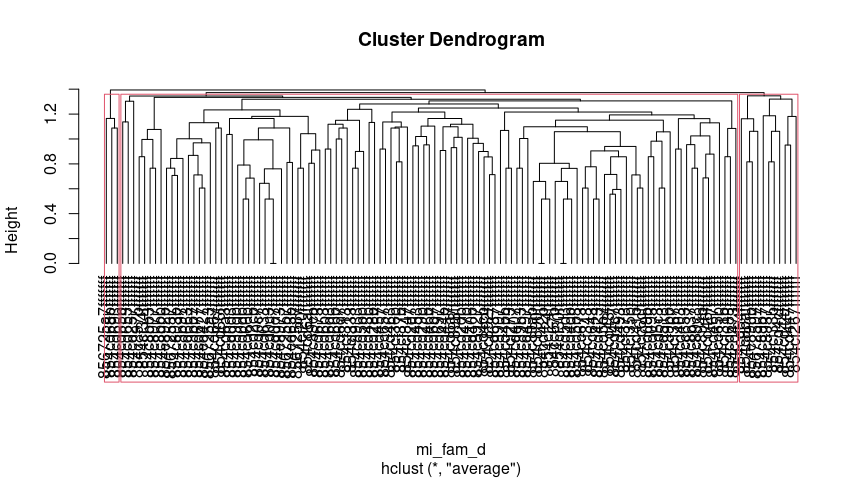<!-- -->

``` r
# Ward
grupos_ward <- as.factor(cutree(lista_cl$cl_ward, k = k))
set.seed(999);sample(grupos_ward, 10) #¿A qué grupo pertenecen 10 hexágonos seleccionados al azar?
```

    ## 854c892ffffffff 854cd43bfffffff 854cd403fffffff 854c89abfffffff 854cd41bfffffff 
    ##               2               3               2               3               2 
    ## 854cd5b7fffffff 854cd0c7fffffff 854cd5bbfffffff 854cd66ffffffff 854cf367fffffff 
    ##               3               1               2               1               2 
    ## Levels: 1 2 3

``` r
table(grupos_ward) #¿Cuántos hexágonos hay en cada grupo?
```

    ## grupos_ward
    ##  1  2  3 
    ## 28 68 31

``` r
plot(w_dend_reord, hang = -1)
rect.hclust(tree = w_dend_reord, k = k)
```

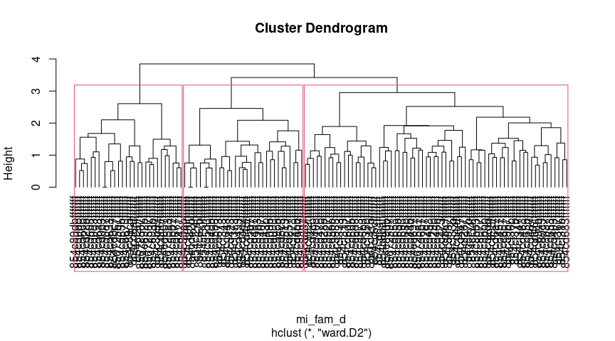<!-- -->

``` r
# Guardaré estos vectores en archivos para reutilizarlos en *scripts* posteriores: 
saveRDS(grupos_upgma, 'grupos_upgma_bromeliaceae.RDS')
saveRDS(grupos_ward, 'grupos_ward_bromeliaceae.RDS')
```

### Grupos (clústers), variables ambientales y mapas

> No olvides ejecutar la parte de código común y reutilizable situada
> arriba. Esta subsección necesita de objetos creados en líneas de
> código previas.

Apliquemos el análisis de agrupamiento a la matriz ambiental. La clave
en este punto es que, si la matriz ambiental presenta patrones parecidos
a los de la matriz de comunidad, significa que el agrupamiento utilizado
hace sentido entre ambos conjuntos de datos (comunidad y hábitat) de
forma consistente. Si ambos conjuntos de datos son consistentes,
significa que existe algún grado de asociación.

Cargar paquetes necesarios para esta subsección.

``` r
library(RColorBrewer)
library(leaflet)
library(leaflet.extras)
```

Agrupar los hexágonos de la matriz ambiental.

``` r
(m_amb_upgma <- env %>%
   rownames_to_column('hex_id') %>% 
   mutate(grupos_upgma) %>%
   pivot_longer(-c(grupos_upgma, hex_id), names_to = "variable", values_to = "valor") %>% 
   inner_join(za %>% select(hex_id)))
```

    ## # A tibble: 17,272 × 5
    ##    hex_id          grupos_upgma variable         valor                  geometry
    ##    <chr>           <fct>        <chr>            <dbl>             <POLYGON [°]>
    ##  1 854cd427fffffff 1            ESA Trees      2.21e+1 ((-69.8767 18.59171, -69…
    ##  2 854cd427fffffff 1            ESA Shrubland  6.95e-3 ((-69.8767 18.59171, -69…
    ##  3 854cd427fffffff 1            ESA Grassland  1.90e+1 ((-69.8767 18.59171, -69…
    ##  4 854cd427fffffff 1            ESA Cropland   1.06e-1 ((-69.8767 18.59171, -69…
    ##  5 854cd427fffffff 1            ESA Built-up   5.25e+1 ((-69.8767 18.59171, -69…
    ##  6 854cd427fffffff 1            ESA Barren / … 4.67e-1 ((-69.8767 18.59171, -69…
    ##  7 854cd427fffffff 1            ESA Open water 5.02e+0 ((-69.8767 18.59171, -69…
    ##  8 854cd427fffffff 1            ESA Herbaceou… 8.78e-1 ((-69.8767 18.59171, -69…
    ##  9 854cd427fffffff 1            ESA Mangroves  0       ((-69.8767 18.59171, -69…
    ## 10 854cd427fffffff 1            CGL Closed fo… 0       ((-69.8767 18.59171, -69…
    ## # … with 17,262 more rows

``` r
(m_amb_ward <- env %>%
    rownames_to_column('hex_id') %>% 
    mutate(grupos_ward) %>%
    pivot_longer(-c(grupos_ward, hex_id), names_to = "variable", values_to = "valor") %>% 
    inner_join(za %>% select(hex_id)))
```

    ## # A tibble: 17,272 × 5
    ##    hex_id          grupos_ward variable          valor                  geometry
    ##    <chr>           <fct>       <chr>             <dbl>             <POLYGON [°]>
    ##  1 854cd427fffffff 1           ESA Trees       2.21e+1 ((-69.8767 18.59171, -69…
    ##  2 854cd427fffffff 1           ESA Shrubland   6.95e-3 ((-69.8767 18.59171, -69…
    ##  3 854cd427fffffff 1           ESA Grassland   1.90e+1 ((-69.8767 18.59171, -69…
    ##  4 854cd427fffffff 1           ESA Cropland    1.06e-1 ((-69.8767 18.59171, -69…
    ##  5 854cd427fffffff 1           ESA Built-up    5.25e+1 ((-69.8767 18.59171, -69…
    ##  6 854cd427fffffff 1           ESA Barren / s… 4.67e-1 ((-69.8767 18.59171, -69…
    ##  7 854cd427fffffff 1           ESA Open water  5.02e+0 ((-69.8767 18.59171, -69…
    ##  8 854cd427fffffff 1           ESA Herbaceous… 8.78e-1 ((-69.8767 18.59171, -69…
    ##  9 854cd427fffffff 1           ESA Mangroves   0       ((-69.8767 18.59171, -69…
    ## 10 854cd427fffffff 1           CGL Closed for… 0       ((-69.8767 18.59171, -69…
    ## # … with 17,262 more rows

Evaluar efectos entre los grupos (“diferencias significativas”) de los
agrupamientos UPGMA y Ward. Al tratarse de 6 grupos, se utilizan las
pruebas estadísticas ANOVA (evalúa homongeneidad de medias) y
Kruskal-Wallis (evalúa homogeneidad de medianas). Las tablas están
ordenadas en orden ascendente por la columna `p_valor_a`, que son los
p-valores de la prueba ANOVA.

``` r
# UPGMA
m_amb_upgma_ak <- m_amb_upgma %>%
  group_by(variable) %>%
  summarise(
    p_valor_a = tryCatch(oneway.test(valor ~ grupos_upgma)$p.value, error = function(e) NA),
    p_valor_k = tryCatch(kruskal.test(valor ~ grupos_upgma)$p.value, error = function(e) NA)
    ) %>%
  arrange(p_valor_a)
m_amb_upgma_ak %>%
  kable(booktabs=T) %>%
  kable_styling(latex_options = c("HOLD_position", "scale_down")) %>%
  gsub(' NA ', '', .)
```

<table class="table" style="margin-left: auto; margin-right: auto;">
<thead>
<tr>
<th style="text-align:left;">
variable
</th>
<th style="text-align:right;">
p_valor_a
</th>
<th style="text-align:right;">
p_valor_k
</th>
</tr>
</thead>
<tbody>
<tr>
<td style="text-align:left;">
GSL Lower slope (flat)
</td>
<td style="text-align:right;">
0.0000002
</td>
<td style="text-align:right;">
0.0964750
</td>
</tr>
<tr>
<td style="text-align:left;">
G90-GEOM shoulder
</td>
<td style="text-align:right;">
0.0000002
</td>
<td style="text-align:right;">
0.0672739
</td>
</tr>
<tr>
<td style="text-align:left;">
G90-GEOM flat
</td>
<td style="text-align:right;">
0.0000010
</td>
<td style="text-align:right;">
0.1513802
</td>
</tr>
<tr>
<td style="text-align:left;">
OSM-DIST mean
</td>
<td style="text-align:right;">
0.0000011
</td>
<td style="text-align:right;">
0.1159977
</td>
</tr>
<tr>
<td style="text-align:left;">
CGL Herbaceous vegetation
</td>
<td style="text-align:right;">
0.0000019
</td>
<td style="text-align:right;">
0.0933485
</td>
</tr>
<tr>
<td style="text-align:left;">
CGL Cultivated and managed vegetation / agriculture
</td>
<td style="text-align:right;">
0.0000112
</td>
<td style="text-align:right;">
0.0856881
</td>
</tr>
<tr>
<td style="text-align:left;">
G90-GEOM footslope
</td>
<td style="text-align:right;">
0.0000114
</td>
<td style="text-align:right;">
0.0359496
</td>
</tr>
<tr>
<td style="text-align:left;">
CH-BIO bio03 isothermality
</td>
<td style="text-align:right;">
0.0000193
</td>
<td style="text-align:right;">
0.0383432
</td>
</tr>
<tr>
<td style="text-align:left;">
CGL Shrubs
</td>
<td style="text-align:right;">
0.0000195
</td>
<td style="text-align:right;">
0.2590853
</td>
</tr>
<tr>
<td style="text-align:left;">
ESA Open water
</td>
<td style="text-align:right;">
0.0002034
</td>
<td style="text-align:right;">
0.1358927
</td>
</tr>
<tr>
<td style="text-align:left;">
GFC-LOSS year 2014
</td>
<td style="text-align:right;">
0.0003419
</td>
<td style="text-align:right;">
0.0210041
</td>
</tr>
<tr>
<td style="text-align:left;">
ESA Built-up
</td>
<td style="text-align:right;">
0.0008880
</td>
<td style="text-align:right;">
0.0419993
</td>
</tr>
<tr>
<td style="text-align:left;">
ESA Barren / sparse vegetation
</td>
<td style="text-align:right;">
0.0020112
</td>
<td style="text-align:right;">
0.1006193
</td>
</tr>
<tr>
<td style="text-align:left;">
CGL Urban / built up
</td>
<td style="text-align:right;">
0.0023655
</td>
<td style="text-align:right;">
0.0502654
</td>
</tr>
<tr>
<td style="text-align:left;">
ESA Cropland
</td>
<td style="text-align:right;">
0.0039842
</td>
<td style="text-align:right;">
0.3499838
</td>
</tr>
<tr>
<td style="text-align:left;">
GP-CONSUNadj YEAR 2020 sum
</td>
<td style="text-align:right;">
0.0042334
</td>
<td style="text-align:right;">
0.0084859
</td>
</tr>
<tr>
<td style="text-align:left;">
GFC-LOSS year 2021
</td>
<td style="text-align:right;">
0.0061350
</td>
<td style="text-align:right;">
0.0260515
</td>
</tr>
<tr>
<td style="text-align:left;">
GFC-LOSS year 2006
</td>
<td style="text-align:right;">
0.0065851
</td>
<td style="text-align:right;">
0.0247514
</td>
</tr>
<tr>
<td style="text-align:left;">
GFC-LOSS year 2007
</td>
<td style="text-align:right;">
0.0068362
</td>
<td style="text-align:right;">
0.0071461
</td>
</tr>
<tr>
<td style="text-align:left;">
WCL bio02 Mean diurnal range mean of monthly max temp - min temp
</td>
<td style="text-align:right;">
0.0156602
</td>
<td style="text-align:right;">
0.0980160
</td>
</tr>
<tr>
<td style="text-align:left;">
G90 Compound Topographic Index
</td>
<td style="text-align:right;">
0.0214786
</td>
<td style="text-align:right;">
0.0447711
</td>
</tr>
<tr>
<td style="text-align:left;">
WCL bio07 Temperature annual range bio05-bio06
</td>
<td style="text-align:right;">
0.0263309
</td>
<td style="text-align:right;">
0.0391758
</td>
</tr>
<tr>
<td style="text-align:left;">
G90-GEOM spur
</td>
<td style="text-align:right;">
0.0310845
</td>
<td style="text-align:right;">
0.1053242
</td>
</tr>
<tr>
<td style="text-align:left;">
CH-BIO bio15 precipitation seasonality
</td>
<td style="text-align:right;">
0.0336646
</td>
<td style="text-align:right;">
0.2274968
</td>
</tr>
<tr>
<td style="text-align:left;">
CH-BIO bio02 mean diurnal air temperature range
</td>
<td style="text-align:right;">
0.0424766
</td>
<td style="text-align:right;">
0.0546465
</td>
</tr>
<tr>
<td style="text-align:left;">
WCL bio15 Precipitation seasonality
</td>
<td style="text-align:right;">
0.0655926
</td>
<td style="text-align:right;">
0.1518435
</td>
</tr>
<tr>
<td style="text-align:left;">
CGL Herbaceous wetland
</td>
<td style="text-align:right;">
0.0656002
</td>
<td style="text-align:right;">
0.9313626
</td>
</tr>
<tr>
<td style="text-align:left;">
GSL Valley (narrow)
</td>
<td style="text-align:right;">
0.0661306
</td>
<td style="text-align:right;">
0.6447879
</td>
</tr>
<tr>
<td style="text-align:left;">
G90-GEOM hollow
</td>
<td style="text-align:right;">
0.0690618
</td>
<td style="text-align:right;">
0.1421757
</td>
</tr>
<tr>
<td style="text-align:left;">
GFC-LOSS year 2011
</td>
<td style="text-align:right;">
0.0699786
</td>
<td style="text-align:right;">
0.1598847
</td>
</tr>
<tr>
<td style="text-align:left;">
WCL bio06 Min temperature of coldest month
</td>
<td style="text-align:right;">
0.0746328
</td>
<td style="text-align:right;">
0.0143330
</td>
</tr>
<tr>
<td style="text-align:left;">
CH-BIO bio06 mean daily minimum air temperature of the coldest month
</td>
<td style="text-align:right;">
0.0776587
</td>
<td style="text-align:right;">
0.0092075
</td>
</tr>
<tr>
<td style="text-align:left;">
GFC-LOSS year 2008
</td>
<td style="text-align:right;">
0.0855032
</td>
<td style="text-align:right;">
0.0455797
</td>
</tr>
<tr>
<td style="text-align:left;">
CH-BIO bio07 annual range of air temperature
</td>
<td style="text-align:right;">
0.0931214
</td>
<td style="text-align:right;">
0.0571726
</td>
</tr>
<tr>
<td style="text-align:left;">
CGIAR-ELE mean
</td>
<td style="text-align:right;">
0.1005067
</td>
<td style="text-align:right;">
0.0106119
</td>
</tr>
<tr>
<td style="text-align:left;">
G90 Slope
</td>
<td style="text-align:right;">
0.1028101
</td>
<td style="text-align:right;">
0.0387475
</td>
</tr>
<tr>
<td style="text-align:left;">
G90 Terrain Ruggedness Index
</td>
<td style="text-align:right;">
0.1051842
</td>
<td style="text-align:right;">
0.0381037
</td>
</tr>
<tr>
<td style="text-align:left;">
GSL Upper slope (warm)
</td>
<td style="text-align:right;">
0.1059736
</td>
<td style="text-align:right;">
0.0692803
</td>
</tr>
<tr>
<td style="text-align:left;">
CH-BIO bio04 temperature seasonality
</td>
<td style="text-align:right;">
0.1062266
</td>
<td style="text-align:right;">
0.0540096
</td>
</tr>
<tr>
<td style="text-align:left;">
G90 Roughness
</td>
<td style="text-align:right;">
0.1142843
</td>
<td style="text-align:right;">
0.0393197
</td>
</tr>
<tr>
<td style="text-align:left;">
GFC-LOSS year 2013
</td>
<td style="text-align:right;">
0.1152491
</td>
<td style="text-align:right;">
0.2727224
</td>
</tr>
<tr>
<td style="text-align:left;">
GFC-LOSS year 2010
</td>
<td style="text-align:right;">
0.1156893
</td>
<td style="text-align:right;">
0.2206126
</td>
</tr>
<tr>
<td style="text-align:left;">
WCL bio09 Mean temperature of driest quarter
</td>
<td style="text-align:right;">
0.1201531
</td>
<td style="text-align:right;">
0.0179627
</td>
</tr>
<tr>
<td style="text-align:left;">
GHH variance_1km
</td>
<td style="text-align:right;">
0.1218670
</td>
<td style="text-align:right;">
0.1680561
</td>
</tr>
<tr>
<td style="text-align:left;">
CH-BIO bio08 mean daily mean air temperatures of the wettest quarter
</td>
<td style="text-align:right;">
0.1274229
</td>
<td style="text-align:right;">
0.0184880
</td>
</tr>
<tr>
<td style="text-align:left;">
WCL bio11 Mean temperature of coldest quarter
</td>
<td style="text-align:right;">
0.1276535
</td>
<td style="text-align:right;">
0.0175069
</td>
</tr>
<tr>
<td style="text-align:left;">
CH-BIO bio10 mean daily mean air temperatures of the warmest quarter
</td>
<td style="text-align:right;">
0.1304441
</td>
<td style="text-align:right;">
0.0259526
</td>
</tr>
<tr>
<td style="text-align:left;">
WCL bio01 Annual mean temperature
</td>
<td style="text-align:right;">
0.1382501
</td>
<td style="text-align:right;">
0.0216614
</td>
</tr>
<tr>
<td style="text-align:left;">
WCL bio10 Mean temperature of warmest quarter
</td>
<td style="text-align:right;">
0.1383264
</td>
<td style="text-align:right;">
0.0262310
</td>
</tr>
<tr>
<td style="text-align:left;">
CH-BIO bio01 mean annual air temperature
</td>
<td style="text-align:right;">
0.1386013
</td>
<td style="text-align:right;">
0.0217734
</td>
</tr>
<tr>
<td style="text-align:left;">
GHH contrast_1km
</td>
<td style="text-align:right;">
0.1395666
</td>
<td style="text-align:right;">
0.1370372
</td>
</tr>
<tr>
<td style="text-align:left;">
CH-BIO bio09 mean daily mean air temperatures of the driest quarter
</td>
<td style="text-align:right;">
0.1411815
</td>
<td style="text-align:right;">
0.0309225
</td>
</tr>
<tr>
<td style="text-align:left;">
CH-BIO bio11 mean daily mean air temperatures of the coldest quarter
</td>
<td style="text-align:right;">
0.1442244
</td>
<td style="text-align:right;">
0.0223467
</td>
</tr>
<tr>
<td style="text-align:left;">
WCL bio08 Mean temperature of wettest quarter
</td>
<td style="text-align:right;">
0.1460817
</td>
<td style="text-align:right;">
0.0191799
</td>
</tr>
<tr>
<td style="text-align:left;">
G90 Vector Ruggedness Measure
</td>
<td style="text-align:right;">
0.1500455
</td>
<td style="text-align:right;">
0.0297564
</td>
</tr>
<tr>
<td style="text-align:left;">
GSL Valley
</td>
<td style="text-align:right;">
0.1517997
</td>
<td style="text-align:right;">
0.0967435
</td>
</tr>
<tr>
<td style="text-align:left;">
GHH mean_1km
</td>
<td style="text-align:right;">
0.1552710
</td>
<td style="text-align:right;">
0.1005779
</td>
</tr>
<tr>
<td style="text-align:left;">
G90-GEOM slope
</td>
<td style="text-align:right;">
0.1588663
</td>
<td style="text-align:right;">
0.1977270
</td>
</tr>
<tr>
<td style="text-align:left;">
GHH correlation_1km
</td>
<td style="text-align:right;">
0.1604103
</td>
<td style="text-align:right;">
0.0701090
</td>
</tr>
<tr>
<td style="text-align:left;">
GFC-LOSS year 2019
</td>
<td style="text-align:right;">
0.1614776
</td>
<td style="text-align:right;">
0.1578823
</td>
</tr>
<tr>
<td style="text-align:left;">
GFC-LOSS year 2016
</td>
<td style="text-align:right;">
0.1647185
</td>
<td style="text-align:right;">
0.0274882
</td>
</tr>
<tr>
<td style="text-align:left;">
GFC-LOSS year 2012
</td>
<td style="text-align:right;">
0.1705751
</td>
<td style="text-align:right;">
0.1580843
</td>
</tr>
<tr>
<td style="text-align:left;">
CH-BIO bio19 mean monthly precipitation amount of the coldest quarter
</td>
<td style="text-align:right;">
0.1812284
</td>
<td style="text-align:right;">
0.1769961
</td>
</tr>
<tr>
<td style="text-align:left;">
CH-BIO bio05 mean daily maximum air temperature of the warmest month
</td>
<td style="text-align:right;">
0.1893490
</td>
<td style="text-align:right;">
0.0566270
</td>
</tr>
<tr>
<td style="text-align:left;">
GFC-PTC YEAR 2000 mean
</td>
<td style="text-align:right;">
0.1934087
</td>
<td style="text-align:right;">
0.1167079
</td>
</tr>
<tr>
<td style="text-align:left;">
WCL bio05 Max temperature of warmest month
</td>
<td style="text-align:right;">
0.2001370
</td>
<td style="text-align:right;">
0.0464592
</td>
</tr>
<tr>
<td style="text-align:left;">
GFC-LOSS year 2005
</td>
<td style="text-align:right;">
0.2025319
</td>
<td style="text-align:right;">
0.1338215
</td>
</tr>
<tr>
<td style="text-align:left;">
ESA Trees
</td>
<td style="text-align:right;">
0.2041926
</td>
<td style="text-align:right;">
0.1595725
</td>
</tr>
<tr>
<td style="text-align:left;">
G90-GEOM valley
</td>
<td style="text-align:right;">
0.2192208
</td>
<td style="text-align:right;">
0.3048339
</td>
</tr>
<tr>
<td style="text-align:left;">
GSL Lower slope (warm)
</td>
<td style="text-align:right;">
0.2210181
</td>
<td style="text-align:right;">
0.9867642
</td>
</tr>
<tr>
<td style="text-align:left;">
GSL Lower slope
</td>
<td style="text-align:right;">
0.2242757
</td>
<td style="text-align:right;">
0.0099204
</td>
</tr>
<tr>
<td style="text-align:left;">
CH-BIO bio14 precipitation amount of the driest month
</td>
<td style="text-align:right;">
0.2323164
</td>
<td style="text-align:right;">
0.1390817
</td>
</tr>
<tr>
<td style="text-align:left;">
WCL bio04 Temperature seasonality Standard deviation times 100
</td>
<td style="text-align:right;">
0.2378231
</td>
<td style="text-align:right;">
0.1459120
</td>
</tr>
<tr>
<td style="text-align:left;">
CH-BIO bio17 mean monthly precipitation amount of the driest quarter
</td>
<td style="text-align:right;">
0.2539064
</td>
<td style="text-align:right;">
0.1535104
</td>
</tr>
<tr>
<td style="text-align:left;">
WCL bio19 Precipitation of coldest quarter
</td>
<td style="text-align:right;">
0.2637612
</td>
<td style="text-align:right;">
0.4489274
</td>
</tr>
<tr>
<td style="text-align:left;">
G90-GEOM ridge
</td>
<td style="text-align:right;">
0.2791147
</td>
<td style="text-align:right;">
0.3506864
</td>
</tr>
<tr>
<td style="text-align:left;">
CGL Closed forest, not matching any of the other definitions
</td>
<td style="text-align:right;">
0.2876933
</td>
<td style="text-align:right;">
0.0377077
</td>
</tr>
<tr>
<td style="text-align:left;">
CH-BIO bio13 precipitation amount of the wettest month
</td>
<td style="text-align:right;">
0.2890661
</td>
<td style="text-align:right;">
0.1706669
</td>
</tr>
<tr>
<td style="text-align:left;">
GHH standard_deviation_1km
</td>
<td style="text-align:right;">
0.3017407
</td>
<td style="text-align:right;">
0.2289403
</td>
</tr>
<tr>
<td style="text-align:left;">
GFC-LOSS year 2018
</td>
<td style="text-align:right;">
0.3023863
</td>
<td style="text-align:right;">
0.1885011
</td>
</tr>
<tr>
<td style="text-align:left;">
ESA Shrubland
</td>
<td style="text-align:right;">
0.3081312
</td>
<td style="text-align:right;">
0.4031921
</td>
</tr>
<tr>
<td style="text-align:left;">
CGL Closed forest, evergreen needle leaf
</td>
<td style="text-align:right;">
0.3113237
</td>
<td style="text-align:right;">
0.0005014
</td>
</tr>
<tr>
<td style="text-align:left;">
G90-GEOM pit
</td>
<td style="text-align:right;">
0.3135781
</td>
<td style="text-align:right;">
0.5113149
</td>
</tr>
<tr>
<td style="text-align:left;">
GHH dissimilarity_1km
</td>
<td style="text-align:right;">
0.3146812
</td>
<td style="text-align:right;">
0.2210886
</td>
</tr>
<tr>
<td style="text-align:left;">
GSL Upper slope
</td>
<td style="text-align:right;">
0.3211614
</td>
<td style="text-align:right;">
0.0298913
</td>
</tr>
<tr>
<td style="text-align:left;">
GFC-LOSS year 2017
</td>
<td style="text-align:right;">
0.3224370
</td>
<td style="text-align:right;">
0.2050954
</td>
</tr>
<tr>
<td style="text-align:left;">
GHH range_1km
</td>
<td style="text-align:right;">
0.3261527
</td>
<td style="text-align:right;">
0.2558825
</td>
</tr>
<tr>
<td style="text-align:left;">
WCL bio17 Precipitation of driest quarter
</td>
<td style="text-align:right;">
0.3308727
</td>
<td style="text-align:right;">
0.4656126
</td>
</tr>
<tr>
<td style="text-align:left;">
GFC-LOSS year 2015
</td>
<td style="text-align:right;">
0.3327565
</td>
<td style="text-align:right;">
0.3794157
</td>
</tr>
<tr>
<td style="text-align:left;">
WCL bio13 Precipitation of wettest month
</td>
<td style="text-align:right;">
0.3575104
</td>
<td style="text-align:right;">
0.2493868
</td>
</tr>
<tr>
<td style="text-align:left;">
CGL Open forest, mixed
</td>
<td style="text-align:right;">
0.3954428
</td>
<td style="text-align:right;">
0.0907325
</td>
</tr>
<tr>
<td style="text-align:left;">
G90 Stream Power Index
</td>
<td style="text-align:right;">
0.4063733
</td>
<td style="text-align:right;">
0.8007328
</td>
</tr>
<tr>
<td style="text-align:left;">
WCL bio14 Precipitation of driest month
</td>
<td style="text-align:right;">
0.4149083
</td>
<td style="text-align:right;">
0.5604575
</td>
</tr>
<tr>
<td style="text-align:left;">
CH-BIO bio12 annual precipitation amount
</td>
<td style="text-align:right;">
0.4522371
</td>
<td style="text-align:right;">
0.2572174
</td>
</tr>
<tr>
<td style="text-align:left;">
GFC-LOSS year 2020
</td>
<td style="text-align:right;">
0.4535170
</td>
<td style="text-align:right;">
0.8605802
</td>
</tr>
<tr>
<td style="text-align:left;">
GFC-LOSS year 2004
</td>
<td style="text-align:right;">
0.4785483
</td>
<td style="text-align:right;">
0.5675903
</td>
</tr>
<tr>
<td style="text-align:left;">
GFC-LOSS year 2009
</td>
<td style="text-align:right;">
0.5160599
</td>
<td style="text-align:right;">
0.4380277
</td>
</tr>
<tr>
<td style="text-align:left;">
CGL Closed forest, mixed
</td>
<td style="text-align:right;">
0.5274149
</td>
<td style="text-align:right;">
0.0191264
</td>
</tr>
<tr>
<td style="text-align:left;">
GHH homogeneity_1km
</td>
<td style="text-align:right;">
0.5292119
</td>
<td style="text-align:right;">
0.3777222
</td>
</tr>
<tr>
<td style="text-align:left;">
GFC-LOSS year 2001
</td>
<td style="text-align:right;">
0.5489538
</td>
<td style="text-align:right;">
0.6787426
</td>
</tr>
<tr>
<td style="text-align:left;">
GHH maximum_1km
</td>
<td style="text-align:right;">
0.6032800
</td>
<td style="text-align:right;">
0.6003404
</td>
</tr>
<tr>
<td style="text-align:left;">
CH-BIO bio16 mean monthly precipitation amount of the wettest quarter
</td>
<td style="text-align:right;">
0.6055984
</td>
<td style="text-align:right;">
0.4569513
</td>
</tr>
<tr>
<td style="text-align:left;">
GHH uniformity_1km
</td>
<td style="text-align:right;">
0.6056874
</td>
<td style="text-align:right;">
0.5413463
</td>
</tr>
<tr>
<td style="text-align:left;">
GHH shannon_1km
</td>
<td style="text-align:right;">
0.6117490
</td>
<td style="text-align:right;">
0.4281269
</td>
</tr>
<tr>
<td style="text-align:left;">
G90-GEOM peak
</td>
<td style="text-align:right;">
0.6264574
</td>
<td style="text-align:right;">
0.4628202
</td>
</tr>
<tr>
<td style="text-align:left;">
GHH simpson_1km
</td>
<td style="text-align:right;">
0.6276476
</td>
<td style="text-align:right;">
0.4631039
</td>
</tr>
<tr>
<td style="text-align:left;">
GHH entropy_1km
</td>
<td style="text-align:right;">
0.6348125
</td>
<td style="text-align:right;">
0.5399116
</td>
</tr>
<tr>
<td style="text-align:left;">
GSL Cliff
</td>
<td style="text-align:right;">
0.6406250
</td>
<td style="text-align:right;">
0.8371724
</td>
</tr>
<tr>
<td style="text-align:left;">
G90 Topographic Position Index
</td>
<td style="text-align:right;">
0.6489171
</td>
<td style="text-align:right;">
0.5204498
</td>
</tr>
<tr>
<td style="text-align:left;">
CGL Closed forest, evergreen broad leaf
</td>
<td style="text-align:right;">
0.6503336
</td>
<td style="text-align:right;">
0.5355861
</td>
</tr>
<tr>
<td style="text-align:left;">
GHH pielou_1km
</td>
<td style="text-align:right;">
0.6850605
</td>
<td style="text-align:right;">
0.5570853
</td>
</tr>
<tr>
<td style="text-align:left;">
CGL Open forest, deciduous broad leaf
</td>
<td style="text-align:right;">
0.6872002
</td>
<td style="text-align:right;">
0.5887540
</td>
</tr>
<tr>
<td style="text-align:left;">
GSL Mountain/divide
</td>
<td style="text-align:right;">
0.7000934
</td>
<td style="text-align:right;">
0.4065006
</td>
</tr>
<tr>
<td style="text-align:left;">
WCL bio18 Precipitation of warmest quarter
</td>
<td style="text-align:right;">
0.7038528
</td>
<td style="text-align:right;">
0.7238686
</td>
</tr>
<tr>
<td style="text-align:left;">
GSL Peak/ridge (warm)
</td>
<td style="text-align:right;">
0.7115318
</td>
<td style="text-align:right;">
0.6329395
</td>
</tr>
<tr>
<td style="text-align:left;">
WCL bio03 Isothermality bio02 div/bio07
</td>
<td style="text-align:right;">
0.7224488
</td>
<td style="text-align:right;">
0.6785717
</td>
</tr>
<tr>
<td style="text-align:left;">
GHH coefficient_of_variation_1km
</td>
<td style="text-align:right;">
0.7566600
</td>
<td style="text-align:right;">
0.7225114
</td>
</tr>
<tr>
<td style="text-align:left;">
CGL Open forest, not matching any of the other definitions
</td>
<td style="text-align:right;">
0.7763452
</td>
<td style="text-align:right;">
0.7159412
</td>
</tr>
<tr>
<td style="text-align:left;">
WCL bio16 Precipitation of wettest quarter
</td>
<td style="text-align:right;">
0.7816043
</td>
<td style="text-align:right;">
0.6762214
</td>
</tr>
<tr>
<td style="text-align:left;">
CGL Closed forest, deciduous broad leaf
</td>
<td style="text-align:right;">
0.7934929
</td>
<td style="text-align:right;">
0.7136055
</td>
</tr>
<tr>
<td style="text-align:left;">
WCL bio12 Annual precipitation
</td>
<td style="text-align:right;">
0.8296169
</td>
<td style="text-align:right;">
0.7435413
</td>
</tr>
<tr>
<td style="text-align:left;">
GFC-LOSS year 2002
</td>
<td style="text-align:right;">
0.8433107
</td>
<td style="text-align:right;">
0.5510120
</td>
</tr>
<tr>
<td style="text-align:left;">
CH-BIO bio18 mean monthly precipitation amount of the warmest quarter
</td>
<td style="text-align:right;">
0.8573216
</td>
<td style="text-align:right;">
0.7685374
</td>
</tr>
<tr>
<td style="text-align:left;">
CGL Open forest, evergreen broad leaf
</td>
<td style="text-align:right;">
0.8727575
</td>
<td style="text-align:right;">
0.7736149
</td>
</tr>
<tr>
<td style="text-align:left;">
ESA Grassland
</td>
<td style="text-align:right;">
0.8791821
</td>
<td style="text-align:right;">
0.7654003
</td>
</tr>
<tr>
<td style="text-align:left;">
GSL Peak/ridge
</td>
<td style="text-align:right;">
0.9648620
</td>
<td style="text-align:right;">
0.9106660
</td>
</tr>
<tr>
<td style="text-align:left;">
GFC-LOSS year 2003
</td>
<td style="text-align:right;">
0.9718063
</td>
<td style="text-align:right;">
0.7820798
</td>
</tr>
<tr>
<td style="text-align:left;">
CGL Bare / sparse vegetation
</td>
<td style="text-align:right;">
NaN
</td>
<td style="text-align:right;">
0.8654760
</td>
</tr>
<tr>
<td style="text-align:left;">
CGL Oceans, seas
</td>
<td style="text-align:right;">
NaN
</td>
<td style="text-align:right;">
0.3129234
</td>
</tr>
<tr>
<td style="text-align:left;">
CGL Open forest, evergreen needle leaf
</td>
<td style="text-align:right;">
NaN
</td>
<td style="text-align:right;">
0.0051296
</td>
</tr>
<tr>
<td style="text-align:left;">
CGL Permanent water bodies
</td>
<td style="text-align:right;">
NaN
</td>
<td style="text-align:right;">
0.3204955
</td>
</tr>
<tr>
<td style="text-align:left;">
ESA Herbaceous wetland
</td>
<td style="text-align:right;">
NaN
</td>
<td style="text-align:right;">
0.1967409
</td>
</tr>
<tr>
<td style="text-align:left;">
ESA Mangroves
</td>
<td style="text-align:right;">
NaN
</td>
<td style="text-align:right;">
0.6747469
</td>
</tr>
<tr>
<td style="text-align:left;">
GSL Lower slope (cool)
</td>
<td style="text-align:right;">
NaN
</td>
<td style="text-align:right;">
0.0017129
</td>
</tr>
<tr>
<td style="text-align:left;">
GSL Upper slope (cool)
</td>
<td style="text-align:right;">
NaN
</td>
<td style="text-align:right;">
0.0099652
</td>
</tr>
<tr>
<td style="text-align:left;">
GSL Upper slope (flat)
</td>
<td style="text-align:right;">
NaN
</td>
<td style="text-align:right;">
0.0379810
</td>
</tr>
</tbody>
</table>

``` r
# Ward
m_amb_ward_ak <- m_amb_ward %>%
  group_by(variable) %>%
  summarise(
    p_valor_a = tryCatch(oneway.test(valor ~ grupos_ward)$p.value, error = function(e) NA),
    p_valor_k = tryCatch(kruskal.test(valor ~ grupos_ward)$p.value, error = function(e) NA)
    ) %>%
  arrange(p_valor_a)
m_amb_ward_ak %>%
  kable(booktabs=T) %>%
  kable_styling(latex_options = c("HOLD_position", "scale_down")) %>%
  gsub(' NA ', '', .)
```

<table class="table" style="margin-left: auto; margin-right: auto;">
<thead>
<tr>
<th style="text-align:left;">
variable
</th>
<th style="text-align:right;">
p_valor_a
</th>
<th style="text-align:right;">
p_valor_k
</th>
</tr>
</thead>
<tbody>
<tr>
<td style="text-align:left;">
GHH mean_1km
</td>
<td style="text-align:right;">
0.0000000
</td>
<td style="text-align:right;">
0.0000000
</td>
</tr>
<tr>
<td style="text-align:left;">
CGIAR-ELE mean
</td>
<td style="text-align:right;">
0.0000000
</td>
<td style="text-align:right;">
0.0000000
</td>
</tr>
<tr>
<td style="text-align:left;">
WCL bio06 Min temperature of coldest month
</td>
<td style="text-align:right;">
0.0000000
</td>
<td style="text-align:right;">
0.0000002
</td>
</tr>
<tr>
<td style="text-align:left;">
WCL bio09 Mean temperature of driest quarter
</td>
<td style="text-align:right;">
0.0000000
</td>
<td style="text-align:right;">
0.0000000
</td>
</tr>
<tr>
<td style="text-align:left;">
WCL bio02 Mean diurnal range mean of monthly max temp - min temp
</td>
<td style="text-align:right;">
0.0000000
</td>
<td style="text-align:right;">
0.0000002
</td>
</tr>
<tr>
<td style="text-align:left;">
WCL bio14 Precipitation of driest month
</td>
<td style="text-align:right;">
0.0000000
</td>
<td style="text-align:right;">
0.0000000
</td>
</tr>
<tr>
<td style="text-align:left;">
CH-BIO bio09 mean daily mean air temperatures of the driest quarter
</td>
<td style="text-align:right;">
0.0000000
</td>
<td style="text-align:right;">
0.0000001
</td>
</tr>
<tr>
<td style="text-align:left;">
WCL bio10 Mean temperature of warmest quarter
</td>
<td style="text-align:right;">
0.0000000
</td>
<td style="text-align:right;">
0.0000005
</td>
</tr>
<tr>
<td style="text-align:left;">
WCL bio01 Annual mean temperature
</td>
<td style="text-align:right;">
0.0000000
</td>
<td style="text-align:right;">
0.0000003
</td>
</tr>
<tr>
<td style="text-align:left;">
WCL bio11 Mean temperature of coldest quarter
</td>
<td style="text-align:right;">
0.0000000
</td>
<td style="text-align:right;">
0.0000002
</td>
</tr>
<tr>
<td style="text-align:left;">
CH-BIO bio01 mean annual air temperature
</td>
<td style="text-align:right;">
0.0000000
</td>
<td style="text-align:right;">
0.0000005
</td>
</tr>
<tr>
<td style="text-align:left;">
CH-BIO bio19 mean monthly precipitation amount of the coldest quarter
</td>
<td style="text-align:right;">
0.0000000
</td>
<td style="text-align:right;">
0.0000004
</td>
</tr>
<tr>
<td style="text-align:left;">
CH-BIO bio10 mean daily mean air temperatures of the warmest quarter
</td>
<td style="text-align:right;">
0.0000000
</td>
<td style="text-align:right;">
0.0000012
</td>
</tr>
<tr>
<td style="text-align:left;">
CH-BIO bio11 mean daily mean air temperatures of the coldest quarter
</td>
<td style="text-align:right;">
0.0000000
</td>
<td style="text-align:right;">
0.0000003
</td>
</tr>
<tr>
<td style="text-align:left;">
WCL bio17 Precipitation of driest quarter
</td>
<td style="text-align:right;">
0.0000000
</td>
<td style="text-align:right;">
0.0000000
</td>
</tr>
<tr>
<td style="text-align:left;">
WCL bio15 Precipitation seasonality
</td>
<td style="text-align:right;">
0.0000000
</td>
<td style="text-align:right;">
0.0000001
</td>
</tr>
<tr>
<td style="text-align:left;">
WCL bio12 Annual precipitation
</td>
<td style="text-align:right;">
0.0000000
</td>
<td style="text-align:right;">
0.0000001
</td>
</tr>
<tr>
<td style="text-align:left;">
WCL bio07 Temperature annual range bio05-bio06
</td>
<td style="text-align:right;">
0.0000000
</td>
<td style="text-align:right;">
0.0000011
</td>
</tr>
<tr>
<td style="text-align:left;">
CH-BIO bio17 mean monthly precipitation amount of the driest quarter
</td>
<td style="text-align:right;">
0.0000000
</td>
<td style="text-align:right;">
0.0000007
</td>
</tr>
<tr>
<td style="text-align:left;">
WCL bio08 Mean temperature of wettest quarter
</td>
<td style="text-align:right;">
0.0000001
</td>
<td style="text-align:right;">
0.0000002
</td>
</tr>
<tr>
<td style="text-align:left;">
CH-BIO bio15 precipitation seasonality
</td>
<td style="text-align:right;">
0.0000001
</td>
<td style="text-align:right;">
0.0000063
</td>
</tr>
<tr>
<td style="text-align:left;">
CH-BIO bio06 mean daily minimum air temperature of the coldest month
</td>
<td style="text-align:right;">
0.0000001
</td>
<td style="text-align:right;">
0.0000012
</td>
</tr>
<tr>
<td style="text-align:left;">
CH-BIO bio14 precipitation amount of the driest month
</td>
<td style="text-align:right;">
0.0000001
</td>
<td style="text-align:right;">
0.0000004
</td>
</tr>
<tr>
<td style="text-align:left;">
G90 Terrain Ruggedness Index
</td>
<td style="text-align:right;">
0.0000001
</td>
<td style="text-align:right;">
0.0000009
</td>
</tr>
<tr>
<td style="text-align:left;">
G90 Roughness
</td>
<td style="text-align:right;">
0.0000001
</td>
<td style="text-align:right;">
0.0000009
</td>
</tr>
<tr>
<td style="text-align:left;">
CH-BIO bio08 mean daily mean air temperatures of the wettest quarter
</td>
<td style="text-align:right;">
0.0000001
</td>
<td style="text-align:right;">
0.0000006
</td>
</tr>
<tr>
<td style="text-align:left;">
G90 Slope
</td>
<td style="text-align:right;">
0.0000001
</td>
<td style="text-align:right;">
0.0000013
</td>
</tr>
<tr>
<td style="text-align:left;">
G90 Vector Ruggedness Measure
</td>
<td style="text-align:right;">
0.0000001
</td>
<td style="text-align:right;">
0.0000008
</td>
</tr>
<tr>
<td style="text-align:left;">
CH-BIO bio12 annual precipitation amount
</td>
<td style="text-align:right;">
0.0000002
</td>
<td style="text-align:right;">
0.0000002
</td>
</tr>
<tr>
<td style="text-align:left;">
WCL bio19 Precipitation of coldest quarter
</td>
<td style="text-align:right;">
0.0000003
</td>
<td style="text-align:right;">
0.0000000
</td>
</tr>
<tr>
<td style="text-align:left;">
GSL Lower slope
</td>
<td style="text-align:right;">
0.0000003
</td>
<td style="text-align:right;">
0.0000185
</td>
</tr>
<tr>
<td style="text-align:left;">
WCL bio05 Max temperature of warmest month
</td>
<td style="text-align:right;">
0.0000004
</td>
<td style="text-align:right;">
0.0000142
</td>
</tr>
<tr>
<td style="text-align:left;">
CH-BIO bio13 precipitation amount of the wettest month
</td>
<td style="text-align:right;">
0.0000006
</td>
<td style="text-align:right;">
0.0000000
</td>
</tr>
<tr>
<td style="text-align:left;">
ESA Shrubland
</td>
<td style="text-align:right;">
0.0000006
</td>
<td style="text-align:right;">
0.0000000
</td>
</tr>
<tr>
<td style="text-align:left;">
CH-BIO bio05 mean daily maximum air temperature of the warmest month
</td>
<td style="text-align:right;">
0.0000009
</td>
<td style="text-align:right;">
0.0000239
</td>
</tr>
<tr>
<td style="text-align:left;">
GSL Upper slope
</td>
<td style="text-align:right;">
0.0000011
</td>
<td style="text-align:right;">
0.0000326
</td>
</tr>
<tr>
<td style="text-align:left;">
G90 Compound Topographic Index
</td>
<td style="text-align:right;">
0.0000020
</td>
<td style="text-align:right;">
0.0000014
</td>
</tr>
<tr>
<td style="text-align:left;">
G90-GEOM footslope
</td>
<td style="text-align:right;">
0.0000069
</td>
<td style="text-align:right;">
0.0000035
</td>
</tr>
<tr>
<td style="text-align:left;">
G90-GEOM hollow
</td>
<td style="text-align:right;">
0.0000104
</td>
<td style="text-align:right;">
0.0000026
</td>
</tr>
<tr>
<td style="text-align:left;">
CGL Shrubs
</td>
<td style="text-align:right;">
0.0000121
</td>
<td style="text-align:right;">
0.0000001
</td>
</tr>
<tr>
<td style="text-align:left;">
CH-BIO bio16 mean monthly precipitation amount of the wettest quarter
</td>
<td style="text-align:right;">
0.0000126
</td>
<td style="text-align:right;">
0.0000029
</td>
</tr>
<tr>
<td style="text-align:left;">
CGL Open forest, evergreen broad leaf
</td>
<td style="text-align:right;">
0.0000141
</td>
<td style="text-align:right;">
0.0000213
</td>
</tr>
<tr>
<td style="text-align:left;">
CH-BIO bio18 mean monthly precipitation amount of the warmest quarter
</td>
<td style="text-align:right;">
0.0000157
</td>
<td style="text-align:right;">
0.0000029
</td>
</tr>
<tr>
<td style="text-align:left;">
G90-GEOM spur
</td>
<td style="text-align:right;">
0.0000173
</td>
<td style="text-align:right;">
0.0000026
</td>
</tr>
<tr>
<td style="text-align:left;">
GFC-PTC YEAR 2000 mean
</td>
<td style="text-align:right;">
0.0000208
</td>
<td style="text-align:right;">
0.0000148
</td>
</tr>
<tr>
<td style="text-align:left;">
WCL bio13 Precipitation of wettest month
</td>
<td style="text-align:right;">
0.0000227
</td>
<td style="text-align:right;">
0.0000184
</td>
</tr>
<tr>
<td style="text-align:left;">
GSL Mountain/divide
</td>
<td style="text-align:right;">
0.0000520
</td>
<td style="text-align:right;">
0.0001983
</td>
</tr>
<tr>
<td style="text-align:left;">
WCL bio16 Precipitation of wettest quarter
</td>
<td style="text-align:right;">
0.0000538
</td>
<td style="text-align:right;">
0.0000471
</td>
</tr>
<tr>
<td style="text-align:left;">
WCL bio18 Precipitation of warmest quarter
</td>
<td style="text-align:right;">
0.0000558
</td>
<td style="text-align:right;">
0.0002899
</td>
</tr>
<tr>
<td style="text-align:left;">
CGL Closed forest, evergreen broad leaf
</td>
<td style="text-align:right;">
0.0000568
</td>
<td style="text-align:right;">
0.0001413
</td>
</tr>
<tr>
<td style="text-align:left;">
G90-GEOM shoulder
</td>
<td style="text-align:right;">
0.0000818
</td>
<td style="text-align:right;">
0.0000022
</td>
</tr>
<tr>
<td style="text-align:left;">
GFC-LOSS year 2016
</td>
<td style="text-align:right;">
0.0000871
</td>
<td style="text-align:right;">
0.0000470
</td>
</tr>
<tr>
<td style="text-align:left;">
G90-GEOM ridge
</td>
<td style="text-align:right;">
0.0001273
</td>
<td style="text-align:right;">
0.0007965
</td>
</tr>
<tr>
<td style="text-align:left;">
G90-GEOM valley
</td>
<td style="text-align:right;">
0.0001311
</td>
<td style="text-align:right;">
0.0005277
</td>
</tr>
<tr>
<td style="text-align:left;">
CGL Closed forest, mixed
</td>
<td style="text-align:right;">
0.0001480
</td>
<td style="text-align:right;">
0.0000065
</td>
</tr>
<tr>
<td style="text-align:left;">
GSL Lower slope (flat)
</td>
<td style="text-align:right;">
0.0002354
</td>
<td style="text-align:right;">
0.0000217
</td>
</tr>
<tr>
<td style="text-align:left;">
OSM-DIST mean
</td>
<td style="text-align:right;">
0.0002651
</td>
<td style="text-align:right;">
0.0001841
</td>
</tr>
<tr>
<td style="text-align:left;">
GSL Upper slope (warm)
</td>
<td style="text-align:right;">
0.0003653
</td>
<td style="text-align:right;">
0.0001863
</td>
</tr>
<tr>
<td style="text-align:left;">
CGL Open forest, deciduous broad leaf
</td>
<td style="text-align:right;">
0.0004450
</td>
<td style="text-align:right;">
0.0067735
</td>
</tr>
<tr>
<td style="text-align:left;">
G90-GEOM flat
</td>
<td style="text-align:right;">
0.0006431
</td>
<td style="text-align:right;">
0.0000084
</td>
</tr>
<tr>
<td style="text-align:left;">
GFC-LOSS year 2005
</td>
<td style="text-align:right;">
0.0006476
</td>
<td style="text-align:right;">
0.0052018
</td>
</tr>
<tr>
<td style="text-align:left;">
CGL Herbaceous vegetation
</td>
<td style="text-align:right;">
0.0010532
</td>
<td style="text-align:right;">
0.0000248
</td>
</tr>
<tr>
<td style="text-align:left;">
GSL Valley
</td>
<td style="text-align:right;">
0.0012618
</td>
<td style="text-align:right;">
0.0001618
</td>
</tr>
<tr>
<td style="text-align:left;">
ESA Trees
</td>
<td style="text-align:right;">
0.0014367
</td>
<td style="text-align:right;">
0.0011172
</td>
</tr>
<tr>
<td style="text-align:left;">
GSL Upper slope (flat)
</td>
<td style="text-align:right;">
0.0014768
</td>
<td style="text-align:right;">
0.0000027
</td>
</tr>
<tr>
<td style="text-align:left;">
GSL Peak/ridge (warm)
</td>
<td style="text-align:right;">
0.0016229
</td>
<td style="text-align:right;">
0.0029132
</td>
</tr>
<tr>
<td style="text-align:left;">
G90-GEOM pit
</td>
<td style="text-align:right;">
0.0020711
</td>
<td style="text-align:right;">
0.0012159
</td>
</tr>
<tr>
<td style="text-align:left;">
GFC-LOSS year 2017
</td>
<td style="text-align:right;">
0.0020897
</td>
<td style="text-align:right;">
0.0076141
</td>
</tr>
<tr>
<td style="text-align:left;">
CGL Cultivated and managed vegetation / agriculture
</td>
<td style="text-align:right;">
0.0028234
</td>
<td style="text-align:right;">
0.0003236
</td>
</tr>
<tr>
<td style="text-align:left;">
G90-GEOM slope
</td>
<td style="text-align:right;">
0.0028275
</td>
<td style="text-align:right;">
0.0013741
</td>
</tr>
<tr>
<td style="text-align:left;">
GFC-LOSS year 2013
</td>
<td style="text-align:right;">
0.0031867
</td>
<td style="text-align:right;">
0.0000000
</td>
</tr>
<tr>
<td style="text-align:left;">
G90-GEOM peak
</td>
<td style="text-align:right;">
0.0042326
</td>
<td style="text-align:right;">
0.0070360
</td>
</tr>
<tr>
<td style="text-align:left;">
GSL Lower slope (warm)
</td>
<td style="text-align:right;">
0.0058026
</td>
<td style="text-align:right;">
0.0067120
</td>
</tr>
<tr>
<td style="text-align:left;">
CGL Closed forest, deciduous broad leaf
</td>
<td style="text-align:right;">
0.0058604
</td>
<td style="text-align:right;">
0.0315421
</td>
</tr>
<tr>
<td style="text-align:left;">
CGL Open forest, mixed
</td>
<td style="text-align:right;">
0.0059331
</td>
<td style="text-align:right;">
0.0259248
</td>
</tr>
<tr>
<td style="text-align:left;">
GHH coefficient_of_variation_1km
</td>
<td style="text-align:right;">
0.0061555
</td>
<td style="text-align:right;">
0.0017190
</td>
</tr>
<tr>
<td style="text-align:left;">
CGL Urban / built up
</td>
<td style="text-align:right;">
0.0067166
</td>
<td style="text-align:right;">
0.0000711
</td>
</tr>
<tr>
<td style="text-align:left;">
ESA Grassland
</td>
<td style="text-align:right;">
0.0071897
</td>
<td style="text-align:right;">
0.0766552
</td>
</tr>
<tr>
<td style="text-align:left;">
ESA Built-up
</td>
<td style="text-align:right;">
0.0084988
</td>
<td style="text-align:right;">
0.0001501
</td>
</tr>
<tr>
<td style="text-align:left;">
GSL Valley (narrow)
</td>
<td style="text-align:right;">
0.0105798
</td>
<td style="text-align:right;">
0.0083510
</td>
</tr>
<tr>
<td style="text-align:left;">
GP-CONSUNadj YEAR 2020 sum
</td>
<td style="text-align:right;">
0.0111182
</td>
<td style="text-align:right;">
0.0000943
</td>
</tr>
<tr>
<td style="text-align:left;">
WCL bio04 Temperature seasonality Standard deviation times 100
</td>
<td style="text-align:right;">
0.0136972
</td>
<td style="text-align:right;">
0.0014677
</td>
</tr>
<tr>
<td style="text-align:left;">
ESA Cropland
</td>
<td style="text-align:right;">
0.0144629
</td>
<td style="text-align:right;">
0.0059427
</td>
</tr>
<tr>
<td style="text-align:left;">
GHH variance_1km
</td>
<td style="text-align:right;">
0.0166324
</td>
<td style="text-align:right;">
0.0236797
</td>
</tr>
<tr>
<td style="text-align:left;">
ESA Barren / sparse vegetation
</td>
<td style="text-align:right;">
0.0170361
</td>
<td style="text-align:right;">
0.0000097
</td>
</tr>
<tr>
<td style="text-align:left;">
GHH contrast_1km
</td>
<td style="text-align:right;">
0.0235855
</td>
<td style="text-align:right;">
0.0408762
</td>
</tr>
<tr>
<td style="text-align:left;">
GHH standard_deviation_1km
</td>
<td style="text-align:right;">
0.0256918
</td>
<td style="text-align:right;">
0.0334745
</td>
</tr>
<tr>
<td style="text-align:left;">
GHH range_1km
</td>
<td style="text-align:right;">
0.0282930
</td>
<td style="text-align:right;">
0.0461350
</td>
</tr>
<tr>
<td style="text-align:left;">
GFC-LOSS year 2003
</td>
<td style="text-align:right;">
0.0283965
</td>
<td style="text-align:right;">
0.0204086
</td>
</tr>
<tr>
<td style="text-align:left;">
GHH dissimilarity_1km
</td>
<td style="text-align:right;">
0.0361400
</td>
<td style="text-align:right;">
0.0499283
</td>
</tr>
<tr>
<td style="text-align:left;">
WCL bio03 Isothermality bio02 div/bio07
</td>
<td style="text-align:right;">
0.0545060
</td>
<td style="text-align:right;">
0.0520527
</td>
</tr>
<tr>
<td style="text-align:left;">
G90 Topographic Position Index
</td>
<td style="text-align:right;">
0.0765307
</td>
<td style="text-align:right;">
0.1646850
</td>
</tr>
<tr>
<td style="text-align:left;">
GFC-LOSS year 2009
</td>
<td style="text-align:right;">
0.0830653
</td>
<td style="text-align:right;">
0.1228616
</td>
</tr>
<tr>
<td style="text-align:left;">
GFC-LOSS year 2002
</td>
<td style="text-align:right;">
0.0866749
</td>
<td style="text-align:right;">
0.0049001
</td>
</tr>
<tr>
<td style="text-align:left;">
GFC-LOSS year 2018
</td>
<td style="text-align:right;">
0.0889108
</td>
<td style="text-align:right;">
0.0797208
</td>
</tr>
<tr>
<td style="text-align:left;">
GFC-LOSS year 2020
</td>
<td style="text-align:right;">
0.1294668
</td>
<td style="text-align:right;">
0.2899388
</td>
</tr>
<tr>
<td style="text-align:left;">
GFC-LOSS year 2004
</td>
<td style="text-align:right;">
0.1339237
</td>
<td style="text-align:right;">
0.1345983
</td>
</tr>
<tr>
<td style="text-align:left;">
GSL Cliff
</td>
<td style="text-align:right;">
0.1592944
</td>
<td style="text-align:right;">
0.0023846
</td>
</tr>
<tr>
<td style="text-align:left;">
GFC-LOSS year 2015
</td>
<td style="text-align:right;">
0.1604003
</td>
<td style="text-align:right;">
0.0247666
</td>
</tr>
<tr>
<td style="text-align:left;">
CH-BIO bio04 temperature seasonality
</td>
<td style="text-align:right;">
0.1784094
</td>
<td style="text-align:right;">
0.0150592
</td>
</tr>
<tr>
<td style="text-align:left;">
CH-BIO bio02 mean diurnal air temperature range
</td>
<td style="text-align:right;">
0.1829171
</td>
<td style="text-align:right;">
0.2157148
</td>
</tr>
<tr>
<td style="text-align:left;">
CH-BIO bio07 annual range of air temperature
</td>
<td style="text-align:right;">
0.2286983
</td>
<td style="text-align:right;">
0.2405236
</td>
</tr>
<tr>
<td style="text-align:left;">
GFC-LOSS year 2019
</td>
<td style="text-align:right;">
0.2525676
</td>
<td style="text-align:right;">
0.3177180
</td>
</tr>
<tr>
<td style="text-align:left;">
GSL Peak/ridge
</td>
<td style="text-align:right;">
0.2537226
</td>
<td style="text-align:right;">
0.0184996
</td>
</tr>
<tr>
<td style="text-align:left;">
GFC-LOSS year 2010
</td>
<td style="text-align:right;">
0.2612924
</td>
<td style="text-align:right;">
0.0410809
</td>
</tr>
<tr>
<td style="text-align:left;">
CH-BIO bio03 isothermality
</td>
<td style="text-align:right;">
0.2629417
</td>
<td style="text-align:right;">
0.2390614
</td>
</tr>
<tr>
<td style="text-align:left;">
GHH homogeneity_1km
</td>
<td style="text-align:right;">
0.2694946
</td>
<td style="text-align:right;">
0.1102132
</td>
</tr>
<tr>
<td style="text-align:left;">
CGL Closed forest, not matching any of the other definitions
</td>
<td style="text-align:right;">
0.2827854
</td>
<td style="text-align:right;">
0.3056726
</td>
</tr>
<tr>
<td style="text-align:left;">
CGL Permanent water bodies
</td>
<td style="text-align:right;">
0.2919744
</td>
<td style="text-align:right;">
0.2202648
</td>
</tr>
<tr>
<td style="text-align:left;">
CGL Open forest, not matching any of the other definitions
</td>
<td style="text-align:right;">
0.2990937
</td>
<td style="text-align:right;">
0.3468245
</td>
</tr>
<tr>
<td style="text-align:left;">
GFC-LOSS year 2012
</td>
<td style="text-align:right;">
0.3102417
</td>
<td style="text-align:right;">
0.3312696
</td>
</tr>
<tr>
<td style="text-align:left;">
GHH shannon_1km
</td>
<td style="text-align:right;">
0.3165305
</td>
<td style="text-align:right;">
0.0938224
</td>
</tr>
<tr>
<td style="text-align:left;">
GFC-LOSS year 2006
</td>
<td style="text-align:right;">
0.3655504
</td>
<td style="text-align:right;">
0.1729551
</td>
</tr>
<tr>
<td style="text-align:left;">
ESA Open water
</td>
<td style="text-align:right;">
0.4716059
</td>
<td style="text-align:right;">
0.0321216
</td>
</tr>
<tr>
<td style="text-align:left;">
CGL Oceans, seas
</td>
<td style="text-align:right;">
0.4784219
</td>
<td style="text-align:right;">
0.0861318
</td>
</tr>
<tr>
<td style="text-align:left;">
G90 Stream Power Index
</td>
<td style="text-align:right;">
0.5475972
</td>
<td style="text-align:right;">
0.8369516
</td>
</tr>
<tr>
<td style="text-align:left;">
GHH entropy_1km
</td>
<td style="text-align:right;">
0.5744221
</td>
<td style="text-align:right;">
0.1658014
</td>
</tr>
<tr>
<td style="text-align:left;">
GHH simpson_1km
</td>
<td style="text-align:right;">
0.5797387
</td>
<td style="text-align:right;">
0.1531076
</td>
</tr>
<tr>
<td style="text-align:left;">
GHH correlation_1km
</td>
<td style="text-align:right;">
0.5803728
</td>
<td style="text-align:right;">
0.7445724
</td>
</tr>
<tr>
<td style="text-align:left;">
CGL Herbaceous wetland
</td>
<td style="text-align:right;">
0.5984385
</td>
<td style="text-align:right;">
0.0273268
</td>
</tr>
<tr>
<td style="text-align:left;">
GFC-LOSS year 2008
</td>
<td style="text-align:right;">
0.6165380
</td>
<td style="text-align:right;">
0.4258654
</td>
</tr>
<tr>
<td style="text-align:left;">
GFC-LOSS year 2001
</td>
<td style="text-align:right;">
0.6475717
</td>
<td style="text-align:right;">
0.2504645
</td>
</tr>
<tr>
<td style="text-align:left;">
GFC-LOSS year 2007
</td>
<td style="text-align:right;">
0.6475906
</td>
<td style="text-align:right;">
0.9098516
</td>
</tr>
<tr>
<td style="text-align:left;">
GFC-LOSS year 2014
</td>
<td style="text-align:right;">
0.6533615
</td>
<td style="text-align:right;">
0.0001769
</td>
</tr>
<tr>
<td style="text-align:left;">
ESA Mangroves
</td>
<td style="text-align:right;">
0.6689313
</td>
<td style="text-align:right;">
0.2783578
</td>
</tr>
<tr>
<td style="text-align:left;">
GHH uniformity_1km
</td>
<td style="text-align:right;">
0.6789020
</td>
<td style="text-align:right;">
0.1187745
</td>
</tr>
<tr>
<td style="text-align:left;">
GFC-LOSS year 2021
</td>
<td style="text-align:right;">
0.7079104
</td>
<td style="text-align:right;">
0.5339477
</td>
</tr>
<tr>
<td style="text-align:left;">
GHH maximum_1km
</td>
<td style="text-align:right;">
0.7360562
</td>
<td style="text-align:right;">
0.2303687
</td>
</tr>
<tr>
<td style="text-align:left;">
GFC-LOSS year 2011
</td>
<td style="text-align:right;">
0.7464267
</td>
<td style="text-align:right;">
0.4023761
</td>
</tr>
<tr>
<td style="text-align:left;">
ESA Herbaceous wetland
</td>
<td style="text-align:right;">
0.7727742
</td>
<td style="text-align:right;">
0.0032331
</td>
</tr>
<tr>
<td style="text-align:left;">
GHH pielou_1km
</td>
<td style="text-align:right;">
0.8347629
</td>
<td style="text-align:right;">
0.3297104
</td>
</tr>
<tr>
<td style="text-align:left;">
CGL Bare / sparse vegetation
</td>
<td style="text-align:right;">
NaN
</td>
<td style="text-align:right;">
0.0000586
</td>
</tr>
<tr>
<td style="text-align:left;">
CGL Closed forest, evergreen needle leaf
</td>
<td style="text-align:right;">
NaN
</td>
<td style="text-align:right;">
0.0473010
</td>
</tr>
<tr>
<td style="text-align:left;">
CGL Open forest, evergreen needle leaf
</td>
<td style="text-align:right;">
NaN
</td>
<td style="text-align:right;">
0.6480266
</td>
</tr>
<tr>
<td style="text-align:left;">
GSL Lower slope (cool)
</td>
<td style="text-align:right;">
NaN
</td>
<td style="text-align:right;">
0.5983477
</td>
</tr>
<tr>
<td style="text-align:left;">
GSL Upper slope (cool)
</td>
<td style="text-align:right;">
NaN
</td>
<td style="text-align:right;">
0.1691364
</td>
</tr>
</tbody>
</table>

EXPLORA TUS RESULTADOS (usa como referencia
[practica-99-tu-manuscrito-3-resultados.md](../practica-99-tu-manuscrito-3-resultados.md)
y el vídeo correspondiente a tu caso)

``` r
remesas <- list(primera = colnames(env)[1:68], segunda = colnames(env)[69:136])
map(1:2,
    function(x) {
      m_amb_upgma %>% 
        filter(variable %in% remesas[[x]]) %>% 
        group_by(variable) %>% 
        ggplot() + aes(x = grupos_upgma, y = valor, fill = grupos_upgma) + 
        geom_boxplot(lwd = 0.2) + 
        scale_fill_brewer(palette = 'Set1') +
        theme_bw(base_size=6) +
        theme(legend.position="none") +
        facet_wrap(~ variable, scales = 'free_y', ncol = 8)
    })
```

    ## [[1]]

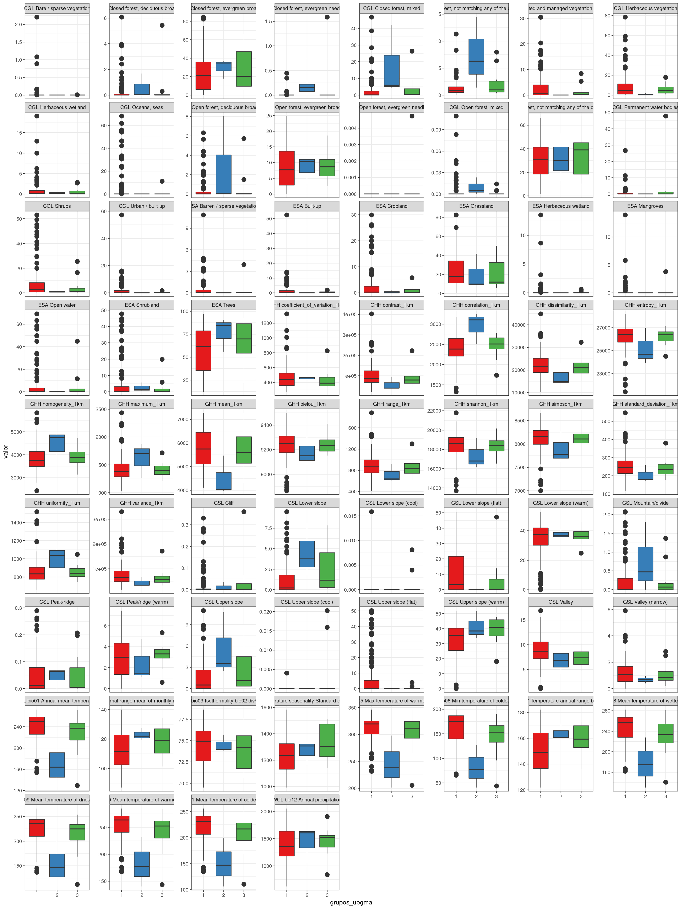<!-- -->

    ## 
    ## [[2]]

<!-- -->

``` r
map(1:2,
    function(x) {
      m_amb_ward %>% 
        filter(variable %in% remesas[[x]]) %>% 
        group_by(variable) %>% 
        ggplot() + aes(x = grupos_ward, y = valor, fill = grupos_ward) + 
        geom_boxplot(lwd = 0.2) + 
        scale_fill_brewer(palette = 'Set1') +
        theme_bw(base_size=6) +
        theme(legend.position="none") +
        facet_wrap(~ variable, scales = 'free_y', ncol = 8)
    })
```

    ## [[1]]

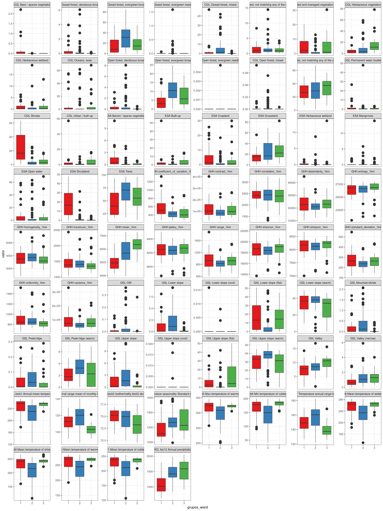<!-- -->

    ## 
    ## [[2]]

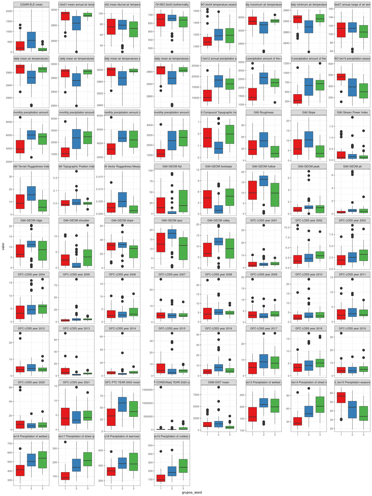<!-- -->

En los diagramas de caja, notarás que, las variables que aparecen en las
primeras filas de las tablas anteriores, son las mismas que presentan
mayor variabilidad de las cajas. Sigo con el ejemplo de las variables
`GFC-LOSS year 2020`, `ESA Open Water` y `G90-GEOM footslope`, y nota
que las anchuras de sus cajas, sus bigotes y la posición de la mediana
(línea interior de la caja), fluctúa mucho entre grupos.

El objetivo de adjuntarle, a la matriz ambiental, el vector de
agrupamiento generado a partir de datos de comunidad, consiste en
caracterizar ambientalmente los hábitats de los subgrupos diferenciados
según su composición. Observa los resultados de las pruebas
estadísticas, de los diagramas de caja, EXPLORA TUS RESULTADOS (usa como
referencia
[practica-99-tu-manuscrito-3-resultados.md](../practica-99-tu-manuscrito-3-resultados.md)
y el vídeo correspondiente a tu caso):

1.  Hábitat del grupo 1.

2.  Hábitat del grupo 2.

3.  Hábitats del grupo 3.

A continuación, muestro mapas de los dos agrupamientos, tanto UPGMA como
Ward, y comparo con algunas de las variables que presentaron efecto.
Usando la función `mapa_leaflet` este bloque genera un mapa interactivo
que colorea los hexágonos en función del grupo al que fueron asignados
de acuerdo al análisis de agrupamiento realizado a la matriz de
comunidad por el método UPGMA. Te recomiendo que uses la función
`mapa_leaflet`, especificando tu matriz ambiental, la variable que
quieras representar y un título, para generar mapas de tus propias
variables seleccionadas.

``` r
m_amb_clusters_sf <- env %>%
  rownames_to_column('hex_id') %>% 
  mutate(
    grupos_upgma = as.character(grupos_upgma),
    grupos_ward = as.character(grupos_ward)) %>%
  inner_join(za %>% select(hex_id)) %>%
  st_as_sf()
mapa_upgma <- mapa_leaflet(
  mapa = m_amb_clusters_sf,
  variable = 'grupos_upgma',
  titulo_leyenda = paste0('UPGMA, k=', k))
mapa_upgma
```

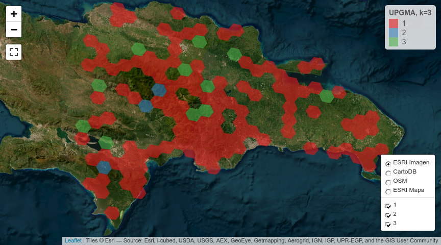<!-- -->

Ídem anterior, pero según Ward.

``` r
mapa_ward <- mapa_leaflet(
  mapa = m_amb_clusters_sf,
  variable = 'grupos_ward',
  titulo_leyenda = paste0('Ward, k=', k))
mapa_ward
```

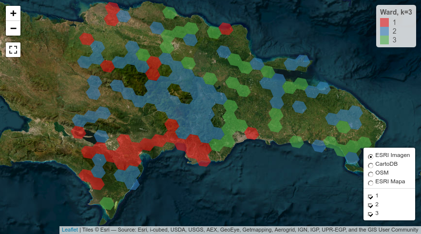<!-- -->

El siguiente bloque de código representa, cartográficamente, algunas
variables que mostraron inhomogeneidad en las pruebas estadísticas, es
decir, variables en las que parecía haber diferencias significativas
entre hexágonos de distintos grupos. Las variables que mostraron
diferencias significativas podrían ayudar a explicar la varianza de la
composición de la comunidad.

``` r
m_amb_ward_ak$variable[1:40]
```

    ##  [1] "GHH mean_1km"                                                         
    ##  [2] "CGIAR-ELE mean"                                                       
    ##  [3] "WCL bio06 Min temperature of coldest month"                           
    ##  [4] "WCL bio09 Mean temperature of driest quarter"                         
    ##  [5] "WCL bio02 Mean diurnal range mean of monthly max temp - min temp"     
    ##  [6] "WCL bio14 Precipitation of driest month"                              
    ##  [7] "CH-BIO bio09 mean daily mean air temperatures of the driest quarter"  
    ##  [8] "WCL bio10 Mean temperature of warmest quarter"                        
    ##  [9] "WCL bio01 Annual mean temperature"                                    
    ## [10] "WCL bio11 Mean temperature of coldest quarter"                        
    ## [11] "CH-BIO bio01 mean annual air temperature"                             
    ## [12] "CH-BIO bio19 mean monthly precipitation amount of the coldest quarter"
    ## [13] "CH-BIO bio10 mean daily mean air temperatures of the warmest quarter" 
    ## [14] "CH-BIO bio11 mean daily mean air temperatures of the coldest quarter" 
    ## [15] "WCL bio17 Precipitation of driest quarter"                            
    ## [16] "WCL bio15 Precipitation seasonality"                                  
    ## [17] "WCL bio12 Annual precipitation"                                       
    ## [18] "WCL bio07 Temperature annual range bio05-bio06"                       
    ## [19] "CH-BIO bio17 mean monthly precipitation amount of the driest quarter" 
    ## [20] "WCL bio08 Mean temperature of wettest quarter"                        
    ## [21] "CH-BIO bio15 precipitation seasonality"                               
    ## [22] "CH-BIO bio06 mean daily minimum air temperature of the coldest month" 
    ## [23] "CH-BIO bio14 precipitation amount of the driest month"                
    ## [24] "G90 Terrain Ruggedness Index"                                         
    ## [25] "G90 Roughness"                                                        
    ## [26] "CH-BIO bio08 mean daily mean air temperatures of the wettest quarter" 
    ## [27] "G90 Slope"                                                            
    ## [28] "G90 Vector Ruggedness Measure"                                        
    ## [29] "CH-BIO bio12 annual precipitation amount"                             
    ## [30] "WCL bio19 Precipitation of coldest quarter"                           
    ## [31] "GSL Lower slope"                                                      
    ## [32] "WCL bio05 Max temperature of warmest month"                           
    ## [33] "CH-BIO bio13 precipitation amount of the wettest month"               
    ## [34] "ESA Shrubland"                                                        
    ## [35] "CH-BIO bio05 mean daily maximum air temperature of the warmest month" 
    ## [36] "GSL Upper slope"                                                      
    ## [37] "G90 Compound Topographic Index"                                       
    ## [38] "G90-GEOM footslope"                                                   
    ## [39] "G90-GEOM hollow"                                                      
    ## [40] "CGL Shrubs"

``` r
mapa_ward_v1 <- mapa_leaflet(
  mapa = m_amb_clusters_sf,
  variable = m_amb_ward_ak$variable[1],
  titulo_leyenda = gsub('(.{1,25})(\\s|$)', '\\1<br>', m_amb_ward_ak$variable[1]))
mapa_ward_v1
```

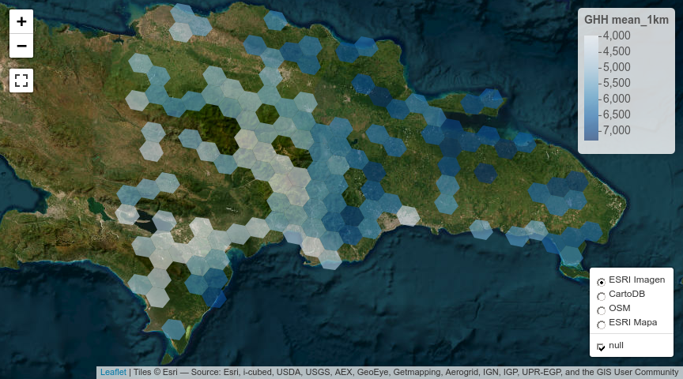<!-- -->

``` r
mapa_ward_v2 <- mapa_leaflet(
  mapa = m_amb_clusters_sf,
  variable = m_amb_ward_ak$variable[2],
  titulo_leyenda = gsub('(.{1,25})(\\s|$)', '\\1<br>', m_amb_ward_ak$variable[2]))
mapa_ward_v2
```

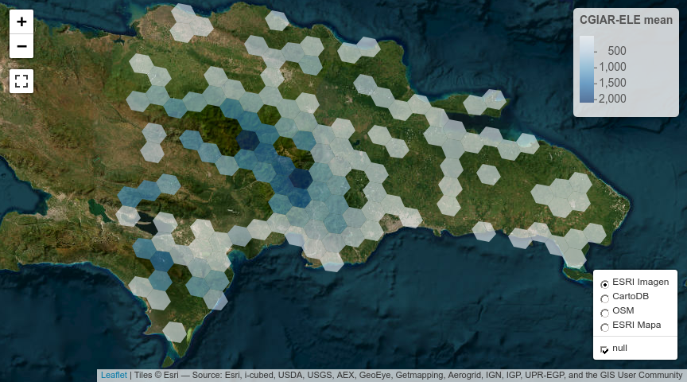<!-- -->

``` r
mapa_ward_v3 <- mapa_leaflet(
  mapa = m_amb_clusters_sf,
  variable = m_amb_ward_ak$variable[3],
  titulo_leyenda = gsub('(.{1,25})(\\s|$)', '\\1<br>', m_amb_ward_ak$variable[3]))
mapa_ward_v3
```

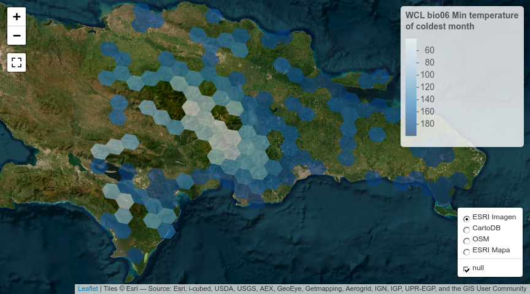<!-- -->

``` r
mapa_ward_v6 <- mapa_leaflet(
  mapa = m_amb_clusters_sf,
  variable = m_amb_ward_ak$variable[6],
  titulo_leyenda = gsub('(.{1,25})(\\s|$)', '\\1<br>', m_amb_ward_ak$variable[6]))
mapa_ward_v6
```

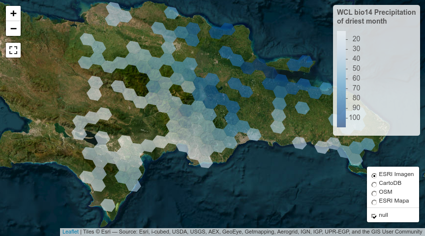<!-- -->

``` r
mapa_ward_v9 <- mapa_leaflet(
  mapa = m_amb_clusters_sf,
  variable = m_amb_ward_ak$variable[9],
  titulo_leyenda = gsub('(.{1,25})(\\s|$)', '\\1<br>', m_amb_ward_ak$variable[9]))
mapa_ward_v9
```

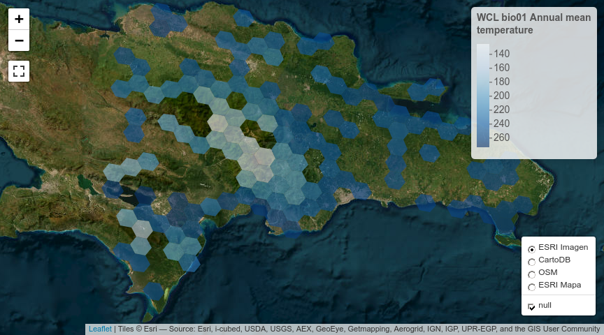<!-- -->

``` r
mapa_ward_v21 <- mapa_leaflet(
  mapa = m_amb_clusters_sf,
  variable = m_amb_ward_ak$variable[21],
  titulo_leyenda = gsub('(.{1,25})(\\s|$)', '\\1<br>', m_amb_ward_ak$variable[21]))
mapa_ward_v21
```

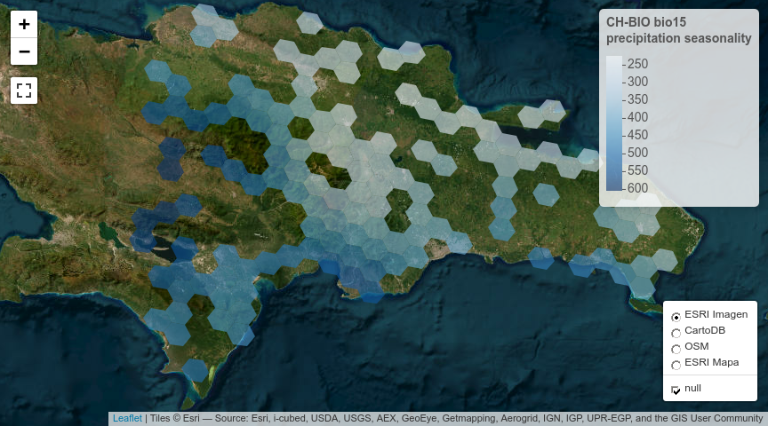<!-- -->

``` r
mapa_ward_v27 <- mapa_leaflet(
  mapa = m_amb_clusters_sf,
  variable = m_amb_ward_ak$variable[27],
  titulo_leyenda = gsub('(.{1,25})(\\s|$)', '\\1<br>', m_amb_ward_ak$variable[27]))
mapa_ward_v27
```

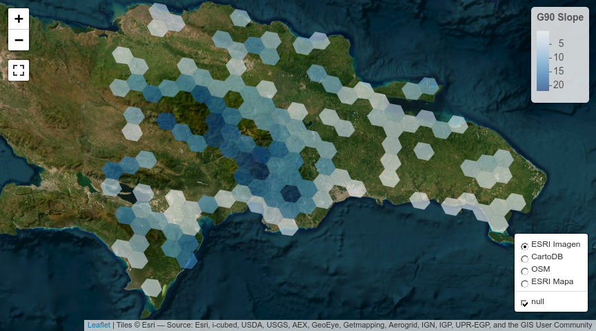<!-- -->

``` r
mapa_ward_v34 <- mapa_leaflet(
  mapa = m_amb_clusters_sf,
  variable = m_amb_ward_ak$variable[34],
  titulo_leyenda = gsub('(.{1,25})(\\s|$)', '\\1<br>', m_amb_ward_ak$variable[34]))
mapa_ward_v34
```

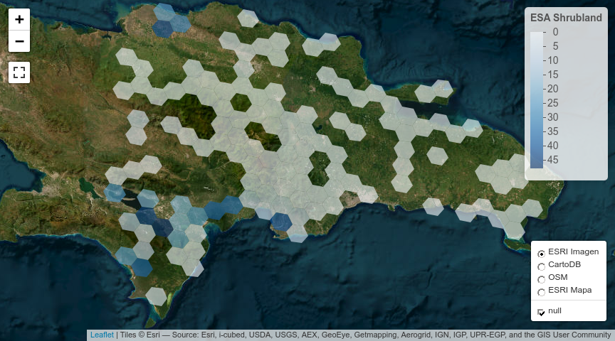<!-- -->

### Especies con preferencia/fidelidad con grupos (clústers)

Paquete `indicspecies`.

``` r
library(indicspecies)
```

Análisis de preferencia/fidelidad de especies con grupos (clusters),
mediante el coeficiente de correlación biserial puntual.

- UPGMA

``` r
# phi_upgma <- multipatt(
#   mi_fam,
#   grupos_upgma,
#   func = "r.g",
#   max.order = 1,
#   control = how(nperm = 999))
# summary(phi_upgma)
# data.frame(abreviado = rownames(phi_upgma$sign)[which(phi_upgma$sign$p.value < 0.05)]) %>%
#   inner_join(df_equivalencias) %>%
#   arrange(abreviado) %>% 
#   kable(booktabs=T) %>%
#   kable_styling(latex_options = c("HOLD_position", "scale_down"))
```

- Ward

``` r
phi_ward <- multipatt(
  mi_fam,
  grupos_ward,
  func = "r.g",
  max.order = 2,
  control = how(nperm = 999))
summary(phi_ward)
```

    ## 
    ##  Multilevel pattern analysis
    ##  ---------------------------
    ## 
    ##  Association function: r.g
    ##  Significance level (alpha): 0.05
    ## 
    ##  Total number of species: 58
    ##  Selected number of species: 24 
    ##  Number of species associated to 1 group: 20 
    ##  Number of species associated to 2 groups: 4 
    ## 
    ##  List of species associated to each combination: 
    ## 
    ##  Group 1  #sps.  5 
    ##           stat p.value    
    ## Tillpauc 0.560   0.001 ***
    ## Tillrecu 0.514   0.001 ***
    ## Tillusne 0.349   0.003 ** 
    ## Tillschi 0.340   0.002 ** 
    ## Pitceliz 0.238   0.025 *  
    ## 
    ##  Group 2  #sps.  11 
    ##           stat p.value    
    ## Tillvari 0.483   0.001 ***
    ## Tilldidi 0.354   0.002 ** 
    ## Tillfend 0.286   0.011 *  
    ## Tillfest 0.279   0.010 ** 
    ## Werasint 0.267   0.019 *  
    ## Tillsell 0.267   0.021 *  
    ## Tillbali 0.267   0.026 *  
    ## Catobert 0.246   0.031 *  
    ## Catoniti 0.239   0.043 *  
    ## PitcHér  0.235   0.046 *  
    ## Catoflor 0.231   0.037 *  
    ## 
    ##  Group 3  #sps.  4 
    ##           stat p.value    
    ## Tillseta 0.582   0.001 ***
    ## Tillbalb 0.533   0.001 ***
    ## Guzmmono 0.256   0.015 *  
    ## Bromping 0.244   0.025 *  
    ## 
    ##  Group 1+2  #sps.  1 
    ##           stat p.value  
    ## Tillprui 0.256   0.022 *
    ## 
    ##  Group 2+3  #sps.  3 
    ##           stat p.value    
    ## Tilljunc 0.443   0.001 ***
    ## Tillpoly 0.320   0.004 ** 
    ## Tillfasc 0.313   0.004 ** 
    ## ---
    ## Signif. codes:  0 '***' 0.001 '**' 0.01 '*' 0.05 '.' 0.1 ' ' 1

``` r
data.frame(abreviado = rownames(phi_ward$sign)[which(phi_ward$sign$p.value < 0.05)]) %>%
  inner_join(df_equivalencias) %>%
  arrange(abreviado) %>% 
  kable(booktabs=T) %>%
  kable_styling(latex_options = c("HOLD_position", "scale_down"))
```

<table class="table" style="margin-left: auto; margin-right: auto;">
<thead>
<tr>
<th style="text-align:left;">
abreviado
</th>
<th style="text-align:left;">
nombre_original
</th>
</tr>
</thead>
<tbody>
<tr>
<td style="text-align:left;">
Bromping
</td>
<td style="text-align:left;">
Bromelia pinguin L.
</td>
</tr>
<tr>
<td style="text-align:left;">
Catobert
</td>
<td style="text-align:left;">
Catopsis berteroniana (Schult. & Schult.f.) Mez
</td>
</tr>
<tr>
<td style="text-align:left;">
Catoflor
</td>
<td style="text-align:left;">
Catopsis floribunda L.B.Sm.
</td>
</tr>
<tr>
<td style="text-align:left;">
Catoniti
</td>
<td style="text-align:left;">
Catopsis nitida (Hook.) Griseb.
</td>
</tr>
<tr>
<td style="text-align:left;">
Guzmmono
</td>
<td style="text-align:left;">
Guzmania monostachia (L.) Rusby ex Mez
</td>
</tr>
<tr>
<td style="text-align:left;">
Pitceliz
</td>
<td style="text-align:left;">
Pitcairnia elizabethae L.B.Sm.
</td>
</tr>
<tr>
<td style="text-align:left;">
PitcHér
</td>
<td style="text-align:left;">
Pitcairnia L’Hér.
</td>
</tr>
<tr>
<td style="text-align:left;">
Tillbalb
</td>
<td style="text-align:left;">
Tillandsia balbisiana Schult. & Schult.f.
</td>
</tr>
<tr>
<td style="text-align:left;">
Tillbali
</td>
<td style="text-align:left;">
Tillandsia baliophylla Harms
</td>
</tr>
<tr>
<td style="text-align:left;">
Tilldidi
</td>
<td style="text-align:left;">
Tillandsia didistichoides Mez
</td>
</tr>
<tr>
<td style="text-align:left;">
Tillfasc
</td>
<td style="text-align:left;">
Tillandsia fasciculata Sw.
</td>
</tr>
<tr>
<td style="text-align:left;">
Tillfend
</td>
<td style="text-align:left;">
Tillandsia fendleri Griseb.
</td>
</tr>
<tr>
<td style="text-align:left;">
Tillfest
</td>
<td style="text-align:left;">
Tillandsia festucoides Brongn. ex Mez
</td>
</tr>
<tr>
<td style="text-align:left;">
Tilljunc
</td>
<td style="text-align:left;">
Tillandsia juncea (Ruiz & Pav.) Poir.
</td>
</tr>
<tr>
<td style="text-align:left;">
Tillpauc
</td>
<td style="text-align:left;">
Tillandsia paucifolia Baker
</td>
</tr>
<tr>
<td style="text-align:left;">
Tillpoly
</td>
<td style="text-align:left;">
Tillandsia polystachia (L.) L.
</td>
</tr>
<tr>
<td style="text-align:left;">
Tillprui
</td>
<td style="text-align:left;">
Tillandsia pruinosa Sw.
</td>
</tr>
<tr>
<td style="text-align:left;">
Tillrecu
</td>
<td style="text-align:left;">
Tillandsia recurvata (L.) L.
</td>
</tr>
<tr>
<td style="text-align:left;">
Tillschi
</td>
<td style="text-align:left;">
Tillandsia schiedeana Steud.
</td>
</tr>
<tr>
<td style="text-align:left;">
Tillsell
</td>
<td style="text-align:left;">
Tillandsia selleana Harms
</td>
</tr>
<tr>
<td style="text-align:left;">
Tillseta
</td>
<td style="text-align:left;">
Tillandsia setacea Sw.
</td>
</tr>
<tr>
<td style="text-align:left;">
Tillusne
</td>
<td style="text-align:left;">
Tillandsia usneoides (L.) L.
</td>
</tr>
<tr>
<td style="text-align:left;">
Tillvari
</td>
<td style="text-align:left;">
Tillandsia variabilis Schltdl.
</td>
</tr>
<tr>
<td style="text-align:left;">
Werasint
</td>
<td style="text-align:left;">
Werauhia sintenisii (Baker) J.R.Grant
</td>
</tr>
</tbody>
</table>

EXPLORA TUS RESULTADOS (usa como referencia
[practica-99-tu-manuscrito-3-resultados.md](../practica-99-tu-manuscrito-3-resultados.md)
y el vídeo correspondiente a tu caso)

## Técnicas de ordenación

Me basaré en los scripts que comienzan por `to_` de este
[repo](https://github.com/biogeografia-master/scripts-de-analisis-BCI),
los cuales explico en los vídeos de “Técnicas de ordenación” de la lista
de reproducción [“Ecología Numérica con R” de mi
canal](https://www.youtube.com/playlist?list=PLDcT2n8UzsCRDqjqSeqHI1wsiNOqpYmsJ).

### Ordenación restringida

> INICIA texto+código común entre secciones

Fijar un directorio de trabajo no es recomendable, mejor trabaja por
proyecto. En cualquier caso, si no quieres o no puedes crear un
proyecto, usa la sentencia que verás abajo, cambiando `TU_DIRECTORIO`
por la ruta del directorio donde tengas almacenados tus datos y tus
scripts.

``` r
if(interactive()) {
  tryCatch(
    setwd(dirname(rstudioapi::getSourceEditorContext()$path)),
    error = function(e) {
      cat('Probablemente ya el directorio de trabajo está fijado correctamente',
          'o quizá el directorio no existe. Este fue el error devuelto:\n')
      e
    })
}
```

Cargar paquetes.

``` r
library(vegan)
library(sf)
library(tidyverse)
library(tmap)
library(kableExtra)
library(foreach)
library(leaps)
library(caret)
gh_content <- 'https://raw.githubusercontent.com/'
gh_zonal_stats <- paste0(gh_content,
                         'geofis/zonal-statistics/0b2e95aaee87bf326cf132d28f4bd15220bb4ec7/out/')
repo_analisis <- 'biogeografia-master/scripts-de-analisis-BCI/master'
repo_sem202202 <- 'biogeografia-202202/material-de-apoyo/master/practicas/'
devtools::source_url(paste0(gh_content, repo_analisis, '/biodata/funciones.R'))
devtools::source_url(paste0(gh_content, repo_sem202202, 'train.R'))
devtools::source_url(paste0(gh_content, repo_sem202202, 'funciones.R'))
```

Carga tu matriz de comunidad, que habrás generado en la práctica 2, y
elige un umbral para especies raras o rangos de registros de presencia
para seleccionar especies en una nueva matriz de comunidad.

``` r
res <- 5 #Resolución H3, puedes elegir entre 4, 5, 6 o 7, pero cuidado con valores >=6
# IMPORTANTE: la resolución de las celdas H3, debe coincidir con la resolución
# a la cual generaste tu matriz de comunidad. De lo contrario, obtendrás error. Si tu 
# archivo RDS de matriz de comunidad se denomina "matriz_de_comunidad.RDS", y lo creaste
# usando resolución 4, cámbiale el nombre a "matriz_de_comunidad_res_5.RDS". Recuerda,
# puedes usar cualquier resolución, lo único importante es que las resolución usada en la
# creación de la matriz de comunidad, debe ser la misma que en la ambiental.
mc_orig <- readRDS('matriz_de_comunidad_bromeliaceae.RDS')
nrow(mc_orig) #Número de filas, equivale a número de hexágonos con registros de presencia
```

    ## [1] 176

``` r
ncol(mc_orig)  #Número de columnas, equivale a número de especies, riqueza
```

    ## [1] 68

``` r
data.frame(Especies = names(mc_orig)) %>% 
  kable(booktabs=T) %>%
  kable_styling(latex_options = c("HOLD_position", "scale_down")) %>%
  gsub(' NA ', '', .) #Lista de especies
```

<table class="table" style="margin-left: auto; margin-right: auto;">
<thead>
<tr>
<th style="text-align:left;">
Especies
</th>
</tr>
</thead>
<tbody>
<tr>
<td style="text-align:left;">
Tillandsia usneoides (L.) L.
</td>
</tr>
<tr>
<td style="text-align:left;">
Tillandsia fasciculata Sw.
</td>
</tr>
<tr>
<td style="text-align:left;">
Aechmea nudicaulis (L.) Griseb.
</td>
</tr>
<tr>
<td style="text-align:left;">
Tillandsia schiedeana Steud.
</td>
</tr>
<tr>
<td style="text-align:left;">
Ananas comosus (L.) Merr.
</td>
</tr>
<tr>
<td style="text-align:left;">
Tillandsia balbisiana Schult. & Schult.f.
</td>
</tr>
<tr>
<td style="text-align:left;">
Tillandsia recurvata (L.) L.
</td>
</tr>
<tr>
<td style="text-align:left;">
Tillandsia utriculata L.
</td>
</tr>
<tr>
<td style="text-align:left;">
Tillandsia fendleri Griseb.
</td>
</tr>
<tr>
<td style="text-align:left;">
Guzmania monostachia (L.) Rusby ex Mez
</td>
</tr>
<tr>
<td style="text-align:left;">
Tillandsia tenuifolia L.
</td>
</tr>
<tr>
<td style="text-align:left;">
Tillandsia juncea (Ruiz & Pav.) Poir.
</td>
</tr>
<tr>
<td style="text-align:left;">
Guzmania berteroniana (Schult. & Schult.f.) Mez
</td>
</tr>
<tr>
<td style="text-align:left;">
Bromelia pinguin L.
</td>
</tr>
<tr>
<td style="text-align:left;">
Tillandsia paucifolia Baker
</td>
</tr>
<tr>
<td style="text-align:left;">
Tillandsia hotteana Urb.
</td>
</tr>
<tr>
<td style="text-align:left;">
Tillandsia flexuosa Sw.
</td>
</tr>
<tr>
<td style="text-align:left;">
Bromeliaceae
</td>
</tr>
<tr>
<td style="text-align:left;">
Guzmania lingulata (L.) Mez
</td>
</tr>
<tr>
<td style="text-align:left;">
Catopsis floribunda L.B.Sm.
</td>
</tr>
<tr>
<td style="text-align:left;">
Tillandsia L.
</td>
</tr>
<tr>
<td style="text-align:left;">
Billbergia pyramidalis (Sims) Lindl.
</td>
</tr>
<tr>
<td style="text-align:left;">
Pitcairnia L’Hér.
</td>
</tr>
<tr>
<td style="text-align:left;">
Tillandsia pruinosa Sw.
</td>
</tr>
<tr>
<td style="text-align:left;">
Tillandsia variabilis Schltdl.
</td>
</tr>
<tr>
<td style="text-align:left;">
Tillandsia setacea Sw.
</td>
</tr>
<tr>
<td style="text-align:left;">
Pitcairnia elizabethae L.B.Sm.
</td>
</tr>
<tr>
<td style="text-align:left;">
Werauhia sintenisii (Baker) J.R.Grant
</td>
</tr>
<tr>
<td style="text-align:left;">
Catopsis nitida (Hook.) Griseb.
</td>
</tr>
<tr>
<td style="text-align:left;">
Racinaea tetrantha (Ruiz & Pav.) M.A.Spencer & L.B.Sm.
</td>
</tr>
<tr>
<td style="text-align:left;">
Racinaea tetrantha var. caribaea (L.B.Sm.) M.A.Spencer & L.B.Sm.
</td>
</tr>
<tr>
<td style="text-align:left;">
Guzmania Ruiz & Pav.
</td>
</tr>
<tr>
<td style="text-align:left;">
Werauhia gibba (L.B.Sm.) J.R.Grant
</td>
</tr>
<tr>
<td style="text-align:left;">
Tillandsia fasciculata var. fasciculata
</td>
</tr>
<tr>
<td style="text-align:left;">
Catopsis Griseb.
</td>
</tr>
<tr>
<td style="text-align:left;">
Tillandsia kuzmae Ehlers
</td>
</tr>
<tr>
<td style="text-align:left;">
Tillandsia compressa Bertero ex Schult. & Schult.f.
</td>
</tr>
<tr>
<td style="text-align:left;">
Zizkaea tuerckheimii (Mez) W.Till & Barfuss
</td>
</tr>
<tr>
<td style="text-align:left;">
Pitcairnia domingensis L.B.Sm.
</td>
</tr>
<tr>
<td style="text-align:left;">
Tillandsia fasciculata var. densispica Mez
</td>
</tr>
<tr>
<td style="text-align:left;">
Tillandsia didistichoides Mez
</td>
</tr>
<tr>
<td style="text-align:left;">
Catopsis sessiliflora (Ruiz & Pav.) Mez
</td>
</tr>
<tr>
<td style="text-align:left;">
Tillandsia compacta Griseb.
</td>
</tr>
<tr>
<td style="text-align:left;">
Racinaea spiculosa var. spiculosa
</td>
</tr>
<tr>
<td style="text-align:left;">
Tillandsia festucoides Brongn. ex Mez
</td>
</tr>
<tr>
<td style="text-align:left;">
Pitcairnia jimenezii L.B.Sm.
</td>
</tr>
<tr>
<td style="text-align:left;">
Tillandsia polystachia (L.) L.
</td>
</tr>
<tr>
<td style="text-align:left;">
Racinaea spiculosa (Griseb.) M.A.Spencer & L.B.Sm.
</td>
</tr>
<tr>
<td style="text-align:left;">
Tillandsia selleana Harms
</td>
</tr>
<tr>
<td style="text-align:left;">
Tillandsia bulbosa Hook.
</td>
</tr>
<tr>
<td style="text-align:left;">
Tillandsia capitata Griseb.
</td>
</tr>
<tr>
<td style="text-align:left;">
Tillandsia fendleri var. fendleri
</td>
</tr>
<tr>
<td style="text-align:left;">
Racinaea lescaillei (C.Wright) M.A.Spencer & L.B.Sm.
</td>
</tr>
<tr>
<td style="text-align:left;">
Guzmania ekmanii (Harms) Harms ex Mez
</td>
</tr>
<tr>
<td style="text-align:left;">
Tillandsia paniculata (L.) L.
</td>
</tr>
<tr>
<td style="text-align:left;">
Tillandsia deppeana Steud.
</td>
</tr>
<tr>
<td style="text-align:left;">
Pitcairnia bromeliifolia L’Hér.
</td>
</tr>
<tr>
<td style="text-align:left;">
Catopsis nutans (Sw.) Griseb.
</td>
</tr>
<tr>
<td style="text-align:left;">
Tillandsia moscosoi L.B.Sm. & Jiménez
</td>
</tr>
<tr>
<td style="text-align:left;">
Pitcairnia fuertesii Mez
</td>
</tr>
<tr>
<td style="text-align:left;">
Pitcairnia samuelssonii L.B.Sm.
</td>
</tr>
<tr>
<td style="text-align:left;">
Tillandsia baliophylla Harms
</td>
</tr>
<tr>
<td style="text-align:left;">
Bromelia karatas L.
</td>
</tr>
<tr>
<td style="text-align:left;">
Tillandsia ariza-juliae L.B.Sm. & Jiménez
</td>
</tr>
<tr>
<td style="text-align:left;">
Catopsis berteroniana (Schult. & Schult.f.) Mez
</td>
</tr>
<tr>
<td style="text-align:left;">
Cipuropsis capituligera (Griseb.) Christenh. & Byng
</td>
</tr>
<tr>
<td style="text-align:left;">
Werauhia ringens (Griseb.) J.R.Grant
</td>
</tr>
<tr>
<td style="text-align:left;">
Pitcairnia angustifolia Aiton
</td>
</tr>
</tbody>
</table>

``` r
unique(word(names(mc_orig), 1, 1)) #Géneros representados
```

    ##  [1] "Tillandsia"   "Aechmea"      "Ananas"       "Guzmania"     "Bromelia"    
    ##  [6] "Bromeliaceae" "Catopsis"     "Billbergia"   "Pitcairnia"   "Werauhia"    
    ## [11] "Racinaea"     "Zizkaea"      "Cipuropsis"

``` r
table(word(names(mc_orig), 1, 1)) #Número de especies por género
```

    ## 
    ##      Aechmea       Ananas   Billbergia     Bromelia Bromeliaceae     Catopsis 
    ##            1            1            1            2            1            6 
    ##   Cipuropsis     Guzmania   Pitcairnia     Racinaea   Tillandsia     Werauhia 
    ##            1            5            8            5           33            3 
    ##      Zizkaea 
    ##            1

``` r
data.frame(`Número de hexágonos` = sort(colSums(mc_orig), decreasing = T), check.names = F) %>% 
  kable(booktabs=T) %>%
  kable_styling(latex_options = c("HOLD_position", "scale_down")) %>%
  gsub(' NA ', '', .) # Número de hexágonos en los que está presente cada especie
```

<table class="table" style="margin-left: auto; margin-right: auto;">
<thead>
<tr>
<th style="text-align:left;">
</th>
<th style="text-align:right;">
Número de hexágonos
</th>
</tr>
</thead>
<tbody>
<tr>
<td style="text-align:left;">
Tillandsia recurvata (L.) L.
</td>
<td style="text-align:right;">
51
</td>
</tr>
<tr>
<td style="text-align:left;">
Tillandsia setacea Sw.
</td>
<td style="text-align:right;">
46
</td>
</tr>
<tr>
<td style="text-align:left;">
Tillandsia fasciculata Sw.
</td>
<td style="text-align:right;">
43
</td>
</tr>
<tr>
<td style="text-align:left;">
Tillandsia juncea (Ruiz & Pav.) Poir.
</td>
<td style="text-align:right;">
43
</td>
</tr>
<tr>
<td style="text-align:left;">
Tillandsia balbisiana Schult. & Schult.f.
</td>
<td style="text-align:right;">
41
</td>
</tr>
<tr>
<td style="text-align:left;">
Tillandsia schiedeana Steud.
</td>
<td style="text-align:right;">
28
</td>
</tr>
<tr>
<td style="text-align:left;">
Tillandsia variabilis Schltdl.
</td>
<td style="text-align:right;">
28
</td>
</tr>
<tr>
<td style="text-align:left;">
Tillandsia usneoides (L.) L.
</td>
<td style="text-align:right;">
24
</td>
</tr>
<tr>
<td style="text-align:left;">
Tillandsia polystachia (L.) L.
</td>
<td style="text-align:right;">
24
</td>
</tr>
<tr>
<td style="text-align:left;">
Catopsis nitida (Hook.) Griseb.
</td>
<td style="text-align:right;">
19
</td>
</tr>
<tr>
<td style="text-align:left;">
Tillandsia pruinosa Sw.
</td>
<td style="text-align:right;">
18
</td>
</tr>
<tr>
<td style="text-align:left;">
Tillandsia tenuifolia L.
</td>
<td style="text-align:right;">
16
</td>
</tr>
<tr>
<td style="text-align:left;">
Tillandsia paucifolia Baker
</td>
<td style="text-align:right;">
15
</td>
</tr>
<tr>
<td style="text-align:left;">
Catopsis floribunda L.B.Sm.
</td>
<td style="text-align:right;">
15
</td>
</tr>
<tr>
<td style="text-align:left;">
Guzmania monostachia (L.) Rusby ex Mez
</td>
<td style="text-align:right;">
14
</td>
</tr>
<tr>
<td style="text-align:left;">
Pitcairnia fuertesii Mez
</td>
<td style="text-align:right;">
14
</td>
</tr>
<tr>
<td style="text-align:left;">
Tillandsia festucoides Brongn. ex Mez
</td>
<td style="text-align:right;">
13
</td>
</tr>
<tr>
<td style="text-align:left;">
Tillandsia utriculata L.
</td>
<td style="text-align:right;">
12
</td>
</tr>
<tr>
<td style="text-align:left;">
Tillandsia didistichoides Mez
</td>
<td style="text-align:right;">
12
</td>
</tr>
<tr>
<td style="text-align:left;">
Tillandsia hotteana Urb.
</td>
<td style="text-align:right;">
11
</td>
</tr>
<tr>
<td style="text-align:left;">
Pitcairnia L’Hér.
</td>
<td style="text-align:right;">
11
</td>
</tr>
<tr>
<td style="text-align:left;">
Zizkaea tuerckheimii (Mez) W.Till & Barfuss
</td>
<td style="text-align:right;">
11
</td>
</tr>
<tr>
<td style="text-align:left;">
Bromelia pinguin L.
</td>
<td style="text-align:right;">
10
</td>
</tr>
<tr>
<td style="text-align:left;">
Tillandsia deppeana Steud.
</td>
<td style="text-align:right;">
9
</td>
</tr>
<tr>
<td style="text-align:left;">
Tillandsia fendleri Griseb.
</td>
<td style="text-align:right;">
8
</td>
</tr>
<tr>
<td style="text-align:left;">
Tillandsia compressa Bertero ex Schult. & Schult.f.
</td>
<td style="text-align:right;">
8
</td>
</tr>
<tr>
<td style="text-align:left;">
Ananas comosus (L.) Merr.
</td>
<td style="text-align:right;">
7
</td>
</tr>
<tr>
<td style="text-align:left;">
Tillandsia flexuosa Sw.
</td>
<td style="text-align:right;">
7
</td>
</tr>
<tr>
<td style="text-align:left;">
Werauhia sintenisii (Baker) J.R.Grant
</td>
<td style="text-align:right;">
7
</td>
</tr>
<tr>
<td style="text-align:left;">
Tillandsia selleana Harms
</td>
<td style="text-align:right;">
7
</td>
</tr>
<tr>
<td style="text-align:left;">
Tillandsia baliophylla Harms
</td>
<td style="text-align:right;">
7
</td>
</tr>
<tr>
<td style="text-align:left;">
Tillandsia L.
</td>
<td style="text-align:right;">
6
</td>
</tr>
<tr>
<td style="text-align:left;">
Tillandsia fasciculata var. densispica Mez
</td>
<td style="text-align:right;">
6
</td>
</tr>
<tr>
<td style="text-align:left;">
Guzmania ekmanii (Harms) Harms ex Mez
</td>
<td style="text-align:right;">
6
</td>
</tr>
<tr>
<td style="text-align:left;">
Catopsis berteroniana (Schult. & Schult.f.) Mez
</td>
<td style="text-align:right;">
6
</td>
</tr>
<tr>
<td style="text-align:left;">
Aechmea nudicaulis (L.) Griseb.
</td>
<td style="text-align:right;">
5
</td>
</tr>
<tr>
<td style="text-align:left;">
Guzmania lingulata (L.) Mez
</td>
<td style="text-align:right;">
5
</td>
</tr>
<tr>
<td style="text-align:left;">
Racinaea tetrantha var. caribaea (L.B.Sm.) M.A.Spencer & L.B.Sm.
</td>
<td style="text-align:right;">
5
</td>
</tr>
<tr>
<td style="text-align:left;">
Tillandsia compacta Griseb.
</td>
<td style="text-align:right;">
5
</td>
</tr>
<tr>
<td style="text-align:left;">
Tillandsia paniculata (L.) L.
</td>
<td style="text-align:right;">
5
</td>
</tr>
<tr>
<td style="text-align:left;">
Catopsis nutans (Sw.) Griseb.
</td>
<td style="text-align:right;">
5
</td>
</tr>
<tr>
<td style="text-align:left;">
Guzmania berteroniana (Schult. & Schult.f.) Mez
</td>
<td style="text-align:right;">
4
</td>
</tr>
<tr>
<td style="text-align:left;">
Pitcairnia elizabethae L.B.Sm.
</td>
<td style="text-align:right;">
4
</td>
</tr>
<tr>
<td style="text-align:left;">
Tillandsia bulbosa Hook.
</td>
<td style="text-align:right;">
4
</td>
</tr>
<tr>
<td style="text-align:left;">
Tillandsia moscosoi L.B.Sm. & Jiménez
</td>
<td style="text-align:right;">
4
</td>
</tr>
<tr>
<td style="text-align:left;">
Tillandsia fasciculata var. fasciculata
</td>
<td style="text-align:right;">
3
</td>
</tr>
<tr>
<td style="text-align:left;">
Pitcairnia domingensis L.B.Sm.
</td>
<td style="text-align:right;">
3
</td>
</tr>
<tr>
<td style="text-align:left;">
Pitcairnia jimenezii L.B.Sm.
</td>
<td style="text-align:right;">
3
</td>
</tr>
<tr>
<td style="text-align:left;">
Racinaea spiculosa (Griseb.) M.A.Spencer & L.B.Sm.
</td>
<td style="text-align:right;">
3
</td>
</tr>
<tr>
<td style="text-align:left;">
Pitcairnia samuelssonii L.B.Sm.
</td>
<td style="text-align:right;">
3
</td>
</tr>
<tr>
<td style="text-align:left;">
Bromelia karatas L.
</td>
<td style="text-align:right;">
3
</td>
</tr>
<tr>
<td style="text-align:left;">
Cipuropsis capituligera (Griseb.) Christenh. & Byng
</td>
<td style="text-align:right;">
3
</td>
</tr>
<tr>
<td style="text-align:left;">
Werauhia gibba (L.B.Sm.) J.R.Grant
</td>
<td style="text-align:right;">
2
</td>
</tr>
<tr>
<td style="text-align:left;">
Tillandsia kuzmae Ehlers
</td>
<td style="text-align:right;">
2
</td>
</tr>
<tr>
<td style="text-align:left;">
Tillandsia capitata Griseb.
</td>
<td style="text-align:right;">
2
</td>
</tr>
<tr>
<td style="text-align:left;">
Racinaea lescaillei (C.Wright) M.A.Spencer & L.B.Sm.
</td>
<td style="text-align:right;">
2
</td>
</tr>
<tr>
<td style="text-align:left;">
Pitcairnia bromeliifolia L’Hér.
</td>
<td style="text-align:right;">
2
</td>
</tr>
<tr>
<td style="text-align:left;">
Tillandsia ariza-juliae L.B.Sm. & Jiménez
</td>
<td style="text-align:right;">
2
</td>
</tr>
<tr>
<td style="text-align:left;">
Bromeliaceae
</td>
<td style="text-align:right;">
1
</td>
</tr>
<tr>
<td style="text-align:left;">
Billbergia pyramidalis (Sims) Lindl.
</td>
<td style="text-align:right;">
1
</td>
</tr>
<tr>
<td style="text-align:left;">
Racinaea tetrantha (Ruiz & Pav.) M.A.Spencer & L.B.Sm.
</td>
<td style="text-align:right;">
1
</td>
</tr>
<tr>
<td style="text-align:left;">
Guzmania Ruiz & Pav.
</td>
<td style="text-align:right;">
1
</td>
</tr>
<tr>
<td style="text-align:left;">
Catopsis Griseb.
</td>
<td style="text-align:right;">
1
</td>
</tr>
<tr>
<td style="text-align:left;">
Catopsis sessiliflora (Ruiz & Pav.) Mez
</td>
<td style="text-align:right;">
1
</td>
</tr>
<tr>
<td style="text-align:left;">
Racinaea spiculosa var. spiculosa
</td>
<td style="text-align:right;">
1
</td>
</tr>
<tr>
<td style="text-align:left;">
Tillandsia fendleri var. fendleri
</td>
<td style="text-align:right;">
1
</td>
</tr>
<tr>
<td style="text-align:left;">
Werauhia ringens (Griseb.) J.R.Grant
</td>
<td style="text-align:right;">
1
</td>
</tr>
<tr>
<td style="text-align:left;">
Pitcairnia angustifolia Aiton
</td>
<td style="text-align:right;">
1
</td>
</tr>
</tbody>
</table>

``` r
# Usa el vector anterior para determinar un umbral o rango de registros para filtrar tu matriz
# ¿En cuántos hexágonos está cada especie? Filtra tus datos usando tu propio criterio.
# Especies que aparecen en pocos hexágonos se consideran "raras". Por ejemplo, si una especie sólo
# aparece en un hexágono en todo el país, es un "singleton", si en dos, "doubleton", y así.
# Estas especies podrían contribuir a generar "ruido" en análisis posteriores, se recomienda excluirlas.
# Elige un valor mínimo (representado por único número entero) o por un rango de enteros (e.g. de 10 a 20),
# para seleccionar las especies que estén mejor representadas de acuerdo a tu criterio.
# Por ejemplo, si usas el valor m, el script considerará a este valor como "el número mínimo de hexágonos
# en los que está representada una especie, y creará una matriz de comunidad de especies seleccionadas
# que están presentes en m hexágonos o más. Si eliges un rango, por ejemplo [m,n], el script generará
# una matriz de comunidad que representadas un mínimo de m hexágonos y un máximo de n hexágonos.
# (ambos extremos inclusive).
en_cuantos_hex <- 2
# Explicación: "en_cuantos_hex <- X", donde X es el número de hexágonos mínimo donde cada especie
# debe estar presente. IMPORTANTE: elige TU PROPIO umbral.
{if(length(en_cuantos_hex)==1) selector <- en_cuantos_hex:max(colSums(mc_orig)) else
  if(length(en_cuantos_hex)==2)
    selector <- min(en_cuantos_hex):max(en_cuantos_hex) else
      stop('Debes indicar uno o dos valores numéricos')}
selector
```

    ##  [1]  2  3  4  5  6  7  8  9 10 11 12 13 14 15 16 17 18 19 20 21 22 23 24 25 26
    ## [26] 27 28 29 30 31 32 33 34 35 36 37 38 39 40 41 42 43 44 45 46 47 48 49 50 51

``` r
mc_orig_seleccionadas <- mc_orig[, colSums(mc_orig) %in% selector]

# Mínimo número de especies por hexágono
data.frame(`Número de especies por hexágono` = sort(rowSums(mc_orig), decreasing = T), check.names = F) %>% 
  kable(booktabs=T) %>%
  kable_styling(latex_options = c("HOLD_position", "scale_down")) %>%
  gsub(' NA ', '', .) # Número de hexágonos en los que está presente cada especie
```

<table class="table" style="margin-left: auto; margin-right: auto;">
<thead>
<tr>
<th style="text-align:left;">
</th>
<th style="text-align:right;">
Número de especies por hexágono
</th>
</tr>
</thead>
<tbody>
<tr>
<td style="text-align:left;">
854cd44bfffffff
</td>
<td style="text-align:right;">
18
</td>
</tr>
<tr>
<td style="text-align:left;">
854cd46bfffffff
</td>
<td style="text-align:right;">
17
</td>
</tr>
<tr>
<td style="text-align:left;">
854cd453fffffff
</td>
<td style="text-align:right;">
16
</td>
</tr>
<tr>
<td style="text-align:left;">
854cd29bfffffff
</td>
<td style="text-align:right;">
16
</td>
</tr>
<tr>
<td style="text-align:left;">
854cd6a7fffffff
</td>
<td style="text-align:right;">
14
</td>
</tr>
<tr>
<td style="text-align:left;">
854cd697fffffff
</td>
<td style="text-align:right;">
14
</td>
</tr>
<tr>
<td style="text-align:left;">
854cd4cbfffffff
</td>
<td style="text-align:right;">
13
</td>
</tr>
<tr>
<td style="text-align:left;">
854cf347fffffff
</td>
<td style="text-align:right;">
13
</td>
</tr>
<tr>
<td style="text-align:left;">
854cd46ffffffff
</td>
<td style="text-align:right;">
12
</td>
</tr>
<tr>
<td style="text-align:left;">
854cd40bfffffff
</td>
<td style="text-align:right;">
11
</td>
</tr>
<tr>
<td style="text-align:left;">
854cd28bfffffff
</td>
<td style="text-align:right;">
10
</td>
</tr>
<tr>
<td style="text-align:left;">
854cd2d7fffffff
</td>
<td style="text-align:right;">
10
</td>
</tr>
<tr>
<td style="text-align:left;">
854cd64ffffffff
</td>
<td style="text-align:right;">
10
</td>
</tr>
<tr>
<td style="text-align:left;">
854c892ffffffff
</td>
<td style="text-align:right;">
9
</td>
</tr>
<tr>
<td style="text-align:left;">
854c898ffffffff
</td>
<td style="text-align:right;">
9
</td>
</tr>
<tr>
<td style="text-align:left;">
854cf373fffffff
</td>
<td style="text-align:right;">
9
</td>
</tr>
<tr>
<td style="text-align:left;">
854cd6b7fffffff
</td>
<td style="text-align:right;">
9
</td>
</tr>
<tr>
<td style="text-align:left;">
854c8927fffffff
</td>
<td style="text-align:right;">
8
</td>
</tr>
<tr>
<td style="text-align:left;">
854cd09bfffffff
</td>
<td style="text-align:right;">
8
</td>
</tr>
<tr>
<td style="text-align:left;">
854cd2dbfffffff
</td>
<td style="text-align:right;">
8
</td>
</tr>
<tr>
<td style="text-align:left;">
854cd44ffffffff
</td>
<td style="text-align:right;">
8
</td>
</tr>
<tr>
<td style="text-align:left;">
85672597fffffff
</td>
<td style="text-align:right;">
8
</td>
</tr>
<tr>
<td style="text-align:left;">
854cd47bfffffff
</td>
<td style="text-align:right;">
8
</td>
</tr>
<tr>
<td style="text-align:left;">
854cd473fffffff
</td>
<td style="text-align:right;">
8
</td>
</tr>
<tr>
<td style="text-align:left;">
854c89bbfffffff
</td>
<td style="text-align:right;">
7
</td>
</tr>
<tr>
<td style="text-align:left;">
854cd467fffffff
</td>
<td style="text-align:right;">
7
</td>
</tr>
<tr>
<td style="text-align:left;">
854cd4cffffffff
</td>
<td style="text-align:right;">
7
</td>
</tr>
<tr>
<td style="text-align:left;">
854cd0d3fffffff
</td>
<td style="text-align:right;">
7
</td>
</tr>
<tr>
<td style="text-align:left;">
854cd43bfffffff
</td>
<td style="text-align:right;">
7
</td>
</tr>
<tr>
<td style="text-align:left;">
854c894bfffffff
</td>
<td style="text-align:right;">
7
</td>
</tr>
<tr>
<td style="text-align:left;">
854cd4c7fffffff
</td>
<td style="text-align:right;">
7
</td>
</tr>
<tr>
<td style="text-align:left;">
854cd6affffffff
</td>
<td style="text-align:right;">
7
</td>
</tr>
<tr>
<td style="text-align:left;">
854cd5b7fffffff
</td>
<td style="text-align:right;">
6
</td>
</tr>
<tr>
<td style="text-align:left;">
854cd5bbfffffff
</td>
<td style="text-align:right;">
6
</td>
</tr>
<tr>
<td style="text-align:left;">
854cd6a3fffffff
</td>
<td style="text-align:right;">
6
</td>
</tr>
<tr>
<td style="text-align:left;">
854cd5b3fffffff
</td>
<td style="text-align:right;">
6
</td>
</tr>
<tr>
<td style="text-align:left;">
854cd457fffffff
</td>
<td style="text-align:right;">
6
</td>
</tr>
<tr>
<td style="text-align:left;">
854cd6b3fffffff
</td>
<td style="text-align:right;">
6
</td>
</tr>
<tr>
<td style="text-align:left;">
854cd093fffffff
</td>
<td style="text-align:right;">
5
</td>
</tr>
<tr>
<td style="text-align:left;">
856725b7fffffff
</td>
<td style="text-align:right;">
5
</td>
</tr>
<tr>
<td style="text-align:left;">
854cf31bfffffff
</td>
<td style="text-align:right;">
5
</td>
</tr>
<tr>
<td style="text-align:left;">
854c89b3fffffff
</td>
<td style="text-align:right;">
5
</td>
</tr>
<tr>
<td style="text-align:left;">
856725a3fffffff
</td>
<td style="text-align:right;">
5
</td>
</tr>
<tr>
<td style="text-align:left;">
854cd687fffffff
</td>
<td style="text-align:right;">
5
</td>
</tr>
<tr>
<td style="text-align:left;">
854c897bfffffff
</td>
<td style="text-align:right;">
5
</td>
</tr>
<tr>
<td style="text-align:left;">
854cd447fffffff
</td>
<td style="text-align:right;">
5
</td>
</tr>
<tr>
<td style="text-align:left;">
854cc653fffffff
</td>
<td style="text-align:right;">
5
</td>
</tr>
<tr>
<td style="text-align:left;">
854cd48ffffffff
</td>
<td style="text-align:right;">
5
</td>
</tr>
<tr>
<td style="text-align:left;">
854cd493fffffff
</td>
<td style="text-align:right;">
5
</td>
</tr>
<tr>
<td style="text-align:left;">
854c89cbfffffff
</td>
<td style="text-align:right;">
5
</td>
</tr>
<tr>
<td style="text-align:left;">
854cd427fffffff
</td>
<td style="text-align:right;">
4
</td>
</tr>
<tr>
<td style="text-align:left;">
854cf20ffffffff
</td>
<td style="text-align:right;">
4
</td>
</tr>
<tr>
<td style="text-align:left;">
854cf24ffffffff
</td>
<td style="text-align:right;">
4
</td>
</tr>
<tr>
<td style="text-align:left;">
854cd0dbfffffff
</td>
<td style="text-align:right;">
4
</td>
</tr>
<tr>
<td style="text-align:left;">
854cd663fffffff
</td>
<td style="text-align:right;">
4
</td>
</tr>
<tr>
<td style="text-align:left;">
856725a7fffffff
</td>
<td style="text-align:right;">
4
</td>
</tr>
<tr>
<td style="text-align:left;">
854cd423fffffff
</td>
<td style="text-align:right;">
4
</td>
</tr>
<tr>
<td style="text-align:left;">
854c893bfffffff
</td>
<td style="text-align:right;">
4
</td>
</tr>
<tr>
<td style="text-align:left;">
854cd63bfffffff
</td>
<td style="text-align:right;">
4
</td>
</tr>
<tr>
<td style="text-align:left;">
85672537fffffff
</td>
<td style="text-align:right;">
4
</td>
</tr>
<tr>
<td style="text-align:left;">
854cd0d7fffffff
</td>
<td style="text-align:right;">
4
</td>
</tr>
<tr>
<td style="text-align:left;">
854cd403fffffff
</td>
<td style="text-align:right;">
4
</td>
</tr>
<tr>
<td style="text-align:left;">
854c89c3fffffff
</td>
<td style="text-align:right;">
4
</td>
</tr>
<tr>
<td style="text-align:left;">
854cd0c7fffffff
</td>
<td style="text-align:right;">
4
</td>
</tr>
<tr>
<td style="text-align:left;">
854c8973fffffff
</td>
<td style="text-align:right;">
4
</td>
</tr>
<tr>
<td style="text-align:left;">
854cd0c3fffffff
</td>
<td style="text-align:right;">
4
</td>
</tr>
<tr>
<td style="text-align:left;">
854c8933fffffff
</td>
<td style="text-align:right;">
4
</td>
</tr>
<tr>
<td style="text-align:left;">
854c8bb3fffffff
</td>
<td style="text-align:right;">
4
</td>
</tr>
<tr>
<td style="text-align:left;">
854cd653fffffff
</td>
<td style="text-align:right;">
4
</td>
</tr>
<tr>
<td style="text-align:left;">
854cf33bfffffff
</td>
<td style="text-align:right;">
4
</td>
</tr>
<tr>
<td style="text-align:left;">
854cf273fffffff
</td>
<td style="text-align:right;">
4
</td>
</tr>
<tr>
<td style="text-align:left;">
854cd4dbfffffff
</td>
<td style="text-align:right;">
4
</td>
</tr>
<tr>
<td style="text-align:left;">
854c8bb7fffffff
</td>
<td style="text-align:right;">
3
</td>
</tr>
<tr>
<td style="text-align:left;">
854cf367fffffff
</td>
<td style="text-align:right;">
3
</td>
</tr>
<tr>
<td style="text-align:left;">
854cd257fffffff
</td>
<td style="text-align:right;">
3
</td>
</tr>
<tr>
<td style="text-align:left;">
854c8baffffffff
</td>
<td style="text-align:right;">
3
</td>
</tr>
<tr>
<td style="text-align:left;">
854c890ffffffff
</td>
<td style="text-align:right;">
3
</td>
</tr>
<tr>
<td style="text-align:left;">
854cd693fffffff
</td>
<td style="text-align:right;">
3
</td>
</tr>
<tr>
<td style="text-align:left;">
854c89b7fffffff
</td>
<td style="text-align:right;">
3
</td>
</tr>
<tr>
<td style="text-align:left;">
854cf37bfffffff
</td>
<td style="text-align:right;">
3
</td>
</tr>
<tr>
<td style="text-align:left;">
854cd68bfffffff
</td>
<td style="text-align:right;">
3
</td>
</tr>
<tr>
<td style="text-align:left;">
854cd497fffffff
</td>
<td style="text-align:right;">
3
</td>
</tr>
<tr>
<td style="text-align:left;">
854cd633fffffff
</td>
<td style="text-align:right;">
3
</td>
</tr>
<tr>
<td style="text-align:left;">
854cf313fffffff
</td>
<td style="text-align:right;">
3
</td>
</tr>
<tr>
<td style="text-align:left;">
854c8937fffffff
</td>
<td style="text-align:right;">
3
</td>
</tr>
<tr>
<td style="text-align:left;">
854cc673fffffff
</td>
<td style="text-align:right;">
3
</td>
</tr>
<tr>
<td style="text-align:left;">
854cc65bfffffff
</td>
<td style="text-align:right;">
3
</td>
</tr>
<tr>
<td style="text-align:left;">
854c890bfffffff
</td>
<td style="text-align:right;">
3
</td>
</tr>
<tr>
<td style="text-align:left;">
854cf30ffffffff
</td>
<td style="text-align:right;">
3
</td>
</tr>
<tr>
<td style="text-align:left;">
854cd42bfffffff
</td>
<td style="text-align:right;">
3
</td>
</tr>
<tr>
<td style="text-align:left;">
854cc6cffffffff
</td>
<td style="text-align:right;">
3
</td>
</tr>
<tr>
<td style="text-align:left;">
854cf35bfffffff
</td>
<td style="text-align:right;">
3
</td>
</tr>
<tr>
<td style="text-align:left;">
854cf36bfffffff
</td>
<td style="text-align:right;">
3
</td>
</tr>
<tr>
<td style="text-align:left;">
854cd5d3fffffff
</td>
<td style="text-align:right;">
3
</td>
</tr>
<tr>
<td style="text-align:left;">
854cd513fffffff
</td>
<td style="text-align:right;">
3
</td>
</tr>
<tr>
<td style="text-align:left;">
854cc643fffffff
</td>
<td style="text-align:right;">
3
</td>
</tr>
<tr>
<td style="text-align:left;">
854cd66bfffffff
</td>
<td style="text-align:right;">
3
</td>
</tr>
<tr>
<td style="text-align:left;">
854cd667fffffff
</td>
<td style="text-align:right;">
3
</td>
</tr>
<tr>
<td style="text-align:left;">
854c8977fffffff
</td>
<td style="text-align:right;">
2
</td>
</tr>
<tr>
<td style="text-align:left;">
854c892bfffffff
</td>
<td style="text-align:right;">
2
</td>
</tr>
<tr>
<td style="text-align:left;">
854cd66ffffffff
</td>
<td style="text-align:right;">
2
</td>
</tr>
<tr>
<td style="text-align:left;">
854c8997fffffff
</td>
<td style="text-align:right;">
2
</td>
</tr>
<tr>
<td style="text-align:left;">
854cd2cbfffffff
</td>
<td style="text-align:right;">
2
</td>
</tr>
<tr>
<td style="text-align:left;">
854cf333fffffff
</td>
<td style="text-align:right;">
2
</td>
</tr>
<tr>
<td style="text-align:left;">
854cf267fffffff
</td>
<td style="text-align:right;">
2
</td>
</tr>
<tr>
<td style="text-align:left;">
854cc66bfffffff
</td>
<td style="text-align:right;">
2
</td>
</tr>
<tr>
<td style="text-align:left;">
854cd677fffffff
</td>
<td style="text-align:right;">
2
</td>
</tr>
<tr>
<td style="text-align:left;">
854cd643fffffff
</td>
<td style="text-align:right;">
2
</td>
</tr>
<tr>
<td style="text-align:left;">
85672587fffffff
</td>
<td style="text-align:right;">
2
</td>
</tr>
<tr>
<td style="text-align:left;">
854c89abfffffff
</td>
<td style="text-align:right;">
2
</td>
</tr>
<tr>
<td style="text-align:left;">
854cd463fffffff
</td>
<td style="text-align:right;">
2
</td>
</tr>
<tr>
<td style="text-align:left;">
854cc657fffffff
</td>
<td style="text-align:right;">
2
</td>
</tr>
<tr>
<td style="text-align:left;">
854cd6d7fffffff
</td>
<td style="text-align:right;">
2
</td>
</tr>
<tr>
<td style="text-align:left;">
854c8bbbfffffff
</td>
<td style="text-align:right;">
2
</td>
</tr>
<tr>
<td style="text-align:left;">
854cd6d3fffffff
</td>
<td style="text-align:right;">
2
</td>
</tr>
<tr>
<td style="text-align:left;">
854cd683fffffff
</td>
<td style="text-align:right;">
2
</td>
</tr>
<tr>
<td style="text-align:left;">
854cd4bbfffffff
</td>
<td style="text-align:right;">
2
</td>
</tr>
<tr>
<td style="text-align:left;">
854cd407fffffff
</td>
<td style="text-align:right;">
2
</td>
</tr>
<tr>
<td style="text-align:left;">
854cd65bfffffff
</td>
<td style="text-align:right;">
2
</td>
</tr>
<tr>
<td style="text-align:left;">
854cd41bfffffff
</td>
<td style="text-align:right;">
2
</td>
</tr>
<tr>
<td style="text-align:left;">
854cc67bfffffff
</td>
<td style="text-align:right;">
2
</td>
</tr>
<tr>
<td style="text-align:left;">
854cf343fffffff
</td>
<td style="text-align:right;">
2
</td>
</tr>
<tr>
<td style="text-align:left;">
854c8b97fffffff
</td>
<td style="text-align:right;">
2
</td>
</tr>
<tr>
<td style="text-align:left;">
854cd5c3fffffff
</td>
<td style="text-align:right;">
2
</td>
</tr>
<tr>
<td style="text-align:left;">
854cf34ffffffff
</td>
<td style="text-align:right;">
2
</td>
</tr>
<tr>
<td style="text-align:left;">
854c89dbfffffff
</td>
<td style="text-align:right;">
2
</td>
</tr>
<tr>
<td style="text-align:left;">
854c8b37fffffff
</td>
<td style="text-align:right;">
2
</td>
</tr>
<tr>
<td style="text-align:left;">
854cd673fffffff
</td>
<td style="text-align:right;">
2
</td>
</tr>
<tr>
<td style="text-align:left;">
854cf26ffffffff
</td>
<td style="text-align:right;">
1
</td>
</tr>
<tr>
<td style="text-align:left;">
854cd64bfffffff
</td>
<td style="text-align:right;">
1
</td>
</tr>
<tr>
<td style="text-align:left;">
854cf303fffffff
</td>
<td style="text-align:right;">
1
</td>
</tr>
<tr>
<td style="text-align:left;">
854cd08bfffffff
</td>
<td style="text-align:right;">
1
</td>
</tr>
<tr>
<td style="text-align:left;">
854cd6dbfffffff
</td>
<td style="text-align:right;">
1
</td>
</tr>
<tr>
<td style="text-align:left;">
854c89a3fffffff
</td>
<td style="text-align:right;">
1
</td>
</tr>
<tr>
<td style="text-align:left;">
854cd2cffffffff
</td>
<td style="text-align:right;">
1
</td>
</tr>
<tr>
<td style="text-align:left;">
854cf263fffffff
</td>
<td style="text-align:right;">
1
</td>
</tr>
<tr>
<td style="text-align:left;">
854cd6c3fffffff
</td>
<td style="text-align:right;">
1
</td>
</tr>
<tr>
<td style="text-align:left;">
854cd21bfffffff
</td>
<td style="text-align:right;">
1
</td>
</tr>
<tr>
<td style="text-align:left;">
856725b3fffffff
</td>
<td style="text-align:right;">
1
</td>
</tr>
<tr>
<td style="text-align:left;">
854cd42ffffffff
</td>
<td style="text-align:right;">
1
</td>
</tr>
<tr>
<td style="text-align:left;">
854cf243fffffff
</td>
<td style="text-align:right;">
1
</td>
</tr>
<tr>
<td style="text-align:left;">
854cd6c7fffffff
</td>
<td style="text-align:right;">
1
</td>
</tr>
<tr>
<td style="text-align:left;">
854cd60ffffffff
</td>
<td style="text-align:right;">
1
</td>
</tr>
<tr>
<td style="text-align:left;">
854c8993fffffff
</td>
<td style="text-align:right;">
1
</td>
</tr>
<tr>
<td style="text-align:left;">
854c89a7fffffff
</td>
<td style="text-align:right;">
1
</td>
</tr>
<tr>
<td style="text-align:left;">
854cd4a7fffffff
</td>
<td style="text-align:right;">
1
</td>
</tr>
<tr>
<td style="text-align:left;">
854cd603fffffff
</td>
<td style="text-align:right;">
1
</td>
</tr>
<tr>
<td style="text-align:left;">
854cd45bfffffff
</td>
<td style="text-align:right;">
1
</td>
</tr>
<tr>
<td style="text-align:left;">
854c894ffffffff
</td>
<td style="text-align:right;">
1
</td>
</tr>
<tr>
<td style="text-align:left;">
854cd443fffffff
</td>
<td style="text-align:right;">
1
</td>
</tr>
<tr>
<td style="text-align:left;">
854cd4d3fffffff
</td>
<td style="text-align:right;">
1
</td>
</tr>
<tr>
<td style="text-align:left;">
854cf24bfffffff
</td>
<td style="text-align:right;">
1
</td>
</tr>
<tr>
<td style="text-align:left;">
854c8983fffffff
</td>
<td style="text-align:right;">
1
</td>
</tr>
<tr>
<td style="text-align:left;">
854cd477fffffff
</td>
<td style="text-align:right;">
1
</td>
</tr>
<tr>
<td style="text-align:left;">
854c8823fffffff
</td>
<td style="text-align:right;">
1
</td>
</tr>
<tr>
<td style="text-align:left;">
854cd623fffffff
</td>
<td style="text-align:right;">
1
</td>
</tr>
<tr>
<td style="text-align:left;">
854c8957fffffff
</td>
<td style="text-align:right;">
1
</td>
</tr>
<tr>
<td style="text-align:left;">
854c8b27fffffff
</td>
<td style="text-align:right;">
1
</td>
</tr>
<tr>
<td style="text-align:left;">
854cf26bfffffff
</td>
<td style="text-align:right;">
1
</td>
</tr>
<tr>
<td style="text-align:left;">
854cd2d3fffffff
</td>
<td style="text-align:right;">
1
</td>
</tr>
<tr>
<td style="text-align:left;">
854c896bfffffff
</td>
<td style="text-align:right;">
1
</td>
</tr>
<tr>
<td style="text-align:left;">
854cd607fffffff
</td>
<td style="text-align:right;">
1
</td>
</tr>
<tr>
<td style="text-align:left;">
854cd40ffffffff
</td>
<td style="text-align:right;">
1
</td>
</tr>
<tr>
<td style="text-align:left;">
854cd2c3fffffff
</td>
<td style="text-align:right;">
1
</td>
</tr>
<tr>
<td style="text-align:left;">
856725bbfffffff
</td>
<td style="text-align:right;">
1
</td>
</tr>
<tr>
<td style="text-align:left;">
854cf363fffffff
</td>
<td style="text-align:right;">
1
</td>
</tr>
<tr>
<td style="text-align:left;">
854cc603fffffff
</td>
<td style="text-align:right;">
1
</td>
</tr>
<tr>
<td style="text-align:left;">
854c8917fffffff
</td>
<td style="text-align:right;">
1
</td>
</tr>
<tr>
<td style="text-align:left;">
854cf357fffffff
</td>
<td style="text-align:right;">
1
</td>
</tr>
<tr>
<td style="text-align:left;">
854c8b87fffffff
</td>
<td style="text-align:right;">
1
</td>
</tr>
<tr>
<td style="text-align:left;">
854cf3cffffffff
</td>
<td style="text-align:right;">
1
</td>
</tr>
<tr>
<td style="text-align:left;">
854cd437fffffff
</td>
<td style="text-align:right;">
1
</td>
</tr>
<tr>
<td style="text-align:left;">
854cf32bfffffff
</td>
<td style="text-align:right;">
1
</td>
</tr>
<tr>
<td style="text-align:left;">
854cd58ffffffff
</td>
<td style="text-align:right;">
1
</td>
</tr>
<tr>
<td style="text-align:left;">
854cd58bfffffff
</td>
<td style="text-align:right;">
1
</td>
</tr>
<tr>
<td style="text-align:left;">
854cc64bfffffff
</td>
<td style="text-align:right;">
1
</td>
</tr>
</tbody>
</table>

``` r
min_especies_por_hex <- 2
# Explicación: "min_especies_por_hex <- Y", donde Y es el número mínimo (inclusive) de especies
# que debe existir en cada hexágono. Por debajo de dicho valor, el hexágono es excluido.
mi_fam <- mc_orig_seleccionadas[rowSums(mc_orig_seleccionadas)>=min_especies_por_hex, ]
nrow(mi_fam)
```

    ## [1] 127

``` r
# mi_fam <- mc_orig_seleccionadas[!rowSums(mc_orig_seleccionadas)==0, ] #Elimina filas sin registros
# rowSums(mi_fam) #Riqueza por hexágonos con especies seleccionadas. Comentado por extenso
all(rowSums(mi_fam)>0) #Debe ser TRUE: todos los hexágonos tienen al menos 1 registro
```

    ## [1] TRUE

``` r
ncol(mi_fam) #Riqueza de especies
```

    ## [1] 58

``` r
# Usar nombres cortos o abreviados para las especies
nombres_largos <- colnames(mi_fam)
(colnames(mi_fam) <- make.cepnames(word(colnames(mi_fam), 1, 2)))
```

    ##  [1] "Tillusne"   "Tillfasc"   "Aechnudi"   "Tillschi"   "Anancomo"  
    ##  [6] "Tillbalb"   "Tillrecu"   "Tillutri"   "Tillfend"   "Guzmmono"  
    ## [11] "Tilltenu"   "Tilljunc"   "Guzmbert"   "Bromping"   "Tillpauc"  
    ## [16] "Tillhott"   "Tillflex"   "Guzmling"   "Catoflor"   "TillL"     
    ## [21] "PitcHér"    "Tillprui"   "Tillvari"   "Tillseta"   "Pitceliz"  
    ## [26] "Werasint"   "Catoniti"   "Racitetr"   "Weragibb"   "Tillfasc.1"
    ## [31] "Tillkuzm"   "Tillcomp"   "Zizktuer"   "Pitcdomi"   "Tillfasc.2"
    ## [36] "Tilldidi"   "Tillcomp.1" "Tillfest"   "Pitcjime"   "Tillpoly"  
    ## [41] "Racispic"   "Tillsell"   "Tillbulb"   "Tillcapi"   "Racilesc"  
    ## [46] "Guzmekma"   "Tillpani"   "Tilldepp"   "Pitcbrom"   "Catonuta"  
    ## [51] "Tillmosc"   "Pitcfuer"   "Pitcsamu"   "Tillbali"   "Bromkara"  
    ## [56] "Tilljuli"   "Catobert"   "Cipucapi"

``` r
(df_equivalencias <- data.frame(
  nombre_original = nombres_largos,
  abreviado = colnames(mi_fam)))
```

    ##                                                     nombre_original  abreviado
    ## 1                                      Tillandsia usneoides (L.) L.   Tillusne
    ## 2                                        Tillandsia fasciculata Sw.   Tillfasc
    ## 3                                   Aechmea nudicaulis (L.) Griseb.   Aechnudi
    ## 4                                      Tillandsia schiedeana Steud.   Tillschi
    ## 5                                         Ananas comosus (L.) Merr.   Anancomo
    ## 6                         Tillandsia balbisiana Schult. & Schult.f.   Tillbalb
    ## 7                                      Tillandsia recurvata (L.) L.   Tillrecu
    ## 8                                          Tillandsia utriculata L.   Tillutri
    ## 9                                       Tillandsia fendleri Griseb.   Tillfend
    ## 10                           Guzmania monostachia (L.) Rusby ex Mez   Guzmmono
    ## 11                                         Tillandsia tenuifolia L.   Tilltenu
    ## 12                            Tillandsia juncea (Ruiz & Pav.) Poir.   Tilljunc
    ## 13                  Guzmania berteroniana (Schult. & Schult.f.) Mez   Guzmbert
    ## 14                                              Bromelia pinguin L.   Bromping
    ## 15                                      Tillandsia paucifolia Baker   Tillpauc
    ## 16                                         Tillandsia hotteana Urb.   Tillhott
    ## 17                                          Tillandsia flexuosa Sw.   Tillflex
    ## 18                                      Guzmania lingulata (L.) Mez   Guzmling
    ## 19                                      Catopsis floribunda L.B.Sm.   Catoflor
    ## 20                                                    Tillandsia L.      TillL
    ## 21                                                Pitcairnia L'Hér.    PitcHér
    ## 22                                          Tillandsia pruinosa Sw.   Tillprui
    ## 23                                   Tillandsia variabilis Schltdl.   Tillvari
    ## 24                                           Tillandsia setacea Sw.   Tillseta
    ## 25                                   Pitcairnia elizabethae L.B.Sm.   Pitceliz
    ## 26                            Werauhia sintenisii (Baker) J.R.Grant   Werasint
    ## 27                                  Catopsis nitida (Hook.) Griseb.   Catoniti
    ## 28 Racinaea tetrantha var. caribaea (L.B.Sm.) M.A.Spencer & L.B.Sm.   Racitetr
    ## 29                               Werauhia gibba (L.B.Sm.) J.R.Grant   Weragibb
    ## 30                          Tillandsia fasciculata var. fasciculata Tillfasc.1
    ## 31                                         Tillandsia kuzmae Ehlers   Tillkuzm
    ## 32              Tillandsia compressa Bertero ex Schult. & Schult.f.   Tillcomp
    ## 33                      Zizkaea tuerckheimii (Mez) W.Till & Barfuss   Zizktuer
    ## 34                                   Pitcairnia domingensis L.B.Sm.   Pitcdomi
    ## 35                       Tillandsia fasciculata var. densispica Mez Tillfasc.2
    ## 36                                    Tillandsia didistichoides Mez   Tilldidi
    ## 37                                      Tillandsia compacta Griseb. Tillcomp.1
    ## 38                            Tillandsia festucoides Brongn. ex Mez   Tillfest
    ## 39                                     Pitcairnia jimenezii L.B.Sm.   Pitcjime
    ## 40                                   Tillandsia polystachia (L.) L.   Tillpoly
    ## 41               Racinaea spiculosa (Griseb.) M.A.Spencer & L.B.Sm.   Racispic
    ## 42                                        Tillandsia selleana Harms   Tillsell
    ## 43                                         Tillandsia bulbosa Hook.   Tillbulb
    ## 44                                      Tillandsia capitata Griseb.   Tillcapi
    ## 45             Racinaea lescaillei (C.Wright) M.A.Spencer & L.B.Sm.   Racilesc
    ## 46                            Guzmania ekmanii (Harms) Harms ex Mez   Guzmekma
    ## 47                                    Tillandsia paniculata (L.) L.   Tillpani
    ## 48                                       Tillandsia deppeana Steud.   Tilldepp
    ## 49                                  Pitcairnia bromeliifolia L'Hér.   Pitcbrom
    ## 50                                    Catopsis nutans (Sw.) Griseb.   Catonuta
    ## 51                            Tillandsia moscosoi L.B.Sm. & Jiménez   Tillmosc
    ## 52                                         Pitcairnia fuertesii Mez   Pitcfuer
    ## 53                                  Pitcairnia samuelssonii L.B.Sm.   Pitcsamu
    ## 54                                     Tillandsia baliophylla Harms   Tillbali
    ## 55                                              Bromelia karatas L.   Bromkara
    ## 56                        Tillandsia ariza-juliae L.B.Sm. & Jiménez   Tilljuli
    ## 57                  Catopsis berteroniana (Schult. & Schult.f.) Mez   Catobert
    ## 58              Cipuropsis capituligera (Griseb.) Christenh. & Byng   Cipucapi

Transforma la matriz de comunidad. Este paso es importante, lo explico
[aquí](https://www.youtube.com/watch?v=yQ10lp0-nHc&list=PLDcT2n8UzsCRDqjqSeqHI1wsiNOqpYmsJ&index=10)

``` r
mi_fam_t <- decostand(mi_fam, 'hellinger') #Hellinger
# Otras transformaciones posibles con datos de presencia/ausencia
# mi_fam_t <- decostand(mi_fam, 'normalize') #Chord
# mi_fam_t <- decostand(log1p(mi_fam), 'normalize') #Chord
# mi_fam_t <- decostand(mi_fam, 'chi.square') #Chi-square
```

Genera la matriz ambiental a partir del archivo de estadística zonal por
celdas H3 de República Dominicana, de acuerdo con la resolución que
prefieras. Para el ejemplo, usé la resolución 5, pero puedes usar/probar
con otra, para lo cual, sólo tendrías que cambiar el objeto `res <- X`,
donde `X` puede ser un número cualquiera entre 4 y 7.

Para aprender más sobre la fuente de estadística zonal de República
Dominicana, que contiene un conjunto de más de 100 variables resumidas
por celdas H3, visita [este
repo](https://github.com/geofis/zonal-statistics). Debes visitar dicho
repo para poder citarlo apropiadamente.

``` r
#Matriz ambiental
tmpfile <- tempfile()
download.file(
  url = paste0(gh_zonal_stats, 'list_with_all_sources_all_resolution.RDS'),
  tmpfile, method = if(Sys.info()[['sysname']]=='Windows') 'curl' else 'libcurl')
tmprds <- readRDS(tmpfile)
za <- tmprds[[paste0('H3 resolution: ', res)]]
# Las siguientes líneas están comentadas, porque producen muchos mapas. Descoméntalas y ejecútalas si quieres verlos
# za %>% st_as_sf('geom') %>%
#   pivot_longer(cols = -matches('base|hex_id|geom')) %>% 
#   tm_shape() + tm_fill(col = 'value') +
#   tm_facets(by = 'name', free.scales = T)
za_intermedia <- za %>%
  st_drop_geometry() %>% 
  select(-matches(c(' base'))) %>% 
  column_to_rownames('hex_id')
env <- za_intermedia[match(rownames(mi_fam), rownames(za_intermedia)), ]
all(rownames(mi_fam) == rownames(env)) #Si es TRUE, sigue adelante
```

    ## [1] TRUE

Se puede probar con un subconjunto de variables, generando una matriz
ambiental que seleccione variables según el grupo al que pertenecen, con
ayuda del prefijo.

``` r
# env_selecionada <- env %>%
#   st_drop_geometry() %>%
#   dplyr::select(matches('^ESA '))
# env_selecionada <- env %>%
#   st_drop_geometry() %>%
#   dplyr::select(matches('^G90-GEOM '))
# env_selecionada <- env %>%
#   st_drop_geometry() %>%
#   dplyr::select(matches('^CH-BIO '))
# env_selecionada <- env %>%
#   st_drop_geometry() %>%
#   dplyr::select(matches('^GHH '))
# env_selecionada <- env %>%
#   st_drop_geometry() %>%
#   dplyr::select(matches('^GSL '))
# env_selecionada <- env %>%
#   st_drop_geometry() %>%
#   dplyr::select(matches('^CGL '))
```

> FINALIZA texto+código común entre secciones

A continuación, el análisis de ordenación propiamente. La parte más
importante es el entrenamiento: la función `train` del paquete `caret`,
contenida en la función `my_train`, simplifica la selección de
variables. Lo más importante: prueba con todas las variables primero,
observa las variables que recomienda el modelo final
(`print_my_train(mod)`) y ensaya varias combinaciones de subconjuntos de
variables.

``` r
mi_fam_t_sel <- mi_fam_t %>%
  # select(matches('uvif|dive', ignore.case = T)) %>% #Serviría para filtrar la matriz de comunidad con esto
  rename_all(~ paste('ESPECIE', .x))
env_spp <- env %>% bind_cols(mi_fam_t_sel)
spp <- paste0('`', grep('^ESPECIE', colnames(env_spp), value = T), '`', collapse = ' + ')
my_formula <- as.formula(paste(spp, '~ .'))
set.seed(1); mod <- my_train(
  formula = my_formula, 
  preproceso = 'scale',
  data = env_spp %>%
    # select(matches('^GSL |^ESA |^ESPECIE ')) %>% #Sólo GSL y ESA, pero se debe explorar con todas
    select(matches('^ESA |^CH-BIO |^WCL |^G90-GEOM |^CGIAR-ELE |^ESPECIE ')) %>% #Sólo ESA y CH-BIO, pero se debe explorar con todas
    select_all())
```

    ## Reordering variables and trying again:
    ## Reordering variables and trying again:
    ## Reordering variables and trying again:
    ## Reordering variables and trying again:

``` r
print_my_train(mod)
```

    ## $resumen_variables
    ## Subset selection object
    ## 58 Variables  (and intercept)
    ##                                                                         Forced in
    ## `ESA Trees`                                                                 FALSE
    ## `ESA Shrubland`                                                             FALSE
    ## `ESA Grassland`                                                             FALSE
    ## `ESA Cropland`                                                              FALSE
    ## `ESA Built-up`                                                              FALSE
    ## `ESA Barren / sparse vegetation`                                            FALSE
    ## `ESA Open water`                                                            FALSE
    ## `ESA Herbaceous wetland`                                                    FALSE
    ## `WCL bio01 Annual mean temperature`                                         FALSE
    ## `WCL bio02 Mean diurnal range mean of monthly max temp - min temp`          FALSE
    ## `WCL bio03 Isothermality bio02 div/bio07`                                   FALSE
    ## `WCL bio04 Temperature seasonality Standard deviation times 100`            FALSE
    ## `WCL bio05 Max temperature of warmest month`                                FALSE
    ## `WCL bio06 Min temperature of coldest month`                                FALSE
    ## `WCL bio08 Mean temperature of wettest quarter`                             FALSE
    ## `WCL bio09 Mean temperature of driest quarter`                              FALSE
    ## `WCL bio10 Mean temperature of warmest quarter`                             FALSE
    ## `WCL bio11 Mean temperature of coldest quarter`                             FALSE
    ## `WCL bio12 Annual precipitation`                                            FALSE
    ## `WCL bio13 Precipitation of wettest month`                                  FALSE
    ## `WCL bio14 Precipitation of driest month`                                   FALSE
    ## `WCL bio15 Precipitation seasonality`                                       FALSE
    ## `WCL bio16 Precipitation of wettest quarter`                                FALSE
    ## `WCL bio17 Precipitation of driest quarter`                                 FALSE
    ## `WCL bio18 Precipitation of warmest quarter`                                FALSE
    ## `WCL bio19 Precipitation of coldest quarter`                                FALSE
    ## `CH-BIO bio01 mean annual air temperature`                                  FALSE
    ## `CH-BIO bio02 mean diurnal air temperature range`                           FALSE
    ## `CH-BIO bio03 isothermality`                                                FALSE
    ## `CH-BIO bio04 temperature seasonality`                                      FALSE
    ## `CH-BIO bio05 mean daily maximum air temperature of the warmest month`      FALSE
    ## `CH-BIO bio06 mean daily minimum air temperature of the coldest month`      FALSE
    ## `CH-BIO bio08 mean daily mean air temperatures of the wettest quarter`      FALSE
    ## `CH-BIO bio09 mean daily mean air temperatures of the driest quarter`       FALSE
    ## `CH-BIO bio10 mean daily mean air temperatures of the warmest quarter`      FALSE
    ## `CH-BIO bio11 mean daily mean air temperatures of the coldest quarter`      FALSE
    ## `CH-BIO bio12 annual precipitation amount`                                  FALSE
    ## `CH-BIO bio13 precipitation amount of the wettest month`                    FALSE
    ## `CH-BIO bio14 precipitation amount of the driest month`                     FALSE
    ## `CH-BIO bio15 precipitation seasonality`                                    FALSE
    ## `CH-BIO bio16 mean monthly precipitation amount of the wettest quarter`     FALSE
    ## `CH-BIO bio17 mean monthly precipitation amount of the driest quarter`      FALSE
    ## `CH-BIO bio18 mean monthly precipitation amount of the warmest quarter`     FALSE
    ## `CH-BIO bio19 mean monthly precipitation amount of the coldest quarter`     FALSE
    ## `G90-GEOM flat`                                                             FALSE
    ## `G90-GEOM pit`                                                              FALSE
    ## `G90-GEOM peak`                                                             FALSE
    ## `G90-GEOM ridge`                                                            FALSE
    ## `G90-GEOM shoulder`                                                         FALSE
    ## `G90-GEOM spur`                                                             FALSE
    ## `G90-GEOM slope`                                                            FALSE
    ## `G90-GEOM hollow`                                                           FALSE
    ## `G90-GEOM footslope`                                                        FALSE
    ## `CGIAR-ELE mean`                                                            FALSE
    ## `ESA Mangroves`                                                             FALSE
    ## `WCL bio07 Temperature annual range bio05-bio06`                            FALSE
    ## `CH-BIO bio07 annual range of air temperature`                              FALSE
    ## `G90-GEOM valley`                                                           FALSE
    ##                                                                         Forced out
    ## `ESA Trees`                                                                  FALSE
    ## `ESA Shrubland`                                                              FALSE
    ## `ESA Grassland`                                                              FALSE
    ## `ESA Cropland`                                                               FALSE
    ## `ESA Built-up`                                                               FALSE
    ## `ESA Barren / sparse vegetation`                                             FALSE
    ## `ESA Open water`                                                             FALSE
    ## `ESA Herbaceous wetland`                                                     FALSE
    ## `WCL bio01 Annual mean temperature`                                          FALSE
    ## `WCL bio02 Mean diurnal range mean of monthly max temp - min temp`           FALSE
    ## `WCL bio03 Isothermality bio02 div/bio07`                                    FALSE
    ## `WCL bio04 Temperature seasonality Standard deviation times 100`             FALSE
    ## `WCL bio05 Max temperature of warmest month`                                 FALSE
    ## `WCL bio06 Min temperature of coldest month`                                 FALSE
    ## `WCL bio08 Mean temperature of wettest quarter`                              FALSE
    ## `WCL bio09 Mean temperature of driest quarter`                               FALSE
    ## `WCL bio10 Mean temperature of warmest quarter`                              FALSE
    ## `WCL bio11 Mean temperature of coldest quarter`                              FALSE
    ## `WCL bio12 Annual precipitation`                                             FALSE
    ## `WCL bio13 Precipitation of wettest month`                                   FALSE
    ## `WCL bio14 Precipitation of driest month`                                    FALSE
    ## `WCL bio15 Precipitation seasonality`                                        FALSE
    ## `WCL bio16 Precipitation of wettest quarter`                                 FALSE
    ## `WCL bio17 Precipitation of driest quarter`                                  FALSE
    ## `WCL bio18 Precipitation of warmest quarter`                                 FALSE
    ## `WCL bio19 Precipitation of coldest quarter`                                 FALSE
    ## `CH-BIO bio01 mean annual air temperature`                                   FALSE
    ## `CH-BIO bio02 mean diurnal air temperature range`                            FALSE
    ## `CH-BIO bio03 isothermality`                                                 FALSE
    ## `CH-BIO bio04 temperature seasonality`                                       FALSE
    ## `CH-BIO bio05 mean daily maximum air temperature of the warmest month`       FALSE
    ## `CH-BIO bio06 mean daily minimum air temperature of the coldest month`       FALSE
    ## `CH-BIO bio08 mean daily mean air temperatures of the wettest quarter`       FALSE
    ## `CH-BIO bio09 mean daily mean air temperatures of the driest quarter`        FALSE
    ## `CH-BIO bio10 mean daily mean air temperatures of the warmest quarter`       FALSE
    ## `CH-BIO bio11 mean daily mean air temperatures of the coldest quarter`       FALSE
    ## `CH-BIO bio12 annual precipitation amount`                                   FALSE
    ## `CH-BIO bio13 precipitation amount of the wettest month`                     FALSE
    ## `CH-BIO bio14 precipitation amount of the driest month`                      FALSE
    ## `CH-BIO bio15 precipitation seasonality`                                     FALSE
    ## `CH-BIO bio16 mean monthly precipitation amount of the wettest quarter`      FALSE
    ## `CH-BIO bio17 mean monthly precipitation amount of the driest quarter`       FALSE
    ## `CH-BIO bio18 mean monthly precipitation amount of the warmest quarter`      FALSE
    ## `CH-BIO bio19 mean monthly precipitation amount of the coldest quarter`      FALSE
    ## `G90-GEOM flat`                                                              FALSE
    ## `G90-GEOM pit`                                                               FALSE
    ## `G90-GEOM peak`                                                              FALSE
    ## `G90-GEOM ridge`                                                             FALSE
    ## `G90-GEOM shoulder`                                                          FALSE
    ## `G90-GEOM spur`                                                              FALSE
    ## `G90-GEOM slope`                                                             FALSE
    ## `G90-GEOM hollow`                                                            FALSE
    ## `G90-GEOM footslope`                                                         FALSE
    ## `CGIAR-ELE mean`                                                             FALSE
    ## `ESA Mangroves`                                                              FALSE
    ## `WCL bio07 Temperature annual range bio05-bio06`                             FALSE
    ## `CH-BIO bio07 annual range of air temperature`                               FALSE
    ## `G90-GEOM valley`                                                            FALSE
    ## 1 subsets of each size up to 6
    ## Selection Algorithm: 'sequential replacement'
    ##          `ESA Trees` `ESA Shrubland` `ESA Grassland` `ESA Cropland`
    ## 1  ( 1 ) " "         " "             " "             " "           
    ## 2  ( 1 ) " "         " "             "*"             " "           
    ## 3  ( 1 ) " "         " "             "*"             " "           
    ## 4  ( 1 ) " "         " "             " "             " "           
    ## 5  ( 1 ) " "         " "             " "             " "           
    ## 6  ( 1 ) " "         "*"             "*"             " "           
    ##          `ESA Built-up` `ESA Barren / sparse vegetation` `ESA Open water`
    ## 1  ( 1 ) " "            " "                              " "             
    ## 2  ( 1 ) " "            " "                              " "             
    ## 3  ( 1 ) " "            " "                              " "             
    ## 4  ( 1 ) " "            " "                              " "             
    ## 5  ( 1 ) " "            " "                              "*"             
    ## 6  ( 1 ) " "            " "                              " "             
    ##          `ESA Herbaceous wetland` `ESA Mangroves`
    ## 1  ( 1 ) " "                      " "            
    ## 2  ( 1 ) " "                      " "            
    ## 3  ( 1 ) " "                      "*"            
    ## 4  ( 1 ) " "                      " "            
    ## 5  ( 1 ) " "                      " "            
    ## 6  ( 1 ) " "                      " "            
    ##          `WCL bio01 Annual mean temperature`
    ## 1  ( 1 ) " "                                
    ## 2  ( 1 ) " "                                
    ## 3  ( 1 ) " "                                
    ## 4  ( 1 ) " "                                
    ## 5  ( 1 ) " "                                
    ## 6  ( 1 ) " "                                
    ##          `WCL bio02 Mean diurnal range mean of monthly max temp - min temp`
    ## 1  ( 1 ) " "                                                               
    ## 2  ( 1 ) " "                                                               
    ## 3  ( 1 ) " "                                                               
    ## 4  ( 1 ) " "                                                               
    ## 5  ( 1 ) " "                                                               
    ## 6  ( 1 ) " "                                                               
    ##          `WCL bio03 Isothermality bio02 div/bio07`
    ## 1  ( 1 ) " "                                      
    ## 2  ( 1 ) " "                                      
    ## 3  ( 1 ) " "                                      
    ## 4  ( 1 ) "*"                                      
    ## 5  ( 1 ) "*"                                      
    ## 6  ( 1 ) "*"                                      
    ##          `WCL bio04 Temperature seasonality Standard deviation times 100`
    ## 1  ( 1 ) " "                                                             
    ## 2  ( 1 ) " "                                                             
    ## 3  ( 1 ) " "                                                             
    ## 4  ( 1 ) " "                                                             
    ## 5  ( 1 ) " "                                                             
    ## 6  ( 1 ) " "                                                             
    ##          `WCL bio05 Max temperature of warmest month`
    ## 1  ( 1 ) " "                                         
    ## 2  ( 1 ) " "                                         
    ## 3  ( 1 ) " "                                         
    ## 4  ( 1 ) " "                                         
    ## 5  ( 1 ) " "                                         
    ## 6  ( 1 ) " "                                         
    ##          `WCL bio06 Min temperature of coldest month`
    ## 1  ( 1 ) " "                                         
    ## 2  ( 1 ) " "                                         
    ## 3  ( 1 ) " "                                         
    ## 4  ( 1 ) " "                                         
    ## 5  ( 1 ) " "                                         
    ## 6  ( 1 ) " "                                         
    ##          `WCL bio07 Temperature annual range bio05-bio06`
    ## 1  ( 1 ) " "                                             
    ## 2  ( 1 ) " "                                             
    ## 3  ( 1 ) " "                                             
    ## 4  ( 1 ) " "                                             
    ## 5  ( 1 ) " "                                             
    ## 6  ( 1 ) " "                                             
    ##          `WCL bio08 Mean temperature of wettest quarter`
    ## 1  ( 1 ) " "                                            
    ## 2  ( 1 ) " "                                            
    ## 3  ( 1 ) " "                                            
    ## 4  ( 1 ) " "                                            
    ## 5  ( 1 ) " "                                            
    ## 6  ( 1 ) " "                                            
    ##          `WCL bio09 Mean temperature of driest quarter`
    ## 1  ( 1 ) " "                                           
    ## 2  ( 1 ) " "                                           
    ## 3  ( 1 ) " "                                           
    ## 4  ( 1 ) " "                                           
    ## 5  ( 1 ) " "                                           
    ## 6  ( 1 ) " "                                           
    ##          `WCL bio10 Mean temperature of warmest quarter`
    ## 1  ( 1 ) " "                                            
    ## 2  ( 1 ) "*"                                            
    ## 3  ( 1 ) "*"                                            
    ## 4  ( 1 ) " "                                            
    ## 5  ( 1 ) " "                                            
    ## 6  ( 1 ) " "                                            
    ##          `WCL bio11 Mean temperature of coldest quarter`
    ## 1  ( 1 ) " "                                            
    ## 2  ( 1 ) " "                                            
    ## 3  ( 1 ) " "                                            
    ## 4  ( 1 ) " "                                            
    ## 5  ( 1 ) " "                                            
    ## 6  ( 1 ) " "                                            
    ##          `WCL bio12 Annual precipitation`
    ## 1  ( 1 ) " "                             
    ## 2  ( 1 ) " "                             
    ## 3  ( 1 ) " "                             
    ## 4  ( 1 ) " "                             
    ## 5  ( 1 ) " "                             
    ## 6  ( 1 ) " "                             
    ##          `WCL bio13 Precipitation of wettest month`
    ## 1  ( 1 ) " "                                       
    ## 2  ( 1 ) " "                                       
    ## 3  ( 1 ) " "                                       
    ## 4  ( 1 ) " "                                       
    ## 5  ( 1 ) " "                                       
    ## 6  ( 1 ) " "                                       
    ##          `WCL bio14 Precipitation of driest month`
    ## 1  ( 1 ) " "                                      
    ## 2  ( 1 ) " "                                      
    ## 3  ( 1 ) " "                                      
    ## 4  ( 1 ) " "                                      
    ## 5  ( 1 ) " "                                      
    ## 6  ( 1 ) " "                                      
    ##          `WCL bio15 Precipitation seasonality`
    ## 1  ( 1 ) " "                                  
    ## 2  ( 1 ) " "                                  
    ## 3  ( 1 ) " "                                  
    ## 4  ( 1 ) " "                                  
    ## 5  ( 1 ) " "                                  
    ## 6  ( 1 ) " "                                  
    ##          `WCL bio16 Precipitation of wettest quarter`
    ## 1  ( 1 ) " "                                         
    ## 2  ( 1 ) " "                                         
    ## 3  ( 1 ) " "                                         
    ## 4  ( 1 ) " "                                         
    ## 5  ( 1 ) " "                                         
    ## 6  ( 1 ) " "                                         
    ##          `WCL bio17 Precipitation of driest quarter`
    ## 1  ( 1 ) " "                                        
    ## 2  ( 1 ) " "                                        
    ## 3  ( 1 ) " "                                        
    ## 4  ( 1 ) "*"                                        
    ## 5  ( 1 ) " "                                        
    ## 6  ( 1 ) "*"                                        
    ##          `WCL bio18 Precipitation of warmest quarter`
    ## 1  ( 1 ) " "                                         
    ## 2  ( 1 ) " "                                         
    ## 3  ( 1 ) " "                                         
    ## 4  ( 1 ) " "                                         
    ## 5  ( 1 ) " "                                         
    ## 6  ( 1 ) " "                                         
    ##          `WCL bio19 Precipitation of coldest quarter`
    ## 1  ( 1 ) " "                                         
    ## 2  ( 1 ) " "                                         
    ## 3  ( 1 ) " "                                         
    ## 4  ( 1 ) " "                                         
    ## 5  ( 1 ) "*"                                         
    ## 6  ( 1 ) " "                                         
    ##          `CH-BIO bio01 mean annual air temperature`
    ## 1  ( 1 ) " "                                       
    ## 2  ( 1 ) " "                                       
    ## 3  ( 1 ) " "                                       
    ## 4  ( 1 ) " "                                       
    ## 5  ( 1 ) " "                                       
    ## 6  ( 1 ) " "                                       
    ##          `CH-BIO bio02 mean diurnal air temperature range`
    ## 1  ( 1 ) " "                                              
    ## 2  ( 1 ) " "                                              
    ## 3  ( 1 ) " "                                              
    ## 4  ( 1 ) " "                                              
    ## 5  ( 1 ) " "                                              
    ## 6  ( 1 ) " "                                              
    ##          `CH-BIO bio03 isothermality` `CH-BIO bio04 temperature seasonality`
    ## 1  ( 1 ) " "                          " "                                   
    ## 2  ( 1 ) " "                          " "                                   
    ## 3  ( 1 ) " "                          " "                                   
    ## 4  ( 1 ) " "                          " "                                   
    ## 5  ( 1 ) " "                          " "                                   
    ## 6  ( 1 ) " "                          " "                                   
    ##          `CH-BIO bio05 mean daily maximum air temperature of the warmest month`
    ## 1  ( 1 ) "*"                                                                   
    ## 2  ( 1 ) " "                                                                   
    ## 3  ( 1 ) " "                                                                   
    ## 4  ( 1 ) " "                                                                   
    ## 5  ( 1 ) " "                                                                   
    ## 6  ( 1 ) " "                                                                   
    ##          `CH-BIO bio06 mean daily minimum air temperature of the coldest month`
    ## 1  ( 1 ) " "                                                                   
    ## 2  ( 1 ) " "                                                                   
    ## 3  ( 1 ) " "                                                                   
    ## 4  ( 1 ) " "                                                                   
    ## 5  ( 1 ) " "                                                                   
    ## 6  ( 1 ) " "                                                                   
    ##          `CH-BIO bio07 annual range of air temperature`
    ## 1  ( 1 ) " "                                           
    ## 2  ( 1 ) " "                                           
    ## 3  ( 1 ) " "                                           
    ## 4  ( 1 ) " "                                           
    ## 5  ( 1 ) " "                                           
    ## 6  ( 1 ) " "                                           
    ##          `CH-BIO bio08 mean daily mean air temperatures of the wettest quarter`
    ## 1  ( 1 ) " "                                                                   
    ## 2  ( 1 ) " "                                                                   
    ## 3  ( 1 ) " "                                                                   
    ## 4  ( 1 ) " "                                                                   
    ## 5  ( 1 ) " "                                                                   
    ## 6  ( 1 ) " "                                                                   
    ##          `CH-BIO bio09 mean daily mean air temperatures of the driest quarter`
    ## 1  ( 1 ) " "                                                                  
    ## 2  ( 1 ) " "                                                                  
    ## 3  ( 1 ) " "                                                                  
    ## 4  ( 1 ) " "                                                                  
    ## 5  ( 1 ) " "                                                                  
    ## 6  ( 1 ) " "                                                                  
    ##          `CH-BIO bio10 mean daily mean air temperatures of the warmest quarter`
    ## 1  ( 1 ) " "                                                                   
    ## 2  ( 1 ) " "                                                                   
    ## 3  ( 1 ) " "                                                                   
    ## 4  ( 1 ) " "                                                                   
    ## 5  ( 1 ) " "                                                                   
    ## 6  ( 1 ) " "                                                                   
    ##          `CH-BIO bio11 mean daily mean air temperatures of the coldest quarter`
    ## 1  ( 1 ) " "                                                                   
    ## 2  ( 1 ) " "                                                                   
    ## 3  ( 1 ) " "                                                                   
    ## 4  ( 1 ) " "                                                                   
    ## 5  ( 1 ) " "                                                                   
    ## 6  ( 1 ) " "                                                                   
    ##          `CH-BIO bio12 annual precipitation amount`
    ## 1  ( 1 ) " "                                       
    ## 2  ( 1 ) " "                                       
    ## 3  ( 1 ) " "                                       
    ## 4  ( 1 ) " "                                       
    ## 5  ( 1 ) " "                                       
    ## 6  ( 1 ) " "                                       
    ##          `CH-BIO bio13 precipitation amount of the wettest month`
    ## 1  ( 1 ) " "                                                     
    ## 2  ( 1 ) " "                                                     
    ## 3  ( 1 ) " "                                                     
    ## 4  ( 1 ) " "                                                     
    ## 5  ( 1 ) " "                                                     
    ## 6  ( 1 ) " "                                                     
    ##          `CH-BIO bio14 precipitation amount of the driest month`
    ## 1  ( 1 ) " "                                                    
    ## 2  ( 1 ) " "                                                    
    ## 3  ( 1 ) " "                                                    
    ## 4  ( 1 ) " "                                                    
    ## 5  ( 1 ) " "                                                    
    ## 6  ( 1 ) " "                                                    
    ##          `CH-BIO bio15 precipitation seasonality`
    ## 1  ( 1 ) " "                                     
    ## 2  ( 1 ) " "                                     
    ## 3  ( 1 ) " "                                     
    ## 4  ( 1 ) "*"                                     
    ## 5  ( 1 ) "*"                                     
    ## 6  ( 1 ) "*"                                     
    ##          `CH-BIO bio16 mean monthly precipitation amount of the wettest quarter`
    ## 1  ( 1 ) " "                                                                    
    ## 2  ( 1 ) " "                                                                    
    ## 3  ( 1 ) " "                                                                    
    ## 4  ( 1 ) " "                                                                    
    ## 5  ( 1 ) " "                                                                    
    ## 6  ( 1 ) " "                                                                    
    ##          `CH-BIO bio17 mean monthly precipitation amount of the driest quarter`
    ## 1  ( 1 ) " "                                                                   
    ## 2  ( 1 ) " "                                                                   
    ## 3  ( 1 ) " "                                                                   
    ## 4  ( 1 ) " "                                                                   
    ## 5  ( 1 ) " "                                                                   
    ## 6  ( 1 ) " "                                                                   
    ##          `CH-BIO bio18 mean monthly precipitation amount of the warmest quarter`
    ## 1  ( 1 ) " "                                                                    
    ## 2  ( 1 ) " "                                                                    
    ## 3  ( 1 ) " "                                                                    
    ## 4  ( 1 ) " "                                                                    
    ## 5  ( 1 ) " "                                                                    
    ## 6  ( 1 ) " "                                                                    
    ##          `CH-BIO bio19 mean monthly precipitation amount of the coldest quarter`
    ## 1  ( 1 ) " "                                                                    
    ## 2  ( 1 ) " "                                                                    
    ## 3  ( 1 ) " "                                                                    
    ## 4  ( 1 ) " "                                                                    
    ## 5  ( 1 ) " "                                                                    
    ## 6  ( 1 ) " "                                                                    
    ##          `G90-GEOM flat` `G90-GEOM pit` `G90-GEOM peak` `G90-GEOM ridge`
    ## 1  ( 1 ) " "             " "            " "             " "             
    ## 2  ( 1 ) " "             " "            " "             " "             
    ## 3  ( 1 ) " "             " "            " "             " "             
    ## 4  ( 1 ) " "             " "            " "             " "             
    ## 5  ( 1 ) " "             " "            " "             " "             
    ## 6  ( 1 ) " "             " "            " "             " "             
    ##          `G90-GEOM shoulder` `G90-GEOM spur` `G90-GEOM slope` `G90-GEOM hollow`
    ## 1  ( 1 ) " "                 " "             " "              " "              
    ## 2  ( 1 ) " "                 " "             " "              " "              
    ## 3  ( 1 ) " "                 " "             " "              " "              
    ## 4  ( 1 ) " "                 "*"             " "              " "              
    ## 5  ( 1 ) " "                 "*"             " "              " "              
    ## 6  ( 1 ) " "                 "*"             " "              " "              
    ##          `G90-GEOM footslope` `G90-GEOM valley` `CGIAR-ELE mean`
    ## 1  ( 1 ) " "                  " "               " "             
    ## 2  ( 1 ) " "                  " "               " "             
    ## 3  ( 1 ) " "                  " "               " "             
    ## 4  ( 1 ) " "                  " "               " "             
    ## 5  ( 1 ) " "                  " "               " "             
    ## 6  ( 1 ) " "                  " "               " "             
    ## 
    ## $resultados_nvmax
    ##   nvmax      RMSE   Rsquared       MAE      RMSESD RsquaredSD      MAESD
    ## 1     3 0.6559778 0.08440522 0.5188376 0.003047515 0.06602280 0.01278645
    ## 2     4 0.6485286 0.10918396 0.5223815 0.008976494 0.03326411 0.01013653
    ## 3     5 0.6441337 0.12052563 0.5116204 0.022899974 0.03081492 0.03666760
    ## 4     6 0.6679624 0.06294917 0.5316227 0.027656327 0.02799029 0.03671558
    ## 5     7 0.6747197 0.09437439 0.5202207 0.026248404 0.07586216 0.02239618
    ## 
    ## $mejor_ajuste
    ##   nvmax
    ## 3     5

``` r
(covar <- grep(
  pattern = '\\(Intercept\\)',
  x = names(coef(mod$finalModel,unlist(mod$bestTune))),
  invert = T, value = T))
```

    ## [1] "`ESA Open water`"                                                       
    ## [2] "`WCL bio04 Temperature seasonality Standard deviation times 100`"       
    ## [3] "`CH-BIO bio02 mean diurnal air temperature range`"                      
    ## [4] "`CH-BIO bio18 mean monthly precipitation amount of the warmest quarter`"
    ## [5] "`G90-GEOM footslope`"

``` r
mi_fam_t_rda <- rda(mi_fam_t_sel %>% rename_all(~ gsub('^ESPECIE ', '', .)) ~ .,
                    env %>% select_at(all_of(gsub('\\`', '', covar))), scale = T)
summary(mi_fam_t_rda)
```

    ## 
    ## Call:
    ## rda(formula = mi_fam_t_sel %>% rename_all(~gsub("^ESPECIE ",      "", .)) ~ `ESA Open water` + `WCL bio04 Temperature seasonality Standard deviation times 100` +      `CH-BIO bio02 mean diurnal air temperature range` + `CH-BIO bio18 mean monthly precipitation amount of the warmest quarter` +      `G90-GEOM footslope`, data = env %>% select_at(all_of(gsub("\\`",      "", covar))), scale = T) 
    ## 
    ## Partitioning of correlations:
    ##               Inertia Proportion
    ## Total          58.000    1.00000
    ## Constrained     3.919    0.06758
    ## Unconstrained  54.081    0.93242
    ## 
    ## Eigenvalues, and their contribution to the correlations 
    ## 
    ## Importance of components:
    ##                         RDA1   RDA2     RDA3     RDA4     RDA5     PC1     PC2
    ## Eigenvalue            1.4440 1.0614 0.578089 0.493964 0.341937 3.16781 2.39793
    ## Proportion Explained  0.0249 0.0183 0.009967 0.008517 0.005895 0.05462 0.04134
    ## Cumulative Proportion 0.0249 0.0432 0.053164 0.061680 0.067576 0.12219 0.16354
    ##                           PC3     PC4     PC5    PC6     PC7     PC8     PC9
    ## Eigenvalue            2.20916 2.05099 2.02274 1.9428 1.84594 1.80548 1.69284
    ## Proportion Explained  0.03809 0.03536 0.03487 0.0335 0.03183 0.03113 0.02919
    ## Cumulative Proportion 0.20163 0.23699 0.27186 0.3054 0.33719 0.36831 0.39750
    ##                          PC10    PC11    PC12    PC13   PC14   PC15    PC16
    ## Eigenvalue            1.58779 1.56422 1.52600 1.41859 1.3862 1.3398 1.29036
    ## Proportion Explained  0.02738 0.02697 0.02631 0.02446 0.0239 0.0231 0.02225
    ## Cumulative Proportion 0.42488 0.45185 0.47816 0.50262 0.5265 0.5496 0.57186
    ##                          PC17   PC18    PC19   PC20    PC21    PC22    PC23
    ## Eigenvalue            1.27420 1.2468 1.16442 1.1251 1.09406 1.04729 1.00400
    ## Proportion Explained  0.02197 0.0215 0.02008 0.0194 0.01886 0.01806 0.01731
    ## Cumulative Proportion 0.59383 0.6153 0.63540 0.6548 0.67367 0.69172 0.70903
    ##                          PC24    PC25    PC26    PC27    PC28    PC29    PC30
    ## Eigenvalue            0.96960 0.95583 0.91011 0.88635 0.85362 0.79984 0.76930
    ## Proportion Explained  0.01672 0.01648 0.01569 0.01528 0.01472 0.01379 0.01326
    ## Cumulative Proportion 0.72575 0.74223 0.75792 0.77320 0.78792 0.80171 0.81497
    ##                          PC31    PC32    PC33    PC34    PC35    PC36    PC37
    ## Eigenvalue            0.74401 0.73328 0.71584 0.64896 0.60541 0.58820 0.58084
    ## Proportion Explained  0.01283 0.01264 0.01234 0.01119 0.01044 0.01014 0.01001
    ## Cumulative Proportion 0.82780 0.84045 0.85279 0.86398 0.87441 0.88456 0.89457
    ##                           PC38     PC39     PC40     PC41     PC42     PC43
    ## Eigenvalue            0.559964 0.539091 0.490226 0.481838 0.438955 0.415898
    ## Proportion Explained  0.009655 0.009295 0.008452 0.008308 0.007568 0.007171
    ## Cumulative Proportion 0.904225 0.913520 0.921972 0.930279 0.937847 0.945018
    ##                           PC44     PC45     PC46     PC47     PC48    PC49
    ## Eigenvalue            0.382461 0.365076 0.340146 0.299085 0.280783 0.26562
    ## Proportion Explained  0.006594 0.006294 0.005865 0.005157 0.004841 0.00458
    ## Cumulative Proportion 0.951612 0.957907 0.963771 0.968928 0.973769 0.97835
    ##                          PC50     PC51     PC52     PC53     PC54     PC55
    ## Eigenvalue            0.24071 0.215609 0.165439 0.146539 0.133897 0.116657
    ## Proportion Explained  0.00415 0.003717 0.002852 0.002527 0.002309 0.002011
    ## Cumulative Proportion 0.98250 0.986216 0.989069 0.991595 0.993904 0.995915
    ##                           PC56     PC57      PC58
    ## Eigenvalue            0.096672 0.082305 0.0579486
    ## Proportion Explained  0.001667 0.001419 0.0009991
    ## Cumulative Proportion 0.997582 0.999001 1.0000000
    ## 
    ## Accumulated constrained eigenvalues
    ## Importance of components:
    ##                         RDA1   RDA2   RDA3   RDA4    RDA5
    ## Eigenvalue            1.4440 1.0614 0.5781 0.4940 0.34194
    ## Proportion Explained  0.3684 0.2708 0.1475 0.1260 0.08724
    ## Cumulative Proportion 0.3684 0.6392 0.7867 0.9128 1.00000
    ## 
    ## Scaling 2 for species and site scores
    ## * Species are scaled proportional to eigenvalues
    ## * Sites are unscaled: weighted dispersion equal on all dimensions
    ## * General scaling constant of scores:  9.245909 
    ## 
    ## 
    ## Species scores
    ## 
    ##                RDA1      RDA2      RDA3      RDA4       RDA5      PC1
    ## Tillusne    0.04888 -0.129054 -0.119223 -0.093422  0.0017134 -0.13907
    ## Tillfasc   -0.07276  0.235081 -0.031362 -0.131710  0.0569258 -0.33568
    ## Aechnudi    0.13690  0.095425  0.042597 -0.324806 -0.0502654  0.10464
    ## Tillschi    0.22029 -0.324611 -0.013328 -0.050712  0.1025708 -0.12901
    ## Anancomo   -0.10845  0.135456  0.024537  0.023783  0.1513133 -0.00364
    ## Tillbalb    0.24238  0.325184  0.127681 -0.032233  0.0400305 -0.16332
    ## Tillrecu    0.37495 -0.327817  0.077457  0.108432 -0.0342339 -0.17785
    ## Tillutri    0.12816  0.284640 -0.200337 -0.259172 -0.1217009 -0.08910
    ## Tillfend   -0.19380 -0.118102 -0.033401 -0.069370 -0.0955361  0.02094
    ## Guzmmono   -0.06462  0.050539  0.065890 -0.048731 -0.1276344 -0.12850
    ## Tilltenu   -0.02896 -0.258416  0.089336  0.018044 -0.0281366  0.30841
    ## Tilljunc   -0.09912  0.225483 -0.065542  0.094492 -0.0715419 -0.04528
    ## Guzmbert   -0.07680  0.077427  0.130546  0.002645 -0.0061281  0.37816
    ## Bromping    0.17657  0.232914  0.005176 -0.170279  0.1630970 -0.02054
    ## Tillpauc    0.46629 -0.240438  0.144108 -0.128358  0.0552709  0.01666
    ## Tillhott   -0.15483 -0.238409  0.114757 -0.099066  0.0939097  0.29081
    ## Tillflex    0.46440  0.038811 -0.051635 -0.042764 -0.1464878  0.06557
    ## Guzmling   -0.13734  0.124853  0.280212 -0.275627  0.0485884  0.04069
    ## Catoflor   -0.16541 -0.046503  0.024136 -0.002359 -0.2953295  0.37105
    ## TillL      -0.02258 -0.027913 -0.048631  0.079975  0.0539801  0.32082
    ## PitcHér    -0.17960 -0.066090  0.108107  0.023202 -0.0809776  0.08226
    ## Tillprui   -0.24201 -0.118168 -0.186563  0.137427 -0.0664866 -0.21405
    ## Tillvari   -0.17352 -0.026523  0.174916 -0.046501  0.0484312  0.09971
    ## Tillseta    0.22237  0.328646  0.036748  0.269062  0.0480691 -0.12596
    ## Pitceliz    0.12480 -0.379434  0.136207 -0.100114  0.0373913 -0.12509
    ## Werasint   -0.27423 -0.091425  0.099905 -0.058128  0.0609799  0.85823
    ## Catoniti   -0.35548 -0.069987  0.133229 -0.069635  0.0535100  0.62723
    ## Racitetr   -0.21595 -0.067067  0.030705 -0.012577  0.0011624  0.75346
    ## Weragibb   -0.13281  0.022949  0.020803  0.004029 -0.0068563  0.55573
    ## Tillfasc.1 -0.04401 -0.183102  0.029867 -0.042255  0.0671148  0.12884
    ## Tillkuzm   -0.05710 -0.001652 -0.009753  0.062970 -0.1370028 -0.08370
    ## Tillcomp   -0.14842  0.016334  0.143960 -0.029958 -0.2404461 -0.13853
    ## Zizktuer   -0.26774  0.194505 -0.056675 -0.092573  0.0451080  0.09219
    ## Pitcdomi    0.05549  0.034524 -0.316149 -0.285667  0.0220663  0.04703
    ## Tillfasc.2  0.11241 -0.208055 -0.033829  0.083582  0.0877187 -0.08298
    ## Tilldidi   -0.27885  0.050574  0.019583 -0.050928 -0.0603882  0.87676
    ## Tillcomp.1 -0.11889 -0.237660  0.033962 -0.055192  0.0095555  0.11969
    ## Tillfest   -0.25169  0.123880 -0.209132  0.066041  0.1488202 -0.21220
    ## Pitcjime   -0.12613  0.074578  0.050383 -0.072997  0.0106285  0.24997
    ## Tillpoly   -0.31058  0.092778  0.066580  0.124738  0.0573000 -0.20748
    ## Racispic   -0.09968 -0.059340 -0.088273 -0.120572 -0.0363950  0.07724
    ## Tillsell   -0.17678 -0.169156  0.031176 -0.020853 -0.0175874 -0.04382
    ## Tillbulb   -0.05956  0.133264  0.156697 -0.212378 -0.0671737 -0.17824
    ## Tillcapi    0.10348  0.096735 -0.071195 -0.034446 -0.0059945  0.01914
    ## Racilesc   -0.10457 -0.082671  0.112721 -0.017094 -0.1461803  0.07942
    ## Guzmekma   -0.20394  0.010385  0.096590  0.063604 -0.1907622  0.39328
    ## Tillpani   -0.06159 -0.198614 -0.254168 -0.042297 -0.0481805  0.25683
    ## Tilldepp   -0.03756 -0.272641 -0.125722 -0.061224  0.0139807  0.24911
    ## Pitcbrom   -0.14514  0.031434 -0.024708  0.005833  0.0471165  0.26571
    ## Catonuta   -0.24748  0.011534 -0.132845  0.046248  0.0633386 -0.12909
    ## Tillmosc   -0.18150  0.037840  0.078698  0.016974  0.0710857  0.03882
    ## Pitcfuer   -0.22529 -0.030141  0.087192 -0.022096  0.1872267  0.07627
    ## Pitcsamu   -0.08197 -0.124317 -0.132426  0.022221  0.0136197 -0.12544
    ## Tillbali   -0.15549 -0.080927 -0.045281 -0.112381  0.0412007  0.25324
    ## Bromkara    0.08638  0.150639  0.210975  0.111768  0.0135162  0.02102
    ## Tilljuli   -0.13748  0.015887 -0.137886  0.045965  0.0004374 -0.03127
    ## Catobert   -0.17890 -0.106543 -0.233390 -0.085005 -0.0143937  0.18541
    ## Cipucapi   -0.17340 -0.052218  0.064231 -0.036066  0.0640428  0.46953
    ## 
    ## 
    ## Site scores (weighted sums of species scores)
    ## 
    ##                      RDA1     RDA2     RDA3      RDA4      RDA5      PC1
    ## 854cd427fffffff  1.163902 -0.05066 -0.42454 -0.650212  1.224076  0.11340
    ## 854c8927fffffff -0.633568  0.96401 -0.73088 -0.998070 -0.916300 -0.59398
    ## 854cd4cbfffffff -1.094097 -0.53412 -0.73418  1.543337 -5.113460 -0.63491
    ## 854c8bb7fffffff  0.120478 -0.68277 -1.34718  0.773974  0.479610 -0.70967
    ## 854cf347fffffff -0.332005  1.82806 -4.07752 -4.830878 -1.255421 -0.23075
    ## 854cf20ffffffff  1.321528  0.19892  0.03371 -3.410639 -0.119530  0.09050
    ## 854c8977fffffff -0.284224  0.20557 -1.25298  0.638944 -0.268439 -0.84962
    ## 854cd093fffffff  0.968201  0.97417  0.41587 -0.760798  0.487549 -0.44743
    ## 854c892bfffffff -0.090305 -0.57740 -1.66321  0.725786 -0.611081 -0.75874
    ## 854cd66ffffffff  0.603712 -1.77954  0.38458  0.293685  1.067155 -0.16225
    ## 854c8997fffffff -0.370987  0.27990  1.36783 -0.197882 -4.817051 -0.51969
    ## 854cd453fffffff -3.156809 -1.51758  1.16762 -1.538622  1.615862  2.64279
    ## 854cd44bfffffff -1.729876 -2.00320  0.62590 -0.338557  0.382162  0.92672
    ## 854cd5b7fffffff  0.777363  1.77445 -1.23989 -0.602550 -0.680159 -0.16696
    ## 854cd09bfffffff -0.504210  1.86726 -0.51171 -0.785933  2.288641 -0.58724
    ## 854cf24ffffffff  0.316802  0.56103  0.10139  2.369246 -0.008105 -0.65453
    ## 854c89bbfffffff -0.312841  0.55800  2.01597 -0.062692 -1.970740  1.30668
    ## 854cd0dbfffffff  2.536436 -0.18759  0.24226 -0.938595  0.198102  0.60830
    ## 856725b7fffffff  0.946446 -1.20682  0.18069  0.088512  1.245283  0.38034
    ## 854cd29bfffffff -2.429804  0.19421  3.24562 -1.686254 -0.994939  1.35642
    ## 854cd663fffffff  1.041077 -1.82066  0.73620 -0.775742  1.005242  0.13633
    ## 854cf367fffffff  0.197469  0.89829 -0.36134  2.235913  2.461891  0.40167
    ## 854cd2cbfffffff  1.759550 -1.25004  0.75705  0.124470  0.183411 -0.16003
    ## 856725a7fffffff -0.892414 -2.88571  1.25359 -0.772790  0.553513  0.30894
    ## 854cd257fffffff  1.531953 -0.05932  0.31852  0.163992 -1.493905  0.56278
    ## 854cf31bfffffff -0.507280  0.85915  0.74947  0.928678  2.252252 -0.45593
    ## 854c892ffffffff -0.470069  0.84530  0.64493 -0.008538 -1.033576 -0.84600
    ## 854cf333fffffff  0.542175  1.61014 -1.77799 -2.276116 -1.186440 -0.11009
    ## 854cf267fffffff -0.705164  0.65508  0.72175  1.252677 -0.708706  0.16916
    ## 854cd28bfffffff -0.995639  1.89687  2.21475 -5.024977  0.480169 -0.03198
    ## 854c8baffffffff -0.065414 -2.51662 -2.58659 -0.306331 -0.818432  0.78044
    ## 854cd423fffffff  0.442188  1.67271  0.22462  0.869656  1.934199 -0.07387
    ## 854c89b3fffffff -0.163522  1.15268  0.96543  2.076926 -1.193896 -0.34453
    ## 856725a3fffffff  0.311610 -2.95013  1.19698 -0.658972 -0.329708 -0.44186
    ## 854cc66bfffffff -0.053420  1.22137  1.16783 -2.554744 -0.838594 -0.99141
    ## 854c893bfffffff  0.284282 -0.72426 -0.77777  0.717017 -1.509945 -0.80945
    ## 854cd677fffffff  0.900752 -0.89717 -0.49863  0.402610 -0.276906 -0.34507
    ## 854cd63bfffffff  1.075639 -2.42842 -0.07440 -0.582961  0.674294 -0.01327
    ## 854cd46bfffffff -1.378505 -0.71106  2.28082 -2.090391  1.437614  1.47151
    ## 854c898ffffffff -0.534400 -0.81192  0.73241  1.108804 -3.413571  0.03873
    ## 854cd2dbfffffff -0.508878 -1.88530  0.95364 -0.312696 -1.547542 -0.50453
    ## 85672537fffffff  0.743949 -2.29079 -0.09914  0.134752 -0.157475 -0.59052
    ## 854cd44ffffffff -2.658906 -0.32016  1.13826  0.580864 -1.038238  4.21560
    ## 854cd467fffffff -0.540228  0.36483  0.14486  0.665564  2.185612 -0.35470
    ## 854cd4cffffffff -2.280996 -0.62801  0.81498 -1.754389 -1.020462  1.88778
    ## 854cf373fffffff  0.140486  1.20823 -1.73575 -2.430235  1.691088 -0.31405
    ## 85672597fffffff -2.479868 -1.71586 -2.26054 -1.867004  0.700784  2.56615
    ## 854cd2d7fffffff -1.286335 -0.06192  1.99706 -2.156195 -0.264526  1.64962
    ## 85672587fffffff  0.738730 -1.00254 -0.82615 -0.289506  0.645468 -0.15403
    ## 854cd0d7fffffff  1.835038 -0.93708  0.75128 -0.053941  0.785985 -0.61156
    ## 854c890ffffffff  0.845610  0.42854 -0.12572  2.052461 -0.404395 -0.55436
    ## 854cd0d3fffffff -0.067382 -1.85600  2.02870  0.072480  0.560817  0.40690
    ## 854cd687fffffff -0.117506 -0.04077  0.51056  0.344675 -1.844945 -1.00884
    ## 854cd6b7fffffff -2.457366 -1.59630  1.68064 -1.008934  1.847256  1.45850
    ## 854c897bfffffff -1.827232  0.33938 -2.96657  1.830081  0.601412 -0.23719
    ## 854cd693fffffff -1.273854 -0.86453 -1.90627 -0.899432 -0.230320 -0.53196
    ## 854c89b7fffffff -0.703168 -0.25328  1.04839  0.531651 -6.150208  0.06725
    ## 854cd5bbfffffff  1.636341  1.41887 -1.30062 -1.566073 -1.033865  0.09529
    ## 854cd6a7fffffff -1.247739 -1.22185 -0.74130  0.877005  1.511445 -0.36258
    ## 854cf37bfffffff -0.967327  1.39438 -1.78159  0.491287  1.177752 -0.40399
    ## 854cd403fffffff -0.084165  0.64190 -0.25241  2.026535  1.871474  0.12617
    ## 854cd68bfffffff -0.935803 -1.23685 -0.28490 -0.448619 -1.703635 -0.42720
    ## 854cd497fffffff  0.087077  0.51099 -0.28885  1.558786  0.564412 -0.32846
    ## 854c89c3fffffff  1.023581 -0.22980 -0.52811  0.819608  1.981122 -0.20889
    ## 854cd0c7fffffff  1.510651 -1.05597  0.34263 -0.359927  0.864114 -0.03660
    ## 854c8973fffffff  1.090655 -0.13392  0.15346  0.081327  0.702776 -0.78391
    ## 854cd633fffffff  1.787819 -1.61167  0.52808 -0.018721  0.720933  0.03843
    ## 854cd43bfffffff -0.677774  1.57230 -0.42511 -1.714519 -0.650645 -0.26716
    ## 854cf313fffffff -0.945904  1.67979  1.81200 -3.562718  1.401957 -0.39761
    ## 854cd0c3fffffff  1.835038 -0.93708  0.75128 -0.053941  0.785985 -0.35307
    ## 854c89abfffffff  1.125460  0.03836  0.15583  1.985228 -0.005741  0.06982
    ## 854c894bfffffff -0.242247  0.49378 -1.03773  1.318602  1.102596 -0.43415
    ## 854cd463fffffff -0.654369  0.35365 -0.53842  0.600621  1.787348 -0.58656
    ## 854c8937fffffff -0.799498 -0.66855  0.47118  0.176837 -3.621514  1.25802
    ## 854cd447fffffff -2.440612  0.05584  2.02385 -1.012956 -0.967983  2.57336
    ## 854cd47bfffffff -1.170177  0.02679  1.70255  0.930854  1.694334 -0.17842
    ## 854cd697fffffff -1.909222 -2.26385  0.06177 -1.579787 -1.116644  0.30164
    ## 854c8933fffffff  0.533579  0.58927 -1.02456 -1.178271 -3.321913 -0.30632
    ## 854cc673fffffff  1.202327  1.96388  2.52423  2.643676  0.593284 -0.05583
    ## 854cc657fffffff -0.228819  0.44279  0.41016  0.585764 -0.130530  0.18335
    ## 854cc65bfffffff  0.741165  1.11991 -0.24860  0.624065  0.372121  0.27140
    ## 854c8bb3fffffff -0.265715 -0.22604 -2.00499  1.462660  1.669507 -0.87257
    ## 854c890bfffffff -0.130461 -1.38773 -3.26377 -0.066249 -0.952500  0.38080
    ## 854cd6d7fffffff  0.265535  0.20326 -0.88672 -0.612708  0.281961 -0.54887
    ## 854c8bbbfffffff -0.880282 -0.83732 -3.42998  0.230891 -0.862925 -0.19125
    ## 854cd6d3fffffff  0.544811 -0.21957 -0.41592 -0.376348  0.988110 -0.69034
    ## 854cd6a3fffffff -0.166888 -1.08956  1.72264  0.157722 -0.521110 -0.10365
    ## 854cd46ffffffff -1.555984 -0.47281 -0.29200 -0.104524  1.568353 -0.17414
    ## 854cd473fffffff -2.971177 -0.23783  0.94506 -0.463981  1.475127  2.01560
    ## 854cd683fffffff -0.837357 -0.33236  1.12549  0.467648  0.998838 -0.27861
    ## 854cd5b3fffffff  1.476960  0.62326  0.37054 -1.284784 -0.345768  0.14568
    ## 854cd653fffffff  1.067488 -0.55878 -1.72427  0.530631 -0.909762 -0.46290
    ## 854cc653fffffff  0.140094  0.84760  1.82310 -1.190838  0.005030 -0.42902
    ## 854cd64ffffffff -1.002884 -1.06232 -4.30991 -5.040594 -1.289874  1.13407
    ## 854cd4bbfffffff  0.443729  0.82989  0.27598  1.199506 -1.087433 -0.30450
    ## 854cf33bfffffff -1.045402  0.49137  1.30469  0.096824 -3.475081  1.74136
    ## 854cd40bfffffff -1.941564  1.13804  0.42670  1.149640  0.962288 -0.47254
    ## 854cf30ffffffff  0.701528  1.46432  0.02927  1.576779 -0.038297 -0.03616
    ## 854cd48ffffffff  0.461121  1.99918 -0.62362 -0.192033 -0.131248 -0.29270
    ## 854cd407fffffff -0.004023  0.94242  0.56101  1.056142  0.658848 -0.70617
    ## 854cf273fffffff  0.481599  1.55256  1.53099 -0.834135 -1.404312 -0.85321
    ## 854cd65bfffffff -0.886591 -0.64154 -2.77660  1.167509  1.047042 -0.83376
    ## 854cd42bfffffff  0.845610  0.42854 -0.12572  2.052461 -0.404395 -0.30444
    ## 854cd4c7fffffff  0.269310  2.03868 -0.49139 -0.046111 -1.062523 -0.31027
    ## 854cd41bfffffff  0.530368  1.15437  0.10143 -0.266822  0.514113 -0.29489
    ## 854cc67bfffffff  0.443563  1.14332 -0.37122  1.969024 -0.272454 -0.22760
    ## 854cc6cffffffff  0.190644  0.88864  0.78072 -0.368422  0.751668 -0.33552
    ## 854cd457fffffff -0.250333  1.44257  2.87718  0.882170 -0.232884  0.35414
    ## 854cd6b3fffffff -0.399939 -0.50238  0.48283 -0.608437  0.893952 -0.59511
    ## 854cf35bfffffff  0.359720  1.33975 -0.17013  0.213671  0.020064 -0.60360
    ## 854cd493fffffff  0.133991  1.60745  0.11164  1.436971  0.492014 -0.81670
    ## 854cf343fffffff  0.948995  1.30693  0.34565  1.402638  0.442636 -0.28357
    ## 854cd4dbfffffff  1.019062  0.82980  0.18507  1.739755 -0.188577 -0.12431
    ## 854cf36bfffffff -0.836753  0.96032 -1.15473  1.768449  1.120311 -0.35075
    ## 854cd5d3fffffff  0.701528  1.46432  0.02927  1.576779 -0.038297  0.23548
    ## 854c8b97fffffff  0.350993 -0.89485 -0.86488  1.654262 -0.827306 -0.04817
    ## 854c89cbfffffff  2.097080 -0.91312 -0.21027  0.774449  0.112916  0.03673
    ## 854cd6affffffff  1.297426 -1.30912 -0.78160  0.925310  1.230884 -0.12679
    ## 854cd513fffffff  1.203293  1.74898  0.26481  0.166307  1.811580 -0.29684
    ## 854cc643fffffff  0.739641  1.46062  0.14273  0.761006  0.635787  0.08263
    ## 854cd5c3fffffff  1.098223  1.50754  0.25096 -0.995176  1.954159 -0.63085
    ## 854cd66bfffffff  2.508642 -0.89732  0.29010 -0.092211 -1.223905  0.14934
    ## 854cf34ffffffff -0.756455  0.12096 -2.34051  1.652915  0.823858 -0.75814
    ## 854c89dbfffffff  2.480353 -0.48051  0.13805 -0.657653 -1.276145  0.21727
    ## 854c8b37fffffff  0.963438 -0.06701 -0.17170  1.293112  0.916633  0.14039
    ## 854cd667fffffff  0.636068 -2.23544  1.55179 -0.285983  1.967333 -0.38572
    ## 854cd673fffffff  1.021851 -1.62267 -0.57783  0.995936  1.850167 -0.42208
    ## 
    ## 
    ## Site constraints (linear combinations of constraining variables)
    ## 
    ##                      RDA1     RDA2      RDA3     RDA4      RDA5      PC1
    ## 854cd427fffffff  0.929629  1.36533  0.159896  0.92322  1.530975  0.11340
    ## 854c8927fffffff -0.661697  0.08132  0.124368  0.29073 -0.711584 -0.59398
    ## 854cd4cbfffffff -0.433161 -0.01254 -0.073983  0.47768 -1.039266 -0.63491
    ## 854c8bb7fffffff -1.386000  0.69849 -1.583209  0.53081  0.565647 -0.70967
    ## 854cf347fffffff -0.400768  0.77942 -2.165988 -2.74310 -0.452769 -0.23075
    ## 854cf20ffffffff  0.936267  1.47623 -0.375901 -1.66826 -1.086813  0.09050
    ## 854c8977fffffff -0.782175 -0.28031 -0.239681  0.13434 -0.566481 -0.84962
    ## 854cd093fffffff  0.257306 -0.03961 -0.117952  0.29826  1.513813 -0.44743
    ## 854c892bfffffff -0.939691  0.02466 -0.070433  0.11917 -0.359805 -0.75874
    ## 854cd66ffffffff  0.144253 -1.49239  0.096832 -0.38475  0.699016 -0.16225
    ## 854c8997fffffff  0.285421  0.71953  0.974334 -0.51449 -2.176751 -0.51969
    ## 854cd453fffffff -0.890169  0.00750  0.170007  0.04913 -0.305279  2.64279
    ## 854cd44bfffffff -0.596340 -0.13954  0.280941  0.03856 -0.083940  0.92672
    ## 854cd5b7fffffff  1.315021  0.85066 -0.443005 -1.49887 -0.585497 -0.16696
    ## 854cd09bfffffff -0.368248 -0.09069  0.153684 -0.33195  1.261719 -0.58724
    ## 854cf24ffffffff -0.188446  0.12663  1.604090  0.20607 -1.343682 -0.65453
    ## 854c89bbfffffff  0.621708 -0.19095  0.008984  0.99433 -1.685917  1.30668
    ## 854cd0dbfffffff  2.396709  1.21225 -0.880220 -1.41108  0.275412  0.60830
    ## 856725b7fffffff  1.018915 -1.51745 -0.674772 -0.09986  0.169582  0.38034
    ## 854cd29bfffffff -0.580609 -0.82541  1.326498 -0.79013  0.756632  1.35642
    ## 854cd663fffffff  1.189430 -1.88341 -0.795287 -0.61291  0.512284  0.13633
    ## 854cf367fffffff  0.257959  0.59436 -0.020541  0.78443  0.577432  0.40167
    ## 854cd2cbfffffff  0.923461 -0.82534  1.001032  0.16076  0.125036 -0.16003
    ## 856725a7fffffff -0.075162 -1.49636 -0.209928 -0.28642  0.135398  0.30894
    ## 854cd257fffffff  1.831202  0.28302  1.979408  0.44369  0.638408  0.56278
    ## 854cf31bfffffff -0.739945  1.02919  1.054305 -0.32338  0.443481 -0.45593
    ## 854c892ffffffff -0.957317  0.07345  0.137250  0.04430 -0.224613 -0.84600
    ## 854cf333fffffff  0.875469  2.03687 -0.532430 -1.59123  0.004078 -0.11009
    ## 854cf267fffffff -0.970745  0.43595 -0.164876  0.38802 -0.597977  0.16916
    ## 854cd28bfffffff -0.376227 -0.24219  0.889403 -2.44493  0.432861 -0.03198
    ## 854c8baffffffff -0.451207 -0.14771 -1.549032  0.47135  0.932733  0.78044
    ## 854cd423fffffff  0.704672  0.59182 -0.577987  0.98544  1.518779 -0.07387
    ## 854c89b3fffffff -0.604282 -0.29388  0.804318  0.12091 -1.739898 -0.34453
    ## 856725a3fffffff  0.064107 -1.64883  0.108191 -0.35235 -0.080313 -0.44186
    ## 854cc66bfffffff -0.173448  0.12662  1.787978 -1.29186 -0.350818 -0.99141
    ## 854c893bfffffff -0.680071 -0.27379 -0.086782  0.27047 -1.231776 -0.80945
    ## 854cd677fffffff  0.921991 -1.85521  0.046632 -0.17300  0.655873 -0.34507
    ## 854cd63bfffffff -0.116776 -1.56876  0.524380 -0.58919  0.229090 -0.01327
    ## 854cd46bfffffff -0.706165 -0.10944  0.612189 -0.22477  0.480188  1.47151
    ## 854c898ffffffff -0.007862 -0.29797  0.218721  0.61626 -1.889455  0.03873
    ## 854cd2dbfffffff -0.054225 -1.54214  0.356046 -0.48410  0.182032 -0.50453
    ## 85672537fffffff  0.902541 -1.08020  1.207751 -0.09503 -0.485751 -0.59052
    ## 854cd44ffffffff -1.007437  0.17409  0.157803  0.03056 -0.052010  4.21560
    ## 854cd467fffffff -0.959030 -0.22496 -0.290015 -0.22077  1.023061 -0.35470
    ## 854cd4cffffffff  0.012448  0.66613 -0.249207  0.85569 -0.734951  1.88778
    ## 854cf373fffffff  0.174512  1.18857 -0.159129  0.78844  1.312049 -0.31405
    ## 85672597fffffff -0.475848 -0.96057 -0.427524 -0.11876  0.018344  2.56615
    ## 854cd2d7fffffff -0.278325 -0.93897  0.894909 -0.54861  0.659103  1.64962
    ## 85672587fffffff  1.235451 -1.28983 -1.023486 -0.88510 -0.014030 -0.15403
    ## 854cd0d7fffffff -0.196398 -0.41452  1.278997 -0.42747  0.985058 -0.61156
    ## 854c890ffffffff -0.457940 -0.61492 -0.457098  0.22593 -1.439049 -0.55436
    ## 854cd0d3fffffff -0.429139 -0.46688  1.312926 -0.51283  0.656936  0.40690
    ## 854cd687fffffff -0.622459 -0.50000  0.296924 -0.14088 -0.189382 -1.00884
    ## 854cd6b7fffffff -1.054569  0.18745  0.357376 -0.10928  0.262058  1.45850
    ## 854c897bfffffff -1.042886  0.12052 -1.045965  0.34868  0.003318 -0.23719
    ## 854cd693fffffff -1.096139  0.32166  0.013759  0.12617 -0.149383 -0.53196
    ## 854c89b7fffffff -0.610537 -0.32399  0.354700  0.20124 -1.532507  0.06725
    ## 854cd5bbfffffff  1.507663  1.22993 -0.867820 -1.60662 -0.618524  0.09529
    ## 854cd6a7fffffff -0.707137 -0.45874  1.040056 -0.49640  0.346782 -0.36258
    ## 854cf37bfffffff -1.068509  1.19032 -0.407834  0.51192  0.850567 -0.40399
    ## 854cd403fffffff -0.443952  0.17618 -0.363005  0.33922  0.072755  0.12617
    ## 854cd68bfffffff -0.394353 -0.67516  0.112546 -0.01397 -0.431251 -0.42720
    ## 854cd497fffffff  0.045761  0.69036 -0.300825  0.75342  0.809093 -0.32846
    ## 854c89c3fffffff  0.813119 -0.14095  0.240823  1.03640 -1.661024 -0.20889
    ## 854cd0c7fffffff  1.664516  0.57269  0.234544 -1.59888  0.676589 -0.03660
    ## 854c8973fffffff -0.627686 -0.55338 -0.552861  0.18840 -0.798017 -0.78391
    ## 854cd633fffffff  1.504720 -0.62514  0.620191  0.52646  0.798236  0.03843
    ## 854cd43bfffffff -0.685506 -0.24918 -0.525221 -0.01113  0.936869 -0.26716
    ## 854cf313fffffff -0.683319  1.74001  1.063905 -1.52184 -0.103975 -0.39761
    ## 854cd0c3fffffff  0.653382 -0.14178  1.836553 -0.24695  1.102885 -0.35307
    ## 854c89abfffffff  1.082351  0.15299 -0.487916  1.50901 -1.480906  0.06982
    ## 854c894bfffffff  0.137721 -0.39124 -1.441711  0.78187  0.006402 -0.43415
    ## 854cd463fffffff -0.799471 -0.19108  0.033136 -0.20483  0.356787 -0.58656
    ## 854c8937fffffff -0.523895 -0.18659 -0.131989  0.27298 -1.387150  1.25802
    ## 854cd447fffffff -1.052525  0.24103  0.004117  0.07020  0.047631  2.57336
    ## 854cd47bfffffff -0.684038  0.34002  0.065246  0.19866  0.454222 -0.17842
    ## 854cd697fffffff -0.862306 -0.08519  0.298087 -0.05582 -0.143719  0.30164
    ## 854c8933fffffff -0.325960 -0.22550 -0.223845  0.37373 -1.676770 -0.30632
    ## 854cc673fffffff  0.901440  0.78413  1.994353  0.39985  0.304426 -0.05583
    ## 854cc657fffffff  0.872348  0.63407  1.118957  0.82350  0.191155  0.18335
    ## 854cc65bfffffff  1.060693  0.43714  0.443220  1.02876  0.167212  0.27140
    ## 854c8bb3fffffff -0.819402 -0.36038 -1.537950  0.27112  0.485062 -0.87257
    ## 854c890bfffffff -0.179951 -0.73973 -0.833608  0.42953 -1.337678  0.38080
    ## 854cd6d7fffffff -0.210106 -0.11122 -0.354075  0.41892 -0.079294 -0.54887
    ## 854c8bbbfffffff -0.592709 -0.84469 -1.453473  0.08844  0.592723 -0.19125
    ## 854cd6d3fffffff -1.099837  0.45447 -1.001796  0.34863  0.291456 -0.69034
    ## 854cd6a3fffffff -0.662051 -0.56806  0.629041 -0.35265  0.094163 -0.10365
    ## 854cd46ffffffff -1.154356  0.27862  0.253033 -0.20350  0.807124 -0.17414
    ## 854cd473fffffff -1.101025  0.23845 -0.187425  0.04425  0.357413  2.01560
    ## 854cd683fffffff -0.761243 -0.35717  0.204427 -0.11008 -0.195842 -0.27861
    ## 854cd5b3fffffff  1.335154  0.48347 -0.307262 -0.32351 -0.239867  0.14568
    ## 854cd653fffffff -0.127095 -0.82240 -0.693873  0.21760 -0.060286 -0.46290
    ## 854cc653fffffff -0.140128  0.26002  0.996067  0.25174 -0.149155 -0.42902
    ## 854cd64ffffffff  0.876288 -1.49550 -1.970572 -2.07391 -0.704076  1.13407
    ## 854cd4bbfffffff -0.435770  0.98559 -0.767983  0.83506  0.801783 -0.30450
    ## 854cf33bfffffff -0.631125  1.30688  0.475152 -0.18779  0.512725  1.74136
    ## 854cd40bfffffff -0.253537  0.39453 -0.158450  0.59426 -0.014136 -0.47254
    ## 854cf30ffffffff  0.515745  1.86977 -1.771427 -2.32742 -0.101512 -0.03616
    ## 854cd48ffffffff  0.311046  1.00291 -0.780454  1.26898  0.488882 -0.29270
    ## 854cd407fffffff -0.816702 -0.15139 -0.477750  0.04373  0.512595 -0.70617
    ## 854cf273fffffff -0.515160  0.53467  1.058300 -0.26633 -1.104529 -0.85321
    ## 854cd65bfffffff -0.668782 -0.56913 -0.735057  0.05181  0.168690 -0.83376
    ## 854cd42bfffffff  0.116574 -0.36959 -0.503491  0.20843  1.357389 -0.30444
    ## 854cd4c7fffffff  0.690069  0.40944 -0.429594  1.25675 -0.597501 -0.31027
    ## 854cd41bfffffff  0.294136  0.62469 -0.339115  0.80617 -0.488860 -0.29489
    ## 854cc67bfffffff  0.479066  0.27034  1.682221  0.27863  0.145886 -0.22760
    ## 854cc6cffffffff  0.187807  0.63256  1.473278  0.39013  0.147465 -0.33552
    ## 854cd457fffffff -0.144165  0.86289 -0.058852  0.89753 -0.253602  0.35414
    ## 854cd6b3fffffff -0.706490 -0.47686  0.376961 -0.21015 -0.107100 -0.59511
    ## 854cf35bfffffff -0.292459  0.15415  0.027530 -0.79128  0.506503 -0.60360
    ## 854cd493fffffff -0.995420  0.41770 -0.186881  0.30739 -0.260548 -0.81670
    ## 854cf343fffffff  0.209296  0.34721 -0.727768 -1.01145  0.360051 -0.28357
    ## 854cd4dbfffffff  0.664640  0.13934 -0.355197  1.21474 -1.252852 -0.12431
    ## 854cf36bfffffff -0.006547  0.94461 -0.390537  0.89987  0.824988 -0.35075
    ## 854cd5d3fffffff  1.155466  1.15719 -0.182245  1.43937  1.145776  0.23548
    ## 854c8b97fffffff  1.030548 -0.15341 -0.970140  1.23592 -0.266111 -0.04817
    ## 854c89cbfffffff  1.302023 -0.14125 -0.192390  1.33575 -1.368967  0.03673
    ## 854cd6affffffff  0.935145 -0.34602  0.950310  0.31903  0.660219 -0.12679
    ## 854cd513fffffff  0.349363  1.16424  0.321042 -2.08900 -0.313901 -0.29684
    ## 854cc643fffffff  1.622649  0.59294  0.513604  1.33120  0.299925  0.08263
    ## 854cd5c3fffffff -0.833432  0.26175  1.084212 -0.29466  0.493744 -0.63085
    ## 854cd66bfffffff  1.308140 -1.22376 -0.634604  0.52272  0.780054  0.14934
    ## 854cf34ffffffff -1.041107  0.89462 -0.402109  0.15322  0.782193 -0.75814
    ## 854c89dbfffffff  1.076757  0.45156 -0.133758 -0.50132 -2.276103  0.21727
    ## 854c8b37fffffff  1.192890 -0.38797 -1.389457  1.04559  1.177605  0.14039
    ## 854cd667fffffff  0.746680 -1.53966  0.338204 -0.58755  0.834244 -0.38572
    ## 854cd673fffffff  0.777028 -2.32430 -0.338997 -0.28314  0.272289 -0.42208
    ## 
    ## 
    ## Biplot scores for constraining variables
    ## 
    ##                                                                            RDA1
    ## `ESA Open water`                                                         0.3787
    ## `WCL bio04 Temperature seasonality Standard deviation times 100`        -0.1683
    ## `CH-BIO bio02 mean diurnal air temperature range`                       -0.2136
    ## `CH-BIO bio18 mean monthly precipitation amount of the warmest quarter` -0.6377
    ## `G90-GEOM footslope`                                                     0.8976
    ##                                                                            RDA2
    ## `ESA Open water`                                                         0.3965
    ## `WCL bio04 Temperature seasonality Standard deviation times 100`         0.2102
    ## `CH-BIO bio02 mean diurnal air temperature range`                       -0.4744
    ## `CH-BIO bio18 mean monthly precipitation amount of the warmest quarter`  0.5545
    ## `G90-GEOM footslope`                                                     0.3738
    ##                                                                             RDA3
    ## `ESA Open water`                                                        -0.24335
    ## `WCL bio04 Temperature seasonality Standard deviation times 100`        -0.05268
    ## `CH-BIO bio02 mean diurnal air temperature range`                       -0.67555
    ## `CH-BIO bio18 mean monthly precipitation amount of the warmest quarter` -0.25652
    ## `G90-GEOM footslope`                                                     0.01804
    ##                                                                             RDA4
    ## `ESA Open water`                                                        -0.78495
    ## `WCL bio04 Temperature seasonality Standard deviation times 100`         0.43443
    ## `CH-BIO bio02 mean diurnal air temperature range`                        0.50066
    ## `CH-BIO bio18 mean monthly precipitation amount of the warmest quarter`  0.08688
    ## `G90-GEOM footslope`                                                     0.19214
    ##                                                                            RDA5
    ## `ESA Open water`                                                        -0.1547
    ## `WCL bio04 Temperature seasonality Standard deviation times 100`        -0.8579
    ## `CH-BIO bio02 mean diurnal air temperature range`                       -0.1494
    ## `CH-BIO bio18 mean monthly precipitation amount of the warmest quarter`  0.4611
    ## `G90-GEOM footslope`                                                     0.1319
    ##                                                                         PC1
    ## `ESA Open water`                                                          0
    ## `WCL bio04 Temperature seasonality Standard deviation times 100`          0
    ## `CH-BIO bio02 mean diurnal air temperature range`                         0
    ## `CH-BIO bio18 mean monthly precipitation amount of the warmest quarter`   0
    ## `G90-GEOM footslope`                                                      0

``` r
RsquareAdj(mi_fam_t_rda)$adj.r.squared
```

    ## [1] 0.0290457

``` r
vif.cca(mi_fam_t_rda)
```

    ##                                                        `ESA Open water` 
    ##                                                                1.348808 
    ##        `WCL bio04 Temperature seasonality Standard deviation times 100` 
    ##                                                                1.136776 
    ##                       `CH-BIO bio02 mean diurnal air temperature range` 
    ##                                                                1.441732 
    ## `CH-BIO bio18 mean monthly precipitation amount of the warmest quarter` 
    ##                                                                1.125007 
    ##                                                    `G90-GEOM footslope` 
    ##                                                                1.254002

``` r
escalado <- 1
plot(mi_fam_t_rda,
     scaling = escalado,
     display = c("sp", "lc", "cn"),
     main = paste("Triplot de RDA especies ~ var. GSL + ESA, escalamiento", escalado)
)
mi_fam_t_rda_sc1 <- scores(mi_fam_t_rda,
         choices = 1:2,
         scaling = escalado,
         display = "sp"
  )
text(mi_fam_t_rda, "species", col="red", cex=0.8, scaling=escalado)
arrows(0, 0,
       mi_fam_t_rda_sc1[, 1] * 0.9,
       mi_fam_t_rda_sc1[, 2] * 0.9,
       length = 0,
       lty = 1,
       col = "red"
)
```

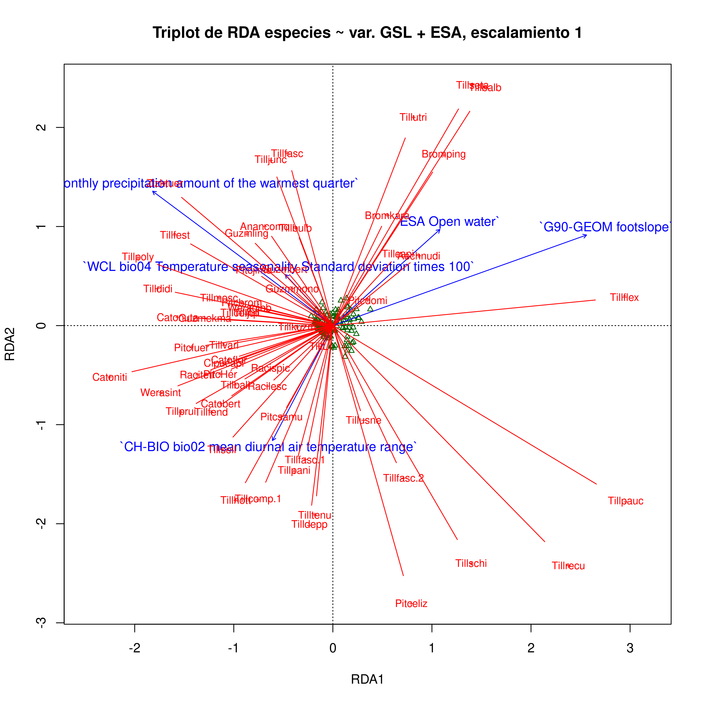<!-- -->

# Referencias
