Práctica 99. Resultados de tu manuscrito. Culicidae, análisis de
agrupamiento y de diversidad.
================
José Ramón Martínez Batlle
26-11-2022

NOTA. Este cuaderno es una aplicación a datos de Culicidae en GBIF, a
partir de una simple adaptación del cuaderno general
[practica-99-tu-manuscrito-3-resultados.md (basado en un análisis
demostrativo de la familia
Polygonaceae)](../practica-99-tu-manuscrito-3-resultados.md). Si
comparas este archivo con el original, notarás que, básicamente, edité
el nombre del archivo fuente de la matriz de comunidad (para adaptarlo a
este grupo) y otros detalles menores. Por lo tanto, aunque el código y
los gráficos sí se refieren a Culicidae, probablemente el texto no.

# ¿Qué contiene la sección “Resultados”?

Te recomiendo releer las normas para autores/as del [Anuario de
Investigaciones Científicas de la
UASD](../docs/instrucciones-para-autores-anuario-investigaciones-cientificas-UASD.pdf)
y adherirte a las especificaciones sobre la sección “Resultados” que
allí se indican. Aunque en las referidas normas no se incluyen muchas
pautas significativas, si escribieras para una revista específica,
deberás considerar sus normas y recomendaciones de publicación. Además,
te recomiendo que consultes la sección “Resultados” de algunos
manuscritos publicados en el Anuario.

En los resultados expones el contenido analítico central. Es “el qué”
del manuscrito, en complemento de “el cómo” (metodología) y “el por qué”
(introducción) de tu investigación. En los resultados muestras lo que
encontraste luego de que colectaste (aunque en este caso, no fuiste al
terreno) y analizaste, con tus métodos, los datos fuente.

Algunas recomendaciones generales:

- “Resultados” se supone que es la sección más corta del manuscrito,
  siempre que se usen apropiadamente los recursos gráficos, las tablas y
  la información suplementaria.

- Comienza por realizar tus análisis. Necesitarás una matriz de
  comunidad y una ambiental. La de comunidad la habrás generado en la
  práctica 2; la ambiental explico cómo generarla en este mismo cuaderno
  (ver abajo). En general, la matriz ambiental la producirás mediante
  estadísticos zonales del territorio dominicano. Para aprender más
  sobre la fuente de estadística zonal de República Dominicana, que
  contiene un conjunto de más de 100 variables resumidas por celdas H3,
  visita [este repo](https://github.com/geofis/zonal-statistics). Debes
  visitar dicho repo para poder citarlo apropiadamente.

- Cuando tengas análisis realizados, antes de comenzar a escribir, te
  recomiendo que escribas un guión de tu sección “Resultados”.

- Guión en mano, redacta tu sección “Resultados”, siguiendo también
  estos consejos:

- En esta sección, se espera que presentes lo que has obtenido de manera
  “objetiva”, evitando explicaciones, comentarios, opiniones,
  perspectivas o limitaciones. En teoría, tu redacción es “fría”, lo
  cual no necesariamente significa que tenga que ser aburrida.

- Esta es la sección por excelencia donde usarás *tablas y/o gráficos*.
  Lo más importante a tener en cuenta cuando los uses es que no debes
  duplicar el contenido que muestran dichos recursos en el texto. La
  tabla o gráfico son apoyos que te ayudarán a no entrar en densidades
  innecesarias dentro de los párrafos. Por lo tanto, si colocas una
  tabla o figura, no caigas en la tentación de describirla en párrafos
  de forma exhausitva. Estos recursos deben servir para apoyar el o los
  párrafos donde destacas los principales patrones encontrados.

- *Importante también*: si insertas una tabla o gráfico, debes referirla
  en el texto (e.g. “ver figura X”). De nada sirve incluir una figura o
  una tabla si no la refieres, porque con ello estarás sugiriendo que
  dicho recurso era completamente prescindible.

- El tiempo verbal preferido (por defecto) es el pasado, por ejemplo “…,
  donde se **encontró** una asociación significativa entre … y …”. Sin
  embargo, hay excepciones, como por ejemplo, cuando te refieres a una
  tabla o una figura. Un caso típico es la expresión “tal como se
  muestra en la tabla 1”, donde el verbo está conjugado en presente.

A continuación, te pongo enlaces a referencias que considero útiles,
sobre cómo redactar los resultados (algunas son generales, sobre
artículos en general):

- [Breves pautas, en
  inglés](https://www.editage.com/insights/the-secret-to-writing-the-results-and-discussion-section-of-a-manuscript).
  Puedes usar el traductor [DeepL](https://www.deepl.com/translator),
  porque produce frases más naturales.

Cinco guías, en inglés, que considero están bien elaboradas, sobre cómo
redactar un artículo científico (consulta la sección sobre cómo redactar
los *resultados* en cada una):

- [Demystifying the Journal
  Article](https://www.insidehighered.com/advice/2017/05/09/how-write-effective-journal-article-and-get-it-published-essay)

- [How to write a scientific manuscript for
  publication](https://www.ncbi.nlm.nih.gov/pmc/articles/PMC3626472/)

- [11 steps to structuring a science paper editors will take
  seriously](https://www.elsevier.com/connect/11-steps-to-structuring-a-science-paper-editors-will-take-seriously)

- [Cómo escribir un artículo científico por primera
  vez](https://www.sciencedirect.com/science/article/abs/pii/S1134593417300040)
  (necesitarás usar [SciHub](https://sci-hub.se/) para descargarlo)

- Una muy breve pero con consejos útiles: [Tips for writing the perfect
  IMRAD
  manuscript](https://www.editage.com/insights/tips-for-writing-the-perfect-imrad-manuscript)

# Scripts de ejemplo

Una nota, a título informativo. Cada una se las siguientes secciones
(e.g. “Análisis de agrupamiento”, “Ordenación restringida”), es
reproducible de forma autónoma, es decir, sin dependencia de líneas de
código anteriores. Esto siginifica que las dependencias de una sección
se resuelven dentro de ella misma, sin dependencia de líneas anteriores.

Por esta razón, varias secciones comparten texto y código común, pero
sólo al inicio, porque al avanzar cada una se hace propia. Notarás, por
lo tanto, que el texto “se repite a sí mismo” por esta razón; la otra
opción que tenía era alojar el código común en un único archivo, pero
entonces esto te obligaba a navegar por archivos separados, haciendo
menos didáctico este cuaderno.

## Análisis de agrupamiento

Me basaré en los scripts que comienzan por `aa_` de este
[repo](https://github.com/biogeografia-master/scripts-de-analisis-BCI),
los cuales explico en los vídeos de “Análisis de agrupamiento” (del 13
al 16) de la lista de reproducción [“Ecología Numérica con R” de mi
canal](https://www.youtube.com/playlist?list=PLDcT2n8UzsCRDqjqSeqHI1wsiNOqpYmsJ).

> INICIA texto+código común entre secciones

Fijar un directorio de trabajo no es recomendable, mejor trabaja por
proyecto. En cualquier caso, si no quieres o no puedes crear un
proyecto, usa la sentencia que verás abajo, cambiando `TU_DIRECTORIO`
por la ruta del directorio donde tengas almacenados tus datos y tus
scripts.

``` r
if(interactive()) {
  tryCatch(
    setwd(dirname(rstudioapi::getSourceEditorContext()$path)),
    error = function(e) {
      cat('Probablemente ya el directorio de trabajo está fijado correctamente',
          'o quizá el directorio no existe. Este fue el error devuelto:\n')
      e
    })
}
```

Cargar paquetes.

``` r
library(vegan)
library(sf)
library(tidyverse)
library(tmap)
library(kableExtra)
library(foreach)
library(leaps)
library(caret)
gh_content <- 'https://raw.githubusercontent.com/'
gh_zonal_stats <- paste0(gh_content,
                         'geofis/zonal-statistics/0b2e95aaee87bf326cf132d28f4bd15220bb4ec7/out/')
repo_analisis <- 'biogeografia-master/scripts-de-analisis-BCI/master'
repo_sem202202 <- 'biogeografia-202202/material-de-apoyo/master/practicas/'
devtools::source_url(paste0(gh_content, repo_analisis, '/biodata/funciones.R'))
devtools::source_url(paste0(gh_content, repo_sem202202, 'train.R'))
devtools::source_url(paste0(gh_content, repo_sem202202, 'funciones.R'))
```

Carga tu matriz de comunidad, que habrás generado en la práctica 2, y
elige un umbral para especies raras o rangos de registros de presencia
para seleccionar especies en una nueva matriz de comunidad.

``` r
res <- 6 #Resolución H3, puedes elegir entre 4, 5, 6 o 7, pero cuidado con valores >=6
# IMPORTANTE: la resolución de las celdas H3, debe coincidir con la resolución
# a la cual generaste tu matriz de comunidad. De lo contrario, obtendrás error. Si tu 
# archivo RDS de matriz de comunidad se denomina "matriz_de_comunidad.RDS", y lo creaste
# usando resolución 4, cámbiale el nombre a "matriz_de_comunidad_res_5.RDS". Recuerda,
# puedes usar cualquier resolución, lo único importante es que las resolución usada en la
# creación de la matriz de comunidad, debe ser la misma que en la ambiental.
# Prueba distintas resoluciones, no te enfrasques en quedarte con la misma que
# uso en este ejemplo. Prueba con resolución 5, por ejemplo.
mc_orig <- readRDS('matriz_de_comunidad_culicidae.RDS')
nrow(mc_orig) #Número de filas, equivale a número de hexágonos con registros de presencia
```

    ## [1] 61

``` r
ncol(mc_orig)  #Número de columnas, equivale a número de especies, riqueza
```

    ## [1] 50

``` r
data.frame(Especies = names(mc_orig)) %>% 
  kable(booktabs=T) %>%
  kable_styling(latex_options = c("HOLD_position", "scale_down")) %>%
  gsub(' NA ', '', .) #Lista de especies
```

<table class="table" style="margin-left: auto; margin-right: auto;">
<thead>
<tr>
<th style="text-align:left;">
Especies
</th>
</tr>
</thead>
<tbody>
<tr>
<td style="text-align:left;">
Psorophora ferox (Humboldt, 1819)
</td>
</tr>
<tr>
<td style="text-align:left;">
Aedes albopictus (Skuse, 1894)
</td>
</tr>
<tr>
<td style="text-align:left;">
Aedes aegypti (Linnaeus, 1762)
</td>
</tr>
<tr>
<td style="text-align:left;">
Toxorhynchites portoricensis (Röder, 1885)
</td>
</tr>
<tr>
<td style="text-align:left;">
Culicidae
</td>
</tr>
<tr>
<td style="text-align:left;">
Aedes albonotatus (Coquillett, 1906)
</td>
</tr>
<tr>
<td style="text-align:left;">
Aedes mediovittatus (Coquillett, 1906)
</td>
</tr>
<tr>
<td style="text-align:left;">
Aedes pertinax Grabham, 1906
</td>
</tr>
<tr>
<td style="text-align:left;">
Aedes scapularis (Rondani, 1848)
</td>
</tr>
<tr>
<td style="text-align:left;">
Aedes tortilis (Theobald, 1903)
</td>
</tr>
<tr>
<td style="text-align:left;">
Anopheles albimanus Wiedemann, 1820
</td>
</tr>
<tr>
<td style="text-align:left;">
Anopheles grabhamii Theobald, 1901
</td>
</tr>
<tr>
<td style="text-align:left;">
Culex atratus Theobald, 1901
</td>
</tr>
<tr>
<td style="text-align:left;">
Culex corniger Theobald, 1903
</td>
</tr>
<tr>
<td style="text-align:left;">
Culex janitor Theobald, 1903
</td>
</tr>
<tr>
<td style="text-align:left;">
Culex inhibitator Dyar & Knab, 1906
</td>
</tr>
<tr>
<td style="text-align:left;">
Culex nigripalpus Theobald, 1901
</td>
</tr>
<tr>
<td style="text-align:left;">
Culex pilosus (Dyar & Knab, 1906)
</td>
</tr>
<tr>
<td style="text-align:left;">
Culex secutor Theobald, 1901
</td>
</tr>
<tr>
<td style="text-align:left;">
Culex quinquefasciatus Say, 1823
</td>
</tr>
<tr>
<td style="text-align:left;">
Deinocerites cancer Theobald, 1901
</td>
</tr>
<tr>
<td style="text-align:left;">
Orthopodomyia signifera (Coquillett, 1896)
</td>
</tr>
<tr>
<td style="text-align:left;">
Psorophora infinis (Dyar & Knab, 1906)
</td>
</tr>
<tr>
<td style="text-align:left;">
Psorophora jamaicensis (Theobald, 1901)
</td>
</tr>
<tr>
<td style="text-align:left;">
Uranotaenia lowii Theobald, 1901
</td>
</tr>
<tr>
<td style="text-align:left;">
Wyeomyia mitchellii (Theobald, 1905)
</td>
</tr>
<tr>
<td style="text-align:left;">
Anopheles
</td>
</tr>
<tr>
<td style="text-align:left;">
Culex Linnaeus, 1758
</td>
</tr>
<tr>
<td style="text-align:left;">
Deinocerites Theobald, 1901
</td>
</tr>
<tr>
<td style="text-align:left;">
Wyeomyia sororcula Dyar & Knab, 1906
</td>
</tr>
<tr>
<td style="text-align:left;">
Aedes sollicitans (Walker, 1856)
</td>
</tr>
<tr>
<td style="text-align:left;">
Aedes taeniorhynchus (Wiedemann, 1821)
</td>
</tr>
<tr>
<td style="text-align:left;">
Culex bahamensis Dyar & Knab, 1906
</td>
</tr>
<tr>
<td style="text-align:left;">
Culex duplicator Dyar & Knab, 1909
</td>
</tr>
<tr>
<td style="text-align:left;">
Culex habilitator Dyar & Knab, 1906
</td>
</tr>
<tr>
<td style="text-align:left;">
Culex erraticus (Dyar & Knab, 1906)
</td>
</tr>
<tr>
<td style="text-align:left;">
Psorophora pygmaea (Theobald, 1903)
</td>
</tr>
<tr>
<td style="text-align:left;">
Psorophora insularia (Dyar & Knab, 1906)
</td>
</tr>
<tr>
<td style="text-align:left;">
Uranotaenia socialis Theobald, 1901
</td>
</tr>
<tr>
<td style="text-align:left;">
Wyeomyia nigritubus Galindo & Carpenter, 1951
</td>
</tr>
<tr>
<td style="text-align:left;">
Toxorhynchites Theobald, 1901
</td>
</tr>
<tr>
<td style="text-align:left;">
Psorophora johnstonii (Grabham, 1905)
</td>
</tr>
<tr>
<td style="text-align:left;">
Anopheles crucians Wiedemann, 1828
</td>
</tr>
<tr>
<td style="text-align:left;">
Anopheles vestitipennis Dyar & Kanb
</td>
</tr>
<tr>
<td style="text-align:left;">
Culex antillummagnorum Dyar, 1928
</td>
</tr>
<tr>
<td style="text-align:left;">
Culex bisulcatus (Coquillett, 1906)
</td>
</tr>
<tr>
<td style="text-align:left;">
Culex coronator Dyar & Knab, 1906
</td>
</tr>
<tr>
<td style="text-align:left;">
Culiseta Felt, 1904
</td>
</tr>
<tr>
<td style="text-align:left;">
Culex malariager Poinar, 2005
</td>
</tr>
<tr>
<td style="text-align:left;">
Anopheles dominicanus Zavortink & Poinar, 2000
</td>
</tr>
</tbody>
</table>

``` r
unique(word(names(mc_orig), 1, 1)) #Géneros representados
```

    ##  [1] "Psorophora"     "Aedes"          "Toxorhynchites" "Culicidae"     
    ##  [5] "Anopheles"      "Culex"          "Deinocerites"   "Orthopodomyia" 
    ##  [9] "Uranotaenia"    "Wyeomyia"       "Culiseta"

``` r
table(word(names(mc_orig), 1, 1)) #Número de especies por género
```

    ## 
    ##          Aedes      Anopheles          Culex      Culicidae       Culiseta 
    ##              9              6             17              1              1 
    ##   Deinocerites  Orthopodomyia     Psorophora Toxorhynchites    Uranotaenia 
    ##              2              1              6              2              2 
    ##       Wyeomyia 
    ##              3

``` r
data.frame(`Número de hexágonos` = sort(colSums(mc_orig), decreasing = T), check.names = F) %>% 
  kable(booktabs=T) %>%
  kable_styling(latex_options = c("HOLD_position", "scale_down")) %>%
  gsub(' NA ', '', .) # Número de hexágonos en los que está presente cada especie
```

<table class="table" style="margin-left: auto; margin-right: auto;">
<thead>
<tr>
<th style="text-align:left;">
</th>
<th style="text-align:right;">
Número de hexágonos
</th>
</tr>
</thead>
<tbody>
<tr>
<td style="text-align:left;">
Wyeomyia mitchellii (Theobald, 1905)
</td>
<td style="text-align:right;">
21
</td>
</tr>
<tr>
<td style="text-align:left;">
Anopheles albimanus Wiedemann, 1820
</td>
<td style="text-align:right;">
14
</td>
</tr>
<tr>
<td style="text-align:left;">
Aedes albonotatus (Coquillett, 1906)
</td>
<td style="text-align:right;">
13
</td>
</tr>
<tr>
<td style="text-align:left;">
Aedes scapularis (Rondani, 1848)
</td>
<td style="text-align:right;">
12
</td>
</tr>
<tr>
<td style="text-align:left;">
Culex nigripalpus Theobald, 1901
</td>
<td style="text-align:right;">
12
</td>
</tr>
<tr>
<td style="text-align:left;">
Psorophora jamaicensis (Theobald, 1901)
</td>
<td style="text-align:right;">
11
</td>
</tr>
<tr>
<td style="text-align:left;">
Wyeomyia sororcula Dyar & Knab, 1906
</td>
<td style="text-align:right;">
11
</td>
</tr>
<tr>
<td style="text-align:left;">
Aedes aegypti (Linnaeus, 1762)
</td>
<td style="text-align:right;">
9
</td>
</tr>
<tr>
<td style="text-align:left;">
Aedes tortilis (Theobald, 1903)
</td>
<td style="text-align:right;">
9
</td>
</tr>
<tr>
<td style="text-align:left;">
Culex Linnaeus, 1758
</td>
<td style="text-align:right;">
9
</td>
</tr>
<tr>
<td style="text-align:left;">
Culex quinquefasciatus Say, 1823
</td>
<td style="text-align:right;">
8
</td>
</tr>
<tr>
<td style="text-align:left;">
Toxorhynchites portoricensis (Röder, 1885)
</td>
<td style="text-align:right;">
7
</td>
</tr>
<tr>
<td style="text-align:left;">
Aedes pertinax Grabham, 1906
</td>
<td style="text-align:right;">
7
</td>
</tr>
<tr>
<td style="text-align:left;">
Anopheles grabhamii Theobald, 1901
</td>
<td style="text-align:right;">
7
</td>
</tr>
<tr>
<td style="text-align:left;">
Psorophora ferox (Humboldt, 1819)
</td>
<td style="text-align:right;">
6
</td>
</tr>
<tr>
<td style="text-align:left;">
Culex atratus Theobald, 1901
</td>
<td style="text-align:right;">
5
</td>
</tr>
<tr>
<td style="text-align:left;">
Culex secutor Theobald, 1901
</td>
<td style="text-align:right;">
5
</td>
</tr>
<tr>
<td style="text-align:left;">
Aedes albopictus (Skuse, 1894)
</td>
<td style="text-align:right;">
4
</td>
</tr>
<tr>
<td style="text-align:left;">
Aedes mediovittatus (Coquillett, 1906)
</td>
<td style="text-align:right;">
4
</td>
</tr>
<tr>
<td style="text-align:left;">
Culex inhibitator Dyar & Knab, 1906
</td>
<td style="text-align:right;">
4
</td>
</tr>
<tr>
<td style="text-align:left;">
Culex duplicator Dyar & Knab, 1909
</td>
<td style="text-align:right;">
4
</td>
</tr>
<tr>
<td style="text-align:left;">
Anopheles crucians Wiedemann, 1828
</td>
<td style="text-align:right;">
4
</td>
</tr>
<tr>
<td style="text-align:left;">
Culicidae
</td>
<td style="text-align:right;">
3
</td>
</tr>
<tr>
<td style="text-align:left;">
Psorophora infinis (Dyar & Knab, 1906)
</td>
<td style="text-align:right;">
3
</td>
</tr>
<tr>
<td style="text-align:left;">
Aedes taeniorhynchus (Wiedemann, 1821)
</td>
<td style="text-align:right;">
3
</td>
</tr>
<tr>
<td style="text-align:left;">
Culex corniger Theobald, 1903
</td>
<td style="text-align:right;">
2
</td>
</tr>
<tr>
<td style="text-align:left;">
Culex pilosus (Dyar & Knab, 1906)
</td>
<td style="text-align:right;">
2
</td>
</tr>
<tr>
<td style="text-align:left;">
Deinocerites cancer Theobald, 1901
</td>
<td style="text-align:right;">
2
</td>
</tr>
<tr>
<td style="text-align:left;">
Orthopodomyia signifera (Coquillett, 1896)
</td>
<td style="text-align:right;">
2
</td>
</tr>
<tr>
<td style="text-align:left;">
Uranotaenia lowii Theobald, 1901
</td>
<td style="text-align:right;">
2
</td>
</tr>
<tr>
<td style="text-align:left;">
Anopheles
</td>
<td style="text-align:right;">
2
</td>
</tr>
<tr>
<td style="text-align:left;">
Aedes sollicitans (Walker, 1856)
</td>
<td style="text-align:right;">
2
</td>
</tr>
<tr>
<td style="text-align:left;">
Culex bahamensis Dyar & Knab, 1906
</td>
<td style="text-align:right;">
2
</td>
</tr>
<tr>
<td style="text-align:left;">
Psorophora pygmaea (Theobald, 1903)
</td>
<td style="text-align:right;">
2
</td>
</tr>
<tr>
<td style="text-align:left;">
Uranotaenia socialis Theobald, 1901
</td>
<td style="text-align:right;">
2
</td>
</tr>
<tr>
<td style="text-align:left;">
Toxorhynchites Theobald, 1901
</td>
<td style="text-align:right;">
2
</td>
</tr>
<tr>
<td style="text-align:left;">
Culex janitor Theobald, 1903
</td>
<td style="text-align:right;">
1
</td>
</tr>
<tr>
<td style="text-align:left;">
Deinocerites Theobald, 1901
</td>
<td style="text-align:right;">
1
</td>
</tr>
<tr>
<td style="text-align:left;">
Culex habilitator Dyar & Knab, 1906
</td>
<td style="text-align:right;">
1
</td>
</tr>
<tr>
<td style="text-align:left;">
Culex erraticus (Dyar & Knab, 1906)
</td>
<td style="text-align:right;">
1
</td>
</tr>
<tr>
<td style="text-align:left;">
Psorophora insularia (Dyar & Knab, 1906)
</td>
<td style="text-align:right;">
1
</td>
</tr>
<tr>
<td style="text-align:left;">
Wyeomyia nigritubus Galindo & Carpenter, 1951
</td>
<td style="text-align:right;">
1
</td>
</tr>
<tr>
<td style="text-align:left;">
Psorophora johnstonii (Grabham, 1905)
</td>
<td style="text-align:right;">
1
</td>
</tr>
<tr>
<td style="text-align:left;">
Anopheles vestitipennis Dyar & Kanb
</td>
<td style="text-align:right;">
1
</td>
</tr>
<tr>
<td style="text-align:left;">
Culex antillummagnorum Dyar, 1928
</td>
<td style="text-align:right;">
1
</td>
</tr>
<tr>
<td style="text-align:left;">
Culex bisulcatus (Coquillett, 1906)
</td>
<td style="text-align:right;">
1
</td>
</tr>
<tr>
<td style="text-align:left;">
Culex coronator Dyar & Knab, 1906
</td>
<td style="text-align:right;">
1
</td>
</tr>
<tr>
<td style="text-align:left;">
Culiseta Felt, 1904
</td>
<td style="text-align:right;">
1
</td>
</tr>
<tr>
<td style="text-align:left;">
Culex malariager Poinar, 2005
</td>
<td style="text-align:right;">
1
</td>
</tr>
<tr>
<td style="text-align:left;">
Anopheles dominicanus Zavortink & Poinar, 2000
</td>
<td style="text-align:right;">
1
</td>
</tr>
</tbody>
</table>

``` r
# Usa el vector anterior para determinar un umbral o rango de registros para filtrar tu matriz
# ¿En cuántos hexágonos está cada especie? Filtra tus datos usando tu propio criterio.
# Especies que aparecen en pocos hexágonos se consideran "raras". Por ejemplo, si una especie sólo
# aparece en un hexágono en todo el país, es un "singleton", si en dos, "doubleton", y así.
# Estas especies podrían contribuir a generar "ruido" en análisis posteriores, se recomienda excluirlas.
# Elige un valor mínimo (representado por único número entero) o por un rango de enteros (e.g. de 10 a 20),
# para seleccionar las especies que estén mejor representadas de acuerdo a tu criterio.
# Por ejemplo, si usas el valor m, el script considerará a este valor como "el número mínimo de hexágonos
# en los que está representada una especie, y creará una matriz de comunidad de especies seleccionadas
# que están presentes en m hexágonos o más. Si eliges un rango, por ejemplo [m,n], el script generará
# una matriz de comunidad que representadas un mínimo de m hexágonos y un máximo de n hexágonos.
# (ambos extremos inclusive).
en_cuantos_hex <- 2
# Explicación: "en_cuantos_hex <- X", donde X es el número de hexágonos mínimo donde cada especie
# debe estar presente. IMPORTANTE: elige TU PROPIO umbral.
{if(length(en_cuantos_hex)==1) selector <- en_cuantos_hex:max(colSums(mc_orig)) else
  if(length(en_cuantos_hex)==2)
    selector <- min(en_cuantos_hex):max(en_cuantos_hex) else
      stop('Debes indicar uno o dos valores numéricos')}
selector
```

    ##  [1]  2  3  4  5  6  7  8  9 10 11 12 13 14 15 16 17 18 19 20 21

``` r
mc_orig_seleccionadas <- mc_orig[, colSums(mc_orig) %in% selector]

# Mínimo número de especies por hexágono
data.frame(`Número de especies por hexágono` = sort(rowSums(mc_orig), decreasing = T), check.names = F) %>% 
  kable(booktabs=T) %>%
  kable_styling(latex_options = c("HOLD_position", "scale_down")) %>%
  gsub(' NA ', '', .) # Número de hexágonos en los que está presente cada especie
```

<table class="table" style="margin-left: auto; margin-right: auto;">
<thead>
<tr>
<th style="text-align:left;">
</th>
<th style="text-align:right;">
Número de especies por hexágono
</th>
</tr>
</thead>
<tbody>
<tr>
<td style="text-align:left;">
864cd42dfffffff
</td>
<td style="text-align:right;">
31
</td>
</tr>
<tr>
<td style="text-align:left;">
864cd0937ffffff
</td>
<td style="text-align:right;">
21
</td>
</tr>
<tr>
<td style="text-align:left;">
864cf318fffffff
</td>
<td style="text-align:right;">
11
</td>
</tr>
<tr>
<td style="text-align:left;">
864cd0907ffffff
</td>
<td style="text-align:right;">
11
</td>
</tr>
<tr>
<td style="text-align:left;">
864cd4207ffffff
</td>
<td style="text-align:right;">
10
</td>
</tr>
<tr>
<td style="text-align:left;">
864c8989fffffff
</td>
<td style="text-align:right;">
9
</td>
</tr>
<tr>
<td style="text-align:left;">
864cf30cfffffff
</td>
<td style="text-align:right;">
8
</td>
</tr>
<tr>
<td style="text-align:left;">
864c8b947ffffff
</td>
<td style="text-align:right;">
8
</td>
</tr>
<tr>
<td style="text-align:left;">
864cd5127ffffff
</td>
<td style="text-align:right;">
6
</td>
</tr>
<tr>
<td style="text-align:left;">
864cf30d7ffffff
</td>
<td style="text-align:right;">
6
</td>
</tr>
<tr>
<td style="text-align:left;">
864cd4d8fffffff
</td>
<td style="text-align:right;">
6
</td>
</tr>
<tr>
<td style="text-align:left;">
864cf2257ffffff
</td>
<td style="text-align:right;">
5
</td>
</tr>
<tr>
<td style="text-align:left;">
864cf32a7ffffff
</td>
<td style="text-align:right;">
5
</td>
</tr>
<tr>
<td style="text-align:left;">
864c8b977ffffff
</td>
<td style="text-align:right;">
5
</td>
</tr>
<tr>
<td style="text-align:left;">
864cd4717ffffff
</td>
<td style="text-align:right;">
5
</td>
</tr>
<tr>
<td style="text-align:left;">
864cf3427ffffff
</td>
<td style="text-align:right;">
5
</td>
</tr>
<tr>
<td style="text-align:left;">
864cf30dfffffff
</td>
<td style="text-align:right;">
4
</td>
</tr>
<tr>
<td style="text-align:left;">
864cd4277ffffff
</td>
<td style="text-align:right;">
4
</td>
</tr>
<tr>
<td style="text-align:left;">
864cd468fffffff
</td>
<td style="text-align:right;">
4
</td>
</tr>
<tr>
<td style="text-align:left;">
864cf3707ffffff
</td>
<td style="text-align:right;">
3
</td>
</tr>
<tr>
<td style="text-align:left;">
864cd425fffffff
</td>
<td style="text-align:right;">
3
</td>
</tr>
<tr>
<td style="text-align:left;">
864cd424fffffff
</td>
<td style="text-align:right;">
3
</td>
</tr>
<tr>
<td style="text-align:left;">
864cd408fffffff
</td>
<td style="text-align:right;">
3
</td>
</tr>
<tr>
<td style="text-align:left;">
864cd4c57ffffff
</td>
<td style="text-align:right;">
3
</td>
</tr>
<tr>
<td style="text-align:left;">
864c89ba7ffffff
</td>
<td style="text-align:right;">
3
</td>
</tr>
<tr>
<td style="text-align:left;">
864cd42f7ffffff
</td>
<td style="text-align:right;">
2
</td>
</tr>
<tr>
<td style="text-align:left;">
864cd42e7ffffff
</td>
<td style="text-align:right;">
2
</td>
</tr>
<tr>
<td style="text-align:left;">
864cf362fffffff
</td>
<td style="text-align:right;">
2
</td>
</tr>
<tr>
<td style="text-align:left;">
864cf3627ffffff
</td>
<td style="text-align:right;">
2
</td>
</tr>
<tr>
<td style="text-align:left;">
864cf372fffffff
</td>
<td style="text-align:right;">
2
</td>
</tr>
<tr>
<td style="text-align:left;">
866725bafffffff
</td>
<td style="text-align:right;">
2
</td>
</tr>
<tr>
<td style="text-align:left;">
864cd42c7ffffff
</td>
<td style="text-align:right;">
2
</td>
</tr>
<tr>
<td style="text-align:left;">
864cd4cdfffffff
</td>
<td style="text-align:right;">
2
</td>
</tr>
<tr>
<td style="text-align:left;">
864cf26cfffffff
</td>
<td style="text-align:right;">
2
</td>
</tr>
<tr>
<td style="text-align:left;">
864cd4d67ffffff
</td>
<td style="text-align:right;">
2
</td>
</tr>
<tr>
<td style="text-align:left;">
864cd4127ffffff
</td>
<td style="text-align:right;">
2
</td>
</tr>
<tr>
<td style="text-align:left;">
864cd4ce7ffffff
</td>
<td style="text-align:right;">
2
</td>
</tr>
<tr>
<td style="text-align:left;">
864cd488fffffff
</td>
<td style="text-align:right;">
2
</td>
</tr>
<tr>
<td style="text-align:left;">
864cf20dfffffff
</td>
<td style="text-align:right;">
1
</td>
</tr>
<tr>
<td style="text-align:left;">
864cd6a17ffffff
</td>
<td style="text-align:right;">
1
</td>
</tr>
<tr>
<td style="text-align:left;">
864cd28a7ffffff
</td>
<td style="text-align:right;">
1
</td>
</tr>
<tr>
<td style="text-align:left;">
864cf26efffffff
</td>
<td style="text-align:right;">
1
</td>
</tr>
<tr>
<td style="text-align:left;">
864c898efffffff
</td>
<td style="text-align:right;">
1
</td>
</tr>
<tr>
<td style="text-align:left;">
864cd091fffffff
</td>
<td style="text-align:right;">
1
</td>
</tr>
<tr>
<td style="text-align:left;">
864c89a2fffffff
</td>
<td style="text-align:right;">
1
</td>
</tr>
<tr>
<td style="text-align:left;">
864cd4a2fffffff
</td>
<td style="text-align:right;">
1
</td>
</tr>
<tr>
<td style="text-align:left;">
864cd4257ffffff
</td>
<td style="text-align:right;">
1
</td>
</tr>
<tr>
<td style="text-align:left;">
864cd6c57ffffff
</td>
<td style="text-align:right;">
1
</td>
</tr>
<tr>
<td style="text-align:left;">
864cd4487ffffff
</td>
<td style="text-align:right;">
1
</td>
</tr>
<tr>
<td style="text-align:left;">
864cd495fffffff
</td>
<td style="text-align:right;">
1
</td>
</tr>
<tr>
<td style="text-align:left;">
864cd0927ffffff
</td>
<td style="text-align:right;">
1
</td>
</tr>
<tr>
<td style="text-align:left;">
864cd5dafffffff
</td>
<td style="text-align:right;">
1
</td>
</tr>
<tr>
<td style="text-align:left;">
864cd49afffffff
</td>
<td style="text-align:right;">
1
</td>
</tr>
<tr>
<td style="text-align:left;">
864cd4c0fffffff
</td>
<td style="text-align:right;">
1
</td>
</tr>
<tr>
<td style="text-align:left;">
864c8932fffffff
</td>
<td style="text-align:right;">
1
</td>
</tr>
<tr>
<td style="text-align:left;">
864cd4167ffffff
</td>
<td style="text-align:right;">
1
</td>
</tr>
<tr>
<td style="text-align:left;">
864cd476fffffff
</td>
<td style="text-align:right;">
1
</td>
</tr>
<tr>
<td style="text-align:left;">
864cf269fffffff
</td>
<td style="text-align:right;">
1
</td>
</tr>
<tr>
<td style="text-align:left;">
864c89b27ffffff
</td>
<td style="text-align:right;">
1
</td>
</tr>
<tr>
<td style="text-align:left;">
864c89317ffffff
</td>
<td style="text-align:right;">
1
</td>
</tr>
<tr>
<td style="text-align:left;">
864c89b0fffffff
</td>
<td style="text-align:right;">
1
</td>
</tr>
</tbody>
</table>

``` r
min_especies_por_hex <- 2
# Explicación: "min_especies_por_hex <- Y", donde Y es el número mínimo (inclusive) de especies
# que debe existir en cada hexágono. Por debajo de dicho valor, el hexágono es excluido.
mi_fam <- mc_orig_seleccionadas[rowSums(mc_orig_seleccionadas)>=min_especies_por_hex, ]
nrow(mi_fam)
```

    ## [1] 36

``` r
# mi_fam <- mc_orig_seleccionadas[!rowSums(mc_orig_seleccionadas)==0, ] #Elimina filas sin registros
# rowSums(mi_fam) #Riqueza por hexágonos con especies seleccionadas. Comentado por extenso
all(rowSums(mi_fam)>0) #Debe ser TRUE: todos los hexágonos tienen al menos 1 registro
```

    ## [1] TRUE

``` r
ncol(mi_fam) #Riqueza de especies
```

    ## [1] 36

``` r
# Usar nombres cortos o abreviados para las especies
nombres_largos <- colnames(mi_fam)
(colnames(mi_fam) <- make.cepnames(word(colnames(mi_fam), 1, 2)))
```

    ##  [1] "Psorfero"   "Aedealbo"   "Aedeaegy"   "Toxoport"   "NA."       
    ##  [6] "Aedealbo.1" "Aedemedi"   "Aedepert"   "Aedescap"   "Aedetort"  
    ## [11] "Anopalbi"   "Anopgrab"   "Culeatra"   "Culecorn"   "Culeinhi"  
    ## [16] "Culenigr"   "Culepilo"   "Culesecu"   "Culequin"   "Deincanc"  
    ## [21] "Orthsign"   "Psorinfi"   "Psorjama"   "Uranlowi"   "Wyeomitc"  
    ## [26] "NA..1"      "CuleLinn"   "Wyeosoro"   "Aedesoll"   "Aedetaen"  
    ## [31] "Culebaha"   "Culedupl"   "Psorpygm"   "Uransoci"   "ToxoTheo"  
    ## [36] "Anopcruc"

``` r
(df_equivalencias <- data.frame(
  nombre_original = nombres_largos,
  abreviado = colnames(mi_fam)))
```

    ##                               nombre_original  abreviado
    ## 1           Psorophora ferox (Humboldt, 1819)   Psorfero
    ## 2              Aedes albopictus (Skuse, 1894)   Aedealbo
    ## 3              Aedes aegypti (Linnaeus, 1762)   Aedeaegy
    ## 4  Toxorhynchites portoricensis (Röder, 1885)   Toxoport
    ## 5                                   Culicidae        NA.
    ## 6        Aedes albonotatus (Coquillett, 1906) Aedealbo.1
    ## 7      Aedes mediovittatus (Coquillett, 1906)   Aedemedi
    ## 8                Aedes pertinax Grabham, 1906   Aedepert
    ## 9            Aedes scapularis (Rondani, 1848)   Aedescap
    ## 10            Aedes tortilis (Theobald, 1903)   Aedetort
    ## 11        Anopheles albimanus Wiedemann, 1820   Anopalbi
    ## 12         Anopheles grabhamii Theobald, 1901   Anopgrab
    ## 13               Culex atratus Theobald, 1901   Culeatra
    ## 14              Culex corniger Theobald, 1903   Culecorn
    ## 15        Culex inhibitator Dyar & Knab, 1906   Culeinhi
    ## 16           Culex nigripalpus Theobald, 1901   Culenigr
    ## 17          Culex pilosus (Dyar & Knab, 1906)   Culepilo
    ## 18               Culex secutor Theobald, 1901   Culesecu
    ## 19           Culex quinquefasciatus Say, 1823   Culequin
    ## 20         Deinocerites cancer Theobald, 1901   Deincanc
    ## 21 Orthopodomyia signifera (Coquillett, 1896)   Orthsign
    ## 22     Psorophora infinis (Dyar & Knab, 1906)   Psorinfi
    ## 23    Psorophora jamaicensis (Theobald, 1901)   Psorjama
    ## 24           Uranotaenia lowii Theobald, 1901   Uranlowi
    ## 25       Wyeomyia mitchellii (Theobald, 1905)   Wyeomitc
    ## 26                                  Anopheles      NA..1
    ## 27                       Culex Linnaeus, 1758   CuleLinn
    ## 28       Wyeomyia sororcula Dyar & Knab, 1906   Wyeosoro
    ## 29           Aedes sollicitans (Walker, 1856)   Aedesoll
    ## 30     Aedes taeniorhynchus (Wiedemann, 1821)   Aedetaen
    ## 31         Culex bahamensis Dyar & Knab, 1906   Culebaha
    ## 32         Culex duplicator Dyar & Knab, 1909   Culedupl
    ## 33        Psorophora pygmaea (Theobald, 1903)   Psorpygm
    ## 34        Uranotaenia socialis Theobald, 1901   Uransoci
    ## 35              Toxorhynchites Theobald, 1901   ToxoTheo
    ## 36         Anopheles crucians Wiedemann, 1828   Anopcruc

Transforma la matriz de comunidad. Este paso es importante, lo explico
[aquí](https://www.youtube.com/watch?v=yQ10lp0-nHc&list=PLDcT2n8UzsCRDqjqSeqHI1wsiNOqpYmsJ&index=10)

``` r
mi_fam_t <- decostand(mi_fam, 'hellinger') #Hellinger
# Otras transformaciones posibles con datos de presencia/ausencia
# mi_fam_t <- decostand(mi_fam, 'normalize') #Chord
# mi_fam_t <- decostand(log1p(mi_fam), 'normalize') #Chord
# mi_fam_t <- decostand(mi_fam, 'chi.square') #Chi-square
```

Genera la matriz ambiental a partir del archivo de estadística zonal por
celdas H3 de República Dominicana, de acuerdo con la resolución que
prefieras. Para el ejemplo, usé la resolución 5, pero puedes usar/probar
con otra, para lo cual, sólo tendrías que cambiar el objeto `res <- X`,
donde `X` puede ser un número cualquiera entre 4 y 7.

Para aprender más sobre la fuente de estadística zonal de República
Dominicana, que contiene un conjunto de más de 100 variables resumidas
por celdas H3, visita [este
repo](https://github.com/geofis/zonal-statistics). Debes visitar dicho
repo para poder citarlo apropiadamente.

``` r
#Matriz ambiental
tmpfile <- tempfile()
download.file(
  url = paste0(gh_zonal_stats, 'list_with_all_sources_all_resolution.RDS'),
  tmpfile, method = if(Sys.info()[['sysname']]=='Windows') 'curl' else 'libcurl')
tmprds <- readRDS(tmpfile)
za <- tmprds[[paste0('H3 resolution: ', res)]]
unlink(tmpfile)
# Las siguientes líneas están comentadas, porque producen muchos mapas. Descoméntalas y ejecútalas si quieres verlos
# za %>% st_as_sf('geom') %>%
#   pivot_longer(cols = -matches('base|hex_id|geom')) %>% 
#   tm_shape() + tm_fill(col = 'value') +
#   tm_facets(by = 'name', free.scales = T)
za_intermedia <- za %>%
  st_drop_geometry() %>% 
  select(-matches(c(' base'))) %>% 
  column_to_rownames('hex_id')
env <- za_intermedia[match(rownames(mi_fam), rownames(za_intermedia)), ]
all(rownames(mi_fam) == rownames(env)) #Si es TRUE, sigue adelante
```

    ## [1] TRUE

Se puede probar con un subconjunto de variables, generando una matriz
ambiental que seleccione variables según el grupo al que pertenecen, con
ayuda del prefijo.

``` r
# env_selecionada <- env %>%
#   st_drop_geometry() %>%
#   dplyr::select(matches('^ESA '))
# env_selecionada <- env %>%
#   st_drop_geometry() %>%
#   dplyr::select(matches('^G90-GEOM '))
# env_selecionada <- env %>%
#   st_drop_geometry() %>%
#   dplyr::select(matches('^CH-BIO '))
# env_selecionada <- env %>%
#   st_drop_geometry() %>%
#   dplyr::select(matches('^GHH '))
# env_selecionada <- env %>%
#   st_drop_geometry() %>%
#   dplyr::select(matches('^GSL '))
# env_selecionada <- env %>%
#   st_drop_geometry() %>%
#   dplyr::select(matches('^CGL '))
```

> FINALIZA texto+código común entre secciones

### Clúster análisis usando distintos métodos. Interpretación y comparación de resultados

> No olvides ejecutar la parte de código común y reutilizable situada
> arriba. Esta subsección necesita de objetos creados en líneas de
> código previas.

A continuación, el **análisis de agrupamiento** propiamente. La parte
más importante es generar un árbol, a partir de una matriz de
distancias, que haga sentido desde el punto de vista de la comunidad y
la distribución de las especies tal como se encuentran en GBIF. Primero
cargaré paquetes específicos de esta técnica y generaré la matriz de
distancias.

``` r
library(broom)
library(cluster)
library(gclus)
library(pvclust)
mi_fam_d <- vegdist(mi_fam_t, "euc")
```

A continuación, generaré árboles usando distintos métodos, explicados en
el
[repo](https://github.com/biogeografia-master/scripts-de-analisis-BCI),
y en los vídeos (13 a 16) de la lista mencionada arriba [“Ecología
Numérica con R” de mi
canal](https://www.youtube.com/playlist?list=PLDcT2n8UzsCRDqjqSeqHI1wsiNOqpYmsJ).

``` r
lista_cl <- list(
        cl_single = hclust(mi_fam_d, method = 'single'),
        cl_complete = hclust(mi_fam_d, method = 'complete'),
        cl_upgma = hclust(mi_fam_d, method = 'average'),
        cl_ward = hclust(mi_fam_d, method = 'ward.D2')
)
par(mfrow = c(2,2))
invisible(map(names(lista_cl), function(x) plot(lista_cl[[x]], main = x, hang = -1, cex = 0.3)))
```

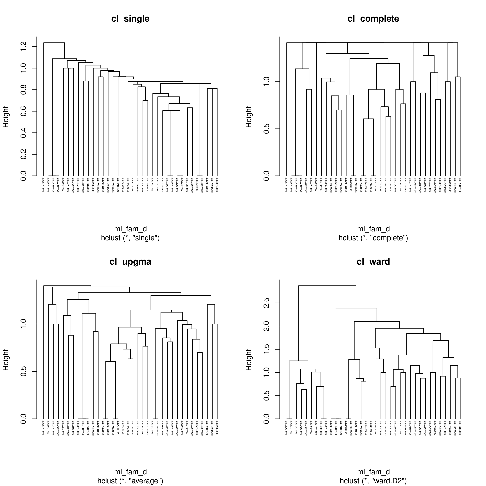<!-- -->

``` r
par(mfrow = c(1,1))
```

A continuación, calcularé la distancia y la correlación cofenéticas. Se
supone que el método con la mayor correlación cofenética explica mejor
el agrupamiento de la comunidad. Consulta el vídeo y material de
referencia. Normalmente, el método UPGMA obtiene la mayor correlación
cofenética, pero esto se debe a que su procedimiento maximiza
precisamente dicha métrica. No es recomendable conservar un único método
de agrupamiento, normalmente es bueno usar al menos dos. Ward es muchas
veces recomendado por basarse en procedimientos de cálculo muy distintos
a los de UPGMA. Consulta referencias.

``` r
map_df(lista_cl, function(x) {
        coph_d <- cophenetic(x)
        corr <- cor(mi_fam_d, coph_d)
        return(corr)
})
```

    ## # A tibble: 1 × 4
    ##   cl_single cl_complete cl_upgma cl_ward
    ##       <dbl>       <dbl>    <dbl>   <dbl>
    ## 1     0.817       0.815    0.876   0.553

Ahora, calcularé las anchuras de silueta, una métrica que ayuda a
determinar en cuántos grupos se organiza la comunidad. En el ejemplo,
dado que muchas especies de Polygonaceae están ausentes en muchos
hexágonos, es esperable que el procedimiento sugiera un número de grupos
alto denominados (ver objeto impreso `n_grupos_optimos`). Considera la
siguiente regla general: muchos grupos: el número ideal es 3 grupos, de
4 a 6 grupos es aceptable, 7 o más grupos se considera mucho y difícil
de interpretar, es un resultado poco útil; 1 grupo es un resultado sin
sentido.

``` r
# UPGMA
anch_sil_upgma <- calcular_anchuras_siluetas(
        mc_orig = mi_fam, 
        distancias = mi_fam_d, 
        cluster = lista_cl$cl_upgma)
anch_sil_upgma
```

    ## $anchuras_siluetas
    ##  [1] 0.00000000 0.12529994 0.13969553 0.17178084 0.16926941 0.18631702
    ##  [7] 0.16956144 0.15964016 0.17455048 0.18792473 0.22718795 0.22171510
    ## [13] 0.21136370 0.20207882 0.19814664 0.19345867 0.19650404 0.23149858
    ## [19] 0.23018286 0.22499055 0.21879986 0.21029237 0.20104649 0.19959012
    ## [25] 0.19810043 0.21554776 0.20550889 0.20378094 0.19450763 0.18679298
    ## [31] 0.25000000 0.16666667 0.16666667 0.11111111 0.05555556 0.00000000
    ## 
    ## $n_grupos_optimo
    ## [1] 31

``` r
u_dend_reord <- reorder.hclust(lista_cl$cl_upgma, mi_fam_d)
plot(u_dend_reord, hang = -1)
rect.hclust(
        tree = u_dend_reord,
        k = anch_sil_upgma$n_grupos_optimo)
```

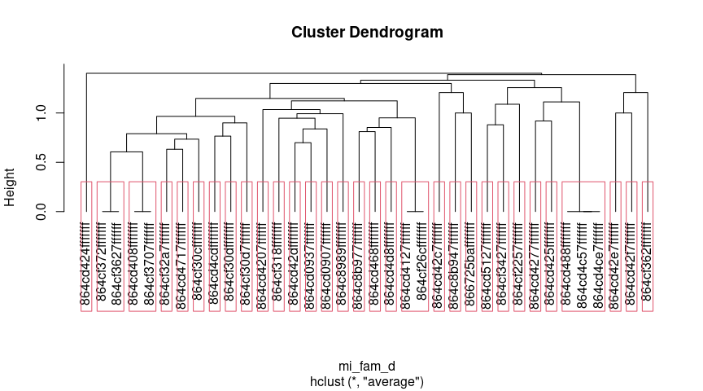<!-- -->

Método Ward.

``` r
# Ward
anch_sil_ward <- calcular_anchuras_siluetas(
        mc_orig = mi_fam, 
        distancias = mi_fam_d, 
        cluster = lista_cl$cl_ward)
anch_sil_ward
```

    ## $anchuras_siluetas
    ##  [1] 0.00000000 0.11746053 0.18030090 0.18739725 0.20270499 0.21419284
    ##  [7] 0.23125384 0.23800293 0.23578049 0.24210179 0.23807189 0.25773996
    ## [13] 0.26356391 0.25815817 0.25506275 0.26812602 0.27098491 0.27845565
    ## [19] 0.27075829 0.26682611 0.26430945 0.26496072 0.25976841 0.25126092
    ## [25] 0.24868054 0.24535833 0.24386864 0.24493332 0.26249746 0.25322416
    ## [31] 0.25000000 0.16666667 0.16666667 0.11111111 0.05555556 0.00000000
    ## 
    ## $n_grupos_optimo
    ## [1] 18

``` r
w_dend_reord <- reorder.hclust(lista_cl$cl_ward, mi_fam_d)
plot(w_dend_reord, hang = -1)
rect.hclust(
        tree = w_dend_reord,
        k = anch_sil_ward$n_grupos_optimo)
```

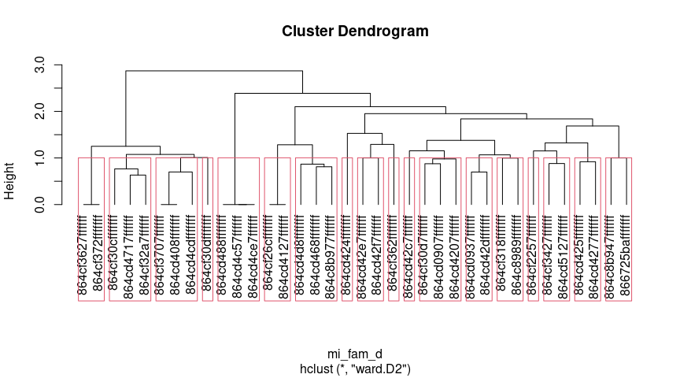<!-- -->

EXPLORA TUS RESULTADOS (usa como referencia
[practica-99-tu-manuscrito-3-resultados.md](../practica-99-tu-manuscrito-3-resultados.md)
y el vídeo correspondiente a tu caso)

``` r
# UPGMA
if(interactive()) dev.new()
cl_pvclust_upgma <-
        pvclust(t(mi_fam_t),
                method.hclust = "average",
                method.dist = "euc",
                iseed = 999, # Resultado reproducible
                parallel = TRUE)
```

    ## Creating a temporary cluster...done:
    ## socket cluster with 7 nodes on host 'localhost'
    ## Multiscale bootstrap... Done.

``` r
# Añadir los valores de p
plot(cl_pvclust_upgma, hang = -1)
# Añadir rectángulos a los grupos significativos
lines(cl_pvclust_upgma)
pvrect(cl_pvclust_upgma, alpha = 0.90, border = 4)
```

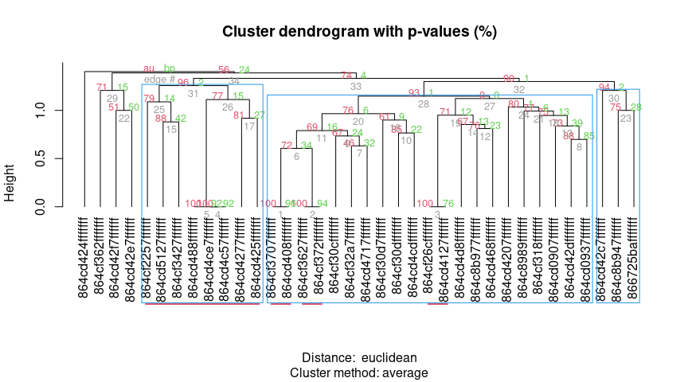<!-- -->

EXPLORA TUS RESULTADOS (usa como referencia
[practica-99-tu-manuscrito-3-resultados.md](../practica-99-tu-manuscrito-3-resultados.md)
y el vídeo correspondiente a tu caso)

``` r
# Ward
if(interactive()) dev.new()
cl_pvclust_ward <-
        pvclust(t(mi_fam_t),
                method.hclust = "ward.D2",
                method.dist = "euc",
                iseed = 999, # Resultado reproducible
                parallel = TRUE)
```

    ## Creating a temporary cluster...done:
    ## socket cluster with 7 nodes on host 'localhost'
    ## Multiscale bootstrap... Done.

``` r
# Añadir los valores de p
plot(cl_pvclust_ward, hang = -1)
# Añadir rectángulos a los grupos significativos
lines(cl_pvclust_ward)
pvrect(cl_pvclust_ward, alpha = 0.91, border = 4)
```

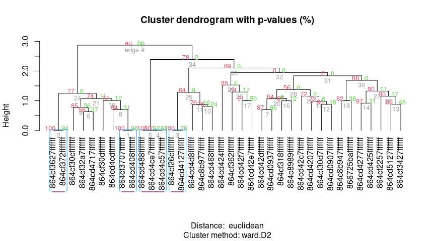<!-- -->

Generaré agrupamientos y los exportaré a archivos, para reutilizarlos
más adelante. Elegir un número de grupos no es tarea sencilla, por el
momento probaré con el número de grupos `k` del siguiente bloque de
código, el cual me permitirá caracterízar los distintos hábitats más
fácilmente en función de las variables ambientales.

``` r
k <- 3
# UPGMA
grupos_upgma <- as.factor(cutree(lista_cl$cl_upgma, k = k))
set.seed(999);sample(grupos_upgma, 10) #¿A qué grupo pertenecen 10 hexágonos seleccionados al azar?
```

    ## 864cd42c7ffffff 864cd42e7ffffff 864cf3707ffffff 864cd0907ffffff 864cd5127ffffff 
    ##               1               2               1               1               1 
    ## 864c8989fffffff 864cf318fffffff 864cd425fffffff 864cd42dfffffff 864cd424fffffff 
    ##               1               1               1               1               3 
    ## Levels: 1 2 3

``` r
table(grupos_upgma) #¿Cuántos hexágonos hay en cada grupo?
```

    ## grupos_upgma
    ##  1  2  3 
    ## 32  3  1

``` r
plot(u_dend_reord, hang = -1)
rect.hclust(tree = u_dend_reord, k = k)
```

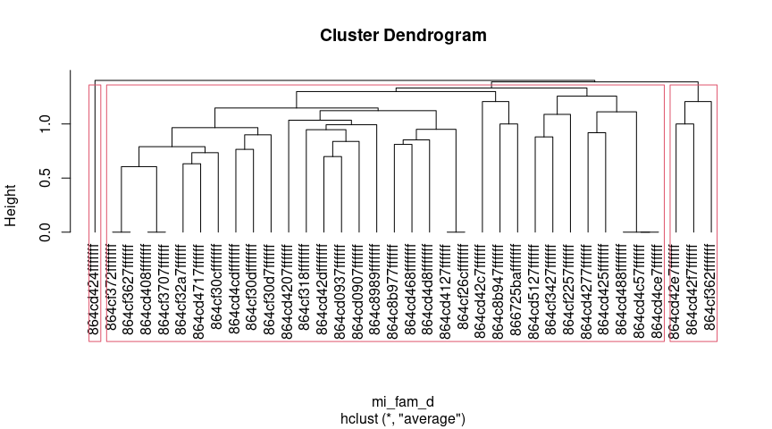<!-- -->

``` r
# Ward
grupos_ward <- as.factor(cutree(lista_cl$cl_ward, k = k))
set.seed(999);sample(grupos_ward, 10) #¿A qué grupo pertenecen 10 hexágonos seleccionados al azar?
```

    ## 864cd42c7ffffff 864cd42e7ffffff 864cf3707ffffff 864cd0907ffffff 864cd5127ffffff 
    ##               1               1               2               1               1 
    ## 864c8989fffffff 864cf318fffffff 864cd425fffffff 864cd42dfffffff 864cd424fffffff 
    ##               1               1               1               1               1 
    ## Levels: 1 2 3

``` r
table(grupos_ward) #¿Cuántos hexágonos hay en cada grupo?
```

    ## grupos_ward
    ##  1  2  3 
    ## 24  9  3

``` r
plot(w_dend_reord, hang = -1)
rect.hclust(tree = w_dend_reord, k = k)
```

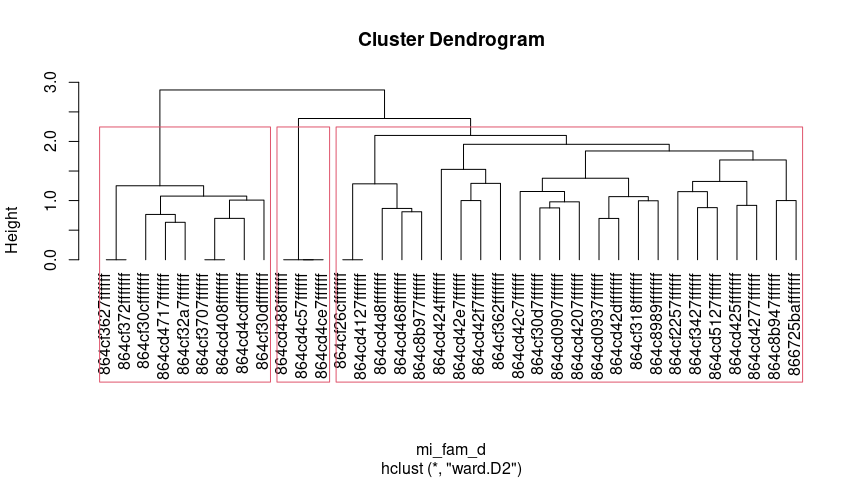<!-- -->

``` r
# Guardaré estos vectores en archivos para reutilizarlos en *scripts* posteriores: 
saveRDS(grupos_upgma, 'grupos_upgma_culicidae.RDS')
saveRDS(grupos_ward, 'grupos_ward_culicidae.RDS')
```

### Grupos (clústers), variables ambientales y mapas

> No olvides ejecutar la parte de código común y reutilizable situada
> arriba. Esta subsección necesita de objetos creados en líneas de
> código previas.

Apliquemos el análisis de agrupamiento a la matriz ambiental. La clave
en este punto es que, si la matriz ambiental presenta patrones parecidos
a los de la matriz de comunidad, significa que el agrupamiento utilizado
hace sentido entre ambos conjuntos de datos (comunidad y hábitat) de
forma consistente. Si ambos conjuntos de datos son consistentes,
significa que existe algún grado de asociación.

Cargar paquetes necesarios para esta subsección.

``` r
library(RColorBrewer)
library(leaflet)
library(leaflet.extras)
```

Agrupar los hexágonos de la matriz ambiental.

``` r
# (m_amb_upgma <- env %>%
#    rownames_to_column('hex_id') %>% 
#    mutate(grupos_upgma) %>%
#    pivot_longer(-c(grupos_upgma, hex_id), names_to = "variable", values_to = "valor") %>% 
#    inner_join(za %>% select(hex_id)))

(m_amb_ward <- env %>%
    rownames_to_column('hex_id') %>% 
    mutate(grupos_ward) %>%
    pivot_longer(-c(grupos_ward, hex_id), names_to = "variable", values_to = "valor") %>% 
    inner_join(za %>% select(hex_id)))
```

    ## # A tibble: 4,896 × 5
    ##    hex_id          grupos_ward variable          valor                  geometry
    ##    <chr>           <fct>       <chr>             <dbl>             <POLYGON [°]>
    ##  1 864cd5127ffffff 1           ESA Trees       1.34e+1 ((-69.31391 18.50197, -6…
    ##  2 864cd5127ffffff 1           ESA Shrubland   9.13e-4 ((-69.31391 18.50197, -6…
    ##  3 864cd5127ffffff 1           ESA Grassland   2.89e+1 ((-69.31391 18.50197, -6…
    ##  4 864cd5127ffffff 1           ESA Cropland    1.81e+0 ((-69.31391 18.50197, -6…
    ##  5 864cd5127ffffff 1           ESA Built-up    4.65e+1 ((-69.31391 18.50197, -6…
    ##  6 864cd5127ffffff 1           ESA Barren / s… 6.20e-1 ((-69.31391 18.50197, -6…
    ##  7 864cd5127ffffff 1           ESA Open water  3.51e+0 ((-69.31391 18.50197, -6…
    ##  8 864cd5127ffffff 1           ESA Herbaceous… 3.71e-2 ((-69.31391 18.50197, -6…
    ##  9 864cd5127ffffff 1           ESA Mangroves   5.27e+0 ((-69.31391 18.50197, -6…
    ## 10 864cd5127ffffff 1           CGL Closed for… 0       ((-69.31391 18.50197, -6…
    ## # … with 4,886 more rows

Evaluar efectos entre los grupos (“diferencias significativas”) de los
agrupamientos UPGMA y Ward. Al tratarse de 6 grupos, se utilizan las
pruebas estadísticas ANOVA (evalúa homongeneidad de medias) y
Kruskal-Wallis (evalúa homogeneidad de medianas). Las tablas están
ordenadas en orden ascendente por la columna `p_valor_a`, que son los
p-valores de la prueba ANOVA.

``` r
# UPGMA
# m_amb_upgma_ak <- m_amb_upgma %>%
#   group_by(variable) %>%
#   summarise(
#     p_valor_a = tryCatch(oneway.test(valor ~ grupos_upgma)$p.value, error = function(e) NA),
#     p_valor_k = tryCatch(kruskal.test(valor ~ grupos_upgma)$p.value, error = function(e) NA)
#     ) %>%
#   arrange(p_valor_a)
# m_amb_upgma_ak %>%
#   kable(booktabs=T) %>%
#   kable_styling(latex_options = c("HOLD_position", "scale_down")) %>%
#   gsub(' NA ', '', .)

# Ward
m_amb_ward_ak <- m_amb_ward %>%
  group_by(variable) %>%
  summarise(
    p_valor_a = tryCatch(oneway.test(valor ~ grupos_ward)$p.value, error = function(e) NA),
    p_valor_k = tryCatch(kruskal.test(valor ~ grupos_ward)$p.value, error = function(e) NA)
    ) %>%
  arrange(p_valor_a)
m_amb_ward_ak %>%
  kable(booktabs=T) %>%
  kable_styling(latex_options = c("HOLD_position", "scale_down")) %>%
  gsub(' NA ', '', .)
```

<table class="table" style="margin-left: auto; margin-right: auto;">
<thead>
<tr>
<th style="text-align:left;">
variable
</th>
<th style="text-align:right;">
p_valor_a
</th>
<th style="text-align:right;">
p_valor_k
</th>
</tr>
</thead>
<tbody>
<tr>
<td style="text-align:left;">
GHH coefficient_of_variation_1km
</td>
<td style="text-align:right;">
0.0000052
</td>
<td style="text-align:right;">
0.0002302
</td>
</tr>
<tr>
<td style="text-align:left;">
CH-BIO bio07 annual range of air temperature
</td>
<td style="text-align:right;">
0.0000061
</td>
<td style="text-align:right;">
0.1241489
</td>
</tr>
<tr>
<td style="text-align:left;">
CH-BIO bio12 annual precipitation amount
</td>
<td style="text-align:right;">
0.0000063
</td>
<td style="text-align:right;">
0.0004920
</td>
</tr>
<tr>
<td style="text-align:left;">
CH-BIO bio02 mean diurnal air temperature range
</td>
<td style="text-align:right;">
0.0000071
</td>
<td style="text-align:right;">
0.1057427
</td>
</tr>
<tr>
<td style="text-align:left;">
CH-BIO bio16 mean monthly precipitation amount of the wettest quarter
</td>
<td style="text-align:right;">
0.0000102
</td>
<td style="text-align:right;">
0.0004547
</td>
</tr>
<tr>
<td style="text-align:left;">
CH-BIO bio15 precipitation seasonality
</td>
<td style="text-align:right;">
0.0000177
</td>
<td style="text-align:right;">
0.0482538
</td>
</tr>
<tr>
<td style="text-align:left;">
GHH range_1km
</td>
<td style="text-align:right;">
0.0000772
</td>
<td style="text-align:right;">
0.0017651
</td>
</tr>
<tr>
<td style="text-align:left;">
GHH dissimilarity_1km
</td>
<td style="text-align:right;">
0.0001198
</td>
<td style="text-align:right;">
0.0014667
</td>
</tr>
<tr>
<td style="text-align:left;">
GHH standard_deviation_1km
</td>
<td style="text-align:right;">
0.0001308
</td>
<td style="text-align:right;">
0.0012270
</td>
</tr>
<tr>
<td style="text-align:left;">
CH-BIO bio13 precipitation amount of the wettest month
</td>
<td style="text-align:right;">
0.0001325
</td>
<td style="text-align:right;">
0.0001977
</td>
</tr>
<tr>
<td style="text-align:left;">
WCL bio05 Max temperature of warmest month
</td>
<td style="text-align:right;">
0.0001391
</td>
<td style="text-align:right;">
0.0098301
</td>
</tr>
<tr>
<td style="text-align:left;">
WCL bio15 Precipitation seasonality
</td>
<td style="text-align:right;">
0.0002967
</td>
<td style="text-align:right;">
0.0206081
</td>
</tr>
<tr>
<td style="text-align:left;">
GHH variance_1km
</td>
<td style="text-align:right;">
0.0003123
</td>
<td style="text-align:right;">
0.0010026
</td>
</tr>
<tr>
<td style="text-align:left;">
WCL bio14 Precipitation of driest month
</td>
<td style="text-align:right;">
0.0010207
</td>
<td style="text-align:right;">
0.0271031
</td>
</tr>
<tr>
<td style="text-align:left;">
GHH contrast_1km
</td>
<td style="text-align:right;">
0.0011042
</td>
<td style="text-align:right;">
0.0008028
</td>
</tr>
<tr>
<td style="text-align:left;">
GHH mean_1km
</td>
<td style="text-align:right;">
0.0011407
</td>
<td style="text-align:right;">
0.0028525
</td>
</tr>
<tr>
<td style="text-align:left;">
GHH homogeneity_1km
</td>
<td style="text-align:right;">
0.0011416
</td>
<td style="text-align:right;">
0.0046933
</td>
</tr>
<tr>
<td style="text-align:left;">
CGL Open forest, evergreen broad leaf
</td>
<td style="text-align:right;">
0.0012152
</td>
<td style="text-align:right;">
0.0078929
</td>
</tr>
<tr>
<td style="text-align:left;">
CH-BIO bio04 temperature seasonality
</td>
<td style="text-align:right;">
0.0013314
</td>
<td style="text-align:right;">
0.0585998
</td>
</tr>
<tr>
<td style="text-align:left;">
CH-BIO bio17 mean monthly precipitation amount of the driest quarter
</td>
<td style="text-align:right;">
0.0014868
</td>
<td style="text-align:right;">
0.0007553
</td>
</tr>
<tr>
<td style="text-align:left;">
CH-BIO bio19 mean monthly precipitation amount of the coldest quarter
</td>
<td style="text-align:right;">
0.0017653
</td>
<td style="text-align:right;">
0.0026715
</td>
</tr>
<tr>
<td style="text-align:left;">
CH-BIO bio14 precipitation amount of the driest month
</td>
<td style="text-align:right;">
0.0022689
</td>
<td style="text-align:right;">
0.0005252
</td>
</tr>
<tr>
<td style="text-align:left;">
CH-BIO bio18 mean monthly precipitation amount of the warmest quarter
</td>
<td style="text-align:right;">
0.0025695
</td>
<td style="text-align:right;">
0.0031197
</td>
</tr>
<tr>
<td style="text-align:left;">
WCL bio17 Precipitation of driest quarter
</td>
<td style="text-align:right;">
0.0035474
</td>
<td style="text-align:right;">
0.0202401
</td>
</tr>
<tr>
<td style="text-align:left;">
GFC-PTC YEAR 2000 mean
</td>
<td style="text-align:right;">
0.0039117
</td>
<td style="text-align:right;">
0.0011363
</td>
</tr>
<tr>
<td style="text-align:left;">
CH-BIO bio03 isothermality
</td>
<td style="text-align:right;">
0.0039825
</td>
<td style="text-align:right;">
0.3398234
</td>
</tr>
<tr>
<td style="text-align:left;">
GFC-LOSS year 2001
</td>
<td style="text-align:right;">
0.0047659
</td>
<td style="text-align:right;">
0.5021086
</td>
</tr>
<tr>
<td style="text-align:left;">
WCL bio04 Temperature seasonality Standard deviation times 100
</td>
<td style="text-align:right;">
0.0059925
</td>
<td style="text-align:right;">
0.0298443
</td>
</tr>
<tr>
<td style="text-align:left;">
GHH shannon_1km
</td>
<td style="text-align:right;">
0.0062327
</td>
<td style="text-align:right;">
0.0034226
</td>
</tr>
<tr>
<td style="text-align:left;">
WCL bio10 Mean temperature of warmest quarter
</td>
<td style="text-align:right;">
0.0068110
</td>
<td style="text-align:right;">
0.0009475
</td>
</tr>
<tr>
<td style="text-align:left;">
CH-BIO bio05 mean daily maximum air temperature of the warmest month
</td>
<td style="text-align:right;">
0.0072098
</td>
<td style="text-align:right;">
0.0212085
</td>
</tr>
<tr>
<td style="text-align:left;">
CH-BIO bio06 mean daily minimum air temperature of the coldest month
</td>
<td style="text-align:right;">
0.0079616
</td>
<td style="text-align:right;">
0.1279256
</td>
</tr>
<tr>
<td style="text-align:left;">
WCL bio19 Precipitation of coldest quarter
</td>
<td style="text-align:right;">
0.0092999
</td>
<td style="text-align:right;">
0.0386676
</td>
</tr>
<tr>
<td style="text-align:left;">
GHH simpson_1km
</td>
<td style="text-align:right;">
0.0098777
</td>
<td style="text-align:right;">
0.0046652
</td>
</tr>
<tr>
<td style="text-align:left;">
GHH pielou_1km
</td>
<td style="text-align:right;">
0.0099164
</td>
<td style="text-align:right;">
0.0046547
</td>
</tr>
<tr>
<td style="text-align:left;">
ESA Trees
</td>
<td style="text-align:right;">
0.0100589
</td>
<td style="text-align:right;">
0.0063694
</td>
</tr>
<tr>
<td style="text-align:left;">
ESA Built-up
</td>
<td style="text-align:right;">
0.0107509
</td>
<td style="text-align:right;">
0.0057196
</td>
</tr>
<tr>
<td style="text-align:left;">
CGL Urban / built up
</td>
<td style="text-align:right;">
0.0116335
</td>
<td style="text-align:right;">
0.0022482
</td>
</tr>
<tr>
<td style="text-align:left;">
OSM-DIST mean
</td>
<td style="text-align:right;">
0.0122798
</td>
<td style="text-align:right;">
0.0011199
</td>
</tr>
<tr>
<td style="text-align:left;">
GHH maximum_1km
</td>
<td style="text-align:right;">
0.0149722
</td>
<td style="text-align:right;">
0.0110785
</td>
</tr>
<tr>
<td style="text-align:left;">
GP-CONSUNadj YEAR 2020 sum
</td>
<td style="text-align:right;">
0.0225495
</td>
<td style="text-align:right;">
0.0029823
</td>
</tr>
<tr>
<td style="text-align:left;">
GSL Lower slope (warm)
</td>
<td style="text-align:right;">
0.0255374
</td>
<td style="text-align:right;">
0.0094839
</td>
</tr>
<tr>
<td style="text-align:left;">
CGL Open forest, not matching any of the other definitions
</td>
<td style="text-align:right;">
0.0286740
</td>
<td style="text-align:right;">
0.0199972
</td>
</tr>
<tr>
<td style="text-align:left;">
G90-GEOM hollow
</td>
<td style="text-align:right;">
0.0331978
</td>
<td style="text-align:right;">
0.0313133
</td>
</tr>
<tr>
<td style="text-align:left;">
G90-GEOM spur
</td>
<td style="text-align:right;">
0.0335580
</td>
<td style="text-align:right;">
0.0177083
</td>
</tr>
<tr>
<td style="text-align:left;">
WCL bio13 Precipitation of wettest month
</td>
<td style="text-align:right;">
0.0389554
</td>
<td style="text-align:right;">
0.4993830
</td>
</tr>
<tr>
<td style="text-align:left;">
WCL bio03 Isothermality bio02 div/bio07
</td>
<td style="text-align:right;">
0.0425492
</td>
<td style="text-align:right;">
0.0531774
</td>
</tr>
<tr>
<td style="text-align:left;">
GHH uniformity_1km
</td>
<td style="text-align:right;">
0.0444474
</td>
<td style="text-align:right;">
0.0515494
</td>
</tr>
<tr>
<td style="text-align:left;">
G90 Compound Topographic Index
</td>
<td style="text-align:right;">
0.0450542
</td>
<td style="text-align:right;">
0.0097267
</td>
</tr>
<tr>
<td style="text-align:left;">
WCL bio08 Mean temperature of wettest quarter
</td>
<td style="text-align:right;">
0.0472835
</td>
<td style="text-align:right;">
0.0054414
</td>
</tr>
<tr>
<td style="text-align:left;">
WCL bio01 Annual mean temperature
</td>
<td style="text-align:right;">
0.0478371
</td>
<td style="text-align:right;">
0.0037546
</td>
</tr>
<tr>
<td style="text-align:left;">
G90 Slope
</td>
<td style="text-align:right;">
0.0481023
</td>
<td style="text-align:right;">
0.0050875
</td>
</tr>
<tr>
<td style="text-align:left;">
G90 Roughness
</td>
<td style="text-align:right;">
0.0489308
</td>
<td style="text-align:right;">
0.0051771
</td>
</tr>
<tr>
<td style="text-align:left;">
GSL Peak/ridge (warm)
</td>
<td style="text-align:right;">
0.0489923
</td>
<td style="text-align:right;">
0.0052495
</td>
</tr>
<tr>
<td style="text-align:left;">
G90 Terrain Ruggedness Index
</td>
<td style="text-align:right;">
0.0502554
</td>
<td style="text-align:right;">
0.0050875
</td>
</tr>
<tr>
<td style="text-align:left;">
WCL bio12 Annual precipitation
</td>
<td style="text-align:right;">
0.0557825
</td>
<td style="text-align:right;">
0.0678001
</td>
</tr>
<tr>
<td style="text-align:left;">
G90-GEOM shoulder
</td>
<td style="text-align:right;">
0.0560235
</td>
<td style="text-align:right;">
0.0454030
</td>
</tr>
<tr>
<td style="text-align:left;">
GSL Valley (narrow)
</td>
<td style="text-align:right;">
0.0569216
</td>
<td style="text-align:right;">
0.0738198
</td>
</tr>
<tr>
<td style="text-align:left;">
GHH entropy_1km
</td>
<td style="text-align:right;">
0.0572718
</td>
<td style="text-align:right;">
0.0519671
</td>
</tr>
<tr>
<td style="text-align:left;">
G90-GEOM slope
</td>
<td style="text-align:right;">
0.0606903
</td>
<td style="text-align:right;">
0.0177083
</td>
</tr>
<tr>
<td style="text-align:left;">
GFC-LOSS year 2016
</td>
<td style="text-align:right;">
0.0611751
</td>
<td style="text-align:right;">
0.2988255
</td>
</tr>
<tr>
<td style="text-align:left;">
ESA Barren / sparse vegetation
</td>
<td style="text-align:right;">
0.0644898
</td>
<td style="text-align:right;">
0.0001703
</td>
</tr>
<tr>
<td style="text-align:left;">
G90-GEOM flat
</td>
<td style="text-align:right;">
0.0687997
</td>
<td style="text-align:right;">
0.0859034
</td>
</tr>
<tr>
<td style="text-align:left;">
G90-GEOM valley
</td>
<td style="text-align:right;">
0.0720429
</td>
<td style="text-align:right;">
0.0830614
</td>
</tr>
<tr>
<td style="text-align:left;">
GSL Upper slope (flat)
</td>
<td style="text-align:right;">
0.0747463
</td>
<td style="text-align:right;">
0.0377536
</td>
</tr>
<tr>
<td style="text-align:left;">
WCL bio07 Temperature annual range bio05-bio06
</td>
<td style="text-align:right;">
0.0769107
</td>
<td style="text-align:right;">
0.3805439
</td>
</tr>
<tr>
<td style="text-align:left;">
G90 Vector Ruggedness Measure
</td>
<td style="text-align:right;">
0.0853453
</td>
<td style="text-align:right;">
0.0065157
</td>
</tr>
<tr>
<td style="text-align:left;">
CGL Cultivated and managed vegetation / agriculture
</td>
<td style="text-align:right;">
0.0861350
</td>
<td style="text-align:right;">
0.0210697
</td>
</tr>
<tr>
<td style="text-align:left;">
CH-BIO bio11 mean daily mean air temperatures of the coldest quarter
</td>
<td style="text-align:right;">
0.0919060
</td>
<td style="text-align:right;">
0.0219702
</td>
</tr>
<tr>
<td style="text-align:left;">
G90-GEOM peak
</td>
<td style="text-align:right;">
0.1027947
</td>
<td style="text-align:right;">
0.0113477
</td>
</tr>
<tr>
<td style="text-align:left;">
GSL Lower slope (flat)
</td>
<td style="text-align:right;">
0.1033965
</td>
<td style="text-align:right;">
0.1543509
</td>
</tr>
<tr>
<td style="text-align:left;">
GFC-LOSS year 2005
</td>
<td style="text-align:right;">
0.1045177
</td>
<td style="text-align:right;">
0.0819465
</td>
</tr>
<tr>
<td style="text-align:left;">
CGL Closed forest, evergreen broad leaf
</td>
<td style="text-align:right;">
0.1076759
</td>
<td style="text-align:right;">
0.0162213
</td>
</tr>
<tr>
<td style="text-align:left;">
GFC-LOSS year 2017
</td>
<td style="text-align:right;">
0.1164716
</td>
<td style="text-align:right;">
0.1584855
</td>
</tr>
<tr>
<td style="text-align:left;">
CH-BIO bio09 mean daily mean air temperatures of the driest quarter
</td>
<td style="text-align:right;">
0.1171488
</td>
<td style="text-align:right;">
0.0126149
</td>
</tr>
<tr>
<td style="text-align:left;">
CGL Closed forest, not matching any of the other definitions
</td>
<td style="text-align:right;">
0.1302879
</td>
<td style="text-align:right;">
0.0526207
</td>
</tr>
<tr>
<td style="text-align:left;">
G90-GEOM ridge
</td>
<td style="text-align:right;">
0.1376915
</td>
<td style="text-align:right;">
0.3405257
</td>
</tr>
<tr>
<td style="text-align:left;">
WCL bio09 Mean temperature of driest quarter
</td>
<td style="text-align:right;">
0.1444844
</td>
<td style="text-align:right;">
0.0053550
</td>
</tr>
<tr>
<td style="text-align:left;">
CGL Permanent water bodies
</td>
<td style="text-align:right;">
0.1500299
</td>
<td style="text-align:right;">
0.2453205
</td>
</tr>
<tr>
<td style="text-align:left;">
CGL Shrubs
</td>
<td style="text-align:right;">
0.1623099
</td>
<td style="text-align:right;">
0.3019829
</td>
</tr>
<tr>
<td style="text-align:left;">
ESA Cropland
</td>
<td style="text-align:right;">
0.2062113
</td>
<td style="text-align:right;">
0.0448911
</td>
</tr>
<tr>
<td style="text-align:left;">
WCL bio11 Mean temperature of coldest quarter
</td>
<td style="text-align:right;">
0.2086704
</td>
<td style="text-align:right;">
0.0118588
</td>
</tr>
<tr>
<td style="text-align:left;">
CH-BIO bio01 mean annual air temperature
</td>
<td style="text-align:right;">
0.2130159
</td>
<td style="text-align:right;">
0.0377497
</td>
</tr>
<tr>
<td style="text-align:left;">
GSL Upper slope (warm)
</td>
<td style="text-align:right;">
0.2187780
</td>
<td style="text-align:right;">
0.4034934
</td>
</tr>
<tr>
<td style="text-align:left;">
GHH correlation_1km
</td>
<td style="text-align:right;">
0.2340883
</td>
<td style="text-align:right;">
0.1916011
</td>
</tr>
<tr>
<td style="text-align:left;">
CH-BIO bio08 mean daily mean air temperatures of the wettest quarter
</td>
<td style="text-align:right;">
0.2377623
</td>
<td style="text-align:right;">
0.0426211
</td>
</tr>
<tr>
<td style="text-align:left;">
CH-BIO bio10 mean daily mean air temperatures of the warmest quarter
</td>
<td style="text-align:right;">
0.2502497
</td>
<td style="text-align:right;">
0.0739694
</td>
</tr>
<tr>
<td style="text-align:left;">
G90-GEOM footslope
</td>
<td style="text-align:right;">
0.2502600
</td>
<td style="text-align:right;">
0.3341104
</td>
</tr>
<tr>
<td style="text-align:left;">
ESA Herbaceous wetland
</td>
<td style="text-align:right;">
0.2503860
</td>
<td style="text-align:right;">
0.1905809
</td>
</tr>
<tr>
<td style="text-align:left;">
GSL Lower slope
</td>
<td style="text-align:right;">
0.2531762
</td>
<td style="text-align:right;">
0.2330770
</td>
</tr>
<tr>
<td style="text-align:left;">
WCL bio06 Min temperature of coldest month
</td>
<td style="text-align:right;">
0.2570514
</td>
<td style="text-align:right;">
0.1631638
</td>
</tr>
<tr>
<td style="text-align:left;">
GFC-LOSS year 2006
</td>
<td style="text-align:right;">
0.2609541
</td>
<td style="text-align:right;">
0.3025881
</td>
</tr>
<tr>
<td style="text-align:left;">
CGL Herbaceous wetland
</td>
<td style="text-align:right;">
0.2694012
</td>
<td style="text-align:right;">
0.0258131
</td>
</tr>
<tr>
<td style="text-align:left;">
WCL bio18 Precipitation of warmest quarter
</td>
<td style="text-align:right;">
0.2704146
</td>
<td style="text-align:right;">
0.4164189
</td>
</tr>
<tr>
<td style="text-align:left;">
GFC-LOSS year 2002
</td>
<td style="text-align:right;">
0.2707436
</td>
<td style="text-align:right;">
0.0377497
</td>
</tr>
<tr>
<td style="text-align:left;">
GFC-LOSS year 2018
</td>
<td style="text-align:right;">
0.2745113
</td>
<td style="text-align:right;">
0.0496480
</td>
</tr>
<tr>
<td style="text-align:left;">
CGIAR-ELE mean
</td>
<td style="text-align:right;">
0.2844660
</td>
<td style="text-align:right;">
0.0411769
</td>
</tr>
<tr>
<td style="text-align:left;">
G90 Stream Power Index
</td>
<td style="text-align:right;">
0.2938576
</td>
<td style="text-align:right;">
0.7580814
</td>
</tr>
<tr>
<td style="text-align:left;">
CGL Herbaceous vegetation
</td>
<td style="text-align:right;">
0.3284050
</td>
<td style="text-align:right;">
0.3939154
</td>
</tr>
<tr>
<td style="text-align:left;">
WCL bio16 Precipitation of wettest quarter
</td>
<td style="text-align:right;">
0.3323827
</td>
<td style="text-align:right;">
0.5494438
</td>
</tr>
<tr>
<td style="text-align:left;">
GFC-LOSS year 2014
</td>
<td style="text-align:right;">
0.3471017
</td>
<td style="text-align:right;">
0.4628879
</td>
</tr>
<tr>
<td style="text-align:left;">
GFC-LOSS year 2010
</td>
<td style="text-align:right;">
0.3577904
</td>
<td style="text-align:right;">
0.2794939
</td>
</tr>
<tr>
<td style="text-align:left;">
GFC-LOSS year 2011
</td>
<td style="text-align:right;">
0.3620314
</td>
<td style="text-align:right;">
0.1197220
</td>
</tr>
<tr>
<td style="text-align:left;">
ESA Shrubland
</td>
<td style="text-align:right;">
0.3678360
</td>
<td style="text-align:right;">
0.0747277
</td>
</tr>
<tr>
<td style="text-align:left;">
GFC-LOSS year 2007
</td>
<td style="text-align:right;">
0.3708331
</td>
<td style="text-align:right;">
0.4877729
</td>
</tr>
<tr>
<td style="text-align:left;">
GSL Upper slope
</td>
<td style="text-align:right;">
0.3847432
</td>
<td style="text-align:right;">
0.0373892
</td>
</tr>
<tr>
<td style="text-align:left;">
ESA Open water
</td>
<td style="text-align:right;">
0.3878481
</td>
<td style="text-align:right;">
0.1297957
</td>
</tr>
<tr>
<td style="text-align:left;">
WCL bio02 Mean diurnal range mean of monthly max temp - min temp
</td>
<td style="text-align:right;">
0.4828817
</td>
<td style="text-align:right;">
0.5881824
</td>
</tr>
<tr>
<td style="text-align:left;">
GFC-LOSS year 2009
</td>
<td style="text-align:right;">
0.5057306
</td>
<td style="text-align:right;">
0.8196430
</td>
</tr>
<tr>
<td style="text-align:left;">
GFC-LOSS year 2003
</td>
<td style="text-align:right;">
0.5238982
</td>
<td style="text-align:right;">
0.7930100
</td>
</tr>
<tr>
<td style="text-align:left;">
GFC-LOSS year 2019
</td>
<td style="text-align:right;">
0.5308892
</td>
<td style="text-align:right;">
0.9424670
</td>
</tr>
<tr>
<td style="text-align:left;">
GFC-LOSS year 2013
</td>
<td style="text-align:right;">
0.5557656
</td>
<td style="text-align:right;">
0.5746156
</td>
</tr>
<tr>
<td style="text-align:left;">
G90-GEOM pit
</td>
<td style="text-align:right;">
0.5675041
</td>
<td style="text-align:right;">
0.2130632
</td>
</tr>
<tr>
<td style="text-align:left;">
GFC-LOSS year 2021
</td>
<td style="text-align:right;">
0.6155529
</td>
<td style="text-align:right;">
0.6397779
</td>
</tr>
<tr>
<td style="text-align:left;">
CGL Closed forest, mixed
</td>
<td style="text-align:right;">
0.6533397
</td>
<td style="text-align:right;">
0.6598763
</td>
</tr>
<tr>
<td style="text-align:left;">
GSL Valley
</td>
<td style="text-align:right;">
0.7130182
</td>
<td style="text-align:right;">
0.6566474
</td>
</tr>
<tr>
<td style="text-align:left;">
GFC-LOSS year 2004
</td>
<td style="text-align:right;">
0.7467844
</td>
<td style="text-align:right;">
0.9712023
</td>
</tr>
<tr>
<td style="text-align:left;">
GFC-LOSS year 2012
</td>
<td style="text-align:right;">
0.7892320
</td>
<td style="text-align:right;">
0.5798157
</td>
</tr>
<tr>
<td style="text-align:left;">
GFC-LOSS year 2015
</td>
<td style="text-align:right;">
0.7952617
</td>
<td style="text-align:right;">
0.8777615
</td>
</tr>
<tr>
<td style="text-align:left;">
G90 Topographic Position Index
</td>
<td style="text-align:right;">
0.8361054
</td>
<td style="text-align:right;">
0.7032523
</td>
</tr>
<tr>
<td style="text-align:left;">
ESA Grassland
</td>
<td style="text-align:right;">
0.9040653
</td>
<td style="text-align:right;">
0.6712265
</td>
</tr>
<tr>
<td style="text-align:left;">
GFC-LOSS year 2020
</td>
<td style="text-align:right;">
0.9061707
</td>
<td style="text-align:right;">
0.6400713
</td>
</tr>
<tr>
<td style="text-align:left;">
GFC-LOSS year 2008
</td>
<td style="text-align:right;">
0.9121764
</td>
<td style="text-align:right;">
0.7021972
</td>
</tr>
<tr>
<td style="text-align:left;">
CGL Bare / sparse vegetation
</td>
<td style="text-align:right;">
NaN
</td>
<td style="text-align:right;">
NaN
</td>
</tr>
<tr>
<td style="text-align:left;">
CGL Closed forest, deciduous broad leaf
</td>
<td style="text-align:right;">
NaN
</td>
<td style="text-align:right;">
0.8179220
</td>
</tr>
<tr>
<td style="text-align:left;">
CGL Closed forest, evergreen needle leaf
</td>
<td style="text-align:right;">
NaN
</td>
<td style="text-align:right;">
NaN
</td>
</tr>
<tr>
<td style="text-align:left;">
CGL Oceans, seas
</td>
<td style="text-align:right;">
NaN
</td>
<td style="text-align:right;">
0.2806463
</td>
</tr>
<tr>
<td style="text-align:left;">
CGL Open forest, deciduous broad leaf
</td>
<td style="text-align:right;">
NaN
</td>
<td style="text-align:right;">
0.7788008
</td>
</tr>
<tr>
<td style="text-align:left;">
CGL Open forest, evergreen needle leaf
</td>
<td style="text-align:right;">
NaN
</td>
<td style="text-align:right;">
NaN
</td>
</tr>
<tr>
<td style="text-align:left;">
CGL Open forest, mixed
</td>
<td style="text-align:right;">
NaN
</td>
<td style="text-align:right;">
NaN
</td>
</tr>
<tr>
<td style="text-align:left;">
ESA Mangroves
</td>
<td style="text-align:right;">
NaN
</td>
<td style="text-align:right;">
0.8179220
</td>
</tr>
<tr>
<td style="text-align:left;">
GSL Cliff
</td>
<td style="text-align:right;">
NaN
</td>
<td style="text-align:right;">
0.7039195
</td>
</tr>
<tr>
<td style="text-align:left;">
GSL Lower slope (cool)
</td>
<td style="text-align:right;">
NaN
</td>
<td style="text-align:right;">
NaN
</td>
</tr>
<tr>
<td style="text-align:left;">
GSL Mountain/divide
</td>
<td style="text-align:right;">
NaN
</td>
<td style="text-align:right;">
0.8195805
</td>
</tr>
<tr>
<td style="text-align:left;">
GSL Peak/ridge
</td>
<td style="text-align:right;">
NaN
</td>
<td style="text-align:right;">
0.5769812
</td>
</tr>
<tr>
<td style="text-align:left;">
GSL Upper slope (cool)
</td>
<td style="text-align:right;">
NaN
</td>
<td style="text-align:right;">
NaN
</td>
</tr>
</tbody>
</table>

EXPLORA TUS RESULTADOS (usa como referencia
[practica-99-tu-manuscrito-3-resultados.md](../practica-99-tu-manuscrito-3-resultados.md)
y el vídeo correspondiente a tu caso)

``` r
remesas <- list(primera = colnames(env)[1:68], segunda = colnames(env)[69:136])
# map(1:2,
#     function(x) {
#       m_amb_upgma %>% 
#         filter(variable %in% remesas[[x]]) %>% 
#         group_by(variable) %>% 
#         ggplot() + aes(x = grupos_upgma, y = valor, fill = grupos_upgma) + 
#         geom_boxplot(lwd = 0.2) + 
#         scale_fill_brewer(palette = 'Set1') +
#         theme_bw(base_size=6) +
#         theme(legend.position="none") +
#         facet_wrap(~ variable, scales = 'free_y', ncol = 8)
#     })
map(1:2,
    function(x) {
      m_amb_ward %>% 
        filter(variable %in% remesas[[x]]) %>% 
        group_by(variable) %>% 
        ggplot() + aes(x = grupos_ward, y = valor, fill = grupos_ward) + 
        geom_boxplot(lwd = 0.2) + 
        scale_fill_brewer(palette = 'Set1') +
        theme_bw(base_size=6) +
        theme(legend.position="none") +
        facet_wrap(~ variable, scales = 'free_y', ncol = 8)
    })
```

    ## [[1]]

<!-- -->

    ## 
    ## [[2]]

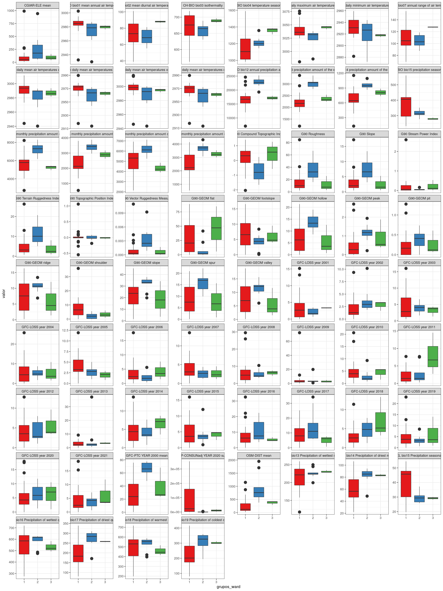<!-- -->

En los diagramas de caja, notarás que, las variables que aparecen en las
primeras filas de las tablas anteriores, son las mismas que presentan
mayor variabilidad de las cajas. Sigo con el ejemplo de las variables
`GFC-LOSS year 2020`, `ESA Open Water` y `G90-GEOM footslope`, y nota
que las anchuras de sus cajas, sus bigotes y la posición de la mediana
(línea interior de la caja), fluctúa mucho entre grupos.

El objetivo de adjuntarle, a la matriz ambiental, el vector de
agrupamiento generado a partir de datos de comunidad, consiste en
caracterizar ambientalmente los hábitats de los subgrupos diferenciados
según su composición. Observa los resultados de las pruebas
estadísticas, de los diagramas de caja, EXPLORA TUS RESULTADOS (usa como
referencia
[practica-99-tu-manuscrito-3-resultados.md](../practica-99-tu-manuscrito-3-resultados.md)
y el vídeo correspondiente a tu caso):

1.  Hábitat del grupo 1.

2.  Hábitat del grupo 2.

3.  Hábitats del grupo 3.

A continuación, muestro mapas de los dos agrupamientos, tanto UPGMA como
Ward, y comparo con algunas de las variables que presentaron efecto.
Usando la función `mapa_leaflet` este bloque genera un mapa interactivo
que colorea los hexágonos en función del grupo al que fueron asignados
de acuerdo al análisis de agrupamiento realizado a la matriz de
comunidad por el método UPGMA. Te recomiendo que uses la función
`mapa_leaflet`, especificando tu matriz ambiental, la variable que
quieras representar y un título, para generar mapas de tus propias
variables seleccionadas.

``` r
m_amb_clusters_sf <- env %>%
  rownames_to_column('hex_id') %>% 
  mutate(
    grupos_upgma = as.character(grupos_upgma),
    grupos_ward = as.character(grupos_ward)) %>%
  inner_join(za %>% select(hex_id)) %>%
  st_as_sf()
# mapa_upgma <- mapa_leaflet(
#   mapa = m_amb_clusters_sf,
#   variable = 'grupos_upgma',
#   titulo_leyenda = paste0('UPGMA, k=', k))
# mapa_upgma
```

Ídem anterior, pero según Ward.

``` r
mapa_ward <- mapa_leaflet(
  mapa = m_amb_clusters_sf,
  variable = 'grupos_ward',
  titulo_leyenda = paste0('Ward, k=', k))
mapa_ward
```

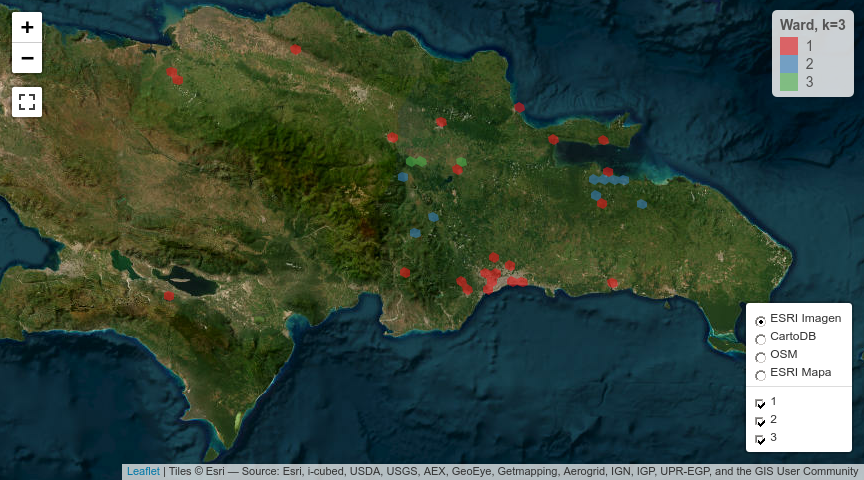<!-- -->

El siguiente bloque de código representa, cartográficamente, algunas
variables que mostraron inhomogeneidad en las pruebas estadísticas, es
decir, variables en las que parecía haber diferencias significativas
entre hexágonos de distintos grupos. Las variables que mostraron
diferencias significativas podrían ayudar a explicar la varianza de la
composición de la comunidad.

``` r
m_amb_ward_ak$variable[1:40]
```

    ##  [1] "GHH coefficient_of_variation_1km"                                     
    ##  [2] "CH-BIO bio07 annual range of air temperature"                         
    ##  [3] "CH-BIO bio12 annual precipitation amount"                             
    ##  [4] "CH-BIO bio02 mean diurnal air temperature range"                      
    ##  [5] "CH-BIO bio16 mean monthly precipitation amount of the wettest quarter"
    ##  [6] "CH-BIO bio15 precipitation seasonality"                               
    ##  [7] "GHH range_1km"                                                        
    ##  [8] "GHH dissimilarity_1km"                                                
    ##  [9] "GHH standard_deviation_1km"                                           
    ## [10] "CH-BIO bio13 precipitation amount of the wettest month"               
    ## [11] "WCL bio05 Max temperature of warmest month"                           
    ## [12] "WCL bio15 Precipitation seasonality"                                  
    ## [13] "GHH variance_1km"                                                     
    ## [14] "WCL bio14 Precipitation of driest month"                              
    ## [15] "GHH contrast_1km"                                                     
    ## [16] "GHH mean_1km"                                                         
    ## [17] "GHH homogeneity_1km"                                                  
    ## [18] "CGL Open forest, evergreen broad leaf"                                
    ## [19] "CH-BIO bio04 temperature seasonality"                                 
    ## [20] "CH-BIO bio17 mean monthly precipitation amount of the driest quarter" 
    ## [21] "CH-BIO bio19 mean monthly precipitation amount of the coldest quarter"
    ## [22] "CH-BIO bio14 precipitation amount of the driest month"                
    ## [23] "CH-BIO bio18 mean monthly precipitation amount of the warmest quarter"
    ## [24] "WCL bio17 Precipitation of driest quarter"                            
    ## [25] "GFC-PTC YEAR 2000 mean"                                               
    ## [26] "CH-BIO bio03 isothermality"                                           
    ## [27] "GFC-LOSS year 2001"                                                   
    ## [28] "WCL bio04 Temperature seasonality Standard deviation times 100"       
    ## [29] "GHH shannon_1km"                                                      
    ## [30] "WCL bio10 Mean temperature of warmest quarter"                        
    ## [31] "CH-BIO bio05 mean daily maximum air temperature of the warmest month" 
    ## [32] "CH-BIO bio06 mean daily minimum air temperature of the coldest month" 
    ## [33] "WCL bio19 Precipitation of coldest quarter"                           
    ## [34] "GHH simpson_1km"                                                      
    ## [35] "GHH pielou_1km"                                                       
    ## [36] "ESA Trees"                                                            
    ## [37] "ESA Built-up"                                                         
    ## [38] "CGL Urban / built up"                                                 
    ## [39] "OSM-DIST mean"                                                        
    ## [40] "GHH maximum_1km"

``` r
mapa_ward_v1 <- mapa_leaflet(
  mapa = m_amb_clusters_sf,
  variable = m_amb_ward_ak$variable[1],
  titulo_leyenda = gsub('(.{1,25})(\\s|$)', '\\1<br>', m_amb_ward_ak$variable[1]))
mapa_ward_v1
```

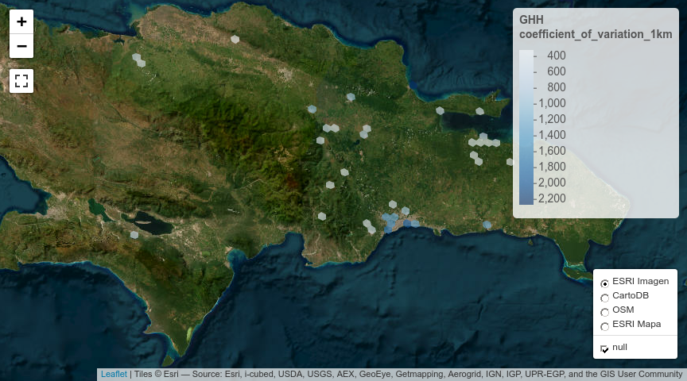<!-- -->

``` r
mapa_ward_v2 <- mapa_leaflet(
  mapa = m_amb_clusters_sf,
  variable = m_amb_ward_ak$variable[2],
  titulo_leyenda = gsub('(.{1,25})(\\s|$)', '\\1<br>', m_amb_ward_ak$variable[2]))
mapa_ward_v2
```

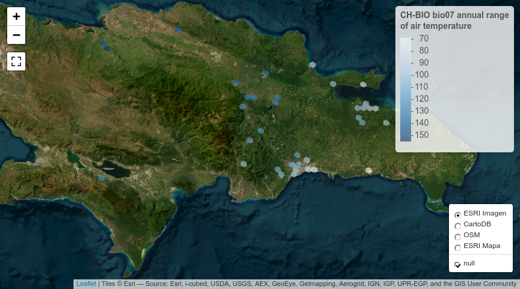<!-- -->

``` r
mapa_ward_v3 <- mapa_leaflet(
  mapa = m_amb_clusters_sf,
  variable = m_amb_ward_ak$variable[3],
  titulo_leyenda = gsub('(.{1,25})(\\s|$)', '\\1<br>', m_amb_ward_ak$variable[3]))
mapa_ward_v3
```

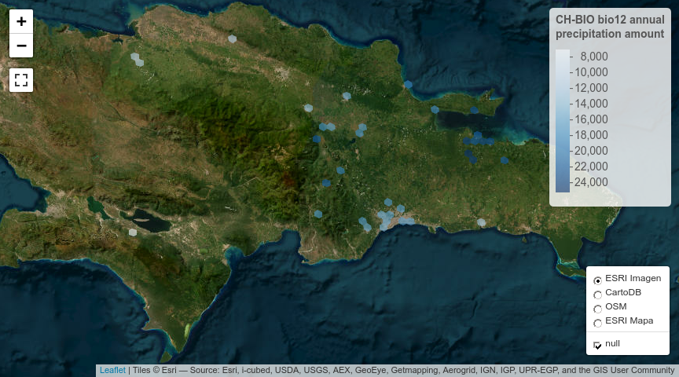<!-- -->

``` r
mapa_ward_v7 <- mapa_leaflet(
  mapa = m_amb_clusters_sf,
  variable = m_amb_ward_ak$variable[7],
  titulo_leyenda = gsub('(.{1,25})(\\s|$)', '\\1<br>', m_amb_ward_ak$variable[7]))
mapa_ward_v7
```

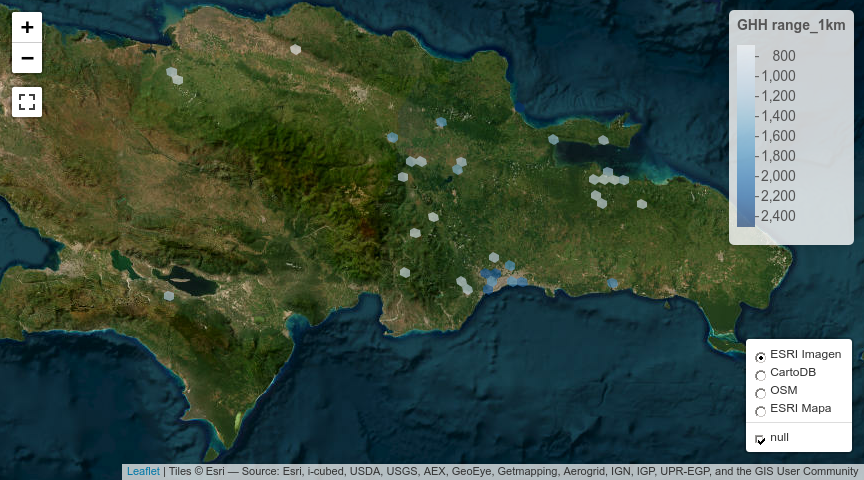<!-- -->

``` r
mapa_ward_v18 <- mapa_leaflet(
  mapa = m_amb_clusters_sf,
  variable = m_amb_ward_ak$variable[18],
  titulo_leyenda = gsub('(.{1,25})(\\s|$)', '\\1<br>', m_amb_ward_ak$variable[18]))
mapa_ward_v18
```

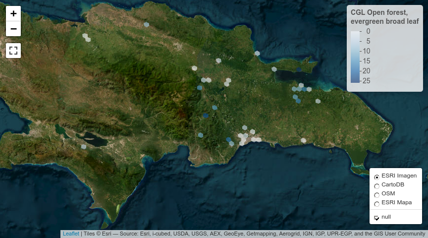<!-- -->

### Especies con preferencia/fidelidad con grupos (clústers)

Paquete `indicspecies`.

``` r
library(indicspecies)
```

Análisis de preferencia/fidelidad de especies con grupos (clusters),
mediante el coeficiente de correlación biserial puntual.

- UPGMA

``` r
# phi_upgma <- multipatt(
#   mi_fam,
#   grupos_upgma,
#   func = "r.g",
#   max.order = 1,
#   control = how(nperm = 999))
# summary(phi_upgma)
# data.frame(abreviado = rownames(phi_upgma$sign)[which(phi_upgma$sign$p.value < 0.05)]) %>%
#   inner_join(df_equivalencias) %>%
#   arrange(abreviado) %>% 
#   kable(booktabs=T) %>%
#   kable_styling(latex_options = c("HOLD_position", "scale_down"))
```

- Ward

``` r
phi_ward <- multipatt(
  mi_fam,
  grupos_ward,
  func = "r.g",
  max.order = 2,
  control = how(nperm = 999))
summary(phi_ward)
```

    ## 
    ##  Multilevel pattern analysis
    ##  ---------------------------
    ## 
    ##  Association function: r.g
    ##  Significance level (alpha): 0.05
    ## 
    ##  Total number of species: 36
    ##  Selected number of species: 8 
    ##  Number of species associated to 1 group: 7 
    ##  Number of species associated to 2 groups: 1 
    ## 
    ##  List of species associated to each combination: 
    ## 
    ##  Group 1  #sps.  3 
    ##           stat p.value  
    ## Aedescap 0.601   0.028 *
    ## Culenigr 0.601   0.031 *
    ## Psorjama 0.568   0.026 *
    ## 
    ##  Group 2  #sps.  2 
    ##             stat p.value  
    ## Wyeosoro   0.705   0.017 *
    ## Aedealbo.1 0.676   0.018 *
    ## 
    ##  Group 3  #sps.  2 
    ##           stat p.value    
    ## Anopcruc 0.970   0.001 ***
    ## Anopalbi 0.734   0.004 ** 
    ## 
    ##  Group 1+2  #sps.  1 
    ##           stat p.value   
    ## Wyeomitc 0.707   0.002 **
    ## ---
    ## Signif. codes:  0 '***' 0.001 '**' 0.01 '*' 0.05 '.' 0.1 ' ' 1

``` r
data.frame(abreviado = rownames(phi_ward$sign)[which(phi_ward$sign$p.value < 0.05)]) %>%
  inner_join(df_equivalencias) %>%
  arrange(abreviado) %>% 
  kable(booktabs=T) %>%
  kable_styling(latex_options = c("HOLD_position", "scale_down"))
```

<table class="table" style="margin-left: auto; margin-right: auto;">
<thead>
<tr>
<th style="text-align:left;">
abreviado
</th>
<th style="text-align:left;">
nombre_original
</th>
</tr>
</thead>
<tbody>
<tr>
<td style="text-align:left;">
Aedealbo.1
</td>
<td style="text-align:left;">
Aedes albonotatus (Coquillett, 1906)
</td>
</tr>
<tr>
<td style="text-align:left;">
Aedescap
</td>
<td style="text-align:left;">
Aedes scapularis (Rondani, 1848)
</td>
</tr>
<tr>
<td style="text-align:left;">
Anopalbi
</td>
<td style="text-align:left;">
Anopheles albimanus Wiedemann, 1820
</td>
</tr>
<tr>
<td style="text-align:left;">
Anopcruc
</td>
<td style="text-align:left;">
Anopheles crucians Wiedemann, 1828
</td>
</tr>
<tr>
<td style="text-align:left;">
Culenigr
</td>
<td style="text-align:left;">
Culex nigripalpus Theobald, 1901
</td>
</tr>
<tr>
<td style="text-align:left;">
Psorjama
</td>
<td style="text-align:left;">
Psorophora jamaicensis (Theobald, 1901)
</td>
</tr>
<tr>
<td style="text-align:left;">
Wyeomitc
</td>
<td style="text-align:left;">
Wyeomyia mitchellii (Theobald, 1905)
</td>
</tr>
<tr>
<td style="text-align:left;">
Wyeosoro
</td>
<td style="text-align:left;">
Wyeomyia sororcula Dyar & Knab, 1906
</td>
</tr>
</tbody>
</table>

EXPLORA TUS RESULTADOS (usa como referencia
[practica-99-tu-manuscrito-3-resultados.md](../practica-99-tu-manuscrito-3-resultados.md)
y el vídeo correspondiente a tu caso)

## Análisis de diversidad

Me basaré en los scripts que comienzan por `di_` de este
[repo](https://github.com/biogeografia-master/scripts-de-analisis-BCI),
los cuales explico en los vídeos de “Análisis de diversidad” (vídeos 19
y 20) de la lista de reproducción [“Ecología Numérica con R” de mi
canal](https://www.youtube.com/playlist?list=PLDcT2n8UzsCRDqjqSeqHI1wsiNOqpYmsJ).

> INICIA texto+código común entre secciones

Fijar un directorio de trabajo no es recomendable, mejor trabaja por
proyecto. En cualquier caso, si no quieres o no puedes crear un
proyecto, usa la sentencia que verás abajo, cambiando `TU_DIRECTORIO`
por la ruta del directorio donde tengas almacenados tus datos y tus
scripts.

``` r
if(interactive()) {
  tryCatch(
    setwd(dirname(rstudioapi::getSourceEditorContext()$path)),
    error = function(e) {
      cat('Probablemente ya el directorio de trabajo está fijado correctamente',
          'o quizá el directorio no existe. Este fue el error devuelto:\n')
      e
    })
}
```

Cargar paquetes.

``` r
library(vegan)
library(sf)
library(tidyverse)
library(tmap)
library(kableExtra)
library(foreach)
library(leaps)
library(caret)
gh_content <- 'https://raw.githubusercontent.com/'
gh_zonal_stats <- paste0(gh_content,
                         'geofis/zonal-statistics/0b2e95aaee87bf326cf132d28f4bd15220bb4ec7/out/')
repo_analisis <- 'biogeografia-master/scripts-de-analisis-BCI/master'
repo_sem202202 <- 'biogeografia-202202/material-de-apoyo/master/practicas/'
devtools::source_url(paste0(gh_content, repo_analisis, '/biodata/funciones.R'))
devtools::source_url(paste0(gh_content, repo_sem202202, 'train.R'))
devtools::source_url(paste0(gh_content, repo_sem202202, 'funciones.R'))
```

Carga tu matriz de comunidad, que habrás generado en la práctica 2, y
elige un umbral para especies raras o rangos de registros de presencia
para seleccionar especies en una nueva matriz de comunidad.

``` r
res <- 6 #Resolución H3, puedes elegir entre 4, 5, 6 o 7, pero cuidado con valores >=6
# IMPORTANTE: la resolución de las celdas H3, debe coincidir con la resolución
# a la cual generaste tu matriz de comunidad. De lo contrario, obtendrás error. Si tu 
# archivo RDS de matriz de comunidad se denomina "matriz_de_comunidad.RDS", y lo creaste
# usando resolución 4, cámbiale el nombre a "matriz_de_comunidad_res_5.RDS". Recuerda,
# puedes usar cualquier resolución, lo único importante es que las resolución usada en la
# creación de la matriz de comunidad, debe ser la misma que en la ambiental.
mc_orig <- readRDS("matriz_de_comunidad_acanthaceae.RDS")
nrow(mc_orig) #Número de filas, equivale a número de hexágonos con registros de presencia
```

    ## [1] 219

``` r
ncol(mc_orig)  #Número de columnas, equivale a número de especies, riqueza
```

    ## [1] 64

``` r
data.frame(Especies = names(mc_orig)) %>% 
  kable(booktabs=T) %>%
  kable_styling(latex_options = c("HOLD_position", "scale_down")) %>%
  gsub(' NA ', '', .) #Lista de especies
```

<table class="table" style="margin-left: auto; margin-right: auto;">
<thead>
<tr>
<th style="text-align:left;">
Especies
</th>
</tr>
</thead>
<tbody>
<tr>
<td style="text-align:left;">
Thunbergia grandiflora (Roxb. ex Rottler) Roxb.
</td>
</tr>
<tr>
<td style="text-align:left;">
Pachystachys lutea (Ruiz & Pav. ex Schult.) Nees
</td>
</tr>
<tr>
<td style="text-align:left;">
Ruellia blechum L.
</td>
</tr>
<tr>
<td style="text-align:left;">
Ruellia simplex Wright
</td>
</tr>
<tr>
<td style="text-align:left;">
Thunbergia fragrans Roxb.
</td>
</tr>
<tr>
<td style="text-align:left;">
Thunbergia alata Bojer ex Sims
</td>
</tr>
<tr>
<td style="text-align:left;">
Asystasia gangetica (L.) T.Anderson
</td>
</tr>
<tr>
<td style="text-align:left;">
Ruellia tuberosa L.
</td>
</tr>
<tr>
<td style="text-align:left;">
Megaskepasma erythrochlamys Lindau
</td>
</tr>
<tr>
<td style="text-align:left;">
Sanchezia oblonga Ruiz & Pav.
</td>
</tr>
<tr>
<td style="text-align:left;">
Crossandra infundibuliformis (L.) Nees
</td>
</tr>
<tr>
<td style="text-align:left;">
Odontonema cuspidatum (Nees) Kuntze
</td>
</tr>
<tr>
<td style="text-align:left;">
Graptophyllum pictum (L.) Griff.
</td>
</tr>
<tr>
<td style="text-align:left;">
Avicennia germinans (L.) L.
</td>
</tr>
<tr>
<td style="text-align:left;">
Thunbergia erecta (Benth.) T.Anderson
</td>
</tr>
<tr>
<td style="text-align:left;">
Sanchezia parvibracteata Sprague & Hutch.
</td>
</tr>
<tr>
<td style="text-align:left;">
Barleria lupulina Lindl.
</td>
</tr>
<tr>
<td style="text-align:left;">
Justicia comata (L.) Lam.
</td>
</tr>
<tr>
<td style="text-align:left;">
Justicia brandegeeana Wassh. & L.B.Sm.
</td>
</tr>
<tr>
<td style="text-align:left;">
Justicia spinigera Urb. & Ekman
</td>
</tr>
<tr>
<td style="text-align:left;">
Hypoestes phyllostachya Baker
</td>
</tr>
<tr>
<td style="text-align:left;">
Pseuderanthemum carruthersii (Seem.) Guill.
</td>
</tr>
<tr>
<td style="text-align:left;">
Acanthaceae
</td>
</tr>
<tr>
<td style="text-align:left;">
Barleria L.
</td>
</tr>
<tr>
<td style="text-align:left;">
Sanchezia speciosa Leonard
</td>
</tr>
<tr>
<td style="text-align:left;">
Dicliptera mucronata Urb.
</td>
</tr>
<tr>
<td style="text-align:left;">
Justicia secunda Vahl
</td>
</tr>
<tr>
<td style="text-align:left;">
Oplonia spinosa (Jacq.) Raf.
</td>
</tr>
<tr>
<td style="text-align:left;">
Andrographis paniculata (Burm.f.) Wall.
</td>
</tr>
<tr>
<td style="text-align:left;">
Barleriola solanifolia (L.) Oerst.
</td>
</tr>
<tr>
<td style="text-align:left;">
Justicia disparifolia Urb. & Ekman
</td>
</tr>
<tr>
<td style="text-align:left;">
Barleriola inermis Urb. & Ekman
</td>
</tr>
<tr>
<td style="text-align:left;">
Dyschoriste diffusa (Nees) Urb.
</td>
</tr>
<tr>
<td style="text-align:left;">
Lepidagathis alopecuroidea (Vahl) R.Br. ex Griseb.
</td>
</tr>
<tr>
<td style="text-align:left;">
Hygrophila costata Nees
</td>
</tr>
<tr>
<td style="text-align:left;">
Oplonia microphylla (Lam.) Stearn
</td>
</tr>
<tr>
<td style="text-align:left;">
Oplonia Raf.
</td>
</tr>
<tr>
<td style="text-align:left;">
Ruellia coccinea (L.) Vahl
</td>
</tr>
<tr>
<td style="text-align:left;">
Justicia alsinoides Leonard
</td>
</tr>
<tr>
<td style="text-align:left;">
Justicia mirabilioides Lam.
</td>
</tr>
<tr>
<td style="text-align:left;">
Ruellia lepidota Urb.
</td>
</tr>
<tr>
<td style="text-align:left;">
Stenandrium scabrosum Nees
</td>
</tr>
<tr>
<td style="text-align:left;">
Eranthemum pulchellum Andr.
</td>
</tr>
<tr>
<td style="text-align:left;">
Strobilanthes alternata (Burm.fil.) Moylan ex J.R.I.Wood
</td>
</tr>
<tr>
<td style="text-align:left;">
Ruellia nudiflora var. insularis Leonard
</td>
</tr>
<tr>
<td style="text-align:left;">
Ruellia nudiflora (Engelm. & Gray) Urb.
</td>
</tr>
<tr>
<td style="text-align:left;">
Stenandrium tuberosum (L.) Urb.
</td>
</tr>
<tr>
<td style="text-align:left;">
Ruellia domingensis Spreng. ex Nees
</td>
</tr>
<tr>
<td style="text-align:left;">
Justicia sessilis Jacq.
</td>
</tr>
<tr>
<td style="text-align:left;">
Justicia fulvicoma Cham. & Schltdl.
</td>
</tr>
<tr>
<td style="text-align:left;">
Thunbergia affinis S.Moore
</td>
</tr>
<tr>
<td style="text-align:left;">
Ruellia malacosperma Greenm.
</td>
</tr>
<tr>
<td style="text-align:left;">
Justicia pectoralis Jacq.
</td>
</tr>
<tr>
<td style="text-align:left;">
Justicia abeggii Urb. & Ekman
</td>
</tr>
<tr>
<td style="text-align:left;">
Ruellia geminiflora Kunth
</td>
</tr>
<tr>
<td style="text-align:left;">
Justicia dumosa Alain
</td>
</tr>
<tr>
<td style="text-align:left;">
Dicliptera obtusifolia Urb.
</td>
</tr>
<tr>
<td style="text-align:left;">
Justicia reptans Sw.
</td>
</tr>
<tr>
<td style="text-align:left;">
Justicia spinossisima Alain
</td>
</tr>
<tr>
<td style="text-align:left;">
Justicia buchii Urb.
</td>
</tr>
<tr>
<td style="text-align:left;">
Oplonia acicularis (Sw.) Stearn
</td>
</tr>
<tr>
<td style="text-align:left;">
Justicia periplocifolia Jacq.
</td>
</tr>
<tr>
<td style="text-align:left;">
Justicia nemorosa Sw.
</td>
</tr>
<tr>
<td style="text-align:left;">
Andrographis paniculata (Burm.fil.) Nees
</td>
</tr>
</tbody>
</table>

``` r
unique(word(names(mc_orig), 1, 1)) #Géneros representados
```

    ##  [1] "Thunbergia"      "Pachystachys"    "Ruellia"         "Asystasia"      
    ##  [5] "Megaskepasma"    "Sanchezia"       "Crossandra"      "Odontonema"     
    ##  [9] "Graptophyllum"   "Avicennia"       "Barleria"        "Justicia"       
    ## [13] "Hypoestes"       "Pseuderanthemum" "Acanthaceae"     "Dicliptera"     
    ## [17] "Oplonia"         "Andrographis"    "Barleriola"      "Dyschoriste"    
    ## [21] "Lepidagathis"    "Hygrophila"      "Stenandrium"     "Eranthemum"     
    ## [25] "Strobilanthes"

``` r
table(word(names(mc_orig), 1, 1)) #Número de especies por género
```

    ## 
    ##     Acanthaceae    Andrographis       Asystasia       Avicennia        Barleria 
    ##               1               2               1               1               2 
    ##      Barleriola      Crossandra      Dicliptera     Dyschoriste      Eranthemum 
    ##               2               1               2               1               1 
    ##   Graptophyllum      Hygrophila       Hypoestes        Justicia    Lepidagathis 
    ##               1               1               1              17               1 
    ##    Megaskepasma      Odontonema         Oplonia    Pachystachys Pseuderanthemum 
    ##               1               1               4               1               1 
    ##         Ruellia       Sanchezia     Stenandrium   Strobilanthes      Thunbergia 
    ##              10               3               2               1               5

``` r
data.frame(`Número de hexágonos` = sort(colSums(mc_orig), decreasing = T), check.names = F) %>% 
  kable(booktabs=T) %>%
  kable_styling(latex_options = c("HOLD_position", "scale_down")) %>%
  gsub(' NA ', '', .) # Número de hexágonos en los que está presente cada especie
```

<table class="table" style="margin-left: auto; margin-right: auto;">
<thead>
<tr>
<th style="text-align:left;">
</th>
<th style="text-align:right;">
Número de hexágonos
</th>
</tr>
</thead>
<tbody>
<tr>
<td style="text-align:left;">
Thunbergia alata Bojer ex Sims
</td>
<td style="text-align:right;">
40
</td>
</tr>
<tr>
<td style="text-align:left;">
Ruellia simplex Wright
</td>
<td style="text-align:right;">
23
</td>
</tr>
<tr>
<td style="text-align:left;">
Ruellia tuberosa L.
</td>
<td style="text-align:right;">
23
</td>
</tr>
<tr>
<td style="text-align:left;">
Odontonema cuspidatum (Nees) Kuntze
</td>
<td style="text-align:right;">
17
</td>
</tr>
<tr>
<td style="text-align:left;">
Ruellia blechum L.
</td>
<td style="text-align:right;">
16
</td>
</tr>
<tr>
<td style="text-align:left;">
Thunbergia fragrans Roxb.
</td>
<td style="text-align:right;">
15
</td>
</tr>
<tr>
<td style="text-align:left;">
Lepidagathis alopecuroidea (Vahl) R.Br. ex Griseb.
</td>
<td style="text-align:right;">
13
</td>
</tr>
<tr>
<td style="text-align:left;">
Asystasia gangetica (L.) T.Anderson
</td>
<td style="text-align:right;">
12
</td>
</tr>
<tr>
<td style="text-align:left;">
Thunbergia grandiflora (Roxb. ex Rottler) Roxb.
</td>
<td style="text-align:right;">
10
</td>
</tr>
<tr>
<td style="text-align:left;">
Hygrophila costata Nees
</td>
<td style="text-align:right;">
10
</td>
</tr>
<tr>
<td style="text-align:left;">
Avicennia germinans (L.) L.
</td>
<td style="text-align:right;">
9
</td>
</tr>
<tr>
<td style="text-align:left;">
Oplonia spinosa (Jacq.) Raf.
</td>
<td style="text-align:right;">
9
</td>
</tr>
<tr>
<td style="text-align:left;">
Dyschoriste diffusa (Nees) Urb.
</td>
<td style="text-align:right;">
9
</td>
</tr>
<tr>
<td style="text-align:left;">
Ruellia coccinea (L.) Vahl
</td>
<td style="text-align:right;">
9
</td>
</tr>
<tr>
<td style="text-align:left;">
Stenandrium tuberosum (L.) Urb.
</td>
<td style="text-align:right;">
9
</td>
</tr>
<tr>
<td style="text-align:left;">
Crossandra infundibuliformis (L.) Nees
</td>
<td style="text-align:right;">
8
</td>
</tr>
<tr>
<td style="text-align:left;">
Justicia disparifolia Urb. & Ekman
</td>
<td style="text-align:right;">
7
</td>
</tr>
<tr>
<td style="text-align:left;">
Barleriola solanifolia (L.) Oerst.
</td>
<td style="text-align:right;">
6
</td>
</tr>
<tr>
<td style="text-align:left;">
Ruellia domingensis Spreng. ex Nees
</td>
<td style="text-align:right;">
6
</td>
</tr>
<tr>
<td style="text-align:left;">
Pachystachys lutea (Ruiz & Pav. ex Schult.) Nees
</td>
<td style="text-align:right;">
5
</td>
</tr>
<tr>
<td style="text-align:left;">
Graptophyllum pictum (L.) Griff.
</td>
<td style="text-align:right;">
5
</td>
</tr>
<tr>
<td style="text-align:left;">
Barleriola inermis Urb. & Ekman
</td>
<td style="text-align:right;">
5
</td>
</tr>
<tr>
<td style="text-align:left;">
Barleria lupulina Lindl.
</td>
<td style="text-align:right;">
4
</td>
</tr>
<tr>
<td style="text-align:left;">
Justicia brandegeeana Wassh. & L.B.Sm.
</td>
<td style="text-align:right;">
4
</td>
</tr>
<tr>
<td style="text-align:left;">
Oplonia microphylla (Lam.) Stearn
</td>
<td style="text-align:right;">
4
</td>
</tr>
<tr>
<td style="text-align:left;">
Megaskepasma erythrochlamys Lindau
</td>
<td style="text-align:right;">
3
</td>
</tr>
<tr>
<td style="text-align:left;">
Dicliptera mucronata Urb.
</td>
<td style="text-align:right;">
3
</td>
</tr>
<tr>
<td style="text-align:left;">
Justicia mirabilioides Lam.
</td>
<td style="text-align:right;">
3
</td>
</tr>
<tr>
<td style="text-align:left;">
Ruellia lepidota Urb.
</td>
<td style="text-align:right;">
3
</td>
</tr>
<tr>
<td style="text-align:left;">
Thunbergia erecta (Benth.) T.Anderson
</td>
<td style="text-align:right;">
2
</td>
</tr>
<tr>
<td style="text-align:left;">
Sanchezia parvibracteata Sprague & Hutch.
</td>
<td style="text-align:right;">
2
</td>
</tr>
<tr>
<td style="text-align:left;">
Justicia comata (L.) Lam.
</td>
<td style="text-align:right;">
2
</td>
</tr>
<tr>
<td style="text-align:left;">
Justicia spinigera Urb. & Ekman
</td>
<td style="text-align:right;">
2
</td>
</tr>
<tr>
<td style="text-align:left;">
Justicia alsinoides Leonard
</td>
<td style="text-align:right;">
2
</td>
</tr>
<tr>
<td style="text-align:left;">
Ruellia nudiflora (Engelm. & Gray) Urb.
</td>
<td style="text-align:right;">
2
</td>
</tr>
<tr>
<td style="text-align:left;">
Justicia sessilis Jacq.
</td>
<td style="text-align:right;">
2
</td>
</tr>
<tr>
<td style="text-align:left;">
Ruellia geminiflora Kunth
</td>
<td style="text-align:right;">
2
</td>
</tr>
<tr>
<td style="text-align:left;">
Justicia reptans Sw.
</td>
<td style="text-align:right;">
2
</td>
</tr>
<tr>
<td style="text-align:left;">
Oplonia acicularis (Sw.) Stearn
</td>
<td style="text-align:right;">
2
</td>
</tr>
<tr>
<td style="text-align:left;">
Sanchezia oblonga Ruiz & Pav.
</td>
<td style="text-align:right;">
1
</td>
</tr>
<tr>
<td style="text-align:left;">
Hypoestes phyllostachya Baker
</td>
<td style="text-align:right;">
1
</td>
</tr>
<tr>
<td style="text-align:left;">
Pseuderanthemum carruthersii (Seem.) Guill.
</td>
<td style="text-align:right;">
1
</td>
</tr>
<tr>
<td style="text-align:left;">
Acanthaceae
</td>
<td style="text-align:right;">
1
</td>
</tr>
<tr>
<td style="text-align:left;">
Barleria L.
</td>
<td style="text-align:right;">
1
</td>
</tr>
<tr>
<td style="text-align:left;">
Sanchezia speciosa Leonard
</td>
<td style="text-align:right;">
1
</td>
</tr>
<tr>
<td style="text-align:left;">
Justicia secunda Vahl
</td>
<td style="text-align:right;">
1
</td>
</tr>
<tr>
<td style="text-align:left;">
Andrographis paniculata (Burm.f.) Wall.
</td>
<td style="text-align:right;">
1
</td>
</tr>
<tr>
<td style="text-align:left;">
Oplonia Raf.
</td>
<td style="text-align:right;">
1
</td>
</tr>
<tr>
<td style="text-align:left;">
Stenandrium scabrosum Nees
</td>
<td style="text-align:right;">
1
</td>
</tr>
<tr>
<td style="text-align:left;">
Eranthemum pulchellum Andr.
</td>
<td style="text-align:right;">
1
</td>
</tr>
<tr>
<td style="text-align:left;">
Strobilanthes alternata (Burm.fil.) Moylan ex J.R.I.Wood
</td>
<td style="text-align:right;">
1
</td>
</tr>
<tr>
<td style="text-align:left;">
Ruellia nudiflora var. insularis Leonard
</td>
<td style="text-align:right;">
1
</td>
</tr>
<tr>
<td style="text-align:left;">
Justicia fulvicoma Cham. & Schltdl.
</td>
<td style="text-align:right;">
1
</td>
</tr>
<tr>
<td style="text-align:left;">
Thunbergia affinis S.Moore
</td>
<td style="text-align:right;">
1
</td>
</tr>
<tr>
<td style="text-align:left;">
Ruellia malacosperma Greenm.
</td>
<td style="text-align:right;">
1
</td>
</tr>
<tr>
<td style="text-align:left;">
Justicia pectoralis Jacq.
</td>
<td style="text-align:right;">
1
</td>
</tr>
<tr>
<td style="text-align:left;">
Justicia abeggii Urb. & Ekman
</td>
<td style="text-align:right;">
1
</td>
</tr>
<tr>
<td style="text-align:left;">
Justicia dumosa Alain
</td>
<td style="text-align:right;">
1
</td>
</tr>
<tr>
<td style="text-align:left;">
Dicliptera obtusifolia Urb.
</td>
<td style="text-align:right;">
1
</td>
</tr>
<tr>
<td style="text-align:left;">
Justicia spinossisima Alain
</td>
<td style="text-align:right;">
1
</td>
</tr>
<tr>
<td style="text-align:left;">
Justicia buchii Urb.
</td>
<td style="text-align:right;">
1
</td>
</tr>
<tr>
<td style="text-align:left;">
Justicia periplocifolia Jacq.
</td>
<td style="text-align:right;">
1
</td>
</tr>
<tr>
<td style="text-align:left;">
Justicia nemorosa Sw.
</td>
<td style="text-align:right;">
1
</td>
</tr>
<tr>
<td style="text-align:left;">
Andrographis paniculata (Burm.fil.) Nees
</td>
<td style="text-align:right;">
1
</td>
</tr>
</tbody>
</table>

``` r
# Usa el vector anterior para determinar un umbral o rango de registros para filtrar tu matriz
# ¿En cuántos hexágonos está cada especie? Filtra tus datos usando tu propio criterio.
# Especies que aparecen en pocos hexágonos se consideran "raras". Por ejemplo, si una especie sólo
# aparece en un hexágono en todo el país, es un "singleton", si en dos, "doubleton", y así.
# Estas especies podrían contribuir a generar "ruido" en análisis posteriores, se recomienda excluirlas.
# Elige un valor mínimo (representado por único número entero) o por un rango de enteros (e.g. de 10 a 20),
# para seleccionar las especies que estén mejor representadas de acuerdo a tu criterio.
# Por ejemplo, si usas el valor m, el script considerará a este valor como "el número mínimo de hexágonos
# en los que está representada una especie, y creará una matriz de comunidad de especies seleccionadas
# que están presentes en m hexágonos o más. Si eliges un rango, por ejemplo [m,n], el script generará
# una matriz de comunidad que representadas un mínimo de m hexágonos y un máximo de n hexágonos.
# (ambos extremos inclusive).
en_cuantos_hex <- 2
# Explicación: "en_cuantos_hex <- X", donde X es el número de hexágonos mínimo donde cada especie
# debe estar presente. IMPORTANTE: elige TU PROPIO umbral.
{if(length(en_cuantos_hex)==1) selector <- en_cuantos_hex:max(colSums(mc_orig)) else
  if(length(en_cuantos_hex)==2)
    selector <- min(en_cuantos_hex):max(en_cuantos_hex) else
      stop('Debes indicar uno o dos valores numéricos')}
selector
```

    ##  [1]  2  3  4  5  6  7  8  9 10 11 12 13 14 15 16 17 18 19 20 21 22 23 24 25 26
    ## [26] 27 28 29 30 31 32 33 34 35 36 37 38 39 40

``` r
mc_orig_seleccionadas <- mc_orig[, colSums(mc_orig) %in% selector]

# Mínimo número de especies por hexágono
data.frame(`Número de especies por hexágono` = sort(rowSums(mc_orig), decreasing = T), check.names = F) %>% 
  kable(booktabs=T) %>%
  kable_styling(latex_options = c("HOLD_position", "scale_down")) %>%
  gsub(' NA ', '', .) # Número de hexágonos en los que está presente cada especie
```

<table class="table" style="margin-left: auto; margin-right: auto;">
<thead>
<tr>
<th style="text-align:left;">
</th>
<th style="text-align:right;">
Número de especies por hexágono
</th>
</tr>
</thead>
<tbody>
<tr>
<td style="text-align:left;">
864cd5b47ffffff
</td>
<td style="text-align:right;">
5
</td>
</tr>
<tr>
<td style="text-align:left;">
864c8926fffffff
</td>
<td style="text-align:right;">
5
</td>
</tr>
<tr>
<td style="text-align:left;">
864cd4c97ffffff
</td>
<td style="text-align:right;">
5
</td>
</tr>
<tr>
<td style="text-align:left;">
864c8994fffffff
</td>
<td style="text-align:right;">
4
</td>
</tr>
<tr>
<td style="text-align:left;">
864cf2407ffffff
</td>
<td style="text-align:right;">
4
</td>
</tr>
<tr>
<td style="text-align:left;">
864cf241fffffff
</td>
<td style="text-align:right;">
4
</td>
</tr>
<tr>
<td style="text-align:left;">
864c898efffffff
</td>
<td style="text-align:right;">
4
</td>
</tr>
<tr>
<td style="text-align:left;">
864cd455fffffff
</td>
<td style="text-align:right;">
4
</td>
</tr>
<tr>
<td style="text-align:left;">
864c898d7ffffff
</td>
<td style="text-align:right;">
4
</td>
</tr>
<tr>
<td style="text-align:left;">
864cd665fffffff
</td>
<td style="text-align:right;">
4
</td>
</tr>
<tr>
<td style="text-align:left;">
864cd426fffffff
</td>
<td style="text-align:right;">
3
</td>
</tr>
<tr>
<td style="text-align:left;">
864cc6cdfffffff
</td>
<td style="text-align:right;">
3
</td>
</tr>
<tr>
<td style="text-align:left;">
864cd42cfffffff
</td>
<td style="text-align:right;">
3
</td>
</tr>
<tr>
<td style="text-align:left;">
864cd452fffffff
</td>
<td style="text-align:right;">
3
</td>
</tr>
<tr>
<td style="text-align:left;">
864c893a7ffffff
</td>
<td style="text-align:right;">
3
</td>
</tr>
<tr>
<td style="text-align:left;">
864cd46cfffffff
</td>
<td style="text-align:right;">
3
</td>
</tr>
<tr>
<td style="text-align:left;">
864c8924fffffff
</td>
<td style="text-align:right;">
3
</td>
</tr>
<tr>
<td style="text-align:left;">
864cd41a7ffffff
</td>
<td style="text-align:right;">
3
</td>
</tr>
<tr>
<td style="text-align:left;">
864cd2937ffffff
</td>
<td style="text-align:right;">
3
</td>
</tr>
<tr>
<td style="text-align:left;">
864cd42c7ffffff
</td>
<td style="text-align:right;">
3
</td>
</tr>
<tr>
<td style="text-align:left;">
864cd424fffffff
</td>
<td style="text-align:right;">
3
</td>
</tr>
<tr>
<td style="text-align:left;">
864cd4527ffffff
</td>
<td style="text-align:right;">
3
</td>
</tr>
<tr>
<td style="text-align:left;">
864cd4237ffffff
</td>
<td style="text-align:right;">
3
</td>
</tr>
<tr>
<td style="text-align:left;">
864cd465fffffff
</td>
<td style="text-align:right;">
3
</td>
</tr>
<tr>
<td style="text-align:left;">
864cd6217ffffff
</td>
<td style="text-align:right;">
3
</td>
</tr>
<tr>
<td style="text-align:left;">
864cd6977ffffff
</td>
<td style="text-align:right;">
3
</td>
</tr>
<tr>
<td style="text-align:left;">
864cd589fffffff
</td>
<td style="text-align:right;">
3
</td>
</tr>
<tr>
<td style="text-align:left;">
864c89aafffffff
</td>
<td style="text-align:right;">
2
</td>
</tr>
<tr>
<td style="text-align:left;">
864cd4c9fffffff
</td>
<td style="text-align:right;">
2
</td>
</tr>
<tr>
<td style="text-align:left;">
864cc6007ffffff
</td>
<td style="text-align:right;">
2
</td>
</tr>
<tr>
<td style="text-align:left;">
864cc6117ffffff
</td>
<td style="text-align:right;">
2
</td>
</tr>
<tr>
<td style="text-align:left;">
864cd4247ffffff
</td>
<td style="text-align:right;">
2
</td>
</tr>
<tr>
<td style="text-align:left;">
864cc6c57ffffff
</td>
<td style="text-align:right;">
2
</td>
</tr>
<tr>
<td style="text-align:left;">
864cd5b77ffffff
</td>
<td style="text-align:right;">
2
</td>
</tr>
<tr>
<td style="text-align:left;">
864cf26c7ffffff
</td>
<td style="text-align:right;">
2
</td>
</tr>
<tr>
<td style="text-align:left;">
864cd42f7ffffff
</td>
<td style="text-align:right;">
2
</td>
</tr>
<tr>
<td style="text-align:left;">
864cd5537ffffff
</td>
<td style="text-align:right;">
2
</td>
</tr>
<tr>
<td style="text-align:left;">
864cd6507ffffff
</td>
<td style="text-align:right;">
2
</td>
</tr>
<tr>
<td style="text-align:left;">
864cc611fffffff
</td>
<td style="text-align:right;">
2
</td>
</tr>
<tr>
<td style="text-align:left;">
864cd42dfffffff
</td>
<td style="text-align:right;">
2
</td>
</tr>
<tr>
<td style="text-align:left;">
864cd4d2fffffff
</td>
<td style="text-align:right;">
2
</td>
</tr>
<tr>
<td style="text-align:left;">
864cc6ccfffffff
</td>
<td style="text-align:right;">
2
</td>
</tr>
<tr>
<td style="text-align:left;">
864c89b07ffffff
</td>
<td style="text-align:right;">
2
</td>
</tr>
<tr>
<td style="text-align:left;">
864c8930fffffff
</td>
<td style="text-align:right;">
2
</td>
</tr>
<tr>
<td style="text-align:left;">
864cf240fffffff
</td>
<td style="text-align:right;">
2
</td>
</tr>
<tr>
<td style="text-align:left;">
864cd476fffffff
</td>
<td style="text-align:right;">
2
</td>
</tr>
<tr>
<td style="text-align:left;">
864cd639fffffff
</td>
<td style="text-align:right;">
2
</td>
</tr>
<tr>
<td style="text-align:left;">
864cd6387ffffff
</td>
<td style="text-align:right;">
2
</td>
</tr>
<tr>
<td style="text-align:left;">
864cd42e7ffffff
</td>
<td style="text-align:right;">
2
</td>
</tr>
<tr>
<td style="text-align:left;">
864c8996fffffff
</td>
<td style="text-align:right;">
2
</td>
</tr>
<tr>
<td style="text-align:left;">
864cf3727ffffff
</td>
<td style="text-align:right;">
2
</td>
</tr>
<tr>
<td style="text-align:left;">
864cc67afffffff
</td>
<td style="text-align:right;">
2
</td>
</tr>
<tr>
<td style="text-align:left;">
864cd4737ffffff
</td>
<td style="text-align:right;">
2
</td>
</tr>
<tr>
<td style="text-align:left;">
864cf3227ffffff
</td>
<td style="text-align:right;">
2
</td>
</tr>
<tr>
<td style="text-align:left;">
864c89b6fffffff
</td>
<td style="text-align:right;">
2
</td>
</tr>
<tr>
<td style="text-align:left;">
864cd5cdfffffff
</td>
<td style="text-align:right;">
2
</td>
</tr>
<tr>
<td style="text-align:left;">
864cd692fffffff
</td>
<td style="text-align:right;">
2
</td>
</tr>
<tr>
<td style="text-align:left;">
864cf3457ffffff
</td>
<td style="text-align:right;">
2
</td>
</tr>
<tr>
<td style="text-align:left;">
864c89c0fffffff
</td>
<td style="text-align:right;">
2
</td>
</tr>
<tr>
<td style="text-align:left;">
864cd29afffffff
</td>
<td style="text-align:right;">
2
</td>
</tr>
<tr>
<td style="text-align:left;">
864c89aa7ffffff
</td>
<td style="text-align:right;">
2
</td>
</tr>
<tr>
<td style="text-align:left;">
864c890efffffff
</td>
<td style="text-align:right;">
2
</td>
</tr>
<tr>
<td style="text-align:left;">
864cd4717ffffff
</td>
<td style="text-align:right;">
2
</td>
</tr>
<tr>
<td style="text-align:left;">
864cd2917ffffff
</td>
<td style="text-align:right;">
2
</td>
</tr>
<tr>
<td style="text-align:left;">
864cf3427ffffff
</td>
<td style="text-align:right;">
2
</td>
</tr>
<tr>
<td style="text-align:left;">
864cd0907ffffff
</td>
<td style="text-align:right;">
2
</td>
</tr>
<tr>
<td style="text-align:left;">
864cd4c07ffffff
</td>
<td style="text-align:right;">
2
</td>
</tr>
<tr>
<td style="text-align:left;">
864cc6637ffffff
</td>
<td style="text-align:right;">
2
</td>
</tr>
<tr>
<td style="text-align:left;">
864cd5b07ffffff
</td>
<td style="text-align:right;">
2
</td>
</tr>
<tr>
<td style="text-align:left;">
864cd40a7ffffff
</td>
<td style="text-align:right;">
2
</td>
</tr>
<tr>
<td style="text-align:left;">
864cd2d47ffffff
</td>
<td style="text-align:right;">
2
</td>
</tr>
<tr>
<td style="text-align:left;">
864cd4837ffffff
</td>
<td style="text-align:right;">
2
</td>
</tr>
<tr>
<td style="text-align:left;">
864cd66cfffffff
</td>
<td style="text-align:right;">
2
</td>
</tr>
<tr>
<td style="text-align:left;">
864cd2997ffffff
</td>
<td style="text-align:right;">
2
</td>
</tr>
<tr>
<td style="text-align:left;">
864cd6acfffffff
</td>
<td style="text-align:right;">
2
</td>
</tr>
<tr>
<td style="text-align:left;">
864cd44b7ffffff
</td>
<td style="text-align:right;">
2
</td>
</tr>
<tr>
<td style="text-align:left;">
864cd4547ffffff
</td>
<td style="text-align:right;">
1
</td>
</tr>
<tr>
<td style="text-align:left;">
864cf268fffffff
</td>
<td style="text-align:right;">
1
</td>
</tr>
<tr>
<td style="text-align:left;">
864c8949fffffff
</td>
<td style="text-align:right;">
1
</td>
</tr>
<tr>
<td style="text-align:left;">
864cd5117ffffff
</td>
<td style="text-align:right;">
1
</td>
</tr>
<tr>
<td style="text-align:left;">
864c89a07ffffff
</td>
<td style="text-align:right;">
1
</td>
</tr>
<tr>
<td style="text-align:left;">
864c89767ffffff
</td>
<td style="text-align:right;">
1
</td>
</tr>
<tr>
<td style="text-align:left;">
864cd425fffffff
</td>
<td style="text-align:right;">
1
</td>
</tr>
<tr>
<td style="text-align:left;">
864c89947ffffff
</td>
<td style="text-align:right;">
1
</td>
</tr>
<tr>
<td style="text-align:left;">
864cd4387ffffff
</td>
<td style="text-align:right;">
1
</td>
</tr>
<tr>
<td style="text-align:left;">
864cf26cfffffff
</td>
<td style="text-align:right;">
1
</td>
</tr>
<tr>
<td style="text-align:left;">
864cf20dfffffff
</td>
<td style="text-align:right;">
1
</td>
</tr>
<tr>
<td style="text-align:left;">
866725a27ffffff
</td>
<td style="text-align:right;">
1
</td>
</tr>
<tr>
<td style="text-align:left;">
864cd5b67ffffff
</td>
<td style="text-align:right;">
1
</td>
</tr>
<tr>
<td style="text-align:left;">
864cc64d7ffffff
</td>
<td style="text-align:right;">
1
</td>
</tr>
<tr>
<td style="text-align:left;">
864c89a0fffffff
</td>
<td style="text-align:right;">
1
</td>
</tr>
<tr>
<td style="text-align:left;">
864cd092fffffff
</td>
<td style="text-align:right;">
1
</td>
</tr>
<tr>
<td style="text-align:left;">
86672534fffffff
</td>
<td style="text-align:right;">
1
</td>
</tr>
<tr>
<td style="text-align:left;">
864cd09b7ffffff
</td>
<td style="text-align:right;">
1
</td>
</tr>
<tr>
<td style="text-align:left;">
864cf35afffffff
</td>
<td style="text-align:right;">
1
</td>
</tr>
<tr>
<td style="text-align:left;">
864cc655fffffff
</td>
<td style="text-align:right;">
1
</td>
</tr>
<tr>
<td style="text-align:left;">
86672526fffffff
</td>
<td style="text-align:right;">
1
</td>
</tr>
<tr>
<td style="text-align:left;">
864cd219fffffff
</td>
<td style="text-align:right;">
1
</td>
</tr>
<tr>
<td style="text-align:left;">
864cf3487ffffff
</td>
<td style="text-align:right;">
1
</td>
</tr>
<tr>
<td style="text-align:left;">
864cf2417ffffff
</td>
<td style="text-align:right;">
1
</td>
</tr>
<tr>
<td style="text-align:left;">
864cd4277ffffff
</td>
<td style="text-align:right;">
1
</td>
</tr>
<tr>
<td style="text-align:left;">
864cf26f7ffffff
</td>
<td style="text-align:right;">
1
</td>
</tr>
<tr>
<td style="text-align:left;">
864cf31b7ffffff
</td>
<td style="text-align:right;">
1
</td>
</tr>
<tr>
<td style="text-align:left;">
864cf24b7ffffff
</td>
<td style="text-align:right;">
1
</td>
</tr>
<tr>
<td style="text-align:left;">
864c89167ffffff
</td>
<td style="text-align:right;">
1
</td>
</tr>
<tr>
<td style="text-align:left;">
864cf3197ffffff
</td>
<td style="text-align:right;">
1
</td>
</tr>
<tr>
<td style="text-align:left;">
864c89c67ffffff
</td>
<td style="text-align:right;">
1
</td>
</tr>
<tr>
<td style="text-align:left;">
864c89867ffffff
</td>
<td style="text-align:right;">
1
</td>
</tr>
<tr>
<td style="text-align:left;">
864cf3707ffffff
</td>
<td style="text-align:right;">
1
</td>
</tr>
<tr>
<td style="text-align:left;">
864cf371fffffff
</td>
<td style="text-align:right;">
1
</td>
</tr>
<tr>
<td style="text-align:left;">
864cf3737ffffff
</td>
<td style="text-align:right;">
1
</td>
</tr>
<tr>
<td style="text-align:left;">
864cd645fffffff
</td>
<td style="text-align:right;">
1
</td>
</tr>
<tr>
<td style="text-align:left;">
864cd614fffffff
</td>
<td style="text-align:right;">
1
</td>
</tr>
<tr>
<td style="text-align:left;">
864cd5d57ffffff
</td>
<td style="text-align:right;">
1
</td>
</tr>
<tr>
<td style="text-align:left;">
864cd45afffffff
</td>
<td style="text-align:right;">
1
</td>
</tr>
<tr>
<td style="text-align:left;">
864c8828fffffff
</td>
<td style="text-align:right;">
1
</td>
</tr>
<tr>
<td style="text-align:left;">
864cd4757ffffff
</td>
<td style="text-align:right;">
1
</td>
</tr>
<tr>
<td style="text-align:left;">
864c8942fffffff
</td>
<td style="text-align:right;">
1
</td>
</tr>
<tr>
<td style="text-align:left;">
864cf2697ffffff
</td>
<td style="text-align:right;">
1
</td>
</tr>
<tr>
<td style="text-align:left;">
864cc6557ffffff
</td>
<td style="text-align:right;">
1
</td>
</tr>
<tr>
<td style="text-align:left;">
864c89a67ffffff
</td>
<td style="text-align:right;">
1
</td>
</tr>
<tr>
<td style="text-align:left;">
864cd58efffffff
</td>
<td style="text-align:right;">
1
</td>
</tr>
<tr>
<td style="text-align:left;">
864c892b7ffffff
</td>
<td style="text-align:right;">
1
</td>
</tr>
<tr>
<td style="text-align:left;">
864c89a47ffffff
</td>
<td style="text-align:right;">
1
</td>
</tr>
<tr>
<td style="text-align:left;">
864cd09a7ffffff
</td>
<td style="text-align:right;">
1
</td>
</tr>
<tr>
<td style="text-align:left;">
864cd451fffffff
</td>
<td style="text-align:right;">
1
</td>
</tr>
<tr>
<td style="text-align:left;">
864cd2d97ffffff
</td>
<td style="text-align:right;">
1
</td>
</tr>
<tr>
<td style="text-align:left;">
864c89a37ffffff
</td>
<td style="text-align:right;">
1
</td>
</tr>
<tr>
<td style="text-align:left;">
864cf2447ffffff
</td>
<td style="text-align:right;">
1
</td>
</tr>
<tr>
<td style="text-align:left;">
864cf262fffffff
</td>
<td style="text-align:right;">
1
</td>
</tr>
<tr>
<td style="text-align:left;">
864cd2d67ffffff
</td>
<td style="text-align:right;">
1
</td>
</tr>
<tr>
<td style="text-align:left;">
864cd6767ffffff
</td>
<td style="text-align:right;">
1
</td>
</tr>
<tr>
<td style="text-align:left;">
864c89bafffffff
</td>
<td style="text-align:right;">
1
</td>
</tr>
<tr>
<td style="text-align:left;">
864cd5ce7ffffff
</td>
<td style="text-align:right;">
1
</td>
</tr>
<tr>
<td style="text-align:left;">
864cd40cfffffff
</td>
<td style="text-align:right;">
1
</td>
</tr>
<tr>
<td style="text-align:left;">
864c8925fffffff
</td>
<td style="text-align:right;">
1
</td>
</tr>
<tr>
<td style="text-align:left;">
866725b4fffffff
</td>
<td style="text-align:right;">
1
</td>
</tr>
<tr>
<td style="text-align:left;">
866725867ffffff
</td>
<td style="text-align:right;">
1
</td>
</tr>
<tr>
<td style="text-align:left;">
864cd456fffffff
</td>
<td style="text-align:right;">
1
</td>
</tr>
<tr>
<td style="text-align:left;">
864cd4567ffffff
</td>
<td style="text-align:right;">
1
</td>
</tr>
<tr>
<td style="text-align:left;">
864cf278fffffff
</td>
<td style="text-align:right;">
1
</td>
</tr>
<tr>
<td style="text-align:left;">
864cd4227ffffff
</td>
<td style="text-align:right;">
1
</td>
</tr>
<tr>
<td style="text-align:left;">
864cd464fffffff
</td>
<td style="text-align:right;">
1
</td>
</tr>
<tr>
<td style="text-align:left;">
864c8978fffffff
</td>
<td style="text-align:right;">
1
</td>
</tr>
<tr>
<td style="text-align:left;">
864cd4aefffffff
</td>
<td style="text-align:right;">
1
</td>
</tr>
<tr>
<td style="text-align:left;">
864cd4647ffffff
</td>
<td style="text-align:right;">
1
</td>
</tr>
<tr>
<td style="text-align:left;">
864cf26d7ffffff
</td>
<td style="text-align:right;">
1
</td>
</tr>
<tr>
<td style="text-align:left;">
864cf20efffffff
</td>
<td style="text-align:right;">
1
</td>
</tr>
<tr>
<td style="text-align:left;">
864cf205fffffff
</td>
<td style="text-align:right;">
1
</td>
</tr>
<tr>
<td style="text-align:left;">
864cd09afffffff
</td>
<td style="text-align:right;">
1
</td>
</tr>
<tr>
<td style="text-align:left;">
864cd446fffffff
</td>
<td style="text-align:right;">
1
</td>
</tr>
<tr>
<td style="text-align:left;">
864cd468fffffff
</td>
<td style="text-align:right;">
1
</td>
</tr>
<tr>
<td style="text-align:left;">
864cd6b97ffffff
</td>
<td style="text-align:right;">
1
</td>
</tr>
<tr>
<td style="text-align:left;">
864cd5bb7ffffff
</td>
<td style="text-align:right;">
1
</td>
</tr>
<tr>
<td style="text-align:left;">
864c89b4fffffff
</td>
<td style="text-align:right;">
1
</td>
</tr>
<tr>
<td style="text-align:left;">
864cf34e7ffffff
</td>
<td style="text-align:right;">
1
</td>
</tr>
<tr>
<td style="text-align:left;">
864cf341fffffff
</td>
<td style="text-align:right;">
1
</td>
</tr>
<tr>
<td style="text-align:left;">
864cc6527ffffff
</td>
<td style="text-align:right;">
1
</td>
</tr>
<tr>
<td style="text-align:left;">
864cd676fffffff
</td>
<td style="text-align:right;">
1
</td>
</tr>
<tr>
<td style="text-align:left;">
864cf248fffffff
</td>
<td style="text-align:right;">
1
</td>
</tr>
<tr>
<td style="text-align:left;">
864cd47b7ffffff
</td>
<td style="text-align:right;">
1
</td>
</tr>
<tr>
<td style="text-align:left;">
864cf352fffffff
</td>
<td style="text-align:right;">
1
</td>
</tr>
<tr>
<td style="text-align:left;">
864cd40efffffff
</td>
<td style="text-align:right;">
1
</td>
</tr>
<tr>
<td style="text-align:left;">
864cd4667ffffff
</td>
<td style="text-align:right;">
1
</td>
</tr>
<tr>
<td style="text-align:left;">
864c894a7ffffff
</td>
<td style="text-align:right;">
1
</td>
</tr>
<tr>
<td style="text-align:left;">
864c89a8fffffff
</td>
<td style="text-align:right;">
1
</td>
</tr>
<tr>
<td style="text-align:left;">
864cd4707ffffff
</td>
<td style="text-align:right;">
1
</td>
</tr>
<tr>
<td style="text-align:left;">
864cd44efffffff
</td>
<td style="text-align:right;">
1
</td>
</tr>
<tr>
<td style="text-align:left;">
864c89307ffffff
</td>
<td style="text-align:right;">
1
</td>
</tr>
<tr>
<td style="text-align:left;">
864cc6567ffffff
</td>
<td style="text-align:right;">
1
</td>
</tr>
<tr>
<td style="text-align:left;">
864c897a7ffffff
</td>
<td style="text-align:right;">
1
</td>
</tr>
<tr>
<td style="text-align:left;">
864cd0d67ffffff
</td>
<td style="text-align:right;">
1
</td>
</tr>
<tr>
<td style="text-align:left;">
864cd6a07ffffff
</td>
<td style="text-align:right;">
1
</td>
</tr>
<tr>
<td style="text-align:left;">
864cd6b4fffffff
</td>
<td style="text-align:right;">
1
</td>
</tr>
<tr>
<td style="text-align:left;">
864cd4cd7ffffff
</td>
<td style="text-align:right;">
1
</td>
</tr>
<tr>
<td style="text-align:left;">
864cd4507ffffff
</td>
<td style="text-align:right;">
1
</td>
</tr>
<tr>
<td style="text-align:left;">
864cd4bb7ffffff
</td>
<td style="text-align:right;">
1
</td>
</tr>
<tr>
<td style="text-align:left;">
864cd461fffffff
</td>
<td style="text-align:right;">
1
</td>
</tr>
<tr>
<td style="text-align:left;">
866725947ffffff
</td>
<td style="text-align:right;">
1
</td>
</tr>
<tr>
<td style="text-align:left;">
864cd42b7ffffff
</td>
<td style="text-align:right;">
1
</td>
</tr>
<tr>
<td style="text-align:left;">
864cc671fffffff
</td>
<td style="text-align:right;">
1
</td>
</tr>
<tr>
<td style="text-align:left;">
864cc6717ffffff
</td>
<td style="text-align:right;">
1
</td>
</tr>
<tr>
<td style="text-align:left;">
864cc6617ffffff
</td>
<td style="text-align:right;">
1
</td>
</tr>
<tr>
<td style="text-align:left;">
864cc6d97ffffff
</td>
<td style="text-align:right;">
1
</td>
</tr>
<tr>
<td style="text-align:left;">
864cd4047ffffff
</td>
<td style="text-align:right;">
1
</td>
</tr>
<tr>
<td style="text-align:left;">
864cd494fffffff
</td>
<td style="text-align:right;">
1
</td>
</tr>
<tr>
<td style="text-align:left;">
864cd5d37ffffff
</td>
<td style="text-align:right;">
1
</td>
</tr>
<tr>
<td style="text-align:left;">
864cd6b0fffffff
</td>
<td style="text-align:right;">
1
</td>
</tr>
<tr>
<td style="text-align:left;">
864cf31afffffff
</td>
<td style="text-align:right;">
1
</td>
</tr>
<tr>
<td style="text-align:left;">
864cd4727ffffff
</td>
<td style="text-align:right;">
1
</td>
</tr>
<tr>
<td style="text-align:left;">
864cf32afffffff
</td>
<td style="text-align:right;">
1
</td>
</tr>
<tr>
<td style="text-align:left;">
864cd58d7ffffff
</td>
<td style="text-align:right;">
1
</td>
</tr>
<tr>
<td style="text-align:left;">
864cc6417ffffff
</td>
<td style="text-align:right;">
1
</td>
</tr>
<tr>
<td style="text-align:left;">
864cd5b6fffffff
</td>
<td style="text-align:right;">
1
</td>
</tr>
<tr>
<td style="text-align:left;">
864cd0c37ffffff
</td>
<td style="text-align:right;">
1
</td>
</tr>
<tr>
<td style="text-align:left;">
864cd47a7ffffff
</td>
<td style="text-align:right;">
1
</td>
</tr>
<tr>
<td style="text-align:left;">
864cd469fffffff
</td>
<td style="text-align:right;">
1
</td>
</tr>
<tr>
<td style="text-align:left;">
864cd496fffffff
</td>
<td style="text-align:right;">
1
</td>
</tr>
<tr>
<td style="text-align:left;">
864cf3207ffffff
</td>
<td style="text-align:right;">
1
</td>
</tr>
<tr>
<td style="text-align:left;">
864cd4017ffffff
</td>
<td style="text-align:right;">
1
</td>
</tr>
<tr>
<td style="text-align:left;">
864cf3247ffffff
</td>
<td style="text-align:right;">
1
</td>
</tr>
<tr>
<td style="text-align:left;">
864c8b32fffffff
</td>
<td style="text-align:right;">
1
</td>
</tr>
<tr>
<td style="text-align:left;">
864cd5c8fffffff
</td>
<td style="text-align:right;">
1
</td>
</tr>
<tr>
<td style="text-align:left;">
864cd0d97ffffff
</td>
<td style="text-align:right;">
1
</td>
</tr>
<tr>
<td style="text-align:left;">
864cd2d4fffffff
</td>
<td style="text-align:right;">
1
</td>
</tr>
<tr>
<td style="text-align:left;">
864cd4d9fffffff
</td>
<td style="text-align:right;">
1
</td>
</tr>
<tr>
<td style="text-align:left;">
864cd2cdfffffff
</td>
<td style="text-align:right;">
1
</td>
</tr>
<tr>
<td style="text-align:left;">
864c8905fffffff
</td>
<td style="text-align:right;">
1
</td>
</tr>
<tr>
<td style="text-align:left;">
864cd4ca7ffffff
</td>
<td style="text-align:right;">
1
</td>
</tr>
<tr>
<td style="text-align:left;">
864c882e7ffffff
</td>
<td style="text-align:right;">
1
</td>
</tr>
<tr>
<td style="text-align:left;">
864c892efffffff
</td>
<td style="text-align:right;">
1
</td>
</tr>
<tr>
<td style="text-align:left;">
864c892d7ffffff
</td>
<td style="text-align:right;">
1
</td>
</tr>
<tr>
<td style="text-align:left;">
864cd421fffffff
</td>
<td style="text-align:right;">
1
</td>
</tr>
<tr>
<td style="text-align:left;">
864cd580fffffff
</td>
<td style="text-align:right;">
1
</td>
</tr>
<tr>
<td style="text-align:left;">
864cd6ad7ffffff
</td>
<td style="text-align:right;">
1
</td>
</tr>
<tr>
<td style="text-align:left;">
864cd512fffffff
</td>
<td style="text-align:right;">
1
</td>
</tr>
<tr>
<td style="text-align:left;">
864cd6ba7ffffff
</td>
<td style="text-align:right;">
1
</td>
</tr>
<tr>
<td style="text-align:left;">
864cd661fffffff
</td>
<td style="text-align:right;">
1
</td>
</tr>
<tr>
<td style="text-align:left;">
864cf265fffffff
</td>
<td style="text-align:right;">
1
</td>
</tr>
</tbody>
</table>

``` r
min_especies_por_hex <- 2
# Explicación: "min_especies_por_hex <- Y", donde Y es el número mínimo (inclusive) de especies
# que debe existir en cada hexágono. Por debajo de dicho valor, el hexágono es excluido.
mi_fam <- mc_orig_seleccionadas[rowSums(mc_orig_seleccionadas)>=min_especies_por_hex, ]
nrow(mi_fam)
```

    ## [1] 67

``` r
# mi_fam <- mc_orig_seleccionadas[!rowSums(mc_orig_seleccionadas)==0, ] #Elimina filas sin registros
# rowSums(mi_fam) #Riqueza por hexágonos con especies seleccionadas. Comentado por extenso
all(rowSums(mi_fam)>0) #Debe ser TRUE: todos los hexágonos tienen al menos 1 registro
```

    ## [1] TRUE

``` r
ncol(mi_fam) #Riqueza de especies
```

    ## [1] 39

``` r
# Usar nombres cortos o abreviados para las especies
nombres_largos <- colnames(mi_fam)
(colnames(mi_fam) <- make.cepnames(word(colnames(mi_fam), 1, 2)))
```

    ##  [1] "Thungran" "Pachlute" "Ruelblec" "Ruelsimp" "Thunfrag" "Thunalat"
    ##  [7] "Asysgang" "Rueltube" "Megaeryt" "Crosinfu" "Odoncusp" "Grappict"
    ## [13] "Avicgerm" "Thunerec" "Sancparv" "Barllupu" "Justcoma" "Justbran"
    ## [19] "Justspin" "Diclmucr" "Oplospin" "Barlsola" "Justdisp" "Barliner"
    ## [25] "Dyscdiff" "Lepialop" "Hygrcost" "Oplomicr" "Ruelcocc" "Justalsi"
    ## [31] "Justmira" "Ruellepi" "Ruelnudi" "Stentube" "Rueldomi" "Justsess"
    ## [37] "Ruelgemi" "Justrept" "Oploacic"

``` r
(df_equivalencias <- data.frame(
  nombre_original = nombres_largos,
  abreviado = colnames(mi_fam)))
```

    ##                                       nombre_original abreviado
    ## 1     Thunbergia grandiflora (Roxb. ex Rottler) Roxb.  Thungran
    ## 2    Pachystachys lutea (Ruiz & Pav. ex Schult.) Nees  Pachlute
    ## 3                                  Ruellia blechum L.  Ruelblec
    ## 4                              Ruellia simplex Wright  Ruelsimp
    ## 5                           Thunbergia fragrans Roxb.  Thunfrag
    ## 6                      Thunbergia alata Bojer ex Sims  Thunalat
    ## 7                 Asystasia gangetica (L.) T.Anderson  Asysgang
    ## 8                                 Ruellia tuberosa L.  Rueltube
    ## 9                  Megaskepasma erythrochlamys Lindau  Megaeryt
    ## 10             Crossandra infundibuliformis (L.) Nees  Crosinfu
    ## 11                Odontonema cuspidatum (Nees) Kuntze  Odoncusp
    ## 12                   Graptophyllum pictum (L.) Griff.  Grappict
    ## 13                        Avicennia germinans (L.) L.  Avicgerm
    ## 14              Thunbergia erecta (Benth.) T.Anderson  Thunerec
    ## 15          Sanchezia parvibracteata Sprague & Hutch.  Sancparv
    ## 16                           Barleria lupulina Lindl.  Barllupu
    ## 17                          Justicia comata (L.) Lam.  Justcoma
    ## 18             Justicia brandegeeana Wassh. & L.B.Sm.  Justbran
    ## 19                    Justicia spinigera Urb. & Ekman  Justspin
    ## 20                          Dicliptera mucronata Urb.  Diclmucr
    ## 21                       Oplonia spinosa (Jacq.) Raf.  Oplospin
    ## 22                 Barleriola solanifolia (L.) Oerst.  Barlsola
    ## 23                 Justicia disparifolia Urb. & Ekman  Justdisp
    ## 24                    Barleriola inermis Urb. & Ekman  Barliner
    ## 25                    Dyschoriste diffusa (Nees) Urb.  Dyscdiff
    ## 26 Lepidagathis alopecuroidea (Vahl) R.Br. ex Griseb.  Lepialop
    ## 27                            Hygrophila costata Nees  Hygrcost
    ## 28                  Oplonia microphylla (Lam.) Stearn  Oplomicr
    ## 29                         Ruellia coccinea (L.) Vahl  Ruelcocc
    ## 30                        Justicia alsinoides Leonard  Justalsi
    ## 31                        Justicia mirabilioides Lam.  Justmira
    ## 32                              Ruellia lepidota Urb.  Ruellepi
    ## 33            Ruellia nudiflora (Engelm. & Gray) Urb.  Ruelnudi
    ## 34                    Stenandrium tuberosum (L.) Urb.  Stentube
    ## 35                Ruellia domingensis Spreng. ex Nees  Rueldomi
    ## 36                            Justicia sessilis Jacq.  Justsess
    ## 37                          Ruellia geminiflora Kunth  Ruelgemi
    ## 38                               Justicia reptans Sw.  Justrept
    ## 39                    Oplonia acicularis (Sw.) Stearn  Oploacic

Transforma la matriz de comunidad. Este paso es importante, lo explico
[aquí](https://www.youtube.com/watch?v=yQ10lp0-nHc&list=PLDcT2n8UzsCRDqjqSeqHI1wsiNOqpYmsJ&index=10)

``` r
mi_fam_t <- decostand(mi_fam, 'hellinger') #Hellinger
# Otras transformaciones posibles con datos de presencia/ausencia
# mi_fam_t <- decostand(mi_fam, 'normalize') #Chord
# mi_fam_t <- decostand(log1p(mi_fam), 'normalize') #Chord
# mi_fam_t <- decostand(mi_fam, 'chi.square') #Chi-square
```

Genera la matriz ambiental a partir del archivo de estadística zonal por
celdas H3 de República Dominicana, de acuerdo con la resolución que
prefieras. Para el ejemplo, usé la resolución 5, pero puedes usar/probar
con otra, para lo cual, sólo tendrías que cambiar el objeto `res <- X`,
donde `X` puede ser un número cualquiera entre 4 y 7.

Para aprender más sobre la fuente de estadística zonal de República
Dominicana, que contiene un conjunto de más de 100 variables resumidas
por celdas H3, visita [este
repo](https://github.com/geofis/zonal-statistics). Debes visitar dicho
repo para poder citarlo apropiadamente.

``` r
#Matriz ambiental
tmpfile <- tempfile()
download.file(
  url = paste0(gh_zonal_stats, 'list_with_all_sources_all_resolution.RDS'),
  tmpfile, method = if(Sys.info()[['sysname']]=='Windows') 'curl' else 'libcurl')
tmprds <- readRDS(tmpfile)
za <- tmprds[[paste0('H3 resolution: ', res)]]
# Las siguientes líneas están comentadas, porque producen muchos mapas. Descoméntalas y ejecútalas si quieres verlos
# za %>% st_as_sf('geom') %>%
#   pivot_longer(cols = -matches('base|hex_id|geom')) %>% 
#   tm_shape() + tm_fill(col = 'value') +
#   tm_facets(by = 'name', free.scales = T)
za_intermedia <- za %>%
  st_drop_geometry() %>% 
  select(-matches(c(' base'))) %>% 
  column_to_rownames('hex_id')
env <- za_intermedia[match(rownames(mi_fam), rownames(za_intermedia)), ]
all(rownames(mi_fam) == rownames(env)) #Si es TRUE, sigue adelante
```

    ## [1] TRUE

Se puede probar con un subconjunto de variables, generando una matriz
ambiental que seleccione variables según el grupo al que pertenecen, con
ayuda del prefijo.

``` r
# env_selecionada <- env %>%
#   st_drop_geometry() %>%
#   dplyr::select(matches('^ESA '))
# env_selecionada <- env %>%
#   st_drop_geometry() %>%
#   dplyr::select(matches('^G90-GEOM '))
# env_selecionada <- env %>%
#   st_drop_geometry() %>%
#   dplyr::select(matches('^CH-BIO '))
# env_selecionada <- env %>%
#   st_drop_geometry() %>%
#   dplyr::select(matches('^GHH '))
# env_selecionada <- env %>%
#   st_drop_geometry() %>%
#   dplyr::select(matches('^GSL '))
# env_selecionada <- env %>%
#   st_drop_geometry() %>%
#   dplyr::select(matches('^CGL '))
```

> FINALIZA texto+código común entre secciones

A partir de este punto, inicia el análisis de diversidad. Primero
cargaré los paquetes necesarios (algunos redundan, pero no genera
inconvenientes en el código).

``` r
library(kableExtra)
library(vegan)
library(adespatial)
library(RColorBrewer)
library(tidyverse)
library(sf)
library(SpadeR)
library(iNEXT)
library(GGally)
options(stringsAsFactors = FALSE)
```

La principal desventaja de trabajar con registros de presencia, es que
la mayoría de los índices de diversidad alpha fueron diseñados
originalmente para calcularse a partir de datos de abundancia. Sin
embargo, la riqueza de especies, que es el número $q=0$ de Hill ($=N_0$
en las columnas que produce la función `alpha_div`) es un buen proxy
sobre la diversidad, y nos ayudará a comparar sitios. Aparte de la
columna `N0`, verás que la función `alpha_div` del siguiente bloque
genera otras columnas; son índice pensados para datos de abundancia, que
en este caso no usaremos. Por otra parte, y afortunadamente, los métodos
de estimación de riqueza de Chao, y los de diversidad beta (al final de
esta sección), aprovechan sustancialmente los registros de presencia.

> Una nota adicional. Es recomendable que dispongas de un análisis
> clúster (agrupamiento) básico para acompañar los análisis de esta
> sección. Este te servirá para conocer cómo fluctúa la diversidad en
> función de los hábitats. Para obtenerlo, no te pido que ejecutes toda
> la sección de “Análisis de agrupamiento”, sino tan sólo la primera
> parte, y que generes un vector de agrupamiento, como el que creé en la
> sección de análisis clúster denominado `grupos_upgma`. Asegúrate que
> tu análisis cluster se basó en la misma matriz de comunidad que usarás
> en el análisis de diversidad (si en clúster usaste una matriz con
> umbral 5, asegúrate de usar la misma matriz aquí).

``` r
indices <- alpha_div(mi_fam) # mi_fam es la matriz de comunidad definida más arriba
# por criterio "especies presentes en un número determinado de hexágonos",
# lo cual coincide con el criterio usado en el análisis clúster.
# Con datos de abundancia, los índices que calcula la función "alpha_div" serían útiles,
# pero con registros de presencia, como es nuestro caso, sólo la columna N0
# nos aportará algún resultado. Imprimiré sólo 10 filas elegidas aleatoriamente
# de la tabla resultante para no desbordar la consola
set.seed(999); indices[sample(1:nrow(indices), 10), ] %>% 
  kable(booktabs=T) %>%
  kable_styling(latex_options = c("HOLD_position", "scale_down")) %>%
  gsub(' NA |NaN ', '', .) #Lista de especies
```

<table class="table" style="margin-left: auto; margin-right: auto;">
<thead>
<tr>
<th style="text-align:left;">
</th>
<th style="text-align:right;">
N0
</th>
<th style="text-align:right;">
H
</th>
<th style="text-align:right;">
Hb2
</th>
<th style="text-align:right;">
N1
</th>
<th style="text-align:right;">
N1b2
</th>
<th style="text-align:right;">
N2
</th>
<th style="text-align:right;">
J
</th>
<th style="text-align:right;">
E10
</th>
<th style="text-align:right;">
E20
</th>
</tr>
</thead>
<tbody>
<tr>
<td style="text-align:left;">
864cf2407ffffff
</td>
<td style="text-align:right;">
4
</td>
<td style="text-align:right;">
1.3862944
</td>
<td style="text-align:right;">
2.000000
</td>
<td style="text-align:right;">
4
</td>
<td style="text-align:right;">
4
</td>
<td style="text-align:right;">
4
</td>
<td style="text-align:right;">
1
</td>
<td style="text-align:right;">
1
</td>
<td style="text-align:right;">
1
</td>
</tr>
<tr>
<td style="text-align:left;">
864c898d7ffffff
</td>
<td style="text-align:right;">
4
</td>
<td style="text-align:right;">
1.3862944
</td>
<td style="text-align:right;">
2.000000
</td>
<td style="text-align:right;">
4
</td>
<td style="text-align:right;">
4
</td>
<td style="text-align:right;">
4
</td>
<td style="text-align:right;">
1
</td>
<td style="text-align:right;">
1
</td>
<td style="text-align:right;">
1
</td>
</tr>
<tr>
<td style="text-align:left;">
864c8926fffffff
</td>
<td style="text-align:right;">
5
</td>
<td style="text-align:right;">
1.6094379
</td>
<td style="text-align:right;">
2.321928
</td>
<td style="text-align:right;">
5
</td>
<td style="text-align:right;">
5
</td>
<td style="text-align:right;">
5
</td>
<td style="text-align:right;">
1
</td>
<td style="text-align:right;">
1
</td>
<td style="text-align:right;">
1
</td>
</tr>
<tr>
<td style="text-align:left;">
864cd426fffffff
</td>
<td style="text-align:right;">
3
</td>
<td style="text-align:right;">
1.0986123
</td>
<td style="text-align:right;">
1.584963
</td>
<td style="text-align:right;">
3
</td>
<td style="text-align:right;">
3
</td>
<td style="text-align:right;">
3
</td>
<td style="text-align:right;">
1
</td>
<td style="text-align:right;">
1
</td>
<td style="text-align:right;">
1
</td>
</tr>
<tr>
<td style="text-align:left;">
864cd2d47ffffff
</td>
<td style="text-align:right;">
2
</td>
<td style="text-align:right;">
0.6931472
</td>
<td style="text-align:right;">
1.000000
</td>
<td style="text-align:right;">
2
</td>
<td style="text-align:right;">
2
</td>
<td style="text-align:right;">
2
</td>
<td style="text-align:right;">
1
</td>
<td style="text-align:right;">
1
</td>
<td style="text-align:right;">
1
</td>
</tr>
<tr>
<td style="text-align:left;">
864cc6c57ffffff
</td>
<td style="text-align:right;">
2
</td>
<td style="text-align:right;">
0.6931472
</td>
<td style="text-align:right;">
1.000000
</td>
<td style="text-align:right;">
2
</td>
<td style="text-align:right;">
2
</td>
<td style="text-align:right;">
2
</td>
<td style="text-align:right;">
1
</td>
<td style="text-align:right;">
1
</td>
<td style="text-align:right;">
1
</td>
</tr>
<tr>
<td style="text-align:left;">
864cd42dfffffff
</td>
<td style="text-align:right;">
2
</td>
<td style="text-align:right;">
0.6931472
</td>
<td style="text-align:right;">
1.000000
</td>
<td style="text-align:right;">
2
</td>
<td style="text-align:right;">
2
</td>
<td style="text-align:right;">
2
</td>
<td style="text-align:right;">
1
</td>
<td style="text-align:right;">
1
</td>
<td style="text-align:right;">
1
</td>
</tr>
<tr>
<td style="text-align:left;">
864cd42c7ffffff
</td>
<td style="text-align:right;">
3
</td>
<td style="text-align:right;">
1.0986123
</td>
<td style="text-align:right;">
1.584963
</td>
<td style="text-align:right;">
3
</td>
<td style="text-align:right;">
3
</td>
<td style="text-align:right;">
3
</td>
<td style="text-align:right;">
1
</td>
<td style="text-align:right;">
1
</td>
<td style="text-align:right;">
1
</td>
</tr>
<tr>
<td style="text-align:left;">
864c8924fffffff
</td>
<td style="text-align:right;">
3
</td>
<td style="text-align:right;">
1.0986123
</td>
<td style="text-align:right;">
1.584963
</td>
<td style="text-align:right;">
3
</td>
<td style="text-align:right;">
3
</td>
<td style="text-align:right;">
3
</td>
<td style="text-align:right;">
1
</td>
<td style="text-align:right;">
1
</td>
<td style="text-align:right;">
1
</td>
</tr>
<tr>
<td style="text-align:left;">
864cc6637ffffff
</td>
<td style="text-align:right;">
2
</td>
<td style="text-align:right;">
0.6931472
</td>
<td style="text-align:right;">
1.000000
</td>
<td style="text-align:right;">
2
</td>
<td style="text-align:right;">
2
</td>
<td style="text-align:right;">
2
</td>
<td style="text-align:right;">
1
</td>
<td style="text-align:right;">
1
</td>
<td style="text-align:right;">
1
</td>
</tr>
</tbody>
</table>

``` r
# También, imprimiré los hexágonos con mayor riqueza
indices %>%
  filter(N0 >= 5) %>% 
  arrange(desc(N0)) %>% 
  kable(booktabs=T) %>%
  kable_styling(latex_options = c("HOLD_position", "scale_down")) %>%
  gsub(' NA |NaN ', '', .) #Lista de especies
```

<table class="table" style="margin-left: auto; margin-right: auto;">
<thead>
<tr>
<th style="text-align:left;">
</th>
<th style="text-align:right;">
N0
</th>
<th style="text-align:right;">
H
</th>
<th style="text-align:right;">
Hb2
</th>
<th style="text-align:right;">
N1
</th>
<th style="text-align:right;">
N1b2
</th>
<th style="text-align:right;">
N2
</th>
<th style="text-align:right;">
J
</th>
<th style="text-align:right;">
E10
</th>
<th style="text-align:right;">
E20
</th>
</tr>
</thead>
<tbody>
<tr>
<td style="text-align:left;">
864cd5b47ffffff
</td>
<td style="text-align:right;">
5
</td>
<td style="text-align:right;">
1.609438
</td>
<td style="text-align:right;">
2.321928
</td>
<td style="text-align:right;">
5
</td>
<td style="text-align:right;">
5
</td>
<td style="text-align:right;">
5
</td>
<td style="text-align:right;">
1
</td>
<td style="text-align:right;">
1
</td>
<td style="text-align:right;">
1
</td>
</tr>
<tr>
<td style="text-align:left;">
864c8926fffffff
</td>
<td style="text-align:right;">
5
</td>
<td style="text-align:right;">
1.609438
</td>
<td style="text-align:right;">
2.321928
</td>
<td style="text-align:right;">
5
</td>
<td style="text-align:right;">
5
</td>
<td style="text-align:right;">
5
</td>
<td style="text-align:right;">
1
</td>
<td style="text-align:right;">
1
</td>
<td style="text-align:right;">
1
</td>
</tr>
<tr>
<td style="text-align:left;">
864cd4c97ffffff
</td>
<td style="text-align:right;">
5
</td>
<td style="text-align:right;">
1.609438
</td>
<td style="text-align:right;">
2.321928
</td>
<td style="text-align:right;">
5
</td>
<td style="text-align:right;">
5
</td>
<td style="text-align:right;">
5
</td>
<td style="text-align:right;">
1
</td>
<td style="text-align:right;">
1
</td>
<td style="text-align:right;">
1
</td>
</tr>
</tbody>
</table>

``` r
#Comprobar ordenacion de hexágonos coincidente
all(rownames(indices)==rownames(env)) # Debe ser TRUE
```

    ## [1] TRUE

Evaluar correlación entre riqueza y variables ambientales mediante
matriz de correlación. Usa los prefijos de cada grupo de variables.
Consulta [esta
tabla](https://geofis.github.io/zonal-statistics/README.html#tab:variables)
para una lista completa de variables y sus prefijos (en la tabla,
erróneamente, escribí “sufijos”, pero son prefijos realmente). Presta
atención a la última columna de la matriz, que muestra cómo se
correlaciona `N0` con las variables ambientales que elijas. Si existe un
$|R|$ elevado (si es muy cercano a -1 o a 1) y la prueba de
producto-momento es significativa (si hay asteriscos, lo es), entonces
toma nota de que dicha variable se asocia con la riqueza. Si $R$ es
negativo, la relación es inversa (cuando aumenta la variable, disminuye
la riqueza, y viceversa); si es positivo, la relación es directa (cuando
aumenta la variable, aumenta también la riqueza).

Estos son los prefijos disponibles (recuerda consultar la [tabla de
referencia](https://geofis.github.io/zonal-statistics/README.html#tab:variables)).

``` r
prefijos_disponibles <- c('ESA', 'CGL', 'GSL', 'GHH', 'WCL', 'CH-BIO', 'G90', 'G90-GEOM',
              'CGIAR-ELE', 'GFC-PTC YEAR 2000', 'GFC-LOSS', 'OSM-DIST', 'GP-CONSUNadj YEAR 2020')
```

Correlación de la riqueza (`N0`) con las coberturas de la ESA.

EXPLORA TUS RESULTADOS (usa como referencia
[practica-99-tu-manuscrito-3-resultados.md](../practica-99-tu-manuscrito-3-resultados.md)
y el vídeo correspondiente a tu caso)

``` r
riq_esa <- sel_por_prefijo('ESA')
ggpairs(riq_esa, labeller = label_wrap_gen(width=10), upper = list(continuous = wrap("cor", size = 2))) + 
  theme(text = element_text(size = 6))
```

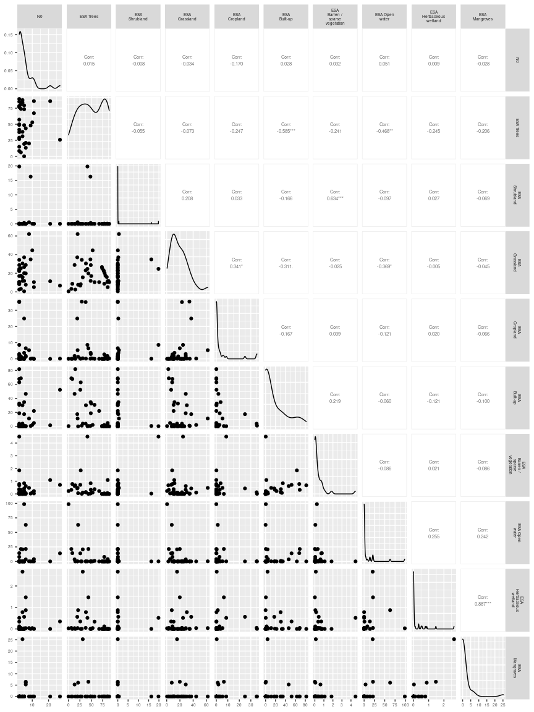<!-- -->

``` r
riq_cgl <- sel_por_prefijo('CGL')
ggpairs(riq_cgl, labeller = label_wrap_gen(width=10), upper = list(continuous = wrap("cor", size = 2))) + 
  theme(text = element_text(size = 6))
```

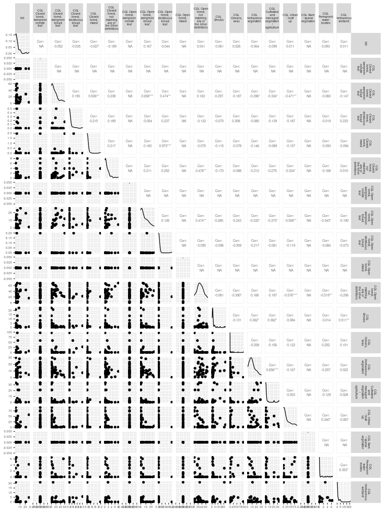<!-- -->

``` r
riq_g90geom <- sel_por_prefijo('G90-GEOM')
ggpairs(riq_g90geom, labeller = label_wrap_gen(width=10), upper = list(continuous = wrap("cor", size = 2))) + 
  theme(text = element_text(size = 6))
```

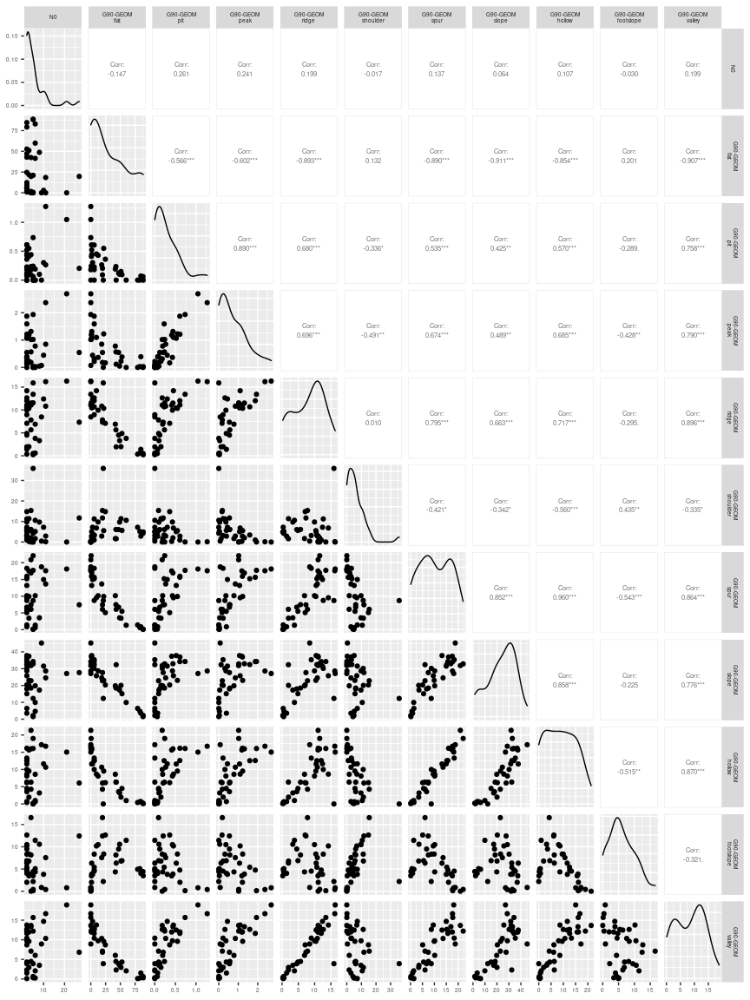<!-- -->

``` r
riq_ghh <- sel_por_prefijo('GHH')
ggpairs(riq_ghh, labeller = label_wrap_gen(width=10), upper = list(continuous = wrap("cor", size = 2))) + 
  theme(text = element_text(size = 6))
```

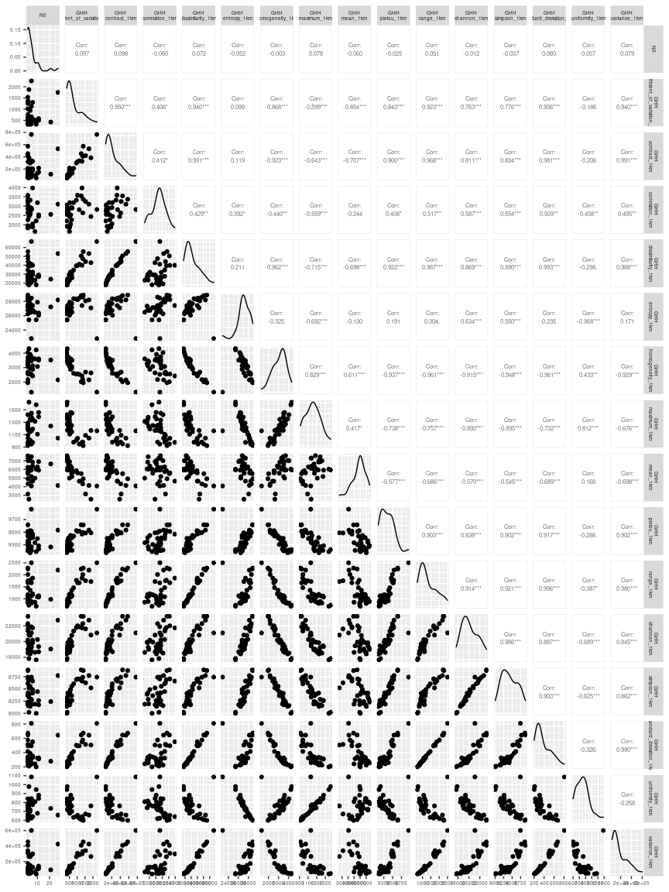<!-- -->

Correlación de la riqueza (`N0`) con las variables bioclimáticas de
WorldClim y CHELSA.

``` r
riq_wcl <- sel_por_prefijo('WCL')
ggpairs(riq_wcl, labeller = label_wrap_gen(width=10), upper = list(continuous = wrap("cor", size = 2))) + 
  theme(text = element_text(size = 6))
```

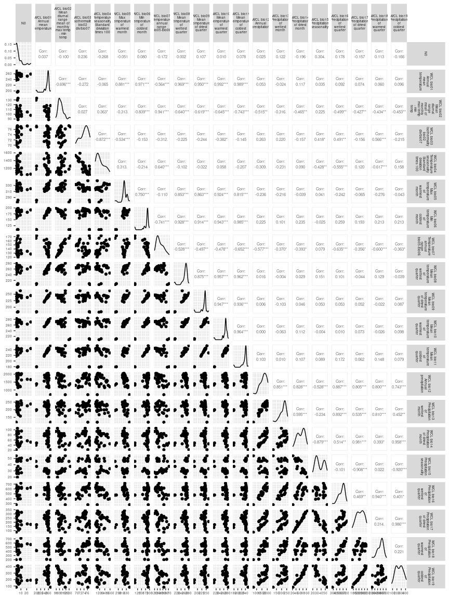<!-- -->

``` r
riq_chbio <- sel_por_prefijo('CH-BIO')
ggpairs(riq_chbio, labeller = label_wrap_gen(width=10), upper = list(continuous = wrap("cor", size = 2))) + 
  theme(text = element_text(size = 6))
```

<!-- -->

En cuanto a heterogeneidad de hábitat, existe asociación con la
variables “correlación de hábitat”. Si investigas sobre esta variable
(ver referencias señaladas en la [tabla de
variables](https://geofis.github.io/zonal-statistics/README.html#tab:variables)),
notarás que se refiere a la dependencia lineal del índice de vegetación
mejorado (EVI) con píxeles adyacentes (autocorrelación espacial).

``` r
riq_ghh <- sel_por_prefijo('GHH')
ggpairs(riq_ghh, labeller = label_wrap_gen(width=10), upper = list(continuous = wrap("cor", size = 2))) + 
  theme(text = element_text(size = 6))
```

<!-- -->

MUY IMPORTANTE: no te quedes sólo con estas variables, pues mis datos
seguramente serán muy diferentes a los tuyos. Además, estoy
simplificando para evitar hacer la demostración demasiado larga, pero te
recomiendo probar con todos los prefijos disponibles.

EXPLORA TUS RESULTADOS (usa como referencia
[practica-99-tu-manuscrito-3-resultados.md](../practica-99-tu-manuscrito-3-resultados.md)
y el vídeo correspondiente a tu caso)

Riqueza de especies, estimación y comparación, “completitud de muestra”
(existe en el diccionario) (Chao y Chiu, 2016)

``` r
specpool(mi_fam)
```

    ##     Species     chao  chao.se    jack1 jack1.se    jack2     boot  boot.se  n
    ## All      38 40.95522 3.198908 43.91045 2.791484 43.99864 41.54321 1.809474 67

``` r
specpool(mi_fam)[[1]]/specpool(mi_fam)[-c(3,5,8)]*100 #"Completitud", en porcentajes, según distintos estimadores
```

    ##     Species     chao    jack1   jack2     boot        n
    ## All     100 92.78426 86.53977 86.3663 91.47104 56.71642

``` r
# Si es cierto que, en torno al 80% de las poligonáceas de RD están registradas en GBIF,
# la base de datos al menos para esta familia es representativa.
ChaoSpecies(data.frame(V1 = c(nrow(mi_fam), as.numeric(colSums(mi_fam)))),
            datatype = 'incidence_freq', k=10, conf=0.95)
```

    ## 
    ## (1) BASIC DATA INFORMATION:
    ## 
    ##                                          Variable Value
    ##     Number of observed species                  D    38
    ##     Number of sampling units                    T    67
    ##     Total number of incidences                  U   168
    ##     Coverage estimate for entire dataset        C 0.965
    ##     CV for entire dataset                      CV 0.716
    ## 
    ##                                                       Variable Value
    ##     Cut-off point                                            k    10
    ##     Total number of incidences in infrequent group    U_infreq   127
    ##     Number of observed species for infrequent group   D_infreq    35
    ##     Estimated sample coverage for infrequent group    C_infreq 0.954
    ##     Estimated CV for infrequent group in ICE         CV_infreq 0.458
    ##     Estimated CV1 for infrequent group in ICE-1     CV1_infreq 0.504
    ##     Number of observed species for frequent group       D_freq     3
    ## 
    ##                            Q1 Q2 Q3 Q4 Q5 Q6 Q7 Q8 Q9 Q10
    ##     Incidence freq. counts  6  6 11  2  3  2  1  2  2   0
    ## 
    ## 
    ## (2) SPECIES RICHNESS ESTIMATORS TABLE:
    ## 
    ##                               Estimate  s.e. 95%Lower 95%Upper
    ##     Homogeneous Model           39.682 1.546   38.363   45.796
    ##     Chao2 (Chao, 1987)          40.955 3.199   38.526   54.603
    ##     Chao2-bc                    40.111 2.500   38.337   51.226
    ##     iChao2 (Chiu et al. 2014)   40.955 3.199   38.526   54.603
    ##     ICE (Lee & Chao, 1994)      41.003 2.513   38.720   50.520
    ##     ICE-1 (Lee & Chao, 1994)    41.277 2.805   38.766   52.014
    ##     1st order jackknife         43.910 3.425   40.059   54.970
    ##     2nd order jackknife         43.999 5.866   39.204   67.878
    ## 
    ## 
    ## (3) DESCRIPTION OF ESTIMATORS/MODELS:
    ## 
    ## Homogeneous Model: This model assumes that all species have the same incidence or detection probabilities. See Eq. (3.2) of Lee and Chao (1994) or Eq. (12a) in Chao and Chiu (2016b).
    ## 
    ## Chao2 (Chao, 1987): This approach uses the frequencies of uniques and duplicates to estimate the number of undetected species; see Chao (1987) or Eq. (11a) in Chao and Chiu (2016b).
    ##      
    ## Chao2-bc: A bias-corrected form for the Chao2 estimator; see Chao (2005).
    ##   
    ## iChao2: An improved Chao2 estimator; see Chiu et al. (2014).
    ## 
    ## ICE (Incidence-based Coverage Estimator): A non-parametric estimator originally proposed by Lee and Chao (1994) in the context of capture-recapture data analysis. The observed species are separated as frequent and infrequent species groups; only data in the infrequent group are used to estimate the number of undetected species. The estimated CV for species in the infrequent group characterizes the degree of heterogeneity among species incidence probabilities. See Eq. (12b) of Chao and Chiu (2016b), which is an improved version of Eq. (3.18) in Lee and Chao (1994). This model is also called Model(h) in capture-recapture literature where h denotes "heterogeneity".
    ## 
    ## ICE-1: A modified ICE for highly-heterogeneous cases.
    ## 
    ## 1st order jackknife: It uses the frequency of uniques to estimate the number of undetected species; see Burnham and Overton (1978).
    ## 
    ## 2nd order jackknife: It uses the frequencies of uniques and duplicates to estimate the number of undetected species; see Burnham and Overton (1978).
    ## 
    ## 95% Confidence interval: A log-transformation is used for all estimators so that the lower bound of the resulting interval is at least the number of observed species. See Chao (1987).

Ahora según grupos del método Ward.

``` r
# grupos_upgma <- readRDS('grupos_upgma.RDS')
grupos_ward <- readRDS('grupos_ward_acanthaceae.RDS')
mi_fam_ward <- mi_fam %>%
  mutate(g = grupos_ward) %>%
  group_by(g) %>%
  summarise_all(sum) %>%
  select(-g) %>% 
  mutate(N = nrow(mi_fam)) %>% 
  relocate(N, .before = 1) %>% 
  data.frame
mi_fam_ward
```

    ##    N Thungran Pachlute Ruelblec Ruelsimp Thunfrag Thunalat Asysgang Rueltube
    ## 1 67        0        0        4        0        7       15        1        3
    ## 2 67        7        2        1       11        1        3        5        1
    ## 3 67        0        1        4        1        3        0        2        5
    ##   Megaeryt Crosinfu Odoncusp Grappict Avicgerm Thunerec Sancparv Barllupu
    ## 1        2        1        4        0        0        1        0        0
    ## 2        0        5        0        3        1        0        0        1
    ## 3        1        0        2        0        3        0        1        2
    ##   Justcoma Justbran Justspin Diclmucr Oplospin Barlsola Justdisp Barliner
    ## 1        0        0        0        0        0        0        1        0
    ## 2        0        2        0        0        0        0        0        0
    ## 3        1        1        1        2        5        3        4        2
    ##   Dyscdiff Lepialop Hygrcost Oplomicr Ruelcocc Justalsi Justmira Ruellepi
    ## 1        0        0        1        0        1        0        0        0
    ## 2        1        0        0        1        0        0        0        0
    ## 3        4        3        3        2        7        2        3        2
    ##   Ruelnudi Stentube Rueldomi Justsess Ruelgemi Justrept Oploacic
    ## 1        0        0        0        0        0        0        0
    ## 2        0        0        0        0        0        0        0
    ## 3        0        3        3        2        1        2        1

``` r
nasin_raref <- iNEXT::iNEXT(
  x = t(mi_fam_ward),
  q=0,
  knots = 400,
  datatype = 'incidence_freq')
acumulacion_especies <- iNEXT::ggiNEXT(nasin_raref, type=1) +
  theme_bw() +
  theme(
    text = element_text(size = 20),
    panel.background = element_rect(fill = 'white', colour = 'black'),
    panel.grid.major = element_line(colour = "grey", linetype = "dashed", size = 0.25)
  ) +
  ylab('Riqueza de especies') +
  xlab('Número de sitios') +
  scale_y_continuous(breaks = seq(0,80, length.out = 9)) +
  scale_color_manual(values = brewer.pal(8, 'Set2')) +
  scale_fill_manual(values = brewer.pal(8, 'Set2'))
if(interactive()) dev.new()
acumulacion_especies
```

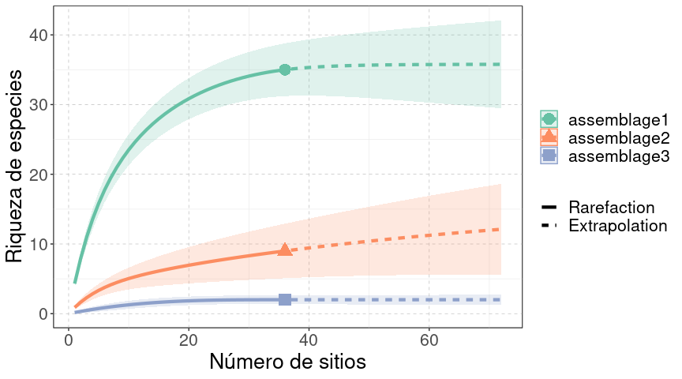<!-- -->

# Referencias
