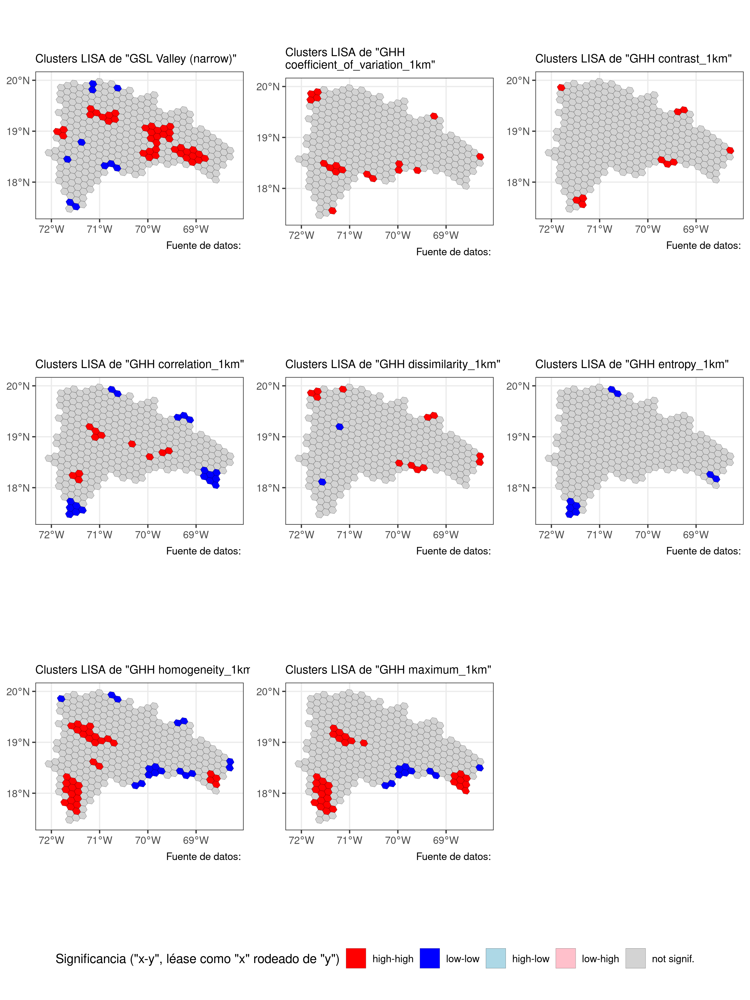
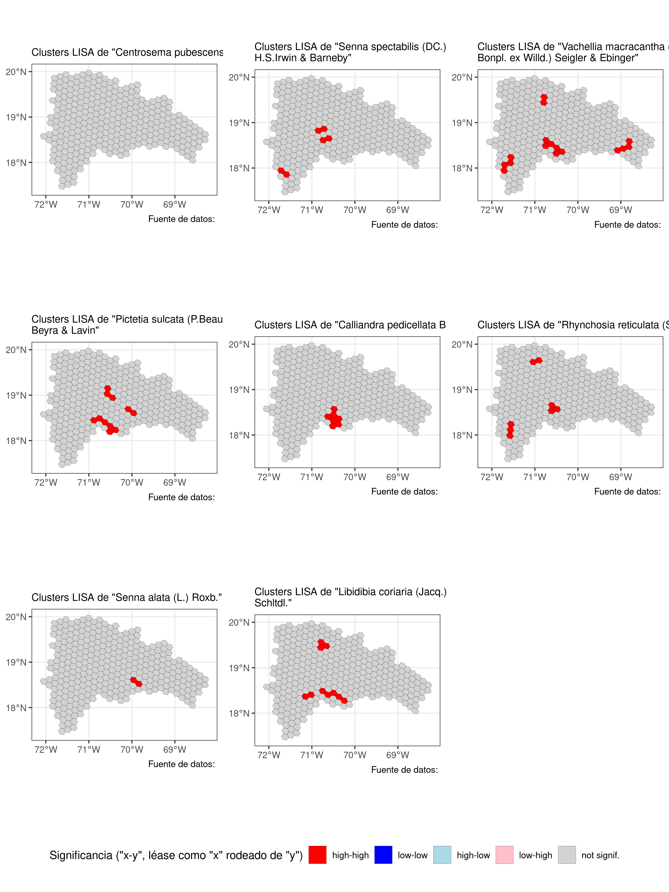

Práctica 99. Resultados de tu manuscrito. Fabaceae, ordenación y
ecología espacial.
================
José Ramón Martínez Batlle
26-11-2022

NOTA. Este cuaderno es una aplicación a datos de Fabaceae en GBIF, a
partir de una simple adaptación del cuaderno general
[practica-99-tu-manuscrito-3-resultados.md (basado en un análisis
demostrativo de la familia
Polygonaceae)](../practica-99-tu-manuscrito-3-resultados.md). Si
comparas este archivo con el original, notarás que, básicamente, edité
el nombre del archivo fuente de la matriz de comunidad (para adaptarlo a
este grupo) y otros detalles menores. Por lo tanto, aunque el código y
los gráficos sí se refieren a Fabaceae, probablemente el texto no.

# ¿Qué contiene la sección “Resultados”?

Te recomiendo releer las normas para autores/as del [Anuario de
Investigaciones Científicas de la
UASD](../docs/instrucciones-para-autores-anuario-investigaciones-cientificas-UASD.pdf)
y adherirte a las especificaciones sobre la sección “Resultados” que
allí se indican. Aunque en las referidas normas no se incluyen muchas
pautas significativas, si escribieras para una revista específica,
deberás considerar sus normas y recomendaciones de publicación. Además,
te recomiendo que consultes la sección “Resultados” de algunos
manuscritos publicados en el Anuario.

En los resultados expones el contenido analítico central. Es “el qué”
del manuscrito, en complemento de “el cómo” (metodología) y “el por qué”
(introducción) de tu investigación. En los resultados muestras lo que
encontraste luego de que colectaste (aunque en este caso, no fuiste al
terreno) y analizaste, con tus métodos, los datos fuente.

Algunas recomendaciones generales:

- “Resultados” se supone que es la sección más corta del manuscrito,
  siempre que se usen apropiadamente los recursos gráficos, las tablas y
  la información suplementaria.

- Comienza por realizar tus análisis. Necesitarás una matriz de
  comunidad y una ambiental. La de comunidad la habrás generado en la
  práctica 2; la ambiental explico cómo generarla en este mismo cuaderno
  (ver abajo). En general, la matriz ambiental la producirás mediante
  estadísticos zonales del territorio dominicano. Para aprender más
  sobre la fuente de estadística zonal de República Dominicana, que
  contiene un conjunto de más de 100 variables resumidas por celdas H3,
  visita [este repo](https://github.com/geofis/zonal-statistics). Debes
  visitar dicho repo para poder citarlo apropiadamente.

- Cuando tengas análisis realizados, antes de comenzar a escribir, te
  recomiendo que escribas un guión de tu sección “Resultados”.

- Guión en mano, redacta tu sección “Resultados”, siguiendo también
  estos consejos:

- En esta sección, se espera que presentes lo que has obtenido de manera
  “objetiva”, evitando explicaciones, comentarios, opiniones,
  perspectivas o limitaciones. En teoría, tu redacción es “fría”, lo
  cual no necesariamente significa que tenga que ser aburrida.

- Esta es la sección por excelencia donde usarás *tablas y/o gráficos*.
  Lo más importante a tener en cuenta cuando los uses es que no debes
  duplicar el contenido que muestran dichos recursos en el texto. La
  tabla o gráfico son apoyos que te ayudarán a no entrar en densidades
  innecesarias dentro de los párrafos. Por lo tanto, si colocas una
  tabla o figura, no caigas en la tentación de describirla en párrafos
  de forma exhausitva. Estos recursos deben servir para apoyar el o los
  párrafos donde destacas los principales patrones encontrados.

- *Importante también*: si insertas una tabla o gráfico, debes referirla
  en el texto (e.g. “ver figura X”). De nada sirve incluir una figura o
  una tabla si no la refieres, porque con ello estarás sugiriendo que
  dicho recurso era completamente prescindible.

- El tiempo verbal preferido (por defecto) es el pasado, por ejemplo “…,
  donde se **encontró** una asociación significativa entre … y …”. Sin
  embargo, hay excepciones, como por ejemplo, cuando te refieres a una
  tabla o una figura. Un caso típico es la expresión “tal como se
  muestra en la tabla 1”, donde el verbo está conjugado en presente.

A continuación, te pongo enlaces a referencias que considero útiles,
sobre cómo redactar los resultados (algunas son generales, sobre
artículos en general):

- [Breves pautas, en
  inglés](https://www.editage.com/insights/the-secret-to-writing-the-results-and-discussion-section-of-a-manuscript).
  Puedes usar el traductor [DeepL](https://www.deepl.com/translator),
  porque produce frases más naturales.

Cinco guías, en inglés, que considero están bien elaboradas, sobre cómo
redactar un artículo científico (consulta la sección sobre cómo redactar
los *resultados* en cada una):

- [Demystifying the Journal
  Article](https://www.insidehighered.com/advice/2017/05/09/how-write-effective-journal-article-and-get-it-published-essay)

- [How to write a scientific manuscript for
  publication](https://www.ncbi.nlm.nih.gov/pmc/articles/PMC3626472/)

- [11 steps to structuring a science paper editors will take
  seriously](https://www.elsevier.com/connect/11-steps-to-structuring-a-science-paper-editors-will-take-seriously)

- [Cómo escribir un artículo científico por primera
  vez](https://www.sciencedirect.com/science/article/abs/pii/S1134593417300040)
  (necesitarás usar [SciHub](https://sci-hub.se/) para descargarlo)

- Una muy breve pero con consejos útiles: [Tips for writing the perfect
  IMRAD
  manuscript](https://www.editage.com/insights/tips-for-writing-the-perfect-imrad-manuscript)

# Scripts de ejemplo

Una nota, a título informativo. Cada una se las siguientes secciones
(e.g. “Análisis de agrupamiento”, “Ordenación restringida”), es
reproducible de forma autónoma, es decir, sin dependencia de líneas de
código anteriores. Esto siginifica que las dependencias de una sección
se resuelven dentro de ella misma, sin dependencia de líneas anteriores.

Por esta razón, varias secciones comparten texto y código común, pero
sólo al inicio, porque al avanzar cada una se hace propia. Notarás, por
lo tanto, que el texto “se repite a sí mismo” por esta razón; la otra
opción que tenía era alojar el código común en un único archivo, pero
entonces esto te obligaba a navegar por archivos separados, haciendo
menos didáctico este cuaderno.

## Técnicas de ordenación

Me basaré en los scripts que comienzan por `to_` de este
[repo](https://github.com/biogeografia-master/scripts-de-analisis-BCI),
los cuales explico en los vídeos de “Técnicas de ordenación” de la lista
de reproducción [“Ecología Numérica con R” de mi
canal](https://www.youtube.com/playlist?list=PLDcT2n8UzsCRDqjqSeqHI1wsiNOqpYmsJ).

### Ordenación restringida

> INICIA texto+código común entre secciones

Fijar un directorio de trabajo no es recomendable, mejor trabaja por
proyecto. En cualquier caso, si no quieres o no puedes crear un
proyecto, usa la sentencia que verás abajo, cambiando `TU_DIRECTORIO`
por la ruta del directorio donde tengas almacenados tus datos y tus
scripts.

``` r
if(interactive()) {
  tryCatch(
    setwd(dirname(rstudioapi::getSourceEditorContext()$path)),
    error = function(e) {
      cat('Probablemente ya el directorio de trabajo está fijado correctamente',
          'o quizá el directorio no existe. Este fue el error devuelto:\n')
      e
    })
}
```

Cargar paquetes.

``` r
library(vegan)
library(sf)
library(tidyverse)
library(tmap)
library(kableExtra)
library(foreach)
library(leaps)
library(caret)
gh_content <- 'https://raw.githubusercontent.com/'
gh_zonal_stats <- paste0(gh_content,
                         'geofis/zonal-statistics/0b2e95aaee87bf326cf132d28f4bd15220bb4ec7/out/')
repo_analisis <- 'biogeografia-master/scripts-de-analisis-BCI/master'
repo_sem202202 <- 'biogeografia-202202/material-de-apoyo/master/practicas/'
devtools::source_url(paste0(gh_content, repo_analisis, '/biodata/funciones.R'))
devtools::source_url(paste0(gh_content, repo_sem202202, 'train.R'))
devtools::source_url(paste0(gh_content, repo_sem202202, 'funciones.R'))
```

Carga tu matriz de comunidad, que habrás generado en la práctica 2, y
elige un umbral para especies raras o rangos de registros de presencia
para seleccionar especies en una nueva matriz de comunidad.

``` r
res <- 5 #Resolución H3, puedes elegir entre 4, 5, 6 o 7, pero cuidado con valores >=6
# IMPORTANTE: la resolución de las celdas H3, debe coincidir con la resolución
# a la cual generaste tu matriz de comunidad. De lo contrario, obtendrás error. Si tu 
# archivo RDS de matriz de comunidad se denomina "matriz_de_comunidad.RDS", y lo creaste
# usando resolución 4, cámbiale el nombre a "matriz_de_comunidad_res_5.RDS". Recuerda,
# puedes usar cualquier resolución, lo único importante es que las resolución usada en la
# creación de la matriz de comunidad, debe ser la misma que en la ambiental.
mc_orig <- readRDS('matriz_de_comunidad_fabaceae.RDS')
nrow(mc_orig) #Número de filas, equivale a número de hexágonos con registros de presencia
```

    ## [1] 236

``` r
ncol(mc_orig)  #Número de columnas, equivale a número de especies, riqueza
```

    ## [1] 358

``` r
data.frame(Especies = names(mc_orig)) %>% 
  kable(booktabs=T) %>%
  kable_styling(latex_options = c("HOLD_position", "scale_down")) %>%
  gsub(' NA ', '', .) #Lista de especies
```

<table class="table" style="margin-left: auto; margin-right: auto;">
<thead>
<tr>
<th style="text-align:left;">
Especies
</th>
</tr>
</thead>
<tbody>
<tr>
<td style="text-align:left;">
Poitea galegoides Vent.
</td>
</tr>
<tr>
<td style="text-align:left;">
Canavalia rosea (Sw.) DC.
</td>
</tr>
<tr>
<td style="text-align:left;">
Senna occidentalis (L.) Link
</td>
</tr>
<tr>
<td style="text-align:left;">
Flemingia strobilifera (L.) W.T.Aiton
</td>
</tr>
<tr>
<td style="text-align:left;">
Alysicarpus vaginalis (L.) DC.
</td>
</tr>
<tr>
<td style="text-align:left;">
Clitoria ternatea L.
</td>
</tr>
<tr>
<td style="text-align:left;">
Acacia mangium Willd.
</td>
</tr>
<tr>
<td style="text-align:left;">
Cajanus cajan (L.) Huth
</td>
</tr>
<tr>
<td style="text-align:left;">
Mimosa pudica L.
</td>
</tr>
<tr>
<td style="text-align:left;">
Albizia lebbeck (L.) Benth.
</td>
</tr>
<tr>
<td style="text-align:left;">
Centrosema plumieri (Turpin ex Pers.) Benth.
</td>
</tr>
<tr>
<td style="text-align:left;">
Mucuna pruriens (L.) DC.
</td>
</tr>
<tr>
<td style="text-align:left;">
Bauhinia purpurea L.
</td>
</tr>
<tr>
<td style="text-align:left;">
Caesalpinia pulcherrima (L.) Sw.
</td>
</tr>
<tr>
<td style="text-align:left;">
Leucaena leucocephala (Lam.) de Wit
</td>
</tr>
<tr>
<td style="text-align:left;">
Haematoxylum campechianum L.
</td>
</tr>
<tr>
<td style="text-align:left;">
Tamarindus indica L.
</td>
</tr>
<tr>
<td style="text-align:left;">
Entada gigas (L.) Fawc. & Rendle
</td>
</tr>
<tr>
<td style="text-align:left;">
Bauhinia monandra Kurz
</td>
</tr>
<tr>
<td style="text-align:left;">
Delonix regia (Bojer ex Hook.) Raf.
</td>
</tr>
<tr>
<td style="text-align:left;">
Prosopis juliflora (Sw.) DC.
</td>
</tr>
<tr>
<td style="text-align:left;">
Centrosema virginianum (L.) Benth.
</td>
</tr>
<tr>
<td style="text-align:left;">
Mimosa pigra L.
</td>
</tr>
<tr>
<td style="text-align:left;">
Chamaecrista nictitans (L.) Moench
</td>
</tr>
<tr>
<td style="text-align:left;">
Trifolium repens L.
</td>
</tr>
<tr>
<td style="text-align:left;">
Crotalaria incana L.
</td>
</tr>
<tr>
<td style="text-align:left;">
Crotalaria pallida Aiton
</td>
</tr>
<tr>
<td style="text-align:left;">
Crotalaria retusa L.
</td>
</tr>
<tr>
<td style="text-align:left;">
Hymenaea courbaril L.
</td>
</tr>
<tr>
<td style="text-align:left;">
Crotalaria verrucosa L.
</td>
</tr>
<tr>
<td style="text-align:left;">
Samanea saman (Jacq.) Merr.
</td>
</tr>
<tr>
<td style="text-align:left;">
Albizia julibrissin Durazz.
</td>
</tr>
<tr>
<td style="text-align:left;">
Abrus precatorius L.
</td>
</tr>
<tr>
<td style="text-align:left;">
Desmodium incanum (Sw.) DC.
</td>
</tr>
<tr>
<td style="text-align:left;">
Dalbergia ecastaphyllum (L.) Taub.
</td>
</tr>
<tr>
<td style="text-align:left;">
Senna siamea (Lam.) H.S.Irwin & Barneby
</td>
</tr>
<tr>
<td style="text-align:left;">
Macroptilium lathyroides (L.) Urb.
</td>
</tr>
<tr>
<td style="text-align:left;">
Pithecellobium dulce (Roxb.) Benth.
</td>
</tr>
<tr>
<td style="text-align:left;">
Desmodium ciliare (Muhl. ex Willd.) DC.
</td>
</tr>
<tr>
<td style="text-align:left;">
Desmodium tortuosum (Sw.) DC.
</td>
</tr>
<tr>
<td style="text-align:left;">
Crotalaria juncea L.
</td>
</tr>
<tr>
<td style="text-align:left;">
Pithecellobium circinale (L.) Benth.
</td>
</tr>
<tr>
<td style="text-align:left;">
Phaseolus vulgaris L.
</td>
</tr>
<tr>
<td style="text-align:left;">
Inga vera Willd.
</td>
</tr>
<tr>
<td style="text-align:left;">
Centrosema pubescens Benth.
</td>
</tr>
<tr>
<td style="text-align:left;">
Senna spectabilis (DC.) H.S.Irwin & Barneby
</td>
</tr>
<tr>
<td style="text-align:left;">
Senna obtusifolia (L.) H.S.Irwin & Barneby
</td>
</tr>
<tr>
<td style="text-align:left;">
Arcoa gonavensis Urb.
</td>
</tr>
<tr>
<td style="text-align:left;">
Poitea campanilla DC.
</td>
</tr>
<tr>
<td style="text-align:left;">
Vachellia macracantha (Humb. & Bonpl. ex Willd.) Seigler & Ebinger
</td>
</tr>
<tr>
<td style="text-align:left;">
Pictetia sulcata (P.Beauv.) Beyra & Lavin
</td>
</tr>
<tr>
<td style="text-align:left;">
Biancaea decapetala (Roth) O.Deg.
</td>
</tr>
<tr>
<td style="text-align:left;">
Calliandra haematocephala Hassk.
</td>
</tr>
<tr>
<td style="text-align:left;">
Rhodopis planisiliqua var. lowdenii (Judd) Alain
</td>
</tr>
<tr>
<td style="text-align:left;">
Guilandina sphaerosperma (Urb. & Ekman) Britton
</td>
</tr>
<tr>
<td style="text-align:left;">
Calliandra pedicellata Benth.
</td>
</tr>
<tr>
<td style="text-align:left;">
Rhynchosia reticulata (Sw.) DC.
</td>
</tr>
<tr>
<td style="text-align:left;">
Chamaecrista lineata var. brachyloba (Griseb.) H.S.Irwin & Barneby
</td>
</tr>
<tr>
<td style="text-align:left;">
Senna alata (L.) Roxb.
</td>
</tr>
<tr>
<td style="text-align:left;">
Libidibia coriaria (Jacq.) Schltdl.
</td>
</tr>
<tr>
<td style="text-align:left;">
Strongylodon macrobotrys A.Gray
</td>
</tr>
<tr>
<td style="text-align:left;">
Calliandra surinamensis Benth.
</td>
</tr>
<tr>
<td style="text-align:left;">
Coronilla varia L.
</td>
</tr>
<tr>
<td style="text-align:left;">
Calliandra houstoniana var. calothyrsus (Meisn.) Barneby
</td>
</tr>
<tr>
<td style="text-align:left;">
Inga edulis Mart.
</td>
</tr>
<tr>
<td style="text-align:left;">
Grona triflora (L.) H.Ohashi & K.Ohashi
</td>
</tr>
<tr>
<td style="text-align:left;">
Erythrina variegata L.
</td>
</tr>
<tr>
<td style="text-align:left;">
Gliricidia sepium (Jacq.) Kunth
</td>
</tr>
<tr>
<td style="text-align:left;">
Guilandina bonduc L.
</td>
</tr>
<tr>
<td style="text-align:left;">
Leucaena macrophylla Benth.
</td>
</tr>
<tr>
<td style="text-align:left;">
Macroptilium atropurpureum (DC.) Urb.
</td>
</tr>
<tr>
<td style="text-align:left;">
Adenanthera pavonina L.
</td>
</tr>
<tr>
<td style="text-align:left;">
Rhynchosia phaseoloides (Sw.) DC.
</td>
</tr>
<tr>
<td style="text-align:left;">
Parkinsonia aculeata L.
</td>
</tr>
<tr>
<td style="text-align:left;">
Senna atomaria (L.) H.S.Irwin & Barneby
</td>
</tr>
<tr>
<td style="text-align:left;">
Zornia reticulata Sm.
</td>
</tr>
<tr>
<td style="text-align:left;">
Cassia fistula L.
</td>
</tr>
<tr>
<td style="text-align:left;">
Stylosanthes hamata (L.) Taub.
</td>
</tr>
<tr>
<td style="text-align:left;">
Barnebydendron riedelii (Tul.) J.H.Kirkbr.
</td>
</tr>
<tr>
<td style="text-align:left;">
Bauhinia variegata L.
</td>
</tr>
<tr>
<td style="text-align:left;">
Tara vesicaria (L.) Molinari, Sánchez Och. & Mayta
</td>
</tr>
<tr>
<td style="text-align:left;">
Tara Molina
</td>
</tr>
<tr>
<td style="text-align:left;">
Leucaena leucocephala subsp. leucocephala
</td>
</tr>
<tr>
<td style="text-align:left;">
Anadenanthera peregrina (L.) Speg.
</td>
</tr>
<tr>
<td style="text-align:left;">
Glycine max (L.) Merr.
</td>
</tr>
<tr>
<td style="text-align:left;">
Fabaceae
</td>
</tr>
<tr>
<td style="text-align:left;">
Parasenegalia vogeliana (Steud.) Seigler & Ebinger
</td>
</tr>
<tr>
<td style="text-align:left;">
Caesalpinia Plum. ex L.
</td>
</tr>
<tr>
<td style="text-align:left;">
Poitea Vent.
</td>
</tr>
<tr>
<td style="text-align:left;">
Canavalia DC.
</td>
</tr>
<tr>
<td style="text-align:left;">
Rhynchosia Lour.
</td>
</tr>
<tr>
<td style="text-align:left;">
Bauhinia divaricata L.
</td>
</tr>
<tr>
<td style="text-align:left;">
Chamaecrista fasciculata (Michx.) Greene
</td>
</tr>
<tr>
<td style="text-align:left;">
Jupunba glauca (Urb.) Britton & Rose
</td>
</tr>
<tr>
<td style="text-align:left;">
Senna Mill.
</td>
</tr>
<tr>
<td style="text-align:left;">
Lablab purpureus (L.) Sweet
</td>
</tr>
<tr>
<td style="text-align:left;">
Arachis hypogaea L.
</td>
</tr>
<tr>
<td style="text-align:left;">
Crotalaria pallida var. obovata (G.Don) Polhill
</td>
</tr>
<tr>
<td style="text-align:left;">
Erythrina poeppigiana (Walp.) O.F.Cook
</td>
</tr>
<tr>
<td style="text-align:left;">
Arachis glabrata Benth.
</td>
</tr>
<tr>
<td style="text-align:left;">
Arachis pintoi Krapov. & W.C.Greg.
</td>
</tr>
<tr>
<td style="text-align:left;">
Acacia melanoxylon R.Br.
</td>
</tr>
<tr>
<td style="text-align:left;">
Albizia niopoides (Spruce ex Benth.) Burkart
</td>
</tr>
<tr>
<td style="text-align:left;">
Galactia schomburgkii Urb.
</td>
</tr>
<tr>
<td style="text-align:left;">
Piscidia ekmanii Rudd
</td>
</tr>
<tr>
<td style="text-align:left;">
Galactia buchii Urb.
</td>
</tr>
<tr>
<td style="text-align:left;">
Mimosa domingensis (Bertero ex DC.) Benth.
</td>
</tr>
<tr>
<td style="text-align:left;">
Desmanthus leptophyllus Kunth
</td>
</tr>
<tr>
<td style="text-align:left;">
Desmodium glabrum (Mill.) DC.
</td>
</tr>
<tr>
<td style="text-align:left;">
Indigofera colutea (Burm.f.) Merr.
</td>
</tr>
<tr>
<td style="text-align:left;">
Leucaena trichodes (Jacq.) Benth.
</td>
</tr>
<tr>
<td style="text-align:left;">
Calliandra haematomma (Bertero ex DC.) Benth.
</td>
</tr>
<tr>
<td style="text-align:left;">
Caesalpinia barahonensis Urb.
</td>
</tr>
<tr>
<td style="text-align:left;">
Coursetia caribaea (Jacq.) Lavin
</td>
</tr>
<tr>
<td style="text-align:left;">
Poitea paucifolia (DC.) Lavin
</td>
</tr>
<tr>
<td style="text-align:left;">
Denisophytum buchii (Urb.) Gagnon & G.P.Lewis
</td>
</tr>
<tr>
<td style="text-align:left;">
Parasenegalia skleroxyla (Tussac) Seigler & Ebinger
</td>
</tr>
<tr>
<td style="text-align:left;">
Caesalpinia brasiliensis L.
</td>
</tr>
<tr>
<td style="text-align:left;">
Senna angustisiliqua (Lam.) H.S.Irwin & Barneby
</td>
</tr>
<tr>
<td style="text-align:left;">
Chamaecrista lineata (Sw.) Greene
</td>
</tr>
<tr>
<td style="text-align:left;">
Phaseolus lunatus L.
</td>
</tr>
<tr>
<td style="text-align:left;">
Cojoba arborea (L.) Britton & Rose
</td>
</tr>
<tr>
<td style="text-align:left;">
Desmodium affine Schltdl.
</td>
</tr>
<tr>
<td style="text-align:left;">
Cassia grandis L.f.
</td>
</tr>
<tr>
<td style="text-align:left;">
Mimosa diplacantha Benth.
</td>
</tr>
<tr>
<td style="text-align:left;">
Inga vera subsp. vera
</td>
</tr>
<tr>
<td style="text-align:left;">
Tephrosia cinerea (L.) Pers.
</td>
</tr>
<tr>
<td style="text-align:left;">
Acacia scleroxyla Tussac
</td>
</tr>
<tr>
<td style="text-align:left;">
Desmanthus Willd.
</td>
</tr>
<tr>
<td style="text-align:left;">
Acaciella glauca (L.) L.Rico
</td>
</tr>
<tr>
<td style="text-align:left;">
Mucuna urens (L.) Medik.
</td>
</tr>
<tr>
<td style="text-align:left;">
Desmodium axillare (Sw.) DC.
</td>
</tr>
<tr>
<td style="text-align:left;">
Vachellia barahonensis (Urb. & Ekman) Seigler & Ebinger
</td>
</tr>
<tr>
<td style="text-align:left;">
Vachellia oviedoensis (R.G.García & M.M.Mejía) Seigler & Ebinger
</td>
</tr>
<tr>
<td style="text-align:left;">
Lysiloma sabicu Benth.
</td>
</tr>
<tr>
<td style="text-align:left;">
Vachellia cucuyo (Barneby & Zanoni) Seigler & Ebinger
</td>
</tr>
<tr>
<td style="text-align:left;">
Vachellia tortuosa (L.) Seigler & Ebinger
</td>
</tr>
<tr>
<td style="text-align:left;">
Desmanthus virgatus (L.) Willd.
</td>
</tr>
<tr>
<td style="text-align:left;">
Canavalia nitida (Cav.) Piper
</td>
</tr>
<tr>
<td style="text-align:left;">
Sigmoidotropis elegans (Piper) A.Delgado
</td>
</tr>
<tr>
<td style="text-align:left;">
Galactia dubia DC.
</td>
</tr>
<tr>
<td style="text-align:left;">
Zapoteca portoricensis subsp. portoricensis
</td>
</tr>
<tr>
<td style="text-align:left;">
Sophora tomentosa var. occidentalis (L.) Isely
</td>
</tr>
<tr>
<td style="text-align:left;">
Crotalaria lotifolia L.
</td>
</tr>
<tr>
<td style="text-align:left;">
Caesalpinia domingensis Urb.
</td>
</tr>
<tr>
<td style="text-align:left;">
Libidibia monosperma (Tul.) Gagnon & G.P.Lewis
</td>
</tr>
<tr>
<td style="text-align:left;">
Dalea carthagenensis (Jacq.) J.F.Macbr.
</td>
</tr>
<tr>
<td style="text-align:left;">
Trifolium pratense L.
</td>
</tr>
<tr>
<td style="text-align:left;">
Medicago lupulina L.
</td>
</tr>
<tr>
<td style="text-align:left;">
Chamaecrista nictitans var. glabrata (Vogel) H.S.Irwin & Barneby
</td>
</tr>
<tr>
<td style="text-align:left;">
Lupinus mexicanus Cerv. ex Lag.
</td>
</tr>
<tr>
<td style="text-align:left;">
Genista monspessulana (L.) L.A.S.Johnson
</td>
</tr>
<tr>
<td style="text-align:left;">
Senna ligustrina (L.) H.S.Irwin & Barneby
</td>
</tr>
<tr>
<td style="text-align:left;">
Chamaecrista glandulosa var. pinetorum (Britton)
</td>
</tr>
<tr>
<td style="text-align:left;">
Senna mexicana (Jacq.) H.S.Irwin & Barneby
</td>
</tr>
<tr>
<td style="text-align:left;">
Lonchocarpus neurophyllus Urb.
</td>
</tr>
<tr>
<td style="text-align:left;">
Jupunba oppositifolia (Urb.) Britton & Rose
</td>
</tr>
<tr>
<td style="text-align:left;">
Brya buxifolia (Murray) Urb.
</td>
</tr>
<tr>
<td style="text-align:left;">
Jupunba abbottii (Rose & Leonard) Britton & Rose
</td>
</tr>
<tr>
<td style="text-align:left;">
Lonchocarpus heptaphyllus (Poir.) DC.
</td>
</tr>
<tr>
<td style="text-align:left;">
Poitea glyciphylla (Poir.) Urb.
</td>
</tr>
<tr>
<td style="text-align:left;">
Sigmoidotropis antillana (Urb.) A.Delgado
</td>
</tr>
<tr>
<td style="text-align:left;">
Mora ekmanii (Urb.) Britton & Rose
</td>
</tr>
<tr>
<td style="text-align:left;">
Senna sophera (L.) Roxb.
</td>
</tr>
<tr>
<td style="text-align:left;">
Rhodopis planisiliqua (L.) Urb.
</td>
</tr>
<tr>
<td style="text-align:left;">
Cynometra portoricensis Krug & Urb.
</td>
</tr>
<tr>
<td style="text-align:left;">
Dalbergia berteroi (DC.) Urb.
</td>
</tr>
<tr>
<td style="text-align:left;">
Inga ruiziana G.Don
</td>
</tr>
<tr>
<td style="text-align:left;">
Mora abbottii Rose & Leonard
</td>
</tr>
<tr>
<td style="text-align:left;">
Lonchocarpus longipes Urb. & Ekman
</td>
</tr>
<tr>
<td style="text-align:left;">
Lathyrus articulatus L.
</td>
</tr>
<tr>
<td style="text-align:left;">
Lupinus plattensis S.Watson
</td>
</tr>
<tr>
<td style="text-align:left;">
Trifolium dubium Sibth.
</td>
</tr>
<tr>
<td style="text-align:left;">
Cojoba samanensis R.G.García & Peguero
</td>
</tr>
<tr>
<td style="text-align:left;">
Ateleia gummifera (Bertero ex DC.) D.Dietr.
</td>
</tr>
<tr>
<td style="text-align:left;">
Senna angustisiliqua var. angustisiliqua
</td>
</tr>
<tr>
<td style="text-align:left;">
Cojoba arborea var. arborea
</td>
</tr>
<tr>
<td style="text-align:left;">
Denisophytum pauciflorum (Griseb.) Gagnon & G.P.Lewis
</td>
</tr>
<tr>
<td style="text-align:left;">
Cojoba bahorucensis J.W.Grimes & R.García
</td>
</tr>
<tr>
<td style="text-align:left;">
Chloroleucon guantanamense (Britton) Britton & Rose
</td>
</tr>
<tr>
<td style="text-align:left;">
Neustanthus phaseoloides (Roxb.) Benth.
</td>
</tr>
<tr>
<td style="text-align:left;">
Aeschynomene americana L.
</td>
</tr>
<tr>
<td style="text-align:left;">
Sesbania bispinosa (Jacq.) W.Wight
</td>
</tr>
<tr>
<td style="text-align:left;">
Cojoba filipes (Vent.) Barneby & J.W.Grimes
</td>
</tr>
<tr>
<td style="text-align:left;">
Pictetia obcordata DC.
</td>
</tr>
<tr>
<td style="text-align:left;">
Ormosia krugii Urb.
</td>
</tr>
<tr>
<td style="text-align:left;">
Albizia berteroana (Balb. ex DC.) Fawc. & Rendle
</td>
</tr>
<tr>
<td style="text-align:left;">
Poitea multiflora (Sw.) Urb.
</td>
</tr>
<tr>
<td style="text-align:left;">
Mimosa candollei R.Grether
</td>
</tr>
<tr>
<td style="text-align:left;">
Jupunba obovalis (A.Rich.) Britton & Rose
</td>
</tr>
<tr>
<td style="text-align:left;">
Inga laurina (Sw.) Willd.
</td>
</tr>
<tr>
<td style="text-align:left;">
Calliandra haematomma var. haematomma
</td>
</tr>
<tr>
<td style="text-align:left;">
Dalea carthagenensis var. carthagenensis
</td>
</tr>
<tr>
<td style="text-align:left;">
Pithecellobium Mart.
</td>
</tr>
<tr>
<td style="text-align:left;">
Inga Mill.
</td>
</tr>
<tr>
<td style="text-align:left;">
Tephrosia sinapou (Buc’hoz) A.Chev.
</td>
</tr>
<tr>
<td style="text-align:left;">
Zapoteca portoricensis (Jacq.) H.M.Hern.
</td>
</tr>
<tr>
<td style="text-align:left;">
Calliandra haematomma var. rivularis (Urb. & Ekman) Barneby
</td>
</tr>
<tr>
<td style="text-align:left;">
Pithecellobium domingense Alain
</td>
</tr>
<tr>
<td style="text-align:left;">
Andira inermis (W.Wright) DC.
</td>
</tr>
<tr>
<td style="text-align:left;">
Poitea galegoides var. galegoides
</td>
</tr>
<tr>
<td style="text-align:left;">
Melilotus albus Medik.
</td>
</tr>
<tr>
<td style="text-align:left;">
Senna uniflora (Mill.) H.S.Irwin & Barneby
</td>
</tr>
<tr>
<td style="text-align:left;">
Mucuna Adans.
</td>
</tr>
<tr>
<td style="text-align:left;">
Peltophorum dubium var. berteroanum (Urb.) Barneby
</td>
</tr>
<tr>
<td style="text-align:left;">
Coulteria cubensis (Greenm.) Sotuyo & G.P.Lewis
</td>
</tr>
<tr>
<td style="text-align:left;">
Lonchocarpus sericeus (Poir.) Kunth ex DC.
</td>
</tr>
<tr>
<td style="text-align:left;">
Crotalaria L.
</td>
</tr>
<tr>
<td style="text-align:left;">
Senna mexicana var. berteriana (DC.) H.S.Irwin & Barneby
</td>
</tr>
<tr>
<td style="text-align:left;">
Mimosa pudica var. unijuga (Duchass. & Walp.) Griseb.
</td>
</tr>
<tr>
<td style="text-align:left;">
Dalbergia ovalis (L.) P.L.R.Moraes & L.P.Queiroz
</td>
</tr>
<tr>
<td style="text-align:left;">
Neptunia plena (L.) Benth.
</td>
</tr>
<tr>
<td style="text-align:left;">
Erythrina corallodendron L.
</td>
</tr>
<tr>
<td style="text-align:left;">
Entada polystachya (L.) DC.
</td>
</tr>
<tr>
<td style="text-align:left;">
Rhodopis rudolphioides (Griseb.) L.P.Queiroz
</td>
</tr>
<tr>
<td style="text-align:left;">
Desmodium Desv.
</td>
</tr>
<tr>
<td style="text-align:left;">
Poiretia punctata (Willd.) Desv.
</td>
</tr>
<tr>
<td style="text-align:left;">
Desmodium intortum (Mill.) Urb.
</td>
</tr>
<tr>
<td style="text-align:left;">
Aeschynomene americana var. americana
</td>
</tr>
<tr>
<td style="text-align:left;">
Crotalaria stipularia Desv.
</td>
</tr>
<tr>
<td style="text-align:left;">
Tephrosia purpurea (L.) Pers.
</td>
</tr>
<tr>
<td style="text-align:left;">
Barbieria pinnata (Pers.) Baill.
</td>
</tr>
<tr>
<td style="text-align:left;">
Calliandra Benth.
</td>
</tr>
<tr>
<td style="text-align:left;">
Cojoba zanonii (Barneby) Barneby & J.W.Grimes
</td>
</tr>
<tr>
<td style="text-align:left;">
Senegalia angustifolia (Lam.) Britton & Rose
</td>
</tr>
<tr>
<td style="text-align:left;">
Pterocarpus officinalis Jacq.
</td>
</tr>
<tr>
<td style="text-align:left;">
Senna gundlachii (Urb.) H.S.Irwin & Barneby
</td>
</tr>
<tr>
<td style="text-align:left;">
Chamaecrista nictitans var. diffusa (DC.) H.S.Irwin & Barneby
</td>
</tr>
<tr>
<td style="text-align:left;">
Lonchocarpus pycnophyllus Urb.
</td>
</tr>
<tr>
<td style="text-align:left;">
Galactia P.Browne
</td>
</tr>
<tr>
<td style="text-align:left;">
Chamaecrista Moench
</td>
</tr>
<tr>
<td style="text-align:left;">
Aeschynomene villosa Poir.
</td>
</tr>
<tr>
<td style="text-align:left;">
Acacia auriculiformis A.Cunn. ex Benth.
</td>
</tr>
<tr>
<td style="text-align:left;">
Albizia berteriana (DC.) Fawc. & Rendle
</td>
</tr>
<tr>
<td style="text-align:left;">
Indigofera subulata var. scabra (Roth) Meikle
</td>
</tr>
<tr>
<td style="text-align:left;">
Lespedeza juncea (L.f.) Pers.
</td>
</tr>
<tr>
<td style="text-align:left;">
Grona barbata (L.) H.Ohashi & K.Ohashi
</td>
</tr>
<tr>
<td style="text-align:left;">
Senna septemtrionalis (Viv.) H.S.Irwin & Barneby
</td>
</tr>
<tr>
<td style="text-align:left;">
Vachellia farnesiana (L.) Wight & Arn.
</td>
</tr>
<tr>
<td style="text-align:left;">
Mimosa ceratonia var. ceratonia
</td>
</tr>
<tr>
<td style="text-align:left;">
Aeschynomene pratensis Small
</td>
</tr>
<tr>
<td style="text-align:left;">
Erythrina berteroana Urb.
</td>
</tr>
<tr>
<td style="text-align:left;">
Grona adscendens (Sw.) H.Ohashi & K.Ohashi
</td>
</tr>
<tr>
<td style="text-align:left;">
Erythrina leptopoda Urb. & Ekman
</td>
</tr>
<tr>
<td style="text-align:left;">
Mimosa L.
</td>
</tr>
<tr>
<td style="text-align:left;">
Sophora tomentosa L.
</td>
</tr>
<tr>
<td style="text-align:left;">
Zapoteca nervosa (Urb.) H.M.Hern.
</td>
</tr>
<tr>
<td style="text-align:left;">
Ateleia (DC.) D.Dietr.
</td>
</tr>
<tr>
<td style="text-align:left;">
Indigofera tinctoria L.
</td>
</tr>
<tr>
<td style="text-align:left;">
Chamaecrista diphylla (L.) Greene
</td>
</tr>
<tr>
<td style="text-align:left;">
Zornia diphylla (L.) Pers.
</td>
</tr>
<tr>
<td style="text-align:left;">
Rhynchosia minima (L.) DC.
</td>
</tr>
<tr>
<td style="text-align:left;">
Albizia procera (Roxb.) Benth.
</td>
</tr>
<tr>
<td style="text-align:left;">
Apios Fabr.
</td>
</tr>
<tr>
<td style="text-align:left;">
Tephrosia Pers.
</td>
</tr>
<tr>
<td style="text-align:left;">
Pithecellobium unguis-cati (L.) Benth.
</td>
</tr>
<tr>
<td style="text-align:left;">
Galactia striata (Jacq.) Urb.
</td>
</tr>
<tr>
<td style="text-align:left;">
Senna polyphylla var. montis-christi H.S.Irwin & Barneby
</td>
</tr>
<tr>
<td style="text-align:left;">
Senna mexicana var. mexicana
</td>
</tr>
<tr>
<td style="text-align:left;">
Sophora albopetiolulata Leonard
</td>
</tr>
<tr>
<td style="text-align:left;">
Chamaecrista portoricensis var. portoricensis
</td>
</tr>
<tr>
<td style="text-align:left;">
Machaerium lunatum (L.f.) Ducke
</td>
</tr>
<tr>
<td style="text-align:left;">
Grona barbata var. barbata
</td>
</tr>
<tr>
<td style="text-align:left;">
Ateleia microcarpa (Pers.) D.Dietr.
</td>
</tr>
<tr>
<td style="text-align:left;">
Calopogonium mucunoides Desv.
</td>
</tr>
<tr>
<td style="text-align:left;">
Senna bicapsularis (L.) Roxb.
</td>
</tr>
<tr>
<td style="text-align:left;">
Acacia confusa Merr.
</td>
</tr>
<tr>
<td style="text-align:left;">
Mucuna pruriens var. utilis (Wall. ex Wight) Baker ex Burck
</td>
</tr>
<tr>
<td style="text-align:left;">
Pachyrhizus erosus (L.) Urb.
</td>
</tr>
<tr>
<td style="text-align:left;">
Zornia microphylla Desv.
</td>
</tr>
<tr>
<td style="text-align:left;">
Indigofera suffruticosa Mill.
</td>
</tr>
<tr>
<td style="text-align:left;">
Chamaecrista pedicellaris var. adenosperma (Urb.) H.S.Irwin & Barneby
</td>
</tr>
<tr>
<td style="text-align:left;">
Tephrosia senna Kunth
</td>
</tr>
<tr>
<td style="text-align:left;">
Galactia longifolia (Jacq.) Benth.
</td>
</tr>
<tr>
<td style="text-align:left;">
Sesbania sericea (Willd.) Link
</td>
</tr>
<tr>
<td style="text-align:left;">
Chamaecrista pilosa var. pilosa
</td>
</tr>
<tr>
<td style="text-align:left;">
Stylosanthes guianensis (Aubl.) Sw.
</td>
</tr>
<tr>
<td style="text-align:left;">
Indigofera subulata Vahl ex Poir.
</td>
</tr>
<tr>
<td style="text-align:left;">
Tephrosia purpurea subsp. purpurea
</td>
</tr>
<tr>
<td style="text-align:left;">
Erythrina buchii Urb.
</td>
</tr>
<tr>
<td style="text-align:left;">
Diphysa americana (Mill.) M.Sousa
</td>
</tr>
<tr>
<td style="text-align:left;">
Enterolobium Mart.
</td>
</tr>
<tr>
<td style="text-align:left;">
Enterolobium cyclocarpum (Jacq.) Griseb.
</td>
</tr>
<tr>
<td style="text-align:left;">
Poitea dubia (Poir.) Lavin
</td>
</tr>
<tr>
<td style="text-align:left;">
Mucuna mutisiana (Kunth) DC.
</td>
</tr>
<tr>
<td style="text-align:left;">
Lathyrus oleraceus Lam.
</td>
</tr>
<tr>
<td style="text-align:left;">
Dalbergia brownei (Jacq.) Schinz
</td>
</tr>
<tr>
<td style="text-align:left;">
Poitea galegoides var. stenophylla Ekman ex Lavin
</td>
</tr>
<tr>
<td style="text-align:left;">
Chamaecrista pedicellaris var. pedicellaris
</td>
</tr>
<tr>
<td style="text-align:left;">
Sesbania grandiflora (L.) Pers.
</td>
</tr>
<tr>
<td style="text-align:left;">
Bauhinia tomentosa L.
</td>
</tr>
<tr>
<td style="text-align:left;">
Entada rheedei Spreng.
</td>
</tr>
<tr>
<td style="text-align:left;">
Lysiloma ambigua Urb.
</td>
</tr>
<tr>
<td style="text-align:left;">
Lespedeza Michx.
</td>
</tr>
<tr>
<td style="text-align:left;">
Guilandina ciliata Bergius ex Wikstr.
</td>
</tr>
<tr>
<td style="text-align:left;">
Vachellia farnesiana var. farnesiana
</td>
</tr>
<tr>
<td style="text-align:left;">
Clitoria fairchildiana R.A.Howard
</td>
</tr>
<tr>
<td style="text-align:left;">
Andira inermis subsp. inermis
</td>
</tr>
<tr>
<td style="text-align:left;">
Vigna luteola (Jacq.) Benth.
</td>
</tr>
<tr>
<td style="text-align:left;">
Albizia carbonaria Britton
</td>
</tr>
<tr>
<td style="text-align:left;">
Eriosema crinitum (Kunth) G.Don
</td>
</tr>
<tr>
<td style="text-align:left;">
Mimosa diplotricha var. diplotricha
</td>
</tr>
<tr>
<td style="text-align:left;">
Calopogonium galactoides (Kunth) Hemsl.
</td>
</tr>
<tr>
<td style="text-align:left;">
Tephrosia sessiliflora (Poir.) Hassl.
</td>
</tr>
<tr>
<td style="text-align:left;">
Teramnus uncinatus (L.) Sw.
</td>
</tr>
<tr>
<td style="text-align:left;">
Centrosema virginianum Griseb., 1857
</td>
</tr>
<tr>
<td style="text-align:left;">
Desmodium cubense Griseb.
</td>
</tr>
<tr>
<td style="text-align:left;">
Chamaecrista glandulosa (L.) Greene
</td>
</tr>
<tr>
<td style="text-align:left;">
Indigofera fruticosa Rose
</td>
</tr>
<tr>
<td style="text-align:left;">
Bauhinia galpinii N.E.Br.
</td>
</tr>
<tr>
<td style="text-align:left;">
Senna domingensis (Spreng.) H.S.Irwin & Barneby
</td>
</tr>
<tr>
<td style="text-align:left;">
Crotalaria spectabilis Roth
</td>
</tr>
<tr>
<td style="text-align:left;">
Crotalaria pumila Ortega
</td>
</tr>
<tr>
<td style="text-align:left;">
Galactia synandra Urb.
</td>
</tr>
<tr>
<td style="text-align:left;">
Senna alexandrina Mill.
</td>
</tr>
<tr>
<td style="text-align:left;">
Aeschynomene sensitiva Sw.
</td>
</tr>
<tr>
<td style="text-align:left;">
Indigofera colutea var. colutea
</td>
</tr>
<tr>
<td style="text-align:left;">
Aeschynomene L.
</td>
</tr>
<tr>
<td style="text-align:left;">
Chamaecrista pedicellaris (DC.) Britton
</td>
</tr>
<tr>
<td style="text-align:left;">
Vachellia choriophylla (Benth.) Seigler & Ebinger
</td>
</tr>
<tr>
<td style="text-align:left;">
Alysicarpus Desv.
</td>
</tr>
<tr>
<td style="text-align:left;">
Desmodium procumbens (Mill.) C.L.Hitchc.
</td>
</tr>
<tr>
<td style="text-align:left;">
Vigna vexillata (L.) A.Rich.
</td>
</tr>
<tr>
<td style="text-align:left;">
Clitoria falcata var. falcata
</td>
</tr>
<tr>
<td style="text-align:left;">
Vigna umbellata (Thunb.) Ohwi & H.Ohashi
</td>
</tr>
<tr>
<td style="text-align:left;">
Phaseolus lunatus Billb. ex Beurl.
</td>
</tr>
<tr>
<td style="text-align:left;">
Ancistrotropis peduncularis (Fawc. & Rendle) A.Delgado
</td>
</tr>
<tr>
<td style="text-align:left;">
Galactia parvifolia A.Rich.
</td>
</tr>
<tr>
<td style="text-align:left;">
Desmodium scorpiurus (Sw.) Desv. ex DC.
</td>
</tr>
<tr>
<td style="text-align:left;">
Canavalia plagiosperma Piper
</td>
</tr>
<tr>
<td style="text-align:left;">
Poiretia Vent.
</td>
</tr>
<tr>
<td style="text-align:left;">
Sigmoidotropis ekmaniana (Urb.) A.Delgado
</td>
</tr>
<tr>
<td style="text-align:left;">
Zapoteca caracasana subsp. caracasana
</td>
</tr>
<tr>
<td style="text-align:left;">
Nissolia vincentina (Ker Gawl.) T.M.Moura & Fort.-Perez
</td>
</tr>
<tr>
<td style="text-align:left;">
Medicago polymorpha L.
</td>
</tr>
<tr>
<td style="text-align:left;">
Erythrostemon glandulosus (Bertero ex DC.) Gagnon & G.P.Lewis
</td>
</tr>
<tr>
<td style="text-align:left;">
Galactia lignosa (Turpin ex Pers.) Urb.
</td>
</tr>
<tr>
<td style="text-align:left;">
Vigna unguiculata (L.) Walp.
</td>
</tr>
<tr>
<td style="text-align:left;">
Galactia spiciformis Torr. & A.Gray
</td>
</tr>
<tr>
<td style="text-align:left;">
Teramnus labialis (L.f.) Spreng.
</td>
</tr>
<tr>
<td style="text-align:left;">
Galactia dictyophylla Urb.
</td>
</tr>
<tr>
<td style="text-align:left;">
Crotalaria purdiana H.Senn
</td>
</tr>
<tr>
<td style="text-align:left;">
Bauhinia Plum. ex L.
</td>
</tr>
<tr>
<td style="text-align:left;">
Indigofera lespedezioides Kunth
</td>
</tr>
<tr>
<td style="text-align:left;">
Galactia fuertesii Urb.
</td>
</tr>
<tr>
<td style="text-align:left;">
Senna pendula var. indecora (Kunth) Luckow
</td>
</tr>
<tr>
<td style="text-align:left;">
Senna tora (L.) Roxb.
</td>
</tr>
<tr>
<td style="text-align:left;">
Indigofera microcarpa Desv.
</td>
</tr>
<tr>
<td style="text-align:left;">
Cassia emarginata Berry, 1916
</td>
</tr>
<tr>
<td style="text-align:left;">
Dalbergia L.f.
</td>
</tr>
<tr>
<td style="text-align:left;">
Cassia biflora Bojer
</td>
</tr>
<tr>
<td style="text-align:left;">
Galactia filiformis (Jacq.) Benth.
</td>
</tr>
<tr>
<td style="text-align:left;">
Centrosema (DC.) Benth.
</td>
</tr>
<tr>
<td style="text-align:left;">
Vachellia acuifera (Benth.) Seigler & Ebinger
</td>
</tr>
<tr>
<td style="text-align:left;">
Senna mexicana var. berteroana (Balb. ex DC.) H.S.Irwin & Barneby
</td>
</tr>
<tr>
<td style="text-align:left;">
Medicago lupina L.
</td>
</tr>
<tr>
<td style="text-align:left;">
Cenostigma pellucidum (Vogel) Gagnon & G.P.Lewis
</td>
</tr>
<tr>
<td style="text-align:left;">
Ctenodon pleuronervius (DC.) D.B.O.S.Cardoso & H.C.Lima
</td>
</tr>
</tbody>
</table>

``` r
unique(word(names(mc_orig), 1, 1)) #Géneros representados
```

    ##   [1] "Poitea"         "Canavalia"      "Senna"          "Flemingia"     
    ##   [5] "Alysicarpus"    "Clitoria"       "Acacia"         "Cajanus"       
    ##   [9] "Mimosa"         "Albizia"        "Centrosema"     "Mucuna"        
    ##  [13] "Bauhinia"       "Caesalpinia"    "Leucaena"       "Haematoxylum"  
    ##  [17] "Tamarindus"     "Entada"         "Delonix"        "Prosopis"      
    ##  [21] "Chamaecrista"   "Trifolium"      "Crotalaria"     "Hymenaea"      
    ##  [25] "Samanea"        "Abrus"          "Desmodium"      "Dalbergia"     
    ##  [29] "Macroptilium"   "Pithecellobium" "Phaseolus"      "Inga"          
    ##  [33] "Arcoa"          "Vachellia"      "Pictetia"       "Biancaea"      
    ##  [37] "Calliandra"     "Rhodopis"       "Guilandina"     "Rhynchosia"    
    ##  [41] "Libidibia"      "Strongylodon"   "Coronilla"      "Grona"         
    ##  [45] "Erythrina"      "Gliricidia"     "Adenanthera"    "Parkinsonia"   
    ##  [49] "Zornia"         "Cassia"         "Stylosanthes"   "Barnebydendron"
    ##  [53] "Tara"           "Anadenanthera"  "Glycine"        "Fabaceae"      
    ##  [57] "Parasenegalia"  "Jupunba"        "Lablab"         "Arachis"       
    ##  [61] "Galactia"       "Piscidia"       "Desmanthus"     "Indigofera"    
    ##  [65] "Coursetia"      "Denisophytum"   "Cojoba"         "Tephrosia"     
    ##  [69] "Acaciella"      "Lysiloma"       "Sigmoidotropis" "Zapoteca"      
    ##  [73] "Sophora"        "Dalea"          "Medicago"       "Lupinus"       
    ##  [77] "Genista"        "Lonchocarpus"   "Brya"           "Mora"          
    ##  [81] "Cynometra"      "Lathyrus"       "Ateleia"        "Chloroleucon"  
    ##  [85] "Neustanthus"    "Aeschynomene"   "Sesbania"       "Ormosia"       
    ##  [89] "Andira"         "Melilotus"      "Peltophorum"    "Coulteria"     
    ##  [93] "Neptunia"       "Poiretia"       "Barbieria"      "Senegalia"     
    ##  [97] "Pterocarpus"    "Lespedeza"      "Apios"          "Machaerium"    
    ## [101] "Calopogonium"   "Pachyrhizus"    "Diphysa"        "Enterolobium"  
    ## [105] "Vigna"          "Eriosema"       "Teramnus"       "Ancistrotropis"
    ## [109] "Nissolia"       "Erythrostemon"  "Cenostigma"     "Ctenodon"

``` r
table(word(names(mc_orig), 1, 1)) #Número de especies por género
```

    ## 
    ##          Abrus         Acacia      Acaciella    Adenanthera   Aeschynomene 
    ##              1              5              1              1              6 
    ##        Albizia    Alysicarpus  Anadenanthera Ancistrotropis         Andira 
    ##              7              2              1              1              2 
    ##          Apios        Arachis          Arcoa        Ateleia      Barbieria 
    ##              1              3              1              3              1 
    ## Barnebydendron       Bauhinia       Biancaea           Brya    Caesalpinia 
    ##              1              7              1              1              5 
    ##        Cajanus     Calliandra   Calopogonium      Canavalia         Cassia 
    ##              1              8              2              4              4 
    ##     Cenostigma     Centrosema   Chamaecrista   Chloroleucon       Clitoria 
    ##              1              5             15              1              3 
    ##         Cojoba      Coronilla      Coulteria      Coursetia     Crotalaria 
    ##              6              1              1              1             12 
    ##       Ctenodon      Cynometra      Dalbergia          Dalea        Delonix 
    ##              1              1              5              2              1 
    ##   Denisophytum     Desmanthus      Desmodium        Diphysa         Entada 
    ##              2              3             11              1              3 
    ##   Enterolobium       Eriosema      Erythrina  Erythrostemon       Fabaceae 
    ##              2              1              6              1              1 
    ##      Flemingia       Galactia        Genista     Gliricidia        Glycine 
    ##              1             13              1              1              1 
    ##          Grona     Guilandina   Haematoxylum       Hymenaea     Indigofera 
    ##              4              3              1              1              9 
    ##           Inga        Jupunba         Lablab       Lathyrus      Lespedeza 
    ##              6              4              1              2              2 
    ##       Leucaena      Libidibia   Lonchocarpus        Lupinus       Lysiloma 
    ##              4              2              5              2              2 
    ##     Machaerium   Macroptilium       Medicago      Melilotus         Mimosa 
    ##              1              2              3              1              9 
    ##           Mora         Mucuna       Neptunia    Neustanthus       Nissolia 
    ##              2              5              1              1              1 
    ##        Ormosia    Pachyrhizus  Parasenegalia    Parkinsonia    Peltophorum 
    ##              1              1              2              1              1 
    ##      Phaseolus       Pictetia       Piscidia Pithecellobium       Poiretia 
    ##              3              2              1              5              2 
    ##         Poitea       Prosopis    Pterocarpus       Rhodopis     Rhynchosia 
    ##              9              1              1              3              4 
    ##        Samanea      Senegalia          Senna       Sesbania Sigmoidotropis 
    ##              1              1             24              3              3 
    ##        Sophora   Strongylodon   Stylosanthes     Tamarindus           Tara 
    ##              3              1              2              1              2 
    ##      Tephrosia       Teramnus      Trifolium      Vachellia          Vigna 
    ##              7              2              3              9              4 
    ##       Zapoteca         Zornia 
    ##              4              3

``` r
data.frame(`Número de hexágonos` = sort(colSums(mc_orig), decreasing = T), check.names = F) %>% 
  kable(booktabs=T) %>%
  kable_styling(latex_options = c("HOLD_position", "scale_down")) %>%
  gsub(' NA ', '', .) # Número de hexágonos en los que está presente cada especie
```

<table class="table" style="margin-left: auto; margin-right: auto;">
<thead>
<tr>
<th style="text-align:left;">
</th>
<th style="text-align:right;">
Número de hexágonos
</th>
</tr>
</thead>
<tbody>
<tr>
<td style="text-align:left;">
Cajanus cajan (L.) Huth
</td>
<td style="text-align:right;">
36
</td>
</tr>
<tr>
<td style="text-align:left;">
Centrosema virginianum (L.) Benth.
</td>
<td style="text-align:right;">
32
</td>
</tr>
<tr>
<td style="text-align:left;">
Pictetia sulcata (P.Beauv.) Beyra & Lavin
</td>
<td style="text-align:right;">
28
</td>
</tr>
<tr>
<td style="text-align:left;">
Delonix regia (Bojer ex Hook.) Raf.
</td>
<td style="text-align:right;">
26
</td>
</tr>
<tr>
<td style="text-align:left;">
Vachellia macracantha (Humb. & Bonpl. ex Willd.) Seigler & Ebinger
</td>
<td style="text-align:right;">
26
</td>
</tr>
<tr>
<td style="text-align:left;">
Leucaena leucocephala (Lam.) de Wit
</td>
<td style="text-align:right;">
25
</td>
</tr>
<tr>
<td style="text-align:left;">
Senna occidentalis (L.) Link
</td>
<td style="text-align:right;">
22
</td>
</tr>
<tr>
<td style="text-align:left;">
Senna atomaria (L.) H.S.Irwin & Barneby
</td>
<td style="text-align:right;">
22
</td>
</tr>
<tr>
<td style="text-align:left;">
Crotalaria retusa L.
</td>
<td style="text-align:right;">
21
</td>
</tr>
<tr>
<td style="text-align:left;">
Senna angustisiliqua var. angustisiliqua
</td>
<td style="text-align:right;">
20
</td>
</tr>
<tr>
<td style="text-align:left;">
Mimosa pudica L.
</td>
<td style="text-align:right;">
19
</td>
</tr>
<tr>
<td style="text-align:left;">
Macroptilium lathyroides (L.) Urb.
</td>
<td style="text-align:right;">
19
</td>
</tr>
<tr>
<td style="text-align:left;">
Senna alata (L.) Roxb.
</td>
<td style="text-align:right;">
19
</td>
</tr>
<tr>
<td style="text-align:left;">
Stylosanthes hamata (L.) Taub.
</td>
<td style="text-align:right;">
19
</td>
</tr>
<tr>
<td style="text-align:left;">
Poitea galegoides Vent.
</td>
<td style="text-align:right;">
18
</td>
</tr>
<tr>
<td style="text-align:left;">
Crotalaria pallida Aiton
</td>
<td style="text-align:right;">
18
</td>
</tr>
<tr>
<td style="text-align:left;">
Brya buxifolia (Murray) Urb.
</td>
<td style="text-align:right;">
17
</td>
</tr>
<tr>
<td style="text-align:left;">
Clitoria ternatea L.
</td>
<td style="text-align:right;">
16
</td>
</tr>
<tr>
<td style="text-align:left;">
Rhynchosia reticulata (Sw.) DC.
</td>
<td style="text-align:right;">
16
</td>
</tr>
<tr>
<td style="text-align:left;">
Flemingia strobilifera (L.) W.T.Aiton
</td>
<td style="text-align:right;">
15
</td>
</tr>
<tr>
<td style="text-align:left;">
Crotalaria incana L.
</td>
<td style="text-align:right;">
15
</td>
</tr>
<tr>
<td style="text-align:left;">
Poitea paucifolia (DC.) Lavin
</td>
<td style="text-align:right;">
15
</td>
</tr>
<tr>
<td style="text-align:left;">
Rhodopis planisiliqua (L.) Urb.
</td>
<td style="text-align:right;">
15
</td>
</tr>
<tr>
<td style="text-align:left;">
Prosopis juliflora (Sw.) DC.
</td>
<td style="text-align:right;">
14
</td>
</tr>
<tr>
<td style="text-align:left;">
Desmodium incanum (Sw.) DC.
</td>
<td style="text-align:right;">
14
</td>
</tr>
<tr>
<td style="text-align:left;">
Inga vera Willd.
</td>
<td style="text-align:right;">
14
</td>
</tr>
<tr>
<td style="text-align:left;">
Libidibia coriaria (Jacq.) Schltdl.
</td>
<td style="text-align:right;">
14
</td>
</tr>
<tr>
<td style="text-align:left;">
Inga vera subsp. vera
</td>
<td style="text-align:right;">
14
</td>
</tr>
<tr>
<td style="text-align:left;">
Lonchocarpus sericeus (Poir.) Kunth ex DC.
</td>
<td style="text-align:right;">
14
</td>
</tr>
<tr>
<td style="text-align:left;">
Canavalia rosea (Sw.) DC.
</td>
<td style="text-align:right;">
13
</td>
</tr>
<tr>
<td style="text-align:left;">
Hymenaea courbaril L.
</td>
<td style="text-align:right;">
13
</td>
</tr>
<tr>
<td style="text-align:left;">
Calliandra pedicellata Benth.
</td>
<td style="text-align:right;">
13
</td>
</tr>
<tr>
<td style="text-align:left;">
Mimosa domingensis (Bertero ex DC.) Benth.
</td>
<td style="text-align:right;">
13
</td>
</tr>
<tr>
<td style="text-align:left;">
Desmanthus virgatus (L.) Willd.
</td>
<td style="text-align:right;">
13
</td>
</tr>
<tr>
<td style="text-align:left;">
Chamaecrista nictitans var. glabrata (Vogel) H.S.Irwin & Barneby
</td>
<td style="text-align:right;">
13
</td>
</tr>
<tr>
<td style="text-align:left;">
Chamaecrista glandulosa var. pinetorum (Britton)
</td>
<td style="text-align:right;">
13
</td>
</tr>
<tr>
<td style="text-align:left;">
Calliandra haematomma var. haematomma
</td>
<td style="text-align:right;">
13
</td>
</tr>
<tr>
<td style="text-align:left;">
Poitea galegoides var. galegoides
</td>
<td style="text-align:right;">
13
</td>
</tr>
<tr>
<td style="text-align:left;">
Indigofera suffruticosa Mill.
</td>
<td style="text-align:right;">
13
</td>
</tr>
<tr>
<td style="text-align:left;">
Tamarindus indica L.
</td>
<td style="text-align:right;">
12
</td>
</tr>
<tr>
<td style="text-align:left;">
Entada gigas (L.) Fawc. & Rendle
</td>
<td style="text-align:right;">
12
</td>
</tr>
<tr>
<td style="text-align:left;">
Fabaceae
</td>
<td style="text-align:right;">
12
</td>
</tr>
<tr>
<td style="text-align:left;">
Bauhinia divaricata L.
</td>
<td style="text-align:right;">
12
</td>
</tr>
<tr>
<td style="text-align:left;">
Crotalaria pallida var. obovata (G.Don) Polhill
</td>
<td style="text-align:right;">
12
</td>
</tr>
<tr>
<td style="text-align:left;">
Parasenegalia skleroxyla (Tussac) Seigler & Ebinger
</td>
<td style="text-align:right;">
12
</td>
</tr>
<tr>
<td style="text-align:left;">
Ormosia krugii Urb.
</td>
<td style="text-align:right;">
12
</td>
</tr>
<tr>
<td style="text-align:left;">
Senna uniflora (Mill.) H.S.Irwin & Barneby
</td>
<td style="text-align:right;">
12
</td>
</tr>
<tr>
<td style="text-align:left;">
Rhynchosia minima (L.) DC.
</td>
<td style="text-align:right;">
12
</td>
</tr>
<tr>
<td style="text-align:left;">
Acacia mangium Willd.
</td>
<td style="text-align:right;">
11
</td>
</tr>
<tr>
<td style="text-align:left;">
Abrus precatorius L.
</td>
<td style="text-align:right;">
11
</td>
</tr>
<tr>
<td style="text-align:left;">
Pithecellobium circinale (L.) Benth.
</td>
<td style="text-align:right;">
11
</td>
</tr>
<tr>
<td style="text-align:left;">
Centrosema pubescens Benth.
</td>
<td style="text-align:right;">
11
</td>
</tr>
<tr>
<td style="text-align:left;">
Senna spectabilis (DC.) H.S.Irwin & Barneby
</td>
<td style="text-align:right;">
11
</td>
</tr>
<tr>
<td style="text-align:left;">
Gliricidia sepium (Jacq.) Kunth
</td>
<td style="text-align:right;">
11
</td>
</tr>
<tr>
<td style="text-align:left;">
Cassia grandis L.f.
</td>
<td style="text-align:right;">
11
</td>
</tr>
<tr>
<td style="text-align:left;">
Mucuna urens (L.) Medik.
</td>
<td style="text-align:right;">
11
</td>
</tr>
<tr>
<td style="text-align:left;">
Mora ekmanii (Urb.) Britton & Rose
</td>
<td style="text-align:right;">
11
</td>
</tr>
<tr>
<td style="text-align:left;">
Albizia berteroana (Balb. ex DC.) Fawc. & Rendle
</td>
<td style="text-align:right;">
11
</td>
</tr>
<tr>
<td style="text-align:left;">
Inga laurina (Sw.) Willd.
</td>
<td style="text-align:right;">
11
</td>
</tr>
<tr>
<td style="text-align:left;">
Andira inermis (W.Wright) DC.
</td>
<td style="text-align:right;">
11
</td>
</tr>
<tr>
<td style="text-align:left;">
Desmodium tortuosum (Sw.) DC.
</td>
<td style="text-align:right;">
10
</td>
</tr>
<tr>
<td style="text-align:left;">
Calliandra haematomma (Bertero ex DC.) Benth.
</td>
<td style="text-align:right;">
10
</td>
</tr>
<tr>
<td style="text-align:left;">
Zapoteca portoricensis subsp. portoricensis
</td>
<td style="text-align:right;">
10
</td>
</tr>
<tr>
<td style="text-align:left;">
Aeschynomene americana L.
</td>
<td style="text-align:right;">
10
</td>
</tr>
<tr>
<td style="text-align:left;">
Galactia striata (Jacq.) Urb.
</td>
<td style="text-align:right;">
10
</td>
</tr>
<tr>
<td style="text-align:left;">
Centrosema plumieri (Turpin ex Pers.) Benth.
</td>
<td style="text-align:right;">
9
</td>
</tr>
<tr>
<td style="text-align:left;">
Caesalpinia pulcherrima (L.) Sw.
</td>
<td style="text-align:right;">
9
</td>
</tr>
<tr>
<td style="text-align:left;">
Lonchocarpus heptaphyllus (Poir.) DC.
</td>
<td style="text-align:right;">
9
</td>
</tr>
<tr>
<td style="text-align:left;">
Mora abbottii Rose & Leonard
</td>
<td style="text-align:right;">
9
</td>
</tr>
<tr>
<td style="text-align:left;">
Ateleia gummifera (Bertero ex DC.) D.Dietr.
</td>
<td style="text-align:right;">
9
</td>
</tr>
<tr>
<td style="text-align:left;">
Senegalia angustifolia (Lam.) Britton & Rose
</td>
<td style="text-align:right;">
9
</td>
</tr>
<tr>
<td style="text-align:left;">
Pithecellobium dulce (Roxb.) Benth.
</td>
<td style="text-align:right;">
8
</td>
</tr>
<tr>
<td style="text-align:left;">
Chamaecrista lineata var. brachyloba (Griseb.) H.S.Irwin & Barneby
</td>
<td style="text-align:right;">
8
</td>
</tr>
<tr>
<td style="text-align:left;">
Guilandina bonduc L.
</td>
<td style="text-align:right;">
8
</td>
</tr>
<tr>
<td style="text-align:left;">
Desmodium axillare (Sw.) DC.
</td>
<td style="text-align:right;">
8
</td>
</tr>
<tr>
<td style="text-align:left;">
Medicago lupulina L.
</td>
<td style="text-align:right;">
8
</td>
</tr>
<tr>
<td style="text-align:left;">
Jupunba oppositifolia (Urb.) Britton & Rose
</td>
<td style="text-align:right;">
8
</td>
</tr>
<tr>
<td style="text-align:left;">
Sesbania bispinosa (Jacq.) W.Wight
</td>
<td style="text-align:right;">
8
</td>
</tr>
<tr>
<td style="text-align:left;">
Mimosa pudica var. unijuga (Duchass. & Walp.) Griseb.
</td>
<td style="text-align:right;">
8
</td>
</tr>
<tr>
<td style="text-align:left;">
Dalbergia ovalis (L.) P.L.R.Moraes & L.P.Queiroz
</td>
<td style="text-align:right;">
8
</td>
</tr>
<tr>
<td style="text-align:left;">
Desmodium Desv.
</td>
<td style="text-align:right;">
8
</td>
</tr>
<tr>
<td style="text-align:left;">
Chamaecrista nictitans var. diffusa (DC.) H.S.Irwin & Barneby
</td>
<td style="text-align:right;">
8
</td>
</tr>
<tr>
<td style="text-align:left;">
Alysicarpus vaginalis (L.) DC.
</td>
<td style="text-align:right;">
7
</td>
</tr>
<tr>
<td style="text-align:left;">
Albizia lebbeck (L.) Benth.
</td>
<td style="text-align:right;">
7
</td>
</tr>
<tr>
<td style="text-align:left;">
Haematoxylum campechianum L.
</td>
<td style="text-align:right;">
7
</td>
</tr>
<tr>
<td style="text-align:left;">
Chamaecrista nictitans (L.) Moench
</td>
<td style="text-align:right;">
7
</td>
</tr>
<tr>
<td style="text-align:left;">
Crotalaria verrucosa L.
</td>
<td style="text-align:right;">
7
</td>
</tr>
<tr>
<td style="text-align:left;">
Samanea saman (Jacq.) Merr.
</td>
<td style="text-align:right;">
7
</td>
</tr>
<tr>
<td style="text-align:left;">
Adenanthera pavonina L.
</td>
<td style="text-align:right;">
7
</td>
</tr>
<tr>
<td style="text-align:left;">
Cassia fistula L.
</td>
<td style="text-align:right;">
7
</td>
</tr>
<tr>
<td style="text-align:left;">
Desmodium glabrum (Mill.) DC.
</td>
<td style="text-align:right;">
7
</td>
</tr>
<tr>
<td style="text-align:left;">
Indigofera colutea (Burm.f.) Merr.
</td>
<td style="text-align:right;">
7
</td>
</tr>
<tr>
<td style="text-align:left;">
Leucaena trichodes (Jacq.) Benth.
</td>
<td style="text-align:right;">
7
</td>
</tr>
<tr>
<td style="text-align:left;">
Cojoba arborea (L.) Britton & Rose
</td>
<td style="text-align:right;">
7
</td>
</tr>
<tr>
<td style="text-align:left;">
Caesalpinia domingensis Urb.
</td>
<td style="text-align:right;">
7
</td>
</tr>
<tr>
<td style="text-align:left;">
Lonchocarpus neurophyllus Urb.
</td>
<td style="text-align:right;">
7
</td>
</tr>
<tr>
<td style="text-align:left;">
Cojoba arborea var. arborea
</td>
<td style="text-align:right;">
7
</td>
</tr>
<tr>
<td style="text-align:left;">
Peltophorum dubium var. berteroanum (Urb.) Barneby
</td>
<td style="text-align:right;">
7
</td>
</tr>
<tr>
<td style="text-align:left;">
Tephrosia purpurea (L.) Pers.
</td>
<td style="text-align:right;">
7
</td>
</tr>
<tr>
<td style="text-align:left;">
Barbieria pinnata (Pers.) Baill.
</td>
<td style="text-align:right;">
7
</td>
</tr>
<tr>
<td style="text-align:left;">
Indigofera subulata var. scabra (Roth) Meikle
</td>
<td style="text-align:right;">
7
</td>
</tr>
<tr>
<td style="text-align:left;">
Aeschynomene pratensis Small
</td>
<td style="text-align:right;">
7
</td>
</tr>
<tr>
<td style="text-align:left;">
Grona adscendens (Sw.) H.Ohashi & K.Ohashi
</td>
<td style="text-align:right;">
7
</td>
</tr>
<tr>
<td style="text-align:left;">
Senna obtusifolia (L.) H.S.Irwin & Barneby
</td>
<td style="text-align:right;">
6
</td>
</tr>
<tr>
<td style="text-align:left;">
Arcoa gonavensis Urb.
</td>
<td style="text-align:right;">
6
</td>
</tr>
<tr>
<td style="text-align:left;">
Rhynchosia phaseoloides (Sw.) DC.
</td>
<td style="text-align:right;">
6
</td>
</tr>
<tr>
<td style="text-align:left;">
Parkinsonia aculeata L.
</td>
<td style="text-align:right;">
6
</td>
</tr>
<tr>
<td style="text-align:left;">
Mimosa diplacantha Benth.
</td>
<td style="text-align:right;">
6
</td>
</tr>
<tr>
<td style="text-align:left;">
Tephrosia cinerea (L.) Pers.
</td>
<td style="text-align:right;">
6
</td>
</tr>
<tr>
<td style="text-align:left;">
Lysiloma sabicu Benth.
</td>
<td style="text-align:right;">
6
</td>
</tr>
<tr>
<td style="text-align:left;">
Senna sophera (L.) Roxb.
</td>
<td style="text-align:right;">
6
</td>
</tr>
<tr>
<td style="text-align:left;">
Lonchocarpus longipes Urb. & Ekman
</td>
<td style="text-align:right;">
6
</td>
</tr>
<tr>
<td style="text-align:left;">
Cojoba filipes (Vent.) Barneby & J.W.Grimes
</td>
<td style="text-align:right;">
6
</td>
</tr>
<tr>
<td style="text-align:left;">
Neptunia plena (L.) Benth.
</td>
<td style="text-align:right;">
6
</td>
</tr>
<tr>
<td style="text-align:left;">
Poiretia punctata (Willd.) Desv.
</td>
<td style="text-align:right;">
6
</td>
</tr>
<tr>
<td style="text-align:left;">
Aeschynomene americana var. americana
</td>
<td style="text-align:right;">
6
</td>
</tr>
<tr>
<td style="text-align:left;">
Vachellia farnesiana (L.) Wight & Arn.
</td>
<td style="text-align:right;">
6
</td>
</tr>
<tr>
<td style="text-align:left;">
Chamaecrista diphylla (L.) Greene
</td>
<td style="text-align:right;">
6
</td>
</tr>
<tr>
<td style="text-align:left;">
Pithecellobium unguis-cati (L.) Benth.
</td>
<td style="text-align:right;">
6
</td>
</tr>
<tr>
<td style="text-align:left;">
Enterolobium cyclocarpum (Jacq.) Griseb.
</td>
<td style="text-align:right;">
6
</td>
</tr>
<tr>
<td style="text-align:left;">
Bauhinia monandra Kurz
</td>
<td style="text-align:right;">
5
</td>
</tr>
<tr>
<td style="text-align:left;">
Trifolium repens L.
</td>
<td style="text-align:right;">
5
</td>
</tr>
<tr>
<td style="text-align:left;">
Dalbergia ecastaphyllum (L.) Taub.
</td>
<td style="text-align:right;">
5
</td>
</tr>
<tr>
<td style="text-align:left;">
Poitea campanilla DC.
</td>
<td style="text-align:right;">
5
</td>
</tr>
<tr>
<td style="text-align:left;">
Inga edulis Mart.
</td>
<td style="text-align:right;">
5
</td>
</tr>
<tr>
<td style="text-align:left;">
Grona triflora (L.) H.Ohashi & K.Ohashi
</td>
<td style="text-align:right;">
5
</td>
</tr>
<tr>
<td style="text-align:left;">
Piscidia ekmanii Rudd
</td>
<td style="text-align:right;">
5
</td>
</tr>
<tr>
<td style="text-align:left;">
Galactia buchii Urb.
</td>
<td style="text-align:right;">
5
</td>
</tr>
<tr>
<td style="text-align:left;">
Desmanthus leptophyllus Kunth
</td>
<td style="text-align:right;">
5
</td>
</tr>
<tr>
<td style="text-align:left;">
Denisophytum buchii (Urb.) Gagnon & G.P.Lewis
</td>
<td style="text-align:right;">
5
</td>
</tr>
<tr>
<td style="text-align:left;">
Acacia scleroxyla Tussac
</td>
<td style="text-align:right;">
5
</td>
</tr>
<tr>
<td style="text-align:left;">
Senna ligustrina (L.) H.S.Irwin & Barneby
</td>
<td style="text-align:right;">
5
</td>
</tr>
<tr>
<td style="text-align:left;">
Neustanthus phaseoloides (Roxb.) Benth.
</td>
<td style="text-align:right;">
5
</td>
</tr>
<tr>
<td style="text-align:left;">
Pictetia obcordata DC.
</td>
<td style="text-align:right;">
5
</td>
</tr>
<tr>
<td style="text-align:left;">
Dalea carthagenensis var. carthagenensis
</td>
<td style="text-align:right;">
5
</td>
</tr>
<tr>
<td style="text-align:left;">
Crotalaria stipularia Desv.
</td>
<td style="text-align:right;">
5
</td>
</tr>
<tr>
<td style="text-align:left;">
Albizia berteriana (DC.) Fawc. & Rendle
</td>
<td style="text-align:right;">
5
</td>
</tr>
<tr>
<td style="text-align:left;">
Grona barbata (L.) H.Ohashi & K.Ohashi
</td>
<td style="text-align:right;">
5
</td>
</tr>
<tr>
<td style="text-align:left;">
Senna septemtrionalis (Viv.) H.S.Irwin & Barneby
</td>
<td style="text-align:right;">
5
</td>
</tr>
<tr>
<td style="text-align:left;">
Indigofera tinctoria L.
</td>
<td style="text-align:right;">
5
</td>
</tr>
<tr>
<td style="text-align:left;">
Senna mexicana var. mexicana
</td>
<td style="text-align:right;">
5
</td>
</tr>
<tr>
<td style="text-align:left;">
Indigofera subulata Vahl ex Poir.
</td>
<td style="text-align:right;">
5
</td>
</tr>
<tr>
<td style="text-align:left;">
Vigna luteola (Jacq.) Benth.
</td>
<td style="text-align:right;">
5
</td>
</tr>
<tr>
<td style="text-align:left;">
Mucuna pruriens (L.) DC.
</td>
<td style="text-align:right;">
4
</td>
</tr>
<tr>
<td style="text-align:left;">
Desmodium ciliare (Muhl. ex Willd.) DC.
</td>
<td style="text-align:right;">
4
</td>
</tr>
<tr>
<td style="text-align:left;">
Biancaea decapetala (Roth) O.Deg.
</td>
<td style="text-align:right;">
4
</td>
</tr>
<tr>
<td style="text-align:left;">
Anadenanthera peregrina (L.) Speg.
</td>
<td style="text-align:right;">
4
</td>
</tr>
<tr>
<td style="text-align:left;">
Erythrina poeppigiana (Walp.) O.F.Cook
</td>
<td style="text-align:right;">
4
</td>
</tr>
<tr>
<td style="text-align:left;">
Caesalpinia barahonensis Urb.
</td>
<td style="text-align:right;">
4
</td>
</tr>
<tr>
<td style="text-align:left;">
Senna angustisiliqua (Lam.) H.S.Irwin & Barneby
</td>
<td style="text-align:right;">
4
</td>
</tr>
<tr>
<td style="text-align:left;">
Vachellia tortuosa (L.) Seigler & Ebinger
</td>
<td style="text-align:right;">
4
</td>
</tr>
<tr>
<td style="text-align:left;">
Galactia dubia DC.
</td>
<td style="text-align:right;">
4
</td>
</tr>
<tr>
<td style="text-align:left;">
Dalbergia berteroi (DC.) Urb.
</td>
<td style="text-align:right;">
4
</td>
</tr>
<tr>
<td style="text-align:left;">
Crotalaria L.
</td>
<td style="text-align:right;">
4
</td>
</tr>
<tr>
<td style="text-align:left;">
Senna mexicana var. berteriana (DC.) H.S.Irwin & Barneby
</td>
<td style="text-align:right;">
4
</td>
</tr>
<tr>
<td style="text-align:left;">
Zapoteca nervosa (Urb.) H.M.Hern.
</td>
<td style="text-align:right;">
4
</td>
</tr>
<tr>
<td style="text-align:left;">
Machaerium lunatum (L.f.) Ducke
</td>
<td style="text-align:right;">
4
</td>
</tr>
<tr>
<td style="text-align:left;">
Ateleia microcarpa (Pers.) D.Dietr.
</td>
<td style="text-align:right;">
4
</td>
</tr>
<tr>
<td style="text-align:left;">
Acacia confusa Merr.
</td>
<td style="text-align:right;">
4
</td>
</tr>
<tr>
<td style="text-align:left;">
Chamaecrista pedicellaris var. adenosperma (Urb.) H.S.Irwin & Barneby
</td>
<td style="text-align:right;">
4
</td>
</tr>
<tr>
<td style="text-align:left;">
Tephrosia purpurea subsp. purpurea
</td>
<td style="text-align:right;">
4
</td>
</tr>
<tr>
<td style="text-align:left;">
Poitea dubia (Poir.) Lavin
</td>
<td style="text-align:right;">
4
</td>
</tr>
<tr>
<td style="text-align:left;">
Galactia synandra Urb.
</td>
<td style="text-align:right;">
4
</td>
</tr>
<tr>
<td style="text-align:left;">
Desmodium procumbens (Mill.) C.L.Hitchc.
</td>
<td style="text-align:right;">
4
</td>
</tr>
<tr>
<td style="text-align:left;">
Senna siamea (Lam.) H.S.Irwin & Barneby
</td>
<td style="text-align:right;">
3
</td>
</tr>
<tr>
<td style="text-align:left;">
Rhodopis planisiliqua var. lowdenii (Judd) Alain
</td>
<td style="text-align:right;">
3
</td>
</tr>
<tr>
<td style="text-align:left;">
Guilandina sphaerosperma (Urb. & Ekman) Britton
</td>
<td style="text-align:right;">
3
</td>
</tr>
<tr>
<td style="text-align:left;">
Calliandra surinamensis Benth.
</td>
<td style="text-align:right;">
3
</td>
</tr>
<tr>
<td style="text-align:left;">
Calliandra houstoniana var. calothyrsus (Meisn.) Barneby
</td>
<td style="text-align:right;">
3
</td>
</tr>
<tr>
<td style="text-align:left;">
Erythrina variegata L.
</td>
<td style="text-align:right;">
3
</td>
</tr>
<tr>
<td style="text-align:left;">
Macroptilium atropurpureum (DC.) Urb.
</td>
<td style="text-align:right;">
3
</td>
</tr>
<tr>
<td style="text-align:left;">
Bauhinia variegata L.
</td>
<td style="text-align:right;">
3
</td>
</tr>
<tr>
<td style="text-align:left;">
Parasenegalia vogeliana (Steud.) Seigler & Ebinger
</td>
<td style="text-align:right;">
3
</td>
</tr>
<tr>
<td style="text-align:left;">
Rhynchosia Lour.
</td>
<td style="text-align:right;">
3
</td>
</tr>
<tr>
<td style="text-align:left;">
Jupunba glauca (Urb.) Britton & Rose
</td>
<td style="text-align:right;">
3
</td>
</tr>
<tr>
<td style="text-align:left;">
Acacia melanoxylon R.Br.
</td>
<td style="text-align:right;">
3
</td>
</tr>
<tr>
<td style="text-align:left;">
Coursetia caribaea (Jacq.) Lavin
</td>
<td style="text-align:right;">
3
</td>
</tr>
<tr>
<td style="text-align:left;">
Vachellia barahonensis (Urb. & Ekman) Seigler & Ebinger
</td>
<td style="text-align:right;">
3
</td>
</tr>
<tr>
<td style="text-align:left;">
Canavalia nitida (Cav.) Piper
</td>
<td style="text-align:right;">
3
</td>
</tr>
<tr>
<td style="text-align:left;">
Libidibia monosperma (Tul.) Gagnon & G.P.Lewis
</td>
<td style="text-align:right;">
3
</td>
</tr>
<tr>
<td style="text-align:left;">
Dalea carthagenensis (Jacq.) J.F.Macbr.
</td>
<td style="text-align:right;">
3
</td>
</tr>
<tr>
<td style="text-align:left;">
Jupunba abbottii (Rose & Leonard) Britton & Rose
</td>
<td style="text-align:right;">
3
</td>
</tr>
<tr>
<td style="text-align:left;">
Cynometra portoricensis Krug & Urb.
</td>
<td style="text-align:right;">
3
</td>
</tr>
<tr>
<td style="text-align:left;">
Poitea multiflora (Sw.) Urb.
</td>
<td style="text-align:right;">
3
</td>
</tr>
<tr>
<td style="text-align:left;">
Jupunba obovalis (A.Rich.) Britton & Rose
</td>
<td style="text-align:right;">
3
</td>
</tr>
<tr>
<td style="text-align:left;">
Melilotus albus Medik.
</td>
<td style="text-align:right;">
3
</td>
</tr>
<tr>
<td style="text-align:left;">
Galactia P.Browne
</td>
<td style="text-align:right;">
3
</td>
</tr>
<tr>
<td style="text-align:left;">
Aeschynomene villosa Poir.
</td>
<td style="text-align:right;">
3
</td>
</tr>
<tr>
<td style="text-align:left;">
Sophora tomentosa L.
</td>
<td style="text-align:right;">
3
</td>
</tr>
<tr>
<td style="text-align:left;">
Sophora albopetiolulata Leonard
</td>
<td style="text-align:right;">
3
</td>
</tr>
<tr>
<td style="text-align:left;">
Chamaecrista portoricensis var. portoricensis
</td>
<td style="text-align:right;">
3
</td>
</tr>
<tr>
<td style="text-align:left;">
Pachyrhizus erosus (L.) Urb.
</td>
<td style="text-align:right;">
3
</td>
</tr>
<tr>
<td style="text-align:left;">
Tephrosia senna Kunth
</td>
<td style="text-align:right;">
3
</td>
</tr>
<tr>
<td style="text-align:left;">
Galactia longifolia (Jacq.) Benth.
</td>
<td style="text-align:right;">
3
</td>
</tr>
<tr>
<td style="text-align:left;">
Sesbania sericea (Willd.) Link
</td>
<td style="text-align:right;">
3
</td>
</tr>
<tr>
<td style="text-align:left;">
Calopogonium galactoides (Kunth) Hemsl.
</td>
<td style="text-align:right;">
3
</td>
</tr>
<tr>
<td style="text-align:left;">
Senna domingensis (Spreng.) H.S.Irwin & Barneby
</td>
<td style="text-align:right;">
3
</td>
</tr>
<tr>
<td style="text-align:left;">
Aeschynomene sensitiva Sw.
</td>
<td style="text-align:right;">
3
</td>
</tr>
<tr>
<td style="text-align:left;">
Galactia fuertesii Urb.
</td>
<td style="text-align:right;">
3
</td>
</tr>
<tr>
<td style="text-align:left;">
Mimosa pigra L.
</td>
<td style="text-align:right;">
2
</td>
</tr>
<tr>
<td style="text-align:left;">
Coronilla varia L.
</td>
<td style="text-align:right;">
2
</td>
</tr>
<tr>
<td style="text-align:left;">
Zornia reticulata Sm.
</td>
<td style="text-align:right;">
2
</td>
</tr>
<tr>
<td style="text-align:left;">
Tara vesicaria (L.) Molinari, Sánchez Och. & Mayta
</td>
<td style="text-align:right;">
2
</td>
</tr>
<tr>
<td style="text-align:left;">
Senna Mill.
</td>
<td style="text-align:right;">
2
</td>
</tr>
<tr>
<td style="text-align:left;">
Galactia schomburgkii Urb.
</td>
<td style="text-align:right;">
2
</td>
</tr>
<tr>
<td style="text-align:left;">
Caesalpinia brasiliensis L.
</td>
<td style="text-align:right;">
2
</td>
</tr>
<tr>
<td style="text-align:left;">
Desmodium affine Schltdl.
</td>
<td style="text-align:right;">
2
</td>
</tr>
<tr>
<td style="text-align:left;">
Vachellia oviedoensis (R.G.García & M.M.Mejía) Seigler & Ebinger
</td>
<td style="text-align:right;">
2
</td>
</tr>
<tr>
<td style="text-align:left;">
Vachellia cucuyo (Barneby & Zanoni) Seigler & Ebinger
</td>
<td style="text-align:right;">
2
</td>
</tr>
<tr>
<td style="text-align:left;">
Crotalaria lotifolia L.
</td>
<td style="text-align:right;">
2
</td>
</tr>
<tr>
<td style="text-align:left;">
Senna mexicana (Jacq.) H.S.Irwin & Barneby
</td>
<td style="text-align:right;">
2
</td>
</tr>
<tr>
<td style="text-align:left;">
Denisophytum pauciflorum (Griseb.) Gagnon & G.P.Lewis
</td>
<td style="text-align:right;">
2
</td>
</tr>
<tr>
<td style="text-align:left;">
Inga Mill.
</td>
<td style="text-align:right;">
2
</td>
</tr>
<tr>
<td style="text-align:left;">
Tephrosia sinapou (Buc’hoz) A.Chev.
</td>
<td style="text-align:right;">
2
</td>
</tr>
<tr>
<td style="text-align:left;">
Zapoteca portoricensis (Jacq.) H.M.Hern.
</td>
<td style="text-align:right;">
2
</td>
</tr>
<tr>
<td style="text-align:left;">
Calliandra haematomma var. rivularis (Urb. & Ekman) Barneby
</td>
<td style="text-align:right;">
2
</td>
</tr>
<tr>
<td style="text-align:left;">
Entada polystachya (L.) DC.
</td>
<td style="text-align:right;">
2
</td>
</tr>
<tr>
<td style="text-align:left;">
Rhodopis rudolphioides (Griseb.) L.P.Queiroz
</td>
<td style="text-align:right;">
2
</td>
</tr>
<tr>
<td style="text-align:left;">
Desmodium intortum (Mill.) Urb.
</td>
<td style="text-align:right;">
2
</td>
</tr>
<tr>
<td style="text-align:left;">
Calliandra Benth.
</td>
<td style="text-align:right;">
2
</td>
</tr>
<tr>
<td style="text-align:left;">
Cojoba zanonii (Barneby) Barneby & J.W.Grimes
</td>
<td style="text-align:right;">
2
</td>
</tr>
<tr>
<td style="text-align:left;">
Pterocarpus officinalis Jacq.
</td>
<td style="text-align:right;">
2
</td>
</tr>
<tr>
<td style="text-align:left;">
Lonchocarpus pycnophyllus Urb.
</td>
<td style="text-align:right;">
2
</td>
</tr>
<tr>
<td style="text-align:left;">
Chamaecrista Moench
</td>
<td style="text-align:right;">
2
</td>
</tr>
<tr>
<td style="text-align:left;">
Acacia auriculiformis A.Cunn. ex Benth.
</td>
<td style="text-align:right;">
2
</td>
</tr>
<tr>
<td style="text-align:left;">
Mimosa ceratonia var. ceratonia
</td>
<td style="text-align:right;">
2
</td>
</tr>
<tr>
<td style="text-align:left;">
Erythrina berteroana Urb.
</td>
<td style="text-align:right;">
2
</td>
</tr>
<tr>
<td style="text-align:left;">
Zornia diphylla (L.) Pers.
</td>
<td style="text-align:right;">
2
</td>
</tr>
<tr>
<td style="text-align:left;">
Calopogonium mucunoides Desv.
</td>
<td style="text-align:right;">
2
</td>
</tr>
<tr>
<td style="text-align:left;">
Senna bicapsularis (L.) Roxb.
</td>
<td style="text-align:right;">
2
</td>
</tr>
<tr>
<td style="text-align:left;">
Zornia microphylla Desv.
</td>
<td style="text-align:right;">
2
</td>
</tr>
<tr>
<td style="text-align:left;">
Mucuna mutisiana (Kunth) DC.
</td>
<td style="text-align:right;">
2
</td>
</tr>
<tr>
<td style="text-align:left;">
Dalbergia brownei (Jacq.) Schinz
</td>
<td style="text-align:right;">
2
</td>
</tr>
<tr>
<td style="text-align:left;">
Poitea galegoides var. stenophylla Ekman ex Lavin
</td>
<td style="text-align:right;">
2
</td>
</tr>
<tr>
<td style="text-align:left;">
Chamaecrista pedicellaris var. pedicellaris
</td>
<td style="text-align:right;">
2
</td>
</tr>
<tr>
<td style="text-align:left;">
Sesbania grandiflora (L.) Pers.
</td>
<td style="text-align:right;">
2
</td>
</tr>
<tr>
<td style="text-align:left;">
Tephrosia sessiliflora (Poir.) Hassl.
</td>
<td style="text-align:right;">
2
</td>
</tr>
<tr>
<td style="text-align:left;">
Teramnus uncinatus (L.) Sw.
</td>
<td style="text-align:right;">
2
</td>
</tr>
<tr>
<td style="text-align:left;">
Centrosema virginianum Griseb., 1857
</td>
<td style="text-align:right;">
2
</td>
</tr>
<tr>
<td style="text-align:left;">
Desmodium cubense Griseb.
</td>
<td style="text-align:right;">
2
</td>
</tr>
<tr>
<td style="text-align:left;">
Crotalaria spectabilis Roth
</td>
<td style="text-align:right;">
2
</td>
</tr>
<tr>
<td style="text-align:left;">
Crotalaria pumila Ortega
</td>
<td style="text-align:right;">
2
</td>
</tr>
<tr>
<td style="text-align:left;">
Senna alexandrina Mill.
</td>
<td style="text-align:right;">
2
</td>
</tr>
<tr>
<td style="text-align:left;">
Chamaecrista pedicellaris (DC.) Britton
</td>
<td style="text-align:right;">
2
</td>
</tr>
<tr>
<td style="text-align:left;">
Ancistrotropis peduncularis (Fawc. & Rendle) A.Delgado
</td>
<td style="text-align:right;">
2
</td>
</tr>
<tr>
<td style="text-align:left;">
Desmodium scorpiurus (Sw.) Desv. ex DC.
</td>
<td style="text-align:right;">
2
</td>
</tr>
<tr>
<td style="text-align:left;">
Nissolia vincentina (Ker Gawl.) T.M.Moura & Fort.-Perez
</td>
<td style="text-align:right;">
2
</td>
</tr>
<tr>
<td style="text-align:left;">
Cenostigma pellucidum (Vogel) Gagnon & G.P.Lewis
</td>
<td style="text-align:right;">
2
</td>
</tr>
<tr>
<td style="text-align:left;">
Bauhinia purpurea L.
</td>
<td style="text-align:right;">
1
</td>
</tr>
<tr>
<td style="text-align:left;">
Albizia julibrissin Durazz.
</td>
<td style="text-align:right;">
1
</td>
</tr>
<tr>
<td style="text-align:left;">
Crotalaria juncea L.
</td>
<td style="text-align:right;">
1
</td>
</tr>
<tr>
<td style="text-align:left;">
Phaseolus vulgaris L.
</td>
<td style="text-align:right;">
1
</td>
</tr>
<tr>
<td style="text-align:left;">
Calliandra haematocephala Hassk.
</td>
<td style="text-align:right;">
1
</td>
</tr>
<tr>
<td style="text-align:left;">
Strongylodon macrobotrys A.Gray
</td>
<td style="text-align:right;">
1
</td>
</tr>
<tr>
<td style="text-align:left;">
Leucaena macrophylla Benth.
</td>
<td style="text-align:right;">
1
</td>
</tr>
<tr>
<td style="text-align:left;">
Barnebydendron riedelii (Tul.) J.H.Kirkbr.
</td>
<td style="text-align:right;">
1
</td>
</tr>
<tr>
<td style="text-align:left;">
Tara Molina
</td>
<td style="text-align:right;">
1
</td>
</tr>
<tr>
<td style="text-align:left;">
Leucaena leucocephala subsp. leucocephala
</td>
<td style="text-align:right;">
1
</td>
</tr>
<tr>
<td style="text-align:left;">
Glycine max (L.) Merr.
</td>
<td style="text-align:right;">
1
</td>
</tr>
<tr>
<td style="text-align:left;">
Caesalpinia Plum. ex L.
</td>
<td style="text-align:right;">
1
</td>
</tr>
<tr>
<td style="text-align:left;">
Poitea Vent.
</td>
<td style="text-align:right;">
1
</td>
</tr>
<tr>
<td style="text-align:left;">
Canavalia DC.
</td>
<td style="text-align:right;">
1
</td>
</tr>
<tr>
<td style="text-align:left;">
Chamaecrista fasciculata (Michx.) Greene
</td>
<td style="text-align:right;">
1
</td>
</tr>
<tr>
<td style="text-align:left;">
Lablab purpureus (L.) Sweet
</td>
<td style="text-align:right;">
1
</td>
</tr>
<tr>
<td style="text-align:left;">
Arachis hypogaea L.
</td>
<td style="text-align:right;">
1
</td>
</tr>
<tr>
<td style="text-align:left;">
Arachis glabrata Benth.
</td>
<td style="text-align:right;">
1
</td>
</tr>
<tr>
<td style="text-align:left;">
Arachis pintoi Krapov. & W.C.Greg.
</td>
<td style="text-align:right;">
1
</td>
</tr>
<tr>
<td style="text-align:left;">
Albizia niopoides (Spruce ex Benth.) Burkart
</td>
<td style="text-align:right;">
1
</td>
</tr>
<tr>
<td style="text-align:left;">
Chamaecrista lineata (Sw.) Greene
</td>
<td style="text-align:right;">
1
</td>
</tr>
<tr>
<td style="text-align:left;">
Phaseolus lunatus L.
</td>
<td style="text-align:right;">
1
</td>
</tr>
<tr>
<td style="text-align:left;">
Desmanthus Willd.
</td>
<td style="text-align:right;">
1
</td>
</tr>
<tr>
<td style="text-align:left;">
Acaciella glauca (L.) L.Rico
</td>
<td style="text-align:right;">
1
</td>
</tr>
<tr>
<td style="text-align:left;">
Sigmoidotropis elegans (Piper) A.Delgado
</td>
<td style="text-align:right;">
1
</td>
</tr>
<tr>
<td style="text-align:left;">
Sophora tomentosa var. occidentalis (L.) Isely
</td>
<td style="text-align:right;">
1
</td>
</tr>
<tr>
<td style="text-align:left;">
Trifolium pratense L.
</td>
<td style="text-align:right;">
1
</td>
</tr>
<tr>
<td style="text-align:left;">
Lupinus mexicanus Cerv. ex Lag.
</td>
<td style="text-align:right;">
1
</td>
</tr>
<tr>
<td style="text-align:left;">
Genista monspessulana (L.) L.A.S.Johnson
</td>
<td style="text-align:right;">
1
</td>
</tr>
<tr>
<td style="text-align:left;">
Poitea glyciphylla (Poir.) Urb.
</td>
<td style="text-align:right;">
1
</td>
</tr>
<tr>
<td style="text-align:left;">
Sigmoidotropis antillana (Urb.) A.Delgado
</td>
<td style="text-align:right;">
1
</td>
</tr>
<tr>
<td style="text-align:left;">
Inga ruiziana G.Don
</td>
<td style="text-align:right;">
1
</td>
</tr>
<tr>
<td style="text-align:left;">
Lathyrus articulatus L.
</td>
<td style="text-align:right;">
1
</td>
</tr>
<tr>
<td style="text-align:left;">
Lupinus plattensis S.Watson
</td>
<td style="text-align:right;">
1
</td>
</tr>
<tr>
<td style="text-align:left;">
Trifolium dubium Sibth.
</td>
<td style="text-align:right;">
1
</td>
</tr>
<tr>
<td style="text-align:left;">
Cojoba samanensis R.G.García & Peguero
</td>
<td style="text-align:right;">
1
</td>
</tr>
<tr>
<td style="text-align:left;">
Cojoba bahorucensis J.W.Grimes & R.García
</td>
<td style="text-align:right;">
1
</td>
</tr>
<tr>
<td style="text-align:left;">
Chloroleucon guantanamense (Britton) Britton & Rose
</td>
<td style="text-align:right;">
1
</td>
</tr>
<tr>
<td style="text-align:left;">
Mimosa candollei R.Grether
</td>
<td style="text-align:right;">
1
</td>
</tr>
<tr>
<td style="text-align:left;">
Pithecellobium Mart.
</td>
<td style="text-align:right;">
1
</td>
</tr>
<tr>
<td style="text-align:left;">
Pithecellobium domingense Alain
</td>
<td style="text-align:right;">
1
</td>
</tr>
<tr>
<td style="text-align:left;">
Mucuna Adans.
</td>
<td style="text-align:right;">
1
</td>
</tr>
<tr>
<td style="text-align:left;">
Coulteria cubensis (Greenm.) Sotuyo & G.P.Lewis
</td>
<td style="text-align:right;">
1
</td>
</tr>
<tr>
<td style="text-align:left;">
Erythrina corallodendron L.
</td>
<td style="text-align:right;">
1
</td>
</tr>
<tr>
<td style="text-align:left;">
Senna gundlachii (Urb.) H.S.Irwin & Barneby
</td>
<td style="text-align:right;">
1
</td>
</tr>
<tr>
<td style="text-align:left;">
Lespedeza juncea (L.f.) Pers.
</td>
<td style="text-align:right;">
1
</td>
</tr>
<tr>
<td style="text-align:left;">
Erythrina leptopoda Urb. & Ekman
</td>
<td style="text-align:right;">
1
</td>
</tr>
<tr>
<td style="text-align:left;">
Mimosa L.
</td>
<td style="text-align:right;">
1
</td>
</tr>
<tr>
<td style="text-align:left;">
Ateleia (DC.) D.Dietr.
</td>
<td style="text-align:right;">
1
</td>
</tr>
<tr>
<td style="text-align:left;">
Albizia procera (Roxb.) Benth.
</td>
<td style="text-align:right;">
1
</td>
</tr>
<tr>
<td style="text-align:left;">
Apios Fabr.
</td>
<td style="text-align:right;">
1
</td>
</tr>
<tr>
<td style="text-align:left;">
Tephrosia Pers.
</td>
<td style="text-align:right;">
1
</td>
</tr>
<tr>
<td style="text-align:left;">
Senna polyphylla var. montis-christi H.S.Irwin & Barneby
</td>
<td style="text-align:right;">
1
</td>
</tr>
<tr>
<td style="text-align:left;">
Grona barbata var. barbata
</td>
<td style="text-align:right;">
1
</td>
</tr>
<tr>
<td style="text-align:left;">
Mucuna pruriens var. utilis (Wall. ex Wight) Baker ex Burck
</td>
<td style="text-align:right;">
1
</td>
</tr>
<tr>
<td style="text-align:left;">
Chamaecrista pilosa var. pilosa
</td>
<td style="text-align:right;">
1
</td>
</tr>
<tr>
<td style="text-align:left;">
Stylosanthes guianensis (Aubl.) Sw.
</td>
<td style="text-align:right;">
1
</td>
</tr>
<tr>
<td style="text-align:left;">
Erythrina buchii Urb.
</td>
<td style="text-align:right;">
1
</td>
</tr>
<tr>
<td style="text-align:left;">
Diphysa americana (Mill.) M.Sousa
</td>
<td style="text-align:right;">
1
</td>
</tr>
<tr>
<td style="text-align:left;">
Enterolobium Mart.
</td>
<td style="text-align:right;">
1
</td>
</tr>
<tr>
<td style="text-align:left;">
Lathyrus oleraceus Lam.
</td>
<td style="text-align:right;">
1
</td>
</tr>
<tr>
<td style="text-align:left;">
Bauhinia tomentosa L.
</td>
<td style="text-align:right;">
1
</td>
</tr>
<tr>
<td style="text-align:left;">
Entada rheedei Spreng.
</td>
<td style="text-align:right;">
1
</td>
</tr>
<tr>
<td style="text-align:left;">
Lysiloma ambigua Urb.
</td>
<td style="text-align:right;">
1
</td>
</tr>
<tr>
<td style="text-align:left;">
Lespedeza Michx.
</td>
<td style="text-align:right;">
1
</td>
</tr>
<tr>
<td style="text-align:left;">
Guilandina ciliata Bergius ex Wikstr.
</td>
<td style="text-align:right;">
1
</td>
</tr>
<tr>
<td style="text-align:left;">
Vachellia farnesiana var. farnesiana
</td>
<td style="text-align:right;">
1
</td>
</tr>
<tr>
<td style="text-align:left;">
Clitoria fairchildiana R.A.Howard
</td>
<td style="text-align:right;">
1
</td>
</tr>
<tr>
<td style="text-align:left;">
Andira inermis subsp. inermis
</td>
<td style="text-align:right;">
1
</td>
</tr>
<tr>
<td style="text-align:left;">
Albizia carbonaria Britton
</td>
<td style="text-align:right;">
1
</td>
</tr>
<tr>
<td style="text-align:left;">
Eriosema crinitum (Kunth) G.Don
</td>
<td style="text-align:right;">
1
</td>
</tr>
<tr>
<td style="text-align:left;">
Mimosa diplotricha var. diplotricha
</td>
<td style="text-align:right;">
1
</td>
</tr>
<tr>
<td style="text-align:left;">
Chamaecrista glandulosa (L.) Greene
</td>
<td style="text-align:right;">
1
</td>
</tr>
<tr>
<td style="text-align:left;">
Indigofera fruticosa Rose
</td>
<td style="text-align:right;">
1
</td>
</tr>
<tr>
<td style="text-align:left;">
Bauhinia galpinii N.E.Br.
</td>
<td style="text-align:right;">
1
</td>
</tr>
<tr>
<td style="text-align:left;">
Indigofera colutea var. colutea
</td>
<td style="text-align:right;">
1
</td>
</tr>
<tr>
<td style="text-align:left;">
Aeschynomene L.
</td>
<td style="text-align:right;">
1
</td>
</tr>
<tr>
<td style="text-align:left;">
Vachellia choriophylla (Benth.) Seigler & Ebinger
</td>
<td style="text-align:right;">
1
</td>
</tr>
<tr>
<td style="text-align:left;">
Alysicarpus Desv.
</td>
<td style="text-align:right;">
1
</td>
</tr>
<tr>
<td style="text-align:left;">
Vigna vexillata (L.) A.Rich.
</td>
<td style="text-align:right;">
1
</td>
</tr>
<tr>
<td style="text-align:left;">
Clitoria falcata var. falcata
</td>
<td style="text-align:right;">
1
</td>
</tr>
<tr>
<td style="text-align:left;">
Vigna umbellata (Thunb.) Ohwi & H.Ohashi
</td>
<td style="text-align:right;">
1
</td>
</tr>
<tr>
<td style="text-align:left;">
Phaseolus lunatus Billb. ex Beurl.
</td>
<td style="text-align:right;">
1
</td>
</tr>
<tr>
<td style="text-align:left;">
Galactia parvifolia A.Rich.
</td>
<td style="text-align:right;">
1
</td>
</tr>
<tr>
<td style="text-align:left;">
Canavalia plagiosperma Piper
</td>
<td style="text-align:right;">
1
</td>
</tr>
<tr>
<td style="text-align:left;">
Poiretia Vent.
</td>
<td style="text-align:right;">
1
</td>
</tr>
<tr>
<td style="text-align:left;">
Sigmoidotropis ekmaniana (Urb.) A.Delgado
</td>
<td style="text-align:right;">
1
</td>
</tr>
<tr>
<td style="text-align:left;">
Zapoteca caracasana subsp. caracasana
</td>
<td style="text-align:right;">
1
</td>
</tr>
<tr>
<td style="text-align:left;">
Medicago polymorpha L.
</td>
<td style="text-align:right;">
1
</td>
</tr>
<tr>
<td style="text-align:left;">
Erythrostemon glandulosus (Bertero ex DC.) Gagnon & G.P.Lewis
</td>
<td style="text-align:right;">
1
</td>
</tr>
<tr>
<td style="text-align:left;">
Galactia lignosa (Turpin ex Pers.) Urb.
</td>
<td style="text-align:right;">
1
</td>
</tr>
<tr>
<td style="text-align:left;">
Vigna unguiculata (L.) Walp.
</td>
<td style="text-align:right;">
1
</td>
</tr>
<tr>
<td style="text-align:left;">
Galactia spiciformis Torr. & A.Gray
</td>
<td style="text-align:right;">
1
</td>
</tr>
<tr>
<td style="text-align:left;">
Teramnus labialis (L.f.) Spreng.
</td>
<td style="text-align:right;">
1
</td>
</tr>
<tr>
<td style="text-align:left;">
Galactia dictyophylla Urb.
</td>
<td style="text-align:right;">
1
</td>
</tr>
<tr>
<td style="text-align:left;">
Crotalaria purdiana H.Senn
</td>
<td style="text-align:right;">
1
</td>
</tr>
<tr>
<td style="text-align:left;">
Bauhinia Plum. ex L.
</td>
<td style="text-align:right;">
1
</td>
</tr>
<tr>
<td style="text-align:left;">
Indigofera lespedezioides Kunth
</td>
<td style="text-align:right;">
1
</td>
</tr>
<tr>
<td style="text-align:left;">
Senna pendula var. indecora (Kunth) Luckow
</td>
<td style="text-align:right;">
1
</td>
</tr>
<tr>
<td style="text-align:left;">
Senna tora (L.) Roxb.
</td>
<td style="text-align:right;">
1
</td>
</tr>
<tr>
<td style="text-align:left;">
Indigofera microcarpa Desv.
</td>
<td style="text-align:right;">
1
</td>
</tr>
<tr>
<td style="text-align:left;">
Cassia emarginata Berry, 1916
</td>
<td style="text-align:right;">
1
</td>
</tr>
<tr>
<td style="text-align:left;">
Dalbergia L.f.
</td>
<td style="text-align:right;">
1
</td>
</tr>
<tr>
<td style="text-align:left;">
Cassia biflora Bojer
</td>
<td style="text-align:right;">
1
</td>
</tr>
<tr>
<td style="text-align:left;">
Galactia filiformis (Jacq.) Benth.
</td>
<td style="text-align:right;">
1
</td>
</tr>
<tr>
<td style="text-align:left;">
Centrosema (DC.) Benth.
</td>
<td style="text-align:right;">
1
</td>
</tr>
<tr>
<td style="text-align:left;">
Vachellia acuifera (Benth.) Seigler & Ebinger
</td>
<td style="text-align:right;">
1
</td>
</tr>
<tr>
<td style="text-align:left;">
Senna mexicana var. berteroana (Balb. ex DC.) H.S.Irwin & Barneby
</td>
<td style="text-align:right;">
1
</td>
</tr>
<tr>
<td style="text-align:left;">
Medicago lupina L.
</td>
<td style="text-align:right;">
1
</td>
</tr>
<tr>
<td style="text-align:left;">
Ctenodon pleuronervius (DC.) D.B.O.S.Cardoso & H.C.Lima
</td>
<td style="text-align:right;">
1
</td>
</tr>
</tbody>
</table>

``` r
# Usa el vector anterior para determinar un umbral o rango de registros para filtrar tu matriz
# ¿En cuántos hexágonos está cada especie? Filtra tus datos usando tu propio criterio.
# Especies que aparecen en pocos hexágonos se consideran "raras". Por ejemplo, si una especie sólo
# aparece en un hexágono en todo el país, es un "singleton", si en dos, "doubleton", y así.
# Estas especies podrían contribuir a generar "ruido" en análisis posteriores, se recomienda excluirlas.
# Elige un valor mínimo (representado por único número entero) o por un rango de enteros (e.g. de 10 a 20),
# para seleccionar las especies que estén mejor representadas de acuerdo a tu criterio.
# Por ejemplo, si usas el valor m, el script considerará a este valor como "el número mínimo de hexágonos
# en los que está representada una especie, y creará una matriz de comunidad de especies seleccionadas
# que están presentes en m hexágonos o más. Si eliges un rango, por ejemplo [m,n], el script generará
# una matriz de comunidad que representadas un mínimo de m hexágonos y un máximo de n hexágonos.
# (ambos extremos inclusive).
en_cuantos_hex <- 10
# Explicación: "en_cuantos_hex <- X", donde X es el número de hexágonos mínimo donde cada especie
# debe estar presente. IMPORTANTE: elige TU PROPIO umbral.
{if(length(en_cuantos_hex)==1) selector <- en_cuantos_hex:max(colSums(mc_orig)) else
  if(length(en_cuantos_hex)==2)
    selector <- min(en_cuantos_hex):max(en_cuantos_hex) else
      stop('Debes indicar uno o dos valores numéricos')}
selector
```

    ##  [1] 10 11 12 13 14 15 16 17 18 19 20 21 22 23 24 25 26 27 28 29 30 31 32 33 34
    ## [26] 35 36

``` r
mc_orig_seleccionadas <- mc_orig[, colSums(mc_orig) %in% selector]

# Mínimo número de especies por hexágono
data.frame(`Número de especies por hexágono` = sort(rowSums(mc_orig), decreasing = T), check.names = F) %>% 
  kable(booktabs=T) %>%
  kable_styling(latex_options = c("HOLD_position", "scale_down")) %>%
  gsub(' NA ', '', .) # Número de hexágonos en los que está presente cada especie
```

<table class="table" style="margin-left: auto; margin-right: auto;">
<thead>
<tr>
<th style="text-align:left;">
</th>
<th style="text-align:right;">
Número de especies por hexágono
</th>
</tr>
</thead>
<tbody>
<tr>
<td style="text-align:left;">
854cd42ffffffff
</td>
<td style="text-align:right;">
49
</td>
</tr>
<tr>
<td style="text-align:left;">
854cd427fffffff
</td>
<td style="text-align:right;">
49
</td>
</tr>
<tr>
<td style="text-align:left;">
854cd423fffffff
</td>
<td style="text-align:right;">
37
</td>
</tr>
<tr>
<td style="text-align:left;">
854cd44bfffffff
</td>
<td style="text-align:right;">
34
</td>
</tr>
<tr>
<td style="text-align:left;">
854cd0d3fffffff
</td>
<td style="text-align:right;">
33
</td>
</tr>
<tr>
<td style="text-align:left;">
854cd29bfffffff
</td>
<td style="text-align:right;">
29
</td>
</tr>
<tr>
<td style="text-align:left;">
854cd667fffffff
</td>
<td style="text-align:right;">
29
</td>
</tr>
<tr>
<td style="text-align:left;">
854cd5b3fffffff
</td>
<td style="text-align:right;">
28
</td>
</tr>
<tr>
<td style="text-align:left;">
854cd6affffffff
</td>
<td style="text-align:right;">
27
</td>
</tr>
<tr>
<td style="text-align:left;">
854cd4cbfffffff
</td>
<td style="text-align:right;">
26
</td>
</tr>
<tr>
<td style="text-align:left;">
854cd453fffffff
</td>
<td style="text-align:right;">
25
</td>
</tr>
<tr>
<td style="text-align:left;">
854c8927fffffff
</td>
<td style="text-align:right;">
25
</td>
</tr>
<tr>
<td style="text-align:left;">
854c8997fffffff
</td>
<td style="text-align:right;">
24
</td>
</tr>
<tr>
<td style="text-align:left;">
854cd46bfffffff
</td>
<td style="text-align:right;">
24
</td>
</tr>
<tr>
<td style="text-align:left;">
854c898ffffffff
</td>
<td style="text-align:right;">
24
</td>
</tr>
<tr>
<td style="text-align:left;">
854cd623fffffff
</td>
<td style="text-align:right;">
24
</td>
</tr>
<tr>
<td style="text-align:left;">
854cd093fffffff
</td>
<td style="text-align:right;">
22
</td>
</tr>
<tr>
<td style="text-align:left;">
854cd2dbfffffff
</td>
<td style="text-align:right;">
21
</td>
</tr>
<tr>
<td style="text-align:left;">
854cd5cffffffff
</td>
<td style="text-align:right;">
21
</td>
</tr>
<tr>
<td style="text-align:left;">
854cd5b7fffffff
</td>
<td style="text-align:right;">
21
</td>
</tr>
<tr>
<td style="text-align:left;">
854cd5bbfffffff
</td>
<td style="text-align:right;">
21
</td>
</tr>
<tr>
<td style="text-align:left;">
854cd253fffffff
</td>
<td style="text-align:right;">
20
</td>
</tr>
<tr>
<td style="text-align:left;">
854cd0dbfffffff
</td>
<td style="text-align:right;">
19
</td>
</tr>
<tr>
<td style="text-align:left;">
854cd0c7fffffff
</td>
<td style="text-align:right;">
19
</td>
</tr>
<tr>
<td style="text-align:left;">
854c890bfffffff
</td>
<td style="text-align:right;">
19
</td>
</tr>
<tr>
<td style="text-align:left;">
854cd677fffffff
</td>
<td style="text-align:right;">
18
</td>
</tr>
<tr>
<td style="text-align:left;">
856725a7fffffff
</td>
<td style="text-align:right;">
18
</td>
</tr>
<tr>
<td style="text-align:left;">
854c894bfffffff
</td>
<td style="text-align:right;">
18
</td>
</tr>
<tr>
<td style="text-align:left;">
854cd47bfffffff
</td>
<td style="text-align:right;">
18
</td>
</tr>
<tr>
<td style="text-align:left;">
854cd51bfffffff
</td>
<td style="text-align:right;">
17
</td>
</tr>
<tr>
<td style="text-align:left;">
854cd2cbfffffff
</td>
<td style="text-align:right;">
17
</td>
</tr>
<tr>
<td style="text-align:left;">
854cf347fffffff
</td>
<td style="text-align:right;">
17
</td>
</tr>
<tr>
<td style="text-align:left;">
854c89abfffffff
</td>
<td style="text-align:right;">
16
</td>
</tr>
<tr>
<td style="text-align:left;">
85672527fffffff
</td>
<td style="text-align:right;">
16
</td>
</tr>
<tr>
<td style="text-align:left;">
854c89bbfffffff
</td>
<td style="text-align:right;">
16
</td>
</tr>
<tr>
<td style="text-align:left;">
854cd44ffffffff
</td>
<td style="text-align:right;">
16
</td>
</tr>
<tr>
<td style="text-align:left;">
854cd403fffffff
</td>
<td style="text-align:right;">
15
</td>
</tr>
<tr>
<td style="text-align:left;">
854cd43bfffffff
</td>
<td style="text-align:right;">
15
</td>
</tr>
<tr>
<td style="text-align:left;">
854cd40bfffffff
</td>
<td style="text-align:right;">
15
</td>
</tr>
<tr>
<td style="text-align:left;">
854cd08bfffffff
</td>
<td style="text-align:right;">
15
</td>
</tr>
<tr>
<td style="text-align:left;">
854cc673fffffff
</td>
<td style="text-align:right;">
15
</td>
</tr>
<tr>
<td style="text-align:left;">
85672537fffffff
</td>
<td style="text-align:right;">
14
</td>
</tr>
<tr>
<td style="text-align:left;">
854cd0d7fffffff
</td>
<td style="text-align:right;">
14
</td>
</tr>
<tr>
<td style="text-align:left;">
854cd467fffffff
</td>
<td style="text-align:right;">
14
</td>
</tr>
<tr>
<td style="text-align:left;">
854cc613fffffff
</td>
<td style="text-align:right;">
13
</td>
</tr>
<tr>
<td style="text-align:left;">
854cd513fffffff
</td>
<td style="text-align:right;">
13
</td>
</tr>
<tr>
<td style="text-align:left;">
854cd09bfffffff
</td>
<td style="text-align:right;">
13
</td>
</tr>
<tr>
<td style="text-align:left;">
854cc67bfffffff
</td>
<td style="text-align:right;">
13
</td>
</tr>
<tr>
<td style="text-align:left;">
854cd63bfffffff
</td>
<td style="text-align:right;">
13
</td>
</tr>
<tr>
<td style="text-align:left;">
854cd0c3fffffff
</td>
<td style="text-align:right;">
13
</td>
</tr>
<tr>
<td style="text-align:left;">
854cd6a7fffffff
</td>
<td style="text-align:right;">
13
</td>
</tr>
<tr>
<td style="text-align:left;">
854cd5cbfffffff
</td>
<td style="text-align:right;">
12
</td>
</tr>
<tr>
<td style="text-align:left;">
854cd58ffffffff
</td>
<td style="text-align:right;">
12
</td>
</tr>
<tr>
<td style="text-align:left;">
854cd0cffffffff
</td>
<td style="text-align:right;">
12
</td>
</tr>
<tr>
<td style="text-align:left;">
854cf373fffffff
</td>
<td style="text-align:right;">
12
</td>
</tr>
<tr>
<td style="text-align:left;">
854cd687fffffff
</td>
<td style="text-align:right;">
12
</td>
</tr>
<tr>
<td style="text-align:left;">
854cd6b7fffffff
</td>
<td style="text-align:right;">
12
</td>
</tr>
<tr>
<td style="text-align:left;">
854cd457fffffff
</td>
<td style="text-align:right;">
12
</td>
</tr>
<tr>
<td style="text-align:left;">
856725b7fffffff
</td>
<td style="text-align:right;">
11
</td>
</tr>
<tr>
<td style="text-align:left;">
854c882ffffffff
</td>
<td style="text-align:right;">
11
</td>
</tr>
<tr>
<td style="text-align:left;">
854cd653fffffff
</td>
<td style="text-align:right;">
11
</td>
</tr>
<tr>
<td style="text-align:left;">
854c89a3fffffff
</td>
<td style="text-align:right;">
10
</td>
</tr>
<tr>
<td style="text-align:left;">
854cd66ffffffff
</td>
<td style="text-align:right;">
10
</td>
</tr>
<tr>
<td style="text-align:left;">
854cd28bfffffff
</td>
<td style="text-align:right;">
10
</td>
</tr>
<tr>
<td style="text-align:left;">
854c8b97fffffff
</td>
<td style="text-align:right;">
10
</td>
</tr>
<tr>
<td style="text-align:left;">
854cf20ffffffff
</td>
<td style="text-align:right;">
9
</td>
</tr>
<tr>
<td style="text-align:left;">
854cf353fffffff
</td>
<td style="text-align:right;">
9
</td>
</tr>
<tr>
<td style="text-align:left;">
854cd4dbfffffff
</td>
<td style="text-align:right;">
9
</td>
</tr>
<tr>
<td style="text-align:left;">
854cd42bfffffff
</td>
<td style="text-align:right;">
9
</td>
</tr>
<tr>
<td style="text-align:left;">
854c893bfffffff
</td>
<td style="text-align:right;">
9
</td>
</tr>
<tr>
<td style="text-align:left;">
854cf313fffffff
</td>
<td style="text-align:right;">
9
</td>
</tr>
<tr>
<td style="text-align:left;">
854cd58bfffffff
</td>
<td style="text-align:right;">
9
</td>
</tr>
<tr>
<td style="text-align:left;">
854cf37bfffffff
</td>
<td style="text-align:right;">
9
</td>
</tr>
<tr>
<td style="text-align:left;">
854cd5c3fffffff
</td>
<td style="text-align:right;">
9
</td>
</tr>
<tr>
<td style="text-align:left;">
854cd6a3fffffff
</td>
<td style="text-align:right;">
9
</td>
</tr>
<tr>
<td style="text-align:left;">
854cd477fffffff
</td>
<td style="text-align:right;">
9
</td>
</tr>
<tr>
<td style="text-align:left;">
854c89c3fffffff
</td>
<td style="text-align:right;">
9
</td>
</tr>
<tr>
<td style="text-align:left;">
854cd65bfffffff
</td>
<td style="text-align:right;">
9
</td>
</tr>
<tr>
<td style="text-align:left;">
854cc64ffffffff
</td>
<td style="text-align:right;">
8
</td>
</tr>
<tr>
<td style="text-align:left;">
854cd257fffffff
</td>
<td style="text-align:right;">
8
</td>
</tr>
<tr>
<td style="text-align:left;">
856725a3fffffff
</td>
<td style="text-align:right;">
8
</td>
</tr>
<tr>
<td style="text-align:left;">
854cf31bfffffff
</td>
<td style="text-align:right;">
8
</td>
</tr>
<tr>
<td style="text-align:left;">
854cd553fffffff
</td>
<td style="text-align:right;">
8
</td>
</tr>
<tr>
<td style="text-align:left;">
854cf323fffffff
</td>
<td style="text-align:right;">
8
</td>
</tr>
<tr>
<td style="text-align:left;">
854cd633fffffff
</td>
<td style="text-align:right;">
8
</td>
</tr>
<tr>
<td style="text-align:left;">
854cd697fffffff
</td>
<td style="text-align:right;">
8
</td>
</tr>
<tr>
<td style="text-align:left;">
854cf343fffffff
</td>
<td style="text-align:right;">
8
</td>
</tr>
<tr>
<td style="text-align:left;">
854c89cbfffffff
</td>
<td style="text-align:right;">
8
</td>
</tr>
<tr>
<td style="text-align:left;">
854cd46ffffffff
</td>
<td style="text-align:right;">
8
</td>
</tr>
<tr>
<td style="text-align:left;">
854cc643fffffff
</td>
<td style="text-align:right;">
8
</td>
</tr>
<tr>
<td style="text-align:left;">
854cf303fffffff
</td>
<td style="text-align:right;">
7
</td>
</tr>
<tr>
<td style="text-align:left;">
854c8913fffffff
</td>
<td style="text-align:right;">
7
</td>
</tr>
<tr>
<td style="text-align:left;">
854cf243fffffff
</td>
<td style="text-align:right;">
7
</td>
</tr>
<tr>
<td style="text-align:left;">
854c8987fffffff
</td>
<td style="text-align:right;">
7
</td>
</tr>
<tr>
<td style="text-align:left;">
85672583fffffff
</td>
<td style="text-align:right;">
7
</td>
</tr>
<tr>
<td style="text-align:left;">
854cf36bfffffff
</td>
<td style="text-align:right;">
7
</td>
</tr>
<tr>
<td style="text-align:left;">
85672597fffffff
</td>
<td style="text-align:right;">
7
</td>
</tr>
<tr>
<td style="text-align:left;">
854cd437fffffff
</td>
<td style="text-align:right;">
7
</td>
</tr>
<tr>
<td style="text-align:left;">
854cd40ffffffff
</td>
<td style="text-align:right;">
7
</td>
</tr>
<tr>
<td style="text-align:left;">
854c8933fffffff
</td>
<td style="text-align:right;">
7
</td>
</tr>
<tr>
<td style="text-align:left;">
854cf24bfffffff
</td>
<td style="text-align:right;">
6
</td>
</tr>
<tr>
<td style="text-align:left;">
854cf24ffffffff
</td>
<td style="text-align:right;">
6
</td>
</tr>
<tr>
<td style="text-align:left;">
854cc66bfffffff
</td>
<td style="text-align:right;">
6
</td>
</tr>
<tr>
<td style="text-align:left;">
854cf357fffffff
</td>
<td style="text-align:right;">
6
</td>
</tr>
<tr>
<td style="text-align:left;">
854cd407fffffff
</td>
<td style="text-align:right;">
6
</td>
</tr>
<tr>
<td style="text-align:left;">
854cd473fffffff
</td>
<td style="text-align:right;">
6
</td>
</tr>
<tr>
<td style="text-align:left;">
854cd4cffffffff
</td>
<td style="text-align:right;">
6
</td>
</tr>
<tr>
<td style="text-align:left;">
854cc653fffffff
</td>
<td style="text-align:right;">
6
</td>
</tr>
<tr>
<td style="text-align:left;">
854cf263fffffff
</td>
<td style="text-align:right;">
5
</td>
</tr>
<tr>
<td style="text-align:left;">
854c890ffffffff
</td>
<td style="text-align:right;">
5
</td>
</tr>
<tr>
<td style="text-align:left;">
854cf333fffffff
</td>
<td style="text-align:right;">
5
</td>
</tr>
<tr>
<td style="text-align:left;">
854cc657fffffff
</td>
<td style="text-align:right;">
5
</td>
</tr>
<tr>
<td style="text-align:left;">
854cd21bfffffff
</td>
<td style="text-align:right;">
5
</td>
</tr>
<tr>
<td style="text-align:left;">
854cd693fffffff
</td>
<td style="text-align:right;">
5
</td>
</tr>
<tr>
<td style="text-align:left;">
854cd083fffffff
</td>
<td style="text-align:right;">
5
</td>
</tr>
<tr>
<td style="text-align:left;">
854c892ffffffff
</td>
<td style="text-align:right;">
5
</td>
</tr>
<tr>
<td style="text-align:left;">
854c8bb3fffffff
</td>
<td style="text-align:right;">
5
</td>
</tr>
<tr>
<td style="text-align:left;">
85672587fffffff
</td>
<td style="text-align:right;">
5
</td>
</tr>
<tr>
<td style="text-align:left;">
854cf33bfffffff
</td>
<td style="text-align:right;">
5
</td>
</tr>
<tr>
<td style="text-align:left;">
854cf35bfffffff
</td>
<td style="text-align:right;">
5
</td>
</tr>
<tr>
<td style="text-align:left;">
854c8937fffffff
</td>
<td style="text-align:right;">
5
</td>
</tr>
<tr>
<td style="text-align:left;">
854c897bfffffff
</td>
<td style="text-align:right;">
5
</td>
</tr>
<tr>
<td style="text-align:left;">
854c89b7fffffff
</td>
<td style="text-align:right;">
5
</td>
</tr>
<tr>
<td style="text-align:left;">
854cd49bfffffff
</td>
<td style="text-align:right;">
5
</td>
</tr>
<tr>
<td style="text-align:left;">
854cd463fffffff
</td>
<td style="text-align:right;">
5
</td>
</tr>
<tr>
<td style="text-align:left;">
854cd4a3fffffff
</td>
<td style="text-align:right;">
4
</td>
</tr>
<tr>
<td style="text-align:left;">
854c89a7fffffff
</td>
<td style="text-align:right;">
4
</td>
</tr>
<tr>
<td style="text-align:left;">
854cf247fffffff
</td>
<td style="text-align:right;">
4
</td>
</tr>
<tr>
<td style="text-align:left;">
854cf27bfffffff
</td>
<td style="text-align:right;">
4
</td>
</tr>
<tr>
<td style="text-align:left;">
854cc603fffffff
</td>
<td style="text-align:right;">
4
</td>
</tr>
<tr>
<td style="text-align:left;">
854cd45bfffffff
</td>
<td style="text-align:right;">
4
</td>
</tr>
<tr>
<td style="text-align:left;">
856725b3fffffff
</td>
<td style="text-align:right;">
4
</td>
</tr>
<tr>
<td style="text-align:left;">
854c8977fffffff
</td>
<td style="text-align:right;">
4
</td>
</tr>
<tr>
<td style="text-align:left;">
854cd443fffffff
</td>
<td style="text-align:right;">
4
</td>
</tr>
<tr>
<td style="text-align:left;">
854cd5d3fffffff
</td>
<td style="text-align:right;">
4
</td>
</tr>
<tr>
<td style="text-align:left;">
854cc6c7fffffff
</td>
<td style="text-align:right;">
4
</td>
</tr>
<tr>
<td style="text-align:left;">
854cf267fffffff
</td>
<td style="text-align:right;">
4
</td>
</tr>
<tr>
<td style="text-align:left;">
854cd2cffffffff
</td>
<td style="text-align:right;">
4
</td>
</tr>
<tr>
<td style="text-align:left;">
854cf273fffffff
</td>
<td style="text-align:right;">
4
</td>
</tr>
<tr>
<td style="text-align:left;">
854cd4a7fffffff
</td>
<td style="text-align:right;">
4
</td>
</tr>
<tr>
<td style="text-align:left;">
854c8973fffffff
</td>
<td style="text-align:right;">
4
</td>
</tr>
<tr>
<td style="text-align:left;">
854cd64bfffffff
</td>
<td style="text-align:right;">
4
</td>
</tr>
<tr>
<td style="text-align:left;">
854cd4affffffff
</td>
<td style="text-align:right;">
4
</td>
</tr>
<tr>
<td style="text-align:left;">
854cd607fffffff
</td>
<td style="text-align:right;">
4
</td>
</tr>
<tr>
<td style="text-align:left;">
854cd6b3fffffff
</td>
<td style="text-align:right;">
4
</td>
</tr>
<tr>
<td style="text-align:left;">
854cc6dbfffffff
</td>
<td style="text-align:right;">
4
</td>
</tr>
<tr>
<td style="text-align:left;">
854c8b87fffffff
</td>
<td style="text-align:right;">
4
</td>
</tr>
<tr>
<td style="text-align:left;">
854cf34ffffffff
</td>
<td style="text-align:right;">
4
</td>
</tr>
<tr>
<td style="text-align:left;">
854c8bb7fffffff
</td>
<td style="text-align:right;">
3
</td>
</tr>
<tr>
<td style="text-align:left;">
854cd41bfffffff
</td>
<td style="text-align:right;">
3
</td>
</tr>
<tr>
<td style="text-align:left;">
854cd2c7fffffff
</td>
<td style="text-align:right;">
3
</td>
</tr>
<tr>
<td style="text-align:left;">
854c89affffffff
</td>
<td style="text-align:right;">
3
</td>
</tr>
<tr>
<td style="text-align:left;">
854cd497fffffff
</td>
<td style="text-align:right;">
3
</td>
</tr>
<tr>
<td style="text-align:left;">
854cd6d7fffffff
</td>
<td style="text-align:right;">
3
</td>
</tr>
<tr>
<td style="text-align:left;">
854cd4d3fffffff
</td>
<td style="text-align:right;">
3
</td>
</tr>
<tr>
<td style="text-align:left;">
856725affffffff
</td>
<td style="text-align:right;">
3
</td>
</tr>
<tr>
<td style="text-align:left;">
854cd2d7fffffff
</td>
<td style="text-align:right;">
3
</td>
</tr>
<tr>
<td style="text-align:left;">
854cd417fffffff
</td>
<td style="text-align:right;">
3
</td>
</tr>
<tr>
<td style="text-align:left;">
854cd447fffffff
</td>
<td style="text-align:right;">
3
</td>
</tr>
<tr>
<td style="text-align:left;">
854cd413fffffff
</td>
<td style="text-align:right;">
3
</td>
</tr>
<tr>
<td style="text-align:left;">
854cd243fffffff
</td>
<td style="text-align:right;">
3
</td>
</tr>
<tr>
<td style="text-align:left;">
854cd6bbfffffff
</td>
<td style="text-align:right;">
3
</td>
</tr>
<tr>
<td style="text-align:left;">
854cd663fffffff
</td>
<td style="text-align:right;">
3
</td>
</tr>
<tr>
<td style="text-align:left;">
854c8823fffffff
</td>
<td style="text-align:right;">
3
</td>
</tr>
<tr>
<td style="text-align:left;">
854c8b27fffffff
</td>
<td style="text-align:right;">
3
</td>
</tr>
<tr>
<td style="text-align:left;">
854cc65bfffffff
</td>
<td style="text-align:right;">
3
</td>
</tr>
<tr>
<td style="text-align:left;">
854cf30ffffffff
</td>
<td style="text-align:right;">
3
</td>
</tr>
<tr>
<td style="text-align:left;">
854cf22ffffffff
</td>
<td style="text-align:right;">
3
</td>
</tr>
<tr>
<td style="text-align:left;">
854cc6cffffffff
</td>
<td style="text-align:right;">
2
</td>
</tr>
<tr>
<td style="text-align:left;">
854cf26ffffffff
</td>
<td style="text-align:right;">
2
</td>
</tr>
<tr>
<td style="text-align:left;">
854c8903fffffff
</td>
<td style="text-align:right;">
2
</td>
</tr>
<tr>
<td style="text-align:left;">
854cd6dbfffffff
</td>
<td style="text-align:right;">
2
</td>
</tr>
<tr>
<td style="text-align:left;">
854cd6cbfffffff
</td>
<td style="text-align:right;">
2
</td>
</tr>
<tr>
<td style="text-align:left;">
854cf337fffffff
</td>
<td style="text-align:right;">
2
</td>
</tr>
<tr>
<td style="text-align:left;">
854c8b37fffffff
</td>
<td style="text-align:right;">
2
</td>
</tr>
<tr>
<td style="text-align:left;">
854cd293fffffff
</td>
<td style="text-align:right;">
2
</td>
</tr>
<tr>
<td style="text-align:left;">
854c891bfffffff
</td>
<td style="text-align:right;">
2
</td>
</tr>
<tr>
<td style="text-align:left;">
854c8983fffffff
</td>
<td style="text-align:right;">
2
</td>
</tr>
<tr>
<td style="text-align:left;">
854cd4c3fffffff
</td>
<td style="text-align:right;">
2
</td>
</tr>
<tr>
<td style="text-align:left;">
854c89b3fffffff
</td>
<td style="text-align:right;">
2
</td>
</tr>
<tr>
<td style="text-align:left;">
854cd643fffffff
</td>
<td style="text-align:right;">
2
</td>
</tr>
<tr>
<td style="text-align:left;">
854cd2c3fffffff
</td>
<td style="text-align:right;">
2
</td>
</tr>
<tr>
<td style="text-align:left;">
854cd657fffffff
</td>
<td style="text-align:right;">
2
</td>
</tr>
<tr>
<td style="text-align:left;">
854cf32ffffffff
</td>
<td style="text-align:right;">
2
</td>
</tr>
<tr>
<td style="text-align:left;">
854cd603fffffff
</td>
<td style="text-align:right;">
2
</td>
</tr>
<tr>
<td style="text-align:left;">
854cd5dbfffffff
</td>
<td style="text-align:right;">
2
</td>
</tr>
<tr>
<td style="text-align:left;">
854cd4b7fffffff
</td>
<td style="text-align:right;">
2
</td>
</tr>
<tr>
<td style="text-align:left;">
854c896ffffffff
</td>
<td style="text-align:right;">
2
</td>
</tr>
<tr>
<td style="text-align:left;">
854cd647fffffff
</td>
<td style="text-align:right;">
2
</td>
</tr>
<tr>
<td style="text-align:left;">
8567258ffffffff
</td>
<td style="text-align:right;">
2
</td>
</tr>
<tr>
<td style="text-align:left;">
854cd66bfffffff
</td>
<td style="text-align:right;">
2
</td>
</tr>
<tr>
<td style="text-align:left;">
856725bbfffffff
</td>
<td style="text-align:right;">
2
</td>
</tr>
<tr>
<td style="text-align:left;">
854cf22bfffffff
</td>
<td style="text-align:right;">
2
</td>
</tr>
<tr>
<td style="text-align:left;">
854cf367fffffff
</td>
<td style="text-align:right;">
2
</td>
</tr>
<tr>
<td style="text-align:left;">
854cf32bfffffff
</td>
<td style="text-align:right;">
2
</td>
</tr>
<tr>
<td style="text-align:left;">
854cd48bfffffff
</td>
<td style="text-align:right;">
2
</td>
</tr>
<tr>
<td style="text-align:left;">
854cd6c7fffffff
</td>
<td style="text-align:right;">
1
</td>
</tr>
<tr>
<td style="text-align:left;">
854cc60ffffffff
</td>
<td style="text-align:right;">
1
</td>
</tr>
<tr>
<td style="text-align:left;">
854cd583fffffff
</td>
<td style="text-align:right;">
1
</td>
</tr>
<tr>
<td style="text-align:left;">
854c8917fffffff
</td>
<td style="text-align:right;">
1
</td>
</tr>
<tr>
<td style="text-align:left;">
854c8b23fffffff
</td>
<td style="text-align:right;">
1
</td>
</tr>
<tr>
<td style="text-align:left;">
854cd4b3fffffff
</td>
<td style="text-align:right;">
1
</td>
</tr>
<tr>
<td style="text-align:left;">
854cd6c3fffffff
</td>
<td style="text-align:right;">
1
</td>
</tr>
<tr>
<td style="text-align:left;">
854cf207fffffff
</td>
<td style="text-align:right;">
1
</td>
</tr>
<tr>
<td style="text-align:left;">
854cd487fffffff
</td>
<td style="text-align:right;">
1
</td>
</tr>
<tr>
<td style="text-align:left;">
854cd6abfffffff
</td>
<td style="text-align:right;">
1
</td>
</tr>
<tr>
<td style="text-align:left;">
854cd613fffffff
</td>
<td style="text-align:right;">
1
</td>
</tr>
<tr>
<td style="text-align:left;">
854cd4abfffffff
</td>
<td style="text-align:right;">
1
</td>
</tr>
<tr>
<td style="text-align:left;">
854cf34bfffffff
</td>
<td style="text-align:right;">
1
</td>
</tr>
<tr>
<td style="text-align:left;">
854cf26bfffffff
</td>
<td style="text-align:right;">
1
</td>
</tr>
<tr>
<td style="text-align:left;">
854cc647fffffff
</td>
<td style="text-align:right;">
1
</td>
</tr>
<tr>
<td style="text-align:left;">
854cd59bfffffff
</td>
<td style="text-align:right;">
1
</td>
</tr>
<tr>
<td style="text-align:left;">
854c894ffffffff
</td>
<td style="text-align:right;">
1
</td>
</tr>
<tr>
<td style="text-align:left;">
854cd2d3fffffff
</td>
<td style="text-align:right;">
1
</td>
</tr>
<tr>
<td style="text-align:left;">
854c89dbfffffff
</td>
<td style="text-align:right;">
1
</td>
</tr>
<tr>
<td style="text-align:left;">
854c8ba3fffffff
</td>
<td style="text-align:right;">
1
</td>
</tr>
<tr>
<td style="text-align:left;">
854c898bfffffff
</td>
<td style="text-align:right;">
1
</td>
</tr>
<tr>
<td style="text-align:left;">
854c8baffffffff
</td>
<td style="text-align:right;">
1
</td>
</tr>
<tr>
<td style="text-align:left;">
854cd6d3fffffff
</td>
<td style="text-align:right;">
1
</td>
</tr>
<tr>
<td style="text-align:left;">
854cf233fffffff
</td>
<td style="text-align:right;">
1
</td>
</tr>
<tr>
<td style="text-align:left;">
854cf23bfffffff
</td>
<td style="text-align:right;">
1
</td>
</tr>
<tr>
<td style="text-align:left;">
854cf3affffffff
</td>
<td style="text-align:right;">
1
</td>
</tr>
<tr>
<td style="text-align:left;">
854cf363fffffff
</td>
<td style="text-align:right;">
1
</td>
</tr>
<tr>
<td style="text-align:left;">
854cc60bfffffff
</td>
<td style="text-align:right;">
1
</td>
</tr>
<tr>
<td style="text-align:left;">
854cc64bfffffff
</td>
<td style="text-align:right;">
1
</td>
</tr>
<tr>
<td style="text-align:left;">
854cd4c7fffffff
</td>
<td style="text-align:right;">
1
</td>
</tr>
<tr>
<td style="text-align:left;">
854cd4bbfffffff
</td>
<td style="text-align:right;">
1
</td>
</tr>
<tr>
<td style="text-align:left;">
854cc6cbfffffff
</td>
<td style="text-align:right;">
1
</td>
</tr>
<tr>
<td style="text-align:left;">
854cd483fffffff
</td>
<td style="text-align:right;">
1
</td>
</tr>
<tr>
<td style="text-align:left;">
854c8b33fffffff
</td>
<td style="text-align:right;">
1
</td>
</tr>
<tr>
<td style="text-align:left;">
854c899bfffffff
</td>
<td style="text-align:right;">
1
</td>
</tr>
<tr>
<td style="text-align:left;">
854c8947fffffff
</td>
<td style="text-align:right;">
1
</td>
</tr>
<tr>
<td style="text-align:left;">
854cd64ffffffff
</td>
<td style="text-align:right;">
1
</td>
</tr>
<tr>
<td style="text-align:left;">
854cd5c7fffffff
</td>
<td style="text-align:right;">
1
</td>
</tr>
<tr>
<td style="text-align:left;">
854cd587fffffff
</td>
<td style="text-align:right;">
1
</td>
</tr>
<tr>
<td style="text-align:left;">
854cd6cffffffff
</td>
<td style="text-align:right;">
1
</td>
</tr>
</tbody>
</table>

``` r
min_especies_por_hex <- 5
# Explicación: "min_especies_por_hex <- Y", donde Y es el número mínimo (inclusive) de especies
# que debe existir en cada hexágono. Por debajo de dicho valor, el hexágono es excluido.
mi_fam <- mc_orig_seleccionadas[rowSums(mc_orig_seleccionadas)>=min_especies_por_hex, ]
nrow(mi_fam)
```

    ## [1] 78

``` r
# mi_fam <- mc_orig_seleccionadas[!rowSums(mc_orig_seleccionadas)==0, ] #Elimina filas sin registros
# rowSums(mi_fam) #Riqueza por hexágonos con especies seleccionadas. Comentado por extenso
all(rowSums(mi_fam)>0) #Debe ser TRUE: todos los hexágonos tienen al menos 1 registro
```

    ## [1] TRUE

``` r
ncol(mi_fam) #Riqueza de especies
```

    ## [1] 65

``` r
# Usar nombres cortos o abreviados para las especies
nombres_largos <- colnames(mi_fam)
(colnames(mi_fam) <- make.cepnames(word(colnames(mi_fam), 1, 2)))
```

    ##  [1] "Poitgale"   "Canarose"   "Sennocci"   "Flemstro"   "Clittern"  
    ##  [6] "Acacmang"   "Cajacaja"   "Mimopudi"   "Leucleuc"   "Tamaindi"  
    ## [11] "Entagiga"   "Deloregi"   "Prosjuli"   "Centvirg"   "Crotinca"  
    ## [16] "Crotpall"   "Crotretu"   "Hymecour"   "Abruprec"   "Desminca"  
    ## [21] "Macrlath"   "Desmtort"   "Pithcirc"   "Ingavera"   "Centpube"  
    ## [26] "Sennspec"   "Vachmacr"   "Pictsulc"   "Callpedi"   "Rhynreti"  
    ## [31] "Sennalat"   "Libicori"   "Glirsepi"   "Sennatom"   "Stylhama"  
    ## [36] "NA."        "Bauhdiva"   "Crotpall.1" "Mimodomi"   "Callhaem"  
    ## [41] "Poitpauc"   "Paraskle"   "Cassgran"   "Ingavera.1" "Mucuuren"  
    ## [46] "Desmvirg"   "Zapoport"   "Chamnict"   "Chamglan"   "Bryabuxi"  
    ## [51] "Moraekma"   "Rhodplan"   "Sennangu"   "Aescamer"   "Ormokrug"  
    ## [56] "Albibert"   "Ingalaur"   "Callhaem.1" "Andiiner"   "Poitgale.1"
    ## [61] "Sennunif"   "Loncseri"   "Rhynmini"   "Galastri"   "Indisuff"

``` r
(df_equivalencias <- data.frame(
  nombre_original = nombres_largos,
  abreviado = colnames(mi_fam)))
```

    ##                                                       nombre_original
    ## 1                                             Poitea galegoides Vent.
    ## 2                                           Canavalia rosea (Sw.) DC.
    ## 3                                        Senna occidentalis (L.) Link
    ## 4                               Flemingia strobilifera (L.) W.T.Aiton
    ## 5                                                Clitoria ternatea L.
    ## 6                                               Acacia mangium Willd.
    ## 7                                             Cajanus cajan (L.) Huth
    ## 8                                                    Mimosa pudica L.
    ## 9                                 Leucaena leucocephala (Lam.) de Wit
    ## 10                                               Tamarindus indica L.
    ## 11                                   Entada gigas (L.) Fawc. & Rendle
    ## 12                                Delonix regia (Bojer ex Hook.) Raf.
    ## 13                                       Prosopis juliflora (Sw.) DC.
    ## 14                                 Centrosema virginianum (L.) Benth.
    ## 15                                               Crotalaria incana L.
    ## 16                                           Crotalaria pallida Aiton
    ## 17                                               Crotalaria retusa L.
    ## 18                                              Hymenaea courbaril L.
    ## 19                                               Abrus precatorius L.
    ## 20                                        Desmodium incanum (Sw.) DC.
    ## 21                                 Macroptilium lathyroides (L.) Urb.
    ## 22                                      Desmodium tortuosum (Sw.) DC.
    ## 23                               Pithecellobium circinale (L.) Benth.
    ## 24                                                   Inga vera Willd.
    ## 25                                        Centrosema pubescens Benth.
    ## 26                        Senna spectabilis (DC.) H.S.Irwin & Barneby
    ## 27 Vachellia macracantha (Humb. & Bonpl. ex Willd.) Seigler & Ebinger
    ## 28                          Pictetia sulcata (P.Beauv.) Beyra & Lavin
    ## 29                                      Calliandra pedicellata Benth.
    ## 30                                    Rhynchosia reticulata (Sw.) DC.
    ## 31                                             Senna alata (L.) Roxb.
    ## 32                                Libidibia coriaria (Jacq.) Schltdl.
    ## 33                                    Gliricidia sepium (Jacq.) Kunth
    ## 34                            Senna atomaria (L.) H.S.Irwin & Barneby
    ## 35                                     Stylosanthes hamata (L.) Taub.
    ## 36                                                           Fabaceae
    ## 37                                             Bauhinia divaricata L.
    ## 38                    Crotalaria pallida var. obovata (G.Don) Polhill
    ## 39                         Mimosa domingensis (Bertero ex DC.) Benth.
    ## 40                      Calliandra haematomma (Bertero ex DC.) Benth.
    ## 41                                      Poitea paucifolia (DC.) Lavin
    ## 42                Parasenegalia skleroxyla (Tussac) Seigler & Ebinger
    ## 43                                                Cassia grandis L.f.
    ## 44                                              Inga vera subsp. vera
    ## 45                                           Mucuna urens (L.) Medik.
    ## 46                                    Desmanthus virgatus (L.) Willd.
    ## 47                        Zapoteca portoricensis subsp. portoricensis
    ## 48   Chamaecrista nictitans var. glabrata (Vogel) H.S.Irwin & Barneby
    ## 49                   Chamaecrista glandulosa var. pinetorum (Britton)
    ## 50                                       Brya buxifolia (Murray) Urb.
    ## 51                                 Mora ekmanii (Urb.) Britton & Rose
    ## 52                                    Rhodopis planisiliqua (L.) Urb.
    ## 53                           Senna angustisiliqua var. angustisiliqua
    ## 54                                          Aeschynomene americana L.
    ## 55                                                Ormosia krugii Urb.
    ## 56                   Albizia berteroana (Balb. ex DC.) Fawc. & Rendle
    ## 57                                          Inga laurina (Sw.) Willd.
    ## 58                              Calliandra haematomma var. haematomma
    ## 59                                      Andira inermis (W.Wright) DC.
    ## 60                                  Poitea galegoides var. galegoides
    ## 61                         Senna uniflora (Mill.) H.S.Irwin & Barneby
    ## 62                         Lonchocarpus sericeus (Poir.) Kunth ex DC.
    ## 63                                         Rhynchosia minima (L.) DC.
    ## 64                                      Galactia striata (Jacq.) Urb.
    ## 65                                      Indigofera suffruticosa Mill.
    ##     abreviado
    ## 1    Poitgale
    ## 2    Canarose
    ## 3    Sennocci
    ## 4    Flemstro
    ## 5    Clittern
    ## 6    Acacmang
    ## 7    Cajacaja
    ## 8    Mimopudi
    ## 9    Leucleuc
    ## 10   Tamaindi
    ## 11   Entagiga
    ## 12   Deloregi
    ## 13   Prosjuli
    ## 14   Centvirg
    ## 15   Crotinca
    ## 16   Crotpall
    ## 17   Crotretu
    ## 18   Hymecour
    ## 19   Abruprec
    ## 20   Desminca
    ## 21   Macrlath
    ## 22   Desmtort
    ## 23   Pithcirc
    ## 24   Ingavera
    ## 25   Centpube
    ## 26   Sennspec
    ## 27   Vachmacr
    ## 28   Pictsulc
    ## 29   Callpedi
    ## 30   Rhynreti
    ## 31   Sennalat
    ## 32   Libicori
    ## 33   Glirsepi
    ## 34   Sennatom
    ## 35   Stylhama
    ## 36        NA.
    ## 37   Bauhdiva
    ## 38 Crotpall.1
    ## 39   Mimodomi
    ## 40   Callhaem
    ## 41   Poitpauc
    ## 42   Paraskle
    ## 43   Cassgran
    ## 44 Ingavera.1
    ## 45   Mucuuren
    ## 46   Desmvirg
    ## 47   Zapoport
    ## 48   Chamnict
    ## 49   Chamglan
    ## 50   Bryabuxi
    ## 51   Moraekma
    ## 52   Rhodplan
    ## 53   Sennangu
    ## 54   Aescamer
    ## 55   Ormokrug
    ## 56   Albibert
    ## 57   Ingalaur
    ## 58 Callhaem.1
    ## 59   Andiiner
    ## 60 Poitgale.1
    ## 61   Sennunif
    ## 62   Loncseri
    ## 63   Rhynmini
    ## 64   Galastri
    ## 65   Indisuff

Transforma la matriz de comunidad. Este paso es importante, lo explico
[aquí](https://www.youtube.com/watch?v=yQ10lp0-nHc&list=PLDcT2n8UzsCRDqjqSeqHI1wsiNOqpYmsJ&index=10)

``` r
mi_fam_t <- decostand(mi_fam, 'hellinger') #Hellinger
# Otras transformaciones posibles con datos de presencia/ausencia
# mi_fam_t <- decostand(mi_fam, 'normalize') #Chord
# mi_fam_t <- decostand(log1p(mi_fam), 'normalize') #Chord
# mi_fam_t <- decostand(mi_fam, 'chi.square') #Chi-square
```

Genera la matriz ambiental a partir del archivo de estadística zonal por
celdas H3 de República Dominicana, de acuerdo con la resolución que
prefieras. Para el ejemplo, usé la resolución 5, pero puedes usar/probar
con otra, para lo cual, sólo tendrías que cambiar el objeto `res <- X`,
donde `X` puede ser un número cualquiera entre 4 y 7.

Para aprender más sobre la fuente de estadística zonal de República
Dominicana, que contiene un conjunto de más de 100 variables resumidas
por celdas H3, visita [este
repo](https://github.com/geofis/zonal-statistics). Debes visitar dicho
repo para poder citarlo apropiadamente.

``` r
#Matriz ambiental
tmpfile <- tempfile()
download.file(
  url = paste0(gh_zonal_stats, 'list_with_all_sources_all_resolution.RDS'),
  tmpfile, method = if(Sys.info()[['sysname']]=='Windows') 'curl' else 'libcurl')
tmprds <- readRDS(tmpfile)
za <- tmprds[[paste0('H3 resolution: ', res)]]
# Las siguientes líneas están comentadas, porque producen muchos mapas. Descoméntalas y ejecútalas si quieres verlos
# za %>% st_as_sf('geom') %>%
#   pivot_longer(cols = -matches('base|hex_id|geom')) %>% 
#   tm_shape() + tm_fill(col = 'value') +
#   tm_facets(by = 'name', free.scales = T)
za_intermedia <- za %>%
  st_drop_geometry() %>% 
  select(-matches(c(' base'))) %>% 
  column_to_rownames('hex_id')
env <- za_intermedia[match(rownames(mi_fam), rownames(za_intermedia)), ]
all(rownames(mi_fam) == rownames(env)) #Si es TRUE, sigue adelante
```

    ## [1] TRUE

Se puede probar con un subconjunto de variables, generando una matriz
ambiental que seleccione variables según el grupo al que pertenecen, con
ayuda del prefijo.

``` r
# env_selecionada <- env %>%
#   st_drop_geometry() %>%
#   dplyr::select(matches('^ESA '))
# env_selecionada <- env %>%
#   st_drop_geometry() %>%
#   dplyr::select(matches('^G90-GEOM '))
# env_selecionada <- env %>%
#   st_drop_geometry() %>%
#   dplyr::select(matches('^CH-BIO '))
# env_selecionada <- env %>%
#   st_drop_geometry() %>%
#   dplyr::select(matches('^GHH '))
# env_selecionada <- env %>%
#   st_drop_geometry() %>%
#   dplyr::select(matches('^GSL '))
# env_selecionada <- env %>%
#   st_drop_geometry() %>%
#   dplyr::select(matches('^CGL '))
```

> FINALIZA texto+código común entre secciones

A continuación, el análisis de ordenación propiamente. La parte más
importante es el entrenamiento: la función `train` del paquete `caret`,
contenida en la función `my_train`, simplifica la selección de
variables. Lo más importante: prueba con todas las variables primero,
observa las variables que recomienda el modelo final
(`print_my_train(mod)`) y ensaya varias combinaciones de subconjuntos de
variables.

``` r
mi_fam_t_sel <- mi_fam_t %>%
  # select(matches('uvif|dive', ignore.case = T)) %>% #Serviría para filtrar la matriz de comunidad con esto
  rename_all(~ paste('ESPECIE', .x))
env_spp <- env %>% bind_cols(mi_fam_t_sel)
spp <- paste0('`', grep('^ESPECIE', colnames(env_spp), value = T), '`', collapse = ' + ')
my_formula <- as.formula(paste(spp, '~ .'))
set.seed(1); mod <- my_train(
  formula = my_formula, 
  preproceso = 'scale',
  data = env_spp %>%
    # select(matches('^GSL |^ESA |^ESPECIE ')) %>% #Sólo GSL y ESA, pero se debe explorar con todas
    select(matches('^ESA |^CH-BIO |^ESPECIE ')) %>% #Sólo ESA y CH-BIO, pero se debe explorar con todas
    select_all())
```

    ## Reordering variables and trying again:
    ## Reordering variables and trying again:
    ## Reordering variables and trying again:
    ## Reordering variables and trying again:

``` r
print_my_train(mod)
```

    ## $resumen_variables
    ## Subset selection object
    ## 28 Variables  (and intercept)
    ##                                                                         Forced in
    ## `ESA Trees`                                                                 FALSE
    ## `ESA Shrubland`                                                             FALSE
    ## `ESA Grassland`                                                             FALSE
    ## `ESA Cropland`                                                              FALSE
    ## `ESA Built-up`                                                              FALSE
    ## `ESA Barren / sparse vegetation`                                            FALSE
    ## `ESA Open water`                                                            FALSE
    ## `ESA Herbaceous wetland`                                                    FALSE
    ## `CH-BIO bio01 mean annual air temperature`                                  FALSE
    ## `CH-BIO bio02 mean diurnal air temperature range`                           FALSE
    ## `CH-BIO bio03 isothermality`                                                FALSE
    ## `CH-BIO bio04 temperature seasonality`                                      FALSE
    ## `CH-BIO bio05 mean daily maximum air temperature of the warmest month`      FALSE
    ## `CH-BIO bio06 mean daily minimum air temperature of the coldest month`      FALSE
    ## `CH-BIO bio08 mean daily mean air temperatures of the wettest quarter`      FALSE
    ## `CH-BIO bio09 mean daily mean air temperatures of the driest quarter`       FALSE
    ## `CH-BIO bio10 mean daily mean air temperatures of the warmest quarter`      FALSE
    ## `CH-BIO bio11 mean daily mean air temperatures of the coldest quarter`      FALSE
    ## `CH-BIO bio12 annual precipitation amount`                                  FALSE
    ## `CH-BIO bio13 precipitation amount of the wettest month`                    FALSE
    ## `CH-BIO bio14 precipitation amount of the driest month`                     FALSE
    ## `CH-BIO bio15 precipitation seasonality`                                    FALSE
    ## `CH-BIO bio16 mean monthly precipitation amount of the wettest quarter`     FALSE
    ## `CH-BIO bio17 mean monthly precipitation amount of the driest quarter`      FALSE
    ## `CH-BIO bio18 mean monthly precipitation amount of the warmest quarter`     FALSE
    ## `CH-BIO bio19 mean monthly precipitation amount of the coldest quarter`     FALSE
    ## `ESA Mangroves`                                                             FALSE
    ## `CH-BIO bio07 annual range of air temperature`                              FALSE
    ##                                                                         Forced out
    ## `ESA Trees`                                                                  FALSE
    ## `ESA Shrubland`                                                              FALSE
    ## `ESA Grassland`                                                              FALSE
    ## `ESA Cropland`                                                               FALSE
    ## `ESA Built-up`                                                               FALSE
    ## `ESA Barren / sparse vegetation`                                             FALSE
    ## `ESA Open water`                                                             FALSE
    ## `ESA Herbaceous wetland`                                                     FALSE
    ## `CH-BIO bio01 mean annual air temperature`                                   FALSE
    ## `CH-BIO bio02 mean diurnal air temperature range`                            FALSE
    ## `CH-BIO bio03 isothermality`                                                 FALSE
    ## `CH-BIO bio04 temperature seasonality`                                       FALSE
    ## `CH-BIO bio05 mean daily maximum air temperature of the warmest month`       FALSE
    ## `CH-BIO bio06 mean daily minimum air temperature of the coldest month`       FALSE
    ## `CH-BIO bio08 mean daily mean air temperatures of the wettest quarter`       FALSE
    ## `CH-BIO bio09 mean daily mean air temperatures of the driest quarter`        FALSE
    ## `CH-BIO bio10 mean daily mean air temperatures of the warmest quarter`       FALSE
    ## `CH-BIO bio11 mean daily mean air temperatures of the coldest quarter`       FALSE
    ## `CH-BIO bio12 annual precipitation amount`                                   FALSE
    ## `CH-BIO bio13 precipitation amount of the wettest month`                     FALSE
    ## `CH-BIO bio14 precipitation amount of the driest month`                      FALSE
    ## `CH-BIO bio15 precipitation seasonality`                                     FALSE
    ## `CH-BIO bio16 mean monthly precipitation amount of the wettest quarter`      FALSE
    ## `CH-BIO bio17 mean monthly precipitation amount of the driest quarter`       FALSE
    ## `CH-BIO bio18 mean monthly precipitation amount of the warmest quarter`      FALSE
    ## `CH-BIO bio19 mean monthly precipitation amount of the coldest quarter`      FALSE
    ## `ESA Mangroves`                                                              FALSE
    ## `CH-BIO bio07 annual range of air temperature`                               FALSE
    ## 1 subsets of each size up to 4
    ## Selection Algorithm: 'sequential replacement'
    ##          `ESA Trees` `ESA Shrubland` `ESA Grassland` `ESA Cropland`
    ## 1  ( 1 ) " "         " "             " "             " "           
    ## 2  ( 1 ) " "         " "             " "             " "           
    ## 3  ( 1 ) "*"         "*"             "*"             " "           
    ## 4  ( 1 ) "*"         " "             " "             " "           
    ##          `ESA Built-up` `ESA Barren / sparse vegetation` `ESA Open water`
    ## 1  ( 1 ) "*"            " "                              " "             
    ## 2  ( 1 ) "*"            " "                              " "             
    ## 3  ( 1 ) " "            " "                              " "             
    ## 4  ( 1 ) "*"            " "                              "*"             
    ##          `ESA Herbaceous wetland` `ESA Mangroves`
    ## 1  ( 1 ) " "                      " "            
    ## 2  ( 1 ) " "                      " "            
    ## 3  ( 1 ) " "                      " "            
    ## 4  ( 1 ) " "                      " "            
    ##          `CH-BIO bio01 mean annual air temperature`
    ## 1  ( 1 ) " "                                       
    ## 2  ( 1 ) " "                                       
    ## 3  ( 1 ) " "                                       
    ## 4  ( 1 ) " "                                       
    ##          `CH-BIO bio02 mean diurnal air temperature range`
    ## 1  ( 1 ) " "                                              
    ## 2  ( 1 ) " "                                              
    ## 3  ( 1 ) " "                                              
    ## 4  ( 1 ) " "                                              
    ##          `CH-BIO bio03 isothermality` `CH-BIO bio04 temperature seasonality`
    ## 1  ( 1 ) " "                          " "                                   
    ## 2  ( 1 ) " "                          " "                                   
    ## 3  ( 1 ) " "                          " "                                   
    ## 4  ( 1 ) " "                          " "                                   
    ##          `CH-BIO bio05 mean daily maximum air temperature of the warmest month`
    ## 1  ( 1 ) " "                                                                   
    ## 2  ( 1 ) " "                                                                   
    ## 3  ( 1 ) " "                                                                   
    ## 4  ( 1 ) " "                                                                   
    ##          `CH-BIO bio06 mean daily minimum air temperature of the coldest month`
    ## 1  ( 1 ) " "                                                                   
    ## 2  ( 1 ) " "                                                                   
    ## 3  ( 1 ) " "                                                                   
    ## 4  ( 1 ) " "                                                                   
    ##          `CH-BIO bio07 annual range of air temperature`
    ## 1  ( 1 ) " "                                           
    ## 2  ( 1 ) " "                                           
    ## 3  ( 1 ) " "                                           
    ## 4  ( 1 ) " "                                           
    ##          `CH-BIO bio08 mean daily mean air temperatures of the wettest quarter`
    ## 1  ( 1 ) " "                                                                   
    ## 2  ( 1 ) " "                                                                   
    ## 3  ( 1 ) " "                                                                   
    ## 4  ( 1 ) " "                                                                   
    ##          `CH-BIO bio09 mean daily mean air temperatures of the driest quarter`
    ## 1  ( 1 ) " "                                                                  
    ## 2  ( 1 ) " "                                                                  
    ## 3  ( 1 ) " "                                                                  
    ## 4  ( 1 ) " "                                                                  
    ##          `CH-BIO bio10 mean daily mean air temperatures of the warmest quarter`
    ## 1  ( 1 ) " "                                                                   
    ## 2  ( 1 ) " "                                                                   
    ## 3  ( 1 ) " "                                                                   
    ## 4  ( 1 ) " "                                                                   
    ##          `CH-BIO bio11 mean daily mean air temperatures of the coldest quarter`
    ## 1  ( 1 ) " "                                                                   
    ## 2  ( 1 ) " "                                                                   
    ## 3  ( 1 ) " "                                                                   
    ## 4  ( 1 ) " "                                                                   
    ##          `CH-BIO bio12 annual precipitation amount`
    ## 1  ( 1 ) " "                                       
    ## 2  ( 1 ) " "                                       
    ## 3  ( 1 ) " "                                       
    ## 4  ( 1 ) " "                                       
    ##          `CH-BIO bio13 precipitation amount of the wettest month`
    ## 1  ( 1 ) " "                                                     
    ## 2  ( 1 ) " "                                                     
    ## 3  ( 1 ) " "                                                     
    ## 4  ( 1 ) " "                                                     
    ##          `CH-BIO bio14 precipitation amount of the driest month`
    ## 1  ( 1 ) " "                                                    
    ## 2  ( 1 ) " "                                                    
    ## 3  ( 1 ) " "                                                    
    ## 4  ( 1 ) " "                                                    
    ##          `CH-BIO bio15 precipitation seasonality`
    ## 1  ( 1 ) " "                                     
    ## 2  ( 1 ) "*"                                     
    ## 3  ( 1 ) " "                                     
    ## 4  ( 1 ) " "                                     
    ##          `CH-BIO bio16 mean monthly precipitation amount of the wettest quarter`
    ## 1  ( 1 ) " "                                                                    
    ## 2  ( 1 ) " "                                                                    
    ## 3  ( 1 ) " "                                                                    
    ## 4  ( 1 ) " "                                                                    
    ##          `CH-BIO bio17 mean monthly precipitation amount of the driest quarter`
    ## 1  ( 1 ) " "                                                                   
    ## 2  ( 1 ) " "                                                                   
    ## 3  ( 1 ) " "                                                                   
    ## 4  ( 1 ) " "                                                                   
    ##          `CH-BIO bio18 mean monthly precipitation amount of the warmest quarter`
    ## 1  ( 1 ) " "                                                                    
    ## 2  ( 1 ) " "                                                                    
    ## 3  ( 1 ) " "                                                                    
    ## 4  ( 1 ) " "                                                                    
    ##          `CH-BIO bio19 mean monthly precipitation amount of the coldest quarter`
    ## 1  ( 1 ) " "                                                                    
    ## 2  ( 1 ) " "                                                                    
    ## 3  ( 1 ) " "                                                                    
    ## 4  ( 1 ) "*"                                                                    
    ## 
    ## $resultados_nvmax
    ##   nvmax      RMSE  Rsquared       MAE     RMSESD RsquaredSD      MAESD
    ## 1     3 0.5517106 0.2054127 0.4577118 0.08816231  0.1418749 0.04413100
    ## 2     4 0.6050591 0.1167596 0.4903967 0.03251106  0.1524384 0.02682721
    ## 3     5 0.5825524 0.1908551 0.4812820 0.04682871  0.1653255 0.01358532
    ## 4     6 0.5747994 0.2064462 0.4748276 0.04955361  0.1784549 0.01157438
    ## 5     7 0.5854750 0.1938724 0.4935956 0.03530457  0.1704800 0.01373746
    ## 
    ## $mejor_ajuste
    ##   nvmax
    ## 1     3

``` r
(covar <- grep(
  pattern = '\\(Intercept\\)',
  x = names(coef(mod$finalModel,unlist(mod$bestTune))),
  invert = T, value = T))
```

    ## [1] "`ESA Trees`"     "`ESA Shrubland`" "`ESA Grassland`"

``` r
mi_fam_t_rda <- rda(mi_fam_t_sel %>% rename_all(~ gsub('^ESPECIE ', '', .)) ~ .,
                    env %>% select_at(all_of(gsub('\\`', '', covar))), scale = T)
summary(mi_fam_t_rda)
```

    ## 
    ## Call:
    ## rda(formula = mi_fam_t_sel %>% rename_all(~gsub("^ESPECIE ",      "", .)) ~ `ESA Trees` + `ESA Shrubland` + `ESA Grassland`,      data = env %>% select_at(all_of(gsub("\\`", "", covar))),      scale = T) 
    ## 
    ## Partitioning of correlations:
    ##               Inertia Proportion
    ## Total          65.000    1.00000
    ## Constrained     5.203    0.08005
    ## Unconstrained  59.797    0.91995
    ## 
    ## Eigenvalues, and their contribution to the correlations 
    ## 
    ## Importance of components:
    ##                          RDA1    RDA2    RDA3    PC1     PC2     PC3     PC4
    ## Eigenvalue            2.80741 1.63086 0.76484 3.7113 3.23956 3.12431 2.74546
    ## Proportion Explained  0.04319 0.02509 0.01177 0.0571 0.04984 0.04807 0.04224
    ## Cumulative Proportion 0.04319 0.06828 0.08005 0.1371 0.18698 0.23505 0.27729
    ##                           PC5     PC6     PC7     PC8     PC9   PC10    PC11
    ## Eigenvalue            2.54878 2.35778 2.29717 2.18494 2.04631 1.9435 1.89592
    ## Proportion Explained  0.03921 0.03627 0.03534 0.03361 0.03148 0.0299 0.02917
    ## Cumulative Proportion 0.31650 0.35277 0.38811 0.42173 0.45321 0.4831 0.51228
    ##                          PC12   PC13    PC14    PC15    PC16    PC17    PC18
    ## Eigenvalue            1.86130 1.6772 1.55491 1.50293 1.46416 1.42028 1.36153
    ## Proportion Explained  0.02864 0.0258 0.02392 0.02312 0.02253 0.02185 0.02095
    ## Cumulative Proportion 0.54091 0.5667 0.59064 0.61376 0.63629 0.65814 0.67908
    ##                          PC19    PC20    PC21   PC22    PC23   PC24    PC25
    ## Eigenvalue            1.30045 1.22694 1.15629 1.1177 1.06045 1.0011 0.94074
    ## Proportion Explained  0.02001 0.01888 0.01779 0.0172 0.01631 0.0154 0.01447
    ## Cumulative Proportion 0.69909 0.71797 0.73575 0.7530 0.76927 0.7847 0.79914
    ##                          PC26    PC27    PC28    PC29    PC30    PC31     PC32
    ## Eigenvalue            0.92464 0.84719 0.81560 0.76792 0.71858 0.68639 0.632002
    ## Proportion Explained  0.01423 0.01303 0.01255 0.01181 0.01106 0.01056 0.009723
    ## Cumulative Proportion 0.81337 0.82640 0.83895 0.85076 0.86182 0.87238 0.882099
    ##                           PC33     PC34     PC35     PC36     PC37     PC38
    ## Eigenvalue            0.628932 0.567128 0.528785 0.523682 0.473497 0.457643
    ## Proportion Explained  0.009676 0.008725 0.008135 0.008057 0.007285 0.007041
    ## Cumulative Proportion 0.891775 0.900500 0.908635 0.916692 0.923976 0.931017
    ##                           PC39     PC40     PC41     PC42     PC43     PC44
    ## Eigenvalue            0.441460 0.387534 0.374983 0.338096 0.312480 0.290117
    ## Proportion Explained  0.006792 0.005962 0.005769 0.005201 0.004807 0.004463
    ## Cumulative Proportion 0.937809 0.943771 0.949540 0.954741 0.959548 0.964012
    ##                           PC45    PC46     PC47     PC48     PC49     PC50
    ## Eigenvalue            0.274342 0.24963 0.221295 0.199595 0.191796 0.181289
    ## Proportion Explained  0.004221 0.00384 0.003405 0.003071 0.002951 0.002789
    ## Cumulative Proportion 0.968232 0.97207 0.975477 0.978548 0.981499 0.984288
    ##                           PC51     PC52     PC53     PC54     PC55     PC56
    ## Eigenvalue            0.158073 0.135562 0.134331 0.118230 0.112543 0.081978
    ## Proportion Explained  0.002432 0.002086 0.002067 0.001819 0.001731 0.001261
    ## Cumulative Proportion 0.986720 0.988805 0.990872 0.992691 0.994422 0.995683
    ##                           PC57      PC58      PC59      PC60      PC61
    ## Eigenvalue            0.071575 0.0568151 0.0457054 0.0387198 0.0251269
    ## Proportion Explained  0.001101 0.0008741 0.0007032 0.0005957 0.0003866
    ## Cumulative Proportion 0.996785 0.9976587 0.9983619 0.9989575 0.9993441
    ##                            PC62      PC63      PC64      PC65
    ## Eigenvalue            0.0183562 0.0156953 4.557e-03 4.024e-03
    ## Proportion Explained  0.0002824 0.0002415 7.011e-05 6.191e-05
    ## Cumulative Proportion 0.9996265 0.9998680 9.999e-01 1.000e+00
    ## 
    ## Accumulated constrained eigenvalues
    ## Importance of components:
    ##                         RDA1   RDA2   RDA3
    ## Eigenvalue            2.8074 1.6309 0.7648
    ## Proportion Explained  0.5396 0.3134 0.1470
    ## Cumulative Proportion 0.5396 0.8530 1.0000
    ## 
    ## Scaling 2 for species and site scores
    ## * Species are scaled proportional to eigenvalues
    ## * Sites are unscaled: weighted dispersion equal on all dimensions
    ## * General scaling constant of scores:  8.411066 
    ## 
    ## 
    ## Species scores
    ## 
    ##                RDA1      RDA2       RDA3       PC1       PC2       PC3
    ## Poitgale    0.02309  0.224273  6.712e-02 -0.192097  0.363002 -0.077847
    ## Canarose   -0.08606 -0.355238  2.150e-01  0.006138  0.097863 -0.272517
    ## Sennocci   -0.20721 -0.175592  6.109e-02 -0.012426 -0.331973 -0.377058
    ## Flemstro   -0.19663  0.005957 -1.115e-01  0.355375 -0.316915 -0.038105
    ## Clittern   -0.19088 -0.248083 -1.040e-01 -0.112727 -0.059226  0.018952
    ## Acacmang   -0.18931  0.140734 -3.512e-02  0.338845 -0.223700 -0.356328
    ## Cajacaja   -0.22882 -0.011178  2.553e-02  0.151663 -0.165996 -0.252144
    ## Mimopudi   -0.22466 -0.006781 -2.393e-02  0.280662 -0.528146 -0.158718
    ## Leucleuc    0.03836 -0.452510  7.754e-02 -0.116033 -0.013998 -0.142927
    ## Tamaindi   -0.13146 -0.301011  6.026e-02 -0.081433 -0.241418 -0.036083
    ## Entagiga   -0.14204  0.167451  1.283e-01  0.592491  0.107293  0.237202
    ## Deloregi   -0.18930 -0.246433 -1.950e-02 -0.111447 -0.171983 -0.088499
    ## Prosjuli    0.43993 -0.122911  3.707e-03 -0.047478 -0.077553  0.036961
    ## Centvirg   -0.04100 -0.183455  2.722e-01  0.012158  0.399507 -0.242393
    ## Crotinca   -0.10847 -0.024552 -1.184e-01  0.043544  0.343961 -0.231232
    ## Crotpall   -0.23666  0.232228  7.714e-02  0.226996 -0.150449 -0.287961
    ## Crotretu   -0.18080 -0.179718  7.462e-03 -0.042111 -0.249348 -0.327601
    ## Hymecour   -0.19502 -0.003580 -6.389e-02  0.313457  0.009826  0.002579
    ## Abruprec    0.33509 -0.031167  3.825e-02 -0.044442 -0.068254 -0.392080
    ## Desminca   -0.13140  0.089163  1.183e-01 -0.162028  0.016592  0.227369
    ## Macrlath   -0.16103 -0.272457  7.756e-02  0.079838 -0.258164 -0.406349
    ## Desmtort   -0.12283 -0.105051 -3.634e-02 -0.024282  0.149331  0.023437
    ## Pithcirc    0.52387 -0.122285 -5.469e-05 -0.016324 -0.155484  0.228757
    ## Ingavera   -0.14029  0.023083  7.529e-02  0.086933  0.205962  0.038874
    ## Centpube   -0.01947  0.087282  3.155e-02 -0.143352 -0.398840  0.067854
    ## Sennspec    0.21832  0.083647 -2.028e-01  0.097403  0.516236  0.049580
    ## Vachmacr    0.01027  0.023804 -2.409e-01 -0.240362  0.197329  0.057146
    ## Pictsulc    0.44066 -0.029053 -5.605e-02  0.438362 -0.025409  0.465545
    ## Callpedi    0.41655  0.017082  4.684e-02 -0.190484 -0.156209  0.239553
    ## Rhynreti   -0.01788  0.201652  6.382e-02 -0.261650  0.397755 -0.174087
    ## Sennalat   -0.18072 -0.065723  1.847e-02 -0.062206 -0.368226 -0.054593
    ## Libicori    0.17512  0.024154  1.158e-01 -0.244978 -0.370042  0.193581
    ## Glirsepi   -0.10574 -0.051485  1.019e-01 -0.027236 -0.203979 -0.045327
    ## Sennatom    0.44313  0.003078  1.647e-02 -0.287982 -0.210557  0.271455
    ## Stylhama    0.19276 -0.231279  1.064e-01 -0.125362  0.032602 -0.475526
    ## NA.         0.28148 -0.015199  1.005e-01  0.083243  0.342897 -0.042117
    ## Bauhdiva    0.36525  0.108161  1.126e-01 -0.246256  0.165223  0.015030
    ## Crotpall.1 -0.06796  0.117478 -9.321e-02  0.327020  0.087053 -0.253545
    ## Mimodomi    0.48363  0.237725  2.597e-02 -0.218747 -0.260663  0.247134
    ## Callhaem    0.12935  0.024814 -2.190e-03 -0.197846  0.206843  0.027544
    ## Poitpauc    0.02197  0.145159 -1.294e-01 -0.142069  0.022463  0.211720
    ## Paraskle    0.47876  0.012103  6.903e-02 -0.156065  0.108381  0.041922
    ## Cassgran   -0.22083 -0.057681 -2.144e-01 -0.150187 -0.238934  0.111924
    ## Ingavera.1 -0.18465  0.270833  4.182e-02  0.464550  0.075957  0.125995
    ## Mucuuren   -0.10771  0.007882 -3.012e-02 -0.229293 -0.191292  0.211818
    ## Desmvirg   -0.04886  0.140494  4.685e-03 -0.430635 -0.282059  0.209463
    ## Zapoport    0.05478  0.207632 -2.485e-02 -0.300561  0.128305 -0.255461
    ## Chamnict   -0.18591  0.157284  1.089e-01  0.418310 -0.077678 -0.331547
    ## Chamglan   -0.13313  0.239832 -6.713e-02 -0.100135  0.594572 -0.130564
    ## Bryabuxi    0.16475 -0.016979 -1.883e-01  0.317186  0.059040  0.288574
    ## Moraekma   -0.14149  0.282780  8.780e-02  0.436089  0.071868  0.216656
    ## Rhodplan   -0.13826  0.057563  3.005e-01  0.254215  0.152116  0.182259
    ## Sennangu    0.16076  0.209835  1.206e-01 -0.342099 -0.171775  0.268705
    ## Aescamer   -0.20500  0.114791 -6.162e-02  0.278380 -0.075686  0.015621
    ## Ormokrug   -0.16189  0.256700  6.259e-02  0.550899 -0.229938 -0.112426
    ## Albibert   -0.12071  0.033454  5.815e-02 -0.136218 -0.213769 -0.328853
    ## Ingalaur   -0.13071  0.221532  1.372e-01  0.575501  0.106033  0.156942
    ## Callhaem.1  0.09050  0.015993 -2.671e-01  0.077656  0.059555  0.332316
    ## Andiiner   -0.15582  0.027264  4.417e-02  0.090524 -0.156108  0.088954
    ## Poitgale.1 -0.12894  0.238534  8.552e-02 -0.262539  0.263224 -0.124434
    ## Sennunif   -0.05361 -0.247584  1.029e-01 -0.154113 -0.228324  0.100210
    ## Loncseri   -0.20034 -0.146090 -2.141e-01 -0.126081 -0.036328  0.197456
    ## Rhynmini   -0.16084 -0.121651 -5.563e-02 -0.108587 -0.129359 -0.491893
    ## Galastri   -0.11001 -0.013444  1.246e-01 -0.291630  0.026694  0.077594
    ## Indisuff   -0.14757  0.019573  3.166e-02 -0.188752  0.048361 -0.438821
    ## 
    ## 
    ## Site scores (weighted sums of species scores)
    ## 
    ##                      RDA1      RDA2     RDA3      PC1      PC2      PC3
    ## 854cf24bfffffff -0.716208 -0.751072  0.49508 -0.31333  0.53307  0.36615
    ## 854c89abfffffff -0.932488 -1.379041  0.14289 -0.69800 -1.15733 -0.44274
    ## 854cd093fffffff -1.049989 -0.544715 -2.11664  0.25914 -1.82060  0.23307
    ## 854cd42ffffffff -0.760967 -1.502365  1.03666  0.34081 -1.01150 -1.39083
    ## 854cd427fffffff -1.756036 -0.722522 -0.17002  1.21490 -0.62958 -1.07433
    ## 854cd5cbfffffff -1.164092 -1.716746 -0.74085  0.31977 -1.50785 -0.51369
    ## 854cd423fffffff -1.230259 -0.678124 -1.46608  0.39987 -0.66841 -0.46331
    ## 854cc613fffffff -0.642094 -2.776537  1.87655  0.19657  0.11321 -0.80422
    ## 854cd253fffffff  3.098079  0.083942 -0.37969  0.93863  0.26841 -1.15697
    ## 854cf20ffffffff -0.868015 -0.634346 -0.26630  0.21167  0.59184 -0.31942
    ## 854cd453fffffff -1.087150  2.605908  1.22856  2.60100 -0.08891  0.36624
    ## 854cd2dbfffffff  0.118651  1.778224 -0.16299 -0.74871  2.53126 -0.70983
    ## 854c8997fffffff -0.813721 -1.083566  1.83664  0.16657  0.42003 -1.31219
    ## 854cd4cbfffffff -1.309180  1.343629  0.79966  1.98375 -0.21196 -0.92622
    ## 854cd403fffffff -1.658594  1.223112  0.02354  1.90783 -1.32418 -1.01442
    ## 854cd43bfffffff -0.310274  0.973348  0.87660  0.61333  0.99444  0.87702
    ## 854cf353fffffff -0.669442 -1.156319  2.70205  0.14130  0.86411  0.48465
    ## 854cc64ffffffff -0.701323 -1.730394 -1.20993 -0.29287  0.91109  0.28037
    ## 854cd5b3fffffff -0.495314 -1.568967  0.74893 -0.63918 -0.32340 -0.78229
    ## 854c8927fffffff -1.669292  1.442756  0.54498  1.26197 -0.45239 -1.18747
    ## 854cd5cffffffff -0.358650 -1.537386  0.49367 -0.27527 -0.41873 -2.31996
    ## 854cd5b7fffffff  0.681202 -1.112806  0.79814 -0.72022 -0.59686  0.90356
    ## 854cd46bfffffff  0.305507  1.511794  0.12232 -0.78614  0.76901  0.08743
    ## 856725b7fffffff  2.503847 -0.025438 -1.07198  0.83801  0.13780  0.23373
    ## 854cd44bfffffff -0.736752  1.517932  0.15665  0.72386  2.09406  0.17355
    ## 854c89a3fffffff -0.766285 -1.467017 -0.30340 -0.24948 -1.45315  0.32208
    ## 854cd58ffffffff -0.897633 -1.963280 -2.06596 -0.47738 -0.57116  0.71163
    ## 854cd51bfffffff -0.754435 -2.325794  2.28627 -0.05449  0.62113 -1.08105
    ## 854cd40bfffffff -1.526878  1.178779 -0.56858  1.47684 -0.94805 -0.78107
    ## 854cf24ffffffff -0.843762  1.114505 -0.50015 -0.33418  0.71416  0.60992
    ## 854cd0cffffffff  2.127183 -0.381440  0.60926 -0.08238 -0.63699  1.58615
    ## 85672527fffffff  2.243830 -0.292370  0.24491 -0.20191  1.63860  0.29838
    ## 854cd677fffffff  3.207275 -0.181010  1.36372 -0.39126 -0.28412  0.41122
    ## 854cd0dbfffffff  1.600442 -0.055963 -0.45250 -0.42055 -0.46208  1.56028
    ## 854cd2cbfffffff  2.182705  0.562709  0.59337 -0.78646 -0.76836 -0.96090
    ## 854cd29bfffffff -0.517456  1.293240  0.31507 -1.68474 -0.43511  0.40653
    ## 854cd667fffffff -0.380387 -0.297654  1.36478 -0.97155 -0.47836  0.11219
    ## 856725a7fffffff  0.858747  1.128520 -1.58985 -1.16619  1.18637  0.22068
    ## 854cd4dbfffffff -1.080848  0.177220  0.71044  0.27925 -0.73015 -0.82062
    ## 854c8913fffffff -0.425346 -0.008396 -0.04588 -0.60265  0.67675  0.06636
    ## 85672537fffffff  1.629203  0.376211  0.66085 -0.63476  0.65985 -0.83593
    ## 854cd513fffffff -0.541758 -2.477056  2.92377 -0.12516  0.39607 -0.64320
    ## 854cd66ffffffff  2.200823  1.282426  0.28966 -0.57798  0.30733  0.42562
    ## 854cf243fffffff -0.012292 -0.856780  1.11341 -0.17400 -0.63418 -0.44077
    ## 854c898ffffffff -0.773740  1.426911 -0.04580 -0.19914  1.03523 -0.03719
    ## 854cd42bfffffff -1.099624  1.052807  0.11022 -0.74431 -0.20876 -1.15741
    ## 854cd0c7fffffff  1.330366 -0.944192 -0.68398  0.12906 -0.76189  1.07675
    ## 854cd553fffffff -0.575475 -2.944163  1.22800  0.10581 -0.19313 -1.36806
    ## 854c882ffffffff  1.038767 -0.445776 -1.72262  0.40314  0.89001  0.83495
    ## 854cd5bbfffffff  0.123904 -1.509602  0.63026 -0.37737 -0.09174  0.75384
    ## 854c8987fffffff -0.963893  0.514722 -1.20454 -0.82544 -1.13169  0.90699
    ## 854cd58bfffffff -0.700658  0.412783 -0.30087 -1.33302 -0.26964  1.64227
    ## 854cd09bfffffff  0.772562  1.056772  0.70364 -1.59350 -1.12827  1.25188
    ## 854cf373fffffff -1.489107  1.340165  0.53218  1.80567 -1.16733  0.18941
    ## 854cc67bfffffff -0.115319 -0.495905  0.98600 -0.79705  0.09513 -1.46134
    ## 854cd0d7fffffff  1.707496  0.480252  0.28657 -1.23773 -1.36746  0.68261
    ## 854cd623fffffff  1.520352  0.373685  1.97046 -1.02531  0.78209 -0.87071
    ## 854cd63bfffffff  0.240884  0.530305 -1.39096 -0.42644  0.26831 -0.97933
    ## 854cd08bfffffff -0.430632 -0.651984  0.96334 -0.08757 -1.27954 -1.07853
    ## 854c89bbfffffff -0.009549 -0.634876 -0.31405 -0.85225 -0.60717  0.45907
    ## 854cd28bfffffff  0.541281  1.021842  1.64781 -0.78421  1.26091  0.42120
    ## 854cd6a3fffffff  0.114488  0.587909 -2.30692  0.32515  1.27125  0.62990
    ## 854cd467fffffff -1.529471  2.458228  2.64219  2.47908 -0.23521  0.38397
    ## 854cf347fffffff  0.283845  0.574796  2.03292  1.54107  1.20943  1.38432
    ## 854cd0c3fffffff  2.165115  0.231780 -1.15165  0.45139 -0.56285  0.24131
    ## 854c894bfffffff  0.188392  0.856920 -2.69642  1.45128  0.61822  1.78337
    ## 854c890bfffffff -0.292297 -0.469342 -1.82113  0.08379 -0.22224  0.28399
    ## 854cd0d3fffffff  0.490820  0.351332 -0.45508 -1.18215 -2.00490  1.54010
    ## 854cd47bfffffff -0.969207  1.024453  0.91765 -0.26540  1.24906 -1.55266
    ## 854cd687fffffff -0.348635  1.014190 -3.29197  0.17559  1.86803 -0.40233
    ## 854cd6b7fffffff -0.046063  0.454121 -1.77002 -0.49687  2.10933 -0.38505
    ## 854cd633fffffff  2.266249  0.302673 -1.72922  0.60058 -0.70644  0.92368
    ## 854cd6a7fffffff  0.165910  1.022566 -0.48527 -1.24237  0.67628 -0.20532
    ## 854cd457fffffff -0.240100  2.296732  0.56578  2.61039  0.56763  1.93704
    ## 854c89c3fffffff  1.154479 -0.367808 -2.86269  0.77115  0.04903  0.98154
    ## 854cc673fffffff -0.939411 -1.269136 -0.68830 -0.77844 -0.82799 -1.95216
    ## 854cc643fffffff -1.042474 -0.862674 -4.31177 -0.20648  0.37381  1.13310
    ## 854cd6affffffff  1.380169  0.842363  0.76866 -0.94431 -0.37271  1.25342
    ## 
    ## 
    ## Site constraints (linear combinations of constraining variables)
    ## 
    ##                       RDA1      RDA2      RDA3      PC1      PC2      PC3
    ## 854cf24bfffffff -0.6481264  0.021508 -0.386395 -0.31333  0.53307  0.36615
    ## 854c89abfffffff -0.3366162 -0.311662 -0.756167 -0.69800 -1.15733 -0.44274
    ## 854cd093fffffff -0.4450992  0.658132  0.514341  0.25914 -1.82060  0.23307
    ## 854cd42ffffffff  0.0481357 -1.129889  1.342652  0.34081 -1.01150 -1.39083
    ## 854cd427fffffff -0.1306462 -1.355366  0.681646  1.21490 -0.62958 -1.07433
    ## 854cd5cbfffffff -1.1166787 -1.315658 -2.427053  0.31977 -1.50785 -0.51369
    ## 854cd423fffffff -0.7957507 -0.232782 -0.965477  0.39987 -0.66841 -0.46331
    ## 854cc613fffffff  0.1274234 -1.541608  1.422567  0.19657  0.11321 -0.80422
    ## 854cd253fffffff  3.8077123  0.395078 -0.896767  0.93863  0.26841 -1.15697
    ## 854cf20ffffffff -0.0933923 -1.127320  0.895516  0.21167  0.59184 -0.31942
    ## 854cd453fffffff -0.5593840  1.242672  0.403184  2.60100 -0.08891  0.36624
    ## 854cd2dbfffffff  0.2085773  1.038098 -0.089674 -0.74871  2.53126 -0.70983
    ## 854c8997fffffff -0.3393697 -0.117367  0.490274  0.16657  0.42003 -1.31219
    ## 854cd4cbfffffff -0.5829685  1.148907  0.287348  1.98375 -0.21196 -0.92622
    ## 854cd403fffffff -0.5521977  0.743184  0.189225  1.90783 -1.32418 -1.01442
    ## 854cd43bfffffff -0.6359022  1.006655  0.066038  0.61333  0.99444  0.87702
    ## 854cf353fffffff  0.0029746 -0.993209  1.257720  0.14130  0.86411  0.48465
    ## 854cc64ffffffff -0.9734313 -1.208849 -2.079111 -0.29287  0.91109  0.28037
    ## 854cd5b3fffffff -0.3854797 -1.269772 -0.143866 -0.63918 -0.32340 -0.78229
    ## 854c8927fffffff -0.6603003  0.714338 -0.137182  1.26197 -0.45239 -1.18747
    ## 854cd5cffffffff -0.7309366 -0.770081 -0.990269 -0.27527 -0.41873 -2.31996
    ## 854cd5b7fffffff -0.0314794 -0.393685  1.343437 -0.72022 -0.59686  0.90356
    ## 854cd46bfffffff -0.6117599  0.822732 -0.009226 -0.78614  0.76901  0.08743
    ## 856725b7fffffff  2.7934105 -0.204363 -1.233420  0.83801  0.13780  0.23373
    ## 854cd44bfffffff -0.5683272  0.450370 -0.013867  0.72386  2.09406  0.17355
    ## 854c89a3fffffff -0.2897304 -0.235558  0.607680 -0.24948 -1.45315  0.32208
    ## 854cd58ffffffff -0.6709276 -0.996986 -0.939216 -0.47738 -0.57116  0.71163
    ## 854cd51bfffffff  0.1521651 -1.234696  1.628740 -0.05449  0.62113 -1.08105
    ## 854cd40bfffffff -0.6175698  0.522970 -0.132274  1.47684 -0.94805 -0.78107
    ## 854cf24ffffffff -0.6998704  0.749928 -0.248885 -0.33418  0.71416  0.60992
    ## 854cd0cffffffff  1.0206041 -1.657127  1.175020 -0.08238 -0.63699  1.58615
    ## 85672527fffffff  0.6847299 -2.020127  1.567626 -0.20191  1.63860  0.29838
    ## 854cd677fffffff  1.5666704 -0.025748 -0.292170 -0.39126 -0.28412  0.41122
    ## 854cd0dbfffffff  0.5210168 -1.168826  1.271258 -0.42055 -0.46208  1.56028
    ## 854cd2cbfffffff  2.3161918  1.168091 -0.359342 -0.78646 -0.76836 -0.96090
    ## 854cd29bfffffff -0.4921319  1.463023  0.594915 -1.68474 -0.43511  0.40653
    ## 854cd667fffffff -0.0002266  0.062945  0.127280 -0.97155 -0.47836  0.11219
    ## 856725a7fffffff -0.1355767  1.265368  0.265848 -1.16619  1.18637  0.22068
    ## 854cd4dbfffffff -0.5319706  0.346096  0.008819  0.27925 -0.73015 -0.82062
    ## 854c8913fffffff -0.0066939 -0.336580  0.320667 -0.60265  0.67675  0.06636
    ## 85672537fffffff  1.3116916  0.444232 -0.626799 -0.63476  0.65985 -0.83593
    ## 854cd513fffffff -0.1226227 -1.678835  0.573478 -0.12516  0.39607 -0.64320
    ## 854cd66ffffffff  1.1008057  1.096522 -0.149536 -0.57798  0.30733  0.42562
    ## 854cf243fffffff -0.1307303 -0.409638  1.064972 -0.17400 -0.63418 -0.44077
    ## 854c898ffffffff -0.1867846  0.893270  0.433150 -0.19914  1.03523 -0.03719
    ## 854cd42bfffffff -0.6138421  0.330324 -0.151012 -0.74431 -0.20876 -1.15741
    ## 854cd0c7fffffff  0.4315846 -1.214477  0.376418  0.12906 -0.76189  1.07675
    ## 854cd553fffffff  0.0630727 -1.641229  1.126744  0.10581 -0.19313 -1.36806
    ## 854c882ffffffff  0.1933970 -1.052350 -0.898270  0.40314  0.89001  0.83495
    ## 854cd5bbfffffff -0.0823622 -1.288495  0.830314 -0.37737 -0.09174  0.75384
    ## 854c8987fffffff -0.6196945  1.066822  0.141952 -0.82544 -1.13169  0.90699
    ## 854cd58bfffffff -0.8000570 -1.057257 -1.320048 -1.33302 -0.26964  1.64227
    ## 854cd09bfffffff -0.4617650  1.175784  0.621271 -1.59350 -1.12827  1.25188
    ## 854cf373fffffff -0.6075216  0.507440 -0.052092  1.80567 -1.16733  0.18941
    ## 854cc67bfffffff -0.6053661  0.699976 -0.298720 -0.79705  0.09513 -1.46134
    ## 854cd0d7fffffff  0.0121576  1.226823  0.280044 -1.23773 -1.36746  0.68261
    ## 854cd623fffffff  0.3503971  0.205599  0.951215 -1.02531  0.78209 -0.87071
    ## 854cd63bfffffff  2.2837871  1.106667 -0.437418 -0.42644  0.26831 -0.97933
    ## 854cd08bfffffff -0.4061487 -0.141148  0.119726 -0.08757 -1.27954 -1.07853
    ## 854c89bbfffffff -0.4646705  0.343977  0.052190 -0.85225 -0.60717  0.45907
    ## 854cd28bfffffff -0.1678289  0.302273  1.252364 -0.78421  1.26091  0.42120
    ## 854cd6a3fffffff -0.3733232  0.359736 -0.793865  0.32515  1.27125  0.62990
    ## 854cd467fffffff -0.4816020  1.637547  0.818488  2.47908 -0.23521  0.38397
    ## 854cf347fffffff  0.0987593 -0.794151  1.644975  1.54107  1.20943  1.38432
    ## 854cd0c3fffffff  2.4434932  0.126998 -1.088879  0.45139 -0.56285  0.24131
    ## 854c894bfffffff -0.8307474  0.043464 -1.074738  1.45128  0.61822  1.78337
    ## 854c890bfffffff -0.4864331  0.449557 -0.496020  0.08379 -0.22224  0.28399
    ## 854cd0d3fffffff -0.0641962  1.332070  0.421990 -1.18215 -2.00490  1.54010
    ## 854cd47bfffffff -0.6215213  0.896006  0.020483 -0.26540  1.24906 -1.55266
    ## 854cd687fffffff -0.7630106 -0.157555 -1.367431  0.17559  1.86803 -0.40233
    ## 854cd6b7fffffff -0.5360794  0.779107 -0.212697 -0.49687  2.10933 -0.38505
    ## 854cd633fffffff  2.4010536 -0.038188 -0.364048  0.60058 -0.70644  0.92368
    ## 854cd6a7fffffff -0.1639445  1.126465  0.130083 -1.24237  0.67628 -0.20532
    ## 854cd457fffffff -0.4732692  0.970293  0.546362  2.61039  0.56763  1.93704
    ## 854c89c3fffffff  1.3903531 -0.745523 -2.423245  0.77115  0.04903  0.98154
    ## 854cc673fffffff -0.6023033  0.003325 -0.972774 -0.77844 -0.82799 -1.95216
    ## 854cc643fffffff -1.2939068 -1.757425 -3.176665 -0.20648  0.37381  1.13310
    ## 854cd6affffffff  0.2721108  0.679156  0.136599 -0.94431 -0.37271  1.25342
    ## 
    ## 
    ## Biplot scores for constraining variables
    ## 
    ##                    RDA1    RDA2     RDA3 PC1 PC2 PC3
    ## `ESA Trees`     -0.3171  0.9463  0.06317   0   0   0
    ## `ESA Shrubland`  0.9463  0.1244 -0.29840   0   0   0
    ## `ESA Grassland` -0.4523 -0.3432 -0.82317   0   0   0

``` r
RsquareAdj(mi_fam_t_rda)$adj.r.squared
```

    ## [1] 0.04275255

``` r
vif.cca(mi_fam_t_rda)
```

    ##     `ESA Trees` `ESA Shrubland` `ESA Grassland` 
    ##        1.139272        1.134771        1.151502

``` r
escalado <- 1
plot(mi_fam_t_rda,
     scaling = escalado,
     display = c("sp", "lc", "cn"),
     main = paste("Triplot de RDA especies ~ var. GSL + ESA, escalamiento", escalado)
)
mi_fam_t_rda_sc1 <- scores(mi_fam_t_rda,
         choices = 1:2,
         scaling = escalado,
         display = "sp"
  )
# text(mi_fam_t_rda, "species", col="red", cex=0.8, scaling=escalado)
arrows(0, 0,
       mi_fam_t_rda_sc1[, 1] * 0.9,
       mi_fam_t_rda_sc1[, 2] * 0.9,
       length = 0,
       lty = 1,
       col = "red"
)
```

<!-- -->

## Ecología espacial

Me basaré en el script que comienza por `ee_` de este
[repo](https://github.com/biogeografia-master/scripts-de-analisis-BCI),
el cual explico en el vídeo de “Ecología espacial” (vídeos 21) de la
lista de reproducción [“Ecología Numérica con R” de mi
canal](https://www.youtube.com/playlist?list=PLDcT2n8UzsCRDqjqSeqHI1wsiNOqpYmsJ).

> INICIA texto+código común entre secciones

Fijar un directorio de trabajo no es recomendable, mejor trabaja por
proyecto. En cualquier caso, si no quieres o no puedes crear un
proyecto, usa la sentencia que verás abajo, cambiando `TU_DIRECTORIO`
por la ruta del directorio donde tengas almacenados tus datos y tus
scripts.

``` r
if(interactive()) {
  tryCatch(
    setwd(dirname(rstudioapi::getSourceEditorContext()$path)),
    error = function(e) {
      cat('Probablemente ya el directorio de trabajo está fijado correctamente',
          'o quizá el directorio no existe. Este fue el error devuelto:\n')
      e
    })
}
```

Cargar paquetes.

``` r
library(vegan)
library(sf)
library(tidyverse)
library(tmap)
library(kableExtra)
library(foreach)
library(leaps)
library(caret)
gh_content <- 'https://raw.githubusercontent.com/'
gh_zonal_stats <- paste0(gh_content,
                         'geofis/zonal-statistics/0b2e95aaee87bf326cf132d28f4bd15220bb4ec7/out/')
repo_analisis <- 'biogeografia-master/scripts-de-analisis-BCI/master'
repo_sem202202 <- 'biogeografia-202202/material-de-apoyo/master/practicas/'
devtools::source_url(paste0(gh_content, repo_analisis, '/biodata/funciones.R'))
devtools::source_url(paste0(gh_content, repo_sem202202, 'train.R'))
devtools::source_url(paste0(gh_content, repo_sem202202, 'funciones.R'))
```

Carga tu matriz de comunidad, que habrás generado en la práctica 2, y
elige un umbral para especies raras o rangos de registros de presencia
para seleccionar especies en una nueva matriz de comunidad.

``` r
res <- 5 #Resolución H3, puedes elegir entre 4, 5, 6 o 7, pero cuidado con valores >=6
# IMPORTANTE: la resolución de las celdas H3, debe coincidir con la resolución
# a la cual generaste tu matriz de comunidad. De lo contrario, obtendrás error. Si tu 
# archivo RDS de matriz de comunidad se denomina "matriz_de_comunidad.RDS", y lo creaste
# usando resolución 4, cámbiale el nombre a "matriz_de_comunidad_res_5.RDS". Recuerda,
# puedes usar cualquier resolución, lo único importante es que las resolución usada en la
# creación de la matriz de comunidad, debe ser la misma que en la ambiental.
mc_orig <- readRDS('matriz_de_comunidad_fabaceae.RDS')
nrow(mc_orig) #Número de filas, equivale a número de hexágonos con registros de presencia
```

    ## [1] 236

``` r
ncol(mc_orig)  #Número de columnas, equivale a número de especies, riqueza
```

    ## [1] 358

``` r
data.frame(Especies = names(mc_orig)) %>% 
  kable(booktabs=T) %>%
  kable_styling(latex_options = c("HOLD_position", "scale_down")) %>%
  gsub(' NA ', '', .) #Lista de especies
```

<table class="table" style="margin-left: auto; margin-right: auto;">
<thead>
<tr>
<th style="text-align:left;">
Especies
</th>
</tr>
</thead>
<tbody>
<tr>
<td style="text-align:left;">
Poitea galegoides Vent.
</td>
</tr>
<tr>
<td style="text-align:left;">
Canavalia rosea (Sw.) DC.
</td>
</tr>
<tr>
<td style="text-align:left;">
Senna occidentalis (L.) Link
</td>
</tr>
<tr>
<td style="text-align:left;">
Flemingia strobilifera (L.) W.T.Aiton
</td>
</tr>
<tr>
<td style="text-align:left;">
Alysicarpus vaginalis (L.) DC.
</td>
</tr>
<tr>
<td style="text-align:left;">
Clitoria ternatea L.
</td>
</tr>
<tr>
<td style="text-align:left;">
Acacia mangium Willd.
</td>
</tr>
<tr>
<td style="text-align:left;">
Cajanus cajan (L.) Huth
</td>
</tr>
<tr>
<td style="text-align:left;">
Mimosa pudica L.
</td>
</tr>
<tr>
<td style="text-align:left;">
Albizia lebbeck (L.) Benth.
</td>
</tr>
<tr>
<td style="text-align:left;">
Centrosema plumieri (Turpin ex Pers.) Benth.
</td>
</tr>
<tr>
<td style="text-align:left;">
Mucuna pruriens (L.) DC.
</td>
</tr>
<tr>
<td style="text-align:left;">
Bauhinia purpurea L.
</td>
</tr>
<tr>
<td style="text-align:left;">
Caesalpinia pulcherrima (L.) Sw.
</td>
</tr>
<tr>
<td style="text-align:left;">
Leucaena leucocephala (Lam.) de Wit
</td>
</tr>
<tr>
<td style="text-align:left;">
Haematoxylum campechianum L.
</td>
</tr>
<tr>
<td style="text-align:left;">
Tamarindus indica L.
</td>
</tr>
<tr>
<td style="text-align:left;">
Entada gigas (L.) Fawc. & Rendle
</td>
</tr>
<tr>
<td style="text-align:left;">
Bauhinia monandra Kurz
</td>
</tr>
<tr>
<td style="text-align:left;">
Delonix regia (Bojer ex Hook.) Raf.
</td>
</tr>
<tr>
<td style="text-align:left;">
Prosopis juliflora (Sw.) DC.
</td>
</tr>
<tr>
<td style="text-align:left;">
Centrosema virginianum (L.) Benth.
</td>
</tr>
<tr>
<td style="text-align:left;">
Mimosa pigra L.
</td>
</tr>
<tr>
<td style="text-align:left;">
Chamaecrista nictitans (L.) Moench
</td>
</tr>
<tr>
<td style="text-align:left;">
Trifolium repens L.
</td>
</tr>
<tr>
<td style="text-align:left;">
Crotalaria incana L.
</td>
</tr>
<tr>
<td style="text-align:left;">
Crotalaria pallida Aiton
</td>
</tr>
<tr>
<td style="text-align:left;">
Crotalaria retusa L.
</td>
</tr>
<tr>
<td style="text-align:left;">
Hymenaea courbaril L.
</td>
</tr>
<tr>
<td style="text-align:left;">
Crotalaria verrucosa L.
</td>
</tr>
<tr>
<td style="text-align:left;">
Samanea saman (Jacq.) Merr.
</td>
</tr>
<tr>
<td style="text-align:left;">
Albizia julibrissin Durazz.
</td>
</tr>
<tr>
<td style="text-align:left;">
Abrus precatorius L.
</td>
</tr>
<tr>
<td style="text-align:left;">
Desmodium incanum (Sw.) DC.
</td>
</tr>
<tr>
<td style="text-align:left;">
Dalbergia ecastaphyllum (L.) Taub.
</td>
</tr>
<tr>
<td style="text-align:left;">
Senna siamea (Lam.) H.S.Irwin & Barneby
</td>
</tr>
<tr>
<td style="text-align:left;">
Macroptilium lathyroides (L.) Urb.
</td>
</tr>
<tr>
<td style="text-align:left;">
Pithecellobium dulce (Roxb.) Benth.
</td>
</tr>
<tr>
<td style="text-align:left;">
Desmodium ciliare (Muhl. ex Willd.) DC.
</td>
</tr>
<tr>
<td style="text-align:left;">
Desmodium tortuosum (Sw.) DC.
</td>
</tr>
<tr>
<td style="text-align:left;">
Crotalaria juncea L.
</td>
</tr>
<tr>
<td style="text-align:left;">
Pithecellobium circinale (L.) Benth.
</td>
</tr>
<tr>
<td style="text-align:left;">
Phaseolus vulgaris L.
</td>
</tr>
<tr>
<td style="text-align:left;">
Inga vera Willd.
</td>
</tr>
<tr>
<td style="text-align:left;">
Centrosema pubescens Benth.
</td>
</tr>
<tr>
<td style="text-align:left;">
Senna spectabilis (DC.) H.S.Irwin & Barneby
</td>
</tr>
<tr>
<td style="text-align:left;">
Senna obtusifolia (L.) H.S.Irwin & Barneby
</td>
</tr>
<tr>
<td style="text-align:left;">
Arcoa gonavensis Urb.
</td>
</tr>
<tr>
<td style="text-align:left;">
Poitea campanilla DC.
</td>
</tr>
<tr>
<td style="text-align:left;">
Vachellia macracantha (Humb. & Bonpl. ex Willd.) Seigler & Ebinger
</td>
</tr>
<tr>
<td style="text-align:left;">
Pictetia sulcata (P.Beauv.) Beyra & Lavin
</td>
</tr>
<tr>
<td style="text-align:left;">
Biancaea decapetala (Roth) O.Deg.
</td>
</tr>
<tr>
<td style="text-align:left;">
Calliandra haematocephala Hassk.
</td>
</tr>
<tr>
<td style="text-align:left;">
Rhodopis planisiliqua var. lowdenii (Judd) Alain
</td>
</tr>
<tr>
<td style="text-align:left;">
Guilandina sphaerosperma (Urb. & Ekman) Britton
</td>
</tr>
<tr>
<td style="text-align:left;">
Calliandra pedicellata Benth.
</td>
</tr>
<tr>
<td style="text-align:left;">
Rhynchosia reticulata (Sw.) DC.
</td>
</tr>
<tr>
<td style="text-align:left;">
Chamaecrista lineata var. brachyloba (Griseb.) H.S.Irwin & Barneby
</td>
</tr>
<tr>
<td style="text-align:left;">
Senna alata (L.) Roxb.
</td>
</tr>
<tr>
<td style="text-align:left;">
Libidibia coriaria (Jacq.) Schltdl.
</td>
</tr>
<tr>
<td style="text-align:left;">
Strongylodon macrobotrys A.Gray
</td>
</tr>
<tr>
<td style="text-align:left;">
Calliandra surinamensis Benth.
</td>
</tr>
<tr>
<td style="text-align:left;">
Coronilla varia L.
</td>
</tr>
<tr>
<td style="text-align:left;">
Calliandra houstoniana var. calothyrsus (Meisn.) Barneby
</td>
</tr>
<tr>
<td style="text-align:left;">
Inga edulis Mart.
</td>
</tr>
<tr>
<td style="text-align:left;">
Grona triflora (L.) H.Ohashi & K.Ohashi
</td>
</tr>
<tr>
<td style="text-align:left;">
Erythrina variegata L.
</td>
</tr>
<tr>
<td style="text-align:left;">
Gliricidia sepium (Jacq.) Kunth
</td>
</tr>
<tr>
<td style="text-align:left;">
Guilandina bonduc L.
</td>
</tr>
<tr>
<td style="text-align:left;">
Leucaena macrophylla Benth.
</td>
</tr>
<tr>
<td style="text-align:left;">
Macroptilium atropurpureum (DC.) Urb.
</td>
</tr>
<tr>
<td style="text-align:left;">
Adenanthera pavonina L.
</td>
</tr>
<tr>
<td style="text-align:left;">
Rhynchosia phaseoloides (Sw.) DC.
</td>
</tr>
<tr>
<td style="text-align:left;">
Parkinsonia aculeata L.
</td>
</tr>
<tr>
<td style="text-align:left;">
Senna atomaria (L.) H.S.Irwin & Barneby
</td>
</tr>
<tr>
<td style="text-align:left;">
Zornia reticulata Sm.
</td>
</tr>
<tr>
<td style="text-align:left;">
Cassia fistula L.
</td>
</tr>
<tr>
<td style="text-align:left;">
Stylosanthes hamata (L.) Taub.
</td>
</tr>
<tr>
<td style="text-align:left;">
Barnebydendron riedelii (Tul.) J.H.Kirkbr.
</td>
</tr>
<tr>
<td style="text-align:left;">
Bauhinia variegata L.
</td>
</tr>
<tr>
<td style="text-align:left;">
Tara vesicaria (L.) Molinari, Sánchez Och. & Mayta
</td>
</tr>
<tr>
<td style="text-align:left;">
Tara Molina
</td>
</tr>
<tr>
<td style="text-align:left;">
Leucaena leucocephala subsp. leucocephala
</td>
</tr>
<tr>
<td style="text-align:left;">
Anadenanthera peregrina (L.) Speg.
</td>
</tr>
<tr>
<td style="text-align:left;">
Glycine max (L.) Merr.
</td>
</tr>
<tr>
<td style="text-align:left;">
Fabaceae
</td>
</tr>
<tr>
<td style="text-align:left;">
Parasenegalia vogeliana (Steud.) Seigler & Ebinger
</td>
</tr>
<tr>
<td style="text-align:left;">
Caesalpinia Plum. ex L.
</td>
</tr>
<tr>
<td style="text-align:left;">
Poitea Vent.
</td>
</tr>
<tr>
<td style="text-align:left;">
Canavalia DC.
</td>
</tr>
<tr>
<td style="text-align:left;">
Rhynchosia Lour.
</td>
</tr>
<tr>
<td style="text-align:left;">
Bauhinia divaricata L.
</td>
</tr>
<tr>
<td style="text-align:left;">
Chamaecrista fasciculata (Michx.) Greene
</td>
</tr>
<tr>
<td style="text-align:left;">
Jupunba glauca (Urb.) Britton & Rose
</td>
</tr>
<tr>
<td style="text-align:left;">
Senna Mill.
</td>
</tr>
<tr>
<td style="text-align:left;">
Lablab purpureus (L.) Sweet
</td>
</tr>
<tr>
<td style="text-align:left;">
Arachis hypogaea L.
</td>
</tr>
<tr>
<td style="text-align:left;">
Crotalaria pallida var. obovata (G.Don) Polhill
</td>
</tr>
<tr>
<td style="text-align:left;">
Erythrina poeppigiana (Walp.) O.F.Cook
</td>
</tr>
<tr>
<td style="text-align:left;">
Arachis glabrata Benth.
</td>
</tr>
<tr>
<td style="text-align:left;">
Arachis pintoi Krapov. & W.C.Greg.
</td>
</tr>
<tr>
<td style="text-align:left;">
Acacia melanoxylon R.Br.
</td>
</tr>
<tr>
<td style="text-align:left;">
Albizia niopoides (Spruce ex Benth.) Burkart
</td>
</tr>
<tr>
<td style="text-align:left;">
Galactia schomburgkii Urb.
</td>
</tr>
<tr>
<td style="text-align:left;">
Piscidia ekmanii Rudd
</td>
</tr>
<tr>
<td style="text-align:left;">
Galactia buchii Urb.
</td>
</tr>
<tr>
<td style="text-align:left;">
Mimosa domingensis (Bertero ex DC.) Benth.
</td>
</tr>
<tr>
<td style="text-align:left;">
Desmanthus leptophyllus Kunth
</td>
</tr>
<tr>
<td style="text-align:left;">
Desmodium glabrum (Mill.) DC.
</td>
</tr>
<tr>
<td style="text-align:left;">
Indigofera colutea (Burm.f.) Merr.
</td>
</tr>
<tr>
<td style="text-align:left;">
Leucaena trichodes (Jacq.) Benth.
</td>
</tr>
<tr>
<td style="text-align:left;">
Calliandra haematomma (Bertero ex DC.) Benth.
</td>
</tr>
<tr>
<td style="text-align:left;">
Caesalpinia barahonensis Urb.
</td>
</tr>
<tr>
<td style="text-align:left;">
Coursetia caribaea (Jacq.) Lavin
</td>
</tr>
<tr>
<td style="text-align:left;">
Poitea paucifolia (DC.) Lavin
</td>
</tr>
<tr>
<td style="text-align:left;">
Denisophytum buchii (Urb.) Gagnon & G.P.Lewis
</td>
</tr>
<tr>
<td style="text-align:left;">
Parasenegalia skleroxyla (Tussac) Seigler & Ebinger
</td>
</tr>
<tr>
<td style="text-align:left;">
Caesalpinia brasiliensis L.
</td>
</tr>
<tr>
<td style="text-align:left;">
Senna angustisiliqua (Lam.) H.S.Irwin & Barneby
</td>
</tr>
<tr>
<td style="text-align:left;">
Chamaecrista lineata (Sw.) Greene
</td>
</tr>
<tr>
<td style="text-align:left;">
Phaseolus lunatus L.
</td>
</tr>
<tr>
<td style="text-align:left;">
Cojoba arborea (L.) Britton & Rose
</td>
</tr>
<tr>
<td style="text-align:left;">
Desmodium affine Schltdl.
</td>
</tr>
<tr>
<td style="text-align:left;">
Cassia grandis L.f.
</td>
</tr>
<tr>
<td style="text-align:left;">
Mimosa diplacantha Benth.
</td>
</tr>
<tr>
<td style="text-align:left;">
Inga vera subsp. vera
</td>
</tr>
<tr>
<td style="text-align:left;">
Tephrosia cinerea (L.) Pers.
</td>
</tr>
<tr>
<td style="text-align:left;">
Acacia scleroxyla Tussac
</td>
</tr>
<tr>
<td style="text-align:left;">
Desmanthus Willd.
</td>
</tr>
<tr>
<td style="text-align:left;">
Acaciella glauca (L.) L.Rico
</td>
</tr>
<tr>
<td style="text-align:left;">
Mucuna urens (L.) Medik.
</td>
</tr>
<tr>
<td style="text-align:left;">
Desmodium axillare (Sw.) DC.
</td>
</tr>
<tr>
<td style="text-align:left;">
Vachellia barahonensis (Urb. & Ekman) Seigler & Ebinger
</td>
</tr>
<tr>
<td style="text-align:left;">
Vachellia oviedoensis (R.G.García & M.M.Mejía) Seigler & Ebinger
</td>
</tr>
<tr>
<td style="text-align:left;">
Lysiloma sabicu Benth.
</td>
</tr>
<tr>
<td style="text-align:left;">
Vachellia cucuyo (Barneby & Zanoni) Seigler & Ebinger
</td>
</tr>
<tr>
<td style="text-align:left;">
Vachellia tortuosa (L.) Seigler & Ebinger
</td>
</tr>
<tr>
<td style="text-align:left;">
Desmanthus virgatus (L.) Willd.
</td>
</tr>
<tr>
<td style="text-align:left;">
Canavalia nitida (Cav.) Piper
</td>
</tr>
<tr>
<td style="text-align:left;">
Sigmoidotropis elegans (Piper) A.Delgado
</td>
</tr>
<tr>
<td style="text-align:left;">
Galactia dubia DC.
</td>
</tr>
<tr>
<td style="text-align:left;">
Zapoteca portoricensis subsp. portoricensis
</td>
</tr>
<tr>
<td style="text-align:left;">
Sophora tomentosa var. occidentalis (L.) Isely
</td>
</tr>
<tr>
<td style="text-align:left;">
Crotalaria lotifolia L.
</td>
</tr>
<tr>
<td style="text-align:left;">
Caesalpinia domingensis Urb.
</td>
</tr>
<tr>
<td style="text-align:left;">
Libidibia monosperma (Tul.) Gagnon & G.P.Lewis
</td>
</tr>
<tr>
<td style="text-align:left;">
Dalea carthagenensis (Jacq.) J.F.Macbr.
</td>
</tr>
<tr>
<td style="text-align:left;">
Trifolium pratense L.
</td>
</tr>
<tr>
<td style="text-align:left;">
Medicago lupulina L.
</td>
</tr>
<tr>
<td style="text-align:left;">
Chamaecrista nictitans var. glabrata (Vogel) H.S.Irwin & Barneby
</td>
</tr>
<tr>
<td style="text-align:left;">
Lupinus mexicanus Cerv. ex Lag.
</td>
</tr>
<tr>
<td style="text-align:left;">
Genista monspessulana (L.) L.A.S.Johnson
</td>
</tr>
<tr>
<td style="text-align:left;">
Senna ligustrina (L.) H.S.Irwin & Barneby
</td>
</tr>
<tr>
<td style="text-align:left;">
Chamaecrista glandulosa var. pinetorum (Britton)
</td>
</tr>
<tr>
<td style="text-align:left;">
Senna mexicana (Jacq.) H.S.Irwin & Barneby
</td>
</tr>
<tr>
<td style="text-align:left;">
Lonchocarpus neurophyllus Urb.
</td>
</tr>
<tr>
<td style="text-align:left;">
Jupunba oppositifolia (Urb.) Britton & Rose
</td>
</tr>
<tr>
<td style="text-align:left;">
Brya buxifolia (Murray) Urb.
</td>
</tr>
<tr>
<td style="text-align:left;">
Jupunba abbottii (Rose & Leonard) Britton & Rose
</td>
</tr>
<tr>
<td style="text-align:left;">
Lonchocarpus heptaphyllus (Poir.) DC.
</td>
</tr>
<tr>
<td style="text-align:left;">
Poitea glyciphylla (Poir.) Urb.
</td>
</tr>
<tr>
<td style="text-align:left;">
Sigmoidotropis antillana (Urb.) A.Delgado
</td>
</tr>
<tr>
<td style="text-align:left;">
Mora ekmanii (Urb.) Britton & Rose
</td>
</tr>
<tr>
<td style="text-align:left;">
Senna sophera (L.) Roxb.
</td>
</tr>
<tr>
<td style="text-align:left;">
Rhodopis planisiliqua (L.) Urb.
</td>
</tr>
<tr>
<td style="text-align:left;">
Cynometra portoricensis Krug & Urb.
</td>
</tr>
<tr>
<td style="text-align:left;">
Dalbergia berteroi (DC.) Urb.
</td>
</tr>
<tr>
<td style="text-align:left;">
Inga ruiziana G.Don
</td>
</tr>
<tr>
<td style="text-align:left;">
Mora abbottii Rose & Leonard
</td>
</tr>
<tr>
<td style="text-align:left;">
Lonchocarpus longipes Urb. & Ekman
</td>
</tr>
<tr>
<td style="text-align:left;">
Lathyrus articulatus L.
</td>
</tr>
<tr>
<td style="text-align:left;">
Lupinus plattensis S.Watson
</td>
</tr>
<tr>
<td style="text-align:left;">
Trifolium dubium Sibth.
</td>
</tr>
<tr>
<td style="text-align:left;">
Cojoba samanensis R.G.García & Peguero
</td>
</tr>
<tr>
<td style="text-align:left;">
Ateleia gummifera (Bertero ex DC.) D.Dietr.
</td>
</tr>
<tr>
<td style="text-align:left;">
Senna angustisiliqua var. angustisiliqua
</td>
</tr>
<tr>
<td style="text-align:left;">
Cojoba arborea var. arborea
</td>
</tr>
<tr>
<td style="text-align:left;">
Denisophytum pauciflorum (Griseb.) Gagnon & G.P.Lewis
</td>
</tr>
<tr>
<td style="text-align:left;">
Cojoba bahorucensis J.W.Grimes & R.García
</td>
</tr>
<tr>
<td style="text-align:left;">
Chloroleucon guantanamense (Britton) Britton & Rose
</td>
</tr>
<tr>
<td style="text-align:left;">
Neustanthus phaseoloides (Roxb.) Benth.
</td>
</tr>
<tr>
<td style="text-align:left;">
Aeschynomene americana L.
</td>
</tr>
<tr>
<td style="text-align:left;">
Sesbania bispinosa (Jacq.) W.Wight
</td>
</tr>
<tr>
<td style="text-align:left;">
Cojoba filipes (Vent.) Barneby & J.W.Grimes
</td>
</tr>
<tr>
<td style="text-align:left;">
Pictetia obcordata DC.
</td>
</tr>
<tr>
<td style="text-align:left;">
Ormosia krugii Urb.
</td>
</tr>
<tr>
<td style="text-align:left;">
Albizia berteroana (Balb. ex DC.) Fawc. & Rendle
</td>
</tr>
<tr>
<td style="text-align:left;">
Poitea multiflora (Sw.) Urb.
</td>
</tr>
<tr>
<td style="text-align:left;">
Mimosa candollei R.Grether
</td>
</tr>
<tr>
<td style="text-align:left;">
Jupunba obovalis (A.Rich.) Britton & Rose
</td>
</tr>
<tr>
<td style="text-align:left;">
Inga laurina (Sw.) Willd.
</td>
</tr>
<tr>
<td style="text-align:left;">
Calliandra haematomma var. haematomma
</td>
</tr>
<tr>
<td style="text-align:left;">
Dalea carthagenensis var. carthagenensis
</td>
</tr>
<tr>
<td style="text-align:left;">
Pithecellobium Mart.
</td>
</tr>
<tr>
<td style="text-align:left;">
Inga Mill.
</td>
</tr>
<tr>
<td style="text-align:left;">
Tephrosia sinapou (Buc’hoz) A.Chev.
</td>
</tr>
<tr>
<td style="text-align:left;">
Zapoteca portoricensis (Jacq.) H.M.Hern.
</td>
</tr>
<tr>
<td style="text-align:left;">
Calliandra haematomma var. rivularis (Urb. & Ekman) Barneby
</td>
</tr>
<tr>
<td style="text-align:left;">
Pithecellobium domingense Alain
</td>
</tr>
<tr>
<td style="text-align:left;">
Andira inermis (W.Wright) DC.
</td>
</tr>
<tr>
<td style="text-align:left;">
Poitea galegoides var. galegoides
</td>
</tr>
<tr>
<td style="text-align:left;">
Melilotus albus Medik.
</td>
</tr>
<tr>
<td style="text-align:left;">
Senna uniflora (Mill.) H.S.Irwin & Barneby
</td>
</tr>
<tr>
<td style="text-align:left;">
Mucuna Adans.
</td>
</tr>
<tr>
<td style="text-align:left;">
Peltophorum dubium var. berteroanum (Urb.) Barneby
</td>
</tr>
<tr>
<td style="text-align:left;">
Coulteria cubensis (Greenm.) Sotuyo & G.P.Lewis
</td>
</tr>
<tr>
<td style="text-align:left;">
Lonchocarpus sericeus (Poir.) Kunth ex DC.
</td>
</tr>
<tr>
<td style="text-align:left;">
Crotalaria L.
</td>
</tr>
<tr>
<td style="text-align:left;">
Senna mexicana var. berteriana (DC.) H.S.Irwin & Barneby
</td>
</tr>
<tr>
<td style="text-align:left;">
Mimosa pudica var. unijuga (Duchass. & Walp.) Griseb.
</td>
</tr>
<tr>
<td style="text-align:left;">
Dalbergia ovalis (L.) P.L.R.Moraes & L.P.Queiroz
</td>
</tr>
<tr>
<td style="text-align:left;">
Neptunia plena (L.) Benth.
</td>
</tr>
<tr>
<td style="text-align:left;">
Erythrina corallodendron L.
</td>
</tr>
<tr>
<td style="text-align:left;">
Entada polystachya (L.) DC.
</td>
</tr>
<tr>
<td style="text-align:left;">
Rhodopis rudolphioides (Griseb.) L.P.Queiroz
</td>
</tr>
<tr>
<td style="text-align:left;">
Desmodium Desv.
</td>
</tr>
<tr>
<td style="text-align:left;">
Poiretia punctata (Willd.) Desv.
</td>
</tr>
<tr>
<td style="text-align:left;">
Desmodium intortum (Mill.) Urb.
</td>
</tr>
<tr>
<td style="text-align:left;">
Aeschynomene americana var. americana
</td>
</tr>
<tr>
<td style="text-align:left;">
Crotalaria stipularia Desv.
</td>
</tr>
<tr>
<td style="text-align:left;">
Tephrosia purpurea (L.) Pers.
</td>
</tr>
<tr>
<td style="text-align:left;">
Barbieria pinnata (Pers.) Baill.
</td>
</tr>
<tr>
<td style="text-align:left;">
Calliandra Benth.
</td>
</tr>
<tr>
<td style="text-align:left;">
Cojoba zanonii (Barneby) Barneby & J.W.Grimes
</td>
</tr>
<tr>
<td style="text-align:left;">
Senegalia angustifolia (Lam.) Britton & Rose
</td>
</tr>
<tr>
<td style="text-align:left;">
Pterocarpus officinalis Jacq.
</td>
</tr>
<tr>
<td style="text-align:left;">
Senna gundlachii (Urb.) H.S.Irwin & Barneby
</td>
</tr>
<tr>
<td style="text-align:left;">
Chamaecrista nictitans var. diffusa (DC.) H.S.Irwin & Barneby
</td>
</tr>
<tr>
<td style="text-align:left;">
Lonchocarpus pycnophyllus Urb.
</td>
</tr>
<tr>
<td style="text-align:left;">
Galactia P.Browne
</td>
</tr>
<tr>
<td style="text-align:left;">
Chamaecrista Moench
</td>
</tr>
<tr>
<td style="text-align:left;">
Aeschynomene villosa Poir.
</td>
</tr>
<tr>
<td style="text-align:left;">
Acacia auriculiformis A.Cunn. ex Benth.
</td>
</tr>
<tr>
<td style="text-align:left;">
Albizia berteriana (DC.) Fawc. & Rendle
</td>
</tr>
<tr>
<td style="text-align:left;">
Indigofera subulata var. scabra (Roth) Meikle
</td>
</tr>
<tr>
<td style="text-align:left;">
Lespedeza juncea (L.f.) Pers.
</td>
</tr>
<tr>
<td style="text-align:left;">
Grona barbata (L.) H.Ohashi & K.Ohashi
</td>
</tr>
<tr>
<td style="text-align:left;">
Senna septemtrionalis (Viv.) H.S.Irwin & Barneby
</td>
</tr>
<tr>
<td style="text-align:left;">
Vachellia farnesiana (L.) Wight & Arn.
</td>
</tr>
<tr>
<td style="text-align:left;">
Mimosa ceratonia var. ceratonia
</td>
</tr>
<tr>
<td style="text-align:left;">
Aeschynomene pratensis Small
</td>
</tr>
<tr>
<td style="text-align:left;">
Erythrina berteroana Urb.
</td>
</tr>
<tr>
<td style="text-align:left;">
Grona adscendens (Sw.) H.Ohashi & K.Ohashi
</td>
</tr>
<tr>
<td style="text-align:left;">
Erythrina leptopoda Urb. & Ekman
</td>
</tr>
<tr>
<td style="text-align:left;">
Mimosa L.
</td>
</tr>
<tr>
<td style="text-align:left;">
Sophora tomentosa L.
</td>
</tr>
<tr>
<td style="text-align:left;">
Zapoteca nervosa (Urb.) H.M.Hern.
</td>
</tr>
<tr>
<td style="text-align:left;">
Ateleia (DC.) D.Dietr.
</td>
</tr>
<tr>
<td style="text-align:left;">
Indigofera tinctoria L.
</td>
</tr>
<tr>
<td style="text-align:left;">
Chamaecrista diphylla (L.) Greene
</td>
</tr>
<tr>
<td style="text-align:left;">
Zornia diphylla (L.) Pers.
</td>
</tr>
<tr>
<td style="text-align:left;">
Rhynchosia minima (L.) DC.
</td>
</tr>
<tr>
<td style="text-align:left;">
Albizia procera (Roxb.) Benth.
</td>
</tr>
<tr>
<td style="text-align:left;">
Apios Fabr.
</td>
</tr>
<tr>
<td style="text-align:left;">
Tephrosia Pers.
</td>
</tr>
<tr>
<td style="text-align:left;">
Pithecellobium unguis-cati (L.) Benth.
</td>
</tr>
<tr>
<td style="text-align:left;">
Galactia striata (Jacq.) Urb.
</td>
</tr>
<tr>
<td style="text-align:left;">
Senna polyphylla var. montis-christi H.S.Irwin & Barneby
</td>
</tr>
<tr>
<td style="text-align:left;">
Senna mexicana var. mexicana
</td>
</tr>
<tr>
<td style="text-align:left;">
Sophora albopetiolulata Leonard
</td>
</tr>
<tr>
<td style="text-align:left;">
Chamaecrista portoricensis var. portoricensis
</td>
</tr>
<tr>
<td style="text-align:left;">
Machaerium lunatum (L.f.) Ducke
</td>
</tr>
<tr>
<td style="text-align:left;">
Grona barbata var. barbata
</td>
</tr>
<tr>
<td style="text-align:left;">
Ateleia microcarpa (Pers.) D.Dietr.
</td>
</tr>
<tr>
<td style="text-align:left;">
Calopogonium mucunoides Desv.
</td>
</tr>
<tr>
<td style="text-align:left;">
Senna bicapsularis (L.) Roxb.
</td>
</tr>
<tr>
<td style="text-align:left;">
Acacia confusa Merr.
</td>
</tr>
<tr>
<td style="text-align:left;">
Mucuna pruriens var. utilis (Wall. ex Wight) Baker ex Burck
</td>
</tr>
<tr>
<td style="text-align:left;">
Pachyrhizus erosus (L.) Urb.
</td>
</tr>
<tr>
<td style="text-align:left;">
Zornia microphylla Desv.
</td>
</tr>
<tr>
<td style="text-align:left;">
Indigofera suffruticosa Mill.
</td>
</tr>
<tr>
<td style="text-align:left;">
Chamaecrista pedicellaris var. adenosperma (Urb.) H.S.Irwin & Barneby
</td>
</tr>
<tr>
<td style="text-align:left;">
Tephrosia senna Kunth
</td>
</tr>
<tr>
<td style="text-align:left;">
Galactia longifolia (Jacq.) Benth.
</td>
</tr>
<tr>
<td style="text-align:left;">
Sesbania sericea (Willd.) Link
</td>
</tr>
<tr>
<td style="text-align:left;">
Chamaecrista pilosa var. pilosa
</td>
</tr>
<tr>
<td style="text-align:left;">
Stylosanthes guianensis (Aubl.) Sw.
</td>
</tr>
<tr>
<td style="text-align:left;">
Indigofera subulata Vahl ex Poir.
</td>
</tr>
<tr>
<td style="text-align:left;">
Tephrosia purpurea subsp. purpurea
</td>
</tr>
<tr>
<td style="text-align:left;">
Erythrina buchii Urb.
</td>
</tr>
<tr>
<td style="text-align:left;">
Diphysa americana (Mill.) M.Sousa
</td>
</tr>
<tr>
<td style="text-align:left;">
Enterolobium Mart.
</td>
</tr>
<tr>
<td style="text-align:left;">
Enterolobium cyclocarpum (Jacq.) Griseb.
</td>
</tr>
<tr>
<td style="text-align:left;">
Poitea dubia (Poir.) Lavin
</td>
</tr>
<tr>
<td style="text-align:left;">
Mucuna mutisiana (Kunth) DC.
</td>
</tr>
<tr>
<td style="text-align:left;">
Lathyrus oleraceus Lam.
</td>
</tr>
<tr>
<td style="text-align:left;">
Dalbergia brownei (Jacq.) Schinz
</td>
</tr>
<tr>
<td style="text-align:left;">
Poitea galegoides var. stenophylla Ekman ex Lavin
</td>
</tr>
<tr>
<td style="text-align:left;">
Chamaecrista pedicellaris var. pedicellaris
</td>
</tr>
<tr>
<td style="text-align:left;">
Sesbania grandiflora (L.) Pers.
</td>
</tr>
<tr>
<td style="text-align:left;">
Bauhinia tomentosa L.
</td>
</tr>
<tr>
<td style="text-align:left;">
Entada rheedei Spreng.
</td>
</tr>
<tr>
<td style="text-align:left;">
Lysiloma ambigua Urb.
</td>
</tr>
<tr>
<td style="text-align:left;">
Lespedeza Michx.
</td>
</tr>
<tr>
<td style="text-align:left;">
Guilandina ciliata Bergius ex Wikstr.
</td>
</tr>
<tr>
<td style="text-align:left;">
Vachellia farnesiana var. farnesiana
</td>
</tr>
<tr>
<td style="text-align:left;">
Clitoria fairchildiana R.A.Howard
</td>
</tr>
<tr>
<td style="text-align:left;">
Andira inermis subsp. inermis
</td>
</tr>
<tr>
<td style="text-align:left;">
Vigna luteola (Jacq.) Benth.
</td>
</tr>
<tr>
<td style="text-align:left;">
Albizia carbonaria Britton
</td>
</tr>
<tr>
<td style="text-align:left;">
Eriosema crinitum (Kunth) G.Don
</td>
</tr>
<tr>
<td style="text-align:left;">
Mimosa diplotricha var. diplotricha
</td>
</tr>
<tr>
<td style="text-align:left;">
Calopogonium galactoides (Kunth) Hemsl.
</td>
</tr>
<tr>
<td style="text-align:left;">
Tephrosia sessiliflora (Poir.) Hassl.
</td>
</tr>
<tr>
<td style="text-align:left;">
Teramnus uncinatus (L.) Sw.
</td>
</tr>
<tr>
<td style="text-align:left;">
Centrosema virginianum Griseb., 1857
</td>
</tr>
<tr>
<td style="text-align:left;">
Desmodium cubense Griseb.
</td>
</tr>
<tr>
<td style="text-align:left;">
Chamaecrista glandulosa (L.) Greene
</td>
</tr>
<tr>
<td style="text-align:left;">
Indigofera fruticosa Rose
</td>
</tr>
<tr>
<td style="text-align:left;">
Bauhinia galpinii N.E.Br.
</td>
</tr>
<tr>
<td style="text-align:left;">
Senna domingensis (Spreng.) H.S.Irwin & Barneby
</td>
</tr>
<tr>
<td style="text-align:left;">
Crotalaria spectabilis Roth
</td>
</tr>
<tr>
<td style="text-align:left;">
Crotalaria pumila Ortega
</td>
</tr>
<tr>
<td style="text-align:left;">
Galactia synandra Urb.
</td>
</tr>
<tr>
<td style="text-align:left;">
Senna alexandrina Mill.
</td>
</tr>
<tr>
<td style="text-align:left;">
Aeschynomene sensitiva Sw.
</td>
</tr>
<tr>
<td style="text-align:left;">
Indigofera colutea var. colutea
</td>
</tr>
<tr>
<td style="text-align:left;">
Aeschynomene L.
</td>
</tr>
<tr>
<td style="text-align:left;">
Chamaecrista pedicellaris (DC.) Britton
</td>
</tr>
<tr>
<td style="text-align:left;">
Vachellia choriophylla (Benth.) Seigler & Ebinger
</td>
</tr>
<tr>
<td style="text-align:left;">
Alysicarpus Desv.
</td>
</tr>
<tr>
<td style="text-align:left;">
Desmodium procumbens (Mill.) C.L.Hitchc.
</td>
</tr>
<tr>
<td style="text-align:left;">
Vigna vexillata (L.) A.Rich.
</td>
</tr>
<tr>
<td style="text-align:left;">
Clitoria falcata var. falcata
</td>
</tr>
<tr>
<td style="text-align:left;">
Vigna umbellata (Thunb.) Ohwi & H.Ohashi
</td>
</tr>
<tr>
<td style="text-align:left;">
Phaseolus lunatus Billb. ex Beurl.
</td>
</tr>
<tr>
<td style="text-align:left;">
Ancistrotropis peduncularis (Fawc. & Rendle) A.Delgado
</td>
</tr>
<tr>
<td style="text-align:left;">
Galactia parvifolia A.Rich.
</td>
</tr>
<tr>
<td style="text-align:left;">
Desmodium scorpiurus (Sw.) Desv. ex DC.
</td>
</tr>
<tr>
<td style="text-align:left;">
Canavalia plagiosperma Piper
</td>
</tr>
<tr>
<td style="text-align:left;">
Poiretia Vent.
</td>
</tr>
<tr>
<td style="text-align:left;">
Sigmoidotropis ekmaniana (Urb.) A.Delgado
</td>
</tr>
<tr>
<td style="text-align:left;">
Zapoteca caracasana subsp. caracasana
</td>
</tr>
<tr>
<td style="text-align:left;">
Nissolia vincentina (Ker Gawl.) T.M.Moura & Fort.-Perez
</td>
</tr>
<tr>
<td style="text-align:left;">
Medicago polymorpha L.
</td>
</tr>
<tr>
<td style="text-align:left;">
Erythrostemon glandulosus (Bertero ex DC.) Gagnon & G.P.Lewis
</td>
</tr>
<tr>
<td style="text-align:left;">
Galactia lignosa (Turpin ex Pers.) Urb.
</td>
</tr>
<tr>
<td style="text-align:left;">
Vigna unguiculata (L.) Walp.
</td>
</tr>
<tr>
<td style="text-align:left;">
Galactia spiciformis Torr. & A.Gray
</td>
</tr>
<tr>
<td style="text-align:left;">
Teramnus labialis (L.f.) Spreng.
</td>
</tr>
<tr>
<td style="text-align:left;">
Galactia dictyophylla Urb.
</td>
</tr>
<tr>
<td style="text-align:left;">
Crotalaria purdiana H.Senn
</td>
</tr>
<tr>
<td style="text-align:left;">
Bauhinia Plum. ex L.
</td>
</tr>
<tr>
<td style="text-align:left;">
Indigofera lespedezioides Kunth
</td>
</tr>
<tr>
<td style="text-align:left;">
Galactia fuertesii Urb.
</td>
</tr>
<tr>
<td style="text-align:left;">
Senna pendula var. indecora (Kunth) Luckow
</td>
</tr>
<tr>
<td style="text-align:left;">
Senna tora (L.) Roxb.
</td>
</tr>
<tr>
<td style="text-align:left;">
Indigofera microcarpa Desv.
</td>
</tr>
<tr>
<td style="text-align:left;">
Cassia emarginata Berry, 1916
</td>
</tr>
<tr>
<td style="text-align:left;">
Dalbergia L.f.
</td>
</tr>
<tr>
<td style="text-align:left;">
Cassia biflora Bojer
</td>
</tr>
<tr>
<td style="text-align:left;">
Galactia filiformis (Jacq.) Benth.
</td>
</tr>
<tr>
<td style="text-align:left;">
Centrosema (DC.) Benth.
</td>
</tr>
<tr>
<td style="text-align:left;">
Vachellia acuifera (Benth.) Seigler & Ebinger
</td>
</tr>
<tr>
<td style="text-align:left;">
Senna mexicana var. berteroana (Balb. ex DC.) H.S.Irwin & Barneby
</td>
</tr>
<tr>
<td style="text-align:left;">
Medicago lupina L.
</td>
</tr>
<tr>
<td style="text-align:left;">
Cenostigma pellucidum (Vogel) Gagnon & G.P.Lewis
</td>
</tr>
<tr>
<td style="text-align:left;">
Ctenodon pleuronervius (DC.) D.B.O.S.Cardoso & H.C.Lima
</td>
</tr>
</tbody>
</table>

``` r
unique(word(names(mc_orig), 1, 1)) #Géneros representados
```

    ##   [1] "Poitea"         "Canavalia"      "Senna"          "Flemingia"     
    ##   [5] "Alysicarpus"    "Clitoria"       "Acacia"         "Cajanus"       
    ##   [9] "Mimosa"         "Albizia"        "Centrosema"     "Mucuna"        
    ##  [13] "Bauhinia"       "Caesalpinia"    "Leucaena"       "Haematoxylum"  
    ##  [17] "Tamarindus"     "Entada"         "Delonix"        "Prosopis"      
    ##  [21] "Chamaecrista"   "Trifolium"      "Crotalaria"     "Hymenaea"      
    ##  [25] "Samanea"        "Abrus"          "Desmodium"      "Dalbergia"     
    ##  [29] "Macroptilium"   "Pithecellobium" "Phaseolus"      "Inga"          
    ##  [33] "Arcoa"          "Vachellia"      "Pictetia"       "Biancaea"      
    ##  [37] "Calliandra"     "Rhodopis"       "Guilandina"     "Rhynchosia"    
    ##  [41] "Libidibia"      "Strongylodon"   "Coronilla"      "Grona"         
    ##  [45] "Erythrina"      "Gliricidia"     "Adenanthera"    "Parkinsonia"   
    ##  [49] "Zornia"         "Cassia"         "Stylosanthes"   "Barnebydendron"
    ##  [53] "Tara"           "Anadenanthera"  "Glycine"        "Fabaceae"      
    ##  [57] "Parasenegalia"  "Jupunba"        "Lablab"         "Arachis"       
    ##  [61] "Galactia"       "Piscidia"       "Desmanthus"     "Indigofera"    
    ##  [65] "Coursetia"      "Denisophytum"   "Cojoba"         "Tephrosia"     
    ##  [69] "Acaciella"      "Lysiloma"       "Sigmoidotropis" "Zapoteca"      
    ##  [73] "Sophora"        "Dalea"          "Medicago"       "Lupinus"       
    ##  [77] "Genista"        "Lonchocarpus"   "Brya"           "Mora"          
    ##  [81] "Cynometra"      "Lathyrus"       "Ateleia"        "Chloroleucon"  
    ##  [85] "Neustanthus"    "Aeschynomene"   "Sesbania"       "Ormosia"       
    ##  [89] "Andira"         "Melilotus"      "Peltophorum"    "Coulteria"     
    ##  [93] "Neptunia"       "Poiretia"       "Barbieria"      "Senegalia"     
    ##  [97] "Pterocarpus"    "Lespedeza"      "Apios"          "Machaerium"    
    ## [101] "Calopogonium"   "Pachyrhizus"    "Diphysa"        "Enterolobium"  
    ## [105] "Vigna"          "Eriosema"       "Teramnus"       "Ancistrotropis"
    ## [109] "Nissolia"       "Erythrostemon"  "Cenostigma"     "Ctenodon"

``` r
table(word(names(mc_orig), 1, 1)) #Número de especies por género
```

    ## 
    ##          Abrus         Acacia      Acaciella    Adenanthera   Aeschynomene 
    ##              1              5              1              1              6 
    ##        Albizia    Alysicarpus  Anadenanthera Ancistrotropis         Andira 
    ##              7              2              1              1              2 
    ##          Apios        Arachis          Arcoa        Ateleia      Barbieria 
    ##              1              3              1              3              1 
    ## Barnebydendron       Bauhinia       Biancaea           Brya    Caesalpinia 
    ##              1              7              1              1              5 
    ##        Cajanus     Calliandra   Calopogonium      Canavalia         Cassia 
    ##              1              8              2              4              4 
    ##     Cenostigma     Centrosema   Chamaecrista   Chloroleucon       Clitoria 
    ##              1              5             15              1              3 
    ##         Cojoba      Coronilla      Coulteria      Coursetia     Crotalaria 
    ##              6              1              1              1             12 
    ##       Ctenodon      Cynometra      Dalbergia          Dalea        Delonix 
    ##              1              1              5              2              1 
    ##   Denisophytum     Desmanthus      Desmodium        Diphysa         Entada 
    ##              2              3             11              1              3 
    ##   Enterolobium       Eriosema      Erythrina  Erythrostemon       Fabaceae 
    ##              2              1              6              1              1 
    ##      Flemingia       Galactia        Genista     Gliricidia        Glycine 
    ##              1             13              1              1              1 
    ##          Grona     Guilandina   Haematoxylum       Hymenaea     Indigofera 
    ##              4              3              1              1              9 
    ##           Inga        Jupunba         Lablab       Lathyrus      Lespedeza 
    ##              6              4              1              2              2 
    ##       Leucaena      Libidibia   Lonchocarpus        Lupinus       Lysiloma 
    ##              4              2              5              2              2 
    ##     Machaerium   Macroptilium       Medicago      Melilotus         Mimosa 
    ##              1              2              3              1              9 
    ##           Mora         Mucuna       Neptunia    Neustanthus       Nissolia 
    ##              2              5              1              1              1 
    ##        Ormosia    Pachyrhizus  Parasenegalia    Parkinsonia    Peltophorum 
    ##              1              1              2              1              1 
    ##      Phaseolus       Pictetia       Piscidia Pithecellobium       Poiretia 
    ##              3              2              1              5              2 
    ##         Poitea       Prosopis    Pterocarpus       Rhodopis     Rhynchosia 
    ##              9              1              1              3              4 
    ##        Samanea      Senegalia          Senna       Sesbania Sigmoidotropis 
    ##              1              1             24              3              3 
    ##        Sophora   Strongylodon   Stylosanthes     Tamarindus           Tara 
    ##              3              1              2              1              2 
    ##      Tephrosia       Teramnus      Trifolium      Vachellia          Vigna 
    ##              7              2              3              9              4 
    ##       Zapoteca         Zornia 
    ##              4              3

``` r
data.frame(`Número de hexágonos` = sort(colSums(mc_orig), decreasing = T), check.names = F) %>% 
  kable(booktabs=T) %>%
  kable_styling(latex_options = c("HOLD_position", "scale_down")) %>%
  gsub(' NA ', '', .) # Número de hexágonos en los que está presente cada especie
```

<table class="table" style="margin-left: auto; margin-right: auto;">
<thead>
<tr>
<th style="text-align:left;">
</th>
<th style="text-align:right;">
Número de hexágonos
</th>
</tr>
</thead>
<tbody>
<tr>
<td style="text-align:left;">
Cajanus cajan (L.) Huth
</td>
<td style="text-align:right;">
36
</td>
</tr>
<tr>
<td style="text-align:left;">
Centrosema virginianum (L.) Benth.
</td>
<td style="text-align:right;">
32
</td>
</tr>
<tr>
<td style="text-align:left;">
Pictetia sulcata (P.Beauv.) Beyra & Lavin
</td>
<td style="text-align:right;">
28
</td>
</tr>
<tr>
<td style="text-align:left;">
Delonix regia (Bojer ex Hook.) Raf.
</td>
<td style="text-align:right;">
26
</td>
</tr>
<tr>
<td style="text-align:left;">
Vachellia macracantha (Humb. & Bonpl. ex Willd.) Seigler & Ebinger
</td>
<td style="text-align:right;">
26
</td>
</tr>
<tr>
<td style="text-align:left;">
Leucaena leucocephala (Lam.) de Wit
</td>
<td style="text-align:right;">
25
</td>
</tr>
<tr>
<td style="text-align:left;">
Senna occidentalis (L.) Link
</td>
<td style="text-align:right;">
22
</td>
</tr>
<tr>
<td style="text-align:left;">
Senna atomaria (L.) H.S.Irwin & Barneby
</td>
<td style="text-align:right;">
22
</td>
</tr>
<tr>
<td style="text-align:left;">
Crotalaria retusa L.
</td>
<td style="text-align:right;">
21
</td>
</tr>
<tr>
<td style="text-align:left;">
Senna angustisiliqua var. angustisiliqua
</td>
<td style="text-align:right;">
20
</td>
</tr>
<tr>
<td style="text-align:left;">
Mimosa pudica L.
</td>
<td style="text-align:right;">
19
</td>
</tr>
<tr>
<td style="text-align:left;">
Macroptilium lathyroides (L.) Urb.
</td>
<td style="text-align:right;">
19
</td>
</tr>
<tr>
<td style="text-align:left;">
Senna alata (L.) Roxb.
</td>
<td style="text-align:right;">
19
</td>
</tr>
<tr>
<td style="text-align:left;">
Stylosanthes hamata (L.) Taub.
</td>
<td style="text-align:right;">
19
</td>
</tr>
<tr>
<td style="text-align:left;">
Poitea galegoides Vent.
</td>
<td style="text-align:right;">
18
</td>
</tr>
<tr>
<td style="text-align:left;">
Crotalaria pallida Aiton
</td>
<td style="text-align:right;">
18
</td>
</tr>
<tr>
<td style="text-align:left;">
Brya buxifolia (Murray) Urb.
</td>
<td style="text-align:right;">
17
</td>
</tr>
<tr>
<td style="text-align:left;">
Clitoria ternatea L.
</td>
<td style="text-align:right;">
16
</td>
</tr>
<tr>
<td style="text-align:left;">
Rhynchosia reticulata (Sw.) DC.
</td>
<td style="text-align:right;">
16
</td>
</tr>
<tr>
<td style="text-align:left;">
Flemingia strobilifera (L.) W.T.Aiton
</td>
<td style="text-align:right;">
15
</td>
</tr>
<tr>
<td style="text-align:left;">
Crotalaria incana L.
</td>
<td style="text-align:right;">
15
</td>
</tr>
<tr>
<td style="text-align:left;">
Poitea paucifolia (DC.) Lavin
</td>
<td style="text-align:right;">
15
</td>
</tr>
<tr>
<td style="text-align:left;">
Rhodopis planisiliqua (L.) Urb.
</td>
<td style="text-align:right;">
15
</td>
</tr>
<tr>
<td style="text-align:left;">
Prosopis juliflora (Sw.) DC.
</td>
<td style="text-align:right;">
14
</td>
</tr>
<tr>
<td style="text-align:left;">
Desmodium incanum (Sw.) DC.
</td>
<td style="text-align:right;">
14
</td>
</tr>
<tr>
<td style="text-align:left;">
Inga vera Willd.
</td>
<td style="text-align:right;">
14
</td>
</tr>
<tr>
<td style="text-align:left;">
Libidibia coriaria (Jacq.) Schltdl.
</td>
<td style="text-align:right;">
14
</td>
</tr>
<tr>
<td style="text-align:left;">
Inga vera subsp. vera
</td>
<td style="text-align:right;">
14
</td>
</tr>
<tr>
<td style="text-align:left;">
Lonchocarpus sericeus (Poir.) Kunth ex DC.
</td>
<td style="text-align:right;">
14
</td>
</tr>
<tr>
<td style="text-align:left;">
Canavalia rosea (Sw.) DC.
</td>
<td style="text-align:right;">
13
</td>
</tr>
<tr>
<td style="text-align:left;">
Hymenaea courbaril L.
</td>
<td style="text-align:right;">
13
</td>
</tr>
<tr>
<td style="text-align:left;">
Calliandra pedicellata Benth.
</td>
<td style="text-align:right;">
13
</td>
</tr>
<tr>
<td style="text-align:left;">
Mimosa domingensis (Bertero ex DC.) Benth.
</td>
<td style="text-align:right;">
13
</td>
</tr>
<tr>
<td style="text-align:left;">
Desmanthus virgatus (L.) Willd.
</td>
<td style="text-align:right;">
13
</td>
</tr>
<tr>
<td style="text-align:left;">
Chamaecrista nictitans var. glabrata (Vogel) H.S.Irwin & Barneby
</td>
<td style="text-align:right;">
13
</td>
</tr>
<tr>
<td style="text-align:left;">
Chamaecrista glandulosa var. pinetorum (Britton)
</td>
<td style="text-align:right;">
13
</td>
</tr>
<tr>
<td style="text-align:left;">
Calliandra haematomma var. haematomma
</td>
<td style="text-align:right;">
13
</td>
</tr>
<tr>
<td style="text-align:left;">
Poitea galegoides var. galegoides
</td>
<td style="text-align:right;">
13
</td>
</tr>
<tr>
<td style="text-align:left;">
Indigofera suffruticosa Mill.
</td>
<td style="text-align:right;">
13
</td>
</tr>
<tr>
<td style="text-align:left;">
Tamarindus indica L.
</td>
<td style="text-align:right;">
12
</td>
</tr>
<tr>
<td style="text-align:left;">
Entada gigas (L.) Fawc. & Rendle
</td>
<td style="text-align:right;">
12
</td>
</tr>
<tr>
<td style="text-align:left;">
Fabaceae
</td>
<td style="text-align:right;">
12
</td>
</tr>
<tr>
<td style="text-align:left;">
Bauhinia divaricata L.
</td>
<td style="text-align:right;">
12
</td>
</tr>
<tr>
<td style="text-align:left;">
Crotalaria pallida var. obovata (G.Don) Polhill
</td>
<td style="text-align:right;">
12
</td>
</tr>
<tr>
<td style="text-align:left;">
Parasenegalia skleroxyla (Tussac) Seigler & Ebinger
</td>
<td style="text-align:right;">
12
</td>
</tr>
<tr>
<td style="text-align:left;">
Ormosia krugii Urb.
</td>
<td style="text-align:right;">
12
</td>
</tr>
<tr>
<td style="text-align:left;">
Senna uniflora (Mill.) H.S.Irwin & Barneby
</td>
<td style="text-align:right;">
12
</td>
</tr>
<tr>
<td style="text-align:left;">
Rhynchosia minima (L.) DC.
</td>
<td style="text-align:right;">
12
</td>
</tr>
<tr>
<td style="text-align:left;">
Acacia mangium Willd.
</td>
<td style="text-align:right;">
11
</td>
</tr>
<tr>
<td style="text-align:left;">
Abrus precatorius L.
</td>
<td style="text-align:right;">
11
</td>
</tr>
<tr>
<td style="text-align:left;">
Pithecellobium circinale (L.) Benth.
</td>
<td style="text-align:right;">
11
</td>
</tr>
<tr>
<td style="text-align:left;">
Centrosema pubescens Benth.
</td>
<td style="text-align:right;">
11
</td>
</tr>
<tr>
<td style="text-align:left;">
Senna spectabilis (DC.) H.S.Irwin & Barneby
</td>
<td style="text-align:right;">
11
</td>
</tr>
<tr>
<td style="text-align:left;">
Gliricidia sepium (Jacq.) Kunth
</td>
<td style="text-align:right;">
11
</td>
</tr>
<tr>
<td style="text-align:left;">
Cassia grandis L.f.
</td>
<td style="text-align:right;">
11
</td>
</tr>
<tr>
<td style="text-align:left;">
Mucuna urens (L.) Medik.
</td>
<td style="text-align:right;">
11
</td>
</tr>
<tr>
<td style="text-align:left;">
Mora ekmanii (Urb.) Britton & Rose
</td>
<td style="text-align:right;">
11
</td>
</tr>
<tr>
<td style="text-align:left;">
Albizia berteroana (Balb. ex DC.) Fawc. & Rendle
</td>
<td style="text-align:right;">
11
</td>
</tr>
<tr>
<td style="text-align:left;">
Inga laurina (Sw.) Willd.
</td>
<td style="text-align:right;">
11
</td>
</tr>
<tr>
<td style="text-align:left;">
Andira inermis (W.Wright) DC.
</td>
<td style="text-align:right;">
11
</td>
</tr>
<tr>
<td style="text-align:left;">
Desmodium tortuosum (Sw.) DC.
</td>
<td style="text-align:right;">
10
</td>
</tr>
<tr>
<td style="text-align:left;">
Calliandra haematomma (Bertero ex DC.) Benth.
</td>
<td style="text-align:right;">
10
</td>
</tr>
<tr>
<td style="text-align:left;">
Zapoteca portoricensis subsp. portoricensis
</td>
<td style="text-align:right;">
10
</td>
</tr>
<tr>
<td style="text-align:left;">
Aeschynomene americana L.
</td>
<td style="text-align:right;">
10
</td>
</tr>
<tr>
<td style="text-align:left;">
Galactia striata (Jacq.) Urb.
</td>
<td style="text-align:right;">
10
</td>
</tr>
<tr>
<td style="text-align:left;">
Centrosema plumieri (Turpin ex Pers.) Benth.
</td>
<td style="text-align:right;">
9
</td>
</tr>
<tr>
<td style="text-align:left;">
Caesalpinia pulcherrima (L.) Sw.
</td>
<td style="text-align:right;">
9
</td>
</tr>
<tr>
<td style="text-align:left;">
Lonchocarpus heptaphyllus (Poir.) DC.
</td>
<td style="text-align:right;">
9
</td>
</tr>
<tr>
<td style="text-align:left;">
Mora abbottii Rose & Leonard
</td>
<td style="text-align:right;">
9
</td>
</tr>
<tr>
<td style="text-align:left;">
Ateleia gummifera (Bertero ex DC.) D.Dietr.
</td>
<td style="text-align:right;">
9
</td>
</tr>
<tr>
<td style="text-align:left;">
Senegalia angustifolia (Lam.) Britton & Rose
</td>
<td style="text-align:right;">
9
</td>
</tr>
<tr>
<td style="text-align:left;">
Pithecellobium dulce (Roxb.) Benth.
</td>
<td style="text-align:right;">
8
</td>
</tr>
<tr>
<td style="text-align:left;">
Chamaecrista lineata var. brachyloba (Griseb.) H.S.Irwin & Barneby
</td>
<td style="text-align:right;">
8
</td>
</tr>
<tr>
<td style="text-align:left;">
Guilandina bonduc L.
</td>
<td style="text-align:right;">
8
</td>
</tr>
<tr>
<td style="text-align:left;">
Desmodium axillare (Sw.) DC.
</td>
<td style="text-align:right;">
8
</td>
</tr>
<tr>
<td style="text-align:left;">
Medicago lupulina L.
</td>
<td style="text-align:right;">
8
</td>
</tr>
<tr>
<td style="text-align:left;">
Jupunba oppositifolia (Urb.) Britton & Rose
</td>
<td style="text-align:right;">
8
</td>
</tr>
<tr>
<td style="text-align:left;">
Sesbania bispinosa (Jacq.) W.Wight
</td>
<td style="text-align:right;">
8
</td>
</tr>
<tr>
<td style="text-align:left;">
Mimosa pudica var. unijuga (Duchass. & Walp.) Griseb.
</td>
<td style="text-align:right;">
8
</td>
</tr>
<tr>
<td style="text-align:left;">
Dalbergia ovalis (L.) P.L.R.Moraes & L.P.Queiroz
</td>
<td style="text-align:right;">
8
</td>
</tr>
<tr>
<td style="text-align:left;">
Desmodium Desv.
</td>
<td style="text-align:right;">
8
</td>
</tr>
<tr>
<td style="text-align:left;">
Chamaecrista nictitans var. diffusa (DC.) H.S.Irwin & Barneby
</td>
<td style="text-align:right;">
8
</td>
</tr>
<tr>
<td style="text-align:left;">
Alysicarpus vaginalis (L.) DC.
</td>
<td style="text-align:right;">
7
</td>
</tr>
<tr>
<td style="text-align:left;">
Albizia lebbeck (L.) Benth.
</td>
<td style="text-align:right;">
7
</td>
</tr>
<tr>
<td style="text-align:left;">
Haematoxylum campechianum L.
</td>
<td style="text-align:right;">
7
</td>
</tr>
<tr>
<td style="text-align:left;">
Chamaecrista nictitans (L.) Moench
</td>
<td style="text-align:right;">
7
</td>
</tr>
<tr>
<td style="text-align:left;">
Crotalaria verrucosa L.
</td>
<td style="text-align:right;">
7
</td>
</tr>
<tr>
<td style="text-align:left;">
Samanea saman (Jacq.) Merr.
</td>
<td style="text-align:right;">
7
</td>
</tr>
<tr>
<td style="text-align:left;">
Adenanthera pavonina L.
</td>
<td style="text-align:right;">
7
</td>
</tr>
<tr>
<td style="text-align:left;">
Cassia fistula L.
</td>
<td style="text-align:right;">
7
</td>
</tr>
<tr>
<td style="text-align:left;">
Desmodium glabrum (Mill.) DC.
</td>
<td style="text-align:right;">
7
</td>
</tr>
<tr>
<td style="text-align:left;">
Indigofera colutea (Burm.f.) Merr.
</td>
<td style="text-align:right;">
7
</td>
</tr>
<tr>
<td style="text-align:left;">
Leucaena trichodes (Jacq.) Benth.
</td>
<td style="text-align:right;">
7
</td>
</tr>
<tr>
<td style="text-align:left;">
Cojoba arborea (L.) Britton & Rose
</td>
<td style="text-align:right;">
7
</td>
</tr>
<tr>
<td style="text-align:left;">
Caesalpinia domingensis Urb.
</td>
<td style="text-align:right;">
7
</td>
</tr>
<tr>
<td style="text-align:left;">
Lonchocarpus neurophyllus Urb.
</td>
<td style="text-align:right;">
7
</td>
</tr>
<tr>
<td style="text-align:left;">
Cojoba arborea var. arborea
</td>
<td style="text-align:right;">
7
</td>
</tr>
<tr>
<td style="text-align:left;">
Peltophorum dubium var. berteroanum (Urb.) Barneby
</td>
<td style="text-align:right;">
7
</td>
</tr>
<tr>
<td style="text-align:left;">
Tephrosia purpurea (L.) Pers.
</td>
<td style="text-align:right;">
7
</td>
</tr>
<tr>
<td style="text-align:left;">
Barbieria pinnata (Pers.) Baill.
</td>
<td style="text-align:right;">
7
</td>
</tr>
<tr>
<td style="text-align:left;">
Indigofera subulata var. scabra (Roth) Meikle
</td>
<td style="text-align:right;">
7
</td>
</tr>
<tr>
<td style="text-align:left;">
Aeschynomene pratensis Small
</td>
<td style="text-align:right;">
7
</td>
</tr>
<tr>
<td style="text-align:left;">
Grona adscendens (Sw.) H.Ohashi & K.Ohashi
</td>
<td style="text-align:right;">
7
</td>
</tr>
<tr>
<td style="text-align:left;">
Senna obtusifolia (L.) H.S.Irwin & Barneby
</td>
<td style="text-align:right;">
6
</td>
</tr>
<tr>
<td style="text-align:left;">
Arcoa gonavensis Urb.
</td>
<td style="text-align:right;">
6
</td>
</tr>
<tr>
<td style="text-align:left;">
Rhynchosia phaseoloides (Sw.) DC.
</td>
<td style="text-align:right;">
6
</td>
</tr>
<tr>
<td style="text-align:left;">
Parkinsonia aculeata L.
</td>
<td style="text-align:right;">
6
</td>
</tr>
<tr>
<td style="text-align:left;">
Mimosa diplacantha Benth.
</td>
<td style="text-align:right;">
6
</td>
</tr>
<tr>
<td style="text-align:left;">
Tephrosia cinerea (L.) Pers.
</td>
<td style="text-align:right;">
6
</td>
</tr>
<tr>
<td style="text-align:left;">
Lysiloma sabicu Benth.
</td>
<td style="text-align:right;">
6
</td>
</tr>
<tr>
<td style="text-align:left;">
Senna sophera (L.) Roxb.
</td>
<td style="text-align:right;">
6
</td>
</tr>
<tr>
<td style="text-align:left;">
Lonchocarpus longipes Urb. & Ekman
</td>
<td style="text-align:right;">
6
</td>
</tr>
<tr>
<td style="text-align:left;">
Cojoba filipes (Vent.) Barneby & J.W.Grimes
</td>
<td style="text-align:right;">
6
</td>
</tr>
<tr>
<td style="text-align:left;">
Neptunia plena (L.) Benth.
</td>
<td style="text-align:right;">
6
</td>
</tr>
<tr>
<td style="text-align:left;">
Poiretia punctata (Willd.) Desv.
</td>
<td style="text-align:right;">
6
</td>
</tr>
<tr>
<td style="text-align:left;">
Aeschynomene americana var. americana
</td>
<td style="text-align:right;">
6
</td>
</tr>
<tr>
<td style="text-align:left;">
Vachellia farnesiana (L.) Wight & Arn.
</td>
<td style="text-align:right;">
6
</td>
</tr>
<tr>
<td style="text-align:left;">
Chamaecrista diphylla (L.) Greene
</td>
<td style="text-align:right;">
6
</td>
</tr>
<tr>
<td style="text-align:left;">
Pithecellobium unguis-cati (L.) Benth.
</td>
<td style="text-align:right;">
6
</td>
</tr>
<tr>
<td style="text-align:left;">
Enterolobium cyclocarpum (Jacq.) Griseb.
</td>
<td style="text-align:right;">
6
</td>
</tr>
<tr>
<td style="text-align:left;">
Bauhinia monandra Kurz
</td>
<td style="text-align:right;">
5
</td>
</tr>
<tr>
<td style="text-align:left;">
Trifolium repens L.
</td>
<td style="text-align:right;">
5
</td>
</tr>
<tr>
<td style="text-align:left;">
Dalbergia ecastaphyllum (L.) Taub.
</td>
<td style="text-align:right;">
5
</td>
</tr>
<tr>
<td style="text-align:left;">
Poitea campanilla DC.
</td>
<td style="text-align:right;">
5
</td>
</tr>
<tr>
<td style="text-align:left;">
Inga edulis Mart.
</td>
<td style="text-align:right;">
5
</td>
</tr>
<tr>
<td style="text-align:left;">
Grona triflora (L.) H.Ohashi & K.Ohashi
</td>
<td style="text-align:right;">
5
</td>
</tr>
<tr>
<td style="text-align:left;">
Piscidia ekmanii Rudd
</td>
<td style="text-align:right;">
5
</td>
</tr>
<tr>
<td style="text-align:left;">
Galactia buchii Urb.
</td>
<td style="text-align:right;">
5
</td>
</tr>
<tr>
<td style="text-align:left;">
Desmanthus leptophyllus Kunth
</td>
<td style="text-align:right;">
5
</td>
</tr>
<tr>
<td style="text-align:left;">
Denisophytum buchii (Urb.) Gagnon & G.P.Lewis
</td>
<td style="text-align:right;">
5
</td>
</tr>
<tr>
<td style="text-align:left;">
Acacia scleroxyla Tussac
</td>
<td style="text-align:right;">
5
</td>
</tr>
<tr>
<td style="text-align:left;">
Senna ligustrina (L.) H.S.Irwin & Barneby
</td>
<td style="text-align:right;">
5
</td>
</tr>
<tr>
<td style="text-align:left;">
Neustanthus phaseoloides (Roxb.) Benth.
</td>
<td style="text-align:right;">
5
</td>
</tr>
<tr>
<td style="text-align:left;">
Pictetia obcordata DC.
</td>
<td style="text-align:right;">
5
</td>
</tr>
<tr>
<td style="text-align:left;">
Dalea carthagenensis var. carthagenensis
</td>
<td style="text-align:right;">
5
</td>
</tr>
<tr>
<td style="text-align:left;">
Crotalaria stipularia Desv.
</td>
<td style="text-align:right;">
5
</td>
</tr>
<tr>
<td style="text-align:left;">
Albizia berteriana (DC.) Fawc. & Rendle
</td>
<td style="text-align:right;">
5
</td>
</tr>
<tr>
<td style="text-align:left;">
Grona barbata (L.) H.Ohashi & K.Ohashi
</td>
<td style="text-align:right;">
5
</td>
</tr>
<tr>
<td style="text-align:left;">
Senna septemtrionalis (Viv.) H.S.Irwin & Barneby
</td>
<td style="text-align:right;">
5
</td>
</tr>
<tr>
<td style="text-align:left;">
Indigofera tinctoria L.
</td>
<td style="text-align:right;">
5
</td>
</tr>
<tr>
<td style="text-align:left;">
Senna mexicana var. mexicana
</td>
<td style="text-align:right;">
5
</td>
</tr>
<tr>
<td style="text-align:left;">
Indigofera subulata Vahl ex Poir.
</td>
<td style="text-align:right;">
5
</td>
</tr>
<tr>
<td style="text-align:left;">
Vigna luteola (Jacq.) Benth.
</td>
<td style="text-align:right;">
5
</td>
</tr>
<tr>
<td style="text-align:left;">
Mucuna pruriens (L.) DC.
</td>
<td style="text-align:right;">
4
</td>
</tr>
<tr>
<td style="text-align:left;">
Desmodium ciliare (Muhl. ex Willd.) DC.
</td>
<td style="text-align:right;">
4
</td>
</tr>
<tr>
<td style="text-align:left;">
Biancaea decapetala (Roth) O.Deg.
</td>
<td style="text-align:right;">
4
</td>
</tr>
<tr>
<td style="text-align:left;">
Anadenanthera peregrina (L.) Speg.
</td>
<td style="text-align:right;">
4
</td>
</tr>
<tr>
<td style="text-align:left;">
Erythrina poeppigiana (Walp.) O.F.Cook
</td>
<td style="text-align:right;">
4
</td>
</tr>
<tr>
<td style="text-align:left;">
Caesalpinia barahonensis Urb.
</td>
<td style="text-align:right;">
4
</td>
</tr>
<tr>
<td style="text-align:left;">
Senna angustisiliqua (Lam.) H.S.Irwin & Barneby
</td>
<td style="text-align:right;">
4
</td>
</tr>
<tr>
<td style="text-align:left;">
Vachellia tortuosa (L.) Seigler & Ebinger
</td>
<td style="text-align:right;">
4
</td>
</tr>
<tr>
<td style="text-align:left;">
Galactia dubia DC.
</td>
<td style="text-align:right;">
4
</td>
</tr>
<tr>
<td style="text-align:left;">
Dalbergia berteroi (DC.) Urb.
</td>
<td style="text-align:right;">
4
</td>
</tr>
<tr>
<td style="text-align:left;">
Crotalaria L.
</td>
<td style="text-align:right;">
4
</td>
</tr>
<tr>
<td style="text-align:left;">
Senna mexicana var. berteriana (DC.) H.S.Irwin & Barneby
</td>
<td style="text-align:right;">
4
</td>
</tr>
<tr>
<td style="text-align:left;">
Zapoteca nervosa (Urb.) H.M.Hern.
</td>
<td style="text-align:right;">
4
</td>
</tr>
<tr>
<td style="text-align:left;">
Machaerium lunatum (L.f.) Ducke
</td>
<td style="text-align:right;">
4
</td>
</tr>
<tr>
<td style="text-align:left;">
Ateleia microcarpa (Pers.) D.Dietr.
</td>
<td style="text-align:right;">
4
</td>
</tr>
<tr>
<td style="text-align:left;">
Acacia confusa Merr.
</td>
<td style="text-align:right;">
4
</td>
</tr>
<tr>
<td style="text-align:left;">
Chamaecrista pedicellaris var. adenosperma (Urb.) H.S.Irwin & Barneby
</td>
<td style="text-align:right;">
4
</td>
</tr>
<tr>
<td style="text-align:left;">
Tephrosia purpurea subsp. purpurea
</td>
<td style="text-align:right;">
4
</td>
</tr>
<tr>
<td style="text-align:left;">
Poitea dubia (Poir.) Lavin
</td>
<td style="text-align:right;">
4
</td>
</tr>
<tr>
<td style="text-align:left;">
Galactia synandra Urb.
</td>
<td style="text-align:right;">
4
</td>
</tr>
<tr>
<td style="text-align:left;">
Desmodium procumbens (Mill.) C.L.Hitchc.
</td>
<td style="text-align:right;">
4
</td>
</tr>
<tr>
<td style="text-align:left;">
Senna siamea (Lam.) H.S.Irwin & Barneby
</td>
<td style="text-align:right;">
3
</td>
</tr>
<tr>
<td style="text-align:left;">
Rhodopis planisiliqua var. lowdenii (Judd) Alain
</td>
<td style="text-align:right;">
3
</td>
</tr>
<tr>
<td style="text-align:left;">
Guilandina sphaerosperma (Urb. & Ekman) Britton
</td>
<td style="text-align:right;">
3
</td>
</tr>
<tr>
<td style="text-align:left;">
Calliandra surinamensis Benth.
</td>
<td style="text-align:right;">
3
</td>
</tr>
<tr>
<td style="text-align:left;">
Calliandra houstoniana var. calothyrsus (Meisn.) Barneby
</td>
<td style="text-align:right;">
3
</td>
</tr>
<tr>
<td style="text-align:left;">
Erythrina variegata L.
</td>
<td style="text-align:right;">
3
</td>
</tr>
<tr>
<td style="text-align:left;">
Macroptilium atropurpureum (DC.) Urb.
</td>
<td style="text-align:right;">
3
</td>
</tr>
<tr>
<td style="text-align:left;">
Bauhinia variegata L.
</td>
<td style="text-align:right;">
3
</td>
</tr>
<tr>
<td style="text-align:left;">
Parasenegalia vogeliana (Steud.) Seigler & Ebinger
</td>
<td style="text-align:right;">
3
</td>
</tr>
<tr>
<td style="text-align:left;">
Rhynchosia Lour.
</td>
<td style="text-align:right;">
3
</td>
</tr>
<tr>
<td style="text-align:left;">
Jupunba glauca (Urb.) Britton & Rose
</td>
<td style="text-align:right;">
3
</td>
</tr>
<tr>
<td style="text-align:left;">
Acacia melanoxylon R.Br.
</td>
<td style="text-align:right;">
3
</td>
</tr>
<tr>
<td style="text-align:left;">
Coursetia caribaea (Jacq.) Lavin
</td>
<td style="text-align:right;">
3
</td>
</tr>
<tr>
<td style="text-align:left;">
Vachellia barahonensis (Urb. & Ekman) Seigler & Ebinger
</td>
<td style="text-align:right;">
3
</td>
</tr>
<tr>
<td style="text-align:left;">
Canavalia nitida (Cav.) Piper
</td>
<td style="text-align:right;">
3
</td>
</tr>
<tr>
<td style="text-align:left;">
Libidibia monosperma (Tul.) Gagnon & G.P.Lewis
</td>
<td style="text-align:right;">
3
</td>
</tr>
<tr>
<td style="text-align:left;">
Dalea carthagenensis (Jacq.) J.F.Macbr.
</td>
<td style="text-align:right;">
3
</td>
</tr>
<tr>
<td style="text-align:left;">
Jupunba abbottii (Rose & Leonard) Britton & Rose
</td>
<td style="text-align:right;">
3
</td>
</tr>
<tr>
<td style="text-align:left;">
Cynometra portoricensis Krug & Urb.
</td>
<td style="text-align:right;">
3
</td>
</tr>
<tr>
<td style="text-align:left;">
Poitea multiflora (Sw.) Urb.
</td>
<td style="text-align:right;">
3
</td>
</tr>
<tr>
<td style="text-align:left;">
Jupunba obovalis (A.Rich.) Britton & Rose
</td>
<td style="text-align:right;">
3
</td>
</tr>
<tr>
<td style="text-align:left;">
Melilotus albus Medik.
</td>
<td style="text-align:right;">
3
</td>
</tr>
<tr>
<td style="text-align:left;">
Galactia P.Browne
</td>
<td style="text-align:right;">
3
</td>
</tr>
<tr>
<td style="text-align:left;">
Aeschynomene villosa Poir.
</td>
<td style="text-align:right;">
3
</td>
</tr>
<tr>
<td style="text-align:left;">
Sophora tomentosa L.
</td>
<td style="text-align:right;">
3
</td>
</tr>
<tr>
<td style="text-align:left;">
Sophora albopetiolulata Leonard
</td>
<td style="text-align:right;">
3
</td>
</tr>
<tr>
<td style="text-align:left;">
Chamaecrista portoricensis var. portoricensis
</td>
<td style="text-align:right;">
3
</td>
</tr>
<tr>
<td style="text-align:left;">
Pachyrhizus erosus (L.) Urb.
</td>
<td style="text-align:right;">
3
</td>
</tr>
<tr>
<td style="text-align:left;">
Tephrosia senna Kunth
</td>
<td style="text-align:right;">
3
</td>
</tr>
<tr>
<td style="text-align:left;">
Galactia longifolia (Jacq.) Benth.
</td>
<td style="text-align:right;">
3
</td>
</tr>
<tr>
<td style="text-align:left;">
Sesbania sericea (Willd.) Link
</td>
<td style="text-align:right;">
3
</td>
</tr>
<tr>
<td style="text-align:left;">
Calopogonium galactoides (Kunth) Hemsl.
</td>
<td style="text-align:right;">
3
</td>
</tr>
<tr>
<td style="text-align:left;">
Senna domingensis (Spreng.) H.S.Irwin & Barneby
</td>
<td style="text-align:right;">
3
</td>
</tr>
<tr>
<td style="text-align:left;">
Aeschynomene sensitiva Sw.
</td>
<td style="text-align:right;">
3
</td>
</tr>
<tr>
<td style="text-align:left;">
Galactia fuertesii Urb.
</td>
<td style="text-align:right;">
3
</td>
</tr>
<tr>
<td style="text-align:left;">
Mimosa pigra L.
</td>
<td style="text-align:right;">
2
</td>
</tr>
<tr>
<td style="text-align:left;">
Coronilla varia L.
</td>
<td style="text-align:right;">
2
</td>
</tr>
<tr>
<td style="text-align:left;">
Zornia reticulata Sm.
</td>
<td style="text-align:right;">
2
</td>
</tr>
<tr>
<td style="text-align:left;">
Tara vesicaria (L.) Molinari, Sánchez Och. & Mayta
</td>
<td style="text-align:right;">
2
</td>
</tr>
<tr>
<td style="text-align:left;">
Senna Mill.
</td>
<td style="text-align:right;">
2
</td>
</tr>
<tr>
<td style="text-align:left;">
Galactia schomburgkii Urb.
</td>
<td style="text-align:right;">
2
</td>
</tr>
<tr>
<td style="text-align:left;">
Caesalpinia brasiliensis L.
</td>
<td style="text-align:right;">
2
</td>
</tr>
<tr>
<td style="text-align:left;">
Desmodium affine Schltdl.
</td>
<td style="text-align:right;">
2
</td>
</tr>
<tr>
<td style="text-align:left;">
Vachellia oviedoensis (R.G.García & M.M.Mejía) Seigler & Ebinger
</td>
<td style="text-align:right;">
2
</td>
</tr>
<tr>
<td style="text-align:left;">
Vachellia cucuyo (Barneby & Zanoni) Seigler & Ebinger
</td>
<td style="text-align:right;">
2
</td>
</tr>
<tr>
<td style="text-align:left;">
Crotalaria lotifolia L.
</td>
<td style="text-align:right;">
2
</td>
</tr>
<tr>
<td style="text-align:left;">
Senna mexicana (Jacq.) H.S.Irwin & Barneby
</td>
<td style="text-align:right;">
2
</td>
</tr>
<tr>
<td style="text-align:left;">
Denisophytum pauciflorum (Griseb.) Gagnon & G.P.Lewis
</td>
<td style="text-align:right;">
2
</td>
</tr>
<tr>
<td style="text-align:left;">
Inga Mill.
</td>
<td style="text-align:right;">
2
</td>
</tr>
<tr>
<td style="text-align:left;">
Tephrosia sinapou (Buc’hoz) A.Chev.
</td>
<td style="text-align:right;">
2
</td>
</tr>
<tr>
<td style="text-align:left;">
Zapoteca portoricensis (Jacq.) H.M.Hern.
</td>
<td style="text-align:right;">
2
</td>
</tr>
<tr>
<td style="text-align:left;">
Calliandra haematomma var. rivularis (Urb. & Ekman) Barneby
</td>
<td style="text-align:right;">
2
</td>
</tr>
<tr>
<td style="text-align:left;">
Entada polystachya (L.) DC.
</td>
<td style="text-align:right;">
2
</td>
</tr>
<tr>
<td style="text-align:left;">
Rhodopis rudolphioides (Griseb.) L.P.Queiroz
</td>
<td style="text-align:right;">
2
</td>
</tr>
<tr>
<td style="text-align:left;">
Desmodium intortum (Mill.) Urb.
</td>
<td style="text-align:right;">
2
</td>
</tr>
<tr>
<td style="text-align:left;">
Calliandra Benth.
</td>
<td style="text-align:right;">
2
</td>
</tr>
<tr>
<td style="text-align:left;">
Cojoba zanonii (Barneby) Barneby & J.W.Grimes
</td>
<td style="text-align:right;">
2
</td>
</tr>
<tr>
<td style="text-align:left;">
Pterocarpus officinalis Jacq.
</td>
<td style="text-align:right;">
2
</td>
</tr>
<tr>
<td style="text-align:left;">
Lonchocarpus pycnophyllus Urb.
</td>
<td style="text-align:right;">
2
</td>
</tr>
<tr>
<td style="text-align:left;">
Chamaecrista Moench
</td>
<td style="text-align:right;">
2
</td>
</tr>
<tr>
<td style="text-align:left;">
Acacia auriculiformis A.Cunn. ex Benth.
</td>
<td style="text-align:right;">
2
</td>
</tr>
<tr>
<td style="text-align:left;">
Mimosa ceratonia var. ceratonia
</td>
<td style="text-align:right;">
2
</td>
</tr>
<tr>
<td style="text-align:left;">
Erythrina berteroana Urb.
</td>
<td style="text-align:right;">
2
</td>
</tr>
<tr>
<td style="text-align:left;">
Zornia diphylla (L.) Pers.
</td>
<td style="text-align:right;">
2
</td>
</tr>
<tr>
<td style="text-align:left;">
Calopogonium mucunoides Desv.
</td>
<td style="text-align:right;">
2
</td>
</tr>
<tr>
<td style="text-align:left;">
Senna bicapsularis (L.) Roxb.
</td>
<td style="text-align:right;">
2
</td>
</tr>
<tr>
<td style="text-align:left;">
Zornia microphylla Desv.
</td>
<td style="text-align:right;">
2
</td>
</tr>
<tr>
<td style="text-align:left;">
Mucuna mutisiana (Kunth) DC.
</td>
<td style="text-align:right;">
2
</td>
</tr>
<tr>
<td style="text-align:left;">
Dalbergia brownei (Jacq.) Schinz
</td>
<td style="text-align:right;">
2
</td>
</tr>
<tr>
<td style="text-align:left;">
Poitea galegoides var. stenophylla Ekman ex Lavin
</td>
<td style="text-align:right;">
2
</td>
</tr>
<tr>
<td style="text-align:left;">
Chamaecrista pedicellaris var. pedicellaris
</td>
<td style="text-align:right;">
2
</td>
</tr>
<tr>
<td style="text-align:left;">
Sesbania grandiflora (L.) Pers.
</td>
<td style="text-align:right;">
2
</td>
</tr>
<tr>
<td style="text-align:left;">
Tephrosia sessiliflora (Poir.) Hassl.
</td>
<td style="text-align:right;">
2
</td>
</tr>
<tr>
<td style="text-align:left;">
Teramnus uncinatus (L.) Sw.
</td>
<td style="text-align:right;">
2
</td>
</tr>
<tr>
<td style="text-align:left;">
Centrosema virginianum Griseb., 1857
</td>
<td style="text-align:right;">
2
</td>
</tr>
<tr>
<td style="text-align:left;">
Desmodium cubense Griseb.
</td>
<td style="text-align:right;">
2
</td>
</tr>
<tr>
<td style="text-align:left;">
Crotalaria spectabilis Roth
</td>
<td style="text-align:right;">
2
</td>
</tr>
<tr>
<td style="text-align:left;">
Crotalaria pumila Ortega
</td>
<td style="text-align:right;">
2
</td>
</tr>
<tr>
<td style="text-align:left;">
Senna alexandrina Mill.
</td>
<td style="text-align:right;">
2
</td>
</tr>
<tr>
<td style="text-align:left;">
Chamaecrista pedicellaris (DC.) Britton
</td>
<td style="text-align:right;">
2
</td>
</tr>
<tr>
<td style="text-align:left;">
Ancistrotropis peduncularis (Fawc. & Rendle) A.Delgado
</td>
<td style="text-align:right;">
2
</td>
</tr>
<tr>
<td style="text-align:left;">
Desmodium scorpiurus (Sw.) Desv. ex DC.
</td>
<td style="text-align:right;">
2
</td>
</tr>
<tr>
<td style="text-align:left;">
Nissolia vincentina (Ker Gawl.) T.M.Moura & Fort.-Perez
</td>
<td style="text-align:right;">
2
</td>
</tr>
<tr>
<td style="text-align:left;">
Cenostigma pellucidum (Vogel) Gagnon & G.P.Lewis
</td>
<td style="text-align:right;">
2
</td>
</tr>
<tr>
<td style="text-align:left;">
Bauhinia purpurea L.
</td>
<td style="text-align:right;">
1
</td>
</tr>
<tr>
<td style="text-align:left;">
Albizia julibrissin Durazz.
</td>
<td style="text-align:right;">
1
</td>
</tr>
<tr>
<td style="text-align:left;">
Crotalaria juncea L.
</td>
<td style="text-align:right;">
1
</td>
</tr>
<tr>
<td style="text-align:left;">
Phaseolus vulgaris L.
</td>
<td style="text-align:right;">
1
</td>
</tr>
<tr>
<td style="text-align:left;">
Calliandra haematocephala Hassk.
</td>
<td style="text-align:right;">
1
</td>
</tr>
<tr>
<td style="text-align:left;">
Strongylodon macrobotrys A.Gray
</td>
<td style="text-align:right;">
1
</td>
</tr>
<tr>
<td style="text-align:left;">
Leucaena macrophylla Benth.
</td>
<td style="text-align:right;">
1
</td>
</tr>
<tr>
<td style="text-align:left;">
Barnebydendron riedelii (Tul.) J.H.Kirkbr.
</td>
<td style="text-align:right;">
1
</td>
</tr>
<tr>
<td style="text-align:left;">
Tara Molina
</td>
<td style="text-align:right;">
1
</td>
</tr>
<tr>
<td style="text-align:left;">
Leucaena leucocephala subsp. leucocephala
</td>
<td style="text-align:right;">
1
</td>
</tr>
<tr>
<td style="text-align:left;">
Glycine max (L.) Merr.
</td>
<td style="text-align:right;">
1
</td>
</tr>
<tr>
<td style="text-align:left;">
Caesalpinia Plum. ex L.
</td>
<td style="text-align:right;">
1
</td>
</tr>
<tr>
<td style="text-align:left;">
Poitea Vent.
</td>
<td style="text-align:right;">
1
</td>
</tr>
<tr>
<td style="text-align:left;">
Canavalia DC.
</td>
<td style="text-align:right;">
1
</td>
</tr>
<tr>
<td style="text-align:left;">
Chamaecrista fasciculata (Michx.) Greene
</td>
<td style="text-align:right;">
1
</td>
</tr>
<tr>
<td style="text-align:left;">
Lablab purpureus (L.) Sweet
</td>
<td style="text-align:right;">
1
</td>
</tr>
<tr>
<td style="text-align:left;">
Arachis hypogaea L.
</td>
<td style="text-align:right;">
1
</td>
</tr>
<tr>
<td style="text-align:left;">
Arachis glabrata Benth.
</td>
<td style="text-align:right;">
1
</td>
</tr>
<tr>
<td style="text-align:left;">
Arachis pintoi Krapov. & W.C.Greg.
</td>
<td style="text-align:right;">
1
</td>
</tr>
<tr>
<td style="text-align:left;">
Albizia niopoides (Spruce ex Benth.) Burkart
</td>
<td style="text-align:right;">
1
</td>
</tr>
<tr>
<td style="text-align:left;">
Chamaecrista lineata (Sw.) Greene
</td>
<td style="text-align:right;">
1
</td>
</tr>
<tr>
<td style="text-align:left;">
Phaseolus lunatus L.
</td>
<td style="text-align:right;">
1
</td>
</tr>
<tr>
<td style="text-align:left;">
Desmanthus Willd.
</td>
<td style="text-align:right;">
1
</td>
</tr>
<tr>
<td style="text-align:left;">
Acaciella glauca (L.) L.Rico
</td>
<td style="text-align:right;">
1
</td>
</tr>
<tr>
<td style="text-align:left;">
Sigmoidotropis elegans (Piper) A.Delgado
</td>
<td style="text-align:right;">
1
</td>
</tr>
<tr>
<td style="text-align:left;">
Sophora tomentosa var. occidentalis (L.) Isely
</td>
<td style="text-align:right;">
1
</td>
</tr>
<tr>
<td style="text-align:left;">
Trifolium pratense L.
</td>
<td style="text-align:right;">
1
</td>
</tr>
<tr>
<td style="text-align:left;">
Lupinus mexicanus Cerv. ex Lag.
</td>
<td style="text-align:right;">
1
</td>
</tr>
<tr>
<td style="text-align:left;">
Genista monspessulana (L.) L.A.S.Johnson
</td>
<td style="text-align:right;">
1
</td>
</tr>
<tr>
<td style="text-align:left;">
Poitea glyciphylla (Poir.) Urb.
</td>
<td style="text-align:right;">
1
</td>
</tr>
<tr>
<td style="text-align:left;">
Sigmoidotropis antillana (Urb.) A.Delgado
</td>
<td style="text-align:right;">
1
</td>
</tr>
<tr>
<td style="text-align:left;">
Inga ruiziana G.Don
</td>
<td style="text-align:right;">
1
</td>
</tr>
<tr>
<td style="text-align:left;">
Lathyrus articulatus L.
</td>
<td style="text-align:right;">
1
</td>
</tr>
<tr>
<td style="text-align:left;">
Lupinus plattensis S.Watson
</td>
<td style="text-align:right;">
1
</td>
</tr>
<tr>
<td style="text-align:left;">
Trifolium dubium Sibth.
</td>
<td style="text-align:right;">
1
</td>
</tr>
<tr>
<td style="text-align:left;">
Cojoba samanensis R.G.García & Peguero
</td>
<td style="text-align:right;">
1
</td>
</tr>
<tr>
<td style="text-align:left;">
Cojoba bahorucensis J.W.Grimes & R.García
</td>
<td style="text-align:right;">
1
</td>
</tr>
<tr>
<td style="text-align:left;">
Chloroleucon guantanamense (Britton) Britton & Rose
</td>
<td style="text-align:right;">
1
</td>
</tr>
<tr>
<td style="text-align:left;">
Mimosa candollei R.Grether
</td>
<td style="text-align:right;">
1
</td>
</tr>
<tr>
<td style="text-align:left;">
Pithecellobium Mart.
</td>
<td style="text-align:right;">
1
</td>
</tr>
<tr>
<td style="text-align:left;">
Pithecellobium domingense Alain
</td>
<td style="text-align:right;">
1
</td>
</tr>
<tr>
<td style="text-align:left;">
Mucuna Adans.
</td>
<td style="text-align:right;">
1
</td>
</tr>
<tr>
<td style="text-align:left;">
Coulteria cubensis (Greenm.) Sotuyo & G.P.Lewis
</td>
<td style="text-align:right;">
1
</td>
</tr>
<tr>
<td style="text-align:left;">
Erythrina corallodendron L.
</td>
<td style="text-align:right;">
1
</td>
</tr>
<tr>
<td style="text-align:left;">
Senna gundlachii (Urb.) H.S.Irwin & Barneby
</td>
<td style="text-align:right;">
1
</td>
</tr>
<tr>
<td style="text-align:left;">
Lespedeza juncea (L.f.) Pers.
</td>
<td style="text-align:right;">
1
</td>
</tr>
<tr>
<td style="text-align:left;">
Erythrina leptopoda Urb. & Ekman
</td>
<td style="text-align:right;">
1
</td>
</tr>
<tr>
<td style="text-align:left;">
Mimosa L.
</td>
<td style="text-align:right;">
1
</td>
</tr>
<tr>
<td style="text-align:left;">
Ateleia (DC.) D.Dietr.
</td>
<td style="text-align:right;">
1
</td>
</tr>
<tr>
<td style="text-align:left;">
Albizia procera (Roxb.) Benth.
</td>
<td style="text-align:right;">
1
</td>
</tr>
<tr>
<td style="text-align:left;">
Apios Fabr.
</td>
<td style="text-align:right;">
1
</td>
</tr>
<tr>
<td style="text-align:left;">
Tephrosia Pers.
</td>
<td style="text-align:right;">
1
</td>
</tr>
<tr>
<td style="text-align:left;">
Senna polyphylla var. montis-christi H.S.Irwin & Barneby
</td>
<td style="text-align:right;">
1
</td>
</tr>
<tr>
<td style="text-align:left;">
Grona barbata var. barbata
</td>
<td style="text-align:right;">
1
</td>
</tr>
<tr>
<td style="text-align:left;">
Mucuna pruriens var. utilis (Wall. ex Wight) Baker ex Burck
</td>
<td style="text-align:right;">
1
</td>
</tr>
<tr>
<td style="text-align:left;">
Chamaecrista pilosa var. pilosa
</td>
<td style="text-align:right;">
1
</td>
</tr>
<tr>
<td style="text-align:left;">
Stylosanthes guianensis (Aubl.) Sw.
</td>
<td style="text-align:right;">
1
</td>
</tr>
<tr>
<td style="text-align:left;">
Erythrina buchii Urb.
</td>
<td style="text-align:right;">
1
</td>
</tr>
<tr>
<td style="text-align:left;">
Diphysa americana (Mill.) M.Sousa
</td>
<td style="text-align:right;">
1
</td>
</tr>
<tr>
<td style="text-align:left;">
Enterolobium Mart.
</td>
<td style="text-align:right;">
1
</td>
</tr>
<tr>
<td style="text-align:left;">
Lathyrus oleraceus Lam.
</td>
<td style="text-align:right;">
1
</td>
</tr>
<tr>
<td style="text-align:left;">
Bauhinia tomentosa L.
</td>
<td style="text-align:right;">
1
</td>
</tr>
<tr>
<td style="text-align:left;">
Entada rheedei Spreng.
</td>
<td style="text-align:right;">
1
</td>
</tr>
<tr>
<td style="text-align:left;">
Lysiloma ambigua Urb.
</td>
<td style="text-align:right;">
1
</td>
</tr>
<tr>
<td style="text-align:left;">
Lespedeza Michx.
</td>
<td style="text-align:right;">
1
</td>
</tr>
<tr>
<td style="text-align:left;">
Guilandina ciliata Bergius ex Wikstr.
</td>
<td style="text-align:right;">
1
</td>
</tr>
<tr>
<td style="text-align:left;">
Vachellia farnesiana var. farnesiana
</td>
<td style="text-align:right;">
1
</td>
</tr>
<tr>
<td style="text-align:left;">
Clitoria fairchildiana R.A.Howard
</td>
<td style="text-align:right;">
1
</td>
</tr>
<tr>
<td style="text-align:left;">
Andira inermis subsp. inermis
</td>
<td style="text-align:right;">
1
</td>
</tr>
<tr>
<td style="text-align:left;">
Albizia carbonaria Britton
</td>
<td style="text-align:right;">
1
</td>
</tr>
<tr>
<td style="text-align:left;">
Eriosema crinitum (Kunth) G.Don
</td>
<td style="text-align:right;">
1
</td>
</tr>
<tr>
<td style="text-align:left;">
Mimosa diplotricha var. diplotricha
</td>
<td style="text-align:right;">
1
</td>
</tr>
<tr>
<td style="text-align:left;">
Chamaecrista glandulosa (L.) Greene
</td>
<td style="text-align:right;">
1
</td>
</tr>
<tr>
<td style="text-align:left;">
Indigofera fruticosa Rose
</td>
<td style="text-align:right;">
1
</td>
</tr>
<tr>
<td style="text-align:left;">
Bauhinia galpinii N.E.Br.
</td>
<td style="text-align:right;">
1
</td>
</tr>
<tr>
<td style="text-align:left;">
Indigofera colutea var. colutea
</td>
<td style="text-align:right;">
1
</td>
</tr>
<tr>
<td style="text-align:left;">
Aeschynomene L.
</td>
<td style="text-align:right;">
1
</td>
</tr>
<tr>
<td style="text-align:left;">
Vachellia choriophylla (Benth.) Seigler & Ebinger
</td>
<td style="text-align:right;">
1
</td>
</tr>
<tr>
<td style="text-align:left;">
Alysicarpus Desv.
</td>
<td style="text-align:right;">
1
</td>
</tr>
<tr>
<td style="text-align:left;">
Vigna vexillata (L.) A.Rich.
</td>
<td style="text-align:right;">
1
</td>
</tr>
<tr>
<td style="text-align:left;">
Clitoria falcata var. falcata
</td>
<td style="text-align:right;">
1
</td>
</tr>
<tr>
<td style="text-align:left;">
Vigna umbellata (Thunb.) Ohwi & H.Ohashi
</td>
<td style="text-align:right;">
1
</td>
</tr>
<tr>
<td style="text-align:left;">
Phaseolus lunatus Billb. ex Beurl.
</td>
<td style="text-align:right;">
1
</td>
</tr>
<tr>
<td style="text-align:left;">
Galactia parvifolia A.Rich.
</td>
<td style="text-align:right;">
1
</td>
</tr>
<tr>
<td style="text-align:left;">
Canavalia plagiosperma Piper
</td>
<td style="text-align:right;">
1
</td>
</tr>
<tr>
<td style="text-align:left;">
Poiretia Vent.
</td>
<td style="text-align:right;">
1
</td>
</tr>
<tr>
<td style="text-align:left;">
Sigmoidotropis ekmaniana (Urb.) A.Delgado
</td>
<td style="text-align:right;">
1
</td>
</tr>
<tr>
<td style="text-align:left;">
Zapoteca caracasana subsp. caracasana
</td>
<td style="text-align:right;">
1
</td>
</tr>
<tr>
<td style="text-align:left;">
Medicago polymorpha L.
</td>
<td style="text-align:right;">
1
</td>
</tr>
<tr>
<td style="text-align:left;">
Erythrostemon glandulosus (Bertero ex DC.) Gagnon & G.P.Lewis
</td>
<td style="text-align:right;">
1
</td>
</tr>
<tr>
<td style="text-align:left;">
Galactia lignosa (Turpin ex Pers.) Urb.
</td>
<td style="text-align:right;">
1
</td>
</tr>
<tr>
<td style="text-align:left;">
Vigna unguiculata (L.) Walp.
</td>
<td style="text-align:right;">
1
</td>
</tr>
<tr>
<td style="text-align:left;">
Galactia spiciformis Torr. & A.Gray
</td>
<td style="text-align:right;">
1
</td>
</tr>
<tr>
<td style="text-align:left;">
Teramnus labialis (L.f.) Spreng.
</td>
<td style="text-align:right;">
1
</td>
</tr>
<tr>
<td style="text-align:left;">
Galactia dictyophylla Urb.
</td>
<td style="text-align:right;">
1
</td>
</tr>
<tr>
<td style="text-align:left;">
Crotalaria purdiana H.Senn
</td>
<td style="text-align:right;">
1
</td>
</tr>
<tr>
<td style="text-align:left;">
Bauhinia Plum. ex L.
</td>
<td style="text-align:right;">
1
</td>
</tr>
<tr>
<td style="text-align:left;">
Indigofera lespedezioides Kunth
</td>
<td style="text-align:right;">
1
</td>
</tr>
<tr>
<td style="text-align:left;">
Senna pendula var. indecora (Kunth) Luckow
</td>
<td style="text-align:right;">
1
</td>
</tr>
<tr>
<td style="text-align:left;">
Senna tora (L.) Roxb.
</td>
<td style="text-align:right;">
1
</td>
</tr>
<tr>
<td style="text-align:left;">
Indigofera microcarpa Desv.
</td>
<td style="text-align:right;">
1
</td>
</tr>
<tr>
<td style="text-align:left;">
Cassia emarginata Berry, 1916
</td>
<td style="text-align:right;">
1
</td>
</tr>
<tr>
<td style="text-align:left;">
Dalbergia L.f.
</td>
<td style="text-align:right;">
1
</td>
</tr>
<tr>
<td style="text-align:left;">
Cassia biflora Bojer
</td>
<td style="text-align:right;">
1
</td>
</tr>
<tr>
<td style="text-align:left;">
Galactia filiformis (Jacq.) Benth.
</td>
<td style="text-align:right;">
1
</td>
</tr>
<tr>
<td style="text-align:left;">
Centrosema (DC.) Benth.
</td>
<td style="text-align:right;">
1
</td>
</tr>
<tr>
<td style="text-align:left;">
Vachellia acuifera (Benth.) Seigler & Ebinger
</td>
<td style="text-align:right;">
1
</td>
</tr>
<tr>
<td style="text-align:left;">
Senna mexicana var. berteroana (Balb. ex DC.) H.S.Irwin & Barneby
</td>
<td style="text-align:right;">
1
</td>
</tr>
<tr>
<td style="text-align:left;">
Medicago lupina L.
</td>
<td style="text-align:right;">
1
</td>
</tr>
<tr>
<td style="text-align:left;">
Ctenodon pleuronervius (DC.) D.B.O.S.Cardoso & H.C.Lima
</td>
<td style="text-align:right;">
1
</td>
</tr>
</tbody>
</table>

``` r
# Usa el vector anterior para determinar un umbral o rango de registros para filtrar tu matriz
# ¿En cuántos hexágonos está cada especie? Filtra tus datos usando tu propio criterio.
# Especies que aparecen en pocos hexágonos se consideran "raras". Por ejemplo, si una especie sólo
# aparece en un hexágono en todo el país, es un "singleton", si en dos, "doubleton", y así.
# Estas especies podrían contribuir a generar "ruido" en análisis posteriores, se recomienda excluirlas.
# Elige un valor mínimo (representado por único número entero) o por un rango de enteros (e.g. de 10 a 20),
# para seleccionar las especies que estén mejor representadas de acuerdo a tu criterio.
# Por ejemplo, si usas el valor m, el script considerará a este valor como "el número mínimo de hexágonos
# en los que está representada una especie, y creará una matriz de comunidad de especies seleccionadas
# que están presentes en m hexágonos o más. Si eliges un rango, por ejemplo [m,n], el script generará
# una matriz de comunidad que representadas un mínimo de m hexágonos y un máximo de n hexágonos.
# (ambos extremos inclusive).
en_cuantos_hex <- 10
# Explicación: "en_cuantos_hex <- X", donde X es el número de hexágonos mínimo donde cada especie
# debe estar presente. IMPORTANTE: elige TU PROPIO umbral.
{if(length(en_cuantos_hex)==1) selector <- en_cuantos_hex:max(colSums(mc_orig)) else
  if(length(en_cuantos_hex)==2)
    selector <- min(en_cuantos_hex):max(en_cuantos_hex) else
      stop('Debes indicar uno o dos valores numéricos')}
selector
```

    ##  [1] 10 11 12 13 14 15 16 17 18 19 20 21 22 23 24 25 26 27 28 29 30 31 32 33 34
    ## [26] 35 36

``` r
mc_orig_seleccionadas <- mc_orig[, colSums(mc_orig) %in% selector]

# Mínimo número de especies por hexágono
data.frame(`Número de especies por hexágono` = sort(rowSums(mc_orig), decreasing = T), check.names = F) %>% 
  kable(booktabs=T) %>%
  kable_styling(latex_options = c("HOLD_position", "scale_down")) %>%
  gsub(' NA ', '', .) # Número de hexágonos en los que está presente cada especie
```

<table class="table" style="margin-left: auto; margin-right: auto;">
<thead>
<tr>
<th style="text-align:left;">
</th>
<th style="text-align:right;">
Número de especies por hexágono
</th>
</tr>
</thead>
<tbody>
<tr>
<td style="text-align:left;">
854cd42ffffffff
</td>
<td style="text-align:right;">
49
</td>
</tr>
<tr>
<td style="text-align:left;">
854cd427fffffff
</td>
<td style="text-align:right;">
49
</td>
</tr>
<tr>
<td style="text-align:left;">
854cd423fffffff
</td>
<td style="text-align:right;">
37
</td>
</tr>
<tr>
<td style="text-align:left;">
854cd44bfffffff
</td>
<td style="text-align:right;">
34
</td>
</tr>
<tr>
<td style="text-align:left;">
854cd0d3fffffff
</td>
<td style="text-align:right;">
33
</td>
</tr>
<tr>
<td style="text-align:left;">
854cd29bfffffff
</td>
<td style="text-align:right;">
29
</td>
</tr>
<tr>
<td style="text-align:left;">
854cd667fffffff
</td>
<td style="text-align:right;">
29
</td>
</tr>
<tr>
<td style="text-align:left;">
854cd5b3fffffff
</td>
<td style="text-align:right;">
28
</td>
</tr>
<tr>
<td style="text-align:left;">
854cd6affffffff
</td>
<td style="text-align:right;">
27
</td>
</tr>
<tr>
<td style="text-align:left;">
854cd4cbfffffff
</td>
<td style="text-align:right;">
26
</td>
</tr>
<tr>
<td style="text-align:left;">
854cd453fffffff
</td>
<td style="text-align:right;">
25
</td>
</tr>
<tr>
<td style="text-align:left;">
854c8927fffffff
</td>
<td style="text-align:right;">
25
</td>
</tr>
<tr>
<td style="text-align:left;">
854c8997fffffff
</td>
<td style="text-align:right;">
24
</td>
</tr>
<tr>
<td style="text-align:left;">
854cd46bfffffff
</td>
<td style="text-align:right;">
24
</td>
</tr>
<tr>
<td style="text-align:left;">
854c898ffffffff
</td>
<td style="text-align:right;">
24
</td>
</tr>
<tr>
<td style="text-align:left;">
854cd623fffffff
</td>
<td style="text-align:right;">
24
</td>
</tr>
<tr>
<td style="text-align:left;">
854cd093fffffff
</td>
<td style="text-align:right;">
22
</td>
</tr>
<tr>
<td style="text-align:left;">
854cd2dbfffffff
</td>
<td style="text-align:right;">
21
</td>
</tr>
<tr>
<td style="text-align:left;">
854cd5cffffffff
</td>
<td style="text-align:right;">
21
</td>
</tr>
<tr>
<td style="text-align:left;">
854cd5b7fffffff
</td>
<td style="text-align:right;">
21
</td>
</tr>
<tr>
<td style="text-align:left;">
854cd5bbfffffff
</td>
<td style="text-align:right;">
21
</td>
</tr>
<tr>
<td style="text-align:left;">
854cd253fffffff
</td>
<td style="text-align:right;">
20
</td>
</tr>
<tr>
<td style="text-align:left;">
854cd0dbfffffff
</td>
<td style="text-align:right;">
19
</td>
</tr>
<tr>
<td style="text-align:left;">
854cd0c7fffffff
</td>
<td style="text-align:right;">
19
</td>
</tr>
<tr>
<td style="text-align:left;">
854c890bfffffff
</td>
<td style="text-align:right;">
19
</td>
</tr>
<tr>
<td style="text-align:left;">
854cd677fffffff
</td>
<td style="text-align:right;">
18
</td>
</tr>
<tr>
<td style="text-align:left;">
856725a7fffffff
</td>
<td style="text-align:right;">
18
</td>
</tr>
<tr>
<td style="text-align:left;">
854c894bfffffff
</td>
<td style="text-align:right;">
18
</td>
</tr>
<tr>
<td style="text-align:left;">
854cd47bfffffff
</td>
<td style="text-align:right;">
18
</td>
</tr>
<tr>
<td style="text-align:left;">
854cd51bfffffff
</td>
<td style="text-align:right;">
17
</td>
</tr>
<tr>
<td style="text-align:left;">
854cd2cbfffffff
</td>
<td style="text-align:right;">
17
</td>
</tr>
<tr>
<td style="text-align:left;">
854cf347fffffff
</td>
<td style="text-align:right;">
17
</td>
</tr>
<tr>
<td style="text-align:left;">
854c89abfffffff
</td>
<td style="text-align:right;">
16
</td>
</tr>
<tr>
<td style="text-align:left;">
85672527fffffff
</td>
<td style="text-align:right;">
16
</td>
</tr>
<tr>
<td style="text-align:left;">
854c89bbfffffff
</td>
<td style="text-align:right;">
16
</td>
</tr>
<tr>
<td style="text-align:left;">
854cd44ffffffff
</td>
<td style="text-align:right;">
16
</td>
</tr>
<tr>
<td style="text-align:left;">
854cd403fffffff
</td>
<td style="text-align:right;">
15
</td>
</tr>
<tr>
<td style="text-align:left;">
854cd43bfffffff
</td>
<td style="text-align:right;">
15
</td>
</tr>
<tr>
<td style="text-align:left;">
854cd40bfffffff
</td>
<td style="text-align:right;">
15
</td>
</tr>
<tr>
<td style="text-align:left;">
854cd08bfffffff
</td>
<td style="text-align:right;">
15
</td>
</tr>
<tr>
<td style="text-align:left;">
854cc673fffffff
</td>
<td style="text-align:right;">
15
</td>
</tr>
<tr>
<td style="text-align:left;">
85672537fffffff
</td>
<td style="text-align:right;">
14
</td>
</tr>
<tr>
<td style="text-align:left;">
854cd0d7fffffff
</td>
<td style="text-align:right;">
14
</td>
</tr>
<tr>
<td style="text-align:left;">
854cd467fffffff
</td>
<td style="text-align:right;">
14
</td>
</tr>
<tr>
<td style="text-align:left;">
854cc613fffffff
</td>
<td style="text-align:right;">
13
</td>
</tr>
<tr>
<td style="text-align:left;">
854cd513fffffff
</td>
<td style="text-align:right;">
13
</td>
</tr>
<tr>
<td style="text-align:left;">
854cd09bfffffff
</td>
<td style="text-align:right;">
13
</td>
</tr>
<tr>
<td style="text-align:left;">
854cc67bfffffff
</td>
<td style="text-align:right;">
13
</td>
</tr>
<tr>
<td style="text-align:left;">
854cd63bfffffff
</td>
<td style="text-align:right;">
13
</td>
</tr>
<tr>
<td style="text-align:left;">
854cd0c3fffffff
</td>
<td style="text-align:right;">
13
</td>
</tr>
<tr>
<td style="text-align:left;">
854cd6a7fffffff
</td>
<td style="text-align:right;">
13
</td>
</tr>
<tr>
<td style="text-align:left;">
854cd5cbfffffff
</td>
<td style="text-align:right;">
12
</td>
</tr>
<tr>
<td style="text-align:left;">
854cd58ffffffff
</td>
<td style="text-align:right;">
12
</td>
</tr>
<tr>
<td style="text-align:left;">
854cd0cffffffff
</td>
<td style="text-align:right;">
12
</td>
</tr>
<tr>
<td style="text-align:left;">
854cf373fffffff
</td>
<td style="text-align:right;">
12
</td>
</tr>
<tr>
<td style="text-align:left;">
854cd687fffffff
</td>
<td style="text-align:right;">
12
</td>
</tr>
<tr>
<td style="text-align:left;">
854cd6b7fffffff
</td>
<td style="text-align:right;">
12
</td>
</tr>
<tr>
<td style="text-align:left;">
854cd457fffffff
</td>
<td style="text-align:right;">
12
</td>
</tr>
<tr>
<td style="text-align:left;">
856725b7fffffff
</td>
<td style="text-align:right;">
11
</td>
</tr>
<tr>
<td style="text-align:left;">
854c882ffffffff
</td>
<td style="text-align:right;">
11
</td>
</tr>
<tr>
<td style="text-align:left;">
854cd653fffffff
</td>
<td style="text-align:right;">
11
</td>
</tr>
<tr>
<td style="text-align:left;">
854c89a3fffffff
</td>
<td style="text-align:right;">
10
</td>
</tr>
<tr>
<td style="text-align:left;">
854cd66ffffffff
</td>
<td style="text-align:right;">
10
</td>
</tr>
<tr>
<td style="text-align:left;">
854cd28bfffffff
</td>
<td style="text-align:right;">
10
</td>
</tr>
<tr>
<td style="text-align:left;">
854c8b97fffffff
</td>
<td style="text-align:right;">
10
</td>
</tr>
<tr>
<td style="text-align:left;">
854cf20ffffffff
</td>
<td style="text-align:right;">
9
</td>
</tr>
<tr>
<td style="text-align:left;">
854cf353fffffff
</td>
<td style="text-align:right;">
9
</td>
</tr>
<tr>
<td style="text-align:left;">
854cd4dbfffffff
</td>
<td style="text-align:right;">
9
</td>
</tr>
<tr>
<td style="text-align:left;">
854cd42bfffffff
</td>
<td style="text-align:right;">
9
</td>
</tr>
<tr>
<td style="text-align:left;">
854c893bfffffff
</td>
<td style="text-align:right;">
9
</td>
</tr>
<tr>
<td style="text-align:left;">
854cf313fffffff
</td>
<td style="text-align:right;">
9
</td>
</tr>
<tr>
<td style="text-align:left;">
854cd58bfffffff
</td>
<td style="text-align:right;">
9
</td>
</tr>
<tr>
<td style="text-align:left;">
854cf37bfffffff
</td>
<td style="text-align:right;">
9
</td>
</tr>
<tr>
<td style="text-align:left;">
854cd5c3fffffff
</td>
<td style="text-align:right;">
9
</td>
</tr>
<tr>
<td style="text-align:left;">
854cd6a3fffffff
</td>
<td style="text-align:right;">
9
</td>
</tr>
<tr>
<td style="text-align:left;">
854cd477fffffff
</td>
<td style="text-align:right;">
9
</td>
</tr>
<tr>
<td style="text-align:left;">
854c89c3fffffff
</td>
<td style="text-align:right;">
9
</td>
</tr>
<tr>
<td style="text-align:left;">
854cd65bfffffff
</td>
<td style="text-align:right;">
9
</td>
</tr>
<tr>
<td style="text-align:left;">
854cc64ffffffff
</td>
<td style="text-align:right;">
8
</td>
</tr>
<tr>
<td style="text-align:left;">
854cd257fffffff
</td>
<td style="text-align:right;">
8
</td>
</tr>
<tr>
<td style="text-align:left;">
856725a3fffffff
</td>
<td style="text-align:right;">
8
</td>
</tr>
<tr>
<td style="text-align:left;">
854cf31bfffffff
</td>
<td style="text-align:right;">
8
</td>
</tr>
<tr>
<td style="text-align:left;">
854cd553fffffff
</td>
<td style="text-align:right;">
8
</td>
</tr>
<tr>
<td style="text-align:left;">
854cf323fffffff
</td>
<td style="text-align:right;">
8
</td>
</tr>
<tr>
<td style="text-align:left;">
854cd633fffffff
</td>
<td style="text-align:right;">
8
</td>
</tr>
<tr>
<td style="text-align:left;">
854cd697fffffff
</td>
<td style="text-align:right;">
8
</td>
</tr>
<tr>
<td style="text-align:left;">
854cf343fffffff
</td>
<td style="text-align:right;">
8
</td>
</tr>
<tr>
<td style="text-align:left;">
854c89cbfffffff
</td>
<td style="text-align:right;">
8
</td>
</tr>
<tr>
<td style="text-align:left;">
854cd46ffffffff
</td>
<td style="text-align:right;">
8
</td>
</tr>
<tr>
<td style="text-align:left;">
854cc643fffffff
</td>
<td style="text-align:right;">
8
</td>
</tr>
<tr>
<td style="text-align:left;">
854cf303fffffff
</td>
<td style="text-align:right;">
7
</td>
</tr>
<tr>
<td style="text-align:left;">
854c8913fffffff
</td>
<td style="text-align:right;">
7
</td>
</tr>
<tr>
<td style="text-align:left;">
854cf243fffffff
</td>
<td style="text-align:right;">
7
</td>
</tr>
<tr>
<td style="text-align:left;">
854c8987fffffff
</td>
<td style="text-align:right;">
7
</td>
</tr>
<tr>
<td style="text-align:left;">
85672583fffffff
</td>
<td style="text-align:right;">
7
</td>
</tr>
<tr>
<td style="text-align:left;">
854cf36bfffffff
</td>
<td style="text-align:right;">
7
</td>
</tr>
<tr>
<td style="text-align:left;">
85672597fffffff
</td>
<td style="text-align:right;">
7
</td>
</tr>
<tr>
<td style="text-align:left;">
854cd437fffffff
</td>
<td style="text-align:right;">
7
</td>
</tr>
<tr>
<td style="text-align:left;">
854cd40ffffffff
</td>
<td style="text-align:right;">
7
</td>
</tr>
<tr>
<td style="text-align:left;">
854c8933fffffff
</td>
<td style="text-align:right;">
7
</td>
</tr>
<tr>
<td style="text-align:left;">
854cf24bfffffff
</td>
<td style="text-align:right;">
6
</td>
</tr>
<tr>
<td style="text-align:left;">
854cf24ffffffff
</td>
<td style="text-align:right;">
6
</td>
</tr>
<tr>
<td style="text-align:left;">
854cc66bfffffff
</td>
<td style="text-align:right;">
6
</td>
</tr>
<tr>
<td style="text-align:left;">
854cf357fffffff
</td>
<td style="text-align:right;">
6
</td>
</tr>
<tr>
<td style="text-align:left;">
854cd407fffffff
</td>
<td style="text-align:right;">
6
</td>
</tr>
<tr>
<td style="text-align:left;">
854cd473fffffff
</td>
<td style="text-align:right;">
6
</td>
</tr>
<tr>
<td style="text-align:left;">
854cd4cffffffff
</td>
<td style="text-align:right;">
6
</td>
</tr>
<tr>
<td style="text-align:left;">
854cc653fffffff
</td>
<td style="text-align:right;">
6
</td>
</tr>
<tr>
<td style="text-align:left;">
854cf263fffffff
</td>
<td style="text-align:right;">
5
</td>
</tr>
<tr>
<td style="text-align:left;">
854c890ffffffff
</td>
<td style="text-align:right;">
5
</td>
</tr>
<tr>
<td style="text-align:left;">
854cf333fffffff
</td>
<td style="text-align:right;">
5
</td>
</tr>
<tr>
<td style="text-align:left;">
854cc657fffffff
</td>
<td style="text-align:right;">
5
</td>
</tr>
<tr>
<td style="text-align:left;">
854cd21bfffffff
</td>
<td style="text-align:right;">
5
</td>
</tr>
<tr>
<td style="text-align:left;">
854cd693fffffff
</td>
<td style="text-align:right;">
5
</td>
</tr>
<tr>
<td style="text-align:left;">
854cd083fffffff
</td>
<td style="text-align:right;">
5
</td>
</tr>
<tr>
<td style="text-align:left;">
854c892ffffffff
</td>
<td style="text-align:right;">
5
</td>
</tr>
<tr>
<td style="text-align:left;">
854c8bb3fffffff
</td>
<td style="text-align:right;">
5
</td>
</tr>
<tr>
<td style="text-align:left;">
85672587fffffff
</td>
<td style="text-align:right;">
5
</td>
</tr>
<tr>
<td style="text-align:left;">
854cf33bfffffff
</td>
<td style="text-align:right;">
5
</td>
</tr>
<tr>
<td style="text-align:left;">
854cf35bfffffff
</td>
<td style="text-align:right;">
5
</td>
</tr>
<tr>
<td style="text-align:left;">
854c8937fffffff
</td>
<td style="text-align:right;">
5
</td>
</tr>
<tr>
<td style="text-align:left;">
854c897bfffffff
</td>
<td style="text-align:right;">
5
</td>
</tr>
<tr>
<td style="text-align:left;">
854c89b7fffffff
</td>
<td style="text-align:right;">
5
</td>
</tr>
<tr>
<td style="text-align:left;">
854cd49bfffffff
</td>
<td style="text-align:right;">
5
</td>
</tr>
<tr>
<td style="text-align:left;">
854cd463fffffff
</td>
<td style="text-align:right;">
5
</td>
</tr>
<tr>
<td style="text-align:left;">
854cd4a3fffffff
</td>
<td style="text-align:right;">
4
</td>
</tr>
<tr>
<td style="text-align:left;">
854c89a7fffffff
</td>
<td style="text-align:right;">
4
</td>
</tr>
<tr>
<td style="text-align:left;">
854cf247fffffff
</td>
<td style="text-align:right;">
4
</td>
</tr>
<tr>
<td style="text-align:left;">
854cf27bfffffff
</td>
<td style="text-align:right;">
4
</td>
</tr>
<tr>
<td style="text-align:left;">
854cc603fffffff
</td>
<td style="text-align:right;">
4
</td>
</tr>
<tr>
<td style="text-align:left;">
854cd45bfffffff
</td>
<td style="text-align:right;">
4
</td>
</tr>
<tr>
<td style="text-align:left;">
856725b3fffffff
</td>
<td style="text-align:right;">
4
</td>
</tr>
<tr>
<td style="text-align:left;">
854c8977fffffff
</td>
<td style="text-align:right;">
4
</td>
</tr>
<tr>
<td style="text-align:left;">
854cd443fffffff
</td>
<td style="text-align:right;">
4
</td>
</tr>
<tr>
<td style="text-align:left;">
854cd5d3fffffff
</td>
<td style="text-align:right;">
4
</td>
</tr>
<tr>
<td style="text-align:left;">
854cc6c7fffffff
</td>
<td style="text-align:right;">
4
</td>
</tr>
<tr>
<td style="text-align:left;">
854cf267fffffff
</td>
<td style="text-align:right;">
4
</td>
</tr>
<tr>
<td style="text-align:left;">
854cd2cffffffff
</td>
<td style="text-align:right;">
4
</td>
</tr>
<tr>
<td style="text-align:left;">
854cf273fffffff
</td>
<td style="text-align:right;">
4
</td>
</tr>
<tr>
<td style="text-align:left;">
854cd4a7fffffff
</td>
<td style="text-align:right;">
4
</td>
</tr>
<tr>
<td style="text-align:left;">
854c8973fffffff
</td>
<td style="text-align:right;">
4
</td>
</tr>
<tr>
<td style="text-align:left;">
854cd64bfffffff
</td>
<td style="text-align:right;">
4
</td>
</tr>
<tr>
<td style="text-align:left;">
854cd4affffffff
</td>
<td style="text-align:right;">
4
</td>
</tr>
<tr>
<td style="text-align:left;">
854cd607fffffff
</td>
<td style="text-align:right;">
4
</td>
</tr>
<tr>
<td style="text-align:left;">
854cd6b3fffffff
</td>
<td style="text-align:right;">
4
</td>
</tr>
<tr>
<td style="text-align:left;">
854cc6dbfffffff
</td>
<td style="text-align:right;">
4
</td>
</tr>
<tr>
<td style="text-align:left;">
854c8b87fffffff
</td>
<td style="text-align:right;">
4
</td>
</tr>
<tr>
<td style="text-align:left;">
854cf34ffffffff
</td>
<td style="text-align:right;">
4
</td>
</tr>
<tr>
<td style="text-align:left;">
854c8bb7fffffff
</td>
<td style="text-align:right;">
3
</td>
</tr>
<tr>
<td style="text-align:left;">
854cd41bfffffff
</td>
<td style="text-align:right;">
3
</td>
</tr>
<tr>
<td style="text-align:left;">
854cd2c7fffffff
</td>
<td style="text-align:right;">
3
</td>
</tr>
<tr>
<td style="text-align:left;">
854c89affffffff
</td>
<td style="text-align:right;">
3
</td>
</tr>
<tr>
<td style="text-align:left;">
854cd497fffffff
</td>
<td style="text-align:right;">
3
</td>
</tr>
<tr>
<td style="text-align:left;">
854cd6d7fffffff
</td>
<td style="text-align:right;">
3
</td>
</tr>
<tr>
<td style="text-align:left;">
854cd4d3fffffff
</td>
<td style="text-align:right;">
3
</td>
</tr>
<tr>
<td style="text-align:left;">
856725affffffff
</td>
<td style="text-align:right;">
3
</td>
</tr>
<tr>
<td style="text-align:left;">
854cd2d7fffffff
</td>
<td style="text-align:right;">
3
</td>
</tr>
<tr>
<td style="text-align:left;">
854cd417fffffff
</td>
<td style="text-align:right;">
3
</td>
</tr>
<tr>
<td style="text-align:left;">
854cd447fffffff
</td>
<td style="text-align:right;">
3
</td>
</tr>
<tr>
<td style="text-align:left;">
854cd413fffffff
</td>
<td style="text-align:right;">
3
</td>
</tr>
<tr>
<td style="text-align:left;">
854cd243fffffff
</td>
<td style="text-align:right;">
3
</td>
</tr>
<tr>
<td style="text-align:left;">
854cd6bbfffffff
</td>
<td style="text-align:right;">
3
</td>
</tr>
<tr>
<td style="text-align:left;">
854cd663fffffff
</td>
<td style="text-align:right;">
3
</td>
</tr>
<tr>
<td style="text-align:left;">
854c8823fffffff
</td>
<td style="text-align:right;">
3
</td>
</tr>
<tr>
<td style="text-align:left;">
854c8b27fffffff
</td>
<td style="text-align:right;">
3
</td>
</tr>
<tr>
<td style="text-align:left;">
854cc65bfffffff
</td>
<td style="text-align:right;">
3
</td>
</tr>
<tr>
<td style="text-align:left;">
854cf30ffffffff
</td>
<td style="text-align:right;">
3
</td>
</tr>
<tr>
<td style="text-align:left;">
854cf22ffffffff
</td>
<td style="text-align:right;">
3
</td>
</tr>
<tr>
<td style="text-align:left;">
854cc6cffffffff
</td>
<td style="text-align:right;">
2
</td>
</tr>
<tr>
<td style="text-align:left;">
854cf26ffffffff
</td>
<td style="text-align:right;">
2
</td>
</tr>
<tr>
<td style="text-align:left;">
854c8903fffffff
</td>
<td style="text-align:right;">
2
</td>
</tr>
<tr>
<td style="text-align:left;">
854cd6dbfffffff
</td>
<td style="text-align:right;">
2
</td>
</tr>
<tr>
<td style="text-align:left;">
854cd6cbfffffff
</td>
<td style="text-align:right;">
2
</td>
</tr>
<tr>
<td style="text-align:left;">
854cf337fffffff
</td>
<td style="text-align:right;">
2
</td>
</tr>
<tr>
<td style="text-align:left;">
854c8b37fffffff
</td>
<td style="text-align:right;">
2
</td>
</tr>
<tr>
<td style="text-align:left;">
854cd293fffffff
</td>
<td style="text-align:right;">
2
</td>
</tr>
<tr>
<td style="text-align:left;">
854c891bfffffff
</td>
<td style="text-align:right;">
2
</td>
</tr>
<tr>
<td style="text-align:left;">
854c8983fffffff
</td>
<td style="text-align:right;">
2
</td>
</tr>
<tr>
<td style="text-align:left;">
854cd4c3fffffff
</td>
<td style="text-align:right;">
2
</td>
</tr>
<tr>
<td style="text-align:left;">
854c89b3fffffff
</td>
<td style="text-align:right;">
2
</td>
</tr>
<tr>
<td style="text-align:left;">
854cd643fffffff
</td>
<td style="text-align:right;">
2
</td>
</tr>
<tr>
<td style="text-align:left;">
854cd2c3fffffff
</td>
<td style="text-align:right;">
2
</td>
</tr>
<tr>
<td style="text-align:left;">
854cd657fffffff
</td>
<td style="text-align:right;">
2
</td>
</tr>
<tr>
<td style="text-align:left;">
854cf32ffffffff
</td>
<td style="text-align:right;">
2
</td>
</tr>
<tr>
<td style="text-align:left;">
854cd603fffffff
</td>
<td style="text-align:right;">
2
</td>
</tr>
<tr>
<td style="text-align:left;">
854cd5dbfffffff
</td>
<td style="text-align:right;">
2
</td>
</tr>
<tr>
<td style="text-align:left;">
854cd4b7fffffff
</td>
<td style="text-align:right;">
2
</td>
</tr>
<tr>
<td style="text-align:left;">
854c896ffffffff
</td>
<td style="text-align:right;">
2
</td>
</tr>
<tr>
<td style="text-align:left;">
854cd647fffffff
</td>
<td style="text-align:right;">
2
</td>
</tr>
<tr>
<td style="text-align:left;">
8567258ffffffff
</td>
<td style="text-align:right;">
2
</td>
</tr>
<tr>
<td style="text-align:left;">
854cd66bfffffff
</td>
<td style="text-align:right;">
2
</td>
</tr>
<tr>
<td style="text-align:left;">
856725bbfffffff
</td>
<td style="text-align:right;">
2
</td>
</tr>
<tr>
<td style="text-align:left;">
854cf22bfffffff
</td>
<td style="text-align:right;">
2
</td>
</tr>
<tr>
<td style="text-align:left;">
854cf367fffffff
</td>
<td style="text-align:right;">
2
</td>
</tr>
<tr>
<td style="text-align:left;">
854cf32bfffffff
</td>
<td style="text-align:right;">
2
</td>
</tr>
<tr>
<td style="text-align:left;">
854cd48bfffffff
</td>
<td style="text-align:right;">
2
</td>
</tr>
<tr>
<td style="text-align:left;">
854cd6c7fffffff
</td>
<td style="text-align:right;">
1
</td>
</tr>
<tr>
<td style="text-align:left;">
854cc60ffffffff
</td>
<td style="text-align:right;">
1
</td>
</tr>
<tr>
<td style="text-align:left;">
854cd583fffffff
</td>
<td style="text-align:right;">
1
</td>
</tr>
<tr>
<td style="text-align:left;">
854c8917fffffff
</td>
<td style="text-align:right;">
1
</td>
</tr>
<tr>
<td style="text-align:left;">
854c8b23fffffff
</td>
<td style="text-align:right;">
1
</td>
</tr>
<tr>
<td style="text-align:left;">
854cd4b3fffffff
</td>
<td style="text-align:right;">
1
</td>
</tr>
<tr>
<td style="text-align:left;">
854cd6c3fffffff
</td>
<td style="text-align:right;">
1
</td>
</tr>
<tr>
<td style="text-align:left;">
854cf207fffffff
</td>
<td style="text-align:right;">
1
</td>
</tr>
<tr>
<td style="text-align:left;">
854cd487fffffff
</td>
<td style="text-align:right;">
1
</td>
</tr>
<tr>
<td style="text-align:left;">
854cd6abfffffff
</td>
<td style="text-align:right;">
1
</td>
</tr>
<tr>
<td style="text-align:left;">
854cd613fffffff
</td>
<td style="text-align:right;">
1
</td>
</tr>
<tr>
<td style="text-align:left;">
854cd4abfffffff
</td>
<td style="text-align:right;">
1
</td>
</tr>
<tr>
<td style="text-align:left;">
854cf34bfffffff
</td>
<td style="text-align:right;">
1
</td>
</tr>
<tr>
<td style="text-align:left;">
854cf26bfffffff
</td>
<td style="text-align:right;">
1
</td>
</tr>
<tr>
<td style="text-align:left;">
854cc647fffffff
</td>
<td style="text-align:right;">
1
</td>
</tr>
<tr>
<td style="text-align:left;">
854cd59bfffffff
</td>
<td style="text-align:right;">
1
</td>
</tr>
<tr>
<td style="text-align:left;">
854c894ffffffff
</td>
<td style="text-align:right;">
1
</td>
</tr>
<tr>
<td style="text-align:left;">
854cd2d3fffffff
</td>
<td style="text-align:right;">
1
</td>
</tr>
<tr>
<td style="text-align:left;">
854c89dbfffffff
</td>
<td style="text-align:right;">
1
</td>
</tr>
<tr>
<td style="text-align:left;">
854c8ba3fffffff
</td>
<td style="text-align:right;">
1
</td>
</tr>
<tr>
<td style="text-align:left;">
854c898bfffffff
</td>
<td style="text-align:right;">
1
</td>
</tr>
<tr>
<td style="text-align:left;">
854c8baffffffff
</td>
<td style="text-align:right;">
1
</td>
</tr>
<tr>
<td style="text-align:left;">
854cd6d3fffffff
</td>
<td style="text-align:right;">
1
</td>
</tr>
<tr>
<td style="text-align:left;">
854cf233fffffff
</td>
<td style="text-align:right;">
1
</td>
</tr>
<tr>
<td style="text-align:left;">
854cf23bfffffff
</td>
<td style="text-align:right;">
1
</td>
</tr>
<tr>
<td style="text-align:left;">
854cf3affffffff
</td>
<td style="text-align:right;">
1
</td>
</tr>
<tr>
<td style="text-align:left;">
854cf363fffffff
</td>
<td style="text-align:right;">
1
</td>
</tr>
<tr>
<td style="text-align:left;">
854cc60bfffffff
</td>
<td style="text-align:right;">
1
</td>
</tr>
<tr>
<td style="text-align:left;">
854cc64bfffffff
</td>
<td style="text-align:right;">
1
</td>
</tr>
<tr>
<td style="text-align:left;">
854cd4c7fffffff
</td>
<td style="text-align:right;">
1
</td>
</tr>
<tr>
<td style="text-align:left;">
854cd4bbfffffff
</td>
<td style="text-align:right;">
1
</td>
</tr>
<tr>
<td style="text-align:left;">
854cc6cbfffffff
</td>
<td style="text-align:right;">
1
</td>
</tr>
<tr>
<td style="text-align:left;">
854cd483fffffff
</td>
<td style="text-align:right;">
1
</td>
</tr>
<tr>
<td style="text-align:left;">
854c8b33fffffff
</td>
<td style="text-align:right;">
1
</td>
</tr>
<tr>
<td style="text-align:left;">
854c899bfffffff
</td>
<td style="text-align:right;">
1
</td>
</tr>
<tr>
<td style="text-align:left;">
854c8947fffffff
</td>
<td style="text-align:right;">
1
</td>
</tr>
<tr>
<td style="text-align:left;">
854cd64ffffffff
</td>
<td style="text-align:right;">
1
</td>
</tr>
<tr>
<td style="text-align:left;">
854cd5c7fffffff
</td>
<td style="text-align:right;">
1
</td>
</tr>
<tr>
<td style="text-align:left;">
854cd587fffffff
</td>
<td style="text-align:right;">
1
</td>
</tr>
<tr>
<td style="text-align:left;">
854cd6cffffffff
</td>
<td style="text-align:right;">
1
</td>
</tr>
</tbody>
</table>

``` r
min_especies_por_hex <- 5
# Explicación: "min_especies_por_hex <- Y", donde Y es el número mínimo (inclusive) de especies
# que debe existir en cada hexágono. Por debajo de dicho valor, el hexágono es excluido.
mi_fam <- mc_orig_seleccionadas[rowSums(mc_orig_seleccionadas)>=min_especies_por_hex, ]
nrow(mi_fam)
```

    ## [1] 78

``` r
# mi_fam <- mc_orig_seleccionadas[!rowSums(mc_orig_seleccionadas)==0, ] #Elimina filas sin registros
# rowSums(mi_fam) #Riqueza por hexágonos con especies seleccionadas. Comentado por extenso
all(rowSums(mi_fam)>0) #Debe ser TRUE: todos los hexágonos tienen al menos 1 registro
```

    ## [1] TRUE

``` r
ncol(mi_fam) #Riqueza de especies
```

    ## [1] 65

``` r
# Usar nombres cortos o abreviados para las especies
nombres_largos <- colnames(mi_fam)
(colnames(mi_fam) <- make.cepnames(word(colnames(mi_fam), 1, 2)))
```

    ##  [1] "Poitgale"   "Canarose"   "Sennocci"   "Flemstro"   "Clittern"  
    ##  [6] "Acacmang"   "Cajacaja"   "Mimopudi"   "Leucleuc"   "Tamaindi"  
    ## [11] "Entagiga"   "Deloregi"   "Prosjuli"   "Centvirg"   "Crotinca"  
    ## [16] "Crotpall"   "Crotretu"   "Hymecour"   "Abruprec"   "Desminca"  
    ## [21] "Macrlath"   "Desmtort"   "Pithcirc"   "Ingavera"   "Centpube"  
    ## [26] "Sennspec"   "Vachmacr"   "Pictsulc"   "Callpedi"   "Rhynreti"  
    ## [31] "Sennalat"   "Libicori"   "Glirsepi"   "Sennatom"   "Stylhama"  
    ## [36] "NA."        "Bauhdiva"   "Crotpall.1" "Mimodomi"   "Callhaem"  
    ## [41] "Poitpauc"   "Paraskle"   "Cassgran"   "Ingavera.1" "Mucuuren"  
    ## [46] "Desmvirg"   "Zapoport"   "Chamnict"   "Chamglan"   "Bryabuxi"  
    ## [51] "Moraekma"   "Rhodplan"   "Sennangu"   "Aescamer"   "Ormokrug"  
    ## [56] "Albibert"   "Ingalaur"   "Callhaem.1" "Andiiner"   "Poitgale.1"
    ## [61] "Sennunif"   "Loncseri"   "Rhynmini"   "Galastri"   "Indisuff"

``` r
(df_equivalencias <- data.frame(
  nombre_original = nombres_largos,
  abreviado = colnames(mi_fam)))
```

    ##                                                       nombre_original
    ## 1                                             Poitea galegoides Vent.
    ## 2                                           Canavalia rosea (Sw.) DC.
    ## 3                                        Senna occidentalis (L.) Link
    ## 4                               Flemingia strobilifera (L.) W.T.Aiton
    ## 5                                                Clitoria ternatea L.
    ## 6                                               Acacia mangium Willd.
    ## 7                                             Cajanus cajan (L.) Huth
    ## 8                                                    Mimosa pudica L.
    ## 9                                 Leucaena leucocephala (Lam.) de Wit
    ## 10                                               Tamarindus indica L.
    ## 11                                   Entada gigas (L.) Fawc. & Rendle
    ## 12                                Delonix regia (Bojer ex Hook.) Raf.
    ## 13                                       Prosopis juliflora (Sw.) DC.
    ## 14                                 Centrosema virginianum (L.) Benth.
    ## 15                                               Crotalaria incana L.
    ## 16                                           Crotalaria pallida Aiton
    ## 17                                               Crotalaria retusa L.
    ## 18                                              Hymenaea courbaril L.
    ## 19                                               Abrus precatorius L.
    ## 20                                        Desmodium incanum (Sw.) DC.
    ## 21                                 Macroptilium lathyroides (L.) Urb.
    ## 22                                      Desmodium tortuosum (Sw.) DC.
    ## 23                               Pithecellobium circinale (L.) Benth.
    ## 24                                                   Inga vera Willd.
    ## 25                                        Centrosema pubescens Benth.
    ## 26                        Senna spectabilis (DC.) H.S.Irwin & Barneby
    ## 27 Vachellia macracantha (Humb. & Bonpl. ex Willd.) Seigler & Ebinger
    ## 28                          Pictetia sulcata (P.Beauv.) Beyra & Lavin
    ## 29                                      Calliandra pedicellata Benth.
    ## 30                                    Rhynchosia reticulata (Sw.) DC.
    ## 31                                             Senna alata (L.) Roxb.
    ## 32                                Libidibia coriaria (Jacq.) Schltdl.
    ## 33                                    Gliricidia sepium (Jacq.) Kunth
    ## 34                            Senna atomaria (L.) H.S.Irwin & Barneby
    ## 35                                     Stylosanthes hamata (L.) Taub.
    ## 36                                                           Fabaceae
    ## 37                                             Bauhinia divaricata L.
    ## 38                    Crotalaria pallida var. obovata (G.Don) Polhill
    ## 39                         Mimosa domingensis (Bertero ex DC.) Benth.
    ## 40                      Calliandra haematomma (Bertero ex DC.) Benth.
    ## 41                                      Poitea paucifolia (DC.) Lavin
    ## 42                Parasenegalia skleroxyla (Tussac) Seigler & Ebinger
    ## 43                                                Cassia grandis L.f.
    ## 44                                              Inga vera subsp. vera
    ## 45                                           Mucuna urens (L.) Medik.
    ## 46                                    Desmanthus virgatus (L.) Willd.
    ## 47                        Zapoteca portoricensis subsp. portoricensis
    ## 48   Chamaecrista nictitans var. glabrata (Vogel) H.S.Irwin & Barneby
    ## 49                   Chamaecrista glandulosa var. pinetorum (Britton)
    ## 50                                       Brya buxifolia (Murray) Urb.
    ## 51                                 Mora ekmanii (Urb.) Britton & Rose
    ## 52                                    Rhodopis planisiliqua (L.) Urb.
    ## 53                           Senna angustisiliqua var. angustisiliqua
    ## 54                                          Aeschynomene americana L.
    ## 55                                                Ormosia krugii Urb.
    ## 56                   Albizia berteroana (Balb. ex DC.) Fawc. & Rendle
    ## 57                                          Inga laurina (Sw.) Willd.
    ## 58                              Calliandra haematomma var. haematomma
    ## 59                                      Andira inermis (W.Wright) DC.
    ## 60                                  Poitea galegoides var. galegoides
    ## 61                         Senna uniflora (Mill.) H.S.Irwin & Barneby
    ## 62                         Lonchocarpus sericeus (Poir.) Kunth ex DC.
    ## 63                                         Rhynchosia minima (L.) DC.
    ## 64                                      Galactia striata (Jacq.) Urb.
    ## 65                                      Indigofera suffruticosa Mill.
    ##     abreviado
    ## 1    Poitgale
    ## 2    Canarose
    ## 3    Sennocci
    ## 4    Flemstro
    ## 5    Clittern
    ## 6    Acacmang
    ## 7    Cajacaja
    ## 8    Mimopudi
    ## 9    Leucleuc
    ## 10   Tamaindi
    ## 11   Entagiga
    ## 12   Deloregi
    ## 13   Prosjuli
    ## 14   Centvirg
    ## 15   Crotinca
    ## 16   Crotpall
    ## 17   Crotretu
    ## 18   Hymecour
    ## 19   Abruprec
    ## 20   Desminca
    ## 21   Macrlath
    ## 22   Desmtort
    ## 23   Pithcirc
    ## 24   Ingavera
    ## 25   Centpube
    ## 26   Sennspec
    ## 27   Vachmacr
    ## 28   Pictsulc
    ## 29   Callpedi
    ## 30   Rhynreti
    ## 31   Sennalat
    ## 32   Libicori
    ## 33   Glirsepi
    ## 34   Sennatom
    ## 35   Stylhama
    ## 36        NA.
    ## 37   Bauhdiva
    ## 38 Crotpall.1
    ## 39   Mimodomi
    ## 40   Callhaem
    ## 41   Poitpauc
    ## 42   Paraskle
    ## 43   Cassgran
    ## 44 Ingavera.1
    ## 45   Mucuuren
    ## 46   Desmvirg
    ## 47   Zapoport
    ## 48   Chamnict
    ## 49   Chamglan
    ## 50   Bryabuxi
    ## 51   Moraekma
    ## 52   Rhodplan
    ## 53   Sennangu
    ## 54   Aescamer
    ## 55   Ormokrug
    ## 56   Albibert
    ## 57   Ingalaur
    ## 58 Callhaem.1
    ## 59   Andiiner
    ## 60 Poitgale.1
    ## 61   Sennunif
    ## 62   Loncseri
    ## 63   Rhynmini
    ## 64   Galastri
    ## 65   Indisuff

Transforma la matriz de comunidad. Este paso es importante, lo explico
[aquí](https://www.youtube.com/watch?v=yQ10lp0-nHc&list=PLDcT2n8UzsCRDqjqSeqHI1wsiNOqpYmsJ&index=10)

``` r
mi_fam_t <- decostand(mi_fam, 'hellinger') #Hellinger
# Otras transformaciones posibles con datos de presencia/ausencia
# mi_fam_t <- decostand(mi_fam, 'normalize') #Chord
# mi_fam_t <- decostand(log1p(mi_fam), 'normalize') #Chord
# mi_fam_t <- decostand(mi_fam, 'chi.square') #Chi-square
```

Genera la matriz ambiental a partir del archivo de estadística zonal por
celdas H3 de República Dominicana, de acuerdo con la resolución que
prefieras. Para el ejemplo, usé la resolución 5, pero puedes usar/probar
con otra, para lo cual, sólo tendrías que cambiar el objeto `res <- X`,
donde `X` puede ser un número cualquiera entre 4 y 7.

Para aprender más sobre la fuente de estadística zonal de República
Dominicana, que contiene un conjunto de más de 100 variables resumidas
por celdas H3, visita [este
repo](https://github.com/geofis/zonal-statistics). Debes visitar dicho
repo para poder citarlo apropiadamente.

``` r
#Matriz ambiental
tmpfile <- tempfile()
download.file(
  url = paste0(gh_zonal_stats, 'list_with_all_sources_all_resolution.RDS'),
  tmpfile, method = if(Sys.info()[['sysname']]=='Windows') 'curl' else 'libcurl')
tmprds <- readRDS(tmpfile)
za <- tmprds[[paste0('H3 resolution: ', res)]]
# Las siguientes líneas están comentadas, porque producen muchos mapas. Descoméntalas y ejecútalas si quieres verlos
# za %>% st_as_sf('geom') %>%
#   pivot_longer(cols = -matches('base|hex_id|geom')) %>% 
#   tm_shape() + tm_fill(col = 'value') +
#   tm_facets(by = 'name', free.scales = T)
za_intermedia <- za %>%
  st_drop_geometry() %>% 
  select(-matches(c(' base'))) %>% 
  column_to_rownames('hex_id')
env <- za_intermedia[match(rownames(mi_fam), rownames(za_intermedia)), ]
all(rownames(mi_fam) == rownames(env)) #Si es TRUE, sigue adelante
```

    ## [1] TRUE

Se puede probar con un subconjunto de variables, generando una matriz
ambiental que seleccione variables según el grupo al que pertenecen, con
ayuda del prefijo.

``` r
# env_selecionada <- env %>%
#   st_drop_geometry() %>%
#   dplyr::select(matches('^ESA '))
# env_selecionada <- env %>%
#   st_drop_geometry() %>%
#   dplyr::select(matches('^G90-GEOM '))
# env_selecionada <- env %>%
#   st_drop_geometry() %>%
#   dplyr::select(matches('^CH-BIO '))
# env_selecionada <- env %>%
#   st_drop_geometry() %>%
#   dplyr::select(matches('^GHH '))
# env_selecionada <- env %>%
#   st_drop_geometry() %>%
#   dplyr::select(matches('^GSL '))
# env_selecionada <- env %>%
#   st_drop_geometry() %>%
#   dplyr::select(matches('^CGL '))
```

> FINALIZA texto+código común entre secciones

Desde aquí, la parte correspondiente a ecología espacial propiamente.

Dado que Has elegido trabajar con ecología espacial, te tengo algunas
observaciones de bienvenida:

1.  Una de las aplicaciones más comunes, dentro de esta rama, es la
    generación de modelos de distribución de especies. Aclaro que no he
    incluido esta herramienta en esta sección, y he preferido
    presentarte material sobre el análisis de “núcleo duro” de patrones
    espaciales de especies y variables ambientales.

2.  Considera trabajar a distintas resoluciones de hexágonos H3, por
    ejemplo, a resoluciones 4 y 5, porque verás patrones claramente
    diferenciados, y descubrirás efectos que probablemente podrías
    ocultar o sobreexponer si trabajaras sólo con una resolución. Crea
    resultados para dos resoluciones, y compara las salidas.

3.  Para evitar discontinuidades y garantizar la integridad de la
    vecindad, es necesario trabajar con un objeto espacial que cubra
    todo el país, con independencia de que contenga hexágonos sin
    registros de presencia de GBIF. La continuidad en los análisis de
    ecología espacial, es fundamental para garantizar la vecindad. Un
    hexágono sin registros de presencia es un hábitat potencial de las
    especies de la comunidad, no un vacío de discontinuidades. En esta
    sección, “el territorio manda”, por lo que oportunamente le
    adosaremos una columna con los registros de presencia al objeto de
    estadística zonal (`za`) traído del repo correspondiente.

4.  Nota que los objetos `min_especies_por_hex` y `en_cuantos_hex`
    tienen asignados valor 1 (sólo en esta sección de ecología
    espacial), lo cual significa que, en pocas palabras, el objeto
    `mi_fam`, que es con el que hacemos la mayor parte de los análisis
    en secciones anteriores, es exactamente igual a la matriz de
    comunidad original (si ejecutas `all(mc_orig == mi_fam)` recibirás
    `TRUE`, es decir, iguales). En otras secciones, filtramos la matriz
    original para quitar hexágonos con pocos registros o especies que
    están poco representadas. y así producir una matriz de comunidad de
    la cual poder extraer patrones específicos, algo necesario en los
    análisis anteriores. En este caso, nos interesa conservar la matriz
    íntegra.

5.  Nos interesa conservar los nombres largos en la matriz de comunidad
    `mi_fam`, así que los restablezco aquí:

``` r
colnames(mi_fam) <- colnames(mc_orig_seleccionadas)
colnames(mi_fam_t) <- colnames(mc_orig_seleccionadas)
```

Cargaré algunos paquetes específicos:

``` r
library(ape)
library(spdep)
library(ade4)
library(adegraphics)
library(adespatial)
library(gridExtra)
library(grid)
library(gtable)
source('https://raw.githubusercontent.com/maestria-geotel-master/unidad-3-asignacion-1-vecindad-autocorrelacion-espacial/master/lisaclusters.R')
```

Comienza el análisis espacial. Lo primero que necesitamos es crear un
objeto de vecindad. Como ya señalé, necesitamos una superficie continua
del territorio en cuestión, además de que la transformaremos a objeto
clase `sp`.

``` r
# Transformar matriz ambiental en objeto sp, clase del paquete sp, para generar vecindad.
# Este paquete será retirado del CRAN en 2023; es importante tenerlo presente.
# Retomo el objeto za de arriba, y genero objetos de clase sf y sp a partir de él
za_sf <- za %>%
  select(-matches(c(' base'))) %>% 
  column_to_rownames('hex_id') %>% st_as_sf
riq_hex <- mi_fam %>% mutate(riqueza = rowSums(.)) %>%
  rownames_to_column('hex_id') %>% select (riqueza, hex_id)
env_sf <- za_sf %>%
  rownames_to_column('hex_id') %>% 
  left_join(riq_hex, by = 'hex_id')
env_sp <- env_sf %>% as_Spatial
(vecindad <- env_sp %>% poly2nb)
```

    ## Neighbour list object:
    ## Number of regions: 335 
    ## Number of nonzero links: 1820 
    ## Percentage nonzero weights: 1.621742 
    ## Average number of links: 5.432836

``` r
islas <- which(card(vecindad)==0)
if(length(islas) > 0) {
  cat('\nHay islas, en concreto, la(s) fila(s)', islas, 'de env_sf\n')
  env_sf <- env_sf[-islas, ]
  env_sp <- env_sf %>% as_Spatial
  (vecindad <- env_sp %>% poly2nb)
  islas <- which(card(vecindad)==0)
  cat('\nIsla(s) eliminada(s)\n')
}
if(length(islas) == 0) cat('No hay isla(s). Proseguir con el script')
```

    ## No hay isla(s). Proseguir con el script

``` r
(pesos_b <- nb2listw(vecindad, style = 'B'))
```

    ## Characteristics of weights list object:
    ## Neighbour list object:
    ## Number of regions: 335 
    ## Number of nonzero links: 1820 
    ## Percentage nonzero weights: 1.621742 
    ## Average number of links: 5.432836 
    ## 
    ## Weights style: B 
    ## Weights constants summary:
    ##     n     nn   S0   S1    S2
    ## B 335 112225 1820 3640 41000

``` r
plot(env_sp)
centroides <- env_sf %>% st_centroid
env_xy <- centroides %>% st_coordinates %>% as.data.frame
plot(vecindad, coords = env_xy, add =T , col = 'red')
```

<!-- -->

Igualmente, será necesario una matriz de comunidad transformada
“espacial”, con la cual hacer los cálculos de autocorrelación. En este
caso, calcularé la autocorrelación por especies, usando la matriz
transformada Hellinger. Normalmente, cuando se trata de territorios tan
grandes como nuestro país, los datos de incidencia (o abudancia, si los
tuviéramos), no están fuertemente autocorrelacionados espacialmente. No
obstante, los datos ambientales suelen estar autocorrelacionados; lo
veremos más adelante.

``` r
mi_fam_t_all <- env_sf %>% select(hex_id) %>%
  left_join(mi_fam_t %>% rownames_to_column('hex_id'), by = 'hex_id') %>%
  replace(is.na(.), 0) %>% 
  st_drop_geometry %>% select(-hex_id)
suppressWarnings(auto_spp_hel <- calcular_autocorrelacion(
  df_fuente = mi_fam_t_all,
  orden = 9,
  obj_vecindad = vecindad,
  pos_var = '(matriz Hellinger)'))
print(auto_spp_hel, digits = 2, p.adj.method = 'holm')
```

    ## $`Poitea galegoides Vent.`
    ## Spatial correlogram for Poitea galegoides Vent. (matriz Hellinger) 
    ## method: Moran's I
    ##         estimate expectation variance standard deviate Pr(I) two sided  
    ## 1 (335)  0.09522    -0.00299  0.00103              3.1            0.02 *
    ## 2 (335) -0.03375    -0.00299  0.00057             -1.3            1.00  
    ## 3 (335)  0.04437    -0.00299  0.00041              2.3            0.16  
    ## 4 (335)  0.03115    -0.00299  0.00034              1.9            0.44  
    ## 5 (335) -0.00309    -0.00299  0.00030              0.0            1.00  
    ## 6 (335) -0.00568    -0.00299  0.00027             -0.2            1.00  
    ## 7 (335) -0.01806    -0.00299  0.00026             -0.9            1.00  
    ## 8 (335) -0.01241    -0.00299  0.00025             -0.6            1.00  
    ## 9 (335) -0.00475    -0.00299  0.00025             -0.1            1.00  
    ## ---
    ## Signif. codes:  0 '***' 0.001 '**' 0.01 '*' 0.05 '.' 0.1 ' ' 1
    ## 
    ## $`Canavalia rosea (Sw.) DC.`
    ## Spatial correlogram for Canavalia rosea (Sw.) DC. (matriz Hellinger) 
    ## method: Moran's I
    ##         estimate expectation variance standard deviate Pr(I) two sided    
    ## 1 (335)  0.12491    -0.00299  0.00100              4.1           5e-04 ***
    ## 2 (335)  0.03873    -0.00299  0.00055              1.8             0.6    
    ## 3 (335)  0.00581    -0.00299  0.00040              0.4             1.0    
    ## 4 (335) -0.01506    -0.00299  0.00033             -0.7             1.0    
    ## 5 (335) -0.01757    -0.00299  0.00029             -0.9             1.0    
    ## 6 (335) -0.02775    -0.00299  0.00027             -1.5             0.8    
    ## 7 (335)  0.01563    -0.00299  0.00025              1.2             1.0    
    ## 8 (335)  0.02159    -0.00299  0.00024              1.6             0.8    
    ## 9 (335)  0.00149    -0.00299  0.00024              0.3             1.0    
    ## ---
    ## Signif. codes:  0 '***' 0.001 '**' 0.01 '*' 0.05 '.' 0.1 ' ' 1
    ## 
    ## $`Senna occidentalis (L.) Link`
    ## Spatial correlogram for Senna occidentalis (L.) Link (matriz Hellinger) 
    ## method: Moran's I
    ##         estimate expectation variance standard deviate Pr(I) two sided
    ## 1 (335)  0.07661    -0.00299  0.00107              2.4             0.1
    ## 2 (335)  0.03949    -0.00299  0.00059              1.7             0.6
    ## 3 (335)  0.04207    -0.00299  0.00043              2.2             0.2
    ## 4 (335)  0.01145    -0.00299  0.00035              0.8             1.0
    ## 5 (335) -0.00458    -0.00299  0.00031             -0.1             1.0
    ## 6 (335)  0.00492    -0.00299  0.00029              0.5             1.0
    ## 7 (335)  0.00452    -0.00299  0.00027              0.5             1.0
    ## 8 (335) -0.01464    -0.00299  0.00026             -0.7             1.0
    ## 9 (335) -0.02097    -0.00299  0.00026             -1.1             1.0
    ## 
    ## $`Flemingia strobilifera (L.) W.T.Aiton`
    ## Spatial correlogram for Flemingia strobilifera (L.) W.T.Aiton (matriz Hellinger) 
    ## method: Moran's I
    ##         estimate expectation variance standard deviate Pr(I) two sided
    ## 1 (335)  0.04868    -0.00299  0.00092              1.7             0.6
    ## 2 (335)  0.04905    -0.00299  0.00051              2.3             0.2
    ## 3 (335)  0.01366    -0.00299  0.00037              0.9             1.0
    ## 4 (335) -0.01737    -0.00299  0.00030             -0.8             1.0
    ## 5 (335)  0.01583    -0.00299  0.00026              1.2             1.0
    ## 6 (335)  0.02688    -0.00299  0.00024              1.9             0.5
    ## 7 (335) -0.00943    -0.00299  0.00023             -0.4             1.0
    ## 8 (335) -0.00549    -0.00299  0.00022             -0.2             1.0
    ## 9 (335) -0.00560    -0.00299  0.00022             -0.2             1.0
    ## 
    ## $`Clitoria ternatea L.`
    ## Spatial correlogram for Clitoria ternatea L. (matriz Hellinger) 
    ## method: Moran's I
    ##         estimate expectation variance standard deviate Pr(I) two sided    
    ## 1 (335)  0.08794    -0.00299  0.00103              2.8            0.04 *  
    ## 2 (335)  0.09738    -0.00299  0.00057              4.2           2e-04 ***
    ## 3 (335)  0.00090    -0.00299  0.00041              0.2            1.00    
    ## 4 (335) -0.02869    -0.00299  0.00034             -1.4            0.98    
    ## 5 (335) -0.02123    -0.00299  0.00030             -1.1            1.00    
    ## 6 (335) -0.02750    -0.00299  0.00028             -1.5            0.98    
    ## 7 (335) -0.02052    -0.00299  0.00026             -1.1            1.00    
    ## 8 (335)  0.00893    -0.00299  0.00025              0.8            1.00    
    ## 9 (335)  0.00727    -0.00299  0.00025              0.7            1.00    
    ## ---
    ## Signif. codes:  0 '***' 0.001 '**' 0.01 '*' 0.05 '.' 0.1 ' ' 1
    ## 
    ## $`Acacia mangium Willd.`
    ## Spatial correlogram for Acacia mangium Willd. (matriz Hellinger) 
    ## method: Moran's I
    ##         estimate expectation variance standard deviate Pr(I) two sided    
    ## 1 (335)  0.14470    -0.00299  0.00093              4.8           1e-05 ***
    ## 2 (335)  0.01277    -0.00299  0.00052              0.7             1.0    
    ## 3 (335)  0.03220    -0.00299  0.00037              1.8             0.5    
    ## 4 (335)  0.03020    -0.00299  0.00031              1.9             0.5    
    ## 5 (335) -0.00990    -0.00299  0.00027             -0.4             1.0    
    ## 6 (335) -0.01441    -0.00299  0.00025             -0.7             1.0    
    ## 7 (335) -0.02549    -0.00299  0.00024             -1.5             0.9    
    ## 8 (335) -0.01820    -0.00299  0.00023             -1.0             1.0    
    ## 9 (335)  0.00160    -0.00299  0.00022              0.3             1.0    
    ## ---
    ## Signif. codes:  0 '***' 0.001 '**' 0.01 '*' 0.05 '.' 0.1 ' ' 1
    ## 
    ## $`Cajanus cajan (L.) Huth`
    ## Spatial correlogram for Cajanus cajan (L.) Huth (matriz Hellinger) 
    ## method: Moran's I
    ##         estimate expectation variance standard deviate Pr(I) two sided    
    ## 1 (335)  0.07305    -0.00299  0.00108              2.3             0.2    
    ## 2 (335)  0.03139    -0.00299  0.00059              1.4             0.6    
    ## 3 (335)  0.09551    -0.00299  0.00043              4.7           2e-05 ***
    ## 4 (335)  0.01842    -0.00299  0.00035              1.1             0.8    
    ## 5 (335)  0.02553    -0.00299  0.00031              1.6             0.6    
    ## 6 (335)  0.02671    -0.00299  0.00029              1.8             0.6    
    ## 7 (335) -0.00589    -0.00299  0.00027             -0.2             0.9    
    ## 8 (335) -0.02107    -0.00299  0.00026             -1.1             0.8    
    ## 9 (335) -0.02969    -0.00299  0.00026             -1.7             0.6    
    ## ---
    ## Signif. codes:  0 '***' 0.001 '**' 0.01 '*' 0.05 '.' 0.1 ' ' 1
    ## 
    ## $`Mimosa pudica L.`
    ## Spatial correlogram for Mimosa pudica L. (matriz Hellinger) 
    ## method: Moran's I
    ##         estimate expectation variance standard deviate Pr(I) two sided  
    ## 1 (335)  0.08175    -0.00299  0.00103              2.6            0.06 .
    ## 2 (335)  0.01146    -0.00299  0.00057              0.6            1.00  
    ## 3 (335)  0.02765    -0.00299  0.00041              1.5            0.66  
    ## 4 (335)  0.05019    -0.00299  0.00034              2.9            0.03 *
    ## 5 (335) -0.00452    -0.00299  0.00030             -0.1            1.00  
    ## 6 (335)  0.04455    -0.00299  0.00027              2.9            0.03 *
    ## 7 (335) -0.00730    -0.00299  0.00026             -0.3            1.00  
    ## 8 (335) -0.01973    -0.00299  0.00025             -1.1            1.00  
    ## 9 (335) -0.02823    -0.00299  0.00025             -1.6            0.65  
    ## ---
    ## Signif. codes:  0 '***' 0.001 '**' 0.01 '*' 0.05 '.' 0.1 ' ' 1
    ## 
    ## $`Leucaena leucocephala (Lam.) de Wit`
    ## Spatial correlogram for Leucaena leucocephala (Lam.) de Wit (matriz Hellinger) 
    ## method: Moran's I
    ##         estimate expectation variance standard deviate Pr(I) two sided  
    ## 1 (335)  0.07239    -0.00299  0.00108              2.3            0.13  
    ## 2 (335)  0.07360    -0.00299  0.00060              3.1            0.02 *
    ## 3 (335)  0.01844    -0.00299  0.00043              1.0            1.00  
    ## 4 (335)  0.04305    -0.00299  0.00036              2.4            0.11  
    ## 5 (335) -0.01245    -0.00299  0.00031             -0.5            1.00  
    ## 6 (335) -0.01244    -0.00299  0.00029             -0.6            1.00  
    ## 7 (335)  0.00057    -0.00299  0.00027              0.2            1.00  
    ## 8 (335) -0.04288    -0.00299  0.00026             -2.5            0.11  
    ## 9 (335) -0.01708    -0.00299  0.00026             -0.9            1.00  
    ## ---
    ## Signif. codes:  0 '***' 0.001 '**' 0.01 '*' 0.05 '.' 0.1 ' ' 1
    ## 
    ## $`Tamarindus indica L.`
    ## Spatial correlogram for Tamarindus indica L. (matriz Hellinger) 
    ## method: Moran's I
    ##         estimate expectation variance standard deviate Pr(I) two sided    
    ## 1 (335)  0.12517    -0.00299  0.00100              4.0           5e-04 ***
    ## 2 (335)  0.02398    -0.00299  0.00055              1.1             1.0    
    ## 3 (335)  0.03597    -0.00299  0.00040              1.9             0.4    
    ## 4 (335) -0.00985    -0.00299  0.00033             -0.4             1.0    
    ## 5 (335) -0.02023    -0.00299  0.00029             -1.0             1.0    
    ## 6 (335) -0.00133    -0.00299  0.00027              0.1             1.0    
    ## 7 (335)  0.03207    -0.00299  0.00025              2.2             0.2    
    ## 8 (335)  0.00232    -0.00299  0.00024              0.3             1.0    
    ## 9 (335) -0.00058    -0.00299  0.00024              0.2             1.0    
    ## ---
    ## Signif. codes:  0 '***' 0.001 '**' 0.01 '*' 0.05 '.' 0.1 ' ' 1
    ## 
    ## $`Entada gigas (L.) Fawc. & Rendle`
    ## Spatial correlogram for Entada gigas (L.) Fawc. & Rendle (matriz Hellinger) 
    ## method: Moran's I
    ##         estimate expectation variance standard deviate Pr(I) two sided
    ## 1 (335)  1.5e-02    -3.0e-03  9.3e-04              0.6               1
    ## 2 (335)  2.9e-02    -3.0e-03  5.1e-04              1.4               1
    ## 3 (335) -1.9e-02    -3.0e-03  3.7e-04             -0.8               1
    ## 4 (335)  1.4e-05    -3.0e-03  3.1e-04              0.2               1
    ## 5 (335) -1.9e-02    -3.0e-03  2.7e-04             -1.0               1
    ## 6 (335) -4.0e-03    -3.0e-03  2.5e-04             -0.1               1
    ## 7 (335)  6.6e-03    -3.0e-03  2.4e-04              0.6               1
    ## 8 (335)  1.4e-02    -3.0e-03  2.3e-04              1.2               1
    ## 9 (335)  4.7e-03    -3.0e-03  2.2e-04              0.5               1
    ## 
    ## $`Delonix regia (Bojer ex Hook.) Raf.`
    ## Spatial correlogram for Delonix regia (Bojer ex Hook.) Raf. (matriz Hellinger) 
    ## method: Moran's I
    ##         estimate expectation variance standard deviate Pr(I) two sided
    ## 1 (335)  0.05391    -0.00299  0.00107              1.7             0.7
    ## 2 (335)  0.02799    -0.00299  0.00059              1.3             1.0
    ## 3 (335)  0.00057    -0.00299  0.00043              0.2             1.0
    ## 4 (335)  0.03862    -0.00299  0.00035              2.2             0.2
    ## 5 (335)  0.00807    -0.00299  0.00031              0.6             1.0
    ## 6 (335) -0.02464    -0.00299  0.00029             -1.3             1.0
    ## 7 (335) -0.00957    -0.00299  0.00027             -0.4             1.0
    ## 8 (335) -0.02134    -0.00299  0.00026             -1.1             1.0
    ## 9 (335) -0.01266    -0.00299  0.00026             -0.6             1.0
    ## 
    ## $`Prosopis juliflora (Sw.) DC.`
    ## Spatial correlogram for Prosopis juliflora (Sw.) DC. (matriz Hellinger) 
    ## method: Moran's I
    ##         estimate expectation variance standard deviate Pr(I) two sided   
    ## 1 (335)  0.11857    -0.00299  0.00102              3.8           0.001 **
    ## 2 (335)  0.01427    -0.00299  0.00057              0.7           1.000   
    ## 3 (335)  0.00692    -0.00299  0.00041              0.5           1.000   
    ## 4 (335)  0.00181    -0.00299  0.00034              0.3           1.000   
    ## 5 (335)  0.00488    -0.00299  0.00029              0.5           1.000   
    ## 6 (335)  0.00298    -0.00299  0.00027              0.4           1.000   
    ## 7 (335) -0.00693    -0.00299  0.00026             -0.2           1.000   
    ## 8 (335) -0.01150    -0.00299  0.00025             -0.5           1.000   
    ## 9 (335)  0.02423    -0.00299  0.00025              1.7           0.659   
    ## ---
    ## Signif. codes:  0 '***' 0.001 '**' 0.01 '*' 0.05 '.' 0.1 ' ' 1
    ## 
    ## $`Centrosema virginianum (L.) Benth.`
    ## Spatial correlogram for Centrosema virginianum (L.) Benth. (matriz Hellinger) 
    ## method: Moran's I
    ##         estimate expectation variance standard deviate Pr(I) two sided
    ## 1 (335)  0.00931    -0.00299  0.00109              0.4               1
    ## 2 (335)  0.00124    -0.00299  0.00060              0.2               1
    ## 3 (335) -0.01739    -0.00299  0.00044             -0.7               1
    ## 4 (335) -0.00594    -0.00299  0.00036             -0.2               1
    ## 5 (335)  0.00061    -0.00299  0.00031              0.2               1
    ## 6 (335) -0.01290    -0.00299  0.00029             -0.6               1
    ## 7 (335) -0.00966    -0.00299  0.00028             -0.4               1
    ## 8 (335) -0.02174    -0.00299  0.00027             -1.1               1
    ## 9 (335) -0.00222    -0.00299  0.00026              0.0               1
    ## 
    ## $`Crotalaria incana L.`
    ## Spatial correlogram for Crotalaria incana L. (matriz Hellinger) 
    ## method: Moran's I
    ##         estimate expectation variance standard deviate Pr(I) two sided
    ## 1 (335)  0.05204    -0.00299  0.00103              1.7             0.7
    ## 2 (335)  0.01289    -0.00299  0.00057              0.7             1.0
    ## 3 (335) -0.00633    -0.00299  0.00041             -0.2             1.0
    ## 4 (335)  0.00958    -0.00299  0.00034              0.7             1.0
    ## 5 (335) -0.00332    -0.00299  0.00030              0.0             1.0
    ## 6 (335) -0.00047    -0.00299  0.00028              0.2             1.0
    ## 7 (335) -0.03511    -0.00299  0.00026             -2.0             0.4
    ## 8 (335)  0.00291    -0.00299  0.00025              0.4             1.0
    ## 9 (335) -0.00078    -0.00299  0.00025              0.1             1.0
    ## 
    ## $`Crotalaria pallida Aiton`
    ## Spatial correlogram for Crotalaria pallida Aiton (matriz Hellinger) 
    ## method: Moran's I
    ##         estimate expectation variance standard deviate Pr(I) two sided    
    ## 1 (335)  0.20139    -0.00299  0.00104              6.3           2e-09 ***
    ## 2 (335)  0.05670    -0.00299  0.00057              2.5           0.083 .  
    ## 3 (335)  0.07353    -0.00299  0.00042              3.7           0.001 ** 
    ## 4 (335)  0.04354    -0.00299  0.00034              2.5           0.083 .  
    ## 5 (335)  0.00540    -0.00299  0.00030              0.5           1.000    
    ## 6 (335)  0.00404    -0.00299  0.00028              0.4           1.000    
    ## 7 (335) -0.01270    -0.00299  0.00026             -0.6           1.000    
    ## 8 (335) -0.01412    -0.00299  0.00025             -0.7           1.000    
    ## 9 (335) -0.03043    -0.00299  0.00025             -1.7           0.411    
    ## ---
    ## Signif. codes:  0 '***' 0.001 '**' 0.01 '*' 0.05 '.' 0.1 ' ' 1
    ## 
    ## $`Crotalaria retusa L.`
    ## Spatial correlogram for Crotalaria retusa L. (matriz Hellinger) 
    ## method: Moran's I
    ##         estimate expectation variance standard deviate Pr(I) two sided  
    ## 1 (335)  0.09618    -0.00299  0.00104              3.1            0.02 *
    ## 2 (335)  0.02380    -0.00299  0.00057              1.1            1.00  
    ## 3 (335)  0.02085    -0.00299  0.00042              1.2            1.00  
    ## 4 (335)  0.00021    -0.00299  0.00034              0.2            1.00  
    ## 5 (335)  0.03620    -0.00299  0.00030              2.3            0.19  
    ## 6 (335) -0.00315    -0.00299  0.00028              0.0            1.00  
    ## 7 (335) -0.02125    -0.00299  0.00026             -1.1            1.00  
    ## 8 (335) -0.00752    -0.00299  0.00025             -0.3            1.00  
    ## 9 (335) -0.01130    -0.00299  0.00025             -0.5            1.00  
    ## ---
    ## Signif. codes:  0 '***' 0.001 '**' 0.01 '*' 0.05 '.' 0.1 ' ' 1
    ## 
    ## $`Hymenaea courbaril L.`
    ## Spatial correlogram for Hymenaea courbaril L. (matriz Hellinger) 
    ## method: Moran's I
    ##         estimate expectation variance standard deviate Pr(I) two sided  
    ## 1 (335) -0.02006    -0.00299  0.00096             -0.6            1.00  
    ## 2 (335)  0.06416    -0.00299  0.00053              2.9            0.03 *
    ## 3 (335)  0.00558    -0.00299  0.00038              0.4            1.00  
    ## 4 (335) -0.01147    -0.00299  0.00031             -0.5            1.00  
    ## 5 (335) -0.00976    -0.00299  0.00027             -0.4            1.00  
    ## 6 (335)  0.00031    -0.00299  0.00025              0.2            1.00  
    ## 7 (335) -0.00408    -0.00299  0.00024             -0.1            1.00  
    ## 8 (335) -0.01286    -0.00299  0.00023             -0.6            1.00  
    ## 9 (335)  0.00072    -0.00299  0.00023              0.2            1.00  
    ## ---
    ## Signif. codes:  0 '***' 0.001 '**' 0.01 '*' 0.05 '.' 0.1 ' ' 1
    ## 
    ## $`Abrus precatorius L.`
    ## Spatial correlogram for Abrus precatorius L. (matriz Hellinger) 
    ## method: Moran's I
    ##         estimate expectation variance standard deviate Pr(I) two sided  
    ## 1 (335)  0.08723    -0.00299  0.00098              2.9            0.03 *
    ## 2 (335)  0.02961    -0.00299  0.00054              1.4            1.00  
    ## 3 (335) -0.00931    -0.00299  0.00039             -0.3            1.00  
    ## 4 (335) -0.02086    -0.00299  0.00032             -1.0            1.00  
    ## 5 (335) -0.01973    -0.00299  0.00028             -1.0            1.00  
    ## 6 (335)  0.01919    -0.00299  0.00026              1.4            1.00  
    ## 7 (335)  0.00420    -0.00299  0.00025              0.5            1.00  
    ## 8 (335) -0.01565    -0.00299  0.00024             -0.8            1.00  
    ## 9 (335) -0.02132    -0.00299  0.00023             -1.2            1.00  
    ## ---
    ## Signif. codes:  0 '***' 0.001 '**' 0.01 '*' 0.05 '.' 0.1 ' ' 1
    ## 
    ## $`Desmodium incanum (Sw.) DC.`
    ## Spatial correlogram for Desmodium incanum (Sw.) DC. (matriz Hellinger) 
    ## method: Moran's I
    ##         estimate expectation variance standard deviate Pr(I) two sided
    ## 1 (335)  0.02725    -0.00299  0.00100              1.0               1
    ## 2 (335) -0.03180    -0.00299  0.00056             -1.2               1
    ## 3 (335) -0.01401    -0.00299  0.00040             -0.5               1
    ## 4 (335) -0.00409    -0.00299  0.00033             -0.1               1
    ## 5 (335) -0.00946    -0.00299  0.00029             -0.4               1
    ## 6 (335) -0.02810    -0.00299  0.00027             -1.5               1
    ## 7 (335)  0.01139    -0.00299  0.00025              0.9               1
    ## 8 (335) -0.02411    -0.00299  0.00025             -1.3               1
    ## 9 (335) -0.00313    -0.00299  0.00024              0.0               1
    ## 
    ## $`Macroptilium lathyroides (L.) Urb.`
    ## Spatial correlogram for Macroptilium lathyroides (L.) Urb. (matriz Hellinger) 
    ## method: Moran's I
    ##         estimate expectation variance standard deviate Pr(I) two sided   
    ## 1 (335)  0.11986    -0.00299  0.00105              3.8           0.001 **
    ## 2 (335)  0.01623    -0.00299  0.00058              0.8           1.000   
    ## 3 (335)  0.01881    -0.00299  0.00042              1.1           1.000   
    ## 4 (335)  0.03643    -0.00299  0.00034              2.1           0.268   
    ## 5 (335)  0.02731    -0.00299  0.00030              1.7           0.564   
    ## 6 (335) -0.00825    -0.00299  0.00028             -0.3           1.000   
    ## 7 (335) -0.00851    -0.00299  0.00027             -0.3           1.000   
    ## 8 (335) -0.00599    -0.00299  0.00026             -0.2           1.000   
    ## 9 (335)  0.01861    -0.00299  0.00025              1.4           1.000   
    ## ---
    ## Signif. codes:  0 '***' 0.001 '**' 0.01 '*' 0.05 '.' 0.1 ' ' 1
    ## 
    ## $`Desmodium tortuosum (Sw.) DC.`
    ## Spatial correlogram for Desmodium tortuosum (Sw.) DC. (matriz Hellinger) 
    ## method: Moran's I
    ##         estimate expectation variance standard deviate Pr(I) two sided
    ## 1 (335) -0.01824    -0.00299  0.00093             -0.5               1
    ## 2 (335)  0.00744    -0.00299  0.00051              0.5               1
    ## 3 (335)  0.00273    -0.00299  0.00037              0.3               1
    ## 4 (335) -0.00180    -0.00299  0.00031              0.1               1
    ## 5 (335) -0.00594    -0.00299  0.00027             -0.2               1
    ## 6 (335)  0.00509    -0.00299  0.00025              0.5               1
    ## 7 (335) -0.01232    -0.00299  0.00024             -0.6               1
    ## 8 (335)  0.00620    -0.00299  0.00023              0.6               1
    ## 9 (335) -0.02368    -0.00299  0.00022             -1.4               1
    ## 
    ## $`Pithecellobium circinale (L.) Benth.`
    ## Spatial correlogram for Pithecellobium circinale (L.) Benth. (matriz Hellinger) 
    ## method: Moran's I
    ##         estimate expectation variance standard deviate Pr(I) two sided    
    ## 1 (335)  0.23112    -0.00299  0.00100              7.4           1e-12 ***
    ## 2 (335)  0.03805    -0.00299  0.00055              1.7             0.5    
    ## 3 (335)  0.07418    -0.00299  0.00040              3.9           9e-04 ***
    ## 4 (335)  0.03271    -0.00299  0.00033              2.0             0.3    
    ## 5 (335)  0.02509    -0.00299  0.00029              1.7             0.5    
    ## 6 (335) -0.01173    -0.00299  0.00027             -0.5             1.0    
    ## 7 (335) -0.02801    -0.00299  0.00025             -1.6             0.5    
    ## 8 (335)  0.00208    -0.00299  0.00024              0.3             1.0    
    ## 9 (335) -0.00852    -0.00299  0.00024             -0.4             1.0    
    ## ---
    ## Signif. codes:  0 '***' 0.001 '**' 0.01 '*' 0.05 '.' 0.1 ' ' 1
    ## 
    ## $`Inga vera Willd.`
    ## Spatial correlogram for Inga vera Willd. (matriz Hellinger) 
    ## method: Moran's I
    ##         estimate expectation variance standard deviate Pr(I) two sided
    ## 1 (335) -0.00511    -0.00299  0.00101             -0.1               1
    ## 2 (335) -0.00242    -0.00299  0.00056              0.0               1
    ## 3 (335)  0.01854    -0.00299  0.00040              1.1               1
    ## 4 (335) -0.02507    -0.00299  0.00033             -1.2               1
    ## 5 (335) -0.02306    -0.00299  0.00029             -1.2               1
    ## 6 (335)  0.00104    -0.00299  0.00027              0.2               1
    ## 7 (335)  0.00144    -0.00299  0.00026              0.3               1
    ## 8 (335)  0.00852    -0.00299  0.00025              0.7               1
    ## 9 (335) -0.00349    -0.00299  0.00024              0.0               1
    ## 
    ## $`Centrosema pubescens Benth.`
    ## Spatial correlogram for Centrosema pubescens Benth. (matriz Hellinger) 
    ## method: Moran's I
    ##         estimate expectation variance standard deviate Pr(I) two sided
    ## 1 (335) -0.02290    -0.00299  0.00097             -0.6               1
    ## 2 (335)  0.02264    -0.00299  0.00053              1.1               1
    ## 3 (335)  0.01626    -0.00299  0.00039              1.0               1
    ## 4 (335) -0.01800    -0.00299  0.00032             -0.8               1
    ## 5 (335) -0.01636    -0.00299  0.00028             -0.8               1
    ## 6 (335) -0.00700    -0.00299  0.00026             -0.2               1
    ## 7 (335)  0.00224    -0.00299  0.00025              0.3               1
    ## 8 (335) -0.02067    -0.00299  0.00024             -1.2               1
    ## 9 (335) -0.01185    -0.00299  0.00023             -0.6               1
    ## 
    ## $`Senna spectabilis (DC.) H.S.Irwin & Barneby`
    ## Spatial correlogram for Senna spectabilis (DC.) H.S.Irwin & Barneby (matriz Hellinger) 
    ## method: Moran's I
    ##         estimate expectation variance standard deviate Pr(I) two sided    
    ## 1 (335)  0.06944    -0.00299  0.00102              2.3             0.2    
    ## 2 (335)  0.12317    -0.00299  0.00056              5.3           9e-07 ***
    ## 3 (335) -0.03442    -0.00299  0.00041             -1.6             0.6    
    ## 4 (335)  0.03281    -0.00299  0.00033              2.0             0.3    
    ## 5 (335) -0.03032    -0.00299  0.00029             -1.6             0.6    
    ## 6 (335) -0.00021    -0.00299  0.00027              0.2             1.0    
    ## 7 (335)  0.03349    -0.00299  0.00026              2.3             0.2    
    ## 8 (335) -0.00450    -0.00299  0.00025             -0.1             1.0    
    ## 9 (335)  0.01719    -0.00299  0.00024              1.3             0.6    
    ## ---
    ## Signif. codes:  0 '***' 0.001 '**' 0.01 '*' 0.05 '.' 0.1 ' ' 1
    ## 
    ## $`Vachellia macracantha (Humb. & Bonpl. ex Willd.) Seigler & Ebinger`
    ## Spatial correlogram for Vachellia macracantha (Humb. & Bonpl. ex Willd.) Seigler & Ebinger (matriz Hellinger) 
    ## method: Moran's I
    ##         estimate expectation variance standard deviate Pr(I) two sided    
    ## 1 (335)  0.16204    -0.00299  0.00108              5.0           5e-06 ***
    ## 2 (335)  0.03442    -0.00299  0.00060              1.5               1    
    ## 3 (335)  0.01983    -0.00299  0.00043              1.1               1    
    ## 4 (335)  0.01713    -0.00299  0.00036              1.1               1    
    ## 5 (335) -0.01752    -0.00299  0.00031             -0.8               1    
    ## 6 (335) -0.02589    -0.00299  0.00029             -1.3               1    
    ## 7 (335)  0.01287    -0.00299  0.00027              1.0               1    
    ## 8 (335)  0.01057    -0.00299  0.00026              0.8               1    
    ## 9 (335) -0.00404    -0.00299  0.00026             -0.1               1    
    ## ---
    ## Signif. codes:  0 '***' 0.001 '**' 0.01 '*' 0.05 '.' 0.1 ' ' 1
    ## 
    ## $`Pictetia sulcata (P.Beauv.) Beyra & Lavin`
    ## Spatial correlogram for Pictetia sulcata (P.Beauv.) Beyra & Lavin (matriz Hellinger) 
    ## method: Moran's I
    ##         estimate expectation variance standard deviate Pr(I) two sided   
    ## 1 (335)  0.10396    -0.00299  0.00107              3.3            0.01 **
    ## 2 (335)  0.00439    -0.00299  0.00059              0.3            1.00   
    ## 3 (335)  0.01312    -0.00299  0.00043              0.8            1.00   
    ## 4 (335) -0.01551    -0.00299  0.00035             -0.7            1.00   
    ## 5 (335)  0.02444    -0.00299  0.00031              1.6            0.95   
    ## 6 (335)  0.01641    -0.00299  0.00029              1.1            1.00   
    ## 7 (335) -0.02715    -0.00299  0.00027             -1.5            1.00   
    ## 8 (335)  0.00899    -0.00299  0.00026              0.7            1.00   
    ## 9 (335) -0.00878    -0.00299  0.00026             -0.4            1.00   
    ## ---
    ## Signif. codes:  0 '***' 0.001 '**' 0.01 '*' 0.05 '.' 0.1 ' ' 1
    ## 
    ## $`Calliandra pedicellata Benth.`
    ## Spatial correlogram for Calliandra pedicellata Benth. (matriz Hellinger) 
    ## method: Moran's I
    ##         estimate expectation variance standard deviate Pr(I) two sided    
    ## 1 (335)  0.28605    -0.00299  0.00104              9.0          <2e-16 ***
    ## 2 (335)  0.17566    -0.00299  0.00057              7.5           6e-13 ***
    ## 3 (335)  0.08902    -0.00299  0.00042              4.5           4e-05 ***
    ## 4 (335)  0.01389    -0.00299  0.00034              0.9             1.0    
    ## 5 (335)  0.02384    -0.00299  0.00030              1.6             0.7    
    ## 6 (335)  0.01627    -0.00299  0.00028              1.2             1.0    
    ## 7 (335) -0.00424    -0.00299  0.00026             -0.1             1.0    
    ## 8 (335)  0.01891    -0.00299  0.00025              1.4             0.8    
    ## 9 (335)  0.00410    -0.00299  0.00025              0.5             1.0    
    ## ---
    ## Signif. codes:  0 '***' 0.001 '**' 0.01 '*' 0.05 '.' 0.1 ' ' 1
    ## 
    ## $`Rhynchosia reticulata (Sw.) DC.`
    ## Spatial correlogram for Rhynchosia reticulata (Sw.) DC. (matriz Hellinger) 
    ## method: Moran's I
    ##         estimate expectation variance standard deviate Pr(I) two sided    
    ## 1 (335)  0.13120    -0.00299  0.00104              4.2           3e-04 ***
    ## 2 (335)  0.00055    -0.00299  0.00058              0.1               1    
    ## 3 (335)  0.00630    -0.00299  0.00042              0.5               1    
    ## 4 (335) -0.01567    -0.00299  0.00034             -0.7               1    
    ## 5 (335)  0.00577    -0.00299  0.00030              0.5               1    
    ## 6 (335) -0.02236    -0.00299  0.00028             -1.2               1    
    ## 7 (335) -0.01250    -0.00299  0.00026             -0.6               1    
    ## 8 (335) -0.01779    -0.00299  0.00026             -0.9               1    
    ## 9 (335)  0.01254    -0.00299  0.00025              1.0               1    
    ## ---
    ## Signif. codes:  0 '***' 0.001 '**' 0.01 '*' 0.05 '.' 0.1 ' ' 1
    ## 
    ## $`Senna alata (L.) Roxb.`
    ## Spatial correlogram for Senna alata (L.) Roxb. (matriz Hellinger) 
    ## method: Moran's I
    ##         estimate expectation variance standard deviate Pr(I) two sided
    ## 1 (335) -0.03375    -0.00299  0.00104             -1.0             1.0
    ## 2 (335)  0.04901    -0.00299  0.00058              2.2             0.3
    ## 3 (335)  0.00817    -0.00299  0.00042              0.5             1.0
    ## 4 (335)  0.00948    -0.00299  0.00034              0.7             1.0
    ## 5 (335)  0.01617    -0.00299  0.00030              1.1             1.0
    ## 6 (335) -0.01661    -0.00299  0.00028             -0.8             1.0
    ## 7 (335) -0.00158    -0.00299  0.00026              0.1             1.0
    ## 8 (335) -0.01385    -0.00299  0.00025             -0.7             1.0
    ## 9 (335)  0.00318    -0.00299  0.00025              0.4             1.0
    ## 
    ## $`Libidibia coriaria (Jacq.) Schltdl.`
    ## Spatial correlogram for Libidibia coriaria (Jacq.) Schltdl. (matriz Hellinger) 
    ## method: Moran's I
    ##         estimate expectation variance standard deviate Pr(I) two sided    
    ## 1 (335)  0.20225    -0.00299  0.00103              6.4           1e-09 ***
    ## 2 (335)  0.14242    -0.00299  0.00057              6.1           9e-09 ***
    ## 3 (335)  0.03524    -0.00299  0.00041              1.9             0.4    
    ## 4 (335)  0.01617    -0.00299  0.00034              1.0             1.0    
    ## 5 (335) -0.00361    -0.00299  0.00030              0.0             1.0    
    ## 6 (335) -0.01542    -0.00299  0.00027             -0.7             1.0    
    ## 7 (335) -0.02910    -0.00299  0.00026             -1.6             0.6    
    ## 8 (335) -0.02934    -0.00299  0.00025             -1.7             0.6    
    ## 9 (335) -0.00392    -0.00299  0.00025             -0.1             1.0    
    ## ---
    ## Signif. codes:  0 '***' 0.001 '**' 0.01 '*' 0.05 '.' 0.1 ' ' 1
    ## 
    ## $`Gliricidia sepium (Jacq.) Kunth`
    ## Spatial correlogram for Gliricidia sepium (Jacq.) Kunth (matriz Hellinger) 
    ## method: Moran's I
    ##         estimate expectation variance standard deviate Pr(I) two sided
    ## 1 (335)  0.02601    -0.00299  0.00098              0.9             1.0
    ## 2 (335)  0.01269    -0.00299  0.00054              0.7             1.0
    ## 3 (335)  0.03147    -0.00299  0.00039              1.7             0.7
    ## 4 (335) -0.00745    -0.00299  0.00032             -0.2             1.0
    ## 5 (335) -0.02356    -0.00299  0.00028             -1.2             1.0
    ## 6 (335)  0.00080    -0.00299  0.00026              0.2             1.0
    ## 7 (335)  0.00184    -0.00299  0.00025              0.3             1.0
    ## 8 (335) -0.00847    -0.00299  0.00024             -0.4             1.0
    ## 9 (335) -0.01970    -0.00299  0.00023             -1.1             1.0
    ## 
    ## $`Senna atomaria (L.) H.S.Irwin & Barneby`
    ## Spatial correlogram for Senna atomaria (L.) H.S.Irwin & Barneby (matriz Hellinger) 
    ## method: Moran's I
    ##         estimate expectation variance standard deviate Pr(I) two sided    
    ## 1 (335)  0.20732    -0.00299  0.00108              6.4           1e-09 ***
    ## 2 (335)  0.07082    -0.00299  0.00060              3.0            0.02 *  
    ## 3 (335)  0.05995    -0.00299  0.00043              3.0            0.02 *  
    ## 4 (335)  0.02306    -0.00299  0.00035              1.4            0.83    
    ## 5 (335)  0.02364    -0.00299  0.00031              1.5            0.78    
    ## 6 (335)  0.01176    -0.00299  0.00029              0.9            0.89    
    ## 7 (335)  0.01780    -0.00299  0.00027              1.3            0.83    
    ## 8 (335) -0.01995    -0.00299  0.00026             -1.0            0.89    
    ## 9 (335) -0.00720    -0.00299  0.00026             -0.3            0.89    
    ## ---
    ## Signif. codes:  0 '***' 0.001 '**' 0.01 '*' 0.05 '.' 0.1 ' ' 1
    ## 
    ## $`Stylosanthes hamata (L.) Taub.`
    ## Spatial correlogram for Stylosanthes hamata (L.) Taub. (matriz Hellinger) 
    ## method: Moran's I
    ##         estimate expectation variance standard deviate Pr(I) two sided    
    ## 1 (335)  0.16150    -0.00299  0.00106              5.0           4e-06 ***
    ## 2 (335)  0.03512    -0.00299  0.00059              1.6             0.7    
    ## 3 (335)  0.03041    -0.00299  0.00043              1.6             0.7    
    ## 4 (335) -0.00861    -0.00299  0.00035             -0.3             1.0    
    ## 5 (335)  0.01469    -0.00299  0.00031              1.0             1.0    
    ## 6 (335)  0.03568    -0.00299  0.00028              2.3             0.2    
    ## 7 (335) -0.00491    -0.00299  0.00027             -0.1             1.0    
    ## 8 (335) -0.00478    -0.00299  0.00026             -0.1             1.0    
    ## 9 (335) -0.00212    -0.00299  0.00025              0.1             1.0    
    ## ---
    ## Signif. codes:  0 '***' 0.001 '**' 0.01 '*' 0.05 '.' 0.1 ' ' 1
    ## 
    ## $Fabaceae
    ## Spatial correlogram for Fabaceae (matriz Hellinger) 
    ## method: Moran's I
    ##         estimate expectation variance standard deviate Pr(I) two sided   
    ## 1 (335)  0.10430    -0.00299  0.00099              3.4           0.006 **
    ## 2 (335)  0.06717    -0.00299  0.00055              3.0           0.021 * 
    ## 3 (335) -0.00587    -0.00299  0.00040             -0.1           1.000   
    ## 4 (335)  0.02198    -0.00299  0.00032              1.4           1.000   
    ## 5 (335) -0.02455    -0.00299  0.00028             -1.3           1.000   
    ## 6 (335) -0.00355    -0.00299  0.00026              0.0           1.000   
    ## 7 (335) -0.01145    -0.00299  0.00025             -0.5           1.000   
    ## 8 (335) -0.01117    -0.00299  0.00024             -0.5           1.000   
    ## 9 (335) -0.01294    -0.00299  0.00024             -0.6           1.000   
    ## ---
    ## Signif. codes:  0 '***' 0.001 '**' 0.01 '*' 0.05 '.' 0.1 ' ' 1
    ## 
    ## $`Bauhinia divaricata L.`
    ## Spatial correlogram for Bauhinia divaricata L. (matriz Hellinger) 
    ## method: Moran's I
    ##         estimate expectation variance standard deviate Pr(I) two sided    
    ## 1 (335)  0.20642    -0.00299  0.00102              6.6           4e-10 ***
    ## 2 (335)  0.14112    -0.00299  0.00056              6.1           8e-09 ***
    ## 3 (335)  0.07393    -0.00299  0.00041              3.8           8e-04 ***
    ## 4 (335)  0.13343    -0.00299  0.00033              7.5           7e-13 ***
    ## 5 (335)  0.02686    -0.00299  0.00029              1.7             0.3    
    ## 6 (335)  0.02907    -0.00299  0.00027              1.9             0.3    
    ## 7 (335)  0.00495    -0.00299  0.00026              0.5             1.0    
    ## 8 (335) -0.01166    -0.00299  0.00025             -0.6             1.0    
    ## 9 (335) -0.00155    -0.00299  0.00024              0.1             1.0    
    ## ---
    ## Signif. codes:  0 '***' 0.001 '**' 0.01 '*' 0.05 '.' 0.1 ' ' 1
    ## 
    ## $`Crotalaria pallida var. obovata (G.Don) Polhill`
    ## Spatial correlogram for Crotalaria pallida var. obovata (G.Don) Polhill (matriz Hellinger) 
    ## method: Moran's I
    ##         estimate expectation variance standard deviate Pr(I) two sided  
    ## 1 (335)  0.09271    -0.00299  0.00099              3.0            0.02 *
    ## 2 (335) -0.02577    -0.00299  0.00055             -1.0            1.00  
    ## 3 (335)  0.05655    -0.00299  0.00040              3.0            0.02 *
    ## 4 (335)  0.00892    -0.00299  0.00033              0.7            1.00  
    ## 5 (335)  0.01868    -0.00299  0.00029              1.3            1.00  
    ## 6 (335)  0.01246    -0.00299  0.00027              0.9            1.00  
    ## 7 (335)  0.00546    -0.00299  0.00025              0.5            1.00  
    ## 8 (335) -0.01800    -0.00299  0.00024             -1.0            1.00  
    ## 9 (335) -0.03891    -0.00299  0.00024             -2.3            0.14  
    ## ---
    ## Signif. codes:  0 '***' 0.001 '**' 0.01 '*' 0.05 '.' 0.1 ' ' 1
    ## 
    ## $`Mimosa domingensis (Bertero ex DC.) Benth.`
    ## Spatial correlogram for Mimosa domingensis (Bertero ex DC.) Benth. (matriz Hellinger) 
    ## method: Moran's I
    ##         estimate expectation variance standard deviate Pr(I) two sided    
    ## 1 (335)  0.14696    -0.00299  0.00101              4.7           2e-05 ***
    ## 2 (335)  0.07150    -0.00299  0.00056              3.1            0.01 *  
    ## 3 (335)  0.04031    -0.00299  0.00041              2.1            0.19    
    ## 4 (335)  0.05160    -0.00299  0.00033              3.0            0.02 *  
    ## 5 (335)  0.03141    -0.00299  0.00029              2.0            0.22    
    ## 6 (335)  0.00316    -0.00299  0.00027              0.4            1.00    
    ## 7 (335)  0.01022    -0.00299  0.00026              0.8            1.00    
    ## 8 (335)  0.01863    -0.00299  0.00025              1.4            0.68    
    ## 9 (335) -0.00915    -0.00299  0.00024             -0.4            1.00    
    ## ---
    ## Signif. codes:  0 '***' 0.001 '**' 0.01 '*' 0.05 '.' 0.1 ' ' 1
    ## 
    ## $`Calliandra haematomma (Bertero ex DC.) Benth.`
    ## Spatial correlogram for Calliandra haematomma (Bertero ex DC.) Benth. (matriz Hellinger) 
    ## method: Moran's I
    ##         estimate expectation variance standard deviate Pr(I) two sided
    ## 1 (335)  0.04310    -0.00299  0.00099              1.5             1.0
    ## 2 (335) -0.01167    -0.00299  0.00055             -0.4             1.0
    ## 3 (335) -0.00159    -0.00299  0.00040              0.1             1.0
    ## 4 (335) -0.01036    -0.00299  0.00032             -0.4             1.0
    ## 5 (335)  0.03064    -0.00299  0.00028              2.0             0.4
    ## 6 (335) -0.00999    -0.00299  0.00026             -0.4             1.0
    ## 7 (335) -0.00457    -0.00299  0.00025             -0.1             1.0
    ## 8 (335) -0.01406    -0.00299  0.00024             -0.7             1.0
    ## 9 (335) -0.00814    -0.00299  0.00024             -0.3             1.0
    ## 
    ## $`Poitea paucifolia (DC.) Lavin`
    ## Spatial correlogram for Poitea paucifolia (DC.) Lavin (matriz Hellinger) 
    ## method: Moran's I
    ##         estimate expectation variance standard deviate Pr(I) two sided  
    ## 1 (335) -1.8e-02    -3.0e-03  1.0e-03             -0.5            1.00  
    ## 2 (335) -9.2e-05    -3.0e-03  5.7e-04              0.1            1.00  
    ## 3 (335)  5.1e-02    -3.0e-03  4.2e-04              2.6            0.08 .
    ## 4 (335) -5.3e-03    -3.0e-03  3.4e-04             -0.1            1.00  
    ## 5 (335) -9.9e-03    -3.0e-03  3.0e-04             -0.4            1.00  
    ## 6 (335) -1.8e-02    -3.0e-03  2.8e-04             -0.9            1.00  
    ## 7 (335) -5.0e-03    -3.0e-03  2.6e-04             -0.1            1.00  
    ## 8 (335) -2.4e-02    -3.0e-03  2.5e-04             -1.3            1.00  
    ## 9 (335) -1.5e-03    -3.0e-03  2.5e-04              0.1            1.00  
    ## ---
    ## Signif. codes:  0 '***' 0.001 '**' 0.01 '*' 0.05 '.' 0.1 ' ' 1
    ## 
    ## $`Parasenegalia skleroxyla (Tussac) Seigler & Ebinger`
    ## Spatial correlogram for Parasenegalia skleroxyla (Tussac) Seigler & Ebinger (matriz Hellinger) 
    ## method: Moran's I
    ##         estimate expectation variance standard deviate Pr(I) two sided   
    ## 1 (335)  0.10992    -0.00299  0.00103              3.5           0.004 **
    ## 2 (335)  0.04256    -0.00299  0.00057              1.9           0.386   
    ## 3 (335)  0.05036    -0.00299  0.00041              2.6           0.068 . 
    ## 4 (335)  0.01733    -0.00299  0.00034              1.1           1.000   
    ## 5 (335)  0.01300    -0.00299  0.00030              0.9           1.000   
    ## 6 (335)  0.02873    -0.00299  0.00027              1.9           0.386   
    ## 7 (335) -0.00014    -0.00299  0.00026              0.2           1.000   
    ## 8 (335)  0.00365    -0.00299  0.00025              0.4           1.000   
    ## 9 (335) -0.00852    -0.00299  0.00025             -0.4           1.000   
    ## ---
    ## Signif. codes:  0 '***' 0.001 '**' 0.01 '*' 0.05 '.' 0.1 ' ' 1
    ## 
    ## $`Cassia grandis L.f.`
    ## Spatial correlogram for Cassia grandis L.f. (matriz Hellinger) 
    ## method: Moran's I
    ##         estimate expectation variance standard deviate Pr(I) two sided
    ## 1 (335)  0.05228    -0.00299  0.00097              1.8             0.7
    ## 2 (335)  0.00109    -0.00299  0.00054              0.2             1.0
    ## 3 (335)  0.01020    -0.00299  0.00039              0.7             1.0
    ## 4 (335) -0.01307    -0.00299  0.00032             -0.6             1.0
    ## 5 (335)  0.00598    -0.00299  0.00028              0.5             1.0
    ## 6 (335) -0.00989    -0.00299  0.00026             -0.4             1.0
    ## 7 (335) -0.00526    -0.00299  0.00025             -0.1             1.0
    ## 8 (335) -0.02019    -0.00299  0.00024             -1.1             1.0
    ## 9 (335) -0.00931    -0.00299  0.00023             -0.4             1.0
    ## 
    ## $`Inga vera subsp. vera`
    ## Spatial correlogram for Inga vera subsp. vera (matriz Hellinger) 
    ## method: Moran's I
    ##         estimate expectation variance standard deviate Pr(I) two sided   
    ## 1 (335)  0.05634    -0.00299  0.00103              1.8           0.434   
    ## 2 (335)  0.08229    -0.00299  0.00057              3.6           0.003 **
    ## 3 (335) -0.00768    -0.00299  0.00041             -0.2           1.000   
    ## 4 (335)  0.02661    -0.00299  0.00034              1.6           0.538   
    ## 5 (335)  0.03013    -0.00299  0.00030              1.9           0.434   
    ## 6 (335) -0.00935    -0.00299  0.00027             -0.4           1.000   
    ## 7 (335) -0.01770    -0.00299  0.00026             -0.9           1.000   
    ## 8 (335) -0.03331    -0.00299  0.00025             -1.9           0.434   
    ## 9 (335) -0.00536    -0.00299  0.00025             -0.2           1.000   
    ## ---
    ## Signif. codes:  0 '***' 0.001 '**' 0.01 '*' 0.05 '.' 0.1 ' ' 1
    ## 
    ## $`Mucuna urens (L.) Medik.`
    ## Spatial correlogram for Mucuna urens (L.) Medik. (matriz Hellinger) 
    ## method: Moran's I
    ##         estimate expectation variance standard deviate Pr(I) two sided
    ## 1 (335) -0.01219    -0.00299  0.00077             -0.3             1.0
    ## 2 (335) -0.01236    -0.00299  0.00042             -0.5             1.0
    ## 3 (335) -0.01040    -0.00299  0.00031             -0.4             1.0
    ## 4 (335)  0.01659    -0.00299  0.00025              1.2             1.0
    ## 5 (335)  0.00249    -0.00299  0.00022              0.4             1.0
    ## 6 (335)  0.00744    -0.00299  0.00020              0.7             1.0
    ## 7 (335) -0.01199    -0.00299  0.00019             -0.6             1.0
    ## 8 (335) -0.01096    -0.00299  0.00019             -0.6             1.0
    ## 9 (335)  0.02114    -0.00299  0.00018              1.8             0.7
    ## 
    ## $`Desmanthus virgatus (L.) Willd.`
    ## Spatial correlogram for Desmanthus virgatus (L.) Willd. (matriz Hellinger) 
    ## method: Moran's I
    ##         estimate expectation variance standard deviate Pr(I) two sided
    ## 1 (335)  0.06525    -0.00299  0.00102              2.1             0.3
    ## 2 (335)  0.00276    -0.00299  0.00057              0.2             1.0
    ## 3 (335) -0.00432    -0.00299  0.00041             -0.1             1.0
    ## 4 (335)  0.01524    -0.00299  0.00034              1.0             1.0
    ## 5 (335) -0.01234    -0.00299  0.00029             -0.5             1.0
    ## 6 (335) -0.02059    -0.00299  0.00027             -1.1             1.0
    ## 7 (335) -0.01295    -0.00299  0.00026             -0.6             1.0
    ## 8 (335)  0.00360    -0.00299  0.00025              0.4             1.0
    ## 9 (335) -0.00875    -0.00299  0.00025             -0.4             1.0
    ## 
    ## $`Zapoteca portoricensis subsp. portoricensis`
    ## Spatial correlogram for Zapoteca portoricensis subsp. portoricensis (matriz Hellinger) 
    ## method: Moran's I
    ##         estimate expectation variance standard deviate Pr(I) two sided    
    ## 1 (335)  0.12352    -0.00299  0.00101              4.0           6e-04 ***
    ## 2 (335)  0.01114    -0.00299  0.00056              0.6               1    
    ## 3 (335)  0.00938    -0.00299  0.00041              0.6               1    
    ## 4 (335) -0.00636    -0.00299  0.00033             -0.2               1    
    ## 5 (335) -0.01325    -0.00299  0.00029             -0.6               1    
    ## 6 (335) -0.00258    -0.00299  0.00027              0.0               1    
    ## 7 (335) -0.01306    -0.00299  0.00026             -0.6               1    
    ## 8 (335) -0.01991    -0.00299  0.00025             -1.1               1    
    ## 9 (335) -0.01243    -0.00299  0.00024             -0.6               1    
    ## ---
    ## Signif. codes:  0 '***' 0.001 '**' 0.01 '*' 0.05 '.' 0.1 ' ' 1
    ## 
    ## $`Chamaecrista nictitans var. glabrata (Vogel) H.S.Irwin & Barneby`
    ## Spatial correlogram for Chamaecrista nictitans var. glabrata (Vogel) H.S.Irwin & Barneby (matriz Hellinger) 
    ## method: Moran's I
    ##         estimate expectation variance standard deviate Pr(I) two sided   
    ## 1 (335)  0.10599    -0.00299  0.00101              3.4           0.006 **
    ## 2 (335)  0.03832    -0.00299  0.00056              1.7           0.564   
    ## 3 (335)  0.06081    -0.00299  0.00041              3.2           0.012 * 
    ## 4 (335)  0.02716    -0.00299  0.00033              1.7           0.589   
    ## 5 (335) -0.01145    -0.00299  0.00029             -0.5           1.000   
    ## 6 (335)  0.00024    -0.00299  0.00027              0.2           1.000   
    ## 7 (335) -0.01666    -0.00299  0.00026             -0.9           1.000   
    ## 8 (335) -0.02072    -0.00299  0.00025             -1.1           1.000   
    ## 9 (335) -0.00894    -0.00299  0.00024             -0.4           1.000   
    ## ---
    ## Signif. codes:  0 '***' 0.001 '**' 0.01 '*' 0.05 '.' 0.1 ' ' 1
    ## 
    ## $`Chamaecrista glandulosa var. pinetorum (Britton)`
    ## Spatial correlogram for Chamaecrista glandulosa var. pinetorum (Britton) (matriz Hellinger) 
    ## method: Moran's I
    ##         estimate expectation variance standard deviate Pr(I) two sided    
    ## 1 (335)  0.12629    -0.00299  0.00096              4.2           3e-04 ***
    ## 2 (335)  0.05898    -0.00299  0.00053              2.7           0.049 *  
    ## 3 (335) -0.00732    -0.00299  0.00038             -0.2           1.000    
    ## 4 (335) -0.02412    -0.00299  0.00031             -1.2           1.000    
    ## 5 (335) -0.02239    -0.00299  0.00028             -1.2           1.000    
    ## 6 (335) -0.02171    -0.00299  0.00026             -1.2           1.000    
    ## 7 (335) -0.00646    -0.00299  0.00024             -0.2           1.000    
    ## 8 (335)  0.01043    -0.00299  0.00023              0.9           1.000    
    ## 9 (335)  0.04950    -0.00299  0.00023              3.5           0.004 ** 
    ## ---
    ## Signif. codes:  0 '***' 0.001 '**' 0.01 '*' 0.05 '.' 0.1 ' ' 1
    ## 
    ## $`Brya buxifolia (Murray) Urb.`
    ## Spatial correlogram for Brya buxifolia (Murray) Urb. (matriz Hellinger) 
    ## method: Moran's I
    ##         estimate expectation variance standard deviate Pr(I) two sided
    ## 1 (335) -0.02679    -0.00299  0.00098             -0.8             1.0
    ## 2 (335)  0.01040    -0.00299  0.00054              0.6             1.0
    ## 3 (335)  0.04139    -0.00299  0.00039              2.2             0.2
    ## 4 (335) -0.00037    -0.00299  0.00032              0.1             1.0
    ## 5 (335)  0.00643    -0.00299  0.00028              0.6             1.0
    ## 6 (335)  0.00399    -0.00299  0.00026              0.4             1.0
    ## 7 (335) -0.01173    -0.00299  0.00025             -0.6             1.0
    ## 8 (335) -0.02056    -0.00299  0.00024             -1.1             1.0
    ## 9 (335)  0.00131    -0.00299  0.00024              0.3             1.0
    ## 
    ## $`Mora ekmanii (Urb.) Britton & Rose`
    ## Spatial correlogram for Mora ekmanii (Urb.) Britton & Rose (matriz Hellinger) 
    ## method: Moran's I
    ##         estimate expectation variance standard deviate Pr(I) two sided
    ## 1 (335)  0.06400    -0.00299  0.00084              2.3             0.2
    ## 2 (335) -0.01267    -0.00299  0.00047             -0.4             1.0
    ## 3 (335) -0.01238    -0.00299  0.00034             -0.5             1.0
    ## 4 (335)  0.01246    -0.00299  0.00028              0.9             1.0
    ## 5 (335)  0.02583    -0.00299  0.00024              1.9             0.5
    ## 6 (335)  0.01049    -0.00299  0.00022              0.9             1.0
    ## 7 (335) -0.01487    -0.00299  0.00021             -0.8             1.0
    ## 8 (335) -0.01617    -0.00299  0.00021             -0.9             1.0
    ## 9 (335) -0.01799    -0.00299  0.00020             -1.1             1.0
    ## 
    ## $`Rhodopis planisiliqua (L.) Urb.`
    ## Spatial correlogram for Rhodopis planisiliqua (L.) Urb. (matriz Hellinger) 
    ## method: Moran's I
    ##         estimate expectation variance standard deviate Pr(I) two sided
    ## 1 (335)  0.04380    -0.00299  0.00104              1.5               1
    ## 2 (335)  0.02327    -0.00299  0.00057              1.1               1
    ## 3 (335) -0.01687    -0.00299  0.00042             -0.7               1
    ## 4 (335) -0.01732    -0.00299  0.00034             -0.8               1
    ## 5 (335) -0.00059    -0.00299  0.00030              0.1               1
    ## 6 (335)  0.01065    -0.00299  0.00028              0.8               1
    ## 7 (335) -0.01550    -0.00299  0.00026             -0.8               1
    ## 8 (335)  0.01951    -0.00299  0.00025              1.4               1
    ## 9 (335)  0.01849    -0.00299  0.00025              1.4               1
    ## 
    ## $`Senna angustisiliqua var. angustisiliqua`
    ## Spatial correlogram for Senna angustisiliqua var. angustisiliqua (matriz Hellinger) 
    ## method: Moran's I
    ##         estimate expectation variance standard deviate Pr(I) two sided    
    ## 1 (335)  0.33952    -0.00299  0.00104             10.6          <2e-16 ***
    ## 2 (335)  0.21208    -0.00299  0.00057              9.0          <2e-16 ***
    ## 3 (335)  0.11547    -0.00299  0.00042              5.8           5e-08 ***
    ## 4 (335)  0.00321    -0.00299  0.00034              0.3            1.00    
    ## 5 (335)  0.01644    -0.00299  0.00030              1.1            1.00    
    ## 6 (335)  0.03915    -0.00299  0.00028              2.5            0.07 .  
    ## 7 (335)  0.00875    -0.00299  0.00026              0.7            1.00    
    ## 8 (335) -0.00156    -0.00299  0.00025              0.1            1.00    
    ## 9 (335) -0.03475    -0.00299  0.00025             -2.0            0.22    
    ## ---
    ## Signif. codes:  0 '***' 0.001 '**' 0.01 '*' 0.05 '.' 0.1 ' ' 1
    ## 
    ## $`Aeschynomene americana L.`
    ## Spatial correlogram for Aeschynomene americana L. (matriz Hellinger) 
    ## method: Moran's I
    ##         estimate expectation variance standard deviate Pr(I) two sided
    ## 1 (335)  0.00005    -0.00299  0.00094              0.1             1.0
    ## 2 (335) -0.00234    -0.00299  0.00052              0.0             1.0
    ## 3 (335) -0.00667    -0.00299  0.00038             -0.2             1.0
    ## 4 (335)  0.01518    -0.00299  0.00031              1.0             1.0
    ## 5 (335) -0.00579    -0.00299  0.00027             -0.2             1.0
    ## 6 (335)  0.01263    -0.00299  0.00025              1.0             1.0
    ## 7 (335)  0.02527    -0.00299  0.00024              1.8             0.6
    ## 8 (335) -0.00935    -0.00299  0.00023             -0.4             1.0
    ## 9 (335) -0.02561    -0.00299  0.00023             -1.5             1.0
    ## 
    ## $`Ormosia krugii Urb.`
    ## Spatial correlogram for Ormosia krugii Urb. (matriz Hellinger) 
    ## method: Moran's I
    ##         estimate expectation variance standard deviate Pr(I) two sided   
    ## 1 (335)  0.05364    -0.00299  0.00091              1.9           0.479   
    ## 2 (335) -0.01587    -0.00299  0.00050             -0.6           1.000   
    ## 3 (335)  0.07013    -0.00299  0.00036              3.8           0.001 **
    ## 4 (335) -0.01674    -0.00299  0.00030             -0.8           1.000   
    ## 5 (335) -0.01785    -0.00299  0.00026             -0.9           1.000   
    ## 6 (335)  0.01102    -0.00299  0.00024              0.9           1.000   
    ## 7 (335) -0.00172    -0.00299  0.00023              0.1           1.000   
    ## 8 (335) -0.00196    -0.00299  0.00022              0.1           1.000   
    ## 9 (335) -0.00531    -0.00299  0.00022             -0.2           1.000   
    ## ---
    ## Signif. codes:  0 '***' 0.001 '**' 0.01 '*' 0.05 '.' 0.1 ' ' 1
    ## 
    ## $`Albizia berteroana (Balb. ex DC.) Fawc. & Rendle`
    ## Spatial correlogram for Albizia berteroana (Balb. ex DC.) Fawc. & Rendle (matriz Hellinger) 
    ## method: Moran's I
    ##         estimate expectation variance standard deviate Pr(I) two sided
    ## 1 (335)  0.02893    -0.00299  0.00099              1.0               1
    ## 2 (335) -0.01344    -0.00299  0.00055             -0.4               1
    ## 3 (335)  0.02909    -0.00299  0.00040              1.6               1
    ## 4 (335)  0.01201    -0.00299  0.00032              0.8               1
    ## 5 (335)  0.00288    -0.00299  0.00028              0.3               1
    ## 6 (335) -0.01553    -0.00299  0.00026             -0.8               1
    ## 7 (335) -0.00174    -0.00299  0.00025              0.1               1
    ## 8 (335) -0.00284    -0.00299  0.00024              0.0               1
    ## 9 (335)  0.01067    -0.00299  0.00024              0.9               1
    ## 
    ## $`Inga laurina (Sw.) Willd.`
    ## Spatial correlogram for Inga laurina (Sw.) Willd. (matriz Hellinger) 
    ## method: Moran's I
    ##         estimate expectation variance standard deviate Pr(I) two sided  
    ## 1 (335)  0.07310    -0.00299  0.00088              2.6            0.09 .
    ## 2 (335)  0.05398    -0.00299  0.00048              2.6            0.09 .
    ## 3 (335)  0.00371    -0.00299  0.00035              0.4            1.00  
    ## 4 (335)  0.03294    -0.00299  0.00029              2.1            0.24  
    ## 5 (335)  0.01569    -0.00299  0.00025              1.2            0.96  
    ## 6 (335) -0.01026    -0.00299  0.00023             -0.5            1.00  
    ## 7 (335) -0.01294    -0.00299  0.00022             -0.7            1.00  
    ## 8 (335) -0.02209    -0.00299  0.00021             -1.3            0.96  
    ## 9 (335) -0.02399    -0.00299  0.00021             -1.4            0.89  
    ## ---
    ## Signif. codes:  0 '***' 0.001 '**' 0.01 '*' 0.05 '.' 0.1 ' ' 1
    ## 
    ## $`Calliandra haematomma var. haematomma`
    ## Spatial correlogram for Calliandra haematomma var. haematomma (matriz Hellinger) 
    ## method: Moran's I
    ##         estimate expectation variance standard deviate Pr(I) two sided  
    ## 1 (335) -0.01717    -0.00299  0.00102             -0.4            1.00  
    ## 2 (335)  0.05885    -0.00299  0.00056              2.6            0.08 .
    ## 3 (335)  0.04979    -0.00299  0.00041              2.6            0.08 .
    ## 4 (335)  0.03305    -0.00299  0.00034              2.0            0.34  
    ## 5 (335) -0.01074    -0.00299  0.00029             -0.5            1.00  
    ## 6 (335) -0.02377    -0.00299  0.00027             -1.3            1.00  
    ## 7 (335) -0.01331    -0.00299  0.00026             -0.6            1.00  
    ## 8 (335) -0.01143    -0.00299  0.00025             -0.5            1.00  
    ## 9 (335) -0.00608    -0.00299  0.00024             -0.2            1.00  
    ## ---
    ## Signif. codes:  0 '***' 0.001 '**' 0.01 '*' 0.05 '.' 0.1 ' ' 1
    ## 
    ## $`Andira inermis (W.Wright) DC.`
    ## Spatial correlogram for Andira inermis (W.Wright) DC. (matriz Hellinger) 
    ## method: Moran's I
    ##         estimate expectation variance standard deviate Pr(I) two sided
    ## 1 (335) -0.02181    -0.00299  0.00096             -0.6               1
    ## 2 (335) -0.02079    -0.00299  0.00053             -0.8               1
    ## 3 (335) -0.00395    -0.00299  0.00038              0.0               1
    ## 4 (335) -0.02354    -0.00299  0.00031             -1.2               1
    ## 5 (335) -0.02154    -0.00299  0.00027             -1.1               1
    ## 6 (335)  0.01040    -0.00299  0.00025              0.8               1
    ## 7 (335)  0.00045    -0.00299  0.00024              0.2               1
    ## 8 (335)  0.00426    -0.00299  0.00023              0.5               1
    ## 9 (335) -0.00283    -0.00299  0.00023              0.0               1
    ## 
    ## $`Poitea galegoides var. galegoides`
    ## Spatial correlogram for Poitea galegoides var. galegoides (matriz Hellinger) 
    ## method: Moran's I
    ##         estimate expectation variance standard deviate Pr(I) two sided  
    ## 1 (335)  0.05486    -0.00299  0.00100              1.8            0.54  
    ## 2 (335)  0.00681    -0.00299  0.00055              0.4            1.00  
    ## 3 (335)  0.05917    -0.00299  0.00040              3.1            0.02 *
    ## 4 (335) -0.01153    -0.00299  0.00033             -0.5            1.00  
    ## 5 (335) -0.01291    -0.00299  0.00029             -0.6            1.00  
    ## 6 (335) -0.01634    -0.00299  0.00027             -0.8            1.00  
    ## 7 (335) -0.01672    -0.00299  0.00025             -0.9            1.00  
    ## 8 (335) -0.00377    -0.00299  0.00025              0.0            1.00  
    ## 9 (335) -0.00097    -0.00299  0.00024              0.1            1.00  
    ## ---
    ## Signif. codes:  0 '***' 0.001 '**' 0.01 '*' 0.05 '.' 0.1 ' ' 1
    ## 
    ## $`Senna uniflora (Mill.) H.S.Irwin & Barneby`
    ## Spatial correlogram for Senna uniflora (Mill.) H.S.Irwin & Barneby (matriz Hellinger) 
    ## method: Moran's I
    ##         estimate expectation variance standard deviate Pr(I) two sided   
    ## 1 (335)  0.06425    -0.00299  0.00099              2.1           0.262   
    ## 2 (335)  0.08020    -0.00299  0.00055              3.6           0.003 **
    ## 3 (335) -0.00152    -0.00299  0.00040              0.1           1.000   
    ## 4 (335)  0.01088    -0.00299  0.00033              0.8           1.000   
    ## 5 (335) -0.00306    -0.00299  0.00029              0.0           1.000   
    ## 6 (335) -0.02189    -0.00299  0.00026             -1.2           1.000   
    ## 7 (335) -0.00871    -0.00299  0.00025             -0.4           1.000   
    ## 8 (335)  0.00039    -0.00299  0.00024              0.2           1.000   
    ## 9 (335)  0.01813    -0.00299  0.00024              1.4           1.000   
    ## ---
    ## Signif. codes:  0 '***' 0.001 '**' 0.01 '*' 0.05 '.' 0.1 ' ' 1
    ## 
    ## $`Lonchocarpus sericeus (Poir.) Kunth ex DC.`
    ## Spatial correlogram for Lonchocarpus sericeus (Poir.) Kunth ex DC. (matriz Hellinger) 
    ## method: Moran's I
    ##         estimate expectation variance standard deviate Pr(I) two sided
    ## 1 (335)  0.04917    -0.00299  0.00095              1.7             0.8
    ## 2 (335) -0.02237    -0.00299  0.00052             -0.8             1.0
    ## 3 (335)  0.02723    -0.00299  0.00038              1.6             1.0
    ## 4 (335) -0.02350    -0.00299  0.00031             -1.2             1.0
    ## 5 (335) -0.00601    -0.00299  0.00027             -0.2             1.0
    ## 6 (335)  0.00062    -0.00299  0.00025              0.2             1.0
    ## 7 (335) -0.00535    -0.00299  0.00024             -0.2             1.0
    ## 8 (335) -0.00751    -0.00299  0.00023             -0.3             1.0
    ## 9 (335) -0.00623    -0.00299  0.00023             -0.2             1.0
    ## 
    ## $`Rhynchosia minima (L.) DC.`
    ## Spatial correlogram for Rhynchosia minima (L.) DC. (matriz Hellinger) 
    ## method: Moran's I
    ##         estimate expectation variance standard deviate Pr(I) two sided    
    ## 1 (335)  0.12418    -0.00299  0.00097              4.1           4e-04 ***
    ## 2 (335)  0.02411    -0.00299  0.00054              1.2            1.00    
    ## 3 (335)  0.05291    -0.00299  0.00039              2.8            0.04 *  
    ## 4 (335)  0.01260    -0.00299  0.00032              0.9            1.00    
    ## 5 (335) -0.02126    -0.00299  0.00028             -1.1            1.00    
    ## 6 (335) -0.00941    -0.00299  0.00026             -0.4            1.00    
    ## 7 (335) -0.00988    -0.00299  0.00025             -0.4            1.00    
    ## 8 (335) -0.01231    -0.00299  0.00024             -0.6            1.00    
    ## 9 (335)  0.00739    -0.00299  0.00023              0.7            1.00    
    ## ---
    ## Signif. codes:  0 '***' 0.001 '**' 0.01 '*' 0.05 '.' 0.1 ' ' 1
    ## 
    ## $`Galactia striata (Jacq.) Urb.`
    ## Spatial correlogram for Galactia striata (Jacq.) Urb. (matriz Hellinger) 
    ## method: Moran's I
    ##         estimate expectation variance standard deviate Pr(I) two sided
    ## 1 (335) -0.02816    -0.00299  0.00100             -0.8             1.0
    ## 2 (335)  0.02758    -0.00299  0.00055              1.3             1.0
    ## 3 (335)  0.03792    -0.00299  0.00040              2.0             0.4
    ## 4 (335) -0.01379    -0.00299  0.00033             -0.6             1.0
    ## 5 (335) -0.02166    -0.00299  0.00029             -1.1             1.0
    ## 6 (335) -0.01748    -0.00299  0.00027             -0.9             1.0
    ## 7 (335) -0.01229    -0.00299  0.00025             -0.6             1.0
    ## 8 (335) -0.00499    -0.00299  0.00024             -0.1             1.0
    ## 9 (335)  0.00645    -0.00299  0.00024              0.6             1.0
    ## 
    ## $`Indigofera suffruticosa Mill.`
    ## Spatial correlogram for Indigofera suffruticosa Mill. (matriz Hellinger) 
    ## method: Moran's I
    ##         estimate expectation variance standard deviate Pr(I) two sided
    ## 1 (335)  0.04078    -0.00299  0.00101              1.4               1
    ## 2 (335) -0.02964    -0.00299  0.00056             -1.1               1
    ## 3 (335)  0.01170    -0.00299  0.00041              0.7               1
    ## 4 (335)  0.02319    -0.00299  0.00033              1.4               1
    ## 5 (335)  0.00777    -0.00299  0.00029              0.6               1
    ## 6 (335) -0.00477    -0.00299  0.00027             -0.1               1
    ## 7 (335) -0.00894    -0.00299  0.00026             -0.4               1
    ## 8 (335) -0.01041    -0.00299  0.00025             -0.5               1
    ## 9 (335) -0.00656    -0.00299  0.00024             -0.2               1

``` r
dim_panel <- rev(n2mfrow(ncol(mi_fam_t_all)))
if(interactive()) dev.new()
par(mfrow = dim_panel)
suppressWarnings(invisible(lapply(auto_spp_hel, function(x) plot(x, main = x$var))))
```

<!-- -->

Ahora exploraré la autocorrelación de las variables ambientales. Entre
estas, como verás, muchas están autocorrelacionadas, al tratarse de
variables continuas. Te interesa explorar qué variables están
autocorrelacionadas espacialmente, y qué especies también lo están, para
comprobar posteriormente si tanto especies como variables ambientales
tienen *coldspots* y *hotspots* coincidentes espacialmente, lo cual
sugeriría que existe asociación entre ellas.

``` r
env_num <- env_sf %>%
  st_drop_geometry %>% 
  select_if(is.numeric) %>% 
  replace(is.na(.), 0)
suppressWarnings(auto_amb <- calcular_autocorrelacion(
  df_fuente = env_num,
  orden = 9,
  obj_vecindad = vecindad))
print(auto_amb, digits = 2, p.adj.method = 'holm')
```

    ## $`ESA Trees`
    ## Spatial correlogram for ESA Trees 
    ## method: Moran's I
    ##         estimate expectation variance standard deviate Pr(I) two sided    
    ## 1 (335)  0.55233    -0.00299  0.00113             16.5          <2e-16 ***
    ## 2 (335)  0.27811    -0.00299  0.00062             11.3          <2e-16 ***
    ## 3 (335)  0.14912    -0.00299  0.00045              7.1           6e-12 ***
    ## 4 (335)  0.07418    -0.00299  0.00037              4.0           4e-04 ***
    ## 5 (335)  0.05891    -0.00299  0.00032              3.4           0.002 ** 
    ## 6 (335)  0.06477    -0.00299  0.00030              3.9           5e-04 ***
    ## 7 (335)  0.04595    -0.00299  0.00029              2.9           0.011 *  
    ## 8 (335) -0.00650    -0.00299  0.00028             -0.2           0.833    
    ## 9 (335) -0.04584    -0.00299  0.00027             -2.6           0.018 *  
    ## ---
    ## Signif. codes:  0 '***' 0.001 '**' 0.01 '*' 0.05 '.' 0.1 ' ' 1
    ## 
    ## $`ESA Shrubland`
    ## Spatial correlogram for ESA Shrubland 
    ## method: Moran's I
    ##         estimate expectation variance standard deviate Pr(I) two sided    
    ## 1 (335)  0.56189    -0.00299  0.00108             17.2          <2e-16 ***
    ## 2 (335)  0.28854    -0.00299  0.00060             11.9          <2e-16 ***
    ## 3 (335)  0.17403    -0.00299  0.00043              8.5          <2e-16 ***
    ## 4 (335)  0.12970    -0.00299  0.00036              7.0           1e-11 ***
    ## 5 (335)  0.08708    -0.00299  0.00031              5.1           2e-06 ***
    ## 6 (335)  0.05312    -0.00299  0.00029              3.3           0.004 ** 
    ## 7 (335)  0.02391    -0.00299  0.00027              1.6           0.313    
    ## 8 (335) -0.01360    -0.00299  0.00026             -0.7           0.673    
    ## 9 (335) -0.01847    -0.00299  0.00026             -1.0           0.673    
    ## ---
    ## Signif. codes:  0 '***' 0.001 '**' 0.01 '*' 0.05 '.' 0.1 ' ' 1
    ## 
    ## $`ESA Grassland`
    ## Spatial correlogram for ESA Grassland 
    ## method: Moran's I
    ##         estimate expectation variance standard deviate Pr(I) two sided    
    ## 1 (335)  0.65010    -0.00299  0.00113             19.5          <2e-16 ***
    ## 2 (335)  0.38982    -0.00299  0.00062             15.7          <2e-16 ***
    ## 3 (335)  0.21980    -0.00299  0.00045             10.5          <2e-16 ***
    ## 4 (335)  0.07667    -0.00299  0.00037              4.1           1e-04 ***
    ## 5 (335) -0.02063    -0.00299  0.00032             -1.0             0.3    
    ## 6 (335) -0.06685    -0.00299  0.00030             -3.7           5e-04 ***
    ## 7 (335) -0.07608    -0.00299  0.00029             -4.3           6e-05 ***
    ## 8 (335) -0.07539    -0.00299  0.00027             -4.4           6e-05 ***
    ## 9 (335) -0.09497    -0.00299  0.00027             -5.6           1e-07 ***
    ## ---
    ## Signif. codes:  0 '***' 0.001 '**' 0.01 '*' 0.05 '.' 0.1 ' ' 1
    ## 
    ## $`ESA Cropland`
    ## Spatial correlogram for ESA Cropland 
    ## method: Moran's I
    ##         estimate expectation variance standard deviate Pr(I) two sided    
    ## 1 (335)  0.31663    -0.00299  0.00106              9.8          <2e-16 ***
    ## 2 (335)  0.01416    -0.00299  0.00059              0.7            1.00    
    ## 3 (335) -0.01476    -0.00299  0.00043             -0.6            1.00    
    ## 4 (335) -0.02770    -0.00299  0.00035             -1.3            1.00    
    ## 5 (335) -0.04985    -0.00299  0.00031             -2.7            0.06 .  
    ## 6 (335) -0.04844    -0.00299  0.00028             -2.7            0.06 .  
    ## 7 (335)  0.00572    -0.00299  0.00027              0.5            1.00    
    ## 8 (335)  0.01310    -0.00299  0.00026              1.0            1.00    
    ## 9 (335)  0.00050    -0.00299  0.00025              0.2            1.00    
    ## ---
    ## Signif. codes:  0 '***' 0.001 '**' 0.01 '*' 0.05 '.' 0.1 ' ' 1
    ## 
    ## $`ESA Built-up`
    ## Spatial correlogram for ESA Built-up 
    ## method: Moran's I
    ##         estimate expectation variance standard deviate Pr(I) two sided    
    ## 1 (335)  0.27451    -0.00299  0.00086              9.5          <2e-16 ***
    ## 2 (335)  0.07082    -0.00299  0.00047              3.4           0.006 ** 
    ## 3 (335)  0.01960    -0.00299  0.00034              1.2           1.000    
    ## 4 (335) -0.00457    -0.00299  0.00028             -0.1           1.000    
    ## 5 (335) -0.00877    -0.00299  0.00025             -0.4           1.000    
    ## 6 (335) -0.01799    -0.00299  0.00023             -1.0           1.000    
    ## 7 (335) -0.01063    -0.00299  0.00022             -0.5           1.000    
    ## 8 (335) -0.01309    -0.00299  0.00021             -0.7           1.000    
    ## 9 (335) -0.01577    -0.00299  0.00021             -0.9           1.000    
    ## ---
    ## Signif. codes:  0 '***' 0.001 '**' 0.01 '*' 0.05 '.' 0.1 ' ' 1
    ## 
    ## $`ESA Barren / sparse vegetation`
    ## Spatial correlogram for ESA Barren / sparse vegetation 
    ## method: Moran's I
    ##         estimate expectation variance standard deviate Pr(I) two sided    
    ## 1 (335)  0.33481    -0.00299  0.00082             11.8          <2e-16 ***
    ## 2 (335)  0.11298    -0.00299  0.00045              5.4           4e-07 ***
    ## 3 (335)  0.03154    -0.00299  0.00033              1.9             0.3    
    ## 4 (335)  0.00066    -0.00299  0.00027              0.2             1.0    
    ## 5 (335) -0.00373    -0.00299  0.00024              0.0             1.0    
    ## 6 (335) -0.01350    -0.00299  0.00022             -0.7             1.0    
    ## 7 (335) -0.02311    -0.00299  0.00021             -1.4             0.8    
    ## 8 (335) -0.03605    -0.00299  0.00020             -2.3             0.1    
    ## 9 (335) -0.01814    -0.00299  0.00020             -1.1             1.0    
    ## ---
    ## Signif. codes:  0 '***' 0.001 '**' 0.01 '*' 0.05 '.' 0.1 ' ' 1
    ## 
    ## $`ESA Open water`
    ## Spatial correlogram for ESA Open water 
    ## method: Moran's I
    ##         estimate expectation variance standard deviate Pr(I) two sided    
    ## 1 (335)  0.52017    -0.00299  0.00112             15.6          <2e-16 ***
    ## 2 (335)  0.28506    -0.00299  0.00062             11.6          <2e-16 ***
    ## 3 (335)  0.16818    -0.00299  0.00045              8.1           5e-15 ***
    ## 4 (335)  0.04641    -0.00299  0.00037              2.6            0.06 .  
    ## 5 (335)  0.01538    -0.00299  0.00032              1.0            1.00    
    ## 6 (335)  0.01856    -0.00299  0.00030              1.2            1.00    
    ## 7 (335)  0.01336    -0.00299  0.00029              1.0            1.00    
    ## 8 (335)  0.01496    -0.00299  0.00027              1.1            1.00    
    ## 9 (335) -0.00306    -0.00299  0.00027              0.0            1.00    
    ## ---
    ## Signif. codes:  0 '***' 0.001 '**' 0.01 '*' 0.05 '.' 0.1 ' ' 1
    ## 
    ## $`ESA Herbaceous wetland`
    ## Spatial correlogram for ESA Herbaceous wetland 
    ## method: Moran's I
    ##         estimate expectation variance standard deviate Pr(I) two sided    
    ## 1 (335)  0.24187    -0.00299  0.00088              8.2           2e-15 ***
    ## 2 (335)  0.04271    -0.00299  0.00049              2.1             0.3    
    ## 3 (335)  0.00336    -0.00299  0.00035              0.3             1.0    
    ## 4 (335) -0.02323    -0.00299  0.00029             -1.2             1.0    
    ## 5 (335)  0.00143    -0.00299  0.00025              0.3             1.0    
    ## 6 (335)  0.00326    -0.00299  0.00024              0.4             1.0    
    ## 7 (335)  0.00014    -0.00299  0.00022              0.2             1.0    
    ## 8 (335)  0.02434    -0.00299  0.00022              1.9             0.4    
    ## 9 (335)  0.01166    -0.00299  0.00021              1.0             1.0    
    ## ---
    ## Signif. codes:  0 '***' 0.001 '**' 0.01 '*' 0.05 '.' 0.1 ' ' 1
    ## 
    ## $`ESA Mangroves`
    ## Spatial correlogram for ESA Mangroves 
    ## method: Moran's I
    ##         estimate expectation variance standard deviate Pr(I) two sided    
    ## 1 (335)  0.17025    -0.00299  0.00096              5.6           2e-07 ***
    ## 2 (335)  0.07926    -0.00299  0.00053              3.6           0.003 ** 
    ## 3 (335)  0.01207    -0.00299  0.00038              0.8           1.000    
    ## 4 (335)  0.00399    -0.00299  0.00032              0.4           1.000    
    ## 5 (335) -0.01452    -0.00299  0.00028             -0.7           1.000    
    ## 6 (335) -0.01315    -0.00299  0.00026             -0.6           1.000    
    ## 7 (335) -0.01838    -0.00299  0.00024             -1.0           1.000    
    ## 8 (335) -0.01903    -0.00299  0.00023             -1.0           1.000    
    ## 9 (335) -0.02707    -0.00299  0.00023             -1.6           0.787    
    ## ---
    ## Signif. codes:  0 '***' 0.001 '**' 0.01 '*' 0.05 '.' 0.1 ' ' 1
    ## 
    ## $`CGL Closed forest, evergreen needle leaf`
    ## Spatial correlogram for CGL Closed forest, evergreen needle leaf 
    ## method: Moran's I
    ##         estimate expectation variance standard deviate Pr(I) two sided    
    ## 1 (335)  0.19780    -0.00299  0.00056              8.5          <2e-16 ***
    ## 2 (335)  0.01381    -0.00299  0.00031              1.0             1.0    
    ## 3 (335)  0.00993    -0.00299  0.00022              0.9             1.0    
    ## 4 (335)  0.02705    -0.00299  0.00018              2.2             0.2    
    ## 5 (335) -0.00249    -0.00299  0.00016              0.0             1.0    
    ## 6 (335) -0.02033    -0.00299  0.00015             -1.4             0.9    
    ## 7 (335) -0.02395    -0.00299  0.00014             -1.8             0.6    
    ## 8 (335) -0.01733    -0.00299  0.00014             -1.2             1.0    
    ## 9 (335)  0.00498    -0.00299  0.00013              0.7             1.0    
    ## ---
    ## Signif. codes:  0 '***' 0.001 '**' 0.01 '*' 0.05 '.' 0.1 ' ' 1
    ## 
    ## $`CGL Closed forest, evergreen broad leaf`
    ## Spatial correlogram for CGL Closed forest, evergreen broad leaf 
    ## method: Moran's I
    ##         estimate expectation variance standard deviate Pr(I) two sided    
    ## 1 (335)  0.58565    -0.00299  0.00112             17.6          <2e-16 ***
    ## 2 (335)  0.26428    -0.00299  0.00062             10.7          <2e-16 ***
    ## 3 (335)  0.08475    -0.00299  0.00045              4.1           2e-04 ***
    ## 4 (335)  0.02353    -0.00299  0.00037              1.4            0.67    
    ## 5 (335)  0.01386    -0.00299  0.00032              0.9            0.70    
    ## 6 (335)  0.01944    -0.00299  0.00030              1.3            0.67    
    ## 7 (335)  0.03934    -0.00299  0.00028              2.5            0.07 .  
    ## 8 (335)  0.03185    -0.00299  0.00027              2.1            0.18    
    ## 9 (335) -0.00945    -0.00299  0.00027             -0.4            0.70    
    ## ---
    ## Signif. codes:  0 '***' 0.001 '**' 0.01 '*' 0.05 '.' 0.1 ' ' 1
    ## 
    ## $`CGL Closed forest, deciduous broad leaf`
    ## Spatial correlogram for CGL Closed forest, deciduous broad leaf 
    ## method: Moran's I
    ##         estimate expectation variance standard deviate Pr(I) two sided    
    ## 1 (335)  0.30210    -0.00299  0.00103              9.5          <2e-16 ***
    ## 2 (335)  0.10732    -0.00299  0.00057              4.6           3e-05 ***
    ## 3 (335)  0.07161    -0.00299  0.00041              3.7           0.002 ** 
    ## 4 (335)  0.04252    -0.00299  0.00034              2.5           0.034 *  
    ## 5 (335)  0.04129    -0.00299  0.00029              2.6           0.034 *  
    ## 6 (335)  0.04056    -0.00299  0.00027              2.6           0.034 *  
    ## 7 (335)  0.04650    -0.00299  0.00026              3.1           0.011 *  
    ## 8 (335)  0.05020    -0.00299  0.00025              3.4           0.005 ** 
    ## 9 (335) -0.00497    -0.00299  0.00025             -0.1           0.900    
    ## ---
    ## Signif. codes:  0 '***' 0.001 '**' 0.01 '*' 0.05 '.' 0.1 ' ' 1
    ## 
    ## $`CGL Closed forest, mixed`
    ## Spatial correlogram for CGL Closed forest, mixed 
    ## method: Moran's I
    ##         estimate expectation variance standard deviate Pr(I) two sided    
    ## 1 (335)  0.70511    -0.00299  0.00105             21.9          <2e-16 ***
    ## 2 (335)  0.40925    -0.00299  0.00058             17.1          <2e-16 ***
    ## 3 (335)  0.18692    -0.00299  0.00042              9.3          <2e-16 ***
    ## 4 (335)  0.06839    -0.00299  0.00034              3.8           5e-04 ***
    ## 5 (335)  0.00407    -0.00299  0.00030              0.4            0.68    
    ## 6 (335) -0.04757    -0.00299  0.00028             -2.7            0.02 *  
    ## 7 (335) -0.07115    -0.00299  0.00027             -4.2           1e-04 ***
    ## 8 (335) -0.07093    -0.00299  0.00026             -4.2           1e-04 ***
    ## 9 (335) -0.06211    -0.00299  0.00025             -3.7           6e-04 ***
    ## ---
    ## Signif. codes:  0 '***' 0.001 '**' 0.01 '*' 0.05 '.' 0.1 ' ' 1
    ## 
    ## $`CGL Closed forest, not matching any of the other definitions`
    ## Spatial correlogram for CGL Closed forest, not matching any of the other definitions 
    ## method: Moran's I
    ##         estimate expectation variance standard deviate Pr(I) two sided    
    ## 1 (335)  0.28809    -0.00299  0.00106              8.9          <2e-16 ***
    ## 2 (335)  0.01877    -0.00299  0.00059              0.9            1.00    
    ## 3 (335) -0.03098    -0.00299  0.00043             -1.4            1.00    
    ## 4 (335) -0.05204    -0.00299  0.00035             -2.6            0.07 .  
    ## 5 (335) -0.02593    -0.00299  0.00031             -1.3            1.00    
    ## 6 (335) -0.01245    -0.00299  0.00028             -0.6            1.00    
    ## 7 (335) -0.00837    -0.00299  0.00027             -0.3            1.00    
    ## 8 (335)  0.00604    -0.00299  0.00026              0.6            1.00    
    ## 9 (335)  0.02501    -0.00299  0.00026              1.8            0.56    
    ## ---
    ## Signif. codes:  0 '***' 0.001 '**' 0.01 '*' 0.05 '.' 0.1 ' ' 1
    ## 
    ## $`CGL Open forest, evergreen needle leaf`
    ## Spatial correlogram for CGL Open forest, evergreen needle leaf 
    ## method: Moran's I
    ##         estimate expectation variance standard deviate Pr(I) two sided
    ## 1 (335) -3.0e-03    -3.0e-03  2.4e-07              0.0             1.0
    ## 2 (335) -3.0e-03    -3.0e-03  4.2e-07              0.0             1.0
    ## 3 (335) -3.2e-03    -3.0e-03  5.9e-07             -0.2             1.0
    ## 4 (335) -3.6e-03    -3.0e-03  6.6e-07             -0.7             1.0
    ## 5 (335) -3.7e-03    -3.0e-03  8.3e-07             -0.7             1.0
    ## 6 (335) -3.8e-03    -3.0e-03  1.1e-06             -0.7             1.0
    ## 7 (335) -4.1e-03    -3.0e-03  1.3e-06             -0.9             1.0
    ## 8 (335) -5.0e-03    -3.0e-03  1.4e-06             -1.7             0.7
    ## 9 (335) -5.5e-03    -3.0e-03  1.5e-06             -2.1             0.4
    ## 
    ## $`CGL Open forest, evergreen broad leaf`
    ## Spatial correlogram for CGL Open forest, evergreen broad leaf 
    ## method: Moran's I
    ##         estimate expectation variance standard deviate Pr(I) two sided    
    ## 1 (335)  0.51729    -0.00299  0.00112             15.5          <2e-16 ***
    ## 2 (335)  0.19896    -0.00299  0.00062              8.1           4e-15 ***
    ## 3 (335)  0.07886    -0.00299  0.00045              3.9           7e-04 ***
    ## 4 (335)  0.06753    -0.00299  0.00037              3.7           0.001 ** 
    ## 5 (335)  0.07759    -0.00299  0.00032              4.5           5e-05 ***
    ## 6 (335)  0.05634    -0.00299  0.00030              3.4           0.002 ** 
    ## 7 (335)  0.04328    -0.00299  0.00029              2.7           0.018 *  
    ## 8 (335)  0.02391    -0.00299  0.00027              1.6           0.104    
    ## 9 (335) -0.04595    -0.00299  0.00027             -2.6           0.018 *  
    ## ---
    ## Signif. codes:  0 '***' 0.001 '**' 0.01 '*' 0.05 '.' 0.1 ' ' 1
    ## 
    ## $`CGL Open forest, deciduous broad leaf`
    ## Spatial correlogram for CGL Open forest, deciduous broad leaf 
    ## method: Moran's I
    ##         estimate expectation variance standard deviate Pr(I) two sided    
    ## 1 (335)  0.49701    -0.00299  0.00107             15.3          <2e-16 ***
    ## 2 (335)  0.25788    -0.00299  0.00059             10.8          <2e-16 ***
    ## 3 (335)  0.17417    -0.00299  0.00043              8.6          <2e-16 ***
    ## 4 (335)  0.11342    -0.00299  0.00035              6.2           3e-09 ***
    ## 5 (335)  0.06714    -0.00299  0.00031              4.0           3e-04 ***
    ## 6 (335)  0.03189    -0.00299  0.00028              2.1           0.116    
    ## 7 (335)  0.01301    -0.00299  0.00027              1.0           0.660    
    ## 8 (335) -0.00204    -0.00299  0.00026              0.1           0.953    
    ## 9 (335) -0.05553    -0.00299  0.00026             -3.3           0.004 ** 
    ## ---
    ## Signif. codes:  0 '***' 0.001 '**' 0.01 '*' 0.05 '.' 0.1 ' ' 1
    ## 
    ## $`CGL Open forest, mixed`
    ## Spatial correlogram for CGL Open forest, mixed 
    ## method: Moran's I
    ##         estimate expectation variance standard deviate Pr(I) two sided    
    ## 1 (335)  0.22657    -0.00299  0.00097              7.4           1e-12 ***
    ## 2 (335)  0.15671    -0.00299  0.00053              6.9           4e-11 ***
    ## 3 (335)  0.07038    -0.00299  0.00039              3.7           0.001 ** 
    ## 4 (335)  0.01181    -0.00299  0.00032              0.8           1.000    
    ## 5 (335)  0.03832    -0.00299  0.00028              2.5           0.079 .  
    ## 6 (335) -0.01369    -0.00299  0.00026             -0.7           1.000    
    ## 7 (335) -0.00198    -0.00299  0.00025              0.1           1.000    
    ## 8 (335) -0.01509    -0.00299  0.00024             -0.8           1.000    
    ## 9 (335)  0.01008    -0.00299  0.00023              0.9           1.000    
    ## ---
    ## Signif. codes:  0 '***' 0.001 '**' 0.01 '*' 0.05 '.' 0.1 ' ' 1
    ## 
    ## $`CGL Open forest, not matching any of the other definitions`
    ## Spatial correlogram for CGL Open forest, not matching any of the other definitions 
    ## method: Moran's I
    ##         estimate expectation variance standard deviate Pr(I) two sided    
    ## 1 (335)  0.49183    -0.00299  0.00113             14.7          <2e-16 ***
    ## 2 (335)  0.19549    -0.00299  0.00062              7.9           2e-14 ***
    ## 3 (335)  0.08033    -0.00299  0.00045              3.9           6e-04 ***
    ## 4 (335)  0.00724    -0.00299  0.00037              0.5            1.00    
    ## 5 (335) -0.01293    -0.00299  0.00032             -0.6            1.00    
    ## 6 (335) -0.00012    -0.00299  0.00030              0.2            1.00    
    ## 7 (335)  0.02366    -0.00299  0.00029              1.6            0.58    
    ## 8 (335)  0.04476    -0.00299  0.00028              2.9            0.02 *  
    ## 9 (335)  0.01252    -0.00299  0.00027              0.9            1.00    
    ## ---
    ## Signif. codes:  0 '***' 0.001 '**' 0.01 '*' 0.05 '.' 0.1 ' ' 1
    ## 
    ## $`CGL Shrubs`
    ## Spatial correlogram for CGL Shrubs 
    ## method: Moran's I
    ##         estimate expectation variance standard deviate Pr(I) two sided    
    ## 1 (335)  0.53682    -0.00299  0.00110             16.3          <2e-16 ***
    ## 2 (335)  0.25729    -0.00299  0.00061             10.6          <2e-16 ***
    ## 3 (335)  0.17378    -0.00299  0.00044              8.4          <2e-16 ***
    ## 4 (335)  0.17785    -0.00299  0.00036              9.5          <2e-16 ***
    ## 5 (335)  0.18053    -0.00299  0.00032             10.3          <2e-16 ***
    ## 6 (335)  0.13609    -0.00299  0.00029              8.1           2e-15 ***
    ## 7 (335)  0.09818    -0.00299  0.00028              6.1           4e-09 ***
    ## 8 (335)  0.04814    -0.00299  0.00027              3.1           0.004 ** 
    ## 9 (335)  0.02007    -0.00299  0.00026              1.4           0.155    
    ## ---
    ## Signif. codes:  0 '***' 0.001 '**' 0.01 '*' 0.05 '.' 0.1 ' ' 1
    ## 
    ## $`CGL Oceans, seas`
    ## Spatial correlogram for CGL Oceans, seas 
    ## method: Moran's I
    ##         estimate expectation variance standard deviate Pr(I) two sided    
    ## 1 (335)  0.52301    -0.00299  0.00112             15.7          <2e-16 ***
    ## 2 (335)  0.29675    -0.00299  0.00062             12.0          <2e-16 ***
    ## 3 (335)  0.18154    -0.00299  0.00045              8.7          <2e-16 ***
    ## 4 (335)  0.05733    -0.00299  0.00037              3.1            0.01 *  
    ## 5 (335)  0.01647    -0.00299  0.00032              1.1            1.00    
    ## 6 (335)  0.01417    -0.00299  0.00030              1.0            1.00    
    ## 7 (335)  0.00645    -0.00299  0.00028              0.6            1.00    
    ## 8 (335)  0.00482    -0.00299  0.00027              0.5            1.00    
    ## 9 (335)  0.00112    -0.00299  0.00027              0.3            1.00    
    ## ---
    ## Signif. codes:  0 '***' 0.001 '**' 0.01 '*' 0.05 '.' 0.1 ' ' 1
    ## 
    ## $`CGL Herbaceous vegetation`
    ## Spatial correlogram for CGL Herbaceous vegetation 
    ## method: Moran's I
    ##         estimate expectation variance standard deviate Pr(I) two sided    
    ## 1 (335)  0.62312    -0.00299  0.00111             18.8          <2e-16 ***
    ## 2 (335)  0.36673    -0.00299  0.00062             14.9          <2e-16 ***
    ## 3 (335)  0.20890    -0.00299  0.00045             10.0          <2e-16 ***
    ## 4 (335)  0.09373    -0.00299  0.00037              5.1           3e-06 ***
    ## 5 (335)  0.05849    -0.00299  0.00032              3.4           0.003 ** 
    ## 6 (335)  0.00863    -0.00299  0.00030              0.7           1.000    
    ## 7 (335) -0.00977    -0.00299  0.00028             -0.4           1.000    
    ## 8 (335) -0.00027    -0.00299  0.00027              0.2           1.000    
    ## 9 (335)  0.01846    -0.00299  0.00027              1.3           0.757    
    ## ---
    ## Signif. codes:  0 '***' 0.001 '**' 0.01 '*' 0.05 '.' 0.1 ' ' 1
    ## 
    ## $`CGL Cultivated and managed vegetation / agriculture`
    ## Spatial correlogram for CGL Cultivated and managed vegetation / agriculture 
    ## method: Moran's I
    ##         estimate expectation variance standard deviate Pr(I) two sided    
    ## 1 (335)  0.45198    -0.00299  0.00108             13.8          <2e-16 ***
    ## 2 (335)  0.14331    -0.00299  0.00060              6.0           2e-08 ***
    ## 3 (335)  0.01352    -0.00299  0.00043              0.8           1.000    
    ## 4 (335) -0.04405    -0.00299  0.00036             -2.2           0.148    
    ## 5 (335) -0.06425    -0.00299  0.00031             -3.5           0.004 ** 
    ## 6 (335) -0.05648    -0.00299  0.00029             -3.1           0.010 ** 
    ## 7 (335) -0.00658    -0.00299  0.00027             -0.2           1.000    
    ## 8 (335)  0.00328    -0.00299  0.00026              0.4           1.000    
    ## 9 (335)  0.00743    -0.00299  0.00026              0.6           1.000    
    ## ---
    ## Signif. codes:  0 '***' 0.001 '**' 0.01 '*' 0.05 '.' 0.1 ' ' 1
    ## 
    ## $`CGL Urban / built up`
    ## Spatial correlogram for CGL Urban / built up 
    ## method: Moran's I
    ##         estimate expectation variance standard deviate Pr(I) two sided    
    ## 1 (335)  0.25976    -0.00299  0.00086              9.0          <2e-16 ***
    ## 2 (335)  0.06115    -0.00299  0.00047              3.0            0.03 *  
    ## 3 (335)  0.01734    -0.00299  0.00034              1.1            1.00    
    ## 4 (335) -0.00691    -0.00299  0.00028             -0.2            1.00    
    ## 5 (335) -0.00848    -0.00299  0.00025             -0.3            1.00    
    ## 6 (335) -0.01504    -0.00299  0.00023             -0.8            1.00    
    ## 7 (335) -0.00691    -0.00299  0.00022             -0.3            1.00    
    ## 8 (335) -0.01012    -0.00299  0.00021             -0.5            1.00    
    ## 9 (335) -0.01517    -0.00299  0.00021             -0.8            1.00    
    ## ---
    ## Signif. codes:  0 '***' 0.001 '**' 0.01 '*' 0.05 '.' 0.1 ' ' 1
    ## 
    ## $`CGL Bare / sparse vegetation`
    ## Spatial correlogram for CGL Bare / sparse vegetation 
    ## method: Moran's I
    ##         estimate expectation variance standard deviate Pr(I) two sided    
    ## 1 (335)  0.12454    -0.00299  0.00068              4.9           8e-06 ***
    ## 2 (335)  0.03421    -0.00299  0.00037              1.9             0.4    
    ## 3 (335)  0.02236    -0.00299  0.00027              1.5             0.9    
    ## 4 (335) -0.00799    -0.00299  0.00022             -0.3             1.0    
    ## 5 (335) -0.00490    -0.00299  0.00019             -0.1             1.0    
    ## 6 (335) -0.00327    -0.00299  0.00018              0.0             1.0    
    ## 7 (335) -0.00253    -0.00299  0.00017              0.0             1.0    
    ## 8 (335) -0.01266    -0.00299  0.00017             -0.8             1.0    
    ## 9 (335) -0.01266    -0.00299  0.00016             -0.8             1.0    
    ## ---
    ## Signif. codes:  0 '***' 0.001 '**' 0.01 '*' 0.05 '.' 0.1 ' ' 1
    ## 
    ## $`CGL Permanent water bodies`
    ## Spatial correlogram for CGL Permanent water bodies 
    ## method: Moran's I
    ##         estimate expectation variance standard deviate Pr(I) two sided    
    ## 1 (335)  0.38625    -0.00299  0.00089             13.1          <2e-16 ***
    ## 2 (335)  0.13310    -0.00299  0.00049              6.1           7e-09 ***
    ## 3 (335)  0.10134    -0.00299  0.00036              5.5           2e-07 ***
    ## 4 (335)  0.02780    -0.00299  0.00029              1.8             0.4    
    ## 5 (335) -0.01126    -0.00299  0.00026             -0.5             1.0    
    ## 6 (335)  0.00702    -0.00299  0.00024              0.7             1.0    
    ## 7 (335)  0.00901    -0.00299  0.00023              0.8             1.0    
    ## 8 (335) -0.00505    -0.00299  0.00022             -0.1             1.0    
    ## 9 (335) -0.01369    -0.00299  0.00021             -0.7             1.0    
    ## ---
    ## Signif. codes:  0 '***' 0.001 '**' 0.01 '*' 0.05 '.' 0.1 ' ' 1
    ## 
    ## $`CGL Herbaceous wetland`
    ## Spatial correlogram for CGL Herbaceous wetland 
    ## method: Moran's I
    ##         estimate expectation variance standard deviate Pr(I) two sided    
    ## 1 (335)  0.31125    -0.00299  0.00092             10.4          <2e-16 ***
    ## 2 (335)  0.05785    -0.00299  0.00051              2.7            0.06 .  
    ## 3 (335) -0.00985    -0.00299  0.00037             -0.4            0.72    
    ## 4 (335) -0.02850    -0.00299  0.00030             -1.5            0.39    
    ## 5 (335) -0.02757    -0.00299  0.00026             -1.5            0.39    
    ## 6 (335) -0.03518    -0.00299  0.00024             -2.1            0.16    
    ## 7 (335) -0.04321    -0.00299  0.00023             -2.6            0.06 .  
    ## 8 (335) -0.04276    -0.00299  0.00022             -2.7            0.06 .  
    ## 9 (335) -0.03593    -0.00299  0.00022             -2.2            0.13    
    ## ---
    ## Signif. codes:  0 '***' 0.001 '**' 0.01 '*' 0.05 '.' 0.1 ' ' 1
    ## 
    ## $`GSL Peak/ridge (warm)`
    ## Spatial correlogram for GSL Peak/ridge (warm) 
    ## method: Moran's I
    ##         estimate expectation variance standard deviate Pr(I) two sided    
    ## 1 (335)  0.29856    -0.00299  0.00102              9.4          <2e-16 ***
    ## 2 (335)  0.13603    -0.00299  0.00056              5.9           4e-08 ***
    ## 3 (335)  0.03216    -0.00299  0.00041              1.7             0.3    
    ## 4 (335)  0.01072    -0.00299  0.00034              0.7             1.0    
    ## 5 (335)  0.01402    -0.00299  0.00029              1.0             1.0    
    ## 6 (335)  0.00396    -0.00299  0.00027              0.4             1.0    
    ## 7 (335) -0.03668    -0.00299  0.00026             -2.1             0.2    
    ## 8 (335) -0.07024    -0.00299  0.00025             -4.3           1e-04 ***
    ## 9 (335) -0.06489    -0.00299  0.00024             -4.0           5e-04 ***
    ## ---
    ## Signif. codes:  0 '***' 0.001 '**' 0.01 '*' 0.05 '.' 0.1 ' ' 1
    ## 
    ## $`GSL Peak/ridge`
    ## Spatial correlogram for GSL Peak/ridge 
    ## method: Moran's I
    ##         estimate expectation variance standard deviate Pr(I) two sided    
    ## 1 (335)  0.38871    -0.00299  0.00110             11.8          <2e-16 ***
    ## 2 (335)  0.17490    -0.00299  0.00061              7.2           4e-12 ***
    ## 3 (335)  0.05709    -0.00299  0.00044              2.9            0.02 *  
    ## 4 (335)  0.07390    -0.00299  0.00036              4.1           3e-04 ***
    ## 5 (335)  0.00853    -0.00299  0.00031              0.6            0.52    
    ## 6 (335) -0.03948    -0.00299  0.00029             -2.1            0.07 .  
    ## 7 (335) -0.04516    -0.00299  0.00028             -2.5            0.03 *  
    ## 8 (335) -0.05151    -0.00299  0.00027             -3.0            0.02 *  
    ## 9 (335) -0.07698    -0.00299  0.00026             -4.6           3e-05 ***
    ## ---
    ## Signif. codes:  0 '***' 0.001 '**' 0.01 '*' 0.05 '.' 0.1 ' ' 1
    ## 
    ## $`GSL Mountain/divide`
    ## Spatial correlogram for GSL Mountain/divide 
    ## method: Moran's I
    ##         estimate expectation variance standard deviate Pr(I) two sided    
    ## 1 (335)  0.54884    -0.00299  0.00108             16.8          <2e-16 ***
    ## 2 (335)  0.30272    -0.00299  0.00060             12.5          <2e-16 ***
    ## 3 (335)  0.18692    -0.00299  0.00043              9.1          <2e-16 ***
    ## 4 (335)  0.13611    -0.00299  0.00036              7.4           1e-12 ***
    ## 5 (335)  0.06306    -0.00299  0.00031              3.7           7e-04 ***
    ## 6 (335)  0.02782    -0.00299  0.00029              1.8            0.14    
    ## 7 (335) -0.00398    -0.00299  0.00027             -0.1            0.95    
    ## 8 (335) -0.04611    -0.00299  0.00026             -2.6            0.02 *  
    ## 9 (335) -0.09252    -0.00299  0.00026             -5.6           1e-07 ***
    ## ---
    ## Signif. codes:  0 '***' 0.001 '**' 0.01 '*' 0.05 '.' 0.1 ' ' 1
    ## 
    ## $`GSL Cliff`
    ## Spatial correlogram for GSL Cliff 
    ## method: Moran's I
    ##         estimate expectation variance standard deviate Pr(I) two sided    
    ## 1 (335)  0.10885    -0.00299  0.00064              4.4           7e-05 ***
    ## 2 (335)  0.01020    -0.00299  0.00035              0.7            1.00    
    ## 3 (335)  0.03043    -0.00299  0.00026              2.1            0.22    
    ## 4 (335) -0.00039    -0.00299  0.00021              0.2            1.00    
    ## 5 (335) -0.01479    -0.00299  0.00018             -0.9            1.00    
    ## 6 (335)  0.01575    -0.00299  0.00017              1.4            0.75    
    ## 7 (335)  0.06396    -0.00299  0.00016              5.3           1e-06 ***
    ## 8 (335)  0.02935    -0.00299  0.00016              2.6            0.07 .  
    ## 9 (335)  0.00087    -0.00299  0.00015              0.3            1.00    
    ## ---
    ## Signif. codes:  0 '***' 0.001 '**' 0.01 '*' 0.05 '.' 0.1 ' ' 1
    ## 
    ## $`GSL Upper slope (warm)`
    ## Spatial correlogram for GSL Upper slope (warm) 
    ## method: Moran's I
    ##         estimate expectation variance standard deviate Pr(I) two sided    
    ## 1 (335)  0.47126    -0.00299  0.00113             14.1          <2e-16 ***
    ## 2 (335)  0.24431    -0.00299  0.00062              9.9          <2e-16 ***
    ## 3 (335)  0.14330    -0.00299  0.00045              6.9           4e-11 ***
    ## 4 (335)  0.09073    -0.00299  0.00037              4.9           3e-06 ***
    ## 5 (335)  0.08993    -0.00299  0.00032              5.2           1e-06 ***
    ## 6 (335)  0.11463    -0.00299  0.00030              6.8           6e-11 ***
    ## 7 (335)  0.11204    -0.00299  0.00029              6.8           6e-11 ***
    ## 8 (335)  0.05910    -0.00299  0.00028              3.7           4e-04 ***
    ## 9 (335)  0.02235    -0.00299  0.00027              1.5             0.1    
    ## ---
    ## Signif. codes:  0 '***' 0.001 '**' 0.01 '*' 0.05 '.' 0.1 ' ' 1
    ## 
    ## $`GSL Upper slope`
    ## Spatial correlogram for GSL Upper slope 
    ## method: Moran's I
    ##         estimate expectation variance standard deviate Pr(I) two sided    
    ## 1 (335)  0.57876    -0.00299  0.00111             17.5          <2e-16 ***
    ## 2 (335)  0.33790    -0.00299  0.00061             13.8          <2e-16 ***
    ## 3 (335)  0.24046    -0.00299  0.00044             11.6          <2e-16 ***
    ## 4 (335)  0.15266    -0.00299  0.00036              8.2           2e-15 ***
    ## 5 (335)  0.04633    -0.00299  0.00032              2.8            0.03 *  
    ## 6 (335)  0.00911    -0.00299  0.00029              0.7            0.96    
    ## 7 (335)  0.04304    -0.00299  0.00028              2.8            0.03 *  
    ## 8 (335)  0.03755    -0.00299  0.00027              2.5            0.04 *  
    ## 9 (335) -0.00570    -0.00299  0.00026             -0.2            0.96    
    ## ---
    ## Signif. codes:  0 '***' 0.001 '**' 0.01 '*' 0.05 '.' 0.1 ' ' 1
    ## 
    ## $`GSL Upper slope (cool)`
    ## Spatial correlogram for GSL Upper slope (cool) 
    ## method: Moran's I
    ##         estimate expectation variance standard deviate Pr(I) two sided    
    ## 1 (335)  0.01840    -0.00299  0.00075              0.8             1.0    
    ## 2 (335)  0.02876    -0.00299  0.00041              1.6             0.9    
    ## 3 (335)  0.01668    -0.00299  0.00030              1.1             1.0    
    ## 4 (335) -0.01009    -0.00299  0.00025             -0.5             1.0    
    ## 5 (335)  0.00484    -0.00299  0.00022              0.5             1.0    
    ## 6 (335) -0.01393    -0.00299  0.00020             -0.8             1.0    
    ## 7 (335) -0.00816    -0.00299  0.00019             -0.4             1.0    
    ## 8 (335) -0.00019    -0.00299  0.00018              0.2             1.0    
    ## 9 (335)  0.04956    -0.00299  0.00018              3.9           8e-04 ***
    ## ---
    ## Signif. codes:  0 '***' 0.001 '**' 0.01 '*' 0.05 '.' 0.1 ' ' 1
    ## 
    ## $`GSL Upper slope (flat)`
    ## Spatial correlogram for GSL Upper slope (flat) 
    ## method: Moran's I
    ##         estimate expectation variance standard deviate Pr(I) two sided    
    ## 1 (335)  0.58330    -0.00299  0.00111             17.6          <2e-16 ***
    ## 2 (335)  0.40936    -0.00299  0.00061             16.6          <2e-16 ***
    ## 3 (335)  0.23309    -0.00299  0.00045             11.2          <2e-16 ***
    ## 4 (335)  0.14744    -0.00299  0.00037              7.9           1e-14 ***
    ## 5 (335)  0.15481    -0.00299  0.00032              8.8          <2e-16 ***
    ## 6 (335)  0.15857    -0.00299  0.00030              9.4          <2e-16 ***
    ## 7 (335)  0.14914    -0.00299  0.00028              9.1          <2e-16 ***
    ## 8 (335)  0.11575    -0.00299  0.00027              7.2           1e-12 ***
    ## 9 (335)  0.08307    -0.00299  0.00027              5.3           1e-07 ***
    ## ---
    ## Signif. codes:  0 '***' 0.001 '**' 0.01 '*' 0.05 '.' 0.1 ' ' 1
    ## 
    ## $`GSL Lower slope (warm)`
    ## Spatial correlogram for GSL Lower slope (warm) 
    ## method: Moran's I
    ##         estimate expectation variance standard deviate Pr(I) two sided    
    ## 1 (335)  0.56690    -0.00299  0.00113             17.0          <2e-16 ***
    ## 2 (335)  0.32846    -0.00299  0.00062             13.3          <2e-16 ***
    ## 3 (335)  0.16787    -0.00299  0.00045              8.0           7e-15 ***
    ## 4 (335)  0.09390    -0.00299  0.00037              5.0           1e-06 ***
    ## 5 (335)  0.09773    -0.00299  0.00032              5.6           9e-08 ***
    ## 6 (335)  0.13488    -0.00299  0.00030              7.9           1e-14 ***
    ## 7 (335)  0.10333    -0.00299  0.00029              6.3           2e-09 ***
    ## 8 (335)  0.07814    -0.00299  0.00028              4.9           2e-06 ***
    ## 9 (335)  0.07121    -0.00299  0.00027              4.5           6e-06 ***
    ## ---
    ## Signif. codes:  0 '***' 0.001 '**' 0.01 '*' 0.05 '.' 0.1 ' ' 1
    ## 
    ## $`GSL Lower slope`
    ## Spatial correlogram for GSL Lower slope 
    ## method: Moran's I
    ##         estimate expectation variance standard deviate Pr(I) two sided    
    ## 1 (335)  0.54730    -0.00299  0.00110             16.6          <2e-16 ***
    ## 2 (335)  0.31791    -0.00299  0.00061             13.0          <2e-16 ***
    ## 3 (335)  0.22923    -0.00299  0.00044             11.0          <2e-16 ***
    ## 4 (335)  0.13425    -0.00299  0.00036              7.2           3e-12 ***
    ## 5 (335)  0.03258    -0.00299  0.00032              2.0            0.14    
    ## 6 (335)  0.00025    -0.00299  0.00029              0.2            0.85    
    ## 7 (335)  0.03954    -0.00299  0.00028              2.5            0.04 *  
    ## 8 (335)  0.05811    -0.00299  0.00027              3.7           1e-03 ***
    ## 9 (335)  0.02277    -0.00299  0.00026              1.6            0.23    
    ## ---
    ## Signif. codes:  0 '***' 0.001 '**' 0.01 '*' 0.05 '.' 0.1 ' ' 1
    ## 
    ## $`GSL Lower slope (cool)`
    ## Spatial correlogram for GSL Lower slope (cool) 
    ## method: Moran's I
    ##         estimate expectation variance standard deviate Pr(I) two sided    
    ## 1 (335) -0.01286    -0.00299  0.00081             -0.3               1    
    ## 2 (335)  0.01536    -0.00299  0.00045              0.9               1    
    ## 3 (335)  0.10785    -0.00299  0.00033              6.1           8e-09 ***
    ## 4 (335) -0.00288    -0.00299  0.00027              0.0               1    
    ## 5 (335) -0.01411    -0.00299  0.00023             -0.7               1    
    ## 6 (335) -0.01376    -0.00299  0.00022             -0.7               1    
    ## 7 (335)  0.00200    -0.00299  0.00021              0.3               1    
    ## 8 (335)  0.00503    -0.00299  0.00020              0.6               1    
    ## 9 (335)  0.00457    -0.00299  0.00020              0.5               1    
    ## ---
    ## Signif. codes:  0 '***' 0.001 '**' 0.01 '*' 0.05 '.' 0.1 ' ' 1
    ## 
    ## $`GSL Lower slope (flat)`
    ## Spatial correlogram for GSL Lower slope (flat) 
    ## method: Moran's I
    ##         estimate expectation variance standard deviate Pr(I) two sided    
    ## 1 (335)  0.30719    -0.00299  0.00112              9.3          <2e-16 ***
    ## 2 (335)  0.09320    -0.00299  0.00062              3.9           9e-04 ***
    ## 3 (335)  0.02296    -0.00299  0.00045              1.2             1.0    
    ## 4 (335)  0.00302    -0.00299  0.00037              0.3             1.0    
    ## 5 (335)  0.00545    -0.00299  0.00032              0.5             1.0    
    ## 6 (335)  0.02307    -0.00299  0.00030              1.5             0.9    
    ## 7 (335)  0.00487    -0.00299  0.00028              0.5             1.0    
    ## 8 (335)  0.01615    -0.00299  0.00027              1.2             1.0    
    ## 9 (335) -0.00905    -0.00299  0.00027             -0.4             1.0    
    ## ---
    ## Signif. codes:  0 '***' 0.001 '**' 0.01 '*' 0.05 '.' 0.1 ' ' 1
    ## 
    ## $`GSL Valley`
    ## Spatial correlogram for GSL Valley 
    ## method: Moran's I
    ##         estimate expectation variance standard deviate Pr(I) two sided    
    ## 1 (335)  0.43371    -0.00299  0.00113             13.0          <2e-16 ***
    ## 2 (335)  0.24305    -0.00299  0.00062              9.9          <2e-16 ***
    ## 3 (335)  0.19477    -0.00299  0.00045              9.3          <2e-16 ***
    ## 4 (335)  0.11702    -0.00299  0.00037              6.2           2e-09 ***
    ## 5 (335)  0.13057    -0.00299  0.00032              7.4           7e-13 ***
    ## 6 (335)  0.07716    -0.00299  0.00030              4.6           1e-05 ***
    ## 7 (335)  0.03312    -0.00299  0.00029              2.1             0.1 .  
    ## 8 (335)  0.01840    -0.00299  0.00027              1.3             0.4    
    ## 9 (335)  0.01694    -0.00299  0.00027              1.2             0.4    
    ## ---
    ## Signif. codes:  0 '***' 0.001 '**' 0.01 '*' 0.05 '.' 0.1 ' ' 1
    ## 
    ## $`GSL Valley (narrow)`
    ## Spatial correlogram for GSL Valley (narrow) 
    ## method: Moran's I
    ##         estimate expectation variance standard deviate Pr(I) two sided    
    ## 1 (335)  0.50390    -0.00299  0.00111             15.2          <2e-16 ***
    ## 2 (335)  0.23986    -0.00299  0.00062              9.8          <2e-16 ***
    ## 3 (335)  0.10734    -0.00299  0.00045              5.2           1e-06 ***
    ## 4 (335)  0.04740    -0.00299  0.00037              2.6            0.03 *  
    ## 5 (335)  0.02924    -0.00299  0.00032              1.8            0.14    
    ## 6 (335)  0.04483    -0.00299  0.00030              2.8            0.03 *  
    ## 7 (335)  0.03785    -0.00299  0.00028              2.4            0.05 *  
    ## 8 (335)  0.00769    -0.00299  0.00027              0.6            0.52    
    ## 9 (335) -0.04987    -0.00299  0.00027             -2.9            0.02 *  
    ## ---
    ## Signif. codes:  0 '***' 0.001 '**' 0.01 '*' 0.05 '.' 0.1 ' ' 1
    ## 
    ## $`GHH coefficient_of_variation_1km`
    ## Spatial correlogram for GHH coefficient_of_variation_1km 
    ## method: Moran's I
    ##         estimate expectation variance standard deviate Pr(I) two sided    
    ## 1 (335)  0.17644    -0.00299  0.00108              5.5           4e-07 ***
    ## 2 (335)  0.02280    -0.00299  0.00060              1.1            1.00    
    ## 3 (335) -0.00324    -0.00299  0.00043              0.0            1.00    
    ## 4 (335) -0.02031    -0.00299  0.00036             -0.9            1.00    
    ## 5 (335) -0.00235    -0.00299  0.00031              0.0            1.00    
    ## 6 (335) -0.02712    -0.00299  0.00029             -1.4            1.00    
    ## 7 (335) -0.01913    -0.00299  0.00027             -1.0            1.00    
    ## 8 (335) -0.04645    -0.00299  0.00026             -2.7            0.06 .  
    ## 9 (335) -0.00917    -0.00299  0.00026             -0.4            1.00    
    ## ---
    ## Signif. codes:  0 '***' 0.001 '**' 0.01 '*' 0.05 '.' 0.1 ' ' 1
    ## 
    ## $`GHH contrast_1km`
    ## Spatial correlogram for GHH contrast_1km 
    ## method: Moran's I
    ##         estimate expectation variance standard deviate Pr(I) two sided    
    ## 1 (335)  0.13031    -0.00299  0.00088              4.5           6e-05 ***
    ## 2 (335)  0.03714    -0.00299  0.00049              1.8            0.41    
    ## 3 (335)  0.03631    -0.00299  0.00035              2.1            0.25    
    ## 4 (335) -0.00824    -0.00299  0.00029             -0.3            1.00    
    ## 5 (335) -0.01082    -0.00299  0.00025             -0.5            1.00    
    ## 6 (335) -0.02559    -0.00299  0.00023             -1.5            0.70    
    ## 7 (335) -0.01004    -0.00299  0.00022             -0.5            1.00    
    ## 8 (335) -0.01903    -0.00299  0.00021             -1.1            1.00    
    ## 9 (335)  0.03373    -0.00299  0.00021              2.5            0.09 .  
    ## ---
    ## Signif. codes:  0 '***' 0.001 '**' 0.01 '*' 0.05 '.' 0.1 ' ' 1
    ## 
    ## $`GHH correlation_1km`
    ## Spatial correlogram for GHH correlation_1km 
    ## method: Moran's I
    ##         estimate expectation variance standard deviate Pr(I) two sided    
    ## 1 (335)  0.23917    -0.00299  0.00106              7.4           9e-13 ***
    ## 2 (335)  0.13188    -0.00299  0.00059              5.6           2e-07 ***
    ## 3 (335)  0.04706    -0.00299  0.00042              2.4             0.1    
    ## 4 (335) -0.00302    -0.00299  0.00035              0.0             1.0    
    ## 5 (335)  0.02948    -0.00299  0.00030              1.9             0.4    
    ## 6 (335)  0.01884    -0.00299  0.00028              1.3             1.0    
    ## 7 (335)  0.00496    -0.00299  0.00027              0.5             1.0    
    ## 8 (335) -0.01695    -0.00299  0.00026             -0.9             1.0    
    ## 9 (335) -0.00190    -0.00299  0.00025              0.1             1.0    
    ## ---
    ## Signif. codes:  0 '***' 0.001 '**' 0.01 '*' 0.05 '.' 0.1 ' ' 1
    ## 
    ## $`GHH dissimilarity_1km`
    ## Spatial correlogram for GHH dissimilarity_1km 
    ## method: Moran's I
    ##         estimate expectation variance standard deviate Pr(I) two sided    
    ## 1 (335)  0.15053    -0.00299  0.00103              4.8           2e-05 ***
    ## 2 (335)  0.04058    -0.00299  0.00057              1.8             0.5    
    ## 3 (335)  0.02701    -0.00299  0.00041              1.5             0.7    
    ## 4 (335) -0.00142    -0.00299  0.00034              0.1             1.0    
    ## 5 (335) -0.00290    -0.00299  0.00030              0.0             1.0    
    ## 6 (335) -0.03121    -0.00299  0.00028             -1.7             0.5    
    ## 7 (335) -0.01149    -0.00299  0.00026             -0.5             1.0    
    ## 8 (335) -0.02453    -0.00299  0.00025             -1.4             0.7    
    ## 9 (335)  0.02905    -0.00299  0.00025              2.0             0.3    
    ## ---
    ## Signif. codes:  0 '***' 0.001 '**' 0.01 '*' 0.05 '.' 0.1 ' ' 1
    ## 
    ## $`GHH entropy_1km`
    ## Spatial correlogram for GHH entropy_1km 
    ## method: Moran's I
    ##         estimate expectation variance standard deviate Pr(I) two sided  
    ## 1 (335)  0.06969    -0.00299  0.00100              2.3            0.17  
    ## 2 (335)  0.06402    -0.00299  0.00055              2.8            0.04 *
    ## 3 (335)  0.02521    -0.00299  0.00040              1.4            0.97  
    ## 4 (335)  0.01057    -0.00299  0.00033              0.7            1.00  
    ## 5 (335)  0.01044    -0.00299  0.00029              0.8            1.00  
    ## 6 (335) -0.01732    -0.00299  0.00027             -0.9            1.00  
    ## 7 (335) -0.01408    -0.00299  0.00025             -0.7            1.00  
    ## 8 (335) -0.02612    -0.00299  0.00024             -1.5            0.97  
    ## 9 (335) -0.00423    -0.00299  0.00024             -0.1            1.00  
    ## ---
    ## Signif. codes:  0 '***' 0.001 '**' 0.01 '*' 0.05 '.' 0.1 ' ' 1
    ## 
    ## $`GHH homogeneity_1km`
    ## Spatial correlogram for GHH homogeneity_1km 
    ## method: Moran's I
    ##         estimate expectation variance standard deviate Pr(I) two sided    
    ## 1 (335)  0.30405    -0.00299  0.00111              9.2          <2e-16 ***
    ## 2 (335)  0.11771    -0.00299  0.00061              4.9           8e-06 ***
    ## 3 (335)  0.04842    -0.00299  0.00044              2.4             0.1    
    ## 4 (335)  0.03933    -0.00299  0.00036              2.2             0.2    
    ## 5 (335)  0.00906    -0.00299  0.00032              0.7             1.0    
    ## 6 (335) -0.01392    -0.00299  0.00030             -0.6             1.0    
    ## 7 (335)  0.00430    -0.00299  0.00028              0.4             1.0    
    ## 8 (335) -0.00070    -0.00299  0.00027              0.1             1.0    
    ## 9 (335)  0.00981    -0.00299  0.00027              0.8             1.0    
    ## ---
    ## Signif. codes:  0 '***' 0.001 '**' 0.01 '*' 0.05 '.' 0.1 ' ' 1
    ## 
    ## $`GHH maximum_1km`
    ## Spatial correlogram for GHH maximum_1km 
    ## method: Moran's I
    ##         estimate expectation variance standard deviate Pr(I) two sided    
    ## 1 (335)  0.32603    -0.00299  0.00109              9.9          <2e-16 ***
    ## 2 (335)  0.14890    -0.00299  0.00060              6.2           5e-09 ***
    ## 3 (335)  0.03395    -0.00299  0.00044              1.8            0.47    
    ## 4 (335)  0.04660    -0.00299  0.00036              2.6            0.06 .  
    ## 5 (335)  0.00931    -0.00299  0.00031              0.7            1.00    
    ## 6 (335) -0.01647    -0.00299  0.00029             -0.8            1.00    
    ## 7 (335)  0.01005    -0.00299  0.00028              0.8            1.00    
    ## 8 (335)  0.00776    -0.00299  0.00027              0.7            1.00    
    ## 9 (335)  0.00369    -0.00299  0.00026              0.4            1.00    
    ## ---
    ## Signif. codes:  0 '***' 0.001 '**' 0.01 '*' 0.05 '.' 0.1 ' ' 1
    ## 
    ## $`GHH mean_1km`
    ## Spatial correlogram for GHH mean_1km 
    ## method: Moran's I
    ##         estimate expectation variance standard deviate Pr(I) two sided    
    ## 1 (335)  0.43941    -0.00299  0.00110             13.3          <2e-16 ***
    ## 2 (335)  0.27922    -0.00299  0.00061             11.4          <2e-16 ***
    ## 3 (335)  0.20881    -0.00299  0.00044             10.1          <2e-16 ***
    ## 4 (335)  0.21514    -0.00299  0.00036             11.5          <2e-16 ***
    ## 5 (335)  0.20710    -0.00299  0.00032             11.8          <2e-16 ***
    ## 6 (335)  0.18188    -0.00299  0.00029             10.8          <2e-16 ***
    ## 7 (335)  0.14353    -0.00299  0.00028              8.8          <2e-16 ***
    ## 8 (335)  0.11771    -0.00299  0.00027              7.4           4e-13 ***
    ## 9 (335)  0.08766    -0.00299  0.00026              5.6           2e-08 ***
    ## ---
    ## Signif. codes:  0 '***' 0.001 '**' 0.01 '*' 0.05 '.' 0.1 ' ' 1
    ## 
    ## $`GHH pielou_1km`
    ## Spatial correlogram for GHH pielou_1km 
    ## method: Moran's I
    ##         estimate expectation variance standard deviate Pr(I) two sided
    ## 1 (335) -0.02867    -0.00299  0.00096             -0.8               1
    ## 2 (335) -0.01320    -0.00299  0.00053             -0.4               1
    ## 3 (335) -0.01108    -0.00299  0.00038             -0.4               1
    ## 4 (335)  0.01855    -0.00299  0.00031              1.2               1
    ## 5 (335)  0.00836    -0.00299  0.00028              0.7               1
    ## 6 (335) -0.01702    -0.00299  0.00026             -0.9               1
    ## 7 (335) -0.00174    -0.00299  0.00024              0.1               1
    ## 8 (335) -0.01746    -0.00299  0.00023             -0.9               1
    ## 9 (335) -0.00048    -0.00299  0.00023              0.2               1
    ## 
    ## $`GHH range_1km`
    ## Spatial correlogram for GHH range_1km 
    ## method: Moran's I
    ##         estimate expectation variance standard deviate Pr(I) two sided    
    ## 1 (335)  0.17869    -0.00299  0.00105              5.6           2e-07 ***
    ## 2 (335)  0.06486    -0.00299  0.00058              2.8            0.04 *  
    ## 3 (335)  0.03269    -0.00299  0.00042              1.7            0.50    
    ## 4 (335) -0.00476    -0.00299  0.00035             -0.1            1.00    
    ## 5 (335)  0.00196    -0.00299  0.00030              0.3            1.00    
    ## 6 (335) -0.02552    -0.00299  0.00028             -1.3            0.90    
    ## 7 (335) -0.01933    -0.00299  0.00027             -1.0            1.00    
    ## 8 (335) -0.02054    -0.00299  0.00026             -1.1            1.00    
    ## 9 (335)  0.03205    -0.00299  0.00025              2.2            0.19    
    ## ---
    ## Signif. codes:  0 '***' 0.001 '**' 0.01 '*' 0.05 '.' 0.1 ' ' 1
    ## 
    ## $`GHH shannon_1km`
    ## Spatial correlogram for GHH shannon_1km 
    ## method: Moran's I
    ##         estimate expectation variance standard deviate Pr(I) two sided
    ## 1 (335)  0.04521    -0.00299  0.00104              1.5             0.9
    ## 2 (335)  0.05259    -0.00299  0.00057              2.3             0.2
    ## 3 (335)  0.01648    -0.00299  0.00042              1.0             1.0
    ## 4 (335)  0.01347    -0.00299  0.00034              0.9             1.0
    ## 5 (335)  0.01489    -0.00299  0.00030              1.0             1.0
    ## 6 (335) -0.02197    -0.00299  0.00028             -1.1             1.0
    ## 7 (335) -0.02138    -0.00299  0.00026             -1.1             1.0
    ## 8 (335) -0.03070    -0.00299  0.00025             -1.7             0.7
    ## 9 (335)  0.00052    -0.00299  0.00025              0.2             1.0
    ## 
    ## $`GHH simpson_1km`
    ## Spatial correlogram for GHH simpson_1km 
    ## method: Moran's I
    ##         estimate expectation variance standard deviate Pr(I) two sided
    ## 1 (335) -0.00646    -0.00299  0.00098             -0.1               1
    ## 2 (335)  0.01032    -0.00299  0.00054              0.6               1
    ## 3 (335)  0.00382    -0.00299  0.00039              0.3               1
    ## 4 (335)  0.01707    -0.00299  0.00032              1.1               1
    ## 5 (335)  0.01128    -0.00299  0.00028              0.9               1
    ## 6 (335) -0.01919    -0.00299  0.00026             -1.0               1
    ## 7 (335) -0.00968    -0.00299  0.00025             -0.4               1
    ## 8 (335) -0.02304    -0.00299  0.00024             -1.3               1
    ## 9 (335) -0.00029    -0.00299  0.00023              0.2               1
    ## 
    ## $`GHH standard_deviation_1km`
    ## Spatial correlogram for GHH standard_deviation_1km 
    ## method: Moran's I
    ##         estimate expectation variance standard deviate Pr(I) two sided    
    ## 1 (335)  0.16427    -0.00299  0.00105              5.2           2e-06 ***
    ## 2 (335)  0.04700    -0.00299  0.00058              2.1             0.3    
    ## 3 (335)  0.02631    -0.00299  0.00042              1.4             0.8    
    ## 4 (335) -0.00816    -0.00299  0.00034             -0.3             1.0    
    ## 5 (335) -0.00302    -0.00299  0.00030              0.0             1.0    
    ## 6 (335) -0.02908    -0.00299  0.00028             -1.6             0.7    
    ## 7 (335) -0.01411    -0.00299  0.00027             -0.7             1.0    
    ## 8 (335) -0.02405    -0.00299  0.00026             -1.3             0.8    
    ## 9 (335)  0.02587    -0.00299  0.00025              1.8             0.5    
    ## ---
    ## Signif. codes:  0 '***' 0.001 '**' 0.01 '*' 0.05 '.' 0.1 ' ' 1
    ## 
    ## $`GHH uniformity_1km`
    ## Spatial correlogram for GHH uniformity_1km 
    ## method: Moran's I
    ##         estimate expectation variance standard deviate Pr(I) two sided    
    ## 1 (335)  0.32867    -0.00299  0.00110             10.0          <2e-16 ***
    ## 2 (335)  0.16844    -0.00299  0.00061              7.0           3e-11 ***
    ## 3 (335)  0.03388    -0.00299  0.00044              1.8            0.47    
    ## 4 (335)  0.04673    -0.00299  0.00036              2.6            0.06 .  
    ## 5 (335)  0.01260    -0.00299  0.00031              0.9            1.00    
    ## 6 (335) -0.01506    -0.00299  0.00029             -0.7            1.00    
    ## 7 (335)  0.00507    -0.00299  0.00028              0.5            1.00    
    ## 8 (335)  0.00470    -0.00299  0.00027              0.5            1.00    
    ## 9 (335) -0.00169    -0.00299  0.00026              0.1            1.00    
    ## ---
    ## Signif. codes:  0 '***' 0.001 '**' 0.01 '*' 0.05 '.' 0.1 ' ' 1
    ## 
    ## $`GHH variance_1km`
    ## Spatial correlogram for GHH variance_1km 
    ## method: Moran's I
    ##         estimate expectation variance standard deviate Pr(I) two sided    
    ## 1 (335)  0.15257    -0.00299  0.00096              5.0           4e-06 ***
    ## 2 (335)  0.04034    -0.00299  0.00053              1.9            0.36    
    ## 3 (335)  0.03645    -0.00299  0.00038              2.0            0.31    
    ## 4 (335) -0.01297    -0.00299  0.00031             -0.6            1.00    
    ## 5 (335) -0.01173    -0.00299  0.00028             -0.5            1.00    
    ## 6 (335) -0.02756    -0.00299  0.00026             -1.5            0.62    
    ## 7 (335) -0.01080    -0.00299  0.00024             -0.5            1.00    
    ## 8 (335) -0.02082    -0.00299  0.00023             -1.2            0.97    
    ## 9 (335)  0.03511    -0.00299  0.00023              2.5            0.09 .  
    ## ---
    ## Signif. codes:  0 '***' 0.001 '**' 0.01 '*' 0.05 '.' 0.1 ' ' 1
    ## 
    ## $`WCL bio01 Annual mean temperature`
    ## Spatial correlogram for WCL bio01 Annual mean temperature 
    ## method: Moran's I
    ##         estimate expectation variance standard deviate Pr(I) two sided    
    ## 1 (335)  0.40663    -0.00299  0.00107             12.5          <2e-16 ***
    ## 2 (335)  0.22929    -0.00299  0.00059              9.6          <2e-16 ***
    ## 3 (335)  0.12184    -0.00299  0.00043              6.0           1e-08 ***
    ## 4 (335)  0.07018    -0.00299  0.00035              3.9           6e-04 ***
    ## 5 (335)  0.02829    -0.00299  0.00031              1.8           0.297    
    ## 6 (335) -0.02540    -0.00299  0.00028             -1.3           0.368    
    ## 7 (335) -0.05567    -0.00299  0.00027             -3.2           0.007 ** 
    ## 8 (335) -0.01907    -0.00299  0.00026             -1.0           0.368    
    ## 9 (335)  0.02273    -0.00299  0.00026              1.6           0.324    
    ## ---
    ## Signif. codes:  0 '***' 0.001 '**' 0.01 '*' 0.05 '.' 0.1 ' ' 1
    ## 
    ## $`WCL bio02 Mean diurnal range mean of monthly max temp - min temp`
    ## Spatial correlogram for WCL bio02 Mean diurnal range mean of monthly max temp - min temp 
    ## method: Moran's I
    ##         estimate expectation variance standard deviate Pr(I) two sided    
    ## 1 (335)  0.64748    -0.00299  0.00108             19.8          <2e-16 ***
    ## 2 (335)  0.55627    -0.00299  0.00060             22.9          <2e-16 ***
    ## 3 (335)  0.45483    -0.00299  0.00043             22.0          <2e-16 ***
    ## 4 (335)  0.35911    -0.00299  0.00036             19.2          <2e-16 ***
    ## 5 (335)  0.30119    -0.00299  0.00031             17.3          <2e-16 ***
    ## 6 (335)  0.26152    -0.00299  0.00029             15.6          <2e-16 ***
    ## 7 (335)  0.22292    -0.00299  0.00027             13.6          <2e-16 ***
    ## 8 (335)  0.14744    -0.00299  0.00026              9.3          <2e-16 ***
    ## 9 (335)  0.08917    -0.00299  0.00026              5.7           1e-08 ***
    ## ---
    ## Signif. codes:  0 '***' 0.001 '**' 0.01 '*' 0.05 '.' 0.1 ' ' 1
    ## 
    ## $`WCL bio03 Isothermality bio02 div/bio07`
    ## Spatial correlogram for WCL bio03 Isothermality bio02 div/bio07 
    ## method: Moran's I
    ##         estimate expectation variance standard deviate Pr(I) two sided  
    ## 1 (335)  0.07294    -0.00299  0.00082              2.6            0.07 .
    ## 2 (335)  0.05623    -0.00299  0.00046              2.8            0.05 *
    ## 3 (335)  0.04106    -0.00299  0.00033              2.4            0.11  
    ## 4 (335)  0.02680    -0.00299  0.00027              1.8            0.42  
    ## 5 (335)  0.01666    -0.00299  0.00024              1.3            1.00  
    ## 6 (335)  0.00806    -0.00299  0.00022              0.7            1.00  
    ## 7 (335)  0.00343    -0.00299  0.00021              0.4            1.00  
    ## 8 (335) -0.01869    -0.00299  0.00020             -1.1            1.00  
    ## 9 (335)  0.00748    -0.00299  0.00020              0.7            1.00  
    ## ---
    ## Signif. codes:  0 '***' 0.001 '**' 0.01 '*' 0.05 '.' 0.1 ' ' 1
    ## 
    ## $`WCL bio04 Temperature seasonality Standard deviation times 100`
    ## Spatial correlogram for WCL bio04 Temperature seasonality Standard deviation times 100 
    ## method: Moran's I
    ##         estimate expectation variance standard deviate Pr(I) two sided    
    ## 1 (335)  0.64399    -0.00299  0.00108             19.7          <2e-16 ***
    ## 2 (335)  0.58385    -0.00299  0.00060             24.0          <2e-16 ***
    ## 3 (335)  0.50308    -0.00299  0.00043             24.3          <2e-16 ***
    ## 4 (335)  0.40675    -0.00299  0.00036             21.7          <2e-16 ***
    ## 5 (335)  0.31601    -0.00299  0.00031             18.1          <2e-16 ***
    ## 6 (335)  0.23300    -0.00299  0.00029             13.9          <2e-16 ***
    ## 7 (335)  0.14451    -0.00299  0.00027              8.9          <2e-16 ***
    ## 8 (335)  0.05706    -0.00299  0.00026              3.7           4e-04 ***
    ## 9 (335) -0.02976    -0.00299  0.00026             -1.7             0.1 .  
    ## ---
    ## Signif. codes:  0 '***' 0.001 '**' 0.01 '*' 0.05 '.' 0.1 ' ' 1
    ## 
    ## $`WCL bio05 Max temperature of warmest month`
    ## Spatial correlogram for WCL bio05 Max temperature of warmest month 
    ## method: Moran's I
    ##         estimate expectation variance standard deviate Pr(I) two sided    
    ## 1 (335)  0.28143    -0.00299  0.00101              9.0          <2e-16 ***
    ## 2 (335)  0.13399    -0.00299  0.00056              5.8           5e-08 ***
    ## 3 (335)  0.05210    -0.00299  0.00040              2.7            0.04 *  
    ## 4 (335)  0.01814    -0.00299  0.00033              1.2            0.49    
    ## 5 (335) -0.00832    -0.00299  0.00029             -0.3            0.75    
    ## 6 (335) -0.04811    -0.00299  0.00027             -2.8            0.04 *  
    ## 7 (335) -0.06806    -0.00299  0.00026             -4.1           3e-04 ***
    ## 8 (335) -0.03278    -0.00299  0.00025             -1.9            0.23    
    ## 9 (335)  0.02526    -0.00299  0.00024              1.8            0.23    
    ## ---
    ## Signif. codes:  0 '***' 0.001 '**' 0.01 '*' 0.05 '.' 0.1 ' ' 1
    ## 
    ## $`WCL bio06 Min temperature of coldest month`
    ## Spatial correlogram for WCL bio06 Min temperature of coldest month 
    ## method: Moran's I
    ##         estimate expectation variance standard deviate Pr(I) two sided    
    ## 1 (335)  0.61479    -0.00299  0.00111             18.5          <2e-16 ***
    ## 2 (335)  0.41287    -0.00299  0.00062             16.8          <2e-16 ***
    ## 3 (335)  0.27676    -0.00299  0.00045             13.2          <2e-16 ***
    ## 4 (335)  0.19870    -0.00299  0.00037             10.5          <2e-16 ***
    ## 5 (335)  0.13246    -0.00299  0.00032              7.6           2e-13 ***
    ## 6 (335)  0.05619    -0.00299  0.00030              3.4           0.002 ** 
    ## 7 (335)  0.00504    -0.00299  0.00028              0.5           0.632    
    ## 8 (335)  0.02208    -0.00299  0.00027              1.5           0.257    
    ## 9 (335)  0.02542    -0.00299  0.00027              1.7           0.246    
    ## ---
    ## Signif. codes:  0 '***' 0.001 '**' 0.01 '*' 0.05 '.' 0.1 ' ' 1
    ## 
    ## $`WCL bio07 Temperature annual range bio05-bio06`
    ## Spatial correlogram for WCL bio07 Temperature annual range bio05-bio06 
    ## method: Moran's I
    ##         estimate expectation variance standard deviate Pr(I) two sided    
    ## 1 (335)  0.61317    -0.00299  0.00107             18.9          <2e-16 ***
    ## 2 (335)  0.53241    -0.00299  0.00059             22.0          <2e-16 ***
    ## 3 (335)  0.44285    -0.00299  0.00043             21.5          <2e-16 ***
    ## 4 (335)  0.35791    -0.00299  0.00035             19.3          <2e-16 ***
    ## 5 (335)  0.30786    -0.00299  0.00031             17.7          <2e-16 ***
    ## 6 (335)  0.27462    -0.00299  0.00028             16.5          <2e-16 ***
    ## 7 (335)  0.23902    -0.00299  0.00027             14.7          <2e-16 ***
    ## 8 (335)  0.16381    -0.00299  0.00026             10.3          <2e-16 ***
    ## 9 (335)  0.10051    -0.00299  0.00026              6.5           1e-10 ***
    ## ---
    ## Signif. codes:  0 '***' 0.001 '**' 0.01 '*' 0.05 '.' 0.1 ' ' 1
    ## 
    ## $`WCL bio08 Mean temperature of wettest quarter`
    ## Spatial correlogram for WCL bio08 Mean temperature of wettest quarter 
    ## method: Moran's I
    ##         estimate expectation variance standard deviate Pr(I) two sided    
    ## 1 (335)  0.40302    -0.00299  0.00107             12.4          <2e-16 ***
    ## 2 (335)  0.22371    -0.00299  0.00059              9.3          <2e-16 ***
    ## 3 (335)  0.11297    -0.00299  0.00043              5.6           1e-07 ***
    ## 4 (335)  0.05963    -0.00299  0.00035              3.3           0.005 ** 
    ## 5 (335)  0.02473    -0.00299  0.00031              1.6           0.340    
    ## 6 (335) -0.01643    -0.00299  0.00028             -0.8           0.851    
    ## 7 (335) -0.03463    -0.00299  0.00027             -1.9           0.217    
    ## 8 (335)  0.00424    -0.00299  0.00026              0.4           0.851    
    ## 9 (335)  0.04109    -0.00299  0.00026              2.8           0.029 *  
    ## ---
    ## Signif. codes:  0 '***' 0.001 '**' 0.01 '*' 0.05 '.' 0.1 ' ' 1
    ## 
    ## $`WCL bio09 Mean temperature of driest quarter`
    ## Spatial correlogram for WCL bio09 Mean temperature of driest quarter 
    ## method: Moran's I
    ##         estimate expectation variance standard deviate Pr(I) two sided    
    ## 1 (335)  0.48207    -0.00299  0.00109             14.7          <2e-16 ***
    ## 2 (335)  0.30326    -0.00299  0.00060             12.5          <2e-16 ***
    ## 3 (335)  0.18577    -0.00299  0.00044              9.0          <2e-16 ***
    ## 4 (335)  0.11772    -0.00299  0.00036              6.4           1e-09 ***
    ## 5 (335)  0.04723    -0.00299  0.00031              2.8            0.01 *  
    ## 6 (335) -0.03377    -0.00299  0.00029             -1.8            0.14    
    ## 7 (335) -0.09091    -0.00299  0.00028             -5.3           6e-07 ***
    ## 8 (335) -0.06650    -0.00299  0.00026             -3.9           4e-04 ***
    ## 9 (335) -0.02322    -0.00299  0.00026             -1.3            0.21    
    ## ---
    ## Signif. codes:  0 '***' 0.001 '**' 0.01 '*' 0.05 '.' 0.1 ' ' 1
    ## 
    ## $`WCL bio10 Mean temperature of warmest quarter`
    ## Spatial correlogram for WCL bio10 Mean temperature of warmest quarter 
    ## method: Moran's I
    ##         estimate expectation variance standard deviate Pr(I) two sided    
    ## 1 (335)  0.39377    -0.00299  0.00106             12.2          <2e-16 ***
    ## 2 (335)  0.22419    -0.00299  0.00059              9.4          <2e-16 ***
    ## 3 (335)  0.12037    -0.00299  0.00043              6.0           2e-08 ***
    ## 4 (335)  0.06860    -0.00299  0.00035              3.8           8e-04 ***
    ## 5 (335)  0.02602    -0.00299  0.00031              1.7           0.387    
    ## 6 (335) -0.02811    -0.00299  0.00028             -1.5           0.390    
    ## 7 (335) -0.05842    -0.00299  0.00027             -3.4           0.004 ** 
    ## 8 (335) -0.02157    -0.00299  0.00026             -1.2           0.390    
    ## 9 (335)  0.02115    -0.00299  0.00025              1.5           0.390    
    ## ---
    ## Signif. codes:  0 '***' 0.001 '**' 0.01 '*' 0.05 '.' 0.1 ' ' 1
    ## 
    ## $`WCL bio11 Mean temperature of coldest quarter`
    ## Spatial correlogram for WCL bio11 Mean temperature of coldest quarter 
    ## method: Moran's I
    ##         estimate expectation variance standard deviate Pr(I) two sided    
    ## 1 (335)  0.43690    -0.00299  0.00108             13.4          <2e-16 ***
    ## 2 (335)  0.24948    -0.00299  0.00060             10.3          <2e-16 ***
    ## 3 (335)  0.13601    -0.00299  0.00043              6.7           2e-10 ***
    ## 4 (335)  0.08270    -0.00299  0.00035              4.6           3e-05 ***
    ## 5 (335)  0.04024    -0.00299  0.00031              2.5            0.06 .  
    ## 6 (335) -0.01537    -0.00299  0.00029             -0.7            0.80    
    ## 7 (335) -0.04889    -0.00299  0.00027             -2.8            0.03 *  
    ## 8 (335) -0.01665    -0.00299  0.00026             -0.8            0.80    
    ## 9 (335)  0.01822    -0.00299  0.00026              1.3            0.56    
    ## ---
    ## Signif. codes:  0 '***' 0.001 '**' 0.01 '*' 0.05 '.' 0.1 ' ' 1
    ## 
    ## $`WCL bio12 Annual precipitation`
    ## Spatial correlogram for WCL bio12 Annual precipitation 
    ## method: Moran's I
    ##         estimate expectation variance standard deviate Pr(I) two sided    
    ## 1 (335)  0.76128    -0.00299  0.00113             22.8          <2e-16 ***
    ## 2 (335)  0.57670    -0.00299  0.00062             23.3          <2e-16 ***
    ## 3 (335)  0.40102    -0.00299  0.00045             19.0          <2e-16 ***
    ## 4 (335)  0.26069    -0.00299  0.00037             13.7          <2e-16 ***
    ## 5 (335)  0.16931    -0.00299  0.00032              9.6          <2e-16 ***
    ## 6 (335)  0.09765    -0.00299  0.00030              5.8           2e-08 ***
    ## 7 (335)  0.04473    -0.00299  0.00029              2.8            0.01 *  
    ## 8 (335)  0.00858    -0.00299  0.00027              0.7            0.69    
    ## 9 (335) -0.01848    -0.00299  0.00027             -0.9            0.69    
    ## ---
    ## Signif. codes:  0 '***' 0.001 '**' 0.01 '*' 0.05 '.' 0.1 ' ' 1
    ## 
    ## $`WCL bio13 Precipitation of wettest month`
    ## Spatial correlogram for WCL bio13 Precipitation of wettest month 
    ## method: Moran's I
    ##         estimate expectation variance standard deviate Pr(I) two sided    
    ## 1 (335)  0.66964    -0.00299  0.00112             20.1          <2e-16 ***
    ## 2 (335)  0.39789    -0.00299  0.00062             16.1          <2e-16 ***
    ## 3 (335)  0.17659    -0.00299  0.00045              8.5          <2e-16 ***
    ## 4 (335)  0.04017    -0.00299  0.00037              2.2            0.07 .  
    ## 5 (335) -0.02917    -0.00299  0.00032             -1.5            0.29    
    ## 6 (335) -0.07590    -0.00299  0.00030             -4.2           1e-04 ***
    ## 7 (335) -0.08339    -0.00299  0.00028             -4.8           1e-05 ***
    ## 8 (335) -0.04816    -0.00299  0.00027             -2.7            0.03 *  
    ## 9 (335) -0.01592    -0.00299  0.00027             -0.8            0.43    
    ## ---
    ## Signif. codes:  0 '***' 0.001 '**' 0.01 '*' 0.05 '.' 0.1 ' ' 1
    ## 
    ## $`WCL bio14 Precipitation of driest month`
    ## Spatial correlogram for WCL bio14 Precipitation of driest month 
    ## method: Moran's I
    ##         estimate expectation variance standard deviate Pr(I) two sided    
    ## 1 (335)  0.90321    -0.00299  0.00113             27.0          <2e-16 ***
    ## 2 (335)  0.81640    -0.00299  0.00062             32.8          <2e-16 ***
    ## 3 (335)  0.70687    -0.00299  0.00045             33.4          <2e-16 ***
    ## 4 (335)  0.59091    -0.00299  0.00037             30.8          <2e-16 ***
    ## 5 (335)  0.48367    -0.00299  0.00032             27.0          <2e-16 ***
    ## 6 (335)  0.38946    -0.00299  0.00030             22.6          <2e-16 ***
    ## 7 (335)  0.29147    -0.00299  0.00029             17.4          <2e-16 ***
    ## 8 (335)  0.18786    -0.00299  0.00028             11.5          <2e-16 ***
    ## 9 (335)  0.08109    -0.00299  0.00027              5.1           3e-07 ***
    ## ---
    ## Signif. codes:  0 '***' 0.001 '**' 0.01 '*' 0.05 '.' 0.1 ' ' 1
    ## 
    ## $`WCL bio15 Precipitation seasonality`
    ## Spatial correlogram for WCL bio15 Precipitation seasonality 
    ## method: Moran's I
    ##         estimate expectation variance standard deviate Pr(I) two sided    
    ## 1 (335)  0.82979    -0.00299  0.00113               25          <2e-16 ***
    ## 2 (335)  0.76131    -0.00299  0.00062               31          <2e-16 ***
    ## 3 (335)  0.68633    -0.00299  0.00045               32          <2e-16 ***
    ## 4 (335)  0.60634    -0.00299  0.00037               32          <2e-16 ***
    ## 5 (335)  0.53164    -0.00299  0.00032               30          <2e-16 ***
    ## 6 (335)  0.45632    -0.00299  0.00030               26          <2e-16 ***
    ## 7 (335)  0.37090    -0.00299  0.00029               22          <2e-16 ***
    ## 8 (335)  0.26496    -0.00299  0.00028               16          <2e-16 ***
    ## 9 (335)  0.16785    -0.00299  0.00027               10          <2e-16 ***
    ## ---
    ## Signif. codes:  0 '***' 0.001 '**' 0.01 '*' 0.05 '.' 0.1 ' ' 1
    ## 
    ## $`WCL bio16 Precipitation of wettest quarter`
    ## Spatial correlogram for WCL bio16 Precipitation of wettest quarter 
    ## method: Moran's I
    ##         estimate expectation variance standard deviate Pr(I) two sided    
    ## 1 (335)  0.67618    -0.00299  0.00112             20.3          <2e-16 ***
    ## 2 (335)  0.41418    -0.00299  0.00062             16.8          <2e-16 ***
    ## 3 (335)  0.19789    -0.00299  0.00045              9.5          <2e-16 ***
    ## 4 (335)  0.06249    -0.00299  0.00037              3.4           0.002 ** 
    ## 5 (335) -0.00693    -0.00299  0.00032             -0.2           0.827    
    ## 6 (335) -0.06314    -0.00299  0.00030             -3.5           0.002 ** 
    ## 7 (335) -0.09600    -0.00299  0.00028             -5.5           2e-07 ***
    ## 8 (335) -0.10458    -0.00299  0.00027             -6.1           5e-09 ***
    ## 9 (335) -0.08664    -0.00299  0.00027             -5.1           1e-06 ***
    ## ---
    ## Signif. codes:  0 '***' 0.001 '**' 0.01 '*' 0.05 '.' 0.1 ' ' 1
    ## 
    ## $`WCL bio17 Precipitation of driest quarter`
    ## Spatial correlogram for WCL bio17 Precipitation of driest quarter 
    ## method: Moran's I
    ##         estimate expectation variance standard deviate Pr(I) two sided    
    ## 1 (335)  0.89321    -0.00299  0.00113             26.7          <2e-16 ***
    ## 2 (335)  0.80310    -0.00299  0.00062             32.3          <2e-16 ***
    ## 3 (335)  0.69410    -0.00299  0.00045             32.8          <2e-16 ***
    ## 4 (335)  0.58067    -0.00299  0.00037             30.3          <2e-16 ***
    ## 5 (335)  0.47676    -0.00299  0.00032             26.6          <2e-16 ***
    ## 6 (335)  0.38232    -0.00299  0.00030             22.2          <2e-16 ***
    ## 7 (335)  0.28670    -0.00299  0.00029             17.1          <2e-16 ***
    ## 8 (335)  0.18475    -0.00299  0.00028             11.3          <2e-16 ***
    ## 9 (335)  0.08225    -0.00299  0.00027              5.2           2e-07 ***
    ## ---
    ## Signif. codes:  0 '***' 0.001 '**' 0.01 '*' 0.05 '.' 0.1 ' ' 1
    ## 
    ## $`WCL bio18 Precipitation of warmest quarter`
    ## Spatial correlogram for WCL bio18 Precipitation of warmest quarter 
    ## method: Moran's I
    ##         estimate expectation variance standard deviate Pr(I) two sided    
    ## 1 (335)  0.80626    -0.00299  0.00113             24.1          <2e-16 ***
    ## 2 (335)  0.62646    -0.00299  0.00062             25.2          <2e-16 ***
    ## 3 (335)  0.46483    -0.00299  0.00045             22.0          <2e-16 ***
    ## 4 (335)  0.32388    -0.00299  0.00037             17.0          <2e-16 ***
    ## 5 (335)  0.19385    -0.00299  0.00032             10.9          <2e-16 ***
    ## 6 (335)  0.05944    -0.00299  0.00030              3.6           6e-04 ***
    ## 7 (335) -0.06109    -0.00299  0.00029             -3.4           6e-04 ***
    ## 8 (335) -0.14671    -0.00299  0.00027             -8.7          <2e-16 ***
    ## 9 (335) -0.18886    -0.00299  0.00027            -11.3          <2e-16 ***
    ## ---
    ## Signif. codes:  0 '***' 0.001 '**' 0.01 '*' 0.05 '.' 0.1 ' ' 1
    ## 
    ## $`WCL bio19 Precipitation of coldest quarter`
    ## Spatial correlogram for WCL bio19 Precipitation of coldest quarter 
    ## method: Moran's I
    ##         estimate expectation variance standard deviate Pr(I) two sided    
    ## 1 (335)  0.91344    -0.00299  0.00112             27.3          <2e-16 ***
    ## 2 (335)  0.80456    -0.00299  0.00062             32.4          <2e-16 ***
    ## 3 (335)  0.65849    -0.00299  0.00045             31.2          <2e-16 ***
    ## 4 (335)  0.52662    -0.00299  0.00037             27.6          <2e-16 ***
    ## 5 (335)  0.43097    -0.00299  0.00032             24.1          <2e-16 ***
    ## 6 (335)  0.35272    -0.00299  0.00030             20.5          <2e-16 ***
    ## 7 (335)  0.27392    -0.00299  0.00028             16.4          <2e-16 ***
    ## 8 (335)  0.18813    -0.00299  0.00027             11.5          <2e-16 ***
    ## 9 (335)  0.09279    -0.00299  0.00027              5.8           5e-09 ***
    ## ---
    ## Signif. codes:  0 '***' 0.001 '**' 0.01 '*' 0.05 '.' 0.1 ' ' 1
    ## 
    ## $`CH-BIO bio01 mean annual air temperature`
    ## Spatial correlogram for CH-BIO bio01 mean annual air temperature 
    ## method: Moran's I
    ##         estimate expectation variance standard deviate Pr(I) two sided    
    ## 1 (335)  0.77028    -0.00299  0.00112             23.2          <2e-16 ***
    ## 2 (335)  0.47853    -0.00299  0.00062             19.4          <2e-16 ***
    ## 3 (335)  0.29275    -0.00299  0.00045             14.0          <2e-16 ***
    ## 4 (335)  0.19575    -0.00299  0.00037             10.4          <2e-16 ***
    ## 5 (335)  0.11371    -0.00299  0.00032              6.5           4e-10 ***
    ## 6 (335)  0.02158    -0.00299  0.00030              1.4            0.15    
    ## 7 (335) -0.03979    -0.00299  0.00028             -2.2            0.08 .  
    ## 8 (335) -0.03974    -0.00299  0.00027             -2.2            0.08 .  
    ## 9 (335) -0.05193    -0.00299  0.00027             -3.0            0.01 *  
    ## ---
    ## Signif. codes:  0 '***' 0.001 '**' 0.01 '*' 0.05 '.' 0.1 ' ' 1
    ## 
    ## $`CH-BIO bio02 mean diurnal air temperature range`
    ## Spatial correlogram for CH-BIO bio02 mean diurnal air temperature range 
    ## method: Moran's I
    ##         estimate expectation variance standard deviate Pr(I) two sided    
    ## 1 (335)  0.88589    -0.00299  0.00113             26.5          <2e-16 ***
    ## 2 (335)  0.67132    -0.00299  0.00062             27.0          <2e-16 ***
    ## 3 (335)  0.45551    -0.00299  0.00045             21.6          <2e-16 ***
    ## 4 (335)  0.30938    -0.00299  0.00037             16.2          <2e-16 ***
    ## 5 (335)  0.23625    -0.00299  0.00032             13.3          <2e-16 ***
    ## 6 (335)  0.17865    -0.00299  0.00030             10.5          <2e-16 ***
    ## 7 (335)  0.12916    -0.00299  0.00029              7.8           2e-14 ***
    ## 8 (335)  0.08317    -0.00299  0.00028              5.2           4e-07 ***
    ## 9 (335)  0.03411    -0.00299  0.00027              2.3            0.02 *  
    ## ---
    ## Signif. codes:  0 '***' 0.001 '**' 0.01 '*' 0.05 '.' 0.1 ' ' 1
    ## 
    ## $`CH-BIO bio03 isothermality`
    ## Spatial correlogram for CH-BIO bio03 isothermality 
    ## method: Moran's I
    ##         estimate expectation variance standard deviate Pr(I) two sided    
    ## 1 (335)  0.81875    -0.00299  0.00112             24.5          <2e-16 ***
    ## 2 (335)  0.54613    -0.00299  0.00062             22.1          <2e-16 ***
    ## 3 (335)  0.32114    -0.00299  0.00045             15.3          <2e-16 ***
    ## 4 (335)  0.18859    -0.00299  0.00037             10.0          <2e-16 ***
    ## 5 (335)  0.14133    -0.00299  0.00032              8.0           5e-15 ***
    ## 6 (335)  0.08762    -0.00299  0.00030              5.2           6e-07 ***
    ## 7 (335)  0.04243    -0.00299  0.00028              2.7            0.02 *  
    ## 8 (335)  0.00138    -0.00299  0.00027              0.3            0.79    
    ## 9 (335) -0.04399    -0.00299  0.00027             -2.5            0.02 *  
    ## ---
    ## Signif. codes:  0 '***' 0.001 '**' 0.01 '*' 0.05 '.' 0.1 ' ' 1
    ## 
    ## $`CH-BIO bio04 temperature seasonality`
    ## Spatial correlogram for CH-BIO bio04 temperature seasonality 
    ## method: Moran's I
    ##         estimate expectation variance standard deviate Pr(I) two sided    
    ## 1 (335)  0.93418    -0.00299  0.00113             27.9          <2e-16 ***
    ## 2 (335)  0.81844    -0.00299  0.00062             32.9          <2e-16 ***
    ## 3 (335)  0.68010    -0.00299  0.00045             32.1          <2e-16 ***
    ## 4 (335)  0.53286    -0.00299  0.00037             27.9          <2e-16 ***
    ## 5 (335)  0.39595    -0.00299  0.00032             22.2          <2e-16 ***
    ## 6 (335)  0.27806    -0.00299  0.00030             16.2          <2e-16 ***
    ## 7 (335)  0.17528    -0.00299  0.00029             10.6          <2e-16 ***
    ## 8 (335)  0.08367    -0.00299  0.00028              5.2           3e-07 ***
    ## 9 (335) -0.00466    -0.00299  0.00027             -0.1             0.9    
    ## ---
    ## Signif. codes:  0 '***' 0.001 '**' 0.01 '*' 0.05 '.' 0.1 ' ' 1
    ## 
    ## $`CH-BIO bio05 mean daily maximum air temperature of the warmest month`
    ## Spatial correlogram for CH-BIO bio05 mean daily maximum air temperature of the warmest month 
    ## method: Moran's I
    ##         estimate expectation variance standard deviate Pr(I) two sided    
    ## 1 (335)  0.76053    -0.00299  0.00112             22.8          <2e-16 ***
    ## 2 (335)  0.43346    -0.00299  0.00062             17.6          <2e-16 ***
    ## 3 (335)  0.20748    -0.00299  0.00045              9.9          <2e-16 ***
    ## 4 (335)  0.07788    -0.00299  0.00037              4.2           7e-05 ***
    ## 5 (335) -0.03476    -0.00299  0.00032             -1.8             0.2    
    ## 6 (335) -0.13283    -0.00299  0.00030             -7.5           3e-13 ***
    ## 7 (335) -0.15744    -0.00299  0.00028             -9.2          <2e-16 ***
    ## 8 (335) -0.09660    -0.00299  0.00027             -5.7           6e-08 ***
    ## 9 (335) -0.02649    -0.00299  0.00027             -1.4             0.2    
    ## ---
    ## Signif. codes:  0 '***' 0.001 '**' 0.01 '*' 0.05 '.' 0.1 ' ' 1
    ## 
    ## $`CH-BIO bio06 mean daily minimum air temperature of the coldest month`
    ## Spatial correlogram for CH-BIO bio06 mean daily minimum air temperature of the coldest month 
    ## method: Moran's I
    ##         estimate expectation variance standard deviate Pr(I) two sided    
    ## 1 (335)  0.82927    -0.00299  0.00112             24.8          <2e-16 ***
    ## 2 (335)  0.59958    -0.00299  0.00062             24.2          <2e-16 ***
    ## 3 (335)  0.42956    -0.00299  0.00045             20.4          <2e-16 ***
    ## 4 (335)  0.32443    -0.00299  0.00037             17.0          <2e-16 ***
    ## 5 (335)  0.25006    -0.00299  0.00032             14.1          <2e-16 ***
    ## 6 (335)  0.16579    -0.00299  0.00030              9.8          <2e-16 ***
    ## 7 (335)  0.08612    -0.00299  0.00028              5.3           4e-07 ***
    ## 8 (335)  0.03540    -0.00299  0.00027              2.3            0.04 *  
    ## 9 (335) -0.03606    -0.00299  0.00027             -2.0            0.04 *  
    ## ---
    ## Signif. codes:  0 '***' 0.001 '**' 0.01 '*' 0.05 '.' 0.1 ' ' 1
    ## 
    ## $`CH-BIO bio07 annual range of air temperature`
    ## Spatial correlogram for CH-BIO bio07 annual range of air temperature 
    ## method: Moran's I
    ##         estimate expectation variance standard deviate Pr(I) two sided    
    ## 1 (335)  0.89136    -0.00299  0.00113             26.6          <2e-16 ***
    ## 2 (335)  0.68957    -0.00299  0.00062             27.7          <2e-16 ***
    ## 3 (335)  0.48474    -0.00299  0.00045             22.9          <2e-16 ***
    ## 4 (335)  0.34010    -0.00299  0.00037             17.8          <2e-16 ***
    ## 5 (335)  0.26280    -0.00299  0.00032             14.8          <2e-16 ***
    ## 6 (335)  0.20348    -0.00299  0.00030             11.9          <2e-16 ***
    ## 7 (335)  0.15602    -0.00299  0.00029              9.4          <2e-16 ***
    ## 8 (335)  0.11455    -0.00299  0.00028              7.1           3e-12 ***
    ## 9 (335)  0.06811    -0.00299  0.00027              4.3           2e-05 ***
    ## ---
    ## Signif. codes:  0 '***' 0.001 '**' 0.01 '*' 0.05 '.' 0.1 ' ' 1
    ## 
    ## $`CH-BIO bio08 mean daily mean air temperatures of the wettest quarter`
    ## Spatial correlogram for CH-BIO bio08 mean daily mean air temperatures of the wettest quarter 
    ## method: Moran's I
    ##         estimate expectation variance standard deviate Pr(I) two sided    
    ## 1 (335)  0.77272    -0.00299  0.00112             23.2          <2e-16 ***
    ## 2 (335)  0.48099    -0.00299  0.00062             19.5          <2e-16 ***
    ## 3 (335)  0.28836    -0.00299  0.00045             13.8          <2e-16 ***
    ## 4 (335)  0.18351    -0.00299  0.00037              9.7          <2e-16 ***
    ## 5 (335)  0.10376    -0.00299  0.00032              6.0           1e-08 ***
    ## 6 (335)  0.02059    -0.00299  0.00030              1.4            0.28    
    ## 7 (335) -0.03033    -0.00299  0.00028             -1.6            0.28    
    ## 8 (335) -0.03063    -0.00299  0.00027             -1.7            0.28    
    ## 9 (335) -0.05167    -0.00299  0.00027             -3.0            0.01 *  
    ## ---
    ## Signif. codes:  0 '***' 0.001 '**' 0.01 '*' 0.05 '.' 0.1 ' ' 1
    ## 
    ## $`CH-BIO bio09 mean daily mean air temperatures of the driest quarter`
    ## Spatial correlogram for CH-BIO bio09 mean daily mean air temperatures of the driest quarter 
    ## method: Moran's I
    ##         estimate expectation variance standard deviate Pr(I) two sided    
    ## 1 (335)  0.78900    -0.00299  0.00112             23.7          <2e-16 ***
    ## 2 (335)  0.52435    -0.00299  0.00062             21.2          <2e-16 ***
    ## 3 (335)  0.34308    -0.00299  0.00045             16.3          <2e-16 ***
    ## 4 (335)  0.22866    -0.00299  0.00037             12.1          <2e-16 ***
    ## 5 (335)  0.11695    -0.00299  0.00032              6.7           1e-10 ***
    ## 6 (335) -0.00781    -0.00299  0.00030             -0.3             0.8    
    ## 7 (335) -0.09406    -0.00299  0.00028             -5.4           1e-07 ***
    ## 8 (335) -0.09669    -0.00299  0.00027             -5.7           4e-08 ***
    ## 9 (335) -0.09882    -0.00299  0.00027             -5.9           2e-08 ***
    ## ---
    ## Signif. codes:  0 '***' 0.001 '**' 0.01 '*' 0.05 '.' 0.1 ' ' 1
    ## 
    ## $`CH-BIO bio10 mean daily mean air temperatures of the warmest quarter`
    ## Spatial correlogram for CH-BIO bio10 mean daily mean air temperatures of the warmest quarter 
    ## method: Moran's I
    ##         estimate expectation variance standard deviate Pr(I) two sided    
    ## 1 (335)  0.77562    -0.00299  0.00112             23.3          <2e-16 ***
    ## 2 (335)  0.48539    -0.00299  0.00062             19.7          <2e-16 ***
    ## 3 (335)  0.29498    -0.00299  0.00045             14.1          <2e-16 ***
    ## 4 (335)  0.18885    -0.00299  0.00037             10.0          <2e-16 ***
    ## 5 (335)  0.09567    -0.00299  0.00032              5.5           2e-07 ***
    ## 6 (335) -0.00246    -0.00299  0.00030              0.0           0.976    
    ## 7 (335) -0.06346    -0.00299  0.00028             -3.6           1e-03 ***
    ## 8 (335) -0.05947    -0.00299  0.00027             -3.4           0.001 ** 
    ## 9 (335) -0.06358    -0.00299  0.00027             -3.7           8e-04 ***
    ## ---
    ## Signif. codes:  0 '***' 0.001 '**' 0.01 '*' 0.05 '.' 0.1 ' ' 1
    ## 
    ## $`CH-BIO bio11 mean daily mean air temperatures of the coldest quarter`
    ## Spatial correlogram for CH-BIO bio11 mean daily mean air temperatures of the coldest quarter 
    ## method: Moran's I
    ##         estimate expectation variance standard deviate Pr(I) two sided    
    ## 1 (335)  0.77023    -0.00299  0.00112             23.1          <2e-16 ***
    ## 2 (335)  0.48027    -0.00299  0.00062             19.5          <2e-16 ***
    ## 3 (335)  0.29864    -0.00299  0.00045             14.3          <2e-16 ***
    ## 4 (335)  0.20786    -0.00299  0.00037             11.0          <2e-16 ***
    ## 5 (335)  0.13286    -0.00299  0.00032              7.6           2e-13 ***
    ## 6 (335)  0.04359    -0.00299  0.00030              2.7            0.02 *  
    ## 7 (335) -0.02085    -0.00299  0.00028             -1.1            0.29    
    ## 8 (335) -0.02805    -0.00299  0.00027             -1.5            0.26    
    ## 9 (335) -0.05000    -0.00299  0.00027             -2.9            0.02 *  
    ## ---
    ## Signif. codes:  0 '***' 0.001 '**' 0.01 '*' 0.05 '.' 0.1 ' ' 1
    ## 
    ## $`CH-BIO bio12 annual precipitation amount`
    ## Spatial correlogram for CH-BIO bio12 annual precipitation amount 
    ## method: Moran's I
    ##         estimate expectation variance standard deviate Pr(I) two sided    
    ## 1 (335)  0.89778    -0.00299  0.00113             26.8          <2e-16 ***
    ## 2 (335)  0.74942    -0.00299  0.00062             30.1          <2e-16 ***
    ## 3 (335)  0.60941    -0.00299  0.00045             28.8          <2e-16 ***
    ## 4 (335)  0.48047    -0.00299  0.00037             25.1          <2e-16 ***
    ## 5 (335)  0.36793    -0.00299  0.00032             20.6          <2e-16 ***
    ## 6 (335)  0.27061    -0.00299  0.00030             15.8          <2e-16 ***
    ## 7 (335)  0.18057    -0.00299  0.00029             10.9          <2e-16 ***
    ## 8 (335)  0.10152    -0.00299  0.00028              6.3           6e-10 ***
    ## 9 (335)  0.02173    -0.00299  0.00027              1.5             0.1    
    ## ---
    ## Signif. codes:  0 '***' 0.001 '**' 0.01 '*' 0.05 '.' 0.1 ' ' 1
    ## 
    ## $`CH-BIO bio13 precipitation amount of the wettest month`
    ## Spatial correlogram for CH-BIO bio13 precipitation amount of the wettest month 
    ## method: Moran's I
    ##         estimate expectation variance standard deviate Pr(I) two sided    
    ## 1 (335)  0.86965    -0.00299  0.00113             26.0          <2e-16 ***
    ## 2 (335)  0.68350    -0.00299  0.00062             27.5          <2e-16 ***
    ## 3 (335)  0.51850    -0.00299  0.00045             24.5          <2e-16 ***
    ## 4 (335)  0.37601    -0.00299  0.00037             19.7          <2e-16 ***
    ## 5 (335)  0.24766    -0.00299  0.00032             13.9          <2e-16 ***
    ## 6 (335)  0.13490    -0.00299  0.00030              8.0           7e-15 ***
    ## 7 (335)  0.04300    -0.00299  0.00029              2.7            0.01 *  
    ## 8 (335) -0.01625    -0.00299  0.00028             -0.8            0.42    
    ## 9 (335) -0.07099    -0.00299  0.00027             -4.1           1e-04 ***
    ## ---
    ## Signif. codes:  0 '***' 0.001 '**' 0.01 '*' 0.05 '.' 0.1 ' ' 1
    ## 
    ## $`CH-BIO bio14 precipitation amount of the driest month`
    ## Spatial correlogram for CH-BIO bio14 precipitation amount of the driest month 
    ## method: Moran's I
    ##         estimate expectation variance standard deviate Pr(I) two sided    
    ## 1 (335)  0.94721    -0.00299  0.00113             28.3          <2e-16 ***
    ## 2 (335)  0.85383    -0.00299  0.00062             34.3          <2e-16 ***
    ## 3 (335)  0.73866    -0.00299  0.00045             34.9          <2e-16 ***
    ## 4 (335)  0.62858    -0.00299  0.00037             32.8          <2e-16 ***
    ## 5 (335)  0.53703    -0.00299  0.00032             30.0          <2e-16 ***
    ## 6 (335)  0.45159    -0.00299  0.00030             26.2          <2e-16 ***
    ## 7 (335)  0.35123    -0.00299  0.00029             20.9          <2e-16 ***
    ## 8 (335)  0.23073    -0.00299  0.00028             14.1          <2e-16 ***
    ## 9 (335)  0.09942    -0.00299  0.00027              6.2           5e-10 ***
    ## ---
    ## Signif. codes:  0 '***' 0.001 '**' 0.01 '*' 0.05 '.' 0.1 ' ' 1
    ## 
    ## $`CH-BIO bio15 precipitation seasonality`
    ## Spatial correlogram for CH-BIO bio15 precipitation seasonality 
    ## method: Moran's I
    ##         estimate expectation variance standard deviate Pr(I) two sided    
    ## 1 (335)  0.96326    -0.00299  0.00113             28.7          <2e-16 ***
    ## 2 (335)  0.87459    -0.00299  0.00062             35.1          <2e-16 ***
    ## 3 (335)  0.73515    -0.00299  0.00045             34.7          <2e-16 ***
    ## 4 (335)  0.58861    -0.00299  0.00037             30.7          <2e-16 ***
    ## 5 (335)  0.46658    -0.00299  0.00032             26.1          <2e-16 ***
    ## 6 (335)  0.36853    -0.00299  0.00030             21.4          <2e-16 ***
    ## 7 (335)  0.28039    -0.00299  0.00029             16.7          <2e-16 ***
    ## 8 (335)  0.18754    -0.00299  0.00028             11.5          <2e-16 ***
    ## 9 (335)  0.08814    -0.00299  0.00027              5.5           3e-08 ***
    ## ---
    ## Signif. codes:  0 '***' 0.001 '**' 0.01 '*' 0.05 '.' 0.1 ' ' 1
    ## 
    ## $`CH-BIO bio16 mean monthly precipitation amount of the wettest quarter`
    ## Spatial correlogram for CH-BIO bio16 mean monthly precipitation amount of the wettest quarter 
    ## method: Moran's I
    ##         estimate expectation variance standard deviate Pr(I) two sided    
    ## 1 (335)  0.86962    -0.00299  0.00113             26.0          <2e-16 ***
    ## 2 (335)  0.68489    -0.00299  0.00062             27.6          <2e-16 ***
    ## 3 (335)  0.51596    -0.00299  0.00045             24.4          <2e-16 ***
    ## 4 (335)  0.36203    -0.00299  0.00037             19.0          <2e-16 ***
    ## 5 (335)  0.22384    -0.00299  0.00032             12.6          <2e-16 ***
    ## 6 (335)  0.10819    -0.00299  0.00030              6.4           6e-10 ***
    ## 7 (335)  0.02522    -0.00299  0.00029              1.7            0.19    
    ## 8 (335) -0.01779    -0.00299  0.00028             -0.9            0.37    
    ## 9 (335) -0.04727    -0.00299  0.00027             -2.7            0.02 *  
    ## ---
    ## Signif. codes:  0 '***' 0.001 '**' 0.01 '*' 0.05 '.' 0.1 ' ' 1
    ## 
    ## $`CH-BIO bio17 mean monthly precipitation amount of the driest quarter`
    ## Spatial correlogram for CH-BIO bio17 mean monthly precipitation amount of the driest quarter 
    ## method: Moran's I
    ##         estimate expectation variance standard deviate Pr(I) two sided    
    ## 1 (335)  0.94595    -0.00299  0.00113             28.2          <2e-16 ***
    ## 2 (335)  0.85257    -0.00299  0.00062             34.3          <2e-16 ***
    ## 3 (335)  0.73942    -0.00299  0.00045             34.9          <2e-16 ***
    ## 4 (335)  0.62585    -0.00299  0.00037             32.7          <2e-16 ***
    ## 5 (335)  0.52743    -0.00299  0.00032             29.4          <2e-16 ***
    ## 6 (335)  0.43661    -0.00299  0.00030             25.3          <2e-16 ***
    ## 7 (335)  0.33319    -0.00299  0.00029             19.9          <2e-16 ***
    ## 8 (335)  0.21254    -0.00299  0.00028             13.0          <2e-16 ***
    ## 9 (335)  0.08295    -0.00299  0.00027              5.2           2e-07 ***
    ## ---
    ## Signif. codes:  0 '***' 0.001 '**' 0.01 '*' 0.05 '.' 0.1 ' ' 1
    ## 
    ## $`CH-BIO bio18 mean monthly precipitation amount of the warmest quarter`
    ## Spatial correlogram for CH-BIO bio18 mean monthly precipitation amount of the warmest quarter 
    ## method: Moran's I
    ##         estimate expectation variance standard deviate Pr(I) two sided    
    ## 1 (335)  0.88584    -0.00299  0.00113             26.5          <2e-16 ***
    ## 2 (335)  0.71166    -0.00299  0.00062             28.6          <2e-16 ***
    ## 3 (335)  0.54967    -0.00299  0.00045             26.0          <2e-16 ***
    ## 4 (335)  0.39803    -0.00299  0.00037             20.8          <2e-16 ***
    ## 5 (335)  0.24469    -0.00299  0.00032             13.8          <2e-16 ***
    ## 6 (335)  0.10233    -0.00299  0.00030              6.1           4e-09 ***
    ## 7 (335) -0.01474    -0.00299  0.00029             -0.7             0.5    
    ## 8 (335) -0.08957    -0.00299  0.00028             -5.2           4e-07 ***
    ## 9 (335) -0.13984    -0.00299  0.00027             -8.3           3e-16 ***
    ## ---
    ## Signif. codes:  0 '***' 0.001 '**' 0.01 '*' 0.05 '.' 0.1 ' ' 1
    ## 
    ## $`CH-BIO bio19 mean monthly precipitation amount of the coldest quarter`
    ## Spatial correlogram for CH-BIO bio19 mean monthly precipitation amount of the coldest quarter 
    ## method: Moran's I
    ##         estimate expectation variance standard deviate Pr(I) two sided    
    ## 1 (335)  0.95245    -0.00299  0.00113             28.4          <2e-16 ***
    ## 2 (335)  0.86407    -0.00299  0.00062             34.7          <2e-16 ***
    ## 3 (335)  0.74453    -0.00299  0.00045             35.1          <2e-16 ***
    ## 4 (335)  0.62098    -0.00299  0.00037             32.4          <2e-16 ***
    ## 5 (335)  0.51858    -0.00299  0.00032             29.0          <2e-16 ***
    ## 6 (335)  0.42251    -0.00299  0.00030             24.5          <2e-16 ***
    ## 7 (335)  0.31770    -0.00299  0.00029             19.0          <2e-16 ***
    ## 8 (335)  0.19856    -0.00299  0.00028             12.1          <2e-16 ***
    ## 9 (335)  0.07330    -0.00299  0.00027              4.6           3e-06 ***
    ## ---
    ## Signif. codes:  0 '***' 0.001 '**' 0.01 '*' 0.05 '.' 0.1 ' ' 1
    ## 
    ## $`G90 Compound Topographic Index`
    ## Spatial correlogram for G90 Compound Topographic Index 
    ## method: Moran's I
    ##         estimate expectation variance standard deviate Pr(I) two sided    
    ## 1 (335)  0.60692    -0.00299  0.00113             18.2          <2e-16 ***
    ## 2 (335)  0.32802    -0.00299  0.00062             13.3          <2e-16 ***
    ## 3 (335)  0.18441    -0.00299  0.00045              8.8          <2e-16 ***
    ## 4 (335)  0.11890    -0.00299  0.00037              6.3           1e-09 ***
    ## 5 (335)  0.09140    -0.00299  0.00032              5.2           8e-07 ***
    ## 6 (335)  0.05576    -0.00299  0.00030              3.4           0.003 ** 
    ## 7 (335)  0.03885    -0.00299  0.00029              2.5           0.040 *  
    ## 8 (335)  0.02021    -0.00299  0.00028              1.4           0.324    
    ## 9 (335)  0.00083    -0.00299  0.00027              0.2           0.816    
    ## ---
    ## Signif. codes:  0 '***' 0.001 '**' 0.01 '*' 0.05 '.' 0.1 ' ' 1
    ## 
    ## $`G90 Roughness`
    ## Spatial correlogram for G90 Roughness 
    ## method: Moran's I
    ##         estimate expectation variance standard deviate Pr(I) two sided    
    ## 1 (335)  0.70731    -0.00299  0.00113             21.2          <2e-16 ***
    ## 2 (335)  0.45777    -0.00299  0.00062             18.5          <2e-16 ***
    ## 3 (335)  0.31091    -0.00299  0.00045             14.8          <2e-16 ***
    ## 4 (335)  0.22082    -0.00299  0.00037             11.6          <2e-16 ***
    ## 5 (335)  0.14808    -0.00299  0.00032              8.4           2e-16 ***
    ## 6 (335)  0.09883    -0.00299  0.00030              5.9           2e-08 ***
    ## 7 (335)  0.09240    -0.00299  0.00029              5.6           5e-08 ***
    ## 8 (335)  0.06753    -0.00299  0.00027              4.3           4e-05 ***
    ## 9 (335)  0.00320    -0.00299  0.00027              0.4             0.7    
    ## ---
    ## Signif. codes:  0 '***' 0.001 '**' 0.01 '*' 0.05 '.' 0.1 ' ' 1
    ## 
    ## $`G90 Slope`
    ## Spatial correlogram for G90 Slope 
    ## method: Moran's I
    ##         estimate expectation variance standard deviate Pr(I) two sided    
    ## 1 (335)  0.70766    -0.00299  0.00113             21.2          <2e-16 ***
    ## 2 (335)  0.45764    -0.00299  0.00062             18.5          <2e-16 ***
    ## 3 (335)  0.31154    -0.00299  0.00045             14.8          <2e-16 ***
    ## 4 (335)  0.22505    -0.00299  0.00037             11.9          <2e-16 ***
    ## 5 (335)  0.15431    -0.00299  0.00032              8.7          <2e-16 ***
    ## 6 (335)  0.10520    -0.00299  0.00030              6.2           2e-09 ***
    ## 7 (335)  0.09676    -0.00299  0.00029              5.9           1e-08 ***
    ## 8 (335)  0.07159    -0.00299  0.00027              4.5           1e-05 ***
    ## 9 (335)  0.00836    -0.00299  0.00027              0.7             0.5    
    ## ---
    ## Signif. codes:  0 '***' 0.001 '**' 0.01 '*' 0.05 '.' 0.1 ' ' 1
    ## 
    ## $`G90 Stream Power Index`
    ## Spatial correlogram for G90 Stream Power Index 
    ## method: Moran's I
    ##         estimate expectation variance standard deviate Pr(I) two sided    
    ## 1 (335)  3.1e-01    -3.0e-03  1.0e-03              9.6          <2e-16 ***
    ## 2 (335)  9.4e-02    -3.0e-03  5.7e-04              4.1           3e-04 ***
    ## 3 (335)  3.4e-02    -3.0e-03  4.1e-04              1.8            0.21    
    ## 4 (335) -3.2e-05    -3.0e-03  3.4e-04              0.2            1.00    
    ## 5 (335)  3.5e-02    -3.0e-03  3.0e-04              2.2            0.10    
    ## 6 (335)  7.1e-02    -3.0e-03  2.7e-04              4.4           6e-05 ***
    ## 7 (335)  8.8e-02    -3.0e-03  2.6e-04              5.6           2e-07 ***
    ## 8 (335)  4.4e-02    -3.0e-03  2.5e-04              3.0            0.02 *  
    ## 9 (335)  6.8e-03    -3.0e-03  2.5e-04              0.6            1.00    
    ## ---
    ## Signif. codes:  0 '***' 0.001 '**' 0.01 '*' 0.05 '.' 0.1 ' ' 1
    ## 
    ## $`G90 Terrain Ruggedness Index`
    ## Spatial correlogram for G90 Terrain Ruggedness Index 
    ## method: Moran's I
    ##         estimate expectation variance standard deviate Pr(I) two sided    
    ## 1 (335)  0.70638    -0.00299  0.00113             21.1          <2e-16 ***
    ## 2 (335)  0.45621    -0.00299  0.00062             18.4          <2e-16 ***
    ## 3 (335)  0.30912    -0.00299  0.00045             14.7          <2e-16 ***
    ## 4 (335)  0.21900    -0.00299  0.00037             11.5          <2e-16 ***
    ## 5 (335)  0.14599    -0.00299  0.00032              8.3           6e-16 ***
    ## 6 (335)  0.09673    -0.00299  0.00030              5.8           3e-08 ***
    ## 7 (335)  0.09141    -0.00299  0.00029              5.6           7e-08 ***
    ## 8 (335)  0.06710    -0.00299  0.00027              4.2           5e-05 ***
    ## 9 (335)  0.00277    -0.00299  0.00027              0.4             0.7    
    ## ---
    ## Signif. codes:  0 '***' 0.001 '**' 0.01 '*' 0.05 '.' 0.1 ' ' 1
    ## 
    ## $`G90 Topographic Position Index`
    ## Spatial correlogram for G90 Topographic Position Index 
    ## method: Moran's I
    ##         estimate expectation variance standard deviate Pr(I) two sided    
    ## 1 (335)  0.28641    -0.00299  0.00093              9.5          <2e-16 ***
    ## 2 (335)  0.10244    -0.00299  0.00052              4.6           3e-05 ***
    ## 3 (335)  0.07612    -0.00299  0.00037              4.1           3e-04 ***
    ## 4 (335)  0.01646    -0.00299  0.00031              1.1             0.9    
    ## 5 (335) -0.00658    -0.00299  0.00027             -0.2             0.9    
    ## 6 (335) -0.02436    -0.00299  0.00025             -1.4             0.9    
    ## 7 (335) -0.02173    -0.00299  0.00024             -1.2             0.9    
    ## 8 (335) -0.03567    -0.00299  0.00023             -2.2             0.2    
    ## 9 (335) -0.01536    -0.00299  0.00022             -0.8             0.9    
    ## ---
    ## Signif. codes:  0 '***' 0.001 '**' 0.01 '*' 0.05 '.' 0.1 ' ' 1
    ## 
    ## $`G90 Vector Ruggedness Measure`
    ## Spatial correlogram for G90 Vector Ruggedness Measure 
    ## method: Moran's I
    ##         estimate expectation variance standard deviate Pr(I) two sided    
    ## 1 (335)  0.70735    -0.00299  0.00112             21.2          <2e-16 ***
    ## 2 (335)  0.45936    -0.00299  0.00062             18.6          <2e-16 ***
    ## 3 (335)  0.31478    -0.00299  0.00045             15.0          <2e-16 ***
    ## 4 (335)  0.20678    -0.00299  0.00037             10.9          <2e-16 ***
    ## 5 (335)  0.11404    -0.00299  0.00032              6.5           3e-10 ***
    ## 6 (335)  0.05436    -0.00299  0.00030              3.3           0.004 ** 
    ## 7 (335)  0.05163    -0.00299  0.00028              3.2           0.004 ** 
    ## 8 (335)  0.02183    -0.00299  0.00027              1.5           0.133    
    ## 9 (335) -0.05008    -0.00299  0.00027             -2.9           0.008 ** 
    ## ---
    ## Signif. codes:  0 '***' 0.001 '**' 0.01 '*' 0.05 '.' 0.1 ' ' 1
    ## 
    ## $`G90-GEOM flat`
    ## Spatial correlogram for G90-GEOM flat 
    ## method: Moran's I
    ##         estimate expectation variance standard deviate Pr(I) two sided    
    ## 1 (335)  0.56289    -0.00299  0.00113             16.9          <2e-16 ***
    ## 2 (335)  0.30554    -0.00299  0.00062             12.4          <2e-16 ***
    ## 3 (335)  0.13825    -0.00299  0.00045              6.6           2e-10 ***
    ## 4 (335)  0.06749    -0.00299  0.00037              3.7           5e-04 ***
    ## 5 (335)  0.09267    -0.00299  0.00032              5.3           5e-07 ***
    ## 6 (335)  0.10492    -0.00299  0.00030              6.2           3e-09 ***
    ## 7 (335)  0.08235    -0.00299  0.00029              5.1           2e-06 ***
    ## 8 (335)  0.06605    -0.00299  0.00027              4.2           9e-05 ***
    ## 9 (335)  0.04356    -0.00299  0.00027              2.8           0.005 ** 
    ## ---
    ## Signif. codes:  0 '***' 0.001 '**' 0.01 '*' 0.05 '.' 0.1 ' ' 1
    ## 
    ## $`G90-GEOM pit`
    ## Spatial correlogram for G90-GEOM pit 
    ## method: Moran's I
    ##         estimate expectation variance standard deviate Pr(I) two sided    
    ## 1 (335)  0.51423    -0.00299  0.00100             16.3          <2e-16 ***
    ## 2 (335)  0.22969    -0.00299  0.00056              9.9          <2e-16 ***
    ## 3 (335)  0.11284    -0.00299  0.00040              5.8           6e-08 ***
    ## 4 (335)  0.02510    -0.00299  0.00033              1.5           0.611    
    ## 5 (335) -0.01616    -0.00299  0.00029             -0.8           1.000    
    ## 6 (335) -0.00408    -0.00299  0.00027             -0.1           1.000    
    ## 7 (335)  0.00968    -0.00299  0.00025              0.8           1.000    
    ## 8 (335) -0.02234    -0.00299  0.00025             -1.2           0.867    
    ## 9 (335) -0.05572    -0.00299  0.00024             -3.4           0.004 ** 
    ## ---
    ## Signif. codes:  0 '***' 0.001 '**' 0.01 '*' 0.05 '.' 0.1 ' ' 1
    ## 
    ## $`G90-GEOM peak`
    ## Spatial correlogram for G90-GEOM peak 
    ## method: Moran's I
    ##         estimate expectation variance standard deviate Pr(I) two sided    
    ## 1 (335)  0.32732    -0.00299  0.00085             11.4          <2e-16 ***
    ## 2 (335)  0.13433    -0.00299  0.00047              6.3           2e-09 ***
    ## 3 (335)  0.08959    -0.00299  0.00034              5.0           4e-06 ***
    ## 4 (335)  0.08056    -0.00299  0.00028              5.0           4e-06 ***
    ## 5 (335)  0.04915    -0.00299  0.00024              3.3           0.003 ** 
    ## 6 (335)  0.00972    -0.00299  0.00023              0.8           0.795    
    ## 7 (335) -0.00575    -0.00299  0.00021             -0.2           0.851    
    ## 8 (335) -0.04509    -0.00299  0.00021             -2.9           0.010 *  
    ## 9 (335) -0.06444    -0.00299  0.00020             -4.3           8e-05 ***
    ## ---
    ## Signif. codes:  0 '***' 0.001 '**' 0.01 '*' 0.05 '.' 0.1 ' ' 1
    ## 
    ## $`G90-GEOM ridge`
    ## Spatial correlogram for G90-GEOM ridge 
    ## method: Moran's I
    ##         estimate expectation variance standard deviate Pr(I) two sided    
    ## 1 (335)  0.51401    -0.00299  0.00111             15.5          <2e-16 ***
    ## 2 (335)  0.27104    -0.00299  0.00061             11.1          <2e-16 ***
    ## 3 (335)  0.13569    -0.00299  0.00045              6.6           4e-10 ***
    ## 4 (335)  0.08721    -0.00299  0.00037              4.7           1e-05 ***
    ## 5 (335)  0.08199    -0.00299  0.00032              4.8           1e-05 ***
    ## 6 (335)  0.06850    -0.00299  0.00030              4.2           1e-04 ***
    ## 7 (335)  0.03933    -0.00299  0.00028              2.5            0.02 *  
    ## 8 (335) -0.02578    -0.00299  0.00027             -1.4            0.17    
    ## 9 (335) -0.06323    -0.00299  0.00027             -3.7           7e-04 ***
    ## ---
    ## Signif. codes:  0 '***' 0.001 '**' 0.01 '*' 0.05 '.' 0.1 ' ' 1
    ## 
    ## $`G90-GEOM shoulder`
    ## Spatial correlogram for G90-GEOM shoulder 
    ## method: Moran's I
    ##         estimate expectation variance standard deviate Pr(I) two sided    
    ## 1 (335)  0.44340    -0.00299  0.00112             13.3          <2e-16 ***
    ## 2 (335)  0.24921    -0.00299  0.00062             10.1          <2e-16 ***
    ## 3 (335)  0.14911    -0.00299  0.00045              7.2           5e-12 ***
    ## 4 (335)  0.12938    -0.00299  0.00037              6.9           3e-11 ***
    ## 5 (335)  0.08674    -0.00299  0.00032              5.0           3e-06 ***
    ## 6 (335)  0.05822    -0.00299  0.00030              3.5           0.002 ** 
    ## 7 (335)  0.03325    -0.00299  0.00028              2.2           0.094 .  
    ## 8 (335)  0.00507    -0.00299  0.00027              0.5           1.000    
    ## 9 (335) -0.00814    -0.00299  0.00027             -0.3           1.000    
    ## ---
    ## Signif. codes:  0 '***' 0.001 '**' 0.01 '*' 0.05 '.' 0.1 ' ' 1
    ## 
    ## $`G90-GEOM spur`
    ## Spatial correlogram for G90-GEOM spur 
    ## method: Moran's I
    ##         estimate expectation variance standard deviate Pr(I) two sided    
    ## 1 (335)  0.59770    -0.00299  0.00113             17.9          <2e-16 ***
    ## 2 (335)  0.36240    -0.00299  0.00062             14.6          <2e-16 ***
    ## 3 (335)  0.22922    -0.00299  0.00045             10.9          <2e-16 ***
    ## 4 (335)  0.15566    -0.00299  0.00037              8.2           7e-16 ***
    ## 5 (335)  0.14943    -0.00299  0.00032              8.5          <2e-16 ***
    ## 6 (335)  0.14894    -0.00299  0.00030              8.8          <2e-16 ***
    ## 7 (335)  0.12593    -0.00299  0.00029              7.6           7e-14 ***
    ## 8 (335)  0.06834    -0.00299  0.00028              4.3           3e-05 ***
    ## 9 (335)  0.04845    -0.00299  0.00027              3.1           0.002 ** 
    ## ---
    ## Signif. codes:  0 '***' 0.001 '**' 0.01 '*' 0.05 '.' 0.1 ' ' 1
    ## 
    ## $`G90-GEOM slope`
    ## Spatial correlogram for G90-GEOM slope 
    ## method: Moran's I
    ##         estimate expectation variance standard deviate Pr(I) two sided    
    ## 1 (335)  0.53430    -0.00299  0.00113             16.0          <2e-16 ***
    ## 2 (335)  0.33561    -0.00299  0.00062             13.6          <2e-16 ***
    ## 3 (335)  0.24981    -0.00299  0.00045             11.9          <2e-16 ***
    ## 4 (335)  0.21653    -0.00299  0.00037             11.4          <2e-16 ***
    ## 5 (335)  0.19291    -0.00299  0.00032             10.9          <2e-16 ***
    ## 6 (335)  0.19764    -0.00299  0.00030             11.6          <2e-16 ***
    ## 7 (335)  0.16082    -0.00299  0.00029              9.7          <2e-16 ***
    ## 8 (335)  0.11758    -0.00299  0.00028              7.3           7e-13 ***
    ## 9 (335)  0.10025    -0.00299  0.00027              6.3           3e-10 ***
    ## ---
    ## Signif. codes:  0 '***' 0.001 '**' 0.01 '*' 0.05 '.' 0.1 ' ' 1
    ## 
    ## $`G90-GEOM hollow`
    ## Spatial correlogram for G90-GEOM hollow 
    ## method: Moran's I
    ##         estimate expectation variance standard deviate Pr(I) two sided    
    ## 1 (335)  0.66791    -0.00299  0.00113             20.0          <2e-16 ***
    ## 2 (335)  0.42258    -0.00299  0.00062             17.0          <2e-16 ***
    ## 3 (335)  0.26493    -0.00299  0.00045             12.6          <2e-16 ***
    ## 4 (335)  0.17793    -0.00299  0.00037              9.4          <2e-16 ***
    ## 5 (335)  0.14506    -0.00299  0.00033              8.2           1e-15 ***
    ## 6 (335)  0.12546    -0.00299  0.00030              7.4           5e-13 ***
    ## 7 (335)  0.09832    -0.00299  0.00029              6.0           6e-09 ***
    ## 8 (335)  0.06562    -0.00299  0.00028              4.1           7e-05 ***
    ## 9 (335)  0.02407    -0.00299  0.00027              1.6             0.1    
    ## ---
    ## Signif. codes:  0 '***' 0.001 '**' 0.01 '*' 0.05 '.' 0.1 ' ' 1
    ## 
    ## $`G90-GEOM footslope`
    ## Spatial correlogram for G90-GEOM footslope 
    ## method: Moran's I
    ##         estimate expectation variance standard deviate Pr(I) two sided    
    ## 1 (335)  0.44035    -0.00299  0.00112             13.2          <2e-16 ***
    ## 2 (335)  0.19572    -0.00299  0.00062              8.0           1e-14 ***
    ## 3 (335)  0.10191    -0.00299  0.00045              4.9           5e-06 ***
    ## 4 (335)  0.06383    -0.00299  0.00037              3.5           0.003 ** 
    ## 5 (335)  0.03946    -0.00299  0.00032              2.4           0.091 .  
    ## 6 (335)  0.02738    -0.00299  0.00030              1.8           0.317    
    ## 7 (335)  0.02583    -0.00299  0.00028              1.7           0.317    
    ## 8 (335)  0.01363    -0.00299  0.00027              1.0           0.631    
    ## 9 (335)  0.00337    -0.00299  0.00027              0.4           0.698    
    ## ---
    ## Signif. codes:  0 '***' 0.001 '**' 0.01 '*' 0.05 '.' 0.1 ' ' 1
    ## 
    ## $`G90-GEOM valley`
    ## Spatial correlogram for G90-GEOM valley 
    ## method: Moran's I
    ##         estimate expectation variance standard deviate Pr(I) two sided    
    ## 1 (335)  0.58727    -0.00299  0.00113             17.6          <2e-16 ***
    ## 2 (335)  0.31283    -0.00299  0.00062             12.6          <2e-16 ***
    ## 3 (335)  0.15988    -0.00299  0.00045              7.7           1e-13 ***
    ## 4 (335)  0.06949    -0.00299  0.00037              3.8           8e-04 ***
    ## 5 (335)  0.05862    -0.00299  0.00032              3.4           0.002 ** 
    ## 6 (335)  0.06426    -0.00299  0.00030              3.9           6e-04 ***
    ## 7 (335)  0.05583    -0.00299  0.00029              3.5           0.002 ** 
    ## 8 (335)  0.02218    -0.00299  0.00028              1.5           0.259    
    ## 9 (335) -0.01783    -0.00299  0.00027             -0.9           0.367    
    ## ---
    ## Signif. codes:  0 '***' 0.001 '**' 0.01 '*' 0.05 '.' 0.1 ' ' 1
    ## 
    ## $`CGIAR-ELE mean`
    ## Spatial correlogram for CGIAR-ELE mean 
    ## method: Moran's I
    ##         estimate expectation variance standard deviate Pr(I) two sided    
    ## 1 (335)  0.79238    -0.00299  0.00112             23.8          <2e-16 ***
    ## 2 (335)  0.53467    -0.00299  0.00062             21.7          <2e-16 ***
    ## 3 (335)  0.36011    -0.00299  0.00045             17.2          <2e-16 ***
    ## 4 (335)  0.25973    -0.00299  0.00037             13.7          <2e-16 ***
    ## 5 (335)  0.17775    -0.00299  0.00032             10.1          <2e-16 ***
    ## 6 (335)  0.09282    -0.00299  0.00030              5.6           1e-07 ***
    ## 7 (335)  0.03359    -0.00299  0.00028              2.2            0.09 .  
    ## 8 (335)  0.02430    -0.00299  0.00027              1.7            0.20    
    ## 9 (335) -0.00160    -0.00299  0.00027              0.1            0.93    
    ## ---
    ## Signif. codes:  0 '***' 0.001 '**' 0.01 '*' 0.05 '.' 0.1 ' ' 1
    ## 
    ## $`GFC-PTC YEAR 2000 mean`
    ## Spatial correlogram for GFC-PTC YEAR 2000 mean 
    ## method: Moran's I
    ##         estimate expectation variance standard deviate Pr(I) two sided    
    ## 1 (335)  0.55703    -0.00299  0.00113             16.7          <2e-16 ***
    ## 2 (335)  0.26794    -0.00299  0.00062             10.8          <2e-16 ***
    ## 3 (335)  0.12746    -0.00299  0.00045              6.1           6e-09 ***
    ## 4 (335)  0.04852    -0.00299  0.00037              2.7            0.04 *  
    ## 5 (335)  0.03000    -0.00299  0.00032              1.8            0.24    
    ## 6 (335)  0.03235    -0.00299  0.00030              2.0            0.21    
    ## 7 (335)  0.02177    -0.00299  0.00029              1.5            0.29    
    ## 8 (335) -0.01019    -0.00299  0.00028             -0.4            0.66    
    ## 9 (335) -0.03380    -0.00299  0.00027             -1.9            0.24    
    ## ---
    ## Signif. codes:  0 '***' 0.001 '**' 0.01 '*' 0.05 '.' 0.1 ' ' 1
    ## 
    ## $`GFC-LOSS year 2001`
    ## Spatial correlogram for GFC-LOSS year 2001 
    ## method: Moran's I
    ##         estimate expectation variance standard deviate Pr(I) two sided    
    ## 1 (335)  0.19906    -0.00299  0.00101              6.4           2e-09 ***
    ## 2 (335)  0.07663    -0.00299  0.00056              3.4           0.006 ** 
    ## 3 (335)  0.04260    -0.00299  0.00040              2.3           0.163    
    ## 4 (335)  0.03550    -0.00299  0.00033              2.1           0.207    
    ## 5 (335)  0.01721    -0.00299  0.00029              1.2           0.942    
    ## 6 (335)  0.00923    -0.00299  0.00027              0.7           1.000    
    ## 7 (335) -0.00760    -0.00299  0.00026             -0.3           1.000    
    ## 8 (335) -0.00648    -0.00299  0.00025             -0.2           1.000    
    ## 9 (335) -0.02824    -0.00299  0.00024             -1.6           0.522    
    ## ---
    ## Signif. codes:  0 '***' 0.001 '**' 0.01 '*' 0.05 '.' 0.1 ' ' 1
    ## 
    ## $`GFC-LOSS year 2002`
    ## Spatial correlogram for GFC-LOSS year 2002 
    ## method: Moran's I
    ##         estimate expectation variance standard deviate Pr(I) two sided  
    ## 1 (335)  0.06408    -0.00299  0.00086              2.3            0.13  
    ## 2 (335)  0.03598    -0.00299  0.00048              1.8            0.37  
    ## 3 (335) -0.01045    -0.00299  0.00035             -0.4            0.90  
    ## 4 (335) -0.04523    -0.00299  0.00028             -2.5            0.09 .
    ## 5 (335) -0.02833    -0.00299  0.00025             -1.6            0.43  
    ## 6 (335) -0.02201    -0.00299  0.00023             -1.3            0.63  
    ## 7 (335) -0.01419    -0.00299  0.00022             -0.8            0.90  
    ## 8 (335)  0.03750    -0.00299  0.00021              2.8            0.04 *
    ## 9 (335)  0.04160    -0.00299  0.00021              3.1            0.02 *
    ## ---
    ## Signif. codes:  0 '***' 0.001 '**' 0.01 '*' 0.05 '.' 0.1 ' ' 1
    ## 
    ## $`GFC-LOSS year 2003`
    ## Spatial correlogram for GFC-LOSS year 2003 
    ## method: Moran's I
    ##         estimate expectation variance standard deviate Pr(I) two sided    
    ## 1 (335)  0.31985    -0.00299  0.00111              9.7          <2e-16 ***
    ## 2 (335)  0.19465    -0.00299  0.00061              8.0           1e-14 ***
    ## 3 (335)  0.10921    -0.00299  0.00044              5.3           7e-07 ***
    ## 4 (335)  0.00294    -0.00299  0.00036              0.3            1.00    
    ## 5 (335) -0.03293    -0.00299  0.00032             -1.7            0.47    
    ## 6 (335) -0.02781    -0.00299  0.00030             -1.4            0.49    
    ## 7 (335) -0.02897    -0.00299  0.00028             -1.5            0.49    
    ## 8 (335)  0.00770    -0.00299  0.00027              0.6            1.00    
    ## 9 (335) -0.04689    -0.00299  0.00027             -2.7            0.04 *  
    ## ---
    ## Signif. codes:  0 '***' 0.001 '**' 0.01 '*' 0.05 '.' 0.1 ' ' 1
    ## 
    ## $`GFC-LOSS year 2004`
    ## Spatial correlogram for GFC-LOSS year 2004 
    ## method: Moran's I
    ##         estimate expectation variance standard deviate Pr(I) two sided    
    ## 1 (335)  0.25703    -0.00299  0.00108              7.9           3e-14 ***
    ## 2 (335)  0.12115    -0.00299  0.00060              5.1           2e-06 ***
    ## 3 (335)  0.11496    -0.00299  0.00043              5.7           1e-07 ***
    ## 4 (335)  0.09110    -0.00299  0.00036              5.0           3e-06 ***
    ## 5 (335)  0.08995    -0.00299  0.00031              5.3           1e-06 ***
    ## 6 (335)  0.06287    -0.00299  0.00029              3.9           4e-04 ***
    ## 7 (335)  0.02226    -0.00299  0.00028              1.5             0.3    
    ## 8 (335)  0.00862    -0.00299  0.00026              0.7             0.5    
    ## 9 (335) -0.03053    -0.00299  0.00026             -1.7             0.3    
    ## ---
    ## Signif. codes:  0 '***' 0.001 '**' 0.01 '*' 0.05 '.' 0.1 ' ' 1
    ## 
    ## $`GFC-LOSS year 2005`
    ## Spatial correlogram for GFC-LOSS year 2005 
    ## method: Moran's I
    ##         estimate expectation variance standard deviate Pr(I) two sided    
    ## 1 (335)  0.46238    -0.00299  0.00097             15.0          <2e-16 ***
    ## 2 (335)  0.13176    -0.00299  0.00053              5.8           4e-08 ***
    ## 3 (335)  0.01347    -0.00299  0.00039              0.8           1.000    
    ## 4 (335) -0.01304    -0.00299  0.00032             -0.6           1.000    
    ## 5 (335) -0.03079    -0.00299  0.00028             -1.7           0.382    
    ## 6 (335) -0.04516    -0.00299  0.00026             -2.6           0.052 .  
    ## 7 (335) -0.05874    -0.00299  0.00025             -3.6           0.003 ** 
    ## 8 (335) -0.04029    -0.00299  0.00024             -2.4           0.076 .  
    ## 9 (335) -0.01292    -0.00299  0.00023             -0.7           1.000    
    ## ---
    ## Signif. codes:  0 '***' 0.001 '**' 0.01 '*' 0.05 '.' 0.1 ' ' 1
    ## 
    ## $`GFC-LOSS year 2006`
    ## Spatial correlogram for GFC-LOSS year 2006 
    ## method: Moran's I
    ##         estimate expectation variance standard deviate Pr(I) two sided    
    ## 1 (335)  0.32160    -0.00299  0.00106             10.0          <2e-16 ***
    ## 2 (335)  0.19811    -0.00299  0.00059              8.3           8e-16 ***
    ## 3 (335)  0.11027    -0.00299  0.00043              5.5           3e-07 ***
    ## 4 (335)  0.09376    -0.00299  0.00035              5.2           1e-06 ***
    ## 5 (335)  0.05177    -0.00299  0.00030              3.1           0.009 ** 
    ## 6 (335)  0.04439    -0.00299  0.00028              2.8           0.019 *  
    ## 7 (335)  0.00797    -0.00299  0.00027              0.7           0.986    
    ## 8 (335) -0.01403    -0.00299  0.00026             -0.7           0.986    
    ## 9 (335) -0.03560    -0.00299  0.00025             -2.0           0.123    
    ## ---
    ## Signif. codes:  0 '***' 0.001 '**' 0.01 '*' 0.05 '.' 0.1 ' ' 1
    ## 
    ## $`GFC-LOSS year 2007`
    ## Spatial correlogram for GFC-LOSS year 2007 
    ## method: Moran's I
    ##         estimate expectation variance standard deviate Pr(I) two sided   
    ## 1 (335)  0.10702    -0.00299  0.00108              3.3           0.007 **
    ## 2 (335)  0.09129    -0.00299  0.00060              3.9           0.001 **
    ## 3 (335)  0.02527    -0.00299  0.00043              1.4           0.524   
    ## 4 (335)  0.03184    -0.00299  0.00036              1.8           0.323   
    ## 5 (335)  0.04759    -0.00299  0.00031              2.9           0.029 * 
    ## 6 (335) -0.01056    -0.00299  0.00029             -0.4           0.656   
    ## 7 (335) -0.03168    -0.00299  0.00027             -1.7           0.333   
    ## 8 (335) -0.01948    -0.00299  0.00026             -1.0           0.621   
    ## 9 (335) -0.04924    -0.00299  0.00026             -2.9           0.029 * 
    ## ---
    ## Signif. codes:  0 '***' 0.001 '**' 0.01 '*' 0.05 '.' 0.1 ' ' 1
    ## 
    ## $`GFC-LOSS year 2008`
    ## Spatial correlogram for GFC-LOSS year 2008 
    ## method: Moran's I
    ##         estimate expectation variance standard deviate Pr(I) two sided    
    ## 1 (335)  0.13780    -0.00299  0.00065              5.5           3e-07 ***
    ## 2 (335)  0.02923    -0.00299  0.00036              1.7             0.4    
    ## 3 (335)  0.00961    -0.00299  0.00026              0.8             1.0    
    ## 4 (335)  0.01054    -0.00299  0.00021              0.9             1.0    
    ## 5 (335)  0.03017    -0.00299  0.00019              2.4             0.1    
    ## 6 (335)  0.02627    -0.00299  0.00017              2.2             0.2    
    ## 7 (335) -0.02970    -0.00299  0.00017             -2.1             0.2    
    ## 8 (335) -0.02112    -0.00299  0.00016             -1.4             0.6    
    ## 9 (335) -0.01481    -0.00299  0.00016             -0.9             1.0    
    ## ---
    ## Signif. codes:  0 '***' 0.001 '**' 0.01 '*' 0.05 '.' 0.1 ' ' 1
    ## 
    ## $`GFC-LOSS year 2009`
    ## Spatial correlogram for GFC-LOSS year 2009 
    ## method: Moran's I
    ##         estimate expectation variance standard deviate Pr(I) two sided    
    ## 1 (335)  0.29907    -0.00299  0.00110              9.1          <2e-16 ***
    ## 2 (335)  0.17784    -0.00299  0.00061              7.3           2e-12 ***
    ## 3 (335)  0.11759    -0.00299  0.00044              5.8           6e-08 ***
    ## 4 (335)  0.05461    -0.00299  0.00036              3.0           0.010 ** 
    ## 5 (335)  0.04475    -0.00299  0.00032              2.7           0.021 *  
    ## 6 (335) -0.01028    -0.00299  0.00029             -0.4           0.670    
    ## 7 (335) -0.02668    -0.00299  0.00028             -1.4           0.311    
    ## 8 (335) -0.05481    -0.00299  0.00027             -3.2           0.009 ** 
    ## 9 (335) -0.05420    -0.00299  0.00026             -3.2           0.009 ** 
    ## ---
    ## Signif. codes:  0 '***' 0.001 '**' 0.01 '*' 0.05 '.' 0.1 ' ' 1
    ## 
    ## $`GFC-LOSS year 2010`
    ## Spatial correlogram for GFC-LOSS year 2010 
    ## method: Moran's I
    ##         estimate expectation variance standard deviate Pr(I) two sided    
    ## 1 (335)  0.38462    -0.00299  0.00110             11.7          <2e-16 ***
    ## 2 (335)  0.14429    -0.00299  0.00061              6.0           2e-08 ***
    ## 3 (335)  0.01763    -0.00299  0.00044              1.0             1.0    
    ## 4 (335) -0.02641    -0.00299  0.00036             -1.2             1.0    
    ## 5 (335) -0.04066    -0.00299  0.00032             -2.1             0.2    
    ## 6 (335) -0.01416    -0.00299  0.00029             -0.7             1.0    
    ## 7 (335)  0.00151    -0.00299  0.00028              0.3             1.0    
    ## 8 (335)  0.01094    -0.00299  0.00027              0.8             1.0    
    ## 9 (335) -0.01380    -0.00299  0.00026             -0.7             1.0    
    ## ---
    ## Signif. codes:  0 '***' 0.001 '**' 0.01 '*' 0.05 '.' 0.1 ' ' 1
    ## 
    ## $`GFC-LOSS year 2011`
    ## Spatial correlogram for GFC-LOSS year 2011 
    ## method: Moran's I
    ##         estimate expectation variance standard deviate Pr(I) two sided    
    ## 1 (335)  0.23600    -0.00299  0.00100              7.6           3e-13 ***
    ## 2 (335)  0.06770    -0.00299  0.00055              3.0            0.02 *  
    ## 3 (335)  0.07959    -0.00299  0.00040              4.1           3e-04 ***
    ## 4 (335)  0.02448    -0.00299  0.00033              1.5            0.64    
    ## 5 (335)  0.00458    -0.00299  0.00029              0.4            1.00    
    ## 6 (335) -0.01537    -0.00299  0.00027             -0.8            1.00    
    ## 7 (335) -0.02356    -0.00299  0.00025             -1.3            0.78    
    ## 8 (335) -0.03331    -0.00299  0.00024             -1.9            0.31    
    ## 9 (335) -0.00775    -0.00299  0.00024             -0.3            1.00    
    ## ---
    ## Signif. codes:  0 '***' 0.001 '**' 0.01 '*' 0.05 '.' 0.1 ' ' 1
    ## 
    ## $`GFC-LOSS year 2012`
    ## Spatial correlogram for GFC-LOSS year 2012 
    ## method: Moran's I
    ##         estimate expectation variance standard deviate Pr(I) two sided    
    ## 1 (335)  0.26908    -0.00299  0.00107              8.3           9e-16 ***
    ## 2 (335)  0.13218    -0.00299  0.00059              5.6           2e-07 ***
    ## 3 (335)  0.06320    -0.00299  0.00043              3.2           0.009 ** 
    ## 4 (335)  0.02651    -0.00299  0.00035              1.6           0.348    
    ## 5 (335) -0.00489    -0.00299  0.00031             -0.1           1.000    
    ## 6 (335)  0.03090    -0.00299  0.00029              2.0           0.180    
    ## 7 (335)  0.05639    -0.00299  0.00027              3.6           0.002 ** 
    ## 8 (335)  0.03124    -0.00299  0.00026              2.1           0.172    
    ## 9 (335)  0.00469    -0.00299  0.00026              0.5           1.000    
    ## ---
    ## Signif. codes:  0 '***' 0.001 '**' 0.01 '*' 0.05 '.' 0.1 ' ' 1
    ## 
    ## $`GFC-LOSS year 2013`
    ## Spatial correlogram for GFC-LOSS year 2013 
    ## method: Moran's I
    ##         estimate expectation variance standard deviate Pr(I) two sided    
    ## 1 (335)  0.23296    -0.00299  0.00101              7.4           9e-13 ***
    ## 2 (335)  0.13157    -0.00299  0.00056              5.7           9e-08 ***
    ## 3 (335)  0.08690    -0.00299  0.00040              4.5           5e-05 ***
    ## 4 (335)  0.02653    -0.00299  0.00033              1.6            0.42    
    ## 5 (335)  0.01775    -0.00299  0.00029              1.2            0.59    
    ## 6 (335)  0.01815    -0.00299  0.00027              1.3            0.59    
    ## 7 (335) -0.00999    -0.00299  0.00026             -0.4            0.66    
    ## 8 (335) -0.04043    -0.00299  0.00025             -2.4            0.09 .  
    ## 9 (335) -0.04489    -0.00299  0.00024             -2.7            0.04 *  
    ## ---
    ## Signif. codes:  0 '***' 0.001 '**' 0.01 '*' 0.05 '.' 0.1 ' ' 1
    ## 
    ## $`GFC-LOSS year 2014`
    ## Spatial correlogram for GFC-LOSS year 2014 
    ## method: Moran's I
    ##         estimate expectation variance standard deviate Pr(I) two sided    
    ## 1 (335)  0.18435    -0.00299  0.00095              6.1           1e-08 ***
    ## 2 (335)  0.01511    -0.00299  0.00052              0.8             1.0    
    ## 3 (335) -0.01160    -0.00299  0.00038             -0.4             1.0    
    ## 4 (335) -0.00994    -0.00299  0.00031             -0.4             1.0    
    ## 5 (335) -0.01564    -0.00299  0.00027             -0.8             1.0    
    ## 6 (335) -0.02552    -0.00299  0.00025             -1.4             1.0    
    ## 7 (335) -0.01840    -0.00299  0.00024             -1.0             1.0    
    ## 8 (335) -0.03875    -0.00299  0.00023             -2.3             0.2    
    ## 9 (335) -0.02229    -0.00299  0.00023             -1.3             1.0    
    ## ---
    ## Signif. codes:  0 '***' 0.001 '**' 0.01 '*' 0.05 '.' 0.1 ' ' 1
    ## 
    ## $`GFC-LOSS year 2015`
    ## Spatial correlogram for GFC-LOSS year 2015 
    ## method: Moran's I
    ##         estimate expectation variance standard deviate Pr(I) two sided    
    ## 1 (335)  0.09675    -0.00299  0.00100              3.1           0.010 ** 
    ## 2 (335)  0.02905    -0.00299  0.00055              1.4           0.676    
    ## 3 (335)  0.06283    -0.00299  0.00040              3.3           0.007 ** 
    ## 4 (335)  0.11163    -0.00299  0.00033              6.3           3e-09 ***
    ## 5 (335)  0.07457    -0.00299  0.00029              4.6           4e-05 ***
    ## 6 (335)  0.03469    -0.00299  0.00027              2.3           0.106    
    ## 7 (335)  0.00572    -0.00299  0.00025              0.5           0.676    
    ## 8 (335)  0.01856    -0.00299  0.00025              1.4           0.676    
    ## 9 (335) -0.02089    -0.00299  0.00024             -1.2           0.676    
    ## ---
    ## Signif. codes:  0 '***' 0.001 '**' 0.01 '*' 0.05 '.' 0.1 ' ' 1
    ## 
    ## $`GFC-LOSS year 2016`
    ## Spatial correlogram for GFC-LOSS year 2016 
    ## method: Moran's I
    ##         estimate expectation variance standard deviate Pr(I) two sided    
    ## 1 (335)  0.15791    -0.00299  0.00100              5.1           3e-06 ***
    ## 2 (335)  0.12710    -0.00299  0.00055              5.5           3e-07 ***
    ## 3 (335)  0.02228    -0.00299  0.00040              1.3           0.621    
    ## 4 (335) -0.02937    -0.00299  0.00033             -1.5           0.583    
    ## 5 (335) -0.02041    -0.00299  0.00029             -1.0           0.621    
    ## 6 (335) -0.06117    -0.00299  0.00027             -3.6           0.003 ** 
    ## 7 (335) -0.04185    -0.00299  0.00025             -2.4           0.088 .  
    ## 8 (335) -0.03426    -0.00299  0.00024             -2.0           0.227    
    ## 9 (335) -0.00231    -0.00299  0.00024              0.0           0.965    
    ## ---
    ## Signif. codes:  0 '***' 0.001 '**' 0.01 '*' 0.05 '.' 0.1 ' ' 1
    ## 
    ## $`GFC-LOSS year 2017`
    ## Spatial correlogram for GFC-LOSS year 2017 
    ## method: Moran's I
    ##         estimate expectation variance standard deviate Pr(I) two sided   
    ## 1 (335)  0.11685    -0.00299  0.00097              3.9           0.001 **
    ## 2 (335)  0.05430    -0.00299  0.00053              2.5           0.092 . 
    ## 3 (335)  0.00207    -0.00299  0.00039              0.3           1.000   
    ## 4 (335)  0.04924    -0.00299  0.00032              2.9           0.027 * 
    ## 5 (335)  0.01873    -0.00299  0.00028              1.3           0.770   
    ## 6 (335)  0.01146    -0.00299  0.00026              0.9           1.000   
    ## 7 (335)  0.00542    -0.00299  0.00025              0.5           1.000   
    ## 8 (335) -0.03991    -0.00299  0.00024             -2.4           0.098 . 
    ## 9 (335) -0.03050    -0.00299  0.00023             -1.8           0.354   
    ## ---
    ## Signif. codes:  0 '***' 0.001 '**' 0.01 '*' 0.05 '.' 0.1 ' ' 1
    ## 
    ## $`GFC-LOSS year 2018`
    ## Spatial correlogram for GFC-LOSS year 2018 
    ## method: Moran's I
    ##         estimate expectation variance standard deviate Pr(I) two sided    
    ## 1 (335)  0.30854    -0.00299  0.00112              9.3          <2e-16 ***
    ## 2 (335)  0.13925    -0.00299  0.00062              5.7           9e-08 ***
    ## 3 (335)  0.07158    -0.00299  0.00045              3.5           0.003 ** 
    ## 4 (335)  0.06741    -0.00299  0.00037              3.7           0.002 ** 
    ## 5 (335)  0.05383    -0.00299  0.00032              3.2           0.008 ** 
    ## 6 (335)  0.03214    -0.00299  0.00030              2.0           0.126    
    ## 7 (335)  0.04659    -0.00299  0.00028              2.9           0.013 *  
    ## 8 (335)  0.02446    -0.00299  0.00027              1.7           0.194    
    ## 9 (335) -0.00105    -0.00299  0.00027              0.1           0.906    
    ## ---
    ## Signif. codes:  0 '***' 0.001 '**' 0.01 '*' 0.05 '.' 0.1 ' ' 1
    ## 
    ## $`GFC-LOSS year 2019`
    ## Spatial correlogram for GFC-LOSS year 2019 
    ## method: Moran's I
    ##         estimate expectation variance standard deviate Pr(I) two sided    
    ## 1 (335)  0.29702    -0.00299  0.00107              9.2          <2e-16 ***
    ## 2 (335)  0.16003    -0.00299  0.00059              6.7           1e-10 ***
    ## 3 (335)  0.05172    -0.00299  0.00043              2.6            0.06 .  
    ## 4 (335)  0.00265    -0.00299  0.00035              0.3            1.00    
    ## 5 (335) -0.00358    -0.00299  0.00031              0.0            1.00    
    ## 6 (335)  0.02774    -0.00299  0.00028              1.8            0.27    
    ## 7 (335)  0.03893    -0.00299  0.00027              2.5            0.06 .  
    ## 8 (335)  0.03123    -0.00299  0.00026              2.1            0.17    
    ## 9 (335)  0.00804    -0.00299  0.00026              0.7            1.00    
    ## ---
    ## Signif. codes:  0 '***' 0.001 '**' 0.01 '*' 0.05 '.' 0.1 ' ' 1
    ## 
    ## $`GFC-LOSS year 2020`
    ## Spatial correlogram for GFC-LOSS year 2020 
    ## method: Moran's I
    ##         estimate expectation variance standard deviate Pr(I) two sided    
    ## 1 (335)  0.26119    -0.00299  0.00103              8.2           2e-15 ***
    ## 2 (335)  0.12741    -0.00299  0.00057              5.5           4e-07 ***
    ## 3 (335)  0.09491    -0.00299  0.00041              4.8           1e-05 ***
    ## 4 (335)  0.01541    -0.00299  0.00034              1.0             1.0    
    ## 5 (335) -0.03195    -0.00299  0.00030             -1.7             0.6    
    ## 6 (335) -0.02362    -0.00299  0.00028             -1.2             0.9    
    ## 7 (335) -0.02730    -0.00299  0.00026             -1.5             0.7    
    ## 8 (335) -0.00877    -0.00299  0.00025             -0.4             1.0    
    ## 9 (335) -0.01240    -0.00299  0.00025             -0.6             1.0    
    ## ---
    ## Signif. codes:  0 '***' 0.001 '**' 0.01 '*' 0.05 '.' 0.1 ' ' 1
    ## 
    ## $`GFC-LOSS year 2021`
    ## Spatial correlogram for GFC-LOSS year 2021 
    ## method: Moran's I
    ##         estimate expectation variance standard deviate Pr(I) two sided    
    ## 1 (335)  0.29964    -0.00299  0.00112              9.0          <2e-16 ***
    ## 2 (335)  0.18556    -0.00299  0.00062              7.6           3e-13 ***
    ## 3 (335)  0.03105    -0.00299  0.00045              1.6             0.8    
    ## 4 (335) -0.01507    -0.00299  0.00037             -0.6             1.0    
    ## 5 (335) -0.02366    -0.00299  0.00032             -1.2             1.0    
    ## 6 (335) -0.02695    -0.00299  0.00030             -1.4             1.0    
    ## 7 (335) -0.01271    -0.00299  0.00028             -0.6             1.0    
    ## 8 (335)  0.00072    -0.00299  0.00027              0.2             1.0    
    ## 9 (335) -0.00436    -0.00299  0.00027             -0.1             1.0    
    ## ---
    ## Signif. codes:  0 '***' 0.001 '**' 0.01 '*' 0.05 '.' 0.1 ' ' 1
    ## 
    ## $`OSM-DIST mean`
    ## Spatial correlogram for OSM-DIST mean 
    ## method: Moran's I
    ##         estimate expectation variance standard deviate Pr(I) two sided    
    ## 1 (335)  0.65455    -0.00299  0.00091             21.8          <2e-16 ***
    ## 2 (335)  0.28411    -0.00299  0.00050             12.8          <2e-16 ***
    ## 3 (335)  0.10061    -0.00299  0.00037              5.4           4e-07 ***
    ## 4 (335)  0.02045    -0.00299  0.00030              1.4            0.60    
    ## 5 (335)  0.00512    -0.00299  0.00026              0.5            0.86    
    ## 6 (335)  0.00932    -0.00299  0.00024              0.8            0.86    
    ## 7 (335)  0.01895    -0.00299  0.00023              1.4            0.60    
    ## 8 (335)  0.03901    -0.00299  0.00022              2.8            0.02 *  
    ## 9 (335)  0.04091    -0.00299  0.00022              3.0            0.02 *  
    ## ---
    ## Signif. codes:  0 '***' 0.001 '**' 0.01 '*' 0.05 '.' 0.1 ' ' 1
    ## 
    ## $`GP-CONSUNadj YEAR 2020 sum`
    ## Spatial correlogram for GP-CONSUNadj YEAR 2020 sum 
    ## method: Moran's I
    ##         estimate expectation variance standard deviate Pr(I) two sided    
    ## 1 (335)  0.26947    -0.00299  0.00073             10.1          <2e-16 ***
    ## 2 (335)  0.06038    -0.00299  0.00041              3.1            0.01 *  
    ## 3 (335)  0.01562    -0.00299  0.00029              1.1            1.00    
    ## 4 (335)  0.00122    -0.00299  0.00024              0.3            1.00    
    ## 5 (335) -0.00566    -0.00299  0.00021             -0.2            1.00    
    ## 6 (335) -0.01096    -0.00299  0.00020             -0.6            1.00    
    ## 7 (335) -0.00701    -0.00299  0.00019             -0.3            1.00    
    ## 8 (335) -0.01092    -0.00299  0.00018             -0.6            1.00    
    ## 9 (335) -0.00695    -0.00299  0.00018             -0.3            1.00    
    ## ---
    ## Signif. codes:  0 '***' 0.001 '**' 0.01 '*' 0.05 '.' 0.1 ' ' 1
    ## 
    ## $riqueza
    ## Spatial correlogram for riqueza 
    ## method: Moran's I
    ##         estimate expectation variance standard deviate Pr(I) two sided    
    ## 1 (335)  0.29133    -0.00299  0.00111              8.8          <2e-16 ***
    ## 2 (335)  0.12712    -0.00299  0.00061              5.3           1e-06 ***
    ## 3 (335)  0.08597    -0.00299  0.00044              4.2           2e-04 ***
    ## 4 (335)  0.06134    -0.00299  0.00036              3.4           0.004 ** 
    ## 5 (335)  0.03626    -0.00299  0.00032              2.2           0.083 .  
    ## 6 (335)  0.00708    -0.00299  0.00030              0.6           0.900    
    ## 7 (335) -0.01565    -0.00299  0.00028             -0.8           0.900    
    ## 8 (335) -0.05611    -0.00299  0.00027             -3.2           0.006 ** 
    ## 9 (335) -0.04338    -0.00299  0.00027             -2.5           0.053 .  
    ## ---
    ## Signif. codes:  0 '***' 0.001 '**' 0.01 '*' 0.05 '.' 0.1 ' ' 1

``` r
# Necesitaremos los prefijos de variables para graficarlas:
prefijos_disponibles <- c('ESA', 'CGL', 'GSL', 'GHH', 'WCL', 'CH-BIO', 'G90', 'G90-GEOM',
              'CGIAR-ELE', 'GFC-PTC YEAR 2000', 'GFC-LOSS', 'OSM-DIST', 'GP-CONSUNadj YEAR 2020')
suppressWarnings(invisible(lapply(prefijos_disponibles, 
       function(x) {
         dim_panel <- rev(n2mfrow(ncol(env_num %>% select(matches(paste0('^', x))))))
         if(interactive()) dev.new()
         par(mfrow = dim_panel)
         suppressWarnings(invisible(lapply(
           auto_amb[grep(paste0('^', x), names(auto_amb), value=T)],
           function(x) plot(x, main = x$var))))
       })))
```

<!-- --><!-- --><!-- --><!-- --><!-- --><!-- --><!-- --><!-- --><!-- --><!-- --><!-- --><!-- --><!-- -->

I de Moran local, por medio de mapas LISA de *hotspots* y *coldspots*
(los explico en el vídeo referido). Aquí descubirás los *hotspots* de
las variables ambientales y de las especies. La coincidencia de
*hotspots* es un indicador, a priori, de que existe algún grado de
asociación.

``` r
env_sf_num <- env_sf %>%
  select_if(is.numeric) %>% 
  replace(is.na(.), 0)
env_sf_num %>% tibble
```

    ## # A tibble: 335 × 138
    ##    `ESA Trees` `ESA Shrubland` `ESA Grassland` `ESA Cropland` `ESA Built-up`
    ##          <dbl>           <dbl>           <dbl>          <dbl>          <dbl>
    ##  1  12.6                18.4            25.1          7.22          0.622   
    ##  2  17.3                 6.25           20.7         51.9           2.83    
    ##  3   1.23                7.35           12.9          0.118         0.454   
    ##  4  24.2                10.5            36.3         13.9           0.738   
    ##  5   0.702               6.58            5.26         0.0529        2.55    
    ##  6   9.32               58.2            10.3         17.7           1.44    
    ##  7   0.0000434           0.560           0.249        0.00174       0.000608
    ##  8   1.29               16.8             0.657        0.0435        0.0155  
    ##  9  60.7                17.2            14.3          3.39          2.13    
    ## 10  66.4                 6.22           26.2          0.229         0.941   
    ## # … with 325 more rows, and 133 more variables:
    ## #   `ESA Barren / sparse vegetation` <dbl>, `ESA Open water` <dbl>,
    ## #   `ESA Herbaceous wetland` <dbl>, `ESA Mangroves` <dbl>,
    ## #   `CGL Closed forest, evergreen needle leaf` <dbl>,
    ## #   `CGL Closed forest, evergreen broad leaf` <dbl>,
    ## #   `CGL Closed forest, deciduous broad leaf` <dbl>,
    ## #   `CGL Closed forest, mixed` <dbl>, …

``` r
lisamaps_amb <- sapply(
  grep('geom', names(env_sf_num), invert = T, value = T),
  function(x) {
    tryCatch(
      {m <- lisamap(
      objesp = env_sf_num[x],
      var = x,
      pesos = pesos_b,
      tituloleyenda = 'Significancia ("x-y", léase como "x" rodeado de "y")',
      leyenda = F,
      anchuratitulo = 50,
      tamanotitulo = 10,
      fuentedatos = '',
      titulomapa = paste0('Clusters LISA de "', x, '"'))
    return(m$grafico)}, error = function(e) e)
    }, simplify = F)
lisamaps_amb_rango <- seq_along(lisamaps_amb)
lisamaps_amb_cortes <- unique(c(
  min(lisamaps_amb_rango),
  (lisamaps_amb_rango)[which(lisamaps_amb_rango%%8==0)],
  max(lisamaps_amb_rango)))
lisamaps_amb_intervalos <- cut(lisamaps_amb_rango, lisamaps_amb_cortes, include.lowest = T)
lisamaps_amb_df <- data.frame(lisamaps_amb_rango, lisamaps_amb_intervalos)
lisamaps_amb$leyenda <- gtable_filter(ggplot_gtable(ggplot_build(lisamaps_amb[[1]] + theme(legend.position = "bottom"))), "guide-box")
suppressWarnings(invisible(sapply(levels(lisamaps_amb_df[, 'lisamaps_amb_intervalos']),
       function(x) {
         if(interactive()) dev.new()
         grid.arrange(
           do.call(
             'arrangeGrob',
             c(lisamaps_amb[
               lisamaps_amb_df[
                 lisamaps_amb_df$lisamaps_amb_intervalos==x, 'lisamaps_amb_rango', drop=T]
               ], nrow = 3)),
           lisamaps_amb$leyenda,
           heights=c(1.1, 0.1), nrow = 2)
       })))
```

<!-- --><!-- --><!-- --><!-- --><!-- --><!-- --><!-- --><!-- --><!-- --><!-- --><!-- --><!-- --><!-- --><!-- --><!-- --><!-- --><!-- --><!-- -->

Finalmente, haré lo propio con los datos de la matriz de comunidad, para
calcular la autocorrelación de los datos de incidencia a partir de la
matriz transformada. El objetivo es comparar los resultados de los mapas
LISA

``` r
mi_fam_t_sf <- env_sf %>% select(hex_id) %>%
  left_join(mi_fam_t %>% rownames_to_column('hex_id'), by = 'hex_id') %>%
  replace(is.na(.), 0) %>% 
  select(-hex_id)
lisamaps_mifam <- sapply(
  grep('geom', names(mi_fam_t_sf), invert = T, value = T),
  function(x) {
    tryCatch(
    {m <- lisamap(
      objesp = mi_fam_t_sf[x],
      var = x,
      pesos = pesos_b,
      tituloleyenda = 'Significancia ("x-y", léase como "x" rodeado de "y")',
      leyenda = F,
      anchuratitulo = 50,
      tamanotitulo = 10,
      fuentedatos = '',
      titulomapa = paste0('Clusters LISA de "', x, '"'))
    # dev.new();print(m$grafico)
    return(m$grafico)}, error = function(e) e)
    }, simplify = F)
lisamaps_mifam_rango <- seq_along(lisamaps_mifam)
lisamaps_mifam_cortes <- unique(c(
  min(lisamaps_mifam_rango),
  (lisamaps_mifam_rango)[which(lisamaps_mifam_rango%%8==0)],
  max(lisamaps_mifam_rango)))
lisamaps_mifam_intervalos <- cut(lisamaps_mifam_rango, lisamaps_mifam_cortes, include.lowest = T)
lisamaps_mifam_df <- data.frame(lisamaps_mifam_rango, lisamaps_mifam_intervalos)
lisamaps_mifam$leyenda <- gtable_filter(ggplot_gtable(ggplot_build(lisamaps_mifam[[1]] + theme(legend.position = "bottom"))), "guide-box")
suppressWarnings(invisible(sapply(levels(lisamaps_mifam_df[, 'lisamaps_mifam_intervalos']),
       function(x) {
         if(interactive()) dev.new()
         grid.arrange(
           do.call(
             'arrangeGrob',
             c(lisamaps_mifam[
               lisamaps_mifam_df[
                 lisamaps_mifam_df$lisamaps_mifam_intervalos==x, 'lisamaps_mifam_rango', drop=T]
               ], nrow = 3)),
           lisamaps_mifam$leyenda,
           heights=c(1.1, 0.1), nrow = 2)
       })))
```

<!-- --><!-- --><!-- --><!-- --><!-- --><!-- --><!-- --><!-- --><!-- -->

# Referencias
