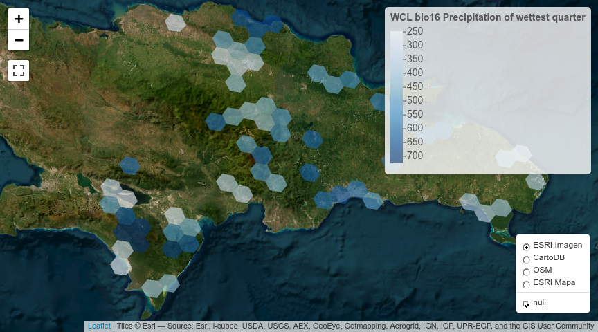

Práctica 99. Resultados de tu manuscrito. Formicidae, análisis de
agrupamiento.
================
José Ramón Martínez Batlle
26-11-2022

NOTA. Este cuaderno es una aplicación a datos de Formicidae en GBIF, a
partir de una simple adaptación del cuaderno general
[practica-99-tu-manuscrito-3-resultados.md (basado en un análisis
demostrativo de la familia
Polygonaceae)](../practica-99-tu-manuscrito-3-resultados.md). Si
comparas este archivo con el original, notarás que, básicamente, edité
el nombre del archivo fuente de la matriz de comunidad (para adaptarlo a
este grupo) y otros detalles menores. Por lo tanto, aunque el código y
los gráficos sí se refieren a Formicidae, probablemente el texto no.

# ¿Qué contiene la sección “Resultados”?

Te recomiendo releer las normas para autores/as del [Anuario de
Investigaciones Científicas de la
UASD](../docs/instrucciones-para-autores-anuario-investigaciones-cientificas-UASD.pdf)
y adherirte a las especificaciones sobre la sección “Resultados” que
allí se indican. Aunque en las referidas normas no se incluyen muchas
pautas significativas, si escribieras para una revista específica,
deberás considerar sus normas y recomendaciones de publicación. Además,
te recomiendo que consultes la sección “Resultados” de algunos
manuscritos publicados en el Anuario.

En los resultados expones el contenido analítico central. Es “el qué”
del manuscrito, en complemento de “el cómo” (metodología) y “el por qué”
(introducción) de tu investigación. En los resultados muestras lo que
encontraste luego de que colectaste (aunque en este caso, no fuiste al
terreno) y analizaste, con tus métodos, los datos fuente.

Algunas recomendaciones generales:

- “Resultados” se supone que es la sección más corta del manuscrito,
  siempre que se usen apropiadamente los recursos gráficos, las tablas y
  la información suplementaria.

- Comienza por realizar tus análisis. Necesitarás una matriz de
  comunidad y una ambiental. La de comunidad la habrás generado en la
  práctica 2; la ambiental explico cómo generarla en este mismo cuaderno
  (ver abajo). En general, la matriz ambiental la producirás mediante
  estadísticos zonales del territorio dominicano. Para aprender más
  sobre la fuente de estadística zonal de República Dominicana, que
  contiene un conjunto de más de 100 variables resumidas por celdas H3,
  visita [este repo](https://github.com/geofis/zonal-statistics). Debes
  visitar dicho repo para poder citarlo apropiadamente.

- Cuando tengas análisis realizados, antes de comenzar a escribir, te
  recomiendo que escribas un guión de tu sección “Resultados”.

- Guión en mano, redacta tu sección “Resultados”, siguiendo también
  estos consejos:

- En esta sección, se espera que presentes lo que has obtenido de manera
  “objetiva”, evitando explicaciones, comentarios, opiniones,
  perspectivas o limitaciones. En teoría, tu redacción es “fría”, lo
  cual no necesariamente significa que tenga que ser aburrida.

- Esta es la sección por excelencia donde usarás *tablas y/o gráficos*.
  Lo más importante a tener en cuenta cuando los uses es que no debes
  duplicar el contenido que muestran dichos recursos en el texto. La
  tabla o gráfico son apoyos que te ayudarán a no entrar en densidades
  innecesarias dentro de los párrafos. Por lo tanto, si colocas una
  tabla o figura, no caigas en la tentación de describirla en párrafos
  de forma exhausitva. Estos recursos deben servir para apoyar el o los
  párrafos donde destacas los principales patrones encontrados.

- *Importante también*: si insertas una tabla o gráfico, debes referirla
  en el texto (e.g. “ver figura X”). De nada sirve incluir una figura o
  una tabla si no la refieres, porque con ello estarás sugiriendo que
  dicho recurso era completamente prescindible.

- El tiempo verbal preferido (por defecto) es el pasado, por ejemplo “…,
  donde se **encontró** una asociación significativa entre … y …”. Sin
  embargo, hay excepciones, como por ejemplo, cuando te refieres a una
  tabla o una figura. Un caso típico es la expresión “tal como se
  muestra en la tabla 1”, donde el verbo está conjugado en presente.

A continuación, te pongo enlaces a referencias que considero útiles,
sobre cómo redactar los resultados (algunas son generales, sobre
artículos en general):

- [Breves pautas, en
  inglés](https://www.editage.com/insights/the-secret-to-writing-the-results-and-discussion-section-of-a-manuscript).
  Puedes usar el traductor [DeepL](https://www.deepl.com/translator),
  porque produce frases más naturales.

Cinco guías, en inglés, que considero están bien elaboradas, sobre cómo
redactar un artículo científico (consulta la sección sobre cómo redactar
los *resultados* en cada una):

- [Demystifying the Journal
  Article](https://www.insidehighered.com/advice/2017/05/09/how-write-effective-journal-article-and-get-it-published-essay)

- [How to write a scientific manuscript for
  publication](https://www.ncbi.nlm.nih.gov/pmc/articles/PMC3626472/)

- [11 steps to structuring a science paper editors will take
  seriously](https://www.elsevier.com/connect/11-steps-to-structuring-a-science-paper-editors-will-take-seriously)

- [Cómo escribir un artículo científico por primera
  vez](https://www.sciencedirect.com/science/article/abs/pii/S1134593417300040)
  (necesitarás usar [SciHub](https://sci-hub.se/) para descargarlo)

- Una muy breve pero con consejos útiles: [Tips for writing the perfect
  IMRAD
  manuscript](https://www.editage.com/insights/tips-for-writing-the-perfect-imrad-manuscript)

# Scripts de ejemplo

Una nota, a título informativo. Cada una se las siguientes secciones
(e.g. “Análisis de agrupamiento”, “Ordenación restringida”), es
reproducible de forma autónoma, es decir, sin dependencia de líneas de
código anteriores. Esto siginifica que las dependencias de una sección
se resuelven dentro de ella misma, sin dependencia de líneas anteriores.

Por esta razón, varias secciones comparten texto y código común, pero
sólo al inicio, porque al avanzar cada una se hace propia. Notarás, por
lo tanto, que el texto “se repite a sí mismo” por esta razón; la otra
opción que tenía era alojar el código común en un único archivo, pero
entonces esto te obligaba a navegar por archivos separados, haciendo
menos didáctico este cuaderno.

## Análisis de agrupamiento

Me basaré en los scripts que comienzan por `aa_` de este
[repo](https://github.com/biogeografia-master/scripts-de-analisis-BCI),
los cuales explico en los vídeos de “Análisis de agrupamiento” (del 13
al 16) de la lista de reproducción [“Ecología Numérica con R” de mi
canal](https://www.youtube.com/playlist?list=PLDcT2n8UzsCRDqjqSeqHI1wsiNOqpYmsJ).

> INICIA texto+código común entre secciones

Fijar un directorio de trabajo no es recomendable, mejor trabaja por
proyecto. En cualquier caso, si no quieres o no puedes crear un
proyecto, usa la sentencia que verás abajo, cambiando `TU_DIRECTORIO`
por la ruta del directorio donde tengas almacenados tus datos y tus
scripts.

``` r
if(interactive()) {
  tryCatch(
    setwd(dirname(rstudioapi::getSourceEditorContext()$path)),
    error = function(e) {
      cat('Probablemente ya el directorio de trabajo está fijado correctamente',
          'o quizá el directorio no existe. Este fue el error devuelto:\n')
      e
    })
}
```

Cargar paquetes.

``` r
library(vegan)
library(sf)
library(tidyverse)
library(tmap)
library(kableExtra)
library(foreach)
library(leaps)
library(caret)
gh_content <- 'https://raw.githubusercontent.com/'
gh_zonal_stats <- paste0(gh_content,
                         'geofis/zonal-statistics/0b2e95aaee87bf326cf132d28f4bd15220bb4ec7/out/')
repo_analisis <- 'biogeografia-master/scripts-de-analisis-BCI/master'
repo_sem202202 <- 'biogeografia-202202/material-de-apoyo/master/practicas/'
devtools::source_url(paste0(gh_content, repo_analisis, '/biodata/funciones.R'))
devtools::source_url(paste0(gh_content, repo_sem202202, 'train.R'))
devtools::source_url(paste0(gh_content, repo_sem202202, 'funciones.R'))
```

Carga tu matriz de comunidad, que habrás generado en la práctica 2, y
elige un umbral para especies raras o rangos de registros de presencia
para seleccionar especies en una nueva matriz de comunidad.

``` r
res <- 5 #Resolución H3, puedes elegir entre 4, 5, 6 o 7, pero cuidado con valores >=6
# IMPORTANTE: la resolución de las celdas H3, debe coincidir con la resolución
# a la cual generaste tu matriz de comunidad. De lo contrario, obtendrás error. Si tu 
# archivo RDS de matriz de comunidad se denomina "matriz_de_comunidad.RDS", y lo creaste
# usando resolución 4, cámbiale el nombre a "matriz_de_comunidad_res_5.RDS". Recuerda,
# puedes usar cualquier resolución, lo único importante es que las resolución usada en la
# creación de la matriz de comunidad, debe ser la misma que en la ambiental.
# Prueba distintas resoluciones, no te enfrasques en quedarte con la misma que
# uso en este ejemplo. Prueba con resolución 5, por ejemplo.
mc_orig <- readRDS('matriz_de_comunidad_formicidae.RDS')
nrow(mc_orig) #Número de filas, equivale a número de hexágonos con registros de presencia
```

    ## [1] 128

``` r
ncol(mc_orig)  #Número de columnas, equivale a número de especies, riqueza
```

    ## [1] 268

``` r
data.frame(Especies = names(mc_orig)) %>% 
  kable(booktabs=T) %>%
  kable_styling(latex_options = c("HOLD_position", "scale_down")) %>%
  gsub(' NA ', '', .) #Lista de especies
```

<table class="table" style="margin-left: auto; margin-right: auto;">
<thead>
<tr>
<th style="text-align:left;">
Especies
</th>
</tr>
</thead>
<tbody>
<tr>
<td style="text-align:left;">
Tapinoma melanocephalum (Fabricius, 1793)
</td>
</tr>
<tr>
<td style="text-align:left;">
Paratrechina longicornis (Latreille, 1802)
</td>
</tr>
<tr>
<td style="text-align:left;">
Leptogenys pubiceps Emery, 1890
</td>
</tr>
<tr>
<td style="text-align:left;">
Dorymyrmex Mayr, 1866
</td>
</tr>
<tr>
<td style="text-align:left;">
Cephalotes unimaculatus (Smith, 1853)
</td>
</tr>
<tr>
<td style="text-align:left;">
Solenopsis geminata (Fabricius, 1804)
</td>
</tr>
<tr>
<td style="text-align:left;">
Camponotus christophei Wheeler & Mann, 1914
</td>
</tr>
<tr>
<td style="text-align:left;">
Camponotus sexguttatus (Fabricius, 1793)
</td>
</tr>
<tr>
<td style="text-align:left;">
Pheidole jelskii Mayr, 1884
</td>
</tr>
<tr>
<td style="text-align:left;">
Pseudomyrmex simplex (Smith, 1877)
</td>
</tr>
<tr>
<td style="text-align:left;">
Trachymyrmex jamaicensis (Andre, 1893)
</td>
</tr>
<tr>
<td style="text-align:left;">
Odontomachus bauri Emery, 1892
</td>
</tr>
<tr>
<td style="text-align:left;">
Monomorium destructor (Jerdon, 1851)
</td>
</tr>
<tr>
<td style="text-align:left;">
Crematogaster russoi Menozzi, 1930
</td>
</tr>
<tr>
<td style="text-align:left;">
Odontomachus ruginodis Smith, 1937
</td>
</tr>
<tr>
<td style="text-align:left;">
Crematogaster steinheili Forel, 1881
</td>
</tr>
<tr>
<td style="text-align:left;">
Wasmannia auropunctata (Roger, 1863)
</td>
</tr>
<tr>
<td style="text-align:left;">
Cephalotes decoloratus De Andrade, 1999
</td>
</tr>
<tr>
<td style="text-align:left;">
Mycetomoellerius Solomon, Rabeling, Sosa-Calvo & Schultz, 2019
</td>
</tr>
<tr>
<td style="text-align:left;">
Temnothorax Mayr, 1861
</td>
</tr>
<tr>
<td style="text-align:left;">
Camponotus conspicuus (Smith, 1858)
</td>
</tr>
<tr>
<td style="text-align:left;">
Pseudomyrmex haytianus (Forel, 1901)
</td>
</tr>
<tr>
<td style="text-align:left;">
BOLD:AAF4715
</td>
</tr>
<tr>
<td style="text-align:left;">
Solenopsis invicta Buren, 1972
</td>
</tr>
<tr>
<td style="text-align:left;">
Myrmelachista ramulorum Wheeler, 1908
</td>
</tr>
<tr>
<td style="text-align:left;">
Cephalotes auricomus
</td>
</tr>
<tr>
<td style="text-align:left;">
Platythyrea punctata (Smith, 1858)
</td>
</tr>
<tr>
<td style="text-align:left;">
Monomorium ebeninum Forel, 1891
</td>
</tr>
<tr>
<td style="text-align:left;">
Cyphomyrmex rimosus (Spinola, 1851)
</td>
</tr>
<tr>
<td style="text-align:left;">
Camponotus claviscapus occultus Wheeler & Mann, 1914
</td>
</tr>
<tr>
<td style="text-align:left;">
Monomorium floricola (Jerdon, 1851)
</td>
</tr>
<tr>
<td style="text-align:left;">
Pheidole susannae Forel, 1886
</td>
</tr>
<tr>
<td style="text-align:left;">
Pyramica eggersi (Emery, 1890)
</td>
</tr>
<tr>
<td style="text-align:left;">
Strumigenys lanuginosa Wheeler, 1905
</td>
</tr>
<tr>
<td style="text-align:left;">
Strumigenys silvestrii Emery, 1906
</td>
</tr>
<tr>
<td style="text-align:left;">
Solenopsis pollux Forel, 1893
</td>
</tr>
<tr>
<td style="text-align:left;">
Anochetus mayri Emery, 1884
</td>
</tr>
<tr>
<td style="text-align:left;">
Hypoponera opacior (Forel, 1893)
</td>
</tr>
<tr>
<td style="text-align:left;">
Mycocepurus smithii (Forel, 1893)
</td>
</tr>
<tr>
<td style="text-align:left;">
Pheidole moerens Wheeler, 1908
</td>
</tr>
<tr>
<td style="text-align:left;">
Pheidole subarmata Mayr, 1884
</td>
</tr>
<tr>
<td style="text-align:left;">
Brachymyrmex heeri Forel, 1874
</td>
</tr>
<tr>
<td style="text-align:left;">
Rogeria curvipubens Emery, 1894
</td>
</tr>
<tr>
<td style="text-align:left;">
Pyramica emmae (Emery, 1890)
</td>
</tr>
<tr>
<td style="text-align:left;">
Nylanderia guatemalensis (Forel, 1885)
</td>
</tr>
<tr>
<td style="text-align:left;">
Rogeria alzatei Kugler, 1994
</td>
</tr>
<tr>
<td style="text-align:left;">
Strumigenys rogeri Emery, 1890
</td>
</tr>
<tr>
<td style="text-align:left;">
Monomorium subcoecum Emery, 1894
</td>
</tr>
<tr>
<td style="text-align:left;">
Strumigenys Smith, 1860
</td>
</tr>
<tr>
<td style="text-align:left;">
Solenopsis Westwood, 1840
</td>
</tr>
<tr>
<td style="text-align:left;">
Strumigenys gundlachi
</td>
</tr>
<tr>
<td style="text-align:left;">
Pheidole harlequina
</td>
</tr>
<tr>
<td style="text-align:left;">
Nylanderia steinheili (Forel, 1893)
</td>
</tr>
<tr>
<td style="text-align:left;">
Camponotus ustus Forel, 1879
</td>
</tr>
<tr>
<td style="text-align:left;">
Tetramorium Mayr, 1855
</td>
</tr>
<tr>
<td style="text-align:left;">
Pogonomyrmex saucius Wheeler & Mann, 1914
</td>
</tr>
<tr>
<td style="text-align:left;">
Camponotus Mayr, 1861
</td>
</tr>
<tr>
<td style="text-align:left;">
Nylanderia deyrupi Messer, Cover & Rabeling, 2020
</td>
</tr>
<tr>
<td style="text-align:left;">
Pseudomyrmex cubaensis (Forel, 1901)
</td>
</tr>
<tr>
<td style="text-align:left;">
Cylindromyrmex Mayr, 1870
</td>
</tr>
<tr>
<td style="text-align:left;">
Cyphomyrmex Mayr, 1862
</td>
</tr>
<tr>
<td style="text-align:left;">
Rogeria Emery, 1923
</td>
</tr>
<tr>
<td style="text-align:left;">
Pseudomyrmex subater (Wheeler, 1914)
</td>
</tr>
<tr>
<td style="text-align:left;">
Hypoponera Santschi, 1938
</td>
</tr>
<tr>
<td style="text-align:left;">
Pheidole drepanon
</td>
</tr>
<tr>
<td style="text-align:left;">
Cardiocondyla minutior Forel, 1899
</td>
</tr>
<tr>
<td style="text-align:left;">
Brachymyrmex Mayr, 1868
</td>
</tr>
<tr>
<td style="text-align:left;">
Cyphomyrmex minutus Mayr, 1862
</td>
</tr>
<tr>
<td style="text-align:left;">
Myrmicinae Lepeletier de Saint-Fargeau, 1835
</td>
</tr>
<tr>
<td style="text-align:left;">
Thaumatomyrmex Mayr, 1887
</td>
</tr>
<tr>
<td style="text-align:left;">
Bothriomyrmex enigmaticus Prebus & Lubertazzi, 2016
</td>
</tr>
<tr>
<td style="text-align:left;">
Tapinoma litorale Wheeler, 1905
</td>
</tr>
<tr>
<td style="text-align:left;">
Acropyga parvidens (Wheeler & Mann, 1914)
</td>
</tr>
<tr>
<td style="text-align:left;">
Camponotus claviscapus Forel, 1899
</td>
</tr>
<tr>
<td style="text-align:left;">
Camponotus saussurei Theobald, 1937
</td>
</tr>
<tr>
<td style="text-align:left;">
Cardiocondyla venustula Wheeler, 1908
</td>
</tr>
<tr>
<td style="text-align:left;">
Cardiocondyla emeryi Forel, 1881
</td>
</tr>
<tr>
<td style="text-align:left;">
Pheidole flavens Roger, 1863
</td>
</tr>
<tr>
<td style="text-align:left;">
Gnamptogenys lineolata Brown, 1993
</td>
</tr>
<tr>
<td style="text-align:left;">
Linepithema keiteli (Forel, 1907)
</td>
</tr>
<tr>
<td style="text-align:left;">
Pachycondyla succedanea (Roger, 1863)
</td>
</tr>
<tr>
<td style="text-align:left;">
Pheidole jamaicensis
</td>
</tr>
<tr>
<td style="text-align:left;">
Pachycondyla stigma (Fabricius, 1804)
</td>
</tr>
<tr>
<td style="text-align:left;">
Tapinoma opacum Wheeler & Mann, 1914
</td>
</tr>
<tr>
<td style="text-align:left;">
Cylindromyrmex darlingtoni Wheeler, 1937
</td>
</tr>
<tr>
<td style="text-align:left;">
Odontomachus Latreille, 1804
</td>
</tr>
<tr>
<td style="text-align:left;">
Pheidole Westwood, 1839
</td>
</tr>
<tr>
<td style="text-align:left;">
Pheidole megacephala (Fabricius, 1793)
</td>
</tr>
<tr>
<td style="text-align:left;">
Myrmelachista gagates Wheeler, 1936
</td>
</tr>
<tr>
<td style="text-align:left;">
Proceratium Roger, 1863
</td>
</tr>
<tr>
<td style="text-align:left;">
Pheidole hispaniolae
</td>
</tr>
<tr>
<td style="text-align:left;">
Nylanderia Emery, 1906
</td>
</tr>
<tr>
<td style="text-align:left;">
Pogonomyrmex aterrimus Wheeler, 1936
</td>
</tr>
<tr>
<td style="text-align:left;">
Strumigenys zemi Booher, Prebus & Lubertazzi, 2019
</td>
</tr>
<tr>
<td style="text-align:left;">
Gnamptogenys Roger, 1863
</td>
</tr>
<tr>
<td style="text-align:left;">
Monomorium Mayr, 1855
</td>
</tr>
<tr>
<td style="text-align:left;">
Eurhopalothrix floridana Brown & Kempf, 1960
</td>
</tr>
<tr>
<td style="text-align:left;">
Gnamptogenys haytiana (Wheeler & Mann, 1914)
</td>
</tr>
<tr>
<td style="text-align:left;">
Nylanderia pini Kallal, 2019
</td>
</tr>
<tr>
<td style="text-align:left;">
Nylanderia disatra Kallal, 2019
</td>
</tr>
<tr>
<td style="text-align:left;">
Gnamptogenys striatula Mayr, 1884
</td>
</tr>
<tr>
<td style="text-align:left;">
Syscia Roger, 1861
</td>
</tr>
<tr>
<td style="text-align:left;">
Pheidole terresi Wheeler & Mann, 1914
</td>
</tr>
<tr>
<td style="text-align:left;">
Pogonomyrmex schmitti Forel, 1901
</td>
</tr>
<tr>
<td style="text-align:left;">
Camponotus augustei Wheeler & Mann, 1914
</td>
</tr>
<tr>
<td style="text-align:left;">
Leptothorax ciferrii (Menozzi & Russo, 1930)
</td>
</tr>
<tr>
<td style="text-align:left;">
Temnothorax bahoruco Prebus, 2021
</td>
</tr>
<tr>
<td style="text-align:left;">
Nylanderia metacista Kallal, 2019
</td>
</tr>
<tr>
<td style="text-align:left;">
Fulakora Mann, 1919
</td>
</tr>
<tr>
<td style="text-align:left;">
Strumigenys nigrescens
</td>
</tr>
<tr>
<td style="text-align:left;">
Pseudomyrmex Lund, 1831
</td>
</tr>
<tr>
<td style="text-align:left;">
Rogeria brunnea Santschi, 1930
</td>
</tr>
<tr>
<td style="text-align:left;">
Solenopsis terricola Menozzi, 1931
</td>
</tr>
<tr>
<td style="text-align:left;">
Solenopsis globularia (Smith, 1858)
</td>
</tr>
<tr>
<td style="text-align:left;">
Tetramorium caldarium (Roger, 1857)
</td>
</tr>
<tr>
<td style="text-align:left;">
Monomorium pharaonis (Linnaeus, 1758)
</td>
</tr>
<tr>
<td style="text-align:left;">
Temnothorax laticrus Prebus, 2021
</td>
</tr>
<tr>
<td style="text-align:left;">
Nylanderia caerula Kallal, 2019
</td>
</tr>
<tr>
<td style="text-align:left;">
Temnothorax balaclava Prebus, 2021
</td>
</tr>
<tr>
<td style="text-align:left;">
Camponotus albistramineus Wheeler, 1936
</td>
</tr>
<tr>
<td style="text-align:left;">
Temnothorax agavicola Prebus, 2021
</td>
</tr>
<tr>
<td style="text-align:left;">
Nylanderia bibadia Kallal, 2019
</td>
</tr>
<tr>
<td style="text-align:left;">
Nylanderia fuscaspecula Kallal, 2019
</td>
</tr>
<tr>
<td style="text-align:left;">
Paratrechina Motschoulsky, 1863
</td>
</tr>
<tr>
<td style="text-align:left;">
Pyramica membranifera (Emery, 1869)
</td>
</tr>
<tr>
<td style="text-align:left;">
Tetramorium simillimum (Smith, 1851)
</td>
</tr>
<tr>
<td style="text-align:left;">
BOLD:AAJ5973
</td>
</tr>
<tr>
<td style="text-align:left;">
Temnothorax harlequina Prebus, 2021
</td>
</tr>
<tr>
<td style="text-align:left;">
Tapinoma Förster, 1850
</td>
</tr>
<tr>
<td style="text-align:left;">
Mycocepurus Forel, 1893
</td>
</tr>
<tr>
<td style="text-align:left;">
Tapinoma rasenum Smith & Lavigne, 1973
</td>
</tr>
<tr>
<td style="text-align:left;">
Discothyrea testacea Roger, 1863
</td>
</tr>
<tr>
<td style="text-align:left;">
Cephalotes hamulus (Roger, 1863)
</td>
</tr>
<tr>
<td style="text-align:left;">
Hypoponera punctatissima (Roger, 1859)
</td>
</tr>
<tr>
<td style="text-align:left;">
Odontomachus insularis Guerin-Meneville, 1844
</td>
</tr>
<tr>
<td style="text-align:left;">
Monomorium bicolor Emery, 1877
</td>
</tr>
<tr>
<td style="text-align:left;">
Linepithema Mayr, 1866
</td>
</tr>
<tr>
<td style="text-align:left;">
Cephalotes Latreille, 1802
</td>
</tr>
<tr>
<td style="text-align:left;">
Pheidole teneriffana Forel, 1893
</td>
</tr>
<tr>
<td style="text-align:left;">
Temnothorax wilsoni Prebus, 2021
</td>
</tr>
<tr>
<td style="text-align:left;">
Tetramorium bicarinatum (Nylander, 1846)
</td>
</tr>
<tr>
<td style="text-align:left;">
Hypoponera opaciceps (Mayr, 1887)
</td>
</tr>
<tr>
<td style="text-align:left;">
Linepithema humile (Mayr, 1868)
</td>
</tr>
<tr>
<td style="text-align:left;">
Linepithema dispertitum (Forel, 1885)
</td>
</tr>
<tr>
<td style="text-align:left;">
Platythyrea strenua Wheeler & Mann, 1914
</td>
</tr>
<tr>
<td style="text-align:left;">
Camponotus saussurei Forel, 1879
</td>
</tr>
<tr>
<td style="text-align:left;">
Camponotus fumidus soulouquei Forel, 1901
</td>
</tr>
<tr>
<td style="text-align:left;">
Formicidae
</td>
</tr>
<tr>
<td style="text-align:left;">
Myrmelachista Roger, 1863
</td>
</tr>
<tr>
<td style="text-align:left;">
Pachycondyla Smith, 1858
</td>
</tr>
<tr>
<td style="text-align:left;">
Camponotus indet
</td>
</tr>
<tr>
<td style="text-align:left;">
Pheidole noar
</td>
</tr>
<tr>
<td style="text-align:left;">
Rogeria leptonana
</td>
</tr>
<tr>
<td style="text-align:left;">
Dorymyrmex pyramicus (Roger, 1863)
</td>
</tr>
<tr>
<td style="text-align:left;">
Brachymyrmex obscurior Forel, 1893
</td>
</tr>
<tr>
<td style="text-align:left;">
Leptogenys antillana Wheeler, 1914
</td>
</tr>
<tr>
<td style="text-align:left;">
Camponotus lucayanus Wheeler, 1905
</td>
</tr>
<tr>
<td style="text-align:left;">
Holcoponera Mayr, 1887
</td>
</tr>
<tr>
<td style="text-align:left;">
Brachymyrmex australis Forel, 1901
</td>
</tr>
<tr>
<td style="text-align:left;">
Acropyga fuhrmanni (Forel, 1914)
</td>
</tr>
<tr>
<td style="text-align:left;">
Pseudomyrmex pallidus (Smith, 1855)
</td>
</tr>
<tr>
<td style="text-align:left;">
Leptothorax Mayr, 1855
</td>
</tr>
<tr>
<td style="text-align:left;">
Wasmannia Forel, 1893
</td>
</tr>
<tr>
<td style="text-align:left;">
Platythyrea Roger, 1863
</td>
</tr>
<tr>
<td style="text-align:left;">
Prenolepis Mayr, 1861
</td>
</tr>
<tr>
<td style="text-align:left;">
Iridomyrmex Mayr, 1862
</td>
</tr>
<tr>
<td style="text-align:left;">
Poneracantha Emery, 1897
</td>
</tr>
<tr>
<td style="text-align:left;">
Gnamptogenys semiferox Brown, 1958
</td>
</tr>
<tr>
<td style="text-align:left;">
Cephalotes argentiventris De Andrade, 1999
</td>
</tr>
<tr>
<td style="text-align:left;">
Cephalotes flavigaster De Andrade, 1999
</td>
</tr>
<tr>
<td style="text-align:left;">
Paratrechina pubens (Forel, 1893)
</td>
</tr>
<tr>
<td style="text-align:left;">
Hypocryptocerus Wheeler, 1920
</td>
</tr>
<tr>
<td style="text-align:left;">
Rhizomyrma Forel, 1893
</td>
</tr>
<tr>
<td style="text-align:left;">
Acropyga dubitata (Wheeler & Mann, 1914)
</td>
</tr>
<tr>
<td style="text-align:left;">
Ilemomyrmex caecus Wilson, 1985
</td>
</tr>
<tr>
<td style="text-align:left;">
Crematogaster Lund, 1831
</td>
</tr>
<tr>
<td style="text-align:left;">
Linepithema hispaniolae (Wilson, 1985)
</td>
</tr>
<tr>
<td style="text-align:left;">
Oxyidris antillana Wilson, 1985
</td>
</tr>
<tr>
<td style="text-align:left;">
Cephalotes serratus (Vierbergen & Scheven, 1995)
</td>
</tr>
<tr>
<td style="text-align:left;">
Azteca alpha Wilson, 1985
</td>
</tr>
<tr>
<td style="text-align:left;">
Cephalotes obscurus (Vierbergen & Scheven, 1995)
</td>
</tr>
<tr>
<td style="text-align:left;">
Cephalotes squamosus (Vierbergen & Scheven, 1995)
</td>
</tr>
<tr>
<td style="text-align:left;">
Dolichoderus caribbaeus (Wilson, 1985)
</td>
</tr>
<tr>
<td style="text-align:left;">
Dolichoderus prolaminatus (Wilson, 1985)
</td>
</tr>
<tr>
<td style="text-align:left;">
Anochetus brevidentatus MacKay, 1991
</td>
</tr>
<tr>
<td style="text-align:left;">
Linepithema humiloides (Wilson, 1985)
</td>
</tr>
<tr>
<td style="text-align:left;">
Cephalotes jansei (Vierbergen & Scheven, 1995)
</td>
</tr>
<tr>
<td style="text-align:left;">
Pseudomyrmex macrops Ward, 1992
</td>
</tr>
<tr>
<td style="text-align:left;">
Pseudomyrmex thecolor Ward, 1992
</td>
</tr>
<tr>
<td style="text-align:left;">
Pseudomyrmex prioris Ward, 1992
</td>
</tr>
<tr>
<td style="text-align:left;">
Pseudomyrmex avitus Ward, 1992
</td>
</tr>
<tr>
<td style="text-align:left;">
Pseudomyrmex succinus Ward, 1992
</td>
</tr>
<tr>
<td style="text-align:left;">
Pseudomyrmex nexilis Ward, 1992
</td>
</tr>
<tr>
<td style="text-align:left;">
Pseudomyrmex baros Ward, 1992
</td>
</tr>
<tr>
<td style="text-align:left;">
Pseudomyrmex oryctus Ward, 1992
</td>
</tr>
<tr>
<td style="text-align:left;">
Pseudomyrmex coruscus Ward, 1992
</td>
</tr>
<tr>
<td style="text-align:left;">
Odontomachus pseudobauri De Andrade, 1994
</td>
</tr>
<tr>
<td style="text-align:left;">
Anochetus intermedius De Andrade, 1994
</td>
</tr>
<tr>
<td style="text-align:left;">
Proceratium dominicanum de Andrade, 2003
</td>
</tr>
<tr>
<td style="text-align:left;">
Proceratium poinari Baroni Urbani & de Andrade, 2003
</td>
</tr>
<tr>
<td style="text-align:left;">
Proceratium gibberum de Andrade, 2003
</td>
</tr>
<tr>
<td style="text-align:left;">
Paraponera dieteri Baroni Urbani, 1994
</td>
</tr>
<tr>
<td style="text-align:left;">
Platythyrea scalprum Lattke, 2003
</td>
</tr>
<tr>
<td style="text-align:left;">
Platythyrea procera Lattke, 2003
</td>
</tr>
<tr>
<td style="text-align:left;">
Acropyga glaesaria LaPolla, 2005
</td>
</tr>
<tr>
<td style="text-align:left;">
Platythyrea dentata Lattke, 2003
</td>
</tr>
<tr>
<td style="text-align:left;">
Cephalotes alveolatus (Vierbergen & Scheven, 1995)
</td>
</tr>
<tr>
<td style="text-align:left;">
Acropyga Roger, 1862
</td>
</tr>
<tr>
<td style="text-align:left;">
Cephalotes integerrimus (Vierbergen & Scheven, 1995)
</td>
</tr>
<tr>
<td style="text-align:left;">
Apterostigma electropilosum Schultz, 2007
</td>
</tr>
<tr>
<td style="text-align:left;">
Apterostigma eowilsoni Schultz, 2007
</td>
</tr>
<tr>
<td style="text-align:left;">
Anochetus dubius De Andrade, 1994
</td>
</tr>
<tr>
<td style="text-align:left;">
Pyramica schleeorum (Baroni Urbani, 1994)
</td>
</tr>
<tr>
<td style="text-align:left;">
Pyramica electrina (De Andrade, 1994)
</td>
</tr>
<tr>
<td style="text-align:left;">
Anochetus lucidus De Andrade, 1994
</td>
</tr>
<tr>
<td style="text-align:left;">
Odontomachus spinifer De Andrade, 1994
</td>
</tr>
<tr>
<td style="text-align:left;">
Anochetus ambiguus De Andrade, 1994
</td>
</tr>
<tr>
<td style="text-align:left;">
Acanthognathus poinari Baroni Urbani, 1994
</td>
</tr>
<tr>
<td style="text-align:left;">
Acanthostichus hispaniolicus de Andrade, 1998
</td>
</tr>
<tr>
<td style="text-align:left;">
Anochetus exstinctus De Andrade, 1994
</td>
</tr>
<tr>
<td style="text-align:left;">
Anochetus corayi Baroni Urbani, 1980
</td>
</tr>
<tr>
<td style="text-align:left;">
Anochetus conisquamis De Andrade, 1994
</td>
</tr>
<tr>
<td style="text-align:left;">
Aphaenogaster amphioceanica de Andrade, 1995
</td>
</tr>
<tr>
<td style="text-align:left;">
Dolichoderus dibolius Wilson, 1985
</td>
</tr>
<tr>
<td style="text-align:left;">
Technomyrmex caritatis Brandão & Baroni Urbani, 1999
</td>
</tr>
<tr>
<td style="text-align:left;">
Dolichoderus primitivus (Wilson, 1985)
</td>
</tr>
<tr>
<td style="text-align:left;">
Azteca eumeces Wilson, 1985
</td>
</tr>
<tr>
<td style="text-align:left;">
Leptomyrmex neotropicus Baroni Urbani, 1980
</td>
</tr>
<tr>
<td style="text-align:left;">
Tapinoma troche Wilson, 1985
</td>
</tr>
<tr>
<td style="text-align:left;">
Cyphomyrmex taino de Andrade, 2003
</td>
</tr>
<tr>
<td style="text-align:left;">
Cylindromyrmex antillanus de Andrade, 1998
</td>
</tr>
<tr>
<td style="text-align:left;">
Discothyrea gigas de Andrade, 1998
</td>
</tr>
<tr>
<td style="text-align:left;">
Cylindromyrmex inopinatus de Andrade, 2001
</td>
</tr>
<tr>
<td style="text-align:left;">
Cylindromyrmex electrinus de Andrade, 1998
</td>
</tr>
<tr>
<td style="text-align:left;">
Cephalotes brevispineus De Andrade, 1999
</td>
</tr>
<tr>
<td style="text-align:left;">
Cephalotes sucinus De Andrade, 1999
</td>
</tr>
<tr>
<td style="text-align:left;">
Cephalotes caribicus de Andrade, 1999
</td>
</tr>
<tr>
<td style="text-align:left;">
Cephalotes taino De Andrade, 1999
</td>
</tr>
<tr>
<td style="text-align:left;">
Cephalotes bloosi Baroni Urbani, 1999
</td>
</tr>
<tr>
<td style="text-align:left;">
Cephalotes hispaniolicus De Andrade, 1999
</td>
</tr>
<tr>
<td style="text-align:left;">
Cephalotes resinae De Andrade, 1999
</td>
</tr>
<tr>
<td style="text-align:left;">
Cephalotes dieteri Baroni Urbani, 1999
</td>
</tr>
<tr>
<td style="text-align:left;">
Gnamptogenys levinates Baroni Urbani, 1980
</td>
</tr>
<tr>
<td style="text-align:left;">
Gnamptogenys casca Lattke, 2002
</td>
</tr>
<tr>
<td style="text-align:left;">
Gnamptogenys brunoi (Lattke, 2002)
</td>
</tr>
<tr>
<td style="text-align:left;">
Pheidole tethepa Wilson, 1985
</td>
</tr>
<tr>
<td style="text-align:left;">
Gnamptogenys pristina Baroni Urbani, 1980
</td>
</tr>
<tr>
<td style="text-align:left;">
Pheidole primigenia Baroni Urbani, 1995
</td>
</tr>
<tr>
<td style="text-align:left;">
Leptothorax dominicanus (de Andrade, 1999)
</td>
</tr>
<tr>
<td style="text-align:left;">
Platythyrea pumilio de Andrade, 2004
</td>
</tr>
<tr>
<td style="text-align:left;">
Leptothorax caritatis (de Andrade, 1999)
</td>
</tr>
<tr>
<td style="text-align:left;">
Proceratium denticulatum Lattke, 1991
</td>
</tr>
<tr>
<td style="text-align:left;">
Zatania electra LaPolla, Kallal & Brady, 2012
</td>
</tr>
<tr>
<td style="text-align:left;">
Neivamyrmex ectopus Wilson, 1985
</td>
</tr>
<tr>
<td style="text-align:left;">
Nylanderia vetula LaPolla & Dlussky, 2010
</td>
</tr>
<tr>
<td style="text-align:left;">
Pseudomyrmex antiquus Ward, 1992
</td>
</tr>
<tr>
<td style="text-align:left;">
Pseudomyrmex vicinus Ward, 1992
</td>
</tr>
<tr>
<td style="text-align:left;">
Trachymyrmex primaevus Baroni Urbani, 1980
</td>
</tr>
<tr>
<td style="text-align:left;">
Leptothorax praecreolus De Andrade, 1992
</td>
</tr>
<tr>
<td style="text-align:left;">
Strumigenys poinari Baroni Urbani & de Andrade, 2007
</td>
</tr>
<tr>
<td style="text-align:left;">
Strumigenys pilosula de Andrade, 2007
</td>
</tr>
<tr>
<td style="text-align:left;">
Paraponera Smith, 1858
</td>
</tr>
<tr>
<td style="text-align:left;">
BOLD:AAF5326
</td>
</tr>
<tr>
<td style="text-align:left;">
BOLD:AAE6208
</td>
</tr>
<tr>
<td style="text-align:left;">
BOLD:AAF5327
</td>
</tr>
<tr>
<td style="text-align:left;">
Nylanderia esperanza Kallal, 2019
</td>
</tr>
<tr>
<td style="text-align:left;">
Aphaenogaster Mayr, 1853
</td>
</tr>
<tr>
<td style="text-align:left;">
Nesomyrmex Wheeler, 1910
</td>
</tr>
</tbody>
</table>

``` r
unique(word(names(mc_orig), 1, 1)) #Géneros representados
```

    ##  [1] "Tapinoma"         "Paratrechina"     "Leptogenys"       "Dorymyrmex"      
    ##  [5] "Cephalotes"       "Solenopsis"       "Camponotus"       "Pheidole"        
    ##  [9] "Pseudomyrmex"     "Trachymyrmex"     "Odontomachus"     "Monomorium"      
    ## [13] "Crematogaster"    "Wasmannia"        "Mycetomoellerius" "Temnothorax"     
    ## [17] "BOLD:AAF4715"     "Myrmelachista"    "Platythyrea"      "Cyphomyrmex"     
    ## [21] "Pyramica"         "Strumigenys"      "Anochetus"        "Hypoponera"      
    ## [25] "Mycocepurus"      "Brachymyrmex"     "Rogeria"          "Nylanderia"      
    ## [29] "Tetramorium"      "Pogonomyrmex"     "Cylindromyrmex"   "Cardiocondyla"   
    ## [33] "Myrmicinae"       "Thaumatomyrmex"   "Bothriomyrmex"    "Acropyga"        
    ## [37] "Gnamptogenys"     "Linepithema"      "Pachycondyla"     "Proceratium"     
    ## [41] "Eurhopalothrix"   "Syscia"           "Leptothorax"      "Fulakora"        
    ## [45] "BOLD:AAJ5973"     "Discothyrea"      "Formicidae"       "Holcoponera"     
    ## [49] "Prenolepis"       "Iridomyrmex"      "Poneracantha"     "Hypocryptocerus" 
    ## [53] "Rhizomyrma"       "Ilemomyrmex"      "Oxyidris"         "Azteca"          
    ## [57] "Dolichoderus"     "Paraponera"       "Apterostigma"     "Acanthognathus"  
    ## [61] "Acanthostichus"   "Aphaenogaster"    "Technomyrmex"     "Leptomyrmex"     
    ## [65] "Zatania"          "Neivamyrmex"      "BOLD:AAF5326"     "BOLD:AAE6208"    
    ## [69] "BOLD:AAF5327"     "Nesomyrmex"

``` r
table(word(names(mc_orig), 1, 1)) #Número de especies por género
```

    ## 
    ##   Acanthognathus   Acanthostichus         Acropyga        Anochetus 
    ##                1                1                5                9 
    ##    Aphaenogaster     Apterostigma           Azteca     BOLD:AAE6208 
    ##                2                2                2                1 
    ##     BOLD:AAF4715     BOLD:AAF5326     BOLD:AAF5327     BOLD:AAJ5973 
    ##                1                1                1                1 
    ##    Bothriomyrmex     Brachymyrmex       Camponotus    Cardiocondyla 
    ##                1                4               14                3 
    ##       Cephalotes    Crematogaster   Cylindromyrmex      Cyphomyrmex 
    ##               21                3                5                4 
    ##      Discothyrea     Dolichoderus       Dorymyrmex   Eurhopalothrix 
    ##                2                4                2                1 
    ##       Formicidae         Fulakora     Gnamptogenys      Holcoponera 
    ##                1                1                9                1 
    ##  Hypocryptocerus       Hypoponera      Ilemomyrmex      Iridomyrmex 
    ##                1                4                1                1 
    ##       Leptogenys      Leptomyrmex      Leptothorax      Linepithema 
    ##                2                1                5                6 
    ##       Monomorium Mycetomoellerius      Mycocepurus    Myrmelachista 
    ##                7                1                2                3 
    ##       Myrmicinae      Neivamyrmex       Nesomyrmex       Nylanderia 
    ##                1                1                1               12 
    ##     Odontomachus         Oxyidris     Pachycondyla       Paraponera 
    ##                6                1                3                2 
    ##     Paratrechina         Pheidole      Platythyrea     Pogonomyrmex 
    ##                3               16                7                3 
    ##     Poneracantha       Prenolepis      Proceratium     Pseudomyrmex 
    ##                1                1                5               17 
    ##         Pyramica       Rhizomyrma          Rogeria       Solenopsis 
    ##                5                1                5                6 
    ##      Strumigenys           Syscia         Tapinoma     Technomyrmex 
    ##                9                1                6                1 
    ##      Temnothorax      Tetramorium   Thaumatomyrmex     Trachymyrmex 
    ##                7                4                1                2 
    ##        Wasmannia          Zatania 
    ##                2                1

``` r
data.frame(`Número de hexágonos` = sort(colSums(mc_orig), decreasing = T), check.names = F) %>% 
  kable(booktabs=T) %>%
  kable_styling(latex_options = c("HOLD_position", "scale_down")) %>%
  gsub(' NA ', '', .) # Número de hexágonos en los que está presente cada especie
```

<table class="table" style="margin-left: auto; margin-right: auto;">
<thead>
<tr>
<th style="text-align:left;">
</th>
<th style="text-align:right;">
Número de hexágonos
</th>
</tr>
</thead>
<tbody>
<tr>
<td style="text-align:left;">
Odontomachus bauri Emery, 1892
</td>
<td style="text-align:right;">
33
</td>
</tr>
<tr>
<td style="text-align:left;">
Camponotus Mayr, 1861
</td>
<td style="text-align:right;">
31
</td>
</tr>
<tr>
<td style="text-align:left;">
Solenopsis geminata (Fabricius, 1804)
</td>
<td style="text-align:right;">
27
</td>
</tr>
<tr>
<td style="text-align:left;">
Solenopsis Westwood, 1840
</td>
<td style="text-align:right;">
26
</td>
</tr>
<tr>
<td style="text-align:left;">
Dorymyrmex Mayr, 1866
</td>
<td style="text-align:right;">
25
</td>
</tr>
<tr>
<td style="text-align:left;">
Paratrechina longicornis (Latreille, 1802)
</td>
<td style="text-align:right;">
21
</td>
</tr>
<tr>
<td style="text-align:left;">
Pheidole moerens Wheeler, 1908
</td>
<td style="text-align:right;">
21
</td>
</tr>
<tr>
<td style="text-align:left;">
Brachymyrmex Mayr, 1868
</td>
<td style="text-align:right;">
21
</td>
</tr>
<tr>
<td style="text-align:left;">
Pheidole jelskii Mayr, 1884
</td>
<td style="text-align:right;">
20
</td>
</tr>
<tr>
<td style="text-align:left;">
Wasmannia auropunctata (Roger, 1863)
</td>
<td style="text-align:right;">
19
</td>
</tr>
<tr>
<td style="text-align:left;">
Hypoponera Santschi, 1938
</td>
<td style="text-align:right;">
19
</td>
</tr>
<tr>
<td style="text-align:left;">
Temnothorax Mayr, 1861
</td>
<td style="text-align:right;">
18
</td>
</tr>
<tr>
<td style="text-align:left;">
Platythyrea punctata (Smith, 1858)
</td>
<td style="text-align:right;">
18
</td>
</tr>
<tr>
<td style="text-align:left;">
Odontomachus ruginodis Smith, 1937
</td>
<td style="text-align:right;">
16
</td>
</tr>
<tr>
<td style="text-align:left;">
Pseudomyrmex haytianus (Forel, 1901)
</td>
<td style="text-align:right;">
16
</td>
</tr>
<tr>
<td style="text-align:left;">
Odontomachus Latreille, 1804
</td>
<td style="text-align:right;">
16
</td>
</tr>
<tr>
<td style="text-align:left;">
Pheidole Westwood, 1839
</td>
<td style="text-align:right;">
16
</td>
</tr>
<tr>
<td style="text-align:left;">
Pseudomyrmex simplex (Smith, 1877)
</td>
<td style="text-align:right;">
15
</td>
</tr>
<tr>
<td style="text-align:left;">
Pheidole jamaicensis
</td>
<td style="text-align:right;">
14
</td>
</tr>
<tr>
<td style="text-align:left;">
Crematogaster steinheili Forel, 1881
</td>
<td style="text-align:right;">
13
</td>
</tr>
<tr>
<td style="text-align:left;">
Rogeria Emery, 1923
</td>
<td style="text-align:right;">
13
</td>
</tr>
<tr>
<td style="text-align:left;">
Linepithema keiteli (Forel, 1907)
</td>
<td style="text-align:right;">
13
</td>
</tr>
<tr>
<td style="text-align:left;">
Formicidae
</td>
<td style="text-align:right;">
13
</td>
</tr>
<tr>
<td style="text-align:left;">
Camponotus christophei Wheeler & Mann, 1914
</td>
<td style="text-align:right;">
12
</td>
</tr>
<tr>
<td style="text-align:left;">
Pheidole subarmata Mayr, 1884
</td>
<td style="text-align:right;">
12
</td>
</tr>
<tr>
<td style="text-align:left;">
Pachycondyla succedanea (Roger, 1863)
</td>
<td style="text-align:right;">
12
</td>
</tr>
<tr>
<td style="text-align:left;">
Cephalotes unimaculatus (Smith, 1853)
</td>
<td style="text-align:right;">
11
</td>
</tr>
<tr>
<td style="text-align:left;">
Monomorium floricola (Jerdon, 1851)
</td>
<td style="text-align:right;">
11
</td>
</tr>
<tr>
<td style="text-align:left;">
Anochetus mayri Emery, 1884
</td>
<td style="text-align:right;">
11
</td>
</tr>
<tr>
<td style="text-align:left;">
Nylanderia deyrupi Messer, Cover & Rabeling, 2020
</td>
<td style="text-align:right;">
11
</td>
</tr>
<tr>
<td style="text-align:left;">
Cyphomyrmex minutus Mayr, 1862
</td>
<td style="text-align:right;">
11
</td>
</tr>
<tr>
<td style="text-align:left;">
Pogonomyrmex schmitti Forel, 1901
</td>
<td style="text-align:right;">
11
</td>
</tr>
<tr>
<td style="text-align:left;">
Tapinoma melanocephalum (Fabricius, 1793)
</td>
<td style="text-align:right;">
10
</td>
</tr>
<tr>
<td style="text-align:left;">
Camponotus ustus Forel, 1879
</td>
<td style="text-align:right;">
10
</td>
</tr>
<tr>
<td style="text-align:left;">
Pheidole terresi Wheeler & Mann, 1914
</td>
<td style="text-align:right;">
10
</td>
</tr>
<tr>
<td style="text-align:left;">
Trachymyrmex jamaicensis (Andre, 1893)
</td>
<td style="text-align:right;">
9
</td>
</tr>
<tr>
<td style="text-align:left;">
Cephalotes auricomus
</td>
<td style="text-align:right;">
8
</td>
</tr>
<tr>
<td style="text-align:left;">
Monomorium ebeninum Forel, 1891
</td>
<td style="text-align:right;">
8
</td>
</tr>
<tr>
<td style="text-align:left;">
Hypoponera opacior (Forel, 1893)
</td>
<td style="text-align:right;">
8
</td>
</tr>
<tr>
<td style="text-align:left;">
Pseudomyrmex cubaensis (Forel, 1901)
</td>
<td style="text-align:right;">
8
</td>
</tr>
<tr>
<td style="text-align:left;">
Cyphomyrmex Mayr, 1862
</td>
<td style="text-align:right;">
8
</td>
</tr>
<tr>
<td style="text-align:left;">
Azteca alpha Wilson, 1985
</td>
<td style="text-align:right;">
8
</td>
</tr>
<tr>
<td style="text-align:left;">
Strumigenys gundlachi
</td>
<td style="text-align:right;">
7
</td>
</tr>
<tr>
<td style="text-align:left;">
Pheidole harlequina
</td>
<td style="text-align:right;">
7
</td>
</tr>
<tr>
<td style="text-align:left;">
Tapinoma litorale Wheeler, 1905
</td>
<td style="text-align:right;">
7
</td>
</tr>
<tr>
<td style="text-align:left;">
Camponotus sexguttatus (Fabricius, 1793)
</td>
<td style="text-align:right;">
6
</td>
</tr>
<tr>
<td style="text-align:left;">
Mycocepurus smithii (Forel, 1893)
</td>
<td style="text-align:right;">
6
</td>
</tr>
<tr>
<td style="text-align:left;">
Cardiocondyla emeryi Forel, 1881
</td>
<td style="text-align:right;">
6
</td>
</tr>
<tr>
<td style="text-align:left;">
Pachycondyla stigma (Fabricius, 1804)
</td>
<td style="text-align:right;">
6
</td>
</tr>
<tr>
<td style="text-align:left;">
Linepithema hispaniolae (Wilson, 1985)
</td>
<td style="text-align:right;">
6
</td>
</tr>
<tr>
<td style="text-align:left;">
Monomorium destructor (Jerdon, 1851)
</td>
<td style="text-align:right;">
5
</td>
</tr>
<tr>
<td style="text-align:left;">
Pyramica eggersi (Emery, 1890)
</td>
<td style="text-align:right;">
5
</td>
</tr>
<tr>
<td style="text-align:left;">
Pheidole drepanon
</td>
<td style="text-align:right;">
5
</td>
</tr>
<tr>
<td style="text-align:left;">
Nylanderia Emery, 1906
</td>
<td style="text-align:right;">
5
</td>
</tr>
<tr>
<td style="text-align:left;">
Gnamptogenys Roger, 1863
</td>
<td style="text-align:right;">
5
</td>
</tr>
<tr>
<td style="text-align:left;">
Strumigenys nigrescens
</td>
<td style="text-align:right;">
5
</td>
</tr>
<tr>
<td style="text-align:left;">
Cephalotes serratus (Vierbergen & Scheven, 1995)
</td>
<td style="text-align:right;">
5
</td>
</tr>
<tr>
<td style="text-align:left;">
Cephalotes squamosus (Vierbergen & Scheven, 1995)
</td>
<td style="text-align:right;">
5
</td>
</tr>
<tr>
<td style="text-align:left;">
Myrmelachista ramulorum Wheeler, 1908
</td>
<td style="text-align:right;">
4
</td>
</tr>
<tr>
<td style="text-align:left;">
Pheidole susannae Forel, 1886
</td>
<td style="text-align:right;">
4
</td>
</tr>
<tr>
<td style="text-align:left;">
Strumigenys lanuginosa Wheeler, 1905
</td>
<td style="text-align:right;">
4
</td>
</tr>
<tr>
<td style="text-align:left;">
Rogeria curvipubens Emery, 1894
</td>
<td style="text-align:right;">
4
</td>
</tr>
<tr>
<td style="text-align:left;">
Pyramica emmae (Emery, 1890)
</td>
<td style="text-align:right;">
4
</td>
</tr>
<tr>
<td style="text-align:left;">
Rogeria alzatei Kugler, 1994
</td>
<td style="text-align:right;">
4
</td>
</tr>
<tr>
<td style="text-align:left;">
Strumigenys rogeri Emery, 1890
</td>
<td style="text-align:right;">
4
</td>
</tr>
<tr>
<td style="text-align:left;">
Strumigenys Smith, 1860
</td>
<td style="text-align:right;">
4
</td>
</tr>
<tr>
<td style="text-align:left;">
Pogonomyrmex saucius Wheeler & Mann, 1914
</td>
<td style="text-align:right;">
4
</td>
</tr>
<tr>
<td style="text-align:left;">
Thaumatomyrmex Mayr, 1887
</td>
<td style="text-align:right;">
4
</td>
</tr>
<tr>
<td style="text-align:left;">
Tapinoma opacum Wheeler & Mann, 1914
</td>
<td style="text-align:right;">
4
</td>
</tr>
<tr>
<td style="text-align:left;">
Pogonomyrmex aterrimus Wheeler, 1936
</td>
<td style="text-align:right;">
4
</td>
</tr>
<tr>
<td style="text-align:left;">
Leptothorax ciferrii (Menozzi & Russo, 1930)
</td>
<td style="text-align:right;">
4
</td>
</tr>
<tr>
<td style="text-align:left;">
Solenopsis globularia (Smith, 1858)
</td>
<td style="text-align:right;">
4
</td>
</tr>
<tr>
<td style="text-align:left;">
Paratrechina Motschoulsky, 1863
</td>
<td style="text-align:right;">
4
</td>
</tr>
<tr>
<td style="text-align:left;">
Dolichoderus caribbaeus (Wilson, 1985)
</td>
<td style="text-align:right;">
4
</td>
</tr>
<tr>
<td style="text-align:left;">
Cephalotes integerrimus (Vierbergen & Scheven, 1995)
</td>
<td style="text-align:right;">
4
</td>
</tr>
<tr>
<td style="text-align:left;">
Cyphomyrmex rimosus (Spinola, 1851)
</td>
<td style="text-align:right;">
3
</td>
</tr>
<tr>
<td style="text-align:left;">
Strumigenys silvestrii Emery, 1906
</td>
<td style="text-align:right;">
3
</td>
</tr>
<tr>
<td style="text-align:left;">
Nylanderia steinheili (Forel, 1893)
</td>
<td style="text-align:right;">
3
</td>
</tr>
<tr>
<td style="text-align:left;">
Pseudomyrmex subater (Wheeler, 1914)
</td>
<td style="text-align:right;">
3
</td>
</tr>
<tr>
<td style="text-align:left;">
Cardiocondyla venustula Wheeler, 1908
</td>
<td style="text-align:right;">
3
</td>
</tr>
<tr>
<td style="text-align:left;">
Pheidole flavens Roger, 1863
</td>
<td style="text-align:right;">
3
</td>
</tr>
<tr>
<td style="text-align:left;">
Gnamptogenys lineolata Brown, 1993
</td>
<td style="text-align:right;">
3
</td>
</tr>
<tr>
<td style="text-align:left;">
Proceratium Roger, 1863
</td>
<td style="text-align:right;">
3
</td>
</tr>
<tr>
<td style="text-align:left;">
Monomorium Mayr, 1855
</td>
<td style="text-align:right;">
3
</td>
</tr>
<tr>
<td style="text-align:left;">
Nylanderia disatra Kallal, 2019
</td>
<td style="text-align:right;">
3
</td>
</tr>
<tr>
<td style="text-align:left;">
Nylanderia metacista Kallal, 2019
</td>
<td style="text-align:right;">
3
</td>
</tr>
<tr>
<td style="text-align:left;">
Pseudomyrmex Lund, 1831
</td>
<td style="text-align:right;">
3
</td>
</tr>
<tr>
<td style="text-align:left;">
Rogeria brunnea Santschi, 1930
</td>
<td style="text-align:right;">
3
</td>
</tr>
<tr>
<td style="text-align:left;">
Nylanderia caerula Kallal, 2019
</td>
<td style="text-align:right;">
3
</td>
</tr>
<tr>
<td style="text-align:left;">
Nylanderia fuscaspecula Kallal, 2019
</td>
<td style="text-align:right;">
3
</td>
</tr>
<tr>
<td style="text-align:left;">
Cephalotes hamulus (Roger, 1863)
</td>
<td style="text-align:right;">
3
</td>
</tr>
<tr>
<td style="text-align:left;">
Odontomachus insularis Guerin-Meneville, 1844
</td>
<td style="text-align:right;">
3
</td>
</tr>
<tr>
<td style="text-align:left;">
Linepithema Mayr, 1866
</td>
<td style="text-align:right;">
3
</td>
</tr>
<tr>
<td style="text-align:left;">
Cephalotes Latreille, 1802
</td>
<td style="text-align:right;">
3
</td>
</tr>
<tr>
<td style="text-align:left;">
Camponotus saussurei Forel, 1879
</td>
<td style="text-align:right;">
3
</td>
</tr>
<tr>
<td style="text-align:left;">
Camponotus fumidus soulouquei Forel, 1901
</td>
<td style="text-align:right;">
3
</td>
</tr>
<tr>
<td style="text-align:left;">
Cephalotes obscurus (Vierbergen & Scheven, 1995)
</td>
<td style="text-align:right;">
3
</td>
</tr>
<tr>
<td style="text-align:left;">
Dolichoderus prolaminatus (Wilson, 1985)
</td>
<td style="text-align:right;">
3
</td>
</tr>
<tr>
<td style="text-align:left;">
Leptomyrmex neotropicus Baroni Urbani, 1980
</td>
<td style="text-align:right;">
3
</td>
</tr>
<tr>
<td style="text-align:left;">
Camponotus claviscapus occultus Wheeler & Mann, 1914
</td>
<td style="text-align:right;">
2
</td>
</tr>
<tr>
<td style="text-align:left;">
Solenopsis pollux Forel, 1893
</td>
<td style="text-align:right;">
2
</td>
</tr>
<tr>
<td style="text-align:left;">
Cylindromyrmex Mayr, 1870
</td>
<td style="text-align:right;">
2
</td>
</tr>
<tr>
<td style="text-align:left;">
Cardiocondyla minutior Forel, 1899
</td>
<td style="text-align:right;">
2
</td>
</tr>
<tr>
<td style="text-align:left;">
Myrmicinae Lepeletier de Saint-Fargeau, 1835
</td>
<td style="text-align:right;">
2
</td>
</tr>
<tr>
<td style="text-align:left;">
Acropyga parvidens (Wheeler & Mann, 1914)
</td>
<td style="text-align:right;">
2
</td>
</tr>
<tr>
<td style="text-align:left;">
Camponotus claviscapus Forel, 1899
</td>
<td style="text-align:right;">
2
</td>
</tr>
<tr>
<td style="text-align:left;">
Camponotus saussurei Theobald, 1937
</td>
<td style="text-align:right;">
2
</td>
</tr>
<tr>
<td style="text-align:left;">
Cylindromyrmex darlingtoni Wheeler, 1937
</td>
<td style="text-align:right;">
2
</td>
</tr>
<tr>
<td style="text-align:left;">
Myrmelachista gagates Wheeler, 1936
</td>
<td style="text-align:right;">
2
</td>
</tr>
<tr>
<td style="text-align:left;">
Pheidole hispaniolae
</td>
<td style="text-align:right;">
2
</td>
</tr>
<tr>
<td style="text-align:left;">
Strumigenys zemi Booher, Prebus & Lubertazzi, 2019
</td>
<td style="text-align:right;">
2
</td>
</tr>
<tr>
<td style="text-align:left;">
Eurhopalothrix floridana Brown & Kempf, 1960
</td>
<td style="text-align:right;">
2
</td>
</tr>
<tr>
<td style="text-align:left;">
Gnamptogenys haytiana (Wheeler & Mann, 1914)
</td>
<td style="text-align:right;">
2
</td>
</tr>
<tr>
<td style="text-align:left;">
Nylanderia pini Kallal, 2019
</td>
<td style="text-align:right;">
2
</td>
</tr>
<tr>
<td style="text-align:left;">
Gnamptogenys striatula Mayr, 1884
</td>
<td style="text-align:right;">
2
</td>
</tr>
<tr>
<td style="text-align:left;">
Camponotus augustei Wheeler & Mann, 1914
</td>
<td style="text-align:right;">
2
</td>
</tr>
<tr>
<td style="text-align:left;">
Tetramorium caldarium (Roger, 1857)
</td>
<td style="text-align:right;">
2
</td>
</tr>
<tr>
<td style="text-align:left;">
Monomorium pharaonis (Linnaeus, 1758)
</td>
<td style="text-align:right;">
2
</td>
</tr>
<tr>
<td style="text-align:left;">
Temnothorax laticrus Prebus, 2021
</td>
<td style="text-align:right;">
2
</td>
</tr>
<tr>
<td style="text-align:left;">
Temnothorax balaclava Prebus, 2021
</td>
<td style="text-align:right;">
2
</td>
</tr>
<tr>
<td style="text-align:left;">
Camponotus albistramineus Wheeler, 1936
</td>
<td style="text-align:right;">
2
</td>
</tr>
<tr>
<td style="text-align:left;">
Temnothorax agavicola Prebus, 2021
</td>
<td style="text-align:right;">
2
</td>
</tr>
<tr>
<td style="text-align:left;">
Nylanderia bibadia Kallal, 2019
</td>
<td style="text-align:right;">
2
</td>
</tr>
<tr>
<td style="text-align:left;">
Tetramorium bicarinatum (Nylander, 1846)
</td>
<td style="text-align:right;">
2
</td>
</tr>
<tr>
<td style="text-align:left;">
Linepithema dispertitum (Forel, 1885)
</td>
<td style="text-align:right;">
2
</td>
</tr>
<tr>
<td style="text-align:left;">
Rogeria leptonana
</td>
<td style="text-align:right;">
2
</td>
</tr>
<tr>
<td style="text-align:left;">
Brachymyrmex obscurior Forel, 1893
</td>
<td style="text-align:right;">
2
</td>
</tr>
<tr>
<td style="text-align:left;">
Camponotus lucayanus Wheeler, 1905
</td>
<td style="text-align:right;">
2
</td>
</tr>
<tr>
<td style="text-align:left;">
Pseudomyrmex pallidus (Smith, 1855)
</td>
<td style="text-align:right;">
2
</td>
</tr>
<tr>
<td style="text-align:left;">
Wasmannia Forel, 1893
</td>
<td style="text-align:right;">
2
</td>
</tr>
<tr>
<td style="text-align:left;">
Iridomyrmex Mayr, 1862
</td>
<td style="text-align:right;">
2
</td>
</tr>
<tr>
<td style="text-align:left;">
Acropyga dubitata (Wheeler & Mann, 1914)
</td>
<td style="text-align:right;">
2
</td>
</tr>
<tr>
<td style="text-align:left;">
Ilemomyrmex caecus Wilson, 1985
</td>
<td style="text-align:right;">
2
</td>
</tr>
<tr>
<td style="text-align:left;">
Crematogaster Lund, 1831
</td>
<td style="text-align:right;">
2
</td>
</tr>
<tr>
<td style="text-align:left;">
Oxyidris antillana Wilson, 1985
</td>
<td style="text-align:right;">
2
</td>
</tr>
<tr>
<td style="text-align:left;">
Anochetus brevidentatus MacKay, 1991
</td>
<td style="text-align:right;">
2
</td>
</tr>
<tr>
<td style="text-align:left;">
Linepithema humiloides (Wilson, 1985)
</td>
<td style="text-align:right;">
2
</td>
</tr>
<tr>
<td style="text-align:left;">
Cephalotes jansei (Vierbergen & Scheven, 1995)
</td>
<td style="text-align:right;">
2
</td>
</tr>
<tr>
<td style="text-align:left;">
Pseudomyrmex macrops Ward, 1992
</td>
<td style="text-align:right;">
2
</td>
</tr>
<tr>
<td style="text-align:left;">
Pseudomyrmex thecolor Ward, 1992
</td>
<td style="text-align:right;">
2
</td>
</tr>
<tr>
<td style="text-align:left;">
Pseudomyrmex prioris Ward, 1992
</td>
<td style="text-align:right;">
2
</td>
</tr>
<tr>
<td style="text-align:left;">
Pseudomyrmex avitus Ward, 1992
</td>
<td style="text-align:right;">
2
</td>
</tr>
<tr>
<td style="text-align:left;">
Pseudomyrmex succinus Ward, 1992
</td>
<td style="text-align:right;">
2
</td>
</tr>
<tr>
<td style="text-align:left;">
Pseudomyrmex nexilis Ward, 1992
</td>
<td style="text-align:right;">
2
</td>
</tr>
<tr>
<td style="text-align:left;">
Pseudomyrmex baros Ward, 1992
</td>
<td style="text-align:right;">
2
</td>
</tr>
<tr>
<td style="text-align:left;">
Pseudomyrmex oryctus Ward, 1992
</td>
<td style="text-align:right;">
2
</td>
</tr>
<tr>
<td style="text-align:left;">
Pseudomyrmex coruscus Ward, 1992
</td>
<td style="text-align:right;">
2
</td>
</tr>
<tr>
<td style="text-align:left;">
Proceratium dominicanum de Andrade, 2003
</td>
<td style="text-align:right;">
2
</td>
</tr>
<tr>
<td style="text-align:left;">
Acropyga Roger, 1862
</td>
<td style="text-align:right;">
2
</td>
</tr>
<tr>
<td style="text-align:left;">
Technomyrmex caritatis Brandão & Baroni Urbani, 1999
</td>
<td style="text-align:right;">
2
</td>
</tr>
<tr>
<td style="text-align:left;">
Dolichoderus primitivus (Wilson, 1985)
</td>
<td style="text-align:right;">
2
</td>
</tr>
<tr>
<td style="text-align:left;">
Azteca eumeces Wilson, 1985
</td>
<td style="text-align:right;">
2
</td>
</tr>
<tr>
<td style="text-align:left;">
Cephalotes caribicus de Andrade, 1999
</td>
<td style="text-align:right;">
2
</td>
</tr>
<tr>
<td style="text-align:left;">
Leptothorax caritatis (de Andrade, 1999)
</td>
<td style="text-align:right;">
2
</td>
</tr>
<tr>
<td style="text-align:left;">
Neivamyrmex ectopus Wilson, 1985
</td>
<td style="text-align:right;">
2
</td>
</tr>
<tr>
<td style="text-align:left;">
Leptogenys pubiceps Emery, 1890
</td>
<td style="text-align:right;">
1
</td>
</tr>
<tr>
<td style="text-align:left;">
Crematogaster russoi Menozzi, 1930
</td>
<td style="text-align:right;">
1
</td>
</tr>
<tr>
<td style="text-align:left;">
Cephalotes decoloratus De Andrade, 1999
</td>
<td style="text-align:right;">
1
</td>
</tr>
<tr>
<td style="text-align:left;">
Mycetomoellerius Solomon, Rabeling, Sosa-Calvo & Schultz, 2019
</td>
<td style="text-align:right;">
1
</td>
</tr>
<tr>
<td style="text-align:left;">
Camponotus conspicuus (Smith, 1858)
</td>
<td style="text-align:right;">
1
</td>
</tr>
<tr>
<td style="text-align:left;">
BOLD:AAF4715
</td>
<td style="text-align:right;">
1
</td>
</tr>
<tr>
<td style="text-align:left;">
Solenopsis invicta Buren, 1972
</td>
<td style="text-align:right;">
1
</td>
</tr>
<tr>
<td style="text-align:left;">
Brachymyrmex heeri Forel, 1874
</td>
<td style="text-align:right;">
1
</td>
</tr>
<tr>
<td style="text-align:left;">
Nylanderia guatemalensis (Forel, 1885)
</td>
<td style="text-align:right;">
1
</td>
</tr>
<tr>
<td style="text-align:left;">
Monomorium subcoecum Emery, 1894
</td>
<td style="text-align:right;">
1
</td>
</tr>
<tr>
<td style="text-align:left;">
Tetramorium Mayr, 1855
</td>
<td style="text-align:right;">
1
</td>
</tr>
<tr>
<td style="text-align:left;">
Bothriomyrmex enigmaticus Prebus & Lubertazzi, 2016
</td>
<td style="text-align:right;">
1
</td>
</tr>
<tr>
<td style="text-align:left;">
Pheidole megacephala (Fabricius, 1793)
</td>
<td style="text-align:right;">
1
</td>
</tr>
<tr>
<td style="text-align:left;">
Syscia Roger, 1861
</td>
<td style="text-align:right;">
1
</td>
</tr>
<tr>
<td style="text-align:left;">
Temnothorax bahoruco Prebus, 2021
</td>
<td style="text-align:right;">
1
</td>
</tr>
<tr>
<td style="text-align:left;">
Fulakora Mann, 1919
</td>
<td style="text-align:right;">
1
</td>
</tr>
<tr>
<td style="text-align:left;">
Solenopsis terricola Menozzi, 1931
</td>
<td style="text-align:right;">
1
</td>
</tr>
<tr>
<td style="text-align:left;">
Pyramica membranifera (Emery, 1869)
</td>
<td style="text-align:right;">
1
</td>
</tr>
<tr>
<td style="text-align:left;">
Tetramorium simillimum (Smith, 1851)
</td>
<td style="text-align:right;">
1
</td>
</tr>
<tr>
<td style="text-align:left;">
BOLD:AAJ5973
</td>
<td style="text-align:right;">
1
</td>
</tr>
<tr>
<td style="text-align:left;">
Temnothorax harlequina Prebus, 2021
</td>
<td style="text-align:right;">
1
</td>
</tr>
<tr>
<td style="text-align:left;">
Tapinoma Förster, 1850
</td>
<td style="text-align:right;">
1
</td>
</tr>
<tr>
<td style="text-align:left;">
Mycocepurus Forel, 1893
</td>
<td style="text-align:right;">
1
</td>
</tr>
<tr>
<td style="text-align:left;">
Tapinoma rasenum Smith & Lavigne, 1973
</td>
<td style="text-align:right;">
1
</td>
</tr>
<tr>
<td style="text-align:left;">
Discothyrea testacea Roger, 1863
</td>
<td style="text-align:right;">
1
</td>
</tr>
<tr>
<td style="text-align:left;">
Hypoponera punctatissima (Roger, 1859)
</td>
<td style="text-align:right;">
1
</td>
</tr>
<tr>
<td style="text-align:left;">
Monomorium bicolor Emery, 1877
</td>
<td style="text-align:right;">
1
</td>
</tr>
<tr>
<td style="text-align:left;">
Pheidole teneriffana Forel, 1893
</td>
<td style="text-align:right;">
1
</td>
</tr>
<tr>
<td style="text-align:left;">
Temnothorax wilsoni Prebus, 2021
</td>
<td style="text-align:right;">
1
</td>
</tr>
<tr>
<td style="text-align:left;">
Hypoponera opaciceps (Mayr, 1887)
</td>
<td style="text-align:right;">
1
</td>
</tr>
<tr>
<td style="text-align:left;">
Linepithema humile (Mayr, 1868)
</td>
<td style="text-align:right;">
1
</td>
</tr>
<tr>
<td style="text-align:left;">
Platythyrea strenua Wheeler & Mann, 1914
</td>
<td style="text-align:right;">
1
</td>
</tr>
<tr>
<td style="text-align:left;">
Myrmelachista Roger, 1863
</td>
<td style="text-align:right;">
1
</td>
</tr>
<tr>
<td style="text-align:left;">
Pachycondyla Smith, 1858
</td>
<td style="text-align:right;">
1
</td>
</tr>
<tr>
<td style="text-align:left;">
Camponotus indet
</td>
<td style="text-align:right;">
1
</td>
</tr>
<tr>
<td style="text-align:left;">
Pheidole noar
</td>
<td style="text-align:right;">
1
</td>
</tr>
<tr>
<td style="text-align:left;">
Dorymyrmex pyramicus (Roger, 1863)
</td>
<td style="text-align:right;">
1
</td>
</tr>
<tr>
<td style="text-align:left;">
Leptogenys antillana Wheeler, 1914
</td>
<td style="text-align:right;">
1
</td>
</tr>
<tr>
<td style="text-align:left;">
Holcoponera Mayr, 1887
</td>
<td style="text-align:right;">
1
</td>
</tr>
<tr>
<td style="text-align:left;">
Brachymyrmex australis Forel, 1901
</td>
<td style="text-align:right;">
1
</td>
</tr>
<tr>
<td style="text-align:left;">
Acropyga fuhrmanni (Forel, 1914)
</td>
<td style="text-align:right;">
1
</td>
</tr>
<tr>
<td style="text-align:left;">
Leptothorax Mayr, 1855
</td>
<td style="text-align:right;">
1
</td>
</tr>
<tr>
<td style="text-align:left;">
Platythyrea Roger, 1863
</td>
<td style="text-align:right;">
1
</td>
</tr>
<tr>
<td style="text-align:left;">
Prenolepis Mayr, 1861
</td>
<td style="text-align:right;">
1
</td>
</tr>
<tr>
<td style="text-align:left;">
Poneracantha Emery, 1897
</td>
<td style="text-align:right;">
1
</td>
</tr>
<tr>
<td style="text-align:left;">
Gnamptogenys semiferox Brown, 1958
</td>
<td style="text-align:right;">
1
</td>
</tr>
<tr>
<td style="text-align:left;">
Cephalotes argentiventris De Andrade, 1999
</td>
<td style="text-align:right;">
1
</td>
</tr>
<tr>
<td style="text-align:left;">
Cephalotes flavigaster De Andrade, 1999
</td>
<td style="text-align:right;">
1
</td>
</tr>
<tr>
<td style="text-align:left;">
Paratrechina pubens (Forel, 1893)
</td>
<td style="text-align:right;">
1
</td>
</tr>
<tr>
<td style="text-align:left;">
Hypocryptocerus Wheeler, 1920
</td>
<td style="text-align:right;">
1
</td>
</tr>
<tr>
<td style="text-align:left;">
Rhizomyrma Forel, 1893
</td>
<td style="text-align:right;">
1
</td>
</tr>
<tr>
<td style="text-align:left;">
Odontomachus pseudobauri De Andrade, 1994
</td>
<td style="text-align:right;">
1
</td>
</tr>
<tr>
<td style="text-align:left;">
Anochetus intermedius De Andrade, 1994
</td>
<td style="text-align:right;">
1
</td>
</tr>
<tr>
<td style="text-align:left;">
Proceratium poinari Baroni Urbani & de Andrade, 2003
</td>
<td style="text-align:right;">
1
</td>
</tr>
<tr>
<td style="text-align:left;">
Proceratium gibberum de Andrade, 2003
</td>
<td style="text-align:right;">
1
</td>
</tr>
<tr>
<td style="text-align:left;">
Paraponera dieteri Baroni Urbani, 1994
</td>
<td style="text-align:right;">
1
</td>
</tr>
<tr>
<td style="text-align:left;">
Platythyrea scalprum Lattke, 2003
</td>
<td style="text-align:right;">
1
</td>
</tr>
<tr>
<td style="text-align:left;">
Platythyrea procera Lattke, 2003
</td>
<td style="text-align:right;">
1
</td>
</tr>
<tr>
<td style="text-align:left;">
Acropyga glaesaria LaPolla, 2005
</td>
<td style="text-align:right;">
1
</td>
</tr>
<tr>
<td style="text-align:left;">
Platythyrea dentata Lattke, 2003
</td>
<td style="text-align:right;">
1
</td>
</tr>
<tr>
<td style="text-align:left;">
Cephalotes alveolatus (Vierbergen & Scheven, 1995)
</td>
<td style="text-align:right;">
1
</td>
</tr>
<tr>
<td style="text-align:left;">
Apterostigma electropilosum Schultz, 2007
</td>
<td style="text-align:right;">
1
</td>
</tr>
<tr>
<td style="text-align:left;">
Apterostigma eowilsoni Schultz, 2007
</td>
<td style="text-align:right;">
1
</td>
</tr>
<tr>
<td style="text-align:left;">
Anochetus dubius De Andrade, 1994
</td>
<td style="text-align:right;">
1
</td>
</tr>
<tr>
<td style="text-align:left;">
Pyramica schleeorum (Baroni Urbani, 1994)
</td>
<td style="text-align:right;">
1
</td>
</tr>
<tr>
<td style="text-align:left;">
Pyramica electrina (De Andrade, 1994)
</td>
<td style="text-align:right;">
1
</td>
</tr>
<tr>
<td style="text-align:left;">
Anochetus lucidus De Andrade, 1994
</td>
<td style="text-align:right;">
1
</td>
</tr>
<tr>
<td style="text-align:left;">
Odontomachus spinifer De Andrade, 1994
</td>
<td style="text-align:right;">
1
</td>
</tr>
<tr>
<td style="text-align:left;">
Anochetus ambiguus De Andrade, 1994
</td>
<td style="text-align:right;">
1
</td>
</tr>
<tr>
<td style="text-align:left;">
Acanthognathus poinari Baroni Urbani, 1994
</td>
<td style="text-align:right;">
1
</td>
</tr>
<tr>
<td style="text-align:left;">
Acanthostichus hispaniolicus de Andrade, 1998
</td>
<td style="text-align:right;">
1
</td>
</tr>
<tr>
<td style="text-align:left;">
Anochetus exstinctus De Andrade, 1994
</td>
<td style="text-align:right;">
1
</td>
</tr>
<tr>
<td style="text-align:left;">
Anochetus corayi Baroni Urbani, 1980
</td>
<td style="text-align:right;">
1
</td>
</tr>
<tr>
<td style="text-align:left;">
Anochetus conisquamis De Andrade, 1994
</td>
<td style="text-align:right;">
1
</td>
</tr>
<tr>
<td style="text-align:left;">
Aphaenogaster amphioceanica de Andrade, 1995
</td>
<td style="text-align:right;">
1
</td>
</tr>
<tr>
<td style="text-align:left;">
Dolichoderus dibolius Wilson, 1985
</td>
<td style="text-align:right;">
1
</td>
</tr>
<tr>
<td style="text-align:left;">
Tapinoma troche Wilson, 1985
</td>
<td style="text-align:right;">
1
</td>
</tr>
<tr>
<td style="text-align:left;">
Cyphomyrmex taino de Andrade, 2003
</td>
<td style="text-align:right;">
1
</td>
</tr>
<tr>
<td style="text-align:left;">
Cylindromyrmex antillanus de Andrade, 1998
</td>
<td style="text-align:right;">
1
</td>
</tr>
<tr>
<td style="text-align:left;">
Discothyrea gigas de Andrade, 1998
</td>
<td style="text-align:right;">
1
</td>
</tr>
<tr>
<td style="text-align:left;">
Cylindromyrmex inopinatus de Andrade, 2001
</td>
<td style="text-align:right;">
1
</td>
</tr>
<tr>
<td style="text-align:left;">
Cylindromyrmex electrinus de Andrade, 1998
</td>
<td style="text-align:right;">
1
</td>
</tr>
<tr>
<td style="text-align:left;">
Cephalotes brevispineus De Andrade, 1999
</td>
<td style="text-align:right;">
1
</td>
</tr>
<tr>
<td style="text-align:left;">
Cephalotes sucinus De Andrade, 1999
</td>
<td style="text-align:right;">
1
</td>
</tr>
<tr>
<td style="text-align:left;">
Cephalotes taino De Andrade, 1999
</td>
<td style="text-align:right;">
1
</td>
</tr>
<tr>
<td style="text-align:left;">
Cephalotes bloosi Baroni Urbani, 1999
</td>
<td style="text-align:right;">
1
</td>
</tr>
<tr>
<td style="text-align:left;">
Cephalotes hispaniolicus De Andrade, 1999
</td>
<td style="text-align:right;">
1
</td>
</tr>
<tr>
<td style="text-align:left;">
Cephalotes resinae De Andrade, 1999
</td>
<td style="text-align:right;">
1
</td>
</tr>
<tr>
<td style="text-align:left;">
Cephalotes dieteri Baroni Urbani, 1999
</td>
<td style="text-align:right;">
1
</td>
</tr>
<tr>
<td style="text-align:left;">
Gnamptogenys levinates Baroni Urbani, 1980
</td>
<td style="text-align:right;">
1
</td>
</tr>
<tr>
<td style="text-align:left;">
Gnamptogenys casca Lattke, 2002
</td>
<td style="text-align:right;">
1
</td>
</tr>
<tr>
<td style="text-align:left;">
Gnamptogenys brunoi (Lattke, 2002)
</td>
<td style="text-align:right;">
1
</td>
</tr>
<tr>
<td style="text-align:left;">
Pheidole tethepa Wilson, 1985
</td>
<td style="text-align:right;">
1
</td>
</tr>
<tr>
<td style="text-align:left;">
Gnamptogenys pristina Baroni Urbani, 1980
</td>
<td style="text-align:right;">
1
</td>
</tr>
<tr>
<td style="text-align:left;">
Pheidole primigenia Baroni Urbani, 1995
</td>
<td style="text-align:right;">
1
</td>
</tr>
<tr>
<td style="text-align:left;">
Leptothorax dominicanus (de Andrade, 1999)
</td>
<td style="text-align:right;">
1
</td>
</tr>
<tr>
<td style="text-align:left;">
Platythyrea pumilio de Andrade, 2004
</td>
<td style="text-align:right;">
1
</td>
</tr>
<tr>
<td style="text-align:left;">
Proceratium denticulatum Lattke, 1991
</td>
<td style="text-align:right;">
1
</td>
</tr>
<tr>
<td style="text-align:left;">
Zatania electra LaPolla, Kallal & Brady, 2012
</td>
<td style="text-align:right;">
1
</td>
</tr>
<tr>
<td style="text-align:left;">
Nylanderia vetula LaPolla & Dlussky, 2010
</td>
<td style="text-align:right;">
1
</td>
</tr>
<tr>
<td style="text-align:left;">
Pseudomyrmex antiquus Ward, 1992
</td>
<td style="text-align:right;">
1
</td>
</tr>
<tr>
<td style="text-align:left;">
Pseudomyrmex vicinus Ward, 1992
</td>
<td style="text-align:right;">
1
</td>
</tr>
<tr>
<td style="text-align:left;">
Trachymyrmex primaevus Baroni Urbani, 1980
</td>
<td style="text-align:right;">
1
</td>
</tr>
<tr>
<td style="text-align:left;">
Leptothorax praecreolus De Andrade, 1992
</td>
<td style="text-align:right;">
1
</td>
</tr>
<tr>
<td style="text-align:left;">
Strumigenys poinari Baroni Urbani & de Andrade, 2007
</td>
<td style="text-align:right;">
1
</td>
</tr>
<tr>
<td style="text-align:left;">
Strumigenys pilosula de Andrade, 2007
</td>
<td style="text-align:right;">
1
</td>
</tr>
<tr>
<td style="text-align:left;">
Paraponera Smith, 1858
</td>
<td style="text-align:right;">
1
</td>
</tr>
<tr>
<td style="text-align:left;">
BOLD:AAF5326
</td>
<td style="text-align:right;">
1
</td>
</tr>
<tr>
<td style="text-align:left;">
BOLD:AAE6208
</td>
<td style="text-align:right;">
1
</td>
</tr>
<tr>
<td style="text-align:left;">
BOLD:AAF5327
</td>
<td style="text-align:right;">
1
</td>
</tr>
<tr>
<td style="text-align:left;">
Nylanderia esperanza Kallal, 2019
</td>
<td style="text-align:right;">
1
</td>
</tr>
<tr>
<td style="text-align:left;">
Aphaenogaster Mayr, 1853
</td>
<td style="text-align:right;">
1
</td>
</tr>
<tr>
<td style="text-align:left;">
Nesomyrmex Wheeler, 1910
</td>
<td style="text-align:right;">
1
</td>
</tr>
</tbody>
</table>

``` r
# Usa el vector anterior para determinar un umbral o rango de registros para filtrar tu matriz
# ¿En cuántos hexágonos está cada especie? Filtra tus datos usando tu propio criterio.
# Especies que aparecen en pocos hexágonos se consideran "raras". Por ejemplo, si una especie sólo
# aparece en un hexágono en todo el país, es un "singleton", si en dos, "doubleton", y así.
# Estas especies podrían contribuir a generar "ruido" en análisis posteriores, se recomienda excluirlas.
# Elige un valor mínimo (representado por único número entero) o por un rango de enteros (e.g. de 10 a 20),
# para seleccionar las especies que estén mejor representadas de acuerdo a tu criterio.
# Por ejemplo, si usas el valor m, el script considerará a este valor como "el número mínimo de hexágonos
# en los que está representada una especie, y creará una matriz de comunidad de especies seleccionadas
# que están presentes en m hexágonos o más. Si eliges un rango, por ejemplo [m,n], el script generará
# una matriz de comunidad que representadas un mínimo de m hexágonos y un máximo de n hexágonos.
# (ambos extremos inclusive).
en_cuantos_hex <- 3
# Explicación: "en_cuantos_hex <- X", donde X es el número de hexágonos mínimo donde cada especie
# debe estar presente. IMPORTANTE: elige TU PROPIO umbral.
{if(length(en_cuantos_hex)==1) selector <- en_cuantos_hex:max(colSums(mc_orig)) else
  if(length(en_cuantos_hex)==2)
    selector <- min(en_cuantos_hex):max(en_cuantos_hex) else
      stop('Debes indicar uno o dos valores numéricos')}
selector
```

    ##  [1]  3  4  5  6  7  8  9 10 11 12 13 14 15 16 17 18 19 20 21 22 23 24 25 26 27
    ## [26] 28 29 30 31 32 33

``` r
mc_orig_seleccionadas <- mc_orig[, colSums(mc_orig) %in% selector]

# Mínimo número de especies por hexágono
data.frame(`Número de especies por hexágono` = sort(rowSums(mc_orig), decreasing = T), check.names = F) %>% 
  kable(booktabs=T) %>%
  kable_styling(latex_options = c("HOLD_position", "scale_down")) %>%
  gsub(' NA ', '', .) # Número de hexágonos en los que está presente cada especie
```

<table class="table" style="margin-left: auto; margin-right: auto;">
<thead>
<tr>
<th style="text-align:left;">
</th>
<th style="text-align:right;">
Número de especies por hexágono
</th>
</tr>
</thead>
<tbody>
<tr>
<td style="text-align:left;">
854c89bbfffffff
</td>
<td style="text-align:right;">
62
</td>
</tr>
<tr>
<td style="text-align:left;">
854cf267fffffff
</td>
<td style="text-align:right;">
54
</td>
</tr>
<tr>
<td style="text-align:left;">
854cd42ffffffff
</td>
<td style="text-align:right;">
52
</td>
</tr>
<tr>
<td style="text-align:left;">
854cd493fffffff
</td>
<td style="text-align:right;">
48
</td>
</tr>
<tr>
<td style="text-align:left;">
854cd257fffffff
</td>
<td style="text-align:right;">
45
</td>
</tr>
<tr>
<td style="text-align:left;">
854cd2dbfffffff
</td>
<td style="text-align:right;">
43
</td>
</tr>
<tr>
<td style="text-align:left;">
85672537fffffff
</td>
<td style="text-align:right;">
41
</td>
</tr>
<tr>
<td style="text-align:left;">
854cd453fffffff
</td>
<td style="text-align:right;">
38
</td>
</tr>
<tr>
<td style="text-align:left;">
854c89b3fffffff
</td>
<td style="text-align:right;">
38
</td>
</tr>
<tr>
<td style="text-align:left;">
854cd44bfffffff
</td>
<td style="text-align:right;">
37
</td>
</tr>
<tr>
<td style="text-align:left;">
854cd093fffffff
</td>
<td style="text-align:right;">
29
</td>
</tr>
<tr>
<td style="text-align:left;">
854cd477fffffff
</td>
<td style="text-align:right;">
29
</td>
</tr>
<tr>
<td style="text-align:left;">
854c892ffffffff
</td>
<td style="text-align:right;">
27
</td>
</tr>
<tr>
<td style="text-align:left;">
854cf377fffffff
</td>
<td style="text-align:right;">
27
</td>
</tr>
<tr>
<td style="text-align:left;">
856725affffffff
</td>
<td style="text-align:right;">
26
</td>
</tr>
<tr>
<td style="text-align:left;">
854cc6cffffffff
</td>
<td style="text-align:right;">
22
</td>
</tr>
<tr>
<td style="text-align:left;">
854cd4cffffffff
</td>
<td style="text-align:right;">
20
</td>
</tr>
<tr>
<td style="text-align:left;">
854cc67bfffffff
</td>
<td style="text-align:right;">
19
</td>
</tr>
<tr>
<td style="text-align:left;">
854cd46bfffffff
</td>
<td style="text-align:right;">
18
</td>
</tr>
<tr>
<td style="text-align:left;">
854cd5b7fffffff
</td>
<td style="text-align:right;">
18
</td>
</tr>
<tr>
<td style="text-align:left;">
854cf22ffffffff
</td>
<td style="text-align:right;">
17
</td>
</tr>
<tr>
<td style="text-align:left;">
854cd4cbfffffff
</td>
<td style="text-align:right;">
17
</td>
</tr>
<tr>
<td style="text-align:left;">
854cd21bfffffff
</td>
<td style="text-align:right;">
16
</td>
</tr>
<tr>
<td style="text-align:left;">
854cf343fffffff
</td>
<td style="text-align:right;">
15
</td>
</tr>
<tr>
<td style="text-align:left;">
854cd403fffffff
</td>
<td style="text-align:right;">
14
</td>
</tr>
<tr>
<td style="text-align:left;">
854c89c3fffffff
</td>
<td style="text-align:right;">
14
</td>
</tr>
<tr>
<td style="text-align:left;">
854c8927fffffff
</td>
<td style="text-align:right;">
12
</td>
</tr>
<tr>
<td style="text-align:left;">
854c89abfffffff
</td>
<td style="text-align:right;">
12
</td>
</tr>
<tr>
<td style="text-align:left;">
854c89a3fffffff
</td>
<td style="text-align:right;">
11
</td>
</tr>
<tr>
<td style="text-align:left;">
85672527fffffff
</td>
<td style="text-align:right;">
10
</td>
</tr>
<tr>
<td style="text-align:left;">
856725a7fffffff
</td>
<td style="text-align:right;">
10
</td>
</tr>
<tr>
<td style="text-align:left;">
854cc603fffffff
</td>
<td style="text-align:right;">
9
</td>
</tr>
<tr>
<td style="text-align:left;">
854cd6b7fffffff
</td>
<td style="text-align:right;">
9
</td>
</tr>
<tr>
<td style="text-align:left;">
854cd427fffffff
</td>
<td style="text-align:right;">
8
</td>
</tr>
<tr>
<td style="text-align:left;">
854cf347fffffff
</td>
<td style="text-align:right;">
8
</td>
</tr>
<tr>
<td style="text-align:left;">
854c8917fffffff
</td>
<td style="text-align:right;">
7
</td>
</tr>
<tr>
<td style="text-align:left;">
854cf373fffffff
</td>
<td style="text-align:right;">
6
</td>
</tr>
<tr>
<td style="text-align:left;">
854cd667fffffff
</td>
<td style="text-align:right;">
6
</td>
</tr>
<tr>
<td style="text-align:left;">
854cd693fffffff
</td>
<td style="text-align:right;">
6
</td>
</tr>
<tr>
<td style="text-align:left;">
854cf367fffffff
</td>
<td style="text-align:right;">
6
</td>
</tr>
<tr>
<td style="text-align:left;">
854cf24bfffffff
</td>
<td style="text-align:right;">
6
</td>
</tr>
<tr>
<td style="text-align:left;">
854cd2d7fffffff
</td>
<td style="text-align:right;">
6
</td>
</tr>
<tr>
<td style="text-align:left;">
854c8997fffffff
</td>
<td style="text-align:right;">
6
</td>
</tr>
<tr>
<td style="text-align:left;">
854cd29bfffffff
</td>
<td style="text-align:right;">
5
</td>
</tr>
<tr>
<td style="text-align:left;">
854cd44ffffffff
</td>
<td style="text-align:right;">
5
</td>
</tr>
<tr>
<td style="text-align:left;">
856725a3fffffff
</td>
<td style="text-align:right;">
5
</td>
</tr>
<tr>
<td style="text-align:left;">
854cf33bfffffff
</td>
<td style="text-align:right;">
5
</td>
</tr>
<tr>
<td style="text-align:left;">
854cc6c7fffffff
</td>
<td style="text-align:right;">
5
</td>
</tr>
<tr>
<td style="text-align:left;">
854c8933fffffff
</td>
<td style="text-align:right;">
5
</td>
</tr>
<tr>
<td style="text-align:left;">
856725b3fffffff
</td>
<td style="text-align:right;">
4
</td>
</tr>
<tr>
<td style="text-align:left;">
854cd6abfffffff
</td>
<td style="text-align:right;">
4
</td>
</tr>
<tr>
<td style="text-align:left;">
854cd5b3fffffff
</td>
<td style="text-align:right;">
4
</td>
</tr>
<tr>
<td style="text-align:left;">
854c898ffffffff
</td>
<td style="text-align:right;">
4
</td>
</tr>
<tr>
<td style="text-align:left;">
854cd457fffffff
</td>
<td style="text-align:right;">
4
</td>
</tr>
<tr>
<td style="text-align:left;">
854cd553fffffff
</td>
<td style="text-align:right;">
4
</td>
</tr>
<tr>
<td style="text-align:left;">
854cd663fffffff
</td>
<td style="text-align:right;">
4
</td>
</tr>
<tr>
<td style="text-align:left;">
854cd413fffffff
</td>
<td style="text-align:right;">
4
</td>
</tr>
<tr>
<td style="text-align:left;">
85672587fffffff
</td>
<td style="text-align:right;">
3
</td>
</tr>
<tr>
<td style="text-align:left;">
854cf243fffffff
</td>
<td style="text-align:right;">
3
</td>
</tr>
<tr>
<td style="text-align:left;">
854cd6affffffff
</td>
<td style="text-align:right;">
3
</td>
</tr>
<tr>
<td style="text-align:left;">
856725bbfffffff
</td>
<td style="text-align:right;">
3
</td>
</tr>
<tr>
<td style="text-align:left;">
854cd65bfffffff
</td>
<td style="text-align:right;">
3
</td>
</tr>
<tr>
<td style="text-align:left;">
854cd66ffffffff
</td>
<td style="text-align:right;">
3
</td>
</tr>
<tr>
<td style="text-align:left;">
854cd437fffffff
</td>
<td style="text-align:right;">
3
</td>
</tr>
<tr>
<td style="text-align:left;">
854c89b7fffffff
</td>
<td style="text-align:right;">
3
</td>
</tr>
<tr>
<td style="text-align:left;">
854cd5d3fffffff
</td>
<td style="text-align:right;">
3
</td>
</tr>
<tr>
<td style="text-align:left;">
854cf26ffffffff
</td>
<td style="text-align:right;">
2
</td>
</tr>
<tr>
<td style="text-align:left;">
854cd6a3fffffff
</td>
<td style="text-align:right;">
2
</td>
</tr>
<tr>
<td style="text-align:left;">
854cd253fffffff
</td>
<td style="text-align:right;">
2
</td>
</tr>
<tr>
<td style="text-align:left;">
854c8913fffffff
</td>
<td style="text-align:right;">
2
</td>
</tr>
<tr>
<td style="text-align:left;">
854cd4d3fffffff
</td>
<td style="text-align:right;">
2
</td>
</tr>
<tr>
<td style="text-align:left;">
854cd6d3fffffff
</td>
<td style="text-align:right;">
2
</td>
</tr>
<tr>
<td style="text-align:left;">
854cd0c3fffffff
</td>
<td style="text-align:right;">
2
</td>
</tr>
<tr>
<td style="text-align:left;">
854cd2cbfffffff
</td>
<td style="text-align:right;">
2
</td>
</tr>
<tr>
<td style="text-align:left;">
854c89dbfffffff
</td>
<td style="text-align:right;">
2
</td>
</tr>
<tr>
<td style="text-align:left;">
854c8967fffffff
</td>
<td style="text-align:right;">
2
</td>
</tr>
<tr>
<td style="text-align:left;">
854c8903fffffff
</td>
<td style="text-align:right;">
2
</td>
</tr>
<tr>
<td style="text-align:left;">
854c893bfffffff
</td>
<td style="text-align:right;">
2
</td>
</tr>
<tr>
<td style="text-align:left;">
854cf31bfffffff
</td>
<td style="text-align:right;">
2
</td>
</tr>
<tr>
<td style="text-align:left;">
854cd497fffffff
</td>
<td style="text-align:right;">
2
</td>
</tr>
<tr>
<td style="text-align:left;">
854cd6c7fffffff
</td>
<td style="text-align:right;">
1
</td>
</tr>
<tr>
<td style="text-align:left;">
854cf20ffffffff
</td>
<td style="text-align:right;">
1
</td>
</tr>
<tr>
<td style="text-align:left;">
854cd5cbfffffff
</td>
<td style="text-align:right;">
1
</td>
</tr>
<tr>
<td style="text-align:left;">
854cd09bfffffff
</td>
<td style="text-align:right;">
1
</td>
</tr>
<tr>
<td style="text-align:left;">
854cd64bfffffff
</td>
<td style="text-align:right;">
1
</td>
</tr>
<tr>
<td style="text-align:left;">
854cd46ffffffff
</td>
<td style="text-align:right;">
1
</td>
</tr>
<tr>
<td style="text-align:left;">
854cd20bfffffff
</td>
<td style="text-align:right;">
1
</td>
</tr>
<tr>
<td style="text-align:left;">
854cf263fffffff
</td>
<td style="text-align:right;">
1
</td>
</tr>
<tr>
<td style="text-align:left;">
854cc613fffffff
</td>
<td style="text-align:right;">
1
</td>
</tr>
<tr>
<td style="text-align:left;">
856725b7fffffff
</td>
<td style="text-align:right;">
1
</td>
</tr>
<tr>
<td style="text-align:left;">
854cd08bfffffff
</td>
<td style="text-align:right;">
1
</td>
</tr>
<tr>
<td style="text-align:left;">
854cd42bfffffff
</td>
<td style="text-align:right;">
1
</td>
</tr>
<tr>
<td style="text-align:left;">
854cd423fffffff
</td>
<td style="text-align:right;">
1
</td>
</tr>
<tr>
<td style="text-align:left;">
854cd5cffffffff
</td>
<td style="text-align:right;">
1
</td>
</tr>
<tr>
<td style="text-align:left;">
854cf34bfffffff
</td>
<td style="text-align:right;">
1
</td>
</tr>
<tr>
<td style="text-align:left;">
854cc66bfffffff
</td>
<td style="text-align:right;">
1
</td>
</tr>
<tr>
<td style="text-align:left;">
85672597fffffff
</td>
<td style="text-align:right;">
1
</td>
</tr>
<tr>
<td style="text-align:left;">
854c8823fffffff
</td>
<td style="text-align:right;">
1
</td>
</tr>
<tr>
<td style="text-align:left;">
854cf333fffffff
</td>
<td style="text-align:right;">
1
</td>
</tr>
<tr>
<td style="text-align:left;">
854cd083fffffff
</td>
<td style="text-align:right;">
1
</td>
</tr>
<tr>
<td style="text-align:left;">
854c89cffffffff
</td>
<td style="text-align:right;">
1
</td>
</tr>
<tr>
<td style="text-align:left;">
854cd4dbfffffff
</td>
<td style="text-align:right;">
1
</td>
</tr>
<tr>
<td style="text-align:left;">
854cd683fffffff
</td>
<td style="text-align:right;">
1
</td>
</tr>
<tr>
<td style="text-align:left;">
854c8977fffffff
</td>
<td style="text-align:right;">
1
</td>
</tr>
<tr>
<td style="text-align:left;">
854cf34ffffffff
</td>
<td style="text-align:right;">
1
</td>
</tr>
<tr>
<td style="text-align:left;">
854cd60ffffffff
</td>
<td style="text-align:right;">
1
</td>
</tr>
<tr>
<td style="text-align:left;">
854cd0dbfffffff
</td>
<td style="text-align:right;">
1
</td>
</tr>
<tr>
<td style="text-align:left;">
854cd4c7fffffff
</td>
<td style="text-align:right;">
1
</td>
</tr>
<tr>
<td style="text-align:left;">
854cd657fffffff
</td>
<td style="text-align:right;">
1
</td>
</tr>
<tr>
<td style="text-align:left;">
854c8907fffffff
</td>
<td style="text-align:right;">
1
</td>
</tr>
<tr>
<td style="text-align:left;">
854cd0d3fffffff
</td>
<td style="text-align:right;">
1
</td>
</tr>
<tr>
<td style="text-align:left;">
854c894bfffffff
</td>
<td style="text-align:right;">
1
</td>
</tr>
<tr>
<td style="text-align:left;">
854cf303fffffff
</td>
<td style="text-align:right;">
1
</td>
</tr>
<tr>
<td style="text-align:left;">
854c8957fffffff
</td>
<td style="text-align:right;">
1
</td>
</tr>
<tr>
<td style="text-align:left;">
854c891bfffffff
</td>
<td style="text-align:right;">
1
</td>
</tr>
<tr>
<td style="text-align:left;">
854cd617fffffff
</td>
<td style="text-align:right;">
1
</td>
</tr>
<tr>
<td style="text-align:left;">
854cd49bfffffff
</td>
<td style="text-align:right;">
1
</td>
</tr>
<tr>
<td style="text-align:left;">
854cd483fffffff
</td>
<td style="text-align:right;">
1
</td>
</tr>
<tr>
<td style="text-align:left;">
854cd5c7fffffff
</td>
<td style="text-align:right;">
1
</td>
</tr>
<tr>
<td style="text-align:left;">
854cc673fffffff
</td>
<td style="text-align:right;">
1
</td>
</tr>
<tr>
<td style="text-align:left;">
854cf32ffffffff
</td>
<td style="text-align:right;">
1
</td>
</tr>
<tr>
<td style="text-align:left;">
854cd2d3fffffff
</td>
<td style="text-align:right;">
1
</td>
</tr>
<tr>
<td style="text-align:left;">
854cd0d7fffffff
</td>
<td style="text-align:right;">
1
</td>
</tr>
<tr>
<td style="text-align:left;">
854cd0c7fffffff
</td>
<td style="text-align:right;">
1
</td>
</tr>
<tr>
<td style="text-align:left;">
854cd583fffffff
</td>
<td style="text-align:right;">
1
</td>
</tr>
<tr>
<td style="text-align:left;">
854cd6b3fffffff
</td>
<td style="text-align:right;">
1
</td>
</tr>
<tr>
<td style="text-align:left;">
854cc65bfffffff
</td>
<td style="text-align:right;">
1
</td>
</tr>
<tr>
<td style="text-align:left;">
854c898bfffffff
</td>
<td style="text-align:right;">
1
</td>
</tr>
</tbody>
</table>

``` r
min_especies_por_hex <- 3
# Explicación: "min_especies_por_hex <- Y", donde Y es el número mínimo (inclusive) de especies
# que debe existir en cada hexágono. Por debajo de dicho valor, el hexágono es excluido.
mi_fam <- mc_orig_seleccionadas[rowSums(mc_orig_seleccionadas)>=min_especies_por_hex, ]
nrow(mi_fam)
```

    ## [1] 62

``` r
# mi_fam <- mc_orig_seleccionadas[!rowSums(mc_orig_seleccionadas)==0, ] #Elimina filas sin registros
# rowSums(mi_fam) #Riqueza por hexágonos con especies seleccionadas. Comentado por extenso
all(rowSums(mi_fam)>0) #Debe ser TRUE: todos los hexágonos tienen al menos 1 registro
```

    ## [1] TRUE

``` r
ncol(mi_fam) #Riqueza de especies
```

    ## [1] 99

``` r
# IMPORTANTE, quitar Formicidae. ¡¡Muchos nombres que habría que resolver si se quisiera publicar!!
mi_fam <- mi_fam[, -grep('^Formicidae', colnames(mi_fam))]
# Usar nombres cortos o abreviados para las especies
nombres_largos <- colnames(mi_fam)
(colnames(mi_fam) <- make.cepnames(word(colnames(mi_fam), 1, 2)))
```

    ##  [1] "Tapimela" "Paralong" "DoryMayr" "Cephunim" "Solegemi" "Campchri"
    ##  [7] "Campsexg" "Pheijels" "Pseusimp" "Tracjama" "Odonbaur" "Monodest"
    ## [13] "Odonrugi" "Cremstei" "Wasmauro" "TemnMayr" "Pseuhayt" "Myrmramu"
    ## [19] "Cephauri" "Platpunc" "Monoeben" "Cyphrimo" "Monoflor" "Pheisusa"
    ## [25] "Pyraegge" "Strulanu" "Strusilv" "Anocmayr" "Hypoopac" "Mycosmit"
    ## [31] "Pheimoer" "Pheisuba" "Rogecurv" "Pyraemma" "Rogealza" "Struroge"
    ## [37] "StruSmit" "SoleWest" "Strugund" "Pheiharl" "Nylastei" "Campustu"
    ## [43] "Pogosauc" "CampMayr" "Nyladeyr" "Pseucuba" "CyphMayr" "RogeEmer"
    ## [49] "Pseusuba" "HypoSant" "Pheidrep" "BracMayr" "Cyphminu" "ThauMayr"
    ## [55] "Tapilito" "Cardvenu" "Cardemer" "Pheiflav" "Gnamline" "Linekeit"
    ## [61] "Pachsucc" "Pheijama" "Pachstig" "Tapiopac" "OdonLatr" "PheiWest"
    ## [67] "ProcRoge" "NylaEmer" "Pogoater" "GnamRoge" "MonoMayr" "Nyladisa"
    ## [73] "Pheiterr" "Pogoschm" "Leptcife" "Nylameta" "Strunigr" "PseuLund"
    ## [79] "Rogebrun" "Soleglob" "Nylacaer" "Nylafusc" "ParaMots" "Cephhamu"
    ## [85] "Odoninsu" "LineMayr" "CephLatr" "Campsaus" "Campfumi" "Linehisp"
    ## [91] "Cephserr" "Aztealph" "Cephobsc" "Cephsqua" "Dolicari" "Doliprol"
    ## [97] "Cephinte" "Leptneot"

``` r
(df_equivalencias <- data.frame(
  nombre_original = nombres_largos,
  abreviado = colnames(mi_fam)))
```

    ##                                         nombre_original abreviado
    ## 1             Tapinoma melanocephalum (Fabricius, 1793)  Tapimela
    ## 2            Paratrechina longicornis (Latreille, 1802)  Paralong
    ## 3                                 Dorymyrmex Mayr, 1866  DoryMayr
    ## 4                 Cephalotes unimaculatus (Smith, 1853)  Cephunim
    ## 5                 Solenopsis geminata (Fabricius, 1804)  Solegemi
    ## 6           Camponotus christophei Wheeler & Mann, 1914  Campchri
    ## 7              Camponotus sexguttatus (Fabricius, 1793)  Campsexg
    ## 8                           Pheidole jelskii Mayr, 1884  Pheijels
    ## 9                    Pseudomyrmex simplex (Smith, 1877)  Pseusimp
    ## 10               Trachymyrmex jamaicensis (Andre, 1893)  Tracjama
    ## 11                       Odontomachus bauri Emery, 1892  Odonbaur
    ## 12                 Monomorium destructor (Jerdon, 1851)  Monodest
    ## 13                   Odontomachus ruginodis Smith, 1937  Odonrugi
    ## 14                 Crematogaster steinheili Forel, 1881  Cremstei
    ## 15                 Wasmannia auropunctata (Roger, 1863)  Wasmauro
    ## 16                               Temnothorax Mayr, 1861  TemnMayr
    ## 17                 Pseudomyrmex haytianus (Forel, 1901)  Pseuhayt
    ## 18                Myrmelachista ramulorum Wheeler, 1908  Myrmramu
    ## 19                                 Cephalotes auricomus  Cephauri
    ## 20                   Platythyrea punctata (Smith, 1858)  Platpunc
    ## 21                      Monomorium ebeninum Forel, 1891  Monoeben
    ## 22                  Cyphomyrmex rimosus (Spinola, 1851)  Cyphrimo
    ## 23                  Monomorium floricola (Jerdon, 1851)  Monoflor
    ## 24                        Pheidole susannae Forel, 1886  Pheisusa
    ## 25                       Pyramica eggersi (Emery, 1890)  Pyraegge
    ## 26                 Strumigenys lanuginosa Wheeler, 1905  Strulanu
    ## 27                   Strumigenys silvestrii Emery, 1906  Strusilv
    ## 28                          Anochetus mayri Emery, 1884  Anocmayr
    ## 29                     Hypoponera opacior (Forel, 1893)  Hypoopac
    ## 30                    Mycocepurus smithii (Forel, 1893)  Mycosmit
    ## 31                       Pheidole moerens Wheeler, 1908  Pheimoer
    ## 32                        Pheidole subarmata Mayr, 1884  Pheisuba
    ## 33                      Rogeria curvipubens Emery, 1894  Rogecurv
    ## 34                         Pyramica emmae (Emery, 1890)  Pyraemma
    ## 35                         Rogeria alzatei Kugler, 1994  Rogealza
    ## 36                       Strumigenys rogeri Emery, 1890  Struroge
    ## 37                              Strumigenys Smith, 1860  StruSmit
    ## 38                            Solenopsis Westwood, 1840  SoleWest
    ## 39                                Strumigenys gundlachi  Strugund
    ## 40                                  Pheidole harlequina  Pheiharl
    ## 41                  Nylanderia steinheili (Forel, 1893)  Nylastei
    ## 42                         Camponotus ustus Forel, 1879  Campustu
    ## 43            Pogonomyrmex saucius Wheeler & Mann, 1914  Pogosauc
    ## 44                                Camponotus Mayr, 1861  CampMayr
    ## 45    Nylanderia deyrupi Messer, Cover & Rabeling, 2020  Nyladeyr
    ## 46                 Pseudomyrmex cubaensis (Forel, 1901)  Pseucuba
    ## 47                               Cyphomyrmex Mayr, 1862  CyphMayr
    ## 48                                  Rogeria Emery, 1923  RogeEmer
    ## 49                 Pseudomyrmex subater (Wheeler, 1914)  Pseusuba
    ## 50                            Hypoponera Santschi, 1938  HypoSant
    ## 51                                    Pheidole drepanon  Pheidrep
    ## 52                              Brachymyrmex Mayr, 1868  BracMayr
    ## 53                       Cyphomyrmex minutus Mayr, 1862  Cyphminu
    ## 54                            Thaumatomyrmex Mayr, 1887  ThauMayr
    ## 55                      Tapinoma litorale Wheeler, 1905  Tapilito
    ## 56                Cardiocondyla venustula Wheeler, 1908  Cardvenu
    ## 57                     Cardiocondyla emeryi Forel, 1881  Cardemer
    ## 58                         Pheidole flavens Roger, 1863  Pheiflav
    ## 59                   Gnamptogenys lineolata Brown, 1993  Gnamline
    ## 60                    Linepithema keiteli (Forel, 1907)  Linekeit
    ## 61                Pachycondyla succedanea (Roger, 1863)  Pachsucc
    ## 62                                 Pheidole jamaicensis  Pheijama
    ## 63                Pachycondyla stigma (Fabricius, 1804)  Pachstig
    ## 64                 Tapinoma opacum Wheeler & Mann, 1914  Tapiopac
    ## 65                         Odontomachus Latreille, 1804  OdonLatr
    ## 66                              Pheidole Westwood, 1839  PheiWest
    ## 67                              Proceratium Roger, 1863  ProcRoge
    ## 68                               Nylanderia Emery, 1906  NylaEmer
    ## 69                 Pogonomyrmex aterrimus Wheeler, 1936  Pogoater
    ## 70                             Gnamptogenys Roger, 1863  GnamRoge
    ## 71                                Monomorium Mayr, 1855  MonoMayr
    ## 72                      Nylanderia disatra Kallal, 2019  Nyladisa
    ## 73                Pheidole terresi Wheeler & Mann, 1914  Pheiterr
    ## 74                    Pogonomyrmex schmitti Forel, 1901  Pogoschm
    ## 75         Leptothorax ciferrii (Menozzi & Russo, 1930)  Leptcife
    ## 76                    Nylanderia metacista Kallal, 2019  Nylameta
    ## 77                               Strumigenys nigrescens  Strunigr
    ## 78                              Pseudomyrmex Lund, 1831  PseuLund
    ## 79                       Rogeria brunnea Santschi, 1930  Rogebrun
    ## 80                  Solenopsis globularia (Smith, 1858)  Soleglob
    ## 81                      Nylanderia caerula Kallal, 2019  Nylacaer
    ## 82                 Nylanderia fuscaspecula Kallal, 2019  Nylafusc
    ## 83                      Paratrechina Motschoulsky, 1863  ParaMots
    ## 84                     Cephalotes hamulus (Roger, 1863)  Cephhamu
    ## 85        Odontomachus insularis Guerin-Meneville, 1844  Odoninsu
    ## 86                               Linepithema Mayr, 1866  LineMayr
    ## 87                           Cephalotes Latreille, 1802  CephLatr
    ## 88                     Camponotus saussurei Forel, 1879  Campsaus
    ## 89            Camponotus fumidus soulouquei Forel, 1901  Campfumi
    ## 90               Linepithema hispaniolae (Wilson, 1985)  Linehisp
    ## 91     Cephalotes serratus (Vierbergen & Scheven, 1995)  Cephserr
    ## 92                            Azteca alpha Wilson, 1985  Aztealph
    ## 93     Cephalotes obscurus (Vierbergen & Scheven, 1995)  Cephobsc
    ## 94    Cephalotes squamosus (Vierbergen & Scheven, 1995)  Cephsqua
    ## 95               Dolichoderus caribbaeus (Wilson, 1985)  Dolicari
    ## 96             Dolichoderus prolaminatus (Wilson, 1985)  Doliprol
    ## 97 Cephalotes integerrimus (Vierbergen & Scheven, 1995)  Cephinte
    ## 98          Leptomyrmex neotropicus Baroni Urbani, 1980  Leptneot

Transforma la matriz de comunidad. Este paso es importante, lo explico
[aquí](https://www.youtube.com/watch?v=yQ10lp0-nHc&list=PLDcT2n8UzsCRDqjqSeqHI1wsiNOqpYmsJ&index=10)

``` r
mi_fam_t <- decostand(mi_fam, 'hellinger') #Hellinger
# Otras transformaciones posibles con datos de presencia/ausencia
# mi_fam_t <- decostand(mi_fam, 'normalize') #Chord
# mi_fam_t <- decostand(log1p(mi_fam), 'normalize') #Chord
# mi_fam_t <- decostand(mi_fam, 'chi.square') #Chi-square
```

Genera la matriz ambiental a partir del archivo de estadística zonal por
celdas H3 de República Dominicana, de acuerdo con la resolución que
prefieras. Para el ejemplo, usé la resolución 5, pero puedes usar/probar
con otra, para lo cual, sólo tendrías que cambiar el objeto `res <- X`,
donde `X` puede ser un número cualquiera entre 4 y 7.

Para aprender más sobre la fuente de estadística zonal de República
Dominicana, que contiene un conjunto de más de 100 variables resumidas
por celdas H3, visita [este
repo](https://github.com/geofis/zonal-statistics). Debes visitar dicho
repo para poder citarlo apropiadamente.

``` r
#Matriz ambiental
tmpfile <- tempfile()
download.file(
  url = paste0(gh_zonal_stats, 'list_with_all_sources_all_resolution.RDS'),
  tmpfile, method = if(Sys.info()[['sysname']]=='Windows') 'curl' else 'libcurl')
tmprds <- readRDS(tmpfile)
za <- tmprds[[paste0('H3 resolution: ', res)]]
unlink(tmpfile)
# Las siguientes líneas están comentadas, porque producen muchos mapas. Descoméntalas y ejecútalas si quieres verlos
# za %>% st_as_sf('geom') %>%
#   pivot_longer(cols = -matches('base|hex_id|geom')) %>% 
#   tm_shape() + tm_fill(col = 'value') +
#   tm_facets(by = 'name', free.scales = T)
za_intermedia <- za %>%
  st_drop_geometry() %>% 
  select(-matches(c(' base'))) %>% 
  column_to_rownames('hex_id')
env <- za_intermedia[match(rownames(mi_fam), rownames(za_intermedia)), ]
all(rownames(mi_fam) == rownames(env)) #Si es TRUE, sigue adelante
```

    ## [1] TRUE

Se puede probar con un subconjunto de variables, generando una matriz
ambiental que seleccione variables según el grupo al que pertenecen, con
ayuda del prefijo.

``` r
# env_selecionada <- env %>%
#   st_drop_geometry() %>%
#   dplyr::select(matches('^ESA '))
# env_selecionada <- env %>%
#   st_drop_geometry() %>%
#   dplyr::select(matches('^G90-GEOM '))
# env_selecionada <- env %>%
#   st_drop_geometry() %>%
#   dplyr::select(matches('^CH-BIO '))
# env_selecionada <- env %>%
#   st_drop_geometry() %>%
#   dplyr::select(matches('^GHH '))
# env_selecionada <- env %>%
#   st_drop_geometry() %>%
#   dplyr::select(matches('^GSL '))
# env_selecionada <- env %>%
#   st_drop_geometry() %>%
#   dplyr::select(matches('^CGL '))
```

> FINALIZA texto+código común entre secciones

### Clúster análisis usando distintos métodos. Interpretación y comparación de resultados

> No olvides ejecutar la parte de código común y reutilizable situada
> arriba. Esta subsección necesita de objetos creados en líneas de
> código previas.

A continuación, el **análisis de agrupamiento** propiamente. La parte
más importante es generar un árbol, a partir de una matriz de
distancias, que haga sentido desde el punto de vista de la comunidad y
la distribución de las especies tal como se encuentran en GBIF. Primero
cargaré paquetes específicos de esta técnica y generaré la matriz de
distancias.

``` r
library(broom)
library(cluster)
library(gclus)
library(pvclust)
mi_fam_d <- vegdist(mi_fam_t, "euc")
```

A continuación, generaré árboles usando distintos métodos, explicados en
el
[repo](https://github.com/biogeografia-master/scripts-de-analisis-BCI),
y en los vídeos (13 a 16) de la lista mencionada arriba [“Ecología
Numérica con R” de mi
canal](https://www.youtube.com/playlist?list=PLDcT2n8UzsCRDqjqSeqHI1wsiNOqpYmsJ).

``` r
lista_cl <- list(
        cl_single = hclust(mi_fam_d, method = 'single'),
        cl_complete = hclust(mi_fam_d, method = 'complete'),
        cl_upgma = hclust(mi_fam_d, method = 'average'),
        cl_ward = hclust(mi_fam_d, method = 'ward.D2')
)
par(mfrow = c(2,2))
invisible(map(names(lista_cl), function(x) plot(lista_cl[[x]], main = x, hang = -1, cex = 0.3)))
```

<!-- -->

``` r
par(mfrow = c(1,1))
```

A continuación, calcularé la distancia y la correlación cofenéticas. Se
supone que el método con la mayor correlación cofenética explica mejor
el agrupamiento de la comunidad. Consulta el vídeo y material de
referencia. Normalmente, el método UPGMA obtiene la mayor correlación
cofenética, pero esto se debe a que su procedimiento maximiza
precisamente dicha métrica. No es recomendable conservar un único método
de agrupamiento, normalmente es bueno usar al menos dos. Ward es muchas
veces recomendado por basarse en procedimientos de cálculo muy distintos
a los de UPGMA. Consulta referencias.

``` r
map_df(lista_cl, function(x) {
        coph_d <- cophenetic(x)
        corr <- cor(mi_fam_d, coph_d)
        return(corr)
})
```

    ## # A tibble: 1 × 4
    ##   cl_single cl_complete cl_upgma cl_ward
    ##       <dbl>       <dbl>    <dbl>   <dbl>
    ## 1     0.617       0.631    0.757   0.642

Ahora, calcularé las anchuras de silueta, una métrica que ayuda a
determinar en cuántos grupos se organiza la comunidad. En el ejemplo,
dado que muchas especies de Polygonaceae están ausentes en muchos
hexágonos, es esperable que el procedimiento sugiera un número de grupos
alto denominados (ver objeto impreso `n_grupos_optimos`). Considera la
siguiente regla general: muchos grupos: el número ideal es 3 grupos, de
4 a 6 grupos es aceptable, 7 o más grupos se considera mucho y difícil
de interpretar, es un resultado poco útil; 1 grupo es un resultado sin
sentido.

``` r
# UPGMA
anch_sil_upgma <- calcular_anchuras_siluetas(
        mc_orig = mi_fam, 
        distancias = mi_fam_d, 
        cluster = lista_cl$cl_upgma)
anch_sil_upgma
```

    ## $anchuras_siluetas
    ##  [1] 0.000000000 0.089047008 0.084812181 0.089339419 0.084238908 0.088526437
    ##  [7] 0.091803744 0.099639261 0.096038048 0.106771368 0.105056211 0.097894325
    ## [13] 0.090545589 0.095118425 0.093465495 0.098202121 0.096270499 0.104574578
    ## [19] 0.098710683 0.093060729 0.091456261 0.091331075 0.091625348 0.100060033
    ## [25] 0.100597961 0.099140063 0.104464079 0.104490302 0.110232404 0.106308332
    ## [31] 0.104994911 0.103997627 0.104742916 0.100633530 0.097410663 0.094302919
    ## [37] 0.093459312 0.088998476 0.087364125 0.080769383 0.079028557 0.079035888
    ## [43] 0.075365134 0.080100708 0.075935217 0.072858798 0.069070724 0.067975604
    ## [49] 0.069440211 0.063350870 0.061075040 0.054637083 0.051185068 0.046641483
    ## [55] 0.037193315 0.034562519 0.031701319 0.024323299 0.019800102 0.015266872
    ## [61] 0.005818704 0.000000000
    ## 
    ## $n_grupos_optimo
    ## [1] 29

``` r
u_dend_reord <- reorder.hclust(lista_cl$cl_upgma, mi_fam_d)
plot(u_dend_reord, hang = -1)
rect.hclust(
        tree = u_dend_reord,
        k = anch_sil_upgma$n_grupos_optimo)
```

<!-- -->

Método Ward.

``` r
# Ward
anch_sil_ward <- calcular_anchuras_siluetas(
        mc_orig = mi_fam, 
        distancias = mi_fam_d, 
        cluster = lista_cl$cl_ward)
anch_sil_ward
```

    ## $anchuras_siluetas
    ##  [1] 0.000000000 0.093065756 0.076387847 0.083008216 0.076011757 0.085177279
    ##  [7] 0.073979566 0.078890805 0.088152529 0.097787782 0.103963653 0.096206105
    ## [13] 0.099666007 0.100232485 0.107066362 0.108321577 0.111009739 0.112842713
    ## [19] 0.117796470 0.122281037 0.121235000 0.121242869 0.120213087 0.116850102
    ## [25] 0.116646896 0.116326434 0.116755791 0.115590508 0.114132611 0.111183724
    ## [31] 0.108877935 0.109709835 0.108976895 0.107896691 0.104781026 0.102553795
    ## [37] 0.100642375 0.099203480 0.094924519 0.093523051 0.091888700 0.085512288
    ## [43] 0.083771462 0.080100708 0.080038689 0.075873198 0.072796780 0.073228285
    ## [49] 0.069440211 0.063002254 0.059461954 0.053372613 0.051185068 0.046641483
    ## [55] 0.037193315 0.034562519 0.031701319 0.024323299 0.019800102 0.015266872
    ## [61] 0.005818704 0.000000000
    ## 
    ## $n_grupos_optimo
    ## [1] 20

``` r
w_dend_reord <- reorder.hclust(lista_cl$cl_ward, mi_fam_d)
plot(w_dend_reord, hang = -1)
rect.hclust(
        tree = w_dend_reord,
        k = anch_sil_ward$n_grupos_optimo)
```

<!-- -->

EXPLORA TUS RESULTADOS (usa como referencia
[practica-99-tu-manuscrito-3-resultados.md](../practica-99-tu-manuscrito-3-resultados.md)
y el vídeo correspondiente a tu caso)

``` r
# UPGMA
if(interactive()) dev.new()
cl_pvclust_upgma <-
        pvclust(t(mi_fam_t),
                method.hclust = "average",
                method.dist = "euc",
                iseed = 999, # Resultado reproducible
                parallel = TRUE)
```

    ## Creating a temporary cluster...done:
    ## socket cluster with 7 nodes on host 'localhost'
    ## Multiscale bootstrap... Done.

``` r
# Añadir los valores de p
plot(cl_pvclust_upgma, hang = -1)
# Añadir rectángulos a los grupos significativos
lines(cl_pvclust_upgma)
pvrect(cl_pvclust_upgma, alpha = 0.90, border = 4)
```

<!-- -->

EXPLORA TUS RESULTADOS (usa como referencia
[practica-99-tu-manuscrito-3-resultados.md](../practica-99-tu-manuscrito-3-resultados.md)
y el vídeo correspondiente a tu caso)

``` r
# Ward
if(interactive()) dev.new()
cl_pvclust_ward <-
        pvclust(t(mi_fam_t),
                method.hclust = "ward.D2",
                method.dist = "euc",
                iseed = 999, # Resultado reproducible
                parallel = TRUE)
```

    ## Creating a temporary cluster...done:
    ## socket cluster with 7 nodes on host 'localhost'
    ## Multiscale bootstrap... Done.

``` r
# Añadir los valores de p
plot(cl_pvclust_ward, hang = -1)
# Añadir rectángulos a los grupos significativos
lines(cl_pvclust_ward)
pvrect(cl_pvclust_ward, alpha = 0.91, border = 4)
```

<!-- -->

Generaré agrupamientos y los exportaré a archivos, para reutilizarlos
más adelante. Elegir un número de grupos no es tarea sencilla, por el
momento probaré con el número de grupos `k` del siguiente bloque de
código, el cual me permitirá caracterízar los distintos hábitats más
fácilmente en función de las variables ambientales.

``` r
k <- 3
# UPGMA
grupos_upgma <- as.factor(cutree(lista_cl$cl_upgma, k = k))
set.seed(999);sample(grupos_upgma, 10) #¿A qué grupo pertenecen 10 hexágonos seleccionados al azar?
```

    ## 854cf267fffffff 854cd2dbfffffff 854cd6abfffffff 854cc67bfffffff 854cd46bfffffff 
    ##               1               1               1               1               1 
    ## 854cd42ffffffff 854cd29bfffffff 854cd493fffffff 856725a7fffffff 854cd21bfffffff 
    ##               1               1               1               1               1 
    ## Levels: 1 2 3

``` r
table(grupos_upgma) #¿Cuántos hexágonos hay en cada grupo?
```

    ## grupos_upgma
    ##  1  2  3 
    ## 53  7  2

``` r
plot(u_dend_reord, hang = -1)
rect.hclust(tree = u_dend_reord, k = k)
```

<!-- -->

``` r
# Ward
grupos_ward <- as.factor(cutree(lista_cl$cl_ward, k = k))
set.seed(999);sample(grupos_ward, 10) #¿A qué grupo pertenecen 10 hexágonos seleccionados al azar?
```

    ## 854cf267fffffff 854cd2dbfffffff 854cd6abfffffff 854cc67bfffffff 854cd46bfffffff 
    ##               1               1               1               1               1 
    ## 854cd42ffffffff 854cd29bfffffff 854cd493fffffff 856725a7fffffff 854cd21bfffffff 
    ##               1               2               1               1               2 
    ## Levels: 1 2 3

``` r
table(grupos_ward) #¿Cuántos hexágonos hay en cada grupo?
```

    ## grupos_ward
    ##  1  2  3 
    ## 33 22  7

``` r
plot(w_dend_reord, hang = -1)
rect.hclust(tree = w_dend_reord, k = k)
```

<!-- -->

``` r
# Guardaré estos vectores en archivos para reutilizarlos en *scripts* posteriores: 
saveRDS(grupos_upgma, 'grupos_upgma_formicidae.RDS')
saveRDS(grupos_ward, 'grupos_ward_formicidae.RDS')
```

### Grupos (clústers), variables ambientales y mapas

> No olvides ejecutar la parte de código común y reutilizable situada
> arriba. Esta subsección necesita de objetos creados en líneas de
> código previas.

Apliquemos el análisis de agrupamiento a la matriz ambiental. La clave
en este punto es que, si la matriz ambiental presenta patrones parecidos
a los de la matriz de comunidad, significa que el agrupamiento utilizado
hace sentido entre ambos conjuntos de datos (comunidad y hábitat) de
forma consistente. Si ambos conjuntos de datos son consistentes,
significa que existe algún grado de asociación.

Cargar paquetes necesarios para esta subsección.

``` r
library(RColorBrewer)
library(leaflet)
library(leaflet.extras)
```

Agrupar los hexágonos de la matriz ambiental.

``` r
(m_amb_upgma <- env %>%
   rownames_to_column('hex_id') %>% 
   mutate(grupos_upgma) %>%
   pivot_longer(-c(grupos_upgma, hex_id), names_to = "variable", values_to = "valor") %>% 
   inner_join(za %>% select(hex_id)))
```

    ## # A tibble: 8,432 × 5
    ##    hex_id          grupos_upgma variable         valor                  geometry
    ##    <chr>           <fct>        <chr>            <dbl>             <POLYGON [°]>
    ##  1 854cd42ffffffff 1            ESA Trees      2.71e+1 ((-70.00933 18.55153, -7…
    ##  2 854cd42ffffffff 1            ESA Shrubland  6.85e-3 ((-70.00933 18.55153, -7…
    ##  3 854cd42ffffffff 1            ESA Grassland  7.35e+0 ((-70.00933 18.55153, -7…
    ##  4 854cd42ffffffff 1            ESA Cropland   3.44e-2 ((-70.00933 18.55153, -7…
    ##  5 854cd42ffffffff 1            ESA Built-up   5.53e+1 ((-70.00933 18.55153, -7…
    ##  6 854cd42ffffffff 1            ESA Barren / … 6.28e-1 ((-70.00933 18.55153, -7…
    ##  7 854cd42ffffffff 1            ESA Open water 9.42e+0 ((-70.00933 18.55153, -7…
    ##  8 854cd42ffffffff 1            ESA Herbaceou… 1.47e-1 ((-70.00933 18.55153, -7…
    ##  9 854cd42ffffffff 1            ESA Mangroves  0       ((-70.00933 18.55153, -7…
    ## 10 854cd42ffffffff 1            CGL Closed fo… 0       ((-70.00933 18.55153, -7…
    ## # … with 8,422 more rows

``` r
(m_amb_ward <- env %>%
    rownames_to_column('hex_id') %>% 
    mutate(grupos_ward) %>%
    pivot_longer(-c(grupos_ward, hex_id), names_to = "variable", values_to = "valor") %>% 
    inner_join(za %>% select(hex_id)))
```

    ## # A tibble: 8,432 × 5
    ##    hex_id          grupos_ward variable          valor                  geometry
    ##    <chr>           <fct>       <chr>             <dbl>             <POLYGON [°]>
    ##  1 854cd42ffffffff 1           ESA Trees       2.71e+1 ((-70.00933 18.55153, -7…
    ##  2 854cd42ffffffff 1           ESA Shrubland   6.85e-3 ((-70.00933 18.55153, -7…
    ##  3 854cd42ffffffff 1           ESA Grassland   7.35e+0 ((-70.00933 18.55153, -7…
    ##  4 854cd42ffffffff 1           ESA Cropland    3.44e-2 ((-70.00933 18.55153, -7…
    ##  5 854cd42ffffffff 1           ESA Built-up    5.53e+1 ((-70.00933 18.55153, -7…
    ##  6 854cd42ffffffff 1           ESA Barren / s… 6.28e-1 ((-70.00933 18.55153, -7…
    ##  7 854cd42ffffffff 1           ESA Open water  9.42e+0 ((-70.00933 18.55153, -7…
    ##  8 854cd42ffffffff 1           ESA Herbaceous… 1.47e-1 ((-70.00933 18.55153, -7…
    ##  9 854cd42ffffffff 1           ESA Mangroves   0       ((-70.00933 18.55153, -7…
    ## 10 854cd42ffffffff 1           CGL Closed for… 0       ((-70.00933 18.55153, -7…
    ## # … with 8,422 more rows

Evaluar efectos entre los grupos (“diferencias significativas”) de los
agrupamientos UPGMA y Ward. Al tratarse de 6 grupos, se utilizan las
pruebas estadísticas ANOVA (evalúa homongeneidad de medias) y
Kruskal-Wallis (evalúa homogeneidad de medianas). Las tablas están
ordenadas en orden ascendente por la columna `p_valor_a`, que son los
p-valores de la prueba ANOVA.

``` r
# UPGMA
m_amb_upgma_ak <- m_amb_upgma %>%
  group_by(variable) %>%
  summarise(
    p_valor_a = tryCatch(oneway.test(valor ~ grupos_upgma)$p.value, error = function(e) NA),
    p_valor_k = tryCatch(kruskal.test(valor ~ grupos_upgma)$p.value, error = function(e) NA)
    ) %>%
  arrange(p_valor_a)
m_amb_upgma_ak %>%
  kable(booktabs=T) %>%
  kable_styling(latex_options = c("HOLD_position", "scale_down")) %>%
  gsub(' NA ', '', .)
```

<table class="table" style="margin-left: auto; margin-right: auto;">
<thead>
<tr>
<th style="text-align:left;">
variable
</th>
<th style="text-align:right;">
p_valor_a
</th>
<th style="text-align:right;">
p_valor_k
</th>
</tr>
</thead>
<tbody>
<tr>
<td style="text-align:left;">
GSL Lower slope (flat)
</td>
<td style="text-align:right;">
0.0000638
</td>
<td style="text-align:right;">
0.5215512
</td>
</tr>
<tr>
<td style="text-align:left;">
G90-GEOM hollow
</td>
<td style="text-align:right;">
0.0000910
</td>
<td style="text-align:right;">
0.2782352
</td>
</tr>
<tr>
<td style="text-align:left;">
G90-GEOM footslope
</td>
<td style="text-align:right;">
0.0000986
</td>
<td style="text-align:right;">
0.4126007
</td>
</tr>
<tr>
<td style="text-align:left;">
G90-GEOM flat
</td>
<td style="text-align:right;">
0.0001585
</td>
<td style="text-align:right;">
0.6014785
</td>
</tr>
<tr>
<td style="text-align:left;">
GFC-LOSS year 2015
</td>
<td style="text-align:right;">
0.0002534
</td>
<td style="text-align:right;">
0.1765847
</td>
</tr>
<tr>
<td style="text-align:left;">
WCL bio16 Precipitation of wettest quarter
</td>
<td style="text-align:right;">
0.0003233
</td>
<td style="text-align:right;">
0.6322584
</td>
</tr>
<tr>
<td style="text-align:left;">
CGL Herbaceous vegetation
</td>
<td style="text-align:right;">
0.0003748
</td>
<td style="text-align:right;">
0.0627359
</td>
</tr>
<tr>
<td style="text-align:left;">
CGL Shrubs
</td>
<td style="text-align:right;">
0.0005598
</td>
<td style="text-align:right;">
0.3209458
</td>
</tr>
<tr>
<td style="text-align:left;">
G90-GEOM spur
</td>
<td style="text-align:right;">
0.0009258
</td>
<td style="text-align:right;">
0.5580692
</td>
</tr>
<tr>
<td style="text-align:left;">
CGL Cultivated and managed vegetation / agriculture
</td>
<td style="text-align:right;">
0.0013466
</td>
<td style="text-align:right;">
0.2753200
</td>
</tr>
<tr>
<td style="text-align:left;">
OSM-DIST mean
</td>
<td style="text-align:right;">
0.0016443
</td>
<td style="text-align:right;">
0.1019632
</td>
</tr>
<tr>
<td style="text-align:left;">
GFC-LOSS year 2014
</td>
<td style="text-align:right;">
0.0018074
</td>
<td style="text-align:right;">
0.0501322
</td>
</tr>
<tr>
<td style="text-align:left;">
ESA Cropland
</td>
<td style="text-align:right;">
0.0021210
</td>
<td style="text-align:right;">
0.5283008
</td>
</tr>
<tr>
<td style="text-align:left;">
G90 Compound Topographic Index
</td>
<td style="text-align:right;">
0.0022237
</td>
<td style="text-align:right;">
0.6003047
</td>
</tr>
<tr>
<td style="text-align:left;">
GSL Upper slope (flat)
</td>
<td style="text-align:right;">
0.0029147
</td>
<td style="text-align:right;">
0.9369872
</td>
</tr>
<tr>
<td style="text-align:left;">
ESA Shrubland
</td>
<td style="text-align:right;">
0.0034113
</td>
<td style="text-align:right;">
0.2391886
</td>
</tr>
<tr>
<td style="text-align:left;">
WCL bio15 Precipitation seasonality
</td>
<td style="text-align:right;">
0.0052108
</td>
<td style="text-align:right;">
0.1552054
</td>
</tr>
<tr>
<td style="text-align:left;">
G90-GEOM shoulder
</td>
<td style="text-align:right;">
0.0068029
</td>
<td style="text-align:right;">
0.3016129
</td>
</tr>
<tr>
<td style="text-align:left;">
WCL bio18 Precipitation of warmest quarter
</td>
<td style="text-align:right;">
0.0077124
</td>
<td style="text-align:right;">
0.2757997
</td>
</tr>
<tr>
<td style="text-align:left;">
GFC-LOSS year 2003
</td>
<td style="text-align:right;">
0.0103843
</td>
<td style="text-align:right;">
0.3419768
</td>
</tr>
<tr>
<td style="text-align:left;">
ESA Barren / sparse vegetation
</td>
<td style="text-align:right;">
0.0126908
</td>
<td style="text-align:right;">
0.6749135
</td>
</tr>
<tr>
<td style="text-align:left;">
GFC-LOSS year 2001
</td>
<td style="text-align:right;">
0.0153862
</td>
<td style="text-align:right;">
0.0900660
</td>
</tr>
<tr>
<td style="text-align:left;">
WCL bio12 Annual precipitation
</td>
<td style="text-align:right;">
0.0169966
</td>
<td style="text-align:right;">
0.6155524
</td>
</tr>
<tr>
<td style="text-align:left;">
G90 Vector Ruggedness Measure
</td>
<td style="text-align:right;">
0.0199024
</td>
<td style="text-align:right;">
0.6082244
</td>
</tr>
<tr>
<td style="text-align:left;">
GFC-LOSS year 2013
</td>
<td style="text-align:right;">
0.0271417
</td>
<td style="text-align:right;">
0.3736089
</td>
</tr>
<tr>
<td style="text-align:left;">
WCL bio07 Temperature annual range bio05-bio06
</td>
<td style="text-align:right;">
0.0355846
</td>
<td style="text-align:right;">
0.2151096
</td>
</tr>
<tr>
<td style="text-align:left;">
CH-BIO bio13 precipitation amount of the wettest month
</td>
<td style="text-align:right;">
0.0366891
</td>
<td style="text-align:right;">
0.2964466
</td>
</tr>
<tr>
<td style="text-align:left;">
GSL Peak/ridge
</td>
<td style="text-align:right;">
0.0403253
</td>
<td style="text-align:right;">
0.5902318
</td>
</tr>
<tr>
<td style="text-align:left;">
WCL bio17 Precipitation of driest quarter
</td>
<td style="text-align:right;">
0.0432218
</td>
<td style="text-align:right;">
0.0708726
</td>
</tr>
<tr>
<td style="text-align:left;">
GFC-LOSS year 2021
</td>
<td style="text-align:right;">
0.0511609
</td>
<td style="text-align:right;">
0.1232457
</td>
</tr>
<tr>
<td style="text-align:left;">
GSL Upper slope (warm)
</td>
<td style="text-align:right;">
0.0629404
</td>
<td style="text-align:right;">
0.6324692
</td>
</tr>
<tr>
<td style="text-align:left;">
CH-BIO bio04 temperature seasonality
</td>
<td style="text-align:right;">
0.0690482
</td>
<td style="text-align:right;">
0.0071428
</td>
</tr>
<tr>
<td style="text-align:left;">
GFC-LOSS year 2010
</td>
<td style="text-align:right;">
0.0829234
</td>
<td style="text-align:right;">
0.0182745
</td>
</tr>
<tr>
<td style="text-align:left;">
WCL bio14 Precipitation of driest month
</td>
<td style="text-align:right;">
0.0839819
</td>
<td style="text-align:right;">
0.1308474
</td>
</tr>
<tr>
<td style="text-align:left;">
GHH mean_1km
</td>
<td style="text-align:right;">
0.0846195
</td>
<td style="text-align:right;">
0.3418070
</td>
</tr>
<tr>
<td style="text-align:left;">
WCL bio04 Temperature seasonality Standard deviation times 100
</td>
<td style="text-align:right;">
0.0872381
</td>
<td style="text-align:right;">
0.0110224
</td>
</tr>
<tr>
<td style="text-align:left;">
ESA Open water
</td>
<td style="text-align:right;">
0.0899503
</td>
<td style="text-align:right;">
0.6906049
</td>
</tr>
<tr>
<td style="text-align:left;">
GHH entropy_1km
</td>
<td style="text-align:right;">
0.0904796
</td>
<td style="text-align:right;">
0.2759727
</td>
</tr>
<tr>
<td style="text-align:left;">
CH-BIO bio09 mean daily mean air temperatures of the driest quarter
</td>
<td style="text-align:right;">
0.0935302
</td>
<td style="text-align:right;">
0.2146990
</td>
</tr>
<tr>
<td style="text-align:left;">
CH-BIO bio02 mean diurnal air temperature range
</td>
<td style="text-align:right;">
0.0968300
</td>
<td style="text-align:right;">
0.0587427
</td>
</tr>
<tr>
<td style="text-align:left;">
CH-BIO bio17 mean monthly precipitation amount of the driest quarter
</td>
<td style="text-align:right;">
0.1002592
</td>
<td style="text-align:right;">
0.1802710
</td>
</tr>
<tr>
<td style="text-align:left;">
CH-BIO bio07 annual range of air temperature
</td>
<td style="text-align:right;">
0.1025986
</td>
<td style="text-align:right;">
0.0191720
</td>
</tr>
<tr>
<td style="text-align:left;">
G90 Terrain Ruggedness Index
</td>
<td style="text-align:right;">
0.1043144
</td>
<td style="text-align:right;">
0.6709640
</td>
</tr>
<tr>
<td style="text-align:left;">
CGL Herbaceous wetland
</td>
<td style="text-align:right;">
0.1075900
</td>
<td style="text-align:right;">
0.2196138
</td>
</tr>
<tr>
<td style="text-align:left;">
WCL bio09 Mean temperature of driest quarter
</td>
<td style="text-align:right;">
0.1087270
</td>
<td style="text-align:right;">
0.4809519
</td>
</tr>
<tr>
<td style="text-align:left;">
CH-BIO bio14 precipitation amount of the driest month
</td>
<td style="text-align:right;">
0.1121496
</td>
<td style="text-align:right;">
0.1384190
</td>
</tr>
<tr>
<td style="text-align:left;">
CH-BIO bio03 isothermality
</td>
<td style="text-align:right;">
0.1185366
</td>
<td style="text-align:right;">
0.9975085
</td>
</tr>
<tr>
<td style="text-align:left;">
GSL Lower slope (warm)
</td>
<td style="text-align:right;">
0.1196123
</td>
<td style="text-align:right;">
0.3277699
</td>
</tr>
<tr>
<td style="text-align:left;">
GHH uniformity_1km
</td>
<td style="text-align:right;">
0.1201391
</td>
<td style="text-align:right;">
0.2027968
</td>
</tr>
<tr>
<td style="text-align:left;">
CH-BIO bio05 mean daily maximum air temperature of the warmest month
</td>
<td style="text-align:right;">
0.1208054
</td>
<td style="text-align:right;">
0.1145005
</td>
</tr>
<tr>
<td style="text-align:left;">
G90-GEOM ridge
</td>
<td style="text-align:right;">
0.1348130
</td>
<td style="text-align:right;">
0.1185548
</td>
</tr>
<tr>
<td style="text-align:left;">
G90 Stream Power Index
</td>
<td style="text-align:right;">
0.1370987
</td>
<td style="text-align:right;">
0.0626139
</td>
</tr>
<tr>
<td style="text-align:left;">
G90-GEOM valley
</td>
<td style="text-align:right;">
0.1376842
</td>
<td style="text-align:right;">
0.1110379
</td>
</tr>
<tr>
<td style="text-align:left;">
CH-BIO bio16 mean monthly precipitation amount of the wettest quarter
</td>
<td style="text-align:right;">
0.1408157
</td>
<td style="text-align:right;">
0.6106885
</td>
</tr>
<tr>
<td style="text-align:left;">
CGL Open forest, not matching any of the other definitions
</td>
<td style="text-align:right;">
0.1421981
</td>
<td style="text-align:right;">
0.0140444
</td>
</tr>
<tr>
<td style="text-align:left;">
CH-BIO bio15 precipitation seasonality
</td>
<td style="text-align:right;">
0.1448053
</td>
<td style="text-align:right;">
0.1800006
</td>
</tr>
<tr>
<td style="text-align:left;">
G90 Roughness
</td>
<td style="text-align:right;">
0.1518941
</td>
<td style="text-align:right;">
0.6709640
</td>
</tr>
<tr>
<td style="text-align:left;">
WCL bio19 Precipitation of coldest quarter
</td>
<td style="text-align:right;">
0.1585088
</td>
<td style="text-align:right;">
0.1225310
</td>
</tr>
<tr>
<td style="text-align:left;">
CGL Closed forest, mixed
</td>
<td style="text-align:right;">
0.1587957
</td>
<td style="text-align:right;">
0.2212845
</td>
</tr>
<tr>
<td style="text-align:left;">
GHH variance_1km
</td>
<td style="text-align:right;">
0.1608536
</td>
<td style="text-align:right;">
0.4730873
</td>
</tr>
<tr>
<td style="text-align:left;">
WCL bio05 Max temperature of warmest month
</td>
<td style="text-align:right;">
0.1713821
</td>
<td style="text-align:right;">
0.4259422
</td>
</tr>
<tr>
<td style="text-align:left;">
GSL Lower slope
</td>
<td style="text-align:right;">
0.1715671
</td>
<td style="text-align:right;">
0.7277790
</td>
</tr>
<tr>
<td style="text-align:left;">
CH-BIO bio19 mean monthly precipitation amount of the coldest quarter
</td>
<td style="text-align:right;">
0.1806017
</td>
<td style="text-align:right;">
0.1674670
</td>
</tr>
<tr>
<td style="text-align:left;">
G90 Slope
</td>
<td style="text-align:right;">
0.1854463
</td>
<td style="text-align:right;">
0.7137731
</td>
</tr>
<tr>
<td style="text-align:left;">
GP-CONSUNadj YEAR 2020 sum
</td>
<td style="text-align:right;">
0.1900431
</td>
<td style="text-align:right;">
0.3598890
</td>
</tr>
<tr>
<td style="text-align:left;">
CGIAR-ELE mean
</td>
<td style="text-align:right;">
0.1955130
</td>
<td style="text-align:right;">
0.5323344
</td>
</tr>
<tr>
<td style="text-align:left;">
CH-BIO bio10 mean daily mean air temperatures of the warmest quarter
</td>
<td style="text-align:right;">
0.1992615
</td>
<td style="text-align:right;">
0.6330757
</td>
</tr>
<tr>
<td style="text-align:left;">
WCL bio10 Mean temperature of warmest quarter
</td>
<td style="text-align:right;">
0.2010591
</td>
<td style="text-align:right;">
0.6319444
</td>
</tr>
<tr>
<td style="text-align:left;">
CH-BIO bio01 mean annual air temperature
</td>
<td style="text-align:right;">
0.2380126
</td>
<td style="text-align:right;">
0.5154512
</td>
</tr>
<tr>
<td style="text-align:left;">
WCL bio06 Min temperature of coldest month
</td>
<td style="text-align:right;">
0.2392572
</td>
<td style="text-align:right;">
0.4917845
</td>
</tr>
<tr>
<td style="text-align:left;">
CH-BIO bio06 mean daily minimum air temperature of the coldest month
</td>
<td style="text-align:right;">
0.2403586
</td>
<td style="text-align:right;">
0.4155452
</td>
</tr>
<tr>
<td style="text-align:left;">
WCL bio01 Annual mean temperature
</td>
<td style="text-align:right;">
0.2403660
</td>
<td style="text-align:right;">
0.5717314
</td>
</tr>
<tr>
<td style="text-align:left;">
WCL bio03 Isothermality bio02 div/bio07
</td>
<td style="text-align:right;">
0.2496757
</td>
<td style="text-align:right;">
0.0483304
</td>
</tr>
<tr>
<td style="text-align:left;">
GHH maximum_1km
</td>
<td style="text-align:right;">
0.2509303
</td>
<td style="text-align:right;">
0.4900771
</td>
</tr>
<tr>
<td style="text-align:left;">
CGL Closed forest, deciduous broad leaf
</td>
<td style="text-align:right;">
0.2579815
</td>
<td style="text-align:right;">
0.7328991
</td>
</tr>
<tr>
<td style="text-align:left;">
GHH simpson_1km
</td>
<td style="text-align:right;">
0.2673502
</td>
<td style="text-align:right;">
0.3972289
</td>
</tr>
<tr>
<td style="text-align:left;">
ESA Herbaceous wetland
</td>
<td style="text-align:right;">
0.2745116
</td>
<td style="text-align:right;">
0.5348796
</td>
</tr>
<tr>
<td style="text-align:left;">
CGL Open forest, evergreen broad leaf
</td>
<td style="text-align:right;">
0.2753835
</td>
<td style="text-align:right;">
0.1643971
</td>
</tr>
<tr>
<td style="text-align:left;">
GFC-LOSS year 2019
</td>
<td style="text-align:right;">
0.2769879
</td>
<td style="text-align:right;">
0.3880831
</td>
</tr>
<tr>
<td style="text-align:left;">
GSL Peak/ridge (warm)
</td>
<td style="text-align:right;">
0.2804340
</td>
<td style="text-align:right;">
0.0710020
</td>
</tr>
<tr>
<td style="text-align:left;">
CH-BIO bio11 mean daily mean air temperatures of the coldest quarter
</td>
<td style="text-align:right;">
0.2809310
</td>
<td style="text-align:right;">
0.4556270
</td>
</tr>
<tr>
<td style="text-align:left;">
GHH shannon_1km
</td>
<td style="text-align:right;">
0.2909055
</td>
<td style="text-align:right;">
0.4007077
</td>
</tr>
<tr>
<td style="text-align:left;">
WCL bio11 Mean temperature of coldest quarter
</td>
<td style="text-align:right;">
0.3028366
</td>
<td style="text-align:right;">
0.5215136
</td>
</tr>
<tr>
<td style="text-align:left;">
ESA Grassland
</td>
<td style="text-align:right;">
0.3045900
</td>
<td style="text-align:right;">
0.0250534
</td>
</tr>
<tr>
<td style="text-align:left;">
ESA Built-up
</td>
<td style="text-align:right;">
0.3114767
</td>
<td style="text-align:right;">
0.5875820
</td>
</tr>
<tr>
<td style="text-align:left;">
CGL Permanent water bodies
</td>
<td style="text-align:right;">
0.3120978
</td>
<td style="text-align:right;">
0.1772687
</td>
</tr>
<tr>
<td style="text-align:left;">
CH-BIO bio12 annual precipitation amount
</td>
<td style="text-align:right;">
0.3273509
</td>
<td style="text-align:right;">
0.4465069
</td>
</tr>
<tr>
<td style="text-align:left;">
GSL Valley (narrow)
</td>
<td style="text-align:right;">
0.3330360
</td>
<td style="text-align:right;">
0.0535586
</td>
</tr>
<tr>
<td style="text-align:left;">
CH-BIO bio08 mean daily mean air temperatures of the wettest quarter
</td>
<td style="text-align:right;">
0.3340509
</td>
<td style="text-align:right;">
0.4644467
</td>
</tr>
<tr>
<td style="text-align:left;">
GSL Mountain/divide
</td>
<td style="text-align:right;">
0.3430993
</td>
<td style="text-align:right;">
0.8823141
</td>
</tr>
<tr>
<td style="text-align:left;">
GHH coefficient_of_variation_1km
</td>
<td style="text-align:right;">
0.3452174
</td>
<td style="text-align:right;">
0.9489205
</td>
</tr>
<tr>
<td style="text-align:left;">
GFC-LOSS year 2018
</td>
<td style="text-align:right;">
0.3632250
</td>
<td style="text-align:right;">
0.0620365
</td>
</tr>
<tr>
<td style="text-align:left;">
GSL Upper slope
</td>
<td style="text-align:right;">
0.3648774
</td>
<td style="text-align:right;">
0.8007424
</td>
</tr>
<tr>
<td style="text-align:left;">
WCL bio02 Mean diurnal range mean of monthly max temp - min temp
</td>
<td style="text-align:right;">
0.3657309
</td>
<td style="text-align:right;">
0.5423963
</td>
</tr>
<tr>
<td style="text-align:left;">
CGL Closed forest, not matching any of the other definitions
</td>
<td style="text-align:right;">
0.3669363
</td>
<td style="text-align:right;">
0.4652798
</td>
</tr>
<tr>
<td style="text-align:left;">
GHH standard_deviation_1km
</td>
<td style="text-align:right;">
0.3814658
</td>
<td style="text-align:right;">
0.5017568
</td>
</tr>
<tr>
<td style="text-align:left;">
G90 Topographic Position Index
</td>
<td style="text-align:right;">
0.3880051
</td>
<td style="text-align:right;">
0.5440551
</td>
</tr>
<tr>
<td style="text-align:left;">
GHH range_1km
</td>
<td style="text-align:right;">
0.3905109
</td>
<td style="text-align:right;">
0.4966803
</td>
</tr>
<tr>
<td style="text-align:left;">
GFC-LOSS year 2006
</td>
<td style="text-align:right;">
0.3931800
</td>
<td style="text-align:right;">
0.0961536
</td>
</tr>
<tr>
<td style="text-align:left;">
G90-GEOM pit
</td>
<td style="text-align:right;">
0.3989901
</td>
<td style="text-align:right;">
0.0635280
</td>
</tr>
<tr>
<td style="text-align:left;">
WCL bio08 Mean temperature of wettest quarter
</td>
<td style="text-align:right;">
0.4025585
</td>
<td style="text-align:right;">
0.6445826
</td>
</tr>
<tr>
<td style="text-align:left;">
CGL Urban / built up
</td>
<td style="text-align:right;">
0.4134070
</td>
<td style="text-align:right;">
0.4048209
</td>
</tr>
<tr>
<td style="text-align:left;">
GFC-LOSS year 2016
</td>
<td style="text-align:right;">
0.4186172
</td>
<td style="text-align:right;">
0.8295036
</td>
</tr>
<tr>
<td style="text-align:left;">
GFC-LOSS year 2011
</td>
<td style="text-align:right;">
0.4194594
</td>
<td style="text-align:right;">
0.1101565
</td>
</tr>
<tr>
<td style="text-align:left;">
GHH homogeneity_1km
</td>
<td style="text-align:right;">
0.4202977
</td>
<td style="text-align:right;">
0.5543787
</td>
</tr>
<tr>
<td style="text-align:left;">
CGL Open forest, deciduous broad leaf
</td>
<td style="text-align:right;">
0.4325066
</td>
<td style="text-align:right;">
0.6389775
</td>
</tr>
<tr>
<td style="text-align:left;">
GFC-LOSS year 2009
</td>
<td style="text-align:right;">
0.4405786
</td>
<td style="text-align:right;">
0.5857305
</td>
</tr>
<tr>
<td style="text-align:left;">
GFC-LOSS year 2005
</td>
<td style="text-align:right;">
0.4541160
</td>
<td style="text-align:right;">
0.7031532
</td>
</tr>
<tr>
<td style="text-align:left;">
GFC-LOSS year 2002
</td>
<td style="text-align:right;">
0.4761794
</td>
<td style="text-align:right;">
0.5563839
</td>
</tr>
<tr>
<td style="text-align:left;">
GFC-LOSS year 2020
</td>
<td style="text-align:right;">
0.4876169
</td>
<td style="text-align:right;">
0.5719113
</td>
</tr>
<tr>
<td style="text-align:left;">
GFC-LOSS year 2007
</td>
<td style="text-align:right;">
0.5135945
</td>
<td style="text-align:right;">
0.8551956
</td>
</tr>
<tr>
<td style="text-align:left;">
GFC-LOSS year 2004
</td>
<td style="text-align:right;">
0.5156953
</td>
<td style="text-align:right;">
0.2171827
</td>
</tr>
<tr>
<td style="text-align:left;">
GHH contrast_1km
</td>
<td style="text-align:right;">
0.5264719
</td>
<td style="text-align:right;">
0.6654349
</td>
</tr>
<tr>
<td style="text-align:left;">
GSL Valley
</td>
<td style="text-align:right;">
0.5304885
</td>
<td style="text-align:right;">
0.4273403
</td>
</tr>
<tr>
<td style="text-align:left;">
GHH pielou_1km
</td>
<td style="text-align:right;">
0.5336048
</td>
<td style="text-align:right;">
0.6426785
</td>
</tr>
<tr>
<td style="text-align:left;">
CGL Closed forest, evergreen broad leaf
</td>
<td style="text-align:right;">
0.5415310
</td>
<td style="text-align:right;">
0.6692093
</td>
</tr>
<tr>
<td style="text-align:left;">
GFC-LOSS year 2008
</td>
<td style="text-align:right;">
0.5490056
</td>
<td style="text-align:right;">
0.2347592
</td>
</tr>
<tr>
<td style="text-align:left;">
GFC-LOSS year 2012
</td>
<td style="text-align:right;">
0.5715640
</td>
<td style="text-align:right;">
0.7551118
</td>
</tr>
<tr>
<td style="text-align:left;">
GHH correlation_1km
</td>
<td style="text-align:right;">
0.5718429
</td>
<td style="text-align:right;">
0.3964796
</td>
</tr>
<tr>
<td style="text-align:left;">
GFC-PTC YEAR 2000 mean
</td>
<td style="text-align:right;">
0.5775364
</td>
<td style="text-align:right;">
0.9478544
</td>
</tr>
<tr>
<td style="text-align:left;">
GHH dissimilarity_1km
</td>
<td style="text-align:right;">
0.5804289
</td>
<td style="text-align:right;">
0.5918090
</td>
</tr>
<tr>
<td style="text-align:left;">
G90-GEOM peak
</td>
<td style="text-align:right;">
0.6704678
</td>
<td style="text-align:right;">
0.2922978
</td>
</tr>
<tr>
<td style="text-align:left;">
GFC-LOSS year 2017
</td>
<td style="text-align:right;">
0.7367318
</td>
<td style="text-align:right;">
0.9601386
</td>
</tr>
<tr>
<td style="text-align:left;">
ESA Trees
</td>
<td style="text-align:right;">
0.7796226
</td>
<td style="text-align:right;">
0.9763019
</td>
</tr>
<tr>
<td style="text-align:left;">
WCL bio13 Precipitation of wettest month
</td>
<td style="text-align:right;">
0.7985614
</td>
<td style="text-align:right;">
0.9755483
</td>
</tr>
<tr>
<td style="text-align:left;">
G90-GEOM slope
</td>
<td style="text-align:right;">
0.8408752
</td>
<td style="text-align:right;">
0.9944487
</td>
</tr>
<tr>
<td style="text-align:left;">
CH-BIO bio18 mean monthly precipitation amount of the warmest quarter
</td>
<td style="text-align:right;">
0.9951530
</td>
<td style="text-align:right;">
0.9863621
</td>
</tr>
<tr>
<td style="text-align:left;">
CGL Bare / sparse vegetation
</td>
<td style="text-align:right;">
NaN
</td>
<td style="text-align:right;">
0.8739663
</td>
</tr>
<tr>
<td style="text-align:left;">
CGL Closed forest, evergreen needle leaf
</td>
<td style="text-align:right;">
NaN
</td>
<td style="text-align:right;">
0.5188719
</td>
</tr>
<tr>
<td style="text-align:left;">
CGL Oceans, seas
</td>
<td style="text-align:right;">
NaN
</td>
<td style="text-align:right;">
0.0957073
</td>
</tr>
<tr>
<td style="text-align:left;">
CGL Open forest, evergreen needle leaf
</td>
<td style="text-align:right;">
NaN
</td>
<td style="text-align:right;">
0.9185989
</td>
</tr>
<tr>
<td style="text-align:left;">
CGL Open forest, mixed
</td>
<td style="text-align:right;">
NaN
</td>
<td style="text-align:right;">
0.3318284
</td>
</tr>
<tr>
<td style="text-align:left;">
ESA Mangroves
</td>
<td style="text-align:right;">
NaN
</td>
<td style="text-align:right;">
0.2594438
</td>
</tr>
<tr>
<td style="text-align:left;">
GSL Cliff
</td>
<td style="text-align:right;">
NaN
</td>
<td style="text-align:right;">
0.3400909
</td>
</tr>
<tr>
<td style="text-align:left;">
GSL Lower slope (cool)
</td>
<td style="text-align:right;">
NaN
</td>
<td style="text-align:right;">
0.8414782
</td>
</tr>
<tr>
<td style="text-align:left;">
GSL Upper slope (cool)
</td>
<td style="text-align:right;">
NaN
</td>
<td style="text-align:right;">
0.8414782
</td>
</tr>
</tbody>
</table>

``` r
# Ward
m_amb_ward_ak <- m_amb_ward %>%
  group_by(variable) %>%
  summarise(
    p_valor_a = tryCatch(oneway.test(valor ~ grupos_ward)$p.value, error = function(e) NA),
    p_valor_k = tryCatch(kruskal.test(valor ~ grupos_ward)$p.value, error = function(e) NA)
    ) %>%
  arrange(p_valor_a)
m_amb_ward_ak %>%
  kable(booktabs=T) %>%
  kable_styling(latex_options = c("HOLD_position", "scale_down")) %>%
  gsub(' NA ', '', .)
```

<table class="table" style="margin-left: auto; margin-right: auto;">
<thead>
<tr>
<th style="text-align:left;">
variable
</th>
<th style="text-align:right;">
p_valor_a
</th>
<th style="text-align:right;">
p_valor_k
</th>
</tr>
</thead>
<tbody>
<tr>
<td style="text-align:left;">
ESA Open water
</td>
<td style="text-align:right;">
0.0006141
</td>
<td style="text-align:right;">
0.0217425
</td>
</tr>
<tr>
<td style="text-align:left;">
CGL Herbaceous wetland
</td>
<td style="text-align:right;">
0.0025614
</td>
<td style="text-align:right;">
0.0022667
</td>
</tr>
<tr>
<td style="text-align:left;">
CH-BIO bio05 mean daily maximum air temperature of the warmest month
</td>
<td style="text-align:right;">
0.0028384
</td>
<td style="text-align:right;">
0.0250827
</td>
</tr>
<tr>
<td style="text-align:left;">
WCL bio09 Mean temperature of driest quarter
</td>
<td style="text-align:right;">
0.0041095
</td>
<td style="text-align:right;">
0.0876885
</td>
</tr>
<tr>
<td style="text-align:left;">
CH-BIO bio09 mean daily mean air temperatures of the driest quarter
</td>
<td style="text-align:right;">
0.0064273
</td>
<td style="text-align:right;">
0.0128993
</td>
</tr>
<tr>
<td style="text-align:left;">
WCL bio15 Precipitation seasonality
</td>
<td style="text-align:right;">
0.0067129
</td>
<td style="text-align:right;">
0.1512302
</td>
</tr>
<tr>
<td style="text-align:left;">
CGL Open forest, not matching any of the other definitions
</td>
<td style="text-align:right;">
0.0104143
</td>
<td style="text-align:right;">
0.0110473
</td>
</tr>
<tr>
<td style="text-align:left;">
GHH uniformity_1km
</td>
<td style="text-align:right;">
0.0110733
</td>
<td style="text-align:right;">
0.0441790
</td>
</tr>
<tr>
<td style="text-align:left;">
WCL bio05 Max temperature of warmest month
</td>
<td style="text-align:right;">
0.0118805
</td>
<td style="text-align:right;">
0.1783660
</td>
</tr>
<tr>
<td style="text-align:left;">
CH-BIO bio04 temperature seasonality
</td>
<td style="text-align:right;">
0.0121076
</td>
<td style="text-align:right;">
0.0097471
</td>
</tr>
<tr>
<td style="text-align:left;">
CH-BIO bio15 precipitation seasonality
</td>
<td style="text-align:right;">
0.0147271
</td>
<td style="text-align:right;">
0.0716122
</td>
</tr>
<tr>
<td style="text-align:left;">
CGL Closed forest, mixed
</td>
<td style="text-align:right;">
0.0148954
</td>
<td style="text-align:right;">
0.1276194
</td>
</tr>
<tr>
<td style="text-align:left;">
GHH entropy_1km
</td>
<td style="text-align:right;">
0.0179299
</td>
<td style="text-align:right;">
0.0651665
</td>
</tr>
<tr>
<td style="text-align:left;">
CH-BIO bio14 precipitation amount of the driest month
</td>
<td style="text-align:right;">
0.0189542
</td>
<td style="text-align:right;">
0.1429274
</td>
</tr>
<tr>
<td style="text-align:left;">
GHH maximum_1km
</td>
<td style="text-align:right;">
0.0203058
</td>
<td style="text-align:right;">
0.0540279
</td>
</tr>
<tr>
<td style="text-align:left;">
GHH homogeneity_1km
</td>
<td style="text-align:right;">
0.0210880
</td>
<td style="text-align:right;">
0.0376125
</td>
</tr>
<tr>
<td style="text-align:left;">
CH-BIO bio10 mean daily mean air temperatures of the warmest quarter
</td>
<td style="text-align:right;">
0.0219142
</td>
<td style="text-align:right;">
0.1197428
</td>
</tr>
<tr>
<td style="text-align:left;">
CH-BIO bio17 mean monthly precipitation amount of the driest quarter
</td>
<td style="text-align:right;">
0.0221328
</td>
<td style="text-align:right;">
0.1953871
</td>
</tr>
<tr>
<td style="text-align:left;">
ESA Shrubland
</td>
<td style="text-align:right;">
0.0223650
</td>
<td style="text-align:right;">
0.3688065
</td>
</tr>
<tr>
<td style="text-align:left;">
ESA Trees
</td>
<td style="text-align:right;">
0.0225197
</td>
<td style="text-align:right;">
0.0197268
</td>
</tr>
<tr>
<td style="text-align:left;">
GFC-LOSS year 2010
</td>
<td style="text-align:right;">
0.0229189
</td>
<td style="text-align:right;">
0.0130101
</td>
</tr>
<tr>
<td style="text-align:left;">
GHH simpson_1km
</td>
<td style="text-align:right;">
0.0237133
</td>
<td style="text-align:right;">
0.0411984
</td>
</tr>
<tr>
<td style="text-align:left;">
WCL bio10 Mean temperature of warmest quarter
</td>
<td style="text-align:right;">
0.0242122
</td>
<td style="text-align:right;">
0.3231375
</td>
</tr>
<tr>
<td style="text-align:left;">
WCL bio17 Precipitation of driest quarter
</td>
<td style="text-align:right;">
0.0248085
</td>
<td style="text-align:right;">
0.1072539
</td>
</tr>
<tr>
<td style="text-align:left;">
GSL Lower slope
</td>
<td style="text-align:right;">
0.0287023
</td>
<td style="text-align:right;">
0.4952351
</td>
</tr>
<tr>
<td style="text-align:left;">
GHH shannon_1km
</td>
<td style="text-align:right;">
0.0287025
</td>
<td style="text-align:right;">
0.0340097
</td>
</tr>
<tr>
<td style="text-align:left;">
GFC-LOSS year 2015
</td>
<td style="text-align:right;">
0.0308222
</td>
<td style="text-align:right;">
0.5779907
</td>
</tr>
<tr>
<td style="text-align:left;">
GHH standard_deviation_1km
</td>
<td style="text-align:right;">
0.0312568
</td>
<td style="text-align:right;">
0.0083832
</td>
</tr>
<tr>
<td style="text-align:left;">
GHH range_1km
</td>
<td style="text-align:right;">
0.0312850
</td>
<td style="text-align:right;">
0.0071103
</td>
</tr>
<tr>
<td style="text-align:left;">
CGL Permanent water bodies
</td>
<td style="text-align:right;">
0.0322905
</td>
<td style="text-align:right;">
0.0014047
</td>
</tr>
<tr>
<td style="text-align:left;">
GHH pielou_1km
</td>
<td style="text-align:right;">
0.0338321
</td>
<td style="text-align:right;">
0.0289929
</td>
</tr>
<tr>
<td style="text-align:left;">
WCL bio04 Temperature seasonality Standard deviation times 100
</td>
<td style="text-align:right;">
0.0340567
</td>
<td style="text-align:right;">
0.0131882
</td>
</tr>
<tr>
<td style="text-align:left;">
CH-BIO bio07 annual range of air temperature
</td>
<td style="text-align:right;">
0.0371162
</td>
<td style="text-align:right;">
0.0653415
</td>
</tr>
<tr>
<td style="text-align:left;">
GHH dissimilarity_1km
</td>
<td style="text-align:right;">
0.0377870
</td>
<td style="text-align:right;">
0.0114687
</td>
</tr>
<tr>
<td style="text-align:left;">
CGIAR-ELE mean
</td>
<td style="text-align:right;">
0.0379993
</td>
<td style="text-align:right;">
0.0987544
</td>
</tr>
<tr>
<td style="text-align:left;">
GFC-PTC YEAR 2000 mean
</td>
<td style="text-align:right;">
0.0382943
</td>
<td style="text-align:right;">
0.0196029
</td>
</tr>
<tr>
<td style="text-align:left;">
WCL bio01 Annual mean temperature
</td>
<td style="text-align:right;">
0.0440047
</td>
<td style="text-align:right;">
0.2274885
</td>
</tr>
<tr>
<td style="text-align:left;">
CH-BIO bio01 mean annual air temperature
</td>
<td style="text-align:right;">
0.0455378
</td>
<td style="text-align:right;">
0.1059355
</td>
</tr>
<tr>
<td style="text-align:left;">
CH-BIO bio02 mean diurnal air temperature range
</td>
<td style="text-align:right;">
0.0468699
</td>
<td style="text-align:right;">
0.1339137
</td>
</tr>
<tr>
<td style="text-align:left;">
CGL Closed forest, evergreen broad leaf
</td>
<td style="text-align:right;">
0.0469315
</td>
<td style="text-align:right;">
0.0572797
</td>
</tr>
<tr>
<td style="text-align:left;">
OSM-DIST mean
</td>
<td style="text-align:right;">
0.0491493
</td>
<td style="text-align:right;">
0.2172690
</td>
</tr>
<tr>
<td style="text-align:left;">
ESA Herbaceous wetland
</td>
<td style="text-align:right;">
0.0547843
</td>
<td style="text-align:right;">
0.0330377
</td>
</tr>
<tr>
<td style="text-align:left;">
GHH variance_1km
</td>
<td style="text-align:right;">
0.0585211
</td>
<td style="text-align:right;">
0.0083832
</td>
</tr>
<tr>
<td style="text-align:left;">
GHH contrast_1km
</td>
<td style="text-align:right;">
0.0605441
</td>
<td style="text-align:right;">
0.0105792
</td>
</tr>
<tr>
<td style="text-align:left;">
WCL bio06 Min temperature of coldest month
</td>
<td style="text-align:right;">
0.0608574
</td>
<td style="text-align:right;">
0.2689407
</td>
</tr>
<tr>
<td style="text-align:left;">
GSL Lower slope (flat)
</td>
<td style="text-align:right;">
0.0611941
</td>
<td style="text-align:right;">
0.0488267
</td>
</tr>
<tr>
<td style="text-align:left;">
GSL Cliff
</td>
<td style="text-align:right;">
0.0732312
</td>
<td style="text-align:right;">
0.5393770
</td>
</tr>
<tr>
<td style="text-align:left;">
WCL bio14 Precipitation of driest month
</td>
<td style="text-align:right;">
0.0779576
</td>
<td style="text-align:right;">
0.1538477
</td>
</tr>
<tr>
<td style="text-align:left;">
CGL Bare / sparse vegetation
</td>
<td style="text-align:right;">
0.0783279
</td>
<td style="text-align:right;">
0.0635895
</td>
</tr>
<tr>
<td style="text-align:left;">
CGL Closed forest, not matching any of the other definitions
</td>
<td style="text-align:right;">
0.0788326
</td>
<td style="text-align:right;">
0.0008792
</td>
</tr>
<tr>
<td style="text-align:left;">
CH-BIO bio11 mean daily mean air temperatures of the coldest quarter
</td>
<td style="text-align:right;">
0.0804536
</td>
<td style="text-align:right;">
0.0682607
</td>
</tr>
<tr>
<td style="text-align:left;">
CH-BIO bio19 mean monthly precipitation amount of the coldest quarter
</td>
<td style="text-align:right;">
0.0804988
</td>
<td style="text-align:right;">
0.1850348
</td>
</tr>
<tr>
<td style="text-align:left;">
WCL bio11 Mean temperature of coldest quarter
</td>
<td style="text-align:right;">
0.0852212
</td>
<td style="text-align:right;">
0.1600590
</td>
</tr>
<tr>
<td style="text-align:left;">
GFC-LOSS year 2011
</td>
<td style="text-align:right;">
0.0885574
</td>
<td style="text-align:right;">
0.1656339
</td>
</tr>
<tr>
<td style="text-align:left;">
CGL Open forest, evergreen broad leaf
</td>
<td style="text-align:right;">
0.0946796
</td>
<td style="text-align:right;">
0.0375003
</td>
</tr>
<tr>
<td style="text-align:left;">
GHH coefficient_of_variation_1km
</td>
<td style="text-align:right;">
0.0995583
</td>
<td style="text-align:right;">
0.0438611
</td>
</tr>
<tr>
<td style="text-align:left;">
CH-BIO bio08 mean daily mean air temperatures of the wettest quarter
</td>
<td style="text-align:right;">
0.1026867
</td>
<td style="text-align:right;">
0.0995518
</td>
</tr>
<tr>
<td style="text-align:left;">
GFC-LOSS year 2018
</td>
<td style="text-align:right;">
0.1035004
</td>
<td style="text-align:right;">
0.1280974
</td>
</tr>
<tr>
<td style="text-align:left;">
GFC-LOSS year 2008
</td>
<td style="text-align:right;">
0.1125068
</td>
<td style="text-align:right;">
0.2730421
</td>
</tr>
<tr>
<td style="text-align:left;">
WCL bio08 Mean temperature of wettest quarter
</td>
<td style="text-align:right;">
0.1148396
</td>
<td style="text-align:right;">
0.1635705
</td>
</tr>
<tr>
<td style="text-align:left;">
WCL bio19 Precipitation of coldest quarter
</td>
<td style="text-align:right;">
0.1157463
</td>
<td style="text-align:right;">
0.1592309
</td>
</tr>
<tr>
<td style="text-align:left;">
G90-GEOM flat
</td>
<td style="text-align:right;">
0.1193490
</td>
<td style="text-align:right;">
0.0689918
</td>
</tr>
<tr>
<td style="text-align:left;">
CGL Cultivated and managed vegetation / agriculture
</td>
<td style="text-align:right;">
0.1220401
</td>
<td style="text-align:right;">
0.2034268
</td>
</tr>
<tr>
<td style="text-align:left;">
G90 Topographic Position Index
</td>
<td style="text-align:right;">
0.1248174
</td>
<td style="text-align:right;">
0.1942212
</td>
</tr>
<tr>
<td style="text-align:left;">
CGL Herbaceous vegetation
</td>
<td style="text-align:right;">
0.1306089
</td>
<td style="text-align:right;">
0.0442673
</td>
</tr>
<tr>
<td style="text-align:left;">
CGL Closed forest, deciduous broad leaf
</td>
<td style="text-align:right;">
0.1363381
</td>
<td style="text-align:right;">
0.6389356
</td>
</tr>
<tr>
<td style="text-align:left;">
GSL Lower slope (warm)
</td>
<td style="text-align:right;">
0.1402395
</td>
<td style="text-align:right;">
0.0352852
</td>
</tr>
<tr>
<td style="text-align:left;">
WCL bio03 Isothermality bio02 div/bio07
</td>
<td style="text-align:right;">
0.1430238
</td>
<td style="text-align:right;">
0.1218797
</td>
</tr>
<tr>
<td style="text-align:left;">
G90-GEOM slope
</td>
<td style="text-align:right;">
0.1443734
</td>
<td style="text-align:right;">
0.1821052
</td>
</tr>
<tr>
<td style="text-align:left;">
G90-GEOM hollow
</td>
<td style="text-align:right;">
0.1512751
</td>
<td style="text-align:right;">
0.1146770
</td>
</tr>
<tr>
<td style="text-align:left;">
GSL Mountain/divide
</td>
<td style="text-align:right;">
0.1610491
</td>
<td style="text-align:right;">
0.6359950
</td>
</tr>
<tr>
<td style="text-align:left;">
CH-BIO bio06 mean daily minimum air temperature of the coldest month
</td>
<td style="text-align:right;">
0.1682623
</td>
<td style="text-align:right;">
0.0983203
</td>
</tr>
<tr>
<td style="text-align:left;">
GSL Upper slope
</td>
<td style="text-align:right;">
0.1755127
</td>
<td style="text-align:right;">
0.5661163
</td>
</tr>
<tr>
<td style="text-align:left;">
ESA Barren / sparse vegetation
</td>
<td style="text-align:right;">
0.1770794
</td>
<td style="text-align:right;">
0.5584518
</td>
</tr>
<tr>
<td style="text-align:left;">
GFC-LOSS year 2014
</td>
<td style="text-align:right;">
0.1832812
</td>
<td style="text-align:right;">
0.1155099
</td>
</tr>
<tr>
<td style="text-align:left;">
GSL Peak/ridge (warm)
</td>
<td style="text-align:right;">
0.2139067
</td>
<td style="text-align:right;">
0.1980773
</td>
</tr>
<tr>
<td style="text-align:left;">
G90-GEOM valley
</td>
<td style="text-align:right;">
0.2143434
</td>
<td style="text-align:right;">
0.1127327
</td>
</tr>
<tr>
<td style="text-align:left;">
GSL Upper slope (warm)
</td>
<td style="text-align:right;">
0.2250535
</td>
<td style="text-align:right;">
0.1165439
</td>
</tr>
<tr>
<td style="text-align:left;">
G90-GEOM spur
</td>
<td style="text-align:right;">
0.2340396
</td>
<td style="text-align:right;">
0.2005045
</td>
</tr>
<tr>
<td style="text-align:left;">
G90 Compound Topographic Index
</td>
<td style="text-align:right;">
0.2387598
</td>
<td style="text-align:right;">
0.2133241
</td>
</tr>
<tr>
<td style="text-align:left;">
GFC-LOSS year 2002
</td>
<td style="text-align:right;">
0.2398515
</td>
<td style="text-align:right;">
0.2791362
</td>
</tr>
<tr>
<td style="text-align:left;">
CGL Open forest, deciduous broad leaf
</td>
<td style="text-align:right;">
0.2710029
</td>
<td style="text-align:right;">
0.4781670
</td>
</tr>
<tr>
<td style="text-align:left;">
GFC-LOSS year 2006
</td>
<td style="text-align:right;">
0.2794688
</td>
<td style="text-align:right;">
0.2352358
</td>
</tr>
<tr>
<td style="text-align:left;">
GSL Peak/ridge
</td>
<td style="text-align:right;">
0.2935036
</td>
<td style="text-align:right;">
0.1127236
</td>
</tr>
<tr>
<td style="text-align:left;">
GFC-LOSS year 2005
</td>
<td style="text-align:right;">
0.2956884
</td>
<td style="text-align:right;">
0.7067311
</td>
</tr>
<tr>
<td style="text-align:left;">
ESA Grassland
</td>
<td style="text-align:right;">
0.3376294
</td>
<td style="text-align:right;">
0.1272768
</td>
</tr>
<tr>
<td style="text-align:left;">
G90-GEOM ridge
</td>
<td style="text-align:right;">
0.3602512
</td>
<td style="text-align:right;">
0.1473723
</td>
</tr>
<tr>
<td style="text-align:left;">
GHH mean_1km
</td>
<td style="text-align:right;">
0.3640405
</td>
<td style="text-align:right;">
0.4250379
</td>
</tr>
<tr>
<td style="text-align:left;">
G90 Slope
</td>
<td style="text-align:right;">
0.3733778
</td>
<td style="text-align:right;">
0.3521263
</td>
</tr>
<tr>
<td style="text-align:left;">
G90 Roughness
</td>
<td style="text-align:right;">
0.3750334
</td>
<td style="text-align:right;">
0.3596720
</td>
</tr>
<tr>
<td style="text-align:left;">
G90 Terrain Ruggedness Index
</td>
<td style="text-align:right;">
0.3774500
</td>
<td style="text-align:right;">
0.3596720
</td>
</tr>
<tr>
<td style="text-align:left;">
CH-BIO bio03 isothermality
</td>
<td style="text-align:right;">
0.3776072
</td>
<td style="text-align:right;">
0.8514129
</td>
</tr>
<tr>
<td style="text-align:left;">
CH-BIO bio12 annual precipitation amount
</td>
<td style="text-align:right;">
0.3884668
</td>
<td style="text-align:right;">
0.4953788
</td>
</tr>
<tr>
<td style="text-align:left;">
G90 Vector Ruggedness Measure
</td>
<td style="text-align:right;">
0.3907733
</td>
<td style="text-align:right;">
0.4374833
</td>
</tr>
<tr>
<td style="text-align:left;">
GFC-LOSS year 2004
</td>
<td style="text-align:right;">
0.3958010
</td>
<td style="text-align:right;">
0.6954375
</td>
</tr>
<tr>
<td style="text-align:left;">
GFC-LOSS year 2021
</td>
<td style="text-align:right;">
0.4134500
</td>
<td style="text-align:right;">
0.4698845
</td>
</tr>
<tr>
<td style="text-align:left;">
GFC-LOSS year 2013
</td>
<td style="text-align:right;">
0.4283420
</td>
<td style="text-align:right;">
0.7313630
</td>
</tr>
<tr>
<td style="text-align:left;">
CH-BIO bio13 precipitation amount of the wettest month
</td>
<td style="text-align:right;">
0.4303758
</td>
<td style="text-align:right;">
0.5351747
</td>
</tr>
<tr>
<td style="text-align:left;">
CGL Shrubs
</td>
<td style="text-align:right;">
0.4987502
</td>
<td style="text-align:right;">
0.1517460
</td>
</tr>
<tr>
<td style="text-align:left;">
ESA Cropland
</td>
<td style="text-align:right;">
0.5233624
</td>
<td style="text-align:right;">
0.5992353
</td>
</tr>
<tr>
<td style="text-align:left;">
WCL bio12 Annual precipitation
</td>
<td style="text-align:right;">
0.5393784
</td>
<td style="text-align:right;">
0.5994097
</td>
</tr>
<tr>
<td style="text-align:left;">
G90-GEOM shoulder
</td>
<td style="text-align:right;">
0.5522311
</td>
<td style="text-align:right;">
0.4363558
</td>
</tr>
<tr>
<td style="text-align:left;">
WCL bio07 Temperature annual range bio05-bio06
</td>
<td style="text-align:right;">
0.5679036
</td>
<td style="text-align:right;">
0.4224470
</td>
</tr>
<tr>
<td style="text-align:left;">
GFC-LOSS year 2017
</td>
<td style="text-align:right;">
0.5688516
</td>
<td style="text-align:right;">
0.9291794
</td>
</tr>
<tr>
<td style="text-align:left;">
GFC-LOSS year 2012
</td>
<td style="text-align:right;">
0.5952176
</td>
<td style="text-align:right;">
0.7758250
</td>
</tr>
<tr>
<td style="text-align:left;">
G90-GEOM pit
</td>
<td style="text-align:right;">
0.6109037
</td>
<td style="text-align:right;">
0.2476063
</td>
</tr>
<tr>
<td style="text-align:left;">
GHH correlation_1km
</td>
<td style="text-align:right;">
0.6143312
</td>
<td style="text-align:right;">
0.7775110
</td>
</tr>
<tr>
<td style="text-align:left;">
GFC-LOSS year 2020
</td>
<td style="text-align:right;">
0.6163724
</td>
<td style="text-align:right;">
0.8893017
</td>
</tr>
<tr>
<td style="text-align:left;">
GFC-LOSS year 2003
</td>
<td style="text-align:right;">
0.6239886
</td>
<td style="text-align:right;">
0.6521087
</td>
</tr>
<tr>
<td style="text-align:left;">
G90-GEOM footslope
</td>
<td style="text-align:right;">
0.6279777
</td>
<td style="text-align:right;">
0.5678039
</td>
</tr>
<tr>
<td style="text-align:left;">
GSL Valley (narrow)
</td>
<td style="text-align:right;">
0.6339667
</td>
<td style="text-align:right;">
0.0517176
</td>
</tr>
<tr>
<td style="text-align:left;">
CH-BIO bio16 mean monthly precipitation amount of the wettest quarter
</td>
<td style="text-align:right;">
0.6355861
</td>
<td style="text-align:right;">
0.6635011
</td>
</tr>
<tr>
<td style="text-align:left;">
GSL Upper slope (flat)
</td>
<td style="text-align:right;">
0.6850645
</td>
<td style="text-align:right;">
0.2304470
</td>
</tr>
<tr>
<td style="text-align:left;">
GSL Valley
</td>
<td style="text-align:right;">
0.6963013
</td>
<td style="text-align:right;">
0.5889551
</td>
</tr>
<tr>
<td style="text-align:left;">
GFC-LOSS year 2007
</td>
<td style="text-align:right;">
0.7061321
</td>
<td style="text-align:right;">
0.6703663
</td>
</tr>
<tr>
<td style="text-align:left;">
WCL bio02 Mean diurnal range mean of monthly max temp - min temp
</td>
<td style="text-align:right;">
0.7311829
</td>
<td style="text-align:right;">
0.5208310
</td>
</tr>
<tr>
<td style="text-align:left;">
GFC-LOSS year 2001
</td>
<td style="text-align:right;">
0.7315733
</td>
<td style="text-align:right;">
0.9472058
</td>
</tr>
<tr>
<td style="text-align:left;">
GFC-LOSS year 2009
</td>
<td style="text-align:right;">
0.7418346
</td>
<td style="text-align:right;">
0.3288867
</td>
</tr>
<tr>
<td style="text-align:left;">
CGL Urban / built up
</td>
<td style="text-align:right;">
0.7428211
</td>
<td style="text-align:right;">
0.5473612
</td>
</tr>
<tr>
<td style="text-align:left;">
ESA Built-up
</td>
<td style="text-align:right;">
0.7638647
</td>
<td style="text-align:right;">
0.7164735
</td>
</tr>
<tr>
<td style="text-align:left;">
WCL bio18 Precipitation of warmest quarter
</td>
<td style="text-align:right;">
0.8156614
</td>
<td style="text-align:right;">
0.8447133
</td>
</tr>
<tr>
<td style="text-align:left;">
WCL bio16 Precipitation of wettest quarter
</td>
<td style="text-align:right;">
0.8171378
</td>
<td style="text-align:right;">
0.7282183
</td>
</tr>
<tr>
<td style="text-align:left;">
GP-CONSUNadj YEAR 2020 sum
</td>
<td style="text-align:right;">
0.8762911
</td>
<td style="text-align:right;">
0.4490176
</td>
</tr>
<tr>
<td style="text-align:left;">
G90 Stream Power Index
</td>
<td style="text-align:right;">
0.8872369
</td>
<td style="text-align:right;">
0.3415102
</td>
</tr>
<tr>
<td style="text-align:left;">
GFC-LOSS year 2019
</td>
<td style="text-align:right;">
0.9321129
</td>
<td style="text-align:right;">
0.4841732
</td>
</tr>
<tr>
<td style="text-align:left;">
GFC-LOSS year 2016
</td>
<td style="text-align:right;">
0.9743978
</td>
<td style="text-align:right;">
0.9113082
</td>
</tr>
<tr>
<td style="text-align:left;">
CH-BIO bio18 mean monthly precipitation amount of the warmest quarter
</td>
<td style="text-align:right;">
0.9831041
</td>
<td style="text-align:right;">
0.9626904
</td>
</tr>
<tr>
<td style="text-align:left;">
G90-GEOM peak
</td>
<td style="text-align:right;">
0.9885399
</td>
<td style="text-align:right;">
0.3348090
</td>
</tr>
<tr>
<td style="text-align:left;">
WCL bio13 Precipitation of wettest month
</td>
<td style="text-align:right;">
0.9904681
</td>
<td style="text-align:right;">
0.9848972
</td>
</tr>
<tr>
<td style="text-align:left;">
CGL Closed forest, evergreen needle leaf
</td>
<td style="text-align:right;">
NaN
</td>
<td style="text-align:right;">
0.1842046
</td>
</tr>
<tr>
<td style="text-align:left;">
CGL Oceans, seas
</td>
<td style="text-align:right;">
NaN
</td>
<td style="text-align:right;">
0.0057234
</td>
</tr>
<tr>
<td style="text-align:left;">
CGL Open forest, evergreen needle leaf
</td>
<td style="text-align:right;">
NaN
</td>
<td style="text-align:right;">
0.6444269
</td>
</tr>
<tr>
<td style="text-align:left;">
CGL Open forest, mixed
</td>
<td style="text-align:right;">
NaN
</td>
<td style="text-align:right;">
0.2425963
</td>
</tr>
<tr>
<td style="text-align:left;">
ESA Mangroves
</td>
<td style="text-align:right;">
NaN
</td>
<td style="text-align:right;">
0.0403934
</td>
</tr>
<tr>
<td style="text-align:left;">
GSL Lower slope (cool)
</td>
<td style="text-align:right;">
NaN
</td>
<td style="text-align:right;">
0.8310135
</td>
</tr>
<tr>
<td style="text-align:left;">
GSL Upper slope (cool)
</td>
<td style="text-align:right;">
NaN
</td>
<td style="text-align:right;">
0.8439100
</td>
</tr>
</tbody>
</table>

EXPLORA TUS RESULTADOS (usa como referencia
[practica-99-tu-manuscrito-3-resultados.md](../practica-99-tu-manuscrito-3-resultados.md)
y el vídeo correspondiente a tu caso)

``` r
remesas <- list(primera = colnames(env)[1:68], segunda = colnames(env)[69:136])
map(1:2,
    function(x) {
      m_amb_upgma %>% 
        filter(variable %in% remesas[[x]]) %>% 
        group_by(variable) %>% 
        ggplot() + aes(x = grupos_upgma, y = valor, fill = grupos_upgma) + 
        geom_boxplot(lwd = 0.2) + 
        scale_fill_brewer(palette = 'Set1') +
        theme_bw(base_size=6) +
        theme(legend.position="none") +
        facet_wrap(~ variable, scales = 'free_y', ncol = 8)
    })
```

    ## [[1]]

<!-- -->

    ## 
    ## [[2]]

<!-- -->

``` r
map(1:2,
    function(x) {
      m_amb_ward %>% 
        filter(variable %in% remesas[[x]]) %>% 
        group_by(variable) %>% 
        ggplot() + aes(x = grupos_ward, y = valor, fill = grupos_ward) + 
        geom_boxplot(lwd = 0.2) + 
        scale_fill_brewer(palette = 'Set1') +
        theme_bw(base_size=6) +
        theme(legend.position="none") +
        facet_wrap(~ variable, scales = 'free_y', ncol = 8)
    })
```

    ## [[1]]

<!-- -->

    ## 
    ## [[2]]

<!-- -->

En los diagramas de caja, notarás que, las variables que aparecen en las
primeras filas de las tablas anteriores, son las mismas que presentan
mayor variabilidad de las cajas. Sigo con el ejemplo de las variables
`GFC-LOSS year 2020`, `ESA Open Water` y `G90-GEOM footslope`, y nota
que las anchuras de sus cajas, sus bigotes y la posición de la mediana
(línea interior de la caja), fluctúa mucho entre grupos.

El objetivo de adjuntarle, a la matriz ambiental, el vector de
agrupamiento generado a partir de datos de comunidad, consiste en
caracterizar ambientalmente los hábitats de los subgrupos diferenciados
según su composición. Observa los resultados de las pruebas
estadísticas, de los diagramas de caja, EXPLORA TUS RESULTADOS (usa como
referencia
[practica-99-tu-manuscrito-3-resultados.md](../practica-99-tu-manuscrito-3-resultados.md)
y el vídeo correspondiente a tu caso):

1.  Hábitat del grupo 1.

2.  Hábitat del grupo 2.

3.  Hábitats del grupo 3.

A continuación, muestro mapas de los dos agrupamientos, tanto UPGMA como
Ward, y comparo con algunas de las variables que presentaron efecto.
Usando la función `mapa_leaflet` este bloque genera un mapa interactivo
que colorea los hexágonos en función del grupo al que fueron asignados
de acuerdo al análisis de agrupamiento realizado a la matriz de
comunidad por el método UPGMA. Te recomiendo que uses la función
`mapa_leaflet`, especificando tu matriz ambiental, la variable que
quieras representar y un título, para generar mapas de tus propias
variables seleccionadas.

``` r
m_amb_clusters_sf <- env %>%
  rownames_to_column('hex_id') %>% 
  mutate(
    grupos_upgma = as.character(grupos_upgma),
    grupos_ward = as.character(grupos_ward)) %>%
  inner_join(za %>% select(hex_id)) %>%
  st_as_sf()
mapa_upgma <- mapa_leaflet(
  mapa = m_amb_clusters_sf,
  variable = 'grupos_upgma',
  titulo_leyenda = paste0('UPGMA, k=', k))
mapa_upgma
```

<!-- -->

Ídem anterior, pero según Ward.

``` r
mapa_ward <- mapa_leaflet(
  mapa = m_amb_clusters_sf,
  variable = 'grupos_ward',
  titulo_leyenda = paste0('Ward, k=', k))
mapa_ward
```

<!-- -->

El siguiente bloque de código representa, cartográficamente, algunas
variables que mostraron inhomogeneidad en las pruebas estadísticas, es
decir, variables en las que parecía haber diferencias significativas
entre hexágonos de distintos grupos. Las variables que mostraron
diferencias significativas podrían ayudar a explicar la varianza de la
composición de la comunidad.

``` r
m_amb_upgma_ak$variable[1:10]
```

    ##  [1] "GSL Lower slope (flat)"                             
    ##  [2] "G90-GEOM hollow"                                    
    ##  [3] "G90-GEOM footslope"                                 
    ##  [4] "G90-GEOM flat"                                      
    ##  [5] "GFC-LOSS year 2015"                                 
    ##  [6] "WCL bio16 Precipitation of wettest quarter"         
    ##  [7] "CGL Herbaceous vegetation"                          
    ##  [8] "CGL Shrubs"                                         
    ##  [9] "G90-GEOM spur"                                      
    ## [10] "CGL Cultivated and managed vegetation / agriculture"

``` r
mapa_upgma_v1 <- mapa_leaflet(
  mapa = m_amb_clusters_sf,
  variable = m_amb_upgma_ak$variable[1],
  titulo_leyenda = gsub('(.{1,25})(\\s|$)', '\\1<br>', m_amb_upgma_ak$variable[1]))
mapa_upgma_v1
```

<!-- -->

``` r
mapa_upgma_v6 <- mapa_leaflet(
  mapa = m_amb_clusters_sf,
  variable = m_amb_upgma_ak$variable[6],
  titulo_leyenda = m_amb_upgma_ak$variable[6])
mapa_upgma_v6
```

<!-- -->

``` r
mapa_upgma_v7 <- mapa_leaflet(
  mapa = m_amb_clusters_sf,
  variable = m_amb_upgma_ak$variable[7],
  titulo_leyenda = m_amb_upgma_ak$variable[7])
mapa_upgma_v7
```

<!-- -->

### Especies con preferencia/fidelidad con grupos (clústers)

Paquete `indicspecies`.

``` r
library(indicspecies)
```

Análisis de preferencia/fidelidad de especies con grupos (clusters),
mediante el coeficiente de correlación biserial puntual.

- UPGMA

``` r
phi_upgma <- multipatt(
  mi_fam,
  grupos_upgma,
  func = "r.g",
  max.order = 1,
  control = how(nperm = 999))
summary(phi_upgma)
```

    ## 
    ##  Multilevel pattern analysis
    ##  ---------------------------
    ## 
    ##  Association function: r.g
    ##  Significance level (alpha): 0.05
    ## 
    ##  Total number of species: 98
    ##  Selected number of species: 10 
    ##  Number of species associated to 1 group: 10 
    ##  Number of species associated to 2 groups: 0 
    ## 
    ##  List of species associated to each combination: 
    ## 
    ##  Group 1  #sps.  1 
    ##           stat p.value  
    ## Odonbaur 0.625   0.041 *
    ## 
    ##  Group 2  #sps.  6 
    ##           stat p.value   
    ## Aztealph 0.894   0.008 **
    ## Linehisp 0.791   0.010 **
    ## Cephserr 0.791   0.009 **
    ## Cephsqua 0.791   0.009 **
    ## Dolicari 0.686   0.009 **
    ## Cephinte 0.686   0.007 **
    ## 
    ##  Group 3  #sps.  3 
    ##           stat p.value  
    ## Pachstig 0.946   0.015 *
    ## Campchri 0.823   0.016 *
    ## Campsaus 0.611   0.048 *
    ## ---
    ## Signif. codes:  0 '***' 0.001 '**' 0.01 '*' 0.05 '.' 0.1 ' ' 1

``` r
data.frame(abreviado = rownames(phi_upgma$sign)[which(phi_upgma$sign$p.value < 0.05)]) %>%
  inner_join(df_equivalencias) %>%
  arrange(abreviado) %>% 
  kable(booktabs=T) %>%
  kable_styling(latex_options = c("HOLD_position", "scale_down"))
```

<table class="table" style="margin-left: auto; margin-right: auto;">
<thead>
<tr>
<th style="text-align:left;">
abreviado
</th>
<th style="text-align:left;">
nombre_original
</th>
</tr>
</thead>
<tbody>
<tr>
<td style="text-align:left;">
Aztealph
</td>
<td style="text-align:left;">
Azteca alpha Wilson, 1985
</td>
</tr>
<tr>
<td style="text-align:left;">
Campchri
</td>
<td style="text-align:left;">
Camponotus christophei Wheeler & Mann, 1914
</td>
</tr>
<tr>
<td style="text-align:left;">
Campsaus
</td>
<td style="text-align:left;">
Camponotus saussurei Forel, 1879
</td>
</tr>
<tr>
<td style="text-align:left;">
Cephinte
</td>
<td style="text-align:left;">
Cephalotes integerrimus (Vierbergen & Scheven, 1995)
</td>
</tr>
<tr>
<td style="text-align:left;">
Cephserr
</td>
<td style="text-align:left;">
Cephalotes serratus (Vierbergen & Scheven, 1995)
</td>
</tr>
<tr>
<td style="text-align:left;">
Cephsqua
</td>
<td style="text-align:left;">
Cephalotes squamosus (Vierbergen & Scheven, 1995)
</td>
</tr>
<tr>
<td style="text-align:left;">
Dolicari
</td>
<td style="text-align:left;">
Dolichoderus caribbaeus (Wilson, 1985)
</td>
</tr>
<tr>
<td style="text-align:left;">
Linehisp
</td>
<td style="text-align:left;">
Linepithema hispaniolae (Wilson, 1985)
</td>
</tr>
<tr>
<td style="text-align:left;">
Odonbaur
</td>
<td style="text-align:left;">
Odontomachus bauri Emery, 1892
</td>
</tr>
<tr>
<td style="text-align:left;">
Pachstig
</td>
<td style="text-align:left;">
Pachycondyla stigma (Fabricius, 1804)
</td>
</tr>
</tbody>
</table>

- Ward

``` r
phi_ward <- multipatt(
  mi_fam,
  grupos_ward,
  func = "r.g",
  max.order = 2,
  control = how(nperm = 999))
summary(phi_ward)
```

    ## 
    ##  Multilevel pattern analysis
    ##  ---------------------------
    ## 
    ##  Association function: r.g
    ##  Significance level (alpha): 0.05
    ## 
    ##  Total number of species: 98
    ##  Selected number of species: 33 
    ##  Number of species associated to 1 group: 31 
    ##  Number of species associated to 2 groups: 2 
    ## 
    ##  List of species associated to each combination: 
    ## 
    ##  Group 1  #sps.  21 
    ##           stat p.value    
    ## OdonLatr 0.621   0.004 ** 
    ## CampMayr 0.610   0.001 ***
    ## TemnMayr 0.598   0.003 ** 
    ## SoleWest 0.591   0.004 ** 
    ## RogeEmer 0.550   0.005 ** 
    ## BracMayr 0.537   0.011 *  
    ## HypoSant 0.531   0.005 ** 
    ## Linekeit 0.525   0.007 ** 
    ## Pachsucc 0.525   0.002 ** 
    ## Nyladeyr 0.500   0.002 ** 
    ## Pheimoer 0.474   0.011 *  
    ## CyphMayr 0.419   0.011 *  
    ## Pogoschm 0.419   0.012 *  
    ## Monoflor 0.412   0.019 *  
    ## Anocmayr 0.412   0.027 *  
    ## Cyphminu 0.412   0.018 *  
    ## Cephunim 0.390   0.033 *  
    ## Tapilito 0.390   0.033 *  
    ## Tapimela 0.383   0.025 *  
    ## Pheiharl 0.359   0.042 *  
    ## Pachstig 0.359   0.041 *  
    ## 
    ##  Group 3  #sps.  10 
    ##           stat p.value    
    ## Aztealph 0.894   0.001 ***
    ## Linehisp 0.791   0.001 ***
    ## Cephserr 0.791   0.001 ***
    ## Cephsqua 0.791   0.001 ***
    ## Dolicari 0.686   0.001 ***
    ## Cephinte 0.686   0.001 ***
    ## Cephobsc 0.577   0.001 ***
    ## Doliprol 0.577   0.001 ***
    ## Leptneot 0.577   0.002 ** 
    ## MonoMayr 0.415   0.016 *  
    ## 
    ##  Group 1+2  #sps.  1 
    ##           stat p.value  
    ## Odonbaur 0.477   0.019 *
    ## 
    ##  Group 1+3  #sps.  1 
    ##           stat p.value  
    ## PheiWest 0.394   0.016 *
    ## ---
    ## Signif. codes:  0 '***' 0.001 '**' 0.01 '*' 0.05 '.' 0.1 ' ' 1

``` r
data.frame(abreviado = rownames(phi_ward$sign)[which(phi_ward$sign$p.value < 0.05)]) %>%
  inner_join(df_equivalencias) %>%
  arrange(abreviado) %>% 
  kable(booktabs=T) %>%
  kable_styling(latex_options = c("HOLD_position", "scale_down"))
```

<table class="table" style="margin-left: auto; margin-right: auto;">
<thead>
<tr>
<th style="text-align:left;">
abreviado
</th>
<th style="text-align:left;">
nombre_original
</th>
</tr>
</thead>
<tbody>
<tr>
<td style="text-align:left;">
Anocmayr
</td>
<td style="text-align:left;">
Anochetus mayri Emery, 1884
</td>
</tr>
<tr>
<td style="text-align:left;">
Aztealph
</td>
<td style="text-align:left;">
Azteca alpha Wilson, 1985
</td>
</tr>
<tr>
<td style="text-align:left;">
BracMayr
</td>
<td style="text-align:left;">
Brachymyrmex Mayr, 1868
</td>
</tr>
<tr>
<td style="text-align:left;">
CampMayr
</td>
<td style="text-align:left;">
Camponotus Mayr, 1861
</td>
</tr>
<tr>
<td style="text-align:left;">
Cephinte
</td>
<td style="text-align:left;">
Cephalotes integerrimus (Vierbergen & Scheven, 1995)
</td>
</tr>
<tr>
<td style="text-align:left;">
Cephobsc
</td>
<td style="text-align:left;">
Cephalotes obscurus (Vierbergen & Scheven, 1995)
</td>
</tr>
<tr>
<td style="text-align:left;">
Cephserr
</td>
<td style="text-align:left;">
Cephalotes serratus (Vierbergen & Scheven, 1995)
</td>
</tr>
<tr>
<td style="text-align:left;">
Cephsqua
</td>
<td style="text-align:left;">
Cephalotes squamosus (Vierbergen & Scheven, 1995)
</td>
</tr>
<tr>
<td style="text-align:left;">
Cephunim
</td>
<td style="text-align:left;">
Cephalotes unimaculatus (Smith, 1853)
</td>
</tr>
<tr>
<td style="text-align:left;">
CyphMayr
</td>
<td style="text-align:left;">
Cyphomyrmex Mayr, 1862
</td>
</tr>
<tr>
<td style="text-align:left;">
Cyphminu
</td>
<td style="text-align:left;">
Cyphomyrmex minutus Mayr, 1862
</td>
</tr>
<tr>
<td style="text-align:left;">
Dolicari
</td>
<td style="text-align:left;">
Dolichoderus caribbaeus (Wilson, 1985)
</td>
</tr>
<tr>
<td style="text-align:left;">
Doliprol
</td>
<td style="text-align:left;">
Dolichoderus prolaminatus (Wilson, 1985)
</td>
</tr>
<tr>
<td style="text-align:left;">
HypoSant
</td>
<td style="text-align:left;">
Hypoponera Santschi, 1938
</td>
</tr>
<tr>
<td style="text-align:left;">
Leptneot
</td>
<td style="text-align:left;">
Leptomyrmex neotropicus Baroni Urbani, 1980
</td>
</tr>
<tr>
<td style="text-align:left;">
Linehisp
</td>
<td style="text-align:left;">
Linepithema hispaniolae (Wilson, 1985)
</td>
</tr>
<tr>
<td style="text-align:left;">
Linekeit
</td>
<td style="text-align:left;">
Linepithema keiteli (Forel, 1907)
</td>
</tr>
<tr>
<td style="text-align:left;">
Monoflor
</td>
<td style="text-align:left;">
Monomorium floricola (Jerdon, 1851)
</td>
</tr>
<tr>
<td style="text-align:left;">
MonoMayr
</td>
<td style="text-align:left;">
Monomorium Mayr, 1855
</td>
</tr>
<tr>
<td style="text-align:left;">
Nyladeyr
</td>
<td style="text-align:left;">
Nylanderia deyrupi Messer, Cover & Rabeling, 2020
</td>
</tr>
<tr>
<td style="text-align:left;">
Odonbaur
</td>
<td style="text-align:left;">
Odontomachus bauri Emery, 1892
</td>
</tr>
<tr>
<td style="text-align:left;">
OdonLatr
</td>
<td style="text-align:left;">
Odontomachus Latreille, 1804
</td>
</tr>
<tr>
<td style="text-align:left;">
Pachstig
</td>
<td style="text-align:left;">
Pachycondyla stigma (Fabricius, 1804)
</td>
</tr>
<tr>
<td style="text-align:left;">
Pachsucc
</td>
<td style="text-align:left;">
Pachycondyla succedanea (Roger, 1863)
</td>
</tr>
<tr>
<td style="text-align:left;">
Pheiharl
</td>
<td style="text-align:left;">
Pheidole harlequina
</td>
</tr>
<tr>
<td style="text-align:left;">
Pheimoer
</td>
<td style="text-align:left;">
Pheidole moerens Wheeler, 1908
</td>
</tr>
<tr>
<td style="text-align:left;">
PheiWest
</td>
<td style="text-align:left;">
Pheidole Westwood, 1839
</td>
</tr>
<tr>
<td style="text-align:left;">
Pogoschm
</td>
<td style="text-align:left;">
Pogonomyrmex schmitti Forel, 1901
</td>
</tr>
<tr>
<td style="text-align:left;">
RogeEmer
</td>
<td style="text-align:left;">
Rogeria Emery, 1923
</td>
</tr>
<tr>
<td style="text-align:left;">
SoleWest
</td>
<td style="text-align:left;">
Solenopsis Westwood, 1840
</td>
</tr>
<tr>
<td style="text-align:left;">
Tapilito
</td>
<td style="text-align:left;">
Tapinoma litorale Wheeler, 1905
</td>
</tr>
<tr>
<td style="text-align:left;">
Tapimela
</td>
<td style="text-align:left;">
Tapinoma melanocephalum (Fabricius, 1793)
</td>
</tr>
<tr>
<td style="text-align:left;">
TemnMayr
</td>
<td style="text-align:left;">
Temnothorax Mayr, 1861
</td>
</tr>
</tbody>
</table>

EXPLORA TUS RESULTADOS (usa como referencia
[practica-99-tu-manuscrito-3-resultados.md](../practica-99-tu-manuscrito-3-resultados.md)
y el vídeo correspondiente a tu caso)

# Referencias
