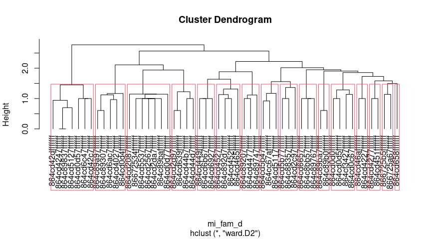

Práctica 99. Resultados de tu manuscrito. Orthoptera, análisis de
agrupamiento.
================
José Ramón Martínez Batlle
26-11-2022

NOTA. Este cuaderno es una aplicación a datos de Orthoptera en GBIF, a
partir de una simple adaptación del cuaderno general
[practica-99-tu-manuscrito-3-resultados.md (basado en un análisis
demostrativo de la familia
Polygonaceae)](../practica-99-tu-manuscrito-3-resultados.md). Si
comparas este archivo con el original, notarás que, básicamente, edité
el nombre del archivo fuente de la matriz de comunidad (para adaptarlo a
este grupo) y otros detalles menores. Por lo tanto, aunque el código y
los gráficos sí se refieren a Orthoptera, probablemente el texto no.

# ¿Qué contiene la sección “Resultados”?

Te recomiendo releer las normas para autores/as del [Anuario de
Investigaciones Científicas de la
UASD](../docs/instrucciones-para-autores-anuario-investigaciones-cientificas-UASD.pdf)
y adherirte a las especificaciones sobre la sección “Resultados” que
allí se indican. Aunque en las referidas normas no se incluyen muchas
pautas significativas, si escribieras para una revista específica,
deberás considerar sus normas y recomendaciones de publicación. Además,
te recomiendo que consultes la sección “Resultados” de algunos
manuscritos publicados en el Anuario.

En los resultados expones el contenido analítico central. Es “el qué”
del manuscrito, en complemento de “el cómo” (metodología) y “el por qué”
(introducción) de tu investigación. En los resultados muestras lo que
encontraste luego de que colectaste (aunque en este caso, no fuiste al
terreno) y analizaste, con tus métodos, los datos fuente.

Algunas recomendaciones generales:

- “Resultados” se supone que es la sección más corta del manuscrito,
  siempre que se usen apropiadamente los recursos gráficos, las tablas y
  la información suplementaria.

- Comienza por realizar tus análisis. Necesitarás una matriz de
  comunidad y una ambiental. La de comunidad la habrás generado en la
  práctica 2; la ambiental explico cómo generarla en este mismo cuaderno
  (ver abajo). En general, la matriz ambiental la producirás mediante
  estadísticos zonales del territorio dominicano. Para aprender más
  sobre la fuente de estadística zonal de República Dominicana, que
  contiene un conjunto de más de 100 variables resumidas por celdas H3,
  visita [este repo](https://github.com/geofis/zonal-statistics). Debes
  visitar dicho repo para poder citarlo apropiadamente.

- Cuando tengas análisis realizados, antes de comenzar a escribir, te
  recomiendo que escribas un guión de tu sección “Resultados”.

- Guión en mano, redacta tu sección “Resultados”, siguiendo también
  estos consejos:

- En esta sección, se espera que presentes lo que has obtenido de manera
  “objetiva”, evitando explicaciones, comentarios, opiniones,
  perspectivas o limitaciones. En teoría, tu redacción es “fría”, lo
  cual no necesariamente significa que tenga que ser aburrida.

- Esta es la sección por excelencia donde usarás *tablas y/o gráficos*.
  Lo más importante a tener en cuenta cuando los uses es que no debes
  duplicar el contenido que muestran dichos recursos en el texto. La
  tabla o gráfico son apoyos que te ayudarán a no entrar en densidades
  innecesarias dentro de los párrafos. Por lo tanto, si colocas una
  tabla o figura, no caigas en la tentación de describirla en párrafos
  de forma exhausitva. Estos recursos deben servir para apoyar el o los
  párrafos donde destacas los principales patrones encontrados.

- *Importante también*: si insertas una tabla o gráfico, debes referirla
  en el texto (e.g. “ver figura X”). De nada sirve incluir una figura o
  una tabla si no la refieres, porque con ello estarás sugiriendo que
  dicho recurso era completamente prescindible.

- El tiempo verbal preferido (por defecto) es el pasado, por ejemplo “…,
  donde se **encontró** una asociación significativa entre … y …”. Sin
  embargo, hay excepciones, como por ejemplo, cuando te refieres a una
  tabla o una figura. Un caso típico es la expresión “tal como se
  muestra en la tabla 1”, donde el verbo está conjugado en presente.

A continuación, te pongo enlaces a referencias que considero útiles,
sobre cómo redactar los resultados (algunas son generales, sobre
artículos en general):

- [Breves pautas, en
  inglés](https://www.editage.com/insights/the-secret-to-writing-the-results-and-discussion-section-of-a-manuscript).
  Puedes usar el traductor [DeepL](https://www.deepl.com/translator),
  porque produce frases más naturales.

Cinco guías, en inglés, que considero están bien elaboradas, sobre cómo
redactar un artículo científico (consulta la sección sobre cómo redactar
los *resultados* en cada una):

- [Demystifying the Journal
  Article](https://www.insidehighered.com/advice/2017/05/09/how-write-effective-journal-article-and-get-it-published-essay)

- [How to write a scientific manuscript for
  publication](https://www.ncbi.nlm.nih.gov/pmc/articles/PMC3626472/)

- [11 steps to structuring a science paper editors will take
  seriously](https://www.elsevier.com/connect/11-steps-to-structuring-a-science-paper-editors-will-take-seriously)

- [Cómo escribir un artículo científico por primera
  vez](https://www.sciencedirect.com/science/article/abs/pii/S1134593417300040)
  (necesitarás usar [SciHub](https://sci-hub.se/) para descargarlo)

- Una muy breve pero con consejos útiles: [Tips for writing the perfect
  IMRAD
  manuscript](https://www.editage.com/insights/tips-for-writing-the-perfect-imrad-manuscript)

# Scripts de ejemplo

Una nota, a título informativo. Cada una se las siguientes secciones
(e.g. “Análisis de agrupamiento”, “Ordenación restringida”), es
reproducible de forma autónoma, es decir, sin dependencia de líneas de
código anteriores. Esto siginifica que las dependencias de una sección
se resuelven dentro de ella misma, sin dependencia de líneas anteriores.

Por esta razón, varias secciones comparten texto y código común, pero
sólo al inicio, porque al avanzar cada una se hace propia. Notarás, por
lo tanto, que el texto “se repite a sí mismo” por esta razón; la otra
opción que tenía era alojar el código común en un único archivo, pero
entonces esto te obligaba a navegar por archivos separados, haciendo
menos didáctico este cuaderno.

## Análisis de agrupamiento

Me basaré en los scripts que comienzan por `aa_` de este
[repo](https://github.com/biogeografia-master/scripts-de-analisis-BCI),
los cuales explico en los vídeos de “Análisis de agrupamiento” (del 13
al 16) de la lista de reproducción [“Ecología Numérica con R” de mi
canal](https://www.youtube.com/playlist?list=PLDcT2n8UzsCRDqjqSeqHI1wsiNOqpYmsJ).

> INICIA texto+código común entre secciones

Fijar un directorio de trabajo no es recomendable, mejor trabaja por
proyecto. En cualquier caso, si no quieres o no puedes crear un
proyecto, usa la sentencia que verás abajo, cambiando `TU_DIRECTORIO`
por la ruta del directorio donde tengas almacenados tus datos y tus
scripts.

``` r
if(interactive()) {
  tryCatch(
    setwd(dirname(rstudioapi::getSourceEditorContext()$path)),
    error = function(e) {
      cat('Probablemente ya el directorio de trabajo está fijado correctamente',
          'o quizá el directorio no existe. Este fue el error devuelto:\n')
      e
    })
}
```

Cargar paquetes.

``` r
library(vegan)
library(sf)
library(tidyverse)
library(tmap)
library(kableExtra)
library(foreach)
library(leaps)
library(caret)
gh_content <- 'https://raw.githubusercontent.com/'
gh_zonal_stats <- paste0(gh_content,
                         'geofis/zonal-statistics/0b2e95aaee87bf326cf132d28f4bd15220bb4ec7/out/')
repo_analisis <- 'biogeografia-master/scripts-de-analisis-BCI/master'
repo_sem202202 <- 'biogeografia-202202/material-de-apoyo/master/practicas/'
devtools::source_url(paste0(gh_content, repo_analisis, '/biodata/funciones.R'))
devtools::source_url(paste0(gh_content, repo_sem202202, 'train.R'))
devtools::source_url(paste0(gh_content, repo_sem202202, 'funciones.R'))
```

Carga tu matriz de comunidad, que habrás generado en la práctica 2, y
elige un umbral para especies raras o rangos de registros de presencia
para seleccionar especies en una nueva matriz de comunidad.

``` r
res <- 6 #Resolución H3, puedes elegir entre 4, 5, 6 o 7, pero cuidado con valores >=6
# IMPORTANTE: la resolución de las celdas H3, debe coincidir con la resolución
# a la cual generaste tu matriz de comunidad. De lo contrario, obtendrás error. Si tu 
# archivo RDS de matriz de comunidad se denomina "matriz_de_comunidad.RDS", y lo creaste
# usando resolución 4, cámbiale el nombre a "matriz_de_comunidad_res_5.RDS". Recuerda,
# puedes usar cualquier resolución, lo único importante es que las resolución usada en la
# creación de la matriz de comunidad, debe ser la misma que en la ambiental.
# Prueba distintas resoluciones, no te enfrasques en quedarte con la misma que
# uso en este ejemplo. Prueba con resolución 5, por ejemplo.
mc_orig <- readRDS('matriz_de_comunidad_orthoptera.RDS')
nrow(mc_orig) #Número de filas, equivale a número de hexágonos con registros de presencia
```

    ## [1] 157

``` r
ncol(mc_orig)  #Número de columnas, equivale a número de especies, riqueza
```

    ## [1] 91

``` r
data.frame(Especies = names(mc_orig)) %>% 
  kable(booktabs=T) %>%
  kable_styling(latex_options = c("HOLD_position", "scale_down")) %>%
  gsub(' NA ', '', .) #Lista de especies
```

<table class="table" style="margin-left: auto; margin-right: auto;">
<thead>
<tr>
<th style="text-align:left;">
Especies
</th>
</tr>
</thead>
<tbody>
<tr>
<td style="text-align:left;">
Neoconocephalus triops (Linnaeus, 1758)
</td>
</tr>
<tr>
<td style="text-align:left;">
Gryllodes sigillatus (Walker, 1869)
</td>
</tr>
<tr>
<td style="text-align:left;">
Schistocerca quisqueya Rehn & Hebard, 1938
</td>
</tr>
<tr>
<td style="text-align:left;">
Orphulella punctata (De Geer, 1773)
</td>
</tr>
<tr>
<td style="text-align:left;">
Conocephalus cinereus Thunberg, 1815
</td>
</tr>
<tr>
<td style="text-align:left;">
Schistocerca nitens (Thunberg, 1815)
</td>
</tr>
<tr>
<td style="text-align:left;">
Sphingonotus haitensis (Saussure, 1861)
</td>
</tr>
<tr>
<td style="text-align:left;">
Schistocerca pallens (Thunberg, 1815)
</td>
</tr>
<tr>
<td style="text-align:left;">
Polyancistrus serrulatus (Palisot de Beauvois, 1805)
</td>
</tr>
<tr>
<td style="text-align:left;">
Tafalisca lurida Walker, 1869
</td>
</tr>
<tr>
<td style="text-align:left;">
Dellia dominicensis Perez-Gelabert, Dominici, Hierro & Otte, 1995
</td>
</tr>
<tr>
<td style="text-align:left;">
Schistocerca serialis (Thunberg, 1815)
</td>
</tr>
<tr>
<td style="text-align:left;">
Duartettix montanus Perez-Gelabert & Otte, 2000
</td>
</tr>
<tr>
<td style="text-align:left;">
Stenacris caribea (Rehn & Hebard, 1938)
</td>
</tr>
<tr>
<td style="text-align:left;">
Polyancistrus loripes Rehn, 1936
</td>
</tr>
<tr>
<td style="text-align:left;">
Sphingonotus haitensis haitensis
</td>
</tr>
<tr>
<td style="text-align:left;">
Espagnolopsis breviptera Perez-Gelabert, Hierro & Otte, 1997
</td>
</tr>
<tr>
<td style="text-align:left;">
Hispanacris oreades Perez-Gelabert, Dominici, Hierro & Otte, 1995
</td>
</tr>
<tr>
<td style="text-align:left;">
Gryllidae
</td>
</tr>
<tr>
<td style="text-align:left;">
Erechthis gundlachi Bolívar, 1888
</td>
</tr>
<tr>
<td style="text-align:left;">
Tergoceracris ebanoverde Perez-Gelabert & Otte, 2003
</td>
</tr>
<tr>
<td style="text-align:left;">
Xyleus discoideus rosulentus (Stål, 1878)
</td>
</tr>
<tr>
<td style="text-align:left;">
Espagnola darlingtoni Rehn & Rehn, 1939
</td>
</tr>
<tr>
<td style="text-align:left;">
Anacaona bellatrix Yong, 2019
</td>
</tr>
<tr>
<td style="text-align:left;">
Conocephalus insularis (Morse, 1905)
</td>
</tr>
<tr>
<td style="text-align:left;">
Amblytropidia hispaniolana Perez-Gelabert, Dominici, Hierro & Otte, 1995
</td>
</tr>
<tr>
<td style="text-align:left;">
Jaragua oviedensis Perez-Gelabert, Dominici & Hierro, 1995
</td>
</tr>
<tr>
<td style="text-align:left;">
Neibamastax divergentis (Perez-Gelabert, Hierro, Dominici & Otte, 1997)
</td>
</tr>
<tr>
<td style="text-align:left;">
Melanoplus perezi Otte, 2012
</td>
</tr>
<tr>
<td style="text-align:left;">
Dellia roseomaculata Perez-Gelabert & Otte, 1999
</td>
</tr>
<tr>
<td style="text-align:left;">
Unicorniella hatueyi Yong, 2019
</td>
</tr>
<tr>
<td style="text-align:left;">
Acridurus robustus Perez-Gelabert, Dominici, Hierro & Otte, 1995
</td>
</tr>
<tr>
<td style="text-align:left;">
Polyancistrus gerulus Rehn, 1936
</td>
</tr>
<tr>
<td style="text-align:left;">
Acridurus neibanus Perez-Gelabert, Dominici, Hierro & Otte, 1995
</td>
</tr>
<tr>
<td style="text-align:left;">
Hispanotettix nitidus Perez-Gelabert, Dominici, Hierro & Otte, 1995
</td>
</tr>
<tr>
<td style="text-align:left;">
Rhammatocerus cyanipes (Fabricius, 1775)
</td>
</tr>
<tr>
<td style="text-align:left;">
Dellia viridissima Perez-Gelabert & Otte, 2012
</td>
</tr>
<tr>
<td style="text-align:left;">
Neoconocephalus occidentalis (Saussure, 1859)
</td>
</tr>
<tr>
<td style="text-align:left;">
Espagnoleta microptera (Perez-Gelabert, Hierro & Otte, 1997)
</td>
</tr>
<tr>
<td style="text-align:left;">
Tainacris nitaina Perez-Gelabert, Hierro, Dominici & Otte, 1997
</td>
</tr>
<tr>
<td style="text-align:left;">
Tainacris quisqueiana Perez-Gelabert, Hierro, Dominici & Otte, 1997
</td>
</tr>
<tr>
<td style="text-align:left;">
Antillacris explicatrix Rehn & Rehn, 1939
</td>
</tr>
<tr>
<td style="text-align:left;">
Acridurus yayitas Perez-Gelabert, Dominici, Hierro & Otte, 1995
</td>
</tr>
<tr>
<td style="text-align:left;">
Dellia bayahibe Perez-Gelabert, 2002
</td>
</tr>
<tr>
<td style="text-align:left;">
Neoconocephalus affinis (Palisot de Beauvois, 1805)
</td>
</tr>
<tr>
<td style="text-align:left;">
Espagnolopsis ornatipennis Perez-Gelabert, Hierro & Otte, 1997
</td>
</tr>
<tr>
<td style="text-align:left;">
Dellia monticola Perez-Gelabert & Otte, 1999
</td>
</tr>
<tr>
<td style="text-align:left;">
Neoconocephalus pinicola Walker & Greenfield, 1983
</td>
</tr>
<tr>
<td style="text-align:left;">
Tettigoniidae
</td>
</tr>
<tr>
<td style="text-align:left;">
Antillacris inflaticercus Perez-Gelabert, Hierro, Dominici & Otte, 1997
</td>
</tr>
<tr>
<td style="text-align:left;">
Antillacris eumenes Perez-Gelabert, Hierro, Dominici & Otte, 1997
</td>
</tr>
<tr>
<td style="text-align:left;">
Tergoceracris ocampensis Perez-Gelabert & Otte, 2003
</td>
</tr>
<tr>
<td style="text-align:left;">
Jaragua serranus Perez-Gelabert, Dominici & Hierro, 1995
</td>
</tr>
<tr>
<td style="text-align:left;">
Acheta domesticus (Linnaeus, 1758)
</td>
</tr>
<tr>
<td style="text-align:left;">
Conocephalus fasciatus (De Geer, 1773)
</td>
</tr>
<tr>
<td style="text-align:left;">
Gryllus Linnaeus, 1758
</td>
</tr>
<tr>
<td style="text-align:left;">
Ellipes minuta (Scudder, 1862)
</td>
</tr>
<tr>
<td style="text-align:left;">
Phlugis Stål, 1861
</td>
</tr>
<tr>
<td style="text-align:left;">
Conocephalus strictus (Scudder, 1875)
</td>
</tr>
<tr>
<td style="text-align:left;">
Spelaeala bondi Rehn, 1943
</td>
</tr>
<tr>
<td style="text-align:left;">
Spelaeala scobina Rehn, 1943
</td>
</tr>
<tr>
<td style="text-align:left;">
Proanaxipha madgesuttonae Heads & Penney, 2012
</td>
</tr>
<tr>
<td style="text-align:left;">
Mirhipipteryx antillarum Heads, 2010
</td>
</tr>
<tr>
<td style="text-align:left;">
Archaeoellipes engeli Heads, 2010
</td>
</tr>
<tr>
<td style="text-align:left;">
Cyrtoxipha electrina Gorochov, 2010
</td>
</tr>
<tr>
<td style="text-align:left;">
Cyrtoxipha illegibilis Gorochov, 2010
</td>
</tr>
<tr>
<td style="text-align:left;">
Miophlugis rostratus Gorochov, 2010
</td>
</tr>
<tr>
<td style="text-align:left;">
Abanaxipha longispina Vickery & Poinar Jr., 1994
</td>
</tr>
<tr>
<td style="text-align:left;">
Pseudarachnocephalus dominicanus Gorochov, 2010
</td>
</tr>
<tr>
<td style="text-align:left;">
Proanaxipha latoca Vickery & Poinar Jr., 1994
</td>
</tr>
<tr>
<td style="text-align:left;">
Pseudarachnocephalus latiusculus Gorochov, 2010
</td>
</tr>
<tr>
<td style="text-align:left;">
Grossoxipha feminea Gorochov, 2010
</td>
</tr>
<tr>
<td style="text-align:left;">
Paleomastacris ambarinus Perez-Gelabert, Hierro, Dominici & Otte, 1997
</td>
</tr>
<tr>
<td style="text-align:left;">
Baeotettix lottiae Heads, 2009
</td>
</tr>
<tr>
<td style="text-align:left;">
Antillotettix electrum Heads, 2009
</td>
</tr>
<tr>
<td style="text-align:left;">
Grossoxipha yaque Vickery & Poinar Jr., 1994
</td>
</tr>
<tr>
<td style="text-align:left;">
Abanaxipha incongrua Vickery & Poinar Jr., 1994
</td>
</tr>
<tr>
<td style="text-align:left;">
Ornebius ambericus Vickery & Poinar Jr., 1994
</td>
</tr>
<tr>
<td style="text-align:left;">
Anaxipha dominica Vickery & Poinar Jr., 1994
</td>
</tr>
<tr>
<td style="text-align:left;">
Araneagryllus dylani Heads, 2010
</td>
</tr>
<tr>
<td style="text-align:left;">
Electrotettix attenboroughi Heads & Thomas, 2014
</td>
</tr>
<tr>
<td style="text-align:left;">
Paratettix frey-gessnerii Bolívar, 1887
</td>
</tr>
<tr>
<td style="text-align:left;">
Sphingonotus haitiensis (Saussure, 1861)
</td>
</tr>
<tr>
<td style="text-align:left;">
Turpilia Stål, 1874
</td>
</tr>
<tr>
<td style="text-align:left;">
Orphulella decisa (Walker, 1870)
</td>
</tr>
<tr>
<td style="text-align:left;">
Orphulella nesicos Otte, 1979
</td>
</tr>
<tr>
<td style="text-align:left;">
Hispanacris Perez-Gelabert, Dominici, Hierro & Otte, 1995
</td>
</tr>
<tr>
<td style="text-align:left;">
Erioloides Hebard, 1927
</td>
</tr>
<tr>
<td style="text-align:left;">
Phlugis chrysopa Bolívar, 1888
</td>
</tr>
<tr>
<td style="text-align:left;">
Phoebolampta excellens (Walker, 1869)
</td>
</tr>
<tr>
<td style="text-align:left;">
Anaulacomera Stål, 1873
</td>
</tr>
</tbody>
</table>

``` r
unique(word(names(mc_orig), 1, 1)) #Géneros representados
```

    ##  [1] "Neoconocephalus"      "Gryllodes"            "Schistocerca"        
    ##  [4] "Orphulella"           "Conocephalus"         "Sphingonotus"        
    ##  [7] "Polyancistrus"        "Tafalisca"            "Dellia"              
    ## [10] "Duartettix"           "Stenacris"            "Espagnolopsis"       
    ## [13] "Hispanacris"          "Gryllidae"            "Erechthis"           
    ## [16] "Tergoceracris"        "Xyleus"               "Espagnola"           
    ## [19] "Anacaona"             "Amblytropidia"        "Jaragua"             
    ## [22] "Neibamastax"          "Melanoplus"           "Unicorniella"        
    ## [25] "Acridurus"            "Hispanotettix"        "Rhammatocerus"       
    ## [28] "Espagnoleta"          "Tainacris"            "Antillacris"         
    ## [31] "Tettigoniidae"        "Acheta"               "Gryllus"             
    ## [34] "Ellipes"              "Phlugis"              "Spelaeala"           
    ## [37] "Proanaxipha"          "Mirhipipteryx"        "Archaeoellipes"      
    ## [40] "Cyrtoxipha"           "Miophlugis"           "Abanaxipha"          
    ## [43] "Pseudarachnocephalus" "Grossoxipha"          "Paleomastacris"      
    ## [46] "Baeotettix"           "Antillotettix"        "Ornebius"            
    ## [49] "Anaxipha"             "Araneagryllus"        "Electrotettix"       
    ## [52] "Paratettix"           "Turpilia"             "Erioloides"          
    ## [55] "Phoebolampta"         "Anaulacomera"

``` r
table(word(names(mc_orig), 1, 1)) #Número de especies por género
```

    ## 
    ##           Abanaxipha               Acheta            Acridurus 
    ##                    2                    1                    3 
    ##        Amblytropidia             Anacaona         Anaulacomera 
    ##                    1                    1                    1 
    ##             Anaxipha          Antillacris        Antillotettix 
    ##                    1                    3                    1 
    ##        Araneagryllus       Archaeoellipes           Baeotettix 
    ##                    1                    1                    1 
    ##         Conocephalus           Cyrtoxipha               Dellia 
    ##                    4                    2                    5 
    ##           Duartettix        Electrotettix              Ellipes 
    ##                    1                    1                    1 
    ##            Erechthis           Erioloides            Espagnola 
    ##                    1                    1                    1 
    ##          Espagnoleta        Espagnolopsis          Grossoxipha 
    ##                    1                    2                    2 
    ##            Gryllidae            Gryllodes              Gryllus 
    ##                    1                    1                    1 
    ##          Hispanacris        Hispanotettix              Jaragua 
    ##                    2                    1                    2 
    ##           Melanoplus           Miophlugis        Mirhipipteryx 
    ##                    1                    1                    1 
    ##          Neibamastax      Neoconocephalus             Ornebius 
    ##                    1                    4                    1 
    ##           Orphulella       Paleomastacris           Paratettix 
    ##                    3                    1                    1 
    ##              Phlugis         Phoebolampta        Polyancistrus 
    ##                    2                    1                    3 
    ##          Proanaxipha Pseudarachnocephalus        Rhammatocerus 
    ##                    2                    2                    1 
    ##         Schistocerca            Spelaeala         Sphingonotus 
    ##                    4                    2                    3 
    ##            Stenacris            Tafalisca            Tainacris 
    ##                    1                    1                    2 
    ##        Tergoceracris        Tettigoniidae             Turpilia 
    ##                    2                    1                    1 
    ##         Unicorniella               Xyleus 
    ##                    1                    1

``` r
data.frame(`Número de hexágonos` = sort(colSums(mc_orig), decreasing = T), check.names = F) %>% 
  kable(booktabs=T) %>%
  kable_styling(latex_options = c("HOLD_position", "scale_down")) %>%
  gsub(' NA ', '', .) # Número de hexágonos en los que está presente cada especie
```

<table class="table" style="margin-left: auto; margin-right: auto;">
<thead>
<tr>
<th style="text-align:left;">
</th>
<th style="text-align:right;">
Número de hexágonos
</th>
</tr>
</thead>
<tbody>
<tr>
<td style="text-align:left;">
Schistocerca quisqueya Rehn & Hebard, 1938
</td>
<td style="text-align:right;">
21
</td>
</tr>
<tr>
<td style="text-align:left;">
Orphulella punctata (De Geer, 1773)
</td>
<td style="text-align:right;">
13
</td>
</tr>
<tr>
<td style="text-align:left;">
Dellia dominicensis Perez-Gelabert, Dominici, Hierro & Otte, 1995
</td>
<td style="text-align:right;">
13
</td>
</tr>
<tr>
<td style="text-align:left;">
Neoconocephalus triops (Linnaeus, 1758)
</td>
<td style="text-align:right;">
12
</td>
</tr>
<tr>
<td style="text-align:left;">
Gryllodes sigillatus (Walker, 1869)
</td>
<td style="text-align:right;">
10
</td>
</tr>
<tr>
<td style="text-align:left;">
Polyancistrus loripes Rehn, 1936
</td>
<td style="text-align:right;">
9
</td>
</tr>
<tr>
<td style="text-align:left;">
Orphulella nesicos Otte, 1979
</td>
<td style="text-align:right;">
9
</td>
</tr>
<tr>
<td style="text-align:left;">
Espagnola darlingtoni Rehn & Rehn, 1939
</td>
<td style="text-align:right;">
8
</td>
</tr>
<tr>
<td style="text-align:left;">
Tettigoniidae
</td>
<td style="text-align:right;">
7
</td>
</tr>
<tr>
<td style="text-align:left;">
Polyancistrus serrulatus (Palisot de Beauvois, 1805)
</td>
<td style="text-align:right;">
6
</td>
</tr>
<tr>
<td style="text-align:left;">
Schistocerca serialis (Thunberg, 1815)
</td>
<td style="text-align:right;">
6
</td>
</tr>
<tr>
<td style="text-align:left;">
Turpilia Stål, 1874
</td>
<td style="text-align:right;">
6
</td>
</tr>
<tr>
<td style="text-align:left;">
Orphulella decisa (Walker, 1870)
</td>
<td style="text-align:right;">
6
</td>
</tr>
<tr>
<td style="text-align:left;">
Sphingonotus haitensis (Saussure, 1861)
</td>
<td style="text-align:right;">
5
</td>
</tr>
<tr>
<td style="text-align:left;">
Spelaeala bondi Rehn, 1943
</td>
<td style="text-align:right;">
5
</td>
</tr>
<tr>
<td style="text-align:left;">
Schistocerca pallens (Thunberg, 1815)
</td>
<td style="text-align:right;">
4
</td>
</tr>
<tr>
<td style="text-align:left;">
Stenacris caribea (Rehn & Hebard, 1938)
</td>
<td style="text-align:right;">
4
</td>
</tr>
<tr>
<td style="text-align:left;">
Conocephalus insularis (Morse, 1905)
</td>
<td style="text-align:right;">
4
</td>
</tr>
<tr>
<td style="text-align:left;">
Antillacris explicatrix Rehn & Rehn, 1939
</td>
<td style="text-align:right;">
4
</td>
</tr>
<tr>
<td style="text-align:left;">
Acridurus yayitas Perez-Gelabert, Dominici, Hierro & Otte, 1995
</td>
<td style="text-align:right;">
4
</td>
</tr>
<tr>
<td style="text-align:left;">
Dellia bayahibe Perez-Gelabert, 2002
</td>
<td style="text-align:right;">
4
</td>
</tr>
<tr>
<td style="text-align:left;">
Gryllus Linnaeus, 1758
</td>
<td style="text-align:right;">
4
</td>
</tr>
<tr>
<td style="text-align:left;">
Phoebolampta excellens (Walker, 1869)
</td>
<td style="text-align:right;">
4
</td>
</tr>
<tr>
<td style="text-align:left;">
Anaulacomera Stål, 1873
</td>
<td style="text-align:right;">
4
</td>
</tr>
<tr>
<td style="text-align:left;">
Duartettix montanus Perez-Gelabert & Otte, 2000
</td>
<td style="text-align:right;">
3
</td>
</tr>
<tr>
<td style="text-align:left;">
Espagnolopsis breviptera Perez-Gelabert, Hierro & Otte, 1997
</td>
<td style="text-align:right;">
3
</td>
</tr>
<tr>
<td style="text-align:left;">
Hispanacris oreades Perez-Gelabert, Dominici, Hierro & Otte, 1995
</td>
<td style="text-align:right;">
3
</td>
</tr>
<tr>
<td style="text-align:left;">
Gryllidae
</td>
<td style="text-align:right;">
3
</td>
</tr>
<tr>
<td style="text-align:left;">
Amblytropidia hispaniolana Perez-Gelabert, Dominici, Hierro & Otte, 1995
</td>
<td style="text-align:right;">
3
</td>
</tr>
<tr>
<td style="text-align:left;">
Jaragua oviedensis Perez-Gelabert, Dominici & Hierro, 1995
</td>
<td style="text-align:right;">
3
</td>
</tr>
<tr>
<td style="text-align:left;">
Neibamastax divergentis (Perez-Gelabert, Hierro, Dominici & Otte, 1997)
</td>
<td style="text-align:right;">
3
</td>
</tr>
<tr>
<td style="text-align:left;">
Hispanotettix nitidus Perez-Gelabert, Dominici, Hierro & Otte, 1995
</td>
<td style="text-align:right;">
3
</td>
</tr>
<tr>
<td style="text-align:left;">
Rhammatocerus cyanipes (Fabricius, 1775)
</td>
<td style="text-align:right;">
3
</td>
</tr>
<tr>
<td style="text-align:left;">
Tainacris quisqueiana Perez-Gelabert, Hierro, Dominici & Otte, 1997
</td>
<td style="text-align:right;">
3
</td>
</tr>
<tr>
<td style="text-align:left;">
Neoconocephalus affinis (Palisot de Beauvois, 1805)
</td>
<td style="text-align:right;">
3
</td>
</tr>
<tr>
<td style="text-align:left;">
Phlugis chrysopa Bolívar, 1888
</td>
<td style="text-align:right;">
3
</td>
</tr>
<tr>
<td style="text-align:left;">
Conocephalus cinereus Thunberg, 1815
</td>
<td style="text-align:right;">
2
</td>
</tr>
<tr>
<td style="text-align:left;">
Sphingonotus haitensis haitensis
</td>
<td style="text-align:right;">
2
</td>
</tr>
<tr>
<td style="text-align:left;">
Erechthis gundlachi Bolívar, 1888
</td>
<td style="text-align:right;">
2
</td>
</tr>
<tr>
<td style="text-align:left;">
Tergoceracris ebanoverde Perez-Gelabert & Otte, 2003
</td>
<td style="text-align:right;">
2
</td>
</tr>
<tr>
<td style="text-align:left;">
Melanoplus perezi Otte, 2012
</td>
<td style="text-align:right;">
2
</td>
</tr>
<tr>
<td style="text-align:left;">
Dellia roseomaculata Perez-Gelabert & Otte, 1999
</td>
<td style="text-align:right;">
2
</td>
</tr>
<tr>
<td style="text-align:left;">
Unicorniella hatueyi Yong, 2019
</td>
<td style="text-align:right;">
2
</td>
</tr>
<tr>
<td style="text-align:left;">
Acridurus robustus Perez-Gelabert, Dominici, Hierro & Otte, 1995
</td>
<td style="text-align:right;">
2
</td>
</tr>
<tr>
<td style="text-align:left;">
Polyancistrus gerulus Rehn, 1936
</td>
<td style="text-align:right;">
2
</td>
</tr>
<tr>
<td style="text-align:left;">
Neoconocephalus occidentalis (Saussure, 1859)
</td>
<td style="text-align:right;">
2
</td>
</tr>
<tr>
<td style="text-align:left;">
Espagnoleta microptera (Perez-Gelabert, Hierro & Otte, 1997)
</td>
<td style="text-align:right;">
2
</td>
</tr>
<tr>
<td style="text-align:left;">
Tainacris nitaina Perez-Gelabert, Hierro, Dominici & Otte, 1997
</td>
<td style="text-align:right;">
2
</td>
</tr>
<tr>
<td style="text-align:left;">
Espagnolopsis ornatipennis Perez-Gelabert, Hierro & Otte, 1997
</td>
<td style="text-align:right;">
2
</td>
</tr>
<tr>
<td style="text-align:left;">
Dellia monticola Perez-Gelabert & Otte, 1999
</td>
<td style="text-align:right;">
2
</td>
</tr>
<tr>
<td style="text-align:left;">
Proanaxipha latoca Vickery & Poinar Jr., 1994
</td>
<td style="text-align:right;">
2
</td>
</tr>
<tr>
<td style="text-align:left;">
Anaxipha dominica Vickery & Poinar Jr., 1994
</td>
<td style="text-align:right;">
2
</td>
</tr>
<tr>
<td style="text-align:left;">
Hispanacris Perez-Gelabert, Dominici, Hierro & Otte, 1995
</td>
<td style="text-align:right;">
2
</td>
</tr>
<tr>
<td style="text-align:left;">
Erioloides Hebard, 1927
</td>
<td style="text-align:right;">
2
</td>
</tr>
<tr>
<td style="text-align:left;">
Schistocerca nitens (Thunberg, 1815)
</td>
<td style="text-align:right;">
1
</td>
</tr>
<tr>
<td style="text-align:left;">
Tafalisca lurida Walker, 1869
</td>
<td style="text-align:right;">
1
</td>
</tr>
<tr>
<td style="text-align:left;">
Xyleus discoideus rosulentus (Stål, 1878)
</td>
<td style="text-align:right;">
1
</td>
</tr>
<tr>
<td style="text-align:left;">
Anacaona bellatrix Yong, 2019
</td>
<td style="text-align:right;">
1
</td>
</tr>
<tr>
<td style="text-align:left;">
Acridurus neibanus Perez-Gelabert, Dominici, Hierro & Otte, 1995
</td>
<td style="text-align:right;">
1
</td>
</tr>
<tr>
<td style="text-align:left;">
Dellia viridissima Perez-Gelabert & Otte, 2012
</td>
<td style="text-align:right;">
1
</td>
</tr>
<tr>
<td style="text-align:left;">
Neoconocephalus pinicola Walker & Greenfield, 1983
</td>
<td style="text-align:right;">
1
</td>
</tr>
<tr>
<td style="text-align:left;">
Antillacris inflaticercus Perez-Gelabert, Hierro, Dominici & Otte, 1997
</td>
<td style="text-align:right;">
1
</td>
</tr>
<tr>
<td style="text-align:left;">
Antillacris eumenes Perez-Gelabert, Hierro, Dominici & Otte, 1997
</td>
<td style="text-align:right;">
1
</td>
</tr>
<tr>
<td style="text-align:left;">
Tergoceracris ocampensis Perez-Gelabert & Otte, 2003
</td>
<td style="text-align:right;">
1
</td>
</tr>
<tr>
<td style="text-align:left;">
Jaragua serranus Perez-Gelabert, Dominici & Hierro, 1995
</td>
<td style="text-align:right;">
1
</td>
</tr>
<tr>
<td style="text-align:left;">
Acheta domesticus (Linnaeus, 1758)
</td>
<td style="text-align:right;">
1
</td>
</tr>
<tr>
<td style="text-align:left;">
Conocephalus fasciatus (De Geer, 1773)
</td>
<td style="text-align:right;">
1
</td>
</tr>
<tr>
<td style="text-align:left;">
Ellipes minuta (Scudder, 1862)
</td>
<td style="text-align:right;">
1
</td>
</tr>
<tr>
<td style="text-align:left;">
Phlugis Stål, 1861
</td>
<td style="text-align:right;">
1
</td>
</tr>
<tr>
<td style="text-align:left;">
Conocephalus strictus (Scudder, 1875)
</td>
<td style="text-align:right;">
1
</td>
</tr>
<tr>
<td style="text-align:left;">
Spelaeala scobina Rehn, 1943
</td>
<td style="text-align:right;">
1
</td>
</tr>
<tr>
<td style="text-align:left;">
Proanaxipha madgesuttonae Heads & Penney, 2012
</td>
<td style="text-align:right;">
1
</td>
</tr>
<tr>
<td style="text-align:left;">
Mirhipipteryx antillarum Heads, 2010
</td>
<td style="text-align:right;">
1
</td>
</tr>
<tr>
<td style="text-align:left;">
Archaeoellipes engeli Heads, 2010
</td>
<td style="text-align:right;">
1
</td>
</tr>
<tr>
<td style="text-align:left;">
Cyrtoxipha electrina Gorochov, 2010
</td>
<td style="text-align:right;">
1
</td>
</tr>
<tr>
<td style="text-align:left;">
Cyrtoxipha illegibilis Gorochov, 2010
</td>
<td style="text-align:right;">
1
</td>
</tr>
<tr>
<td style="text-align:left;">
Miophlugis rostratus Gorochov, 2010
</td>
<td style="text-align:right;">
1
</td>
</tr>
<tr>
<td style="text-align:left;">
Abanaxipha longispina Vickery & Poinar Jr., 1994
</td>
<td style="text-align:right;">
1
</td>
</tr>
<tr>
<td style="text-align:left;">
Pseudarachnocephalus dominicanus Gorochov, 2010
</td>
<td style="text-align:right;">
1
</td>
</tr>
<tr>
<td style="text-align:left;">
Pseudarachnocephalus latiusculus Gorochov, 2010
</td>
<td style="text-align:right;">
1
</td>
</tr>
<tr>
<td style="text-align:left;">
Grossoxipha feminea Gorochov, 2010
</td>
<td style="text-align:right;">
1
</td>
</tr>
<tr>
<td style="text-align:left;">
Paleomastacris ambarinus Perez-Gelabert, Hierro, Dominici & Otte, 1997
</td>
<td style="text-align:right;">
1
</td>
</tr>
<tr>
<td style="text-align:left;">
Baeotettix lottiae Heads, 2009
</td>
<td style="text-align:right;">
1
</td>
</tr>
<tr>
<td style="text-align:left;">
Antillotettix electrum Heads, 2009
</td>
<td style="text-align:right;">
1
</td>
</tr>
<tr>
<td style="text-align:left;">
Grossoxipha yaque Vickery & Poinar Jr., 1994
</td>
<td style="text-align:right;">
1
</td>
</tr>
<tr>
<td style="text-align:left;">
Abanaxipha incongrua Vickery & Poinar Jr., 1994
</td>
<td style="text-align:right;">
1
</td>
</tr>
<tr>
<td style="text-align:left;">
Ornebius ambericus Vickery & Poinar Jr., 1994
</td>
<td style="text-align:right;">
1
</td>
</tr>
<tr>
<td style="text-align:left;">
Araneagryllus dylani Heads, 2010
</td>
<td style="text-align:right;">
1
</td>
</tr>
<tr>
<td style="text-align:left;">
Electrotettix attenboroughi Heads & Thomas, 2014
</td>
<td style="text-align:right;">
1
</td>
</tr>
<tr>
<td style="text-align:left;">
Paratettix frey-gessnerii Bolívar, 1887
</td>
<td style="text-align:right;">
1
</td>
</tr>
<tr>
<td style="text-align:left;">
Sphingonotus haitiensis (Saussure, 1861)
</td>
<td style="text-align:right;">
1
</td>
</tr>
</tbody>
</table>

``` r
# Usa el vector anterior para determinar un umbral o rango de registros para filtrar tu matriz
# ¿En cuántos hexágonos está cada especie? Filtra tus datos usando tu propio criterio.
# Especies que aparecen en pocos hexágonos se consideran "raras". Por ejemplo, si una especie sólo
# aparece en un hexágono en todo el país, es un "singleton", si en dos, "doubleton", y así.
# Estas especies podrían contribuir a generar "ruido" en análisis posteriores, se recomienda excluirlas.
# Elige un valor mínimo (representado por único número entero) o por un rango de enteros (e.g. de 10 a 20),
# para seleccionar las especies que estén mejor representadas de acuerdo a tu criterio.
# Por ejemplo, si usas el valor m, el script considerará a este valor como "el número mínimo de hexágonos
# en los que está representada una especie, y creará una matriz de comunidad de especies seleccionadas
# que están presentes en m hexágonos o más. Si eliges un rango, por ejemplo [m,n], el script generará
# una matriz de comunidad que representadas un mínimo de m hexágonos y un máximo de n hexágonos.
# (ambos extremos inclusive).
en_cuantos_hex <- 2
# Explicación: "en_cuantos_hex <- X", donde X es el número de hexágonos mínimo donde cada especie
# debe estar presente. IMPORTANTE: elige TU PROPIO umbral.
{if(length(en_cuantos_hex)==1) selector <- en_cuantos_hex:max(colSums(mc_orig)) else
  if(length(en_cuantos_hex)==2)
    selector <- min(en_cuantos_hex):max(en_cuantos_hex) else
      stop('Debes indicar uno o dos valores numéricos')}
selector
```

    ##  [1]  2  3  4  5  6  7  8  9 10 11 12 13 14 15 16 17 18 19 20 21

``` r
mc_orig_seleccionadas <- mc_orig[, colSums(mc_orig) %in% selector]

# Mínimo número de especies por hexágono
data.frame(`Número de especies por hexágono` = sort(rowSums(mc_orig), decreasing = T), check.names = F) %>% 
  kable(booktabs=T) %>%
  kable_styling(latex_options = c("HOLD_position", "scale_down")) %>%
  gsub(' NA ', '', .) # Número de hexágonos en los que está presente cada especie
```

<table class="table" style="margin-left: auto; margin-right: auto;">
<thead>
<tr>
<th style="text-align:left;">
</th>
<th style="text-align:right;">
Número de especies por hexágono
</th>
</tr>
</thead>
<tbody>
<tr>
<td style="text-align:left;">
864c89ba7ffffff
</td>
<td style="text-align:right;">
21
</td>
</tr>
<tr>
<td style="text-align:left;">
864cd4527ffffff
</td>
<td style="text-align:right;">
10
</td>
</tr>
<tr>
<td style="text-align:left;">
864cd6ac7ffffff
</td>
<td style="text-align:right;">
7
</td>
</tr>
<tr>
<td style="text-align:left;">
864cd42dfffffff
</td>
<td style="text-align:right;">
5
</td>
</tr>
<tr>
<td style="text-align:left;">
864cd2c97ffffff
</td>
<td style="text-align:right;">
5
</td>
</tr>
<tr>
<td style="text-align:left;">
864cd5b47ffffff
</td>
<td style="text-align:right;">
4
</td>
</tr>
<tr>
<td style="text-align:left;">
866725b5fffffff
</td>
<td style="text-align:right;">
4
</td>
</tr>
<tr>
<td style="text-align:left;">
864cd452fffffff
</td>
<td style="text-align:right;">
4
</td>
</tr>
<tr>
<td style="text-align:left;">
864cd0c67ffffff
</td>
<td style="text-align:right;">
4
</td>
</tr>
<tr>
<td style="text-align:left;">
864c892d7ffffff
</td>
<td style="text-align:right;">
4
</td>
</tr>
<tr>
<td style="text-align:left;">
864cd0d4fffffff
</td>
<td style="text-align:right;">
4
</td>
</tr>
<tr>
<td style="text-align:left;">
864cd2da7ffffff
</td>
<td style="text-align:right;">
3
</td>
</tr>
<tr>
<td style="text-align:left;">
864cd5127ffffff
</td>
<td style="text-align:right;">
3
</td>
</tr>
<tr>
<td style="text-align:left;">
864cc67afffffff
</td>
<td style="text-align:right;">
3
</td>
</tr>
<tr>
<td style="text-align:left;">
864cd0d77ffffff
</td>
<td style="text-align:right;">
3
</td>
</tr>
<tr>
<td style="text-align:left;">
864cd2087ffffff
</td>
<td style="text-align:right;">
3
</td>
</tr>
<tr>
<td style="text-align:left;">
864c89747ffffff
</td>
<td style="text-align:right;">
3
</td>
</tr>
<tr>
<td style="text-align:left;">
866725867ffffff
</td>
<td style="text-align:right;">
3
</td>
</tr>
<tr>
<td style="text-align:left;">
864cd2d97ffffff
</td>
<td style="text-align:right;">
3
</td>
</tr>
<tr>
<td style="text-align:left;">
864c89307ffffff
</td>
<td style="text-align:right;">
3
</td>
</tr>
<tr>
<td style="text-align:left;">
864c89bafffffff
</td>
<td style="text-align:right;">
3
</td>
</tr>
<tr>
<td style="text-align:left;">
864c89137ffffff
</td>
<td style="text-align:right;">
3
</td>
</tr>
<tr>
<td style="text-align:left;">
864cd6927ffffff
</td>
<td style="text-align:right;">
3
</td>
</tr>
<tr>
<td style="text-align:left;">
864cd4247ffffff
</td>
<td style="text-align:right;">
2
</td>
</tr>
<tr>
<td style="text-align:left;">
864cd4277ffffff
</td>
<td style="text-align:right;">
2
</td>
</tr>
<tr>
<td style="text-align:left;">
864cd42c7ffffff
</td>
<td style="text-align:right;">
2
</td>
</tr>
<tr>
<td style="text-align:left;">
864cd6c47ffffff
</td>
<td style="text-align:right;">
2
</td>
</tr>
<tr>
<td style="text-align:left;">
864c89837ffffff
</td>
<td style="text-align:right;">
2
</td>
</tr>
<tr>
<td style="text-align:left;">
864cd451fffffff
</td>
<td style="text-align:right;">
2
</td>
</tr>
<tr>
<td style="text-align:left;">
864cd639fffffff
</td>
<td style="text-align:right;">
2
</td>
</tr>
<tr>
<td style="text-align:left;">
864cd44b7ffffff
</td>
<td style="text-align:right;">
2
</td>
</tr>
<tr>
<td style="text-align:left;">
864cd2567ffffff
</td>
<td style="text-align:right;">
2
</td>
</tr>
<tr>
<td style="text-align:left;">
864cd449fffffff
</td>
<td style="text-align:right;">
2
</td>
</tr>
<tr>
<td style="text-align:left;">
864cd0d57ffffff
</td>
<td style="text-align:right;">
2
</td>
</tr>
<tr>
<td style="text-align:left;">
864cd44d7ffffff
</td>
<td style="text-align:right;">
2
</td>
</tr>
<tr>
<td style="text-align:left;">
864c89207ffffff
</td>
<td style="text-align:right;">
2
</td>
</tr>
<tr>
<td style="text-align:left;">
864cd2997ffffff
</td>
<td style="text-align:right;">
2
</td>
</tr>
<tr>
<td style="text-align:left;">
864cd4477ffffff
</td>
<td style="text-align:right;">
2
</td>
</tr>
<tr>
<td style="text-align:left;">
864c89767ffffff
</td>
<td style="text-align:right;">
2
</td>
</tr>
<tr>
<td style="text-align:left;">
864cd6b67ffffff
</td>
<td style="text-align:right;">
2
</td>
</tr>
<tr>
<td style="text-align:left;">
866725a67ffffff
</td>
<td style="text-align:right;">
2
</td>
</tr>
<tr>
<td style="text-align:left;">
864cd659fffffff
</td>
<td style="text-align:right;">
2
</td>
</tr>
<tr>
<td style="text-align:left;">
864cd4027ffffff
</td>
<td style="text-align:right;">
2
</td>
</tr>
<tr>
<td style="text-align:left;">
864c89a97ffffff
</td>
<td style="text-align:right;">
2
</td>
</tr>
<tr>
<td style="text-align:left;">
864c8bb57ffffff
</td>
<td style="text-align:right;">
2
</td>
</tr>
<tr>
<td style="text-align:left;">
864cd46afffffff
</td>
<td style="text-align:right;">
2
</td>
</tr>
<tr>
<td style="text-align:left;">
864cd5b77ffffff
</td>
<td style="text-align:right;">
2
</td>
</tr>
<tr>
<td style="text-align:left;">
864c88357ffffff
</td>
<td style="text-align:right;">
2
</td>
</tr>
<tr>
<td style="text-align:left;">
864cd6657ffffff
</td>
<td style="text-align:right;">
2
</td>
</tr>
<tr>
<td style="text-align:left;">
864cd5537ffffff
</td>
<td style="text-align:right;">
2
</td>
</tr>
<tr>
<td style="text-align:left;">
864cd5117ffffff
</td>
<td style="text-align:right;">
2
</td>
</tr>
<tr>
<td style="text-align:left;">
864cd465fffffff
</td>
<td style="text-align:right;">
2
</td>
</tr>
<tr>
<td style="text-align:left;">
864cd0d0fffffff
</td>
<td style="text-align:right;">
2
</td>
</tr>
<tr>
<td style="text-align:left;">
864c8bb5fffffff
</td>
<td style="text-align:right;">
2
</td>
</tr>
<tr>
<td style="text-align:left;">
864cd4aafffffff
</td>
<td style="text-align:right;">
2
</td>
</tr>
<tr>
<td style="text-align:left;">
864cf3427ffffff
</td>
<td style="text-align:right;">
2
</td>
</tr>
<tr>
<td style="text-align:left;">
864c89b0fffffff
</td>
<td style="text-align:right;">
2
</td>
</tr>
<tr>
<td style="text-align:left;">
864c8904fffffff
</td>
<td style="text-align:right;">
2
</td>
</tr>
<tr>
<td style="text-align:left;">
864cd0d5fffffff
</td>
<td style="text-align:right;">
2
</td>
</tr>
<tr>
<td style="text-align:left;">
86672534fffffff
</td>
<td style="text-align:right;">
2
</td>
</tr>
<tr>
<td style="text-align:left;">
864cd4227ffffff
</td>
<td style="text-align:right;">
2
</td>
</tr>
<tr>
<td style="text-align:left;">
864cd658fffffff
</td>
<td style="text-align:right;">
2
</td>
</tr>
<tr>
<td style="text-align:left;">
864cd6c67ffffff
</td>
<td style="text-align:right;">
1
</td>
</tr>
<tr>
<td style="text-align:left;">
864c89027ffffff
</td>
<td style="text-align:right;">
1
</td>
</tr>
<tr>
<td style="text-align:left;">
864c89a8fffffff
</td>
<td style="text-align:right;">
1
</td>
</tr>
<tr>
<td style="text-align:left;">
864cd2d1fffffff
</td>
<td style="text-align:right;">
1
</td>
</tr>
<tr>
<td style="text-align:left;">
864cc6567ffffff
</td>
<td style="text-align:right;">
1
</td>
</tr>
<tr>
<td style="text-align:left;">
864cd6887ffffff
</td>
<td style="text-align:right;">
1
</td>
</tr>
<tr>
<td style="text-align:left;">
864c8912fffffff
</td>
<td style="text-align:right;">
1
</td>
</tr>
<tr>
<td style="text-align:left;">
864cc6c47ffffff
</td>
<td style="text-align:right;">
1
</td>
</tr>
<tr>
<td style="text-align:left;">
864cf26efffffff
</td>
<td style="text-align:right;">
1
</td>
</tr>
<tr>
<td style="text-align:left;">
864cd58c7ffffff
</td>
<td style="text-align:right;">
1
</td>
</tr>
<tr>
<td style="text-align:left;">
864cc60c7ffffff
</td>
<td style="text-align:right;">
1
</td>
</tr>
<tr>
<td style="text-align:left;">
864cd5b4fffffff
</td>
<td style="text-align:right;">
1
</td>
</tr>
<tr>
<td style="text-align:left;">
864cd42b7ffffff
</td>
<td style="text-align:right;">
1
</td>
</tr>
<tr>
<td style="text-align:left;">
864cd4257ffffff
</td>
<td style="text-align:right;">
1
</td>
</tr>
<tr>
<td style="text-align:left;">
864cd630fffffff
</td>
<td style="text-align:right;">
1
</td>
</tr>
<tr>
<td style="text-align:left;">
864cf268fffffff
</td>
<td style="text-align:right;">
1
</td>
</tr>
<tr>
<td style="text-align:left;">
864cd5c37ffffff
</td>
<td style="text-align:right;">
1
</td>
</tr>
<tr>
<td style="text-align:left;">
864cd6c37ffffff
</td>
<td style="text-align:right;">
1
</td>
</tr>
<tr>
<td style="text-align:left;">
864cd6d57ffffff
</td>
<td style="text-align:right;">
1
</td>
</tr>
<tr>
<td style="text-align:left;">
864cc6017ffffff
</td>
<td style="text-align:right;">
1
</td>
</tr>
<tr>
<td style="text-align:left;">
864c898efffffff
</td>
<td style="text-align:right;">
1
</td>
</tr>
<tr>
<td style="text-align:left;">
864cd0d67ffffff
</td>
<td style="text-align:right;">
1
</td>
</tr>
<tr>
<td style="text-align:left;">
864cd589fffffff
</td>
<td style="text-align:right;">
1
</td>
</tr>
<tr>
<td style="text-align:left;">
864cd425fffffff
</td>
<td style="text-align:right;">
1
</td>
</tr>
<tr>
<td style="text-align:left;">
864c8bb37ffffff
</td>
<td style="text-align:right;">
1
</td>
</tr>
<tr>
<td style="text-align:left;">
864cd638fffffff
</td>
<td style="text-align:right;">
1
</td>
</tr>
<tr>
<td style="text-align:left;">
864cd0937ffffff
</td>
<td style="text-align:right;">
1
</td>
</tr>
<tr>
<td style="text-align:left;">
864cd4cd7ffffff
</td>
<td style="text-align:right;">
1
</td>
</tr>
<tr>
<td style="text-align:left;">
864cd4487ffffff
</td>
<td style="text-align:right;">
1
</td>
</tr>
<tr>
<td style="text-align:left;">
864cd4c9fffffff
</td>
<td style="text-align:right;">
1
</td>
</tr>
<tr>
<td style="text-align:left;">
864cd6767ffffff
</td>
<td style="text-align:right;">
1
</td>
</tr>
<tr>
<td style="text-align:left;">
866725b37ffffff
</td>
<td style="text-align:right;">
1
</td>
</tr>
<tr>
<td style="text-align:left;">
864cd4237ffffff
</td>
<td style="text-align:right;">
1
</td>
</tr>
<tr>
<td style="text-align:left;">
864c89327ffffff
</td>
<td style="text-align:right;">
1
</td>
</tr>
<tr>
<td style="text-align:left;">
864cf240fffffff
</td>
<td style="text-align:right;">
1
</td>
</tr>
<tr>
<td style="text-align:left;">
864cd6067ffffff
</td>
<td style="text-align:right;">
1
</td>
</tr>
<tr>
<td style="text-align:left;">
864cd2db7ffffff
</td>
<td style="text-align:right;">
1
</td>
</tr>
<tr>
<td style="text-align:left;">
864cd2dafffffff
</td>
<td style="text-align:right;">
1
</td>
</tr>
<tr>
<td style="text-align:left;">
864cc6007ffffff
</td>
<td style="text-align:right;">
1
</td>
</tr>
<tr>
<td style="text-align:left;">
864cd6097ffffff
</td>
<td style="text-align:right;">
1
</td>
</tr>
<tr>
<td style="text-align:left;">
864cd609fffffff
</td>
<td style="text-align:right;">
1
</td>
</tr>
<tr>
<td style="text-align:left;">
864cd6437ffffff
</td>
<td style="text-align:right;">
1
</td>
</tr>
<tr>
<td style="text-align:left;">
864cd44dfffffff
</td>
<td style="text-align:right;">
1
</td>
</tr>
<tr>
<td style="text-align:left;">
864cd29afffffff
</td>
<td style="text-align:right;">
1
</td>
</tr>
<tr>
<td style="text-align:left;">
866725a77ffffff
</td>
<td style="text-align:right;">
1
</td>
</tr>
<tr>
<td style="text-align:left;">
866725a57ffffff
</td>
<td style="text-align:right;">
1
</td>
</tr>
<tr>
<td style="text-align:left;">
864cd0997ffffff
</td>
<td style="text-align:right;">
1
</td>
</tr>
<tr>
<td style="text-align:left;">
864cc65afffffff
</td>
<td style="text-align:right;">
1
</td>
</tr>
<tr>
<td style="text-align:left;">
864cf265fffffff
</td>
<td style="text-align:right;">
1
</td>
</tr>
<tr>
<td style="text-align:left;">
864c89ca7ffffff
</td>
<td style="text-align:right;">
1
</td>
</tr>
<tr>
<td style="text-align:left;">
864cd474fffffff
</td>
<td style="text-align:right;">
1
</td>
</tr>
<tr>
<td style="text-align:left;">
864cd46f7ffffff
</td>
<td style="text-align:right;">
1
</td>
</tr>
<tr>
<td style="text-align:left;">
864cf22dfffffff
</td>
<td style="text-align:right;">
1
</td>
</tr>
<tr>
<td style="text-align:left;">
864cd2cd7ffffff
</td>
<td style="text-align:right;">
1
</td>
</tr>
<tr>
<td style="text-align:left;">
864cd6b2fffffff
</td>
<td style="text-align:right;">
1
</td>
</tr>
<tr>
<td style="text-align:left;">
864cd0d27ffffff
</td>
<td style="text-align:right;">
1
</td>
</tr>
<tr>
<td style="text-align:left;">
864c892efffffff
</td>
<td style="text-align:right;">
1
</td>
</tr>
<tr>
<td style="text-align:left;">
864c896b7ffffff
</td>
<td style="text-align:right;">
1
</td>
</tr>
<tr>
<td style="text-align:left;">
86672532fffffff
</td>
<td style="text-align:right;">
1
</td>
</tr>
<tr>
<td style="text-align:left;">
864c8966fffffff
</td>
<td style="text-align:right;">
1
</td>
</tr>
<tr>
<td style="text-align:left;">
864cc6c1fffffff
</td>
<td style="text-align:right;">
1
</td>
</tr>
<tr>
<td style="text-align:left;">
864cd464fffffff
</td>
<td style="text-align:right;">
1
</td>
</tr>
<tr>
<td style="text-align:left;">
866725aefffffff
</td>
<td style="text-align:right;">
1
</td>
</tr>
<tr>
<td style="text-align:left;">
864cd2197ffffff
</td>
<td style="text-align:right;">
1
</td>
</tr>
<tr>
<td style="text-align:left;">
864cd2577ffffff
</td>
<td style="text-align:right;">
1
</td>
</tr>
<tr>
<td style="text-align:left;">
864cf261fffffff
</td>
<td style="text-align:right;">
1
</td>
</tr>
<tr>
<td style="text-align:left;">
864cd6427ffffff
</td>
<td style="text-align:right;">
1
</td>
</tr>
<tr>
<td style="text-align:left;">
864cd468fffffff
</td>
<td style="text-align:right;">
1
</td>
</tr>
<tr>
<td style="text-align:left;">
864cd469fffffff
</td>
<td style="text-align:right;">
1
</td>
</tr>
<tr>
<td style="text-align:left;">
864cd4567ffffff
</td>
<td style="text-align:right;">
1
</td>
</tr>
<tr>
<td style="text-align:left;">
864cd44a7ffffff
</td>
<td style="text-align:right;">
1
</td>
</tr>
<tr>
<td style="text-align:left;">
864cc6097ffffff
</td>
<td style="text-align:right;">
1
</td>
</tr>
<tr>
<td style="text-align:left;">
864cd49b7ffffff
</td>
<td style="text-align:right;">
1
</td>
</tr>
<tr>
<td style="text-align:left;">
864c89c97ffffff
</td>
<td style="text-align:right;">
1
</td>
</tr>
<tr>
<td style="text-align:left;">
864cd0907ffffff
</td>
<td style="text-align:right;">
1
</td>
</tr>
<tr>
<td style="text-align:left;">
864cd495fffffff
</td>
<td style="text-align:right;">
1
</td>
</tr>
<tr>
<td style="text-align:left;">
864cd4517ffffff
</td>
<td style="text-align:right;">
1
</td>
</tr>
<tr>
<td style="text-align:left;">
864c89b87ffffff
</td>
<td style="text-align:right;">
1
</td>
</tr>
<tr>
<td style="text-align:left;">
864c8926fffffff
</td>
<td style="text-align:right;">
1
</td>
</tr>
<tr>
<td style="text-align:left;">
864cd4057ffffff
</td>
<td style="text-align:right;">
1
</td>
</tr>
<tr>
<td style="text-align:left;">
864c89317ffffff
</td>
<td style="text-align:right;">
1
</td>
</tr>
<tr>
<td style="text-align:left;">
864cd40d7ffffff
</td>
<td style="text-align:right;">
1
</td>
</tr>
<tr>
<td style="text-align:left;">
864c89a1fffffff
</td>
<td style="text-align:right;">
1
</td>
</tr>
<tr>
<td style="text-align:left;">
866725a07ffffff
</td>
<td style="text-align:right;">
1
</td>
</tr>
<tr>
<td style="text-align:left;">
864cd6bb7ffffff
</td>
<td style="text-align:right;">
1
</td>
</tr>
<tr>
<td style="text-align:left;">
864cd6907ffffff
</td>
<td style="text-align:right;">
1
</td>
</tr>
<tr>
<td style="text-align:left;">
864cd4c8fffffff
</td>
<td style="text-align:right;">
1
</td>
</tr>
<tr>
<td style="text-align:left;">
866725a27ffffff
</td>
<td style="text-align:right;">
1
</td>
</tr>
<tr>
<td style="text-align:left;">
864cd66cfffffff
</td>
<td style="text-align:right;">
1
</td>
</tr>
<tr>
<td style="text-align:left;">
864cd2d5fffffff
</td>
<td style="text-align:right;">
1
</td>
</tr>
<tr>
<td style="text-align:left;">
864cd64a7ffffff
</td>
<td style="text-align:right;">
1
</td>
</tr>
<tr>
<td style="text-align:left;">
864cd42e7ffffff
</td>
<td style="text-align:right;">
1
</td>
</tr>
<tr>
<td style="text-align:left;">
866725b47ffffff
</td>
<td style="text-align:right;">
1
</td>
</tr>
<tr>
<td style="text-align:left;">
864cd6217ffffff
</td>
<td style="text-align:right;">
1
</td>
</tr>
<tr>
<td style="text-align:left;">
864c892c7ffffff
</td>
<td style="text-align:right;">
1
</td>
</tr>
</tbody>
</table>

``` r
min_especies_por_hex <- 2
# Explicación: "min_especies_por_hex <- Y", donde Y es el número mínimo (inclusive) de especies
# que debe existir en cada hexágono. Por debajo de dicho valor, el hexágono es excluido.
mi_fam <- mc_orig_seleccionadas[rowSums(mc_orig_seleccionadas)>=min_especies_por_hex, ]
nrow(mi_fam)
```

    ## [1] 55

``` r
# mi_fam <- mc_orig_seleccionadas[!rowSums(mc_orig_seleccionadas)==0, ] #Elimina filas sin registros
# rowSums(mi_fam) #Riqueza por hexágonos con especies seleccionadas. Comentado por extenso
all(rowSums(mi_fam)>0) #Debe ser TRUE: todos los hexágonos tienen al menos 1 registro
```

    ## [1] TRUE

``` r
ncol(mi_fam) #Riqueza de especies
```

    ## [1] 54

``` r
# Usar nombres cortos o abreviados para las especies
nombres_largos <- colnames(mi_fam)
(colnames(mi_fam) <- make.cepnames(word(colnames(mi_fam), 1, 2)))
```

    ##  [1] "Neoctrio"   "Grylsigi"   "Schiquis"   "Orphpunc"   "Conocine"  
    ##  [6] "Sphihait"   "Schipall"   "Polyserr"   "Delldomi"   "Schiseri"  
    ## [11] "Duarmont"   "Stencari"   "Polylori"   "Sphihait.1" "Espabrev"  
    ## [16] "Hisporea"   "NA."        "Erecgund"   "Tergeban"   "Espadarl"  
    ## [21] "Conoinsu"   "Amblhisp"   "Jaraovie"   "Neibdive"   "Melapere"  
    ## [26] "Dellrose"   "Unichatu"   "Acrirobu"   "Polygeru"   "Hispniti"  
    ## [31] "Rhamcyan"   "Neococci"   "Espamicr"   "Tainnita"   "Tainquis"  
    ## [36] "Antiexpl"   "Acriyayi"   "Dellbaya"   "Neocaffi"   "Espaorna"  
    ## [41] "Dellmont"   "NA..1"      "GrylLinn"   "Spelbond"   "Proalato"  
    ## [46] "Anaxdomi"   "TurpStål"   "Orphdeci"   "Orphnesi"   "HispGela"  
    ## [51] "ErioHeba"   "Phluchry"   "Phoeexce"   "AnauStål"

``` r
(df_equivalencias <- data.frame(
  nombre_original = nombres_largos,
  abreviado = colnames(mi_fam)))
```

    ##                                                             nombre_original
    ## 1                                   Neoconocephalus triops (Linnaeus, 1758)
    ## 2                                       Gryllodes sigillatus (Walker, 1869)
    ## 3                                Schistocerca quisqueya Rehn & Hebard, 1938
    ## 4                                       Orphulella punctata (De Geer, 1773)
    ## 5                                      Conocephalus cinereus Thunberg, 1815
    ## 6                                   Sphingonotus haitensis (Saussure, 1861)
    ## 7                                     Schistocerca pallens (Thunberg, 1815)
    ## 8                      Polyancistrus serrulatus (Palisot de Beauvois, 1805)
    ## 9         Dellia dominicensis Perez-Gelabert, Dominici, Hierro & Otte, 1995
    ## 10                                   Schistocerca serialis (Thunberg, 1815)
    ## 11                          Duartettix montanus Perez-Gelabert & Otte, 2000
    ## 12                                  Stenacris caribea (Rehn & Hebard, 1938)
    ## 13                                         Polyancistrus loripes Rehn, 1936
    ## 14                                         Sphingonotus haitensis haitensis
    ## 15             Espagnolopsis breviptera Perez-Gelabert, Hierro & Otte, 1997
    ## 16        Hispanacris oreades Perez-Gelabert, Dominici, Hierro & Otte, 1995
    ## 17                                                                Gryllidae
    ## 18                                        Erechthis gundlachi Bolívar, 1888
    ## 19                     Tergoceracris ebanoverde Perez-Gelabert & Otte, 2003
    ## 20                                  Espagnola darlingtoni Rehn & Rehn, 1939
    ## 21                                     Conocephalus insularis (Morse, 1905)
    ## 22 Amblytropidia hispaniolana Perez-Gelabert, Dominici, Hierro & Otte, 1995
    ## 23               Jaragua oviedensis Perez-Gelabert, Dominici & Hierro, 1995
    ## 24  Neibamastax divergentis (Perez-Gelabert, Hierro, Dominici & Otte, 1997)
    ## 25                                             Melanoplus perezi Otte, 2012
    ## 26                         Dellia roseomaculata Perez-Gelabert & Otte, 1999
    ## 27                                          Unicorniella hatueyi Yong, 2019
    ## 28         Acridurus robustus Perez-Gelabert, Dominici, Hierro & Otte, 1995
    ## 29                                         Polyancistrus gerulus Rehn, 1936
    ## 30      Hispanotettix nitidus Perez-Gelabert, Dominici, Hierro & Otte, 1995
    ## 31                                 Rhammatocerus cyanipes (Fabricius, 1775)
    ## 32                            Neoconocephalus occidentalis (Saussure, 1859)
    ## 33             Espagnoleta microptera (Perez-Gelabert, Hierro & Otte, 1997)
    ## 34          Tainacris nitaina Perez-Gelabert, Hierro, Dominici & Otte, 1997
    ## 35      Tainacris quisqueiana Perez-Gelabert, Hierro, Dominici & Otte, 1997
    ## 36                                Antillacris explicatrix Rehn & Rehn, 1939
    ## 37          Acridurus yayitas Perez-Gelabert, Dominici, Hierro & Otte, 1995
    ## 38                                     Dellia bayahibe Perez-Gelabert, 2002
    ## 39                      Neoconocephalus affinis (Palisot de Beauvois, 1805)
    ## 40           Espagnolopsis ornatipennis Perez-Gelabert, Hierro & Otte, 1997
    ## 41                             Dellia monticola Perez-Gelabert & Otte, 1999
    ## 42                                                            Tettigoniidae
    ## 43                                                   Gryllus Linnaeus, 1758
    ## 44                                               Spelaeala bondi Rehn, 1943
    ## 45                            Proanaxipha latoca Vickery & Poinar Jr., 1994
    ## 46                             Anaxipha dominica Vickery & Poinar Jr., 1994
    ## 47                                                      Turpilia Stål, 1874
    ## 48                                         Orphulella decisa (Walker, 1870)
    ## 49                                            Orphulella nesicos Otte, 1979
    ## 50                Hispanacris Perez-Gelabert, Dominici, Hierro & Otte, 1995
    ## 51                                                  Erioloides Hebard, 1927
    ## 52                                           Phlugis chrysopa Bolívar, 1888
    ## 53                                    Phoebolampta excellens (Walker, 1869)
    ## 54                                                  Anaulacomera Stål, 1873
    ##     abreviado
    ## 1    Neoctrio
    ## 2    Grylsigi
    ## 3    Schiquis
    ## 4    Orphpunc
    ## 5    Conocine
    ## 6    Sphihait
    ## 7    Schipall
    ## 8    Polyserr
    ## 9    Delldomi
    ## 10   Schiseri
    ## 11   Duarmont
    ## 12   Stencari
    ## 13   Polylori
    ## 14 Sphihait.1
    ## 15   Espabrev
    ## 16   Hisporea
    ## 17        NA.
    ## 18   Erecgund
    ## 19   Tergeban
    ## 20   Espadarl
    ## 21   Conoinsu
    ## 22   Amblhisp
    ## 23   Jaraovie
    ## 24   Neibdive
    ## 25   Melapere
    ## 26   Dellrose
    ## 27   Unichatu
    ## 28   Acrirobu
    ## 29   Polygeru
    ## 30   Hispniti
    ## 31   Rhamcyan
    ## 32   Neococci
    ## 33   Espamicr
    ## 34   Tainnita
    ## 35   Tainquis
    ## 36   Antiexpl
    ## 37   Acriyayi
    ## 38   Dellbaya
    ## 39   Neocaffi
    ## 40   Espaorna
    ## 41   Dellmont
    ## 42      NA..1
    ## 43   GrylLinn
    ## 44   Spelbond
    ## 45   Proalato
    ## 46   Anaxdomi
    ## 47   TurpStål
    ## 48   Orphdeci
    ## 49   Orphnesi
    ## 50   HispGela
    ## 51   ErioHeba
    ## 52   Phluchry
    ## 53   Phoeexce
    ## 54   AnauStål

Transforma la matriz de comunidad. Este paso es importante, lo explico
[aquí](https://www.youtube.com/watch?v=yQ10lp0-nHc&list=PLDcT2n8UzsCRDqjqSeqHI1wsiNOqpYmsJ&index=10)

``` r
mi_fam_t <- decostand(mi_fam, 'hellinger') #Hellinger
# Otras transformaciones posibles con datos de presencia/ausencia
# mi_fam_t <- decostand(mi_fam, 'normalize') #Chord
# mi_fam_t <- decostand(log1p(mi_fam), 'normalize') #Chord
# mi_fam_t <- decostand(mi_fam, 'chi.square') #Chi-square
```

Genera la matriz ambiental a partir del archivo de estadística zonal por
celdas H3 de República Dominicana, de acuerdo con la resolución que
prefieras. Para el ejemplo, usé la resolución 5, pero puedes usar/probar
con otra, para lo cual, sólo tendrías que cambiar el objeto `res <- X`,
donde `X` puede ser un número cualquiera entre 4 y 7.

Para aprender más sobre la fuente de estadística zonal de República
Dominicana, que contiene un conjunto de más de 100 variables resumidas
por celdas H3, visita [este
repo](https://github.com/geofis/zonal-statistics). Debes visitar dicho
repo para poder citarlo apropiadamente.

``` r
#Matriz ambiental
tmpfile <- tempfile()
download.file(
  url = paste0(gh_zonal_stats, 'list_with_all_sources_all_resolution.RDS'),
  tmpfile, method = if(Sys.info()[['sysname']]=='Windows') 'curl' else 'libcurl')
tmprds <- readRDS(tmpfile)
za <- tmprds[[paste0('H3 resolution: ', res)]]
unlink(tmpfile)
# Las siguientes líneas están comentadas, porque producen muchos mapas. Descoméntalas y ejecútalas si quieres verlos
# za %>% st_as_sf('geom') %>%
#   pivot_longer(cols = -matches('base|hex_id|geom')) %>% 
#   tm_shape() + tm_fill(col = 'value') +
#   tm_facets(by = 'name', free.scales = T)
za_intermedia <- za %>%
  st_drop_geometry() %>% 
  select(-matches(c(' base'))) %>% 
  column_to_rownames('hex_id')
env <- za_intermedia[match(rownames(mi_fam), rownames(za_intermedia)), ]
all(rownames(mi_fam) == rownames(env)) #Si es TRUE, sigue adelante
```

    ## [1] TRUE

Se puede probar con un subconjunto de variables, generando una matriz
ambiental que seleccione variables según el grupo al que pertenecen, con
ayuda del prefijo.

``` r
# env_selecionada <- env %>%
#   st_drop_geometry() %>%
#   dplyr::select(matches('^ESA '))
# env_selecionada <- env %>%
#   st_drop_geometry() %>%
#   dplyr::select(matches('^G90-GEOM '))
# env_selecionada <- env %>%
#   st_drop_geometry() %>%
#   dplyr::select(matches('^CH-BIO '))
# env_selecionada <- env %>%
#   st_drop_geometry() %>%
#   dplyr::select(matches('^GHH '))
# env_selecionada <- env %>%
#   st_drop_geometry() %>%
#   dplyr::select(matches('^GSL '))
# env_selecionada <- env %>%
#   st_drop_geometry() %>%
#   dplyr::select(matches('^CGL '))
```

> FINALIZA texto+código común entre secciones

### Clúster análisis usando distintos métodos. Interpretación y comparación de resultados

> No olvides ejecutar la parte de código común y reutilizable situada
> arriba. Esta subsección necesita de objetos creados en líneas de
> código previas.

A continuación, el **análisis de agrupamiento** propiamente. La parte
más importante es generar un árbol, a partir de una matriz de
distancias, que haga sentido desde el punto de vista de la comunidad y
la distribución de las especies tal como se encuentran en GBIF. Primero
cargaré paquetes específicos de esta técnica y generaré la matriz de
distancias.

``` r
library(broom)
library(cluster)
library(gclus)
library(pvclust)
mi_fam_d <- vegdist(mi_fam_t, "euc")
```

A continuación, generaré árboles usando distintos métodos, explicados en
el
[repo](https://github.com/biogeografia-master/scripts-de-analisis-BCI),
y en los vídeos (13 a 16) de la lista mencionada arriba [“Ecología
Numérica con R” de mi
canal](https://www.youtube.com/playlist?list=PLDcT2n8UzsCRDqjqSeqHI1wsiNOqpYmsJ).

``` r
lista_cl <- list(
        cl_single = hclust(mi_fam_d, method = 'single'),
        cl_complete = hclust(mi_fam_d, method = 'complete'),
        cl_upgma = hclust(mi_fam_d, method = 'average'),
        cl_ward = hclust(mi_fam_d, method = 'ward.D2')
)
par(mfrow = c(2,2))
invisible(map(names(lista_cl), function(x) plot(lista_cl[[x]], main = x, hang = -1, cex = 0.3)))
```

<!-- -->

``` r
par(mfrow = c(1,1))
```

A continuación, calcularé la distancia y la correlación cofenéticas. Se
supone que el método con la mayor correlación cofenética explica mejor
el agrupamiento de la comunidad. Consulta el vídeo y material de
referencia. Normalmente, el método UPGMA obtiene la mayor correlación
cofenética, pero esto se debe a que su procedimiento maximiza
precisamente dicha métrica. No es recomendable conservar un único método
de agrupamiento, normalmente es bueno usar al menos dos. Ward es muchas
veces recomendado por basarse en procedimientos de cálculo muy distintos
a los de UPGMA. Consulta referencias.

``` r
map_df(lista_cl, function(x) {
        coph_d <- cophenetic(x)
        corr <- cor(mi_fam_d, coph_d)
        return(corr)
})
```

    ## # A tibble: 1 × 4
    ##   cl_single cl_complete cl_upgma cl_ward
    ##       <dbl>       <dbl>    <dbl>   <dbl>
    ## 1     0.339       0.725    0.800   0.517

Ahora, calcularé las anchuras de silueta, una métrica que ayuda a
determinar en cuántos grupos se organiza la comunidad. En el ejemplo,
dado que muchas especies de Polygonaceae están ausentes en muchos
hexágonos, es esperable que el procedimiento sugiera un número de grupos
alto denominados (ver objeto impreso `n_grupos_optimos`). Considera la
siguiente regla general: muchos grupos: el número ideal es 3 grupos, de
4 a 6 grupos es aceptable, 7 o más grupos se considera mucho y difícil
de interpretar, es un resultado poco útil; 1 grupo es un resultado sin
sentido.

``` r
# UPGMA
anch_sil_upgma <- calcular_anchuras_siluetas(
        mc_orig = mi_fam, 
        distancias = mi_fam_d, 
        cluster = lista_cl$cl_upgma)
anch_sil_upgma
```

    ## $anchuras_siluetas
    ##  [1] 0.00000000 0.04064227 0.06261494 0.07259621 0.08782156 0.09433051
    ##  [7] 0.09563294 0.10497541 0.13573337 0.13882602 0.13416937 0.13241396
    ## [13] 0.14542643 0.13479070 0.12621853 0.14148914 0.14424628 0.14351572
    ## [19] 0.13011629 0.12712240 0.11547769 0.11752527 0.11650754 0.11580994
    ## [25] 0.11067273 0.10734826 0.10572045 0.11533409 0.12371847 0.12224958
    ## [31] 0.11638164 0.11059916 0.10662049 0.10223740 0.10223740 0.10076851
    ## [37] 0.09812768 0.09116139 0.09116139 0.08942799 0.08942799 0.08942799
    ## [43] 0.08313462 0.08160390 0.08160390 0.08160390 0.08160390 0.07530765
    ## [49] 0.07743737 0.07443542 0.05364899 0.04003230 0.02817366 0.03636364
    ## [55] 0.00000000
    ## 
    ## $n_grupos_optimo
    ## [1] 13

``` r
u_dend_reord <- reorder.hclust(lista_cl$cl_upgma, mi_fam_d)
plot(u_dend_reord, hang = -1)
rect.hclust(
        tree = u_dend_reord,
        k = anch_sil_upgma$n_grupos_optimo)
```

<!-- -->

Método Ward.

``` r
# Ward
anch_sil_ward <- calcular_anchuras_siluetas(
        mc_orig = mi_fam, 
        distancias = mi_fam_d, 
        cluster = lista_cl$cl_ward)
anch_sil_ward
```

    ## $anchuras_siluetas
    ##  [1] 0.00000000 0.06012755 0.07033028 0.08364522 0.07887815 0.09154133
    ##  [7] 0.10275998 0.11052751 0.13102650 0.13871997 0.14820621 0.15774612
    ## [13] 0.15832593 0.16405437 0.16574066 0.16875406 0.16768599 0.16277781
    ## [19] 0.15464089 0.14879148 0.14217609 0.13803249 0.13365042 0.13438820
    ## [25] 0.13203147 0.12588162 0.12293193 0.11886676 0.12012805 0.11981427
    ## [31] 0.11834538 0.11615384 0.11037136 0.10598828 0.10598828 0.10451939
    ## [37] 0.10187855 0.09491226 0.09491226 0.09317887 0.09241350 0.09241350
    ## [43] 0.08612014 0.08458942 0.08458942 0.08458942 0.08458942 0.08373363
    ## [49] 0.08073168 0.07443542 0.08262540 0.06183896 0.04822228 0.03636364
    ## [55] 0.00000000
    ## 
    ## $n_grupos_optimo
    ## [1] 16

``` r
w_dend_reord <- reorder.hclust(lista_cl$cl_ward, mi_fam_d)
plot(w_dend_reord, hang = -1)
rect.hclust(
        tree = w_dend_reord,
        k = anch_sil_ward$n_grupos_optimo)
```

<!-- -->

EXPLORA TUS RESULTADOS (usa como referencia
[practica-99-tu-manuscrito-3-resultados.md](../practica-99-tu-manuscrito-3-resultados.md)
y el vídeo correspondiente a tu caso)

``` r
# UPGMA
if(interactive()) dev.new()
cl_pvclust_upgma <-
        pvclust(t(mi_fam_t),
                method.hclust = "average",
                method.dist = "euc",
                iseed = 999, # Resultado reproducible
                parallel = TRUE)
```

    ## Creating a temporary cluster...done:
    ## socket cluster with 7 nodes on host 'localhost'
    ## Multiscale bootstrap... Done.

``` r
# Añadir los valores de p
plot(cl_pvclust_upgma, hang = -1)
# Añadir rectángulos a los grupos significativos
lines(cl_pvclust_upgma)
pvrect(cl_pvclust_upgma, alpha = 0.90, border = 4)
```

<!-- -->

EXPLORA TUS RESULTADOS (usa como referencia
[practica-99-tu-manuscrito-3-resultados.md](../practica-99-tu-manuscrito-3-resultados.md)
y el vídeo correspondiente a tu caso)

``` r
# Ward
if(interactive()) dev.new()
cl_pvclust_ward <-
        pvclust(t(mi_fam_t),
                method.hclust = "ward.D2",
                method.dist = "euc",
                iseed = 999, # Resultado reproducible
                parallel = TRUE)
```

    ## Creating a temporary cluster...done:
    ## socket cluster with 7 nodes on host 'localhost'
    ## Multiscale bootstrap... Done.

``` r
# Añadir los valores de p
plot(cl_pvclust_ward, hang = -1)
# Añadir rectángulos a los grupos significativos
lines(cl_pvclust_ward)
pvrect(cl_pvclust_ward, alpha = 0.91, border = 4)
```

<!-- -->

Generaré agrupamientos y los exportaré a archivos, para reutilizarlos
más adelante. Elegir un número de grupos no es tarea sencilla, por el
momento probaré con el número de grupos `k` del siguiente bloque de
código, el cual me permitirá caracterízar los distintos hábitats más
fácilmente en función de las variables ambientales.

``` r
k <- 3
# UPGMA
grupos_upgma <- as.factor(cutree(lista_cl$cl_upgma, k = k))
set.seed(999);sample(grupos_upgma, 10) #¿A qué grupo pertenecen 10 hexágonos seleccionados al azar?
```

    ## 864cd6b67ffffff 864cd42c7ffffff 864c89837ffffff 864cd5537ffffff 864cd449fffffff 
    ##               1               1               1               1               1 
    ## 864cd4247ffffff 864cd639fffffff 864cd2c97ffffff 864cd46afffffff 864cd2087ffffff 
    ##               1               1               1               1               1 
    ## Levels: 1 2 3

``` r
table(grupos_upgma) #¿Cuántos hexágonos hay en cada grupo? #DESCARTAR UPGMA EN ANÁLISIS POSTERIORES
```

    ## grupos_upgma
    ##  1  2  3 
    ## 52  2  1

``` r
plot(u_dend_reord, hang = -1)
rect.hclust(tree = u_dend_reord, k = k)
```

<!-- -->

``` r
# Ward
grupos_ward <- as.factor(cutree(lista_cl$cl_ward, k = k))
set.seed(999);sample(grupos_ward, 10) #¿A qué grupo pertenecen 10 hexágonos seleccionados al azar?
```

    ## 864cd6b67ffffff 864cd42c7ffffff 864c89837ffffff 864cd5537ffffff 864cd449fffffff 
    ##               3               1               1               2               3 
    ## 864cd4247ffffff 864cd639fffffff 864cd2c97ffffff 864cd46afffffff 864cd2087ffffff 
    ##               1               2               3               3               2 
    ## Levels: 1 2 3

``` r
table(grupos_ward) #¿Cuántos hexágonos hay en cada grupo?
```

    ## grupos_ward
    ##  1  2  3 
    ##  7 16 32

``` r
plot(w_dend_reord, hang = -1)
rect.hclust(tree = w_dend_reord, k = k)
```

<!-- -->

``` r
# Guardaré estos vectores en archivos para reutilizarlos en *scripts* posteriores: 
saveRDS(grupos_upgma, 'grupos_upgma_orthoptera.RDS')
saveRDS(grupos_ward, 'grupos_ward_orthoptera.RDS')
```

### Grupos (clústers), variables ambientales y mapas

> No olvides ejecutar la parte de código común y reutilizable situada
> arriba. Esta subsección necesita de objetos creados en líneas de
> código previas.

Apliquemos el análisis de agrupamiento a la matriz ambiental. La clave
en este punto es que, si la matriz ambiental presenta patrones parecidos
a los de la matriz de comunidad, significa que el agrupamiento utilizado
hace sentido entre ambos conjuntos de datos (comunidad y hábitat) de
forma consistente. Si ambos conjuntos de datos son consistentes,
significa que existe algún grado de asociación.

Cargar paquetes necesarios para esta subsección.

``` r
library(RColorBrewer)
library(leaflet)
library(leaflet.extras)
```

Agrupar los hexágonos de la matriz ambiental.

``` r
# (m_amb_upgma <- env %>%
#    rownames_to_column('hex_id') %>% 
#    mutate(grupos_upgma) %>%
#    pivot_longer(-c(grupos_upgma, hex_id), names_to = "variable", values_to = "valor") %>% 
#    inner_join(za %>% select(hex_id)))

(m_amb_ward <- env %>%
    rownames_to_column('hex_id') %>% 
    mutate(grupos_ward) %>%
    pivot_longer(-c(grupos_ward, hex_id), names_to = "variable", values_to = "valor") %>% 
    inner_join(za %>% select(hex_id)))
```

    ## # A tibble: 7,480 × 5
    ##    hex_id          grupos_ward variable          valor                  geometry
    ##    <chr>           <fct>       <chr>             <dbl>             <POLYGON [°]>
    ##  1 864cd4247ffffff 1           ESA Trees       18.1    ((-69.8434 18.54983, -69…
    ##  2 864cd4247ffffff 1           ESA Shrubland    0      ((-69.8434 18.54983, -69…
    ##  3 864cd4247ffffff 1           ESA Grassland    5.89   ((-69.8434 18.54983, -69…
    ##  4 864cd4247ffffff 1           ESA Cropland     0.0973 ((-69.8434 18.54983, -69…
    ##  5 864cd4247ffffff 1           ESA Built-up    74.0    ((-69.8434 18.54983, -69…
    ##  6 864cd4247ffffff 1           ESA Barren / s…  0.0940 ((-69.8434 18.54983, -69…
    ##  7 864cd4247ffffff 1           ESA Open water   0.622  ((-69.8434 18.54983, -69…
    ##  8 864cd4247ffffff 1           ESA Herbaceous…  1.16   ((-69.8434 18.54983, -69…
    ##  9 864cd4247ffffff 1           ESA Mangroves    0      ((-69.8434 18.54983, -69…
    ## 10 864cd4247ffffff 1           CGL Closed for…  0      ((-69.8434 18.54983, -69…
    ## # … with 7,470 more rows

Evaluar efectos entre los grupos (“diferencias significativas”) de los
agrupamientos UPGMA y Ward. Al tratarse de 6 grupos, se utilizan las
pruebas estadísticas ANOVA (evalúa homongeneidad de medias) y
Kruskal-Wallis (evalúa homogeneidad de medianas). Las tablas están
ordenadas en orden ascendente por la columna `p_valor_a`, que son los
p-valores de la prueba ANOVA.

``` r
# UPGMA
# m_amb_upgma_ak <- m_amb_upgma %>%
#   group_by(variable) %>%
#   summarise(
#     p_valor_a = tryCatch(oneway.test(valor ~ grupos_upgma)$p.value, error = function(e) NA),
#     p_valor_k = tryCatch(kruskal.test(valor ~ grupos_upgma)$p.value, error = function(e) NA)
#     ) %>%
#   arrange(p_valor_a)
# m_amb_upgma_ak %>%
#   kable(booktabs=T) %>%
#   kable_styling(latex_options = c("HOLD_position", "scale_down")) %>%
#   gsub(' NA ', '', .)

# Ward
m_amb_ward_ak <- m_amb_ward %>%
  group_by(variable) %>%
  summarise(
    p_valor_a = tryCatch(oneway.test(valor ~ grupos_ward)$p.value, error = function(e) NA),
    p_valor_k = tryCatch(kruskal.test(valor ~ grupos_ward)$p.value, error = function(e) NA)
    ) %>%
  arrange(p_valor_a)
m_amb_ward_ak %>%
  kable(booktabs=T) %>%
  kable_styling(latex_options = c("HOLD_position", "scale_down")) %>%
  gsub(' NA ', '', .)
```

<table class="table" style="margin-left: auto; margin-right: auto;">
<thead>
<tr>
<th style="text-align:left;">
variable
</th>
<th style="text-align:right;">
p_valor_a
</th>
<th style="text-align:right;">
p_valor_k
</th>
</tr>
</thead>
<tbody>
<tr>
<td style="text-align:left;">
CGL Closed forest, evergreen broad leaf
</td>
<td style="text-align:right;">
0.0000002
</td>
<td style="text-align:right;">
0.0037234
</td>
</tr>
<tr>
<td style="text-align:left;">
GFC-PTC YEAR 2000 mean
</td>
<td style="text-align:right;">
0.0000080
</td>
<td style="text-align:right;">
0.0012999
</td>
</tr>
<tr>
<td style="text-align:left;">
CGL Open forest, evergreen broad leaf
</td>
<td style="text-align:right;">
0.0000382
</td>
<td style="text-align:right;">
0.0625581
</td>
</tr>
<tr>
<td style="text-align:left;">
GSL Upper slope
</td>
<td style="text-align:right;">
0.0000523
</td>
<td style="text-align:right;">
0.0231586
</td>
</tr>
<tr>
<td style="text-align:left;">
WCL bio01 Annual mean temperature
</td>
<td style="text-align:right;">
0.0000977
</td>
<td style="text-align:right;">
0.4213573
</td>
</tr>
<tr>
<td style="text-align:left;">
WCL bio11 Mean temperature of coldest quarter
</td>
<td style="text-align:right;">
0.0001061
</td>
<td style="text-align:right;">
0.3603141
</td>
</tr>
<tr>
<td style="text-align:left;">
CH-BIO bio11 mean daily mean air temperatures of the coldest quarter
</td>
<td style="text-align:right;">
0.0001123
</td>
<td style="text-align:right;">
0.2691932
</td>
</tr>
<tr>
<td style="text-align:left;">
WCL bio10 Mean temperature of warmest quarter
</td>
<td style="text-align:right;">
0.0001327
</td>
<td style="text-align:right;">
0.3227775
</td>
</tr>
<tr>
<td style="text-align:left;">
CH-BIO bio01 mean annual air temperature
</td>
<td style="text-align:right;">
0.0001918
</td>
<td style="text-align:right;">
0.2560875
</td>
</tr>
<tr>
<td style="text-align:left;">
CH-BIO bio08 mean daily mean air temperatures of the wettest quarter
</td>
<td style="text-align:right;">
0.0001928
</td>
<td style="text-align:right;">
0.2687978
</td>
</tr>
<tr>
<td style="text-align:left;">
CGIAR-ELE mean
</td>
<td style="text-align:right;">
0.0002233
</td>
<td style="text-align:right;">
0.0753335
</td>
</tr>
<tr>
<td style="text-align:left;">
GSL Lower slope
</td>
<td style="text-align:right;">
0.0002240
</td>
<td style="text-align:right;">
0.0244701
</td>
</tr>
<tr>
<td style="text-align:left;">
WCL bio06 Min temperature of coldest month
</td>
<td style="text-align:right;">
0.0002403
</td>
<td style="text-align:right;">
0.2492713
</td>
</tr>
<tr>
<td style="text-align:left;">
G90 Slope
</td>
<td style="text-align:right;">
0.0002755
</td>
<td style="text-align:right;">
0.0226900
</td>
</tr>
<tr>
<td style="text-align:left;">
G90 Roughness
</td>
<td style="text-align:right;">
0.0003467
</td>
<td style="text-align:right;">
0.0225188
</td>
</tr>
<tr>
<td style="text-align:left;">
G90 Terrain Ruggedness Index
</td>
<td style="text-align:right;">
0.0003684
</td>
<td style="text-align:right;">
0.0221280
</td>
</tr>
<tr>
<td style="text-align:left;">
CH-BIO bio10 mean daily mean air temperatures of the warmest quarter
</td>
<td style="text-align:right;">
0.0004758
</td>
<td style="text-align:right;">
0.2083948
</td>
</tr>
<tr>
<td style="text-align:left;">
WCL bio05 Max temperature of warmest month
</td>
<td style="text-align:right;">
0.0006000
</td>
<td style="text-align:right;">
0.3042481
</td>
</tr>
<tr>
<td style="text-align:left;">
WCL bio09 Mean temperature of driest quarter
</td>
<td style="text-align:right;">
0.0006148
</td>
<td style="text-align:right;">
0.2190712
</td>
</tr>
<tr>
<td style="text-align:left;">
CGL Closed forest, not matching any of the other definitions
</td>
<td style="text-align:right;">
0.0008688
</td>
<td style="text-align:right;">
0.0198365
</td>
</tr>
<tr>
<td style="text-align:left;">
WCL bio08 Mean temperature of wettest quarter
</td>
<td style="text-align:right;">
0.0010742
</td>
<td style="text-align:right;">
0.3719414
</td>
</tr>
<tr>
<td style="text-align:left;">
G90 Vector Ruggedness Measure
</td>
<td style="text-align:right;">
0.0013933
</td>
<td style="text-align:right;">
0.0134480
</td>
</tr>
<tr>
<td style="text-align:left;">
CH-BIO bio09 mean daily mean air temperatures of the driest quarter
</td>
<td style="text-align:right;">
0.0014670
</td>
<td style="text-align:right;">
0.2444348
</td>
</tr>
<tr>
<td style="text-align:left;">
CH-BIO bio06 mean daily minimum air temperature of the coldest month
</td>
<td style="text-align:right;">
0.0015995
</td>
<td style="text-align:right;">
0.1511031
</td>
</tr>
<tr>
<td style="text-align:left;">
GHH simpson_1km
</td>
<td style="text-align:right;">
0.0027073
</td>
<td style="text-align:right;">
0.0072300
</td>
</tr>
<tr>
<td style="text-align:left;">
GHH pielou_1km
</td>
<td style="text-align:right;">
0.0027459
</td>
<td style="text-align:right;">
0.0056693
</td>
</tr>
<tr>
<td style="text-align:left;">
OSM-DIST mean
</td>
<td style="text-align:right;">
0.0030717
</td>
<td style="text-align:right;">
0.0083235
</td>
</tr>
<tr>
<td style="text-align:left;">
CH-BIO bio05 mean daily maximum air temperature of the warmest month
</td>
<td style="text-align:right;">
0.0034515
</td>
<td style="text-align:right;">
0.1989330
</td>
</tr>
<tr>
<td style="text-align:left;">
GHH shannon_1km
</td>
<td style="text-align:right;">
0.0077898
</td>
<td style="text-align:right;">
0.0074713
</td>
</tr>
<tr>
<td style="text-align:left;">
GSL Valley
</td>
<td style="text-align:right;">
0.0079538
</td>
<td style="text-align:right;">
0.0028362
</td>
</tr>
<tr>
<td style="text-align:left;">
G90-GEOM slope
</td>
<td style="text-align:right;">
0.0085538
</td>
<td style="text-align:right;">
0.0018454
</td>
</tr>
<tr>
<td style="text-align:left;">
G90 Compound Topographic Index
</td>
<td style="text-align:right;">
0.0095720
</td>
<td style="text-align:right;">
0.0221974
</td>
</tr>
<tr>
<td style="text-align:left;">
GFC-LOSS year 2009
</td>
<td style="text-align:right;">
0.0113468
</td>
<td style="text-align:right;">
0.0165592
</td>
</tr>
<tr>
<td style="text-align:left;">
G90-GEOM hollow
</td>
<td style="text-align:right;">
0.0139522
</td>
<td style="text-align:right;">
0.0261510
</td>
</tr>
<tr>
<td style="text-align:left;">
GHH entropy_1km
</td>
<td style="text-align:right;">
0.0146531
</td>
<td style="text-align:right;">
0.0239670
</td>
</tr>
<tr>
<td style="text-align:left;">
GHH maximum_1km
</td>
<td style="text-align:right;">
0.0166816
</td>
<td style="text-align:right;">
0.0109518
</td>
</tr>
<tr>
<td style="text-align:left;">
GHH uniformity_1km
</td>
<td style="text-align:right;">
0.0182727
</td>
<td style="text-align:right;">
0.0151329
</td>
</tr>
<tr>
<td style="text-align:left;">
ESA Trees
</td>
<td style="text-align:right;">
0.0184243
</td>
<td style="text-align:right;">
0.0106260
</td>
</tr>
<tr>
<td style="text-align:left;">
GHH homogeneity_1km
</td>
<td style="text-align:right;">
0.0205768
</td>
<td style="text-align:right;">
0.0234634
</td>
</tr>
<tr>
<td style="text-align:left;">
GSL Peak/ridge
</td>
<td style="text-align:right;">
0.0219826
</td>
<td style="text-align:right;">
0.2353889
</td>
</tr>
<tr>
<td style="text-align:left;">
GHH coefficient_of_variation_1km
</td>
<td style="text-align:right;">
0.0238177
</td>
<td style="text-align:right;">
0.0197992
</td>
</tr>
<tr>
<td style="text-align:left;">
GFC-LOSS year 2020
</td>
<td style="text-align:right;">
0.0256400
</td>
<td style="text-align:right;">
0.1373284
</td>
</tr>
<tr>
<td style="text-align:left;">
GHH mean_1km
</td>
<td style="text-align:right;">
0.0338248
</td>
<td style="text-align:right;">
0.0237926
</td>
</tr>
<tr>
<td style="text-align:left;">
GFC-LOSS year 2003
</td>
<td style="text-align:right;">
0.0361936
</td>
<td style="text-align:right;">
0.0283277
</td>
</tr>
<tr>
<td style="text-align:left;">
GHH standard_deviation_1km
</td>
<td style="text-align:right;">
0.0363925
</td>
<td style="text-align:right;">
0.0463325
</td>
</tr>
<tr>
<td style="text-align:left;">
CH-BIO bio13 precipitation amount of the wettest month
</td>
<td style="text-align:right;">
0.0369804
</td>
<td style="text-align:right;">
0.0445593
</td>
</tr>
<tr>
<td style="text-align:left;">
GHH range_1km
</td>
<td style="text-align:right;">
0.0378230
</td>
<td style="text-align:right;">
0.0480561
</td>
</tr>
<tr>
<td style="text-align:left;">
GHH variance_1km
</td>
<td style="text-align:right;">
0.0378409
</td>
<td style="text-align:right;">
0.0651074
</td>
</tr>
<tr>
<td style="text-align:left;">
ESA Built-up
</td>
<td style="text-align:right;">
0.0394345
</td>
<td style="text-align:right;">
0.0111350
</td>
</tr>
<tr>
<td style="text-align:left;">
GHH dissimilarity_1km
</td>
<td style="text-align:right;">
0.0397176
</td>
<td style="text-align:right;">
0.0425817
</td>
</tr>
<tr>
<td style="text-align:left;">
CGL Urban / built up
</td>
<td style="text-align:right;">
0.0423657
</td>
<td style="text-align:right;">
0.0076884
</td>
</tr>
<tr>
<td style="text-align:left;">
GHH contrast_1km
</td>
<td style="text-align:right;">
0.0452638
</td>
<td style="text-align:right;">
0.0516325
</td>
</tr>
<tr>
<td style="text-align:left;">
WCL bio02 Mean diurnal range mean of monthly max temp - min temp
</td>
<td style="text-align:right;">
0.0523177
</td>
<td style="text-align:right;">
0.0737691
</td>
</tr>
<tr>
<td style="text-align:left;">
G90-GEOM spur
</td>
<td style="text-align:right;">
0.0536688
</td>
<td style="text-align:right;">
0.0860997
</td>
</tr>
<tr>
<td style="text-align:left;">
GP-CONSUNadj YEAR 2020 sum
</td>
<td style="text-align:right;">
0.0581885
</td>
<td style="text-align:right;">
0.0041971
</td>
</tr>
<tr>
<td style="text-align:left;">
G90-GEOM footslope
</td>
<td style="text-align:right;">
0.0678428
</td>
<td style="text-align:right;">
0.0264224
</td>
</tr>
<tr>
<td style="text-align:left;">
WCL bio15 Precipitation seasonality
</td>
<td style="text-align:right;">
0.0743204
</td>
<td style="text-align:right;">
0.1026662
</td>
</tr>
<tr>
<td style="text-align:left;">
CH-BIO bio12 annual precipitation amount
</td>
<td style="text-align:right;">
0.0758493
</td>
<td style="text-align:right;">
0.0408287
</td>
</tr>
<tr>
<td style="text-align:left;">
GFC-LOSS year 2001
</td>
<td style="text-align:right;">
0.0772109
</td>
<td style="text-align:right;">
0.0979413
</td>
</tr>
<tr>
<td style="text-align:left;">
G90-GEOM flat
</td>
<td style="text-align:right;">
0.0811533
</td>
<td style="text-align:right;">
0.0122922
</td>
</tr>
<tr>
<td style="text-align:left;">
ESA Shrubland
</td>
<td style="text-align:right;">
0.0865278
</td>
<td style="text-align:right;">
0.0057661
</td>
</tr>
<tr>
<td style="text-align:left;">
G90-GEOM pit
</td>
<td style="text-align:right;">
0.0917227
</td>
<td style="text-align:right;">
0.3003667
</td>
</tr>
<tr>
<td style="text-align:left;">
CH-BIO bio16 mean monthly precipitation amount of the wettest quarter
</td>
<td style="text-align:right;">
0.0964637
</td>
<td style="text-align:right;">
0.0693477
</td>
</tr>
<tr>
<td style="text-align:left;">
GFC-LOSS year 2021
</td>
<td style="text-align:right;">
0.1055293
</td>
<td style="text-align:right;">
0.2157220
</td>
</tr>
<tr>
<td style="text-align:left;">
GSL Upper slope (warm)
</td>
<td style="text-align:right;">
0.1058739
</td>
<td style="text-align:right;">
0.0506440
</td>
</tr>
<tr>
<td style="text-align:left;">
GFC-LOSS year 2017
</td>
<td style="text-align:right;">
0.1072170
</td>
<td style="text-align:right;">
0.2966171
</td>
</tr>
<tr>
<td style="text-align:left;">
CH-BIO bio18 mean monthly precipitation amount of the warmest quarter
</td>
<td style="text-align:right;">
0.1203593
</td>
<td style="text-align:right;">
0.1072942
</td>
</tr>
<tr>
<td style="text-align:left;">
GSL Valley (narrow)
</td>
<td style="text-align:right;">
0.1223033
</td>
<td style="text-align:right;">
0.0562703
</td>
</tr>
<tr>
<td style="text-align:left;">
GSL Lower slope (flat)
</td>
<td style="text-align:right;">
0.1311370
</td>
<td style="text-align:right;">
0.0363393
</td>
</tr>
<tr>
<td style="text-align:left;">
GSL Lower slope (warm)
</td>
<td style="text-align:right;">
0.1345974
</td>
<td style="text-align:right;">
0.0536286
</td>
</tr>
<tr>
<td style="text-align:left;">
CGL Open forest, not matching any of the other definitions
</td>
<td style="text-align:right;">
0.1355310
</td>
<td style="text-align:right;">
0.0878507
</td>
</tr>
<tr>
<td style="text-align:left;">
WCL bio07 Temperature annual range bio05-bio06
</td>
<td style="text-align:right;">
0.1422620
</td>
<td style="text-align:right;">
0.0770898
</td>
</tr>
<tr>
<td style="text-align:left;">
GSL Upper slope (flat)
</td>
<td style="text-align:right;">
0.1521021
</td>
<td style="text-align:right;">
0.0190559
</td>
</tr>
<tr>
<td style="text-align:left;">
CH-BIO bio17 mean monthly precipitation amount of the driest quarter
</td>
<td style="text-align:right;">
0.1711692
</td>
<td style="text-align:right;">
0.2115998
</td>
</tr>
<tr>
<td style="text-align:left;">
G90-GEOM shoulder
</td>
<td style="text-align:right;">
0.1949041
</td>
<td style="text-align:right;">
0.0393512
</td>
</tr>
<tr>
<td style="text-align:left;">
GHH correlation_1km
</td>
<td style="text-align:right;">
0.2303457
</td>
<td style="text-align:right;">
0.2438678
</td>
</tr>
<tr>
<td style="text-align:left;">
G90-GEOM ridge
</td>
<td style="text-align:right;">
0.2373815
</td>
<td style="text-align:right;">
0.1820861
</td>
</tr>
<tr>
<td style="text-align:left;">
CH-BIO bio14 precipitation amount of the driest month
</td>
<td style="text-align:right;">
0.2391998
</td>
<td style="text-align:right;">
0.2498921
</td>
</tr>
<tr>
<td style="text-align:left;">
CH-BIO bio04 temperature seasonality
</td>
<td style="text-align:right;">
0.2625553
</td>
<td style="text-align:right;">
0.0867996
</td>
</tr>
<tr>
<td style="text-align:left;">
CH-BIO bio19 mean monthly precipitation amount of the coldest quarter
</td>
<td style="text-align:right;">
0.2689387
</td>
<td style="text-align:right;">
0.3282895
</td>
</tr>
<tr>
<td style="text-align:left;">
GFC-LOSS year 2005
</td>
<td style="text-align:right;">
0.2736668
</td>
<td style="text-align:right;">
0.9550883
</td>
</tr>
<tr>
<td style="text-align:left;">
GSL Peak/ridge (warm)
</td>
<td style="text-align:right;">
0.2866836
</td>
<td style="text-align:right;">
0.1048901
</td>
</tr>
<tr>
<td style="text-align:left;">
CH-BIO bio07 annual range of air temperature
</td>
<td style="text-align:right;">
0.2920370
</td>
<td style="text-align:right;">
0.2461477
</td>
</tr>
<tr>
<td style="text-align:left;">
ESA Herbaceous wetland
</td>
<td style="text-align:right;">
0.2940473
</td>
<td style="text-align:right;">
0.5548977
</td>
</tr>
<tr>
<td style="text-align:left;">
GFC-LOSS year 2014
</td>
<td style="text-align:right;">
0.3043949
</td>
<td style="text-align:right;">
0.0747881
</td>
</tr>
<tr>
<td style="text-align:left;">
CGL Cultivated and managed vegetation / agriculture
</td>
<td style="text-align:right;">
0.3157826
</td>
<td style="text-align:right;">
0.0228192
</td>
</tr>
<tr>
<td style="text-align:left;">
CGL Oceans, seas
</td>
<td style="text-align:right;">
0.3232015
</td>
<td style="text-align:right;">
0.7428325
</td>
</tr>
<tr>
<td style="text-align:left;">
CGL Herbaceous wetland
</td>
<td style="text-align:right;">
0.3258777
</td>
<td style="text-align:right;">
0.3540748
</td>
</tr>
<tr>
<td style="text-align:left;">
GFC-LOSS year 2013
</td>
<td style="text-align:right;">
0.3305171
</td>
<td style="text-align:right;">
0.3661186
</td>
</tr>
<tr>
<td style="text-align:left;">
GFC-LOSS year 2012
</td>
<td style="text-align:right;">
0.3568944
</td>
<td style="text-align:right;">
0.4160035
</td>
</tr>
<tr>
<td style="text-align:left;">
G90-GEOM valley
</td>
<td style="text-align:right;">
0.3651323
</td>
<td style="text-align:right;">
0.1426619
</td>
</tr>
<tr>
<td style="text-align:left;">
CH-BIO bio02 mean diurnal air temperature range
</td>
<td style="text-align:right;">
0.3888280
</td>
<td style="text-align:right;">
0.3018708
</td>
</tr>
<tr>
<td style="text-align:left;">
GFC-LOSS year 2007
</td>
<td style="text-align:right;">
0.4111354
</td>
<td style="text-align:right;">
0.3957623
</td>
</tr>
<tr>
<td style="text-align:left;">
G90 Stream Power Index
</td>
<td style="text-align:right;">
0.4166782
</td>
<td style="text-align:right;">
0.2473000
</td>
</tr>
<tr>
<td style="text-align:left;">
G90 Topographic Position Index
</td>
<td style="text-align:right;">
0.4527163
</td>
<td style="text-align:right;">
0.3780166
</td>
</tr>
<tr>
<td style="text-align:left;">
GFC-LOSS year 2006
</td>
<td style="text-align:right;">
0.4623300
</td>
<td style="text-align:right;">
0.8683889
</td>
</tr>
<tr>
<td style="text-align:left;">
GFC-LOSS year 2002
</td>
<td style="text-align:right;">
0.4758989
</td>
<td style="text-align:right;">
0.6995816
</td>
</tr>
<tr>
<td style="text-align:left;">
GFC-LOSS year 2015
</td>
<td style="text-align:right;">
0.4935525
</td>
<td style="text-align:right;">
0.2677216
</td>
</tr>
<tr>
<td style="text-align:left;">
GFC-LOSS year 2010
</td>
<td style="text-align:right;">
0.4957678
</td>
<td style="text-align:right;">
0.8119049
</td>
</tr>
<tr>
<td style="text-align:left;">
WCL bio17 Precipitation of driest quarter
</td>
<td style="text-align:right;">
0.5052632
</td>
<td style="text-align:right;">
0.5495089
</td>
</tr>
<tr>
<td style="text-align:left;">
WCL bio14 Precipitation of driest month
</td>
<td style="text-align:right;">
0.5081350
</td>
<td style="text-align:right;">
0.5712713
</td>
</tr>
<tr>
<td style="text-align:left;">
CH-BIO bio03 isothermality
</td>
<td style="text-align:right;">
0.5337031
</td>
<td style="text-align:right;">
0.5280288
</td>
</tr>
<tr>
<td style="text-align:left;">
WCL bio16 Precipitation of wettest quarter
</td>
<td style="text-align:right;">
0.5362501
</td>
<td style="text-align:right;">
0.5365789
</td>
</tr>
<tr>
<td style="text-align:left;">
G90-GEOM peak
</td>
<td style="text-align:right;">
0.5369233
</td>
<td style="text-align:right;">
0.2880310
</td>
</tr>
<tr>
<td style="text-align:left;">
GFC-LOSS year 2008
</td>
<td style="text-align:right;">
0.5829513
</td>
<td style="text-align:right;">
0.3821828
</td>
</tr>
<tr>
<td style="text-align:left;">
GFC-LOSS year 2011
</td>
<td style="text-align:right;">
0.6032617
</td>
<td style="text-align:right;">
0.5213836
</td>
</tr>
<tr>
<td style="text-align:left;">
GFC-LOSS year 2018
</td>
<td style="text-align:right;">
0.6035658
</td>
<td style="text-align:right;">
0.5962883
</td>
</tr>
<tr>
<td style="text-align:left;">
WCL bio03 Isothermality bio02 div/bio07
</td>
<td style="text-align:right;">
0.6056535
</td>
<td style="text-align:right;">
0.6540503
</td>
</tr>
<tr>
<td style="text-align:left;">
CGL Shrubs
</td>
<td style="text-align:right;">
0.6119950
</td>
<td style="text-align:right;">
0.1241836
</td>
</tr>
<tr>
<td style="text-align:left;">
WCL bio19 Precipitation of coldest quarter
</td>
<td style="text-align:right;">
0.6272147
</td>
<td style="text-align:right;">
0.5409833
</td>
</tr>
<tr>
<td style="text-align:left;">
CGL Permanent water bodies
</td>
<td style="text-align:right;">
0.6370063
</td>
<td style="text-align:right;">
0.8942576
</td>
</tr>
<tr>
<td style="text-align:left;">
ESA Grassland
</td>
<td style="text-align:right;">
0.6374649
</td>
<td style="text-align:right;">
0.4855659
</td>
</tr>
<tr>
<td style="text-align:left;">
GFC-LOSS year 2004
</td>
<td style="text-align:right;">
0.6396511
</td>
<td style="text-align:right;">
0.6035638
</td>
</tr>
<tr>
<td style="text-align:left;">
ESA Cropland
</td>
<td style="text-align:right;">
0.6428678
</td>
<td style="text-align:right;">
0.3975668
</td>
</tr>
<tr>
<td style="text-align:left;">
GFC-LOSS year 2019
</td>
<td style="text-align:right;">
0.6429789
</td>
<td style="text-align:right;">
0.6776531
</td>
</tr>
<tr>
<td style="text-align:left;">
CH-BIO bio15 precipitation seasonality
</td>
<td style="text-align:right;">
0.6444236
</td>
<td style="text-align:right;">
0.5982708
</td>
</tr>
<tr>
<td style="text-align:left;">
ESA Barren / sparse vegetation
</td>
<td style="text-align:right;">
0.6611912
</td>
<td style="text-align:right;">
0.2002516
</td>
</tr>
<tr>
<td style="text-align:left;">
ESA Open water
</td>
<td style="text-align:right;">
0.6761582
</td>
<td style="text-align:right;">
0.6739657
</td>
</tr>
<tr>
<td style="text-align:left;">
CGL Herbaceous vegetation
</td>
<td style="text-align:right;">
0.7367330
</td>
<td style="text-align:right;">
0.6336031
</td>
</tr>
<tr>
<td style="text-align:left;">
WCL bio18 Precipitation of warmest quarter
</td>
<td style="text-align:right;">
0.7675049
</td>
<td style="text-align:right;">
0.5268683
</td>
</tr>
<tr>
<td style="text-align:left;">
WCL bio04 Temperature seasonality Standard deviation times 100
</td>
<td style="text-align:right;">
0.7851638
</td>
<td style="text-align:right;">
0.3856875
</td>
</tr>
<tr>
<td style="text-align:left;">
WCL bio12 Annual precipitation
</td>
<td style="text-align:right;">
0.8143400
</td>
<td style="text-align:right;">
0.7492868
</td>
</tr>
<tr>
<td style="text-align:left;">
GFC-LOSS year 2016
</td>
<td style="text-align:right;">
0.9305836
</td>
<td style="text-align:right;">
0.6162334
</td>
</tr>
<tr>
<td style="text-align:left;">
WCL bio13 Precipitation of wettest month
</td>
<td style="text-align:right;">
0.9920452
</td>
<td style="text-align:right;">
0.9361970
</td>
</tr>
<tr>
<td style="text-align:left;">
CGL Bare / sparse vegetation
</td>
<td style="text-align:right;">
NaN
</td>
<td style="text-align:right;">
0.2955994
</td>
</tr>
<tr>
<td style="text-align:left;">
CGL Closed forest, deciduous broad leaf
</td>
<td style="text-align:right;">
NaN
</td>
<td style="text-align:right;">
0.0016934
</td>
</tr>
<tr>
<td style="text-align:left;">
CGL Closed forest, evergreen needle leaf
</td>
<td style="text-align:right;">
NaN
</td>
<td style="text-align:right;">
0.6430217
</td>
</tr>
<tr>
<td style="text-align:left;">
CGL Closed forest, mixed
</td>
<td style="text-align:right;">
NaN
</td>
<td style="text-align:right;">
0.0341767
</td>
</tr>
<tr>
<td style="text-align:left;">
CGL Open forest, deciduous broad leaf
</td>
<td style="text-align:right;">
NaN
</td>
<td style="text-align:right;">
0.0195287
</td>
</tr>
<tr>
<td style="text-align:left;">
CGL Open forest, evergreen needle leaf
</td>
<td style="text-align:right;">
NaN
</td>
<td style="text-align:right;">
NaN
</td>
</tr>
<tr>
<td style="text-align:left;">
CGL Open forest, mixed
</td>
<td style="text-align:right;">
NaN
</td>
<td style="text-align:right;">
0.2955994
</td>
</tr>
<tr>
<td style="text-align:left;">
ESA Mangroves
</td>
<td style="text-align:right;">
NaN
</td>
<td style="text-align:right;">
0.2556984
</td>
</tr>
<tr>
<td style="text-align:left;">
GSL Cliff
</td>
<td style="text-align:right;">
NaN
</td>
<td style="text-align:right;">
0.5279959
</td>
</tr>
<tr>
<td style="text-align:left;">
GSL Lower slope (cool)
</td>
<td style="text-align:right;">
NaN
</td>
<td style="text-align:right;">
NaN
</td>
</tr>
<tr>
<td style="text-align:left;">
GSL Mountain/divide
</td>
<td style="text-align:right;">
NaN
</td>
<td style="text-align:right;">
0.0461844
</td>
</tr>
<tr>
<td style="text-align:left;">
GSL Upper slope (cool)
</td>
<td style="text-align:right;">
NaN
</td>
<td style="text-align:right;">
0.6981125
</td>
</tr>
</tbody>
</table>

EXPLORA TUS RESULTADOS (usa como referencia
[practica-99-tu-manuscrito-3-resultados.md](../practica-99-tu-manuscrito-3-resultados.md)
y el vídeo correspondiente a tu caso)

``` r
remesas <- list(primera = colnames(env)[1:68], segunda = colnames(env)[69:136])
# map(1:2,
#     function(x) {
#       m_amb_upgma %>% 
#         filter(variable %in% remesas[[x]]) %>% 
#         group_by(variable) %>% 
#         ggplot() + aes(x = grupos_upgma, y = valor, fill = grupos_upgma) + 
#         geom_boxplot(lwd = 0.2) + 
#         scale_fill_brewer(palette = 'Set1') +
#         theme_bw(base_size=6) +
#         theme(legend.position="none") +
#         facet_wrap(~ variable, scales = 'free_y', ncol = 8)
#     })
map(1:2,
    function(x) {
      m_amb_ward %>% 
        filter(variable %in% remesas[[x]]) %>% 
        group_by(variable) %>% 
        ggplot() + aes(x = grupos_ward, y = valor, fill = grupos_ward) + 
        geom_boxplot(lwd = 0.2) + 
        scale_fill_brewer(palette = 'Set1') +
        theme_bw(base_size=6) +
        theme(legend.position="none") +
        facet_wrap(~ variable, scales = 'free_y', ncol = 8)
    })
```

    ## [[1]]

<!-- -->

    ## 
    ## [[2]]

<!-- -->

En los diagramas de caja, notarás que, las variables que aparecen en las
primeras filas de las tablas anteriores, son las mismas que presentan
mayor variabilidad de las cajas. Sigo con el ejemplo de las variables
`GFC-LOSS year 2020`, `ESA Open Water` y `G90-GEOM footslope`, y nota
que las anchuras de sus cajas, sus bigotes y la posición de la mediana
(línea interior de la caja), fluctúa mucho entre grupos.

El objetivo de adjuntarle, a la matriz ambiental, el vector de
agrupamiento generado a partir de datos de comunidad, consiste en
caracterizar ambientalmente los hábitats de los subgrupos diferenciados
según su composición. Observa los resultados de las pruebas
estadísticas, de los diagramas de caja, EXPLORA TUS RESULTADOS (usa como
referencia
[practica-99-tu-manuscrito-3-resultados.md](../practica-99-tu-manuscrito-3-resultados.md)
y el vídeo correspondiente a tu caso):

1.  Hábitat del grupo 1.

2.  Hábitat del grupo 2.

3.  Hábitats del grupo 3.

A continuación, muestro mapas de los dos agrupamientos, tanto UPGMA como
Ward, y comparo con algunas de las variables que presentaron efecto.
Usando la función `mapa_leaflet` este bloque genera un mapa interactivo
que colorea los hexágonos en función del grupo al que fueron asignados
de acuerdo al análisis de agrupamiento realizado a la matriz de
comunidad por el método UPGMA. Te recomiendo que uses la función
`mapa_leaflet`, especificando tu matriz ambiental, la variable que
quieras representar y un título, para generar mapas de tus propias
variables seleccionadas.

``` r
m_amb_clusters_sf <- env %>%
  rownames_to_column('hex_id') %>% 
  mutate(
    # grupos_upgma = as.character(grupos_upgma),
    grupos_ward = as.character(grupos_ward)) %>%
  inner_join(za %>% select(hex_id)) %>%
  st_as_sf()
# mapa_upgma <- mapa_leaflet(
#   mapa = m_amb_clusters_sf,
#   variable = 'grupos_upgma',
#   titulo_leyenda = paste0('UPGMA, k=', k))
# mapa_upgma
```

Ídem anterior, pero según Ward.

``` r
mapa_ward <- mapa_leaflet(
  mapa = m_amb_clusters_sf,
  variable = 'grupos_ward',
  titulo_leyenda = paste0('Ward, k=', k))
mapa_ward
```

<!-- -->

El siguiente bloque de código representa, cartográficamente, algunas
variables que mostraron inhomogeneidad en las pruebas estadísticas, es
decir, variables en las que parecía haber diferencias significativas
entre hexágonos de distintos grupos. Las variables que mostraron
diferencias significativas podrían ayudar a explicar la varianza de la
composición de la comunidad.

``` r
m_amb_ward_ak$variable[1:12]
```

    ##  [1] "CGL Closed forest, evergreen broad leaf"                             
    ##  [2] "GFC-PTC YEAR 2000 mean"                                              
    ##  [3] "CGL Open forest, evergreen broad leaf"                               
    ##  [4] "GSL Upper slope"                                                     
    ##  [5] "WCL bio01 Annual mean temperature"                                   
    ##  [6] "WCL bio11 Mean temperature of coldest quarter"                       
    ##  [7] "CH-BIO bio11 mean daily mean air temperatures of the coldest quarter"
    ##  [8] "WCL bio10 Mean temperature of warmest quarter"                       
    ##  [9] "CH-BIO bio01 mean annual air temperature"                            
    ## [10] "CH-BIO bio08 mean daily mean air temperatures of the wettest quarter"
    ## [11] "CGIAR-ELE mean"                                                      
    ## [12] "GSL Lower slope"

``` r
mapa_ward_v1 <- mapa_leaflet(
  mapa = m_amb_clusters_sf,
  variable = m_amb_ward_ak$variable[1],
  titulo_leyenda = gsub('(.{1,25})(\\s|$)', '\\1<br>', m_amb_ward_ak$variable[1]))
mapa_ward_v1
```

<!-- -->

``` r
mapa_ward_v4 <- mapa_leaflet(
  mapa = m_amb_clusters_sf,
  variable = m_amb_ward_ak$variable[4],
  titulo_leyenda = m_amb_ward_ak$variable[4])
mapa_ward_v4
```

<!-- -->

``` r
mapa_ward_v5 <- mapa_leaflet(
  mapa = m_amb_clusters_sf,
  variable = m_amb_ward_ak$variable[5],
  titulo_leyenda = m_amb_ward_ak$variable[5])
mapa_ward_v5
```

<!-- -->

``` r
mapa_ward_v6 <- mapa_leaflet(
  mapa = m_amb_clusters_sf,
  variable = m_amb_ward_ak$variable[6],
  titulo_leyenda = m_amb_ward_ak$variable[6])
mapa_ward_v6
```

<!-- -->

``` r
mapa_ward_v11 <- mapa_leaflet(
  mapa = m_amb_clusters_sf,
  variable = m_amb_ward_ak$variable[11],
  titulo_leyenda = m_amb_ward_ak$variable[11])
mapa_ward_v11
```

<!-- -->

### Especies con preferencia/fidelidad con grupos (clústers)

Paquete `indicspecies`.

``` r
library(indicspecies)
```

Análisis de preferencia/fidelidad de especies con grupos (clusters),
mediante el coeficiente de correlación biserial puntual.

- UPGMA

``` r
# phi_upgma <- multipatt(
#   mi_fam,
#   grupos_upgma,
#   func = "r.g",
#   max.order = 1,
#   control = how(nperm = 999))
# summary(phi_upgma)
# data.frame(abreviado = rownames(phi_upgma$sign)[which(phi_upgma$sign$p.value < 0.05)]) %>%
#   inner_join(df_equivalencias) %>%
#   arrange(abreviado) %>% 
#   kable(booktabs=T) %>%
#   kable_styling(latex_options = c("HOLD_position", "scale_down"))
```

- Ward

``` r
phi_ward <- multipatt(
  mi_fam,
  grupos_ward,
  func = "r.g",
  max.order = 2,
  control = how(nperm = 999))
summary(phi_ward)
```

    ## 
    ##  Multilevel pattern analysis
    ##  ---------------------------
    ## 
    ##  Association function: r.g
    ##  Significance level (alpha): 0.05
    ## 
    ##  Total number of species: 54
    ##  Selected number of species: 4 
    ##  Number of species associated to 1 group: 4 
    ##  Number of species associated to 2 groups: 0 
    ## 
    ##  List of species associated to each combination: 
    ## 
    ##  Group 1  #sps.  2 
    ##           stat p.value    
    ## Grylsigi 0.955   0.001 ***
    ## Orphpunc 0.624   0.002 ** 
    ## 
    ##  Group 2  #sps.  2 
    ##           stat p.value    
    ## Schiquis 0.737   0.001 ***
    ## Polylori 0.426   0.011 *  
    ## ---
    ## Signif. codes:  0 '***' 0.001 '**' 0.01 '*' 0.05 '.' 0.1 ' ' 1

``` r
data.frame(abreviado = rownames(phi_ward$sign)[which(phi_ward$sign$p.value < 0.05)]) %>%
  inner_join(df_equivalencias) %>%
  arrange(abreviado) %>% 
  kable(booktabs=T) %>%
  kable_styling(latex_options = c("HOLD_position", "scale_down"))
```

<table class="table" style="margin-left: auto; margin-right: auto;">
<thead>
<tr>
<th style="text-align:left;">
abreviado
</th>
<th style="text-align:left;">
nombre_original
</th>
</tr>
</thead>
<tbody>
<tr>
<td style="text-align:left;">
Grylsigi
</td>
<td style="text-align:left;">
Gryllodes sigillatus (Walker, 1869)
</td>
</tr>
<tr>
<td style="text-align:left;">
Orphpunc
</td>
<td style="text-align:left;">
Orphulella punctata (De Geer, 1773)
</td>
</tr>
<tr>
<td style="text-align:left;">
Polylori
</td>
<td style="text-align:left;">
Polyancistrus loripes Rehn, 1936
</td>
</tr>
<tr>
<td style="text-align:left;">
Schiquis
</td>
<td style="text-align:left;">
Schistocerca quisqueya Rehn & Hebard, 1938
</td>
</tr>
</tbody>
</table>

EXPLORA TUS RESULTADOS (usa como referencia
[practica-99-tu-manuscrito-3-resultados.md](../practica-99-tu-manuscrito-3-resultados.md)
y el vídeo correspondiente a tu caso)

# Referencias
