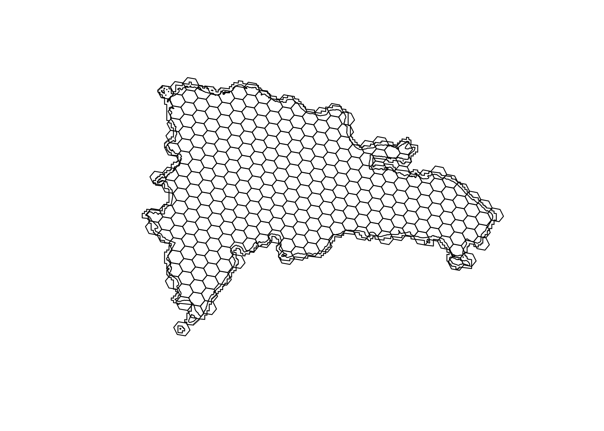

Práctica 2. Descargar y visualizar datos de GBIF con R y QGIS
================
José Ramón Martínez Batlle
11-10-2022

# Fecha de entrega

- 28 de octubre de 2022

# Introducción

GBIF, o “Infraestructura Mundial de Información en Biodiversidad”, es
una organización que proporciona datos de seres vivos abiertamente a
cualquier persona (GBIF.org, 2022b). En octubre de 2022, la base de
datos disponía de más de 2000 millones de registros biológicos, más de
76000 conjuntos de datos, casi 2000 instituciones publicaban datos en
ella y se había publicado casi 8000 artículos científicos.
Indiscutiblemente, GBIF es una fuente a considerar en estudios de
biodiversidad. Te propongo que en, esta asignación, aprendas formas
básicas de acceder a este importante recurso.

# Objetivos de aprendizaje

Al terminar esta práctica deberías ser capaz de:

- Descargar registros de presencia desde GBIF usando R, generar un
  índice espacial, desplegar registros en mapas y construir una matriz
  de comunidad.

- Desplegar registros e índice espacial en QGIS.

- Citar apropiadamente los datos de GBIF.

# Informe

Entregarás tu informe en formato PDF, el cual podrás elaborar con tu
procesador de texto favorito (por ejemplo, LibreOffice Writer, LaTeX,
Word) o mediante entornos de desarrollo integrado (e.g. Atom, Visual
Studio Code, Jupyter Notebooks, RMarkdown-RStudio). Características del
documento:

- Número máximo de páginas: 10.

- En la primera página, deberás incluir nombre, matrícula, asignatura,
  nombre de la práctica, fecha.

- Para evitar la proliferación de tipografías y formatos, debes usar
  estilos, para lo cual te recomiendo utilizar plantillas. Hay muchos
  recursos en la web sobre cómo usar estilos (término de búsqueda
  recomendado: estilos en procesadores de texto).

- Debes incluir tu código informático en las respuestas de los
  ejercicios donde uses lenguajes de programación (e.g. R). El código
  debe ser incluido como texto, no como imagen.

- Realiza doble revisión de ortografía y gramática.

- Las páginas deben estar numeradas secuencialmente.

- Si aplica, incluir ilustraciones y tablas de apoyo (a ambas debes
  incluirles título, “*caption*”), así como lista de referencias
  bibliográficas.

- Puedes usar un apéndice para incluir información complementaria que no
  te quepa en las 10 páginas centrales.

- Podré solicitar los archivos fuente empleados para elaborar el PDF y
  los resultados intermedios generados en cada ejercicio.

# Criterios de evaluación

| Concepto                                                                                                                    | Porcentaje |
|:----------------------------------------------------------------------------------------------------------------------------|:-----------|
| Redacción, que incluye organización de las ideas, gramática, ortografía                                                     | 60%        |
| Presentación, que incluye uso apropiado de estilos, tablas y figuras (legibilidad, uso de *caption*), numeración de páginas | 40%        |

# ¿Qué necesitarás?

- Conexión a internet.

- Una PC con R. Tendrás que instalar, si no los tienes aún, los paquetes
  que verás en la subsección “Paquetes” a continuación.

- Archivo `rd.gpkg`, que debes descargar desde la [carpeta `data`,
  subcarpeta `d002` del repo de material de
  apoyo](https://github.com/biogeografia-202202/material-de-apoyo/tree/master/data/d002).
  IMPORTANTE: toma nota de la ruta en tu PC donde guardes este archivo,
  porque más adelante la necesitarás.

- Cuenta en GBIF.

- Cuenta en Zenodo (recomendado).

# Ejercicios

## Ejercicio 1. Descargar registros de presencia desde GBIF usando R, generar un índice espacial, desplegar registros en mapas y construir una matriz de comunidad.

Necesitarás cargar paquetes primero (esto lo hace la función
`library(PAQUETE)`) y luego descargar los datos. Si al cargar un paquete
apareciera un error
`Error in library(PAQUETE) : there is no package called ‘PAQUETE’`,
deberás entonces instalarlo mediante el menú `Tools>Install packages`.

### Paquetes

``` r
library(kableExtra)
library(rgbif)
library(terra)
library(geodata)
library(sf)
library(h3jsr)
library(tidyverse)
library(units)
library(devtools)
library(CoordinateCleaner)
library(countrycode)
library(vegan)
options(stringsAsFactors = FALSE)
source_url('https://raw.githubusercontent.com/biogeografia-202202/material-de-apoyo/master/practicas/funciones.R')
```

### Descargar registros de GBIF

El siguiente bloque descarga tus datos desde GBIF con la función
`occ_data` (está en proceso de retiro, pero todavía funciona y permite
descargas anónimas sin inconveniente). En el argumento `scientificName`
sustituye `Polygonaceae` por tu grupo de organismos elegido. Comprueba
que está bien escrito, y realiza una verificación cruzada, comparando
los registros obtenidos por medio de R con los que devuelve la API web
de GBIF.

``` r
reg_pres <- occ_data(scientificName = 'Polygonaceae',
                   hasCoordinate = T,
                   country = 'DO',
                   limit = 100000)$data
# Imprime en pantalla el número de registros:
nrow(reg_pres)
```

    ## [1] 782

Existe un camino alterno a lo anterior (importante: no uses las dos
alternativas, elige sólo una), haciendo tu búsqueda directamente en la
API web de GBIF, creando una *dataset*, y descargándolo con el código
que te muestro en el siguiente bloque. Esta alternativa es rápida y
cómoda, pero no te la recomiendo si, como verás a continuación,
limpiaras tus datos. Por ejemplo, luego de descargar y revisar el
*dataset*, podrías necesitar aplicar limpieza de coordenadas, quitar
registros en los que la localidad es la de la colección y no el sitio de
colecta, o quitar registros que caen en el mar. Si haces esto, tu
*dataset* no será el mismo que creaste mediante descarga en la API web
de GBIF, y no deberías citarlo como tal, sino más bien citar un
*dataset* derivado (te lo explico en el siguiente ejercicio). En
cualquier caso, sólo para que veas cómo se hace, si creas una descarga
en la API web de GBIF, y obtienes su identificador (la última parte de
la URL de descarga, por ejemplo, destacado en negrita,
“gbif.org/occurrence/download/**0069667-220831081235567**”, lo
descargarías a R simplemente usando la función `occ_download_get`.

``` r
reg_pres <- occ_download_get('0069667-220831081235567') %>% 
  occ_download_import()
```

Es buena idea quitar registros de presencia situados en colecciones o en
su entorno, porque podrían sesgar tu muestra. No obstante, si tu muestra
se reduce significativamente tras quitarlos (atención a los mensajes
`Remove ## records`), entonces restablece el objeto `reg_pres`
reejecutando el bloque de código anterior. En este ejemplo, no quitaré
registros, porque mi número de registros es relativamente pequeño (en
este punto, 782 registros) y porque prefiero controlar cómo quitarlos
(por ejemplo, intersectando por el límite del país), pero si en tu caso
tienes muchos, entonces quizá es buena idea usar el siguiente bloque.

``` r
reg_pres <- reg_pres %>% 
  # Quitar registros en centroides de país y sus proximidades
  cc_cen(lon = 'decimalLongitude', lat = 'decimalLatitude', buffer = 2000) %>%
  # Quitar registros en colecciones y sus proximidades
  cc_inst(lon = 'decimalLongitude', lat = 'decimalLatitude', buffer = 2000) %>%
  # Quitar registros en mar/oceáno
  cc_sea(lon = 'decimalLongitude', lat = 'decimalLatitude')
# Imprime en pantalla el número de registros:
nrow(reg_pres)
```

Realiza una tabla de frecuencias y un conteo básico de especies:

``` r
table(reg_pres$species) %>% kable(col.names = c('Especie', 'N'), format="markdown")
```

| Especie                    |   N |
|:---------------------------|----:|
| Antigonon leptopus         |  35 |
| Brunnichia ovata           |   1 |
| Coccoloba buchii           |  14 |
| Coccoloba ceibensis        |  13 |
| Coccoloba costata          |  34 |
| Coccoloba diversifolia     |  57 |
| Coccoloba fawcettii        |   1 |
| Coccoloba flavescens       |  12 |
| Coccoloba fuertesii        |  13 |
| Coccoloba incrassata       |  22 |
| Coccoloba jimenezii        |   6 |
| Coccoloba krugii           |   8 |
| Coccoloba leoganensis      |  19 |
| Coccoloba leonardii        |   5 |
| Coccoloba microstachya     |   5 |
| Coccoloba nodosa           |  27 |
| Coccoloba pauciflora       |  15 |
| Coccoloba picardae         |  15 |
| Coccoloba pubescens        |  25 |
| Coccoloba samanensis       |   2 |
| Coccoloba subcordata       |   2 |
| Coccoloba swartzii         |   4 |
| Coccoloba uvifera          | 261 |
| Coccoloba venosa           |   3 |
| Coccoloba wrightii         |  44 |
| Leptogonum domingense      |  17 |
| Leptogonum domingensis     |  27 |
| Persicaria acuminata       |   5 |
| Persicaria ferruginea      |   2 |
| Persicaria glabra          |   3 |
| Persicaria hydropiperoides |   9 |
| Persicaria lapathifolia    |   1 |
| Persicaria pensylvanica    |   1 |
| Persicaria punctata        |  15 |
| Persicaria segetum         |   1 |
| Polygonum punctatum        |   5 |
| Rumex acetosella           |   4 |
| Rumex crispus              |  14 |
| Rumex obtusifolius         |   3 |

``` r
length(unique(reg_pres$acceptedScientificName))
```

    ## [1] 44

### Carga la capa geográfica de RD

Necesitarás el límite del país en un formato vectorial que R pueda leer.
En este caso, cuentas con un archivo GeoPackage nombrado `rd.gpkg`.
Descárgalo desde GitHub, ruta
[`data/d002/rd.gpkg`](https://github.com/biogeografia-202202/material-de-apoyo/tree/master/data/d002).

::: {#hello .greeting .message style=“color: red;”} IMPORTANTE: controla
el lugar donde descargas tu archivo `rd.gpkg`, y usa dicha ruta en la
sentencia `st_read`. La ruta donde lo guardes seguramente no coincidirá
con la ruta que verás dentro de la función `st_read`. :::

``` r
rd <- st_read('../data/d002/rd.gpkg', layer = 'pais')
```

    ## Reading layer `pais' from data source 
    ##   `/home/jose/Documentos/clases_UASD/202202/geo131_biogeografia/material-de-apoyo/data/d002/rd.gpkg' 
    ##   using driver `GPKG'
    ## Simple feature collection with 1 feature and 0 fields
    ## Geometry type: MULTIPOLYGON
    ## Dimension:     XY
    ## Bounding box:  xmin: -72.01147 ymin: 17.47033 xmax: -68.32354 ymax: 19.93211
    ## Geodetic CRS:  WGS 84

``` r
# Otras capas disponibles: regiones, provincias, municipios
plot(rd)
# Necesitarás un área buffer extra para que los hexágonos cubran todo el país
rd_extra <- st_buffer(rd, dist = set_units(2, km))
plot(rd)
plot(rd_extra, add = T)
```


### Celdas H3

Ahora usarás el paquete `h3jsr` para crear un índice espacial basado en
hexágonos del estándar H3. Te recomiendo que elijas un tamaño de
hexágono apropiado, siempre evitando colapsar la PC. El tamaño de
hexágono es inversamente proporcional a la resolución H3 (argumento
`res`) y, por lo tanto, a mayor resolución, mayor número de hexágonos.
Si usas `res` mayor que 7, podrías estar demandando muchos recursos de
memoria RAM y CPU. Además, resoluciones mayores a 6 no son útiles para
el trabajo que realizarás en esta práctica.

Elige un tamaño que se adapte bien a tus registros de presencia. Una
clave es lograr un índice espacial en el que una cantidad considerable
de los hexágonos (por ejemplo, el 30%) tenga al menos un registro.

``` r
resolucion <- 5 # RECOMENDADO: menor o igual a 6
ind_esp <- polygon_to_cells(rd_extra, res = resolucion, simple = FALSE)
ind_esp <- cell_to_polygon(unlist(ind_esp$h3_addresses), simple = FALSE)
plot(rd_extra)
plot(as_Spatial(ind_esp), add = T)
plot(rd, add=T)
```



Obtén ahora dos cuestiones básicas de los hexágonos:

- Imprime en pantalla el número de hexágonos.

``` r
nrow(ind_esp)
```

    ## [1] 291

- Obtén sus centroides, para luego facilitar la colocación de etiquetas.

``` r
ind_esp_centroides <- ind_esp %>%
  st_centroid() %>%
  mutate(lon = unlist(map(geometry, 1)), lat = unlist(map(geometry, 2)))
```

    ## Warning in st_centroid.sf(.): st_centroid assumes attributes are constant over
    ## geometries of x

Una representación muy básica, sin simbología:

``` r
plot(as_Spatial(ind_esp))
plot(as_Spatial(ind_esp_centroides), add=T, cex = 0.2)
```


### Registros de presencia intersectados con celdas H3

A partir de los registros de presencia, necesitarás crear un objeto
espacial, para lo cual te auxiliarás de la función `st_as_sf` del
paquete `sf`.

``` r
reg_pres_sf <- st_as_sf(
  x = reg_pres,
  coords = c("decimalLongitude", "decimalLatitude"),
  crs = 4326)
```

Una representación muy básica, sin simbología:

``` r
plot(rd)
plot(as_Spatial(ind_esp), add=T)
plot(as_Spatial(reg_pres_sf), pch=16, col='green', add=T)
```


Intersecta tus registros de presencia con tu índice espacial, de manera
que excluyas posibles registros con coordenadas erróneas.

``` r
reg_pres_sf_ok <- reg_pres_sf %>%
  st_intersection(st_union(ind_esp))
```

    ## Warning: attribute variables are assumed to be spatially constant throughout all
    ## geometries

``` r
reg_pres_sf_ok
```

    ## Simple feature collection with 741 features and 140 fields
    ## Geometry type: POINT
    ## Dimension:     XY
    ## Bounding box:  xmin: -71.7833 ymin: 17.6083 xmax: -68.36389 ymax: 19.90406
    ## Geodetic CRS:  WGS 84
    ## # A tibble: 741 × 141
    ##    key        scientificName  issues datasetKey publishingOrgKey installationKey
    ##  * <chr>      <chr>           <chr>  <chr>      <chr>            <chr>          
    ##  1 3456145174 Coccoloba uvif… "cdro… 50c9509d-… 28eb1a3f-1c15-4… 997448a8-f762-…
    ##  2 3456792675 Coccoloba uvif… "cdro… 50c9509d-… 28eb1a3f-1c15-4… 997448a8-f762-…
    ##  3 3466541063 Coccoloba uvif… "cdro… 50c9509d-… 28eb1a3f-1c15-4… 997448a8-f762-…
    ##  4 3466380155 Coccoloba uvif… "cdro… 50c9509d-… 28eb1a3f-1c15-4… 997448a8-f762-…
    ##  5 3499495279 Coccoloba uvif… "cdro… 50c9509d-… 28eb1a3f-1c15-4… 997448a8-f762-…
    ##  6 3499565621 Antigonon lept… ""     50c9509d-… 28eb1a3f-1c15-4… 997448a8-f762-…
    ##  7 3499610779 Coccoloba uvif… "cdro… 50c9509d-… 28eb1a3f-1c15-4… 997448a8-f762-…
    ##  8 3892329389 Coccoloba uvif… "cdro… 50c9509d-… 28eb1a3f-1c15-4… 997448a8-f762-…
    ##  9 3925445445 Coccoloba uvif… "cdro… 50c9509d-… 28eb1a3f-1c15-4… 997448a8-f762-…
    ## 10 3784721445 Coccoloba uvif… "cdro… 50c9509d-… 28eb1a3f-1c15-4… 997448a8-f762-…
    ## # … with 731 more rows, and 135 more variables: publishingCountry <chr>,
    ## #   protocol <chr>, lastCrawled <chr>, lastParsed <chr>, crawlId <int>,
    ## #   hostingOrganizationKey <chr>, basisOfRecord <chr>, occurrenceStatus <chr>,
    ## #   taxonKey <int>, kingdomKey <int>, phylumKey <int>, classKey <int>,
    ## #   orderKey <int>, familyKey <int>, genusKey <int>, speciesKey <int>,
    ## #   acceptedTaxonKey <int>, acceptedScientificName <chr>, kingdom <chr>,
    ## #   phylum <chr>, order <chr>, family <chr>, genus <chr>, species <chr>, …

Una representación muy básica, sin simbología:

``` r
plot(rd)
plot(as_Spatial(ind_esp), add=T)
plot(as_Spatial(reg_pres_sf_ok), pch=16, col='green', add=T)
```


### Representación con `ggplot2`

Los mapas anteriores simplemente representaban las geometrías, pero
puedes hacer uno estilizado usando el paquete `ggplot2`.

``` r
ggplot(data = rd) + # RD es la base, superpondremos capas
  geom_sf(fill = 'antiquewhite1') + # La geometría base ya está colocada
  geom_sf(data = ind_esp, fill = 'transparent') + # Esto añade el índice espacial estilizado
  geom_text(data = ind_esp_centroides, aes(lon, lat, label = h3_address), size = 1) + # Etiquetas H3
  geom_sf(data = reg_pres_sf_ok, size = 1, fill = 'green', color = 'green', alpha = 0.5) + # Registros GBIF
  theme(legend.position = "none") +
  theme_bw()
```


### Exportar archivos para visualizar en QGIS

Con la función `st_write` del paquete `sf`, exporta los objetos
espaciales a archivos de formato GeoPackage para visualizarlos en QGIS
más tarde. No necesitarás exportar el límite del país, porque ya lo
tienes en formato GeoPackage; sólo debes exportar los que has generado
en R:

1.  `reg_pres_sf_ok`, objeto espacial que contiene los registros
    depurados de presencia.

2.  `ind_esp`, objeto que contiene el índice espacial mediante
    hexágonos.

``` r
st_write(reg_pres_sf_ok %>% select(-networkKeys), 'registros_depurados_de_presencia.gpkg', delete_dsn = T)
st_write(ind_esp, 'indice_espacial.gpkg', delete_dsn = T)
```

Nota: verifica que los archivos se guardaron correctamente. Dado que no
se especificó un directorio diferente, la ruta donde se guardarán será
la misma donde se está ejecutando la sesión de R, la cual puedes
consultar ejecutando `getwd()` en la consola interactiva.

### Exportar archivos a formato R

Como forma de garantizar la reproducibilidad de tu script, guarda los
objetos referidos en el punto anterior a archivos de formato R.

``` r
saveRDS(object = reg_pres_sf_ok, file = 'registros_depurados_de_presencia.RDS')
saveRDS(ind_esp, 'indice_espacial.RDS')
```

### Matriz de comunidad

Finalmente, construye una matriz de comunidad.

``` r
mc <- reg_pres_sf_ok %>%
  st_join(ind_esp) %>% 
  select(acceptedScientificName, h3_address) %>% 
  st_drop_geometry() %>% 
  mutate(n = 1) %>% 
  distinct() %>% #Matriz de presencia/ausencia
  # group_by(h3_address, acceptedScientificName) %>%  summarise(n = sum(n)) %>% #Matriz con número de registros
  pivot_wider(names_from = acceptedScientificName, values_from = n, values_fill = 0) %>% 
  column_to_rownames('h3_address')
# Extracto de la matriz
set.seed(999)
mc[sample(seq_len(nrow(mc)), 10), sample(seq_len(ncol(mc)), ifelse(ncol(mc)<3, ncol(mc), 3))] %>%
  kable(format="markdown")
```

|                 | Coccoloba pauciflora Urb. | Coccoloba diversifolia Jacq. | Persicaria punctata (Elliott) Small |
|:----------------|--------------------------:|-----------------------------:|------------------------------------:|
| 854cc65bfffffff |                         0 |                            0 |                                   0 |
| 854c899bfffffff |                         0 |                            1 |                                   0 |
| 854cd44ffffffff |                         0 |                            0 |                                   0 |
| 854cc60ffffffff |                         0 |                            0 |                                   0 |
| 854cd4a7fffffff |                         0 |                            1 |                                   0 |
| 854cd083fffffff |                         0 |                            0 |                                   0 |
| 854c8927fffffff |                         0 |                            0 |                                   1 |
| 856725bbfffffff |                         0 |                            0 |                                   0 |
| 854cd453fffffff |                         1 |                            0 |                                   0 |
| 854cd42bfffffff |                         0 |                            0 |                                   0 |

Exporta tu matriz de comunidad a un archivo de R, para usarla en
análisis posteriores.

``` r
saveRDS(object = mc, file = 'matriz_de_comunidad.RDS')
```

A partir de este punto, puedes responder a las siguientes preguntas:

- Imprime en pantalla tu lista de especies en orden alfabético:

``` r
sort(colnames(mc)) %>% kable(col.names = 'Especie', format="markdown")
```

| Especie                                            |
|:---------------------------------------------------|
| Antigonon leptopus Hook. & Arn.                    |
| Brunnichia ovata (Walter) Shinners                 |
| Coccoloba buchii O.Schmidt                         |
| Coccoloba ceibensis O.C.Schmidt                    |
| Coccoloba costata Wright                           |
| Coccoloba diversifolia Jacq.                       |
| Coccoloba fawcettii O.Schmidt                      |
| Coccoloba flavescens Jacq.                         |
| Coccoloba fuertesii Urb.                           |
| Coccoloba incrassata Urb.                          |
| Coccoloba jimenezii Alain                          |
| Coccoloba krugii Lindau                            |
| Coccoloba leoganensis Jacq.                        |
| Coccoloba leonardii Howard                         |
| Coccoloba microstachya Willd.                      |
| Coccoloba nodosa Lindau                            |
| Coccoloba P.Browne                                 |
| Coccoloba pauciflora Urb.                          |
| Coccoloba picardae Urb.                            |
| Coccoloba pubescens L.                             |
| Coccoloba samanensis O.C.Schmidt                   |
| Coccoloba subcordata Lindau                        |
| Coccoloba swartzii Meisn.                          |
| Coccoloba uvifera (L.) L.                          |
| Coccoloba venosa L.                                |
| Coccoloba wrightii Lindau                          |
| Leptogonum domingense Benth.                       |
| Leptogonum domingensis Benth.                      |
| Leptogonum domingensis var. molle (Urb.) Brandbyge |
| Persicaria acuminata (Kunth) M.Gómez               |
| Persicaria ferruginea (Wedd.) Soják                |
| Persicaria glabra (Willd.) M.Gómez                 |
| Persicaria hydropiperoides (Michx.) Small          |
| Persicaria lapathifolia subsp. lapathifolia        |
| Persicaria pensylvanica (L.) M.Gómez               |
| Persicaria punctata (Elliott) Small                |
| Persicaria segetum (Kunth) Small                   |
| Polygonum L.                                       |
| Polygonum punctatum Kit., 1864                     |
| Rumex acetosella L.                                |
| Rumex crispus L.                                   |
| Rumex L.                                           |
| Rumex obtusifolius L.                              |
| Ruprechtia C.A.Mey.                                |

- Número de sitios en la matriz:

``` r
nrow(mc)
```

    ## [1] 149

- Riqueza numérica de especies (usando matriz de comunidad) por
  hexágonos (extractos):

``` r
num_esp <- specnumber(mc)
num_esp_l <- length(num_esp)
set.seed(999)
num_esp_muestra <- if(num_esp_l > 10) sample(seq_len(num_esp_l), 10) else seq_len(num_esp_l)
specnumber(mc)[num_esp_muestra] %>% 
  as.data.frame() %>% 
  rownames_to_column() %>% 
  kable(col.names = c('Hexágono', 'S'), format="markdown")
```

| Hexágono        |   S |
|:----------------|----:|
| 854cd653fffffff |   1 |
| 854cd5c3fffffff |   4 |
| 854cf263fffffff |   1 |
| 854cc65bfffffff |   1 |
| 854c899bfffffff |   1 |
| 854cd44ffffffff |   2 |
| 854cc60ffffffff |   1 |
| 854cd4a7fffffff |   5 |
| 854cd083fffffff |   2 |
| 854c8927fffffff |   4 |

``` r
#sort(specnumber(mc)) # Ordenados ascendentemente
summary(specnumber(mc)) # Resumen estadístico
```

    ##    Min. 1st Qu.  Median    Mean 3rd Qu.    Max. 
    ##   1.000   1.000   2.000   2.356   3.000  11.000

- Riqueza numérica de toda la “comunidad”:

``` r
specnumber(colSums(mc))
```

    ## [1] 44

- Gráfico de mosaicos de la presencia de especie por hexágonos:

``` r
pres_aus_sp <- crear_grafico_mosaico_de_mc(mc, tam_rotulo = 4)
pres_aus_sp
```


### A título informativo: diseños anidados

La biblioteca H3 te ofrece herramientas para trabajar con diseños
anidados. Puedes recuperar las celdas “hijas” de cualquier celda “madre”
con pocas líneas de código.

Un ejemplo usando una muestra:

``` r
set.seed(100)
muestra <- sample(seq_len(nrow(ind_esp)), 1)
dir_muestra <- ind_esp[muestra, 'h3_address', drop=T]
hijas_muestra <- get_children(h3_address = dir_muestra, res = resolucion + 1)
hijas_muestra_sf <- cell_to_polygon(hijas_muestra)
ggplot(hijas_muestra_sf) +
  geom_sf() +
  geom_sf(data = ind_esp[muestra,], fill = NA) +
  theme(legend.position = "none") +
  theme_bw()
```


Para toda República Dominicana:

``` r
dir_rd <- ind_esp[, 'h3_address', drop=T]
hijas_rd <- get_children(h3_address = dir_rd, res = resolucion + 1)
hijas_rd_sf <- cell_to_polygon(hijas_rd)
ggplot(hijas_rd_sf) +
  geom_sf() +
  geom_sf(data = ind_esp, fill = NA, color = 'red', lwd = 0.2) +
  theme(legend.position = "none") +
  theme_bw()
```


## Ejercicio 2. Desplegar registros e índice espacial en QGIS

Ver demo en vídeo.

## Ejercicio 3. Citar apropiadamente los datos de GBIF

Existen varias manera de citar correctamente las fuentes en GBIF; te
presento dos a continuación, para que elijas la que prefieras:

1.  Usando el *dataset* derivado en R.

2.  Citar usando la interfaz web de GBIF ([gbif.org](https://gbif.org)).

Voy a explicarte sólamente cómo citar usando el *dataset* derivado en R.
Primero es necesario crear una tabla con la que informar a GBIF qué
fuentes se encuentran disponibles en la consulta que hiciste. En mi
caso, busqué todas las Polygonaceae de RD que tuviesen coordenadas. GBIF
consultó en su base de datos, y encontró varios registros de presencia
pertenecientes a varios conjuntos.

``` r
conteos_conjunto <- reg_pres_sf_ok %>% count(datasetKey, sort=TRUE) 
write.table(x = conteos_conjunto %>% st_drop_geometry(), file = "conteos_por_conjuntos_de_datos.txt",
            col.names=FALSE, row.names=FALSE, sep=",")
```

El archivo `conteos_por_conjuntos_de_datos.txt` lo necesitarás para
crear un registro persistente en GBIF, por lo que debes controlar dónde
lo guardas en tu PC. La ruta `~/` significa “carpeta de usuario”, por
ejemplo `C:\Users\miusuario`. Ve a [esta
ruta](https://www.gbif.org/derived-dataset/register) (necesitarás cuenta
en GBIF). En el campo *Title* escribe un nombre que describa el conjunto
de datos, por ejemplo, yo usé `Polygonaceae de RD hasta octubre 2022`.
En el campo `URL of where derived dataset can be accessed` deberías
colocar un repositorio persistente (por ejemplo, creado en Zenodo),
donde alojes el conjunto de datos. De momento, escribe
`https://gbif.org`, pero es importante que luego cambies dicha ruta por
un DOI de Zenodo. En
`Attach CSV file with dataset keys and occurrence counts`, presiona
`Choose File` y sube el archivo `conteos_por_conjuntos_de_datos.txt`.

Finalmente, descarga el BibTeX desde GBIF. Si lo alojas en Zotero, antes
de usar la entrada como cita, asegúrate de editar en Zotero el campo
`Autor` para que ponga “GBIF.org”, y en el campo `Fecha` coloca el año
de descarga. Por ejemplo, la cita de los datos derivados usados en este
script de ejemplo es esta (GBIF.org, 2022a); verifica que en la lista de
Referencias se construyó apropiadamente, con el campo `Autor` y `Fecha`
tal como los definiste manualmente.

# Referencias

<div id="refs" class="references csl-bib-body hanging-indent"
line-spacing="2">

<div id="ref-gbiforg2022polygonaceae" class="csl-entry">

GBIF.org. (2022a). *Polygonaceae de RD (hasta octubre 2022)*.
<https://doi.org/10.15468/DD.7DGUSG>

</div>

<div id="ref-gbiforg2022what" class="csl-entry">

GBIF.org. (2022b). *What is GBIF?* Retrieved from
<https://www.gbif.org/what-is-gbif>

</div>

</div>
