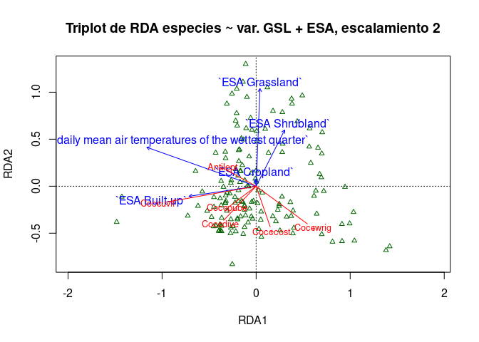

Práctica 99. Resultados de tu manuscrito.
================
José Ramón Martínez Batlle
26-11-2022

# ¿Qué contiene la sección “Resultados”?

Te recomiendo releer las normas para autores/as del [Anuario de
Investigaciones Científicas de la
UASD](../docs/instrucciones-para-autores-anuario-investigaciones-cientificas-UASD.pdf)
y adherirte a las especificaciones sobre la sección “Resultados” que
allí se indican. Aunque en las referidas normas no se incluyen muchas
pautas significativas, si escribieras para una revista específica,
deberás considerar sus normas y recomendaciones de publicación. Además,
te recomiendo que consultes la sección “Resultados” de algunos
manuscritos publicados en el Anuario.

En los resultados expones el contenido analítico central. Es “el qué”
del manuscrito, en complemento de “el cómo” (metodología) y “el por qué”
(introducción) de tu investigación. En los resultados muestras lo que
encontraste luego de que colectaste (aunque en este caso, no fuiste al
terreno) y analizaste, con tus métodos, los datos fuente.

Algunas recomendaciones generales:

- “Resultados” se supone que es la sección más corta del manuscrito,
  siempre que se usen apropiadamente los recursos gráficos, las tablas y
  la información suplementaria.

- Comienza por realizar tus análisis. Necesitarás una matriz de
  comunidad y una ambiental. La de comunidad la habrás generado en la
  práctica 2; la ambiental explico cómo generarla en este mismo cuaderno
  (ver abajo). En general, la matriz ambiental la producirás mediante
  estadísticos zonales del territorio dominicano. Para aprender más
  sobre la fuente de estadística zonal de República Dominicana, que
  contiene un conjunto de más de 100 variables resumidas por celdas H3,
  visita [este repo](https://github.com/geofis/zonal-statistics). Debes
  visitar dicho repo para poder citarlo apropiadamente.

- Cuando tengas análisis realizados, antes de comenzar a escribir, te
  recomiendo que escribas un guión de tu sección “Resultados”.

- Guión en mano, redacta tu sección “Resultados”, siguiendo también
  estos consejos:

- En esta sección, se espera que presentes lo que has obtenido de manera
  “objetiva”, evitando explicaciones, comentarios, opiniones,
  perspectivas o limitaciones. En teoría, tu redacción es “fría”, lo
  cual no necesariamente significa que tenga que ser aburrida.

- Esta es la sección por excelencia donde usarás *tablas y/o gráficos*.
  Lo más importante a tener en cuenta cuando los uses es que no debes
  duplicar el contenido que muestran dichos recursos en el texto. La
  tabla o gráfico son apoyos que te ayudarán a no entrar en densidades
  innecesarias dentro de los párrafos. Por lo tanto, si colocas una
  tabla o figura, no caigas en la tentación de describirla en párrafos
  de forma exhausitva. Estos recursos deben servir para apoyar el o los
  párrafos donde destacas los principales patrones encontrados.

- *Importante también*: si insertas una tabla o gráfico, debes referirla
  en el texto (e.g. “ver figura X”). De nada sirve incluir una figura o
  una tabla si no la refieres, porque con ello estarás sugiriendo que
  dicho recurso era completamente prescindible.

- El tiempo verbal preferido (por defecto) es el pasado, por ejemplo “…,
  donde se **encontró** una asociación significativa entre … y …”. Sin
  embargo, hay excepciones, como por ejemplo, cuando te refieres a una
  tabla o una figura. Un caso típico es la expresión “tal como se
  muestra en la tabla 1”, donde el verbo está conjugado en presente.

A continuación, te pongo enlaces a referencias que considero útiles,
sobre cómo redactar los resultados (algunas son generales, sobre
artículos en general):

- [Breves pautas, en
  inglés](https://www.editage.com/insights/the-secret-to-writing-the-results-and-discussion-section-of-a-manuscript).
  Puedes usar el traductor [DeepL](https://www.deepl.com/translator),
  porque produce frases más naturales.

Cinco guías, en inglés, que considero están bien elaboradas, sobre cómo
redactar un artículo científico (consulta la sección sobre cómo redactar
los *resultados* en cada una):

- [Demystifying the Journal
  Article](https://www.insidehighered.com/advice/2017/05/09/how-write-effective-journal-article-and-get-it-published-essay)

- [How to write a scientific manuscript for
  publication](https://www.ncbi.nlm.nih.gov/pmc/articles/PMC3626472/)

- [11 steps to structuring a science paper editors will take
  seriously](https://www.elsevier.com/connect/11-steps-to-structuring-a-science-paper-editors-will-take-seriously)

- [Cómo escribir un artículo científico por primera
  vez](https://www.sciencedirect.com/science/article/abs/pii/S1134593417300040)
  (necesitarás usar [SciHub](https://sci-hub.se/) para descargarlo)

- Una muy breve pero con consejos útiles: [Tips for writing the perfect
  IMRAD
  manuscript](https://www.editage.com/insights/tips-for-writing-the-perfect-imrad-manuscript)

# Scripts de ejemplo

## Análisis de agrupamiento

## 

## Técnicas de ordenación

Me basaré en los scripts que comienzan por `to_` de este
[repo](https://github.com/biogeografia-master/scripts-de-analisis-BCI),
los cuales explico en los vídeos de “Técnicas de ordenación” de la lista
de reproducción [“Ecología Numérica con R” de mi
canal](https://www.youtube.com/playlist?list=PLDcT2n8UzsCRDqjqSeqHI1wsiNOqpYmsJ).

### Ordenación restringida

Fijar un directorio de trabajo no es recomendable, mejor trabaja por
proyecto. En cualquier caso, si no quieres o no puedes crear un
proyecto, usa la sentencia que verás abajo, cambiando `TU_DIRECTORIO`
por la ruta del directorio donde tengas almacenados tus datos y tus
scripts.

``` r
# setwd('TU_DIRECTORIO')
```

Cargar paquetes.

``` r
library(vegan)
```

    ## Loading required package: permute

    ## Loading required package: lattice

    ## This is vegan 2.5-7

``` r
library(sf)
```

    ## Linking to GEOS 3.10.2, GDAL 3.4.3, PROJ 8.2.0; sf_use_s2() is TRUE

``` r
library(tidyverse)
```

    ## ── Attaching packages ─────────────────────────────────────── tidyverse 1.3.1 ──

    ## ✔ ggplot2 3.3.5      ✔ purrr   0.3.4 
    ## ✔ tibble  3.1.7      ✔ dplyr   1.0.10
    ## ✔ tidyr   1.2.1      ✔ stringr 1.4.0 
    ## ✔ readr   2.1.3      ✔ forcats 0.5.1

    ## ── Conflicts ────────────────────────────────────────── tidyverse_conflicts() ──
    ## ✖ dplyr::filter() masks stats::filter()
    ## ✖ dplyr::lag()    masks stats::lag()

``` r
gh_content <- 'https://raw.githubusercontent.com/'
gh_zonal_stats <- 'https://github.com/geofis/zonal-statistics/raw/main/out/'
repo_analisis <- 'biogeografia-master/scripts-de-analisis-BCI/master'
devtools::source_url(paste0(gh_content, repo_analisis, '/biodata/funciones.R'))
```

    ## ℹ SHA-1 hash of file is b0dc507338fe6a7d927760b5a7a06b2612b753c7

``` r
source('train.R')
```

Carga tu matriz de comunidad, que habrás generado en la práctica 2.

``` r
mc_orig <- readRDS("matriz_de_comunidad.RDS")
umbral_raras <- 15
mi_fam <- mc_orig[, -which(colSums(mc_orig) <= umbral_raras)]
nombres_largos <- colnames(mi_fam)
(colnames(mi_fam) <- make.cepnames(word(colnames(mi_fam), 1, 2)))
```

    ## [1] "Coccuvif" "Antilept" "Coccdive" "Cocccost" "Coccwrig"

``` r
(df_equivalencias <- data.frame(
  nombre_original = nombres_largos,
  colnames(mi_fam)))
```

    ##                   nombre_original colnames.mi_fam.
    ## 1       Coccoloba uvifera (L.) L.         Coccuvif
    ## 2 Antigonon leptopus Hook. & Arn.         Antilept
    ## 3    Coccoloba diversifolia Jacq.         Coccdive
    ## 4        Coccoloba costata Wright         Cocccost
    ## 5       Coccoloba wrightii Lindau         Coccwrig

Transforma la matriz de comunidad. Este paso es importante, lo explico
[aquí](https://www.youtube.com/watch?v=yQ10lp0-nHc&list=PLDcT2n8UzsCRDqjqSeqHI1wsiNOqpYmsJ&index=10)

``` r
mi_fam_t <- decostand(mi_fam, 'hellinger') #Hellinger
# Otras transformaciones posibles con datos de presencia/ausencia
# mi_fam_t <- decostand(mi_fam, 'normalize') #Chord
# mi_fam_t <- decostand(log1p(mi_fam), 'normalize') #Chord
# mi_fam_t <- decostand(mi_fam, 'chi.square') #Chi-square
```

Genera la matriz ambiental a partir del archivo de estadística zonal por
celdas H3 de República Dominicana, de acuerdo con la resolución que
prefieras. Para el ejemplo, usé la resolución 5, pero puedes usar/probar
con otra, para lo cual, sólo tendrías que cambiar el objeto `res <- X`,
donde `X` puede ser un número cualquiera entre 4 y 7.

Para aprender más sobre la fuente de estadística zonal de República
Dominicana, que contiene un conjunto de más de 100 variables resumidas
por celdas H3, visita [este
repo](https://github.com/geofis/zonal-statistics). Debes visitar dicho
repo para poder citarlo apropiadamente.

``` r
#Matriz ambiental
res <- 5 #Resolución H3
tmpfile <- tempfile()
download.file(paste0(gh_zonal_stats, 'all_sources_all_variables_res_', res, '.gpkg'), tmpfile)
za <- st_read(tmpfile, optional = T)
```

    ## Warning in CPL_read_ogr(dsn, layer, query, as.character(options), quiet, : GDAL
    ## Message 1: File /tmp/RtmpHC47DO/file30fb314fd55be has GPKG application_id, but
    ## non conformant file extension

    ## Reading layer `all_sources_all_variables_res_5' from data source 
    ##   `/tmp/RtmpHC47DO/file30fb314fd55be' using driver `GPKG'
    ## Simple feature collection with 335 features and 142 fields
    ## Geometry type: POLYGON
    ## Dimension:     XY
    ## Bounding box:  xmin: -72.13564 ymin: 17.40413 xmax: -68.20998 ymax: 20.04043
    ## Geodetic CRS:  WGS 84

``` r
za_intermedia <- za %>%
  st_drop_geometry() %>% 
  select(-matches(c(' base'))) %>% 
  column_to_rownames('hex_id')
env <- za_intermedia[match(rownames(mi_fam), rownames(za_intermedia)), ]
all(rownames(mi_fam) == rownames(env)) #Si es TRUE, sigue adelante
```

    ## [1] TRUE

Se puede probar con un subconunto de variables, generando una matriz
ambiental que seleccione variables según el grupo al que pertenecen, con
ayuda del sufijo.

``` r
# env_selecionada <- env %>%
#   st_drop_geometry() %>%
#   dplyr::select(matches('^ESA '))
# env_selecionada <- env %>%
#   st_drop_geometry() %>%
#   dplyr::select(matches('^G90-GEOM '))
# env_selecionada <- env %>%
#   st_drop_geometry() %>%
#   dplyr::select(matches('^CH-BIO '))
# env_selecionada <- env %>%
#   st_drop_geometry() %>%
#   dplyr::select(matches('^GHH '))
# env_selecionada <- env %>%
#   st_drop_geometry() %>%
#   dplyr::select(matches('^GSL '))
# env_selecionada <- env %>%
#   st_drop_geometry() %>%
#   dplyr::select(matches('^CGL '))
```

A continuación, el análisis de ordenación propiamente. La parte más
importante es el entrenamiento: la función `train` del paquete `caret`,
contenida en la función `my_train`, simplifica la selección de
variables. Lo más importante: prueba con todas las variables primero,
observa las variables que recomienda el modelo final
(`print_my_train(mod)`) y ensaya varias combinaciones de subconjuntos de
variables.

``` r
mi_fam_t_sel <- mi_fam_t %>%
  # select(matches('uvif|dive', ignore.case = T)) %>% #Serviría para filtrar la matriz de comunidad con esto
  rename_all(~ paste('ESPECIE', .x))
env_spp <- env %>% bind_cols(mi_fam_t_sel)
spp <- paste0('`', grep('^ESPECIE', colnames(env_spp), value = T), '`', collapse = ' + ')
my_formula <- as.formula(paste(spp, '~ .'))
set.seed(1)
mod <- my_train(
  formula = my_formula, 
  preproceso = 'scale',
  data = env_spp %>%
    select(matches('^GSL |^ESA |^ESPECIE ')) %>% #Sólo GSL y ESA, pero se debe explorar con todas
    select_all())
```

    ## 
    ## Attaching package: 'foreach'

    ## The following objects are masked from 'package:purrr':
    ## 
    ##     accumulate, when

    ## 
    ## Attaching package: 'caret'

    ## The following object is masked from 'package:purrr':
    ## 
    ##     lift

    ## The following object is masked from 'package:vegan':
    ## 
    ##     tolerance

    ## Warning in leaps.setup(x, y, wt = weights, nbest = nbest, nvmax = nvmax, : 2
    ## linear dependencies found

    ## Reordering variables and trying again:

    ## Warning in leaps.setup(x, y, wt = weights, nbest = nbest, nvmax = nvmax, : 2
    ## linear dependencies found

    ## Reordering variables and trying again:

    ## Warning in leaps.setup(x, y, wt = weights, nbest = nbest, nvmax = nvmax, : 2
    ## linear dependencies found

    ## Reordering variables and trying again:

    ## Warning in leaps.setup(x, y, wt = weights, nbest = nbest, nvmax = nvmax, : 2
    ## linear dependencies found

    ## Reordering variables and trying again:

``` r
print_my_train(mod)
```

    ## $resumen_variables
    ## Subset selection object
    ## 23 Variables  (and intercept)
    ##                                  Forced in Forced out
    ## `ESA Trees`                          FALSE      FALSE
    ## `ESA Shrubland`                      FALSE      FALSE
    ## `ESA Grassland`                      FALSE      FALSE
    ## `ESA Cropland`                       FALSE      FALSE
    ## `ESA Built-up`                       FALSE      FALSE
    ## `ESA Barren / sparse vegetation`     FALSE      FALSE
    ## `ESA Open water`                     FALSE      FALSE
    ## `ESA Herbaceous wetland`             FALSE      FALSE
    ## `GSL Peak/ridge (warm)`              FALSE      FALSE
    ## `GSL Peak/ridge`                     FALSE      FALSE
    ## `GSL Mountain/divide`                FALSE      FALSE
    ## `GSL Cliff`                          FALSE      FALSE
    ## `GSL Upper slope (warm)`             FALSE      FALSE
    ## `GSL Upper slope`                    FALSE      FALSE
    ## `GSL Upper slope (cool)`             FALSE      FALSE
    ## `GSL Upper slope (flat)`             FALSE      FALSE
    ## `GSL Lower slope (warm)`             FALSE      FALSE
    ## `GSL Lower slope`                    FALSE      FALSE
    ## `GSL Lower slope (cool)`             FALSE      FALSE
    ## `GSL Lower slope (flat)`             FALSE      FALSE
    ## `GSL Valley`                         FALSE      FALSE
    ## `ESA Mangroves`                      FALSE      FALSE
    ## `GSL Valley (narrow)`                FALSE      FALSE
    ## 1 subsets of each size up to 7
    ## Selection Algorithm: 'sequential replacement'
    ##          `ESA Trees` `ESA Shrubland` `ESA Grassland` `ESA Cropland`
    ## 1  ( 1 ) " "         "*"             " "             " "           
    ## 2  ( 1 ) " "         "*"             "*"             " "           
    ## 3  ( 1 ) " "         "*"             "*"             " "           
    ## 4  ( 1 ) " "         "*"             "*"             "*"           
    ## 5  ( 1 ) "*"         " "             " "             "*"           
    ## 6  ( 1 ) "*"         "*"             " "             "*"           
    ## 7  ( 1 ) " "         "*"             "*"             "*"           
    ##          `ESA Built-up` `ESA Barren / sparse vegetation` `ESA Open water`
    ## 1  ( 1 ) " "            " "                              " "             
    ## 2  ( 1 ) " "            " "                              " "             
    ## 3  ( 1 ) "*"            " "                              " "             
    ## 4  ( 1 ) "*"            " "                              " "             
    ## 5  ( 1 ) "*"            " "                              "*"             
    ## 6  ( 1 ) "*"            " "                              "*"             
    ## 7  ( 1 ) "*"            "*"                              "*"             
    ##          `ESA Herbaceous wetland` `ESA Mangroves` `GSL Peak/ridge (warm)`
    ## 1  ( 1 ) " "                      " "             " "                    
    ## 2  ( 1 ) " "                      " "             " "                    
    ## 3  ( 1 ) " "                      " "             " "                    
    ## 4  ( 1 ) " "                      " "             " "                    
    ## 5  ( 1 ) " "                      " "             " "                    
    ## 6  ( 1 ) " "                      " "             " "                    
    ## 7  ( 1 ) " "                      " "             " "                    
    ##          `GSL Peak/ridge` `GSL Mountain/divide` `GSL Cliff`
    ## 1  ( 1 ) " "              " "                   " "        
    ## 2  ( 1 ) " "              " "                   " "        
    ## 3  ( 1 ) " "              " "                   " "        
    ## 4  ( 1 ) " "              " "                   " "        
    ## 5  ( 1 ) " "              " "                   " "        
    ## 6  ( 1 ) " "              " "                   " "        
    ## 7  ( 1 ) " "              " "                   " "        
    ##          `GSL Upper slope (warm)` `GSL Upper slope` `GSL Upper slope (cool)`
    ## 1  ( 1 ) " "                      " "               " "                     
    ## 2  ( 1 ) " "                      " "               " "                     
    ## 3  ( 1 ) " "                      " "               " "                     
    ## 4  ( 1 ) " "                      " "               " "                     
    ## 5  ( 1 ) " "                      " "               "*"                     
    ## 6  ( 1 ) " "                      " "               "*"                     
    ## 7  ( 1 ) " "                      " "               "*"                     
    ##          `GSL Upper slope (flat)` `GSL Lower slope (warm)` `GSL Lower slope`
    ## 1  ( 1 ) " "                      " "                      " "              
    ## 2  ( 1 ) " "                      " "                      " "              
    ## 3  ( 1 ) " "                      " "                      " "              
    ## 4  ( 1 ) " "                      " "                      " "              
    ## 5  ( 1 ) " "                      " "                      " "              
    ## 6  ( 1 ) " "                      " "                      " "              
    ## 7  ( 1 ) " "                      " "                      " "              
    ##          `GSL Lower slope (cool)` `GSL Lower slope (flat)` `GSL Valley`
    ## 1  ( 1 ) " "                      " "                      " "         
    ## 2  ( 1 ) " "                      " "                      " "         
    ## 3  ( 1 ) " "                      " "                      " "         
    ## 4  ( 1 ) " "                      " "                      " "         
    ## 5  ( 1 ) " "                      " "                      " "         
    ## 6  ( 1 ) " "                      " "                      " "         
    ## 7  ( 1 ) " "                      " "                      " "         
    ##          `GSL Valley (narrow)`
    ## 1  ( 1 ) " "                  
    ## 2  ( 1 ) " "                  
    ## 3  ( 1 ) " "                  
    ## 4  ( 1 ) " "                  
    ## 5  ( 1 ) " "                  
    ## 6  ( 1 ) " "                  
    ## 7  ( 1 ) " "                  
    ## 
    ## $resultados_nvmax
    ##   nvmax      RMSE   Rsquared       MAE     RMSESD RsquaredSD       MAESD
    ## 1     3 0.5968979 0.05541794 0.5189680 0.02219831 0.01317516 0.034164873
    ## 2     4 0.6107064 0.10613811 0.5277418 0.03017113 0.05028613 0.005890839
    ## 3     5 0.6239028 0.07451175 0.5378382 0.02850015 0.03695050 0.013440989
    ## 4     6 0.5867406 0.15953882 0.5055149 0.02176047 0.07591843 0.006264871
    ## 5     7 0.6033908 0.14975055 0.5194221 0.03894407 0.03268412 0.020346283
    ## 
    ## $mejor_ajuste
    ##   nvmax
    ## 4     6

``` r
(covar <- grep(
  pattern = '\\(Intercept\\)',
  x = names(coef(mod$finalModel,unlist(mod$bestTune))),
  invert = T, value = T))
```

    ## [1] "`ESA Trees`"              "`ESA Shrubland`"         
    ## [3] "`ESA Cropland`"           "`ESA Built-up`"          
    ## [5] "`ESA Open water`"         "`GSL Upper slope (flat)`"

``` r
mi_fam_t_rda <- rda(mi_fam_t_sel %>% rename_all(~ gsub('^ESPECIE ', '', .)) ~ .,
                    env %>% select_at(all_of(gsub('\\`', '', covar))), scale = T)
summary(mi_fam_t_rda)
```

    ## 
    ## Call:
    ## rda(formula = mi_fam_t_sel %>% rename_all(~gsub("^ESPECIE ",      "", .)) ~ `ESA Trees` + `ESA Shrubland` + `ESA Cropland` +      `ESA Built-up` + `ESA Open water` + `GSL Upper slope (flat)`,      data = env %>% select_at(all_of(gsub("\\`", "", covar))),      scale = T) 
    ## 
    ## Partitioning of correlations:
    ##               Inertia Proportion
    ## Total          5.0000     1.0000
    ## Constrained    0.7064     0.1413
    ## Unconstrained  4.2936     0.8587
    ## 
    ## Eigenvalues, and their contribution to the correlations 
    ## 
    ## Importance of components:
    ##                          RDA1    RDA2    RDA3     RDA4     RDA5    PC1    PC2
    ## Eigenvalue            0.46220 0.13330 0.06794 0.029874 0.013071 1.1390 0.9791
    ## Proportion Explained  0.09244 0.02666 0.01359 0.005975 0.002614 0.2278 0.1958
    ## Cumulative Proportion 0.09244 0.11910 0.13269 0.138663 0.141277 0.3691 0.5649
    ##                          PC3    PC4   PC5
    ## Eigenvalue            0.8782 0.7823 0.515
    ## Proportion Explained  0.1756 0.1565 0.103
    ## Cumulative Proportion 0.7405 0.8970 1.000
    ## 
    ## Accumulated constrained eigenvalues
    ## Importance of components:
    ##                         RDA1   RDA2    RDA3    RDA4    RDA5
    ## Eigenvalue            0.4622 0.1333 0.06794 0.02987 0.01307
    ## Proportion Explained  0.6543 0.1887 0.09618 0.04229 0.01850
    ## Cumulative Proportion 0.6543 0.8430 0.93921 0.98150 1.00000
    ## 
    ## Scaling 2 for species and site scores
    ## * Species are scaled proportional to eigenvalues
    ## * Sites are unscaled: weighted dispersion equal on all dimensions
    ## * General scaling constant of scores:  5.215644 
    ## 
    ## 
    ## Species scores
    ## 
    ##             RDA1     RDA2    RDA3     RDA4      RDA5      PC1
    ## Coccuvif -1.2718 -0.28939  0.1373 -0.02506  0.115144 -0.01497
    ## Antilept -0.3429  0.04016 -0.4510  0.25111  0.030133 -0.85507
    ## Coccdive -0.2995 -0.49646 -0.1783 -0.09886 -0.184433 -1.61550
    ## Cocccost  0.4951 -0.49203  0.2470  0.25612  0.001118 -0.44850
    ## Coccwrig  0.6669 -0.38899 -0.2336 -0.15322  0.151422  1.62927
    ## 
    ## 
    ## Site scores (weighted sums of species scores)
    ## 
    ##                     RDA1     RDA2     RDA3    RDA4    RDA5        PC1
    ## 854cf243fffffff -0.95975 -0.58533 -3.00747  2.2300 -2.2245 -6.402e-01
    ## 854cf24bfffffff -0.98039  0.55277 -2.70999  4.1457  3.1875 -3.437e-01
    ## 854cc2d3fffffff -0.82467 -1.12565 -0.03115 -1.9329 -3.8278 -3.702e-01
    ## 854cd423fffffff  0.02308 -0.80071 -0.36295 -2.6727  6.5873  6.928e-01
    ## 854cd5b7fffffff -0.82467 -1.12565 -0.03115 -1.9329 -3.8278 -4.079e-01
    ## 854cd427fffffff -0.95975 -0.58533 -3.00747  2.2300 -2.2245 -1.092e-01
    ## 854cd42ffffffff -0.95975 -0.58533 -3.00747  2.2300 -2.2245 -7.068e-02
    ## 854cd58ffffffff -0.95975 -0.58533 -3.00747  2.2300 -2.2245 -7.034e-01
    ## 854cf313fffffff -0.98039  0.55277 -2.70999  4.1457  3.1875 -3.099e-01
    ## 854cc60ffffffff -0.91934  0.10117  1.29411 -0.7013  3.0316  1.344e-01
    ## 854cf3cffffffff -0.05597 -1.36134  2.75015  3.4593  1.9284  6.178e-02
    ## 854cc613fffffff -0.91934  0.10117  1.29411 -0.7013  3.0316  3.140e-01
    ## 854cd553fffffff -0.91934  0.10117  1.29411 -0.7013  3.0316  3.760e-01
    ## 854cf20ffffffff -0.82467 -1.12565 -0.03115 -1.9329 -3.8278 -3.666e-01
    ## 854c8997fffffff -0.05597 -1.36134  2.75015  3.4593  1.9284 -3.846e-02
    ## 854cd623fffffff -0.20496 -2.14820  1.45072  1.6695 -3.2525 -5.259e-01
    ## 854cf353fffffff -0.91934  0.10117  1.29411 -0.7013  3.0316  2.084e-01
    ## 854cd28bfffffff -0.95975 -0.58533 -3.00747  2.2300 -2.2245 -7.126e-01
    ## 854cd51bfffffff -0.82467 -1.12565 -0.03115 -1.9329 -3.8278 -3.133e-01
    ## 854cd0cffffffff -0.91934  0.10117  1.29411 -0.7013  3.0316  2.767e-01
    ## 85672527fffffff -0.91934  0.10117  1.29411 -0.7013  3.0316  3.056e-01
    ## 856725a7fffffff -0.07108 -1.07020 -1.10467 -2.2252 -8.9561 -8.308e-01
    ## 854cd083fffffff -0.98039  0.55277 -2.70999  4.1457  3.1875 -2.734e-01
    ## 854cf26ffffffff -0.91934  0.10117  1.29411 -0.7013  3.0316  7.042e-02
    ## 854cd2dbfffffff  0.38813 -0.51119 -1.62487  8.4602  0.4672 -6.174e-01
    ## 854cd513fffffff -0.91934  0.10117  1.29411 -0.7013  3.0316  3.211e-01
    ## 854c8993fffffff -0.91934  0.10117  1.29411 -0.7013  3.0316  1.472e-01
    ## 854c8833fffffff -0.82467 -1.12565 -0.03115 -1.9329 -3.8278 -2.635e-01
    ## 854cf32ffffffff -0.91934  0.10117  1.29411 -0.7013  3.0316  8.207e-02
    ## 854cd5b3fffffff -0.95975 -0.58533 -3.00747  2.2300 -2.2245 -5.258e-01
    ## 854c890ffffffff -0.29130  1.30346 -4.89311  6.3712  0.9651 -5.636e-01
    ## 854cf373fffffff -0.05597 -1.36134  2.75015  3.4593  1.9284 -1.639e-01
    ## 854cd293fffffff -0.98039  0.55277 -2.70999  4.1457  3.1875 -1.596e-01
    ## 854cc6c7fffffff -0.82467 -1.12565 -0.03115 -1.9329 -3.8278 -3.352e-01
    ## 854cd4a7fffffff -0.82467 -1.12565 -0.03115 -1.9329 -3.8278 -5.620e-01
    ## 854c898ffffffff  0.02308 -0.80071 -0.36295 -2.6727  6.5873  5.735e-01
    ## 854c89c7fffffff -0.91934  0.10117  1.29411 -0.7013  3.0316  6.815e-02
    ## 854c8913fffffff -0.91934  0.10117  1.29411 -0.7013  3.0316  9.322e-02
    ## 854c8953fffffff -0.29130  1.30346 -4.89311  6.3712  0.9651 -5.262e-01
    ## 854cd667fffffff -0.95975 -0.58533 -3.00747  2.2300 -2.2245 -7.122e-01
    ## 854c882ffffffff -0.91934  0.10117  1.29411 -0.7013  3.0316  6.152e-02
    ## 854c88affffffff -0.91934  0.10117  1.29411 -0.7013  3.0316  2.835e-01
    ## 854cc657fffffff -0.91934  0.10117  1.29411 -0.7013  3.0316  1.862e-01
    ## 854cc6c3fffffff -0.91934  0.10117  1.29411 -0.7013  3.0316  1.866e-01
    ## 854c89abfffffff -0.91934  0.10117  1.29411 -0.7013  3.0316  1.252e-01
    ## 854cf31bfffffff -0.20496 -2.14820  1.45072  1.6695 -3.2525 -6.040e-01
    ## 854cc6cffffffff -0.91934  0.10117  1.29411 -0.7013  3.0316  2.600e-02
    ## 854cd5cbfffffff -0.91934  0.10117  1.29411 -0.7013  3.0316  9.351e-02
    ## 854cd2cbfffffff  0.30018  1.06332  0.39860 -0.3294 -0.8727  3.466e-03
    ## 854cc617fffffff -0.91934  0.10117  1.29411 -0.7013  3.0316  3.013e-01
    ## 854cf247fffffff -0.91934  0.10117  1.29411 -0.7013  3.0316  9.029e-02
    ## 854cc66bfffffff -0.07108 -1.07020 -1.10467 -2.2252 -8.9561 -7.631e-01
    ## 854cf333fffffff -0.91934  0.10117  1.29411 -0.7013  3.0316  2.027e-01
    ## 854c89a3fffffff -0.82467 -1.12565 -0.03115 -1.9329 -3.8278 -1.643e-01
    ## 854c89d7fffffff -0.91934  0.10117  1.29411 -0.7013  3.0316  7.423e-02
    ## 854cd40bfffffff  1.01604 -1.40351  2.82869  5.4004 -0.8156 -2.406e-01
    ## 854c883bfffffff -0.91934  0.10117  1.29411 -0.7013  3.0316  3.416e-01
    ## 854cd59bfffffff  0.30018  1.06332  0.39860 -0.3294 -0.8727  5.108e-02
    ## 854cf347fffffff  1.01604 -1.40351  2.82869  5.4004 -0.8156 -5.177e-02
    ## 85672537fffffff  0.30018  1.06332  0.39860 -0.3294 -0.8727  4.906e-02
    ## 854cd5c3fffffff  0.46717  0.04944 -4.73797  2.3282  5.1260  2.273e-01
    ## 854cd453fffffff  1.12783 -0.61066 -1.57389 -3.2715  5.7730  8.048e-01
    ## 854c89bbfffffff  1.12783 -0.61066 -1.57389 -3.2715  5.7730  8.865e-01
    ## 854cd643fffffff  0.30018  1.06332  0.39860 -0.3294 -0.8727  1.182e-02
    ## 854cd44ffffffff  0.30018  1.06332  0.39860 -0.3294 -0.8727 -2.044e-02
    ## 854cd44bfffffff  1.12783 -0.61066 -1.57389 -3.2715  5.7730  8.514e-01
    ## 85672597fffffff  0.30018  1.06332  0.39860 -0.3294 -0.8727  3.208e-02
    ## 854cd653fffffff  0.30018  1.06332  0.39860 -0.3294 -0.8727  6.534e-02
    ## 854c8927fffffff  1.12783 -0.61066 -1.57389 -3.2715  5.7730  8.501e-01
    ## 854cd43bfffffff  1.01604 -1.40351  2.82869  5.4004 -0.8156 -2.725e-01
    ## 854cf263fffffff  0.30018  1.06332  0.39860 -0.3294 -0.8727 -2.047e-02
    ## 854cd583fffffff -0.07108 -1.07020 -1.10467 -2.2252 -8.9561 -7.539e-01
    ## 854cf233fffffff  1.01604 -1.40351  2.82869  5.4004 -0.8156 -9.202e-03
    ## 854cd6bbfffffff  0.30018  1.06332  0.39860 -0.3294 -0.8727  2.116e-02
    ## 854cc6cbfffffff  1.12783 -0.61066 -1.57389 -3.2715  5.7730  8.196e-01
    ## 854cd407fffffff  0.30018  1.06332  0.39860 -0.3294 -0.8727 -7.846e-05
    ## 854cc67bfffffff  0.30018  1.06332  0.39860 -0.3294 -0.8727  2.529e-03
    ## 854c894bfffffff  0.30018  1.06332  0.39860 -0.3294 -0.8727  2.775e-02
    ## 854cd4cbfffffff  1.12783 -0.61066 -1.57389 -3.2715  5.7730  8.144e-01
    ## 85672587fffffff -0.07108 -1.07020 -1.10467 -2.2252 -8.9561 -6.835e-01
    ## 854cd0d7fffffff -0.38058 -0.27551 -4.40618  3.0681 -5.2890 -1.000e+00
    ## 854cd42bfffffff  0.30018  1.06332  0.39860 -0.3294 -0.8727  1.169e-01
    ## 854cd0d3fffffff  1.12783 -0.61066 -1.57389 -3.2715  5.7730  8.051e-01
    ## 854cf303fffffff -0.07108 -1.07020 -1.10467 -2.2252 -8.9561 -5.795e-01
    ## 854cd46bfffffff  0.54385 -2.18962  1.05396  2.3817 -6.5481 -7.455e-01
    ## 854cd6b7fffffff  1.01604 -1.40351  2.82869  5.4004 -0.8156 -2.669e-01
    ## 854cd687fffffff  0.30018  1.06332  0.39860 -0.3294 -0.8727  2.819e-02
    ## 854cd0c3fffffff  0.30018  1.06332  0.39860 -0.3294 -0.8727  6.069e-02
    ## 854cd29bfffffff  0.54385 -2.18962  1.05396  2.3817 -6.5481 -7.878e-01
    ## 854cd253fffffff  0.30018  1.06332  0.39860 -0.3294 -0.8727  6.761e-02
    ## 854cd4a3fffffff  0.30018  1.06332  0.39860 -0.3294 -0.8727  2.532e-02
    ## 854cf30ffffffff  0.30018  1.06332  0.39860 -0.3294 -0.8727  2.438e-01
    ## 854c896ffffffff  0.30018  1.06332  0.39860 -0.3294 -0.8727 -1.287e-02
    ## 854cd693fffffff  0.30018  1.06332  0.39860 -0.3294 -0.8727 -2.480e-02
    ## 854cd66bfffffff  0.30018  1.06332  0.39860 -0.3294 -0.8727  2.617e-02
    ## 854c89b7fffffff  1.12783 -0.61066 -1.57389 -3.2715  5.7730  8.095e-01
    ## 854cf36bfffffff  1.01604 -1.40351  2.82869  5.4004 -0.8156 -2.771e-01
    ## 854cd5bbfffffff -0.07108 -1.07020 -1.10467 -2.2252 -8.9561 -5.791e-01
    ## 854cf37bfffffff  1.01604 -1.40351  2.82869  5.4004 -0.8156 -2.933e-01
    ## 854cd2d3fffffff  0.30018  1.06332  0.39860 -0.3294 -0.8727 -1.886e-02
    ## 854cd243fffffff  0.30018  1.06332  0.39860 -0.3294 -0.8727  2.922e-01
    ## 854cd093fffffff  0.30018  1.06332  0.39860 -0.3294 -0.8727  1.683e-01
    ## 854cd457fffffff  1.39160 -1.86468  0.72217  1.6418  3.8669  4.598e-01
    ## 854cd4dbfffffff  0.30018  1.06332  0.39860 -0.3294 -0.8727  1.223e-01
    ## 854cc65bfffffff  0.30018  1.06332  0.39860 -0.3294 -0.8727  6.257e-02
    ## 854cd247fffffff  0.30018  1.06332  0.39860 -0.3294 -0.8727  2.334e-01
    ## 854cd633fffffff -0.07108 -1.07020 -1.10467 -2.2252 -8.9561 -7.560e-01
    ## 854c89b3fffffff  0.30018  1.06332  0.39860 -0.3294 -0.8727 -1.186e-02
    ## 854cf273fffffff  0.30018  1.06332  0.39860 -0.3294 -0.8727  2.296e-02
    ## 854cd473fffffff  1.12783 -0.61066 -1.57389 -3.2715  5.7730  8.108e-01
    ## 854cd63bfffffff  1.12783 -0.61066 -1.57389 -3.2715  5.7730  8.244e-01
    ## 854c8957fffffff  0.30018  1.06332  0.39860 -0.3294 -0.8727  5.219e-02
    ## 854c8baffffffff  0.30018  1.06332  0.39860 -0.3294 -0.8727  3.422e-02
    ## 854c8823fffffff  0.30018  1.06332  0.39860 -0.3294 -0.8727  9.787e-02
    ## 854cd0c7fffffff -0.91934  0.10117  1.29411 -0.7013  3.0316  2.433e-01
    ## 854c890bfffffff -0.07108 -1.07020 -1.10467 -2.2252 -8.9561 -7.867e-01
    ## 856725b7fffffff  0.30018  1.06332  0.39860 -0.3294 -0.8727  8.400e-02
    ## 856725a3fffffff  1.39160 -1.86468  0.72217  1.6418  3.8669  3.942e-01
    ## 854cd437fffffff  0.30018  1.06332  0.39860 -0.3294 -0.8727  7.104e-02
    ## 854cd6a7fffffff  1.01604 -1.40351  2.82869  5.4004 -0.8156 -2.753e-01
    ## 856725affffffff  0.30018  1.06332  0.39860 -0.3294 -0.8727  3.167e-03
    ## 854cf343fffffff  1.12783 -0.61066 -1.57389 -3.2715  5.7730  9.644e-01
    ## 854cd46ffffffff  1.12783 -0.61066 -1.57389 -3.2715  5.7730  7.946e-01
    ## 854cd64ffffffff  0.30018  1.06332  0.39860 -0.3294 -0.8727  1.976e-01
    ## 854cd40ffffffff  0.30018  1.06332  0.39860 -0.3294 -0.8727  1.302e-03
    ## 854cc673fffffff -0.91934  0.10117  1.29411 -0.7013  3.0316  2.476e-02
    ## 854cc653fffffff  0.30018  1.06332  0.39860 -0.3294 -0.8727  3.956e-02
    ## 854cd697fffffff  1.12783 -0.61066 -1.57389 -3.2715  5.7730  8.336e-01
    ## 854cd447fffffff  0.30018  1.06332  0.39860 -0.3294 -0.8727 -2.330e-02
    ## 854cc6dbfffffff  0.30018  1.06332  0.39860 -0.3294 -0.8727  1.792e-01
    ## 854cd4bbfffffff  0.30018  1.06332  0.39860 -0.3294 -0.8727  3.134e-02
    ## 854cd21bfffffff -0.91934  0.10117  1.29411 -0.7013  3.0316  1.543e-01
    ## 854cc603fffffff  0.30018  1.06332  0.39860 -0.3294 -0.8727  1.348e-01
    ## 854cd443fffffff -0.07108 -1.07020 -1.10467 -2.2252 -8.9561 -8.364e-01
    ## 856725bbfffffff  0.30018  1.06332  0.39860 -0.3294 -0.8727  5.332e-02
    ## 854cd64bfffffff  0.30018  1.06332  0.39860 -0.3294 -0.8727  9.895e-02
    ## 854cd08bfffffff  0.30018  1.06332  0.39860 -0.3294 -0.8727  1.296e-01
    ## 854cd6a3fffffff  0.30018  1.06332  0.39860 -0.3294 -0.8727  1.363e-02
    ## 854cd6affffffff -0.82467 -1.12565 -0.03115 -1.9329 -3.8278 -5.133e-01
    ## 854cc643fffffff -0.29130  1.30346 -4.89311  6.3712  0.9651 -5.162e-01
    ## 854cd2d7fffffff  0.30018  1.06332  0.39860 -0.3294 -0.8727 -1.574e-02
    ## 854c899bfffffff -0.07108 -1.07020 -1.10467 -2.2252 -8.9561 -7.509e-01
    ## 854cd0dbfffffff  0.30018  1.06332  0.39860 -0.3294 -0.8727  2.296e-01
    ## 854cf34ffffffff  0.30018  1.06332  0.39860 -0.3294 -0.8727 -7.905e-03
    ## 854c89cbfffffff  0.30018  1.06332  0.39860 -0.3294 -0.8727  7.534e-02
    ## 854c895bfffffff  0.30018  1.06332  0.39860 -0.3294 -0.8727  5.721e-02
    ## 854cd647fffffff  1.12783 -0.61066 -1.57389 -3.2715  5.7730  8.533e-01
    ## 854cd65bfffffff  0.30018  1.06332  0.39860 -0.3294 -0.8727  4.781e-02
    ## 854cd45bfffffff  1.12783 -0.61066 -1.57389 -3.2715  5.7730  8.185e-01
    ## 
    ## 
    ## Site constraints (linear combinations of constraining variables)
    ## 
    ##                       RDA1      RDA2      RDA3      RDA4       RDA5        PC1
    ## 854cf243fffffff -1.237e-01 -0.345810  0.287820  0.417248 -1.920e-02 -6.402e-01
    ## 854cf24bfffffff  1.022e-01  0.051678 -0.011594  0.316665  1.317e-01 -3.437e-01
    ## 854cc2d3fffffff -5.336e-01 -0.429520  0.565780 -0.795599 -9.191e-02 -3.702e-01
    ## 854cd423fffffff -2.122e-02  0.234791 -0.252261  0.369044  1.302e-01  6.928e-01
    ## 854cd5b7fffffff -4.021e-01 -0.406730  0.448981 -0.889290 -1.136e-01 -4.079e-01
    ## 854cd427fffffff -1.348e+00 -0.430271 -1.915735  0.911234 -1.225e+00 -1.092e-01
    ## 854cd42ffffffff -1.245e+00 -0.715809 -1.976290  1.428340 -1.378e+00 -7.068e-02
    ## 854cd58ffffffff -3.803e-01  0.169450 -0.196963 -0.734344  4.408e-01 -7.034e-01
    ## 854cf313fffffff  2.233e-02 -0.250449  0.315964  0.315702  7.733e-02 -3.099e-01
    ## 854cc60ffffffff -2.573e-01 -0.169200  0.286711 -0.500769 -6.695e-03  1.344e-01
    ## 854cf3cffffffff -3.908e-01 -0.379696  0.528398  0.575555  1.730e-02  6.178e-02
    ## 854cc613fffffff -8.118e-01 -0.278269  0.325754 -0.275648 -1.342e-01  3.140e-01
    ## 854cd553fffffff -1.103e+00 -0.240445  0.021651 -0.855317 -3.314e-01  3.760e-01
    ## 854cf20ffffffff -3.145e-01 -0.171253  0.444242  0.554828  1.186e-01 -3.666e-01
    ## 854c8997fffffff -2.304e-02 -0.223355  0.050282  0.419504 -3.095e-02 -3.846e-02
    ## 854cd623fffffff  1.390e-01 -0.307984  0.226667  0.102510 -1.736e-01 -5.259e-01
    ## 854cf353fffffff -2.912e-01 -0.327974  0.517991  0.505645  6.083e-02  2.084e-01
    ## 854cd28bfffffff  1.317e-01 -0.501997  0.332993  0.208609 -4.878e-02 -7.126e-01
    ## 854cd51bfffffff -6.717e-01 -0.405511  0.544985 -0.488878 -9.131e-02 -3.133e-01
    ## 854cd0cffffffff -6.593e-01  0.010883  0.572532 -0.090533 -3.137e-01  2.767e-01
    ## 85672527fffffff -7.202e-01 -0.111097  0.686967  0.331576 -7.623e-02  3.056e-01
    ## 856725a7fffffff  5.266e-01 -0.225693  0.106265 -0.065232 -1.693e-01 -8.308e-01
    ## 854cd083fffffff -9.139e-02 -0.218285  0.134775  0.365141  8.565e-02 -2.734e-01
    ## 854cf26ffffffff  2.653e-01 -0.365912 -0.197578  0.076890 -1.445e-01  7.042e-02
    ## 854cd2dbfffffff  4.787e-01 -0.001953  0.101984 -0.048906 -2.777e-01 -6.174e-01
    ## 854cd513fffffff -8.437e-01 -0.108798 -0.057445 -0.206534 -4.436e-02  3.211e-01
    ## 854c8993fffffff -1.695e-01  0.017549  0.334103  0.480187  2.071e-01  1.472e-01
    ## 854c8833fffffff -7.222e-01  0.026916  0.518001  0.381579 -1.121e-01 -2.635e-01
    ## 854cf32ffffffff -2.493e-01  0.943262 -0.213196  0.413000  7.382e-01  8.207e-02
    ## 854cd5b3fffffff -6.692e-01  0.006820 -0.351675 -0.070078 -5.546e-02 -5.258e-01
    ## 854c890ffffffff  1.667e-01  0.318932  0.032563  0.309082  3.017e-01 -5.636e-01
    ## 854cf373fffffff  2.738e-01 -0.180650 -0.087449 -0.006812  1.921e-01 -1.639e-01
    ## 854cd293fffffff -4.284e-01 -0.462803  0.599026  0.581908 -1.253e-02 -1.596e-01
    ## 854cc6c7fffffff -6.888e-01  0.001469  0.475523 -0.306157  1.162e-01 -3.352e-01
    ## 854cd4a7fffffff  2.443e-01  0.080991  0.030861  0.001132  1.864e-01 -5.620e-01
    ## 854c898ffffffff  4.355e-01 -0.634313 -0.357580 -0.299455  1.908e-01  5.735e-01
    ## 854c89c7fffffff  6.829e-02  0.760406 -0.282486 -0.201671 -4.631e-01  6.815e-02
    ## 854c8913fffffff -4.361e-02 -1.128943 -1.390128 -0.960135  6.794e-01  9.322e-02
    ## 854c8953fffffff -1.524e-02  0.974285 -0.257143 -0.248567 -3.691e-01 -5.262e-01
    ## 854cd667fffffff  3.025e-02 -0.265269 -0.441634 -0.227204  2.564e-02 -7.122e-01
    ## 854c882ffffffff -1.698e-01  0.200792 -0.635694 -0.635389  5.418e-01  6.152e-02
    ## 854c88affffffff -5.116e-01  0.071224  0.661215  0.543232 -4.285e-01  2.835e-01
    ## 854cc657fffffff -4.937e-01  0.679606 -0.583059  0.259208  4.617e-01  1.862e-01
    ## 854cc6c3fffffff -4.363e-01  0.116453  0.261588  0.209698  3.287e-01  1.866e-01
    ## 854c89abfffffff -3.728e-02  0.028682 -0.528856  0.191480  1.047e-01  1.252e-01
    ## 854cf31bfffffff  3.898e-01 -0.351837  0.125551  0.070715 -2.480e-03 -6.040e-01
    ## 854cc6cffffffff  1.188e-01  0.406315 -0.010094  0.245025  3.933e-01  2.600e-02
    ## 854cd5cbfffffff -4.022e-01  0.843360 -0.192607 -0.369851  5.195e-01  9.351e-02
    ## 854cd2cbfffffff  5.353e-01  0.472810  0.134451 -0.338488 -1.175e+00  3.466e-03
    ## 854cc617fffffff -8.416e-01 -0.319341  0.703408 -0.301514 -9.612e-03  3.013e-01
    ## 854cf247fffffff -4.190e-02  0.083424  0.149369  0.110691  1.986e-01  9.029e-02
    ## 854cc66bfffffff  2.747e-02 -0.327407  0.249575 -0.929527 -5.796e-02 -7.631e-01
    ## 854cf333fffffff -3.650e-01 -0.221567  0.437527  0.227641  9.522e-02  2.027e-01
    ## 854c89a3fffffff -5.008e-01 -0.521526 -1.256508  0.799999 -6.732e-01 -1.643e-01
    ## 854c89d7fffffff -5.775e-02  0.604561  0.056992  0.487017  4.176e-01  7.423e-02
    ## 854cd40bfffffff  3.084e-01 -0.203658 -0.158228  0.061800  2.223e-01 -2.406e-01
    ## 854c883bfffffff -1.247e+00 -0.363260  0.837224 -1.449326 -1.369e-01  3.416e-01
    ## 854cd59bfffffff -1.179e-01  0.612037 -0.166982 -0.008727  6.294e-01  5.108e-02
    ## 854cf347fffffff -2.486e-01 -0.472086  0.556148  0.449014 -1.217e-03 -5.177e-02
    ## 85672537fffffff  2.772e-01  0.475105  0.019919 -0.118285 -6.754e-01  4.906e-02
    ## 854cd5c3fffffff -4.302e-01 -0.313705 -1.247400 -1.286728  1.387e+00  2.273e-01
    ## 854cd453fffffff  5.056e-01 -0.385999  0.048276 -0.036308  2.317e-02  8.048e-01
    ## 854c89bbfffffff  1.995e-01 -0.447545 -0.490517 -0.059983  2.384e-01  8.865e-01
    ## 854cd643fffffff  2.699e-01  0.192546  0.050570  0.214743  2.505e-01  1.182e-02
    ## 854cd44ffffffff  5.168e-01 -0.344273  0.095945 -0.022313  8.805e-03 -2.044e-02
    ## 854cd44bfffffff  2.874e-01 -0.452600 -0.392389 -0.079268  3.300e-01  8.514e-01
    ## 85672597fffffff  1.173e-01  0.474101 -0.007631  0.343402  4.272e-01  3.208e-02
    ## 854cd653fffffff -7.001e-02  0.656821 -0.219252  0.407770  6.293e-01  6.534e-02
    ## 854c8927fffffff  3.300e-01 -0.130792 -0.030299  0.166537  5.908e-02  8.501e-01
    ## 854cd43bfffffff  4.486e-01 -0.215837  0.076172  0.046394  6.814e-02 -2.725e-01
    ## 854cf263fffffff  5.200e-01 -0.354984  0.095647 -0.024316  4.531e-03 -2.047e-02
    ## 854cd583fffffff -2.257e-01 -0.006179 -0.806799 -0.604915  1.054e+00 -7.539e-01
    ## 854cf233fffffff -4.755e-01 -0.135559  0.513965  0.624611  1.408e-01 -9.202e-03
    ## 854cd6bbfffffff  2.435e-01  0.320420  0.041220  0.221638  1.434e-01  2.116e-02
    ## 854cc6cbfffffff  3.631e-01 -0.013681  0.071907  0.128126  1.701e-01  8.196e-01
    ## 854cd407fffffff  4.466e-01 -0.272177  0.044745  0.052731  1.882e-02 -7.846e-05
    ## 854cc67bfffffff  1.100e-01 -0.016177  0.067522 -1.013931  1.816e-02  2.529e-03
    ## 854c894bfffffff  1.959e-01  0.283562  0.015813  0.251382  2.761e-01  2.775e-02
    ## 854cd4cbfffffff  4.708e-01 -0.311460  0.055570  0.020416  1.163e-02  8.144e-01
    ## 85672587fffffff -4.178e-02  0.640558  0.170763  0.130082 -5.745e-01 -6.835e-01
    ## 854cd0d7fffffff  4.983e-01 -0.205708  0.060629 -0.045110 -2.498e-01 -1.000e+00
    ## 854cd42bfffffff  1.100e-01 -0.121882 -0.294364  0.348487 -4.861e-02  1.169e-01
    ## 854cd0d3fffffff  5.357e-01 -0.269407  0.089617 -0.078955 -2.082e-01  8.051e-01
    ## 854cf303fffffff -3.207e-01 -0.445115  0.553672  0.509635  2.552e-03 -5.795e-01
    ## 854cd46bfffffff  3.759e-01 -0.195315 -0.015740  0.098444  6.887e-02 -7.455e-01
    ## 854cd6b7fffffff  4.005e-01 -0.083711  0.052089  0.062159  8.444e-02 -2.669e-01
    ## 854cd687fffffff  1.678e-01  0.438615  0.031992  0.310748  2.959e-01  2.819e-02
    ## 854cd0c3fffffff  2.473e-01  0.838452 -0.052644 -0.187561 -1.002e+00  6.069e-02
    ## 854cd29bfffffff  5.666e-01 -0.437135  0.107630 -0.073363 -5.105e-02 -7.878e-01
    ## 854cd253fffffff  1.910e-01  1.061590  0.237974 -0.884011 -1.725e+00  6.761e-02
    ## 854cd4a3fffffff  2.494e-01  0.131342  0.008881  0.214825  2.118e-01  2.532e-02
    ## 854cf30ffffffff -4.234e-01 -0.375572  0.532123  0.432018  9.927e-02  2.438e-01
    ## 854c896ffffffff  4.549e-01 -0.207241  0.085674  0.036300  7.264e-02 -1.287e-02
    ## 854cd693fffffff  5.476e-01 -0.391199  0.105177 -0.055723 -3.577e-02 -2.480e-02
    ## 854cd66bfffffff  4.226e-01  0.665121 -0.125957 -0.432810 -1.204e+00  2.617e-02
    ## 854c89b7fffffff  4.745e-01 -0.284259  0.073387  0.020387  3.315e-02  8.095e-01
    ## 854cf36bfffffff  4.626e-01 -0.231919  0.087698  0.021521  6.588e-02 -2.771e-01
    ## 854cd5bbfffffff -5.110e-01 -0.144492  0.427037  0.041907  6.601e-02 -5.791e-01
    ## 854cf37bfffffff  5.848e-01 -0.485170  0.111186 -0.088818 -5.475e-02 -2.933e-01
    ## 854cd2d3fffffff  5.583e-01 -0.176499  0.116553 -0.125724 -3.513e-01 -1.886e-02
    ## 854cd243fffffff -7.259e-01  0.119647  0.692975 -0.443225 -6.189e-01  2.922e-01
    ## 854cd093fffffff  1.025e-01 -0.400757 -0.451915  0.445123 -3.141e-01  1.683e-01
    ## 854cd457fffffff  3.126e-01 -0.483301 -0.250674  0.055527 -8.666e-02  4.598e-01
    ## 854cd4dbfffffff  3.454e-02 -0.285742 -0.436771 -0.064257 -4.163e-02  1.223e-01
    ## 854cc65bfffffff -1.278e-01  0.800766 -0.149571  0.371953  6.948e-01  6.257e-02
    ## 854cd247fffffff -5.527e-01 -0.309128  0.580109 -0.279508 -7.234e-05  2.334e-01
    ## 854cd633fffffff  2.232e-01 -0.279833 -1.001038 -0.919132 -3.597e-01 -7.560e-01
    ## 854c89b3fffffff  4.609e-01 -0.234870  0.082316  0.034445  6.018e-02 -1.186e-02
    ## 854cf273fffffff  3.759e-01 -0.347969  0.146442  0.074943  4.899e-03  2.296e-02
    ## 854cd473fffffff  4.478e-01 -0.207955  0.078790  0.047118  6.999e-02  8.108e-01
    ## 854cd63bfffffff  5.362e-01  0.505298  0.137175 -0.263362 -1.146e+00  8.244e-01
    ## 854c8957fffffff  1.209e-01  0.498788 -0.122085  0.046476 -4.369e-02  5.219e-02
    ## 854c8baffffffff  1.339e-01  0.543500 -0.018884  0.278358  2.511e-01  3.422e-02
    ## 854c8823fffffff -3.883e-01  0.814556 -0.263072 -0.913797  9.589e-02  9.787e-02
    ## 854cd0c7fffffff -5.118e-01 -0.004811  0.076810 -0.073358 -1.892e-01  2.433e-01
    ## 854c890bfffffff  2.925e-01  0.073800  0.024803  0.173336  6.816e-02 -7.867e-01
    ## 856725b7fffffff  1.669e-01  1.044401  0.002374 -0.076001 -1.095e+00  8.400e-02
    ## 856725a3fffffff  4.256e-01  0.051134  0.012319 -0.070506 -2.285e-01  3.942e-01
    ## 854cd437fffffff -2.479e-01  0.546059 -0.236658 -0.426188  5.392e-01  7.104e-02
    ## 854cd6a7fffffff  4.898e-01 -0.163827  0.089897 -0.031894 -1.351e-01 -2.753e-01
    ## 856725affffffff  3.433e-01  0.043682  0.059637  0.136968  1.556e-01  3.167e-03
    ## 854cf343fffffff -4.162e-01  0.168264 -0.014496 -0.313531  4.827e-01  9.644e-01
    ## 854cd46ffffffff  5.594e-01 -0.436218  0.107962 -0.066267 -3.834e-02  7.946e-01
    ## 854cd64ffffffff -2.153e-01  0.185189  0.281117  0.214693 -4.935e-01  1.976e-01
    ## 854cd40ffffffff  3.837e-01 -0.100062  0.050095  0.105665  1.260e-01  1.302e-03
    ## 854cc673fffffff -9.118e-02  0.307985  0.064639 -0.985640  1.272e-01  2.476e-02
    ## 854cc653fffffff  6.111e-02  0.625333  0.015655  0.428358  4.737e-01  3.956e-02
    ## 854cd697fffffff  2.623e-01  0.135399 -0.014961  0.170732  2.877e-01  8.336e-01
    ## 854cd447fffffff  5.343e-01 -0.379160  0.101109 -0.039345 -4.552e-03 -2.330e-02
    ## 854cc6dbfffffff -3.213e-01  0.096466  0.359875  0.400326  2.525e-01  1.792e-01
    ## 854cd4bbfffffff  1.481e-01  0.385483 -0.006765  0.323411  3.822e-01  3.134e-02
    ## 854cd21bfffffff -2.278e-01 -0.175667  0.244198  0.126184  1.876e-01  1.543e-01
    ## 854cc603fffffff -2.550e-01  0.273197 -0.282389 -0.406016  1.966e-02  1.348e-01
    ## 854cd443fffffff  5.408e-01 -0.437979  0.066874 -0.074669  5.296e-03 -8.364e-01
    ## 856725bbfffffff  1.316e-01  0.874207 -0.071352  0.140887 -2.935e-01  5.332e-02
    ## 854cd64bfffffff  9.656e-02  0.164788  0.218201  0.212441 -2.784e-01  9.895e-02
    ## 854cd08bfffffff  6.267e-05 -0.232642 -0.264895  0.236340  1.279e-01  1.296e-01
    ## 854cd6a3fffffff  2.997e-01  0.223902  0.048166  0.153842  6.283e-02  1.363e-02
    ## 854cd6affffffff  2.585e-01 -0.270298 -0.346404 -0.199295 -2.310e-01 -5.133e-01
    ## 854cc643fffffff -3.285e-01  1.152019 -0.110892  0.257544  7.535e-01 -5.162e-01
    ## 854cd2d7fffffff  4.957e-01 -0.265089  0.091298 -0.011012 -2.423e-02 -1.574e-02
    ## 854c899bfffffff -1.339e-02  0.477024 -0.206041  0.339156  5.564e-01 -7.509e-01
    ## 854cd0dbfffffff -3.406e-01 -0.479363  0.164595  0.237351  4.602e-02  2.296e-01
    ## 854cf34ffffffff  4.639e-01 -0.342269  0.124963 -0.027074  1.313e-02 -7.905e-03
    ## 854c89cbfffffff  1.216e-01  0.272231 -0.823256 -0.771012 -5.850e-01  7.534e-02
    ## 854c895bfffffff -6.036e-02  0.893420 -0.049453  0.227023  3.256e-01  5.721e-02
    ## 854cd647fffffff  3.397e-01  0.013444 -0.067245  0.002168 -2.319e-01  8.533e-01
    ## 854cd65bfffffff  2.875e-02  0.639368 -0.035461  0.433666  4.911e-01  4.781e-02
    ## 854cd45bfffffff  4.057e-01 -0.463076 -0.207158 -0.122036  2.530e-01  8.185e-01
    ## 
    ## 
    ## Biplot scores for constraining variables
    ## 
    ##                              RDA1       RDA2     RDA3     RDA4      RDA5 PC1
    ## `ESA Trees`               0.85670 -0.3603426 -0.06241  0.04192  0.007533   0
    ## `ESA Shrubland`           0.14379  0.4821048 -0.06346 -0.28657 -0.676727   0
    ## `ESA Cropland`           -0.04722 -0.0424412 -0.59291 -0.44547  0.270958   0
    ## `ESA Built-up`           -0.43731 -0.2125831 -0.66842  0.31748 -0.361145   0
    ## `ESA Open water`         -0.71264 -0.2621158  0.60018  0.01432 -0.099471   0
    ## `GSL Upper slope (flat)` -0.69370 -0.0006937  0.01821 -0.64385  0.001190   0

``` r
RsquareAdj(mi_fam_t_rda)$adj.r.squared
```

    ## [1] 0.1049934

``` r
vif.cca(mi_fam_t_rda)
```

    ##              `ESA Trees`          `ESA Shrubland`           `ESA Cropland` 
    ##                 2.879508                 1.264297                 1.379104 
    ##           `ESA Built-up`         `ESA Open water` `GSL Upper slope (flat)` 
    ##                 1.155169                 2.577392                 1.457522

``` r
escalado <- 2
plot(mi_fam_t_rda,
     scaling = escalado,
     display = c("sp", "lc", "cn"),
     main = paste("Triplot de RDA especies ~ var. GSL + ESA, escalamiento", escalado)
)
mi_fam_t_rda_sc1 <- scores(mi_fam_t_rda,
         choices = 1:2,
         scaling = escalado,
         display = "sp"
  )
text(mi_fam_t_rda, "species", col="red", cex=0.8, scaling="sp")
arrows(0, 0,
       mi_fam_t_rda_sc1[, 1] * 0.9,
       mi_fam_t_rda_sc1[, 2] * 0.9,
       length = 0,
       lty = 1,
       col = "red"
)
```

<!-- -->

## Análisis de diversidad

## Ecología espacial

# Referencias
