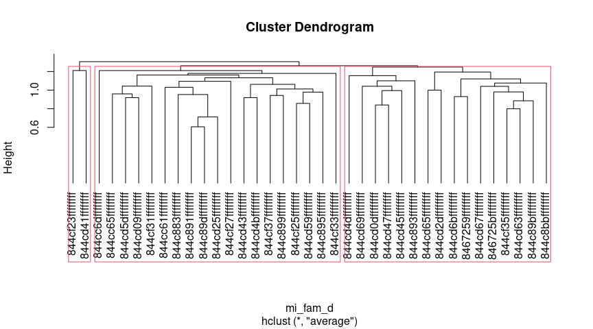
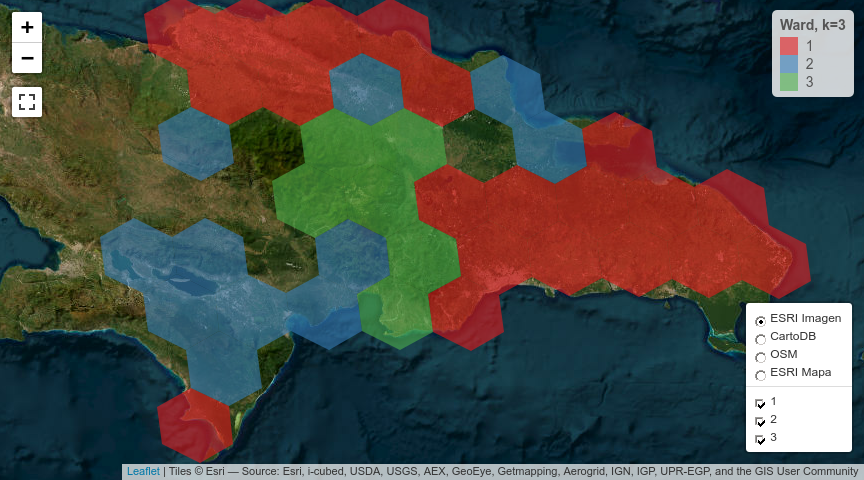
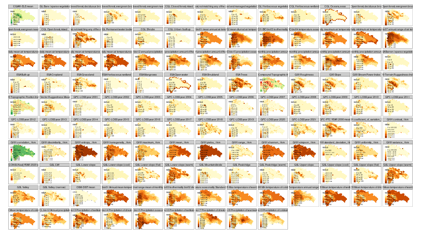

Práctica 99. Resultados de tu manuscrito.
================
José Ramón Martínez Batlle
26-11-2022

# ¿Qué contiene la sección “Resultados”?

Te recomiendo releer las normas para autores/as del [Anuario de
Investigaciones Científicas de la
UASD](../docs/instrucciones-para-autores-anuario-investigaciones-cientificas-UASD.pdf)
y adherirte a las especificaciones sobre la sección “Resultados” que
allí se indican. Aunque en las referidas normas no se incluyen muchas
pautas significativas, si escribieras para una revista específica,
deberás considerar sus normas y recomendaciones de publicación. Además,
te recomiendo que consultes la sección “Resultados” de algunos
manuscritos publicados en el Anuario.

En los resultados expones el contenido analítico central. Es “el qué”
del manuscrito, en complemento de “el cómo” (metodología) y “el por qué”
(introducción) de tu investigación. En los resultados muestras lo que
encontraste luego de que colectaste (aunque en este caso, no fuiste al
terreno) y analizaste, con tus métodos, los datos fuente.

Algunas recomendaciones generales:

- “Resultados” se supone que es la sección más corta del manuscrito,
  siempre que se usen apropiadamente los recursos gráficos, las tablas y
  la información suplementaria.

- Comienza por realizar tus análisis. Necesitarás una matriz de
  comunidad y una ambiental. La de comunidad la habrás generado en la
  práctica 2; la ambiental explico cómo generarla en este mismo cuaderno
  (ver abajo). En general, la matriz ambiental la producirás mediante
  estadísticos zonales del territorio dominicano. Para aprender más
  sobre la fuente de estadística zonal de República Dominicana, que
  contiene un conjunto de más de 100 variables resumidas por celdas H3,
  visita [este repo](https://github.com/geofis/zonal-statistics). Debes
  visitar dicho repo para poder citarlo apropiadamente.

- Cuando tengas análisis realizados, antes de comenzar a escribir, te
  recomiendo que escribas un guión de tu sección “Resultados”.

- Guión en mano, redacta tu sección “Resultados”, siguiendo también
  estos consejos:

- En esta sección, se espera que presentes lo que has obtenido de manera
  “objetiva”, evitando explicaciones, comentarios, opiniones,
  perspectivas o limitaciones. En teoría, tu redacción es “fría”, lo
  cual no necesariamente significa que tenga que ser aburrida.

- Esta es la sección por excelencia donde usarás *tablas y/o gráficos*.
  Lo más importante a tener en cuenta cuando los uses es que no debes
  duplicar el contenido que muestran dichos recursos en el texto. La
  tabla o gráfico son apoyos que te ayudarán a no entrar en densidades
  innecesarias dentro de los párrafos. Por lo tanto, si colocas una
  tabla o figura, no caigas en la tentación de describirla en párrafos
  de forma exhausitva. Estos recursos deben servir para apoyar el o los
  párrafos donde destacas los principales patrones encontrados.

- *Importante también*: si insertas una tabla o gráfico, debes referirla
  en el texto (e.g. “ver figura X”). De nada sirve incluir una figura o
  una tabla si no la refieres, porque con ello estarás sugiriendo que
  dicho recurso era completamente prescindible.

- El tiempo verbal preferido (por defecto) es el pasado, por ejemplo “…,
  donde se **encontró** una asociación significativa entre … y …”. Sin
  embargo, hay excepciones, como por ejemplo, cuando te refieres a una
  tabla o una figura. Un caso típico es la expresión “tal como se
  muestra en la tabla 1”, donde el verbo está conjugado en presente.

A continuación, te pongo enlaces a referencias que considero útiles,
sobre cómo redactar los resultados (algunas son generales, sobre
artículos en general):

- [Breves pautas, en
  inglés](https://www.editage.com/insights/the-secret-to-writing-the-results-and-discussion-section-of-a-manuscript).
  Puedes usar el traductor [DeepL](https://www.deepl.com/translator),
  porque produce frases más naturales.

Cinco guías, en inglés, que considero están bien elaboradas, sobre cómo
redactar un artículo científico (consulta la sección sobre cómo redactar
los *resultados* en cada una):

- [Demystifying the Journal
  Article](https://www.insidehighered.com/advice/2017/05/09/how-write-effective-journal-article-and-get-it-published-essay)

- [How to write a scientific manuscript for
  publication](https://www.ncbi.nlm.nih.gov/pmc/articles/PMC3626472/)

- [11 steps to structuring a science paper editors will take
  seriously](https://www.elsevier.com/connect/11-steps-to-structuring-a-science-paper-editors-will-take-seriously)

- [Cómo escribir un artículo científico por primera
  vez](https://www.sciencedirect.com/science/article/abs/pii/S1134593417300040)
  (necesitarás usar [SciHub](https://sci-hub.se/) para descargarlo)

- Una muy breve pero con consejos útiles: [Tips for writing the perfect
  IMRAD
  manuscript](https://www.editage.com/insights/tips-for-writing-the-perfect-imrad-manuscript)

# Scripts de ejemplo

Una nota, a título informativo. Cada una se las siguientes secciones
(e.g. “Análisis de agrupamiento”, “Ordenación restringida”), es
reproducible de forma autónoma, es decir, sin dependencia de líneas de
código anteriores. Esto siginifica que las dependencias de una sección
se resuelven dentro de ella misma, sin dependencia de líneas anteriores.

Por esta razón, varias secciones comparten texto y código común, pero
sólo al inicio, porque al avanzar cada una se hace propia. Notarás, por
lo tanto, que el texto “se repite a sí mismo” por esta razón; la otra
opción que tenía era alojar el código común en un único archivo, pero
entonces esto te obligaba a navegar por archivos separados, haciendo
menos didáctico este cuaderno.

## Análisis de agrupamiento

Me basaré en los scripts que comienzan por `aa_` de este
[repo](https://github.com/biogeografia-master/scripts-de-analisis-BCI),
los cuales explico en los vídeos de “Análisis de agrupamiento” (del 13
al 16) de la lista de reproducción [“Ecología Numérica con R” de mi
canal](https://www.youtube.com/playlist?list=PLDcT2n8UzsCRDqjqSeqHI1wsiNOqpYmsJ).

> INICIA texto+código común entre secciones

Fijar un directorio de trabajo no es recomendable, mejor trabaja por
proyecto. En cualquier caso, si no quieres o no puedes crear un
proyecto, usa la sentencia que verás abajo, cambiando `TU_DIRECTORIO`
por la ruta del directorio donde tengas almacenados tus datos y tus
scripts.

``` r
# setwd('practicas/')
```

Cargar paquetes.

``` r
library(vegan)
library(sf)
library(tidyverse)
library(tmap)
library(kableExtra)
gh_content <- 'https://raw.githubusercontent.com/'
gh_zonal_stats <- 'https://github.com/geofis/zonal-statistics/raw/main/out/'
repo_analisis <- 'biogeografia-master/scripts-de-analisis-BCI/master'
repo_sem202202 <- 'biogeografia-202202/material-de-apoyo/master/practicas/'
devtools::source_url(paste0(gh_content, repo_analisis, '/biodata/funciones.R'))
devtools::source_url(paste0(gh_content, repo_sem202202, 'train.R'))
devtools::source_url(paste0(gh_content, repo_sem202202, 'funciones.R'))
```

Carga tu matriz de comunidad, que habrás generado en la práctica 2, y
elige un umbral para especies raras o rangos de registros de presencia
para seleccionar especies en una nueva matriz de comunidad.

``` r
mc_orig <- readRDS("matriz_de_comunidad.RDS")
nrow(mc_orig) #Número de filas, equivale a número de hexágonos con registros de presencia
```

    ## [1] 149

``` r
ncol(mc_orig)  #Número de columnas, equivale a número de especies, riqueza
```

    ## [1] 44

``` r
data.frame(Especies = names(mc_orig)) %>% 
  kable(booktabs=T) %>%
  kable_styling(latex_options = c("HOLD_position", "scale_down")) %>%
  gsub(' NA ', '', .) #Lista de especies
```

<table class="table" style="margin-left: auto; margin-right: auto;">
<thead>
<tr>
<th style="text-align:left;">
Especies
</th>
</tr>
</thead>
<tbody>
<tr>
<td style="text-align:left;">
Coccoloba uvifera (L.) L.
</td>
</tr>
<tr>
<td style="text-align:left;">
Antigonon leptopus Hook. & Arn.
</td>
</tr>
<tr>
<td style="text-align:left;">
Coccoloba pubescens L.
</td>
</tr>
<tr>
<td style="text-align:left;">
Coccoloba diversifolia Jacq.
</td>
</tr>
<tr>
<td style="text-align:left;">
Coccoloba P.Browne
</td>
</tr>
<tr>
<td style="text-align:left;">
Coccoloba jimenezii Alain
</td>
</tr>
<tr>
<td style="text-align:left;">
Persicaria punctata (Elliott) Small
</td>
</tr>
<tr>
<td style="text-align:left;">
Coccoloba flavescens Jacq.
</td>
</tr>
<tr>
<td style="text-align:left;">
Leptogonum domingensis var. molle (Urb.) Brandbyge
</td>
</tr>
<tr>
<td style="text-align:left;">
Leptogonum domingense Benth.
</td>
</tr>
<tr>
<td style="text-align:left;">
Leptogonum domingensis Benth.
</td>
</tr>
<tr>
<td style="text-align:left;">
Coccoloba costata Wright
</td>
</tr>
<tr>
<td style="text-align:left;">
Coccoloba incrassata Urb.
</td>
</tr>
<tr>
<td style="text-align:left;">
Coccoloba wrightii Lindau
</td>
</tr>
<tr>
<td style="text-align:left;">
Coccoloba picardae Urb.
</td>
</tr>
<tr>
<td style="text-align:left;">
Rumex acetosella L.
</td>
</tr>
<tr>
<td style="text-align:left;">
Rumex crispus L.
</td>
</tr>
<tr>
<td style="text-align:left;">
Coccoloba leonardii Howard
</td>
</tr>
<tr>
<td style="text-align:left;">
Coccoloba ceibensis O.C.Schmidt
</td>
</tr>
<tr>
<td style="text-align:left;">
Coccoloba venosa L.
</td>
</tr>
<tr>
<td style="text-align:left;">
Coccoloba leoganensis Jacq.
</td>
</tr>
<tr>
<td style="text-align:left;">
Coccoloba microstachya Willd.
</td>
</tr>
<tr>
<td style="text-align:left;">
Coccoloba krugii Lindau
</td>
</tr>
<tr>
<td style="text-align:left;">
Coccoloba buchii O.Schmidt
</td>
</tr>
<tr>
<td style="text-align:left;">
Coccoloba fuertesii Urb.
</td>
</tr>
<tr>
<td style="text-align:left;">
Coccoloba nodosa Lindau
</td>
</tr>
<tr>
<td style="text-align:left;">
Coccoloba pauciflora Urb.
</td>
</tr>
<tr>
<td style="text-align:left;">
Polygonum L.
</td>
</tr>
<tr>
<td style="text-align:left;">
Rumex L.
</td>
</tr>
<tr>
<td style="text-align:left;">
Persicaria pensylvanica (L.) M.Gómez
</td>
</tr>
<tr>
<td style="text-align:left;">
Persicaria hydropiperoides (Michx.) Small
</td>
</tr>
<tr>
<td style="text-align:left;">
Coccoloba samanensis O.C.Schmidt
</td>
</tr>
<tr>
<td style="text-align:left;">
Persicaria ferruginea (Wedd.) Soják
</td>
</tr>
<tr>
<td style="text-align:left;">
Brunnichia ovata (Walter) Shinners
</td>
</tr>
<tr>
<td style="text-align:left;">
Ruprechtia C.A.Mey.
</td>
</tr>
<tr>
<td style="text-align:left;">
Coccoloba subcordata Lindau
</td>
</tr>
<tr>
<td style="text-align:left;">
Polygonum punctatum Kit., 1864
</td>
</tr>
<tr>
<td style="text-align:left;">
Persicaria segetum (Kunth) Small
</td>
</tr>
<tr>
<td style="text-align:left;">
Persicaria acuminata (Kunth) M.Gómez
</td>
</tr>
<tr>
<td style="text-align:left;">
Coccoloba swartzii Meisn.
</td>
</tr>
<tr>
<td style="text-align:left;">
Persicaria lapathifolia subsp. lapathifolia
</td>
</tr>
<tr>
<td style="text-align:left;">
Persicaria glabra (Willd.) M.Gómez
</td>
</tr>
<tr>
<td style="text-align:left;">
Rumex obtusifolius L.
</td>
</tr>
<tr>
<td style="text-align:left;">
Coccoloba fawcettii O.Schmidt
</td>
</tr>
</tbody>
</table>

``` r
unique(word(names(mc_orig), 1, 1)) #Géneros representados
```

    ## [1] "Coccoloba"  "Antigonon"  "Persicaria" "Leptogonum" "Rumex"     
    ## [6] "Polygonum"  "Brunnichia" "Ruprechtia"

``` r
table(word(names(mc_orig), 1, 1)) #Número de especies por género
```

    ## 
    ##  Antigonon Brunnichia  Coccoloba Leptogonum Persicaria  Polygonum      Rumex 
    ##          1          1         24          3          8          2          4 
    ## Ruprechtia 
    ##          1

``` r
data.frame(`Número de hexágonos` = sort(colSums(mc_orig), decreasing = T), check.names = F) %>% 
  kable(booktabs=T) %>%
  kable_styling(latex_options = c("HOLD_position", "scale_down")) %>%
  gsub(' NA ', '', .) # Número de hexágonos en los que está presente cada especie
```

<table class="table" style="margin-left: auto; margin-right: auto;">
<thead>
<tr>
<th style="text-align:left;">
</th>
<th style="text-align:right;">
Número de hexágonos
</th>
</tr>
</thead>
<tbody>
<tr>
<td style="text-align:left;">
Coccoloba uvifera (L.) L.
</td>
<td style="text-align:right;">
54
</td>
</tr>
<tr>
<td style="text-align:left;">
Coccoloba diversifolia Jacq.
</td>
<td style="text-align:right;">
31
</td>
</tr>
<tr>
<td style="text-align:left;">
Coccoloba wrightii Lindau
</td>
<td style="text-align:right;">
20
</td>
</tr>
<tr>
<td style="text-align:left;">
Coccoloba costata Wright
</td>
<td style="text-align:right;">
18
</td>
</tr>
<tr>
<td style="text-align:left;">
Antigonon leptopus Hook. & Arn.
</td>
<td style="text-align:right;">
17
</td>
</tr>
<tr>
<td style="text-align:left;">
Coccoloba pubescens L.
</td>
<td style="text-align:right;">
15
</td>
</tr>
<tr>
<td style="text-align:left;">
Coccoloba incrassata Urb.
</td>
<td style="text-align:right;">
13
</td>
</tr>
<tr>
<td style="text-align:left;">
Coccoloba leoganensis Jacq.
</td>
<td style="text-align:right;">
13
</td>
</tr>
<tr>
<td style="text-align:left;">
Coccoloba P.Browne
</td>
<td style="text-align:right;">
12
</td>
</tr>
<tr>
<td style="text-align:left;">
Persicaria punctata (Elliott) Small
</td>
<td style="text-align:right;">
12
</td>
</tr>
<tr>
<td style="text-align:left;">
Coccoloba fuertesii Urb.
</td>
<td style="text-align:right;">
10
</td>
</tr>
<tr>
<td style="text-align:left;">
Leptogonum domingensis var. molle (Urb.) Brandbyge
</td>
<td style="text-align:right;">
8
</td>
</tr>
<tr>
<td style="text-align:left;">
Leptogonum domingense Benth.
</td>
<td style="text-align:right;">
8
</td>
</tr>
<tr>
<td style="text-align:left;">
Rumex crispus L.
</td>
<td style="text-align:right;">
8
</td>
</tr>
<tr>
<td style="text-align:left;">
Coccoloba ceibensis O.C.Schmidt
</td>
<td style="text-align:right;">
8
</td>
</tr>
<tr>
<td style="text-align:left;">
Coccoloba buchii O.Schmidt
</td>
<td style="text-align:right;">
8
</td>
</tr>
<tr>
<td style="text-align:left;">
Coccoloba nodosa Lindau
</td>
<td style="text-align:right;">
8
</td>
</tr>
<tr>
<td style="text-align:left;">
Coccoloba pauciflora Urb.
</td>
<td style="text-align:right;">
8
</td>
</tr>
<tr>
<td style="text-align:left;">
Coccoloba picardae Urb.
</td>
<td style="text-align:right;">
7
</td>
</tr>
<tr>
<td style="text-align:left;">
Coccoloba flavescens Jacq.
</td>
<td style="text-align:right;">
6
</td>
</tr>
<tr>
<td style="text-align:left;">
Leptogonum domingensis Benth.
</td>
<td style="text-align:right;">
6
</td>
</tr>
<tr>
<td style="text-align:left;">
Polygonum L.
</td>
<td style="text-align:right;">
6
</td>
</tr>
<tr>
<td style="text-align:left;">
Coccoloba krugii Lindau
</td>
<td style="text-align:right;">
5
</td>
</tr>
<tr>
<td style="text-align:left;">
Persicaria hydropiperoides (Michx.) Small
</td>
<td style="text-align:right;">
5
</td>
</tr>
<tr>
<td style="text-align:left;">
Coccoloba jimenezii Alain
</td>
<td style="text-align:right;">
4
</td>
</tr>
<tr>
<td style="text-align:left;">
Coccoloba microstachya Willd.
</td>
<td style="text-align:right;">
4
</td>
</tr>
<tr>
<td style="text-align:left;">
Rumex L.
</td>
<td style="text-align:right;">
4
</td>
</tr>
<tr>
<td style="text-align:left;">
Polygonum punctatum Kit., 1864
</td>
<td style="text-align:right;">
4
</td>
</tr>
<tr>
<td style="text-align:left;">
Coccoloba venosa L.
</td>
<td style="text-align:right;">
3
</td>
</tr>
<tr>
<td style="text-align:left;">
Persicaria acuminata (Kunth) M.Gómez
</td>
<td style="text-align:right;">
3
</td>
</tr>
<tr>
<td style="text-align:left;">
Coccoloba swartzii Meisn.
</td>
<td style="text-align:right;">
3
</td>
</tr>
<tr>
<td style="text-align:left;">
Rumex obtusifolius L.
</td>
<td style="text-align:right;">
3
</td>
</tr>
<tr>
<td style="text-align:left;">
Coccoloba leonardii Howard
</td>
<td style="text-align:right;">
2
</td>
</tr>
<tr>
<td style="text-align:left;">
Coccoloba samanensis O.C.Schmidt
</td>
<td style="text-align:right;">
2
</td>
</tr>
<tr>
<td style="text-align:left;">
Persicaria ferruginea (Wedd.) Soják
</td>
<td style="text-align:right;">
2
</td>
</tr>
<tr>
<td style="text-align:left;">
Coccoloba subcordata Lindau
</td>
<td style="text-align:right;">
2
</td>
</tr>
<tr>
<td style="text-align:left;">
Persicaria glabra (Willd.) M.Gómez
</td>
<td style="text-align:right;">
2
</td>
</tr>
<tr>
<td style="text-align:left;">
Rumex acetosella L.
</td>
<td style="text-align:right;">
1
</td>
</tr>
<tr>
<td style="text-align:left;">
Persicaria pensylvanica (L.) M.Gómez
</td>
<td style="text-align:right;">
1
</td>
</tr>
<tr>
<td style="text-align:left;">
Brunnichia ovata (Walter) Shinners
</td>
<td style="text-align:right;">
1
</td>
</tr>
<tr>
<td style="text-align:left;">
Ruprechtia C.A.Mey.
</td>
<td style="text-align:right;">
1
</td>
</tr>
<tr>
<td style="text-align:left;">
Persicaria segetum (Kunth) Small
</td>
<td style="text-align:right;">
1
</td>
</tr>
<tr>
<td style="text-align:left;">
Persicaria lapathifolia subsp. lapathifolia
</td>
<td style="text-align:right;">
1
</td>
</tr>
<tr>
<td style="text-align:left;">
Coccoloba fawcettii O.Schmidt
</td>
<td style="text-align:right;">
1
</td>
</tr>
</tbody>
</table>

``` r
# Usa el vector anterior para determinar un umbral o rango de registros para filtrar tu matriz
# ¿En cuántos hexágonos está cada especie? Filtra tus datos usando tu propio criterio.
# Especies que aparecen en pocos hexágonos se consideran "raras". Por ejemplo, si una especie sólo
# aparece en un hexágono en todo el país, es un "singleton", si en dos, "doubleton", y así.
# Estas especies podrían contribuir a generar "ruido" en análisis posteriores, se recomienda excluirlas.
# Elige un valor mínimo (representado por único número entero) o por un rango de enteros (e.g. de 10 a 20),
# para seleccionar las especies que estén mejor representadas de acuerdo a tu criterio.
# Por ejemplo, si usas el valor m, el script considerará a este valor como "el número mínimo de hexágonos
# en los que está representada una especie, y creará una matriz de comunidad de especies seleccionadas
# que están presentes en m hexágonos o más. Si eliges un rango, por ejemplo [m,n], el script generará
# una matriz de comunidad que representadas un mínimo de m hexágonos y un máximo de n hexágonos.
# (ambos extremos inclusive).
en_cuantos_hex <- 15
# En este caso, 15 significa 15 o más (hasta el límite superior). IMPORTANTE: elige TU PROPIO umbral.
# en_cuantos_hex <- 10:20
{if(length(en_cuantos_hex)==1) selector <- en_cuantos_hex:max(colSums(mc_orig)) else
  if(length(en_cuantos_hex)==2)
    selector <- min(en_cuantos_hex):max(en_cuantos_hex) else
      stop('Debes indicar uno o dos valores numéricos')}
selector
```

    ##  [1] 15 16 17 18 19 20 21 22 23 24 25 26 27 28 29 30 31 32 33 34 35 36 37 38 39
    ## [26] 40 41 42 43 44 45 46 47 48 49 50 51 52 53 54

``` r
mc_orig_seleccionadas <- mc_orig[, colSums(mc_orig) %in% selector]
mi_fam <- mc_orig_seleccionadas[!rowSums(mc_orig_seleccionadas)==0, ] #Elimina filas sin registros
# rowSums(mi_fam) #Riqueza por hexágonos con especies seleccionadas. Comentado por extenso
all(rowSums(mi_fam)>0) #Debe ser TRUE: todos los hexágonos tienen al menos 1 registro
```

    ## [1] TRUE

``` r
ncol(mi_fam) #Riqueza de especies
```

    ## [1] 6

``` r
# Usar nombres cortos o abreviados para las especies
nombres_largos <- colnames(mi_fam)
(colnames(mi_fam) <- make.cepnames(word(colnames(mi_fam), 1, 2)))
```

    ## [1] "Coccuvif" "Antilept" "Coccpube" "Coccdive" "Cocccost" "Coccwrig"

``` r
(df_equivalencias <- data.frame(
  nombre_original = nombres_largos,
  colnames(mi_fam)))
```

    ##                   nombre_original colnames.mi_fam.
    ## 1       Coccoloba uvifera (L.) L.         Coccuvif
    ## 2 Antigonon leptopus Hook. & Arn.         Antilept
    ## 3          Coccoloba pubescens L.         Coccpube
    ## 4    Coccoloba diversifolia Jacq.         Coccdive
    ## 5        Coccoloba costata Wright         Cocccost
    ## 6       Coccoloba wrightii Lindau         Coccwrig

Transforma la matriz de comunidad. Este paso es importante, lo explico
[aquí](https://www.youtube.com/watch?v=yQ10lp0-nHc&list=PLDcT2n8UzsCRDqjqSeqHI1wsiNOqpYmsJ&index=10)

``` r
mi_fam_t <- decostand(mi_fam, 'hellinger') #Hellinger
# Otras transformaciones posibles con datos de presencia/ausencia
# mi_fam_t <- decostand(mi_fam, 'normalize') #Chord
# mi_fam_t <- decostand(log1p(mi_fam), 'normalize') #Chord
# mi_fam_t <- decostand(mi_fam, 'chi.square') #Chi-square
```

Genera la matriz ambiental a partir del archivo de estadística zonal por
celdas H3 de República Dominicana, de acuerdo con la resolución que
prefieras. Para el ejemplo, usé la resolución 5, pero puedes usar/probar
con otra, para lo cual, sólo tendrías que cambiar el objeto `res <- X`,
donde `X` puede ser un número cualquiera entre 4 y 7.

Para aprender más sobre la fuente de estadística zonal de República
Dominicana, que contiene un conjunto de más de 100 variables resumidas
por celdas H3, visita [este
repo](https://github.com/geofis/zonal-statistics). Debes visitar dicho
repo para poder citarlo apropiadamente.

``` r
#Matriz ambiental
res <- 5 #Resolución H3
tmpfile <- tempfile()
download.file(paste0(gh_zonal_stats, 'all_sources_all_variables_res_', res, '.gpkg'), tmpfile)
za <- st_read(tmpfile, optional = T)
```

    ## Reading layer `all_sources_all_variables_res_5' from data source 
    ##   `/tmp/RtmpiHFRoo/file345c42ece0736' using driver `GPKG'
    ## Simple feature collection with 335 features and 142 fields
    ## Geometry type: POLYGON
    ## Dimension:     XY
    ## Bounding box:  xmin: -72.13564 ymin: 17.40413 xmax: -68.20998 ymax: 20.04043
    ## Geodetic CRS:  WGS 84

``` r
# Las siguientes líneas están comentadas, porque producen muchos mapas. Descoméntalas y ejecútalas si quieres verlos
# za %>% st_as_sf('geom') %>%
#   pivot_longer(cols = -matches('base|hex_id|geom')) %>% 
#   tm_shape() + tm_fill(col = 'value') +
#   tm_facets(by = 'name', free.scales = T)
za_intermedia <- za %>%
  st_drop_geometry() %>% 
  select(-matches(c(' base'))) %>% 
  column_to_rownames('hex_id')
env <- za_intermedia[match(rownames(mi_fam), rownames(za_intermedia)), ]
all(rownames(mi_fam) == rownames(env)) #Si es TRUE, sigue adelante
```

    ## [1] TRUE

Se puede probar con un subconjunto de variables, generando una matriz
ambiental que seleccione variables según el grupo al que pertenecen, con
ayuda del sufijo.

``` r
# env_selecionada <- env %>%
#   st_drop_geometry() %>%
#   dplyr::select(matches('^ESA '))
# env_selecionada <- env %>%
#   st_drop_geometry() %>%
#   dplyr::select(matches('^G90-GEOM '))
# env_selecionada <- env %>%
#   st_drop_geometry() %>%
#   dplyr::select(matches('^CH-BIO '))
# env_selecionada <- env %>%
#   st_drop_geometry() %>%
#   dplyr::select(matches('^GHH '))
# env_selecionada <- env %>%
#   st_drop_geometry() %>%
#   dplyr::select(matches('^GSL '))
# env_selecionada <- env %>%
#   st_drop_geometry() %>%
#   dplyr::select(matches('^CGL '))
```

> FINALIZA texto+código común entre secciones

### Clúster análisis usando distintos métodos. Interpretación y comparación de resultados

> No olvides ejecutar la parte de código común y reutilizable situada
> arriba. Esta subsección necesita de objetos creados en líneas de
> código previas.

A continuación, el **análisis de agrupamiento** propiamente. La parte
más importante es generar un árbol, a partir de una matriz de
distancias, que haga sentido desde el punto de vista de la comunidad y
la distribución de las especies tal como se encuentran en GBIF. Primero
cargaré paquetes específicos de esta técnica y generaré la matriz de
distancias.

``` r
library(broom)
library(cluster)
library(gclus)
library(pvclust)
mi_fam_d <- vegdist(mi_fam_t, "euc")
```

A continuación, generaré árboles usando distintos métodos, explicados en
el
[repo](https://github.com/biogeografia-master/scripts-de-analisis-BCI),
y en los vídeos (13 a 16) de la lista mencionada arriba [“Ecología
Numérica con R” de mi
canal](https://www.youtube.com/playlist?list=PLDcT2n8UzsCRDqjqSeqHI1wsiNOqpYmsJ).

``` r
lista_cl <- list(
        cl_single = hclust(mi_fam_d, method = 'single'),
        cl_complete = hclust(mi_fam_d, method = 'complete'),
        cl_upgma = hclust(mi_fam_d, method = 'average'),
        cl_ward = hclust(mi_fam_d, method = 'ward.D2')
)
par(mfrow = c(2,2))
invisible(map(names(lista_cl), function(x) plot(lista_cl[[x]], main = x, hang = -1, cex = 0.3)))
```

<!-- -->

``` r
par(mfrow = c(1,1))
```

A continuación, calcularé la distancia y la correlación cofenéticas. Se
supone que el método con la mayor correlación cofenética explica mejor
el agrupamiento de la comunidad. Consulta el vídeo y material de
referencia. Normalmente, el método UPGMA obtiene la mayor correlación
cofenética, pero esto se debe a que su procedimiento maximiza
precisamente dicha métrica. No es recomendable conservar un único método
de agrupamiento, normalmente es bueno usar al menos dos. Ward es muchas
veces recomendado por basarse en procedimientos de cálculo muy distintos
a los de UPGMA. Consulta referencias.

``` r
map_df(lista_cl, function(x) {
        coph_d <- cophenetic(x)
        corr <- cor(mi_fam_d, coph_d)
        return(corr)
})
```

    ## # A tibble: 1 × 4
    ##   cl_single cl_complete cl_upgma cl_ward
    ##       <dbl>       <dbl>    <dbl>   <dbl>
    ## 1     0.839       0.853    0.916   0.801

Ahora, calcularé las anchuras de silueta, una métrica que ayuda a
determinar en cuántos grupos se organiza la comunidad. En el ejemplo,
dado que muchas especies de Polygonaceae están ausentes en muchos
hexágonos, es esperable que el procedimiento sugiera un número de grupos
alto denominados (ver objeto impreso `n_grupos_optimos`). Considera la
siguiente regla general: muchos grupos, y 6 o más se considera mucho, es
un resultado poco útil; 1 grupo es un resultado sin sentido.

``` r
# UPGMA
anch_sil_upgma <- calcular_anchuras_siluetas(
        mc_orig = mi_fam, 
        distancias = mi_fam_d, 
        cluster = lista_cl$cl_upgma)
anch_sil_upgma
```

    ## $anchuras_siluetas
    ##   [1] 0.00000000 0.37934577 0.41637581 0.40426862 0.40949493 0.52685283
    ##   [7] 0.56414243 0.60794131 0.62582915 0.63956664 0.68053596 0.70425890
    ##  [13] 0.73611539 0.74418660 0.77452203 0.78423688 0.79037000 0.84286384
    ##  [19] 0.84734288 0.86574317 0.89235005 0.89088342 0.90009150 0.93069307
    ##  [25] 0.91089109 0.89108911 0.85148515 0.85148515 0.85148515 0.83168317
    ##  [31] 0.81188119 0.66336634 0.66336634 0.66336634 0.66336634 0.66336634
    ##  [37] 0.66336634 0.66336634 0.66336634 0.66336634 0.66336634 0.66336634
    ##  [43] 0.66336634 0.66336634 0.66336634 0.60396040 0.60396040 0.60396040
    ##  [49] 0.60396040 0.60396040 0.57425743 0.57425743 0.49504950 0.49504950
    ##  [55] 0.49504950 0.49504950 0.49504950 0.49504950 0.49504950 0.47524752
    ##  [61] 0.45544554 0.42574257 0.42574257 0.16831683 0.16831683 0.16831683
    ##  [67] 0.16831683 0.16831683 0.16831683 0.16831683 0.16831683 0.16831683
    ##  [73] 0.16831683 0.16831683 0.16831683 0.16831683 0.16831683 0.16831683
    ##  [79] 0.16831683 0.16831683 0.16831683 0.16831683 0.16831683 0.16831683
    ##  [85] 0.16831683 0.16831683 0.16831683 0.16831683 0.13861386 0.13861386
    ##  [91] 0.11881188 0.04950495 0.04950495 0.04950495 0.04950495 0.04950495
    ##  [97] 0.04950495 0.00000000 0.00000000 0.00000000 0.00000000
    ## 
    ## $n_grupos_optimo
    ## [1] 24

``` r
u_dend_reord <- reorder.hclust(lista_cl$cl_upgma, mi_fam_d)
plot(u_dend_reord, hang = -1)
rect.hclust(
        tree = u_dend_reord,
        k = anch_sil_upgma$n_grupos_optimo)
```

<!-- -->

Método Ward.

``` r
# Ward
anch_sil_ward <- calcular_anchuras_siluetas(
        mc_orig = mi_fam, 
        distancias = mi_fam_d, 
        cluster = lista_cl$cl_ward)
anch_sil_ward
```

    ## $anchuras_siluetas
    ##   [1] 0.00000000 0.36867087 0.41079103 0.46593121 0.52441782 0.57409118
    ##   [7] 0.60224244 0.63230045 0.65706072 0.67943946 0.70851877 0.73938103
    ##  [13] 0.77149479 0.79759738 0.82783218 0.85310791 0.85946801 0.86936900
    ##  [19] 0.86930526 0.89295582 0.91439619 0.92223312 0.92223312 0.93069307
    ##  [25] 0.91089109 0.89108911 0.85148515 0.85148515 0.85148515 0.83168317
    ##  [31] 0.81188119 0.66336634 0.66336634 0.66336634 0.66336634 0.66336634
    ##  [37] 0.66336634 0.66336634 0.66336634 0.66336634 0.66336634 0.66336634
    ##  [43] 0.66336634 0.66336634 0.66336634 0.60396040 0.60396040 0.60396040
    ##  [49] 0.60396040 0.60396040 0.57425743 0.57425743 0.49504950 0.49504950
    ##  [55] 0.49504950 0.49504950 0.49504950 0.49504950 0.49504950 0.47524752
    ##  [61] 0.45544554 0.42574257 0.42574257 0.16831683 0.16831683 0.16831683
    ##  [67] 0.16831683 0.16831683 0.16831683 0.16831683 0.16831683 0.16831683
    ##  [73] 0.16831683 0.16831683 0.16831683 0.16831683 0.16831683 0.16831683
    ##  [79] 0.16831683 0.16831683 0.16831683 0.16831683 0.16831683 0.16831683
    ##  [85] 0.16831683 0.16831683 0.16831683 0.16831683 0.13861386 0.13861386
    ##  [91] 0.11881188 0.04950495 0.04950495 0.04950495 0.04950495 0.04950495
    ##  [97] 0.04950495 0.00000000 0.00000000 0.00000000 0.00000000
    ## 
    ## $n_grupos_optimo
    ## [1] 24

``` r
w_dend_reord <- reorder.hclust(lista_cl$cl_ward, mi_fam_d)
plot(w_dend_reord, hang = -1)
rect.hclust(
        tree = w_dend_reord,
        k = anch_sil_ward$n_grupos_optimo)
```

<!-- -->

Por los resultados obtenidos, tanto por el método UPGMA como por Ward,
parecería interesante explorar dos estrategias adicionales: 1) Reducir
el umbral de registros de presencia de especies raras; 2) Probar métodos
“aproximadamente insesgados”, basados en remuestreos y permutaciones.

Probaré lo segundo, pero te animo a que pruebes también la estrategia 1)
en tu caso, para lo cual, debes elegir un umbral (ya sea un valor mínimo
o un rango) diferente al que elegiste en primera instancia.

``` r
cl_pvclust_upgma <-
        pvclust(t(mi_fam_t),
                method.hclust = "average",
                method.dist = "euc",
                iseed = 91, # Resultado reproducible
                parallel = TRUE)
```

    ## Creating a temporary cluster...done:
    ## socket cluster with 7 nodes on host 'localhost'
    ## Multiscale bootstrap... Done.

``` r
# Añadir los valores de p
plot(cl_pvclust_upgma, hang = -1)
# Añadir rectángulos a los grupos significativos
lines(cl_pvclust_upgma)
pvrect(cl_pvclust_upgma, alpha = 0.90, border = 4)
```

<!-- -->

Para UPGMA nos sugiere que hay más de 6 grupos, y esto se debe al gran
número de hexágonos con pocos registros de presencia. No obstante,
tratándose de muestras sesgadas, como es el caso de GBIF, es esperable
obtener este tipo de resultados donde la comunidad luce muy atomizada.
Veremos que aplicando el remuestreo multiescalar por bootstrap al árbol
Ward, no mejora mucho el resultado, pero se sugieren menos grupos.

``` r
# Ward
cl_pvclust_ward <-
        pvclust(t(mi_fam_t),
                method.hclust = "ward.D2",
                method.dist = "euc",
                iseed = 191, # Resultado reproducible
                parallel = TRUE)
```

    ## Creating a temporary cluster...done:
    ## socket cluster with 7 nodes on host 'localhost'
    ## Multiscale bootstrap... Done.

``` r
# Añadir los valores de p
plot(cl_pvclust_ward, hang = -1)
# Añadir rectángulos a los grupos significativos
lines(cl_pvclust_ward)
pvrect(cl_pvclust_ward, alpha = 0.91, border = 4)
```

<!-- -->

Generaré agrupamientos y los exportaré a archivos, para reutilizarlos
más adelante. Elegir un número de grupos no es tarea sencilla, por el
momento probaré con 6 (`k=6`).

``` r
# UPGMA
grupos_upgma_k6 <- as.factor(cutree(lista_cl$cl_upgma, k = 6))
set.seed(999);sample(grupos_upgma_k6, 10) #¿A qué grupo pertenecen 10 hexágonos seleccionados al azar?
```

    ## 854c8993fffffff 854cd4cbfffffff 854cd44bfffffff 854cd0d3fffffff 854cf20ffffffff 
    ##               2               6               6               6               1 
    ## 854cf233fffffff 854cd5c3fffffff 854cc60ffffffff 856725a7fffffff 854cd4a7fffffff 
    ##               5               6               2               1               1 
    ## Levels: 1 2 3 4 5 6

``` r
table(grupos_upgma_k6) #¿Cuántos hexágonos hay en cada grupo?
```

    ## grupos_upgma_k6
    ##  1  2  3  4  5  6 
    ## 29 36  6  4  8 18

``` r
plot(u_dend_reord, hang = -1)
rect.hclust(tree = u_dend_reord, k = 6)
```

<!-- -->

``` r
# Ward
grupos_ward_k6 <- as.factor(cutree(lista_cl$cl_ward, k = 6))
set.seed(999);sample(grupos_ward_k6, 10) #¿A qué grupo pertenecen 10 hexágonos seleccionados al azar?
```

    ## 854c8993fffffff 854cd4cbfffffff 854cd44bfffffff 854cd0d3fffffff 854cf20ffffffff 
    ##               3               6               6               6               5 
    ## 854cf233fffffff 854cd5c3fffffff 854cc60ffffffff 856725a7fffffff 854cd4a7fffffff 
    ##               4               1               3               2               5 
    ## Levels: 1 2 3 4 5 6

``` r
table(grupos_ward_k6) #¿Cuántos hexágonos hay en cada grupo?
```

    ## grupos_ward_k6
    ##  1  2  3  4  5  6 
    ## 17 15 29 15 10 15

``` r
plot(w_dend_reord, hang = -1)
rect.hclust(tree = w_dend_reord, k = 6)
```

<!-- -->

``` r
# Guardaré estos vectores en archivos para reutilizarlos en *scripts* posteriores: 
saveRDS(grupos_upgma_k6, 'grupos_upgma_k6.RDS')
saveRDS(grupos_ward_k6, 'grupos_ward_k6.RDS')
```

### Grupos (clústers), variables ambientales y mapas

> No olvides ejecutar la parte de código común y reutilizable situada
> arriba. Esta subsección necesita de objetos creados en líneas de
> código previas.

Apliquemos el análisis de agrupamiento a la matriz ambiental. La clave
en este punto es que, si la matriz ambiental presenta patrones parecidos
a los de la matriz de comunidad, significa que el agrupamiento utilizado
hace sentido entre ambos conjuntos de datos (comunidad y hábitat) de
forma consistente. Si ambos conjuntos de datos son consistentes,
significa que existe algún grado de asociación.

Cargar paquetes necesarios para esta subsección.

``` r
# library(mapview)
library(RColorBrewer)
library(leaflet)
library(leaflet.extras)
leaflet_map_view <- . %>% setView(lat = 18.7, lng = -70.3, zoom = 8)
```

Agrupar los hexágonos de la matriz ambiental.

``` r
(m_amb_upgma_k6 <- env %>%
   rownames_to_column('hex_id') %>% 
   mutate(grupos_upgma_k6) %>%
   pivot_longer(-c(grupos_upgma_k6, hex_id), names_to = "variable", values_to = "valor") %>% 
   inner_join(za %>% select(hex_id)))
```

    ## # A tibble: 13,736 × 5
    ##    hex_id          grupos_upgma_k6 variable      valor                      geom
    ##    <chr>           <fct>           <chr>         <dbl>             <POLYGON [°]>
    ##  1 854cf243fffffff 1               ESA Trees   4.54e+1 ((-70.54282 19.83173, -7…
    ##  2 854cf243fffffff 1               ESA Shrubl… 4.82e-2 ((-70.54282 19.83173, -7…
    ##  3 854cf243fffffff 1               ESA Grassl… 8.38e+0 ((-70.54282 19.83173, -7…
    ##  4 854cf243fffffff 1               ESA Cropla… 9.47e-3 ((-70.54282 19.83173, -7…
    ##  5 854cf243fffffff 1               ESA Built-… 2.79e+0 ((-70.54282 19.83173, -7…
    ##  6 854cf243fffffff 1               ESA Barren… 1.97e-1 ((-70.54282 19.83173, -7…
    ##  7 854cf243fffffff 1               ESA Open w… 4.23e+1 ((-70.54282 19.83173, -7…
    ##  8 854cf243fffffff 1               ESA Herbac… 8.15e-1 ((-70.54282 19.83173, -7…
    ##  9 854cf243fffffff 1               ESA Mangro… 0       ((-70.54282 19.83173, -7…
    ## 10 854cf243fffffff 1               CGL Closed… 0       ((-70.54282 19.83173, -7…
    ## # … with 13,726 more rows

``` r
(m_amb_ward_k6 <- env %>%
    rownames_to_column('hex_id') %>% 
    mutate(grupos_ward_k6) %>%
    pivot_longer(-c(grupos_ward_k6, hex_id), names_to = "variable", values_to = "valor") %>% 
    inner_join(za %>% select(hex_id)))
```

    ## # A tibble: 13,736 × 5
    ##    hex_id          grupos_ward_k6 variable       valor                      geom
    ##    <chr>           <fct>          <chr>          <dbl>             <POLYGON [°]>
    ##  1 854cf243fffffff 1              ESA Trees    4.54e+1 ((-70.54282 19.83173, -7…
    ##  2 854cf243fffffff 1              ESA Shrubla… 4.82e-2 ((-70.54282 19.83173, -7…
    ##  3 854cf243fffffff 1              ESA Grassla… 8.38e+0 ((-70.54282 19.83173, -7…
    ##  4 854cf243fffffff 1              ESA Cropland 9.47e-3 ((-70.54282 19.83173, -7…
    ##  5 854cf243fffffff 1              ESA Built-up 2.79e+0 ((-70.54282 19.83173, -7…
    ##  6 854cf243fffffff 1              ESA Barren … 1.97e-1 ((-70.54282 19.83173, -7…
    ##  7 854cf243fffffff 1              ESA Open wa… 4.23e+1 ((-70.54282 19.83173, -7…
    ##  8 854cf243fffffff 1              ESA Herbace… 8.15e-1 ((-70.54282 19.83173, -7…
    ##  9 854cf243fffffff 1              ESA Mangrov… 0       ((-70.54282 19.83173, -7…
    ## 10 854cf243fffffff 1              CGL Closed … 0       ((-70.54282 19.83173, -7…
    ## # … with 13,726 more rows

Evaluar efectos entre los grupos (“diferencias significativas”) de los
agrupamientos UPGMA y Ward. Al tratarse de 6 grupos, se utilizan las
pruebas estadísticas ANOVA (evalúa homongeneidad de medias) y
Kruskal-Wallis (evalúa homogeneidad de medianas). Las tablas están
ordenadas en orden ascendente por la columna `p_valor_a`, que son los
p-valores de la prueba ANOVA.

``` r
# UPGMA
m_amb_upgma_k6_ak <- m_amb_upgma_k6 %>%
  group_by(variable) %>%
  summarise(
    p_valor_a = tryCatch(oneway.test(valor ~ grupos_upgma_k6)$p.value, error = function(e) NA),
    p_valor_k = tryCatch(kruskal.test(valor ~ grupos_upgma_k6)$p.value, error = function(e) NA)
    ) %>%
  arrange(p_valor_a)
m_amb_upgma_k6_ak %>%
  kable(booktabs=T) %>%
  kable_styling(latex_options = c("HOLD_position", "scale_down")) %>%
  gsub(' NA ', '', .)
```

<table class="table" style="margin-left: auto; margin-right: auto;">
<thead>
<tr>
<th style="text-align:left;">
variable
</th>
<th style="text-align:right;">
p_valor_a
</th>
<th style="text-align:right;">
p_valor_k
</th>
</tr>
</thead>
<tbody>
<tr>
<td style="text-align:left;">
GFC-LOSS year 2020
</td>
<td style="text-align:right;">
0.0000037
</td>
<td style="text-align:right;">
0.0091821
</td>
</tr>
<tr>
<td style="text-align:left;">
ESA Open water
</td>
<td style="text-align:right;">
0.0000055
</td>
<td style="text-align:right;">
0.0000461
</td>
</tr>
<tr>
<td style="text-align:left;">
G90-GEOM footslope
</td>
<td style="text-align:right;">
0.0000424
</td>
<td style="text-align:right;">
0.0000417
</td>
</tr>
<tr>
<td style="text-align:left;">
CH-BIO bio03 isothermality
</td>
<td style="text-align:right;">
0.0000444
</td>
<td style="text-align:right;">
0.0000397
</td>
</tr>
<tr>
<td style="text-align:left;">
G90-GEOM shoulder
</td>
<td style="text-align:right;">
0.0000462
</td>
<td style="text-align:right;">
0.0000482
</td>
</tr>
<tr>
<td style="text-align:left;">
G90-GEOM flat
</td>
<td style="text-align:right;">
0.0000525
</td>
<td style="text-align:right;">
0.0004732
</td>
</tr>
<tr>
<td style="text-align:left;">
CH-BIO bio18 mean monthly precipitation amount of the warmest quarter
</td>
<td style="text-align:right;">
0.0000707
</td>
<td style="text-align:right;">
0.0100820
</td>
</tr>
<tr>
<td style="text-align:left;">
GSL Lower slope (flat)
</td>
<td style="text-align:right;">
0.0001297
</td>
<td style="text-align:right;">
0.0008565
</td>
</tr>
<tr>
<td style="text-align:left;">
CH-BIO bio06 mean daily minimum air temperature of the coldest month
</td>
<td style="text-align:right;">
0.0002086
</td>
<td style="text-align:right;">
0.0000009
</td>
</tr>
<tr>
<td style="text-align:left;">
GSL Upper slope (flat)
</td>
<td style="text-align:right;">
0.0002090
</td>
<td style="text-align:right;">
0.0026838
</td>
</tr>
<tr>
<td style="text-align:left;">
GFC-LOSS year 2018
</td>
<td style="text-align:right;">
0.0003997
</td>
<td style="text-align:right;">
0.0194782
</td>
</tr>
<tr>
<td style="text-align:left;">
CH-BIO bio12 annual precipitation amount
</td>
<td style="text-align:right;">
0.0008710
</td>
<td style="text-align:right;">
0.0013518
</td>
</tr>
<tr>
<td style="text-align:left;">
GHH variance_1km
</td>
<td style="text-align:right;">
0.0010624
</td>
<td style="text-align:right;">
0.0007550
</td>
</tr>
<tr>
<td style="text-align:left;">
CH-BIO bio11 mean daily mean air temperatures of the coldest quarter
</td>
<td style="text-align:right;">
0.0010940
</td>
<td style="text-align:right;">
0.0000050
</td>
</tr>
<tr>
<td style="text-align:left;">
GHH contrast_1km
</td>
<td style="text-align:right;">
0.0011137
</td>
<td style="text-align:right;">
0.0001824
</td>
</tr>
<tr>
<td style="text-align:left;">
WCL bio06 Min temperature of coldest month
</td>
<td style="text-align:right;">
0.0011394
</td>
<td style="text-align:right;">
0.0000237
</td>
</tr>
<tr>
<td style="text-align:left;">
CH-BIO bio01 mean annual air temperature
</td>
<td style="text-align:right;">
0.0011398
</td>
<td style="text-align:right;">
0.0000040
</td>
</tr>
<tr>
<td style="text-align:left;">
CH-BIO bio10 mean daily mean air temperatures of the warmest quarter
</td>
<td style="text-align:right;">
0.0011610
</td>
<td style="text-align:right;">
0.0000040
</td>
</tr>
<tr>
<td style="text-align:left;">
CH-BIO bio16 mean monthly precipitation amount of the wettest quarter
</td>
<td style="text-align:right;">
0.0012396
</td>
<td style="text-align:right;">
0.0042642
</td>
</tr>
<tr>
<td style="text-align:left;">
CH-BIO bio09 mean daily mean air temperatures of the driest quarter
</td>
<td style="text-align:right;">
0.0013108
</td>
<td style="text-align:right;">
0.0000084
</td>
</tr>
<tr>
<td style="text-align:left;">
CH-BIO bio13 precipitation amount of the wettest month
</td>
<td style="text-align:right;">
0.0013892
</td>
<td style="text-align:right;">
0.0013805
</td>
</tr>
<tr>
<td style="text-align:left;">
WCL bio09 Mean temperature of driest quarter
</td>
<td style="text-align:right;">
0.0014722
</td>
<td style="text-align:right;">
0.0000034
</td>
</tr>
<tr>
<td style="text-align:left;">
CH-BIO bio02 mean diurnal air temperature range
</td>
<td style="text-align:right;">
0.0016775
</td>
<td style="text-align:right;">
0.0005525
</td>
</tr>
<tr>
<td style="text-align:left;">
G90 Terrain Ruggedness Index
</td>
<td style="text-align:right;">
0.0018234
</td>
<td style="text-align:right;">
0.0003895
</td>
</tr>
<tr>
<td style="text-align:left;">
G90 Roughness
</td>
<td style="text-align:right;">
0.0018385
</td>
<td style="text-align:right;">
0.0003839
</td>
</tr>
<tr>
<td style="text-align:left;">
G90 Slope
</td>
<td style="text-align:right;">
0.0018638
</td>
<td style="text-align:right;">
0.0004775
</td>
</tr>
<tr>
<td style="text-align:left;">
WCL bio02 Mean diurnal range mean of monthly max temp - min temp
</td>
<td style="text-align:right;">
0.0018989
</td>
<td style="text-align:right;">
0.0001097
</td>
</tr>
<tr>
<td style="text-align:left;">
CGIAR-ELE mean
</td>
<td style="text-align:right;">
0.0020218
</td>
<td style="text-align:right;">
0.0000422
</td>
</tr>
<tr>
<td style="text-align:left;">
WCL bio10 Mean temperature of warmest quarter
</td>
<td style="text-align:right;">
0.0020989
</td>
<td style="text-align:right;">
0.0000046
</td>
</tr>
<tr>
<td style="text-align:left;">
CGL Cultivated and managed vegetation / agriculture
</td>
<td style="text-align:right;">
0.0021064
</td>
<td style="text-align:right;">
0.0021288
</td>
</tr>
<tr>
<td style="text-align:left;">
GFC-PTC YEAR 2000 mean
</td>
<td style="text-align:right;">
0.0021205
</td>
<td style="text-align:right;">
0.0010290
</td>
</tr>
<tr>
<td style="text-align:left;">
CH-BIO bio19 mean monthly precipitation amount of the coldest quarter
</td>
<td style="text-align:right;">
0.0021435
</td>
<td style="text-align:right;">
0.0062567
</td>
</tr>
<tr>
<td style="text-align:left;">
CH-BIO bio17 mean monthly precipitation amount of the driest quarter
</td>
<td style="text-align:right;">
0.0022852
</td>
<td style="text-align:right;">
0.0013269
</td>
</tr>
<tr>
<td style="text-align:left;">
CGL Closed forest, evergreen broad leaf
</td>
<td style="text-align:right;">
0.0023762
</td>
<td style="text-align:right;">
0.0000884
</td>
</tr>
<tr>
<td style="text-align:left;">
ESA Trees
</td>
<td style="text-align:right;">
0.0024805
</td>
<td style="text-align:right;">
0.0005129
</td>
</tr>
<tr>
<td style="text-align:left;">
WCL bio01 Annual mean temperature
</td>
<td style="text-align:right;">
0.0025938
</td>
<td style="text-align:right;">
0.0000133
</td>
</tr>
<tr>
<td style="text-align:left;">
G90-GEOM hollow
</td>
<td style="text-align:right;">
0.0026603
</td>
<td style="text-align:right;">
0.0003516
</td>
</tr>
<tr>
<td style="text-align:left;">
WCL bio11 Mean temperature of coldest quarter
</td>
<td style="text-align:right;">
0.0028226
</td>
<td style="text-align:right;">
0.0000240
</td>
</tr>
<tr>
<td style="text-align:left;">
GSL Lower slope (warm)
</td>
<td style="text-align:right;">
0.0030917
</td>
<td style="text-align:right;">
0.0176557
</td>
</tr>
<tr>
<td style="text-align:left;">
G90 Vector Ruggedness Measure
</td>
<td style="text-align:right;">
0.0035927
</td>
<td style="text-align:right;">
0.0006142
</td>
</tr>
<tr>
<td style="text-align:left;">
CH-BIO bio08 mean daily mean air temperatures of the wettest quarter
</td>
<td style="text-align:right;">
0.0037363
</td>
<td style="text-align:right;">
0.0000585
</td>
</tr>
<tr>
<td style="text-align:left;">
GHH range_1km
</td>
<td style="text-align:right;">
0.0038177
</td>
<td style="text-align:right;">
0.0025317
</td>
</tr>
<tr>
<td style="text-align:left;">
CH-BIO bio14 precipitation amount of the driest month
</td>
<td style="text-align:right;">
0.0043739
</td>
<td style="text-align:right;">
0.0049186
</td>
</tr>
<tr>
<td style="text-align:left;">
GHH standard_deviation_1km
</td>
<td style="text-align:right;">
0.0045380
</td>
<td style="text-align:right;">
0.0025736
</td>
</tr>
<tr>
<td style="text-align:left;">
WCL bio07 Temperature annual range bio05-bio06
</td>
<td style="text-align:right;">
0.0048710
</td>
<td style="text-align:right;">
0.0003228
</td>
</tr>
<tr>
<td style="text-align:left;">
GHH dissimilarity_1km
</td>
<td style="text-align:right;">
0.0049430
</td>
<td style="text-align:right;">
0.0014523
</td>
</tr>
<tr>
<td style="text-align:left;">
GFC-LOSS year 2017
</td>
<td style="text-align:right;">
0.0054945
</td>
<td style="text-align:right;">
0.4028414
</td>
</tr>
<tr>
<td style="text-align:left;">
G90-GEOM spur
</td>
<td style="text-align:right;">
0.0060248
</td>
<td style="text-align:right;">
0.0014770
</td>
</tr>
<tr>
<td style="text-align:left;">
CH-BIO bio07 annual range of air temperature
</td>
<td style="text-align:right;">
0.0060993
</td>
<td style="text-align:right;">
0.0010422
</td>
</tr>
<tr>
<td style="text-align:left;">
GSL Mountain/divide
</td>
<td style="text-align:right;">
0.0066103
</td>
<td style="text-align:right;">
0.0001475
</td>
</tr>
<tr>
<td style="text-align:left;">
CGL Urban / built up
</td>
<td style="text-align:right;">
0.0072053
</td>
<td style="text-align:right;">
0.0113235
</td>
</tr>
<tr>
<td style="text-align:left;">
ESA Built-up
</td>
<td style="text-align:right;">
0.0075140
</td>
<td style="text-align:right;">
0.0142834
</td>
</tr>
<tr>
<td style="text-align:left;">
GFC-LOSS year 2006
</td>
<td style="text-align:right;">
0.0079496
</td>
<td style="text-align:right;">
0.0360512
</td>
</tr>
<tr>
<td style="text-align:left;">
CGL Open forest, evergreen broad leaf
</td>
<td style="text-align:right;">
0.0080920
</td>
<td style="text-align:right;">
0.0005050
</td>
</tr>
<tr>
<td style="text-align:left;">
CGL Permanent water bodies
</td>
<td style="text-align:right;">
0.0088628
</td>
<td style="text-align:right;">
0.0001532
</td>
</tr>
<tr>
<td style="text-align:left;">
WCL bio05 Max temperature of warmest month
</td>
<td style="text-align:right;">
0.0091982
</td>
<td style="text-align:right;">
0.0001416
</td>
</tr>
<tr>
<td style="text-align:left;">
CGL Shrubs
</td>
<td style="text-align:right;">
0.0093018
</td>
<td style="text-align:right;">
0.1986551
</td>
</tr>
<tr>
<td style="text-align:left;">
G90 Compound Topographic Index
</td>
<td style="text-align:right;">
0.0096206
</td>
<td style="text-align:right;">
0.0013470
</td>
</tr>
<tr>
<td style="text-align:left;">
CH-BIO bio15 precipitation seasonality
</td>
<td style="text-align:right;">
0.0120414
</td>
<td style="text-align:right;">
0.0135080
</td>
</tr>
<tr>
<td style="text-align:left;">
G90 Topographic Position Index
</td>
<td style="text-align:right;">
0.0123541
</td>
<td style="text-align:right;">
0.3088621
</td>
</tr>
<tr>
<td style="text-align:left;">
WCL bio08 Mean temperature of wettest quarter
</td>
<td style="text-align:right;">
0.0131089
</td>
<td style="text-align:right;">
0.0007770
</td>
</tr>
<tr>
<td style="text-align:left;">
GSL Upper slope
</td>
<td style="text-align:right;">
0.0134535
</td>
<td style="text-align:right;">
0.0007099
</td>
</tr>
<tr>
<td style="text-align:left;">
ESA Cropland
</td>
<td style="text-align:right;">
0.0145101
</td>
<td style="text-align:right;">
0.0447531
</td>
</tr>
<tr>
<td style="text-align:left;">
GFC-LOSS year 2009
</td>
<td style="text-align:right;">
0.0164868
</td>
<td style="text-align:right;">
0.0134743
</td>
</tr>
<tr>
<td style="text-align:left;">
GSL Upper slope (warm)
</td>
<td style="text-align:right;">
0.0174970
</td>
<td style="text-align:right;">
0.0365230
</td>
</tr>
<tr>
<td style="text-align:left;">
G90-GEOM valley
</td>
<td style="text-align:right;">
0.0224982
</td>
<td style="text-align:right;">
0.0027986
</td>
</tr>
<tr>
<td style="text-align:left;">
GSL Lower slope
</td>
<td style="text-align:right;">
0.0235202
</td>
<td style="text-align:right;">
0.0006183
</td>
</tr>
<tr>
<td style="text-align:left;">
CGL Herbaceous wetland
</td>
<td style="text-align:right;">
0.0240063
</td>
<td style="text-align:right;">
0.0003805
</td>
</tr>
<tr>
<td style="text-align:left;">
GHH homogeneity_1km
</td>
<td style="text-align:right;">
0.0262130
</td>
<td style="text-align:right;">
0.0322388
</td>
</tr>
<tr>
<td style="text-align:left;">
GFC-LOSS year 2007
</td>
<td style="text-align:right;">
0.0265794
</td>
<td style="text-align:right;">
0.0332363
</td>
</tr>
<tr>
<td style="text-align:left;">
GHH coefficient_of_variation_1km
</td>
<td style="text-align:right;">
0.0383300
</td>
<td style="text-align:right;">
0.1390772
</td>
</tr>
<tr>
<td style="text-align:left;">
ESA Herbaceous wetland
</td>
<td style="text-align:right;">
0.0400020
</td>
<td style="text-align:right;">
0.0017581
</td>
</tr>
<tr>
<td style="text-align:left;">
WCL bio19 Precipitation of coldest quarter
</td>
<td style="text-align:right;">
0.0415322
</td>
<td style="text-align:right;">
0.0675212
</td>
</tr>
<tr>
<td style="text-align:left;">
GFC-LOSS year 2008
</td>
<td style="text-align:right;">
0.0441179
</td>
<td style="text-align:right;">
0.0596496
</td>
</tr>
<tr>
<td style="text-align:left;">
WCL bio03 Isothermality bio02 div/bio07
</td>
<td style="text-align:right;">
0.0446874
</td>
<td style="text-align:right;">
0.0155767
</td>
</tr>
<tr>
<td style="text-align:left;">
CH-BIO bio04 temperature seasonality
</td>
<td style="text-align:right;">
0.0488400
</td>
<td style="text-align:right;">
0.0189345
</td>
</tr>
<tr>
<td style="text-align:left;">
CH-BIO bio05 mean daily maximum air temperature of the warmest month
</td>
<td style="text-align:right;">
0.0543708
</td>
<td style="text-align:right;">
0.0325191
</td>
</tr>
<tr>
<td style="text-align:left;">
WCL bio18 Precipitation of warmest quarter
</td>
<td style="text-align:right;">
0.0558599
</td>
<td style="text-align:right;">
0.0576559
</td>
</tr>
<tr>
<td style="text-align:left;">
WCL bio15 Precipitation seasonality
</td>
<td style="text-align:right;">
0.0669894
</td>
<td style="text-align:right;">
0.0367552
</td>
</tr>
<tr>
<td style="text-align:left;">
GFC-LOSS year 2015
</td>
<td style="text-align:right;">
0.0696693
</td>
<td style="text-align:right;">
0.1335718
</td>
</tr>
<tr>
<td style="text-align:left;">
G90-GEOM ridge
</td>
<td style="text-align:right;">
0.0706571
</td>
<td style="text-align:right;">
0.0211079
</td>
</tr>
<tr>
<td style="text-align:left;">
GHH shannon_1km
</td>
<td style="text-align:right;">
0.0730946
</td>
<td style="text-align:right;">
0.1140573
</td>
</tr>
<tr>
<td style="text-align:left;">
CGL Herbaceous vegetation
</td>
<td style="text-align:right;">
0.0736715
</td>
<td style="text-align:right;">
0.0147196
</td>
</tr>
<tr>
<td style="text-align:left;">
GFC-LOSS year 2013
</td>
<td style="text-align:right;">
0.0789929
</td>
<td style="text-align:right;">
0.0166959
</td>
</tr>
<tr>
<td style="text-align:left;">
GFC-LOSS year 2012
</td>
<td style="text-align:right;">
0.0834017
</td>
<td style="text-align:right;">
0.0835141
</td>
</tr>
<tr>
<td style="text-align:left;">
GP-CONSUNadj YEAR 2020 sum
</td>
<td style="text-align:right;">
0.0837978
</td>
<td style="text-align:right;">
0.2108196
</td>
</tr>
<tr>
<td style="text-align:left;">
GSL Peak/ridge
</td>
<td style="text-align:right;">
0.0862858
</td>
<td style="text-align:right;">
0.0149491
</td>
</tr>
<tr>
<td style="text-align:left;">
GHH simpson_1km
</td>
<td style="text-align:right;">
0.0898003
</td>
<td style="text-align:right;">
0.1628058
</td>
</tr>
<tr>
<td style="text-align:left;">
GSL Peak/ridge (warm)
</td>
<td style="text-align:right;">
0.0900070
</td>
<td style="text-align:right;">
0.0280487
</td>
</tr>
<tr>
<td style="text-align:left;">
GFC-LOSS year 2014
</td>
<td style="text-align:right;">
0.0960274
</td>
<td style="text-align:right;">
0.0578019
</td>
</tr>
<tr>
<td style="text-align:left;">
WCL bio13 Precipitation of wettest month
</td>
<td style="text-align:right;">
0.0978653
</td>
<td style="text-align:right;">
0.1154573
</td>
</tr>
<tr>
<td style="text-align:left;">
G90 Stream Power Index
</td>
<td style="text-align:right;">
0.1063480
</td>
<td style="text-align:right;">
0.0134524
</td>
</tr>
<tr>
<td style="text-align:left;">
CGL Closed forest, mixed
</td>
<td style="text-align:right;">
0.1080702
</td>
<td style="text-align:right;">
0.0032822
</td>
</tr>
<tr>
<td style="text-align:left;">
GHH pielou_1km
</td>
<td style="text-align:right;">
0.1088461
</td>
<td style="text-align:right;">
0.1402752
</td>
</tr>
<tr>
<td style="text-align:left;">
WCL bio17 Precipitation of driest quarter
</td>
<td style="text-align:right;">
0.1115202
</td>
<td style="text-align:right;">
0.0777959
</td>
</tr>
<tr>
<td style="text-align:left;">
WCL bio14 Precipitation of driest month
</td>
<td style="text-align:right;">
0.1174383
</td>
<td style="text-align:right;">
0.1040007
</td>
</tr>
<tr>
<td style="text-align:left;">
GHH maximum_1km
</td>
<td style="text-align:right;">
0.1196963
</td>
<td style="text-align:right;">
0.2863811
</td>
</tr>
<tr>
<td style="text-align:left;">
WCL bio12 Annual precipitation
</td>
<td style="text-align:right;">
0.1254795
</td>
<td style="text-align:right;">
0.1276827
</td>
</tr>
<tr>
<td style="text-align:left;">
G90-GEOM slope
</td>
<td style="text-align:right;">
0.1327491
</td>
<td style="text-align:right;">
0.0540334
</td>
</tr>
<tr>
<td style="text-align:left;">
GSL Valley (narrow)
</td>
<td style="text-align:right;">
0.1513762
</td>
<td style="text-align:right;">
0.1557789
</td>
</tr>
<tr>
<td style="text-align:left;">
GHH mean_1km
</td>
<td style="text-align:right;">
0.1554748
</td>
<td style="text-align:right;">
0.0587665
</td>
</tr>
<tr>
<td style="text-align:left;">
GHH correlation_1km
</td>
<td style="text-align:right;">
0.1944584
</td>
<td style="text-align:right;">
0.1597020
</td>
</tr>
<tr>
<td style="text-align:left;">
GFC-LOSS year 2002
</td>
<td style="text-align:right;">
0.2492549
</td>
<td style="text-align:right;">
0.1521207
</td>
</tr>
<tr>
<td style="text-align:left;">
WCL bio16 Precipitation of wettest quarter
</td>
<td style="text-align:right;">
0.2566728
</td>
<td style="text-align:right;">
0.3981280
</td>
</tr>
<tr>
<td style="text-align:left;">
GFC-LOSS year 2005
</td>
<td style="text-align:right;">
0.2590378
</td>
<td style="text-align:right;">
0.3723597
</td>
</tr>
<tr>
<td style="text-align:left;">
GFC-LOSS year 2003
</td>
<td style="text-align:right;">
0.2602513
</td>
<td style="text-align:right;">
0.2288906
</td>
</tr>
<tr>
<td style="text-align:left;">
G90-GEOM peak
</td>
<td style="text-align:right;">
0.2700244
</td>
<td style="text-align:right;">
0.0642821
</td>
</tr>
<tr>
<td style="text-align:left;">
WCL bio04 Temperature seasonality Standard deviation times 100
</td>
<td style="text-align:right;">
0.2714607
</td>
<td style="text-align:right;">
0.5464235
</td>
</tr>
<tr>
<td style="text-align:left;">
ESA Grassland
</td>
<td style="text-align:right;">
0.2746698
</td>
<td style="text-align:right;">
0.1336463
</td>
</tr>
<tr>
<td style="text-align:left;">
OSM-DIST mean
</td>
<td style="text-align:right;">
0.2935300
</td>
<td style="text-align:right;">
0.0007444
</td>
</tr>
<tr>
<td style="text-align:left;">
GHH uniformity_1km
</td>
<td style="text-align:right;">
0.2939740
</td>
<td style="text-align:right;">
0.6701396
</td>
</tr>
<tr>
<td style="text-align:left;">
GFC-LOSS year 2019
</td>
<td style="text-align:right;">
0.3023136
</td>
<td style="text-align:right;">
0.3087459
</td>
</tr>
<tr>
<td style="text-align:left;">
CGL Closed forest, not matching any of the other definitions
</td>
<td style="text-align:right;">
0.3467130
</td>
<td style="text-align:right;">
0.7312022
</td>
</tr>
<tr>
<td style="text-align:left;">
GFC-LOSS year 2001
</td>
<td style="text-align:right;">
0.3486040
</td>
<td style="text-align:right;">
0.3287435
</td>
</tr>
<tr>
<td style="text-align:left;">
ESA Shrubland
</td>
<td style="text-align:right;">
0.3709413
</td>
<td style="text-align:right;">
0.2679110
</td>
</tr>
<tr>
<td style="text-align:left;">
G90-GEOM pit
</td>
<td style="text-align:right;">
0.3994178
</td>
<td style="text-align:right;">
0.0271665
</td>
</tr>
<tr>
<td style="text-align:left;">
GFC-LOSS year 2004
</td>
<td style="text-align:right;">
0.4155583
</td>
<td style="text-align:right;">
0.7293018
</td>
</tr>
<tr>
<td style="text-align:left;">
GFC-LOSS year 2021
</td>
<td style="text-align:right;">
0.4590512
</td>
<td style="text-align:right;">
0.2290711
</td>
</tr>
<tr>
<td style="text-align:left;">
GFC-LOSS year 2016
</td>
<td style="text-align:right;">
0.4881406
</td>
<td style="text-align:right;">
0.0750563
</td>
</tr>
<tr>
<td style="text-align:left;">
GHH entropy_1km
</td>
<td style="text-align:right;">
0.4903068
</td>
<td style="text-align:right;">
0.7201842
</td>
</tr>
<tr>
<td style="text-align:left;">
GFC-LOSS year 2011
</td>
<td style="text-align:right;">
0.6091642
</td>
<td style="text-align:right;">
0.6162280
</td>
</tr>
<tr>
<td style="text-align:left;">
ESA Barren / sparse vegetation
</td>
<td style="text-align:right;">
0.6722354
</td>
<td style="text-align:right;">
0.1500378
</td>
</tr>
<tr>
<td style="text-align:left;">
CGL Open forest, not matching any of the other definitions
</td>
<td style="text-align:right;">
0.7009783
</td>
<td style="text-align:right;">
0.5457078
</td>
</tr>
<tr>
<td style="text-align:left;">
GFC-LOSS year 2010
</td>
<td style="text-align:right;">
0.7542010
</td>
<td style="text-align:right;">
0.7448188
</td>
</tr>
<tr>
<td style="text-align:left;">
GSL Valley
</td>
<td style="text-align:right;">
0.9774713
</td>
<td style="text-align:right;">
0.9813294
</td>
</tr>
<tr>
<td style="text-align:left;">
CGL Bare / sparse vegetation
</td>
<td style="text-align:right;">
NaN
</td>
<td style="text-align:right;">
0.5181004
</td>
</tr>
<tr>
<td style="text-align:left;">
CGL Closed forest, deciduous broad leaf
</td>
<td style="text-align:right;">
NaN
</td>
<td style="text-align:right;">
0.4677669
</td>
</tr>
<tr>
<td style="text-align:left;">
CGL Closed forest, evergreen needle leaf
</td>
<td style="text-align:right;">
NaN
</td>
<td style="text-align:right;">
0.0522024
</td>
</tr>
<tr>
<td style="text-align:left;">
CGL Oceans, seas
</td>
<td style="text-align:right;">
NaN
</td>
<td style="text-align:right;">
0.0001318
</td>
</tr>
<tr>
<td style="text-align:left;">
CGL Open forest, deciduous broad leaf
</td>
<td style="text-align:right;">
NaN
</td>
<td style="text-align:right;">
0.2396346
</td>
</tr>
<tr>
<td style="text-align:left;">
CGL Open forest, evergreen needle leaf
</td>
<td style="text-align:right;">
NaN
</td>
<td style="text-align:right;">
NaN
</td>
</tr>
<tr>
<td style="text-align:left;">
CGL Open forest, mixed
</td>
<td style="text-align:right;">
NaN
</td>
<td style="text-align:right;">
0.0397734
</td>
</tr>
<tr>
<td style="text-align:left;">
ESA Mangroves
</td>
<td style="text-align:right;">
NaN
</td>
<td style="text-align:right;">
0.0107012
</td>
</tr>
<tr>
<td style="text-align:left;">
GSL Cliff
</td>
<td style="text-align:right;">
NaN
</td>
<td style="text-align:right;">
0.0244242
</td>
</tr>
<tr>
<td style="text-align:left;">
GSL Lower slope (cool)
</td>
<td style="text-align:right;">
NaN
</td>
<td style="text-align:right;">
NaN
</td>
</tr>
<tr>
<td style="text-align:left;">
GSL Upper slope (cool)
</td>
<td style="text-align:right;">
NaN
</td>
<td style="text-align:right;">
0.4651562
</td>
</tr>
</tbody>
</table>

``` r
# Ward
m_amb_ward_k6_ak <- m_amb_ward_k6 %>%
  group_by(variable) %>%
  summarise(
    p_valor_a = tryCatch(oneway.test(valor ~ grupos_upgma_k6)$p.value, error = function(e) NA),
    p_valor_k = tryCatch(kruskal.test(valor ~ grupos_upgma_k6)$p.value, error = function(e) NA)
    ) %>%
  arrange(p_valor_a)
m_amb_ward_k6_ak %>%
  kable(booktabs=T) %>%
  kable_styling(latex_options = c("HOLD_position", "scale_down")) %>%
  gsub(' NA ', '', .)
```

<table class="table" style="margin-left: auto; margin-right: auto;">
<thead>
<tr>
<th style="text-align:left;">
variable
</th>
<th style="text-align:right;">
p_valor_a
</th>
<th style="text-align:right;">
p_valor_k
</th>
</tr>
</thead>
<tbody>
<tr>
<td style="text-align:left;">
GFC-LOSS year 2020
</td>
<td style="text-align:right;">
0.0000037
</td>
<td style="text-align:right;">
0.0091821
</td>
</tr>
<tr>
<td style="text-align:left;">
ESA Open water
</td>
<td style="text-align:right;">
0.0000055
</td>
<td style="text-align:right;">
0.0000461
</td>
</tr>
<tr>
<td style="text-align:left;">
G90-GEOM footslope
</td>
<td style="text-align:right;">
0.0000424
</td>
<td style="text-align:right;">
0.0000417
</td>
</tr>
<tr>
<td style="text-align:left;">
CH-BIO bio03 isothermality
</td>
<td style="text-align:right;">
0.0000444
</td>
<td style="text-align:right;">
0.0000397
</td>
</tr>
<tr>
<td style="text-align:left;">
G90-GEOM shoulder
</td>
<td style="text-align:right;">
0.0000462
</td>
<td style="text-align:right;">
0.0000482
</td>
</tr>
<tr>
<td style="text-align:left;">
G90-GEOM flat
</td>
<td style="text-align:right;">
0.0000525
</td>
<td style="text-align:right;">
0.0004732
</td>
</tr>
<tr>
<td style="text-align:left;">
CH-BIO bio18 mean monthly precipitation amount of the warmest quarter
</td>
<td style="text-align:right;">
0.0000707
</td>
<td style="text-align:right;">
0.0100820
</td>
</tr>
<tr>
<td style="text-align:left;">
GSL Lower slope (flat)
</td>
<td style="text-align:right;">
0.0001297
</td>
<td style="text-align:right;">
0.0008565
</td>
</tr>
<tr>
<td style="text-align:left;">
CH-BIO bio06 mean daily minimum air temperature of the coldest month
</td>
<td style="text-align:right;">
0.0002086
</td>
<td style="text-align:right;">
0.0000009
</td>
</tr>
<tr>
<td style="text-align:left;">
GSL Upper slope (flat)
</td>
<td style="text-align:right;">
0.0002090
</td>
<td style="text-align:right;">
0.0026838
</td>
</tr>
<tr>
<td style="text-align:left;">
GFC-LOSS year 2018
</td>
<td style="text-align:right;">
0.0003997
</td>
<td style="text-align:right;">
0.0194782
</td>
</tr>
<tr>
<td style="text-align:left;">
CH-BIO bio12 annual precipitation amount
</td>
<td style="text-align:right;">
0.0008710
</td>
<td style="text-align:right;">
0.0013518
</td>
</tr>
<tr>
<td style="text-align:left;">
GHH variance_1km
</td>
<td style="text-align:right;">
0.0010624
</td>
<td style="text-align:right;">
0.0007550
</td>
</tr>
<tr>
<td style="text-align:left;">
CH-BIO bio11 mean daily mean air temperatures of the coldest quarter
</td>
<td style="text-align:right;">
0.0010940
</td>
<td style="text-align:right;">
0.0000050
</td>
</tr>
<tr>
<td style="text-align:left;">
GHH contrast_1km
</td>
<td style="text-align:right;">
0.0011137
</td>
<td style="text-align:right;">
0.0001824
</td>
</tr>
<tr>
<td style="text-align:left;">
WCL bio06 Min temperature of coldest month
</td>
<td style="text-align:right;">
0.0011394
</td>
<td style="text-align:right;">
0.0000237
</td>
</tr>
<tr>
<td style="text-align:left;">
CH-BIO bio01 mean annual air temperature
</td>
<td style="text-align:right;">
0.0011398
</td>
<td style="text-align:right;">
0.0000040
</td>
</tr>
<tr>
<td style="text-align:left;">
CH-BIO bio10 mean daily mean air temperatures of the warmest quarter
</td>
<td style="text-align:right;">
0.0011610
</td>
<td style="text-align:right;">
0.0000040
</td>
</tr>
<tr>
<td style="text-align:left;">
CH-BIO bio16 mean monthly precipitation amount of the wettest quarter
</td>
<td style="text-align:right;">
0.0012396
</td>
<td style="text-align:right;">
0.0042642
</td>
</tr>
<tr>
<td style="text-align:left;">
CH-BIO bio09 mean daily mean air temperatures of the driest quarter
</td>
<td style="text-align:right;">
0.0013108
</td>
<td style="text-align:right;">
0.0000084
</td>
</tr>
<tr>
<td style="text-align:left;">
CH-BIO bio13 precipitation amount of the wettest month
</td>
<td style="text-align:right;">
0.0013892
</td>
<td style="text-align:right;">
0.0013805
</td>
</tr>
<tr>
<td style="text-align:left;">
WCL bio09 Mean temperature of driest quarter
</td>
<td style="text-align:right;">
0.0014722
</td>
<td style="text-align:right;">
0.0000034
</td>
</tr>
<tr>
<td style="text-align:left;">
CH-BIO bio02 mean diurnal air temperature range
</td>
<td style="text-align:right;">
0.0016775
</td>
<td style="text-align:right;">
0.0005525
</td>
</tr>
<tr>
<td style="text-align:left;">
G90 Terrain Ruggedness Index
</td>
<td style="text-align:right;">
0.0018234
</td>
<td style="text-align:right;">
0.0003895
</td>
</tr>
<tr>
<td style="text-align:left;">
G90 Roughness
</td>
<td style="text-align:right;">
0.0018385
</td>
<td style="text-align:right;">
0.0003839
</td>
</tr>
<tr>
<td style="text-align:left;">
G90 Slope
</td>
<td style="text-align:right;">
0.0018638
</td>
<td style="text-align:right;">
0.0004775
</td>
</tr>
<tr>
<td style="text-align:left;">
WCL bio02 Mean diurnal range mean of monthly max temp - min temp
</td>
<td style="text-align:right;">
0.0018989
</td>
<td style="text-align:right;">
0.0001097
</td>
</tr>
<tr>
<td style="text-align:left;">
CGIAR-ELE mean
</td>
<td style="text-align:right;">
0.0020218
</td>
<td style="text-align:right;">
0.0000422
</td>
</tr>
<tr>
<td style="text-align:left;">
WCL bio10 Mean temperature of warmest quarter
</td>
<td style="text-align:right;">
0.0020989
</td>
<td style="text-align:right;">
0.0000046
</td>
</tr>
<tr>
<td style="text-align:left;">
CGL Cultivated and managed vegetation / agriculture
</td>
<td style="text-align:right;">
0.0021064
</td>
<td style="text-align:right;">
0.0021288
</td>
</tr>
<tr>
<td style="text-align:left;">
GFC-PTC YEAR 2000 mean
</td>
<td style="text-align:right;">
0.0021205
</td>
<td style="text-align:right;">
0.0010290
</td>
</tr>
<tr>
<td style="text-align:left;">
CH-BIO bio19 mean monthly precipitation amount of the coldest quarter
</td>
<td style="text-align:right;">
0.0021435
</td>
<td style="text-align:right;">
0.0062567
</td>
</tr>
<tr>
<td style="text-align:left;">
CH-BIO bio17 mean monthly precipitation amount of the driest quarter
</td>
<td style="text-align:right;">
0.0022852
</td>
<td style="text-align:right;">
0.0013269
</td>
</tr>
<tr>
<td style="text-align:left;">
CGL Closed forest, evergreen broad leaf
</td>
<td style="text-align:right;">
0.0023762
</td>
<td style="text-align:right;">
0.0000884
</td>
</tr>
<tr>
<td style="text-align:left;">
ESA Trees
</td>
<td style="text-align:right;">
0.0024805
</td>
<td style="text-align:right;">
0.0005129
</td>
</tr>
<tr>
<td style="text-align:left;">
WCL bio01 Annual mean temperature
</td>
<td style="text-align:right;">
0.0025938
</td>
<td style="text-align:right;">
0.0000133
</td>
</tr>
<tr>
<td style="text-align:left;">
G90-GEOM hollow
</td>
<td style="text-align:right;">
0.0026603
</td>
<td style="text-align:right;">
0.0003516
</td>
</tr>
<tr>
<td style="text-align:left;">
WCL bio11 Mean temperature of coldest quarter
</td>
<td style="text-align:right;">
0.0028226
</td>
<td style="text-align:right;">
0.0000240
</td>
</tr>
<tr>
<td style="text-align:left;">
GSL Lower slope (warm)
</td>
<td style="text-align:right;">
0.0030917
</td>
<td style="text-align:right;">
0.0176557
</td>
</tr>
<tr>
<td style="text-align:left;">
G90 Vector Ruggedness Measure
</td>
<td style="text-align:right;">
0.0035927
</td>
<td style="text-align:right;">
0.0006142
</td>
</tr>
<tr>
<td style="text-align:left;">
CH-BIO bio08 mean daily mean air temperatures of the wettest quarter
</td>
<td style="text-align:right;">
0.0037363
</td>
<td style="text-align:right;">
0.0000585
</td>
</tr>
<tr>
<td style="text-align:left;">
GHH range_1km
</td>
<td style="text-align:right;">
0.0038177
</td>
<td style="text-align:right;">
0.0025317
</td>
</tr>
<tr>
<td style="text-align:left;">
CH-BIO bio14 precipitation amount of the driest month
</td>
<td style="text-align:right;">
0.0043739
</td>
<td style="text-align:right;">
0.0049186
</td>
</tr>
<tr>
<td style="text-align:left;">
GHH standard_deviation_1km
</td>
<td style="text-align:right;">
0.0045380
</td>
<td style="text-align:right;">
0.0025736
</td>
</tr>
<tr>
<td style="text-align:left;">
WCL bio07 Temperature annual range bio05-bio06
</td>
<td style="text-align:right;">
0.0048710
</td>
<td style="text-align:right;">
0.0003228
</td>
</tr>
<tr>
<td style="text-align:left;">
GHH dissimilarity_1km
</td>
<td style="text-align:right;">
0.0049430
</td>
<td style="text-align:right;">
0.0014523
</td>
</tr>
<tr>
<td style="text-align:left;">
GFC-LOSS year 2017
</td>
<td style="text-align:right;">
0.0054945
</td>
<td style="text-align:right;">
0.4028414
</td>
</tr>
<tr>
<td style="text-align:left;">
G90-GEOM spur
</td>
<td style="text-align:right;">
0.0060248
</td>
<td style="text-align:right;">
0.0014770
</td>
</tr>
<tr>
<td style="text-align:left;">
CH-BIO bio07 annual range of air temperature
</td>
<td style="text-align:right;">
0.0060993
</td>
<td style="text-align:right;">
0.0010422
</td>
</tr>
<tr>
<td style="text-align:left;">
GSL Mountain/divide
</td>
<td style="text-align:right;">
0.0066103
</td>
<td style="text-align:right;">
0.0001475
</td>
</tr>
<tr>
<td style="text-align:left;">
CGL Urban / built up
</td>
<td style="text-align:right;">
0.0072053
</td>
<td style="text-align:right;">
0.0113235
</td>
</tr>
<tr>
<td style="text-align:left;">
ESA Built-up
</td>
<td style="text-align:right;">
0.0075140
</td>
<td style="text-align:right;">
0.0142834
</td>
</tr>
<tr>
<td style="text-align:left;">
GFC-LOSS year 2006
</td>
<td style="text-align:right;">
0.0079496
</td>
<td style="text-align:right;">
0.0360512
</td>
</tr>
<tr>
<td style="text-align:left;">
CGL Open forest, evergreen broad leaf
</td>
<td style="text-align:right;">
0.0080920
</td>
<td style="text-align:right;">
0.0005050
</td>
</tr>
<tr>
<td style="text-align:left;">
CGL Permanent water bodies
</td>
<td style="text-align:right;">
0.0088628
</td>
<td style="text-align:right;">
0.0001532
</td>
</tr>
<tr>
<td style="text-align:left;">
WCL bio05 Max temperature of warmest month
</td>
<td style="text-align:right;">
0.0091982
</td>
<td style="text-align:right;">
0.0001416
</td>
</tr>
<tr>
<td style="text-align:left;">
CGL Shrubs
</td>
<td style="text-align:right;">
0.0093018
</td>
<td style="text-align:right;">
0.1986551
</td>
</tr>
<tr>
<td style="text-align:left;">
G90 Compound Topographic Index
</td>
<td style="text-align:right;">
0.0096206
</td>
<td style="text-align:right;">
0.0013470
</td>
</tr>
<tr>
<td style="text-align:left;">
CH-BIO bio15 precipitation seasonality
</td>
<td style="text-align:right;">
0.0120414
</td>
<td style="text-align:right;">
0.0135080
</td>
</tr>
<tr>
<td style="text-align:left;">
G90 Topographic Position Index
</td>
<td style="text-align:right;">
0.0123541
</td>
<td style="text-align:right;">
0.3088621
</td>
</tr>
<tr>
<td style="text-align:left;">
WCL bio08 Mean temperature of wettest quarter
</td>
<td style="text-align:right;">
0.0131089
</td>
<td style="text-align:right;">
0.0007770
</td>
</tr>
<tr>
<td style="text-align:left;">
GSL Upper slope
</td>
<td style="text-align:right;">
0.0134535
</td>
<td style="text-align:right;">
0.0007099
</td>
</tr>
<tr>
<td style="text-align:left;">
ESA Cropland
</td>
<td style="text-align:right;">
0.0145101
</td>
<td style="text-align:right;">
0.0447531
</td>
</tr>
<tr>
<td style="text-align:left;">
GFC-LOSS year 2009
</td>
<td style="text-align:right;">
0.0164868
</td>
<td style="text-align:right;">
0.0134743
</td>
</tr>
<tr>
<td style="text-align:left;">
GSL Upper slope (warm)
</td>
<td style="text-align:right;">
0.0174970
</td>
<td style="text-align:right;">
0.0365230
</td>
</tr>
<tr>
<td style="text-align:left;">
G90-GEOM valley
</td>
<td style="text-align:right;">
0.0224982
</td>
<td style="text-align:right;">
0.0027986
</td>
</tr>
<tr>
<td style="text-align:left;">
GSL Lower slope
</td>
<td style="text-align:right;">
0.0235202
</td>
<td style="text-align:right;">
0.0006183
</td>
</tr>
<tr>
<td style="text-align:left;">
CGL Herbaceous wetland
</td>
<td style="text-align:right;">
0.0240063
</td>
<td style="text-align:right;">
0.0003805
</td>
</tr>
<tr>
<td style="text-align:left;">
GHH homogeneity_1km
</td>
<td style="text-align:right;">
0.0262130
</td>
<td style="text-align:right;">
0.0322388
</td>
</tr>
<tr>
<td style="text-align:left;">
GFC-LOSS year 2007
</td>
<td style="text-align:right;">
0.0265794
</td>
<td style="text-align:right;">
0.0332363
</td>
</tr>
<tr>
<td style="text-align:left;">
GHH coefficient_of_variation_1km
</td>
<td style="text-align:right;">
0.0383300
</td>
<td style="text-align:right;">
0.1390772
</td>
</tr>
<tr>
<td style="text-align:left;">
ESA Herbaceous wetland
</td>
<td style="text-align:right;">
0.0400020
</td>
<td style="text-align:right;">
0.0017581
</td>
</tr>
<tr>
<td style="text-align:left;">
WCL bio19 Precipitation of coldest quarter
</td>
<td style="text-align:right;">
0.0415322
</td>
<td style="text-align:right;">
0.0675212
</td>
</tr>
<tr>
<td style="text-align:left;">
GFC-LOSS year 2008
</td>
<td style="text-align:right;">
0.0441179
</td>
<td style="text-align:right;">
0.0596496
</td>
</tr>
<tr>
<td style="text-align:left;">
WCL bio03 Isothermality bio02 div/bio07
</td>
<td style="text-align:right;">
0.0446874
</td>
<td style="text-align:right;">
0.0155767
</td>
</tr>
<tr>
<td style="text-align:left;">
CH-BIO bio04 temperature seasonality
</td>
<td style="text-align:right;">
0.0488400
</td>
<td style="text-align:right;">
0.0189345
</td>
</tr>
<tr>
<td style="text-align:left;">
CH-BIO bio05 mean daily maximum air temperature of the warmest month
</td>
<td style="text-align:right;">
0.0543708
</td>
<td style="text-align:right;">
0.0325191
</td>
</tr>
<tr>
<td style="text-align:left;">
WCL bio18 Precipitation of warmest quarter
</td>
<td style="text-align:right;">
0.0558599
</td>
<td style="text-align:right;">
0.0576559
</td>
</tr>
<tr>
<td style="text-align:left;">
WCL bio15 Precipitation seasonality
</td>
<td style="text-align:right;">
0.0669894
</td>
<td style="text-align:right;">
0.0367552
</td>
</tr>
<tr>
<td style="text-align:left;">
GFC-LOSS year 2015
</td>
<td style="text-align:right;">
0.0696693
</td>
<td style="text-align:right;">
0.1335718
</td>
</tr>
<tr>
<td style="text-align:left;">
G90-GEOM ridge
</td>
<td style="text-align:right;">
0.0706571
</td>
<td style="text-align:right;">
0.0211079
</td>
</tr>
<tr>
<td style="text-align:left;">
GHH shannon_1km
</td>
<td style="text-align:right;">
0.0730946
</td>
<td style="text-align:right;">
0.1140573
</td>
</tr>
<tr>
<td style="text-align:left;">
CGL Herbaceous vegetation
</td>
<td style="text-align:right;">
0.0736715
</td>
<td style="text-align:right;">
0.0147196
</td>
</tr>
<tr>
<td style="text-align:left;">
GFC-LOSS year 2013
</td>
<td style="text-align:right;">
0.0789929
</td>
<td style="text-align:right;">
0.0166959
</td>
</tr>
<tr>
<td style="text-align:left;">
GFC-LOSS year 2012
</td>
<td style="text-align:right;">
0.0834017
</td>
<td style="text-align:right;">
0.0835141
</td>
</tr>
<tr>
<td style="text-align:left;">
GP-CONSUNadj YEAR 2020 sum
</td>
<td style="text-align:right;">
0.0837978
</td>
<td style="text-align:right;">
0.2108196
</td>
</tr>
<tr>
<td style="text-align:left;">
GSL Peak/ridge
</td>
<td style="text-align:right;">
0.0862858
</td>
<td style="text-align:right;">
0.0149491
</td>
</tr>
<tr>
<td style="text-align:left;">
GHH simpson_1km
</td>
<td style="text-align:right;">
0.0898003
</td>
<td style="text-align:right;">
0.1628058
</td>
</tr>
<tr>
<td style="text-align:left;">
GSL Peak/ridge (warm)
</td>
<td style="text-align:right;">
0.0900070
</td>
<td style="text-align:right;">
0.0280487
</td>
</tr>
<tr>
<td style="text-align:left;">
GFC-LOSS year 2014
</td>
<td style="text-align:right;">
0.0960274
</td>
<td style="text-align:right;">
0.0578019
</td>
</tr>
<tr>
<td style="text-align:left;">
WCL bio13 Precipitation of wettest month
</td>
<td style="text-align:right;">
0.0978653
</td>
<td style="text-align:right;">
0.1154573
</td>
</tr>
<tr>
<td style="text-align:left;">
G90 Stream Power Index
</td>
<td style="text-align:right;">
0.1063480
</td>
<td style="text-align:right;">
0.0134524
</td>
</tr>
<tr>
<td style="text-align:left;">
CGL Closed forest, mixed
</td>
<td style="text-align:right;">
0.1080702
</td>
<td style="text-align:right;">
0.0032822
</td>
</tr>
<tr>
<td style="text-align:left;">
GHH pielou_1km
</td>
<td style="text-align:right;">
0.1088461
</td>
<td style="text-align:right;">
0.1402752
</td>
</tr>
<tr>
<td style="text-align:left;">
WCL bio17 Precipitation of driest quarter
</td>
<td style="text-align:right;">
0.1115202
</td>
<td style="text-align:right;">
0.0777959
</td>
</tr>
<tr>
<td style="text-align:left;">
WCL bio14 Precipitation of driest month
</td>
<td style="text-align:right;">
0.1174383
</td>
<td style="text-align:right;">
0.1040007
</td>
</tr>
<tr>
<td style="text-align:left;">
GHH maximum_1km
</td>
<td style="text-align:right;">
0.1196963
</td>
<td style="text-align:right;">
0.2863811
</td>
</tr>
<tr>
<td style="text-align:left;">
WCL bio12 Annual precipitation
</td>
<td style="text-align:right;">
0.1254795
</td>
<td style="text-align:right;">
0.1276827
</td>
</tr>
<tr>
<td style="text-align:left;">
G90-GEOM slope
</td>
<td style="text-align:right;">
0.1327491
</td>
<td style="text-align:right;">
0.0540334
</td>
</tr>
<tr>
<td style="text-align:left;">
GSL Valley (narrow)
</td>
<td style="text-align:right;">
0.1513762
</td>
<td style="text-align:right;">
0.1557789
</td>
</tr>
<tr>
<td style="text-align:left;">
GHH mean_1km
</td>
<td style="text-align:right;">
0.1554748
</td>
<td style="text-align:right;">
0.0587665
</td>
</tr>
<tr>
<td style="text-align:left;">
GHH correlation_1km
</td>
<td style="text-align:right;">
0.1944584
</td>
<td style="text-align:right;">
0.1597020
</td>
</tr>
<tr>
<td style="text-align:left;">
GFC-LOSS year 2002
</td>
<td style="text-align:right;">
0.2492549
</td>
<td style="text-align:right;">
0.1521207
</td>
</tr>
<tr>
<td style="text-align:left;">
WCL bio16 Precipitation of wettest quarter
</td>
<td style="text-align:right;">
0.2566728
</td>
<td style="text-align:right;">
0.3981280
</td>
</tr>
<tr>
<td style="text-align:left;">
GFC-LOSS year 2005
</td>
<td style="text-align:right;">
0.2590378
</td>
<td style="text-align:right;">
0.3723597
</td>
</tr>
<tr>
<td style="text-align:left;">
GFC-LOSS year 2003
</td>
<td style="text-align:right;">
0.2602513
</td>
<td style="text-align:right;">
0.2288906
</td>
</tr>
<tr>
<td style="text-align:left;">
G90-GEOM peak
</td>
<td style="text-align:right;">
0.2700244
</td>
<td style="text-align:right;">
0.0642821
</td>
</tr>
<tr>
<td style="text-align:left;">
WCL bio04 Temperature seasonality Standard deviation times 100
</td>
<td style="text-align:right;">
0.2714607
</td>
<td style="text-align:right;">
0.5464235
</td>
</tr>
<tr>
<td style="text-align:left;">
ESA Grassland
</td>
<td style="text-align:right;">
0.2746698
</td>
<td style="text-align:right;">
0.1336463
</td>
</tr>
<tr>
<td style="text-align:left;">
OSM-DIST mean
</td>
<td style="text-align:right;">
0.2935300
</td>
<td style="text-align:right;">
0.0007444
</td>
</tr>
<tr>
<td style="text-align:left;">
GHH uniformity_1km
</td>
<td style="text-align:right;">
0.2939740
</td>
<td style="text-align:right;">
0.6701396
</td>
</tr>
<tr>
<td style="text-align:left;">
GFC-LOSS year 2019
</td>
<td style="text-align:right;">
0.3023136
</td>
<td style="text-align:right;">
0.3087459
</td>
</tr>
<tr>
<td style="text-align:left;">
CGL Closed forest, not matching any of the other definitions
</td>
<td style="text-align:right;">
0.3467130
</td>
<td style="text-align:right;">
0.7312022
</td>
</tr>
<tr>
<td style="text-align:left;">
GFC-LOSS year 2001
</td>
<td style="text-align:right;">
0.3486040
</td>
<td style="text-align:right;">
0.3287435
</td>
</tr>
<tr>
<td style="text-align:left;">
ESA Shrubland
</td>
<td style="text-align:right;">
0.3709413
</td>
<td style="text-align:right;">
0.2679110
</td>
</tr>
<tr>
<td style="text-align:left;">
G90-GEOM pit
</td>
<td style="text-align:right;">
0.3994178
</td>
<td style="text-align:right;">
0.0271665
</td>
</tr>
<tr>
<td style="text-align:left;">
GFC-LOSS year 2004
</td>
<td style="text-align:right;">
0.4155583
</td>
<td style="text-align:right;">
0.7293018
</td>
</tr>
<tr>
<td style="text-align:left;">
GFC-LOSS year 2021
</td>
<td style="text-align:right;">
0.4590512
</td>
<td style="text-align:right;">
0.2290711
</td>
</tr>
<tr>
<td style="text-align:left;">
GFC-LOSS year 2016
</td>
<td style="text-align:right;">
0.4881406
</td>
<td style="text-align:right;">
0.0750563
</td>
</tr>
<tr>
<td style="text-align:left;">
GHH entropy_1km
</td>
<td style="text-align:right;">
0.4903068
</td>
<td style="text-align:right;">
0.7201842
</td>
</tr>
<tr>
<td style="text-align:left;">
GFC-LOSS year 2011
</td>
<td style="text-align:right;">
0.6091642
</td>
<td style="text-align:right;">
0.6162280
</td>
</tr>
<tr>
<td style="text-align:left;">
ESA Barren / sparse vegetation
</td>
<td style="text-align:right;">
0.6722354
</td>
<td style="text-align:right;">
0.1500378
</td>
</tr>
<tr>
<td style="text-align:left;">
CGL Open forest, not matching any of the other definitions
</td>
<td style="text-align:right;">
0.7009783
</td>
<td style="text-align:right;">
0.5457078
</td>
</tr>
<tr>
<td style="text-align:left;">
GFC-LOSS year 2010
</td>
<td style="text-align:right;">
0.7542010
</td>
<td style="text-align:right;">
0.7448188
</td>
</tr>
<tr>
<td style="text-align:left;">
GSL Valley
</td>
<td style="text-align:right;">
0.9774713
</td>
<td style="text-align:right;">
0.9813294
</td>
</tr>
<tr>
<td style="text-align:left;">
CGL Bare / sparse vegetation
</td>
<td style="text-align:right;">
NaN
</td>
<td style="text-align:right;">
0.5181004
</td>
</tr>
<tr>
<td style="text-align:left;">
CGL Closed forest, deciduous broad leaf
</td>
<td style="text-align:right;">
NaN
</td>
<td style="text-align:right;">
0.4677669
</td>
</tr>
<tr>
<td style="text-align:left;">
CGL Closed forest, evergreen needle leaf
</td>
<td style="text-align:right;">
NaN
</td>
<td style="text-align:right;">
0.0522024
</td>
</tr>
<tr>
<td style="text-align:left;">
CGL Oceans, seas
</td>
<td style="text-align:right;">
NaN
</td>
<td style="text-align:right;">
0.0001318
</td>
</tr>
<tr>
<td style="text-align:left;">
CGL Open forest, deciduous broad leaf
</td>
<td style="text-align:right;">
NaN
</td>
<td style="text-align:right;">
0.2396346
</td>
</tr>
<tr>
<td style="text-align:left;">
CGL Open forest, evergreen needle leaf
</td>
<td style="text-align:right;">
NaN
</td>
<td style="text-align:right;">
NaN
</td>
</tr>
<tr>
<td style="text-align:left;">
CGL Open forest, mixed
</td>
<td style="text-align:right;">
NaN
</td>
<td style="text-align:right;">
0.0397734
</td>
</tr>
<tr>
<td style="text-align:left;">
ESA Mangroves
</td>
<td style="text-align:right;">
NaN
</td>
<td style="text-align:right;">
0.0107012
</td>
</tr>
<tr>
<td style="text-align:left;">
GSL Cliff
</td>
<td style="text-align:right;">
NaN
</td>
<td style="text-align:right;">
0.0244242
</td>
</tr>
<tr>
<td style="text-align:left;">
GSL Lower slope (cool)
</td>
<td style="text-align:right;">
NaN
</td>
<td style="text-align:right;">
NaN
</td>
</tr>
<tr>
<td style="text-align:left;">
GSL Upper slope (cool)
</td>
<td style="text-align:right;">
NaN
</td>
<td style="text-align:right;">
0.4651562
</td>
</tr>
</tbody>
</table>

> Te recomiendo aprender sobre pruebas estadísticas para poder
> interpretar con asertividad estos resultados. Igualmente, considera
> que del resultado obtenido es difícil extraer conclusiones definitivas
> o contundentes, debido a que determinados supuestos para ejecutar el
> ANOVA no se cumplen. La prueba de Kruskal-Wallis, que tiene menos
> requisitos, surge como alternativa, pero tiene menos potencia que el
> ANOVA. Otorga a estos resultados la categoría de “preliminares”, o
> considéralos como un “buen punto de partida”.

> Normalmente, se considera “0.01” como un umbral convencional (se
> denomina “nivel de significancia) por debajo del cual se habla
> de”resultado significativo”. Cada fila de las tablas anteriores
> contiene el resultado de dos pruebas para una variable. Las primera
> filas, muestran las variables que obtuvieron resultados significativos
> en la prueba ANOVA, porque las tablas están ordenadas ascendentemente
> por medio del p-valor de la prueba ANOVA.

> En principio, los resultados significativos indican que, el promedio
> de la variable en cuestión (recuerda, cada fila es una variable), no
> es homogéneo entre los grupos analizados (e.g. UPGMA o Ward). Por
> ejemplo, fíjate en el p-valor de la prueba ANOVA (`p_valor_a`) que
> obtuvieron variables como `GFC-LOSS year 2020`, `ESA Open Water` y
> `G90-GEOM footslope` por sólo citar 3. Esto significa que, la variable
> en cuestión, varía significativamente entre grupos, más allá de lo
> esperado por azar. En términos ecológicos, significa que, la variable
> en cuestión, podría estar asociada con la composición de la comunidad,
> por lo que podríamos seguir explorando dicha variable para determinar
> si explica algo de la varianza en la comunidad.

``` r
m_amb_upgma_k6 %>% 
  group_by(variable) %>% 
  ggplot() + aes(x = grupos_upgma_k6, y = valor, fill = grupos_upgma_k6) + 
  geom_boxplot() + 
  scale_fill_brewer(palette = 'Accent') +
  theme_bw(base_size=8) +
  theme(legend.position="none") +
  facet_wrap(~ variable, scales = 'free_y', ncol = 6)
```

<!-- -->

``` r
m_amb_ward_k6 %>% 
  group_by(variable) %>% 
  ggplot() + aes(x = grupos_ward_k6, y = valor, fill = grupos_ward_k6) + 
  geom_boxplot() + 
  scale_fill_brewer(palette = 'Accent') +
  theme_bw(base_size=8) +
  theme(legend.position="none") +
  facet_wrap(~ variable, scales = 'free_y', ncol = 6)
```

<!-- -->

> En los diagramas de caja, notarás que, las variables que aparecen en
> las primeras filas de las tablas anteriores, son las mismas que
> presentan mayor variabilidad de las cajas. Sigo con el ejemplo de las
> variables `GFC-LOSS year 2020`, `ESA Open Water` y
> `G90-GEOM footslope`, y nota que las anchuras de sus cajas, sus
> bigotes y la posición de la mediana (línea interior de la caja),
> fluctúa mucho entre grupos.

A continuación, muestro mapas de los dos agrupamientos, tanto UPGMA como
Ward, y comparo con algunas de las variables que presentaron efecto.
Usando la función `mapa_leaflet` este bloque genera un mapa interactivo
que colorea los hexágonos en función del grupo al que fueron asignados
de acuerdo al análisis de agrupamiento realizado a la matriz de
comunidad por el método UPGMA. Te recomiendo que uses la función
`mapa_leaflet`, especificando tu matriz ambiental, la variable que
quieras representar y un título, para generar mapas de tus propias
variables seleccionadas.

``` r
m_amb_clusters_sf <- env %>%
  rownames_to_column('hex_id') %>% 
  mutate(
    grupos_upgma_k6 = as.character(grupos_upgma_k6),
    grupos_ward_k6 = as.character(grupos_ward_k6)) %>%
  inner_join(za %>% select(hex_id)) %>%
  st_as_sf()
mapa_upgma_k6 <- mapa_leaflet(
  mapa = m_amb_clusters_sf,
  variable = 'grupos_upgma_k6',
  titulo_leyenda = 'UPGMA, k=6')
mapa_upgma_k6
```

<!-- -->

Ídem anterior, pero según Ward.

``` r
mapa_ward_k6 <- mapa_leaflet(
  mapa = m_amb_clusters_sf,
  variable = 'grupos_ward_k6',
  titulo_leyenda = 'Ward, k=6')
mapa_ward_k6
```

<!-- -->

El siguiente bloque de código representa, cartográficamente, algunas
variables que mostraron inhomogeneidad en las pruebas estadísticas, es
decir, variables en las que parecía haber diferencias significativas
entre hexágonos de distintos grupos. Las variables que mostraron
diferencias significativas podrían ayudar a explicar la varianza de la
composición de la comunidad.

``` r
m_amb_upgma_k6_ak$variable[1:10]
```

    ##  [1] "GFC-LOSS year 2020"                                                   
    ##  [2] "ESA Open water"                                                       
    ##  [3] "G90-GEOM footslope"                                                   
    ##  [4] "CH-BIO bio03 isothermality"                                           
    ##  [5] "G90-GEOM shoulder"                                                    
    ##  [6] "G90-GEOM flat"                                                        
    ##  [7] "CH-BIO bio18 mean monthly precipitation amount of the warmest quarter"
    ##  [8] "GSL Lower slope (flat)"                                               
    ##  [9] "CH-BIO bio06 mean daily minimum air temperature of the coldest month" 
    ## [10] "GSL Upper slope (flat)"

``` r
mapa_upgma_v3 <- mapa_leaflet(
  mapa = m_amb_clusters_sf,
  variable = m_amb_upgma_k6_ak$variable[3],
  titulo_leyenda = m_amb_upgma_k6_ak$variable[3])
mapa_upgma_v3
```

<!-- -->

``` r
mapa_upgma_v4 <- mapa_leaflet(
  mapa = m_amb_clusters_sf,
  variable = m_amb_upgma_k6_ak$variable[4],
  titulo_leyenda = m_amb_upgma_k6_ak$variable[4])
mapa_upgma_v4
```

<!-- -->

## Técnicas de ordenación

Me basaré en los scripts que comienzan por `to_` de este
[repo](https://github.com/biogeografia-master/scripts-de-analisis-BCI),
los cuales explico en los vídeos de “Técnicas de ordenación” de la lista
de reproducción [“Ecología Numérica con R” de mi
canal](https://www.youtube.com/playlist?list=PLDcT2n8UzsCRDqjqSeqHI1wsiNOqpYmsJ).

### Ordenación restringida

> INICIA texto+código común entre secciones

Fijar un directorio de trabajo no es recomendable, mejor trabaja por
proyecto. En cualquier caso, si no quieres o no puedes crear un
proyecto, usa la sentencia que verás abajo, cambiando `TU_DIRECTORIO`
por la ruta del directorio donde tengas almacenados tus datos y tus
scripts.

``` r
# setwd('practicas/')
```

Cargar paquetes.

``` r
library(vegan)
library(sf)
library(tidyverse)
library(tmap)
library(kableExtra)
gh_content <- 'https://raw.githubusercontent.com/'
gh_zonal_stats <- 'https://github.com/geofis/zonal-statistics/raw/main/out/'
repo_analisis <- 'biogeografia-master/scripts-de-analisis-BCI/master'
repo_sem202202 <- 'biogeografia-202202/material-de-apoyo/master/practicas/'
devtools::source_url(paste0(gh_content, repo_analisis, '/biodata/funciones.R'))
devtools::source_url(paste0(gh_content, repo_sem202202, 'train.R'))
devtools::source_url(paste0(gh_content, repo_sem202202, 'funciones.R'))
```

Carga tu matriz de comunidad, que habrás generado en la práctica 2, y
elige un umbral para especies raras o rangos de registros de presencia
para seleccionar especies en una nueva matriz de comunidad.

``` r
mc_orig <- readRDS("matriz_de_comunidad.RDS")
nrow(mc_orig) #Número de filas, equivale a número de hexágonos con registros de presencia
```

    ## [1] 149

``` r
ncol(mc_orig)  #Número de columnas, equivale a número de especies, riqueza
```

    ## [1] 44

``` r
data.frame(Especies = names(mc_orig)) %>% 
  kable(booktabs=T) %>%
  kable_styling(latex_options = c("HOLD_position", "scale_down")) %>%
  gsub(' NA ', '', .) #Lista de especies
```

<table class="table" style="margin-left: auto; margin-right: auto;">
<thead>
<tr>
<th style="text-align:left;">
Especies
</th>
</tr>
</thead>
<tbody>
<tr>
<td style="text-align:left;">
Coccoloba uvifera (L.) L.
</td>
</tr>
<tr>
<td style="text-align:left;">
Antigonon leptopus Hook. & Arn.
</td>
</tr>
<tr>
<td style="text-align:left;">
Coccoloba pubescens L.
</td>
</tr>
<tr>
<td style="text-align:left;">
Coccoloba diversifolia Jacq.
</td>
</tr>
<tr>
<td style="text-align:left;">
Coccoloba P.Browne
</td>
</tr>
<tr>
<td style="text-align:left;">
Coccoloba jimenezii Alain
</td>
</tr>
<tr>
<td style="text-align:left;">
Persicaria punctata (Elliott) Small
</td>
</tr>
<tr>
<td style="text-align:left;">
Coccoloba flavescens Jacq.
</td>
</tr>
<tr>
<td style="text-align:left;">
Leptogonum domingensis var. molle (Urb.) Brandbyge
</td>
</tr>
<tr>
<td style="text-align:left;">
Leptogonum domingense Benth.
</td>
</tr>
<tr>
<td style="text-align:left;">
Leptogonum domingensis Benth.
</td>
</tr>
<tr>
<td style="text-align:left;">
Coccoloba costata Wright
</td>
</tr>
<tr>
<td style="text-align:left;">
Coccoloba incrassata Urb.
</td>
</tr>
<tr>
<td style="text-align:left;">
Coccoloba wrightii Lindau
</td>
</tr>
<tr>
<td style="text-align:left;">
Coccoloba picardae Urb.
</td>
</tr>
<tr>
<td style="text-align:left;">
Rumex acetosella L.
</td>
</tr>
<tr>
<td style="text-align:left;">
Rumex crispus L.
</td>
</tr>
<tr>
<td style="text-align:left;">
Coccoloba leonardii Howard
</td>
</tr>
<tr>
<td style="text-align:left;">
Coccoloba ceibensis O.C.Schmidt
</td>
</tr>
<tr>
<td style="text-align:left;">
Coccoloba venosa L.
</td>
</tr>
<tr>
<td style="text-align:left;">
Coccoloba leoganensis Jacq.
</td>
</tr>
<tr>
<td style="text-align:left;">
Coccoloba microstachya Willd.
</td>
</tr>
<tr>
<td style="text-align:left;">
Coccoloba krugii Lindau
</td>
</tr>
<tr>
<td style="text-align:left;">
Coccoloba buchii O.Schmidt
</td>
</tr>
<tr>
<td style="text-align:left;">
Coccoloba fuertesii Urb.
</td>
</tr>
<tr>
<td style="text-align:left;">
Coccoloba nodosa Lindau
</td>
</tr>
<tr>
<td style="text-align:left;">
Coccoloba pauciflora Urb.
</td>
</tr>
<tr>
<td style="text-align:left;">
Polygonum L.
</td>
</tr>
<tr>
<td style="text-align:left;">
Rumex L.
</td>
</tr>
<tr>
<td style="text-align:left;">
Persicaria pensylvanica (L.) M.Gómez
</td>
</tr>
<tr>
<td style="text-align:left;">
Persicaria hydropiperoides (Michx.) Small
</td>
</tr>
<tr>
<td style="text-align:left;">
Coccoloba samanensis O.C.Schmidt
</td>
</tr>
<tr>
<td style="text-align:left;">
Persicaria ferruginea (Wedd.) Soják
</td>
</tr>
<tr>
<td style="text-align:left;">
Brunnichia ovata (Walter) Shinners
</td>
</tr>
<tr>
<td style="text-align:left;">
Ruprechtia C.A.Mey.
</td>
</tr>
<tr>
<td style="text-align:left;">
Coccoloba subcordata Lindau
</td>
</tr>
<tr>
<td style="text-align:left;">
Polygonum punctatum Kit., 1864
</td>
</tr>
<tr>
<td style="text-align:left;">
Persicaria segetum (Kunth) Small
</td>
</tr>
<tr>
<td style="text-align:left;">
Persicaria acuminata (Kunth) M.Gómez
</td>
</tr>
<tr>
<td style="text-align:left;">
Coccoloba swartzii Meisn.
</td>
</tr>
<tr>
<td style="text-align:left;">
Persicaria lapathifolia subsp. lapathifolia
</td>
</tr>
<tr>
<td style="text-align:left;">
Persicaria glabra (Willd.) M.Gómez
</td>
</tr>
<tr>
<td style="text-align:left;">
Rumex obtusifolius L.
</td>
</tr>
<tr>
<td style="text-align:left;">
Coccoloba fawcettii O.Schmidt
</td>
</tr>
</tbody>
</table>

``` r
unique(word(names(mc_orig), 1, 1)) #Géneros representados
```

    ## [1] "Coccoloba"  "Antigonon"  "Persicaria" "Leptogonum" "Rumex"     
    ## [6] "Polygonum"  "Brunnichia" "Ruprechtia"

``` r
table(word(names(mc_orig), 1, 1)) #Número de especies por género
```

    ## 
    ##  Antigonon Brunnichia  Coccoloba Leptogonum Persicaria  Polygonum      Rumex 
    ##          1          1         24          3          8          2          4 
    ## Ruprechtia 
    ##          1

``` r
data.frame(`Número de hexágonos` = sort(colSums(mc_orig), decreasing = T), check.names = F) %>% 
  kable(booktabs=T) %>%
  kable_styling(latex_options = c("HOLD_position", "scale_down")) %>%
  gsub(' NA ', '', .) # Número de hexágonos en los que está presente cada especie
```

<table class="table" style="margin-left: auto; margin-right: auto;">
<thead>
<tr>
<th style="text-align:left;">
</th>
<th style="text-align:right;">
Número de hexágonos
</th>
</tr>
</thead>
<tbody>
<tr>
<td style="text-align:left;">
Coccoloba uvifera (L.) L.
</td>
<td style="text-align:right;">
54
</td>
</tr>
<tr>
<td style="text-align:left;">
Coccoloba diversifolia Jacq.
</td>
<td style="text-align:right;">
31
</td>
</tr>
<tr>
<td style="text-align:left;">
Coccoloba wrightii Lindau
</td>
<td style="text-align:right;">
20
</td>
</tr>
<tr>
<td style="text-align:left;">
Coccoloba costata Wright
</td>
<td style="text-align:right;">
18
</td>
</tr>
<tr>
<td style="text-align:left;">
Antigonon leptopus Hook. & Arn.
</td>
<td style="text-align:right;">
17
</td>
</tr>
<tr>
<td style="text-align:left;">
Coccoloba pubescens L.
</td>
<td style="text-align:right;">
15
</td>
</tr>
<tr>
<td style="text-align:left;">
Coccoloba incrassata Urb.
</td>
<td style="text-align:right;">
13
</td>
</tr>
<tr>
<td style="text-align:left;">
Coccoloba leoganensis Jacq.
</td>
<td style="text-align:right;">
13
</td>
</tr>
<tr>
<td style="text-align:left;">
Coccoloba P.Browne
</td>
<td style="text-align:right;">
12
</td>
</tr>
<tr>
<td style="text-align:left;">
Persicaria punctata (Elliott) Small
</td>
<td style="text-align:right;">
12
</td>
</tr>
<tr>
<td style="text-align:left;">
Coccoloba fuertesii Urb.
</td>
<td style="text-align:right;">
10
</td>
</tr>
<tr>
<td style="text-align:left;">
Leptogonum domingensis var. molle (Urb.) Brandbyge
</td>
<td style="text-align:right;">
8
</td>
</tr>
<tr>
<td style="text-align:left;">
Leptogonum domingense Benth.
</td>
<td style="text-align:right;">
8
</td>
</tr>
<tr>
<td style="text-align:left;">
Rumex crispus L.
</td>
<td style="text-align:right;">
8
</td>
</tr>
<tr>
<td style="text-align:left;">
Coccoloba ceibensis O.C.Schmidt
</td>
<td style="text-align:right;">
8
</td>
</tr>
<tr>
<td style="text-align:left;">
Coccoloba buchii O.Schmidt
</td>
<td style="text-align:right;">
8
</td>
</tr>
<tr>
<td style="text-align:left;">
Coccoloba nodosa Lindau
</td>
<td style="text-align:right;">
8
</td>
</tr>
<tr>
<td style="text-align:left;">
Coccoloba pauciflora Urb.
</td>
<td style="text-align:right;">
8
</td>
</tr>
<tr>
<td style="text-align:left;">
Coccoloba picardae Urb.
</td>
<td style="text-align:right;">
7
</td>
</tr>
<tr>
<td style="text-align:left;">
Coccoloba flavescens Jacq.
</td>
<td style="text-align:right;">
6
</td>
</tr>
<tr>
<td style="text-align:left;">
Leptogonum domingensis Benth.
</td>
<td style="text-align:right;">
6
</td>
</tr>
<tr>
<td style="text-align:left;">
Polygonum L.
</td>
<td style="text-align:right;">
6
</td>
</tr>
<tr>
<td style="text-align:left;">
Coccoloba krugii Lindau
</td>
<td style="text-align:right;">
5
</td>
</tr>
<tr>
<td style="text-align:left;">
Persicaria hydropiperoides (Michx.) Small
</td>
<td style="text-align:right;">
5
</td>
</tr>
<tr>
<td style="text-align:left;">
Coccoloba jimenezii Alain
</td>
<td style="text-align:right;">
4
</td>
</tr>
<tr>
<td style="text-align:left;">
Coccoloba microstachya Willd.
</td>
<td style="text-align:right;">
4
</td>
</tr>
<tr>
<td style="text-align:left;">
Rumex L.
</td>
<td style="text-align:right;">
4
</td>
</tr>
<tr>
<td style="text-align:left;">
Polygonum punctatum Kit., 1864
</td>
<td style="text-align:right;">
4
</td>
</tr>
<tr>
<td style="text-align:left;">
Coccoloba venosa L.
</td>
<td style="text-align:right;">
3
</td>
</tr>
<tr>
<td style="text-align:left;">
Persicaria acuminata (Kunth) M.Gómez
</td>
<td style="text-align:right;">
3
</td>
</tr>
<tr>
<td style="text-align:left;">
Coccoloba swartzii Meisn.
</td>
<td style="text-align:right;">
3
</td>
</tr>
<tr>
<td style="text-align:left;">
Rumex obtusifolius L.
</td>
<td style="text-align:right;">
3
</td>
</tr>
<tr>
<td style="text-align:left;">
Coccoloba leonardii Howard
</td>
<td style="text-align:right;">
2
</td>
</tr>
<tr>
<td style="text-align:left;">
Coccoloba samanensis O.C.Schmidt
</td>
<td style="text-align:right;">
2
</td>
</tr>
<tr>
<td style="text-align:left;">
Persicaria ferruginea (Wedd.) Soják
</td>
<td style="text-align:right;">
2
</td>
</tr>
<tr>
<td style="text-align:left;">
Coccoloba subcordata Lindau
</td>
<td style="text-align:right;">
2
</td>
</tr>
<tr>
<td style="text-align:left;">
Persicaria glabra (Willd.) M.Gómez
</td>
<td style="text-align:right;">
2
</td>
</tr>
<tr>
<td style="text-align:left;">
Rumex acetosella L.
</td>
<td style="text-align:right;">
1
</td>
</tr>
<tr>
<td style="text-align:left;">
Persicaria pensylvanica (L.) M.Gómez
</td>
<td style="text-align:right;">
1
</td>
</tr>
<tr>
<td style="text-align:left;">
Brunnichia ovata (Walter) Shinners
</td>
<td style="text-align:right;">
1
</td>
</tr>
<tr>
<td style="text-align:left;">
Ruprechtia C.A.Mey.
</td>
<td style="text-align:right;">
1
</td>
</tr>
<tr>
<td style="text-align:left;">
Persicaria segetum (Kunth) Small
</td>
<td style="text-align:right;">
1
</td>
</tr>
<tr>
<td style="text-align:left;">
Persicaria lapathifolia subsp. lapathifolia
</td>
<td style="text-align:right;">
1
</td>
</tr>
<tr>
<td style="text-align:left;">
Coccoloba fawcettii O.Schmidt
</td>
<td style="text-align:right;">
1
</td>
</tr>
</tbody>
</table>

``` r
# Usa el vector anterior para determinar un umbral o rango de registros para filtrar tu matriz
# ¿En cuántos hexágonos está cada especie? Filtra tus datos usando tu propio criterio.
# Especies que aparecen en pocos hexágonos se consideran "raras". Por ejemplo, si una especie sólo
# aparece en un hexágono en todo el país, es un "singleton", si en dos, "doubleton", y así.
# Estas especies podrían contribuir a generar "ruido" en análisis posteriores, se recomienda excluirlas.
# Elige un valor mínimo (representado por único número entero) o por un rango de enteros (e.g. de 10 a 20),
# para seleccionar las especies que estén mejor representadas de acuerdo a tu criterio.
# Por ejemplo, si usas el valor m, el script considerará a este valor como "el número mínimo de hexágonos
# en los que está representada una especie, y creará una matriz de comunidad de especies seleccionadas
# que están presentes en m hexágonos o más. Si eliges un rango, por ejemplo [m,n], el script generará
# una matriz de comunidad que representadas un mínimo de m hexágonos y un máximo de n hexágonos.
# (ambos extremos inclusive).
en_cuantos_hex <- 15
# En este caso, 15 significa 15 o más (hasta el límite superior). IMPORTANTE: elige TU PROPIO umbral.
# en_cuantos_hex <- 10:20
{if(length(en_cuantos_hex)==1) selector <- en_cuantos_hex:max(colSums(mc_orig)) else
  if(length(en_cuantos_hex)==2)
    selector <- min(en_cuantos_hex):max(en_cuantos_hex) else
      stop('Debes indicar uno o dos valores numéricos')}
selector
```

    ##  [1] 15 16 17 18 19 20 21 22 23 24 25 26 27 28 29 30 31 32 33 34 35 36 37 38 39
    ## [26] 40 41 42 43 44 45 46 47 48 49 50 51 52 53 54

``` r
mc_orig_sin_raras <- mc_orig[, colSums(mc_orig) %in% selector]
mi_fam <- mc_orig_sin_raras[!rowSums(mc_orig_sin_raras)==0, ]
# rowSums(mi_fam) #Riqueza por hexágonos con especies seleccionadas. Comentado por extenso
all(rowSums(mi_fam)>0) #Debe ser TRUE: todos los hexágonos tienen al menos 1 registro
```

    ## [1] TRUE

``` r
ncol(mi_fam) #Riqueza de especies
```

    ## [1] 6

``` r
# Usar nombres cortos o abreviados para las especies
nombres_largos <- colnames(mi_fam)
(colnames(mi_fam) <- make.cepnames(word(colnames(mi_fam), 1, 2)))
```

    ## [1] "Coccuvif" "Antilept" "Coccpube" "Coccdive" "Cocccost" "Coccwrig"

``` r
(df_equivalencias <- data.frame(
  nombre_original = nombres_largos,
  colnames(mi_fam)))
```

    ##                   nombre_original colnames.mi_fam.
    ## 1       Coccoloba uvifera (L.) L.         Coccuvif
    ## 2 Antigonon leptopus Hook. & Arn.         Antilept
    ## 3          Coccoloba pubescens L.         Coccpube
    ## 4    Coccoloba diversifolia Jacq.         Coccdive
    ## 5        Coccoloba costata Wright         Cocccost
    ## 6       Coccoloba wrightii Lindau         Coccwrig

Transforma la matriz de comunidad. Este paso es importante, lo explico
[aquí](https://www.youtube.com/watch?v=yQ10lp0-nHc&list=PLDcT2n8UzsCRDqjqSeqHI1wsiNOqpYmsJ&index=10)

``` r
mi_fam_t <- decostand(mi_fam, 'hellinger') #Hellinger
# Otras transformaciones posibles con datos de presencia/ausencia
# mi_fam_t <- decostand(mi_fam, 'normalize') #Chord
# mi_fam_t <- decostand(log1p(mi_fam), 'normalize') #Chord
# mi_fam_t <- decostand(mi_fam, 'chi.square') #Chi-square
```

Genera la matriz ambiental a partir del archivo de estadística zonal por
celdas H3 de República Dominicana, de acuerdo con la resolución que
prefieras. Para el ejemplo, usé la resolución 5, pero puedes usar/probar
con otra, para lo cual, sólo tendrías que cambiar el objeto `res <- X`,
donde `X` puede ser un número cualquiera entre 4 y 7.

Para aprender más sobre la fuente de estadística zonal de República
Dominicana, que contiene un conjunto de más de 100 variables resumidas
por celdas H3, visita [este
repo](https://github.com/geofis/zonal-statistics). Debes visitar dicho
repo para poder citarlo apropiadamente.

``` r
#Matriz ambiental
res <- 5 #Resolución H3
tmpfile <- tempfile()
download.file(paste0(gh_zonal_stats, 'all_sources_all_variables_res_', res, '.gpkg'), tmpfile)
za <- st_read(tmpfile, optional = T)
```

    ## Reading layer `all_sources_all_variables_res_5' from data source 
    ##   `/tmp/RtmpiHFRoo/file345c426b0af9ed' using driver `GPKG'
    ## Simple feature collection with 335 features and 142 fields
    ## Geometry type: POLYGON
    ## Dimension:     XY
    ## Bounding box:  xmin: -72.13564 ymin: 17.40413 xmax: -68.20998 ymax: 20.04043
    ## Geodetic CRS:  WGS 84

``` r
za %>% st_as_sf('geom') %>%
  pivot_longer(cols = -matches('base|hex_id|geom')) %>% 
  tm_shape() + tm_fill(col = 'value') +
  tm_facets(by = 'name', free.scales = T)
```

<!-- -->

``` r
za_intermedia <- za %>%
  st_drop_geometry() %>% 
  select(-matches(c(' base'))) %>% 
  column_to_rownames('hex_id')
env <- za_intermedia[match(rownames(mi_fam), rownames(za_intermedia)), ]
all(rownames(mi_fam) == rownames(env)) #Si es TRUE, sigue adelante
```

    ## [1] TRUE

Se puede probar con un subconjunto de variables, generando una matriz
ambiental que seleccione variables según el grupo al que pertenecen, con
ayuda del sufijo.

``` r
# env_selecionada <- env %>%
#   st_drop_geometry() %>%
#   dplyr::select(matches('^ESA '))
# env_selecionada <- env %>%
#   st_drop_geometry() %>%
#   dplyr::select(matches('^G90-GEOM '))
# env_selecionada <- env %>%
#   st_drop_geometry() %>%
#   dplyr::select(matches('^CH-BIO '))
# env_selecionada <- env %>%
#   st_drop_geometry() %>%
#   dplyr::select(matches('^GHH '))
# env_selecionada <- env %>%
#   st_drop_geometry() %>%
#   dplyr::select(matches('^GSL '))
# env_selecionada <- env %>%
#   st_drop_geometry() %>%
#   dplyr::select(matches('^CGL '))
```

> FINALIZA texto+código común entre secciones

A continuación, el análisis de ordenación propiamente. La parte más
importante es el entrenamiento: la función `train` del paquete `caret`,
contenida en la función `my_train`, simplifica la selección de
variables. Lo más importante: prueba con todas las variables primero,
observa las variables que recomienda el modelo final
(`print_my_train(mod)`) y ensaya varias combinaciones de subconjuntos de
variables.

``` r
mi_fam_t_sel <- mi_fam_t %>%
  # select(matches('uvif|dive', ignore.case = T)) %>% #Serviría para filtrar la matriz de comunidad con esto
  rename_all(~ paste('ESPECIE', .x))
env_spp <- env %>% bind_cols(mi_fam_t_sel)
spp <- paste0('`', grep('^ESPECIE', colnames(env_spp), value = T), '`', collapse = ' + ')
my_formula <- as.formula(paste(spp, '~ .'))
set.seed(1); mod <- my_train(
  formula = my_formula, 
  preproceso = 'scale',
  data = env_spp %>%
    # select(matches('^GSL |^ESA |^ESPECIE ')) %>% #Sólo GSL y ESA, pero se debe explorar con todas
    select(matches('^ESA |^CH-BIO |^ESPECIE ')) %>% #Sólo ESA y CH-BIO, pero se debe explorar con todas
    select_all())
```

    ## Reordering variables and trying again:
    ## Reordering variables and trying again:
    ## Reordering variables and trying again:
    ## Reordering variables and trying again:

``` r
print_my_train(mod)
```

    ## $resumen_variables
    ## Subset selection object
    ## 28 Variables  (and intercept)
    ##                                                                         Forced in
    ## `ESA Trees`                                                                 FALSE
    ## `ESA Shrubland`                                                             FALSE
    ## `ESA Grassland`                                                             FALSE
    ## `ESA Cropland`                                                              FALSE
    ## `ESA Built-up`                                                              FALSE
    ## `ESA Barren / sparse vegetation`                                            FALSE
    ## `ESA Open water`                                                            FALSE
    ## `ESA Herbaceous wetland`                                                    FALSE
    ## `CH-BIO bio01 mean annual air temperature`                                  FALSE
    ## `CH-BIO bio02 mean diurnal air temperature range`                           FALSE
    ## `CH-BIO bio03 isothermality`                                                FALSE
    ## `CH-BIO bio04 temperature seasonality`                                      FALSE
    ## `CH-BIO bio05 mean daily maximum air temperature of the warmest month`      FALSE
    ## `CH-BIO bio06 mean daily minimum air temperature of the coldest month`      FALSE
    ## `CH-BIO bio08 mean daily mean air temperatures of the wettest quarter`      FALSE
    ## `CH-BIO bio09 mean daily mean air temperatures of the driest quarter`       FALSE
    ## `CH-BIO bio10 mean daily mean air temperatures of the warmest quarter`      FALSE
    ## `CH-BIO bio11 mean daily mean air temperatures of the coldest quarter`      FALSE
    ## `CH-BIO bio12 annual precipitation amount`                                  FALSE
    ## `CH-BIO bio13 precipitation amount of the wettest month`                    FALSE
    ## `CH-BIO bio14 precipitation amount of the driest month`                     FALSE
    ## `CH-BIO bio15 precipitation seasonality`                                    FALSE
    ## `CH-BIO bio16 mean monthly precipitation amount of the wettest quarter`     FALSE
    ## `CH-BIO bio17 mean monthly precipitation amount of the driest quarter`      FALSE
    ## `CH-BIO bio18 mean monthly precipitation amount of the warmest quarter`     FALSE
    ## `CH-BIO bio19 mean monthly precipitation amount of the coldest quarter`     FALSE
    ## `ESA Mangroves`                                                             FALSE
    ## `CH-BIO bio07 annual range of air temperature`                              FALSE
    ##                                                                         Forced out
    ## `ESA Trees`                                                                  FALSE
    ## `ESA Shrubland`                                                              FALSE
    ## `ESA Grassland`                                                              FALSE
    ## `ESA Cropland`                                                               FALSE
    ## `ESA Built-up`                                                               FALSE
    ## `ESA Barren / sparse vegetation`                                             FALSE
    ## `ESA Open water`                                                             FALSE
    ## `ESA Herbaceous wetland`                                                     FALSE
    ## `CH-BIO bio01 mean annual air temperature`                                   FALSE
    ## `CH-BIO bio02 mean diurnal air temperature range`                            FALSE
    ## `CH-BIO bio03 isothermality`                                                 FALSE
    ## `CH-BIO bio04 temperature seasonality`                                       FALSE
    ## `CH-BIO bio05 mean daily maximum air temperature of the warmest month`       FALSE
    ## `CH-BIO bio06 mean daily minimum air temperature of the coldest month`       FALSE
    ## `CH-BIO bio08 mean daily mean air temperatures of the wettest quarter`       FALSE
    ## `CH-BIO bio09 mean daily mean air temperatures of the driest quarter`        FALSE
    ## `CH-BIO bio10 mean daily mean air temperatures of the warmest quarter`       FALSE
    ## `CH-BIO bio11 mean daily mean air temperatures of the coldest quarter`       FALSE
    ## `CH-BIO bio12 annual precipitation amount`                                   FALSE
    ## `CH-BIO bio13 precipitation amount of the wettest month`                     FALSE
    ## `CH-BIO bio14 precipitation amount of the driest month`                      FALSE
    ## `CH-BIO bio15 precipitation seasonality`                                     FALSE
    ## `CH-BIO bio16 mean monthly precipitation amount of the wettest quarter`      FALSE
    ## `CH-BIO bio17 mean monthly precipitation amount of the driest quarter`       FALSE
    ## `CH-BIO bio18 mean monthly precipitation amount of the warmest quarter`      FALSE
    ## `CH-BIO bio19 mean monthly precipitation amount of the coldest quarter`      FALSE
    ## `ESA Mangroves`                                                              FALSE
    ## `CH-BIO bio07 annual range of air temperature`                               FALSE
    ## 1 subsets of each size up to 6
    ## Selection Algorithm: 'sequential replacement'
    ##          `ESA Trees` `ESA Shrubland` `ESA Grassland` `ESA Cropland`
    ## 1  ( 1 ) " "         " "             " "             " "           
    ## 2  ( 1 ) " "         " "             " "             " "           
    ## 3  ( 1 ) "*"         " "             " "             " "           
    ## 4  ( 1 ) "*"         " "             " "             " "           
    ## 5  ( 1 ) "*"         " "             " "             " "           
    ## 6  ( 1 ) "*"         " "             " "             " "           
    ##          `ESA Built-up` `ESA Barren / sparse vegetation` `ESA Open water`
    ## 1  ( 1 ) "*"            " "                              " "             
    ## 2  ( 1 ) "*"            " "                              " "             
    ## 3  ( 1 ) "*"            " "                              " "             
    ## 4  ( 1 ) "*"            " "                              " "             
    ## 5  ( 1 ) "*"            " "                              " "             
    ## 6  ( 1 ) "*"            " "                              " "             
    ##          `ESA Herbaceous wetland` `ESA Mangroves`
    ## 1  ( 1 ) " "                      " "            
    ## 2  ( 1 ) " "                      " "            
    ## 3  ( 1 ) " "                      " "            
    ## 4  ( 1 ) " "                      " "            
    ## 5  ( 1 ) "*"                      " "            
    ## 6  ( 1 ) " "                      " "            
    ##          `CH-BIO bio01 mean annual air temperature`
    ## 1  ( 1 ) " "                                       
    ## 2  ( 1 ) " "                                       
    ## 3  ( 1 ) " "                                       
    ## 4  ( 1 ) " "                                       
    ## 5  ( 1 ) " "                                       
    ## 6  ( 1 ) " "                                       
    ##          `CH-BIO bio02 mean diurnal air temperature range`
    ## 1  ( 1 ) " "                                              
    ## 2  ( 1 ) " "                                              
    ## 3  ( 1 ) " "                                              
    ## 4  ( 1 ) " "                                              
    ## 5  ( 1 ) " "                                              
    ## 6  ( 1 ) " "                                              
    ##          `CH-BIO bio03 isothermality` `CH-BIO bio04 temperature seasonality`
    ## 1  ( 1 ) " "                          " "                                   
    ## 2  ( 1 ) " "                          "*"                                   
    ## 3  ( 1 ) " "                          " "                                   
    ## 4  ( 1 ) " "                          "*"                                   
    ## 5  ( 1 ) " "                          "*"                                   
    ## 6  ( 1 ) " "                          "*"                                   
    ##          `CH-BIO bio05 mean daily maximum air temperature of the warmest month`
    ## 1  ( 1 ) " "                                                                   
    ## 2  ( 1 ) " "                                                                   
    ## 3  ( 1 ) " "                                                                   
    ## 4  ( 1 ) " "                                                                   
    ## 5  ( 1 ) " "                                                                   
    ## 6  ( 1 ) " "                                                                   
    ##          `CH-BIO bio06 mean daily minimum air temperature of the coldest month`
    ## 1  ( 1 ) " "                                                                   
    ## 2  ( 1 ) " "                                                                   
    ## 3  ( 1 ) "*"                                                                   
    ## 4  ( 1 ) " "                                                                   
    ## 5  ( 1 ) " "                                                                   
    ## 6  ( 1 ) " "                                                                   
    ##          `CH-BIO bio07 annual range of air temperature`
    ## 1  ( 1 ) " "                                           
    ## 2  ( 1 ) " "                                           
    ## 3  ( 1 ) " "                                           
    ## 4  ( 1 ) " "                                           
    ## 5  ( 1 ) " "                                           
    ## 6  ( 1 ) " "                                           
    ##          `CH-BIO bio08 mean daily mean air temperatures of the wettest quarter`
    ## 1  ( 1 ) " "                                                                   
    ## 2  ( 1 ) " "                                                                   
    ## 3  ( 1 ) " "                                                                   
    ## 4  ( 1 ) " "                                                                   
    ## 5  ( 1 ) " "                                                                   
    ## 6  ( 1 ) " "                                                                   
    ##          `CH-BIO bio09 mean daily mean air temperatures of the driest quarter`
    ## 1  ( 1 ) " "                                                                  
    ## 2  ( 1 ) " "                                                                  
    ## 3  ( 1 ) " "                                                                  
    ## 4  ( 1 ) "*"                                                                  
    ## 5  ( 1 ) "*"                                                                  
    ## 6  ( 1 ) "*"                                                                  
    ##          `CH-BIO bio10 mean daily mean air temperatures of the warmest quarter`
    ## 1  ( 1 ) " "                                                                   
    ## 2  ( 1 ) " "                                                                   
    ## 3  ( 1 ) " "                                                                   
    ## 4  ( 1 ) " "                                                                   
    ## 5  ( 1 ) " "                                                                   
    ## 6  ( 1 ) " "                                                                   
    ##          `CH-BIO bio11 mean daily mean air temperatures of the coldest quarter`
    ## 1  ( 1 ) " "                                                                   
    ## 2  ( 1 ) " "                                                                   
    ## 3  ( 1 ) " "                                                                   
    ## 4  ( 1 ) " "                                                                   
    ## 5  ( 1 ) " "                                                                   
    ## 6  ( 1 ) " "                                                                   
    ##          `CH-BIO bio12 annual precipitation amount`
    ## 1  ( 1 ) " "                                       
    ## 2  ( 1 ) " "                                       
    ## 3  ( 1 ) " "                                       
    ## 4  ( 1 ) " "                                       
    ## 5  ( 1 ) " "                                       
    ## 6  ( 1 ) "*"                                       
    ##          `CH-BIO bio13 precipitation amount of the wettest month`
    ## 1  ( 1 ) " "                                                     
    ## 2  ( 1 ) " "                                                     
    ## 3  ( 1 ) " "                                                     
    ## 4  ( 1 ) " "                                                     
    ## 5  ( 1 ) " "                                                     
    ## 6  ( 1 ) " "                                                     
    ##          `CH-BIO bio14 precipitation amount of the driest month`
    ## 1  ( 1 ) " "                                                    
    ## 2  ( 1 ) " "                                                    
    ## 3  ( 1 ) " "                                                    
    ## 4  ( 1 ) " "                                                    
    ## 5  ( 1 ) " "                                                    
    ## 6  ( 1 ) " "                                                    
    ##          `CH-BIO bio15 precipitation seasonality`
    ## 1  ( 1 ) " "                                     
    ## 2  ( 1 ) " "                                     
    ## 3  ( 1 ) " "                                     
    ## 4  ( 1 ) " "                                     
    ## 5  ( 1 ) " "                                     
    ## 6  ( 1 ) " "                                     
    ##          `CH-BIO bio16 mean monthly precipitation amount of the wettest quarter`
    ## 1  ( 1 ) " "                                                                    
    ## 2  ( 1 ) " "                                                                    
    ## 3  ( 1 ) " "                                                                    
    ## 4  ( 1 ) " "                                                                    
    ## 5  ( 1 ) " "                                                                    
    ## 6  ( 1 ) "*"                                                                    
    ##          `CH-BIO bio17 mean monthly precipitation amount of the driest quarter`
    ## 1  ( 1 ) " "                                                                   
    ## 2  ( 1 ) " "                                                                   
    ## 3  ( 1 ) " "                                                                   
    ## 4  ( 1 ) " "                                                                   
    ## 5  ( 1 ) " "                                                                   
    ## 6  ( 1 ) " "                                                                   
    ##          `CH-BIO bio18 mean monthly precipitation amount of the warmest quarter`
    ## 1  ( 1 ) " "                                                                    
    ## 2  ( 1 ) " "                                                                    
    ## 3  ( 1 ) " "                                                                    
    ## 4  ( 1 ) " "                                                                    
    ## 5  ( 1 ) " "                                                                    
    ## 6  ( 1 ) " "                                                                    
    ##          `CH-BIO bio19 mean monthly precipitation amount of the coldest quarter`
    ## 1  ( 1 ) " "                                                                    
    ## 2  ( 1 ) " "                                                                    
    ## 3  ( 1 ) " "                                                                    
    ## 4  ( 1 ) " "                                                                    
    ## 5  ( 1 ) " "                                                                    
    ## 6  ( 1 ) " "                                                                    
    ## 
    ## $resultados_nvmax
    ##   nvmax      RMSE   Rsquared       MAE     RMSESD RsquaredSD      MAESD
    ## 1     3 0.2782446 0.07712254 0.2482342 0.02187688 0.11697077 0.02524720
    ## 2     4 0.2592516 0.18402728 0.2272899 0.02669490 0.16217200 0.03438348
    ## 3     5 0.2535144 0.21494145 0.2182233 0.01399875 0.11390824 0.01342251
    ## 4     6 0.2706875 0.12692746 0.2315806 0.01499445 0.08724651 0.01260305
    ## 5     7 0.2907409 0.05923691 0.2550900 0.02280903 0.08419471 0.01697484
    ## 
    ## $mejor_ajuste
    ##   nvmax
    ## 3     5

``` r
(covar <- grep(
  pattern = '\\(Intercept\\)',
  x = names(coef(mod$finalModel,unlist(mod$bestTune))),
  invert = T, value = T))
```

    ## [1] "`ESA Trees`"                                                           
    ## [2] "`ESA Built-up`"                                                        
    ## [3] "`ESA Herbaceous wetland`"                                              
    ## [4] "`CH-BIO bio05 mean daily maximum air temperature of the warmest month`"
    ## [5] "`CH-BIO bio11 mean daily mean air temperatures of the coldest quarter`"

``` r
mi_fam_t_rda <- rda(mi_fam_t_sel %>% rename_all(~ gsub('^ESPECIE ', '', .)) ~ .,
                    env %>% select_at(all_of(gsub('\\`', '', covar))), scale = T)
summary(mi_fam_t_rda)
```

    ## 
    ## Call:
    ## rda(formula = mi_fam_t_sel %>% rename_all(~gsub("^ESPECIE ",      "", .)) ~ `ESA Trees` + `ESA Built-up` + `ESA Herbaceous wetland` +      `CH-BIO bio05 mean daily maximum air temperature of the warmest month` +      `CH-BIO bio11 mean daily mean air temperatures of the coldest quarter`,      data = env %>% select_at(all_of(gsub("\\`", "", covar))),      scale = T) 
    ## 
    ## Partitioning of correlations:
    ##               Inertia Proportion
    ## Total          6.0000     1.0000
    ## Constrained    0.8418     0.1403
    ## Unconstrained  5.1582     0.8597
    ## 
    ## Eigenvalues, and their contribution to the correlations 
    ## 
    ## Importance of components:
    ##                         RDA1    RDA2     RDA3     RDA4      RDA5    PC1    PC2
    ## Eigenvalue            0.6782 0.09938 0.044722 0.014118 0.0054064 1.2027 1.0945
    ## Proportion Explained  0.1130 0.01656 0.007454 0.002353 0.0009011 0.2005 0.1824
    ## Cumulative Proportion 0.1130 0.12960 0.137050 0.139403 0.1403041 0.3408 0.5232
    ##                          PC3    PC4    PC5     PC6
    ## Eigenvalue            1.0360 0.9732 0.7843 0.06743
    ## Proportion Explained  0.1727 0.1622 0.1307 0.01124
    ## Cumulative Proportion 0.6958 0.8580 0.9888 1.00000
    ## 
    ## Accumulated constrained eigenvalues
    ## Importance of components:
    ##                         RDA1    RDA2    RDA3    RDA4     RDA5
    ## Eigenvalue            0.6782 0.09938 0.04472 0.01412 0.005406
    ## Proportion Explained  0.8056 0.11805 0.05313 0.01677 0.006422
    ## Cumulative Proportion 0.8056 0.92368 0.97681 0.99358 1.000000
    ## 
    ## Scaling 2 for species and site scores
    ## * Species are scaled proportional to eigenvalues
    ## * Sites are unscaled: weighted dispersion equal on all dimensions
    ## * General scaling constant of scores:  4.949232 
    ## 
    ## 
    ## Species scores
    ## 
    ##             RDA1     RDA2     RDA3     RDA4      RDA5     PC1
    ## Coccuvif -1.1350 -0.09779  0.06252 -0.09015 -0.029856  1.0316
    ## Antilept -0.3119  0.09194 -0.28618  0.13455 -0.052555 -0.4774
    ## Coccpube -0.1470  0.15696 -0.20089 -0.05914  0.116028 -0.9960
    ## Coccdive -0.1987  0.40175 -0.08022 -0.11977 -0.056628 -1.4052
    ## Cocccost  0.5237  0.40762  0.16754  0.03795 -0.003441 -0.1178
    ## Coccwrig  1.0237 -0.18842 -0.14801 -0.11011 -0.041678  0.7985
    ## 
    ## 
    ## Site scores (weighted sums of species scores)
    ## 
    ##                     RDA1     RDA2     RDA3    RDA4    RDA5       PC1
    ## 854cf243fffffff -0.64632  0.91943 -2.61266  2.4771 -8.2445 -0.332387
    ## 854cf24bfffffff -0.64320  0.13054 -4.26505  3.6709  7.2966 -0.282471
    ## 854cc2d3fffffff -0.55295  0.72207  0.71475 -3.8027 -4.4536 -0.153920
    ## 854cd423fffffff  0.17108 -1.07612 -2.13085 -4.3221  9.5244  0.182829
    ## 854cd5b7fffffff -0.55295  0.72207  0.71475 -3.8027 -4.4536 -0.145582
    ## 854cd427fffffff -0.62348  1.40216 -4.17874  0.6228  3.0681 -0.340286
    ## 854cd42ffffffff -0.62348  1.40216 -4.17874  0.6228  3.0681 -0.295080
    ## 854cd58ffffffff -0.64632  0.91943 -2.61266  2.4771 -8.2445 -0.350740
    ## 854cf313fffffff -0.70692 -0.66632 -2.55029  6.5453 -5.6027  0.184363
    ## 854cc60ffffffff -0.68776 -1.42980  1.82972 -0.6951 -0.2232  0.576723
    ## 854cf3cffffffff  0.02140  1.01957  3.68412  1.8667  0.3424  0.294264
    ## 854cc613fffffff -0.68776 -1.42980  1.82972 -0.6951 -0.2232  0.515395
    ## 854cd553fffffff -0.68776 -1.42980  1.82972 -0.6951 -0.2232  0.591231
    ## 854cf20ffffffff -0.51748  1.26415 -1.59916 -4.7782  8.2348 -0.632781
    ## 854c8997fffffff  0.02140  1.01957  3.68412  1.8667  0.3424  0.384056
    ## 854cd623fffffff -0.05164  2.29595  2.47772 -1.3430 -3.3903 -0.138005
    ## 854cf353fffffff -0.68776 -1.42980  1.82972 -0.6951 -0.2232  0.479358
    ## 854cd28bfffffff -0.64632  0.91943 -2.61266  2.4771 -8.2445 -0.265055
    ## 854cd51bfffffff -0.55295  0.72207  0.71475 -3.8027 -4.4536 -0.172310
    ## 854cd0cffffffff -0.68776 -1.42980  1.82972 -0.6951 -0.2232  0.489013
    ## 85672527fffffff -0.54913 -0.24412 -1.30901 -2.3407 14.5802 -0.298728
    ## 856725a7fffffff  0.06063  1.94134 -0.21304 -2.9618 -4.3654 -0.851700
    ## 854cd083fffffff -0.70692 -0.66632 -2.55029  6.5453 -5.6027  0.176613
    ## 854cf26ffffffff -0.68776 -1.42980  1.82972 -0.6951 -0.2232  0.587207
    ## 854cd2dbfffffff  0.39662  2.01495 -1.02537 10.6119 -3.7356 -0.308206
    ## 854cd513fffffff -0.68776 -1.42980  1.82972 -0.6951 -0.2232  0.540779
    ## 854c8993fffffff -0.68776 -1.42980  1.82972 -0.6951 -0.2232  0.497063
    ## 854c8833fffffff -0.55295  0.72207  0.71475 -3.8027 -4.4536 -0.289198
    ## 854cf32ffffffff -0.68776 -1.42980  1.82972 -0.6951 -0.2232  0.436534
    ## 854cd5b3fffffff -0.64632  0.91943 -2.61266  2.4771 -8.2445 -0.301883
    ## 854c890ffffffff -0.15712 -0.02213 -4.83050 11.6726 -5.9904 -0.433496
    ## 854cf373fffffff  0.02140  1.01957  3.68412  1.8667  0.3424  0.381112
    ## 854cd293fffffff -0.70692 -0.66632 -2.55029  6.5453 -5.6027  0.111508
    ## 854cc6c7fffffff -0.55295  0.72207  0.71475 -3.8027 -4.4536 -0.307955
    ## 854cd4a7fffffff -0.51748  1.26415 -1.59916 -4.7782  8.2348 -0.544072
    ## 854c898ffffffff  0.29037 -2.14416  0.06356 -3.2440 -2.8743  0.672016
    ## 854c89c7fffffff -0.68776 -1.42980  1.82972 -0.6951 -0.2232  0.376471
    ## 854c8913fffffff -0.68776 -1.42980  1.82972 -0.6951 -0.2232  0.465253
    ## 854c8953fffffff -0.15712 -0.02213 -4.83050 11.6726 -5.9904 -0.531895
    ## 854cd667fffffff -0.64632  0.91943 -2.61266  2.4771 -8.2445 -0.307091
    ## 854c882ffffffff -0.68776 -1.42980  1.82972 -0.6951 -0.2232  0.287381
    ## 854c88affffffff -0.68776 -1.42980  1.82972 -0.6951 -0.2232  0.398037
    ## 854cc657fffffff -0.68776 -1.42980  1.82972 -0.6951 -0.2232  0.532950
    ## 854cc6c3fffffff -0.68776 -1.42980  1.82972 -0.6951 -0.2232  0.186085
    ## 854c89abfffffff -0.68776 -1.42980  1.82972 -0.6951 -0.2232  0.471938
    ## 854cf31bfffffff -0.05164  2.29595  2.47772 -1.3430 -3.3903 -0.060751
    ## 854cc6cffffffff -0.68776 -1.42980  1.82972 -0.6951 -0.2232  0.548943
    ## 854cd5cbfffffff -0.68776 -1.42980  1.82972 -0.6951 -0.2232  0.510422
    ## 854cc617fffffff -0.68776 -1.42980  1.82972 -0.6951 -0.2232  0.452295
    ## 854cf247fffffff -0.68776 -1.42980  1.82972 -0.6951 -0.2232  0.426302
    ## 854cc66bfffffff  0.06063  1.94134 -0.21304 -2.9618 -4.3654 -0.745383
    ## 854cf333fffffff -0.68776 -1.42980  1.82972 -0.6951 -0.2232  0.473447
    ## 854c89a3fffffff -0.55295  0.72207  0.71475 -3.8027 -4.4536 -0.026164
    ## 854c89d7fffffff -0.68776 -1.42980  1.82972 -0.6951 -0.2232  0.413760
    ## 854cd40bfffffff  0.87289  2.36208  3.98629  5.0560  2.4171 -0.031396
    ## 854c883bfffffff -0.68776 -1.42980  1.82972 -0.6951 -0.2232  0.426290
    ## 854cf347fffffff  0.87289  2.36208  3.98629  5.0560  2.4171 -0.107306
    ## 854cd5c3fffffff  0.66558 -1.14879 -4.64593  5.5012 -6.9523 -0.002613
    ## 854cd453fffffff  1.25326 -2.11212 -1.13396 -2.1716 -2.1319  0.439345
    ## 854c89bbfffffff  1.25326 -2.11212 -1.13396 -2.1716 -2.1319  0.449564
    ## 854cd44bfffffff  1.25326 -2.11212 -1.13396 -2.1716 -2.1319  0.365784
    ## 854c8927fffffff  1.25326 -2.11212 -1.13396 -2.1716 -2.1319  0.449575
    ## 854cd43bfffffff  0.55441  2.43715  0.21591  1.7260 16.4473 -0.508531
    ## 854cd583fffffff -0.01994  2.13964 -2.75347 -3.9434 11.6513 -1.130657
    ## 854cf233fffffff  0.87289  2.36208  3.98629  5.0560  2.4171 -0.088781
    ## 854cc6cbfffffff  1.25326 -2.11212 -1.13396 -2.1716 -2.1319  0.573364
    ## 854cd407fffffff  0.06603  0.57495 -3.07507 -0.8941 22.5525 -0.667527
    ## 854cd4cbfffffff  1.25326 -2.11212 -1.13396 -2.1716 -2.1319  0.475069
    ## 85672587fffffff  0.06063  1.94134 -0.21304 -2.9618 -4.3654 -0.864859
    ## 854cd0d7fffffff -0.17773  1.71744 -3.99474  4.9425 -8.5316 -0.671121
    ## 854cd0d3fffffff  1.25326 -2.11212 -1.13396 -2.1716 -2.1319  0.588377
    ## 854cf303fffffff  0.06063  1.94134 -0.21304 -2.9618 -4.3654 -0.788440
    ## 854cd46bfffffff  0.55059  3.40333  2.23967  0.2639 -2.5866 -0.553139
    ## 854cd6b7fffffff  0.87289  2.36208  3.98629  5.0560  2.4171 -0.124751
    ## 854cd29bfffffff  0.55059  3.40333  2.23967  0.2639 -2.5866 -0.497155
    ## 854cd693fffffff  0.06603  0.57495 -3.07507 -0.8941 22.5525 -0.813569
    ## 854c89b7fffffff  1.25326 -2.11212 -1.13396 -2.1716 -2.1319  0.465983
    ## 854cf36bfffffff  0.55441  2.43715  0.21591  1.7260 16.4473 -0.481139
    ## 854cd5bbfffffff -0.01994  2.13964 -2.75347 -3.9434 11.6513 -1.094821
    ## 854cf37bfffffff  0.87289  2.36208  3.98629  5.0560  2.4171  0.053410
    ## 854cd243fffffff  0.06603  0.57495 -3.07507 -0.8941 22.5525 -0.777797
    ## 854cd457fffffff  1.39391  0.53710  1.58849  0.8226 -1.0072  0.355319
    ## 854cd247fffffff  0.06603  0.57495 -3.07507 -0.8941 22.5525 -0.733775
    ## 854cd633fffffff  0.06063  1.94134 -0.21304 -2.9618 -4.3654 -0.792728
    ## 854cd473fffffff  1.25326 -2.11212 -1.13396 -2.1716 -2.1319  0.461189
    ## 854cd63bfffffff  1.25326 -2.11212 -1.13396 -2.1716 -2.1319  0.453487
    ## 854cd0c7fffffff -0.68776 -1.42980  1.82972 -0.6951 -0.2232  0.562529
    ## 854c890bfffffff  0.06063  1.94134 -0.21304 -2.9618 -4.3654 -0.838262
    ## 856725a3fffffff  1.39391  0.53710  1.58849  0.8226 -1.0072  0.213069
    ## 854cd6a7fffffff  0.87289  2.36208  3.98629  5.0560  2.4171  0.025660
    ## 854cf343fffffff  1.25326 -2.11212 -1.13396 -2.1716 -2.1319 -0.148346
    ## 854cd46ffffffff  1.25326 -2.11212 -1.13396 -2.1716 -2.1319  0.521036
    ## 854cc673fffffff -0.68776 -1.42980  1.82972 -0.6951 -0.2232  0.618119
    ## 854cd697fffffff  1.25326 -2.11212 -1.13396 -2.1716 -2.1319  0.355403
    ## 854cd21bfffffff -0.68776 -1.42980  1.82972 -0.6951 -0.2232  0.559698
    ## 854cd443fffffff  0.06063  1.94134 -0.21304 -2.9618 -4.3654 -0.805561
    ## 854cd6affffffff -0.55295  0.72207  0.71475 -3.8027 -4.4536 -0.068188
    ## 854cc643fffffff -0.15712 -0.02213 -4.83050 11.6726 -5.9904 -0.419917
    ## 854c899bfffffff  0.06063  1.94134 -0.21304 -2.9618 -4.3654 -0.812249
    ## 854cd647fffffff  1.25326 -2.11212 -1.13396 -2.1716 -2.1319  0.484864
    ## 854cd45bfffffff  1.25326 -2.11212 -1.13396 -2.1716 -2.1319  0.397287
    ## 
    ## 
    ## Site constraints (linear combinations of constraining variables)
    ## 
    ##                     RDA1     RDA2       RDA3      RDA4      RDA5       PC1
    ## 854cf243fffffff -0.17740  0.23544  2.249e-01 -0.311502  0.108510 -0.332387
    ## 854cf24bfffffff -0.01607  0.31723  1.005e-01 -0.039508 -0.222924 -0.282471
    ## 854cc2d3fffffff -0.40740  0.33501  5.030e-01 -0.322795  0.295711 -0.153920
    ## 854cd423fffffff -0.08600  0.22129 -1.964e-01  0.107470 -0.270988  0.182829
    ## 854cd5b7fffffff -0.27571  0.36409  3.608e-01  0.044803 -0.116282 -0.145582
    ## 854cd427fffffff -0.92766  0.64310 -2.519e+00 -1.102733  0.005682 -0.340286
    ## 854cd42ffffffff -0.90063  0.78452 -2.722e+00 -0.928747 -0.054587 -0.295080
    ## 854cd58ffffffff -0.36063  0.10713  2.026e-01  0.083248  0.108596 -0.350740
    ## 854cf313fffffff -0.14499  0.45317  4.306e-01 -0.332824  0.191366  0.184363
    ## 854cc60ffffffff -0.25571  0.41349  4.425e-01 -0.530872  0.126287  0.576723
    ## 854cf3cffffffff -0.37901 -0.10439  1.888e-01  0.150113  0.176831  0.294264
    ## 854cc613fffffff -0.53983 -0.08752  1.819e-02 -0.364220  0.440912  0.515395
    ## 854cd553fffffff -0.65968  0.08716 -4.027e-01 -0.123947  0.491227  0.591231
    ## 854cf20ffffffff -0.27339 -0.16199  1.594e-01  0.135137  0.301081 -0.632781
    ## 854c8997fffffff -0.09976  0.31023 -1.401e-02  0.038606 -0.219679  0.384056
    ## 854cd623fffffff -0.07590  0.43206  3.476e-01 -0.076515 -0.027640 -0.138005
    ## 854cf353fffffff -0.24676 -0.14628  1.733e-01  0.281147  0.120770  0.479358
    ## 854cd28bfffffff  0.01029  0.62338  3.934e-01 -0.327890  0.261696 -0.265055
    ## 854cd51bfffffff -0.49081  0.14065  2.770e-01 -0.028517  0.451817 -0.172310
    ## 854cd0cffffffff -0.67940 -0.14935  2.985e-01  0.023884  0.584454  0.489013
    ## 85672527fffffff -0.60053 -0.64632  2.030e-01  0.204411  0.124346 -0.298728
    ## 856725a7fffffff  1.05020 -0.29449 -3.226e-01  0.093372  0.551228 -0.851700
    ## 854cd083fffffff -0.22436  0.32061  1.827e-01 -0.035059  0.063554  0.176613
    ## 854cf26ffffffff  0.34901  0.33834 -2.860e-01  0.172860 -0.703220  0.587207
    ## 854cd2dbfffffff  0.67264 -0.05222 -9.282e-02  0.083309  0.269614 -0.308206
    ## 854cd513fffffff -0.60968 -0.06946 -2.380e-01 -0.252399  0.379800  0.540779
    ## 854c8993fffffff -0.23945 -0.03719  2.227e-01  0.218531  0.013503  0.497063
    ## 854c8833fffffff -0.60510 -0.52044 -3.814e-05  0.392416  0.421689 -0.289198
    ## 854cf32ffffffff -0.30742 -0.42802 -1.662e-02  0.478635  0.174867  0.436534
    ## 854cd5b3fffffff -0.53099  0.07758 -4.801e-01  0.094852 -0.062652 -0.301883
    ## 854c890ffffffff  0.33643 -0.43537 -1.858e-01  0.696155 -0.462965 -0.433496
    ## 854cf373fffffff  0.11719  0.43660  2.345e-01 -0.025114 -0.481179  0.381112
    ## 854cd293fffffff -0.43734 -0.01342  2.476e-01  0.119459  0.368997  0.111508
    ## 854cc6c7fffffff -0.39743 -0.45650  2.607e-01 -0.395951  0.270020 -0.307955
    ## 854cd4a7fffffff  0.11336  0.38260  2.242e-01  0.146571 -0.479304 -0.544072
    ## 854c898ffffffff  0.42355  0.07601 -1.597e-02  0.462332 -0.781030  0.672016
    ## 854c89c7fffffff -0.10984 -0.71844 -2.691e-01  1.008325 -0.645667  0.376471
    ## 854c8913fffffff -0.02968 -0.31968 -4.073e-01  0.795319 -0.951358  0.465253
    ## 854c8953fffffff -0.15617 -0.98593 -2.732e-01  1.171274 -0.721861 -0.531895
    ## 854cd667fffffff -0.11825  0.30780 -1.260e-02 -0.088209 -0.396513 -0.307091
    ## 854c882ffffffff -0.08469 -1.00817 -8.556e-03  0.135180 -0.747336  0.287381
    ## 854c88affffffff -0.55853 -0.61330  9.757e-02  0.563304  0.297693  0.398037
    ## 854cc657fffffff -0.48755 -0.13991 -3.789e-01  0.129595  0.305447  0.532950
    ## 854cc6c3fffffff -0.04992 -1.31784  3.751e-01 -1.766133 -0.417638  0.186085
    ## 854c89abfffffff  0.07375 -0.34864 -5.680e-01  0.650024 -0.643620  0.471938
    ## 854cf31bfffffff  0.11262  0.87449  4.403e-01 -0.274690 -0.324253 -0.060751
    ## 854cc6cffffffff -0.09596  0.27854  3.435e-01 -0.151429 -0.049124  0.548943
    ## 854cd5cbfffffff -0.38636 -0.05494  9.126e-02  0.089108  0.208587  0.510422
    ## 854cc617fffffff -0.56996 -0.27639  3.635e-01 -0.340383  0.650843  0.452295
    ## 854cf247fffffff  0.04198 -0.24620  3.137e-01 -0.832214 -0.287030  0.426302
    ## 854cc66bfffffff  0.03913  0.49907  6.693e-01 -1.100147 -0.572921 -0.745383
    ## 854cf333fffffff -0.30365 -0.13015  3.010e-01 -0.260375  0.186465  0.473447
    ## 854c89a3fffffff -0.18428  0.21925 -1.756e+00 -0.012825 -0.645784 -0.026164
    ## 854c89d7fffffff -0.08193 -0.45140 -3.096e-03  0.570837 -0.468753  0.413760
    ## 854cd40bfffffff  0.32933  0.15901 -3.563e-03  0.181588 -0.279936 -0.031396
    ## 854c883bfffffff -0.60482 -0.48375  1.660e-01  0.373236  0.612709  0.426290
    ## 854cf347fffffff -0.14006 -0.23730  1.102e-01  0.439561 -0.129901 -0.107306
    ## 854cd5c3fffffff -0.44764 -0.40537  1.496e-01  0.308544  0.346028 -0.002613
    ## 854cd453fffffff  0.94163 -0.05573 -2.125e-01  0.010779  0.364121  0.439345
    ## 854c89bbfffffff  0.29048 -0.07726 -3.071e-01  0.480728 -0.665291  0.449564
    ## 854cd44bfffffff  0.98282 -0.57413 -5.701e-01 -0.014823  1.211089  0.365784
    ## 854c8927fffffff  0.61440 -0.05156 -2.507e-01  0.153397  0.043567  0.449575
    ## 854cd43bfffffff  0.39878  0.41333  1.727e-01  0.101739 -0.480944 -0.508531
    ## 854cd583fffffff -0.33803 -0.21951  1.556e-01  0.391017  0.071499 -1.130657
    ## 854cf233fffffff -0.42492 -0.21936  1.631e-01  0.176450  0.570863 -0.088781
    ## 854cc6cbfffffff  0.10288  0.70148  4.222e-01 -0.213754 -0.141248  0.573364
    ## 854cd407fffffff  0.39280  0.44154  1.255e-01  0.119326 -0.593151 -0.667527
    ## 854cd4cbfffffff  0.61805  0.17185 -4.524e-02  0.218441 -0.441631  0.475069
    ## 85672587fffffff -0.37462 -0.35478  1.192e-01  0.504889 -0.395932 -0.864859
    ## 854cd0d7fffffff  0.24761  0.79696  3.414e-01 -0.326338 -0.105871 -0.671121
    ## 854cd0d3fffffff  0.32866  0.77995  3.536e-01 -0.314245 -0.105464  0.588377
    ## 854cf303fffffff -0.31360  0.01382  2.544e-01  0.053041  0.323790 -0.788440
    ## 854cd46bfffffff  0.49103  0.29687  3.758e-03 -0.145374  0.219285 -0.553139
    ## 854cd6b7fffffff  1.01044 -0.38373 -3.457e-01 -0.089287  1.129886 -0.124751
    ## 854cd29bfffffff  0.58787  0.66307  2.420e-01 -0.366646  0.154431 -0.497155
    ## 854cd693fffffff  1.39749 -0.42814 -4.887e-01 -0.191089  1.344749 -0.813569
    ## 854c89b7fffffff  0.62724  0.13429 -3.680e-02  0.261971 -0.454789  0.465983
    ## 854cf36bfffffff  0.30892  0.57536  2.892e-01  0.040166 -0.575818 -0.481139
    ## 854cd5bbfffffff -0.44851 -0.05910  1.870e-01  0.214755  0.117365 -1.094821
    ## 854cf37bfffffff  0.46564  0.70588  2.929e-01 -0.038142 -0.647447  0.053410
    ## 854cd243fffffff -0.72819 -0.26193  3.008e-01  0.223779  0.641564 -0.777797
    ## 854cd457fffffff  0.45493  0.34627 -2.666e-01 -0.054070 -0.215504  0.355319
    ## 854cd247fffffff -0.48056  0.08079  4.872e-01 -0.399220  0.306083 -0.733775
    ## 854cd633fffffff -0.31045 -0.04121  9.820e-02  0.279927 -0.022140 -0.792728
    ## 854cd473fffffff  0.70138  0.07672 -6.394e-02  0.041991  0.138861  0.461189
    ## 854cd63bfffffff  0.24340  0.03350  8.705e-02  0.190940 -0.013915  0.453487
    ## 854cd0c7fffffff -0.57443  0.13108  4.646e-02 -0.049220  0.398909  0.562529
    ## 854c890bfffffff  0.33349 -0.17667 -1.254e-01  0.719703 -0.971074 -0.838262
    ## 856725a3fffffff  0.68684 -0.29917 -2.060e-01  0.223817  0.346188  0.213069
    ## 854cd6a7fffffff  0.43560  0.49641  2.139e-01 -0.211382  0.103975  0.025660
    ## 854cf343fffffff  0.41525 -2.49040  2.561e-01 -2.654750 -1.549697 -0.148346
    ## 854cd46ffffffff  0.73478  0.41165  8.372e-02 -0.221339  0.195098  0.521036
    ## 854cc673fffffff -0.18209  0.62695  4.782e-01 -0.213957  0.048246  0.618119
    ## 854cd697fffffff  0.84167 -0.56463 -3.632e-01  0.067257  1.108816  0.355403
    ## 854cd21bfffffff -0.39916  0.30043  4.523e-01 -0.271638  0.283443  0.559698
    ## 854cd443fffffff  1.02658 -0.04213 -2.086e-01 -0.091342  0.568098 -0.805561
    ## 854cd6affffffff -0.04642  0.68746  1.195e-01 -0.188363 -0.291397 -0.068188
    ## 854cc643fffffff -0.38297 -0.43161  6.839e-02  0.498541  0.180952 -0.419917
    ## 854c899bfffffff -0.17983 -0.10251  8.738e-02  0.406286 -0.246172 -0.812249
    ## 854cd647fffffff  0.23334  0.17583 -1.540e-02  0.264256 -0.539029  0.484864
    ## 854cd45bfffffff  0.95864 -0.32538 -3.404e-01 -0.006424  0.839451  0.397287
    ## 
    ## 
    ## Biplot scores for constraining variables
    ## 
    ##                                                                            RDA1
    ## `ESA Trees`                                                             0.86223
    ## `ESA Built-up`                                                         -0.32860
    ## `ESA Herbaceous wetland`                                               -0.03196
    ## `CH-BIO bio05 mean daily maximum air temperature of the warmest month` -0.61358
    ## `CH-BIO bio11 mean daily mean air temperatures of the coldest quarter` -0.89250
    ##                                                                            RDA2
    ## `ESA Trees`                                                             0.47489
    ## `ESA Built-up`                                                          0.21731
    ## `ESA Herbaceous wetland`                                               -0.58212
    ## `CH-BIO bio05 mean daily maximum air temperature of the warmest month` -0.09599
    ## `CH-BIO bio11 mean daily mean air temperatures of the coldest quarter`  0.03286
    ##                                                                             RDA3
    ## `ESA Trees`                                                             0.008245
    ## `ESA Built-up`                                                         -0.885236
    ## `ESA Herbaceous wetland`                                                0.138977
    ## `CH-BIO bio05 mean daily maximum air temperature of the warmest month`  0.017455
    ## `CH-BIO bio11 mean daily mean air temperatures of the coldest quarter`  0.243817
    ##                                                                            RDA4
    ## `ESA Trees`                                                            -0.04283
    ## `ESA Built-up`                                                         -0.23124
    ## `ESA Herbaceous wetland`                                               -0.73450
    ## `CH-BIO bio05 mean daily maximum air temperature of the warmest month`  0.28812
    ## `CH-BIO bio11 mean daily mean air temperatures of the coldest quarter` -0.01778
    ##                                                                            RDA5
    ## `ESA Trees`                                                            -0.17070
    ## `ESA Built-up`                                                         -0.08764
    ## `ESA Herbaceous wetland`                                               -0.31828
    ## `CH-BIO bio05 mean daily maximum air temperature of the warmest month` -0.72869
    ## `CH-BIO bio11 mean daily mean air temperatures of the coldest quarter` -0.37763
    ##                                                                        PC1
    ## `ESA Trees`                                                              0
    ## `ESA Built-up`                                                           0
    ## `ESA Herbaceous wetland`                                                 0
    ## `CH-BIO bio05 mean daily maximum air temperature of the warmest month`   0
    ## `CH-BIO bio11 mean daily mean air temperatures of the coldest quarter`   0

``` r
RsquareAdj(mi_fam_t_rda)$adj.r.squared
```

    ## [1] 0.09505697

``` r
vif.cca(mi_fam_t_rda)
```

    ##                                                            `ESA Trees` 
    ##                                                               2.081484 
    ##                                                         `ESA Built-up` 
    ##                                                               1.054005 
    ##                                               `ESA Herbaceous wetland` 
    ##                                                               1.059607 
    ## `CH-BIO bio05 mean daily maximum air temperature of the warmest month` 
    ##                                                               3.289066 
    ## `CH-BIO bio11 mean daily mean air temperatures of the coldest quarter` 
    ##                                                               4.852811

``` r
escalado <- 2
plot(mi_fam_t_rda,
     scaling = escalado,
     display = c("sp", "lc", "cn"),
     main = paste("Triplot de RDA especies ~ var. GSL + ESA, escalamiento", escalado)
)
mi_fam_t_rda_sc1 <- scores(mi_fam_t_rda,
         choices = 1:2,
         scaling = escalado,
         display = "sp"
  )
text(mi_fam_t_rda, "species", col="red", cex=0.8, scaling="sp")
arrows(0, 0,
       mi_fam_t_rda_sc1[, 1] * 0.9,
       mi_fam_t_rda_sc1[, 2] * 0.9,
       length = 0,
       lty = 1,
       col = "red"
)
```

<!-- -->

## Análisis de diversidad

A partir de este punto, inicia el análisis de diversidad. Primero
cargaré los paquetes necesarios.

``` r
library(kableExtra)
library(rgbif)
library(terra)
library(geodata)
library(sf)
library(h3jsr)
library(tidyverse)
library(units)
library(devtools)
library(CoordinateCleaner)
library(countrycode)
library(vegan)
options(stringsAsFactors = FALSE)

source_url('https://raw.githubusercontent.com/biogeografia-202202/material-de-apoyo/master/practicas/funciones.R')
reg_pres <- occ_data(scientificName = 'Culicidae',
                     hasCoordinate = T,
                     country = 'DO',
                     limit = 100000)$data
# Imprime en pantalla el número de registros:
nrow(reg_pres)

# reg_pres <- occ_download_get('0069667-220831081235567') %>% 
#   occ_download_import()

reg_pres <- reg_pres %>% 
  # Quitar registros en centroides de país y sus proximidades
  cc_cen(lon = 'decimalLongitude', lat = 'decimalLatitude', buffer = 2000) %>%
  # Quitar registros en colecciones y sus proximidades
  cc_inst(lon = 'decimalLongitude', lat = 'decimalLatitude', buffer = 2000) %>%
  # Quitar registros en mar/oceáno
  cc_sea(lon = 'decimalLongitude', lat = 'decimalLatitude')
# Imprime en pantalla el número de registros:
nrow(reg_pres)

table(reg_pres$species) %>% kable(col.names = c('Especie', 'N'), format="markdown")
length(unique(reg_pres$acceptedScientificName))

rd <- st_read('rd.gpkg', layer = 'pais')
# Otras capas disponibles: regiones, provincias, municipios
plot(rd)
# Necesitarás un área buffer extra para que los hexágonos cubran todo el país
rd_extra <- st_buffer(rd, dist = set_units(2, km))
plot(rd)
plot(rd_extra, add = T)

resolucion <- 7 # RECOMENDADO: menor o igual a 6
ind_esp <- polygon_to_cells(rd_extra, res = resolucion, simple = FALSE)
ind_esp <- cell_to_polygon(unlist(ind_esp$h3_addresses), simple = FALSE)
plot(rd_extra)
plot(as_Spatial(ind_esp), add = T)
plot(rd, add=T)

nrow(ind_esp)

ind_esp_centroides <- ind_esp %>%
  st_centroid() %>%
  mutate(lon = unlist(map(geometry, 1)), lat = unlist(map(geometry, 2)))

plot(as_Spatial(ind_esp))
plot(as_Spatial(ind_esp_centroides), add=T, cex = 0.2)

reg_pres_sf <- st_as_sf(
  x = reg_pres,
  coords = c("decimalLongitude", "decimalLatitude"),
  crs = 4326)

plot(rd)
plot(as_Spatial(ind_esp), add=T)
plot(as_Spatial(reg_pres_sf), pch=16, col='green', add=T)

reg_pres_sf_ok <- reg_pres_sf %>%
  st_intersection(st_union(ind_esp))
reg_pres_sf_ok

plot(rd)
plot(as_Spatial(ind_esp), add=T)
plot(as_Spatial(reg_pres_sf_ok), pch=16, col='green', add=T)

ggplot(data = rd) + # RD es la base, superpondremos capas
  geom_sf(fill = 'antiquewhite1') + # La geometría base ya está colocada
  geom_sf(data = ind_esp, fill = 'transparent') + # Esto añade el índice espacial estilizado
  geom_text(data = ind_esp_centroides, aes(lon, lat, label = h3_address), size = 1) + # Etiquetas H3
  geom_sf(data = reg_pres_sf_ok, size = 1, fill = 'green', color = 'green', alpha = 0.5) + # Registros GBIF
  theme(legend.position = "none") +
  theme_bw()

st_write(reg_pres_sf_ok %>% select(-networkKeys), 'registros_depurados_de_presencia.gpkg', delete_dsn = T)
st_write(ind_esp, 'indice_espacial.gpkg', delete_dsn = T)

saveRDS(object = reg_pres_sf_ok, file = 'registros_depurados_de_presencia.RDS')
saveRDS(ind_esp, 'indice_espacial.RDS')

mc <- reg_pres_sf_ok %>%
  st_join(ind_esp) %>% 
  select(acceptedScientificName, h3_address) %>% 
  st_drop_geometry() %>% 
  mutate(n = 1) %>% 
  distinct() %>% #Matriz de presencia/ausencia
  # group_by(h3_address, acceptedScientificName) %>%  summarise(n = sum(n)) %>% #Matriz con número de registros
  pivot_wider(names_from = acceptedScientificName, values_from = n, values_fill = 0) %>% 
  column_to_rownames('h3_address')
# Extracto de la matriz
set.seed(999)
mc[sample(seq_len(nrow(mc)), 10), sample(seq_len(ncol(mc)), ifelse(ncol(mc)<3, ncol(mc), 3))] %>%
  kable(format="markdown")

saveRDS(object = mc, file = 'matriz_de_comunidad.RDS')

#Analisis de diversidad.
#REINICIAR SESIÓN DE R

library(vegan)
library(adespatial)
library(plyr)
library(RColorBrewer)
library(tidyverse)
library(sf)
library(SpadeR)
library(iNEXT)
gh_content <- 'https://raw.githubusercontent.com/'
gh_zonal_stats <- 'https://github.com/geofis/zonal-statistics/raw/main/out/'
repo_analisis <- 'biogeografia-master/scripts-de-analisis-BCI/master'
devtools::source_url(paste0(gh_content, repo_analisis, '/biodata/funciones.R'))
# source('biodata/funciones.R')

#####REAPROVECHAR CON ANÁLISIS DE DIVERSIDAD TERMINADOS#####
# grupos_upgma_k2 <- readRDS('grupos_upgma_k2.RDS')
# table(grupos_upgma_k2)
# grupos_ward_k3 <- readRDS('grupos_ward_k3.RDS')
# table(grupos_ward_k3)
##### FIN DE REAPROVECHAR CON ANÁLISIS DE DIVERSIDAD TERMINADOS#####

mc_orig <- readRDS("matriz_de_comunidad.RDS")
nrow(mc_orig)
ncol(mc_orig)
names(mc_orig)
unique(word(names(mc_orig), 1, 1))
table(word(names(mc_orig), 1, 1))
sort(colSums(mc_orig))

# ¿En cuántos hexágonos está cada especie?
# Puede usar un único valor mínimo (inclusive) o un rango con dos números (extremos inclusive)
en_cuantos_hex <- 4
# En este caso, 15 significa 15 o más (hasta el límite superior). IMPORTANTE: elige TU PROPIO umbral.
# en_cuantos_hex <- 10:20
{if(length(en_cuantos_hex)==1) selector <- en_cuantos_hex:max(colSums(mc_orig)) else
  if(length(en_cuantos_hex)==2)
    selector <- min(en_cuantos_hex):max(en_cuantos_hex) else
      stop('Debes indicar uno o dos valores numéricos')}
selector
mi_fam <- mc_orig[, colSums(mc_orig) %in% selector]
ncol(mi_fam)
nombres_largos <- colnames(mi_fam)
(colnames(mi_fam) <- make.cepnames(word(colnames(mi_fam), 1, 2)))
(df_equivalencias <- data.frame(
  nombre_original = nombres_largos,
  colnames(mi_fam)))

mi_fam_t <- decostand(mi_fam, 'hellinger') #Hellinger
# Otras transformaciones posibles con datos de presencia/ausencia
# mi_fam_t <- decostand(mi_fam, 'normalize') #Chord
# mi_fam_t <- decostand(log1p(mi_fam), 'normalize') #Chord
# mi_fam_t <- decostand(mi_fam, 'chi.square') #Chi-square


library(vegan)
library(sf)
library(tidyverse)
library(tmap)
gh_content <- 'https://raw.githubusercontent.com/'
gh_zonal_stats <- 'https://github.com/geofis/zonal-statistics/raw/main/out/'
repo_analisis <- 'biogeografia-master/scripts-de-analisis-BCI/master'
devtools::source_url(paste0(gh_content, repo_analisis, '/biodata/funciones.R'))

res <- 7 #Resolución H3
tmpfile <- tempfile()
download.file(paste0(gh_zonal_stats, 'all_sources_all_variables_res_', res, '.gpkg'), tmpfile)
za <- st_read(tmpfile, optional = T)
# za %>% st_as_sf('geom') %>%
#   pivot_longer(cols = -matches('base|hex_id|geom')) %>% 
#   tm_shape() + tm_fill(col = 'value') +
#   tm_facets(by = 'name', free.scales = T)
za_intermedia <- za %>%
  st_drop_geometry() %>% 
  select(-matches(c(' base'))) %>% 
  column_to_rownames('hex_id')
env <- za_intermedia[match(rownames(mi_fam), rownames(za_intermedia)), ]
all(rownames(mi_fam) == rownames(env)) #Si es TRUE, sigue adelante

(indices <- alpha_div(mi_fam_t))
pairs(indices,
      lower.panel = panel.smooth,
      upper.panel = panel.cor,
      diag.panel = panel.hist,
      main = "Pearson Correlation Matrix")
indices_env <- bind_cols(
  indices,
  bci_env_grid %>%
    select_if(is.numeric) %>%
    st_drop_geometry %>%
    select(-id) %>% 
    select(-matches('^geom.*pct$')))
indices_env %>% tibble
ezCorM(indices_env, r_size_lims = c(3,5), label_size = 4)
```

## Ecología espacial

# Referencias
