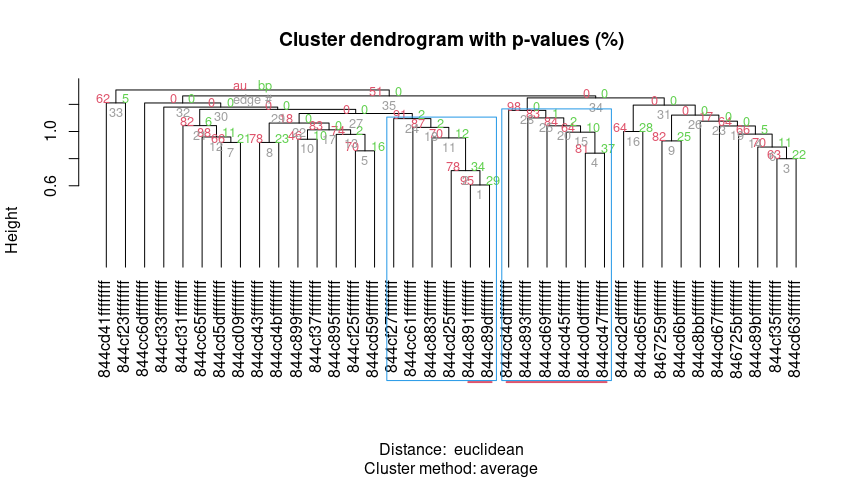
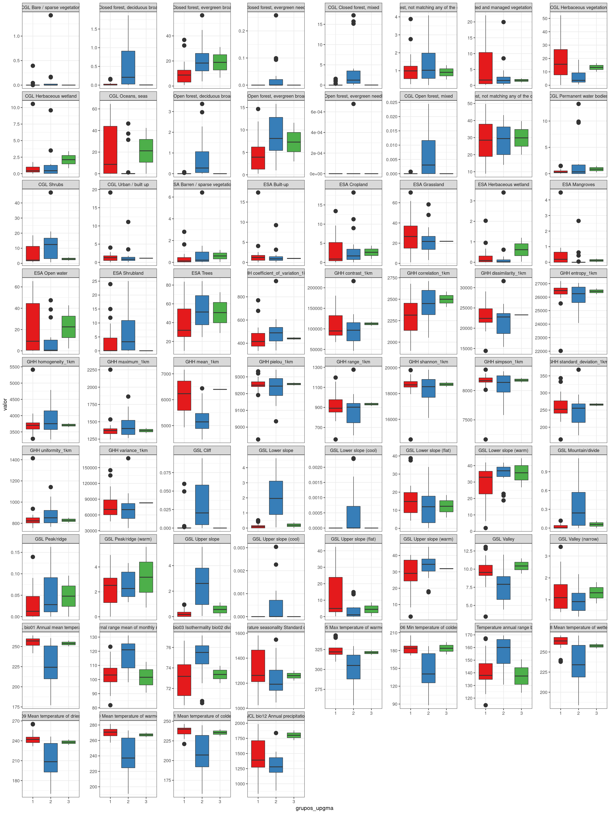
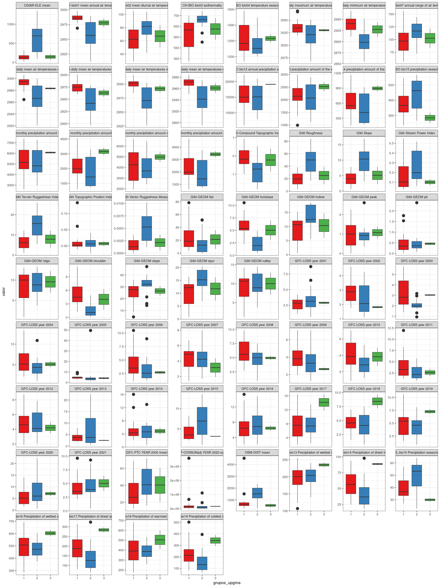

Práctica 99. Resultados de tu manuscrito.
================
José Ramón Martínez Batlle
26-11-2022

# ¿Qué contiene la sección “Resultados”?

Te recomiendo releer las normas para autores/as del [Anuario de
Investigaciones Científicas de la
UASD](../docs/instrucciones-para-autores-anuario-investigaciones-cientificas-UASD.pdf)
y adherirte a las especificaciones sobre la sección “Resultados” que
allí se indican. Aunque en las referidas normas no se incluyen muchas
pautas significativas, si escribieras para una revista específica,
deberás considerar sus normas y recomendaciones de publicación. Además,
te recomiendo que consultes la sección “Resultados” de algunos
manuscritos publicados en el Anuario.

En los resultados expones el contenido analítico central. Es “el qué”
del manuscrito, en complemento de “el cómo” (metodología) y “el por qué”
(introducción) de tu investigación. En los resultados muestras lo que
encontraste luego de que colectaste (aunque en este caso, no fuiste al
terreno) y analizaste, con tus métodos, los datos fuente.

Algunas recomendaciones generales:

- “Resultados” se supone que es la sección más corta del manuscrito,
  siempre que se usen apropiadamente los recursos gráficos, las tablas y
  la información suplementaria.

- Comienza por realizar tus análisis. Necesitarás una matriz de
  comunidad y una ambiental. La de comunidad la habrás generado en la
  práctica 2; la ambiental explico cómo generarla en este mismo cuaderno
  (ver abajo). En general, la matriz ambiental la producirás mediante
  estadísticos zonales del territorio dominicano. Para aprender más
  sobre la fuente de estadística zonal de República Dominicana, que
  contiene un conjunto de más de 100 variables resumidas por celdas H3,
  visita [este repo](https://github.com/geofis/zonal-statistics). Debes
  visitar dicho repo para poder citarlo apropiadamente.

- Cuando tengas análisis realizados, antes de comenzar a escribir, te
  recomiendo que escribas un guión de tu sección “Resultados”.

- Guión en mano, redacta tu sección “Resultados”, siguiendo también
  estos consejos:

- En esta sección, se espera que presentes lo que has obtenido de manera
  “objetiva”, evitando explicaciones, comentarios, opiniones,
  perspectivas o limitaciones. En teoría, tu redacción es “fría”, lo
  cual no necesariamente significa que tenga que ser aburrida.

- Esta es la sección por excelencia donde usarás *tablas y/o gráficos*.
  Lo más importante a tener en cuenta cuando los uses es que no debes
  duplicar el contenido que muestran dichos recursos en el texto. La
  tabla o gráfico son apoyos que te ayudarán a no entrar en densidades
  innecesarias dentro de los párrafos. Por lo tanto, si colocas una
  tabla o figura, no caigas en la tentación de describirla en párrafos
  de forma exhausitva. Estos recursos deben servir para apoyar el o los
  párrafos donde destacas los principales patrones encontrados.

- *Importante también*: si insertas una tabla o gráfico, debes referirla
  en el texto (e.g. “ver figura X”). De nada sirve incluir una figura o
  una tabla si no la refieres, porque con ello estarás sugiriendo que
  dicho recurso era completamente prescindible.

- El tiempo verbal preferido (por defecto) es el pasado, por ejemplo “…,
  donde se **encontró** una asociación significativa entre … y …”. Sin
  embargo, hay excepciones, como por ejemplo, cuando te refieres a una
  tabla o una figura. Un caso típico es la expresión “tal como se
  muestra en la tabla 1”, donde el verbo está conjugado en presente.

A continuación, te pongo enlaces a referencias que considero útiles,
sobre cómo redactar los resultados (algunas son generales, sobre
artículos en general):

- [Breves pautas, en
  inglés](https://www.editage.com/insights/the-secret-to-writing-the-results-and-discussion-section-of-a-manuscript).
  Puedes usar el traductor [DeepL](https://www.deepl.com/translator),
  porque produce frases más naturales.

Cinco guías, en inglés, que considero están bien elaboradas, sobre cómo
redactar un artículo científico (consulta la sección sobre cómo redactar
los *resultados* en cada una):

- [Demystifying the Journal
  Article](https://www.insidehighered.com/advice/2017/05/09/how-write-effective-journal-article-and-get-it-published-essay)

- [How to write a scientific manuscript for
  publication](https://www.ncbi.nlm.nih.gov/pmc/articles/PMC3626472/)

- [11 steps to structuring a science paper editors will take
  seriously](https://www.elsevier.com/connect/11-steps-to-structuring-a-science-paper-editors-will-take-seriously)

- [Cómo escribir un artículo científico por primera
  vez](https://www.sciencedirect.com/science/article/abs/pii/S1134593417300040)
  (necesitarás usar [SciHub](https://sci-hub.se/) para descargarlo)

- Una muy breve pero con consejos útiles: [Tips for writing the perfect
  IMRAD
  manuscript](https://www.editage.com/insights/tips-for-writing-the-perfect-imrad-manuscript)

# Scripts de ejemplo

Una nota, a título informativo. Cada una se las siguientes secciones
(e.g. “Análisis de agrupamiento”, “Ordenación restringida”), es
reproducible de forma autónoma, es decir, sin dependencia de líneas de
código anteriores. Esto siginifica que las dependencias de una sección
se resuelven dentro de ella misma, sin dependencia de líneas anteriores.

Por esta razón, varias secciones comparten texto y código común, pero
sólo al inicio, porque al avanzar cada una se hace propia. Notarás, por
lo tanto, que el texto “se repite a sí mismo” por esta razón; la otra
opción que tenía era alojar el código común en un único archivo, pero
entonces esto te obligaba a navegar por archivos separados, haciendo
menos didáctico este cuaderno.

## Análisis de agrupamiento

Me basaré en los scripts que comienzan por `aa_` de este
[repo](https://github.com/biogeografia-master/scripts-de-analisis-BCI),
los cuales explico en los vídeos de “Análisis de agrupamiento” (del 13
al 16) de la lista de reproducción [“Ecología Numérica con R” de mi
canal](https://www.youtube.com/playlist?list=PLDcT2n8UzsCRDqjqSeqHI1wsiNOqpYmsJ).

> INICIA texto+código común entre secciones

Fijar un directorio de trabajo no es recomendable, mejor trabaja por
proyecto. En cualquier caso, si no quieres o no puedes crear un
proyecto, usa la sentencia que verás abajo, cambiando `TU_DIRECTORIO`
por la ruta del directorio donde tengas almacenados tus datos y tus
scripts.

``` r
# setwd('practicas/')
```

Cargar paquetes.

``` r
library(vegan)
library(sf)
library(tidyverse)
library(tmap)
library(kableExtra)
gh_content <- 'https://raw.githubusercontent.com/'
gh_zonal_stats <- 'https://github.com/geofis/zonal-statistics/raw/main/out/'
repo_analisis <- 'biogeografia-master/scripts-de-analisis-BCI/master'
repo_sem202202 <- 'biogeografia-202202/material-de-apoyo/master/practicas/'
devtools::source_url(paste0(gh_content, repo_analisis, '/biodata/funciones.R'))
devtools::source_url(paste0(gh_content, repo_sem202202, 'train.R'))
devtools::source_url(paste0(gh_content, repo_sem202202, 'funciones.R'))
```

Carga tu matriz de comunidad, que habrás generado en la práctica 2, y
elige un umbral para especies raras o rangos de registros de presencia
para seleccionar especies en una nueva matriz de comunidad.

``` r
res <- 4 #Resolución H3, puedes elegir entre 4, 5, 6 o 7, pero cuidado con valores >=6
# IMPORTANTE: la resolución de las celdas H3, debe coincidir con la resolución
# a la cual generaste tu matriz de comunidad. De lo contrario, obtendrás error. Si tu 
# archivo RDS de matriz de comunidad se denomina "matriz_de_comunidad.RDS", y lo creaste
# usando resolución 4, cámbiale el nombre a "matriz_de_comunidad_res_5.RDS". Recuerda,
# puedes usar cualquier resolución, lo único importante es que las resolución usada en la
# creación de la matriz de comunidad, debe ser la misma que en la ambiental.
mc_orig <- readRDS(paste0("matriz_de_comunidad_res_", res, ".RDS"))
nrow(mc_orig) #Número de filas, equivale a número de hexágonos con registros de presencia
```

    ## [1] 39

``` r
ncol(mc_orig)  #Número de columnas, equivale a número de especies, riqueza
```

    ## [1] 44

``` r
data.frame(Especies = names(mc_orig)) %>% 
  kable(booktabs=T) %>%
  kable_styling(latex_options = c("HOLD_position", "scale_down")) %>%
  gsub(' NA ', '', .) #Lista de especies
```

<table class="table" style="margin-left: auto; margin-right: auto;">
<thead>
<tr>
<th style="text-align:left;">
Especies
</th>
</tr>
</thead>
<tbody>
<tr>
<td style="text-align:left;">
Coccoloba uvifera (L.) L.
</td>
</tr>
<tr>
<td style="text-align:left;">
Antigonon leptopus Hook. & Arn.
</td>
</tr>
<tr>
<td style="text-align:left;">
Coccoloba diversifolia Jacq.
</td>
</tr>
<tr>
<td style="text-align:left;">
Coccoloba P.Browne
</td>
</tr>
<tr>
<td style="text-align:left;">
Coccoloba pubescens L.
</td>
</tr>
<tr>
<td style="text-align:left;">
Coccoloba jimenezii Alain
</td>
</tr>
<tr>
<td style="text-align:left;">
Persicaria punctata (Elliott) Small
</td>
</tr>
<tr>
<td style="text-align:left;">
Coccoloba flavescens Jacq.
</td>
</tr>
<tr>
<td style="text-align:left;">
Leptogonum domingensis var. molle (Urb.) Brandbyge
</td>
</tr>
<tr>
<td style="text-align:left;">
Leptogonum domingense Benth.
</td>
</tr>
<tr>
<td style="text-align:left;">
Leptogonum domingensis Benth.
</td>
</tr>
<tr>
<td style="text-align:left;">
Coccoloba costata Wright
</td>
</tr>
<tr>
<td style="text-align:left;">
Coccoloba incrassata Urb.
</td>
</tr>
<tr>
<td style="text-align:left;">
Coccoloba wrightii Lindau
</td>
</tr>
<tr>
<td style="text-align:left;">
Coccoloba picardae Urb.
</td>
</tr>
<tr>
<td style="text-align:left;">
Rumex acetosella L.
</td>
</tr>
<tr>
<td style="text-align:left;">
Rumex crispus L.
</td>
</tr>
<tr>
<td style="text-align:left;">
Coccoloba leonardii Howard
</td>
</tr>
<tr>
<td style="text-align:left;">
Coccoloba ceibensis O.C.Schmidt
</td>
</tr>
<tr>
<td style="text-align:left;">
Coccoloba venosa L.
</td>
</tr>
<tr>
<td style="text-align:left;">
Coccoloba leoganensis Jacq.
</td>
</tr>
<tr>
<td style="text-align:left;">
Coccoloba microstachya Willd.
</td>
</tr>
<tr>
<td style="text-align:left;">
Coccoloba krugii Lindau
</td>
</tr>
<tr>
<td style="text-align:left;">
Coccoloba buchii O.Schmidt
</td>
</tr>
<tr>
<td style="text-align:left;">
Coccoloba fuertesii Urb.
</td>
</tr>
<tr>
<td style="text-align:left;">
Coccoloba nodosa Lindau
</td>
</tr>
<tr>
<td style="text-align:left;">
Coccoloba pauciflora Urb.
</td>
</tr>
<tr>
<td style="text-align:left;">
Polygonum L.
</td>
</tr>
<tr>
<td style="text-align:left;">
Rumex L.
</td>
</tr>
<tr>
<td style="text-align:left;">
Persicaria pensylvanica (L.) M.Gómez
</td>
</tr>
<tr>
<td style="text-align:left;">
Persicaria hydropiperoides (Michx.) Small
</td>
</tr>
<tr>
<td style="text-align:left;">
Coccoloba samanensis O.C.Schmidt
</td>
</tr>
<tr>
<td style="text-align:left;">
Persicaria ferruginea (Wedd.) Soják
</td>
</tr>
<tr>
<td style="text-align:left;">
Brunnichia ovata (Walter) Shinners
</td>
</tr>
<tr>
<td style="text-align:left;">
Ruprechtia C.A.Mey.
</td>
</tr>
<tr>
<td style="text-align:left;">
Coccoloba subcordata Lindau
</td>
</tr>
<tr>
<td style="text-align:left;">
Polygonum punctatum Kit., 1864
</td>
</tr>
<tr>
<td style="text-align:left;">
Persicaria segetum (Kunth) Small
</td>
</tr>
<tr>
<td style="text-align:left;">
Persicaria acuminata (Kunth) M.Gómez
</td>
</tr>
<tr>
<td style="text-align:left;">
Coccoloba swartzii Meisn.
</td>
</tr>
<tr>
<td style="text-align:left;">
Persicaria lapathifolia subsp. lapathifolia
</td>
</tr>
<tr>
<td style="text-align:left;">
Persicaria glabra (Willd.) M.Gómez
</td>
</tr>
<tr>
<td style="text-align:left;">
Rumex obtusifolius L.
</td>
</tr>
<tr>
<td style="text-align:left;">
Coccoloba obtusifolia Jacq.
</td>
</tr>
</tbody>
</table>

``` r
unique(word(names(mc_orig), 1, 1)) #Géneros representados
```

    ## [1] "Coccoloba"  "Antigonon"  "Persicaria" "Leptogonum" "Rumex"     
    ## [6] "Polygonum"  "Brunnichia" "Ruprechtia"

``` r
table(word(names(mc_orig), 1, 1)) #Número de especies por género
```

    ## 
    ##  Antigonon Brunnichia  Coccoloba Leptogonum Persicaria  Polygonum      Rumex 
    ##          1          1         24          3          8          2          4 
    ## Ruprechtia 
    ##          1

``` r
data.frame(`Número de hexágonos` = sort(colSums(mc_orig), decreasing = T), check.names = F) %>% 
  kable(booktabs=T) %>%
  kable_styling(latex_options = c("HOLD_position", "scale_down")) %>%
  gsub(' NA ', '', .) # Número de hexágonos en los que está presente cada especie
```

<table class="table" style="margin-left: auto; margin-right: auto;">
<thead>
<tr>
<th style="text-align:left;">
</th>
<th style="text-align:right;">
Número de hexágonos
</th>
</tr>
</thead>
<tbody>
<tr>
<td style="text-align:left;">
Coccoloba uvifera (L.) L.
</td>
<td style="text-align:right;">
24
</td>
</tr>
<tr>
<td style="text-align:left;">
Coccoloba diversifolia Jacq.
</td>
<td style="text-align:right;">
18
</td>
</tr>
<tr>
<td style="text-align:left;">
Antigonon leptopus Hook. & Arn.
</td>
<td style="text-align:right;">
15
</td>
</tr>
<tr>
<td style="text-align:left;">
Coccoloba wrightii Lindau
</td>
<td style="text-align:right;">
14
</td>
</tr>
<tr>
<td style="text-align:left;">
Coccoloba costata Wright
</td>
<td style="text-align:right;">
13
</td>
</tr>
<tr>
<td style="text-align:left;">
Persicaria punctata (Elliott) Small
</td>
<td style="text-align:right;">
11
</td>
</tr>
<tr>
<td style="text-align:left;">
Coccoloba P.Browne
</td>
<td style="text-align:right;">
10
</td>
</tr>
<tr>
<td style="text-align:left;">
Coccoloba incrassata Urb.
</td>
<td style="text-align:right;">
10
</td>
</tr>
<tr>
<td style="text-align:left;">
Coccoloba leoganensis Jacq.
</td>
<td style="text-align:right;">
10
</td>
</tr>
<tr>
<td style="text-align:left;">
Coccoloba pubescens L.
</td>
<td style="text-align:right;">
9
</td>
</tr>
<tr>
<td style="text-align:left;">
Coccoloba buchii O.Schmidt
</td>
<td style="text-align:right;">
8
</td>
</tr>
<tr>
<td style="text-align:left;">
Coccoloba fuertesii Urb.
</td>
<td style="text-align:right;">
8
</td>
</tr>
<tr>
<td style="text-align:left;">
Leptogonum domingensis var. molle (Urb.) Brandbyge
</td>
<td style="text-align:right;">
6
</td>
</tr>
<tr>
<td style="text-align:left;">
Leptogonum domingense Benth.
</td>
<td style="text-align:right;">
6
</td>
</tr>
<tr>
<td style="text-align:left;">
Leptogonum domingensis Benth.
</td>
<td style="text-align:right;">
6
</td>
</tr>
<tr>
<td style="text-align:left;">
Coccoloba picardae Urb.
</td>
<td style="text-align:right;">
6
</td>
</tr>
<tr>
<td style="text-align:left;">
Rumex crispus L.
</td>
<td style="text-align:right;">
6
</td>
</tr>
<tr>
<td style="text-align:left;">
Coccoloba ceibensis O.C.Schmidt
</td>
<td style="text-align:right;">
6
</td>
</tr>
<tr>
<td style="text-align:left;">
Coccoloba flavescens Jacq.
</td>
<td style="text-align:right;">
5
</td>
</tr>
<tr>
<td style="text-align:left;">
Polygonum L.
</td>
<td style="text-align:right;">
5
</td>
</tr>
<tr>
<td style="text-align:left;">
Rumex L.
</td>
<td style="text-align:right;">
5
</td>
</tr>
<tr>
<td style="text-align:left;">
Coccoloba krugii Lindau
</td>
<td style="text-align:right;">
4
</td>
</tr>
<tr>
<td style="text-align:left;">
Coccoloba nodosa Lindau
</td>
<td style="text-align:right;">
4
</td>
</tr>
<tr>
<td style="text-align:left;">
Persicaria hydropiperoides (Michx.) Small
</td>
<td style="text-align:right;">
4
</td>
</tr>
<tr>
<td style="text-align:left;">
Polygonum punctatum Kit., 1864
</td>
<td style="text-align:right;">
4
</td>
</tr>
<tr>
<td style="text-align:left;">
Coccoloba microstachya Willd.
</td>
<td style="text-align:right;">
3
</td>
</tr>
<tr>
<td style="text-align:left;">
Coccoloba pauciflora Urb.
</td>
<td style="text-align:right;">
3
</td>
</tr>
<tr>
<td style="text-align:left;">
Persicaria acuminata (Kunth) M.Gómez
</td>
<td style="text-align:right;">
3
</td>
</tr>
<tr>
<td style="text-align:left;">
Coccoloba swartzii Meisn.
</td>
<td style="text-align:right;">
3
</td>
</tr>
<tr>
<td style="text-align:left;">
Coccoloba venosa L.
</td>
<td style="text-align:right;">
2
</td>
</tr>
<tr>
<td style="text-align:left;">
Coccoloba samanensis O.C.Schmidt
</td>
<td style="text-align:right;">
2
</td>
</tr>
<tr>
<td style="text-align:left;">
Persicaria ferruginea (Wedd.) Soják
</td>
<td style="text-align:right;">
2
</td>
</tr>
<tr>
<td style="text-align:left;">
Rumex obtusifolius L.
</td>
<td style="text-align:right;">
2
</td>
</tr>
<tr>
<td style="text-align:left;">
Coccoloba jimenezii Alain
</td>
<td style="text-align:right;">
1
</td>
</tr>
<tr>
<td style="text-align:left;">
Rumex acetosella L.
</td>
<td style="text-align:right;">
1
</td>
</tr>
<tr>
<td style="text-align:left;">
Coccoloba leonardii Howard
</td>
<td style="text-align:right;">
1
</td>
</tr>
<tr>
<td style="text-align:left;">
Persicaria pensylvanica (L.) M.Gómez
</td>
<td style="text-align:right;">
1
</td>
</tr>
<tr>
<td style="text-align:left;">
Brunnichia ovata (Walter) Shinners
</td>
<td style="text-align:right;">
1
</td>
</tr>
<tr>
<td style="text-align:left;">
Ruprechtia C.A.Mey.
</td>
<td style="text-align:right;">
1
</td>
</tr>
<tr>
<td style="text-align:left;">
Coccoloba subcordata Lindau
</td>
<td style="text-align:right;">
1
</td>
</tr>
<tr>
<td style="text-align:left;">
Persicaria segetum (Kunth) Small
</td>
<td style="text-align:right;">
1
</td>
</tr>
<tr>
<td style="text-align:left;">
Persicaria lapathifolia subsp. lapathifolia
</td>
<td style="text-align:right;">
1
</td>
</tr>
<tr>
<td style="text-align:left;">
Persicaria glabra (Willd.) M.Gómez
</td>
<td style="text-align:right;">
1
</td>
</tr>
<tr>
<td style="text-align:left;">
Coccoloba obtusifolia Jacq.
</td>
<td style="text-align:right;">
1
</td>
</tr>
</tbody>
</table>

``` r
# Usa el vector anterior para determinar un umbral o rango de registros para filtrar tu matriz
# ¿En cuántos hexágonos está cada especie? Filtra tus datos usando tu propio criterio.
# Especies que aparecen en pocos hexágonos se consideran "raras". Por ejemplo, si una especie sólo
# aparece en un hexágono en todo el país, es un "singleton", si en dos, "doubleton", y así.
# Estas especies podrían contribuir a generar "ruido" en análisis posteriores, se recomienda excluirlas.
# Elige un valor mínimo (representado por único número entero) o por un rango de enteros (e.g. de 10 a 20),
# para seleccionar las especies que estén mejor representadas de acuerdo a tu criterio.
# Por ejemplo, si usas el valor m, el script considerará a este valor como "el número mínimo de hexágonos
# en los que está representada una especie, y creará una matriz de comunidad de especies seleccionadas
# que están presentes en m hexágonos o más. Si eliges un rango, por ejemplo [m,n], el script generará
# una matriz de comunidad que representadas un mínimo de m hexágonos y un máximo de n hexágonos.
# (ambos extremos inclusive).
en_cuantos_hex <- 1
# Explicación: "en_cuantos_hex <- X", donde X es el número de hexágonos mínimo donde cada especie
# debe estar presente. IMPORTANTE: elige TU PROPIO umbral.
{if(length(en_cuantos_hex)==1) selector <- en_cuantos_hex:max(colSums(mc_orig)) else
  if(length(en_cuantos_hex)==2)
    selector <- min(en_cuantos_hex):max(en_cuantos_hex) else
      stop('Debes indicar uno o dos valores numéricos')}
selector
```

    ##  [1]  1  2  3  4  5  6  7  8  9 10 11 12 13 14 15 16 17 18 19 20 21 22 23 24

``` r
mc_orig_seleccionadas <- mc_orig[, colSums(mc_orig) %in% selector]

# Mínimo número de especies por hexágono
data.frame(`Número de especies por hexágono` = sort(rowSums(mc_orig), decreasing = T), check.names = F) %>% 
  kable(booktabs=T) %>%
  kable_styling(latex_options = c("HOLD_position", "scale_down")) %>%
  gsub(' NA ', '', .) # Número de hexágonos en los que está presente cada especie
```

<table class="table" style="margin-left: auto; margin-right: auto;">
<thead>
<tr>
<th style="text-align:left;">
</th>
<th style="text-align:right;">
Número de especies por hexágono
</th>
</tr>
</thead>
<tbody>
<tr>
<td style="text-align:left;">
844cd43ffffffff
</td>
<td style="text-align:right;">
18
</td>
</tr>
<tr>
<td style="text-align:left;">
844cd45ffffffff
</td>
<td style="text-align:right;">
18
</td>
</tr>
<tr>
<td style="text-align:left;">
844cd0dffffffff
</td>
<td style="text-align:right;">
13
</td>
</tr>
<tr>
<td style="text-align:left;">
844cf35ffffffff
</td>
<td style="text-align:right;">
9
</td>
</tr>
<tr>
<td style="text-align:left;">
844c899ffffffff
</td>
<td style="text-align:right;">
9
</td>
</tr>
<tr>
<td style="text-align:left;">
844cf37ffffffff
</td>
<td style="text-align:right;">
9
</td>
</tr>
<tr>
<td style="text-align:left;">
846725bffffffff
</td>
<td style="text-align:right;">
9
</td>
</tr>
<tr>
<td style="text-align:left;">
844cd47ffffffff
</td>
<td style="text-align:right;">
9
</td>
</tr>
<tr>
<td style="text-align:left;">
844cd59ffffffff
</td>
<td style="text-align:right;">
8
</td>
</tr>
<tr>
<td style="text-align:left;">
844cf31ffffffff
</td>
<td style="text-align:right;">
8
</td>
</tr>
<tr>
<td style="text-align:left;">
844cd5dffffffff
</td>
<td style="text-align:right;">
8
</td>
</tr>
<tr>
<td style="text-align:left;">
844cd69ffffffff
</td>
<td style="text-align:right;">
8
</td>
</tr>
<tr>
<td style="text-align:left;">
844c895ffffffff
</td>
<td style="text-align:right;">
7
</td>
</tr>
<tr>
<td style="text-align:left;">
844c883ffffffff
</td>
<td style="text-align:right;">
7
</td>
</tr>
<tr>
<td style="text-align:left;">
844cd67ffffffff
</td>
<td style="text-align:right;">
7
</td>
</tr>
<tr>
<td style="text-align:left;">
844cd41ffffffff
</td>
<td style="text-align:right;">
7
</td>
</tr>
<tr>
<td style="text-align:left;">
844cd6bffffffff
</td>
<td style="text-align:right;">
7
</td>
</tr>
<tr>
<td style="text-align:left;">
844cf33ffffffff
</td>
<td style="text-align:right;">
6
</td>
</tr>
<tr>
<td style="text-align:left;">
844c89bffffffff
</td>
<td style="text-align:right;">
6
</td>
</tr>
<tr>
<td style="text-align:left;">
844cd63ffffffff
</td>
<td style="text-align:right;">
6
</td>
</tr>
<tr>
<td style="text-align:left;">
844cd4bffffffff
</td>
<td style="text-align:right;">
6
</td>
</tr>
<tr>
<td style="text-align:left;">
844cd09ffffffff
</td>
<td style="text-align:right;">
6
</td>
</tr>
<tr>
<td style="text-align:left;">
844cd2dffffffff
</td>
<td style="text-align:right;">
6
</td>
</tr>
<tr>
<td style="text-align:left;">
844cc65ffffffff
</td>
<td style="text-align:right;">
6
</td>
</tr>
<tr>
<td style="text-align:left;">
844cd65ffffffff
</td>
<td style="text-align:right;">
6
</td>
</tr>
<tr>
<td style="text-align:left;">
844cf25ffffffff
</td>
<td style="text-align:right;">
5
</td>
</tr>
<tr>
<td style="text-align:left;">
844cc6dffffffff
</td>
<td style="text-align:right;">
4
</td>
</tr>
<tr>
<td style="text-align:left;">
8467259ffffffff
</td>
<td style="text-align:right;">
4
</td>
</tr>
<tr>
<td style="text-align:left;">
844c893ffffffff
</td>
<td style="text-align:right;">
4
</td>
</tr>
<tr>
<td style="text-align:left;">
844cc61ffffffff
</td>
<td style="text-align:right;">
3
</td>
</tr>
<tr>
<td style="text-align:left;">
844c891ffffffff
</td>
<td style="text-align:right;">
3
</td>
</tr>
<tr>
<td style="text-align:left;">
844cd25ffffffff
</td>
<td style="text-align:right;">
3
</td>
</tr>
<tr>
<td style="text-align:left;">
844cd4dffffffff
</td>
<td style="text-align:right;">
3
</td>
</tr>
<tr>
<td style="text-align:left;">
844cf27ffffffff
</td>
<td style="text-align:right;">
2
</td>
</tr>
<tr>
<td style="text-align:left;">
844c8bbffffffff
</td>
<td style="text-align:right;">
2
</td>
</tr>
<tr>
<td style="text-align:left;">
844c89dffffffff
</td>
<td style="text-align:right;">
2
</td>
</tr>
<tr>
<td style="text-align:left;">
844cf23ffffffff
</td>
<td style="text-align:right;">
2
</td>
</tr>
<tr>
<td style="text-align:left;">
844cd61ffffffff
</td>
<td style="text-align:right;">
1
</td>
</tr>
<tr>
<td style="text-align:left;">
844c897ffffffff
</td>
<td style="text-align:right;">
1
</td>
</tr>
</tbody>
</table>

``` r
min_especies_por_hex <- 2
# Explicación: "min_especies_por_hex <- Y", donde Y es el número mínimo (inclusive) de especies
# que debe existir en cada hexágono. Por debajo de dicho valor, el hexágono es excluido.
mi_fam <- mc_orig_seleccionadas[rowSums(mc_orig_seleccionadas)>=min_especies_por_hex, ]
nrow(mi_fam)
```

    ## [1] 37

``` r
# mi_fam <- mc_orig_seleccionadas[!rowSums(mc_orig_seleccionadas)==0, ] #Elimina filas sin registros
# rowSums(mi_fam) #Riqueza por hexágonos con especies seleccionadas. Comentado por extenso
all(rowSums(mi_fam)>0) #Debe ser TRUE: todos los hexágonos tienen al menos 1 registro
```

    ## [1] TRUE

``` r
ncol(mi_fam) #Riqueza de especies
```

    ## [1] 44

``` r
# Usar nombres cortos o abreviados para las especies
nombres_largos <- colnames(mi_fam)
(colnames(mi_fam) <- make.cepnames(word(colnames(mi_fam), 1, 2)))
```

    ##  [1] "Coccuvif"   "Antilept"   "Coccdive"   "CoccBrow"   "Coccpube"  
    ##  [6] "Coccjime"   "Perspunc"   "Coccflav"   "Leptdomi"   "Leptdomi.1"
    ## [11] "Leptdomi.2" "Cocccost"   "Coccincr"   "Coccwrig"   "Coccpica"  
    ## [16] "Rumeacet"   "Rumecris"   "Coccleon"   "Coccceib"   "Coccveno"  
    ## [21] "Coccleog"   "Coccmicr"   "Cocckrug"   "Coccbuch"   "Coccfuer"  
    ## [26] "Coccnodo"   "Coccpauc"   "PolyL"      "RumeL"      "Perspens"  
    ## [31] "Pershydr"   "Coccsama"   "Persferr"   "Brunovat"   "RuprMey"   
    ## [36] "Coccsubc"   "Polypunc"   "Perssege"   "Persacum"   "Coccswar"  
    ## [41] "Perslapa"   "Persglab"   "Rumeobtu"   "Coccobtu"

``` r
(df_equivalencias <- data.frame(
  nombre_original = nombres_largos,
  abreviado = colnames(mi_fam)))
```

    ##                                       nombre_original  abreviado
    ## 1                           Coccoloba uvifera (L.) L.   Coccuvif
    ## 2                     Antigonon leptopus Hook. & Arn.   Antilept
    ## 3                        Coccoloba diversifolia Jacq.   Coccdive
    ## 4                                  Coccoloba P.Browne   CoccBrow
    ## 5                              Coccoloba pubescens L.   Coccpube
    ## 6                           Coccoloba jimenezii Alain   Coccjime
    ## 7                 Persicaria punctata (Elliott) Small   Perspunc
    ## 8                          Coccoloba flavescens Jacq.   Coccflav
    ## 9  Leptogonum domingensis var. molle (Urb.) Brandbyge   Leptdomi
    ## 10                       Leptogonum domingense Benth. Leptdomi.1
    ## 11                      Leptogonum domingensis Benth. Leptdomi.2
    ## 12                           Coccoloba costata Wright   Cocccost
    ## 13                          Coccoloba incrassata Urb.   Coccincr
    ## 14                          Coccoloba wrightii Lindau   Coccwrig
    ## 15                            Coccoloba picardae Urb.   Coccpica
    ## 16                                Rumex acetosella L.   Rumeacet
    ## 17                                   Rumex crispus L.   Rumecris
    ## 18                         Coccoloba leonardii Howard   Coccleon
    ## 19                    Coccoloba ceibensis O.C.Schmidt   Coccceib
    ## 20                                Coccoloba venosa L.   Coccveno
    ## 21                        Coccoloba leoganensis Jacq.   Coccleog
    ## 22                      Coccoloba microstachya Willd.   Coccmicr
    ## 23                            Coccoloba krugii Lindau   Cocckrug
    ## 24                         Coccoloba buchii O.Schmidt   Coccbuch
    ## 25                           Coccoloba fuertesii Urb.   Coccfuer
    ## 26                            Coccoloba nodosa Lindau   Coccnodo
    ## 27                          Coccoloba pauciflora Urb.   Coccpauc
    ## 28                                       Polygonum L.      PolyL
    ## 29                                           Rumex L.      RumeL
    ## 30               Persicaria pensylvanica (L.) M.Gómez   Perspens
    ## 31          Persicaria hydropiperoides (Michx.) Small   Pershydr
    ## 32                   Coccoloba samanensis O.C.Schmidt   Coccsama
    ## 33                Persicaria ferruginea (Wedd.) Soják   Persferr
    ## 34                 Brunnichia ovata (Walter) Shinners   Brunovat
    ## 35                                Ruprechtia C.A.Mey.    RuprMey
    ## 36                        Coccoloba subcordata Lindau   Coccsubc
    ## 37                     Polygonum punctatum Kit., 1864   Polypunc
    ## 38                   Persicaria segetum (Kunth) Small   Perssege
    ## 39               Persicaria acuminata (Kunth) M.Gómez   Persacum
    ## 40                          Coccoloba swartzii Meisn.   Coccswar
    ## 41        Persicaria lapathifolia subsp. lapathifolia   Perslapa
    ## 42                 Persicaria glabra (Willd.) M.Gómez   Persglab
    ## 43                              Rumex obtusifolius L.   Rumeobtu
    ## 44                        Coccoloba obtusifolia Jacq.   Coccobtu

Transforma la matriz de comunidad. Este paso es importante, lo explico
[aquí](https://www.youtube.com/watch?v=yQ10lp0-nHc&list=PLDcT2n8UzsCRDqjqSeqHI1wsiNOqpYmsJ&index=10)

``` r
mi_fam_t <- decostand(mi_fam, 'hellinger') #Hellinger
# Otras transformaciones posibles con datos de presencia/ausencia
# mi_fam_t <- decostand(mi_fam, 'normalize') #Chord
# mi_fam_t <- decostand(log1p(mi_fam), 'normalize') #Chord
# mi_fam_t <- decostand(mi_fam, 'chi.square') #Chi-square
```

Genera la matriz ambiental a partir del archivo de estadística zonal por
celdas H3 de República Dominicana, de acuerdo con la resolución que
prefieras. Para el ejemplo, usé la resolución 5, pero puedes usar/probar
con otra, para lo cual, sólo tendrías que cambiar el objeto `res <- X`,
donde `X` puede ser un número cualquiera entre 4 y 7.

Para aprender más sobre la fuente de estadística zonal de República
Dominicana, que contiene un conjunto de más de 100 variables resumidas
por celdas H3, visita [este
repo](https://github.com/geofis/zonal-statistics). Debes visitar dicho
repo para poder citarlo apropiadamente.

``` r
#Matriz ambiental
tmpfile <- tempfile()
download.file(paste0(gh_zonal_stats, 'all_sources_all_variables_res_', res, '.gpkg'), tmpfile)
za <- st_read(tmpfile, optional = T)
```

    ## Reading layer `all_sources_all_variables_res_4' from data source 
    ##   `/tmp/RtmpxezfiL/file3ce0353f249a54' using driver `GPKG'
    ## Simple feature collection with 64 features and 142 fields
    ## Geometry type: POLYGON
    ## Dimension:     XY
    ## Bounding box:  xmin: -72.12371 ymin: 17.2322 xmax: -68.21971 ymax: 20.2506
    ## Geodetic CRS:  WGS 84

``` r
# Las siguientes líneas están comentadas, porque producen muchos mapas. Descoméntalas y ejecútalas si quieres verlos
# za %>% st_as_sf('geom') %>%
#   pivot_longer(cols = -matches('base|hex_id|geom')) %>% 
#   tm_shape() + tm_fill(col = 'value') +
#   tm_facets(by = 'name', free.scales = T)
za_intermedia <- za %>%
  st_drop_geometry() %>% 
  select(-matches(c(' base'))) %>% 
  column_to_rownames('hex_id')
env <- za_intermedia[match(rownames(mi_fam), rownames(za_intermedia)), ]
all(rownames(mi_fam) == rownames(env)) #Si es TRUE, sigue adelante
```

    ## [1] TRUE

Se puede probar con un subconjunto de variables, generando una matriz
ambiental que seleccione variables según el grupo al que pertenecen, con
ayuda del prefijo.

``` r
# env_selecionada <- env %>%
#   st_drop_geometry() %>%
#   dplyr::select(matches('^ESA '))
# env_selecionada <- env %>%
#   st_drop_geometry() %>%
#   dplyr::select(matches('^G90-GEOM '))
# env_selecionada <- env %>%
#   st_drop_geometry() %>%
#   dplyr::select(matches('^CH-BIO '))
# env_selecionada <- env %>%
#   st_drop_geometry() %>%
#   dplyr::select(matches('^GHH '))
# env_selecionada <- env %>%
#   st_drop_geometry() %>%
#   dplyr::select(matches('^GSL '))
# env_selecionada <- env %>%
#   st_drop_geometry() %>%
#   dplyr::select(matches('^CGL '))
```

> FINALIZA texto+código común entre secciones

### Clúster análisis usando distintos métodos. Interpretación y comparación de resultados

> No olvides ejecutar la parte de código común y reutilizable situada
> arriba. Esta subsección necesita de objetos creados en líneas de
> código previas.

A continuación, el **análisis de agrupamiento** propiamente. La parte
más importante es generar un árbol, a partir de una matriz de
distancias, que haga sentido desde el punto de vista de la comunidad y
la distribución de las especies tal como se encuentran en GBIF. Primero
cargaré paquetes específicos de esta técnica y generaré la matriz de
distancias.

``` r
library(broom)
library(cluster)
library(gclus)
library(pvclust)
mi_fam_d <- vegdist(mi_fam_t, "euc")
```

A continuación, generaré árboles usando distintos métodos, explicados en
el
[repo](https://github.com/biogeografia-master/scripts-de-analisis-BCI),
y en los vídeos (13 a 16) de la lista mencionada arriba [“Ecología
Numérica con R” de mi
canal](https://www.youtube.com/playlist?list=PLDcT2n8UzsCRDqjqSeqHI1wsiNOqpYmsJ).

``` r
lista_cl <- list(
        cl_single = hclust(mi_fam_d, method = 'single'),
        cl_complete = hclust(mi_fam_d, method = 'complete'),
        cl_upgma = hclust(mi_fam_d, method = 'average'),
        cl_ward = hclust(mi_fam_d, method = 'ward.D2')
)
par(mfrow = c(2,2))
invisible(map(names(lista_cl), function(x) plot(lista_cl[[x]], main = x, hang = -1, cex = 0.3)))
```

<!-- -->

``` r
par(mfrow = c(1,1))
```

A continuación, calcularé la distancia y la correlación cofenéticas. Se
supone que el método con la mayor correlación cofenética explica mejor
el agrupamiento de la comunidad. Consulta el vídeo y material de
referencia. Normalmente, el método UPGMA obtiene la mayor correlación
cofenética, pero esto se debe a que su procedimiento maximiza
precisamente dicha métrica. No es recomendable conservar un único método
de agrupamiento, normalmente es bueno usar al menos dos. Ward es muchas
veces recomendado por basarse en procedimientos de cálculo muy distintos
a los de UPGMA. Consulta referencias.

``` r
map_df(lista_cl, function(x) {
        coph_d <- cophenetic(x)
        corr <- cor(mi_fam_d, coph_d)
        return(corr)
})
```

    ## # A tibble: 1 × 4
    ##   cl_single cl_complete cl_upgma cl_ward
    ##       <dbl>       <dbl>    <dbl>   <dbl>
    ## 1     0.463       0.546    0.622   0.508

Ahora, calcularé las anchuras de silueta, una métrica que ayuda a
determinar en cuántos grupos se organiza la comunidad. En el ejemplo,
dado que muchas especies de Polygonaceae están ausentes en muchos
hexágonos, es esperable que el procedimiento sugiera un número de grupos
alto denominados (ver objeto impreso `n_grupos_optimos`). Considera la
siguiente regla general: muchos grupos: el número ideal es 3 grupos, de
4 a 6 grupos es aceptable, 7 o más grupos se considera mucho y difícil
de interpretar, es un resultado poco útil; 1 grupo es un resultado sin
sentido.

``` r
# UPGMA
anch_sil_upgma <- calcular_anchuras_siluetas(
        mc_orig = mi_fam, 
        distancias = mi_fam_d, 
        cluster = lista_cl$cl_upgma)
anch_sil_upgma
```

    ## $anchuras_siluetas
    ##  [1] 0.000000000 0.074958547 0.075966342 0.082556084 0.056807619 0.042999536
    ##  [7] 0.044854338 0.032559260 0.045140261 0.043900271 0.060227771 0.062214639
    ## [13] 0.061646669 0.059373073 0.056467486 0.060045461 0.056464519 0.055083787
    ## [19] 0.054298980 0.052364009 0.053493570 0.045274415 0.046959608 0.045526533
    ## [25] 0.043581982 0.038911658 0.043649637 0.039862149 0.037029470 0.032909110
    ## [31] 0.030730777 0.032244672 0.027950840 0.022850839 0.018742172 0.006973952
    ## [37] 0.000000000
    ## 
    ## $n_grupos_optimo
    ## [1] 4

``` r
u_dend_reord <- reorder.hclust(lista_cl$cl_upgma, mi_fam_d)
plot(u_dend_reord, hang = -1)
rect.hclust(
        tree = u_dend_reord,
        k = anch_sil_upgma$n_grupos_optimo)
```

<!-- -->

Método Ward.

``` r
# Ward
anch_sil_ward <- calcular_anchuras_siluetas(
        mc_orig = mi_fam, 
        distancias = mi_fam_d, 
        cluster = lista_cl$cl_ward)
anch_sil_ward
```

    ## $anchuras_siluetas
    ##  [1] 0.000000000 0.083701761 0.086495121 0.071976618 0.067441188 0.068984906
    ##  [7] 0.063718075 0.063842442 0.067816476 0.070579387 0.068359937 0.067817357
    ## [13] 0.069554991 0.067545242 0.067646465 0.065221082 0.066434142 0.067303850
    ## [19] 0.064519013 0.063721555 0.061109286 0.061058618 0.055478695 0.054644157
    ## [25] 0.051963937 0.048319961 0.043649637 0.039862149 0.037029470 0.032909110
    ## [31] 0.030730777 0.032244672 0.027950840 0.022850839 0.018742172 0.006973952
    ## [37] 0.000000000
    ## 
    ## $n_grupos_optimo
    ## [1] 3

``` r
w_dend_reord <- reorder.hclust(lista_cl$cl_ward, mi_fam_d)
plot(w_dend_reord, hang = -1)
rect.hclust(
        tree = w_dend_reord,
        k = anch_sil_ward$n_grupos_optimo)
```

<!-- -->

Por los resultados obtenidos (muchos grupos sugeridos), tanto por el
método UPGMA como por Ward, parecería interesante explorar dos
estrategias adicionales: 1) Cambiar (preferiblemente, aumentar) el
umbral de registros de presencia de especies raras; 2) Probar métodos
“aproximadamente insesgados”, basados en remuestreos y permutaciones.

Probaré lo segundo, pero te animo a que pruebes también la estrategia 1)
(elegir un umbral diferente al que elegiste en primera instancia). Ten
presente que todos los casos son diferentes. Al elegir un umbral (ya sea
un valor mínimo o un rango)

``` r
cl_pvclust_upgma <-
        pvclust(t(mi_fam_t),
                method.hclust = "average",
                method.dist = "euc",
                iseed = 999, # Resultado reproducible
                parallel = TRUE)
```

    ## Creating a temporary cluster...done:
    ## socket cluster with 7 nodes on host 'localhost'
    ## Multiscale bootstrap... Done.

``` r
# Añadir los valores de p
plot(cl_pvclust_upgma, hang = -1)
# Añadir rectángulos a los grupos significativos
lines(cl_pvclust_upgma)
pvrect(cl_pvclust_upgma, alpha = 0.90, border = 4)
```

<!-- -->

Para UPGMA nos sugiere que hay más de 6 grupos, y esto se debe al gran
número de hexágonos con pocos registros de presencia. No obstante,
tratándose de muestras sesgadas, como es el caso de GBIF, es esperable
obtener este tipo de resultados donde la comunidad luce muy atomizada.
Veremos que, aplicando el remuestreo multiescalar por bootstrap al árbol
Ward, el resultado no mejora mucho, pero se sugieren menos grupos.

``` r
# Ward
cl_pvclust_ward <-
        pvclust(t(mi_fam_t),
                method.hclust = "ward.D2",
                method.dist = "euc",
                iseed = 999, # Resultado reproducible
                parallel = TRUE)
```

    ## Creating a temporary cluster...done:
    ## socket cluster with 7 nodes on host 'localhost'
    ## Multiscale bootstrap... Done.

``` r
# Añadir los valores de p
plot(cl_pvclust_ward, hang = -1)
# Añadir rectángulos a los grupos significativos
lines(cl_pvclust_ward)
pvrect(cl_pvclust_ward, alpha = 0.91, border = 4)
```

<!-- -->

Generaré agrupamientos y los exportaré a archivos, para reutilizarlos
más adelante. Elegir un número de grupos no es tarea sencilla, por el
momento probaré con el número de grupos `k` del siguiente bloque de
código, el cual me permitirá caracterízar los distintos hábitats más
fácilmente en función de las variables ambientales.

``` r
k <- 3
# UPGMA
grupos_upgma <- as.factor(cutree(lista_cl$cl_upgma, k = k))
set.seed(999);sample(grupos_upgma, 10) #¿A qué grupo pertenecen 10 hexágonos seleccionados al azar?
```

    ## 844c89dffffffff 844c895ffffffff 844cd59ffffffff 844cd5dffffffff 844cf25ffffffff 
    ##               1               1               1               1               1 
    ## 844cc65ffffffff 844c891ffffffff 844cf27ffffffff 844cf35ffffffff 844cd67ffffffff 
    ##               1               1               1               2               2 
    ## Levels: 1 2 3

``` r
table(grupos_upgma) #¿Cuántos hexágonos hay en cada grupo?
```

    ## grupos_upgma
    ##  1  2  3 
    ## 19 16  2

``` r
plot(u_dend_reord, hang = -1)
rect.hclust(tree = u_dend_reord, k = k)
```

<!-- -->

``` r
# Ward
grupos_ward <- as.factor(cutree(lista_cl$cl_ward, k = k))
set.seed(999);sample(grupos_ward, 10) #¿A qué grupo pertenecen 10 hexágonos seleccionados al azar?
```

    ## 844c89dffffffff 844c895ffffffff 844cd59ffffffff 844cd5dffffffff 844cf25ffffffff 
    ##               1               1               1               1               1 
    ## 844cc65ffffffff 844c891ffffffff 844cf27ffffffff 844cf35ffffffff 844cd67ffffffff 
    ##               1               1               1               2               2 
    ## Levels: 1 2 3

``` r
table(grupos_ward) #¿Cuántos hexágonos hay en cada grupo?
```

    ## grupos_ward
    ##  1  2  3 
    ## 20 11  6

``` r
plot(w_dend_reord, hang = -1)
rect.hclust(tree = w_dend_reord, k = k)
```

<!-- -->

``` r
# Guardaré estos vectores en archivos para reutilizarlos en *scripts* posteriores: 
saveRDS(grupos_upgma, 'grupos_upgma.RDS')
saveRDS(grupos_ward, 'grupos_ward.RDS')
```

### Grupos (clústers), variables ambientales y mapas

> No olvides ejecutar la parte de código común y reutilizable situada
> arriba. Esta subsección necesita de objetos creados en líneas de
> código previas.

Apliquemos el análisis de agrupamiento a la matriz ambiental. La clave
en este punto es que, si la matriz ambiental presenta patrones parecidos
a los de la matriz de comunidad, significa que el agrupamiento utilizado
hace sentido entre ambos conjuntos de datos (comunidad y hábitat) de
forma consistente. Si ambos conjuntos de datos son consistentes,
significa que existe algún grado de asociación.

Cargar paquetes necesarios para esta subsección.

``` r
library(RColorBrewer)
library(leaflet)
library(leaflet.extras)
```

Agrupar los hexágonos de la matriz ambiental.

``` r
(m_amb_upgma <- env %>%
   rownames_to_column('hex_id') %>% 
   mutate(grupos_upgma) %>%
   pivot_longer(-c(grupos_upgma, hex_id), names_to = "variable", values_to = "valor") %>% 
   inner_join(za %>% select(hex_id)))
```

    ## # A tibble: 5,032 × 5
    ##    hex_id          grupos_upgma variable         valor                      geom
    ##    <chr>           <fct>        <chr>            <dbl>             <POLYGON [°]>
    ##  1 844cf25ffffffff 1            ESA Trees      31.9    ((-70.53184 19.95335, -7…
    ##  2 844cf25ffffffff 1            ESA Shrubland   0.0191 ((-70.53184 19.95335, -7…
    ##  3 844cf25ffffffff 1            ESA Grassland  12.1    ((-70.53184 19.95335, -7…
    ##  4 844cf25ffffffff 1            ESA Cropland    0.0599 ((-70.53184 19.95335, -7…
    ##  5 844cf25ffffffff 1            ESA Built-up    1.49   ((-70.53184 19.95335, -7…
    ##  6 844cf25ffffffff 1            ESA Barren / …  0.109  ((-70.53184 19.95335, -7…
    ##  7 844cf25ffffffff 1            ESA Open water 53.3    ((-70.53184 19.95335, -7…
    ##  8 844cf25ffffffff 1            ESA Herbaceou…  0.666  ((-70.53184 19.95335, -7…
    ##  9 844cf25ffffffff 1            ESA Mangroves   0.378  ((-70.53184 19.95335, -7…
    ## 10 844cf25ffffffff 1            CGL Closed fo…  0      ((-70.53184 19.95335, -7…
    ## # … with 5,022 more rows

``` r
(m_amb_ward <- env %>%
    rownames_to_column('hex_id') %>% 
    mutate(grupos_ward) %>%
    pivot_longer(-c(grupos_ward, hex_id), names_to = "variable", values_to = "valor") %>% 
    inner_join(za %>% select(hex_id)))
```

    ## # A tibble: 5,032 × 5
    ##    hex_id          grupos_ward variable          valor                      geom
    ##    <chr>           <fct>       <chr>             <dbl>             <POLYGON [°]>
    ##  1 844cf25ffffffff 1           ESA Trees       31.9    ((-70.53184 19.95335, -7…
    ##  2 844cf25ffffffff 1           ESA Shrubland    0.0191 ((-70.53184 19.95335, -7…
    ##  3 844cf25ffffffff 1           ESA Grassland   12.1    ((-70.53184 19.95335, -7…
    ##  4 844cf25ffffffff 1           ESA Cropland     0.0599 ((-70.53184 19.95335, -7…
    ##  5 844cf25ffffffff 1           ESA Built-up     1.49   ((-70.53184 19.95335, -7…
    ##  6 844cf25ffffffff 1           ESA Barren / s…  0.109  ((-70.53184 19.95335, -7…
    ##  7 844cf25ffffffff 1           ESA Open water  53.3    ((-70.53184 19.95335, -7…
    ##  8 844cf25ffffffff 1           ESA Herbaceous…  0.666  ((-70.53184 19.95335, -7…
    ##  9 844cf25ffffffff 1           ESA Mangroves    0.378  ((-70.53184 19.95335, -7…
    ## 10 844cf25ffffffff 1           CGL Closed for…  0      ((-70.53184 19.95335, -7…
    ## # … with 5,022 more rows

Evaluar efectos entre los grupos (“diferencias significativas”) de los
agrupamientos UPGMA y Ward. Al tratarse de 6 grupos, se utilizan las
pruebas estadísticas ANOVA (evalúa homongeneidad de medias) y
Kruskal-Wallis (evalúa homogeneidad de medianas). Las tablas están
ordenadas en orden ascendente por la columna `p_valor_a`, que son los
p-valores de la prueba ANOVA.

``` r
# UPGMA
m_amb_upgma_ak <- m_amb_upgma %>%
  group_by(variable) %>%
  summarise(
    p_valor_a = tryCatch(oneway.test(valor ~ grupos_upgma)$p.value, error = function(e) NA),
    p_valor_k = tryCatch(kruskal.test(valor ~ grupos_upgma)$p.value, error = function(e) NA)
    ) %>%
  arrange(p_valor_a)
m_amb_upgma_ak %>%
  kable(booktabs=T) %>%
  kable_styling(latex_options = c("HOLD_position", "scale_down")) %>%
  gsub(' NA ', '', .)
```

<table class="table" style="margin-left: auto; margin-right: auto;">
<thead>
<tr>
<th style="text-align:left;">
variable
</th>
<th style="text-align:right;">
p_valor_a
</th>
<th style="text-align:right;">
p_valor_k
</th>
</tr>
</thead>
<tbody>
<tr>
<td style="text-align:left;">
WCL bio14 Precipitation of driest month
</td>
<td style="text-align:right;">
0.0000000
</td>
<td style="text-align:right;">
0.0093832
</td>
</tr>
<tr>
<td style="text-align:left;">
GHH mean_1km
</td>
<td style="text-align:right;">
0.0000001
</td>
<td style="text-align:right;">
0.0020373
</td>
</tr>
<tr>
<td style="text-align:left;">
GFC-LOSS year 2003
</td>
<td style="text-align:right;">
0.0000411
</td>
<td style="text-align:right;">
0.0257689
</td>
</tr>
<tr>
<td style="text-align:left;">
CH-BIO bio12 annual precipitation amount
</td>
<td style="text-align:right;">
0.0000944
</td>
<td style="text-align:right;">
0.3468284
</td>
</tr>
<tr>
<td style="text-align:left;">
GFC-LOSS year 2002
</td>
<td style="text-align:right;">
0.0001831
</td>
<td style="text-align:right;">
0.0366315
</td>
</tr>
<tr>
<td style="text-align:left;">
WCL bio15 Precipitation seasonality
</td>
<td style="text-align:right;">
0.0005920
</td>
<td style="text-align:right;">
0.0124903
</td>
</tr>
<tr>
<td style="text-align:left;">
GFC-LOSS year 2015
</td>
<td style="text-align:right;">
0.0010610
</td>
<td style="text-align:right;">
0.0603920
</td>
</tr>
<tr>
<td style="text-align:left;">
WCL bio17 Precipitation of driest quarter
</td>
<td style="text-align:right;">
0.0014866
</td>
<td style="text-align:right;">
0.0119645
</td>
</tr>
<tr>
<td style="text-align:left;">
ESA Shrubland
</td>
<td style="text-align:right;">
0.0019570
</td>
<td style="text-align:right;">
0.0383247
</td>
</tr>
<tr>
<td style="text-align:left;">
GFC-LOSS year 2013
</td>
<td style="text-align:right;">
0.0021208
</td>
<td style="text-align:right;">
0.6499254
</td>
</tr>
<tr>
<td style="text-align:left;">
CH-BIO bio08 mean daily mean air temperatures of the wettest quarter
</td>
<td style="text-align:right;">
0.0035539
</td>
<td style="text-align:right;">
0.0052884
</td>
</tr>
<tr>
<td style="text-align:left;">
GFC-LOSS year 2009
</td>
<td style="text-align:right;">
0.0037546
</td>
<td style="text-align:right;">
0.2210973
</td>
</tr>
<tr>
<td style="text-align:left;">
CGL Closed forest, deciduous broad leaf
</td>
<td style="text-align:right;">
0.0057378
</td>
<td style="text-align:right;">
0.0020769
</td>
</tr>
<tr>
<td style="text-align:left;">
CH-BIO bio16 mean monthly precipitation amount of the wettest quarter
</td>
<td style="text-align:right;">
0.0066566
</td>
<td style="text-align:right;">
0.5993506
</td>
</tr>
<tr>
<td style="text-align:left;">
WCL bio13 Precipitation of wettest month
</td>
<td style="text-align:right;">
0.0127117
</td>
<td style="text-align:right;">
0.1924671
</td>
</tr>
<tr>
<td style="text-align:left;">
GFC-LOSS year 2019
</td>
<td style="text-align:right;">
0.0136776
</td>
<td style="text-align:right;">
0.1858612
</td>
</tr>
<tr>
<td style="text-align:left;">
CGL Closed forest, mixed
</td>
<td style="text-align:right;">
0.0150754
</td>
<td style="text-align:right;">
0.0004476
</td>
</tr>
<tr>
<td style="text-align:left;">
WCL bio12 Annual precipitation
</td>
<td style="text-align:right;">
0.0168523
</td>
<td style="text-align:right;">
0.0864384
</td>
</tr>
<tr>
<td style="text-align:left;">
CH-BIO bio14 precipitation amount of the driest month
</td>
<td style="text-align:right;">
0.0171498
</td>
<td style="text-align:right;">
0.0536633
</td>
</tr>
<tr>
<td style="text-align:left;">
OSM-DIST mean
</td>
<td style="text-align:right;">
0.0189205
</td>
<td style="text-align:right;">
0.0027742
</td>
</tr>
<tr>
<td style="text-align:left;">
CH-BIO bio19 mean monthly precipitation amount of the coldest quarter
</td>
<td style="text-align:right;">
0.0231912
</td>
<td style="text-align:right;">
0.0891595
</td>
</tr>
<tr>
<td style="text-align:left;">
WCL bio09 Mean temperature of driest quarter
</td>
<td style="text-align:right;">
0.0301545
</td>
<td style="text-align:right;">
0.0003821
</td>
</tr>
<tr>
<td style="text-align:left;">
WCL bio05 Max temperature of warmest month
</td>
<td style="text-align:right;">
0.0319509
</td>
<td style="text-align:right;">
0.0021501
</td>
</tr>
<tr>
<td style="text-align:left;">
CGL Shrubs
</td>
<td style="text-align:right;">
0.0367943
</td>
<td style="text-align:right;">
0.1516233
</td>
</tr>
<tr>
<td style="text-align:left;">
WCL bio10 Mean temperature of warmest quarter
</td>
<td style="text-align:right;">
0.0379048
</td>
<td style="text-align:right;">
0.0003127
</td>
</tr>
<tr>
<td style="text-align:left;">
WCL bio08 Mean temperature of wettest quarter
</td>
<td style="text-align:right;">
0.0385847
</td>
<td style="text-align:right;">
0.0027707
</td>
</tr>
<tr>
<td style="text-align:left;">
G90-GEOM footslope
</td>
<td style="text-align:right;">
0.0404666
</td>
<td style="text-align:right;">
0.0001220
</td>
</tr>
<tr>
<td style="text-align:left;">
WCL bio16 Precipitation of wettest quarter
</td>
<td style="text-align:right;">
0.0454585
</td>
<td style="text-align:right;">
0.1186098
</td>
</tr>
<tr>
<td style="text-align:left;">
G90 Stream Power Index
</td>
<td style="text-align:right;">
0.0477200
</td>
<td style="text-align:right;">
0.0628024
</td>
</tr>
<tr>
<td style="text-align:left;">
CH-BIO bio17 mean monthly precipitation amount of the driest quarter
</td>
<td style="text-align:right;">
0.0478013
</td>
<td style="text-align:right;">
0.0823358
</td>
</tr>
<tr>
<td style="text-align:left;">
GSL Lower slope
</td>
<td style="text-align:right;">
0.0482160
</td>
<td style="text-align:right;">
0.0000142
</td>
</tr>
<tr>
<td style="text-align:left;">
CH-BIO bio05 mean daily maximum air temperature of the warmest month
</td>
<td style="text-align:right;">
0.0508416
</td>
<td style="text-align:right;">
0.1031220
</td>
</tr>
<tr>
<td style="text-align:left;">
CGIAR-ELE mean
</td>
<td style="text-align:right;">
0.0529140
</td>
<td style="text-align:right;">
0.0001136
</td>
</tr>
<tr>
<td style="text-align:left;">
WCL bio01 Annual mean temperature
</td>
<td style="text-align:right;">
0.0547069
</td>
<td style="text-align:right;">
0.0007349
</td>
</tr>
<tr>
<td style="text-align:left;">
GFC-LOSS year 2006
</td>
<td style="text-align:right;">
0.0583226
</td>
<td style="text-align:right;">
0.1181794
</td>
</tr>
<tr>
<td style="text-align:left;">
GSL Upper slope
</td>
<td style="text-align:right;">
0.0588041
</td>
<td style="text-align:right;">
0.0000668
</td>
</tr>
<tr>
<td style="text-align:left;">
WCL bio06 Min temperature of coldest month
</td>
<td style="text-align:right;">
0.0614242
</td>
<td style="text-align:right;">
0.0005740
</td>
</tr>
<tr>
<td style="text-align:left;">
G90-GEOM shoulder
</td>
<td style="text-align:right;">
0.0617641
</td>
<td style="text-align:right;">
0.0004140
</td>
</tr>
<tr>
<td style="text-align:left;">
G90 Slope
</td>
<td style="text-align:right;">
0.0628422
</td>
<td style="text-align:right;">
0.0010443
</td>
</tr>
<tr>
<td style="text-align:left;">
G90 Roughness
</td>
<td style="text-align:right;">
0.0643511
</td>
<td style="text-align:right;">
0.0010443
</td>
</tr>
<tr>
<td style="text-align:left;">
G90 Terrain Ruggedness Index
</td>
<td style="text-align:right;">
0.0644861
</td>
<td style="text-align:right;">
0.0011718
</td>
</tr>
<tr>
<td style="text-align:left;">
CH-BIO bio09 mean daily mean air temperatures of the driest quarter
</td>
<td style="text-align:right;">
0.0651070
</td>
<td style="text-align:right;">
0.0025561
</td>
</tr>
<tr>
<td style="text-align:left;">
CH-BIO bio06 mean daily minimum air temperature of the coldest month
</td>
<td style="text-align:right;">
0.0664850
</td>
<td style="text-align:right;">
0.0008460
</td>
</tr>
<tr>
<td style="text-align:left;">
WCL bio11 Mean temperature of coldest quarter
</td>
<td style="text-align:right;">
0.0672564
</td>
<td style="text-align:right;">
0.0014710
</td>
</tr>
<tr>
<td style="text-align:left;">
CH-BIO bio10 mean daily mean air temperatures of the warmest quarter
</td>
<td style="text-align:right;">
0.0685737
</td>
<td style="text-align:right;">
0.0005168
</td>
</tr>
<tr>
<td style="text-align:left;">
CGL Cultivated and managed vegetation / agriculture
</td>
<td style="text-align:right;">
0.0713045
</td>
<td style="text-align:right;">
0.8734344
</td>
</tr>
<tr>
<td style="text-align:left;">
CH-BIO bio01 mean annual air temperature
</td>
<td style="text-align:right;">
0.0743793
</td>
<td style="text-align:right;">
0.0028654
</td>
</tr>
<tr>
<td style="text-align:left;">
G90 Vector Ruggedness Measure
</td>
<td style="text-align:right;">
0.0774130
</td>
<td style="text-align:right;">
0.0009298
</td>
</tr>
<tr>
<td style="text-align:left;">
CGL Herbaceous vegetation
</td>
<td style="text-align:right;">
0.0791858
</td>
<td style="text-align:right;">
0.0075192
</td>
</tr>
<tr>
<td style="text-align:left;">
CH-BIO bio11 mean daily mean air temperatures of the coldest quarter
</td>
<td style="text-align:right;">
0.0808617
</td>
<td style="text-align:right;">
0.0029752
</td>
</tr>
<tr>
<td style="text-align:left;">
WCL bio19 Precipitation of coldest quarter
</td>
<td style="text-align:right;">
0.0880363
</td>
<td style="text-align:right;">
0.0107647
</td>
</tr>
<tr>
<td style="text-align:left;">
CH-BIO bio15 precipitation seasonality
</td>
<td style="text-align:right;">
0.0881680
</td>
<td style="text-align:right;">
0.0596179
</td>
</tr>
<tr>
<td style="text-align:left;">
WCL bio02 Mean diurnal range mean of monthly max temp - min temp
</td>
<td style="text-align:right;">
0.0910766
</td>
<td style="text-align:right;">
0.0027532
</td>
</tr>
<tr>
<td style="text-align:left;">
CH-BIO bio03 isothermality
</td>
<td style="text-align:right;">
0.1231189
</td>
<td style="text-align:right;">
0.0062938
</td>
</tr>
<tr>
<td style="text-align:left;">
WCL bio07 Temperature annual range bio05-bio06
</td>
<td style="text-align:right;">
0.1285546
</td>
<td style="text-align:right;">
0.0106216
</td>
</tr>
<tr>
<td style="text-align:left;">
GSL Mountain/divide
</td>
<td style="text-align:right;">
0.1305909
</td>
<td style="text-align:right;">
0.0055717
</td>
</tr>
<tr>
<td style="text-align:left;">
GSL Valley
</td>
<td style="text-align:right;">
0.1333601
</td>
<td style="text-align:right;">
0.0139903
</td>
</tr>
<tr>
<td style="text-align:left;">
GFC-LOSS year 2018
</td>
<td style="text-align:right;">
0.1523975
</td>
<td style="text-align:right;">
0.0837533
</td>
</tr>
<tr>
<td style="text-align:left;">
G90-GEOM spur
</td>
<td style="text-align:right;">
0.1630749
</td>
<td style="text-align:right;">
0.0148468
</td>
</tr>
<tr>
<td style="text-align:left;">
WCL bio03 Isothermality bio02 div/bio07
</td>
<td style="text-align:right;">
0.1631541
</td>
<td style="text-align:right;">
0.0331882
</td>
</tr>
<tr>
<td style="text-align:left;">
GFC-LOSS year 2008
</td>
<td style="text-align:right;">
0.1669956
</td>
<td style="text-align:right;">
0.3298989
</td>
</tr>
<tr>
<td style="text-align:left;">
G90 Compound Topographic Index
</td>
<td style="text-align:right;">
0.1675030
</td>
<td style="text-align:right;">
0.0290395
</td>
</tr>
<tr>
<td style="text-align:left;">
G90-GEOM hollow
</td>
<td style="text-align:right;">
0.1783105
</td>
<td style="text-align:right;">
0.0323433
</td>
</tr>
<tr>
<td style="text-align:left;">
GFC-LOSS year 2017
</td>
<td style="text-align:right;">
0.2012877
</td>
<td style="text-align:right;">
0.1494656
</td>
</tr>
<tr>
<td style="text-align:left;">
CGL Closed forest, evergreen broad leaf
</td>
<td style="text-align:right;">
0.2095372
</td>
<td style="text-align:right;">
0.0177234
</td>
</tr>
<tr>
<td style="text-align:left;">
GSL Upper slope (flat)
</td>
<td style="text-align:right;">
0.2225277
</td>
<td style="text-align:right;">
0.0541525
</td>
</tr>
<tr>
<td style="text-align:left;">
CGL Open forest, evergreen broad leaf
</td>
<td style="text-align:right;">
0.2231401
</td>
<td style="text-align:right;">
0.0430708
</td>
</tr>
<tr>
<td style="text-align:left;">
CH-BIO bio02 mean diurnal air temperature range
</td>
<td style="text-align:right;">
0.2344500
</td>
<td style="text-align:right;">
0.0557574
</td>
</tr>
<tr>
<td style="text-align:left;">
G90-GEOM slope
</td>
<td style="text-align:right;">
0.2377763
</td>
<td style="text-align:right;">
0.0241660
</td>
</tr>
<tr>
<td style="text-align:left;">
GHH coefficient_of_variation_1km
</td>
<td style="text-align:right;">
0.2514440
</td>
<td style="text-align:right;">
0.1698723
</td>
</tr>
<tr>
<td style="text-align:left;">
GFC-LOSS year 2010
</td>
<td style="text-align:right;">
0.2608078
</td>
<td style="text-align:right;">
0.1016118
</td>
</tr>
<tr>
<td style="text-align:left;">
GHH correlation_1km
</td>
<td style="text-align:right;">
0.2666053
</td>
<td style="text-align:right;">
0.1772262
</td>
</tr>
<tr>
<td style="text-align:left;">
CGL Bare / sparse vegetation
</td>
<td style="text-align:right;">
0.2772314
</td>
<td style="text-align:right;">
0.3171192
</td>
</tr>
<tr>
<td style="text-align:left;">
CH-BIO bio13 precipitation amount of the wettest month
</td>
<td style="text-align:right;">
0.2808475
</td>
<td style="text-align:right;">
0.5040165
</td>
</tr>
<tr>
<td style="text-align:left;">
ESA Grassland
</td>
<td style="text-align:right;">
0.3011294
</td>
<td style="text-align:right;">
0.6379576
</td>
</tr>
<tr>
<td style="text-align:left;">
ESA Trees
</td>
<td style="text-align:right;">
0.3097435
</td>
<td style="text-align:right;">
0.1053637
</td>
</tr>
<tr>
<td style="text-align:left;">
ESA Built-up
</td>
<td style="text-align:right;">
0.3182437
</td>
<td style="text-align:right;">
0.6757993
</td>
</tr>
<tr>
<td style="text-align:left;">
CH-BIO bio07 annual range of air temperature
</td>
<td style="text-align:right;">
0.3368721
</td>
<td style="text-align:right;">
0.1050934
</td>
</tr>
<tr>
<td style="text-align:left;">
GFC-LOSS year 2011
</td>
<td style="text-align:right;">
0.3379961
</td>
<td style="text-align:right;">
0.2474336
</td>
</tr>
<tr>
<td style="text-align:left;">
CGL Oceans, seas
</td>
<td style="text-align:right;">
0.3452604
</td>
<td style="text-align:right;">
0.0192970
</td>
</tr>
<tr>
<td style="text-align:left;">
CH-BIO bio18 mean monthly precipitation amount of the warmest quarter
</td>
<td style="text-align:right;">
0.3573690
</td>
<td style="text-align:right;">
0.6328557
</td>
</tr>
<tr>
<td style="text-align:left;">
GSL Upper slope (warm)
</td>
<td style="text-align:right;">
0.3604284
</td>
<td style="text-align:right;">
0.5228471
</td>
</tr>
<tr>
<td style="text-align:left;">
CGL Permanent water bodies
</td>
<td style="text-align:right;">
0.3641469
</td>
<td style="text-align:right;">
0.7726897
</td>
</tr>
<tr>
<td style="text-align:left;">
GFC-LOSS year 2004
</td>
<td style="text-align:right;">
0.3714100
</td>
<td style="text-align:right;">
0.3066240
</td>
</tr>
<tr>
<td style="text-align:left;">
GSL Lower slope (warm)
</td>
<td style="text-align:right;">
0.3848969
</td>
<td style="text-align:right;">
0.2160442
</td>
</tr>
<tr>
<td style="text-align:left;">
ESA Mangroves
</td>
<td style="text-align:right;">
0.3852120
</td>
<td style="text-align:right;">
0.1160103
</td>
</tr>
<tr>
<td style="text-align:left;">
GHH homogeneity_1km
</td>
<td style="text-align:right;">
0.3925181
</td>
<td style="text-align:right;">
0.6726193
</td>
</tr>
<tr>
<td style="text-align:left;">
WCL bio04 Temperature seasonality Standard deviation times 100
</td>
<td style="text-align:right;">
0.4022534
</td>
<td style="text-align:right;">
0.1839792
</td>
</tr>
<tr>
<td style="text-align:left;">
GFC-LOSS year 2001
</td>
<td style="text-align:right;">
0.4122135
</td>
<td style="text-align:right;">
0.4627840
</td>
</tr>
<tr>
<td style="text-align:left;">
GFC-PTC YEAR 2000 mean
</td>
<td style="text-align:right;">
0.4161512
</td>
<td style="text-align:right;">
0.3134831
</td>
</tr>
<tr>
<td style="text-align:left;">
GHH uniformity_1km
</td>
<td style="text-align:right;">
0.4188737
</td>
<td style="text-align:right;">
0.6711103
</td>
</tr>
<tr>
<td style="text-align:left;">
ESA Open water
</td>
<td style="text-align:right;">
0.4201508
</td>
<td style="text-align:right;">
0.1544915
</td>
</tr>
<tr>
<td style="text-align:left;">
CGL Urban / built up
</td>
<td style="text-align:right;">
0.4269281
</td>
<td style="text-align:right;">
0.6498160
</td>
</tr>
<tr>
<td style="text-align:left;">
GFC-LOSS year 2020
</td>
<td style="text-align:right;">
0.4446605
</td>
<td style="text-align:right;">
0.4890527
</td>
</tr>
<tr>
<td style="text-align:left;">
GHH dissimilarity_1km
</td>
<td style="text-align:right;">
0.4478995
</td>
<td style="text-align:right;">
0.5217327
</td>
</tr>
<tr>
<td style="text-align:left;">
GHH simpson_1km
</td>
<td style="text-align:right;">
0.4517271
</td>
<td style="text-align:right;">
0.7772972
</td>
</tr>
<tr>
<td style="text-align:left;">
GHH standard_deviation_1km
</td>
<td style="text-align:right;">
0.4520286
</td>
<td style="text-align:right;">
0.5028010
</td>
</tr>
<tr>
<td style="text-align:left;">
GHH maximum_1km
</td>
<td style="text-align:right;">
0.4683755
</td>
<td style="text-align:right;">
0.7598949
</td>
</tr>
<tr>
<td style="text-align:left;">
GSL Valley (narrow)
</td>
<td style="text-align:right;">
0.4743315
</td>
<td style="text-align:right;">
0.4362696
</td>
</tr>
<tr>
<td style="text-align:left;">
G90-GEOM flat
</td>
<td style="text-align:right;">
0.4896346
</td>
<td style="text-align:right;">
0.2570061
</td>
</tr>
<tr>
<td style="text-align:left;">
GHH range_1km
</td>
<td style="text-align:right;">
0.4940378
</td>
<td style="text-align:right;">
0.5605405
</td>
</tr>
<tr>
<td style="text-align:left;">
GHH pielou_1km
</td>
<td style="text-align:right;">
0.5014666
</td>
<td style="text-align:right;">
0.9269989
</td>
</tr>
<tr>
<td style="text-align:left;">
GHH variance_1km
</td>
<td style="text-align:right;">
0.5036342
</td>
<td style="text-align:right;">
0.4175746
</td>
</tr>
<tr>
<td style="text-align:left;">
GSL Peak/ridge
</td>
<td style="text-align:right;">
0.5097334
</td>
<td style="text-align:right;">
0.4264875
</td>
</tr>
<tr>
<td style="text-align:left;">
CH-BIO bio04 temperature seasonality
</td>
<td style="text-align:right;">
0.5368985
</td>
<td style="text-align:right;">
0.5039316
</td>
</tr>
<tr>
<td style="text-align:left;">
GSL Lower slope (flat)
</td>
<td style="text-align:right;">
0.5605818
</td>
<td style="text-align:right;">
0.3360876
</td>
</tr>
<tr>
<td style="text-align:left;">
GHH entropy_1km
</td>
<td style="text-align:right;">
0.5608338
</td>
<td style="text-align:right;">
0.7274544
</td>
</tr>
<tr>
<td style="text-align:left;">
GHH shannon_1km
</td>
<td style="text-align:right;">
0.5677405
</td>
<td style="text-align:right;">
0.7943171
</td>
</tr>
<tr>
<td style="text-align:left;">
GHH contrast_1km
</td>
<td style="text-align:right;">
0.5874150
</td>
<td style="text-align:right;">
0.4832859
</td>
</tr>
<tr>
<td style="text-align:left;">
GFC-LOSS year 2016
</td>
<td style="text-align:right;">
0.6133434
</td>
<td style="text-align:right;">
0.8577361
</td>
</tr>
<tr>
<td style="text-align:left;">
GFC-LOSS year 2005
</td>
<td style="text-align:right;">
0.6270369
</td>
<td style="text-align:right;">
0.0398230
</td>
</tr>
<tr>
<td style="text-align:left;">
WCL bio18 Precipitation of warmest quarter
</td>
<td style="text-align:right;">
0.6303534
</td>
<td style="text-align:right;">
0.4055072
</td>
</tr>
<tr>
<td style="text-align:left;">
GP-CONSUNadj YEAR 2020 sum
</td>
<td style="text-align:right;">
0.6444177
</td>
<td style="text-align:right;">
0.4307381
</td>
</tr>
<tr>
<td style="text-align:left;">
GFC-LOSS year 2007
</td>
<td style="text-align:right;">
0.6867999
</td>
<td style="text-align:right;">
0.5075736
</td>
</tr>
<tr>
<td style="text-align:left;">
CGL Closed forest, not matching any of the other definitions
</td>
<td style="text-align:right;">
0.7094468
</td>
<td style="text-align:right;">
0.9731482
</td>
</tr>
<tr>
<td style="text-align:left;">
ESA Barren / sparse vegetation
</td>
<td style="text-align:right;">
0.7097479
</td>
<td style="text-align:right;">
0.6571915
</td>
</tr>
<tr>
<td style="text-align:left;">
CGL Herbaceous wetland
</td>
<td style="text-align:right;">
0.8120115
</td>
<td style="text-align:right;">
0.4314643
</td>
</tr>
<tr>
<td style="text-align:left;">
G90-GEOM valley
</td>
<td style="text-align:right;">
0.8127601
</td>
<td style="text-align:right;">
0.9010948
</td>
</tr>
<tr>
<td style="text-align:left;">
G90 Topographic Position Index
</td>
<td style="text-align:right;">
0.8521739
</td>
<td style="text-align:right;">
0.9385212
</td>
</tr>
<tr>
<td style="text-align:left;">
GSL Peak/ridge (warm)
</td>
<td style="text-align:right;">
0.8566274
</td>
<td style="text-align:right;">
0.9138203
</td>
</tr>
<tr>
<td style="text-align:left;">
G90-GEOM ridge
</td>
<td style="text-align:right;">
0.8684893
</td>
<td style="text-align:right;">
0.9832546
</td>
</tr>
<tr>
<td style="text-align:left;">
GFC-LOSS year 2012
</td>
<td style="text-align:right;">
0.8761916
</td>
<td style="text-align:right;">
0.9438058
</td>
</tr>
<tr>
<td style="text-align:left;">
GFC-LOSS year 2014
</td>
<td style="text-align:right;">
0.8863523
</td>
<td style="text-align:right;">
0.9438058
</td>
</tr>
<tr>
<td style="text-align:left;">
ESA Cropland
</td>
<td style="text-align:right;">
0.8957637
</td>
<td style="text-align:right;">
0.6316930
</td>
</tr>
<tr>
<td style="text-align:left;">
GFC-LOSS year 2021
</td>
<td style="text-align:right;">
0.8978834
</td>
<td style="text-align:right;">
0.6726193
</td>
</tr>
<tr>
<td style="text-align:left;">
ESA Herbaceous wetland
</td>
<td style="text-align:right;">
0.8984743
</td>
<td style="text-align:right;">
0.2729360
</td>
</tr>
<tr>
<td style="text-align:left;">
G90-GEOM pit
</td>
<td style="text-align:right;">
0.9410879
</td>
<td style="text-align:right;">
0.7921791
</td>
</tr>
<tr>
<td style="text-align:left;">
G90-GEOM peak
</td>
<td style="text-align:right;">
0.9602185
</td>
<td style="text-align:right;">
0.8125533
</td>
</tr>
<tr>
<td style="text-align:left;">
CGL Open forest, not matching any of the other definitions
</td>
<td style="text-align:right;">
0.9943909
</td>
<td style="text-align:right;">
0.9645393
</td>
</tr>
<tr>
<td style="text-align:left;">
CGL Closed forest, evergreen needle leaf
</td>
<td style="text-align:right;">
NaN
</td>
<td style="text-align:right;">
0.0255624
</td>
</tr>
<tr>
<td style="text-align:left;">
CGL Open forest, deciduous broad leaf
</td>
<td style="text-align:right;">
NaN
</td>
<td style="text-align:right;">
0.0000411
</td>
</tr>
<tr>
<td style="text-align:left;">
CGL Open forest, evergreen needle leaf
</td>
<td style="text-align:right;">
NaN
</td>
<td style="text-align:right;">
0.5187932
</td>
</tr>
<tr>
<td style="text-align:left;">
CGL Open forest, mixed
</td>
<td style="text-align:right;">
NaN
</td>
<td style="text-align:right;">
0.0005587
</td>
</tr>
<tr>
<td style="text-align:left;">
GSL Cliff
</td>
<td style="text-align:right;">
NaN
</td>
<td style="text-align:right;">
0.0004644
</td>
</tr>
<tr>
<td style="text-align:left;">
GSL Lower slope (cool)
</td>
<td style="text-align:right;">
NaN
</td>
<td style="text-align:right;">
0.0255624
</td>
</tr>
<tr>
<td style="text-align:left;">
GSL Upper slope (cool)
</td>
<td style="text-align:right;">
NaN
</td>
<td style="text-align:right;">
0.0043649
</td>
</tr>
</tbody>
</table>

``` r
# Ward
m_amb_ward_ak <- m_amb_ward %>%
  group_by(variable) %>%
  summarise(
    p_valor_a = tryCatch(oneway.test(valor ~ grupos_upgma)$p.value, error = function(e) NA),
    p_valor_k = tryCatch(kruskal.test(valor ~ grupos_upgma)$p.value, error = function(e) NA)
    ) %>%
  arrange(p_valor_a)
m_amb_ward_ak %>%
  kable(booktabs=T) %>%
  kable_styling(latex_options = c("HOLD_position", "scale_down")) %>%
  gsub(' NA ', '', .)
```

<table class="table" style="margin-left: auto; margin-right: auto;">
<thead>
<tr>
<th style="text-align:left;">
variable
</th>
<th style="text-align:right;">
p_valor_a
</th>
<th style="text-align:right;">
p_valor_k
</th>
</tr>
</thead>
<tbody>
<tr>
<td style="text-align:left;">
WCL bio14 Precipitation of driest month
</td>
<td style="text-align:right;">
0.0000000
</td>
<td style="text-align:right;">
0.0093832
</td>
</tr>
<tr>
<td style="text-align:left;">
GHH mean_1km
</td>
<td style="text-align:right;">
0.0000001
</td>
<td style="text-align:right;">
0.0020373
</td>
</tr>
<tr>
<td style="text-align:left;">
GFC-LOSS year 2003
</td>
<td style="text-align:right;">
0.0000411
</td>
<td style="text-align:right;">
0.0257689
</td>
</tr>
<tr>
<td style="text-align:left;">
CH-BIO bio12 annual precipitation amount
</td>
<td style="text-align:right;">
0.0000944
</td>
<td style="text-align:right;">
0.3468284
</td>
</tr>
<tr>
<td style="text-align:left;">
GFC-LOSS year 2002
</td>
<td style="text-align:right;">
0.0001831
</td>
<td style="text-align:right;">
0.0366315
</td>
</tr>
<tr>
<td style="text-align:left;">
WCL bio15 Precipitation seasonality
</td>
<td style="text-align:right;">
0.0005920
</td>
<td style="text-align:right;">
0.0124903
</td>
</tr>
<tr>
<td style="text-align:left;">
GFC-LOSS year 2015
</td>
<td style="text-align:right;">
0.0010610
</td>
<td style="text-align:right;">
0.0603920
</td>
</tr>
<tr>
<td style="text-align:left;">
WCL bio17 Precipitation of driest quarter
</td>
<td style="text-align:right;">
0.0014866
</td>
<td style="text-align:right;">
0.0119645
</td>
</tr>
<tr>
<td style="text-align:left;">
ESA Shrubland
</td>
<td style="text-align:right;">
0.0019570
</td>
<td style="text-align:right;">
0.0383247
</td>
</tr>
<tr>
<td style="text-align:left;">
GFC-LOSS year 2013
</td>
<td style="text-align:right;">
0.0021208
</td>
<td style="text-align:right;">
0.6499254
</td>
</tr>
<tr>
<td style="text-align:left;">
CH-BIO bio08 mean daily mean air temperatures of the wettest quarter
</td>
<td style="text-align:right;">
0.0035539
</td>
<td style="text-align:right;">
0.0052884
</td>
</tr>
<tr>
<td style="text-align:left;">
GFC-LOSS year 2009
</td>
<td style="text-align:right;">
0.0037546
</td>
<td style="text-align:right;">
0.2210973
</td>
</tr>
<tr>
<td style="text-align:left;">
CGL Closed forest, deciduous broad leaf
</td>
<td style="text-align:right;">
0.0057378
</td>
<td style="text-align:right;">
0.0020769
</td>
</tr>
<tr>
<td style="text-align:left;">
CH-BIO bio16 mean monthly precipitation amount of the wettest quarter
</td>
<td style="text-align:right;">
0.0066566
</td>
<td style="text-align:right;">
0.5993506
</td>
</tr>
<tr>
<td style="text-align:left;">
WCL bio13 Precipitation of wettest month
</td>
<td style="text-align:right;">
0.0127117
</td>
<td style="text-align:right;">
0.1924671
</td>
</tr>
<tr>
<td style="text-align:left;">
GFC-LOSS year 2019
</td>
<td style="text-align:right;">
0.0136776
</td>
<td style="text-align:right;">
0.1858612
</td>
</tr>
<tr>
<td style="text-align:left;">
CGL Closed forest, mixed
</td>
<td style="text-align:right;">
0.0150754
</td>
<td style="text-align:right;">
0.0004476
</td>
</tr>
<tr>
<td style="text-align:left;">
WCL bio12 Annual precipitation
</td>
<td style="text-align:right;">
0.0168523
</td>
<td style="text-align:right;">
0.0864384
</td>
</tr>
<tr>
<td style="text-align:left;">
CH-BIO bio14 precipitation amount of the driest month
</td>
<td style="text-align:right;">
0.0171498
</td>
<td style="text-align:right;">
0.0536633
</td>
</tr>
<tr>
<td style="text-align:left;">
OSM-DIST mean
</td>
<td style="text-align:right;">
0.0189205
</td>
<td style="text-align:right;">
0.0027742
</td>
</tr>
<tr>
<td style="text-align:left;">
CH-BIO bio19 mean monthly precipitation amount of the coldest quarter
</td>
<td style="text-align:right;">
0.0231912
</td>
<td style="text-align:right;">
0.0891595
</td>
</tr>
<tr>
<td style="text-align:left;">
WCL bio09 Mean temperature of driest quarter
</td>
<td style="text-align:right;">
0.0301545
</td>
<td style="text-align:right;">
0.0003821
</td>
</tr>
<tr>
<td style="text-align:left;">
WCL bio05 Max temperature of warmest month
</td>
<td style="text-align:right;">
0.0319509
</td>
<td style="text-align:right;">
0.0021501
</td>
</tr>
<tr>
<td style="text-align:left;">
CGL Shrubs
</td>
<td style="text-align:right;">
0.0367943
</td>
<td style="text-align:right;">
0.1516233
</td>
</tr>
<tr>
<td style="text-align:left;">
WCL bio10 Mean temperature of warmest quarter
</td>
<td style="text-align:right;">
0.0379048
</td>
<td style="text-align:right;">
0.0003127
</td>
</tr>
<tr>
<td style="text-align:left;">
WCL bio08 Mean temperature of wettest quarter
</td>
<td style="text-align:right;">
0.0385847
</td>
<td style="text-align:right;">
0.0027707
</td>
</tr>
<tr>
<td style="text-align:left;">
G90-GEOM footslope
</td>
<td style="text-align:right;">
0.0404666
</td>
<td style="text-align:right;">
0.0001220
</td>
</tr>
<tr>
<td style="text-align:left;">
WCL bio16 Precipitation of wettest quarter
</td>
<td style="text-align:right;">
0.0454585
</td>
<td style="text-align:right;">
0.1186098
</td>
</tr>
<tr>
<td style="text-align:left;">
G90 Stream Power Index
</td>
<td style="text-align:right;">
0.0477200
</td>
<td style="text-align:right;">
0.0628024
</td>
</tr>
<tr>
<td style="text-align:left;">
CH-BIO bio17 mean monthly precipitation amount of the driest quarter
</td>
<td style="text-align:right;">
0.0478013
</td>
<td style="text-align:right;">
0.0823358
</td>
</tr>
<tr>
<td style="text-align:left;">
GSL Lower slope
</td>
<td style="text-align:right;">
0.0482160
</td>
<td style="text-align:right;">
0.0000142
</td>
</tr>
<tr>
<td style="text-align:left;">
CH-BIO bio05 mean daily maximum air temperature of the warmest month
</td>
<td style="text-align:right;">
0.0508416
</td>
<td style="text-align:right;">
0.1031220
</td>
</tr>
<tr>
<td style="text-align:left;">
CGIAR-ELE mean
</td>
<td style="text-align:right;">
0.0529140
</td>
<td style="text-align:right;">
0.0001136
</td>
</tr>
<tr>
<td style="text-align:left;">
WCL bio01 Annual mean temperature
</td>
<td style="text-align:right;">
0.0547069
</td>
<td style="text-align:right;">
0.0007349
</td>
</tr>
<tr>
<td style="text-align:left;">
GFC-LOSS year 2006
</td>
<td style="text-align:right;">
0.0583226
</td>
<td style="text-align:right;">
0.1181794
</td>
</tr>
<tr>
<td style="text-align:left;">
GSL Upper slope
</td>
<td style="text-align:right;">
0.0588041
</td>
<td style="text-align:right;">
0.0000668
</td>
</tr>
<tr>
<td style="text-align:left;">
WCL bio06 Min temperature of coldest month
</td>
<td style="text-align:right;">
0.0614242
</td>
<td style="text-align:right;">
0.0005740
</td>
</tr>
<tr>
<td style="text-align:left;">
G90-GEOM shoulder
</td>
<td style="text-align:right;">
0.0617641
</td>
<td style="text-align:right;">
0.0004140
</td>
</tr>
<tr>
<td style="text-align:left;">
G90 Slope
</td>
<td style="text-align:right;">
0.0628422
</td>
<td style="text-align:right;">
0.0010443
</td>
</tr>
<tr>
<td style="text-align:left;">
G90 Roughness
</td>
<td style="text-align:right;">
0.0643511
</td>
<td style="text-align:right;">
0.0010443
</td>
</tr>
<tr>
<td style="text-align:left;">
G90 Terrain Ruggedness Index
</td>
<td style="text-align:right;">
0.0644861
</td>
<td style="text-align:right;">
0.0011718
</td>
</tr>
<tr>
<td style="text-align:left;">
CH-BIO bio09 mean daily mean air temperatures of the driest quarter
</td>
<td style="text-align:right;">
0.0651070
</td>
<td style="text-align:right;">
0.0025561
</td>
</tr>
<tr>
<td style="text-align:left;">
CH-BIO bio06 mean daily minimum air temperature of the coldest month
</td>
<td style="text-align:right;">
0.0664850
</td>
<td style="text-align:right;">
0.0008460
</td>
</tr>
<tr>
<td style="text-align:left;">
WCL bio11 Mean temperature of coldest quarter
</td>
<td style="text-align:right;">
0.0672564
</td>
<td style="text-align:right;">
0.0014710
</td>
</tr>
<tr>
<td style="text-align:left;">
CH-BIO bio10 mean daily mean air temperatures of the warmest quarter
</td>
<td style="text-align:right;">
0.0685737
</td>
<td style="text-align:right;">
0.0005168
</td>
</tr>
<tr>
<td style="text-align:left;">
CGL Cultivated and managed vegetation / agriculture
</td>
<td style="text-align:right;">
0.0713045
</td>
<td style="text-align:right;">
0.8734344
</td>
</tr>
<tr>
<td style="text-align:left;">
CH-BIO bio01 mean annual air temperature
</td>
<td style="text-align:right;">
0.0743793
</td>
<td style="text-align:right;">
0.0028654
</td>
</tr>
<tr>
<td style="text-align:left;">
G90 Vector Ruggedness Measure
</td>
<td style="text-align:right;">
0.0774130
</td>
<td style="text-align:right;">
0.0009298
</td>
</tr>
<tr>
<td style="text-align:left;">
CGL Herbaceous vegetation
</td>
<td style="text-align:right;">
0.0791858
</td>
<td style="text-align:right;">
0.0075192
</td>
</tr>
<tr>
<td style="text-align:left;">
CH-BIO bio11 mean daily mean air temperatures of the coldest quarter
</td>
<td style="text-align:right;">
0.0808617
</td>
<td style="text-align:right;">
0.0029752
</td>
</tr>
<tr>
<td style="text-align:left;">
WCL bio19 Precipitation of coldest quarter
</td>
<td style="text-align:right;">
0.0880363
</td>
<td style="text-align:right;">
0.0107647
</td>
</tr>
<tr>
<td style="text-align:left;">
CH-BIO bio15 precipitation seasonality
</td>
<td style="text-align:right;">
0.0881680
</td>
<td style="text-align:right;">
0.0596179
</td>
</tr>
<tr>
<td style="text-align:left;">
WCL bio02 Mean diurnal range mean of monthly max temp - min temp
</td>
<td style="text-align:right;">
0.0910766
</td>
<td style="text-align:right;">
0.0027532
</td>
</tr>
<tr>
<td style="text-align:left;">
CH-BIO bio03 isothermality
</td>
<td style="text-align:right;">
0.1231189
</td>
<td style="text-align:right;">
0.0062938
</td>
</tr>
<tr>
<td style="text-align:left;">
WCL bio07 Temperature annual range bio05-bio06
</td>
<td style="text-align:right;">
0.1285546
</td>
<td style="text-align:right;">
0.0106216
</td>
</tr>
<tr>
<td style="text-align:left;">
GSL Mountain/divide
</td>
<td style="text-align:right;">
0.1305909
</td>
<td style="text-align:right;">
0.0055717
</td>
</tr>
<tr>
<td style="text-align:left;">
GSL Valley
</td>
<td style="text-align:right;">
0.1333601
</td>
<td style="text-align:right;">
0.0139903
</td>
</tr>
<tr>
<td style="text-align:left;">
GFC-LOSS year 2018
</td>
<td style="text-align:right;">
0.1523975
</td>
<td style="text-align:right;">
0.0837533
</td>
</tr>
<tr>
<td style="text-align:left;">
G90-GEOM spur
</td>
<td style="text-align:right;">
0.1630749
</td>
<td style="text-align:right;">
0.0148468
</td>
</tr>
<tr>
<td style="text-align:left;">
WCL bio03 Isothermality bio02 div/bio07
</td>
<td style="text-align:right;">
0.1631541
</td>
<td style="text-align:right;">
0.0331882
</td>
</tr>
<tr>
<td style="text-align:left;">
GFC-LOSS year 2008
</td>
<td style="text-align:right;">
0.1669956
</td>
<td style="text-align:right;">
0.3298989
</td>
</tr>
<tr>
<td style="text-align:left;">
G90 Compound Topographic Index
</td>
<td style="text-align:right;">
0.1675030
</td>
<td style="text-align:right;">
0.0290395
</td>
</tr>
<tr>
<td style="text-align:left;">
G90-GEOM hollow
</td>
<td style="text-align:right;">
0.1783105
</td>
<td style="text-align:right;">
0.0323433
</td>
</tr>
<tr>
<td style="text-align:left;">
GFC-LOSS year 2017
</td>
<td style="text-align:right;">
0.2012877
</td>
<td style="text-align:right;">
0.1494656
</td>
</tr>
<tr>
<td style="text-align:left;">
CGL Closed forest, evergreen broad leaf
</td>
<td style="text-align:right;">
0.2095372
</td>
<td style="text-align:right;">
0.0177234
</td>
</tr>
<tr>
<td style="text-align:left;">
GSL Upper slope (flat)
</td>
<td style="text-align:right;">
0.2225277
</td>
<td style="text-align:right;">
0.0541525
</td>
</tr>
<tr>
<td style="text-align:left;">
CGL Open forest, evergreen broad leaf
</td>
<td style="text-align:right;">
0.2231401
</td>
<td style="text-align:right;">
0.0430708
</td>
</tr>
<tr>
<td style="text-align:left;">
CH-BIO bio02 mean diurnal air temperature range
</td>
<td style="text-align:right;">
0.2344500
</td>
<td style="text-align:right;">
0.0557574
</td>
</tr>
<tr>
<td style="text-align:left;">
G90-GEOM slope
</td>
<td style="text-align:right;">
0.2377763
</td>
<td style="text-align:right;">
0.0241660
</td>
</tr>
<tr>
<td style="text-align:left;">
GHH coefficient_of_variation_1km
</td>
<td style="text-align:right;">
0.2514440
</td>
<td style="text-align:right;">
0.1698723
</td>
</tr>
<tr>
<td style="text-align:left;">
GFC-LOSS year 2010
</td>
<td style="text-align:right;">
0.2608078
</td>
<td style="text-align:right;">
0.1016118
</td>
</tr>
<tr>
<td style="text-align:left;">
GHH correlation_1km
</td>
<td style="text-align:right;">
0.2666053
</td>
<td style="text-align:right;">
0.1772262
</td>
</tr>
<tr>
<td style="text-align:left;">
CGL Bare / sparse vegetation
</td>
<td style="text-align:right;">
0.2772314
</td>
<td style="text-align:right;">
0.3171192
</td>
</tr>
<tr>
<td style="text-align:left;">
CH-BIO bio13 precipitation amount of the wettest month
</td>
<td style="text-align:right;">
0.2808475
</td>
<td style="text-align:right;">
0.5040165
</td>
</tr>
<tr>
<td style="text-align:left;">
ESA Grassland
</td>
<td style="text-align:right;">
0.3011294
</td>
<td style="text-align:right;">
0.6379576
</td>
</tr>
<tr>
<td style="text-align:left;">
ESA Trees
</td>
<td style="text-align:right;">
0.3097435
</td>
<td style="text-align:right;">
0.1053637
</td>
</tr>
<tr>
<td style="text-align:left;">
ESA Built-up
</td>
<td style="text-align:right;">
0.3182437
</td>
<td style="text-align:right;">
0.6757993
</td>
</tr>
<tr>
<td style="text-align:left;">
CH-BIO bio07 annual range of air temperature
</td>
<td style="text-align:right;">
0.3368721
</td>
<td style="text-align:right;">
0.1050934
</td>
</tr>
<tr>
<td style="text-align:left;">
GFC-LOSS year 2011
</td>
<td style="text-align:right;">
0.3379961
</td>
<td style="text-align:right;">
0.2474336
</td>
</tr>
<tr>
<td style="text-align:left;">
CGL Oceans, seas
</td>
<td style="text-align:right;">
0.3452604
</td>
<td style="text-align:right;">
0.0192970
</td>
</tr>
<tr>
<td style="text-align:left;">
CH-BIO bio18 mean monthly precipitation amount of the warmest quarter
</td>
<td style="text-align:right;">
0.3573690
</td>
<td style="text-align:right;">
0.6328557
</td>
</tr>
<tr>
<td style="text-align:left;">
GSL Upper slope (warm)
</td>
<td style="text-align:right;">
0.3604284
</td>
<td style="text-align:right;">
0.5228471
</td>
</tr>
<tr>
<td style="text-align:left;">
CGL Permanent water bodies
</td>
<td style="text-align:right;">
0.3641469
</td>
<td style="text-align:right;">
0.7726897
</td>
</tr>
<tr>
<td style="text-align:left;">
GFC-LOSS year 2004
</td>
<td style="text-align:right;">
0.3714100
</td>
<td style="text-align:right;">
0.3066240
</td>
</tr>
<tr>
<td style="text-align:left;">
GSL Lower slope (warm)
</td>
<td style="text-align:right;">
0.3848969
</td>
<td style="text-align:right;">
0.2160442
</td>
</tr>
<tr>
<td style="text-align:left;">
ESA Mangroves
</td>
<td style="text-align:right;">
0.3852120
</td>
<td style="text-align:right;">
0.1160103
</td>
</tr>
<tr>
<td style="text-align:left;">
GHH homogeneity_1km
</td>
<td style="text-align:right;">
0.3925181
</td>
<td style="text-align:right;">
0.6726193
</td>
</tr>
<tr>
<td style="text-align:left;">
WCL bio04 Temperature seasonality Standard deviation times 100
</td>
<td style="text-align:right;">
0.4022534
</td>
<td style="text-align:right;">
0.1839792
</td>
</tr>
<tr>
<td style="text-align:left;">
GFC-LOSS year 2001
</td>
<td style="text-align:right;">
0.4122135
</td>
<td style="text-align:right;">
0.4627840
</td>
</tr>
<tr>
<td style="text-align:left;">
GFC-PTC YEAR 2000 mean
</td>
<td style="text-align:right;">
0.4161512
</td>
<td style="text-align:right;">
0.3134831
</td>
</tr>
<tr>
<td style="text-align:left;">
GHH uniformity_1km
</td>
<td style="text-align:right;">
0.4188737
</td>
<td style="text-align:right;">
0.6711103
</td>
</tr>
<tr>
<td style="text-align:left;">
ESA Open water
</td>
<td style="text-align:right;">
0.4201508
</td>
<td style="text-align:right;">
0.1544915
</td>
</tr>
<tr>
<td style="text-align:left;">
CGL Urban / built up
</td>
<td style="text-align:right;">
0.4269281
</td>
<td style="text-align:right;">
0.6498160
</td>
</tr>
<tr>
<td style="text-align:left;">
GFC-LOSS year 2020
</td>
<td style="text-align:right;">
0.4446605
</td>
<td style="text-align:right;">
0.4890527
</td>
</tr>
<tr>
<td style="text-align:left;">
GHH dissimilarity_1km
</td>
<td style="text-align:right;">
0.4478995
</td>
<td style="text-align:right;">
0.5217327
</td>
</tr>
<tr>
<td style="text-align:left;">
GHH simpson_1km
</td>
<td style="text-align:right;">
0.4517271
</td>
<td style="text-align:right;">
0.7772972
</td>
</tr>
<tr>
<td style="text-align:left;">
GHH standard_deviation_1km
</td>
<td style="text-align:right;">
0.4520286
</td>
<td style="text-align:right;">
0.5028010
</td>
</tr>
<tr>
<td style="text-align:left;">
GHH maximum_1km
</td>
<td style="text-align:right;">
0.4683755
</td>
<td style="text-align:right;">
0.7598949
</td>
</tr>
<tr>
<td style="text-align:left;">
GSL Valley (narrow)
</td>
<td style="text-align:right;">
0.4743315
</td>
<td style="text-align:right;">
0.4362696
</td>
</tr>
<tr>
<td style="text-align:left;">
G90-GEOM flat
</td>
<td style="text-align:right;">
0.4896346
</td>
<td style="text-align:right;">
0.2570061
</td>
</tr>
<tr>
<td style="text-align:left;">
GHH range_1km
</td>
<td style="text-align:right;">
0.4940378
</td>
<td style="text-align:right;">
0.5605405
</td>
</tr>
<tr>
<td style="text-align:left;">
GHH pielou_1km
</td>
<td style="text-align:right;">
0.5014666
</td>
<td style="text-align:right;">
0.9269989
</td>
</tr>
<tr>
<td style="text-align:left;">
GHH variance_1km
</td>
<td style="text-align:right;">
0.5036342
</td>
<td style="text-align:right;">
0.4175746
</td>
</tr>
<tr>
<td style="text-align:left;">
GSL Peak/ridge
</td>
<td style="text-align:right;">
0.5097334
</td>
<td style="text-align:right;">
0.4264875
</td>
</tr>
<tr>
<td style="text-align:left;">
CH-BIO bio04 temperature seasonality
</td>
<td style="text-align:right;">
0.5368985
</td>
<td style="text-align:right;">
0.5039316
</td>
</tr>
<tr>
<td style="text-align:left;">
GSL Lower slope (flat)
</td>
<td style="text-align:right;">
0.5605818
</td>
<td style="text-align:right;">
0.3360876
</td>
</tr>
<tr>
<td style="text-align:left;">
GHH entropy_1km
</td>
<td style="text-align:right;">
0.5608338
</td>
<td style="text-align:right;">
0.7274544
</td>
</tr>
<tr>
<td style="text-align:left;">
GHH shannon_1km
</td>
<td style="text-align:right;">
0.5677405
</td>
<td style="text-align:right;">
0.7943171
</td>
</tr>
<tr>
<td style="text-align:left;">
GHH contrast_1km
</td>
<td style="text-align:right;">
0.5874150
</td>
<td style="text-align:right;">
0.4832859
</td>
</tr>
<tr>
<td style="text-align:left;">
GFC-LOSS year 2016
</td>
<td style="text-align:right;">
0.6133434
</td>
<td style="text-align:right;">
0.8577361
</td>
</tr>
<tr>
<td style="text-align:left;">
GFC-LOSS year 2005
</td>
<td style="text-align:right;">
0.6270369
</td>
<td style="text-align:right;">
0.0398230
</td>
</tr>
<tr>
<td style="text-align:left;">
WCL bio18 Precipitation of warmest quarter
</td>
<td style="text-align:right;">
0.6303534
</td>
<td style="text-align:right;">
0.4055072
</td>
</tr>
<tr>
<td style="text-align:left;">
GP-CONSUNadj YEAR 2020 sum
</td>
<td style="text-align:right;">
0.6444177
</td>
<td style="text-align:right;">
0.4307381
</td>
</tr>
<tr>
<td style="text-align:left;">
GFC-LOSS year 2007
</td>
<td style="text-align:right;">
0.6867999
</td>
<td style="text-align:right;">
0.5075736
</td>
</tr>
<tr>
<td style="text-align:left;">
CGL Closed forest, not matching any of the other definitions
</td>
<td style="text-align:right;">
0.7094468
</td>
<td style="text-align:right;">
0.9731482
</td>
</tr>
<tr>
<td style="text-align:left;">
ESA Barren / sparse vegetation
</td>
<td style="text-align:right;">
0.7097479
</td>
<td style="text-align:right;">
0.6571915
</td>
</tr>
<tr>
<td style="text-align:left;">
CGL Herbaceous wetland
</td>
<td style="text-align:right;">
0.8120115
</td>
<td style="text-align:right;">
0.4314643
</td>
</tr>
<tr>
<td style="text-align:left;">
G90-GEOM valley
</td>
<td style="text-align:right;">
0.8127601
</td>
<td style="text-align:right;">
0.9010948
</td>
</tr>
<tr>
<td style="text-align:left;">
G90 Topographic Position Index
</td>
<td style="text-align:right;">
0.8521739
</td>
<td style="text-align:right;">
0.9385212
</td>
</tr>
<tr>
<td style="text-align:left;">
GSL Peak/ridge (warm)
</td>
<td style="text-align:right;">
0.8566274
</td>
<td style="text-align:right;">
0.9138203
</td>
</tr>
<tr>
<td style="text-align:left;">
G90-GEOM ridge
</td>
<td style="text-align:right;">
0.8684893
</td>
<td style="text-align:right;">
0.9832546
</td>
</tr>
<tr>
<td style="text-align:left;">
GFC-LOSS year 2012
</td>
<td style="text-align:right;">
0.8761916
</td>
<td style="text-align:right;">
0.9438058
</td>
</tr>
<tr>
<td style="text-align:left;">
GFC-LOSS year 2014
</td>
<td style="text-align:right;">
0.8863523
</td>
<td style="text-align:right;">
0.9438058
</td>
</tr>
<tr>
<td style="text-align:left;">
ESA Cropland
</td>
<td style="text-align:right;">
0.8957637
</td>
<td style="text-align:right;">
0.6316930
</td>
</tr>
<tr>
<td style="text-align:left;">
GFC-LOSS year 2021
</td>
<td style="text-align:right;">
0.8978834
</td>
<td style="text-align:right;">
0.6726193
</td>
</tr>
<tr>
<td style="text-align:left;">
ESA Herbaceous wetland
</td>
<td style="text-align:right;">
0.8984743
</td>
<td style="text-align:right;">
0.2729360
</td>
</tr>
<tr>
<td style="text-align:left;">
G90-GEOM pit
</td>
<td style="text-align:right;">
0.9410879
</td>
<td style="text-align:right;">
0.7921791
</td>
</tr>
<tr>
<td style="text-align:left;">
G90-GEOM peak
</td>
<td style="text-align:right;">
0.9602185
</td>
<td style="text-align:right;">
0.8125533
</td>
</tr>
<tr>
<td style="text-align:left;">
CGL Open forest, not matching any of the other definitions
</td>
<td style="text-align:right;">
0.9943909
</td>
<td style="text-align:right;">
0.9645393
</td>
</tr>
<tr>
<td style="text-align:left;">
CGL Closed forest, evergreen needle leaf
</td>
<td style="text-align:right;">
NaN
</td>
<td style="text-align:right;">
0.0255624
</td>
</tr>
<tr>
<td style="text-align:left;">
CGL Open forest, deciduous broad leaf
</td>
<td style="text-align:right;">
NaN
</td>
<td style="text-align:right;">
0.0000411
</td>
</tr>
<tr>
<td style="text-align:left;">
CGL Open forest, evergreen needle leaf
</td>
<td style="text-align:right;">
NaN
</td>
<td style="text-align:right;">
0.5187932
</td>
</tr>
<tr>
<td style="text-align:left;">
CGL Open forest, mixed
</td>
<td style="text-align:right;">
NaN
</td>
<td style="text-align:right;">
0.0005587
</td>
</tr>
<tr>
<td style="text-align:left;">
GSL Cliff
</td>
<td style="text-align:right;">
NaN
</td>
<td style="text-align:right;">
0.0004644
</td>
</tr>
<tr>
<td style="text-align:left;">
GSL Lower slope (cool)
</td>
<td style="text-align:right;">
NaN
</td>
<td style="text-align:right;">
0.0255624
</td>
</tr>
<tr>
<td style="text-align:left;">
GSL Upper slope (cool)
</td>
<td style="text-align:right;">
NaN
</td>
<td style="text-align:right;">
0.0043649
</td>
</tr>
</tbody>
</table>

Te recomiendo aprender sobre pruebas estadísticas para poder interpretar
con asertividad estos resultados. Igualmente, considera que del
resultado obtenido es difícil extraer conclusiones definitivas o
contundentes, debido a que determinados supuestos para ejecutar el ANOVA
no se cumplen. La prueba de Kruskal-Wallis, que tiene menos requisitos,
surge como alternativa, pero tiene menos potencia que el ANOVA. Otorga a
estos resultados la categoría de “preliminares”, o considéralos como un
“buen punto de partida”.

Normalmente, se considera “0.01” como un umbral convencional (se
denomina “nivel de significancia) por debajo del cual se habla
de”resultado significativo”. Cada fila de las tablas anteriores contiene
el resultado de dos pruebas para una variable. Las primera filas,
muestran las variables que obtuvieron resultados significativos en la
prueba ANOVA, porque las tablas están ordenadas ascendentemente por
medio del p-valor de la prueba ANOVA.

En principio, los resultados significativos indican que, el promedio de
la variable en cuestión (recuerda, cada fila es una variable), no es
homogéneo entre los grupos analizados (e.g. UPGMA o Ward). Por ejemplo,
fíjate en el p-valor de la prueba ANOVA (`p_valor_a`) que obtuvieron
variables como `GFC-LOSS year 2020`, `ESA Open Water` y
`G90-GEOM footslope` por sólo citar 3. Esto significa que, la variable
en cuestión, varía significativamente entre grupos, más allá de lo
esperado por azar. En términos ecológicos, significa que, la variable en
cuestión, podría estar asociada con la composición de la comunidad, por
lo que podríamos seguir explorando dicha variable para determinar si
explica algo de la varianza en la comunidad.

``` r
remesas <- list(primera = colnames(env)[1:68], segunda = colnames(env)[69:136])
map(1:2,
    function(x) {
      m_amb_upgma %>% 
        filter(variable %in% remesas[[x]]) %>% 
        group_by(variable) %>% 
        ggplot() + aes(x = grupos_upgma, y = valor, fill = grupos_upgma) + 
        geom_boxplot(lwd = 0.2) + 
        scale_fill_brewer(palette = 'Set1') +
        theme_bw(base_size=6) +
        theme(legend.position="none") +
        facet_wrap(~ variable, scales = 'free_y', ncol = 8)
    })
```

    ## [[1]]

<!-- -->

    ## 
    ## [[2]]

<!-- -->

``` r
map(1:2,
    function(x) {
      m_amb_ward %>% 
        filter(variable %in% remesas[[x]]) %>% 
        group_by(variable) %>% 
        ggplot() + aes(x = grupos_ward, y = valor, fill = grupos_ward) + 
        geom_boxplot(lwd = 0.2) + 
        scale_fill_brewer(palette = 'Set1') +
        theme_bw(base_size=6) +
        theme(legend.position="none") +
        facet_wrap(~ variable, scales = 'free_y', ncol = 8)
    })
```

    ## [[1]]

<!-- -->

    ## 
    ## [[2]]

<!-- -->

En los diagramas de caja, notarás que, las variables que aparecen en las
primeras filas de las tablas anteriores, son las mismas que presentan
mayor variabilidad de las cajas. Sigo con el ejemplo de las variables
`GFC-LOSS year 2020`, `ESA Open Water` y `G90-GEOM footslope`, y nota
que las anchuras de sus cajas, sus bigotes y la posición de la mediana
(línea interior de la caja), fluctúa mucho entre grupos.

El objetivo de adjuntarle, a la matriz ambiental, el vector de
agrupamiento generado a partir de datos de comunidad, consiste en
caracterizar ambientalmente los hábitats de los subgrupos diferenciados
según su composición. Observando los resultados de las pruebas
estadísticas, de los diagramas de caja, una evaluación rápida sugiere
que los grupos se caracterizan, ambientalmente, de la siguiente manera:

1.  Hábitat del grupo 1. Terrenos predominantemente bajos, en zonas
    costeras o próximos a ella (salvo algún *outlier*), áreas
    construidas con categoría urbanística, o área con coberturas de
    matorral y/o uso agrícola, temperaturas elevadas y precipitaciones
    bajas a moderadas.

2.  Hábitat del grupo 2. Terrenos a elevaciones moderadas y altas, en
    zonas de vertiente, espolones o valles fluviales, con predominio del
    bosque, con dosel cerrado y/o importante cobertura arbórea,
    normalmente con especies latifoliadas, con temperaturas promedio
    moderadas a bajas y precipitaciones elevadas,

3.  Hábitats del grup 3. Terrenos a elevaciones moderadas y altas, pero
    con mayor proporción de zonas llanas que en el grupo 2, con uso
    agrícola o cobertura de herbazal, pero también con porciones de
    bosques, de temperaturas bajas a moderadas, precipitaciones
    moderadas, situados tanto en zonas costeras como moderamente de
    interior, pero no extremadamente continental.

A continuación, muestro mapas de los dos agrupamientos, tanto UPGMA como
Ward, y comparo con algunas de las variables que presentaron efecto.
Usando la función `mapa_leaflet` este bloque genera un mapa interactivo
que colorea los hexágonos en función del grupo al que fueron asignados
de acuerdo al análisis de agrupamiento realizado a la matriz de
comunidad por el método UPGMA. Te recomiendo que uses la función
`mapa_leaflet`, especificando tu matriz ambiental, la variable que
quieras representar y un título, para generar mapas de tus propias
variables seleccionadas.

``` r
m_amb_clusters_sf <- env %>%
  rownames_to_column('hex_id') %>% 
  mutate(
    grupos_upgma = as.character(grupos_upgma),
    grupos_ward = as.character(grupos_ward)) %>%
  inner_join(za %>% select(hex_id)) %>%
  st_as_sf()
mapa_upgma <- mapa_leaflet(
  mapa = m_amb_clusters_sf,
  variable = 'grupos_upgma',
  titulo_leyenda = paste0('UPGMA, k=', k))
mapa_upgma
```

<!-- -->

Ídem anterior, pero según Ward.

``` r
mapa_ward <- mapa_leaflet(
  mapa = m_amb_clusters_sf,
  variable = 'grupos_ward',
  titulo_leyenda = paste0('Ward, k=', k))
mapa_ward
```

<!-- -->

El siguiente bloque de código representa, cartográficamente, algunas
variables que mostraron inhomogeneidad en las pruebas estadísticas, es
decir, variables en las que parecía haber diferencias significativas
entre hexágonos de distintos grupos. Las variables que mostraron
diferencias significativas podrían ayudar a explicar la varianza de la
composición de la comunidad.

``` r
m_amb_upgma_ak$variable[1:10]
```

    ##  [1] "WCL bio14 Precipitation of driest month"  
    ##  [2] "GHH mean_1km"                             
    ##  [3] "GFC-LOSS year 2003"                       
    ##  [4] "CH-BIO bio12 annual precipitation amount" 
    ##  [5] "GFC-LOSS year 2002"                       
    ##  [6] "WCL bio15 Precipitation seasonality"      
    ##  [7] "GFC-LOSS year 2015"                       
    ##  [8] "WCL bio17 Precipitation of driest quarter"
    ##  [9] "ESA Shrubland"                            
    ## [10] "GFC-LOSS year 2013"

``` r
mapa_upgma_v3 <- mapa_leaflet(
  mapa = m_amb_clusters_sf,
  variable = m_amb_upgma_ak$variable[3],
  titulo_leyenda = gsub('(.{1,25})(\\s|$)', '\\1<br>', m_amb_upgma_ak$variable[3]))
mapa_upgma_v3
```

<!-- -->

``` r
mapa_upgma_v4 <- mapa_leaflet(
  mapa = m_amb_clusters_sf,
  variable = m_amb_upgma_ak$variable[4],
  titulo_leyenda = m_amb_upgma_ak$variable[4])
mapa_upgma_v4
```

<!-- -->

## Técnicas de ordenación

Me basaré en los scripts que comienzan por `to_` de este
[repo](https://github.com/biogeografia-master/scripts-de-analisis-BCI),
los cuales explico en los vídeos de “Técnicas de ordenación” de la lista
de reproducción [“Ecología Numérica con R” de mi
canal](https://www.youtube.com/playlist?list=PLDcT2n8UzsCRDqjqSeqHI1wsiNOqpYmsJ).

### Ordenación restringida

> INICIA texto+código común entre secciones

Fijar un directorio de trabajo no es recomendable, mejor trabaja por
proyecto. En cualquier caso, si no quieres o no puedes crear un
proyecto, usa la sentencia que verás abajo, cambiando `TU_DIRECTORIO`
por la ruta del directorio donde tengas almacenados tus datos y tus
scripts.

``` r
# setwd('practicas/')
```

Cargar paquetes.

``` r
library(vegan)
library(sf)
library(tidyverse)
library(tmap)
library(kableExtra)
gh_content <- 'https://raw.githubusercontent.com/'
gh_zonal_stats <- 'https://github.com/geofis/zonal-statistics/raw/main/out/'
repo_analisis <- 'biogeografia-master/scripts-de-analisis-BCI/master'
repo_sem202202 <- 'biogeografia-202202/material-de-apoyo/master/practicas/'
devtools::source_url(paste0(gh_content, repo_analisis, '/biodata/funciones.R'))
devtools::source_url(paste0(gh_content, repo_sem202202, 'train.R'))
devtools::source_url(paste0(gh_content, repo_sem202202, 'funciones.R'))
```

Carga tu matriz de comunidad, que habrás generado en la práctica 2, y
elige un umbral para especies raras o rangos de registros de presencia
para seleccionar especies en una nueva matriz de comunidad.

``` r
res <- 4 #Resolución H3, puedes elegir entre 4, 5, 6 o 7, pero cuidado con valores >=6
# IMPORTANTE: la resolución de las celdas H3, debe coincidir con la resolución
# a la cual generaste tu matriz de comunidad. De lo contrario, obtendrás error. Si tu 
# archivo RDS de matriz de comunidad se denomina "matriz_de_comunidad.RDS", y lo creaste
# usando resolución 4, cámbiale el nombre a "matriz_de_comunidad_res_5.RDS". Recuerda,
# puedes usar cualquier resolución, lo único importante es que las resolución usada en la
# creación de la matriz de comunidad, debe ser la misma que en la ambiental.
mc_orig <- readRDS(paste0("matriz_de_comunidad_res_", res, ".RDS"))
nrow(mc_orig) #Número de filas, equivale a número de hexágonos con registros de presencia
```

    ## [1] 39

``` r
ncol(mc_orig)  #Número de columnas, equivale a número de especies, riqueza
```

    ## [1] 44

``` r
data.frame(Especies = names(mc_orig)) %>% 
  kable(booktabs=T) %>%
  kable_styling(latex_options = c("HOLD_position", "scale_down")) %>%
  gsub(' NA ', '', .) #Lista de especies
```

<table class="table" style="margin-left: auto; margin-right: auto;">
<thead>
<tr>
<th style="text-align:left;">
Especies
</th>
</tr>
</thead>
<tbody>
<tr>
<td style="text-align:left;">
Coccoloba uvifera (L.) L.
</td>
</tr>
<tr>
<td style="text-align:left;">
Antigonon leptopus Hook. & Arn.
</td>
</tr>
<tr>
<td style="text-align:left;">
Coccoloba diversifolia Jacq.
</td>
</tr>
<tr>
<td style="text-align:left;">
Coccoloba P.Browne
</td>
</tr>
<tr>
<td style="text-align:left;">
Coccoloba pubescens L.
</td>
</tr>
<tr>
<td style="text-align:left;">
Coccoloba jimenezii Alain
</td>
</tr>
<tr>
<td style="text-align:left;">
Persicaria punctata (Elliott) Small
</td>
</tr>
<tr>
<td style="text-align:left;">
Coccoloba flavescens Jacq.
</td>
</tr>
<tr>
<td style="text-align:left;">
Leptogonum domingensis var. molle (Urb.) Brandbyge
</td>
</tr>
<tr>
<td style="text-align:left;">
Leptogonum domingense Benth.
</td>
</tr>
<tr>
<td style="text-align:left;">
Leptogonum domingensis Benth.
</td>
</tr>
<tr>
<td style="text-align:left;">
Coccoloba costata Wright
</td>
</tr>
<tr>
<td style="text-align:left;">
Coccoloba incrassata Urb.
</td>
</tr>
<tr>
<td style="text-align:left;">
Coccoloba wrightii Lindau
</td>
</tr>
<tr>
<td style="text-align:left;">
Coccoloba picardae Urb.
</td>
</tr>
<tr>
<td style="text-align:left;">
Rumex acetosella L.
</td>
</tr>
<tr>
<td style="text-align:left;">
Rumex crispus L.
</td>
</tr>
<tr>
<td style="text-align:left;">
Coccoloba leonardii Howard
</td>
</tr>
<tr>
<td style="text-align:left;">
Coccoloba ceibensis O.C.Schmidt
</td>
</tr>
<tr>
<td style="text-align:left;">
Coccoloba venosa L.
</td>
</tr>
<tr>
<td style="text-align:left;">
Coccoloba leoganensis Jacq.
</td>
</tr>
<tr>
<td style="text-align:left;">
Coccoloba microstachya Willd.
</td>
</tr>
<tr>
<td style="text-align:left;">
Coccoloba krugii Lindau
</td>
</tr>
<tr>
<td style="text-align:left;">
Coccoloba buchii O.Schmidt
</td>
</tr>
<tr>
<td style="text-align:left;">
Coccoloba fuertesii Urb.
</td>
</tr>
<tr>
<td style="text-align:left;">
Coccoloba nodosa Lindau
</td>
</tr>
<tr>
<td style="text-align:left;">
Coccoloba pauciflora Urb.
</td>
</tr>
<tr>
<td style="text-align:left;">
Polygonum L.
</td>
</tr>
<tr>
<td style="text-align:left;">
Rumex L.
</td>
</tr>
<tr>
<td style="text-align:left;">
Persicaria pensylvanica (L.) M.Gómez
</td>
</tr>
<tr>
<td style="text-align:left;">
Persicaria hydropiperoides (Michx.) Small
</td>
</tr>
<tr>
<td style="text-align:left;">
Coccoloba samanensis O.C.Schmidt
</td>
</tr>
<tr>
<td style="text-align:left;">
Persicaria ferruginea (Wedd.) Soják
</td>
</tr>
<tr>
<td style="text-align:left;">
Brunnichia ovata (Walter) Shinners
</td>
</tr>
<tr>
<td style="text-align:left;">
Ruprechtia C.A.Mey.
</td>
</tr>
<tr>
<td style="text-align:left;">
Coccoloba subcordata Lindau
</td>
</tr>
<tr>
<td style="text-align:left;">
Polygonum punctatum Kit., 1864
</td>
</tr>
<tr>
<td style="text-align:left;">
Persicaria segetum (Kunth) Small
</td>
</tr>
<tr>
<td style="text-align:left;">
Persicaria acuminata (Kunth) M.Gómez
</td>
</tr>
<tr>
<td style="text-align:left;">
Coccoloba swartzii Meisn.
</td>
</tr>
<tr>
<td style="text-align:left;">
Persicaria lapathifolia subsp. lapathifolia
</td>
</tr>
<tr>
<td style="text-align:left;">
Persicaria glabra (Willd.) M.Gómez
</td>
</tr>
<tr>
<td style="text-align:left;">
Rumex obtusifolius L.
</td>
</tr>
<tr>
<td style="text-align:left;">
Coccoloba obtusifolia Jacq.
</td>
</tr>
</tbody>
</table>

``` r
unique(word(names(mc_orig), 1, 1)) #Géneros representados
```

    ## [1] "Coccoloba"  "Antigonon"  "Persicaria" "Leptogonum" "Rumex"     
    ## [6] "Polygonum"  "Brunnichia" "Ruprechtia"

``` r
table(word(names(mc_orig), 1, 1)) #Número de especies por género
```

    ## 
    ##  Antigonon Brunnichia  Coccoloba Leptogonum Persicaria  Polygonum      Rumex 
    ##          1          1         24          3          8          2          4 
    ## Ruprechtia 
    ##          1

``` r
data.frame(`Número de hexágonos` = sort(colSums(mc_orig), decreasing = T), check.names = F) %>% 
  kable(booktabs=T) %>%
  kable_styling(latex_options = c("HOLD_position", "scale_down")) %>%
  gsub(' NA ', '', .) # Número de hexágonos en los que está presente cada especie
```

<table class="table" style="margin-left: auto; margin-right: auto;">
<thead>
<tr>
<th style="text-align:left;">
</th>
<th style="text-align:right;">
Número de hexágonos
</th>
</tr>
</thead>
<tbody>
<tr>
<td style="text-align:left;">
Coccoloba uvifera (L.) L.
</td>
<td style="text-align:right;">
24
</td>
</tr>
<tr>
<td style="text-align:left;">
Coccoloba diversifolia Jacq.
</td>
<td style="text-align:right;">
18
</td>
</tr>
<tr>
<td style="text-align:left;">
Antigonon leptopus Hook. & Arn.
</td>
<td style="text-align:right;">
15
</td>
</tr>
<tr>
<td style="text-align:left;">
Coccoloba wrightii Lindau
</td>
<td style="text-align:right;">
14
</td>
</tr>
<tr>
<td style="text-align:left;">
Coccoloba costata Wright
</td>
<td style="text-align:right;">
13
</td>
</tr>
<tr>
<td style="text-align:left;">
Persicaria punctata (Elliott) Small
</td>
<td style="text-align:right;">
11
</td>
</tr>
<tr>
<td style="text-align:left;">
Coccoloba P.Browne
</td>
<td style="text-align:right;">
10
</td>
</tr>
<tr>
<td style="text-align:left;">
Coccoloba incrassata Urb.
</td>
<td style="text-align:right;">
10
</td>
</tr>
<tr>
<td style="text-align:left;">
Coccoloba leoganensis Jacq.
</td>
<td style="text-align:right;">
10
</td>
</tr>
<tr>
<td style="text-align:left;">
Coccoloba pubescens L.
</td>
<td style="text-align:right;">
9
</td>
</tr>
<tr>
<td style="text-align:left;">
Coccoloba buchii O.Schmidt
</td>
<td style="text-align:right;">
8
</td>
</tr>
<tr>
<td style="text-align:left;">
Coccoloba fuertesii Urb.
</td>
<td style="text-align:right;">
8
</td>
</tr>
<tr>
<td style="text-align:left;">
Leptogonum domingensis var. molle (Urb.) Brandbyge
</td>
<td style="text-align:right;">
6
</td>
</tr>
<tr>
<td style="text-align:left;">
Leptogonum domingense Benth.
</td>
<td style="text-align:right;">
6
</td>
</tr>
<tr>
<td style="text-align:left;">
Leptogonum domingensis Benth.
</td>
<td style="text-align:right;">
6
</td>
</tr>
<tr>
<td style="text-align:left;">
Coccoloba picardae Urb.
</td>
<td style="text-align:right;">
6
</td>
</tr>
<tr>
<td style="text-align:left;">
Rumex crispus L.
</td>
<td style="text-align:right;">
6
</td>
</tr>
<tr>
<td style="text-align:left;">
Coccoloba ceibensis O.C.Schmidt
</td>
<td style="text-align:right;">
6
</td>
</tr>
<tr>
<td style="text-align:left;">
Coccoloba flavescens Jacq.
</td>
<td style="text-align:right;">
5
</td>
</tr>
<tr>
<td style="text-align:left;">
Polygonum L.
</td>
<td style="text-align:right;">
5
</td>
</tr>
<tr>
<td style="text-align:left;">
Rumex L.
</td>
<td style="text-align:right;">
5
</td>
</tr>
<tr>
<td style="text-align:left;">
Coccoloba krugii Lindau
</td>
<td style="text-align:right;">
4
</td>
</tr>
<tr>
<td style="text-align:left;">
Coccoloba nodosa Lindau
</td>
<td style="text-align:right;">
4
</td>
</tr>
<tr>
<td style="text-align:left;">
Persicaria hydropiperoides (Michx.) Small
</td>
<td style="text-align:right;">
4
</td>
</tr>
<tr>
<td style="text-align:left;">
Polygonum punctatum Kit., 1864
</td>
<td style="text-align:right;">
4
</td>
</tr>
<tr>
<td style="text-align:left;">
Coccoloba microstachya Willd.
</td>
<td style="text-align:right;">
3
</td>
</tr>
<tr>
<td style="text-align:left;">
Coccoloba pauciflora Urb.
</td>
<td style="text-align:right;">
3
</td>
</tr>
<tr>
<td style="text-align:left;">
Persicaria acuminata (Kunth) M.Gómez
</td>
<td style="text-align:right;">
3
</td>
</tr>
<tr>
<td style="text-align:left;">
Coccoloba swartzii Meisn.
</td>
<td style="text-align:right;">
3
</td>
</tr>
<tr>
<td style="text-align:left;">
Coccoloba venosa L.
</td>
<td style="text-align:right;">
2
</td>
</tr>
<tr>
<td style="text-align:left;">
Coccoloba samanensis O.C.Schmidt
</td>
<td style="text-align:right;">
2
</td>
</tr>
<tr>
<td style="text-align:left;">
Persicaria ferruginea (Wedd.) Soják
</td>
<td style="text-align:right;">
2
</td>
</tr>
<tr>
<td style="text-align:left;">
Rumex obtusifolius L.
</td>
<td style="text-align:right;">
2
</td>
</tr>
<tr>
<td style="text-align:left;">
Coccoloba jimenezii Alain
</td>
<td style="text-align:right;">
1
</td>
</tr>
<tr>
<td style="text-align:left;">
Rumex acetosella L.
</td>
<td style="text-align:right;">
1
</td>
</tr>
<tr>
<td style="text-align:left;">
Coccoloba leonardii Howard
</td>
<td style="text-align:right;">
1
</td>
</tr>
<tr>
<td style="text-align:left;">
Persicaria pensylvanica (L.) M.Gómez
</td>
<td style="text-align:right;">
1
</td>
</tr>
<tr>
<td style="text-align:left;">
Brunnichia ovata (Walter) Shinners
</td>
<td style="text-align:right;">
1
</td>
</tr>
<tr>
<td style="text-align:left;">
Ruprechtia C.A.Mey.
</td>
<td style="text-align:right;">
1
</td>
</tr>
<tr>
<td style="text-align:left;">
Coccoloba subcordata Lindau
</td>
<td style="text-align:right;">
1
</td>
</tr>
<tr>
<td style="text-align:left;">
Persicaria segetum (Kunth) Small
</td>
<td style="text-align:right;">
1
</td>
</tr>
<tr>
<td style="text-align:left;">
Persicaria lapathifolia subsp. lapathifolia
</td>
<td style="text-align:right;">
1
</td>
</tr>
<tr>
<td style="text-align:left;">
Persicaria glabra (Willd.) M.Gómez
</td>
<td style="text-align:right;">
1
</td>
</tr>
<tr>
<td style="text-align:left;">
Coccoloba obtusifolia Jacq.
</td>
<td style="text-align:right;">
1
</td>
</tr>
</tbody>
</table>

``` r
# Usa el vector anterior para determinar un umbral o rango de registros para filtrar tu matriz
# ¿En cuántos hexágonos está cada especie? Filtra tus datos usando tu propio criterio.
# Especies que aparecen en pocos hexágonos se consideran "raras". Por ejemplo, si una especie sólo
# aparece en un hexágono en todo el país, es un "singleton", si en dos, "doubleton", y así.
# Estas especies podrían contribuir a generar "ruido" en análisis posteriores, se recomienda excluirlas.
# Elige un valor mínimo (representado por único número entero) o por un rango de enteros (e.g. de 10 a 20),
# para seleccionar las especies que estén mejor representadas de acuerdo a tu criterio.
# Por ejemplo, si usas el valor m, el script considerará a este valor como "el número mínimo de hexágonos
# en los que está representada una especie, y creará una matriz de comunidad de especies seleccionadas
# que están presentes en m hexágonos o más. Si eliges un rango, por ejemplo [m,n], el script generará
# una matriz de comunidad que representadas un mínimo de m hexágonos y un máximo de n hexágonos.
# (ambos extremos inclusive).
en_cuantos_hex <- 1
# Explicación: "en_cuantos_hex <- X", donde X es el número de hexágonos mínimo donde cada especie
# debe estar presente. IMPORTANTE: elige TU PROPIO umbral.
{if(length(en_cuantos_hex)==1) selector <- en_cuantos_hex:max(colSums(mc_orig)) else
  if(length(en_cuantos_hex)==2)
    selector <- min(en_cuantos_hex):max(en_cuantos_hex) else
      stop('Debes indicar uno o dos valores numéricos')}
selector
```

    ##  [1]  1  2  3  4  5  6  7  8  9 10 11 12 13 14 15 16 17 18 19 20 21 22 23 24

``` r
mc_orig_seleccionadas <- mc_orig[, colSums(mc_orig) %in% selector]

# Mínimo número de especies por hexágono
data.frame(`Número de especies por hexágono` = sort(rowSums(mc_orig), decreasing = T), check.names = F) %>% 
  kable(booktabs=T) %>%
  kable_styling(latex_options = c("HOLD_position", "scale_down")) %>%
  gsub(' NA ', '', .) # Número de hexágonos en los que está presente cada especie
```

<table class="table" style="margin-left: auto; margin-right: auto;">
<thead>
<tr>
<th style="text-align:left;">
</th>
<th style="text-align:right;">
Número de especies por hexágono
</th>
</tr>
</thead>
<tbody>
<tr>
<td style="text-align:left;">
844cd43ffffffff
</td>
<td style="text-align:right;">
18
</td>
</tr>
<tr>
<td style="text-align:left;">
844cd45ffffffff
</td>
<td style="text-align:right;">
18
</td>
</tr>
<tr>
<td style="text-align:left;">
844cd0dffffffff
</td>
<td style="text-align:right;">
13
</td>
</tr>
<tr>
<td style="text-align:left;">
844cf35ffffffff
</td>
<td style="text-align:right;">
9
</td>
</tr>
<tr>
<td style="text-align:left;">
844c899ffffffff
</td>
<td style="text-align:right;">
9
</td>
</tr>
<tr>
<td style="text-align:left;">
844cf37ffffffff
</td>
<td style="text-align:right;">
9
</td>
</tr>
<tr>
<td style="text-align:left;">
846725bffffffff
</td>
<td style="text-align:right;">
9
</td>
</tr>
<tr>
<td style="text-align:left;">
844cd47ffffffff
</td>
<td style="text-align:right;">
9
</td>
</tr>
<tr>
<td style="text-align:left;">
844cd59ffffffff
</td>
<td style="text-align:right;">
8
</td>
</tr>
<tr>
<td style="text-align:left;">
844cf31ffffffff
</td>
<td style="text-align:right;">
8
</td>
</tr>
<tr>
<td style="text-align:left;">
844cd5dffffffff
</td>
<td style="text-align:right;">
8
</td>
</tr>
<tr>
<td style="text-align:left;">
844cd69ffffffff
</td>
<td style="text-align:right;">
8
</td>
</tr>
<tr>
<td style="text-align:left;">
844c895ffffffff
</td>
<td style="text-align:right;">
7
</td>
</tr>
<tr>
<td style="text-align:left;">
844c883ffffffff
</td>
<td style="text-align:right;">
7
</td>
</tr>
<tr>
<td style="text-align:left;">
844cd67ffffffff
</td>
<td style="text-align:right;">
7
</td>
</tr>
<tr>
<td style="text-align:left;">
844cd41ffffffff
</td>
<td style="text-align:right;">
7
</td>
</tr>
<tr>
<td style="text-align:left;">
844cd6bffffffff
</td>
<td style="text-align:right;">
7
</td>
</tr>
<tr>
<td style="text-align:left;">
844cf33ffffffff
</td>
<td style="text-align:right;">
6
</td>
</tr>
<tr>
<td style="text-align:left;">
844c89bffffffff
</td>
<td style="text-align:right;">
6
</td>
</tr>
<tr>
<td style="text-align:left;">
844cd63ffffffff
</td>
<td style="text-align:right;">
6
</td>
</tr>
<tr>
<td style="text-align:left;">
844cd4bffffffff
</td>
<td style="text-align:right;">
6
</td>
</tr>
<tr>
<td style="text-align:left;">
844cd09ffffffff
</td>
<td style="text-align:right;">
6
</td>
</tr>
<tr>
<td style="text-align:left;">
844cd2dffffffff
</td>
<td style="text-align:right;">
6
</td>
</tr>
<tr>
<td style="text-align:left;">
844cc65ffffffff
</td>
<td style="text-align:right;">
6
</td>
</tr>
<tr>
<td style="text-align:left;">
844cd65ffffffff
</td>
<td style="text-align:right;">
6
</td>
</tr>
<tr>
<td style="text-align:left;">
844cf25ffffffff
</td>
<td style="text-align:right;">
5
</td>
</tr>
<tr>
<td style="text-align:left;">
844cc6dffffffff
</td>
<td style="text-align:right;">
4
</td>
</tr>
<tr>
<td style="text-align:left;">
8467259ffffffff
</td>
<td style="text-align:right;">
4
</td>
</tr>
<tr>
<td style="text-align:left;">
844c893ffffffff
</td>
<td style="text-align:right;">
4
</td>
</tr>
<tr>
<td style="text-align:left;">
844cc61ffffffff
</td>
<td style="text-align:right;">
3
</td>
</tr>
<tr>
<td style="text-align:left;">
844c891ffffffff
</td>
<td style="text-align:right;">
3
</td>
</tr>
<tr>
<td style="text-align:left;">
844cd25ffffffff
</td>
<td style="text-align:right;">
3
</td>
</tr>
<tr>
<td style="text-align:left;">
844cd4dffffffff
</td>
<td style="text-align:right;">
3
</td>
</tr>
<tr>
<td style="text-align:left;">
844cf27ffffffff
</td>
<td style="text-align:right;">
2
</td>
</tr>
<tr>
<td style="text-align:left;">
844c8bbffffffff
</td>
<td style="text-align:right;">
2
</td>
</tr>
<tr>
<td style="text-align:left;">
844c89dffffffff
</td>
<td style="text-align:right;">
2
</td>
</tr>
<tr>
<td style="text-align:left;">
844cf23ffffffff
</td>
<td style="text-align:right;">
2
</td>
</tr>
<tr>
<td style="text-align:left;">
844cd61ffffffff
</td>
<td style="text-align:right;">
1
</td>
</tr>
<tr>
<td style="text-align:left;">
844c897ffffffff
</td>
<td style="text-align:right;">
1
</td>
</tr>
</tbody>
</table>

``` r
min_especies_por_hex <- 2
# Explicación: "min_especies_por_hex <- Y", donde Y es el número mínimo (inclusive) de especies
# que debe existir en cada hexágono. Por debajo de dicho valor, el hexágono es excluido.
mi_fam <- mc_orig_seleccionadas[rowSums(mc_orig_seleccionadas)>=min_especies_por_hex, ]
nrow(mi_fam)
```

    ## [1] 37

``` r
# mi_fam <- mc_orig_seleccionadas[!rowSums(mc_orig_seleccionadas)==0, ] #Elimina filas sin registros
# rowSums(mi_fam) #Riqueza por hexágonos con especies seleccionadas. Comentado por extenso
all(rowSums(mi_fam)>0) #Debe ser TRUE: todos los hexágonos tienen al menos 1 registro
```

    ## [1] TRUE

``` r
ncol(mi_fam) #Riqueza de especies
```

    ## [1] 44

``` r
# Usar nombres cortos o abreviados para las especies
nombres_largos <- colnames(mi_fam)
(colnames(mi_fam) <- make.cepnames(word(colnames(mi_fam), 1, 2)))
```

    ##  [1] "Coccuvif"   "Antilept"   "Coccdive"   "CoccBrow"   "Coccpube"  
    ##  [6] "Coccjime"   "Perspunc"   "Coccflav"   "Leptdomi"   "Leptdomi.1"
    ## [11] "Leptdomi.2" "Cocccost"   "Coccincr"   "Coccwrig"   "Coccpica"  
    ## [16] "Rumeacet"   "Rumecris"   "Coccleon"   "Coccceib"   "Coccveno"  
    ## [21] "Coccleog"   "Coccmicr"   "Cocckrug"   "Coccbuch"   "Coccfuer"  
    ## [26] "Coccnodo"   "Coccpauc"   "PolyL"      "RumeL"      "Perspens"  
    ## [31] "Pershydr"   "Coccsama"   "Persferr"   "Brunovat"   "RuprMey"   
    ## [36] "Coccsubc"   "Polypunc"   "Perssege"   "Persacum"   "Coccswar"  
    ## [41] "Perslapa"   "Persglab"   "Rumeobtu"   "Coccobtu"

``` r
(df_equivalencias <- data.frame(
  nombre_original = nombres_largos,
  abreviado = colnames(mi_fam)))
```

    ##                                       nombre_original  abreviado
    ## 1                           Coccoloba uvifera (L.) L.   Coccuvif
    ## 2                     Antigonon leptopus Hook. & Arn.   Antilept
    ## 3                        Coccoloba diversifolia Jacq.   Coccdive
    ## 4                                  Coccoloba P.Browne   CoccBrow
    ## 5                              Coccoloba pubescens L.   Coccpube
    ## 6                           Coccoloba jimenezii Alain   Coccjime
    ## 7                 Persicaria punctata (Elliott) Small   Perspunc
    ## 8                          Coccoloba flavescens Jacq.   Coccflav
    ## 9  Leptogonum domingensis var. molle (Urb.) Brandbyge   Leptdomi
    ## 10                       Leptogonum domingense Benth. Leptdomi.1
    ## 11                      Leptogonum domingensis Benth. Leptdomi.2
    ## 12                           Coccoloba costata Wright   Cocccost
    ## 13                          Coccoloba incrassata Urb.   Coccincr
    ## 14                          Coccoloba wrightii Lindau   Coccwrig
    ## 15                            Coccoloba picardae Urb.   Coccpica
    ## 16                                Rumex acetosella L.   Rumeacet
    ## 17                                   Rumex crispus L.   Rumecris
    ## 18                         Coccoloba leonardii Howard   Coccleon
    ## 19                    Coccoloba ceibensis O.C.Schmidt   Coccceib
    ## 20                                Coccoloba venosa L.   Coccveno
    ## 21                        Coccoloba leoganensis Jacq.   Coccleog
    ## 22                      Coccoloba microstachya Willd.   Coccmicr
    ## 23                            Coccoloba krugii Lindau   Cocckrug
    ## 24                         Coccoloba buchii O.Schmidt   Coccbuch
    ## 25                           Coccoloba fuertesii Urb.   Coccfuer
    ## 26                            Coccoloba nodosa Lindau   Coccnodo
    ## 27                          Coccoloba pauciflora Urb.   Coccpauc
    ## 28                                       Polygonum L.      PolyL
    ## 29                                           Rumex L.      RumeL
    ## 30               Persicaria pensylvanica (L.) M.Gómez   Perspens
    ## 31          Persicaria hydropiperoides (Michx.) Small   Pershydr
    ## 32                   Coccoloba samanensis O.C.Schmidt   Coccsama
    ## 33                Persicaria ferruginea (Wedd.) Soják   Persferr
    ## 34                 Brunnichia ovata (Walter) Shinners   Brunovat
    ## 35                                Ruprechtia C.A.Mey.    RuprMey
    ## 36                        Coccoloba subcordata Lindau   Coccsubc
    ## 37                     Polygonum punctatum Kit., 1864   Polypunc
    ## 38                   Persicaria segetum (Kunth) Small   Perssege
    ## 39               Persicaria acuminata (Kunth) M.Gómez   Persacum
    ## 40                          Coccoloba swartzii Meisn.   Coccswar
    ## 41        Persicaria lapathifolia subsp. lapathifolia   Perslapa
    ## 42                 Persicaria glabra (Willd.) M.Gómez   Persglab
    ## 43                              Rumex obtusifolius L.   Rumeobtu
    ## 44                        Coccoloba obtusifolia Jacq.   Coccobtu

Transforma la matriz de comunidad. Este paso es importante, lo explico
[aquí](https://www.youtube.com/watch?v=yQ10lp0-nHc&list=PLDcT2n8UzsCRDqjqSeqHI1wsiNOqpYmsJ&index=10)

``` r
mi_fam_t <- decostand(mi_fam, 'hellinger') #Hellinger
# Otras transformaciones posibles con datos de presencia/ausencia
# mi_fam_t <- decostand(mi_fam, 'normalize') #Chord
# mi_fam_t <- decostand(log1p(mi_fam), 'normalize') #Chord
# mi_fam_t <- decostand(mi_fam, 'chi.square') #Chi-square
```

Genera la matriz ambiental a partir del archivo de estadística zonal por
celdas H3 de República Dominicana, de acuerdo con la resolución que
prefieras. Para el ejemplo, usé la resolución 5, pero puedes usar/probar
con otra, para lo cual, sólo tendrías que cambiar el objeto `res <- X`,
donde `X` puede ser un número cualquiera entre 4 y 7.

Para aprender más sobre la fuente de estadística zonal de República
Dominicana, que contiene un conjunto de más de 100 variables resumidas
por celdas H3, visita [este
repo](https://github.com/geofis/zonal-statistics). Debes visitar dicho
repo para poder citarlo apropiadamente.

``` r
#Matriz ambiental
tmpfile <- tempfile()
download.file(paste0(gh_zonal_stats, 'all_sources_all_variables_res_', res, '.gpkg'), tmpfile)
za <- st_read(tmpfile, optional = T)
```

    ## Reading layer `all_sources_all_variables_res_4' from data source 
    ##   `/tmp/RtmpxezfiL/file3ce0352fb60183' using driver `GPKG'
    ## Simple feature collection with 64 features and 142 fields
    ## Geometry type: POLYGON
    ## Dimension:     XY
    ## Bounding box:  xmin: -72.12371 ymin: 17.2322 xmax: -68.21971 ymax: 20.2506
    ## Geodetic CRS:  WGS 84

``` r
# Las siguientes líneas están comentadas, porque producen muchos mapas. Descoméntalas y ejecútalas si quieres verlos
# za %>% st_as_sf('geom') %>%
#   pivot_longer(cols = -matches('base|hex_id|geom')) %>% 
#   tm_shape() + tm_fill(col = 'value') +
#   tm_facets(by = 'name', free.scales = T)
za_intermedia <- za %>%
  st_drop_geometry() %>% 
  select(-matches(c(' base'))) %>% 
  column_to_rownames('hex_id')
env <- za_intermedia[match(rownames(mi_fam), rownames(za_intermedia)), ]
all(rownames(mi_fam) == rownames(env)) #Si es TRUE, sigue adelante
```

    ## [1] TRUE

Se puede probar con un subconjunto de variables, generando una matriz
ambiental que seleccione variables según el grupo al que pertenecen, con
ayuda del prefijo.

``` r
# env_selecionada <- env %>%
#   st_drop_geometry() %>%
#   dplyr::select(matches('^ESA '))
# env_selecionada <- env %>%
#   st_drop_geometry() %>%
#   dplyr::select(matches('^G90-GEOM '))
# env_selecionada <- env %>%
#   st_drop_geometry() %>%
#   dplyr::select(matches('^CH-BIO '))
# env_selecionada <- env %>%
#   st_drop_geometry() %>%
#   dplyr::select(matches('^GHH '))
# env_selecionada <- env %>%
#   st_drop_geometry() %>%
#   dplyr::select(matches('^GSL '))
# env_selecionada <- env %>%
#   st_drop_geometry() %>%
#   dplyr::select(matches('^CGL '))
```

> FINALIZA texto+código común entre secciones

A continuación, el análisis de ordenación propiamente. La parte más
importante es el entrenamiento: la función `train` del paquete `caret`,
contenida en la función `my_train`, simplifica la selección de
variables. Lo más importante: prueba con todas las variables primero,
observa las variables que recomienda el modelo final
(`print_my_train(mod)`) y ensaya varias combinaciones de subconjuntos de
variables.

``` r
mi_fam_t_sel <- mi_fam_t %>%
  # select(matches('uvif|dive', ignore.case = T)) %>% #Serviría para filtrar la matriz de comunidad con esto
  rename_all(~ paste('ESPECIE', .x))
env_spp <- env %>% bind_cols(mi_fam_t_sel)
spp <- paste0('`', grep('^ESPECIE', colnames(env_spp), value = T), '`', collapse = ' + ')
my_formula <- as.formula(paste(spp, '~ .'))
set.seed(1); mod <- my_train(
  formula = my_formula, 
  preproceso = 'scale',
  data = env_spp %>%
    # select(matches('^GSL |^ESA |^ESPECIE ')) %>% #Sólo GSL y ESA, pero se debe explorar con todas
    select(matches('^ESA |^CH-BIO |^ESPECIE ')) %>% #Sólo ESA y CH-BIO, pero se debe explorar con todas
    select_all())
```

    ## Reordering variables and trying again:
    ## Reordering variables and trying again:
    ## Reordering variables and trying again:
    ## Reordering variables and trying again:

``` r
print_my_train(mod)
```

    ## $resumen_variables
    ## Subset selection object
    ## 28 Variables  (and intercept)
    ##                                                                         Forced in
    ## `ESA Trees`                                                                 FALSE
    ## `ESA Shrubland`                                                             FALSE
    ## `ESA Grassland`                                                             FALSE
    ## `ESA Cropland`                                                              FALSE
    ## `ESA Built-up`                                                              FALSE
    ## `ESA Barren / sparse vegetation`                                            FALSE
    ## `ESA Open water`                                                            FALSE
    ## `ESA Herbaceous wetland`                                                    FALSE
    ## `CH-BIO bio01 mean annual air temperature`                                  FALSE
    ## `CH-BIO bio02 mean diurnal air temperature range`                           FALSE
    ## `CH-BIO bio03 isothermality`                                                FALSE
    ## `CH-BIO bio04 temperature seasonality`                                      FALSE
    ## `CH-BIO bio05 mean daily maximum air temperature of the warmest month`      FALSE
    ## `CH-BIO bio06 mean daily minimum air temperature of the coldest month`      FALSE
    ## `CH-BIO bio08 mean daily mean air temperatures of the wettest quarter`      FALSE
    ## `CH-BIO bio09 mean daily mean air temperatures of the driest quarter`       FALSE
    ## `CH-BIO bio10 mean daily mean air temperatures of the warmest quarter`      FALSE
    ## `CH-BIO bio11 mean daily mean air temperatures of the coldest quarter`      FALSE
    ## `CH-BIO bio12 annual precipitation amount`                                  FALSE
    ## `CH-BIO bio13 precipitation amount of the wettest month`                    FALSE
    ## `CH-BIO bio14 precipitation amount of the driest month`                     FALSE
    ## `CH-BIO bio15 precipitation seasonality`                                    FALSE
    ## `CH-BIO bio16 mean monthly precipitation amount of the wettest quarter`     FALSE
    ## `CH-BIO bio17 mean monthly precipitation amount of the driest quarter`      FALSE
    ## `CH-BIO bio18 mean monthly precipitation amount of the warmest quarter`     FALSE
    ## `CH-BIO bio19 mean monthly precipitation amount of the coldest quarter`     FALSE
    ## `ESA Mangroves`                                                             FALSE
    ## `CH-BIO bio07 annual range of air temperature`                              FALSE
    ##                                                                         Forced out
    ## `ESA Trees`                                                                  FALSE
    ## `ESA Shrubland`                                                              FALSE
    ## `ESA Grassland`                                                              FALSE
    ## `ESA Cropland`                                                               FALSE
    ## `ESA Built-up`                                                               FALSE
    ## `ESA Barren / sparse vegetation`                                             FALSE
    ## `ESA Open water`                                                             FALSE
    ## `ESA Herbaceous wetland`                                                     FALSE
    ## `CH-BIO bio01 mean annual air temperature`                                   FALSE
    ## `CH-BIO bio02 mean diurnal air temperature range`                            FALSE
    ## `CH-BIO bio03 isothermality`                                                 FALSE
    ## `CH-BIO bio04 temperature seasonality`                                       FALSE
    ## `CH-BIO bio05 mean daily maximum air temperature of the warmest month`       FALSE
    ## `CH-BIO bio06 mean daily minimum air temperature of the coldest month`       FALSE
    ## `CH-BIO bio08 mean daily mean air temperatures of the wettest quarter`       FALSE
    ## `CH-BIO bio09 mean daily mean air temperatures of the driest quarter`        FALSE
    ## `CH-BIO bio10 mean daily mean air temperatures of the warmest quarter`       FALSE
    ## `CH-BIO bio11 mean daily mean air temperatures of the coldest quarter`       FALSE
    ## `CH-BIO bio12 annual precipitation amount`                                   FALSE
    ## `CH-BIO bio13 precipitation amount of the wettest month`                     FALSE
    ## `CH-BIO bio14 precipitation amount of the driest month`                      FALSE
    ## `CH-BIO bio15 precipitation seasonality`                                     FALSE
    ## `CH-BIO bio16 mean monthly precipitation amount of the wettest quarter`      FALSE
    ## `CH-BIO bio17 mean monthly precipitation amount of the driest quarter`       FALSE
    ## `CH-BIO bio18 mean monthly precipitation amount of the warmest quarter`      FALSE
    ## `CH-BIO bio19 mean monthly precipitation amount of the coldest quarter`      FALSE
    ## `ESA Mangroves`                                                              FALSE
    ## `CH-BIO bio07 annual range of air temperature`                               FALSE
    ## 1 subsets of each size up to 4
    ## Selection Algorithm: 'sequential replacement'
    ##          `ESA Trees` `ESA Shrubland` `ESA Grassland` `ESA Cropland`
    ## 1  ( 1 ) " "         " "             " "             " "           
    ## 2  ( 1 ) " "         " "             " "             " "           
    ## 3  ( 1 ) " "         " "             " "             " "           
    ## 4  ( 1 ) "*"         " "             " "             " "           
    ##          `ESA Built-up` `ESA Barren / sparse vegetation` `ESA Open water`
    ## 1  ( 1 ) "*"            " "                              " "             
    ## 2  ( 1 ) "*"            " "                              " "             
    ## 3  ( 1 ) "*"            " "                              " "             
    ## 4  ( 1 ) "*"            " "                              " "             
    ##          `ESA Herbaceous wetland` `ESA Mangroves`
    ## 1  ( 1 ) " "                      " "            
    ## 2  ( 1 ) " "                      " "            
    ## 3  ( 1 ) " "                      "*"            
    ## 4  ( 1 ) " "                      "*"            
    ##          `CH-BIO bio01 mean annual air temperature`
    ## 1  ( 1 ) " "                                       
    ## 2  ( 1 ) " "                                       
    ## 3  ( 1 ) " "                                       
    ## 4  ( 1 ) " "                                       
    ##          `CH-BIO bio02 mean diurnal air temperature range`
    ## 1  ( 1 ) " "                                              
    ## 2  ( 1 ) " "                                              
    ## 3  ( 1 ) " "                                              
    ## 4  ( 1 ) " "                                              
    ##          `CH-BIO bio03 isothermality` `CH-BIO bio04 temperature seasonality`
    ## 1  ( 1 ) " "                          " "                                   
    ## 2  ( 1 ) " "                          " "                                   
    ## 3  ( 1 ) " "                          " "                                   
    ## 4  ( 1 ) " "                          "*"                                   
    ##          `CH-BIO bio05 mean daily maximum air temperature of the warmest month`
    ## 1  ( 1 ) " "                                                                   
    ## 2  ( 1 ) "*"                                                                   
    ## 3  ( 1 ) "*"                                                                   
    ## 4  ( 1 ) " "                                                                   
    ##          `CH-BIO bio06 mean daily minimum air temperature of the coldest month`
    ## 1  ( 1 ) " "                                                                   
    ## 2  ( 1 ) " "                                                                   
    ## 3  ( 1 ) " "                                                                   
    ## 4  ( 1 ) " "                                                                   
    ##          `CH-BIO bio07 annual range of air temperature`
    ## 1  ( 1 ) " "                                           
    ## 2  ( 1 ) " "                                           
    ## 3  ( 1 ) " "                                           
    ## 4  ( 1 ) " "                                           
    ##          `CH-BIO bio08 mean daily mean air temperatures of the wettest quarter`
    ## 1  ( 1 ) " "                                                                   
    ## 2  ( 1 ) " "                                                                   
    ## 3  ( 1 ) " "                                                                   
    ## 4  ( 1 ) " "                                                                   
    ##          `CH-BIO bio09 mean daily mean air temperatures of the driest quarter`
    ## 1  ( 1 ) " "                                                                  
    ## 2  ( 1 ) " "                                                                  
    ## 3  ( 1 ) " "                                                                  
    ## 4  ( 1 ) " "                                                                  
    ##          `CH-BIO bio10 mean daily mean air temperatures of the warmest quarter`
    ## 1  ( 1 ) " "                                                                   
    ## 2  ( 1 ) " "                                                                   
    ## 3  ( 1 ) " "                                                                   
    ## 4  ( 1 ) " "                                                                   
    ##          `CH-BIO bio11 mean daily mean air temperatures of the coldest quarter`
    ## 1  ( 1 ) " "                                                                   
    ## 2  ( 1 ) " "                                                                   
    ## 3  ( 1 ) " "                                                                   
    ## 4  ( 1 ) " "                                                                   
    ##          `CH-BIO bio12 annual precipitation amount`
    ## 1  ( 1 ) " "                                       
    ## 2  ( 1 ) " "                                       
    ## 3  ( 1 ) " "                                       
    ## 4  ( 1 ) " "                                       
    ##          `CH-BIO bio13 precipitation amount of the wettest month`
    ## 1  ( 1 ) " "                                                     
    ## 2  ( 1 ) " "                                                     
    ## 3  ( 1 ) " "                                                     
    ## 4  ( 1 ) " "                                                     
    ##          `CH-BIO bio14 precipitation amount of the driest month`
    ## 1  ( 1 ) " "                                                    
    ## 2  ( 1 ) " "                                                    
    ## 3  ( 1 ) " "                                                    
    ## 4  ( 1 ) " "                                                    
    ##          `CH-BIO bio15 precipitation seasonality`
    ## 1  ( 1 ) " "                                     
    ## 2  ( 1 ) " "                                     
    ## 3  ( 1 ) " "                                     
    ## 4  ( 1 ) " "                                     
    ##          `CH-BIO bio16 mean monthly precipitation amount of the wettest quarter`
    ## 1  ( 1 ) " "                                                                    
    ## 2  ( 1 ) " "                                                                    
    ## 3  ( 1 ) " "                                                                    
    ## 4  ( 1 ) " "                                                                    
    ##          `CH-BIO bio17 mean monthly precipitation amount of the driest quarter`
    ## 1  ( 1 ) " "                                                                   
    ## 2  ( 1 ) " "                                                                   
    ## 3  ( 1 ) " "                                                                   
    ## 4  ( 1 ) " "                                                                   
    ##          `CH-BIO bio18 mean monthly precipitation amount of the warmest quarter`
    ## 1  ( 1 ) " "                                                                    
    ## 2  ( 1 ) " "                                                                    
    ## 3  ( 1 ) " "                                                                    
    ## 4  ( 1 ) " "                                                                    
    ##          `CH-BIO bio19 mean monthly precipitation amount of the coldest quarter`
    ## 1  ( 1 ) " "                                                                    
    ## 2  ( 1 ) " "                                                                    
    ## 3  ( 1 ) " "                                                                    
    ## 4  ( 1 ) " "                                                                    
    ## 
    ## $resultados_nvmax
    ##   nvmax      RMSE   Rsquared       MAE     RMSESD RsquaredSD      MAESD
    ## 1     3 0.7999866 0.07544859 0.5784300 0.16439443 0.09074784 0.07580773
    ## 2     4 0.8262392 0.13980107 0.6294719 0.09455403 0.18216802 0.06295804
    ## 3     5 0.8533424 0.11231091 0.6430185 0.19739461 0.12502265 0.12722654
    ## 4     6 0.9263943 0.07535670 0.7104167 0.26703887 0.11081899 0.18146219
    ## 5     7 0.8635522 0.17129296 0.6662080 0.27877946 0.18482096 0.17301539
    ## 
    ## $mejor_ajuste
    ##   nvmax
    ## 1     3

``` r
(covar <- grep(
  pattern = '\\(Intercept\\)',
  x = names(coef(mod$finalModel,unlist(mod$bestTune))),
  invert = T, value = T))
```

    ## [1] "`ESA Built-up`"                                                        
    ## [2] "`CH-BIO bio01 mean annual air temperature`"                            
    ## [3] "`CH-BIO bio06 mean daily minimum air temperature of the coldest month`"

``` r
mi_fam_t_rda <- rda(mi_fam_t_sel %>% rename_all(~ gsub('^ESPECIE ', '', .)) ~ .,
                    env %>% select_at(all_of(gsub('\\`', '', covar))), scale = T)
summary(mi_fam_t_rda)
```

    ## 
    ## Call:
    ## rda(formula = mi_fam_t_sel %>% rename_all(~gsub("^ESPECIE ",      "", .)) ~ `ESA Built-up` + `CH-BIO bio01 mean annual air temperature` +      `CH-BIO bio06 mean daily minimum air temperature of the coldest month`,      data = env %>% select_at(all_of(gsub("\\`", "", covar))),      scale = T) 
    ## 
    ## Partitioning of correlations:
    ##               Inertia Proportion
    ## Total          44.000     1.0000
    ## Constrained     6.956     0.1581
    ## Unconstrained  37.044     0.8419
    ## 
    ## Eigenvalues, and their contribution to the correlations 
    ## 
    ## Importance of components:
    ##                          RDA1    RDA2    RDA3     PC1     PC2     PC3     PC4
    ## Eigenvalue            3.30250 2.75620 0.89702 3.40345 3.18442 2.84171 2.61845
    ## Proportion Explained  0.07506 0.06264 0.02039 0.07735 0.07237 0.06458 0.05951
    ## Cumulative Proportion 0.07506 0.13770 0.15808 0.23544 0.30781 0.37239 0.43190
    ##                           PC5     PC6     PC7    PC8     PC9    PC10    PC11
    ## Eigenvalue            2.20121 2.02078 1.87761 1.7686 1.65797 1.57770 1.40982
    ## Proportion Explained  0.05003 0.04593 0.04267 0.0402 0.03768 0.03586 0.03204
    ## Cumulative Proportion 0.48193 0.52786 0.57053 0.6107 0.64841 0.68426 0.71631
    ##                          PC12    PC13    PC14    PC15    PC16    PC17    PC18
    ## Eigenvalue            1.31019 1.25244 1.16474 1.09472 0.94043 0.91889 0.87743
    ## Proportion Explained  0.02978 0.02846 0.02647 0.02488 0.02137 0.02088 0.01994
    ## Cumulative Proportion 0.74608 0.77455 0.80102 0.82590 0.84727 0.86816 0.88810
    ##                          PC19    PC20   PC21    PC22    PC23     PC24     PC25
    ## Eigenvalue            0.84226 0.75703 0.5763 0.53128 0.46678 0.407329 0.305472
    ## Proportion Explained  0.01914 0.01721 0.0131 0.01207 0.01061 0.009257 0.006943
    ## Cumulative Proportion 0.90724 0.92444 0.9375 0.94962 0.96023 0.969484 0.976426
    ##                           PC26     PC27    PC28     PC29     PC30     PC31
    ## Eigenvalue            0.282831 0.214864 0.18568 0.119979 0.109629 0.080031
    ## Proportion Explained  0.006428 0.004883 0.00422 0.002727 0.002492 0.001819
    ## Cumulative Proportion 0.982854 0.987738 0.99196 0.994685 0.997176 0.998995
    ##                           PC32     PC33
    ## Eigenvalue            0.028466 0.015752
    ## Proportion Explained  0.000647 0.000358
    ## Cumulative Proportion 0.999642 1.000000
    ## 
    ## Accumulated constrained eigenvalues
    ## Importance of components:
    ##                         RDA1   RDA2  RDA3
    ## Eigenvalue            3.3025 2.7562 0.897
    ## Proportion Explained  0.4748 0.3962 0.129
    ## Cumulative Proportion 0.4748 0.8710 1.000
    ## 
    ## Scaling 2 for species and site scores
    ## * Species are scaled proportional to eigenvalues
    ## * Sites are unscaled: weighted dispersion equal on all dimensions
    ## * General scaling constant of scores:  6.308684 
    ## 
    ## 
    ## Species scores
    ## 
    ##                RDA1      RDA2     RDA3        PC1      PC2       PC3
    ## Coccuvif   -0.58198  0.324459 -0.09000 -0.0769338 -0.03109  0.162810
    ## Antilept   -0.33149 -0.022429 -0.07849 -0.2412475 -0.29637 -0.271445
    ## Coccdive   -0.19348 -0.090260 -0.08553  0.3120001  0.34272 -0.102529
    ## CoccBrow    0.05633 -0.166619  0.20963  0.5119792  0.32211 -0.080188
    ## Coccpube   -0.08353  0.018379 -0.18338 -0.1228527 -0.50088  0.288539
    ## Coccjime   -0.44599 -0.683226  0.01270  0.0978082 -0.16347  0.060068
    ## Perspunc    0.14889 -0.274585 -0.22312 -0.4800538 -0.12364 -0.393444
    ## Coccflav    0.11503  0.113479  0.24746  0.4723304  0.22079 -0.028984
    ## Leptdomi   -0.01093 -0.138654  0.02460  0.1143475 -0.28616  0.154972
    ## Leptdomi.1 -0.07499 -0.148382  0.20633 -0.1175629 -0.40594  0.347016
    ## Leptdomi.2 -0.13362 -0.290560  0.09435 -0.0342322 -0.31769  0.383492
    ## Cocccost    0.06711 -0.001120 -0.11463  0.5763717 -0.26243 -0.110713
    ## Coccincr    0.50735 -0.136415 -0.08993 -0.0841737 -0.18633 -0.067550
    ## Coccwrig    0.07447 -0.272917  0.03944 -0.1282115  0.30434 -0.117305
    ## Coccpica    0.29032 -0.053049  0.19013  0.1813158  0.14640 -0.033572
    ## Rumeacet    0.37481 -0.254924 -0.13928 -0.0007047 -0.06541  0.230852
    ## Rumecris    0.55432 -0.272228 -0.11738 -0.2355424  0.11060 -0.110883
    ## Coccleon   -0.12843  0.132976  0.02474 -0.0069115  0.26397  0.040012
    ## Coccceib   -0.04505 -0.211241  0.02948 -0.4640758 -0.03528 -0.143115
    ## Coccveno   -0.10808  0.145476 -0.20643 -0.0354590 -0.16795  0.414343
    ## Coccleog   -0.07562  0.226974  0.24132 -0.1277979  0.22106  0.126644
    ## Coccmicr   -0.06493  0.158175 -0.12953  0.1750219  0.04759  0.050666
    ## Cocckrug   -0.28401 -0.068969 -0.03540 -0.1433355  0.18479  0.044920
    ## Coccbuch    0.05328  0.060538 -0.02355 -0.4491303  0.18337  0.003851
    ## Coccfuer    0.07444  0.121583  0.06251 -0.0140717 -0.16335  0.214340
    ## Coccnodo   -0.12165 -0.134746  0.15690 -0.0521014 -0.64789  0.120621
    ## Coccpauc    0.22824 -0.075988  0.10350  0.3741644  0.16009  0.124982
    ## PolyL       0.15407 -0.201385 -0.07902 -0.4963533  0.14987 -0.170814
    ## RumeL       0.49229 -0.209667  0.01259  0.2205257  0.18053  0.001646
    ## Perspens   -0.44599 -0.683226  0.01270  0.0978082 -0.16347  0.060068
    ## Pershydr    0.44780 -0.242197 -0.11277 -0.0118557  0.04575 -0.012041
    ## Coccsama   -0.03495  0.147690 -0.11159  0.1913844 -0.54294 -0.540176
    ## Persferr   -0.15855 -0.002509 -0.13174 -0.3502184  0.14322 -0.225181
    ## Brunovat    0.37481 -0.254924 -0.13928 -0.0007047 -0.06541  0.230852
    ## RuprMey    -0.44599 -0.683226  0.01270  0.0978082 -0.16347  0.060068
    ## Coccsubc    0.19478 -0.045653  0.03183  0.3547679  0.21698  0.013104
    ## Polypunc    0.15348 -0.084799 -0.15978 -0.3807183  0.14947 -0.044074
    ## Perssege   -0.09481  0.049218 -0.17398 -0.3360823  0.19503 -0.143669
    ## Persacum   -0.19514 -0.104961 -0.10664 -0.0335173 -0.34939  0.368624
    ## Coccswar   -0.16358  0.121753 -0.06358 -0.3239358  0.04892 -0.040104
    ## Perslapa   -0.13706  0.022852 -0.28660  0.1367555  0.19069  0.080352
    ## Persglab   -0.05613  0.112981 -0.18994  0.2108472 -0.35909 -0.679290
    ## Rumeobtu    0.21427 -0.031794  0.03932  0.0692351  0.02366 -0.097853
    ## Coccobtu   -0.05613  0.112981 -0.18994  0.2108472 -0.35909 -0.679290
    ## 
    ## 
    ## Site scores (weighted sums of species scores)
    ## 
    ##                     RDA1      RDA2     RDA3       PC1       PC2      PC3
    ## 844cf25ffffffff -0.70167  0.729781 -0.52055  0.180306 -0.255212  0.59510
    ## 844cc61ffffffff -0.86196  0.695043 -2.20004  0.894791  1.247661  0.52574
    ## 844cf35ffffffff  0.10274  0.284211  0.56762  0.905017 -0.020975 -0.13208
    ## 844c895ffffffff -0.59877  0.455817  1.91358 -1.051503 -0.942610  0.76054
    ## 844c899ffffffff -0.25133  0.239639  0.46094  0.027196 -0.571861  0.83728
    ## 844cd43ffffffff -3.51521 -5.673195  0.79622  0.639959 -1.069581  0.39302
    ## 844cd59ffffffff -1.02630  0.907286 -0.40848 -0.544000 -0.533226  1.12821
    ## 844c883ffffffff -0.88851  0.891987  1.16373 -0.045222  1.727131  0.26180
    ## 844cc6dffffffff -0.97399  0.379290 -1.17314  0.104261 -0.951113  2.47881
    ## 844c891ffffffff -0.65357  0.893594  0.77930 -0.030612  0.588028 -0.07854
    ## 844cf31ffffffff -0.66983  1.117090 -4.32366  1.379573 -2.349511 -4.44460
    ## 844cf33ffffffff -0.48645  0.691615 -0.05235 -0.380480  0.677521  0.55231
    ## 844c89bffffffff -0.67167 -0.167020  0.89168  0.357033  0.767155 -0.31835
    ## 844cd5dffffffff -0.82270  0.052300 -1.34174 -1.422223  0.623811 -0.99599
    ## 844cf37ffffffff -0.17690  0.553420 -0.48582  0.336675 -2.614221 -0.36605
    ## 844cd63ffffffff -0.14467  0.312907  1.24838  1.380789  0.907293 -0.07867
    ## 844cd4bffffffff -1.00783  0.044534 -0.08593 -0.857121 -1.969771  0.69589
    ## 844cd0dffffffff  0.41276 -0.284467 -2.39663 -2.198986  1.276075 -0.94003
    ## 844cd25ffffffff -0.56485  1.020780  0.31478  0.028230 -0.033235  1.06018
    ## 846725bffffffff  1.25156 -0.155027  2.51384  2.321246  1.419687  0.08574
    ## 844cd09ffffffff -0.42602  0.174008 -1.68855 -1.757698  0.682212 -1.05954
    ## 844cf27ffffffff -0.52764  0.554333  0.32584  0.159139 -0.414168  0.51900
    ## 844cd67ffffffff  0.42702  0.605639  1.94181  1.463069  0.515513  0.15400
    ## 844cd2dffffffff  0.95990 -0.006305  1.13577  0.911336 -0.159630 -0.43670
    ## 844c8bbffffffff  0.33268  0.372670  2.82587  1.116533  0.512334 -0.27380
    ## 844cc65ffffffff -0.72829  0.313437 -1.82082 -1.554709  0.413446 -0.51779
    ## 844c89dffffffff -0.59705  1.126972  1.20093 -0.292819  0.325766  0.23941
    ## 844cd41ffffffff  0.25483 -0.643356  0.63711 -0.367393 -2.325965  0.70863
    ## 844cd45ffffffff  3.35238 -2.459593 -1.92538 -0.004611 -0.427964  1.51046
    ## 844cd65ffffffff  1.67061 -0.222625  1.37740 -0.279651  0.375525 -0.45609
    ## 8467259ffffffff  0.95801 -0.247743  1.80266  1.041076  0.963957 -0.36394
    ## 844c893ffffffff  1.67513 -1.052537 -1.33806 -0.822569  0.265999 -0.65330
    ## 844cf23ffffffff  0.06695  0.728097 -0.79339  1.187219 -0.002177  0.14698
    ## 844cd69ffffffff  1.58697 -0.798523 -1.33081 -1.484254 -0.261630 -0.32068
    ## 844cd4dffffffff  0.32728 -0.602791  0.40633 -1.439500  0.643444 -0.81956
    ## 844cd47ffffffff  0.93700 -0.028124  0.13161 -0.857107  0.538131 -0.18358
    ## 844cd6bffffffff  1.97939 -0.803144 -0.55006  0.957012  0.432161 -0.21381
    ## 
    ## 
    ## Site constraints (linear combinations of constraining variables)
    ## 
    ##                     RDA1      RDA2     RDA3       PC1       PC2      PC3
    ## 844cf25ffffffff -0.49056  0.346697 -1.46350  0.180306 -0.255212  0.59510
    ## 844cc61ffffffff -0.89681  0.149517 -1.87524  0.894791  1.247661  0.52574
    ## 844cf35ffffffff -0.26006  0.740888  0.18021  0.905017 -0.020975 -0.13208
    ## 844c895ffffffff -0.12363  0.810756  2.38636 -1.051503 -0.942610  0.76054
    ## 844c899ffffffff -0.26363  0.513628  0.15546  0.027196 -0.571861  0.83728
    ## 844cd43ffffffff -2.91808 -4.470345  0.08309  0.639959 -1.069581  0.39302
    ## 844cd59ffffffff -0.63180  0.526559 -0.14526 -0.544000 -0.533226  1.12821
    ## 844c883ffffffff -0.84033  0.870059  0.16190 -0.045222  1.727131  0.26180
    ## 844cc6dffffffff -0.40796  0.778073 -1.52973  0.104261 -0.951113  2.47881
    ## 844c891ffffffff -0.43380  0.187431  1.87245 -0.030612  0.588028 -0.07854
    ## 844cf31ffffffff -0.36723  0.739232 -1.24279  1.379573 -2.349511 -4.44460
    ## 844cf33ffffffff -0.13317  0.628170 -0.53989 -0.380480  0.677521  0.55231
    ## 844c89bffffffff -1.17618 -2.238167  0.69866  0.357033  0.767155 -0.31835
    ## 844cd5dffffffff -0.58712  0.455637 -0.52948 -1.422223  0.623811 -0.99599
    ## 844cf37ffffffff  0.06077  0.604924  0.26874  0.336675 -2.614221 -0.36605
    ## 844cd63ffffffff -0.41206  0.729937 -0.51225  1.380789  0.907293 -0.07867
    ## 844cd4bffffffff  0.08874  0.500819  0.68031 -0.857121 -1.969771  0.69589
    ## 844cd0dffffffff -0.62035  0.322035 -1.13832 -2.198986  1.276075 -0.94003
    ## 844cd25ffffffff -0.69798  1.083111 -1.75981  0.028230 -0.033235  1.06018
    ## 846725bffffffff  1.27444 -0.298707  0.20826  2.321246  1.419687  0.08574
    ## 844cd09ffffffff -0.84492 -0.416011 -0.66594 -1.757698  0.682212 -1.05954
    ## 844cf27ffffffff  0.28082 -0.005518  0.19964  0.159139 -0.414168  0.51900
    ## 844cd67ffffffff -0.51378  0.591298  1.35485  1.463069  0.515513  0.15400
    ## 844cd2dffffffff  0.91336  0.022344 -0.64236  0.911336 -0.159630 -0.43670
    ## 844c8bbffffffff  1.06122  0.067125  1.59758  1.116533  0.512334 -0.27380
    ## 844cc65ffffffff -0.58937  0.373745 -0.05498 -1.554709  0.413446 -0.51779
    ## 844c89dffffffff -0.72250  0.904787  1.32316 -0.292819  0.325766  0.23941
    ## 844cd41ffffffff  0.27593  0.168854  0.77476 -0.367393 -2.325965  0.70863
    ## 844cd45ffffffff  2.45235 -1.667968 -0.91133 -0.004611 -0.427964  1.51046
    ## 844cd65ffffffff  1.04159 -0.312427  1.00112 -0.279651  0.375525 -0.45609
    ## 8467259ffffffff  0.07739  0.344585  1.48280  1.041076  0.963957 -0.36394
    ## 844c893ffffffff  1.49121 -0.632815  0.01145 -0.822569  0.265999 -0.65330
    ## 844cf23ffffffff -0.31777  0.548045 -0.80500  1.187219 -0.002177  0.14698
    ## 844cd69ffffffff  2.52211 -1.212893 -0.73192 -1.484254 -0.261630 -0.32068
    ## 844cd4dffffffff -0.20694 -0.323302  1.09777 -1.439500  0.643444 -0.81956
    ## 844cd47ffffffff  1.35602 -0.569542 -0.26919 -0.857107  0.538131 -0.18358
    ## 844cd6bffffffff  1.56009 -0.860563 -0.72158  0.957012  0.432161 -0.21381
    ## 
    ## 
    ## Biplot scores for constraining variables
    ## 
    ##                                                                           RDA1
    ## `ESA Built-up`                                                         -0.5814
    ## `CH-BIO bio01 mean annual air temperature`                             -0.8746
    ## `CH-BIO bio06 mean daily minimum air temperature of the coldest month` -0.8049
    ##                                                                           RDA2
    ## `ESA Built-up`                                                         -0.8101
    ## `CH-BIO bio01 mean annual air temperature`                              0.4847
    ## `CH-BIO bio06 mean daily minimum air temperature of the coldest month`  0.4730
    ##                                                                            RDA3
    ## `ESA Built-up`                                                          0.07566
    ## `CH-BIO bio01 mean annual air temperature`                              0.01110
    ## `CH-BIO bio06 mean daily minimum air temperature of the coldest month` -0.35842
    ##                                                                        PC1 PC2
    ## `ESA Built-up`                                                           0   0
    ## `CH-BIO bio01 mean annual air temperature`                               0   0
    ## `CH-BIO bio06 mean daily minimum air temperature of the coldest month`   0   0
    ##                                                                        PC3
    ## `ESA Built-up`                                                           0
    ## `CH-BIO bio01 mean annual air temperature`                               0
    ## `CH-BIO bio06 mean daily minimum air temperature of the coldest month`   0

``` r
RsquareAdj(mi_fam_t_rda)$adj.r.squared
```

    ## [1] 0.081547

``` r
vif.cca(mi_fam_t_rda)
```

    ##                                                         `ESA Built-up` 
    ##                                                               1.033593 
    ##                             `CH-BIO bio01 mean annual air temperature` 
    ##                                                               7.544628 
    ## `CH-BIO bio06 mean daily minimum air temperature of the coldest month` 
    ##                                                               7.466655

``` r
escalado <- 2
plot(mi_fam_t_rda,
     scaling = escalado,
     display = c("sp", "lc", "cn"),
     main = paste("Triplot de RDA especies ~ var. GSL + ESA, escalamiento", escalado)
)
mi_fam_t_rda_sc1 <- scores(mi_fam_t_rda,
         choices = 1:2,
         scaling = escalado,
         display = "sp"
  )
text(mi_fam_t_rda, "species", col="red", cex=0.8, scaling="sp")
arrows(0, 0,
       mi_fam_t_rda_sc1[, 1] * 0.9,
       mi_fam_t_rda_sc1[, 2] * 0.9,
       length = 0,
       lty = 1,
       col = "red"
)
```

<!-- -->

## Análisis de diversidad

Me basaré en los scripts que comienzan por `di_` de este
[repo](https://github.com/biogeografia-master/scripts-de-analisis-BCI),
los cuales explico en los vídeos de “Análisis de diversidad” (vídeos 19
y 20) de la lista de reproducción [“Ecología Numérica con R” de mi
canal](https://www.youtube.com/playlist?list=PLDcT2n8UzsCRDqjqSeqHI1wsiNOqpYmsJ).

> INICIA texto+código común entre secciones

Fijar un directorio de trabajo no es recomendable, mejor trabaja por
proyecto. En cualquier caso, si no quieres o no puedes crear un
proyecto, usa la sentencia que verás abajo, cambiando `TU_DIRECTORIO`
por la ruta del directorio donde tengas almacenados tus datos y tus
scripts.

``` r
# setwd('practicas/')
```

Cargar paquetes.

``` r
library(vegan)
library(sf)
library(tidyverse)
library(tmap)
library(kableExtra)
gh_content <- 'https://raw.githubusercontent.com/'
gh_zonal_stats <- 'https://github.com/geofis/zonal-statistics/raw/main/out/'
repo_analisis <- 'biogeografia-master/scripts-de-analisis-BCI/master'
repo_sem202202 <- 'biogeografia-202202/material-de-apoyo/master/practicas/'
devtools::source_url(paste0(gh_content, repo_analisis, '/biodata/funciones.R'))
devtools::source_url(paste0(gh_content, repo_sem202202, 'train.R'))
devtools::source_url(paste0(gh_content, repo_sem202202, 'funciones.R'))
```

Carga tu matriz de comunidad, que habrás generado en la práctica 2, y
elige un umbral para especies raras o rangos de registros de presencia
para seleccionar especies en una nueva matriz de comunidad.

``` r
res <- 4 #Resolución H3, puedes elegir entre 4, 5, 6 o 7, pero cuidado con valores >=6
# IMPORTANTE: la resolución de las celdas H3, debe coincidir con la resolución
# a la cual generaste tu matriz de comunidad. De lo contrario, obtendrás error. Si tu 
# archivo RDS de matriz de comunidad se denomina "matriz_de_comunidad.RDS", y lo creaste
# usando resolución 4, cámbiale el nombre a "matriz_de_comunidad_res_5.RDS". Recuerda,
# puedes usar cualquier resolución, lo único importante es que las resolución usada en la
# creación de la matriz de comunidad, debe ser la misma que en la ambiental.
mc_orig <- readRDS(paste0("matriz_de_comunidad_res_", res, ".RDS"))
nrow(mc_orig) #Número de filas, equivale a número de hexágonos con registros de presencia
```

    ## [1] 39

``` r
ncol(mc_orig)  #Número de columnas, equivale a número de especies, riqueza
```

    ## [1] 44

``` r
data.frame(Especies = names(mc_orig)) %>% 
  kable(booktabs=T) %>%
  kable_styling(latex_options = c("HOLD_position", "scale_down")) %>%
  gsub(' NA ', '', .) #Lista de especies
```

<table class="table" style="margin-left: auto; margin-right: auto;">
<thead>
<tr>
<th style="text-align:left;">
Especies
</th>
</tr>
</thead>
<tbody>
<tr>
<td style="text-align:left;">
Coccoloba uvifera (L.) L.
</td>
</tr>
<tr>
<td style="text-align:left;">
Antigonon leptopus Hook. & Arn.
</td>
</tr>
<tr>
<td style="text-align:left;">
Coccoloba diversifolia Jacq.
</td>
</tr>
<tr>
<td style="text-align:left;">
Coccoloba P.Browne
</td>
</tr>
<tr>
<td style="text-align:left;">
Coccoloba pubescens L.
</td>
</tr>
<tr>
<td style="text-align:left;">
Coccoloba jimenezii Alain
</td>
</tr>
<tr>
<td style="text-align:left;">
Persicaria punctata (Elliott) Small
</td>
</tr>
<tr>
<td style="text-align:left;">
Coccoloba flavescens Jacq.
</td>
</tr>
<tr>
<td style="text-align:left;">
Leptogonum domingensis var. molle (Urb.) Brandbyge
</td>
</tr>
<tr>
<td style="text-align:left;">
Leptogonum domingense Benth.
</td>
</tr>
<tr>
<td style="text-align:left;">
Leptogonum domingensis Benth.
</td>
</tr>
<tr>
<td style="text-align:left;">
Coccoloba costata Wright
</td>
</tr>
<tr>
<td style="text-align:left;">
Coccoloba incrassata Urb.
</td>
</tr>
<tr>
<td style="text-align:left;">
Coccoloba wrightii Lindau
</td>
</tr>
<tr>
<td style="text-align:left;">
Coccoloba picardae Urb.
</td>
</tr>
<tr>
<td style="text-align:left;">
Rumex acetosella L.
</td>
</tr>
<tr>
<td style="text-align:left;">
Rumex crispus L.
</td>
</tr>
<tr>
<td style="text-align:left;">
Coccoloba leonardii Howard
</td>
</tr>
<tr>
<td style="text-align:left;">
Coccoloba ceibensis O.C.Schmidt
</td>
</tr>
<tr>
<td style="text-align:left;">
Coccoloba venosa L.
</td>
</tr>
<tr>
<td style="text-align:left;">
Coccoloba leoganensis Jacq.
</td>
</tr>
<tr>
<td style="text-align:left;">
Coccoloba microstachya Willd.
</td>
</tr>
<tr>
<td style="text-align:left;">
Coccoloba krugii Lindau
</td>
</tr>
<tr>
<td style="text-align:left;">
Coccoloba buchii O.Schmidt
</td>
</tr>
<tr>
<td style="text-align:left;">
Coccoloba fuertesii Urb.
</td>
</tr>
<tr>
<td style="text-align:left;">
Coccoloba nodosa Lindau
</td>
</tr>
<tr>
<td style="text-align:left;">
Coccoloba pauciflora Urb.
</td>
</tr>
<tr>
<td style="text-align:left;">
Polygonum L.
</td>
</tr>
<tr>
<td style="text-align:left;">
Rumex L.
</td>
</tr>
<tr>
<td style="text-align:left;">
Persicaria pensylvanica (L.) M.Gómez
</td>
</tr>
<tr>
<td style="text-align:left;">
Persicaria hydropiperoides (Michx.) Small
</td>
</tr>
<tr>
<td style="text-align:left;">
Coccoloba samanensis O.C.Schmidt
</td>
</tr>
<tr>
<td style="text-align:left;">
Persicaria ferruginea (Wedd.) Soják
</td>
</tr>
<tr>
<td style="text-align:left;">
Brunnichia ovata (Walter) Shinners
</td>
</tr>
<tr>
<td style="text-align:left;">
Ruprechtia C.A.Mey.
</td>
</tr>
<tr>
<td style="text-align:left;">
Coccoloba subcordata Lindau
</td>
</tr>
<tr>
<td style="text-align:left;">
Polygonum punctatum Kit., 1864
</td>
</tr>
<tr>
<td style="text-align:left;">
Persicaria segetum (Kunth) Small
</td>
</tr>
<tr>
<td style="text-align:left;">
Persicaria acuminata (Kunth) M.Gómez
</td>
</tr>
<tr>
<td style="text-align:left;">
Coccoloba swartzii Meisn.
</td>
</tr>
<tr>
<td style="text-align:left;">
Persicaria lapathifolia subsp. lapathifolia
</td>
</tr>
<tr>
<td style="text-align:left;">
Persicaria glabra (Willd.) M.Gómez
</td>
</tr>
<tr>
<td style="text-align:left;">
Rumex obtusifolius L.
</td>
</tr>
<tr>
<td style="text-align:left;">
Coccoloba obtusifolia Jacq.
</td>
</tr>
</tbody>
</table>

``` r
unique(word(names(mc_orig), 1, 1)) #Géneros representados
```

    ## [1] "Coccoloba"  "Antigonon"  "Persicaria" "Leptogonum" "Rumex"     
    ## [6] "Polygonum"  "Brunnichia" "Ruprechtia"

``` r
table(word(names(mc_orig), 1, 1)) #Número de especies por género
```

    ## 
    ##  Antigonon Brunnichia  Coccoloba Leptogonum Persicaria  Polygonum      Rumex 
    ##          1          1         24          3          8          2          4 
    ## Ruprechtia 
    ##          1

``` r
data.frame(`Número de hexágonos` = sort(colSums(mc_orig), decreasing = T), check.names = F) %>% 
  kable(booktabs=T) %>%
  kable_styling(latex_options = c("HOLD_position", "scale_down")) %>%
  gsub(' NA ', '', .) # Número de hexágonos en los que está presente cada especie
```

<table class="table" style="margin-left: auto; margin-right: auto;">
<thead>
<tr>
<th style="text-align:left;">
</th>
<th style="text-align:right;">
Número de hexágonos
</th>
</tr>
</thead>
<tbody>
<tr>
<td style="text-align:left;">
Coccoloba uvifera (L.) L.
</td>
<td style="text-align:right;">
24
</td>
</tr>
<tr>
<td style="text-align:left;">
Coccoloba diversifolia Jacq.
</td>
<td style="text-align:right;">
18
</td>
</tr>
<tr>
<td style="text-align:left;">
Antigonon leptopus Hook. & Arn.
</td>
<td style="text-align:right;">
15
</td>
</tr>
<tr>
<td style="text-align:left;">
Coccoloba wrightii Lindau
</td>
<td style="text-align:right;">
14
</td>
</tr>
<tr>
<td style="text-align:left;">
Coccoloba costata Wright
</td>
<td style="text-align:right;">
13
</td>
</tr>
<tr>
<td style="text-align:left;">
Persicaria punctata (Elliott) Small
</td>
<td style="text-align:right;">
11
</td>
</tr>
<tr>
<td style="text-align:left;">
Coccoloba P.Browne
</td>
<td style="text-align:right;">
10
</td>
</tr>
<tr>
<td style="text-align:left;">
Coccoloba incrassata Urb.
</td>
<td style="text-align:right;">
10
</td>
</tr>
<tr>
<td style="text-align:left;">
Coccoloba leoganensis Jacq.
</td>
<td style="text-align:right;">
10
</td>
</tr>
<tr>
<td style="text-align:left;">
Coccoloba pubescens L.
</td>
<td style="text-align:right;">
9
</td>
</tr>
<tr>
<td style="text-align:left;">
Coccoloba buchii O.Schmidt
</td>
<td style="text-align:right;">
8
</td>
</tr>
<tr>
<td style="text-align:left;">
Coccoloba fuertesii Urb.
</td>
<td style="text-align:right;">
8
</td>
</tr>
<tr>
<td style="text-align:left;">
Leptogonum domingensis var. molle (Urb.) Brandbyge
</td>
<td style="text-align:right;">
6
</td>
</tr>
<tr>
<td style="text-align:left;">
Leptogonum domingense Benth.
</td>
<td style="text-align:right;">
6
</td>
</tr>
<tr>
<td style="text-align:left;">
Leptogonum domingensis Benth.
</td>
<td style="text-align:right;">
6
</td>
</tr>
<tr>
<td style="text-align:left;">
Coccoloba picardae Urb.
</td>
<td style="text-align:right;">
6
</td>
</tr>
<tr>
<td style="text-align:left;">
Rumex crispus L.
</td>
<td style="text-align:right;">
6
</td>
</tr>
<tr>
<td style="text-align:left;">
Coccoloba ceibensis O.C.Schmidt
</td>
<td style="text-align:right;">
6
</td>
</tr>
<tr>
<td style="text-align:left;">
Coccoloba flavescens Jacq.
</td>
<td style="text-align:right;">
5
</td>
</tr>
<tr>
<td style="text-align:left;">
Polygonum L.
</td>
<td style="text-align:right;">
5
</td>
</tr>
<tr>
<td style="text-align:left;">
Rumex L.
</td>
<td style="text-align:right;">
5
</td>
</tr>
<tr>
<td style="text-align:left;">
Coccoloba krugii Lindau
</td>
<td style="text-align:right;">
4
</td>
</tr>
<tr>
<td style="text-align:left;">
Coccoloba nodosa Lindau
</td>
<td style="text-align:right;">
4
</td>
</tr>
<tr>
<td style="text-align:left;">
Persicaria hydropiperoides (Michx.) Small
</td>
<td style="text-align:right;">
4
</td>
</tr>
<tr>
<td style="text-align:left;">
Polygonum punctatum Kit., 1864
</td>
<td style="text-align:right;">
4
</td>
</tr>
<tr>
<td style="text-align:left;">
Coccoloba microstachya Willd.
</td>
<td style="text-align:right;">
3
</td>
</tr>
<tr>
<td style="text-align:left;">
Coccoloba pauciflora Urb.
</td>
<td style="text-align:right;">
3
</td>
</tr>
<tr>
<td style="text-align:left;">
Persicaria acuminata (Kunth) M.Gómez
</td>
<td style="text-align:right;">
3
</td>
</tr>
<tr>
<td style="text-align:left;">
Coccoloba swartzii Meisn.
</td>
<td style="text-align:right;">
3
</td>
</tr>
<tr>
<td style="text-align:left;">
Coccoloba venosa L.
</td>
<td style="text-align:right;">
2
</td>
</tr>
<tr>
<td style="text-align:left;">
Coccoloba samanensis O.C.Schmidt
</td>
<td style="text-align:right;">
2
</td>
</tr>
<tr>
<td style="text-align:left;">
Persicaria ferruginea (Wedd.) Soják
</td>
<td style="text-align:right;">
2
</td>
</tr>
<tr>
<td style="text-align:left;">
Rumex obtusifolius L.
</td>
<td style="text-align:right;">
2
</td>
</tr>
<tr>
<td style="text-align:left;">
Coccoloba jimenezii Alain
</td>
<td style="text-align:right;">
1
</td>
</tr>
<tr>
<td style="text-align:left;">
Rumex acetosella L.
</td>
<td style="text-align:right;">
1
</td>
</tr>
<tr>
<td style="text-align:left;">
Coccoloba leonardii Howard
</td>
<td style="text-align:right;">
1
</td>
</tr>
<tr>
<td style="text-align:left;">
Persicaria pensylvanica (L.) M.Gómez
</td>
<td style="text-align:right;">
1
</td>
</tr>
<tr>
<td style="text-align:left;">
Brunnichia ovata (Walter) Shinners
</td>
<td style="text-align:right;">
1
</td>
</tr>
<tr>
<td style="text-align:left;">
Ruprechtia C.A.Mey.
</td>
<td style="text-align:right;">
1
</td>
</tr>
<tr>
<td style="text-align:left;">
Coccoloba subcordata Lindau
</td>
<td style="text-align:right;">
1
</td>
</tr>
<tr>
<td style="text-align:left;">
Persicaria segetum (Kunth) Small
</td>
<td style="text-align:right;">
1
</td>
</tr>
<tr>
<td style="text-align:left;">
Persicaria lapathifolia subsp. lapathifolia
</td>
<td style="text-align:right;">
1
</td>
</tr>
<tr>
<td style="text-align:left;">
Persicaria glabra (Willd.) M.Gómez
</td>
<td style="text-align:right;">
1
</td>
</tr>
<tr>
<td style="text-align:left;">
Coccoloba obtusifolia Jacq.
</td>
<td style="text-align:right;">
1
</td>
</tr>
</tbody>
</table>

``` r
# Usa el vector anterior para determinar un umbral o rango de registros para filtrar tu matriz
# ¿En cuántos hexágonos está cada especie? Filtra tus datos usando tu propio criterio.
# Especies que aparecen en pocos hexágonos se consideran "raras". Por ejemplo, si una especie sólo
# aparece en un hexágono en todo el país, es un "singleton", si en dos, "doubleton", y así.
# Estas especies podrían contribuir a generar "ruido" en análisis posteriores, se recomienda excluirlas.
# Elige un valor mínimo (representado por único número entero) o por un rango de enteros (e.g. de 10 a 20),
# para seleccionar las especies que estén mejor representadas de acuerdo a tu criterio.
# Por ejemplo, si usas el valor m, el script considerará a este valor como "el número mínimo de hexágonos
# en los que está representada una especie, y creará una matriz de comunidad de especies seleccionadas
# que están presentes en m hexágonos o más. Si eliges un rango, por ejemplo [m,n], el script generará
# una matriz de comunidad que representadas un mínimo de m hexágonos y un máximo de n hexágonos.
# (ambos extremos inclusive).
en_cuantos_hex <- 1
# Explicación: "en_cuantos_hex <- X", donde X es el número de hexágonos mínimo donde cada especie
# debe estar presente. IMPORTANTE: elige TU PROPIO umbral.
{if(length(en_cuantos_hex)==1) selector <- en_cuantos_hex:max(colSums(mc_orig)) else
  if(length(en_cuantos_hex)==2)
    selector <- min(en_cuantos_hex):max(en_cuantos_hex) else
      stop('Debes indicar uno o dos valores numéricos')}
selector
```

    ##  [1]  1  2  3  4  5  6  7  8  9 10 11 12 13 14 15 16 17 18 19 20 21 22 23 24

``` r
mc_orig_seleccionadas <- mc_orig[, colSums(mc_orig) %in% selector]

# Mínimo número de especies por hexágono
data.frame(`Número de especies por hexágono` = sort(rowSums(mc_orig), decreasing = T), check.names = F) %>% 
  kable(booktabs=T) %>%
  kable_styling(latex_options = c("HOLD_position", "scale_down")) %>%
  gsub(' NA ', '', .) # Número de hexágonos en los que está presente cada especie
```

<table class="table" style="margin-left: auto; margin-right: auto;">
<thead>
<tr>
<th style="text-align:left;">
</th>
<th style="text-align:right;">
Número de especies por hexágono
</th>
</tr>
</thead>
<tbody>
<tr>
<td style="text-align:left;">
844cd43ffffffff
</td>
<td style="text-align:right;">
18
</td>
</tr>
<tr>
<td style="text-align:left;">
844cd45ffffffff
</td>
<td style="text-align:right;">
18
</td>
</tr>
<tr>
<td style="text-align:left;">
844cd0dffffffff
</td>
<td style="text-align:right;">
13
</td>
</tr>
<tr>
<td style="text-align:left;">
844cf35ffffffff
</td>
<td style="text-align:right;">
9
</td>
</tr>
<tr>
<td style="text-align:left;">
844c899ffffffff
</td>
<td style="text-align:right;">
9
</td>
</tr>
<tr>
<td style="text-align:left;">
844cf37ffffffff
</td>
<td style="text-align:right;">
9
</td>
</tr>
<tr>
<td style="text-align:left;">
846725bffffffff
</td>
<td style="text-align:right;">
9
</td>
</tr>
<tr>
<td style="text-align:left;">
844cd47ffffffff
</td>
<td style="text-align:right;">
9
</td>
</tr>
<tr>
<td style="text-align:left;">
844cd59ffffffff
</td>
<td style="text-align:right;">
8
</td>
</tr>
<tr>
<td style="text-align:left;">
844cf31ffffffff
</td>
<td style="text-align:right;">
8
</td>
</tr>
<tr>
<td style="text-align:left;">
844cd5dffffffff
</td>
<td style="text-align:right;">
8
</td>
</tr>
<tr>
<td style="text-align:left;">
844cd69ffffffff
</td>
<td style="text-align:right;">
8
</td>
</tr>
<tr>
<td style="text-align:left;">
844c895ffffffff
</td>
<td style="text-align:right;">
7
</td>
</tr>
<tr>
<td style="text-align:left;">
844c883ffffffff
</td>
<td style="text-align:right;">
7
</td>
</tr>
<tr>
<td style="text-align:left;">
844cd67ffffffff
</td>
<td style="text-align:right;">
7
</td>
</tr>
<tr>
<td style="text-align:left;">
844cd41ffffffff
</td>
<td style="text-align:right;">
7
</td>
</tr>
<tr>
<td style="text-align:left;">
844cd6bffffffff
</td>
<td style="text-align:right;">
7
</td>
</tr>
<tr>
<td style="text-align:left;">
844cf33ffffffff
</td>
<td style="text-align:right;">
6
</td>
</tr>
<tr>
<td style="text-align:left;">
844c89bffffffff
</td>
<td style="text-align:right;">
6
</td>
</tr>
<tr>
<td style="text-align:left;">
844cd63ffffffff
</td>
<td style="text-align:right;">
6
</td>
</tr>
<tr>
<td style="text-align:left;">
844cd4bffffffff
</td>
<td style="text-align:right;">
6
</td>
</tr>
<tr>
<td style="text-align:left;">
844cd09ffffffff
</td>
<td style="text-align:right;">
6
</td>
</tr>
<tr>
<td style="text-align:left;">
844cd2dffffffff
</td>
<td style="text-align:right;">
6
</td>
</tr>
<tr>
<td style="text-align:left;">
844cc65ffffffff
</td>
<td style="text-align:right;">
6
</td>
</tr>
<tr>
<td style="text-align:left;">
844cd65ffffffff
</td>
<td style="text-align:right;">
6
</td>
</tr>
<tr>
<td style="text-align:left;">
844cf25ffffffff
</td>
<td style="text-align:right;">
5
</td>
</tr>
<tr>
<td style="text-align:left;">
844cc6dffffffff
</td>
<td style="text-align:right;">
4
</td>
</tr>
<tr>
<td style="text-align:left;">
8467259ffffffff
</td>
<td style="text-align:right;">
4
</td>
</tr>
<tr>
<td style="text-align:left;">
844c893ffffffff
</td>
<td style="text-align:right;">
4
</td>
</tr>
<tr>
<td style="text-align:left;">
844cc61ffffffff
</td>
<td style="text-align:right;">
3
</td>
</tr>
<tr>
<td style="text-align:left;">
844c891ffffffff
</td>
<td style="text-align:right;">
3
</td>
</tr>
<tr>
<td style="text-align:left;">
844cd25ffffffff
</td>
<td style="text-align:right;">
3
</td>
</tr>
<tr>
<td style="text-align:left;">
844cd4dffffffff
</td>
<td style="text-align:right;">
3
</td>
</tr>
<tr>
<td style="text-align:left;">
844cf27ffffffff
</td>
<td style="text-align:right;">
2
</td>
</tr>
<tr>
<td style="text-align:left;">
844c8bbffffffff
</td>
<td style="text-align:right;">
2
</td>
</tr>
<tr>
<td style="text-align:left;">
844c89dffffffff
</td>
<td style="text-align:right;">
2
</td>
</tr>
<tr>
<td style="text-align:left;">
844cf23ffffffff
</td>
<td style="text-align:right;">
2
</td>
</tr>
<tr>
<td style="text-align:left;">
844cd61ffffffff
</td>
<td style="text-align:right;">
1
</td>
</tr>
<tr>
<td style="text-align:left;">
844c897ffffffff
</td>
<td style="text-align:right;">
1
</td>
</tr>
</tbody>
</table>

``` r
min_especies_por_hex <- 2
# Explicación: "min_especies_por_hex <- Y", donde Y es el número mínimo (inclusive) de especies
# que debe existir en cada hexágono. Por debajo de dicho valor, el hexágono es excluido.
mi_fam <- mc_orig_seleccionadas[rowSums(mc_orig_seleccionadas)>=min_especies_por_hex, ]
nrow(mi_fam)
```

    ## [1] 37

``` r
# mi_fam <- mc_orig_seleccionadas[!rowSums(mc_orig_seleccionadas)==0, ] #Elimina filas sin registros
# rowSums(mi_fam) #Riqueza por hexágonos con especies seleccionadas. Comentado por extenso
all(rowSums(mi_fam)>0) #Debe ser TRUE: todos los hexágonos tienen al menos 1 registro
```

    ## [1] TRUE

``` r
ncol(mi_fam) #Riqueza de especies
```

    ## [1] 44

``` r
# Usar nombres cortos o abreviados para las especies
nombres_largos <- colnames(mi_fam)
(colnames(mi_fam) <- make.cepnames(word(colnames(mi_fam), 1, 2)))
```

    ##  [1] "Coccuvif"   "Antilept"   "Coccdive"   "CoccBrow"   "Coccpube"  
    ##  [6] "Coccjime"   "Perspunc"   "Coccflav"   "Leptdomi"   "Leptdomi.1"
    ## [11] "Leptdomi.2" "Cocccost"   "Coccincr"   "Coccwrig"   "Coccpica"  
    ## [16] "Rumeacet"   "Rumecris"   "Coccleon"   "Coccceib"   "Coccveno"  
    ## [21] "Coccleog"   "Coccmicr"   "Cocckrug"   "Coccbuch"   "Coccfuer"  
    ## [26] "Coccnodo"   "Coccpauc"   "PolyL"      "RumeL"      "Perspens"  
    ## [31] "Pershydr"   "Coccsama"   "Persferr"   "Brunovat"   "RuprMey"   
    ## [36] "Coccsubc"   "Polypunc"   "Perssege"   "Persacum"   "Coccswar"  
    ## [41] "Perslapa"   "Persglab"   "Rumeobtu"   "Coccobtu"

``` r
(df_equivalencias <- data.frame(
  nombre_original = nombres_largos,
  abreviado = colnames(mi_fam)))
```

    ##                                       nombre_original  abreviado
    ## 1                           Coccoloba uvifera (L.) L.   Coccuvif
    ## 2                     Antigonon leptopus Hook. & Arn.   Antilept
    ## 3                        Coccoloba diversifolia Jacq.   Coccdive
    ## 4                                  Coccoloba P.Browne   CoccBrow
    ## 5                              Coccoloba pubescens L.   Coccpube
    ## 6                           Coccoloba jimenezii Alain   Coccjime
    ## 7                 Persicaria punctata (Elliott) Small   Perspunc
    ## 8                          Coccoloba flavescens Jacq.   Coccflav
    ## 9  Leptogonum domingensis var. molle (Urb.) Brandbyge   Leptdomi
    ## 10                       Leptogonum domingense Benth. Leptdomi.1
    ## 11                      Leptogonum domingensis Benth. Leptdomi.2
    ## 12                           Coccoloba costata Wright   Cocccost
    ## 13                          Coccoloba incrassata Urb.   Coccincr
    ## 14                          Coccoloba wrightii Lindau   Coccwrig
    ## 15                            Coccoloba picardae Urb.   Coccpica
    ## 16                                Rumex acetosella L.   Rumeacet
    ## 17                                   Rumex crispus L.   Rumecris
    ## 18                         Coccoloba leonardii Howard   Coccleon
    ## 19                    Coccoloba ceibensis O.C.Schmidt   Coccceib
    ## 20                                Coccoloba venosa L.   Coccveno
    ## 21                        Coccoloba leoganensis Jacq.   Coccleog
    ## 22                      Coccoloba microstachya Willd.   Coccmicr
    ## 23                            Coccoloba krugii Lindau   Cocckrug
    ## 24                         Coccoloba buchii O.Schmidt   Coccbuch
    ## 25                           Coccoloba fuertesii Urb.   Coccfuer
    ## 26                            Coccoloba nodosa Lindau   Coccnodo
    ## 27                          Coccoloba pauciflora Urb.   Coccpauc
    ## 28                                       Polygonum L.      PolyL
    ## 29                                           Rumex L.      RumeL
    ## 30               Persicaria pensylvanica (L.) M.Gómez   Perspens
    ## 31          Persicaria hydropiperoides (Michx.) Small   Pershydr
    ## 32                   Coccoloba samanensis O.C.Schmidt   Coccsama
    ## 33                Persicaria ferruginea (Wedd.) Soják   Persferr
    ## 34                 Brunnichia ovata (Walter) Shinners   Brunovat
    ## 35                                Ruprechtia C.A.Mey.    RuprMey
    ## 36                        Coccoloba subcordata Lindau   Coccsubc
    ## 37                     Polygonum punctatum Kit., 1864   Polypunc
    ## 38                   Persicaria segetum (Kunth) Small   Perssege
    ## 39               Persicaria acuminata (Kunth) M.Gómez   Persacum
    ## 40                          Coccoloba swartzii Meisn.   Coccswar
    ## 41        Persicaria lapathifolia subsp. lapathifolia   Perslapa
    ## 42                 Persicaria glabra (Willd.) M.Gómez   Persglab
    ## 43                              Rumex obtusifolius L.   Rumeobtu
    ## 44                        Coccoloba obtusifolia Jacq.   Coccobtu

Transforma la matriz de comunidad. Este paso es importante, lo explico
[aquí](https://www.youtube.com/watch?v=yQ10lp0-nHc&list=PLDcT2n8UzsCRDqjqSeqHI1wsiNOqpYmsJ&index=10)

``` r
mi_fam_t <- decostand(mi_fam, 'hellinger') #Hellinger
# Otras transformaciones posibles con datos de presencia/ausencia
# mi_fam_t <- decostand(mi_fam, 'normalize') #Chord
# mi_fam_t <- decostand(log1p(mi_fam), 'normalize') #Chord
# mi_fam_t <- decostand(mi_fam, 'chi.square') #Chi-square
```

Genera la matriz ambiental a partir del archivo de estadística zonal por
celdas H3 de República Dominicana, de acuerdo con la resolución que
prefieras. Para el ejemplo, usé la resolución 5, pero puedes usar/probar
con otra, para lo cual, sólo tendrías que cambiar el objeto `res <- X`,
donde `X` puede ser un número cualquiera entre 4 y 7.

Para aprender más sobre la fuente de estadística zonal de República
Dominicana, que contiene un conjunto de más de 100 variables resumidas
por celdas H3, visita [este
repo](https://github.com/geofis/zonal-statistics). Debes visitar dicho
repo para poder citarlo apropiadamente.

``` r
#Matriz ambiental
tmpfile <- tempfile()
download.file(paste0(gh_zonal_stats, 'all_sources_all_variables_res_', res, '.gpkg'), tmpfile)
za <- st_read(tmpfile, optional = T)
```

    ## Reading layer `all_sources_all_variables_res_4' from data source 
    ##   `/tmp/RtmpxezfiL/file3ce03552458445' using driver `GPKG'
    ## Simple feature collection with 64 features and 142 fields
    ## Geometry type: POLYGON
    ## Dimension:     XY
    ## Bounding box:  xmin: -72.12371 ymin: 17.2322 xmax: -68.21971 ymax: 20.2506
    ## Geodetic CRS:  WGS 84

``` r
# Las siguientes líneas están comentadas, porque producen muchos mapas. Descoméntalas y ejecútalas si quieres verlos
# za %>% st_as_sf('geom') %>%
#   pivot_longer(cols = -matches('base|hex_id|geom')) %>% 
#   tm_shape() + tm_fill(col = 'value') +
#   tm_facets(by = 'name', free.scales = T)
za_intermedia <- za %>%
  st_drop_geometry() %>% 
  select(-matches(c(' base'))) %>% 
  column_to_rownames('hex_id')
env <- za_intermedia[match(rownames(mi_fam), rownames(za_intermedia)), ]
all(rownames(mi_fam) == rownames(env)) #Si es TRUE, sigue adelante
```

    ## [1] TRUE

Se puede probar con un subconjunto de variables, generando una matriz
ambiental que seleccione variables según el grupo al que pertenecen, con
ayuda del prefijo.

``` r
# env_selecionada <- env %>%
#   st_drop_geometry() %>%
#   dplyr::select(matches('^ESA '))
# env_selecionada <- env %>%
#   st_drop_geometry() %>%
#   dplyr::select(matches('^G90-GEOM '))
# env_selecionada <- env %>%
#   st_drop_geometry() %>%
#   dplyr::select(matches('^CH-BIO '))
# env_selecionada <- env %>%
#   st_drop_geometry() %>%
#   dplyr::select(matches('^GHH '))
# env_selecionada <- env %>%
#   st_drop_geometry() %>%
#   dplyr::select(matches('^GSL '))
# env_selecionada <- env %>%
#   st_drop_geometry() %>%
#   dplyr::select(matches('^CGL '))
```

> FINALIZA texto+código común entre secciones

A partir de este punto, inicia el análisis de diversidad. Primero
cargaré los paquetes necesarios (algunos redundan, pero no genera
inconvenientes en el código).

``` r
library(kableExtra)
library(vegan)
library(adespatial)
library(RColorBrewer)
library(tidyverse)
library(sf)
library(SpadeR)
library(iNEXT)
library(GGally)
options(stringsAsFactors = FALSE)
```

La principal desventaja de trabajar con registros de presencia, es que
la mayoría de los índices de diversidad alpha fueron diseñados
originalmente para calcularse a partir de datos de abundancia. Sin
embargo, la riqueza de especies, que es el número $q=0$ de Hill ($=N_0$
en las columnas que produce la función `alpha_div`) es un buen proxy
sobre la diversidad, y nos ayudará a comparar sitios. Aparte de la
columna `N0`, verás que la función `alpha_div` del siguiente bloque
genera otras columnas; son índice pensados para datos de abundancia, que
en este caso no usaremos. Por otra parte, y afortunadamente, los métodos
de estimación de riqueza de Chao, y los de diversidad beta (al final de
esta sección), aprovechan sustancialmente los registros de presencia.

> Una nota adicional. Es recomendable que dispongas de un análisis
> clúster (agrupamiento) básico para acompañar los análisis de esta
> sección. Este te servirá para conocer cómo fluctúa la diversidad en
> función de los hábitats. Para obtenerlo, no te pido que ejecutes toda
> la sección de “Análisis de agrupamiento”, sino tan sólo la primera
> parte, y que generes un vector de agrupamiento, como el que creé en la
> sección de análisis clúster denominado `grupos_upgma`. Asegúrate que
> tu análisis cluster se basó en la misma matriz de comunidad que usarás
> en el análisis de diversidad (si en clúster usaste una matriz con
> umbral 5, asegúrate de usar la misma matriz aquí).

``` r
indices <- alpha_div(mi_fam) # mi_fam es la matriz de comunidad definida más arriba
# por criterio "especies presentes en un número determinado de hexágonos",
# lo cual coincide con el criterio usado en el análisis clúster.
# Con datos de abundancia, los índices que calcula la función "alpha_div" serían útiles,
# pero con registros de presencia, como es nuestro caso, sólo la columna N0
# nos aportará algún resultado. Imprimiré sólo 10 filas elegidas aleatoriamente
# de la tabla resultante para no desbordar la consola
set.seed(999); indices[sample(1:nrow(indices), 10), ] %>% 
  kable(booktabs=T) %>%
  kable_styling(latex_options = c("HOLD_position", "scale_down")) %>%
  gsub(' NA |NaN ', '', .) #Lista de especies
```

<table class="table" style="margin-left: auto; margin-right: auto;">
<thead>
<tr>
<th style="text-align:left;">
</th>
<th style="text-align:right;">
N0
</th>
<th style="text-align:right;">
H
</th>
<th style="text-align:right;">
Hb2
</th>
<th style="text-align:right;">
N1
</th>
<th style="text-align:right;">
N1b2
</th>
<th style="text-align:right;">
N2
</th>
<th style="text-align:right;">
J
</th>
<th style="text-align:right;">
E10
</th>
<th style="text-align:right;">
E20
</th>
</tr>
</thead>
<tbody>
<tr>
<td style="text-align:left;">
844c89dffffffff
</td>
<td style="text-align:right;">
2
</td>
<td style="text-align:right;">
0.6931472
</td>
<td style="text-align:right;">
1.000000
</td>
<td style="text-align:right;">
2
</td>
<td style="text-align:right;">
2
</td>
<td style="text-align:right;">
2
</td>
<td style="text-align:right;">
1
</td>
<td style="text-align:right;">
1
</td>
<td style="text-align:right;">
1
</td>
</tr>
<tr>
<td style="text-align:left;">
844c895ffffffff
</td>
<td style="text-align:right;">
7
</td>
<td style="text-align:right;">
1.9459101
</td>
<td style="text-align:right;">
2.807355
</td>
<td style="text-align:right;">
7
</td>
<td style="text-align:right;">
7
</td>
<td style="text-align:right;">
7
</td>
<td style="text-align:right;">
1
</td>
<td style="text-align:right;">
1
</td>
<td style="text-align:right;">
1
</td>
</tr>
<tr>
<td style="text-align:left;">
844cd59ffffffff
</td>
<td style="text-align:right;">
8
</td>
<td style="text-align:right;">
2.0794415
</td>
<td style="text-align:right;">
3.000000
</td>
<td style="text-align:right;">
8
</td>
<td style="text-align:right;">
8
</td>
<td style="text-align:right;">
8
</td>
<td style="text-align:right;">
1
</td>
<td style="text-align:right;">
1
</td>
<td style="text-align:right;">
1
</td>
</tr>
<tr>
<td style="text-align:left;">
844cd5dffffffff
</td>
<td style="text-align:right;">
8
</td>
<td style="text-align:right;">
2.0794415
</td>
<td style="text-align:right;">
3.000000
</td>
<td style="text-align:right;">
8
</td>
<td style="text-align:right;">
8
</td>
<td style="text-align:right;">
8
</td>
<td style="text-align:right;">
1
</td>
<td style="text-align:right;">
1
</td>
<td style="text-align:right;">
1
</td>
</tr>
<tr>
<td style="text-align:left;">
844cf25ffffffff
</td>
<td style="text-align:right;">
5
</td>
<td style="text-align:right;">
1.6094379
</td>
<td style="text-align:right;">
2.321928
</td>
<td style="text-align:right;">
5
</td>
<td style="text-align:right;">
5
</td>
<td style="text-align:right;">
5
</td>
<td style="text-align:right;">
1
</td>
<td style="text-align:right;">
1
</td>
<td style="text-align:right;">
1
</td>
</tr>
<tr>
<td style="text-align:left;">
844cc65ffffffff
</td>
<td style="text-align:right;">
6
</td>
<td style="text-align:right;">
1.7917595
</td>
<td style="text-align:right;">
2.584963
</td>
<td style="text-align:right;">
6
</td>
<td style="text-align:right;">
6
</td>
<td style="text-align:right;">
6
</td>
<td style="text-align:right;">
1
</td>
<td style="text-align:right;">
1
</td>
<td style="text-align:right;">
1
</td>
</tr>
<tr>
<td style="text-align:left;">
844c891ffffffff
</td>
<td style="text-align:right;">
3
</td>
<td style="text-align:right;">
1.0986123
</td>
<td style="text-align:right;">
1.584963
</td>
<td style="text-align:right;">
3
</td>
<td style="text-align:right;">
3
</td>
<td style="text-align:right;">
3
</td>
<td style="text-align:right;">
1
</td>
<td style="text-align:right;">
1
</td>
<td style="text-align:right;">
1
</td>
</tr>
<tr>
<td style="text-align:left;">
844cf27ffffffff
</td>
<td style="text-align:right;">
2
</td>
<td style="text-align:right;">
0.6931472
</td>
<td style="text-align:right;">
1.000000
</td>
<td style="text-align:right;">
2
</td>
<td style="text-align:right;">
2
</td>
<td style="text-align:right;">
2
</td>
<td style="text-align:right;">
1
</td>
<td style="text-align:right;">
1
</td>
<td style="text-align:right;">
1
</td>
</tr>
<tr>
<td style="text-align:left;">
844cf35ffffffff
</td>
<td style="text-align:right;">
9
</td>
<td style="text-align:right;">
2.1972246
</td>
<td style="text-align:right;">
3.169925
</td>
<td style="text-align:right;">
9
</td>
<td style="text-align:right;">
9
</td>
<td style="text-align:right;">
9
</td>
<td style="text-align:right;">
1
</td>
<td style="text-align:right;">
1
</td>
<td style="text-align:right;">
1
</td>
</tr>
<tr>
<td style="text-align:left;">
844cd67ffffffff
</td>
<td style="text-align:right;">
7
</td>
<td style="text-align:right;">
1.9459101
</td>
<td style="text-align:right;">
2.807355
</td>
<td style="text-align:right;">
7
</td>
<td style="text-align:right;">
7
</td>
<td style="text-align:right;">
7
</td>
<td style="text-align:right;">
1
</td>
<td style="text-align:right;">
1
</td>
<td style="text-align:right;">
1
</td>
</tr>
</tbody>
</table>

``` r
# También, imprimiré los hexágonos con mayor riqueza
indices %>%
  filter(N0 >= 5) %>% 
  arrange(desc(N0)) %>% 
  kable(booktabs=T) %>%
  kable_styling(latex_options = c("HOLD_position", "scale_down")) %>%
  gsub(' NA |NaN ', '', .) #Lista de especies
```

<table class="table" style="margin-left: auto; margin-right: auto;">
<thead>
<tr>
<th style="text-align:left;">
</th>
<th style="text-align:right;">
N0
</th>
<th style="text-align:right;">
H
</th>
<th style="text-align:right;">
Hb2
</th>
<th style="text-align:right;">
N1
</th>
<th style="text-align:right;">
N1b2
</th>
<th style="text-align:right;">
N2
</th>
<th style="text-align:right;">
J
</th>
<th style="text-align:right;">
E10
</th>
<th style="text-align:right;">
E20
</th>
</tr>
</thead>
<tbody>
<tr>
<td style="text-align:left;">
844cd43ffffffff
</td>
<td style="text-align:right;">
18
</td>
<td style="text-align:right;">
2.890372
</td>
<td style="text-align:right;">
4.169925
</td>
<td style="text-align:right;">
18
</td>
<td style="text-align:right;">
18
</td>
<td style="text-align:right;">
18
</td>
<td style="text-align:right;">
1
</td>
<td style="text-align:right;">
1
</td>
<td style="text-align:right;">
1
</td>
</tr>
<tr>
<td style="text-align:left;">
844cd45ffffffff
</td>
<td style="text-align:right;">
18
</td>
<td style="text-align:right;">
2.890372
</td>
<td style="text-align:right;">
4.169925
</td>
<td style="text-align:right;">
18
</td>
<td style="text-align:right;">
18
</td>
<td style="text-align:right;">
18
</td>
<td style="text-align:right;">
1
</td>
<td style="text-align:right;">
1
</td>
<td style="text-align:right;">
1
</td>
</tr>
<tr>
<td style="text-align:left;">
844cd0dffffffff
</td>
<td style="text-align:right;">
13
</td>
<td style="text-align:right;">
2.564949
</td>
<td style="text-align:right;">
3.700440
</td>
<td style="text-align:right;">
13
</td>
<td style="text-align:right;">
13
</td>
<td style="text-align:right;">
13
</td>
<td style="text-align:right;">
1
</td>
<td style="text-align:right;">
1
</td>
<td style="text-align:right;">
1
</td>
</tr>
<tr>
<td style="text-align:left;">
844cf35ffffffff
</td>
<td style="text-align:right;">
9
</td>
<td style="text-align:right;">
2.197225
</td>
<td style="text-align:right;">
3.169925
</td>
<td style="text-align:right;">
9
</td>
<td style="text-align:right;">
9
</td>
<td style="text-align:right;">
9
</td>
<td style="text-align:right;">
1
</td>
<td style="text-align:right;">
1
</td>
<td style="text-align:right;">
1
</td>
</tr>
<tr>
<td style="text-align:left;">
844c899ffffffff
</td>
<td style="text-align:right;">
9
</td>
<td style="text-align:right;">
2.197225
</td>
<td style="text-align:right;">
3.169925
</td>
<td style="text-align:right;">
9
</td>
<td style="text-align:right;">
9
</td>
<td style="text-align:right;">
9
</td>
<td style="text-align:right;">
1
</td>
<td style="text-align:right;">
1
</td>
<td style="text-align:right;">
1
</td>
</tr>
<tr>
<td style="text-align:left;">
844cf37ffffffff
</td>
<td style="text-align:right;">
9
</td>
<td style="text-align:right;">
2.197225
</td>
<td style="text-align:right;">
3.169925
</td>
<td style="text-align:right;">
9
</td>
<td style="text-align:right;">
9
</td>
<td style="text-align:right;">
9
</td>
<td style="text-align:right;">
1
</td>
<td style="text-align:right;">
1
</td>
<td style="text-align:right;">
1
</td>
</tr>
<tr>
<td style="text-align:left;">
846725bffffffff
</td>
<td style="text-align:right;">
9
</td>
<td style="text-align:right;">
2.197225
</td>
<td style="text-align:right;">
3.169925
</td>
<td style="text-align:right;">
9
</td>
<td style="text-align:right;">
9
</td>
<td style="text-align:right;">
9
</td>
<td style="text-align:right;">
1
</td>
<td style="text-align:right;">
1
</td>
<td style="text-align:right;">
1
</td>
</tr>
<tr>
<td style="text-align:left;">
844cd47ffffffff
</td>
<td style="text-align:right;">
9
</td>
<td style="text-align:right;">
2.197225
</td>
<td style="text-align:right;">
3.169925
</td>
<td style="text-align:right;">
9
</td>
<td style="text-align:right;">
9
</td>
<td style="text-align:right;">
9
</td>
<td style="text-align:right;">
1
</td>
<td style="text-align:right;">
1
</td>
<td style="text-align:right;">
1
</td>
</tr>
<tr>
<td style="text-align:left;">
844cd59ffffffff
</td>
<td style="text-align:right;">
8
</td>
<td style="text-align:right;">
2.079442
</td>
<td style="text-align:right;">
3.000000
</td>
<td style="text-align:right;">
8
</td>
<td style="text-align:right;">
8
</td>
<td style="text-align:right;">
8
</td>
<td style="text-align:right;">
1
</td>
<td style="text-align:right;">
1
</td>
<td style="text-align:right;">
1
</td>
</tr>
<tr>
<td style="text-align:left;">
844cf31ffffffff
</td>
<td style="text-align:right;">
8
</td>
<td style="text-align:right;">
2.079442
</td>
<td style="text-align:right;">
3.000000
</td>
<td style="text-align:right;">
8
</td>
<td style="text-align:right;">
8
</td>
<td style="text-align:right;">
8
</td>
<td style="text-align:right;">
1
</td>
<td style="text-align:right;">
1
</td>
<td style="text-align:right;">
1
</td>
</tr>
<tr>
<td style="text-align:left;">
844cd5dffffffff
</td>
<td style="text-align:right;">
8
</td>
<td style="text-align:right;">
2.079442
</td>
<td style="text-align:right;">
3.000000
</td>
<td style="text-align:right;">
8
</td>
<td style="text-align:right;">
8
</td>
<td style="text-align:right;">
8
</td>
<td style="text-align:right;">
1
</td>
<td style="text-align:right;">
1
</td>
<td style="text-align:right;">
1
</td>
</tr>
<tr>
<td style="text-align:left;">
844cd69ffffffff
</td>
<td style="text-align:right;">
8
</td>
<td style="text-align:right;">
2.079442
</td>
<td style="text-align:right;">
3.000000
</td>
<td style="text-align:right;">
8
</td>
<td style="text-align:right;">
8
</td>
<td style="text-align:right;">
8
</td>
<td style="text-align:right;">
1
</td>
<td style="text-align:right;">
1
</td>
<td style="text-align:right;">
1
</td>
</tr>
<tr>
<td style="text-align:left;">
844c895ffffffff
</td>
<td style="text-align:right;">
7
</td>
<td style="text-align:right;">
1.945910
</td>
<td style="text-align:right;">
2.807355
</td>
<td style="text-align:right;">
7
</td>
<td style="text-align:right;">
7
</td>
<td style="text-align:right;">
7
</td>
<td style="text-align:right;">
1
</td>
<td style="text-align:right;">
1
</td>
<td style="text-align:right;">
1
</td>
</tr>
<tr>
<td style="text-align:left;">
844c883ffffffff
</td>
<td style="text-align:right;">
7
</td>
<td style="text-align:right;">
1.945910
</td>
<td style="text-align:right;">
2.807355
</td>
<td style="text-align:right;">
7
</td>
<td style="text-align:right;">
7
</td>
<td style="text-align:right;">
7
</td>
<td style="text-align:right;">
1
</td>
<td style="text-align:right;">
1
</td>
<td style="text-align:right;">
1
</td>
</tr>
<tr>
<td style="text-align:left;">
844cd67ffffffff
</td>
<td style="text-align:right;">
7
</td>
<td style="text-align:right;">
1.945910
</td>
<td style="text-align:right;">
2.807355
</td>
<td style="text-align:right;">
7
</td>
<td style="text-align:right;">
7
</td>
<td style="text-align:right;">
7
</td>
<td style="text-align:right;">
1
</td>
<td style="text-align:right;">
1
</td>
<td style="text-align:right;">
1
</td>
</tr>
<tr>
<td style="text-align:left;">
844cd41ffffffff
</td>
<td style="text-align:right;">
7
</td>
<td style="text-align:right;">
1.945910
</td>
<td style="text-align:right;">
2.807355
</td>
<td style="text-align:right;">
7
</td>
<td style="text-align:right;">
7
</td>
<td style="text-align:right;">
7
</td>
<td style="text-align:right;">
1
</td>
<td style="text-align:right;">
1
</td>
<td style="text-align:right;">
1
</td>
</tr>
<tr>
<td style="text-align:left;">
844cd6bffffffff
</td>
<td style="text-align:right;">
7
</td>
<td style="text-align:right;">
1.945910
</td>
<td style="text-align:right;">
2.807355
</td>
<td style="text-align:right;">
7
</td>
<td style="text-align:right;">
7
</td>
<td style="text-align:right;">
7
</td>
<td style="text-align:right;">
1
</td>
<td style="text-align:right;">
1
</td>
<td style="text-align:right;">
1
</td>
</tr>
<tr>
<td style="text-align:left;">
844cf33ffffffff
</td>
<td style="text-align:right;">
6
</td>
<td style="text-align:right;">
1.791759
</td>
<td style="text-align:right;">
2.584963
</td>
<td style="text-align:right;">
6
</td>
<td style="text-align:right;">
6
</td>
<td style="text-align:right;">
6
</td>
<td style="text-align:right;">
1
</td>
<td style="text-align:right;">
1
</td>
<td style="text-align:right;">
1
</td>
</tr>
<tr>
<td style="text-align:left;">
844c89bffffffff
</td>
<td style="text-align:right;">
6
</td>
<td style="text-align:right;">
1.791759
</td>
<td style="text-align:right;">
2.584963
</td>
<td style="text-align:right;">
6
</td>
<td style="text-align:right;">
6
</td>
<td style="text-align:right;">
6
</td>
<td style="text-align:right;">
1
</td>
<td style="text-align:right;">
1
</td>
<td style="text-align:right;">
1
</td>
</tr>
<tr>
<td style="text-align:left;">
844cd63ffffffff
</td>
<td style="text-align:right;">
6
</td>
<td style="text-align:right;">
1.791759
</td>
<td style="text-align:right;">
2.584963
</td>
<td style="text-align:right;">
6
</td>
<td style="text-align:right;">
6
</td>
<td style="text-align:right;">
6
</td>
<td style="text-align:right;">
1
</td>
<td style="text-align:right;">
1
</td>
<td style="text-align:right;">
1
</td>
</tr>
<tr>
<td style="text-align:left;">
844cd4bffffffff
</td>
<td style="text-align:right;">
6
</td>
<td style="text-align:right;">
1.791759
</td>
<td style="text-align:right;">
2.584963
</td>
<td style="text-align:right;">
6
</td>
<td style="text-align:right;">
6
</td>
<td style="text-align:right;">
6
</td>
<td style="text-align:right;">
1
</td>
<td style="text-align:right;">
1
</td>
<td style="text-align:right;">
1
</td>
</tr>
<tr>
<td style="text-align:left;">
844cd09ffffffff
</td>
<td style="text-align:right;">
6
</td>
<td style="text-align:right;">
1.791759
</td>
<td style="text-align:right;">
2.584963
</td>
<td style="text-align:right;">
6
</td>
<td style="text-align:right;">
6
</td>
<td style="text-align:right;">
6
</td>
<td style="text-align:right;">
1
</td>
<td style="text-align:right;">
1
</td>
<td style="text-align:right;">
1
</td>
</tr>
<tr>
<td style="text-align:left;">
844cd2dffffffff
</td>
<td style="text-align:right;">
6
</td>
<td style="text-align:right;">
1.791759
</td>
<td style="text-align:right;">
2.584963
</td>
<td style="text-align:right;">
6
</td>
<td style="text-align:right;">
6
</td>
<td style="text-align:right;">
6
</td>
<td style="text-align:right;">
1
</td>
<td style="text-align:right;">
1
</td>
<td style="text-align:right;">
1
</td>
</tr>
<tr>
<td style="text-align:left;">
844cc65ffffffff
</td>
<td style="text-align:right;">
6
</td>
<td style="text-align:right;">
1.791759
</td>
<td style="text-align:right;">
2.584963
</td>
<td style="text-align:right;">
6
</td>
<td style="text-align:right;">
6
</td>
<td style="text-align:right;">
6
</td>
<td style="text-align:right;">
1
</td>
<td style="text-align:right;">
1
</td>
<td style="text-align:right;">
1
</td>
</tr>
<tr>
<td style="text-align:left;">
844cd65ffffffff
</td>
<td style="text-align:right;">
6
</td>
<td style="text-align:right;">
1.791759
</td>
<td style="text-align:right;">
2.584963
</td>
<td style="text-align:right;">
6
</td>
<td style="text-align:right;">
6
</td>
<td style="text-align:right;">
6
</td>
<td style="text-align:right;">
1
</td>
<td style="text-align:right;">
1
</td>
<td style="text-align:right;">
1
</td>
</tr>
<tr>
<td style="text-align:left;">
844cf25ffffffff
</td>
<td style="text-align:right;">
5
</td>
<td style="text-align:right;">
1.609438
</td>
<td style="text-align:right;">
2.321928
</td>
<td style="text-align:right;">
5
</td>
<td style="text-align:right;">
5
</td>
<td style="text-align:right;">
5
</td>
<td style="text-align:right;">
1
</td>
<td style="text-align:right;">
1
</td>
<td style="text-align:right;">
1
</td>
</tr>
</tbody>
</table>

``` r
#Comprobar ordenacion de hexágonos coincidente
all(rownames(indices)==rownames(env)) # Debe ser TRUE
```

    ## [1] TRUE

Evaluar correlación entre riqueza y variables ambientales mediante
matriz de correlación. Usa los prefijos de cada grupo de variables.
Consulta [esta
tabla](https://geofis.github.io/zonal-statistics/README.html#tab:variables)
para una lista completa de variables y sus prefijos (en la tabla,
erróneamente, escribí “sufijos”, pero son prefijos realmente). Presta
atención a la última columna de la matriz, que muestra cómo se
correlaciona `N0` con las variables ambientales que elijas. Si existe un
$|R|$ elevado (si es muy cercano a -1 o a 1) y la prueba de
producto-momento es significativa (si hay asteriscos, lo es), entonces
toma nota de que dicha variable se asocia con la riqueza. Si $R$ es
negativo, la relación es inversa (cuando aumenta la variable, disminuye
la riqueza, y viceversa); si es positivo, la relación es directa (cuando
aumenta la variable, aumenta también la riqueza).

Estos son los prefijos disponibles (recuerda consultar la [tabla de
referencia](https://geofis.github.io/zonal-statistics/README.html#tab:variables)).

``` r
prefijos_disponibles <- c('ESA', 'CGL', 'GSL', 'GHH', 'WCL', 'CH-BIO', 'G90', 'G90-GEOM',
              'CGIAR-ELE', 'GFC-PTC YEAR 2000', 'GFC-LOSS', 'OSM-DIST', 'GP-CONSUNadj YEAR 2020')
```

Correlación de la riqueza (`N0`) con las coberturas de la ESA. En mi
caso, con Polygonaceae, es muy pero que muy llamativo, que exista
relación directa significativa (y la máxima de todas las calculadas) de
la riqueza con “porcentaje de zonas construidas en el hexágono”. Esta es
una prueba más de qué tan sesgados están los registros de presencia de
GBIF.

``` r
riq_esa <- sel_por_prefijo('ESA')
ggpairs(riq_esa, labeller = label_wrap_gen(width=10)) + 
  theme(text = element_text(size = 6))
```

<!-- -->

Correlación de la riqueza (`N0`) con las variables bioclimáticas de
CHELSA. Nota que existe correlación de la riqueza con variables de
precipitación.

``` r
riq_chbio <- sel_por_prefijo('CH-BIO')
ggpairs(riq_chbio, labeller = label_wrap_gen(width=10)) + 
  theme(text = element_text(size = 6))
```

<!-- -->

En cuanto a heterogeneidad de hábitat, existe asociación con la
variables “correlación de hábitat”. Si investigas sobre esta variable
(ver referencias señaladas en la [tabla de
variables](https://geofis.github.io/zonal-statistics/README.html#tab:variables)),
notarás que se refiere a la dependencia lineal del índice de vegetación
mejorado (EVI) con píxeles adyacentes (autocorrelación espacial). Esto
sugiere las áreas donde se concentran valores del EVI, hay mayores
valores de riqueza.

``` r
riq_ghh <- sel_por_prefijo('GHH')
ggpairs(riq_ghh, labeller = label_wrap_gen(width=10)) + 
  theme(text = element_text(size = 6))
```

<!-- -->

MUY IMPORTANTE: no te quedes sólo con estas variables, pues mis datos
seguramente serán muy diferentes a los tuyos. Además, estoy
simplificando para evitar hacer la demostración demasiado larga, pero te
recomiendo probar con todos los prefijos disponibles.

Riqueza de especies, estimación y comparación, “completitud de muestra”
(existe en el diccionario) (Chao y Chiu, 2016)

``` r
specpool(mi_fam)
```

    ##     Species     chao  chao.se   jack1 jack1.se    jack2     boot  boot.se  n
    ## All      44 58.71622 12.14947 54.7027 4.488114 61.42943 48.78844 2.422899 37

``` r
specpool(mi_fam)[[1]]/specpool(mi_fam)[-c(3,5,8)]*100 #"Completitud", en porcentajes, según distintos estimadores
```

    ##     Species     chao    jack1    jack2     boot        n
    ## All     100 74.93671 80.43478 71.62691 90.18529 118.9189

``` r
# Si es cierto que, en torno al 80% de las poligonáceas de RD están registradas en GBIF,
# la base de datos al menos para esta familia es representativa.
ChaoSpecies(data.frame(V1 = c(nrow(mi_fam), as.numeric(colSums(mi_fam)))),
            datatype = 'incidence_freq', k=10, conf=0.95)
```

    ## 
    ## (1) BASIC DATA INFORMATION:
    ## 
    ##                                          Variable Value
    ##     Number of observed species                  D    44
    ##     Number of sampling units                    T    37
    ##     Total number of incidences                  U   246
    ##     Coverage estimate for entire dataset        C 0.956
    ##     CV for entire dataset                      CV 0.874
    ## 
    ##                                                       Variable Value
    ##     Cut-off point                                            k    10
    ##     Total number of incidences in infrequent group    U_infreq   152
    ##     Number of observed species for infrequent group   D_infreq    38
    ##     Estimated sample coverage for infrequent group    C_infreq 0.929
    ##     Estimated CV for infrequent group in ICE         CV_infreq 0.638
    ##     Estimated CV1 for infrequent group in ICE-1     CV1_infreq 0.756
    ##     Number of observed species for frequent group       D_freq     6
    ## 
    ##                            Q1 Q2 Q3 Q4 Q5 Q6 Q7 Q8 Q9 Q10
    ##     Incidence freq. counts 11  4  5  3  3  6  0  2  1   3
    ## 
    ## 
    ## (2) SPECIES RICHNESS ESTIMATORS TABLE:
    ## 
    ##                               Estimate   s.e. 95%Lower 95%Upper
    ##     Homogeneous Model           46.901  2.076   44.823   54.229
    ##     Chao2 (Chao, 1987)          58.716 12.149   47.582  104.458
    ##     Chao2-bc                    54.703  8.658   46.664   86.996
    ##     iChao2 (Chiu et al. 2014)   61.723  8.981   50.943   89.237
    ##     ICE (Lee & Chao, 1994)      51.716  4.846   46.492   67.889
    ##     ICE-1 (Lee & Chao, 1994)    53.676  6.537   46.909   76.182
    ##     1st order jackknife         54.703  4.595   48.779   67.967
    ##     2nd order jackknife         61.429  7.831   51.521   84.389
    ## 
    ## 
    ## (3) DESCRIPTION OF ESTIMATORS/MODELS:
    ## 
    ## Homogeneous Model: This model assumes that all species have the same incidence or detection probabilities. See Eq. (3.2) of Lee and Chao (1994) or Eq. (12a) in Chao and Chiu (2016b).
    ## 
    ## Chao2 (Chao, 1987): This approach uses the frequencies of uniques and duplicates to estimate the number of undetected species; see Chao (1987) or Eq. (11a) in Chao and Chiu (2016b).
    ##      
    ## Chao2-bc: A bias-corrected form for the Chao2 estimator; see Chao (2005).
    ##   
    ## iChao2: An improved Chao2 estimator; see Chiu et al. (2014).
    ## 
    ## ICE (Incidence-based Coverage Estimator): A non-parametric estimator originally proposed by Lee and Chao (1994) in the context of capture-recapture data analysis. The observed species are separated as frequent and infrequent species groups; only data in the infrequent group are used to estimate the number of undetected species. The estimated CV for species in the infrequent group characterizes the degree of heterogeneity among species incidence probabilities. See Eq. (12b) of Chao and Chiu (2016b), which is an improved version of Eq. (3.18) in Lee and Chao (1994). This model is also called Model(h) in capture-recapture literature where h denotes "heterogeneity".
    ## 
    ## ICE-1: A modified ICE for highly-heterogeneous cases.
    ## 
    ## 1st order jackknife: It uses the frequency of uniques to estimate the number of undetected species; see Burnham and Overton (1978).
    ## 
    ## 2nd order jackknife: It uses the frequencies of uniques and duplicates to estimate the number of undetected species; see Burnham and Overton (1978).
    ## 
    ## 95% Confidence interval: A log-transformation is used for all estimators so that the lower bound of the resulting interval is at least the number of observed species. See Chao (1987).

Ahora según grupos del método Ward.

``` r
# grupos_upgma <- readRDS('grupos_upgma.RDS')
grupos_ward <- readRDS('grupos_ward.RDS')
mi_fam_ward <- mi_fam %>%
  mutate(g = grupos_ward) %>%
  group_by(g) %>%
  summarise_all(sum) %>%
  select(-g) %>% 
  mutate(N = nrow(mi_fam)) %>% 
  relocate(N, .before = 1) %>% 
  data.frame
mi_fam_ward
```

    ##    N Coccuvif Antilept Coccdive CoccBrow Coccpube Coccjime Perspunc Coccflav
    ## 1 37       19       10        9        2        8        1        6        0
    ## 2 37        4        3        6        8        0        0        0        5
    ## 3 37        1        1        3        0        1        0        5        0
    ##   Leptdomi Leptdomi.1 Leptdomi.2 Cocccost Coccincr Coccwrig Coccpica Rumeacet
    ## 1        4          5          4        5        2        4        0        0
    ## 2        1          0          1        7        4        5        4        0
    ## 3        1          1          1        1        4        5        2        1
    ##   Rumecris Coccleon Coccceib Coccveno Coccleog Coccmicr Cocckrug Coccbuch
    ## 1        0        1        3        2        6        1        4        5
    ## 2        2        0        0        0        2        2        0        0
    ## 3        4        0        3        0        2        0        0        3
    ##   Coccfuer Coccnodo Coccpauc PolyL RumeL Perspens Pershydr Coccsama Persferr
    ## 1        5        4        0     1     0        1        0        2        2
    ## 2        1        0        2     0     3        0        1        0        0
    ## 3        2        0        1     4     2        0        2        0        0
    ##   Brunovat RuprMey Coccsubc Polypunc Perssege Persacum Coccswar Perslapa
    ## 1        0       1        0        1        0        3        3        1
    ## 2        0       0        1        0        0        0        0        0
    ## 3        1       0        0        3        1        0        0        0
    ##   Persglab Rumeobtu Coccobtu
    ## 1        1        0        1
    ## 2        0        2        0
    ## 3        0        0        0

``` r
nasin_raref <- iNEXT::iNEXT(
  x = t(mi_fam_ward),
  q=0,
  knots = 400,
  datatype = 'incidence_freq')
acumulacion_especies <- iNEXT::ggiNEXT(nasin_raref, type=1) +
  theme_bw() +
  theme(
    text = element_text(size = 20),
    panel.background = element_rect(fill = 'white', colour = 'black'),
    panel.grid.major = element_line(colour = "grey", linetype = "dashed", size = 0.25)
  ) +
  ylab('Riqueza de especies') +
  xlab('Número de sitios') +
  scale_y_continuous(breaks = seq(0,80, length.out = 9)) +
  scale_color_manual(values = brewer.pal(8, 'Set2')) +
  scale_fill_manual(values = brewer.pal(8, 'Set2'))
acumulacion_especies
```

<!-- -->

## Ecología espacial

# Referencias
