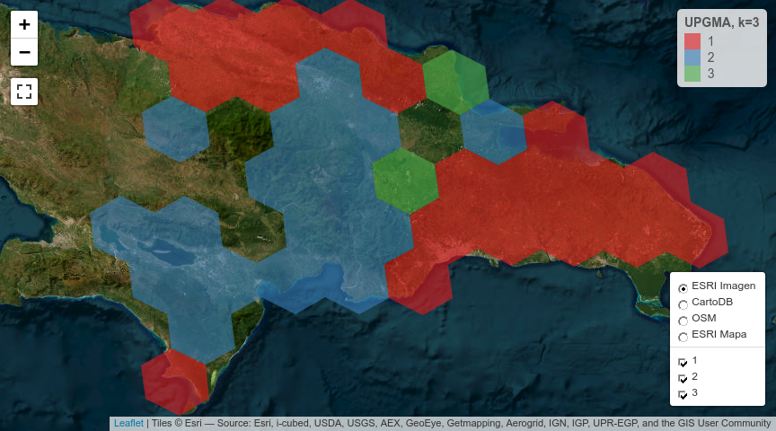
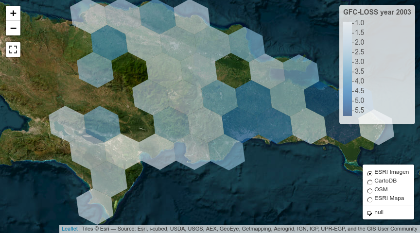
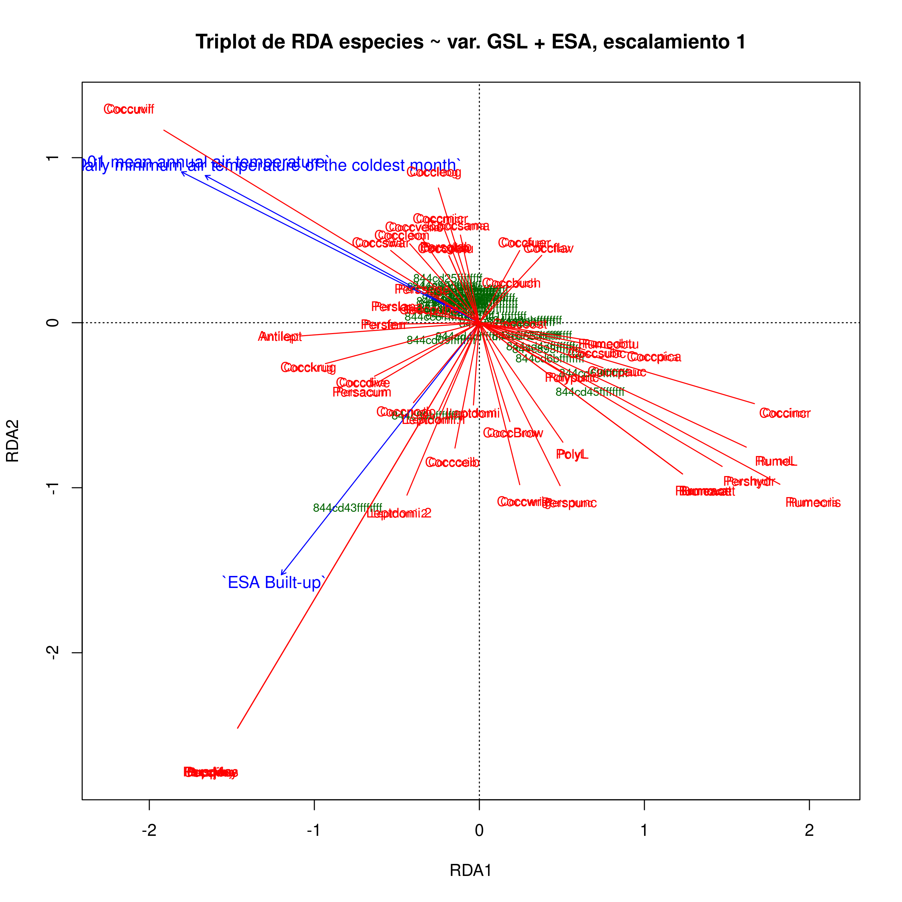
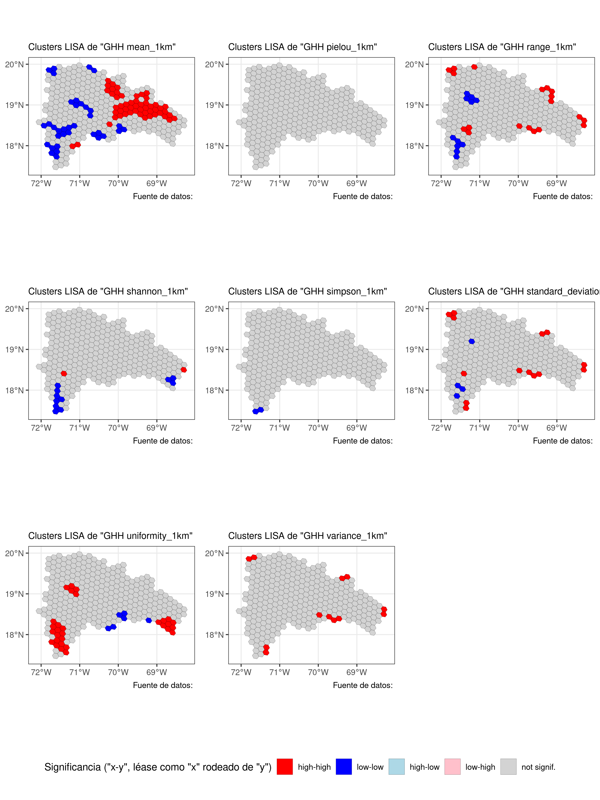
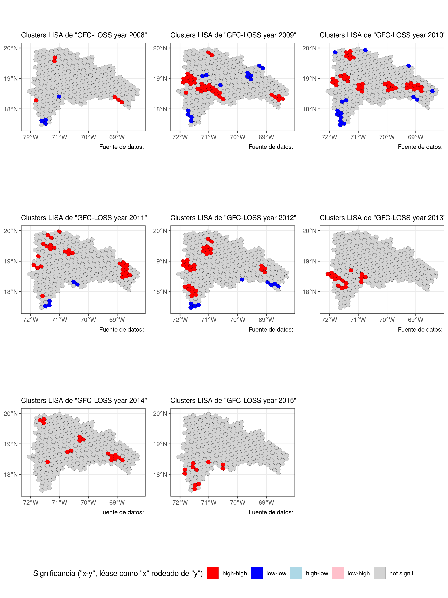

Práctica 99. Resultados de tu manuscrito.
================
José Ramón Martínez Batlle
26-11-2022

# ¿Qué contiene la sección “Resultados”?

Te recomiendo releer las normas para autores/as del [Anuario de
Investigaciones Científicas de la
UASD](../docs/instrucciones-para-autores-anuario-investigaciones-cientificas-UASD.pdf)
y adherirte a las especificaciones sobre la sección “Resultados” que
allí se indican. Aunque en las referidas normas no se incluyen muchas
pautas significativas, si escribieras para una revista específica,
deberás considerar sus normas y recomendaciones de publicación. Además,
te recomiendo que consultes la sección “Resultados” de algunos
manuscritos publicados en el Anuario.

En los resultados expones el contenido analítico central. Es “el qué”
del manuscrito, en complemento de “el cómo” (metodología) y “el por qué”
(introducción) de tu investigación. En los resultados muestras lo que
encontraste luego de que colectaste (aunque en este caso, no fuiste al
terreno) y analizaste, con tus métodos, los datos fuente.

Algunas recomendaciones generales:

- “Resultados” se supone que es la sección más corta del manuscrito,
  siempre que se usen apropiadamente los recursos gráficos, las tablas y
  la información suplementaria.

- Comienza por realizar tus análisis. Necesitarás una matriz de
  comunidad y una ambiental. La de comunidad la habrás generado en la
  práctica 2; la ambiental explico cómo generarla en este mismo cuaderno
  (ver abajo). En general, la matriz ambiental la producirás mediante
  estadísticos zonales del territorio dominicano. Para aprender más
  sobre la fuente de estadística zonal de República Dominicana, que
  contiene un conjunto de más de 100 variables resumidas por celdas H3,
  visita [este repo](https://github.com/geofis/zonal-statistics). Debes
  visitar dicho repo para poder citarlo apropiadamente.

- Cuando tengas análisis realizados, antes de comenzar a escribir, te
  recomiendo que escribas un guión de tu sección “Resultados”.

- Guión en mano, redacta tu sección “Resultados”, siguiendo también
  estos consejos:

- En esta sección, se espera que presentes lo que has obtenido de manera
  “objetiva”, evitando explicaciones, comentarios, opiniones,
  perspectivas o limitaciones. En teoría, tu redacción es “fría”, lo
  cual no necesariamente significa que tenga que ser aburrida.

- Esta es la sección por excelencia donde usarás *tablas y/o gráficos*.
  Lo más importante a tener en cuenta cuando los uses es que no debes
  duplicar el contenido que muestran dichos recursos en el texto. La
  tabla o gráfico son apoyos que te ayudarán a no entrar en densidades
  innecesarias dentro de los párrafos. Por lo tanto, si colocas una
  tabla o figura, no caigas en la tentación de describirla en párrafos
  de forma exhausitva. Estos recursos deben servir para apoyar el o los
  párrafos donde destacas los principales patrones encontrados.

- *Importante también*: si insertas una tabla o gráfico, debes referirla
  en el texto (e.g. “ver figura X”). De nada sirve incluir una figura o
  una tabla si no la refieres, porque con ello estarás sugiriendo que
  dicho recurso era completamente prescindible.

- El tiempo verbal preferido (por defecto) es el pasado, por ejemplo “…,
  donde se **encontró** una asociación significativa entre … y …”. Sin
  embargo, hay excepciones, como por ejemplo, cuando te refieres a una
  tabla o una figura. Un caso típico es la expresión “tal como se
  muestra en la tabla 1”, donde el verbo está conjugado en presente.

A continuación, te pongo enlaces a referencias que considero útiles,
sobre cómo redactar los resultados (algunas son generales, sobre
artículos en general):

- [Breves pautas, en
  inglés](https://www.editage.com/insights/the-secret-to-writing-the-results-and-discussion-section-of-a-manuscript).
  Puedes usar el traductor [DeepL](https://www.deepl.com/translator),
  porque produce frases más naturales.

Cinco guías, en inglés, que considero están bien elaboradas, sobre cómo
redactar un artículo científico (consulta la sección sobre cómo redactar
los *resultados* en cada una):

- [Demystifying the Journal
  Article](https://www.insidehighered.com/advice/2017/05/09/how-write-effective-journal-article-and-get-it-published-essay)

- [How to write a scientific manuscript for
  publication](https://www.ncbi.nlm.nih.gov/pmc/articles/PMC3626472/)

- [11 steps to structuring a science paper editors will take
  seriously](https://www.elsevier.com/connect/11-steps-to-structuring-a-science-paper-editors-will-take-seriously)

- [Cómo escribir un artículo científico por primera
  vez](https://www.sciencedirect.com/science/article/abs/pii/S1134593417300040)
  (necesitarás usar [SciHub](https://sci-hub.se/) para descargarlo)

- Una muy breve pero con consejos útiles: [Tips for writing the perfect
  IMRAD
  manuscript](https://www.editage.com/insights/tips-for-writing-the-perfect-imrad-manuscript)

# Scripts de ejemplo

Una nota, a título informativo. Cada una se las siguientes secciones
(e.g. “Análisis de agrupamiento”, “Ordenación restringida”), es
reproducible de forma autónoma, es decir, sin dependencia de líneas de
código anteriores. Esto siginifica que las dependencias de una sección
se resuelven dentro de ella misma, sin dependencia de líneas anteriores.

Por esta razón, varias secciones comparten texto y código común, pero
sólo al inicio, porque al avanzar cada una se hace propia. Notarás, por
lo tanto, que el texto “se repite a sí mismo” por esta razón; la otra
opción que tenía era alojar el código común en un único archivo, pero
entonces esto te obligaba a navegar por archivos separados, haciendo
menos didáctico este cuaderno.

## Análisis de agrupamiento

Me basaré en los scripts que comienzan por `aa_` de este
[repo](https://github.com/biogeografia-master/scripts-de-analisis-BCI),
los cuales explico en los vídeos de “Análisis de agrupamiento” (del 13
al 16) de la lista de reproducción [“Ecología Numérica con R” de mi
canal](https://www.youtube.com/playlist?list=PLDcT2n8UzsCRDqjqSeqHI1wsiNOqpYmsJ).

> INICIA texto+código común entre secciones

Fijar un directorio de trabajo no es recomendable, mejor trabaja por
proyecto. En cualquier caso, si no quieres o no puedes crear un
proyecto, usa la sentencia que verás abajo, cambiando `TU_DIRECTORIO`
por la ruta del directorio donde tengas almacenados tus datos y tus
scripts.

``` r
if(interactive()) {
  tryCatch(
    setwd(dirname(rstudioapi::getSourceEditorContext()$path)),
    error = function(e) {
      cat('Probablemente ya el directorio de trabajo está fijado correctamente',
          'o quizá el directorio no existe. Este fue el error devuelto:\n')
      e
    })
}
```

Cargar paquetes.

``` r
library(vegan)
library(sf)
library(tidyverse)
library(tmap)
library(kableExtra)
library(foreach)
library(leaps)
library(caret)
gh_content <- 'https://raw.githubusercontent.com/'
gh_zonal_stats <- paste0(gh_content,
                         'geofis/zonal-statistics/0b2e95aaee87bf326cf132d28f4bd15220bb4ec7/out/')
repo_analisis <- 'biogeografia-master/scripts-de-analisis-BCI/master'
repo_sem202202 <- 'biogeografia-202202/material-de-apoyo/master/practicas/'
devtools::source_url(paste0(gh_content, repo_analisis, '/biodata/funciones.R'))
devtools::source_url(paste0(gh_content, repo_sem202202, 'train.R'))
devtools::source_url(paste0(gh_content, repo_sem202202, 'funciones.R'))
```

Carga tu matriz de comunidad, que habrás generado en la práctica 2, y
elige un umbral para especies raras o rangos de registros de presencia
para seleccionar especies en una nueva matriz de comunidad.

``` r
res <- 4 #Resolución H3, puedes elegir entre 4, 5, 6 o 7, pero cuidado con valores >=6
# IMPORTANTE: la resolución de las celdas H3, debe coincidir con la resolución
# a la cual generaste tu matriz de comunidad. De lo contrario, obtendrás error. Si tu 
# archivo RDS de matriz de comunidad se denomina "matriz_de_comunidad.RDS", y lo creaste
# usando resolución 4, cámbiale el nombre a "matriz_de_comunidad_res_5.RDS". Recuerda,
# puedes usar cualquier resolución, lo único importante es que las resolución usada en la
# creación de la matriz de comunidad, debe ser la misma que en la ambiental.
# Prueba distintas resoluciones, no te enfrasques en quedarte con la misma que
# uso en este ejemplo. Prueba con resolución 5, por ejemplo.
mc_orig <- readRDS(paste0("matriz_de_comunidad_res_", res, ".RDS"))
nrow(mc_orig) #Número de filas, equivale a número de hexágonos con registros de presencia
```

    ## [1] 39

``` r
ncol(mc_orig)  #Número de columnas, equivale a número de especies, riqueza
```

    ## [1] 44

``` r
data.frame(Especies = names(mc_orig)) %>% 
  kable(booktabs=T) %>%
  kable_styling(latex_options = c("HOLD_position", "scale_down")) %>%
  gsub(' NA ', '', .) #Lista de especies
```

<table class="table" style="margin-left: auto; margin-right: auto;">
<thead>
<tr>
<th style="text-align:left;">
Especies
</th>
</tr>
</thead>
<tbody>
<tr>
<td style="text-align:left;">
Coccoloba uvifera (L.) L.
</td>
</tr>
<tr>
<td style="text-align:left;">
Antigonon leptopus Hook. & Arn.
</td>
</tr>
<tr>
<td style="text-align:left;">
Coccoloba diversifolia Jacq.
</td>
</tr>
<tr>
<td style="text-align:left;">
Coccoloba P.Browne
</td>
</tr>
<tr>
<td style="text-align:left;">
Coccoloba pubescens L.
</td>
</tr>
<tr>
<td style="text-align:left;">
Coccoloba jimenezii Alain
</td>
</tr>
<tr>
<td style="text-align:left;">
Persicaria punctata (Elliott) Small
</td>
</tr>
<tr>
<td style="text-align:left;">
Coccoloba flavescens Jacq.
</td>
</tr>
<tr>
<td style="text-align:left;">
Leptogonum domingensis var. molle (Urb.) Brandbyge
</td>
</tr>
<tr>
<td style="text-align:left;">
Leptogonum domingense Benth.
</td>
</tr>
<tr>
<td style="text-align:left;">
Leptogonum domingensis Benth.
</td>
</tr>
<tr>
<td style="text-align:left;">
Coccoloba costata Wright
</td>
</tr>
<tr>
<td style="text-align:left;">
Coccoloba incrassata Urb.
</td>
</tr>
<tr>
<td style="text-align:left;">
Coccoloba wrightii Lindau
</td>
</tr>
<tr>
<td style="text-align:left;">
Coccoloba picardae Urb.
</td>
</tr>
<tr>
<td style="text-align:left;">
Rumex acetosella L.
</td>
</tr>
<tr>
<td style="text-align:left;">
Rumex crispus L.
</td>
</tr>
<tr>
<td style="text-align:left;">
Coccoloba leonardii Howard
</td>
</tr>
<tr>
<td style="text-align:left;">
Coccoloba ceibensis O.C.Schmidt
</td>
</tr>
<tr>
<td style="text-align:left;">
Coccoloba venosa L.
</td>
</tr>
<tr>
<td style="text-align:left;">
Coccoloba leoganensis Jacq.
</td>
</tr>
<tr>
<td style="text-align:left;">
Coccoloba microstachya Willd.
</td>
</tr>
<tr>
<td style="text-align:left;">
Coccoloba krugii Lindau
</td>
</tr>
<tr>
<td style="text-align:left;">
Coccoloba buchii O.Schmidt
</td>
</tr>
<tr>
<td style="text-align:left;">
Coccoloba fuertesii Urb.
</td>
</tr>
<tr>
<td style="text-align:left;">
Coccoloba nodosa Lindau
</td>
</tr>
<tr>
<td style="text-align:left;">
Coccoloba pauciflora Urb.
</td>
</tr>
<tr>
<td style="text-align:left;">
Polygonum L.
</td>
</tr>
<tr>
<td style="text-align:left;">
Rumex L.
</td>
</tr>
<tr>
<td style="text-align:left;">
Persicaria pensylvanica (L.) M.Gómez
</td>
</tr>
<tr>
<td style="text-align:left;">
Persicaria hydropiperoides (Michx.) Small
</td>
</tr>
<tr>
<td style="text-align:left;">
Coccoloba samanensis O.C.Schmidt
</td>
</tr>
<tr>
<td style="text-align:left;">
Persicaria ferruginea (Wedd.) Soják
</td>
</tr>
<tr>
<td style="text-align:left;">
Brunnichia ovata (Walter) Shinners
</td>
</tr>
<tr>
<td style="text-align:left;">
Ruprechtia C.A.Mey.
</td>
</tr>
<tr>
<td style="text-align:left;">
Coccoloba subcordata Lindau
</td>
</tr>
<tr>
<td style="text-align:left;">
Polygonum punctatum Kit., 1864
</td>
</tr>
<tr>
<td style="text-align:left;">
Persicaria segetum (Kunth) Small
</td>
</tr>
<tr>
<td style="text-align:left;">
Persicaria acuminata (Kunth) M.Gómez
</td>
</tr>
<tr>
<td style="text-align:left;">
Coccoloba swartzii Meisn.
</td>
</tr>
<tr>
<td style="text-align:left;">
Persicaria lapathifolia subsp. lapathifolia
</td>
</tr>
<tr>
<td style="text-align:left;">
Persicaria glabra (Willd.) M.Gómez
</td>
</tr>
<tr>
<td style="text-align:left;">
Rumex obtusifolius L.
</td>
</tr>
<tr>
<td style="text-align:left;">
Coccoloba obtusifolia Jacq.
</td>
</tr>
</tbody>
</table>

``` r
unique(word(names(mc_orig), 1, 1)) #Géneros representados
```

    ## [1] "Coccoloba"  "Antigonon"  "Persicaria" "Leptogonum" "Rumex"     
    ## [6] "Polygonum"  "Brunnichia" "Ruprechtia"

``` r
table(word(names(mc_orig), 1, 1)) #Número de especies por género
```

    ## 
    ##  Antigonon Brunnichia  Coccoloba Leptogonum Persicaria  Polygonum      Rumex 
    ##          1          1         24          3          8          2          4 
    ## Ruprechtia 
    ##          1

``` r
data.frame(`Número de hexágonos` = sort(colSums(mc_orig), decreasing = T), check.names = F) %>% 
  kable(booktabs=T) %>%
  kable_styling(latex_options = c("HOLD_position", "scale_down")) %>%
  gsub(' NA ', '', .) # Número de hexágonos en los que está presente cada especie
```

<table class="table" style="margin-left: auto; margin-right: auto;">
<thead>
<tr>
<th style="text-align:left;">
</th>
<th style="text-align:right;">
Número de hexágonos
</th>
</tr>
</thead>
<tbody>
<tr>
<td style="text-align:left;">
Coccoloba uvifera (L.) L.
</td>
<td style="text-align:right;">
24
</td>
</tr>
<tr>
<td style="text-align:left;">
Coccoloba diversifolia Jacq.
</td>
<td style="text-align:right;">
18
</td>
</tr>
<tr>
<td style="text-align:left;">
Antigonon leptopus Hook. & Arn.
</td>
<td style="text-align:right;">
15
</td>
</tr>
<tr>
<td style="text-align:left;">
Coccoloba wrightii Lindau
</td>
<td style="text-align:right;">
14
</td>
</tr>
<tr>
<td style="text-align:left;">
Coccoloba costata Wright
</td>
<td style="text-align:right;">
13
</td>
</tr>
<tr>
<td style="text-align:left;">
Persicaria punctata (Elliott) Small
</td>
<td style="text-align:right;">
11
</td>
</tr>
<tr>
<td style="text-align:left;">
Coccoloba P.Browne
</td>
<td style="text-align:right;">
10
</td>
</tr>
<tr>
<td style="text-align:left;">
Coccoloba incrassata Urb.
</td>
<td style="text-align:right;">
10
</td>
</tr>
<tr>
<td style="text-align:left;">
Coccoloba leoganensis Jacq.
</td>
<td style="text-align:right;">
10
</td>
</tr>
<tr>
<td style="text-align:left;">
Coccoloba pubescens L.
</td>
<td style="text-align:right;">
9
</td>
</tr>
<tr>
<td style="text-align:left;">
Coccoloba buchii O.Schmidt
</td>
<td style="text-align:right;">
8
</td>
</tr>
<tr>
<td style="text-align:left;">
Coccoloba fuertesii Urb.
</td>
<td style="text-align:right;">
8
</td>
</tr>
<tr>
<td style="text-align:left;">
Leptogonum domingensis var. molle (Urb.) Brandbyge
</td>
<td style="text-align:right;">
6
</td>
</tr>
<tr>
<td style="text-align:left;">
Leptogonum domingense Benth.
</td>
<td style="text-align:right;">
6
</td>
</tr>
<tr>
<td style="text-align:left;">
Leptogonum domingensis Benth.
</td>
<td style="text-align:right;">
6
</td>
</tr>
<tr>
<td style="text-align:left;">
Coccoloba picardae Urb.
</td>
<td style="text-align:right;">
6
</td>
</tr>
<tr>
<td style="text-align:left;">
Rumex crispus L.
</td>
<td style="text-align:right;">
6
</td>
</tr>
<tr>
<td style="text-align:left;">
Coccoloba ceibensis O.C.Schmidt
</td>
<td style="text-align:right;">
6
</td>
</tr>
<tr>
<td style="text-align:left;">
Coccoloba flavescens Jacq.
</td>
<td style="text-align:right;">
5
</td>
</tr>
<tr>
<td style="text-align:left;">
Polygonum L.
</td>
<td style="text-align:right;">
5
</td>
</tr>
<tr>
<td style="text-align:left;">
Rumex L.
</td>
<td style="text-align:right;">
5
</td>
</tr>
<tr>
<td style="text-align:left;">
Coccoloba krugii Lindau
</td>
<td style="text-align:right;">
4
</td>
</tr>
<tr>
<td style="text-align:left;">
Coccoloba nodosa Lindau
</td>
<td style="text-align:right;">
4
</td>
</tr>
<tr>
<td style="text-align:left;">
Persicaria hydropiperoides (Michx.) Small
</td>
<td style="text-align:right;">
4
</td>
</tr>
<tr>
<td style="text-align:left;">
Polygonum punctatum Kit., 1864
</td>
<td style="text-align:right;">
4
</td>
</tr>
<tr>
<td style="text-align:left;">
Coccoloba microstachya Willd.
</td>
<td style="text-align:right;">
3
</td>
</tr>
<tr>
<td style="text-align:left;">
Coccoloba pauciflora Urb.
</td>
<td style="text-align:right;">
3
</td>
</tr>
<tr>
<td style="text-align:left;">
Persicaria acuminata (Kunth) M.Gómez
</td>
<td style="text-align:right;">
3
</td>
</tr>
<tr>
<td style="text-align:left;">
Coccoloba swartzii Meisn.
</td>
<td style="text-align:right;">
3
</td>
</tr>
<tr>
<td style="text-align:left;">
Coccoloba venosa L.
</td>
<td style="text-align:right;">
2
</td>
</tr>
<tr>
<td style="text-align:left;">
Coccoloba samanensis O.C.Schmidt
</td>
<td style="text-align:right;">
2
</td>
</tr>
<tr>
<td style="text-align:left;">
Persicaria ferruginea (Wedd.) Soják
</td>
<td style="text-align:right;">
2
</td>
</tr>
<tr>
<td style="text-align:left;">
Rumex obtusifolius L.
</td>
<td style="text-align:right;">
2
</td>
</tr>
<tr>
<td style="text-align:left;">
Coccoloba jimenezii Alain
</td>
<td style="text-align:right;">
1
</td>
</tr>
<tr>
<td style="text-align:left;">
Rumex acetosella L.
</td>
<td style="text-align:right;">
1
</td>
</tr>
<tr>
<td style="text-align:left;">
Coccoloba leonardii Howard
</td>
<td style="text-align:right;">
1
</td>
</tr>
<tr>
<td style="text-align:left;">
Persicaria pensylvanica (L.) M.Gómez
</td>
<td style="text-align:right;">
1
</td>
</tr>
<tr>
<td style="text-align:left;">
Brunnichia ovata (Walter) Shinners
</td>
<td style="text-align:right;">
1
</td>
</tr>
<tr>
<td style="text-align:left;">
Ruprechtia C.A.Mey.
</td>
<td style="text-align:right;">
1
</td>
</tr>
<tr>
<td style="text-align:left;">
Coccoloba subcordata Lindau
</td>
<td style="text-align:right;">
1
</td>
</tr>
<tr>
<td style="text-align:left;">
Persicaria segetum (Kunth) Small
</td>
<td style="text-align:right;">
1
</td>
</tr>
<tr>
<td style="text-align:left;">
Persicaria lapathifolia subsp. lapathifolia
</td>
<td style="text-align:right;">
1
</td>
</tr>
<tr>
<td style="text-align:left;">
Persicaria glabra (Willd.) M.Gómez
</td>
<td style="text-align:right;">
1
</td>
</tr>
<tr>
<td style="text-align:left;">
Coccoloba obtusifolia Jacq.
</td>
<td style="text-align:right;">
1
</td>
</tr>
</tbody>
</table>

``` r
# Usa el vector anterior para determinar un umbral o rango de registros para filtrar tu matriz
# ¿En cuántos hexágonos está cada especie? Filtra tus datos usando tu propio criterio.
# Especies que aparecen en pocos hexágonos se consideran "raras". Por ejemplo, si una especie sólo
# aparece en un hexágono en todo el país, es un "singleton", si en dos, "doubleton", y así.
# Estas especies podrían contribuir a generar "ruido" en análisis posteriores, se recomienda excluirlas.
# Elige un valor mínimo (representado por único número entero) o por un rango de enteros (e.g. de 10 a 20),
# para seleccionar las especies que estén mejor representadas de acuerdo a tu criterio.
# Por ejemplo, si usas el valor m, el script considerará a este valor como "el número mínimo de hexágonos
# en los que está representada una especie, y creará una matriz de comunidad de especies seleccionadas
# que están presentes en m hexágonos o más. Si eliges un rango, por ejemplo [m,n], el script generará
# una matriz de comunidad que representadas un mínimo de m hexágonos y un máximo de n hexágonos.
# (ambos extremos inclusive).
en_cuantos_hex <- 1
# Explicación: "en_cuantos_hex <- X", donde X es el número de hexágonos mínimo donde cada especie
# debe estar presente. IMPORTANTE: elige TU PROPIO umbral.
{if(length(en_cuantos_hex)==1) selector <- en_cuantos_hex:max(colSums(mc_orig)) else
  if(length(en_cuantos_hex)==2)
    selector <- min(en_cuantos_hex):max(en_cuantos_hex) else
      stop('Debes indicar uno o dos valores numéricos')}
selector
```

    ##  [1]  1  2  3  4  5  6  7  8  9 10 11 12 13 14 15 16 17 18 19 20 21 22 23 24

``` r
mc_orig_seleccionadas <- mc_orig[, colSums(mc_orig) %in% selector]

# Mínimo número de especies por hexágono
data.frame(`Número de especies por hexágono` = sort(rowSums(mc_orig), decreasing = T), check.names = F) %>% 
  kable(booktabs=T) %>%
  kable_styling(latex_options = c("HOLD_position", "scale_down")) %>%
  gsub(' NA ', '', .) # Número de hexágonos en los que está presente cada especie
```

<table class="table" style="margin-left: auto; margin-right: auto;">
<thead>
<tr>
<th style="text-align:left;">
</th>
<th style="text-align:right;">
Número de especies por hexágono
</th>
</tr>
</thead>
<tbody>
<tr>
<td style="text-align:left;">
844cd43ffffffff
</td>
<td style="text-align:right;">
18
</td>
</tr>
<tr>
<td style="text-align:left;">
844cd45ffffffff
</td>
<td style="text-align:right;">
18
</td>
</tr>
<tr>
<td style="text-align:left;">
844cd0dffffffff
</td>
<td style="text-align:right;">
13
</td>
</tr>
<tr>
<td style="text-align:left;">
844cf35ffffffff
</td>
<td style="text-align:right;">
9
</td>
</tr>
<tr>
<td style="text-align:left;">
844c899ffffffff
</td>
<td style="text-align:right;">
9
</td>
</tr>
<tr>
<td style="text-align:left;">
844cf37ffffffff
</td>
<td style="text-align:right;">
9
</td>
</tr>
<tr>
<td style="text-align:left;">
846725bffffffff
</td>
<td style="text-align:right;">
9
</td>
</tr>
<tr>
<td style="text-align:left;">
844cd47ffffffff
</td>
<td style="text-align:right;">
9
</td>
</tr>
<tr>
<td style="text-align:left;">
844cd59ffffffff
</td>
<td style="text-align:right;">
8
</td>
</tr>
<tr>
<td style="text-align:left;">
844cf31ffffffff
</td>
<td style="text-align:right;">
8
</td>
</tr>
<tr>
<td style="text-align:left;">
844cd5dffffffff
</td>
<td style="text-align:right;">
8
</td>
</tr>
<tr>
<td style="text-align:left;">
844cd69ffffffff
</td>
<td style="text-align:right;">
8
</td>
</tr>
<tr>
<td style="text-align:left;">
844c895ffffffff
</td>
<td style="text-align:right;">
7
</td>
</tr>
<tr>
<td style="text-align:left;">
844c883ffffffff
</td>
<td style="text-align:right;">
7
</td>
</tr>
<tr>
<td style="text-align:left;">
844cd67ffffffff
</td>
<td style="text-align:right;">
7
</td>
</tr>
<tr>
<td style="text-align:left;">
844cd41ffffffff
</td>
<td style="text-align:right;">
7
</td>
</tr>
<tr>
<td style="text-align:left;">
844cd6bffffffff
</td>
<td style="text-align:right;">
7
</td>
</tr>
<tr>
<td style="text-align:left;">
844cf33ffffffff
</td>
<td style="text-align:right;">
6
</td>
</tr>
<tr>
<td style="text-align:left;">
844c89bffffffff
</td>
<td style="text-align:right;">
6
</td>
</tr>
<tr>
<td style="text-align:left;">
844cd63ffffffff
</td>
<td style="text-align:right;">
6
</td>
</tr>
<tr>
<td style="text-align:left;">
844cd4bffffffff
</td>
<td style="text-align:right;">
6
</td>
</tr>
<tr>
<td style="text-align:left;">
844cd09ffffffff
</td>
<td style="text-align:right;">
6
</td>
</tr>
<tr>
<td style="text-align:left;">
844cd2dffffffff
</td>
<td style="text-align:right;">
6
</td>
</tr>
<tr>
<td style="text-align:left;">
844cc65ffffffff
</td>
<td style="text-align:right;">
6
</td>
</tr>
<tr>
<td style="text-align:left;">
844cd65ffffffff
</td>
<td style="text-align:right;">
6
</td>
</tr>
<tr>
<td style="text-align:left;">
844cf25ffffffff
</td>
<td style="text-align:right;">
5
</td>
</tr>
<tr>
<td style="text-align:left;">
844cc6dffffffff
</td>
<td style="text-align:right;">
4
</td>
</tr>
<tr>
<td style="text-align:left;">
8467259ffffffff
</td>
<td style="text-align:right;">
4
</td>
</tr>
<tr>
<td style="text-align:left;">
844c893ffffffff
</td>
<td style="text-align:right;">
4
</td>
</tr>
<tr>
<td style="text-align:left;">
844cc61ffffffff
</td>
<td style="text-align:right;">
3
</td>
</tr>
<tr>
<td style="text-align:left;">
844c891ffffffff
</td>
<td style="text-align:right;">
3
</td>
</tr>
<tr>
<td style="text-align:left;">
844cd25ffffffff
</td>
<td style="text-align:right;">
3
</td>
</tr>
<tr>
<td style="text-align:left;">
844cd4dffffffff
</td>
<td style="text-align:right;">
3
</td>
</tr>
<tr>
<td style="text-align:left;">
844cf27ffffffff
</td>
<td style="text-align:right;">
2
</td>
</tr>
<tr>
<td style="text-align:left;">
844c8bbffffffff
</td>
<td style="text-align:right;">
2
</td>
</tr>
<tr>
<td style="text-align:left;">
844c89dffffffff
</td>
<td style="text-align:right;">
2
</td>
</tr>
<tr>
<td style="text-align:left;">
844cf23ffffffff
</td>
<td style="text-align:right;">
2
</td>
</tr>
<tr>
<td style="text-align:left;">
844cd61ffffffff
</td>
<td style="text-align:right;">
1
</td>
</tr>
<tr>
<td style="text-align:left;">
844c897ffffffff
</td>
<td style="text-align:right;">
1
</td>
</tr>
</tbody>
</table>

``` r
min_especies_por_hex <- 2
# Explicación: "min_especies_por_hex <- Y", donde Y es el número mínimo (inclusive) de especies
# que debe existir en cada hexágono. Por debajo de dicho valor, el hexágono es excluido.
mi_fam <- mc_orig_seleccionadas[rowSums(mc_orig_seleccionadas)>=min_especies_por_hex, ]
nrow(mi_fam)
```

    ## [1] 37

``` r
# mi_fam <- mc_orig_seleccionadas[!rowSums(mc_orig_seleccionadas)==0, ] #Elimina filas sin registros
# rowSums(mi_fam) #Riqueza por hexágonos con especies seleccionadas. Comentado por extenso
all(rowSums(mi_fam)>0) #Debe ser TRUE: todos los hexágonos tienen al menos 1 registro
```

    ## [1] TRUE

``` r
ncol(mi_fam) #Riqueza de especies
```

    ## [1] 44

``` r
# Usar nombres cortos o abreviados para las especies
nombres_largos <- colnames(mi_fam)
(colnames(mi_fam) <- make.cepnames(word(colnames(mi_fam), 1, 2)))
```

    ##  [1] "Coccuvif"   "Antilept"   "Coccdive"   "CoccBrow"   "Coccpube"  
    ##  [6] "Coccjime"   "Perspunc"   "Coccflav"   "Leptdomi"   "Leptdomi.1"
    ## [11] "Leptdomi.2" "Cocccost"   "Coccincr"   "Coccwrig"   "Coccpica"  
    ## [16] "Rumeacet"   "Rumecris"   "Coccleon"   "Coccceib"   "Coccveno"  
    ## [21] "Coccleog"   "Coccmicr"   "Cocckrug"   "Coccbuch"   "Coccfuer"  
    ## [26] "Coccnodo"   "Coccpauc"   "PolyL"      "RumeL"      "Perspens"  
    ## [31] "Pershydr"   "Coccsama"   "Persferr"   "Brunovat"   "RuprMey"   
    ## [36] "Coccsubc"   "Polypunc"   "Perssege"   "Persacum"   "Coccswar"  
    ## [41] "Perslapa"   "Persglab"   "Rumeobtu"   "Coccobtu"

``` r
(df_equivalencias <- data.frame(
  nombre_original = nombres_largos,
  abreviado = colnames(mi_fam)))
```

    ##                                       nombre_original  abreviado
    ## 1                           Coccoloba uvifera (L.) L.   Coccuvif
    ## 2                     Antigonon leptopus Hook. & Arn.   Antilept
    ## 3                        Coccoloba diversifolia Jacq.   Coccdive
    ## 4                                  Coccoloba P.Browne   CoccBrow
    ## 5                              Coccoloba pubescens L.   Coccpube
    ## 6                           Coccoloba jimenezii Alain   Coccjime
    ## 7                 Persicaria punctata (Elliott) Small   Perspunc
    ## 8                          Coccoloba flavescens Jacq.   Coccflav
    ## 9  Leptogonum domingensis var. molle (Urb.) Brandbyge   Leptdomi
    ## 10                       Leptogonum domingense Benth. Leptdomi.1
    ## 11                      Leptogonum domingensis Benth. Leptdomi.2
    ## 12                           Coccoloba costata Wright   Cocccost
    ## 13                          Coccoloba incrassata Urb.   Coccincr
    ## 14                          Coccoloba wrightii Lindau   Coccwrig
    ## 15                            Coccoloba picardae Urb.   Coccpica
    ## 16                                Rumex acetosella L.   Rumeacet
    ## 17                                   Rumex crispus L.   Rumecris
    ## 18                         Coccoloba leonardii Howard   Coccleon
    ## 19                    Coccoloba ceibensis O.C.Schmidt   Coccceib
    ## 20                                Coccoloba venosa L.   Coccveno
    ## 21                        Coccoloba leoganensis Jacq.   Coccleog
    ## 22                      Coccoloba microstachya Willd.   Coccmicr
    ## 23                            Coccoloba krugii Lindau   Cocckrug
    ## 24                         Coccoloba buchii O.Schmidt   Coccbuch
    ## 25                           Coccoloba fuertesii Urb.   Coccfuer
    ## 26                            Coccoloba nodosa Lindau   Coccnodo
    ## 27                          Coccoloba pauciflora Urb.   Coccpauc
    ## 28                                       Polygonum L.      PolyL
    ## 29                                           Rumex L.      RumeL
    ## 30               Persicaria pensylvanica (L.) M.Gómez   Perspens
    ## 31          Persicaria hydropiperoides (Michx.) Small   Pershydr
    ## 32                   Coccoloba samanensis O.C.Schmidt   Coccsama
    ## 33                Persicaria ferruginea (Wedd.) Soják   Persferr
    ## 34                 Brunnichia ovata (Walter) Shinners   Brunovat
    ## 35                                Ruprechtia C.A.Mey.    RuprMey
    ## 36                        Coccoloba subcordata Lindau   Coccsubc
    ## 37                     Polygonum punctatum Kit., 1864   Polypunc
    ## 38                   Persicaria segetum (Kunth) Small   Perssege
    ## 39               Persicaria acuminata (Kunth) M.Gómez   Persacum
    ## 40                          Coccoloba swartzii Meisn.   Coccswar
    ## 41        Persicaria lapathifolia subsp. lapathifolia   Perslapa
    ## 42                 Persicaria glabra (Willd.) M.Gómez   Persglab
    ## 43                              Rumex obtusifolius L.   Rumeobtu
    ## 44                        Coccoloba obtusifolia Jacq.   Coccobtu

Transforma la matriz de comunidad. Este paso es importante, lo explico
[aquí](https://www.youtube.com/watch?v=yQ10lp0-nHc&list=PLDcT2n8UzsCRDqjqSeqHI1wsiNOqpYmsJ&index=10)

``` r
mi_fam_t <- decostand(mi_fam, 'hellinger') #Hellinger
# Otras transformaciones posibles con datos de presencia/ausencia
# mi_fam_t <- decostand(mi_fam, 'normalize') #Chord
# mi_fam_t <- decostand(log1p(mi_fam), 'normalize') #Chord
# mi_fam_t <- decostand(mi_fam, 'chi.square') #Chi-square
```

Genera la matriz ambiental a partir del archivo de estadística zonal por
celdas H3 de República Dominicana, de acuerdo con la resolución que
prefieras. Para el ejemplo, usé la resolución 5, pero puedes usar/probar
con otra, para lo cual, sólo tendrías que cambiar el objeto `res <- X`,
donde `X` puede ser un número cualquiera entre 4 y 7.

Para aprender más sobre la fuente de estadística zonal de República
Dominicana, que contiene un conjunto de más de 100 variables resumidas
por celdas H3, visita [este
repo](https://github.com/geofis/zonal-statistics). Debes visitar dicho
repo para poder citarlo apropiadamente.

``` r
#Matriz ambiental
tmpfile <- tempfile()
download.file(
  url = paste0(gh_zonal_stats, 'list_with_all_sources_all_resolution.RDS'),
  tmpfile, method = if(Sys.info()[['sysname']]=='Windows') 'curl' else 'libcurl')
tmprds <- readRDS(tmpfile)
za <- tmprds[[paste0('H3 resolution: ', res)]]
unlink(tmpfile)
# Las siguientes líneas están comentadas, porque producen muchos mapas. Descoméntalas y ejecútalas si quieres verlos
# za %>% st_as_sf('geom') %>%
#   pivot_longer(cols = -matches('base|hex_id|geom')) %>% 
#   tm_shape() + tm_fill(col = 'value') +
#   tm_facets(by = 'name', free.scales = T)
za_intermedia <- za %>%
  st_drop_geometry() %>% 
  select(-matches(c(' base'))) %>% 
  column_to_rownames('hex_id')
env <- za_intermedia[match(rownames(mi_fam), rownames(za_intermedia)), ]
all(rownames(mi_fam) == rownames(env)) #Si es TRUE, sigue adelante
```

    ## [1] TRUE

Se puede probar con un subconjunto de variables, generando una matriz
ambiental que seleccione variables según el grupo al que pertenecen, con
ayuda del prefijo.

``` r
# env_selecionada <- env %>%
#   st_drop_geometry() %>%
#   dplyr::select(matches('^ESA '))
# env_selecionada <- env %>%
#   st_drop_geometry() %>%
#   dplyr::select(matches('^G90-GEOM '))
# env_selecionada <- env %>%
#   st_drop_geometry() %>%
#   dplyr::select(matches('^CH-BIO '))
# env_selecionada <- env %>%
#   st_drop_geometry() %>%
#   dplyr::select(matches('^GHH '))
# env_selecionada <- env %>%
#   st_drop_geometry() %>%
#   dplyr::select(matches('^GSL '))
# env_selecionada <- env %>%
#   st_drop_geometry() %>%
#   dplyr::select(matches('^CGL '))
```

> FINALIZA texto+código común entre secciones

### Clúster análisis usando distintos métodos. Interpretación y comparación de resultados

> No olvides ejecutar la parte de código común y reutilizable situada
> arriba. Esta subsección necesita de objetos creados en líneas de
> código previas.

A continuación, el **análisis de agrupamiento** propiamente. La parte
más importante es generar un árbol, a partir de una matriz de
distancias, que haga sentido desde el punto de vista de la comunidad y
la distribución de las especies tal como se encuentran en GBIF. Primero
cargaré paquetes específicos de esta técnica y generaré la matriz de
distancias.

``` r
library(broom)
library(cluster)
library(gclus)
library(pvclust)
mi_fam_d <- vegdist(mi_fam_t, "euc")
```

A continuación, generaré árboles usando distintos métodos, explicados en
el
[repo](https://github.com/biogeografia-master/scripts-de-analisis-BCI),
y en los vídeos (13 a 16) de la lista mencionada arriba [“Ecología
Numérica con R” de mi
canal](https://www.youtube.com/playlist?list=PLDcT2n8UzsCRDqjqSeqHI1wsiNOqpYmsJ).

``` r
lista_cl <- list(
        cl_single = hclust(mi_fam_d, method = 'single'),
        cl_complete = hclust(mi_fam_d, method = 'complete'),
        cl_upgma = hclust(mi_fam_d, method = 'average'),
        cl_ward = hclust(mi_fam_d, method = 'ward.D2')
)
par(mfrow = c(2,2))
invisible(map(names(lista_cl), function(x) plot(lista_cl[[x]], main = x, hang = -1, cex = 0.3)))
```

<!-- -->

``` r
par(mfrow = c(1,1))
```

A continuación, calcularé la distancia y la correlación cofenéticas. Se
supone que el método con la mayor correlación cofenética explica mejor
el agrupamiento de la comunidad. Consulta el vídeo y material de
referencia. Normalmente, el método UPGMA obtiene la mayor correlación
cofenética, pero esto se debe a que su procedimiento maximiza
precisamente dicha métrica. No es recomendable conservar un único método
de agrupamiento, normalmente es bueno usar al menos dos. Ward es muchas
veces recomendado por basarse en procedimientos de cálculo muy distintos
a los de UPGMA. Consulta referencias.

``` r
map_df(lista_cl, function(x) {
        coph_d <- cophenetic(x)
        corr <- cor(mi_fam_d, coph_d)
        return(corr)
})
```

    ## # A tibble: 1 × 4
    ##   cl_single cl_complete cl_upgma cl_ward
    ##       <dbl>       <dbl>    <dbl>   <dbl>
    ## 1     0.463       0.546    0.622   0.508

Ahora, calcularé las anchuras de silueta, una métrica que ayuda a
determinar en cuántos grupos se organiza la comunidad. En el ejemplo,
dado que muchas especies de Polygonaceae están ausentes en muchos
hexágonos, es esperable que el procedimiento sugiera un número de grupos
alto denominados (ver objeto impreso `n_grupos_optimos`). Considera la
siguiente regla general: muchos grupos: el número ideal es 3 grupos, de
4 a 6 grupos es aceptable, 7 o más grupos se considera mucho y difícil
de interpretar, es un resultado poco útil; 1 grupo es un resultado sin
sentido.

``` r
# UPGMA
anch_sil_upgma <- calcular_anchuras_siluetas(
        mc_orig = mi_fam, 
        distancias = mi_fam_d, 
        cluster = lista_cl$cl_upgma)
anch_sil_upgma
```

    ## $anchuras_siluetas
    ##  [1] 0.000000000 0.074958547 0.075966342 0.082556084 0.056807619 0.042999536
    ##  [7] 0.044854338 0.032559260 0.045140261 0.043900271 0.060227771 0.062214639
    ## [13] 0.061646669 0.059373073 0.056467486 0.060045461 0.056464519 0.055083787
    ## [19] 0.054298980 0.052364009 0.053493570 0.045274415 0.046959608 0.045526533
    ## [25] 0.043581982 0.038911658 0.043649637 0.039862149 0.037029470 0.032909110
    ## [31] 0.030730777 0.032244672 0.027950840 0.022850839 0.018742172 0.006973952
    ## [37] 0.000000000
    ## 
    ## $n_grupos_optimo
    ## [1] 4

``` r
u_dend_reord <- reorder.hclust(lista_cl$cl_upgma, mi_fam_d)
plot(u_dend_reord, hang = -1)
rect.hclust(
        tree = u_dend_reord,
        k = anch_sil_upgma$n_grupos_optimo)
```

<!-- -->

Método Ward.

``` r
# Ward
anch_sil_ward <- calcular_anchuras_siluetas(
        mc_orig = mi_fam, 
        distancias = mi_fam_d, 
        cluster = lista_cl$cl_ward)
anch_sil_ward
```

    ## $anchuras_siluetas
    ##  [1] 0.000000000 0.083701761 0.086495121 0.071976618 0.067441188 0.068984906
    ##  [7] 0.063718075 0.063842442 0.067816476 0.070579387 0.068359937 0.067817357
    ## [13] 0.069554991 0.067545242 0.067646465 0.065221082 0.066434142 0.067303850
    ## [19] 0.064519013 0.063721555 0.061109286 0.061058618 0.055478695 0.054644157
    ## [25] 0.051963937 0.048319961 0.043649637 0.039862149 0.037029470 0.032909110
    ## [31] 0.030730777 0.032244672 0.027950840 0.022850839 0.018742172 0.006973952
    ## [37] 0.000000000
    ## 
    ## $n_grupos_optimo
    ## [1] 3

``` r
w_dend_reord <- reorder.hclust(lista_cl$cl_ward, mi_fam_d)
plot(w_dend_reord, hang = -1)
rect.hclust(
        tree = w_dend_reord,
        k = anch_sil_ward$n_grupos_optimo)
```

<!-- -->

Por los resultados obtenidos (muchos grupos sugeridos), tanto por el
método UPGMA como por Ward, parecería interesante explorar dos
estrategias adicionales: 1) Cambiar (preferiblemente, aumentar) el
umbral de registros de presencia de especies raras; 2) Probar métodos
“aproximadamente insesgados”, basados en remuestreos y permutaciones.

Probaré lo segundo, pero te animo a que pruebes también la estrategia 2)
(probar métodos “aproximadamente insesgados”, basados en remuestreos y
permutaciones). Ten presente que todos los casos son diferentes.

``` r
# UPGMA
if(interactive()) dev.new()
cl_pvclust_upgma <-
        pvclust(t(mi_fam_t),
                method.hclust = "average",
                method.dist = "euc",
                iseed = 999, # Resultado reproducible
                parallel = TRUE)
```

    ## Creating a temporary cluster...done:
    ## socket cluster with 7 nodes on host 'localhost'
    ## Multiscale bootstrap... Done.

``` r
# Añadir los valores de p
plot(cl_pvclust_upgma, hang = -1)
# Añadir rectángulos a los grupos significativos
lines(cl_pvclust_upgma)
pvrect(cl_pvclust_upgma, alpha = 0.90, border = 4)
```

<!-- -->

Para UPGMA nos sugiere que hay más de 6 grupos, y esto se debe al gran
número de hexágonos con pocos registros de presencia. No obstante,
tratándose de muestras sesgadas, como es el caso de GBIF, es esperable
obtener este tipo de resultados donde la comunidad luce muy atomizada.
Veremos que, aplicando el remuestreo multiescalar por bootstrap al árbol
Ward, el resultado no mejora mucho, pero se sugieren menos grupos.

``` r
# Ward
if(interactive()) dev.new()
cl_pvclust_ward <-
        pvclust(t(mi_fam_t),
                method.hclust = "ward.D2",
                method.dist = "euc",
                iseed = 999, # Resultado reproducible
                parallel = TRUE)
```

    ## Creating a temporary cluster...done:
    ## socket cluster with 7 nodes on host 'localhost'
    ## Multiscale bootstrap... Done.

``` r
# Añadir los valores de p
plot(cl_pvclust_ward, hang = -1)
# Añadir rectángulos a los grupos significativos
lines(cl_pvclust_ward)
pvrect(cl_pvclust_ward, alpha = 0.91, border = 4)
```

<!-- -->

Generaré agrupamientos y los exportaré a archivos, para reutilizarlos
más adelante. Elegir un número de grupos no es tarea sencilla, por el
momento probaré con el número de grupos `k` del siguiente bloque de
código, el cual me permitirá caracterízar los distintos hábitats más
fácilmente en función de las variables ambientales.

``` r
k <- 3
# UPGMA
grupos_upgma <- as.factor(cutree(lista_cl$cl_upgma, k = k))
set.seed(999);sample(grupos_upgma, 10) #¿A qué grupo pertenecen 10 hexágonos seleccionados al azar?
```

    ## 844c89dffffffff 844c895ffffffff 844cd59ffffffff 844cd5dffffffff 844cf25ffffffff 
    ##               1               1               1               1               1 
    ## 844cc65ffffffff 844c891ffffffff 844cf27ffffffff 844cf35ffffffff 844cd67ffffffff 
    ##               1               1               1               2               2 
    ## Levels: 1 2 3

``` r
table(grupos_upgma) #¿Cuántos hexágonos hay en cada grupo?
```

    ## grupos_upgma
    ##  1  2  3 
    ## 19 16  2

``` r
plot(u_dend_reord, hang = -1)
rect.hclust(tree = u_dend_reord, k = k)
```

<!-- -->

``` r
# Ward
grupos_ward <- as.factor(cutree(lista_cl$cl_ward, k = k))
set.seed(999);sample(grupos_ward, 10) #¿A qué grupo pertenecen 10 hexágonos seleccionados al azar?
```

    ## 844c89dffffffff 844c895ffffffff 844cd59ffffffff 844cd5dffffffff 844cf25ffffffff 
    ##               1               1               1               1               1 
    ## 844cc65ffffffff 844c891ffffffff 844cf27ffffffff 844cf35ffffffff 844cd67ffffffff 
    ##               1               1               1               2               2 
    ## Levels: 1 2 3

``` r
table(grupos_ward) #¿Cuántos hexágonos hay en cada grupo?
```

    ## grupos_ward
    ##  1  2  3 
    ## 20 11  6

``` r
plot(w_dend_reord, hang = -1)
rect.hclust(tree = w_dend_reord, k = k)
```

<!-- -->

``` r
# Guardaré estos vectores en archivos para reutilizarlos en *scripts* posteriores: 
saveRDS(grupos_upgma, 'grupos_upgma.RDS')
saveRDS(grupos_ward, 'grupos_ward.RDS')
```

### Grupos (clústers), variables ambientales y mapas

> No olvides ejecutar la parte de código común y reutilizable situada
> arriba. Esta subsección necesita de objetos creados en líneas de
> código previas.

Apliquemos el análisis de agrupamiento a la matriz ambiental. La clave
en este punto es que, si la matriz ambiental presenta patrones parecidos
a los de la matriz de comunidad, significa que el agrupamiento utilizado
hace sentido entre ambos conjuntos de datos (comunidad y hábitat) de
forma consistente. Si ambos conjuntos de datos son consistentes,
significa que existe algún grado de asociación.

Cargar paquetes necesarios para esta subsección.

``` r
library(RColorBrewer)
library(leaflet)
library(leaflet.extras)
```

Agrupar los hexágonos de la matriz ambiental.

``` r
(m_amb_upgma <- env %>%
   rownames_to_column('hex_id') %>% 
   mutate(grupos_upgma) %>%
   pivot_longer(-c(grupos_upgma, hex_id), names_to = "variable", values_to = "valor") %>% 
   inner_join(za %>% select(hex_id)))
```

    ## # A tibble: 5,032 × 5
    ##    hex_id          grupos_upgma variable         valor                  geometry
    ##    <chr>           <fct>        <chr>            <dbl>             <POLYGON [°]>
    ##  1 844cf25ffffffff 1            ESA Trees      31.9    ((-70.53184 19.95335, -7…
    ##  2 844cf25ffffffff 1            ESA Shrubland   0.0191 ((-70.53184 19.95335, -7…
    ##  3 844cf25ffffffff 1            ESA Grassland  12.1    ((-70.53184 19.95335, -7…
    ##  4 844cf25ffffffff 1            ESA Cropland    0.0599 ((-70.53184 19.95335, -7…
    ##  5 844cf25ffffffff 1            ESA Built-up    1.49   ((-70.53184 19.95335, -7…
    ##  6 844cf25ffffffff 1            ESA Barren / …  0.109  ((-70.53184 19.95335, -7…
    ##  7 844cf25ffffffff 1            ESA Open water 53.3    ((-70.53184 19.95335, -7…
    ##  8 844cf25ffffffff 1            ESA Herbaceou…  0.666  ((-70.53184 19.95335, -7…
    ##  9 844cf25ffffffff 1            ESA Mangroves   0.378  ((-70.53184 19.95335, -7…
    ## 10 844cf25ffffffff 1            CGL Closed fo…  0      ((-70.53184 19.95335, -7…
    ## # … with 5,022 more rows

``` r
(m_amb_ward <- env %>%
    rownames_to_column('hex_id') %>% 
    mutate(grupos_ward) %>%
    pivot_longer(-c(grupos_ward, hex_id), names_to = "variable", values_to = "valor") %>% 
    inner_join(za %>% select(hex_id)))
```

    ## # A tibble: 5,032 × 5
    ##    hex_id          grupos_ward variable          valor                  geometry
    ##    <chr>           <fct>       <chr>             <dbl>             <POLYGON [°]>
    ##  1 844cf25ffffffff 1           ESA Trees       31.9    ((-70.53184 19.95335, -7…
    ##  2 844cf25ffffffff 1           ESA Shrubland    0.0191 ((-70.53184 19.95335, -7…
    ##  3 844cf25ffffffff 1           ESA Grassland   12.1    ((-70.53184 19.95335, -7…
    ##  4 844cf25ffffffff 1           ESA Cropland     0.0599 ((-70.53184 19.95335, -7…
    ##  5 844cf25ffffffff 1           ESA Built-up     1.49   ((-70.53184 19.95335, -7…
    ##  6 844cf25ffffffff 1           ESA Barren / s…  0.109  ((-70.53184 19.95335, -7…
    ##  7 844cf25ffffffff 1           ESA Open water  53.3    ((-70.53184 19.95335, -7…
    ##  8 844cf25ffffffff 1           ESA Herbaceous…  0.666  ((-70.53184 19.95335, -7…
    ##  9 844cf25ffffffff 1           ESA Mangroves    0.378  ((-70.53184 19.95335, -7…
    ## 10 844cf25ffffffff 1           CGL Closed for…  0      ((-70.53184 19.95335, -7…
    ## # … with 5,022 more rows

Evaluar efectos entre los grupos (“diferencias significativas”) de los
agrupamientos UPGMA y Ward. Al tratarse de 6 grupos, se utilizan las
pruebas estadísticas ANOVA (evalúa homongeneidad de medias) y
Kruskal-Wallis (evalúa homogeneidad de medianas). Las tablas están
ordenadas en orden ascendente por la columna `p_valor_a`, que son los
p-valores de la prueba ANOVA.

``` r
# UPGMA
m_amb_upgma_ak <- m_amb_upgma %>%
  group_by(variable) %>%
  summarise(
    p_valor_a = tryCatch(oneway.test(valor ~ grupos_upgma)$p.value, error = function(e) NA),
    p_valor_k = tryCatch(kruskal.test(valor ~ grupos_upgma)$p.value, error = function(e) NA)
    ) %>%
  arrange(p_valor_a)
m_amb_upgma_ak %>%
  kable(booktabs=T) %>%
  kable_styling(latex_options = c("HOLD_position", "scale_down")) %>%
  gsub(' NA ', '', .)
```

<table class="table" style="margin-left: auto; margin-right: auto;">
<thead>
<tr>
<th style="text-align:left;">
variable
</th>
<th style="text-align:right;">
p_valor_a
</th>
<th style="text-align:right;">
p_valor_k
</th>
</tr>
</thead>
<tbody>
<tr>
<td style="text-align:left;">
WCL bio14 Precipitation of driest month
</td>
<td style="text-align:right;">
0.0000000
</td>
<td style="text-align:right;">
0.0093832
</td>
</tr>
<tr>
<td style="text-align:left;">
GHH mean_1km
</td>
<td style="text-align:right;">
0.0000001
</td>
<td style="text-align:right;">
0.0020373
</td>
</tr>
<tr>
<td style="text-align:left;">
GFC-LOSS year 2003
</td>
<td style="text-align:right;">
0.0000411
</td>
<td style="text-align:right;">
0.0257689
</td>
</tr>
<tr>
<td style="text-align:left;">
CH-BIO bio12 annual precipitation amount
</td>
<td style="text-align:right;">
0.0000944
</td>
<td style="text-align:right;">
0.3468284
</td>
</tr>
<tr>
<td style="text-align:left;">
GFC-LOSS year 2002
</td>
<td style="text-align:right;">
0.0001831
</td>
<td style="text-align:right;">
0.0366315
</td>
</tr>
<tr>
<td style="text-align:left;">
WCL bio15 Precipitation seasonality
</td>
<td style="text-align:right;">
0.0005920
</td>
<td style="text-align:right;">
0.0124903
</td>
</tr>
<tr>
<td style="text-align:left;">
GFC-LOSS year 2015
</td>
<td style="text-align:right;">
0.0010610
</td>
<td style="text-align:right;">
0.0603920
</td>
</tr>
<tr>
<td style="text-align:left;">
WCL bio17 Precipitation of driest quarter
</td>
<td style="text-align:right;">
0.0014866
</td>
<td style="text-align:right;">
0.0119645
</td>
</tr>
<tr>
<td style="text-align:left;">
ESA Shrubland
</td>
<td style="text-align:right;">
0.0019570
</td>
<td style="text-align:right;">
0.0383247
</td>
</tr>
<tr>
<td style="text-align:left;">
GFC-LOSS year 2013
</td>
<td style="text-align:right;">
0.0021208
</td>
<td style="text-align:right;">
0.6499254
</td>
</tr>
<tr>
<td style="text-align:left;">
CH-BIO bio08 mean daily mean air temperatures of the wettest quarter
</td>
<td style="text-align:right;">
0.0035539
</td>
<td style="text-align:right;">
0.0052884
</td>
</tr>
<tr>
<td style="text-align:left;">
GFC-LOSS year 2009
</td>
<td style="text-align:right;">
0.0037546
</td>
<td style="text-align:right;">
0.2210973
</td>
</tr>
<tr>
<td style="text-align:left;">
CGL Closed forest, deciduous broad leaf
</td>
<td style="text-align:right;">
0.0057378
</td>
<td style="text-align:right;">
0.0020769
</td>
</tr>
<tr>
<td style="text-align:left;">
CH-BIO bio16 mean monthly precipitation amount of the wettest quarter
</td>
<td style="text-align:right;">
0.0066566
</td>
<td style="text-align:right;">
0.5993506
</td>
</tr>
<tr>
<td style="text-align:left;">
WCL bio13 Precipitation of wettest month
</td>
<td style="text-align:right;">
0.0127117
</td>
<td style="text-align:right;">
0.1924671
</td>
</tr>
<tr>
<td style="text-align:left;">
GFC-LOSS year 2019
</td>
<td style="text-align:right;">
0.0136776
</td>
<td style="text-align:right;">
0.1858612
</td>
</tr>
<tr>
<td style="text-align:left;">
CGL Closed forest, mixed
</td>
<td style="text-align:right;">
0.0150754
</td>
<td style="text-align:right;">
0.0004476
</td>
</tr>
<tr>
<td style="text-align:left;">
WCL bio12 Annual precipitation
</td>
<td style="text-align:right;">
0.0168523
</td>
<td style="text-align:right;">
0.0864384
</td>
</tr>
<tr>
<td style="text-align:left;">
CH-BIO bio14 precipitation amount of the driest month
</td>
<td style="text-align:right;">
0.0171498
</td>
<td style="text-align:right;">
0.0536633
</td>
</tr>
<tr>
<td style="text-align:left;">
OSM-DIST mean
</td>
<td style="text-align:right;">
0.0189205
</td>
<td style="text-align:right;">
0.0027742
</td>
</tr>
<tr>
<td style="text-align:left;">
CH-BIO bio19 mean monthly precipitation amount of the coldest quarter
</td>
<td style="text-align:right;">
0.0231912
</td>
<td style="text-align:right;">
0.0891595
</td>
</tr>
<tr>
<td style="text-align:left;">
WCL bio09 Mean temperature of driest quarter
</td>
<td style="text-align:right;">
0.0301545
</td>
<td style="text-align:right;">
0.0003821
</td>
</tr>
<tr>
<td style="text-align:left;">
WCL bio05 Max temperature of warmest month
</td>
<td style="text-align:right;">
0.0319509
</td>
<td style="text-align:right;">
0.0021501
</td>
</tr>
<tr>
<td style="text-align:left;">
CGL Shrubs
</td>
<td style="text-align:right;">
0.0367943
</td>
<td style="text-align:right;">
0.1516233
</td>
</tr>
<tr>
<td style="text-align:left;">
WCL bio10 Mean temperature of warmest quarter
</td>
<td style="text-align:right;">
0.0379048
</td>
<td style="text-align:right;">
0.0003127
</td>
</tr>
<tr>
<td style="text-align:left;">
WCL bio08 Mean temperature of wettest quarter
</td>
<td style="text-align:right;">
0.0385847
</td>
<td style="text-align:right;">
0.0027707
</td>
</tr>
<tr>
<td style="text-align:left;">
G90-GEOM footslope
</td>
<td style="text-align:right;">
0.0404666
</td>
<td style="text-align:right;">
0.0001220
</td>
</tr>
<tr>
<td style="text-align:left;">
WCL bio16 Precipitation of wettest quarter
</td>
<td style="text-align:right;">
0.0454585
</td>
<td style="text-align:right;">
0.1186098
</td>
</tr>
<tr>
<td style="text-align:left;">
G90 Stream Power Index
</td>
<td style="text-align:right;">
0.0477200
</td>
<td style="text-align:right;">
0.0628024
</td>
</tr>
<tr>
<td style="text-align:left;">
CH-BIO bio17 mean monthly precipitation amount of the driest quarter
</td>
<td style="text-align:right;">
0.0478013
</td>
<td style="text-align:right;">
0.0823358
</td>
</tr>
<tr>
<td style="text-align:left;">
GSL Lower slope
</td>
<td style="text-align:right;">
0.0482160
</td>
<td style="text-align:right;">
0.0000142
</td>
</tr>
<tr>
<td style="text-align:left;">
CH-BIO bio05 mean daily maximum air temperature of the warmest month
</td>
<td style="text-align:right;">
0.0508416
</td>
<td style="text-align:right;">
0.1031220
</td>
</tr>
<tr>
<td style="text-align:left;">
CGIAR-ELE mean
</td>
<td style="text-align:right;">
0.0529140
</td>
<td style="text-align:right;">
0.0001136
</td>
</tr>
<tr>
<td style="text-align:left;">
WCL bio01 Annual mean temperature
</td>
<td style="text-align:right;">
0.0547069
</td>
<td style="text-align:right;">
0.0007349
</td>
</tr>
<tr>
<td style="text-align:left;">
GFC-LOSS year 2006
</td>
<td style="text-align:right;">
0.0583226
</td>
<td style="text-align:right;">
0.1181794
</td>
</tr>
<tr>
<td style="text-align:left;">
GSL Upper slope
</td>
<td style="text-align:right;">
0.0588041
</td>
<td style="text-align:right;">
0.0000668
</td>
</tr>
<tr>
<td style="text-align:left;">
WCL bio06 Min temperature of coldest month
</td>
<td style="text-align:right;">
0.0614242
</td>
<td style="text-align:right;">
0.0005740
</td>
</tr>
<tr>
<td style="text-align:left;">
G90-GEOM shoulder
</td>
<td style="text-align:right;">
0.0617641
</td>
<td style="text-align:right;">
0.0004140
</td>
</tr>
<tr>
<td style="text-align:left;">
G90 Slope
</td>
<td style="text-align:right;">
0.0628422
</td>
<td style="text-align:right;">
0.0010443
</td>
</tr>
<tr>
<td style="text-align:left;">
G90 Roughness
</td>
<td style="text-align:right;">
0.0643511
</td>
<td style="text-align:right;">
0.0010443
</td>
</tr>
<tr>
<td style="text-align:left;">
G90 Terrain Ruggedness Index
</td>
<td style="text-align:right;">
0.0644861
</td>
<td style="text-align:right;">
0.0011718
</td>
</tr>
<tr>
<td style="text-align:left;">
CH-BIO bio09 mean daily mean air temperatures of the driest quarter
</td>
<td style="text-align:right;">
0.0651070
</td>
<td style="text-align:right;">
0.0025561
</td>
</tr>
<tr>
<td style="text-align:left;">
CH-BIO bio06 mean daily minimum air temperature of the coldest month
</td>
<td style="text-align:right;">
0.0664850
</td>
<td style="text-align:right;">
0.0008460
</td>
</tr>
<tr>
<td style="text-align:left;">
WCL bio11 Mean temperature of coldest quarter
</td>
<td style="text-align:right;">
0.0672564
</td>
<td style="text-align:right;">
0.0014710
</td>
</tr>
<tr>
<td style="text-align:left;">
CH-BIO bio10 mean daily mean air temperatures of the warmest quarter
</td>
<td style="text-align:right;">
0.0685737
</td>
<td style="text-align:right;">
0.0005168
</td>
</tr>
<tr>
<td style="text-align:left;">
CGL Cultivated and managed vegetation / agriculture
</td>
<td style="text-align:right;">
0.0713045
</td>
<td style="text-align:right;">
0.8734344
</td>
</tr>
<tr>
<td style="text-align:left;">
CH-BIO bio01 mean annual air temperature
</td>
<td style="text-align:right;">
0.0743793
</td>
<td style="text-align:right;">
0.0028654
</td>
</tr>
<tr>
<td style="text-align:left;">
G90 Vector Ruggedness Measure
</td>
<td style="text-align:right;">
0.0774130
</td>
<td style="text-align:right;">
0.0009298
</td>
</tr>
<tr>
<td style="text-align:left;">
CGL Herbaceous vegetation
</td>
<td style="text-align:right;">
0.0791858
</td>
<td style="text-align:right;">
0.0075192
</td>
</tr>
<tr>
<td style="text-align:left;">
CH-BIO bio11 mean daily mean air temperatures of the coldest quarter
</td>
<td style="text-align:right;">
0.0808617
</td>
<td style="text-align:right;">
0.0029752
</td>
</tr>
<tr>
<td style="text-align:left;">
WCL bio19 Precipitation of coldest quarter
</td>
<td style="text-align:right;">
0.0880363
</td>
<td style="text-align:right;">
0.0107647
</td>
</tr>
<tr>
<td style="text-align:left;">
CH-BIO bio15 precipitation seasonality
</td>
<td style="text-align:right;">
0.0881680
</td>
<td style="text-align:right;">
0.0596179
</td>
</tr>
<tr>
<td style="text-align:left;">
WCL bio02 Mean diurnal range mean of monthly max temp - min temp
</td>
<td style="text-align:right;">
0.0910766
</td>
<td style="text-align:right;">
0.0027532
</td>
</tr>
<tr>
<td style="text-align:left;">
CH-BIO bio03 isothermality
</td>
<td style="text-align:right;">
0.1231189
</td>
<td style="text-align:right;">
0.0062938
</td>
</tr>
<tr>
<td style="text-align:left;">
WCL bio07 Temperature annual range bio05-bio06
</td>
<td style="text-align:right;">
0.1285546
</td>
<td style="text-align:right;">
0.0106216
</td>
</tr>
<tr>
<td style="text-align:left;">
GSL Mountain/divide
</td>
<td style="text-align:right;">
0.1305909
</td>
<td style="text-align:right;">
0.0055717
</td>
</tr>
<tr>
<td style="text-align:left;">
GSL Valley
</td>
<td style="text-align:right;">
0.1333601
</td>
<td style="text-align:right;">
0.0139903
</td>
</tr>
<tr>
<td style="text-align:left;">
GFC-LOSS year 2018
</td>
<td style="text-align:right;">
0.1523975
</td>
<td style="text-align:right;">
0.0837533
</td>
</tr>
<tr>
<td style="text-align:left;">
G90-GEOM spur
</td>
<td style="text-align:right;">
0.1630749
</td>
<td style="text-align:right;">
0.0148468
</td>
</tr>
<tr>
<td style="text-align:left;">
WCL bio03 Isothermality bio02 div/bio07
</td>
<td style="text-align:right;">
0.1631541
</td>
<td style="text-align:right;">
0.0331882
</td>
</tr>
<tr>
<td style="text-align:left;">
GFC-LOSS year 2008
</td>
<td style="text-align:right;">
0.1669956
</td>
<td style="text-align:right;">
0.3298989
</td>
</tr>
<tr>
<td style="text-align:left;">
G90 Compound Topographic Index
</td>
<td style="text-align:right;">
0.1675030
</td>
<td style="text-align:right;">
0.0290395
</td>
</tr>
<tr>
<td style="text-align:left;">
G90-GEOM hollow
</td>
<td style="text-align:right;">
0.1783105
</td>
<td style="text-align:right;">
0.0323433
</td>
</tr>
<tr>
<td style="text-align:left;">
GFC-LOSS year 2017
</td>
<td style="text-align:right;">
0.2012877
</td>
<td style="text-align:right;">
0.1494656
</td>
</tr>
<tr>
<td style="text-align:left;">
CGL Closed forest, evergreen broad leaf
</td>
<td style="text-align:right;">
0.2095372
</td>
<td style="text-align:right;">
0.0177234
</td>
</tr>
<tr>
<td style="text-align:left;">
GSL Upper slope (flat)
</td>
<td style="text-align:right;">
0.2225277
</td>
<td style="text-align:right;">
0.0541525
</td>
</tr>
<tr>
<td style="text-align:left;">
CGL Open forest, evergreen broad leaf
</td>
<td style="text-align:right;">
0.2231401
</td>
<td style="text-align:right;">
0.0430708
</td>
</tr>
<tr>
<td style="text-align:left;">
CH-BIO bio02 mean diurnal air temperature range
</td>
<td style="text-align:right;">
0.2344500
</td>
<td style="text-align:right;">
0.0557574
</td>
</tr>
<tr>
<td style="text-align:left;">
G90-GEOM slope
</td>
<td style="text-align:right;">
0.2377763
</td>
<td style="text-align:right;">
0.0241660
</td>
</tr>
<tr>
<td style="text-align:left;">
GHH coefficient_of_variation_1km
</td>
<td style="text-align:right;">
0.2514440
</td>
<td style="text-align:right;">
0.1698723
</td>
</tr>
<tr>
<td style="text-align:left;">
GFC-LOSS year 2010
</td>
<td style="text-align:right;">
0.2608078
</td>
<td style="text-align:right;">
0.1016118
</td>
</tr>
<tr>
<td style="text-align:left;">
GHH correlation_1km
</td>
<td style="text-align:right;">
0.2666053
</td>
<td style="text-align:right;">
0.1772262
</td>
</tr>
<tr>
<td style="text-align:left;">
CGL Bare / sparse vegetation
</td>
<td style="text-align:right;">
0.2772314
</td>
<td style="text-align:right;">
0.3171192
</td>
</tr>
<tr>
<td style="text-align:left;">
CH-BIO bio13 precipitation amount of the wettest month
</td>
<td style="text-align:right;">
0.2808475
</td>
<td style="text-align:right;">
0.5040165
</td>
</tr>
<tr>
<td style="text-align:left;">
ESA Grassland
</td>
<td style="text-align:right;">
0.3011294
</td>
<td style="text-align:right;">
0.6379576
</td>
</tr>
<tr>
<td style="text-align:left;">
ESA Trees
</td>
<td style="text-align:right;">
0.3097435
</td>
<td style="text-align:right;">
0.1053637
</td>
</tr>
<tr>
<td style="text-align:left;">
ESA Built-up
</td>
<td style="text-align:right;">
0.3182437
</td>
<td style="text-align:right;">
0.6757993
</td>
</tr>
<tr>
<td style="text-align:left;">
CH-BIO bio07 annual range of air temperature
</td>
<td style="text-align:right;">
0.3368721
</td>
<td style="text-align:right;">
0.1050934
</td>
</tr>
<tr>
<td style="text-align:left;">
GFC-LOSS year 2011
</td>
<td style="text-align:right;">
0.3379961
</td>
<td style="text-align:right;">
0.2474336
</td>
</tr>
<tr>
<td style="text-align:left;">
CGL Oceans, seas
</td>
<td style="text-align:right;">
0.3452604
</td>
<td style="text-align:right;">
0.0192970
</td>
</tr>
<tr>
<td style="text-align:left;">
CH-BIO bio18 mean monthly precipitation amount of the warmest quarter
</td>
<td style="text-align:right;">
0.3573690
</td>
<td style="text-align:right;">
0.6328557
</td>
</tr>
<tr>
<td style="text-align:left;">
GSL Upper slope (warm)
</td>
<td style="text-align:right;">
0.3604284
</td>
<td style="text-align:right;">
0.5228471
</td>
</tr>
<tr>
<td style="text-align:left;">
CGL Permanent water bodies
</td>
<td style="text-align:right;">
0.3641469
</td>
<td style="text-align:right;">
0.7726897
</td>
</tr>
<tr>
<td style="text-align:left;">
GFC-LOSS year 2004
</td>
<td style="text-align:right;">
0.3714100
</td>
<td style="text-align:right;">
0.3066240
</td>
</tr>
<tr>
<td style="text-align:left;">
GSL Lower slope (warm)
</td>
<td style="text-align:right;">
0.3848969
</td>
<td style="text-align:right;">
0.2160442
</td>
</tr>
<tr>
<td style="text-align:left;">
ESA Mangroves
</td>
<td style="text-align:right;">
0.3852120
</td>
<td style="text-align:right;">
0.1160103
</td>
</tr>
<tr>
<td style="text-align:left;">
GHH homogeneity_1km
</td>
<td style="text-align:right;">
0.3925181
</td>
<td style="text-align:right;">
0.6726193
</td>
</tr>
<tr>
<td style="text-align:left;">
WCL bio04 Temperature seasonality Standard deviation times 100
</td>
<td style="text-align:right;">
0.4022534
</td>
<td style="text-align:right;">
0.1839792
</td>
</tr>
<tr>
<td style="text-align:left;">
GFC-LOSS year 2001
</td>
<td style="text-align:right;">
0.4122135
</td>
<td style="text-align:right;">
0.4627840
</td>
</tr>
<tr>
<td style="text-align:left;">
GFC-PTC YEAR 2000 mean
</td>
<td style="text-align:right;">
0.4161512
</td>
<td style="text-align:right;">
0.3134831
</td>
</tr>
<tr>
<td style="text-align:left;">
GHH uniformity_1km
</td>
<td style="text-align:right;">
0.4188737
</td>
<td style="text-align:right;">
0.6711103
</td>
</tr>
<tr>
<td style="text-align:left;">
ESA Open water
</td>
<td style="text-align:right;">
0.4201508
</td>
<td style="text-align:right;">
0.1544915
</td>
</tr>
<tr>
<td style="text-align:left;">
CGL Urban / built up
</td>
<td style="text-align:right;">
0.4269281
</td>
<td style="text-align:right;">
0.6498160
</td>
</tr>
<tr>
<td style="text-align:left;">
GFC-LOSS year 2020
</td>
<td style="text-align:right;">
0.4446605
</td>
<td style="text-align:right;">
0.4890527
</td>
</tr>
<tr>
<td style="text-align:left;">
GHH dissimilarity_1km
</td>
<td style="text-align:right;">
0.4478995
</td>
<td style="text-align:right;">
0.5217327
</td>
</tr>
<tr>
<td style="text-align:left;">
GHH simpson_1km
</td>
<td style="text-align:right;">
0.4517271
</td>
<td style="text-align:right;">
0.7772972
</td>
</tr>
<tr>
<td style="text-align:left;">
GHH standard_deviation_1km
</td>
<td style="text-align:right;">
0.4520286
</td>
<td style="text-align:right;">
0.5028010
</td>
</tr>
<tr>
<td style="text-align:left;">
GHH maximum_1km
</td>
<td style="text-align:right;">
0.4683755
</td>
<td style="text-align:right;">
0.7598949
</td>
</tr>
<tr>
<td style="text-align:left;">
GSL Valley (narrow)
</td>
<td style="text-align:right;">
0.4743315
</td>
<td style="text-align:right;">
0.4362696
</td>
</tr>
<tr>
<td style="text-align:left;">
G90-GEOM flat
</td>
<td style="text-align:right;">
0.4896346
</td>
<td style="text-align:right;">
0.2570061
</td>
</tr>
<tr>
<td style="text-align:left;">
GHH range_1km
</td>
<td style="text-align:right;">
0.4940378
</td>
<td style="text-align:right;">
0.5605405
</td>
</tr>
<tr>
<td style="text-align:left;">
GHH pielou_1km
</td>
<td style="text-align:right;">
0.5014666
</td>
<td style="text-align:right;">
0.9269989
</td>
</tr>
<tr>
<td style="text-align:left;">
GHH variance_1km
</td>
<td style="text-align:right;">
0.5036342
</td>
<td style="text-align:right;">
0.4175746
</td>
</tr>
<tr>
<td style="text-align:left;">
GSL Peak/ridge
</td>
<td style="text-align:right;">
0.5097334
</td>
<td style="text-align:right;">
0.4264875
</td>
</tr>
<tr>
<td style="text-align:left;">
CH-BIO bio04 temperature seasonality
</td>
<td style="text-align:right;">
0.5368985
</td>
<td style="text-align:right;">
0.5039316
</td>
</tr>
<tr>
<td style="text-align:left;">
GSL Lower slope (flat)
</td>
<td style="text-align:right;">
0.5605818
</td>
<td style="text-align:right;">
0.3360876
</td>
</tr>
<tr>
<td style="text-align:left;">
GHH entropy_1km
</td>
<td style="text-align:right;">
0.5608338
</td>
<td style="text-align:right;">
0.7274544
</td>
</tr>
<tr>
<td style="text-align:left;">
GHH shannon_1km
</td>
<td style="text-align:right;">
0.5677405
</td>
<td style="text-align:right;">
0.7943171
</td>
</tr>
<tr>
<td style="text-align:left;">
GHH contrast_1km
</td>
<td style="text-align:right;">
0.5874150
</td>
<td style="text-align:right;">
0.4832859
</td>
</tr>
<tr>
<td style="text-align:left;">
GFC-LOSS year 2016
</td>
<td style="text-align:right;">
0.6133434
</td>
<td style="text-align:right;">
0.8577361
</td>
</tr>
<tr>
<td style="text-align:left;">
GFC-LOSS year 2005
</td>
<td style="text-align:right;">
0.6270369
</td>
<td style="text-align:right;">
0.0398230
</td>
</tr>
<tr>
<td style="text-align:left;">
WCL bio18 Precipitation of warmest quarter
</td>
<td style="text-align:right;">
0.6303534
</td>
<td style="text-align:right;">
0.4055072
</td>
</tr>
<tr>
<td style="text-align:left;">
GP-CONSUNadj YEAR 2020 sum
</td>
<td style="text-align:right;">
0.6444177
</td>
<td style="text-align:right;">
0.4307381
</td>
</tr>
<tr>
<td style="text-align:left;">
GFC-LOSS year 2007
</td>
<td style="text-align:right;">
0.6867999
</td>
<td style="text-align:right;">
0.5075736
</td>
</tr>
<tr>
<td style="text-align:left;">
CGL Closed forest, not matching any of the other definitions
</td>
<td style="text-align:right;">
0.7094468
</td>
<td style="text-align:right;">
0.9731482
</td>
</tr>
<tr>
<td style="text-align:left;">
ESA Barren / sparse vegetation
</td>
<td style="text-align:right;">
0.7097479
</td>
<td style="text-align:right;">
0.6571915
</td>
</tr>
<tr>
<td style="text-align:left;">
CGL Herbaceous wetland
</td>
<td style="text-align:right;">
0.8120115
</td>
<td style="text-align:right;">
0.4314643
</td>
</tr>
<tr>
<td style="text-align:left;">
G90-GEOM valley
</td>
<td style="text-align:right;">
0.8127601
</td>
<td style="text-align:right;">
0.9010948
</td>
</tr>
<tr>
<td style="text-align:left;">
G90 Topographic Position Index
</td>
<td style="text-align:right;">
0.8521739
</td>
<td style="text-align:right;">
0.9385212
</td>
</tr>
<tr>
<td style="text-align:left;">
GSL Peak/ridge (warm)
</td>
<td style="text-align:right;">
0.8566274
</td>
<td style="text-align:right;">
0.9138203
</td>
</tr>
<tr>
<td style="text-align:left;">
G90-GEOM ridge
</td>
<td style="text-align:right;">
0.8684893
</td>
<td style="text-align:right;">
0.9832546
</td>
</tr>
<tr>
<td style="text-align:left;">
GFC-LOSS year 2012
</td>
<td style="text-align:right;">
0.8761916
</td>
<td style="text-align:right;">
0.9438058
</td>
</tr>
<tr>
<td style="text-align:left;">
GFC-LOSS year 2014
</td>
<td style="text-align:right;">
0.8863523
</td>
<td style="text-align:right;">
0.9438058
</td>
</tr>
<tr>
<td style="text-align:left;">
ESA Cropland
</td>
<td style="text-align:right;">
0.8957637
</td>
<td style="text-align:right;">
0.6316930
</td>
</tr>
<tr>
<td style="text-align:left;">
GFC-LOSS year 2021
</td>
<td style="text-align:right;">
0.8978834
</td>
<td style="text-align:right;">
0.6726193
</td>
</tr>
<tr>
<td style="text-align:left;">
ESA Herbaceous wetland
</td>
<td style="text-align:right;">
0.8984743
</td>
<td style="text-align:right;">
0.2729360
</td>
</tr>
<tr>
<td style="text-align:left;">
G90-GEOM pit
</td>
<td style="text-align:right;">
0.9410879
</td>
<td style="text-align:right;">
0.7921791
</td>
</tr>
<tr>
<td style="text-align:left;">
G90-GEOM peak
</td>
<td style="text-align:right;">
0.9602185
</td>
<td style="text-align:right;">
0.8125533
</td>
</tr>
<tr>
<td style="text-align:left;">
CGL Open forest, not matching any of the other definitions
</td>
<td style="text-align:right;">
0.9943909
</td>
<td style="text-align:right;">
0.9645393
</td>
</tr>
<tr>
<td style="text-align:left;">
CGL Closed forest, evergreen needle leaf
</td>
<td style="text-align:right;">
NaN
</td>
<td style="text-align:right;">
0.0255624
</td>
</tr>
<tr>
<td style="text-align:left;">
CGL Open forest, deciduous broad leaf
</td>
<td style="text-align:right;">
NaN
</td>
<td style="text-align:right;">
0.0000411
</td>
</tr>
<tr>
<td style="text-align:left;">
CGL Open forest, evergreen needle leaf
</td>
<td style="text-align:right;">
NaN
</td>
<td style="text-align:right;">
0.5187932
</td>
</tr>
<tr>
<td style="text-align:left;">
CGL Open forest, mixed
</td>
<td style="text-align:right;">
NaN
</td>
<td style="text-align:right;">
0.0005587
</td>
</tr>
<tr>
<td style="text-align:left;">
GSL Cliff
</td>
<td style="text-align:right;">
NaN
</td>
<td style="text-align:right;">
0.0004644
</td>
</tr>
<tr>
<td style="text-align:left;">
GSL Lower slope (cool)
</td>
<td style="text-align:right;">
NaN
</td>
<td style="text-align:right;">
0.0255624
</td>
</tr>
<tr>
<td style="text-align:left;">
GSL Upper slope (cool)
</td>
<td style="text-align:right;">
NaN
</td>
<td style="text-align:right;">
0.0043649
</td>
</tr>
</tbody>
</table>

``` r
# Ward
m_amb_ward_ak <- m_amb_ward %>%
  group_by(variable) %>%
  summarise(
    p_valor_a = tryCatch(oneway.test(valor ~ grupos_upgma)$p.value, error = function(e) NA),
    p_valor_k = tryCatch(kruskal.test(valor ~ grupos_upgma)$p.value, error = function(e) NA)
    ) %>%
  arrange(p_valor_a)
m_amb_ward_ak %>%
  kable(booktabs=T) %>%
  kable_styling(latex_options = c("HOLD_position", "scale_down")) %>%
  gsub(' NA ', '', .)
```

<table class="table" style="margin-left: auto; margin-right: auto;">
<thead>
<tr>
<th style="text-align:left;">
variable
</th>
<th style="text-align:right;">
p_valor_a
</th>
<th style="text-align:right;">
p_valor_k
</th>
</tr>
</thead>
<tbody>
<tr>
<td style="text-align:left;">
WCL bio14 Precipitation of driest month
</td>
<td style="text-align:right;">
0.0000000
</td>
<td style="text-align:right;">
0.0093832
</td>
</tr>
<tr>
<td style="text-align:left;">
GHH mean_1km
</td>
<td style="text-align:right;">
0.0000001
</td>
<td style="text-align:right;">
0.0020373
</td>
</tr>
<tr>
<td style="text-align:left;">
GFC-LOSS year 2003
</td>
<td style="text-align:right;">
0.0000411
</td>
<td style="text-align:right;">
0.0257689
</td>
</tr>
<tr>
<td style="text-align:left;">
CH-BIO bio12 annual precipitation amount
</td>
<td style="text-align:right;">
0.0000944
</td>
<td style="text-align:right;">
0.3468284
</td>
</tr>
<tr>
<td style="text-align:left;">
GFC-LOSS year 2002
</td>
<td style="text-align:right;">
0.0001831
</td>
<td style="text-align:right;">
0.0366315
</td>
</tr>
<tr>
<td style="text-align:left;">
WCL bio15 Precipitation seasonality
</td>
<td style="text-align:right;">
0.0005920
</td>
<td style="text-align:right;">
0.0124903
</td>
</tr>
<tr>
<td style="text-align:left;">
GFC-LOSS year 2015
</td>
<td style="text-align:right;">
0.0010610
</td>
<td style="text-align:right;">
0.0603920
</td>
</tr>
<tr>
<td style="text-align:left;">
WCL bio17 Precipitation of driest quarter
</td>
<td style="text-align:right;">
0.0014866
</td>
<td style="text-align:right;">
0.0119645
</td>
</tr>
<tr>
<td style="text-align:left;">
ESA Shrubland
</td>
<td style="text-align:right;">
0.0019570
</td>
<td style="text-align:right;">
0.0383247
</td>
</tr>
<tr>
<td style="text-align:left;">
GFC-LOSS year 2013
</td>
<td style="text-align:right;">
0.0021208
</td>
<td style="text-align:right;">
0.6499254
</td>
</tr>
<tr>
<td style="text-align:left;">
CH-BIO bio08 mean daily mean air temperatures of the wettest quarter
</td>
<td style="text-align:right;">
0.0035539
</td>
<td style="text-align:right;">
0.0052884
</td>
</tr>
<tr>
<td style="text-align:left;">
GFC-LOSS year 2009
</td>
<td style="text-align:right;">
0.0037546
</td>
<td style="text-align:right;">
0.2210973
</td>
</tr>
<tr>
<td style="text-align:left;">
CGL Closed forest, deciduous broad leaf
</td>
<td style="text-align:right;">
0.0057378
</td>
<td style="text-align:right;">
0.0020769
</td>
</tr>
<tr>
<td style="text-align:left;">
CH-BIO bio16 mean monthly precipitation amount of the wettest quarter
</td>
<td style="text-align:right;">
0.0066566
</td>
<td style="text-align:right;">
0.5993506
</td>
</tr>
<tr>
<td style="text-align:left;">
WCL bio13 Precipitation of wettest month
</td>
<td style="text-align:right;">
0.0127117
</td>
<td style="text-align:right;">
0.1924671
</td>
</tr>
<tr>
<td style="text-align:left;">
GFC-LOSS year 2019
</td>
<td style="text-align:right;">
0.0136776
</td>
<td style="text-align:right;">
0.1858612
</td>
</tr>
<tr>
<td style="text-align:left;">
CGL Closed forest, mixed
</td>
<td style="text-align:right;">
0.0150754
</td>
<td style="text-align:right;">
0.0004476
</td>
</tr>
<tr>
<td style="text-align:left;">
WCL bio12 Annual precipitation
</td>
<td style="text-align:right;">
0.0168523
</td>
<td style="text-align:right;">
0.0864384
</td>
</tr>
<tr>
<td style="text-align:left;">
CH-BIO bio14 precipitation amount of the driest month
</td>
<td style="text-align:right;">
0.0171498
</td>
<td style="text-align:right;">
0.0536633
</td>
</tr>
<tr>
<td style="text-align:left;">
OSM-DIST mean
</td>
<td style="text-align:right;">
0.0189205
</td>
<td style="text-align:right;">
0.0027742
</td>
</tr>
<tr>
<td style="text-align:left;">
CH-BIO bio19 mean monthly precipitation amount of the coldest quarter
</td>
<td style="text-align:right;">
0.0231912
</td>
<td style="text-align:right;">
0.0891595
</td>
</tr>
<tr>
<td style="text-align:left;">
WCL bio09 Mean temperature of driest quarter
</td>
<td style="text-align:right;">
0.0301545
</td>
<td style="text-align:right;">
0.0003821
</td>
</tr>
<tr>
<td style="text-align:left;">
WCL bio05 Max temperature of warmest month
</td>
<td style="text-align:right;">
0.0319509
</td>
<td style="text-align:right;">
0.0021501
</td>
</tr>
<tr>
<td style="text-align:left;">
CGL Shrubs
</td>
<td style="text-align:right;">
0.0367943
</td>
<td style="text-align:right;">
0.1516233
</td>
</tr>
<tr>
<td style="text-align:left;">
WCL bio10 Mean temperature of warmest quarter
</td>
<td style="text-align:right;">
0.0379048
</td>
<td style="text-align:right;">
0.0003127
</td>
</tr>
<tr>
<td style="text-align:left;">
WCL bio08 Mean temperature of wettest quarter
</td>
<td style="text-align:right;">
0.0385847
</td>
<td style="text-align:right;">
0.0027707
</td>
</tr>
<tr>
<td style="text-align:left;">
G90-GEOM footslope
</td>
<td style="text-align:right;">
0.0404666
</td>
<td style="text-align:right;">
0.0001220
</td>
</tr>
<tr>
<td style="text-align:left;">
WCL bio16 Precipitation of wettest quarter
</td>
<td style="text-align:right;">
0.0454585
</td>
<td style="text-align:right;">
0.1186098
</td>
</tr>
<tr>
<td style="text-align:left;">
G90 Stream Power Index
</td>
<td style="text-align:right;">
0.0477200
</td>
<td style="text-align:right;">
0.0628024
</td>
</tr>
<tr>
<td style="text-align:left;">
CH-BIO bio17 mean monthly precipitation amount of the driest quarter
</td>
<td style="text-align:right;">
0.0478013
</td>
<td style="text-align:right;">
0.0823358
</td>
</tr>
<tr>
<td style="text-align:left;">
GSL Lower slope
</td>
<td style="text-align:right;">
0.0482160
</td>
<td style="text-align:right;">
0.0000142
</td>
</tr>
<tr>
<td style="text-align:left;">
CH-BIO bio05 mean daily maximum air temperature of the warmest month
</td>
<td style="text-align:right;">
0.0508416
</td>
<td style="text-align:right;">
0.1031220
</td>
</tr>
<tr>
<td style="text-align:left;">
CGIAR-ELE mean
</td>
<td style="text-align:right;">
0.0529140
</td>
<td style="text-align:right;">
0.0001136
</td>
</tr>
<tr>
<td style="text-align:left;">
WCL bio01 Annual mean temperature
</td>
<td style="text-align:right;">
0.0547069
</td>
<td style="text-align:right;">
0.0007349
</td>
</tr>
<tr>
<td style="text-align:left;">
GFC-LOSS year 2006
</td>
<td style="text-align:right;">
0.0583226
</td>
<td style="text-align:right;">
0.1181794
</td>
</tr>
<tr>
<td style="text-align:left;">
GSL Upper slope
</td>
<td style="text-align:right;">
0.0588041
</td>
<td style="text-align:right;">
0.0000668
</td>
</tr>
<tr>
<td style="text-align:left;">
WCL bio06 Min temperature of coldest month
</td>
<td style="text-align:right;">
0.0614242
</td>
<td style="text-align:right;">
0.0005740
</td>
</tr>
<tr>
<td style="text-align:left;">
G90-GEOM shoulder
</td>
<td style="text-align:right;">
0.0617641
</td>
<td style="text-align:right;">
0.0004140
</td>
</tr>
<tr>
<td style="text-align:left;">
G90 Slope
</td>
<td style="text-align:right;">
0.0628422
</td>
<td style="text-align:right;">
0.0010443
</td>
</tr>
<tr>
<td style="text-align:left;">
G90 Roughness
</td>
<td style="text-align:right;">
0.0643511
</td>
<td style="text-align:right;">
0.0010443
</td>
</tr>
<tr>
<td style="text-align:left;">
G90 Terrain Ruggedness Index
</td>
<td style="text-align:right;">
0.0644861
</td>
<td style="text-align:right;">
0.0011718
</td>
</tr>
<tr>
<td style="text-align:left;">
CH-BIO bio09 mean daily mean air temperatures of the driest quarter
</td>
<td style="text-align:right;">
0.0651070
</td>
<td style="text-align:right;">
0.0025561
</td>
</tr>
<tr>
<td style="text-align:left;">
CH-BIO bio06 mean daily minimum air temperature of the coldest month
</td>
<td style="text-align:right;">
0.0664850
</td>
<td style="text-align:right;">
0.0008460
</td>
</tr>
<tr>
<td style="text-align:left;">
WCL bio11 Mean temperature of coldest quarter
</td>
<td style="text-align:right;">
0.0672564
</td>
<td style="text-align:right;">
0.0014710
</td>
</tr>
<tr>
<td style="text-align:left;">
CH-BIO bio10 mean daily mean air temperatures of the warmest quarter
</td>
<td style="text-align:right;">
0.0685737
</td>
<td style="text-align:right;">
0.0005168
</td>
</tr>
<tr>
<td style="text-align:left;">
CGL Cultivated and managed vegetation / agriculture
</td>
<td style="text-align:right;">
0.0713045
</td>
<td style="text-align:right;">
0.8734344
</td>
</tr>
<tr>
<td style="text-align:left;">
CH-BIO bio01 mean annual air temperature
</td>
<td style="text-align:right;">
0.0743793
</td>
<td style="text-align:right;">
0.0028654
</td>
</tr>
<tr>
<td style="text-align:left;">
G90 Vector Ruggedness Measure
</td>
<td style="text-align:right;">
0.0774130
</td>
<td style="text-align:right;">
0.0009298
</td>
</tr>
<tr>
<td style="text-align:left;">
CGL Herbaceous vegetation
</td>
<td style="text-align:right;">
0.0791858
</td>
<td style="text-align:right;">
0.0075192
</td>
</tr>
<tr>
<td style="text-align:left;">
CH-BIO bio11 mean daily mean air temperatures of the coldest quarter
</td>
<td style="text-align:right;">
0.0808617
</td>
<td style="text-align:right;">
0.0029752
</td>
</tr>
<tr>
<td style="text-align:left;">
WCL bio19 Precipitation of coldest quarter
</td>
<td style="text-align:right;">
0.0880363
</td>
<td style="text-align:right;">
0.0107647
</td>
</tr>
<tr>
<td style="text-align:left;">
CH-BIO bio15 precipitation seasonality
</td>
<td style="text-align:right;">
0.0881680
</td>
<td style="text-align:right;">
0.0596179
</td>
</tr>
<tr>
<td style="text-align:left;">
WCL bio02 Mean diurnal range mean of monthly max temp - min temp
</td>
<td style="text-align:right;">
0.0910766
</td>
<td style="text-align:right;">
0.0027532
</td>
</tr>
<tr>
<td style="text-align:left;">
CH-BIO bio03 isothermality
</td>
<td style="text-align:right;">
0.1231189
</td>
<td style="text-align:right;">
0.0062938
</td>
</tr>
<tr>
<td style="text-align:left;">
WCL bio07 Temperature annual range bio05-bio06
</td>
<td style="text-align:right;">
0.1285546
</td>
<td style="text-align:right;">
0.0106216
</td>
</tr>
<tr>
<td style="text-align:left;">
GSL Mountain/divide
</td>
<td style="text-align:right;">
0.1305909
</td>
<td style="text-align:right;">
0.0055717
</td>
</tr>
<tr>
<td style="text-align:left;">
GSL Valley
</td>
<td style="text-align:right;">
0.1333601
</td>
<td style="text-align:right;">
0.0139903
</td>
</tr>
<tr>
<td style="text-align:left;">
GFC-LOSS year 2018
</td>
<td style="text-align:right;">
0.1523975
</td>
<td style="text-align:right;">
0.0837533
</td>
</tr>
<tr>
<td style="text-align:left;">
G90-GEOM spur
</td>
<td style="text-align:right;">
0.1630749
</td>
<td style="text-align:right;">
0.0148468
</td>
</tr>
<tr>
<td style="text-align:left;">
WCL bio03 Isothermality bio02 div/bio07
</td>
<td style="text-align:right;">
0.1631541
</td>
<td style="text-align:right;">
0.0331882
</td>
</tr>
<tr>
<td style="text-align:left;">
GFC-LOSS year 2008
</td>
<td style="text-align:right;">
0.1669956
</td>
<td style="text-align:right;">
0.3298989
</td>
</tr>
<tr>
<td style="text-align:left;">
G90 Compound Topographic Index
</td>
<td style="text-align:right;">
0.1675030
</td>
<td style="text-align:right;">
0.0290395
</td>
</tr>
<tr>
<td style="text-align:left;">
G90-GEOM hollow
</td>
<td style="text-align:right;">
0.1783105
</td>
<td style="text-align:right;">
0.0323433
</td>
</tr>
<tr>
<td style="text-align:left;">
GFC-LOSS year 2017
</td>
<td style="text-align:right;">
0.2012877
</td>
<td style="text-align:right;">
0.1494656
</td>
</tr>
<tr>
<td style="text-align:left;">
CGL Closed forest, evergreen broad leaf
</td>
<td style="text-align:right;">
0.2095372
</td>
<td style="text-align:right;">
0.0177234
</td>
</tr>
<tr>
<td style="text-align:left;">
GSL Upper slope (flat)
</td>
<td style="text-align:right;">
0.2225277
</td>
<td style="text-align:right;">
0.0541525
</td>
</tr>
<tr>
<td style="text-align:left;">
CGL Open forest, evergreen broad leaf
</td>
<td style="text-align:right;">
0.2231401
</td>
<td style="text-align:right;">
0.0430708
</td>
</tr>
<tr>
<td style="text-align:left;">
CH-BIO bio02 mean diurnal air temperature range
</td>
<td style="text-align:right;">
0.2344500
</td>
<td style="text-align:right;">
0.0557574
</td>
</tr>
<tr>
<td style="text-align:left;">
G90-GEOM slope
</td>
<td style="text-align:right;">
0.2377763
</td>
<td style="text-align:right;">
0.0241660
</td>
</tr>
<tr>
<td style="text-align:left;">
GHH coefficient_of_variation_1km
</td>
<td style="text-align:right;">
0.2514440
</td>
<td style="text-align:right;">
0.1698723
</td>
</tr>
<tr>
<td style="text-align:left;">
GFC-LOSS year 2010
</td>
<td style="text-align:right;">
0.2608078
</td>
<td style="text-align:right;">
0.1016118
</td>
</tr>
<tr>
<td style="text-align:left;">
GHH correlation_1km
</td>
<td style="text-align:right;">
0.2666053
</td>
<td style="text-align:right;">
0.1772262
</td>
</tr>
<tr>
<td style="text-align:left;">
CGL Bare / sparse vegetation
</td>
<td style="text-align:right;">
0.2772314
</td>
<td style="text-align:right;">
0.3171192
</td>
</tr>
<tr>
<td style="text-align:left;">
CH-BIO bio13 precipitation amount of the wettest month
</td>
<td style="text-align:right;">
0.2808475
</td>
<td style="text-align:right;">
0.5040165
</td>
</tr>
<tr>
<td style="text-align:left;">
ESA Grassland
</td>
<td style="text-align:right;">
0.3011294
</td>
<td style="text-align:right;">
0.6379576
</td>
</tr>
<tr>
<td style="text-align:left;">
ESA Trees
</td>
<td style="text-align:right;">
0.3097435
</td>
<td style="text-align:right;">
0.1053637
</td>
</tr>
<tr>
<td style="text-align:left;">
ESA Built-up
</td>
<td style="text-align:right;">
0.3182437
</td>
<td style="text-align:right;">
0.6757993
</td>
</tr>
<tr>
<td style="text-align:left;">
CH-BIO bio07 annual range of air temperature
</td>
<td style="text-align:right;">
0.3368721
</td>
<td style="text-align:right;">
0.1050934
</td>
</tr>
<tr>
<td style="text-align:left;">
GFC-LOSS year 2011
</td>
<td style="text-align:right;">
0.3379961
</td>
<td style="text-align:right;">
0.2474336
</td>
</tr>
<tr>
<td style="text-align:left;">
CGL Oceans, seas
</td>
<td style="text-align:right;">
0.3452604
</td>
<td style="text-align:right;">
0.0192970
</td>
</tr>
<tr>
<td style="text-align:left;">
CH-BIO bio18 mean monthly precipitation amount of the warmest quarter
</td>
<td style="text-align:right;">
0.3573690
</td>
<td style="text-align:right;">
0.6328557
</td>
</tr>
<tr>
<td style="text-align:left;">
GSL Upper slope (warm)
</td>
<td style="text-align:right;">
0.3604284
</td>
<td style="text-align:right;">
0.5228471
</td>
</tr>
<tr>
<td style="text-align:left;">
CGL Permanent water bodies
</td>
<td style="text-align:right;">
0.3641469
</td>
<td style="text-align:right;">
0.7726897
</td>
</tr>
<tr>
<td style="text-align:left;">
GFC-LOSS year 2004
</td>
<td style="text-align:right;">
0.3714100
</td>
<td style="text-align:right;">
0.3066240
</td>
</tr>
<tr>
<td style="text-align:left;">
GSL Lower slope (warm)
</td>
<td style="text-align:right;">
0.3848969
</td>
<td style="text-align:right;">
0.2160442
</td>
</tr>
<tr>
<td style="text-align:left;">
ESA Mangroves
</td>
<td style="text-align:right;">
0.3852120
</td>
<td style="text-align:right;">
0.1160103
</td>
</tr>
<tr>
<td style="text-align:left;">
GHH homogeneity_1km
</td>
<td style="text-align:right;">
0.3925181
</td>
<td style="text-align:right;">
0.6726193
</td>
</tr>
<tr>
<td style="text-align:left;">
WCL bio04 Temperature seasonality Standard deviation times 100
</td>
<td style="text-align:right;">
0.4022534
</td>
<td style="text-align:right;">
0.1839792
</td>
</tr>
<tr>
<td style="text-align:left;">
GFC-LOSS year 2001
</td>
<td style="text-align:right;">
0.4122135
</td>
<td style="text-align:right;">
0.4627840
</td>
</tr>
<tr>
<td style="text-align:left;">
GFC-PTC YEAR 2000 mean
</td>
<td style="text-align:right;">
0.4161512
</td>
<td style="text-align:right;">
0.3134831
</td>
</tr>
<tr>
<td style="text-align:left;">
GHH uniformity_1km
</td>
<td style="text-align:right;">
0.4188737
</td>
<td style="text-align:right;">
0.6711103
</td>
</tr>
<tr>
<td style="text-align:left;">
ESA Open water
</td>
<td style="text-align:right;">
0.4201508
</td>
<td style="text-align:right;">
0.1544915
</td>
</tr>
<tr>
<td style="text-align:left;">
CGL Urban / built up
</td>
<td style="text-align:right;">
0.4269281
</td>
<td style="text-align:right;">
0.6498160
</td>
</tr>
<tr>
<td style="text-align:left;">
GFC-LOSS year 2020
</td>
<td style="text-align:right;">
0.4446605
</td>
<td style="text-align:right;">
0.4890527
</td>
</tr>
<tr>
<td style="text-align:left;">
GHH dissimilarity_1km
</td>
<td style="text-align:right;">
0.4478995
</td>
<td style="text-align:right;">
0.5217327
</td>
</tr>
<tr>
<td style="text-align:left;">
GHH simpson_1km
</td>
<td style="text-align:right;">
0.4517271
</td>
<td style="text-align:right;">
0.7772972
</td>
</tr>
<tr>
<td style="text-align:left;">
GHH standard_deviation_1km
</td>
<td style="text-align:right;">
0.4520286
</td>
<td style="text-align:right;">
0.5028010
</td>
</tr>
<tr>
<td style="text-align:left;">
GHH maximum_1km
</td>
<td style="text-align:right;">
0.4683755
</td>
<td style="text-align:right;">
0.7598949
</td>
</tr>
<tr>
<td style="text-align:left;">
GSL Valley (narrow)
</td>
<td style="text-align:right;">
0.4743315
</td>
<td style="text-align:right;">
0.4362696
</td>
</tr>
<tr>
<td style="text-align:left;">
G90-GEOM flat
</td>
<td style="text-align:right;">
0.4896346
</td>
<td style="text-align:right;">
0.2570061
</td>
</tr>
<tr>
<td style="text-align:left;">
GHH range_1km
</td>
<td style="text-align:right;">
0.4940378
</td>
<td style="text-align:right;">
0.5605405
</td>
</tr>
<tr>
<td style="text-align:left;">
GHH pielou_1km
</td>
<td style="text-align:right;">
0.5014666
</td>
<td style="text-align:right;">
0.9269989
</td>
</tr>
<tr>
<td style="text-align:left;">
GHH variance_1km
</td>
<td style="text-align:right;">
0.5036342
</td>
<td style="text-align:right;">
0.4175746
</td>
</tr>
<tr>
<td style="text-align:left;">
GSL Peak/ridge
</td>
<td style="text-align:right;">
0.5097334
</td>
<td style="text-align:right;">
0.4264875
</td>
</tr>
<tr>
<td style="text-align:left;">
CH-BIO bio04 temperature seasonality
</td>
<td style="text-align:right;">
0.5368985
</td>
<td style="text-align:right;">
0.5039316
</td>
</tr>
<tr>
<td style="text-align:left;">
GSL Lower slope (flat)
</td>
<td style="text-align:right;">
0.5605818
</td>
<td style="text-align:right;">
0.3360876
</td>
</tr>
<tr>
<td style="text-align:left;">
GHH entropy_1km
</td>
<td style="text-align:right;">
0.5608338
</td>
<td style="text-align:right;">
0.7274544
</td>
</tr>
<tr>
<td style="text-align:left;">
GHH shannon_1km
</td>
<td style="text-align:right;">
0.5677405
</td>
<td style="text-align:right;">
0.7943171
</td>
</tr>
<tr>
<td style="text-align:left;">
GHH contrast_1km
</td>
<td style="text-align:right;">
0.5874150
</td>
<td style="text-align:right;">
0.4832859
</td>
</tr>
<tr>
<td style="text-align:left;">
GFC-LOSS year 2016
</td>
<td style="text-align:right;">
0.6133434
</td>
<td style="text-align:right;">
0.8577361
</td>
</tr>
<tr>
<td style="text-align:left;">
GFC-LOSS year 2005
</td>
<td style="text-align:right;">
0.6270369
</td>
<td style="text-align:right;">
0.0398230
</td>
</tr>
<tr>
<td style="text-align:left;">
WCL bio18 Precipitation of warmest quarter
</td>
<td style="text-align:right;">
0.6303534
</td>
<td style="text-align:right;">
0.4055072
</td>
</tr>
<tr>
<td style="text-align:left;">
GP-CONSUNadj YEAR 2020 sum
</td>
<td style="text-align:right;">
0.6444177
</td>
<td style="text-align:right;">
0.4307381
</td>
</tr>
<tr>
<td style="text-align:left;">
GFC-LOSS year 2007
</td>
<td style="text-align:right;">
0.6867999
</td>
<td style="text-align:right;">
0.5075736
</td>
</tr>
<tr>
<td style="text-align:left;">
CGL Closed forest, not matching any of the other definitions
</td>
<td style="text-align:right;">
0.7094468
</td>
<td style="text-align:right;">
0.9731482
</td>
</tr>
<tr>
<td style="text-align:left;">
ESA Barren / sparse vegetation
</td>
<td style="text-align:right;">
0.7097479
</td>
<td style="text-align:right;">
0.6571915
</td>
</tr>
<tr>
<td style="text-align:left;">
CGL Herbaceous wetland
</td>
<td style="text-align:right;">
0.8120115
</td>
<td style="text-align:right;">
0.4314643
</td>
</tr>
<tr>
<td style="text-align:left;">
G90-GEOM valley
</td>
<td style="text-align:right;">
0.8127601
</td>
<td style="text-align:right;">
0.9010948
</td>
</tr>
<tr>
<td style="text-align:left;">
G90 Topographic Position Index
</td>
<td style="text-align:right;">
0.8521739
</td>
<td style="text-align:right;">
0.9385212
</td>
</tr>
<tr>
<td style="text-align:left;">
GSL Peak/ridge (warm)
</td>
<td style="text-align:right;">
0.8566274
</td>
<td style="text-align:right;">
0.9138203
</td>
</tr>
<tr>
<td style="text-align:left;">
G90-GEOM ridge
</td>
<td style="text-align:right;">
0.8684893
</td>
<td style="text-align:right;">
0.9832546
</td>
</tr>
<tr>
<td style="text-align:left;">
GFC-LOSS year 2012
</td>
<td style="text-align:right;">
0.8761916
</td>
<td style="text-align:right;">
0.9438058
</td>
</tr>
<tr>
<td style="text-align:left;">
GFC-LOSS year 2014
</td>
<td style="text-align:right;">
0.8863523
</td>
<td style="text-align:right;">
0.9438058
</td>
</tr>
<tr>
<td style="text-align:left;">
ESA Cropland
</td>
<td style="text-align:right;">
0.8957637
</td>
<td style="text-align:right;">
0.6316930
</td>
</tr>
<tr>
<td style="text-align:left;">
GFC-LOSS year 2021
</td>
<td style="text-align:right;">
0.8978834
</td>
<td style="text-align:right;">
0.6726193
</td>
</tr>
<tr>
<td style="text-align:left;">
ESA Herbaceous wetland
</td>
<td style="text-align:right;">
0.8984743
</td>
<td style="text-align:right;">
0.2729360
</td>
</tr>
<tr>
<td style="text-align:left;">
G90-GEOM pit
</td>
<td style="text-align:right;">
0.9410879
</td>
<td style="text-align:right;">
0.7921791
</td>
</tr>
<tr>
<td style="text-align:left;">
G90-GEOM peak
</td>
<td style="text-align:right;">
0.9602185
</td>
<td style="text-align:right;">
0.8125533
</td>
</tr>
<tr>
<td style="text-align:left;">
CGL Open forest, not matching any of the other definitions
</td>
<td style="text-align:right;">
0.9943909
</td>
<td style="text-align:right;">
0.9645393
</td>
</tr>
<tr>
<td style="text-align:left;">
CGL Closed forest, evergreen needle leaf
</td>
<td style="text-align:right;">
NaN
</td>
<td style="text-align:right;">
0.0255624
</td>
</tr>
<tr>
<td style="text-align:left;">
CGL Open forest, deciduous broad leaf
</td>
<td style="text-align:right;">
NaN
</td>
<td style="text-align:right;">
0.0000411
</td>
</tr>
<tr>
<td style="text-align:left;">
CGL Open forest, evergreen needle leaf
</td>
<td style="text-align:right;">
NaN
</td>
<td style="text-align:right;">
0.5187932
</td>
</tr>
<tr>
<td style="text-align:left;">
CGL Open forest, mixed
</td>
<td style="text-align:right;">
NaN
</td>
<td style="text-align:right;">
0.0005587
</td>
</tr>
<tr>
<td style="text-align:left;">
GSL Cliff
</td>
<td style="text-align:right;">
NaN
</td>
<td style="text-align:right;">
0.0004644
</td>
</tr>
<tr>
<td style="text-align:left;">
GSL Lower slope (cool)
</td>
<td style="text-align:right;">
NaN
</td>
<td style="text-align:right;">
0.0255624
</td>
</tr>
<tr>
<td style="text-align:left;">
GSL Upper slope (cool)
</td>
<td style="text-align:right;">
NaN
</td>
<td style="text-align:right;">
0.0043649
</td>
</tr>
</tbody>
</table>

Te recomiendo aprender sobre pruebas estadísticas para poder interpretar
con asertividad estos resultados. Igualmente, considera que del
resultado obtenido es difícil extraer conclusiones definitivas o
contundentes, debido a que determinados supuestos para ejecutar el ANOVA
no se cumplen. La prueba de Kruskal-Wallis, que tiene menos requisitos,
surge como alternativa, pero tiene menos potencia que el ANOVA. Otorga a
estos resultados la categoría de “preliminares”, o considéralos como un
“buen punto de partida”.

Normalmente, se considera “0.01” como un umbral convencional (se
denomina “nivel de significancia) por debajo del cual se habla
de”resultado significativo”. Cada fila de las tablas anteriores contiene
el resultado de dos pruebas para una variable. Las primera filas,
muestran las variables que obtuvieron resultados significativos en la
prueba ANOVA, porque las tablas están ordenadas ascendentemente por
medio del p-valor de la prueba ANOVA.

En principio, los resultados significativos indican que, el promedio de
la variable en cuestión (recuerda, cada fila es una variable), no es
homogéneo entre los grupos analizados (e.g. UPGMA o Ward). Por ejemplo,
fíjate en el p-valor de la prueba ANOVA (`p_valor_a`) que obtuvieron
variables como `GFC-LOSS year 2020`, `ESA Open Water` y
`G90-GEOM footslope` por sólo citar 3. Esto significa que, la variable
en cuestión, varía significativamente entre grupos, más allá de lo
esperado por azar. En términos ecológicos, significa que, la variable en
cuestión, podría estar asociada con la composición de la comunidad, por
lo que podríamos seguir explorando dicha variable para determinar si
explica algo de la varianza en la comunidad.

``` r
remesas <- list(primera = colnames(env)[1:68], segunda = colnames(env)[69:136])
map(1:2,
    function(x) {
      m_amb_upgma %>% 
        filter(variable %in% remesas[[x]]) %>% 
        group_by(variable) %>% 
        ggplot() + aes(x = grupos_upgma, y = valor, fill = grupos_upgma) + 
        geom_boxplot(lwd = 0.2) + 
        scale_fill_brewer(palette = 'Set1') +
        theme_bw(base_size=6) +
        theme(legend.position="none") +
        facet_wrap(~ variable, scales = 'free_y', ncol = 8)
    })
```

    ## [[1]]

<!-- -->

    ## 
    ## [[2]]

<!-- -->

``` r
map(1:2,
    function(x) {
      m_amb_ward %>% 
        filter(variable %in% remesas[[x]]) %>% 
        group_by(variable) %>% 
        ggplot() + aes(x = grupos_ward, y = valor, fill = grupos_ward) + 
        geom_boxplot(lwd = 0.2) + 
        scale_fill_brewer(palette = 'Set1') +
        theme_bw(base_size=6) +
        theme(legend.position="none") +
        facet_wrap(~ variable, scales = 'free_y', ncol = 8)
    })
```

    ## [[1]]

<!-- -->

    ## 
    ## [[2]]

<!-- -->

En los diagramas de caja, notarás que, las variables que aparecen en las
primeras filas de las tablas anteriores, son las mismas que presentan
mayor variabilidad de las cajas. Sigo con el ejemplo de las variables
`GFC-LOSS year 2020`, `ESA Open Water` y `G90-GEOM footslope`, y nota
que las anchuras de sus cajas, sus bigotes y la posición de la mediana
(línea interior de la caja), fluctúa mucho entre grupos.

El objetivo de adjuntarle, a la matriz ambiental, el vector de
agrupamiento generado a partir de datos de comunidad, consiste en
caracterizar ambientalmente los hábitats de los subgrupos diferenciados
según su composición. Observando los resultados de las pruebas
estadísticas, de los diagramas de caja, una evaluación rápida sugiere
que los grupos se caracterizan, ambientalmente, de la siguiente manera:

1.  Hábitat del grupo 1. Terrenos predominantemente bajos, en zonas
    costeras o próximos a ella (salvo algún *outlier*), pero también en
    áreas de piedemonte, llanuras y fondos de valles, con una proporción
    importante dedicada a áreas construidas, y también área con
    coberturas de matorral y/o uso agrícola y, en menor proporción,
    bosques; sus temperaturas son elevadas y sus precipitaciones
    moderadas.

2.  Hábitat del grupo 2. Terrenos a elevaciones moderadas y
    ocasionalmente altas, en zonas de vertiente, pero también con zonas
    llanas, espolones y valles fluviales, tanto en zonas costeras con
    proximidad a montañas y algún hexágono en interior, con predominio
    de matorral y bosque (en ese orden, de mayor a menor), pero también
    en mosaico con uso agrícola o cobertura de herbazal, con
    temperaturas promedio moderadas a bajas y precipitaciones bajas
    (salvo *outliers*).

3.  Hábitats del grupo 3. Terrenos a elevaciones altas y moderadas (en
    ese orden, de mayor a menor), con dosel cerrado y/o importante
    cobertura arbórea, normalmente con especies latifoliadas, en zonas
    de vertiente predominantemente, de temperaturas bajas y
    precipitaciones elevadas, situados predomintantemente en montaña
    (cordillera Central) .

A continuación, muestro mapas de los dos agrupamientos, tanto UPGMA como
Ward, y comparo con algunas de las variables que presentaron efecto.
Usando la función `mapa_leaflet` este bloque genera un mapa interactivo
que colorea los hexágonos en función del grupo al que fueron asignados
de acuerdo al análisis de agrupamiento realizado a la matriz de
comunidad por el método UPGMA. Te recomiendo que uses la función
`mapa_leaflet`, especificando tu matriz ambiental, la variable que
quieras representar y un título, para generar mapas de tus propias
variables seleccionadas.

``` r
m_amb_clusters_sf <- env %>%
  rownames_to_column('hex_id') %>% 
  mutate(
    grupos_upgma = as.character(grupos_upgma),
    grupos_ward = as.character(grupos_ward)) %>%
  inner_join(za %>% select(hex_id)) %>%
  st_as_sf()
mapa_upgma <- mapa_leaflet(
  mapa = m_amb_clusters_sf,
  variable = 'grupos_upgma',
  titulo_leyenda = paste0('UPGMA, k=', k))
mapa_upgma
```

<!-- -->

Ídem anterior, pero según Ward.

``` r
mapa_ward <- mapa_leaflet(
  mapa = m_amb_clusters_sf,
  variable = 'grupos_ward',
  titulo_leyenda = paste0('Ward, k=', k))
mapa_ward
```

<!-- -->

El siguiente bloque de código representa, cartográficamente, algunas
variables que mostraron inhomogeneidad en las pruebas estadísticas, es
decir, variables en las que parecía haber diferencias significativas
entre hexágonos de distintos grupos. Las variables que mostraron
diferencias significativas podrían ayudar a explicar la varianza de la
composición de la comunidad.

``` r
m_amb_upgma_ak$variable[1:10]
```

    ##  [1] "WCL bio14 Precipitation of driest month"  
    ##  [2] "GHH mean_1km"                             
    ##  [3] "GFC-LOSS year 2003"                       
    ##  [4] "CH-BIO bio12 annual precipitation amount" 
    ##  [5] "GFC-LOSS year 2002"                       
    ##  [6] "WCL bio15 Precipitation seasonality"      
    ##  [7] "GFC-LOSS year 2015"                       
    ##  [8] "WCL bio17 Precipitation of driest quarter"
    ##  [9] "ESA Shrubland"                            
    ## [10] "GFC-LOSS year 2013"

``` r
mapa_upgma_v3 <- mapa_leaflet(
  mapa = m_amb_clusters_sf,
  variable = m_amb_upgma_ak$variable[3],
  titulo_leyenda = gsub('(.{1,25})(\\s|$)', '\\1<br>', m_amb_upgma_ak$variable[3]))
mapa_upgma_v3
```

<!-- -->

``` r
mapa_upgma_v4 <- mapa_leaflet(
  mapa = m_amb_clusters_sf,
  variable = m_amb_upgma_ak$variable[4],
  titulo_leyenda = m_amb_upgma_ak$variable[4])
mapa_upgma_v4
```

<!-- -->

### Especies con preferencia/fidelidad con grupos (clústers)

Paquete `indicspecies`.

``` r
library(indicspecies)
```

Análisis de preferencia/fidelidad de especies con grupos (clusters),
mediante el coeficiente de correlación biserial puntual.

- UPGMA

``` r
phi_upgma <- multipatt(
  mi_fam,
  grupos_upgma,
  func = "r.g",
  max.order = 1,
  control = how(nperm = 999))
summary(phi_upgma)
```

    ## 
    ##  Multilevel pattern analysis
    ##  ---------------------------
    ## 
    ##  Association function: r.g
    ##  Significance level (alpha): 0.05
    ## 
    ##  Total number of species: 44
    ##  Selected number of species: 6 
    ##  Number of species associated to 1 group: 6 
    ##  Number of species associated to 2 groups: 0 
    ## 
    ##  List of species associated to each combination: 
    ## 
    ##  Group 1  #sps.  1 
    ##           stat p.value    
    ## Coccuvif 0.802   0.001 ***
    ## 
    ##  Group 2  #sps.  4 
    ##           stat p.value  
    ## Coccpica 0.535   0.027 *
    ## Rumecris 0.535   0.032 *
    ## Coccflav 0.482   0.017 *
    ## RumeL    0.482   0.028 *
    ## 
    ##  Group 3  #sps.  1 
    ##          stat p.value  
    ## Coccnodo 0.48   0.031 *
    ## ---
    ## Signif. codes:  0 '***' 0.001 '**' 0.01 '*' 0.05 '.' 0.1 ' ' 1

``` r
data.frame(abreviado = rownames(phi_upgma$sign)[which(phi_upgma$sign$p.value < 0.05)]) %>%
  inner_join(df_equivalencias) %>%
  arrange(abreviado) %>% 
  kable(booktabs=T) %>%
  kable_styling(latex_options = c("HOLD_position", "scale_down"))
```

<table class="table" style="margin-left: auto; margin-right: auto;">
<thead>
<tr>
<th style="text-align:left;">
abreviado
</th>
<th style="text-align:left;">
nombre_original
</th>
</tr>
</thead>
<tbody>
<tr>
<td style="text-align:left;">
Coccflav
</td>
<td style="text-align:left;">
Coccoloba flavescens Jacq.
</td>
</tr>
<tr>
<td style="text-align:left;">
Coccnodo
</td>
<td style="text-align:left;">
Coccoloba nodosa Lindau
</td>
</tr>
<tr>
<td style="text-align:left;">
Coccpica
</td>
<td style="text-align:left;">
Coccoloba picardae Urb.
</td>
</tr>
<tr>
<td style="text-align:left;">
Coccuvif
</td>
<td style="text-align:left;">
Coccoloba uvifera (L.) L.
</td>
</tr>
<tr>
<td style="text-align:left;">
Rumecris
</td>
<td style="text-align:left;">
Rumex crispus L.
</td>
</tr>
<tr>
<td style="text-align:left;">
RumeL
</td>
<td style="text-align:left;">
Rumex L.
</td>
</tr>
</tbody>
</table>

- Ward

``` r
phi_ward <- multipatt(
  mi_fam,
  grupos_ward,
  func = "r.g",
  max.order = 2,
  control = how(nperm = 999))
summary(phi_ward)
```

    ## 
    ##  Multilevel pattern analysis
    ##  ---------------------------
    ## 
    ##  Association function: r.g
    ##  Significance level (alpha): 0.05
    ## 
    ##  Total number of species: 44
    ##  Selected number of species: 10 
    ##  Number of species associated to 1 group: 10 
    ##  Number of species associated to 2 groups: 0 
    ## 
    ##  List of species associated to each combination: 
    ## 
    ##  Group 1  #sps.  1 
    ##           stat p.value    
    ## Coccuvif 0.646   0.001 ***
    ## 
    ##  Group 2  #sps.  2 
    ##           stat p.value    
    ## CoccBrow 0.714   0.001 ***
    ## Coccflav 0.598   0.005 ** 
    ## 
    ##  Group 3  #sps.  7 
    ##           stat p.value    
    ## PolyL    0.709   0.001 ***
    ## Perspunc 0.664   0.001 ***
    ## Rumecris 0.603   0.002 ** 
    ## Polypunc 0.579   0.009 ** 
    ## Coccceib 0.486   0.020 *  
    ## Coccwrig 0.477   0.041 *  
    ## Coccbuch 0.408   0.033 *  
    ## ---
    ## Signif. codes:  0 '***' 0.001 '**' 0.01 '*' 0.05 '.' 0.1 ' ' 1

``` r
data.frame(abreviado = rownames(phi_ward$sign)[which(phi_ward$sign$p.value < 0.05)]) %>%
  inner_join(df_equivalencias) %>%
  arrange(abreviado) %>% 
  kable(booktabs=T) %>%
  kable_styling(latex_options = c("HOLD_position", "scale_down"))
```

<table class="table" style="margin-left: auto; margin-right: auto;">
<thead>
<tr>
<th style="text-align:left;">
abreviado
</th>
<th style="text-align:left;">
nombre_original
</th>
</tr>
</thead>
<tbody>
<tr>
<td style="text-align:left;">
CoccBrow
</td>
<td style="text-align:left;">
Coccoloba P.Browne
</td>
</tr>
<tr>
<td style="text-align:left;">
Coccbuch
</td>
<td style="text-align:left;">
Coccoloba buchii O.Schmidt
</td>
</tr>
<tr>
<td style="text-align:left;">
Coccceib
</td>
<td style="text-align:left;">
Coccoloba ceibensis O.C.Schmidt
</td>
</tr>
<tr>
<td style="text-align:left;">
Coccflav
</td>
<td style="text-align:left;">
Coccoloba flavescens Jacq.
</td>
</tr>
<tr>
<td style="text-align:left;">
Coccuvif
</td>
<td style="text-align:left;">
Coccoloba uvifera (L.) L.
</td>
</tr>
<tr>
<td style="text-align:left;">
Coccwrig
</td>
<td style="text-align:left;">
Coccoloba wrightii Lindau
</td>
</tr>
<tr>
<td style="text-align:left;">
Perspunc
</td>
<td style="text-align:left;">
Persicaria punctata (Elliott) Small
</td>
</tr>
<tr>
<td style="text-align:left;">
PolyL
</td>
<td style="text-align:left;">
Polygonum L.
</td>
</tr>
<tr>
<td style="text-align:left;">
Polypunc
</td>
<td style="text-align:left;">
Polygonum punctatum Kit., 1864
</td>
</tr>
<tr>
<td style="text-align:left;">
Rumecris
</td>
<td style="text-align:left;">
Rumex crispus L.
</td>
</tr>
</tbody>
</table>

## Técnicas de ordenación

Me basaré en los scripts que comienzan por `to_` de este
[repo](https://github.com/biogeografia-master/scripts-de-analisis-BCI),
los cuales explico en los vídeos de “Técnicas de ordenación” de la lista
de reproducción [“Ecología Numérica con R” de mi
canal](https://www.youtube.com/playlist?list=PLDcT2n8UzsCRDqjqSeqHI1wsiNOqpYmsJ).

### Ordenación restringida

> INICIA texto+código común entre secciones

Fijar un directorio de trabajo no es recomendable, mejor trabaja por
proyecto. En cualquier caso, si no quieres o no puedes crear un
proyecto, usa la sentencia que verás abajo, cambiando `TU_DIRECTORIO`
por la ruta del directorio donde tengas almacenados tus datos y tus
scripts.

``` r
if(interactive()) {
  tryCatch(
    setwd(dirname(rstudioapi::getSourceEditorContext()$path)),
    error = function(e) {
      cat('Probablemente ya el directorio de trabajo está fijado correctamente',
          'o quizá el directorio no existe. Este fue el error devuelto:\n')
      e
    })
}
```

Cargar paquetes.

``` r
library(vegan)
library(sf)
library(tidyverse)
library(tmap)
library(kableExtra)
library(foreach)
library(leaps)
library(caret)
gh_content <- 'https://raw.githubusercontent.com/'
gh_zonal_stats <- paste0(gh_content,
                         'geofis/zonal-statistics/0b2e95aaee87bf326cf132d28f4bd15220bb4ec7/out/')
repo_analisis <- 'biogeografia-master/scripts-de-analisis-BCI/master'
repo_sem202202 <- 'biogeografia-202202/material-de-apoyo/master/practicas/'
devtools::source_url(paste0(gh_content, repo_analisis, '/biodata/funciones.R'))
devtools::source_url(paste0(gh_content, repo_sem202202, 'train.R'))
devtools::source_url(paste0(gh_content, repo_sem202202, 'funciones.R'))
```

Carga tu matriz de comunidad, que habrás generado en la práctica 2, y
elige un umbral para especies raras o rangos de registros de presencia
para seleccionar especies en una nueva matriz de comunidad.

``` r
res <- 4 #Resolución H3, puedes elegir entre 4, 5, 6 o 7, pero cuidado con valores >=6
# IMPORTANTE: la resolución de las celdas H3, debe coincidir con la resolución
# a la cual generaste tu matriz de comunidad. De lo contrario, obtendrás error. Si tu 
# archivo RDS de matriz de comunidad se denomina "matriz_de_comunidad.RDS", y lo creaste
# usando resolución 4, cámbiale el nombre a "matriz_de_comunidad_res_5.RDS". Recuerda,
# puedes usar cualquier resolución, lo único importante es que las resolución usada en la
# creación de la matriz de comunidad, debe ser la misma que en la ambiental.
mc_orig <- readRDS(paste0("matriz_de_comunidad_res_", res, ".RDS"))
nrow(mc_orig) #Número de filas, equivale a número de hexágonos con registros de presencia
```

    ## [1] 39

``` r
ncol(mc_orig)  #Número de columnas, equivale a número de especies, riqueza
```

    ## [1] 44

``` r
data.frame(Especies = names(mc_orig)) %>% 
  kable(booktabs=T) %>%
  kable_styling(latex_options = c("HOLD_position", "scale_down")) %>%
  gsub(' NA ', '', .) #Lista de especies
```

<table class="table" style="margin-left: auto; margin-right: auto;">
<thead>
<tr>
<th style="text-align:left;">
Especies
</th>
</tr>
</thead>
<tbody>
<tr>
<td style="text-align:left;">
Coccoloba uvifera (L.) L.
</td>
</tr>
<tr>
<td style="text-align:left;">
Antigonon leptopus Hook. & Arn.
</td>
</tr>
<tr>
<td style="text-align:left;">
Coccoloba diversifolia Jacq.
</td>
</tr>
<tr>
<td style="text-align:left;">
Coccoloba P.Browne
</td>
</tr>
<tr>
<td style="text-align:left;">
Coccoloba pubescens L.
</td>
</tr>
<tr>
<td style="text-align:left;">
Coccoloba jimenezii Alain
</td>
</tr>
<tr>
<td style="text-align:left;">
Persicaria punctata (Elliott) Small
</td>
</tr>
<tr>
<td style="text-align:left;">
Coccoloba flavescens Jacq.
</td>
</tr>
<tr>
<td style="text-align:left;">
Leptogonum domingensis var. molle (Urb.) Brandbyge
</td>
</tr>
<tr>
<td style="text-align:left;">
Leptogonum domingense Benth.
</td>
</tr>
<tr>
<td style="text-align:left;">
Leptogonum domingensis Benth.
</td>
</tr>
<tr>
<td style="text-align:left;">
Coccoloba costata Wright
</td>
</tr>
<tr>
<td style="text-align:left;">
Coccoloba incrassata Urb.
</td>
</tr>
<tr>
<td style="text-align:left;">
Coccoloba wrightii Lindau
</td>
</tr>
<tr>
<td style="text-align:left;">
Coccoloba picardae Urb.
</td>
</tr>
<tr>
<td style="text-align:left;">
Rumex acetosella L.
</td>
</tr>
<tr>
<td style="text-align:left;">
Rumex crispus L.
</td>
</tr>
<tr>
<td style="text-align:left;">
Coccoloba leonardii Howard
</td>
</tr>
<tr>
<td style="text-align:left;">
Coccoloba ceibensis O.C.Schmidt
</td>
</tr>
<tr>
<td style="text-align:left;">
Coccoloba venosa L.
</td>
</tr>
<tr>
<td style="text-align:left;">
Coccoloba leoganensis Jacq.
</td>
</tr>
<tr>
<td style="text-align:left;">
Coccoloba microstachya Willd.
</td>
</tr>
<tr>
<td style="text-align:left;">
Coccoloba krugii Lindau
</td>
</tr>
<tr>
<td style="text-align:left;">
Coccoloba buchii O.Schmidt
</td>
</tr>
<tr>
<td style="text-align:left;">
Coccoloba fuertesii Urb.
</td>
</tr>
<tr>
<td style="text-align:left;">
Coccoloba nodosa Lindau
</td>
</tr>
<tr>
<td style="text-align:left;">
Coccoloba pauciflora Urb.
</td>
</tr>
<tr>
<td style="text-align:left;">
Polygonum L.
</td>
</tr>
<tr>
<td style="text-align:left;">
Rumex L.
</td>
</tr>
<tr>
<td style="text-align:left;">
Persicaria pensylvanica (L.) M.Gómez
</td>
</tr>
<tr>
<td style="text-align:left;">
Persicaria hydropiperoides (Michx.) Small
</td>
</tr>
<tr>
<td style="text-align:left;">
Coccoloba samanensis O.C.Schmidt
</td>
</tr>
<tr>
<td style="text-align:left;">
Persicaria ferruginea (Wedd.) Soják
</td>
</tr>
<tr>
<td style="text-align:left;">
Brunnichia ovata (Walter) Shinners
</td>
</tr>
<tr>
<td style="text-align:left;">
Ruprechtia C.A.Mey.
</td>
</tr>
<tr>
<td style="text-align:left;">
Coccoloba subcordata Lindau
</td>
</tr>
<tr>
<td style="text-align:left;">
Polygonum punctatum Kit., 1864
</td>
</tr>
<tr>
<td style="text-align:left;">
Persicaria segetum (Kunth) Small
</td>
</tr>
<tr>
<td style="text-align:left;">
Persicaria acuminata (Kunth) M.Gómez
</td>
</tr>
<tr>
<td style="text-align:left;">
Coccoloba swartzii Meisn.
</td>
</tr>
<tr>
<td style="text-align:left;">
Persicaria lapathifolia subsp. lapathifolia
</td>
</tr>
<tr>
<td style="text-align:left;">
Persicaria glabra (Willd.) M.Gómez
</td>
</tr>
<tr>
<td style="text-align:left;">
Rumex obtusifolius L.
</td>
</tr>
<tr>
<td style="text-align:left;">
Coccoloba obtusifolia Jacq.
</td>
</tr>
</tbody>
</table>

``` r
unique(word(names(mc_orig), 1, 1)) #Géneros representados
```

    ## [1] "Coccoloba"  "Antigonon"  "Persicaria" "Leptogonum" "Rumex"     
    ## [6] "Polygonum"  "Brunnichia" "Ruprechtia"

``` r
table(word(names(mc_orig), 1, 1)) #Número de especies por género
```

    ## 
    ##  Antigonon Brunnichia  Coccoloba Leptogonum Persicaria  Polygonum      Rumex 
    ##          1          1         24          3          8          2          4 
    ## Ruprechtia 
    ##          1

``` r
data.frame(`Número de hexágonos` = sort(colSums(mc_orig), decreasing = T), check.names = F) %>% 
  kable(booktabs=T) %>%
  kable_styling(latex_options = c("HOLD_position", "scale_down")) %>%
  gsub(' NA ', '', .) # Número de hexágonos en los que está presente cada especie
```

<table class="table" style="margin-left: auto; margin-right: auto;">
<thead>
<tr>
<th style="text-align:left;">
</th>
<th style="text-align:right;">
Número de hexágonos
</th>
</tr>
</thead>
<tbody>
<tr>
<td style="text-align:left;">
Coccoloba uvifera (L.) L.
</td>
<td style="text-align:right;">
24
</td>
</tr>
<tr>
<td style="text-align:left;">
Coccoloba diversifolia Jacq.
</td>
<td style="text-align:right;">
18
</td>
</tr>
<tr>
<td style="text-align:left;">
Antigonon leptopus Hook. & Arn.
</td>
<td style="text-align:right;">
15
</td>
</tr>
<tr>
<td style="text-align:left;">
Coccoloba wrightii Lindau
</td>
<td style="text-align:right;">
14
</td>
</tr>
<tr>
<td style="text-align:left;">
Coccoloba costata Wright
</td>
<td style="text-align:right;">
13
</td>
</tr>
<tr>
<td style="text-align:left;">
Persicaria punctata (Elliott) Small
</td>
<td style="text-align:right;">
11
</td>
</tr>
<tr>
<td style="text-align:left;">
Coccoloba P.Browne
</td>
<td style="text-align:right;">
10
</td>
</tr>
<tr>
<td style="text-align:left;">
Coccoloba incrassata Urb.
</td>
<td style="text-align:right;">
10
</td>
</tr>
<tr>
<td style="text-align:left;">
Coccoloba leoganensis Jacq.
</td>
<td style="text-align:right;">
10
</td>
</tr>
<tr>
<td style="text-align:left;">
Coccoloba pubescens L.
</td>
<td style="text-align:right;">
9
</td>
</tr>
<tr>
<td style="text-align:left;">
Coccoloba buchii O.Schmidt
</td>
<td style="text-align:right;">
8
</td>
</tr>
<tr>
<td style="text-align:left;">
Coccoloba fuertesii Urb.
</td>
<td style="text-align:right;">
8
</td>
</tr>
<tr>
<td style="text-align:left;">
Leptogonum domingensis var. molle (Urb.) Brandbyge
</td>
<td style="text-align:right;">
6
</td>
</tr>
<tr>
<td style="text-align:left;">
Leptogonum domingense Benth.
</td>
<td style="text-align:right;">
6
</td>
</tr>
<tr>
<td style="text-align:left;">
Leptogonum domingensis Benth.
</td>
<td style="text-align:right;">
6
</td>
</tr>
<tr>
<td style="text-align:left;">
Coccoloba picardae Urb.
</td>
<td style="text-align:right;">
6
</td>
</tr>
<tr>
<td style="text-align:left;">
Rumex crispus L.
</td>
<td style="text-align:right;">
6
</td>
</tr>
<tr>
<td style="text-align:left;">
Coccoloba ceibensis O.C.Schmidt
</td>
<td style="text-align:right;">
6
</td>
</tr>
<tr>
<td style="text-align:left;">
Coccoloba flavescens Jacq.
</td>
<td style="text-align:right;">
5
</td>
</tr>
<tr>
<td style="text-align:left;">
Polygonum L.
</td>
<td style="text-align:right;">
5
</td>
</tr>
<tr>
<td style="text-align:left;">
Rumex L.
</td>
<td style="text-align:right;">
5
</td>
</tr>
<tr>
<td style="text-align:left;">
Coccoloba krugii Lindau
</td>
<td style="text-align:right;">
4
</td>
</tr>
<tr>
<td style="text-align:left;">
Coccoloba nodosa Lindau
</td>
<td style="text-align:right;">
4
</td>
</tr>
<tr>
<td style="text-align:left;">
Persicaria hydropiperoides (Michx.) Small
</td>
<td style="text-align:right;">
4
</td>
</tr>
<tr>
<td style="text-align:left;">
Polygonum punctatum Kit., 1864
</td>
<td style="text-align:right;">
4
</td>
</tr>
<tr>
<td style="text-align:left;">
Coccoloba microstachya Willd.
</td>
<td style="text-align:right;">
3
</td>
</tr>
<tr>
<td style="text-align:left;">
Coccoloba pauciflora Urb.
</td>
<td style="text-align:right;">
3
</td>
</tr>
<tr>
<td style="text-align:left;">
Persicaria acuminata (Kunth) M.Gómez
</td>
<td style="text-align:right;">
3
</td>
</tr>
<tr>
<td style="text-align:left;">
Coccoloba swartzii Meisn.
</td>
<td style="text-align:right;">
3
</td>
</tr>
<tr>
<td style="text-align:left;">
Coccoloba venosa L.
</td>
<td style="text-align:right;">
2
</td>
</tr>
<tr>
<td style="text-align:left;">
Coccoloba samanensis O.C.Schmidt
</td>
<td style="text-align:right;">
2
</td>
</tr>
<tr>
<td style="text-align:left;">
Persicaria ferruginea (Wedd.) Soják
</td>
<td style="text-align:right;">
2
</td>
</tr>
<tr>
<td style="text-align:left;">
Rumex obtusifolius L.
</td>
<td style="text-align:right;">
2
</td>
</tr>
<tr>
<td style="text-align:left;">
Coccoloba jimenezii Alain
</td>
<td style="text-align:right;">
1
</td>
</tr>
<tr>
<td style="text-align:left;">
Rumex acetosella L.
</td>
<td style="text-align:right;">
1
</td>
</tr>
<tr>
<td style="text-align:left;">
Coccoloba leonardii Howard
</td>
<td style="text-align:right;">
1
</td>
</tr>
<tr>
<td style="text-align:left;">
Persicaria pensylvanica (L.) M.Gómez
</td>
<td style="text-align:right;">
1
</td>
</tr>
<tr>
<td style="text-align:left;">
Brunnichia ovata (Walter) Shinners
</td>
<td style="text-align:right;">
1
</td>
</tr>
<tr>
<td style="text-align:left;">
Ruprechtia C.A.Mey.
</td>
<td style="text-align:right;">
1
</td>
</tr>
<tr>
<td style="text-align:left;">
Coccoloba subcordata Lindau
</td>
<td style="text-align:right;">
1
</td>
</tr>
<tr>
<td style="text-align:left;">
Persicaria segetum (Kunth) Small
</td>
<td style="text-align:right;">
1
</td>
</tr>
<tr>
<td style="text-align:left;">
Persicaria lapathifolia subsp. lapathifolia
</td>
<td style="text-align:right;">
1
</td>
</tr>
<tr>
<td style="text-align:left;">
Persicaria glabra (Willd.) M.Gómez
</td>
<td style="text-align:right;">
1
</td>
</tr>
<tr>
<td style="text-align:left;">
Coccoloba obtusifolia Jacq.
</td>
<td style="text-align:right;">
1
</td>
</tr>
</tbody>
</table>

``` r
# Usa el vector anterior para determinar un umbral o rango de registros para filtrar tu matriz
# ¿En cuántos hexágonos está cada especie? Filtra tus datos usando tu propio criterio.
# Especies que aparecen en pocos hexágonos se consideran "raras". Por ejemplo, si una especie sólo
# aparece en un hexágono en todo el país, es un "singleton", si en dos, "doubleton", y así.
# Estas especies podrían contribuir a generar "ruido" en análisis posteriores, se recomienda excluirlas.
# Elige un valor mínimo (representado por único número entero) o por un rango de enteros (e.g. de 10 a 20),
# para seleccionar las especies que estén mejor representadas de acuerdo a tu criterio.
# Por ejemplo, si usas el valor m, el script considerará a este valor como "el número mínimo de hexágonos
# en los que está representada una especie, y creará una matriz de comunidad de especies seleccionadas
# que están presentes en m hexágonos o más. Si eliges un rango, por ejemplo [m,n], el script generará
# una matriz de comunidad que representadas un mínimo de m hexágonos y un máximo de n hexágonos.
# (ambos extremos inclusive).
en_cuantos_hex <- 1
# Explicación: "en_cuantos_hex <- X", donde X es el número de hexágonos mínimo donde cada especie
# debe estar presente. IMPORTANTE: elige TU PROPIO umbral.
{if(length(en_cuantos_hex)==1) selector <- en_cuantos_hex:max(colSums(mc_orig)) else
  if(length(en_cuantos_hex)==2)
    selector <- min(en_cuantos_hex):max(en_cuantos_hex) else
      stop('Debes indicar uno o dos valores numéricos')}
selector
```

    ##  [1]  1  2  3  4  5  6  7  8  9 10 11 12 13 14 15 16 17 18 19 20 21 22 23 24

``` r
mc_orig_seleccionadas <- mc_orig[, colSums(mc_orig) %in% selector]

# Mínimo número de especies por hexágono
data.frame(`Número de especies por hexágono` = sort(rowSums(mc_orig), decreasing = T), check.names = F) %>% 
  kable(booktabs=T) %>%
  kable_styling(latex_options = c("HOLD_position", "scale_down")) %>%
  gsub(' NA ', '', .) # Número de hexágonos en los que está presente cada especie
```

<table class="table" style="margin-left: auto; margin-right: auto;">
<thead>
<tr>
<th style="text-align:left;">
</th>
<th style="text-align:right;">
Número de especies por hexágono
</th>
</tr>
</thead>
<tbody>
<tr>
<td style="text-align:left;">
844cd43ffffffff
</td>
<td style="text-align:right;">
18
</td>
</tr>
<tr>
<td style="text-align:left;">
844cd45ffffffff
</td>
<td style="text-align:right;">
18
</td>
</tr>
<tr>
<td style="text-align:left;">
844cd0dffffffff
</td>
<td style="text-align:right;">
13
</td>
</tr>
<tr>
<td style="text-align:left;">
844cf35ffffffff
</td>
<td style="text-align:right;">
9
</td>
</tr>
<tr>
<td style="text-align:left;">
844c899ffffffff
</td>
<td style="text-align:right;">
9
</td>
</tr>
<tr>
<td style="text-align:left;">
844cf37ffffffff
</td>
<td style="text-align:right;">
9
</td>
</tr>
<tr>
<td style="text-align:left;">
846725bffffffff
</td>
<td style="text-align:right;">
9
</td>
</tr>
<tr>
<td style="text-align:left;">
844cd47ffffffff
</td>
<td style="text-align:right;">
9
</td>
</tr>
<tr>
<td style="text-align:left;">
844cd59ffffffff
</td>
<td style="text-align:right;">
8
</td>
</tr>
<tr>
<td style="text-align:left;">
844cf31ffffffff
</td>
<td style="text-align:right;">
8
</td>
</tr>
<tr>
<td style="text-align:left;">
844cd5dffffffff
</td>
<td style="text-align:right;">
8
</td>
</tr>
<tr>
<td style="text-align:left;">
844cd69ffffffff
</td>
<td style="text-align:right;">
8
</td>
</tr>
<tr>
<td style="text-align:left;">
844c895ffffffff
</td>
<td style="text-align:right;">
7
</td>
</tr>
<tr>
<td style="text-align:left;">
844c883ffffffff
</td>
<td style="text-align:right;">
7
</td>
</tr>
<tr>
<td style="text-align:left;">
844cd67ffffffff
</td>
<td style="text-align:right;">
7
</td>
</tr>
<tr>
<td style="text-align:left;">
844cd41ffffffff
</td>
<td style="text-align:right;">
7
</td>
</tr>
<tr>
<td style="text-align:left;">
844cd6bffffffff
</td>
<td style="text-align:right;">
7
</td>
</tr>
<tr>
<td style="text-align:left;">
844cf33ffffffff
</td>
<td style="text-align:right;">
6
</td>
</tr>
<tr>
<td style="text-align:left;">
844c89bffffffff
</td>
<td style="text-align:right;">
6
</td>
</tr>
<tr>
<td style="text-align:left;">
844cd63ffffffff
</td>
<td style="text-align:right;">
6
</td>
</tr>
<tr>
<td style="text-align:left;">
844cd4bffffffff
</td>
<td style="text-align:right;">
6
</td>
</tr>
<tr>
<td style="text-align:left;">
844cd09ffffffff
</td>
<td style="text-align:right;">
6
</td>
</tr>
<tr>
<td style="text-align:left;">
844cd2dffffffff
</td>
<td style="text-align:right;">
6
</td>
</tr>
<tr>
<td style="text-align:left;">
844cc65ffffffff
</td>
<td style="text-align:right;">
6
</td>
</tr>
<tr>
<td style="text-align:left;">
844cd65ffffffff
</td>
<td style="text-align:right;">
6
</td>
</tr>
<tr>
<td style="text-align:left;">
844cf25ffffffff
</td>
<td style="text-align:right;">
5
</td>
</tr>
<tr>
<td style="text-align:left;">
844cc6dffffffff
</td>
<td style="text-align:right;">
4
</td>
</tr>
<tr>
<td style="text-align:left;">
8467259ffffffff
</td>
<td style="text-align:right;">
4
</td>
</tr>
<tr>
<td style="text-align:left;">
844c893ffffffff
</td>
<td style="text-align:right;">
4
</td>
</tr>
<tr>
<td style="text-align:left;">
844cc61ffffffff
</td>
<td style="text-align:right;">
3
</td>
</tr>
<tr>
<td style="text-align:left;">
844c891ffffffff
</td>
<td style="text-align:right;">
3
</td>
</tr>
<tr>
<td style="text-align:left;">
844cd25ffffffff
</td>
<td style="text-align:right;">
3
</td>
</tr>
<tr>
<td style="text-align:left;">
844cd4dffffffff
</td>
<td style="text-align:right;">
3
</td>
</tr>
<tr>
<td style="text-align:left;">
844cf27ffffffff
</td>
<td style="text-align:right;">
2
</td>
</tr>
<tr>
<td style="text-align:left;">
844c8bbffffffff
</td>
<td style="text-align:right;">
2
</td>
</tr>
<tr>
<td style="text-align:left;">
844c89dffffffff
</td>
<td style="text-align:right;">
2
</td>
</tr>
<tr>
<td style="text-align:left;">
844cf23ffffffff
</td>
<td style="text-align:right;">
2
</td>
</tr>
<tr>
<td style="text-align:left;">
844cd61ffffffff
</td>
<td style="text-align:right;">
1
</td>
</tr>
<tr>
<td style="text-align:left;">
844c897ffffffff
</td>
<td style="text-align:right;">
1
</td>
</tr>
</tbody>
</table>

``` r
min_especies_por_hex <- 2
# Explicación: "min_especies_por_hex <- Y", donde Y es el número mínimo (inclusive) de especies
# que debe existir en cada hexágono. Por debajo de dicho valor, el hexágono es excluido.
mi_fam <- mc_orig_seleccionadas[rowSums(mc_orig_seleccionadas)>=min_especies_por_hex, ]
nrow(mi_fam)
```

    ## [1] 37

``` r
# mi_fam <- mc_orig_seleccionadas[!rowSums(mc_orig_seleccionadas)==0, ] #Elimina filas sin registros
# rowSums(mi_fam) #Riqueza por hexágonos con especies seleccionadas. Comentado por extenso
all(rowSums(mi_fam)>0) #Debe ser TRUE: todos los hexágonos tienen al menos 1 registro
```

    ## [1] TRUE

``` r
ncol(mi_fam) #Riqueza de especies
```

    ## [1] 44

``` r
# Usar nombres cortos o abreviados para las especies
nombres_largos <- colnames(mi_fam)
(colnames(mi_fam) <- make.cepnames(word(colnames(mi_fam), 1, 2)))
```

    ##  [1] "Coccuvif"   "Antilept"   "Coccdive"   "CoccBrow"   "Coccpube"  
    ##  [6] "Coccjime"   "Perspunc"   "Coccflav"   "Leptdomi"   "Leptdomi.1"
    ## [11] "Leptdomi.2" "Cocccost"   "Coccincr"   "Coccwrig"   "Coccpica"  
    ## [16] "Rumeacet"   "Rumecris"   "Coccleon"   "Coccceib"   "Coccveno"  
    ## [21] "Coccleog"   "Coccmicr"   "Cocckrug"   "Coccbuch"   "Coccfuer"  
    ## [26] "Coccnodo"   "Coccpauc"   "PolyL"      "RumeL"      "Perspens"  
    ## [31] "Pershydr"   "Coccsama"   "Persferr"   "Brunovat"   "RuprMey"   
    ## [36] "Coccsubc"   "Polypunc"   "Perssege"   "Persacum"   "Coccswar"  
    ## [41] "Perslapa"   "Persglab"   "Rumeobtu"   "Coccobtu"

``` r
(df_equivalencias <- data.frame(
  nombre_original = nombres_largos,
  abreviado = colnames(mi_fam)))
```

    ##                                       nombre_original  abreviado
    ## 1                           Coccoloba uvifera (L.) L.   Coccuvif
    ## 2                     Antigonon leptopus Hook. & Arn.   Antilept
    ## 3                        Coccoloba diversifolia Jacq.   Coccdive
    ## 4                                  Coccoloba P.Browne   CoccBrow
    ## 5                              Coccoloba pubescens L.   Coccpube
    ## 6                           Coccoloba jimenezii Alain   Coccjime
    ## 7                 Persicaria punctata (Elliott) Small   Perspunc
    ## 8                          Coccoloba flavescens Jacq.   Coccflav
    ## 9  Leptogonum domingensis var. molle (Urb.) Brandbyge   Leptdomi
    ## 10                       Leptogonum domingense Benth. Leptdomi.1
    ## 11                      Leptogonum domingensis Benth. Leptdomi.2
    ## 12                           Coccoloba costata Wright   Cocccost
    ## 13                          Coccoloba incrassata Urb.   Coccincr
    ## 14                          Coccoloba wrightii Lindau   Coccwrig
    ## 15                            Coccoloba picardae Urb.   Coccpica
    ## 16                                Rumex acetosella L.   Rumeacet
    ## 17                                   Rumex crispus L.   Rumecris
    ## 18                         Coccoloba leonardii Howard   Coccleon
    ## 19                    Coccoloba ceibensis O.C.Schmidt   Coccceib
    ## 20                                Coccoloba venosa L.   Coccveno
    ## 21                        Coccoloba leoganensis Jacq.   Coccleog
    ## 22                      Coccoloba microstachya Willd.   Coccmicr
    ## 23                            Coccoloba krugii Lindau   Cocckrug
    ## 24                         Coccoloba buchii O.Schmidt   Coccbuch
    ## 25                           Coccoloba fuertesii Urb.   Coccfuer
    ## 26                            Coccoloba nodosa Lindau   Coccnodo
    ## 27                          Coccoloba pauciflora Urb.   Coccpauc
    ## 28                                       Polygonum L.      PolyL
    ## 29                                           Rumex L.      RumeL
    ## 30               Persicaria pensylvanica (L.) M.Gómez   Perspens
    ## 31          Persicaria hydropiperoides (Michx.) Small   Pershydr
    ## 32                   Coccoloba samanensis O.C.Schmidt   Coccsama
    ## 33                Persicaria ferruginea (Wedd.) Soják   Persferr
    ## 34                 Brunnichia ovata (Walter) Shinners   Brunovat
    ## 35                                Ruprechtia C.A.Mey.    RuprMey
    ## 36                        Coccoloba subcordata Lindau   Coccsubc
    ## 37                     Polygonum punctatum Kit., 1864   Polypunc
    ## 38                   Persicaria segetum (Kunth) Small   Perssege
    ## 39               Persicaria acuminata (Kunth) M.Gómez   Persacum
    ## 40                          Coccoloba swartzii Meisn.   Coccswar
    ## 41        Persicaria lapathifolia subsp. lapathifolia   Perslapa
    ## 42                 Persicaria glabra (Willd.) M.Gómez   Persglab
    ## 43                              Rumex obtusifolius L.   Rumeobtu
    ## 44                        Coccoloba obtusifolia Jacq.   Coccobtu

Transforma la matriz de comunidad. Este paso es importante, lo explico
[aquí](https://www.youtube.com/watch?v=yQ10lp0-nHc&list=PLDcT2n8UzsCRDqjqSeqHI1wsiNOqpYmsJ&index=10)

``` r
mi_fam_t <- decostand(mi_fam, 'hellinger') #Hellinger
# Otras transformaciones posibles con datos de presencia/ausencia
# mi_fam_t <- decostand(mi_fam, 'normalize') #Chord
# mi_fam_t <- decostand(log1p(mi_fam), 'normalize') #Chord
# mi_fam_t <- decostand(mi_fam, 'chi.square') #Chi-square
```

Genera la matriz ambiental a partir del archivo de estadística zonal por
celdas H3 de República Dominicana, de acuerdo con la resolución que
prefieras. Para el ejemplo, usé la resolución 5, pero puedes usar/probar
con otra, para lo cual, sólo tendrías que cambiar el objeto `res <- X`,
donde `X` puede ser un número cualquiera entre 4 y 7.

Para aprender más sobre la fuente de estadística zonal de República
Dominicana, que contiene un conjunto de más de 100 variables resumidas
por celdas H3, visita [este
repo](https://github.com/geofis/zonal-statistics). Debes visitar dicho
repo para poder citarlo apropiadamente.

``` r
#Matriz ambiental
tmpfile <- tempfile()
download.file(
  url = paste0(gh_zonal_stats, 'list_with_all_sources_all_resolution.RDS'),
  tmpfile, method = if(Sys.info()[['sysname']]=='Windows') 'curl' else 'libcurl')
tmprds <- readRDS(tmpfile)
za <- tmprds[[paste0('H3 resolution: ', res)]]
# Las siguientes líneas están comentadas, porque producen muchos mapas. Descoméntalas y ejecútalas si quieres verlos
# za %>% st_as_sf('geom') %>%
#   pivot_longer(cols = -matches('base|hex_id|geom')) %>% 
#   tm_shape() + tm_fill(col = 'value') +
#   tm_facets(by = 'name', free.scales = T)
za_intermedia <- za %>%
  st_drop_geometry() %>% 
  select(-matches(c(' base'))) %>% 
  column_to_rownames('hex_id')
env <- za_intermedia[match(rownames(mi_fam), rownames(za_intermedia)), ]
all(rownames(mi_fam) == rownames(env)) #Si es TRUE, sigue adelante
```

    ## [1] TRUE

Se puede probar con un subconjunto de variables, generando una matriz
ambiental que seleccione variables según el grupo al que pertenecen, con
ayuda del prefijo.

``` r
# env_selecionada <- env %>%
#   st_drop_geometry() %>%
#   dplyr::select(matches('^ESA '))
# env_selecionada <- env %>%
#   st_drop_geometry() %>%
#   dplyr::select(matches('^G90-GEOM '))
# env_selecionada <- env %>%
#   st_drop_geometry() %>%
#   dplyr::select(matches('^CH-BIO '))
# env_selecionada <- env %>%
#   st_drop_geometry() %>%
#   dplyr::select(matches('^GHH '))
# env_selecionada <- env %>%
#   st_drop_geometry() %>%
#   dplyr::select(matches('^GSL '))
# env_selecionada <- env %>%
#   st_drop_geometry() %>%
#   dplyr::select(matches('^CGL '))
```

> FINALIZA texto+código común entre secciones

A continuación, el análisis de ordenación propiamente. La parte más
importante es el entrenamiento: la función `train` del paquete `caret`,
contenida en la función `my_train`, simplifica la selección de
variables. Lo más importante: prueba con todas las variables primero,
observa las variables que recomienda el modelo final
(`print_my_train(mod)`) y ensaya varias combinaciones de subconjuntos de
variables.

``` r
mi_fam_t_sel <- mi_fam_t %>%
  # select(matches('uvif|dive', ignore.case = T)) %>% #Serviría para filtrar la matriz de comunidad con esto
  rename_all(~ paste('ESPECIE', .x))
env_spp <- env %>% bind_cols(mi_fam_t_sel)
spp <- paste0('`', grep('^ESPECIE', colnames(env_spp), value = T), '`', collapse = ' + ')
my_formula <- as.formula(paste(spp, '~ .'))
set.seed(1); mod <- my_train(
  formula = my_formula, 
  preproceso = 'scale',
  data = env_spp %>%
    # select(matches('^GSL |^ESA |^ESPECIE ')) %>% #Sólo GSL y ESA, pero se debe explorar con todas
    select(matches('^ESA |^CH-BIO |^ESPECIE ')) %>% #Sólo ESA y CH-BIO, pero se debe explorar con todas
    select_all())
```

    ## Reordering variables and trying again:
    ## Reordering variables and trying again:
    ## Reordering variables and trying again:
    ## Reordering variables and trying again:

``` r
print_my_train(mod)
```

    ## $resumen_variables
    ## Subset selection object
    ## 28 Variables  (and intercept)
    ##                                                                         Forced in
    ## `ESA Trees`                                                                 FALSE
    ## `ESA Shrubland`                                                             FALSE
    ## `ESA Grassland`                                                             FALSE
    ## `ESA Cropland`                                                              FALSE
    ## `ESA Built-up`                                                              FALSE
    ## `ESA Barren / sparse vegetation`                                            FALSE
    ## `ESA Open water`                                                            FALSE
    ## `ESA Herbaceous wetland`                                                    FALSE
    ## `CH-BIO bio01 mean annual air temperature`                                  FALSE
    ## `CH-BIO bio02 mean diurnal air temperature range`                           FALSE
    ## `CH-BIO bio03 isothermality`                                                FALSE
    ## `CH-BIO bio04 temperature seasonality`                                      FALSE
    ## `CH-BIO bio05 mean daily maximum air temperature of the warmest month`      FALSE
    ## `CH-BIO bio06 mean daily minimum air temperature of the coldest month`      FALSE
    ## `CH-BIO bio08 mean daily mean air temperatures of the wettest quarter`      FALSE
    ## `CH-BIO bio09 mean daily mean air temperatures of the driest quarter`       FALSE
    ## `CH-BIO bio10 mean daily mean air temperatures of the warmest quarter`      FALSE
    ## `CH-BIO bio11 mean daily mean air temperatures of the coldest quarter`      FALSE
    ## `CH-BIO bio12 annual precipitation amount`                                  FALSE
    ## `CH-BIO bio13 precipitation amount of the wettest month`                    FALSE
    ## `CH-BIO bio14 precipitation amount of the driest month`                     FALSE
    ## `CH-BIO bio15 precipitation seasonality`                                    FALSE
    ## `CH-BIO bio16 mean monthly precipitation amount of the wettest quarter`     FALSE
    ## `CH-BIO bio17 mean monthly precipitation amount of the driest quarter`      FALSE
    ## `CH-BIO bio18 mean monthly precipitation amount of the warmest quarter`     FALSE
    ## `CH-BIO bio19 mean monthly precipitation amount of the coldest quarter`     FALSE
    ## `ESA Mangroves`                                                             FALSE
    ## `CH-BIO bio07 annual range of air temperature`                              FALSE
    ##                                                                         Forced out
    ## `ESA Trees`                                                                  FALSE
    ## `ESA Shrubland`                                                              FALSE
    ## `ESA Grassland`                                                              FALSE
    ## `ESA Cropland`                                                               FALSE
    ## `ESA Built-up`                                                               FALSE
    ## `ESA Barren / sparse vegetation`                                             FALSE
    ## `ESA Open water`                                                             FALSE
    ## `ESA Herbaceous wetland`                                                     FALSE
    ## `CH-BIO bio01 mean annual air temperature`                                   FALSE
    ## `CH-BIO bio02 mean diurnal air temperature range`                            FALSE
    ## `CH-BIO bio03 isothermality`                                                 FALSE
    ## `CH-BIO bio04 temperature seasonality`                                       FALSE
    ## `CH-BIO bio05 mean daily maximum air temperature of the warmest month`       FALSE
    ## `CH-BIO bio06 mean daily minimum air temperature of the coldest month`       FALSE
    ## `CH-BIO bio08 mean daily mean air temperatures of the wettest quarter`       FALSE
    ## `CH-BIO bio09 mean daily mean air temperatures of the driest quarter`        FALSE
    ## `CH-BIO bio10 mean daily mean air temperatures of the warmest quarter`       FALSE
    ## `CH-BIO bio11 mean daily mean air temperatures of the coldest quarter`       FALSE
    ## `CH-BIO bio12 annual precipitation amount`                                   FALSE
    ## `CH-BIO bio13 precipitation amount of the wettest month`                     FALSE
    ## `CH-BIO bio14 precipitation amount of the driest month`                      FALSE
    ## `CH-BIO bio15 precipitation seasonality`                                     FALSE
    ## `CH-BIO bio16 mean monthly precipitation amount of the wettest quarter`      FALSE
    ## `CH-BIO bio17 mean monthly precipitation amount of the driest quarter`       FALSE
    ## `CH-BIO bio18 mean monthly precipitation amount of the warmest quarter`      FALSE
    ## `CH-BIO bio19 mean monthly precipitation amount of the coldest quarter`      FALSE
    ## `ESA Mangroves`                                                              FALSE
    ## `CH-BIO bio07 annual range of air temperature`                               FALSE
    ## 1 subsets of each size up to 4
    ## Selection Algorithm: 'sequential replacement'
    ##          `ESA Trees` `ESA Shrubland` `ESA Grassland` `ESA Cropland`
    ## 1  ( 1 ) " "         " "             " "             " "           
    ## 2  ( 1 ) " "         " "             " "             " "           
    ## 3  ( 1 ) " "         " "             " "             " "           
    ## 4  ( 1 ) "*"         " "             " "             " "           
    ##          `ESA Built-up` `ESA Barren / sparse vegetation` `ESA Open water`
    ## 1  ( 1 ) "*"            " "                              " "             
    ## 2  ( 1 ) "*"            " "                              " "             
    ## 3  ( 1 ) "*"            " "                              " "             
    ## 4  ( 1 ) "*"            " "                              " "             
    ##          `ESA Herbaceous wetland` `ESA Mangroves`
    ## 1  ( 1 ) " "                      " "            
    ## 2  ( 1 ) " "                      " "            
    ## 3  ( 1 ) " "                      "*"            
    ## 4  ( 1 ) " "                      "*"            
    ##          `CH-BIO bio01 mean annual air temperature`
    ## 1  ( 1 ) " "                                       
    ## 2  ( 1 ) " "                                       
    ## 3  ( 1 ) " "                                       
    ## 4  ( 1 ) " "                                       
    ##          `CH-BIO bio02 mean diurnal air temperature range`
    ## 1  ( 1 ) " "                                              
    ## 2  ( 1 ) " "                                              
    ## 3  ( 1 ) " "                                              
    ## 4  ( 1 ) " "                                              
    ##          `CH-BIO bio03 isothermality` `CH-BIO bio04 temperature seasonality`
    ## 1  ( 1 ) " "                          " "                                   
    ## 2  ( 1 ) " "                          " "                                   
    ## 3  ( 1 ) " "                          " "                                   
    ## 4  ( 1 ) " "                          "*"                                   
    ##          `CH-BIO bio05 mean daily maximum air temperature of the warmest month`
    ## 1  ( 1 ) " "                                                                   
    ## 2  ( 1 ) "*"                                                                   
    ## 3  ( 1 ) "*"                                                                   
    ## 4  ( 1 ) " "                                                                   
    ##          `CH-BIO bio06 mean daily minimum air temperature of the coldest month`
    ## 1  ( 1 ) " "                                                                   
    ## 2  ( 1 ) " "                                                                   
    ## 3  ( 1 ) " "                                                                   
    ## 4  ( 1 ) " "                                                                   
    ##          `CH-BIO bio07 annual range of air temperature`
    ## 1  ( 1 ) " "                                           
    ## 2  ( 1 ) " "                                           
    ## 3  ( 1 ) " "                                           
    ## 4  ( 1 ) " "                                           
    ##          `CH-BIO bio08 mean daily mean air temperatures of the wettest quarter`
    ## 1  ( 1 ) " "                                                                   
    ## 2  ( 1 ) " "                                                                   
    ## 3  ( 1 ) " "                                                                   
    ## 4  ( 1 ) " "                                                                   
    ##          `CH-BIO bio09 mean daily mean air temperatures of the driest quarter`
    ## 1  ( 1 ) " "                                                                  
    ## 2  ( 1 ) " "                                                                  
    ## 3  ( 1 ) " "                                                                  
    ## 4  ( 1 ) " "                                                                  
    ##          `CH-BIO bio10 mean daily mean air temperatures of the warmest quarter`
    ## 1  ( 1 ) " "                                                                   
    ## 2  ( 1 ) " "                                                                   
    ## 3  ( 1 ) " "                                                                   
    ## 4  ( 1 ) " "                                                                   
    ##          `CH-BIO bio11 mean daily mean air temperatures of the coldest quarter`
    ## 1  ( 1 ) " "                                                                   
    ## 2  ( 1 ) " "                                                                   
    ## 3  ( 1 ) " "                                                                   
    ## 4  ( 1 ) " "                                                                   
    ##          `CH-BIO bio12 annual precipitation amount`
    ## 1  ( 1 ) " "                                       
    ## 2  ( 1 ) " "                                       
    ## 3  ( 1 ) " "                                       
    ## 4  ( 1 ) " "                                       
    ##          `CH-BIO bio13 precipitation amount of the wettest month`
    ## 1  ( 1 ) " "                                                     
    ## 2  ( 1 ) " "                                                     
    ## 3  ( 1 ) " "                                                     
    ## 4  ( 1 ) " "                                                     
    ##          `CH-BIO bio14 precipitation amount of the driest month`
    ## 1  ( 1 ) " "                                                    
    ## 2  ( 1 ) " "                                                    
    ## 3  ( 1 ) " "                                                    
    ## 4  ( 1 ) " "                                                    
    ##          `CH-BIO bio15 precipitation seasonality`
    ## 1  ( 1 ) " "                                     
    ## 2  ( 1 ) " "                                     
    ## 3  ( 1 ) " "                                     
    ## 4  ( 1 ) " "                                     
    ##          `CH-BIO bio16 mean monthly precipitation amount of the wettest quarter`
    ## 1  ( 1 ) " "                                                                    
    ## 2  ( 1 ) " "                                                                    
    ## 3  ( 1 ) " "                                                                    
    ## 4  ( 1 ) " "                                                                    
    ##          `CH-BIO bio17 mean monthly precipitation amount of the driest quarter`
    ## 1  ( 1 ) " "                                                                   
    ## 2  ( 1 ) " "                                                                   
    ## 3  ( 1 ) " "                                                                   
    ## 4  ( 1 ) " "                                                                   
    ##          `CH-BIO bio18 mean monthly precipitation amount of the warmest quarter`
    ## 1  ( 1 ) " "                                                                    
    ## 2  ( 1 ) " "                                                                    
    ## 3  ( 1 ) " "                                                                    
    ## 4  ( 1 ) " "                                                                    
    ##          `CH-BIO bio19 mean monthly precipitation amount of the coldest quarter`
    ## 1  ( 1 ) " "                                                                    
    ## 2  ( 1 ) " "                                                                    
    ## 3  ( 1 ) " "                                                                    
    ## 4  ( 1 ) " "                                                                    
    ## 
    ## $resultados_nvmax
    ##   nvmax      RMSE   Rsquared       MAE     RMSESD RsquaredSD      MAESD
    ## 1     3 0.7999866 0.07544859 0.5784300 0.16439443 0.09074784 0.07580773
    ## 2     4 0.8262392 0.13980107 0.6294719 0.09455403 0.18216802 0.06295804
    ## 3     5 0.8533424 0.11231091 0.6430185 0.19739461 0.12502265 0.12722654
    ## 4     6 0.9263943 0.07535670 0.7104167 0.26703887 0.11081899 0.18146219
    ## 5     7 0.8635522 0.17129296 0.6662080 0.27877946 0.18482096 0.17301539
    ## 
    ## $mejor_ajuste
    ##   nvmax
    ## 1     3

``` r
(covar <- grep(
  pattern = '\\(Intercept\\)',
  x = names(coef(mod$finalModel,unlist(mod$bestTune))),
  invert = T, value = T))
```

    ## [1] "`ESA Built-up`"                                                        
    ## [2] "`CH-BIO bio01 mean annual air temperature`"                            
    ## [3] "`CH-BIO bio06 mean daily minimum air temperature of the coldest month`"

``` r
mi_fam_t_rda <- rda(mi_fam_t_sel %>% rename_all(~ gsub('^ESPECIE ', '', .)) ~ .,
                    env %>% select_at(all_of(gsub('\\`', '', covar))), scale = T)
summary(mi_fam_t_rda)
```

    ## 
    ## Call:
    ## rda(formula = mi_fam_t_sel %>% rename_all(~gsub("^ESPECIE ",      "", .)) ~ `ESA Built-up` + `CH-BIO bio01 mean annual air temperature` +      `CH-BIO bio06 mean daily minimum air temperature of the coldest month`,      data = env %>% select_at(all_of(gsub("\\`", "", covar))),      scale = T) 
    ## 
    ## Partitioning of correlations:
    ##               Inertia Proportion
    ## Total          44.000     1.0000
    ## Constrained     6.956     0.1581
    ## Unconstrained  37.044     0.8419
    ## 
    ## Eigenvalues, and their contribution to the correlations 
    ## 
    ## Importance of components:
    ##                          RDA1    RDA2    RDA3     PC1     PC2     PC3     PC4
    ## Eigenvalue            3.30250 2.75620 0.89702 3.40345 3.18442 2.84171 2.61845
    ## Proportion Explained  0.07506 0.06264 0.02039 0.07735 0.07237 0.06458 0.05951
    ## Cumulative Proportion 0.07506 0.13770 0.15808 0.23544 0.30781 0.37239 0.43190
    ##                           PC5     PC6     PC7    PC8     PC9    PC10    PC11
    ## Eigenvalue            2.20121 2.02078 1.87761 1.7686 1.65797 1.57770 1.40982
    ## Proportion Explained  0.05003 0.04593 0.04267 0.0402 0.03768 0.03586 0.03204
    ## Cumulative Proportion 0.48193 0.52786 0.57053 0.6107 0.64841 0.68426 0.71631
    ##                          PC12    PC13    PC14    PC15    PC16    PC17    PC18
    ## Eigenvalue            1.31019 1.25244 1.16474 1.09472 0.94043 0.91889 0.87743
    ## Proportion Explained  0.02978 0.02846 0.02647 0.02488 0.02137 0.02088 0.01994
    ## Cumulative Proportion 0.74608 0.77455 0.80102 0.82590 0.84727 0.86816 0.88810
    ##                          PC19    PC20   PC21    PC22    PC23     PC24     PC25
    ## Eigenvalue            0.84226 0.75703 0.5763 0.53128 0.46678 0.407329 0.305472
    ## Proportion Explained  0.01914 0.01721 0.0131 0.01207 0.01061 0.009257 0.006943
    ## Cumulative Proportion 0.90724 0.92444 0.9375 0.94962 0.96023 0.969484 0.976426
    ##                           PC26     PC27    PC28     PC29     PC30     PC31
    ## Eigenvalue            0.282831 0.214864 0.18568 0.119979 0.109629 0.080031
    ## Proportion Explained  0.006428 0.004883 0.00422 0.002727 0.002492 0.001819
    ## Cumulative Proportion 0.982854 0.987738 0.99196 0.994685 0.997176 0.998995
    ##                           PC32     PC33
    ## Eigenvalue            0.028466 0.015752
    ## Proportion Explained  0.000647 0.000358
    ## Cumulative Proportion 0.999642 1.000000
    ## 
    ## Accumulated constrained eigenvalues
    ## Importance of components:
    ##                         RDA1   RDA2  RDA3
    ## Eigenvalue            3.3025 2.7562 0.897
    ## Proportion Explained  0.4748 0.3962 0.129
    ## Cumulative Proportion 0.4748 0.8710 1.000
    ## 
    ## Scaling 2 for species and site scores
    ## * Species are scaled proportional to eigenvalues
    ## * Sites are unscaled: weighted dispersion equal on all dimensions
    ## * General scaling constant of scores:  6.308684 
    ## 
    ## 
    ## Species scores
    ## 
    ##                RDA1      RDA2     RDA3        PC1      PC2       PC3
    ## Coccuvif   -0.58198  0.324459 -0.09000 -0.0769338 -0.03109  0.162810
    ## Antilept   -0.33149 -0.022429 -0.07849 -0.2412475 -0.29637 -0.271445
    ## Coccdive   -0.19348 -0.090260 -0.08553  0.3120001  0.34272 -0.102529
    ## CoccBrow    0.05633 -0.166619  0.20963  0.5119792  0.32211 -0.080188
    ## Coccpube   -0.08353  0.018379 -0.18338 -0.1228527 -0.50088  0.288539
    ## Coccjime   -0.44599 -0.683226  0.01270  0.0978082 -0.16347  0.060068
    ## Perspunc    0.14889 -0.274585 -0.22312 -0.4800538 -0.12364 -0.393444
    ## Coccflav    0.11503  0.113479  0.24746  0.4723304  0.22079 -0.028984
    ## Leptdomi   -0.01093 -0.138654  0.02460  0.1143475 -0.28616  0.154972
    ## Leptdomi.1 -0.07499 -0.148382  0.20633 -0.1175629 -0.40594  0.347016
    ## Leptdomi.2 -0.13362 -0.290560  0.09435 -0.0342322 -0.31769  0.383492
    ## Cocccost    0.06711 -0.001120 -0.11463  0.5763717 -0.26243 -0.110713
    ## Coccincr    0.50735 -0.136415 -0.08993 -0.0841737 -0.18633 -0.067550
    ## Coccwrig    0.07447 -0.272917  0.03944 -0.1282115  0.30434 -0.117305
    ## Coccpica    0.29032 -0.053049  0.19013  0.1813158  0.14640 -0.033572
    ## Rumeacet    0.37481 -0.254924 -0.13928 -0.0007047 -0.06541  0.230852
    ## Rumecris    0.55432 -0.272228 -0.11738 -0.2355424  0.11060 -0.110883
    ## Coccleon   -0.12843  0.132976  0.02474 -0.0069115  0.26397  0.040012
    ## Coccceib   -0.04505 -0.211241  0.02948 -0.4640758 -0.03528 -0.143115
    ## Coccveno   -0.10808  0.145476 -0.20643 -0.0354590 -0.16795  0.414343
    ## Coccleog   -0.07562  0.226974  0.24132 -0.1277979  0.22106  0.126644
    ## Coccmicr   -0.06493  0.158175 -0.12953  0.1750219  0.04759  0.050666
    ## Cocckrug   -0.28401 -0.068969 -0.03540 -0.1433355  0.18479  0.044920
    ## Coccbuch    0.05328  0.060538 -0.02355 -0.4491303  0.18337  0.003851
    ## Coccfuer    0.07444  0.121583  0.06251 -0.0140717 -0.16335  0.214340
    ## Coccnodo   -0.12165 -0.134746  0.15690 -0.0521014 -0.64789  0.120621
    ## Coccpauc    0.22824 -0.075988  0.10350  0.3741644  0.16009  0.124982
    ## PolyL       0.15407 -0.201385 -0.07902 -0.4963533  0.14987 -0.170814
    ## RumeL       0.49229 -0.209667  0.01259  0.2205257  0.18053  0.001646
    ## Perspens   -0.44599 -0.683226  0.01270  0.0978082 -0.16347  0.060068
    ## Pershydr    0.44780 -0.242197 -0.11277 -0.0118557  0.04575 -0.012041
    ## Coccsama   -0.03495  0.147690 -0.11159  0.1913844 -0.54294 -0.540176
    ## Persferr   -0.15855 -0.002509 -0.13174 -0.3502184  0.14322 -0.225181
    ## Brunovat    0.37481 -0.254924 -0.13928 -0.0007047 -0.06541  0.230852
    ## RuprMey    -0.44599 -0.683226  0.01270  0.0978082 -0.16347  0.060068
    ## Coccsubc    0.19478 -0.045653  0.03183  0.3547679  0.21698  0.013104
    ## Polypunc    0.15348 -0.084799 -0.15978 -0.3807183  0.14947 -0.044074
    ## Perssege   -0.09481  0.049218 -0.17398 -0.3360823  0.19503 -0.143669
    ## Persacum   -0.19514 -0.104961 -0.10664 -0.0335173 -0.34939  0.368624
    ## Coccswar   -0.16358  0.121753 -0.06358 -0.3239358  0.04892 -0.040104
    ## Perslapa   -0.13706  0.022852 -0.28660  0.1367555  0.19069  0.080352
    ## Persglab   -0.05613  0.112981 -0.18994  0.2108472 -0.35909 -0.679290
    ## Rumeobtu    0.21427 -0.031794  0.03932  0.0692351  0.02366 -0.097853
    ## Coccobtu   -0.05613  0.112981 -0.18994  0.2108472 -0.35909 -0.679290
    ## 
    ## 
    ## Site scores (weighted sums of species scores)
    ## 
    ##                     RDA1      RDA2     RDA3       PC1       PC2      PC3
    ## 844cf25ffffffff -0.70167  0.729781 -0.52055  0.180306 -0.255212  0.59510
    ## 844cc61ffffffff -0.86196  0.695043 -2.20004  0.894791  1.247661  0.52574
    ## 844cf35ffffffff  0.10274  0.284211  0.56762  0.905017 -0.020975 -0.13208
    ## 844c895ffffffff -0.59877  0.455817  1.91358 -1.051503 -0.942610  0.76054
    ## 844c899ffffffff -0.25133  0.239639  0.46094  0.027196 -0.571861  0.83728
    ## 844cd43ffffffff -3.51521 -5.673195  0.79622  0.639959 -1.069581  0.39302
    ## 844cd59ffffffff -1.02630  0.907286 -0.40848 -0.544000 -0.533226  1.12821
    ## 844c883ffffffff -0.88851  0.891987  1.16373 -0.045222  1.727131  0.26180
    ## 844cc6dffffffff -0.97399  0.379290 -1.17314  0.104261 -0.951113  2.47881
    ## 844c891ffffffff -0.65357  0.893594  0.77930 -0.030612  0.588028 -0.07854
    ## 844cf31ffffffff -0.66983  1.117090 -4.32366  1.379573 -2.349511 -4.44460
    ## 844cf33ffffffff -0.48645  0.691615 -0.05235 -0.380480  0.677521  0.55231
    ## 844c89bffffffff -0.67167 -0.167020  0.89168  0.357033  0.767155 -0.31835
    ## 844cd5dffffffff -0.82270  0.052300 -1.34174 -1.422223  0.623811 -0.99599
    ## 844cf37ffffffff -0.17690  0.553420 -0.48582  0.336675 -2.614221 -0.36605
    ## 844cd63ffffffff -0.14467  0.312907  1.24838  1.380789  0.907293 -0.07867
    ## 844cd4bffffffff -1.00783  0.044534 -0.08593 -0.857121 -1.969771  0.69589
    ## 844cd0dffffffff  0.41276 -0.284467 -2.39663 -2.198986  1.276075 -0.94003
    ## 844cd25ffffffff -0.56485  1.020780  0.31478  0.028230 -0.033235  1.06018
    ## 846725bffffffff  1.25156 -0.155027  2.51384  2.321246  1.419687  0.08574
    ## 844cd09ffffffff -0.42602  0.174008 -1.68855 -1.757698  0.682212 -1.05954
    ## 844cf27ffffffff -0.52764  0.554333  0.32584  0.159139 -0.414168  0.51900
    ## 844cd67ffffffff  0.42702  0.605639  1.94181  1.463069  0.515513  0.15400
    ## 844cd2dffffffff  0.95990 -0.006305  1.13577  0.911336 -0.159630 -0.43670
    ## 844c8bbffffffff  0.33268  0.372670  2.82587  1.116533  0.512334 -0.27380
    ## 844cc65ffffffff -0.72829  0.313437 -1.82082 -1.554709  0.413446 -0.51779
    ## 844c89dffffffff -0.59705  1.126972  1.20093 -0.292819  0.325766  0.23941
    ## 844cd41ffffffff  0.25483 -0.643356  0.63711 -0.367393 -2.325965  0.70863
    ## 844cd45ffffffff  3.35238 -2.459593 -1.92538 -0.004611 -0.427964  1.51046
    ## 844cd65ffffffff  1.67061 -0.222625  1.37740 -0.279651  0.375525 -0.45609
    ## 8467259ffffffff  0.95801 -0.247743  1.80266  1.041076  0.963957 -0.36394
    ## 844c893ffffffff  1.67513 -1.052537 -1.33806 -0.822569  0.265999 -0.65330
    ## 844cf23ffffffff  0.06695  0.728097 -0.79339  1.187219 -0.002177  0.14698
    ## 844cd69ffffffff  1.58697 -0.798523 -1.33081 -1.484254 -0.261630 -0.32068
    ## 844cd4dffffffff  0.32728 -0.602791  0.40633 -1.439500  0.643444 -0.81956
    ## 844cd47ffffffff  0.93700 -0.028124  0.13161 -0.857107  0.538131 -0.18358
    ## 844cd6bffffffff  1.97939 -0.803144 -0.55006  0.957012  0.432161 -0.21381
    ## 
    ## 
    ## Site constraints (linear combinations of constraining variables)
    ## 
    ##                     RDA1      RDA2     RDA3       PC1       PC2      PC3
    ## 844cf25ffffffff -0.49056  0.346697 -1.46350  0.180306 -0.255212  0.59510
    ## 844cc61ffffffff -0.89681  0.149517 -1.87524  0.894791  1.247661  0.52574
    ## 844cf35ffffffff -0.26006  0.740888  0.18021  0.905017 -0.020975 -0.13208
    ## 844c895ffffffff -0.12363  0.810756  2.38636 -1.051503 -0.942610  0.76054
    ## 844c899ffffffff -0.26363  0.513628  0.15546  0.027196 -0.571861  0.83728
    ## 844cd43ffffffff -2.91808 -4.470345  0.08309  0.639959 -1.069581  0.39302
    ## 844cd59ffffffff -0.63180  0.526559 -0.14526 -0.544000 -0.533226  1.12821
    ## 844c883ffffffff -0.84033  0.870059  0.16190 -0.045222  1.727131  0.26180
    ## 844cc6dffffffff -0.40796  0.778073 -1.52973  0.104261 -0.951113  2.47881
    ## 844c891ffffffff -0.43380  0.187431  1.87245 -0.030612  0.588028 -0.07854
    ## 844cf31ffffffff -0.36723  0.739232 -1.24279  1.379573 -2.349511 -4.44460
    ## 844cf33ffffffff -0.13317  0.628170 -0.53989 -0.380480  0.677521  0.55231
    ## 844c89bffffffff -1.17618 -2.238167  0.69866  0.357033  0.767155 -0.31835
    ## 844cd5dffffffff -0.58712  0.455637 -0.52948 -1.422223  0.623811 -0.99599
    ## 844cf37ffffffff  0.06077  0.604924  0.26874  0.336675 -2.614221 -0.36605
    ## 844cd63ffffffff -0.41206  0.729937 -0.51225  1.380789  0.907293 -0.07867
    ## 844cd4bffffffff  0.08874  0.500819  0.68031 -0.857121 -1.969771  0.69589
    ## 844cd0dffffffff -0.62035  0.322035 -1.13832 -2.198986  1.276075 -0.94003
    ## 844cd25ffffffff -0.69798  1.083111 -1.75981  0.028230 -0.033235  1.06018
    ## 846725bffffffff  1.27444 -0.298707  0.20826  2.321246  1.419687  0.08574
    ## 844cd09ffffffff -0.84492 -0.416011 -0.66594 -1.757698  0.682212 -1.05954
    ## 844cf27ffffffff  0.28082 -0.005518  0.19964  0.159139 -0.414168  0.51900
    ## 844cd67ffffffff -0.51378  0.591298  1.35485  1.463069  0.515513  0.15400
    ## 844cd2dffffffff  0.91336  0.022344 -0.64236  0.911336 -0.159630 -0.43670
    ## 844c8bbffffffff  1.06122  0.067125  1.59758  1.116533  0.512334 -0.27380
    ## 844cc65ffffffff -0.58937  0.373745 -0.05498 -1.554709  0.413446 -0.51779
    ## 844c89dffffffff -0.72250  0.904787  1.32316 -0.292819  0.325766  0.23941
    ## 844cd41ffffffff  0.27593  0.168854  0.77476 -0.367393 -2.325965  0.70863
    ## 844cd45ffffffff  2.45235 -1.667968 -0.91133 -0.004611 -0.427964  1.51046
    ## 844cd65ffffffff  1.04159 -0.312427  1.00112 -0.279651  0.375525 -0.45609
    ## 8467259ffffffff  0.07739  0.344585  1.48280  1.041076  0.963957 -0.36394
    ## 844c893ffffffff  1.49121 -0.632815  0.01145 -0.822569  0.265999 -0.65330
    ## 844cf23ffffffff -0.31777  0.548045 -0.80500  1.187219 -0.002177  0.14698
    ## 844cd69ffffffff  2.52211 -1.212893 -0.73192 -1.484254 -0.261630 -0.32068
    ## 844cd4dffffffff -0.20694 -0.323302  1.09777 -1.439500  0.643444 -0.81956
    ## 844cd47ffffffff  1.35602 -0.569542 -0.26919 -0.857107  0.538131 -0.18358
    ## 844cd6bffffffff  1.56009 -0.860563 -0.72158  0.957012  0.432161 -0.21381
    ## 
    ## 
    ## Biplot scores for constraining variables
    ## 
    ##                                                                           RDA1
    ## `ESA Built-up`                                                         -0.5814
    ## `CH-BIO bio01 mean annual air temperature`                             -0.8746
    ## `CH-BIO bio06 mean daily minimum air temperature of the coldest month` -0.8049
    ##                                                                           RDA2
    ## `ESA Built-up`                                                         -0.8101
    ## `CH-BIO bio01 mean annual air temperature`                              0.4847
    ## `CH-BIO bio06 mean daily minimum air temperature of the coldest month`  0.4730
    ##                                                                            RDA3
    ## `ESA Built-up`                                                          0.07566
    ## `CH-BIO bio01 mean annual air temperature`                              0.01110
    ## `CH-BIO bio06 mean daily minimum air temperature of the coldest month` -0.35842
    ##                                                                        PC1 PC2
    ## `ESA Built-up`                                                           0   0
    ## `CH-BIO bio01 mean annual air temperature`                               0   0
    ## `CH-BIO bio06 mean daily minimum air temperature of the coldest month`   0   0
    ##                                                                        PC3
    ## `ESA Built-up`                                                           0
    ## `CH-BIO bio01 mean annual air temperature`                               0
    ## `CH-BIO bio06 mean daily minimum air temperature of the coldest month`   0

``` r
RsquareAdj(mi_fam_t_rda)$adj.r.squared
```

    ## [1] 0.081547

``` r
vif.cca(mi_fam_t_rda)
```

    ##                                                         `ESA Built-up` 
    ##                                                               1.033593 
    ##                             `CH-BIO bio01 mean annual air temperature` 
    ##                                                               7.544628 
    ## `CH-BIO bio06 mean daily minimum air temperature of the coldest month` 
    ##                                                               7.466655

``` r
escalado <- 1
plot(mi_fam_t_rda,
     scaling = escalado,
     display = c("sp", "lc", "cn"),
     main = paste("Triplot de RDA especies ~ var. GSL + ESA, escalamiento", escalado)
)
mi_fam_t_rda_sc1 <- scores(mi_fam_t_rda,
         choices = 1:2,
         scaling = escalado,
         display = "sp"
  )
# text(mi_fam_t_rda, "species", col="red", cex=0.8, scaling="sp")
arrows(0, 0,
       mi_fam_t_rda_sc1[, 1] * 0.9,
       mi_fam_t_rda_sc1[, 2] * 0.9,
       length = 0,
       lty = 1,
       col = "red"
)
```

<!-- -->

## Análisis de diversidad

Me basaré en los scripts que comienzan por `di_` de este
[repo](https://github.com/biogeografia-master/scripts-de-analisis-BCI),
los cuales explico en los vídeos de “Análisis de diversidad” (vídeos 19
y 20) de la lista de reproducción [“Ecología Numérica con R” de mi
canal](https://www.youtube.com/playlist?list=PLDcT2n8UzsCRDqjqSeqHI1wsiNOqpYmsJ).

> INICIA texto+código común entre secciones

Fijar un directorio de trabajo no es recomendable, mejor trabaja por
proyecto. En cualquier caso, si no quieres o no puedes crear un
proyecto, usa la sentencia que verás abajo, cambiando `TU_DIRECTORIO`
por la ruta del directorio donde tengas almacenados tus datos y tus
scripts.

``` r
if(interactive()) {
  tryCatch(
    setwd(dirname(rstudioapi::getSourceEditorContext()$path)),
    error = function(e) {
      cat('Probablemente ya el directorio de trabajo está fijado correctamente',
          'o quizá el directorio no existe. Este fue el error devuelto:\n')
      e
    })
}
```

Cargar paquetes.

``` r
library(vegan)
library(sf)
library(tidyverse)
library(tmap)
library(kableExtra)
library(foreach)
library(leaps)
library(caret)
gh_content <- 'https://raw.githubusercontent.com/'
gh_zonal_stats <- paste0(gh_content,
                         'geofis/zonal-statistics/0b2e95aaee87bf326cf132d28f4bd15220bb4ec7/out/')
repo_analisis <- 'biogeografia-master/scripts-de-analisis-BCI/master'
repo_sem202202 <- 'biogeografia-202202/material-de-apoyo/master/practicas/'
devtools::source_url(paste0(gh_content, repo_analisis, '/biodata/funciones.R'))
devtools::source_url(paste0(gh_content, repo_sem202202, 'train.R'))
devtools::source_url(paste0(gh_content, repo_sem202202, 'funciones.R'))
```

Carga tu matriz de comunidad, que habrás generado en la práctica 2, y
elige un umbral para especies raras o rangos de registros de presencia
para seleccionar especies en una nueva matriz de comunidad.

``` r
res <- 4 #Resolución H3, puedes elegir entre 4, 5, 6 o 7, pero cuidado con valores >=6
# IMPORTANTE: la resolución de las celdas H3, debe coincidir con la resolución
# a la cual generaste tu matriz de comunidad. De lo contrario, obtendrás error. Si tu 
# archivo RDS de matriz de comunidad se denomina "matriz_de_comunidad.RDS", y lo creaste
# usando resolución 4, cámbiale el nombre a "matriz_de_comunidad_res_5.RDS". Recuerda,
# puedes usar cualquier resolución, lo único importante es que las resolución usada en la
# creación de la matriz de comunidad, debe ser la misma que en la ambiental.
mc_orig <- readRDS(paste0("matriz_de_comunidad_res_", res, ".RDS"))
nrow(mc_orig) #Número de filas, equivale a número de hexágonos con registros de presencia
```

    ## [1] 39

``` r
ncol(mc_orig)  #Número de columnas, equivale a número de especies, riqueza
```

    ## [1] 44

``` r
data.frame(Especies = names(mc_orig)) %>% 
  kable(booktabs=T) %>%
  kable_styling(latex_options = c("HOLD_position", "scale_down")) %>%
  gsub(' NA ', '', .) #Lista de especies
```

<table class="table" style="margin-left: auto; margin-right: auto;">
<thead>
<tr>
<th style="text-align:left;">
Especies
</th>
</tr>
</thead>
<tbody>
<tr>
<td style="text-align:left;">
Coccoloba uvifera (L.) L.
</td>
</tr>
<tr>
<td style="text-align:left;">
Antigonon leptopus Hook. & Arn.
</td>
</tr>
<tr>
<td style="text-align:left;">
Coccoloba diversifolia Jacq.
</td>
</tr>
<tr>
<td style="text-align:left;">
Coccoloba P.Browne
</td>
</tr>
<tr>
<td style="text-align:left;">
Coccoloba pubescens L.
</td>
</tr>
<tr>
<td style="text-align:left;">
Coccoloba jimenezii Alain
</td>
</tr>
<tr>
<td style="text-align:left;">
Persicaria punctata (Elliott) Small
</td>
</tr>
<tr>
<td style="text-align:left;">
Coccoloba flavescens Jacq.
</td>
</tr>
<tr>
<td style="text-align:left;">
Leptogonum domingensis var. molle (Urb.) Brandbyge
</td>
</tr>
<tr>
<td style="text-align:left;">
Leptogonum domingense Benth.
</td>
</tr>
<tr>
<td style="text-align:left;">
Leptogonum domingensis Benth.
</td>
</tr>
<tr>
<td style="text-align:left;">
Coccoloba costata Wright
</td>
</tr>
<tr>
<td style="text-align:left;">
Coccoloba incrassata Urb.
</td>
</tr>
<tr>
<td style="text-align:left;">
Coccoloba wrightii Lindau
</td>
</tr>
<tr>
<td style="text-align:left;">
Coccoloba picardae Urb.
</td>
</tr>
<tr>
<td style="text-align:left;">
Rumex acetosella L.
</td>
</tr>
<tr>
<td style="text-align:left;">
Rumex crispus L.
</td>
</tr>
<tr>
<td style="text-align:left;">
Coccoloba leonardii Howard
</td>
</tr>
<tr>
<td style="text-align:left;">
Coccoloba ceibensis O.C.Schmidt
</td>
</tr>
<tr>
<td style="text-align:left;">
Coccoloba venosa L.
</td>
</tr>
<tr>
<td style="text-align:left;">
Coccoloba leoganensis Jacq.
</td>
</tr>
<tr>
<td style="text-align:left;">
Coccoloba microstachya Willd.
</td>
</tr>
<tr>
<td style="text-align:left;">
Coccoloba krugii Lindau
</td>
</tr>
<tr>
<td style="text-align:left;">
Coccoloba buchii O.Schmidt
</td>
</tr>
<tr>
<td style="text-align:left;">
Coccoloba fuertesii Urb.
</td>
</tr>
<tr>
<td style="text-align:left;">
Coccoloba nodosa Lindau
</td>
</tr>
<tr>
<td style="text-align:left;">
Coccoloba pauciflora Urb.
</td>
</tr>
<tr>
<td style="text-align:left;">
Polygonum L.
</td>
</tr>
<tr>
<td style="text-align:left;">
Rumex L.
</td>
</tr>
<tr>
<td style="text-align:left;">
Persicaria pensylvanica (L.) M.Gómez
</td>
</tr>
<tr>
<td style="text-align:left;">
Persicaria hydropiperoides (Michx.) Small
</td>
</tr>
<tr>
<td style="text-align:left;">
Coccoloba samanensis O.C.Schmidt
</td>
</tr>
<tr>
<td style="text-align:left;">
Persicaria ferruginea (Wedd.) Soják
</td>
</tr>
<tr>
<td style="text-align:left;">
Brunnichia ovata (Walter) Shinners
</td>
</tr>
<tr>
<td style="text-align:left;">
Ruprechtia C.A.Mey.
</td>
</tr>
<tr>
<td style="text-align:left;">
Coccoloba subcordata Lindau
</td>
</tr>
<tr>
<td style="text-align:left;">
Polygonum punctatum Kit., 1864
</td>
</tr>
<tr>
<td style="text-align:left;">
Persicaria segetum (Kunth) Small
</td>
</tr>
<tr>
<td style="text-align:left;">
Persicaria acuminata (Kunth) M.Gómez
</td>
</tr>
<tr>
<td style="text-align:left;">
Coccoloba swartzii Meisn.
</td>
</tr>
<tr>
<td style="text-align:left;">
Persicaria lapathifolia subsp. lapathifolia
</td>
</tr>
<tr>
<td style="text-align:left;">
Persicaria glabra (Willd.) M.Gómez
</td>
</tr>
<tr>
<td style="text-align:left;">
Rumex obtusifolius L.
</td>
</tr>
<tr>
<td style="text-align:left;">
Coccoloba obtusifolia Jacq.
</td>
</tr>
</tbody>
</table>

``` r
unique(word(names(mc_orig), 1, 1)) #Géneros representados
```

    ## [1] "Coccoloba"  "Antigonon"  "Persicaria" "Leptogonum" "Rumex"     
    ## [6] "Polygonum"  "Brunnichia" "Ruprechtia"

``` r
table(word(names(mc_orig), 1, 1)) #Número de especies por género
```

    ## 
    ##  Antigonon Brunnichia  Coccoloba Leptogonum Persicaria  Polygonum      Rumex 
    ##          1          1         24          3          8          2          4 
    ## Ruprechtia 
    ##          1

``` r
data.frame(`Número de hexágonos` = sort(colSums(mc_orig), decreasing = T), check.names = F) %>% 
  kable(booktabs=T) %>%
  kable_styling(latex_options = c("HOLD_position", "scale_down")) %>%
  gsub(' NA ', '', .) # Número de hexágonos en los que está presente cada especie
```

<table class="table" style="margin-left: auto; margin-right: auto;">
<thead>
<tr>
<th style="text-align:left;">
</th>
<th style="text-align:right;">
Número de hexágonos
</th>
</tr>
</thead>
<tbody>
<tr>
<td style="text-align:left;">
Coccoloba uvifera (L.) L.
</td>
<td style="text-align:right;">
24
</td>
</tr>
<tr>
<td style="text-align:left;">
Coccoloba diversifolia Jacq.
</td>
<td style="text-align:right;">
18
</td>
</tr>
<tr>
<td style="text-align:left;">
Antigonon leptopus Hook. & Arn.
</td>
<td style="text-align:right;">
15
</td>
</tr>
<tr>
<td style="text-align:left;">
Coccoloba wrightii Lindau
</td>
<td style="text-align:right;">
14
</td>
</tr>
<tr>
<td style="text-align:left;">
Coccoloba costata Wright
</td>
<td style="text-align:right;">
13
</td>
</tr>
<tr>
<td style="text-align:left;">
Persicaria punctata (Elliott) Small
</td>
<td style="text-align:right;">
11
</td>
</tr>
<tr>
<td style="text-align:left;">
Coccoloba P.Browne
</td>
<td style="text-align:right;">
10
</td>
</tr>
<tr>
<td style="text-align:left;">
Coccoloba incrassata Urb.
</td>
<td style="text-align:right;">
10
</td>
</tr>
<tr>
<td style="text-align:left;">
Coccoloba leoganensis Jacq.
</td>
<td style="text-align:right;">
10
</td>
</tr>
<tr>
<td style="text-align:left;">
Coccoloba pubescens L.
</td>
<td style="text-align:right;">
9
</td>
</tr>
<tr>
<td style="text-align:left;">
Coccoloba buchii O.Schmidt
</td>
<td style="text-align:right;">
8
</td>
</tr>
<tr>
<td style="text-align:left;">
Coccoloba fuertesii Urb.
</td>
<td style="text-align:right;">
8
</td>
</tr>
<tr>
<td style="text-align:left;">
Leptogonum domingensis var. molle (Urb.) Brandbyge
</td>
<td style="text-align:right;">
6
</td>
</tr>
<tr>
<td style="text-align:left;">
Leptogonum domingense Benth.
</td>
<td style="text-align:right;">
6
</td>
</tr>
<tr>
<td style="text-align:left;">
Leptogonum domingensis Benth.
</td>
<td style="text-align:right;">
6
</td>
</tr>
<tr>
<td style="text-align:left;">
Coccoloba picardae Urb.
</td>
<td style="text-align:right;">
6
</td>
</tr>
<tr>
<td style="text-align:left;">
Rumex crispus L.
</td>
<td style="text-align:right;">
6
</td>
</tr>
<tr>
<td style="text-align:left;">
Coccoloba ceibensis O.C.Schmidt
</td>
<td style="text-align:right;">
6
</td>
</tr>
<tr>
<td style="text-align:left;">
Coccoloba flavescens Jacq.
</td>
<td style="text-align:right;">
5
</td>
</tr>
<tr>
<td style="text-align:left;">
Polygonum L.
</td>
<td style="text-align:right;">
5
</td>
</tr>
<tr>
<td style="text-align:left;">
Rumex L.
</td>
<td style="text-align:right;">
5
</td>
</tr>
<tr>
<td style="text-align:left;">
Coccoloba krugii Lindau
</td>
<td style="text-align:right;">
4
</td>
</tr>
<tr>
<td style="text-align:left;">
Coccoloba nodosa Lindau
</td>
<td style="text-align:right;">
4
</td>
</tr>
<tr>
<td style="text-align:left;">
Persicaria hydropiperoides (Michx.) Small
</td>
<td style="text-align:right;">
4
</td>
</tr>
<tr>
<td style="text-align:left;">
Polygonum punctatum Kit., 1864
</td>
<td style="text-align:right;">
4
</td>
</tr>
<tr>
<td style="text-align:left;">
Coccoloba microstachya Willd.
</td>
<td style="text-align:right;">
3
</td>
</tr>
<tr>
<td style="text-align:left;">
Coccoloba pauciflora Urb.
</td>
<td style="text-align:right;">
3
</td>
</tr>
<tr>
<td style="text-align:left;">
Persicaria acuminata (Kunth) M.Gómez
</td>
<td style="text-align:right;">
3
</td>
</tr>
<tr>
<td style="text-align:left;">
Coccoloba swartzii Meisn.
</td>
<td style="text-align:right;">
3
</td>
</tr>
<tr>
<td style="text-align:left;">
Coccoloba venosa L.
</td>
<td style="text-align:right;">
2
</td>
</tr>
<tr>
<td style="text-align:left;">
Coccoloba samanensis O.C.Schmidt
</td>
<td style="text-align:right;">
2
</td>
</tr>
<tr>
<td style="text-align:left;">
Persicaria ferruginea (Wedd.) Soják
</td>
<td style="text-align:right;">
2
</td>
</tr>
<tr>
<td style="text-align:left;">
Rumex obtusifolius L.
</td>
<td style="text-align:right;">
2
</td>
</tr>
<tr>
<td style="text-align:left;">
Coccoloba jimenezii Alain
</td>
<td style="text-align:right;">
1
</td>
</tr>
<tr>
<td style="text-align:left;">
Rumex acetosella L.
</td>
<td style="text-align:right;">
1
</td>
</tr>
<tr>
<td style="text-align:left;">
Coccoloba leonardii Howard
</td>
<td style="text-align:right;">
1
</td>
</tr>
<tr>
<td style="text-align:left;">
Persicaria pensylvanica (L.) M.Gómez
</td>
<td style="text-align:right;">
1
</td>
</tr>
<tr>
<td style="text-align:left;">
Brunnichia ovata (Walter) Shinners
</td>
<td style="text-align:right;">
1
</td>
</tr>
<tr>
<td style="text-align:left;">
Ruprechtia C.A.Mey.
</td>
<td style="text-align:right;">
1
</td>
</tr>
<tr>
<td style="text-align:left;">
Coccoloba subcordata Lindau
</td>
<td style="text-align:right;">
1
</td>
</tr>
<tr>
<td style="text-align:left;">
Persicaria segetum (Kunth) Small
</td>
<td style="text-align:right;">
1
</td>
</tr>
<tr>
<td style="text-align:left;">
Persicaria lapathifolia subsp. lapathifolia
</td>
<td style="text-align:right;">
1
</td>
</tr>
<tr>
<td style="text-align:left;">
Persicaria glabra (Willd.) M.Gómez
</td>
<td style="text-align:right;">
1
</td>
</tr>
<tr>
<td style="text-align:left;">
Coccoloba obtusifolia Jacq.
</td>
<td style="text-align:right;">
1
</td>
</tr>
</tbody>
</table>

``` r
# Usa el vector anterior para determinar un umbral o rango de registros para filtrar tu matriz
# ¿En cuántos hexágonos está cada especie? Filtra tus datos usando tu propio criterio.
# Especies que aparecen en pocos hexágonos se consideran "raras". Por ejemplo, si una especie sólo
# aparece en un hexágono en todo el país, es un "singleton", si en dos, "doubleton", y así.
# Estas especies podrían contribuir a generar "ruido" en análisis posteriores, se recomienda excluirlas.
# Elige un valor mínimo (representado por único número entero) o por un rango de enteros (e.g. de 10 a 20),
# para seleccionar las especies que estén mejor representadas de acuerdo a tu criterio.
# Por ejemplo, si usas el valor m, el script considerará a este valor como "el número mínimo de hexágonos
# en los que está representada una especie, y creará una matriz de comunidad de especies seleccionadas
# que están presentes en m hexágonos o más. Si eliges un rango, por ejemplo [m,n], el script generará
# una matriz de comunidad que representadas un mínimo de m hexágonos y un máximo de n hexágonos.
# (ambos extremos inclusive).
en_cuantos_hex <- 1
# Explicación: "en_cuantos_hex <- X", donde X es el número de hexágonos mínimo donde cada especie
# debe estar presente. IMPORTANTE: elige TU PROPIO umbral.
{if(length(en_cuantos_hex)==1) selector <- en_cuantos_hex:max(colSums(mc_orig)) else
  if(length(en_cuantos_hex)==2)
    selector <- min(en_cuantos_hex):max(en_cuantos_hex) else
      stop('Debes indicar uno o dos valores numéricos')}
selector
```

    ##  [1]  1  2  3  4  5  6  7  8  9 10 11 12 13 14 15 16 17 18 19 20 21 22 23 24

``` r
mc_orig_seleccionadas <- mc_orig[, colSums(mc_orig) %in% selector]

# Mínimo número de especies por hexágono
data.frame(`Número de especies por hexágono` = sort(rowSums(mc_orig), decreasing = T), check.names = F) %>% 
  kable(booktabs=T) %>%
  kable_styling(latex_options = c("HOLD_position", "scale_down")) %>%
  gsub(' NA ', '', .) # Número de hexágonos en los que está presente cada especie
```

<table class="table" style="margin-left: auto; margin-right: auto;">
<thead>
<tr>
<th style="text-align:left;">
</th>
<th style="text-align:right;">
Número de especies por hexágono
</th>
</tr>
</thead>
<tbody>
<tr>
<td style="text-align:left;">
844cd43ffffffff
</td>
<td style="text-align:right;">
18
</td>
</tr>
<tr>
<td style="text-align:left;">
844cd45ffffffff
</td>
<td style="text-align:right;">
18
</td>
</tr>
<tr>
<td style="text-align:left;">
844cd0dffffffff
</td>
<td style="text-align:right;">
13
</td>
</tr>
<tr>
<td style="text-align:left;">
844cf35ffffffff
</td>
<td style="text-align:right;">
9
</td>
</tr>
<tr>
<td style="text-align:left;">
844c899ffffffff
</td>
<td style="text-align:right;">
9
</td>
</tr>
<tr>
<td style="text-align:left;">
844cf37ffffffff
</td>
<td style="text-align:right;">
9
</td>
</tr>
<tr>
<td style="text-align:left;">
846725bffffffff
</td>
<td style="text-align:right;">
9
</td>
</tr>
<tr>
<td style="text-align:left;">
844cd47ffffffff
</td>
<td style="text-align:right;">
9
</td>
</tr>
<tr>
<td style="text-align:left;">
844cd59ffffffff
</td>
<td style="text-align:right;">
8
</td>
</tr>
<tr>
<td style="text-align:left;">
844cf31ffffffff
</td>
<td style="text-align:right;">
8
</td>
</tr>
<tr>
<td style="text-align:left;">
844cd5dffffffff
</td>
<td style="text-align:right;">
8
</td>
</tr>
<tr>
<td style="text-align:left;">
844cd69ffffffff
</td>
<td style="text-align:right;">
8
</td>
</tr>
<tr>
<td style="text-align:left;">
844c895ffffffff
</td>
<td style="text-align:right;">
7
</td>
</tr>
<tr>
<td style="text-align:left;">
844c883ffffffff
</td>
<td style="text-align:right;">
7
</td>
</tr>
<tr>
<td style="text-align:left;">
844cd67ffffffff
</td>
<td style="text-align:right;">
7
</td>
</tr>
<tr>
<td style="text-align:left;">
844cd41ffffffff
</td>
<td style="text-align:right;">
7
</td>
</tr>
<tr>
<td style="text-align:left;">
844cd6bffffffff
</td>
<td style="text-align:right;">
7
</td>
</tr>
<tr>
<td style="text-align:left;">
844cf33ffffffff
</td>
<td style="text-align:right;">
6
</td>
</tr>
<tr>
<td style="text-align:left;">
844c89bffffffff
</td>
<td style="text-align:right;">
6
</td>
</tr>
<tr>
<td style="text-align:left;">
844cd63ffffffff
</td>
<td style="text-align:right;">
6
</td>
</tr>
<tr>
<td style="text-align:left;">
844cd4bffffffff
</td>
<td style="text-align:right;">
6
</td>
</tr>
<tr>
<td style="text-align:left;">
844cd09ffffffff
</td>
<td style="text-align:right;">
6
</td>
</tr>
<tr>
<td style="text-align:left;">
844cd2dffffffff
</td>
<td style="text-align:right;">
6
</td>
</tr>
<tr>
<td style="text-align:left;">
844cc65ffffffff
</td>
<td style="text-align:right;">
6
</td>
</tr>
<tr>
<td style="text-align:left;">
844cd65ffffffff
</td>
<td style="text-align:right;">
6
</td>
</tr>
<tr>
<td style="text-align:left;">
844cf25ffffffff
</td>
<td style="text-align:right;">
5
</td>
</tr>
<tr>
<td style="text-align:left;">
844cc6dffffffff
</td>
<td style="text-align:right;">
4
</td>
</tr>
<tr>
<td style="text-align:left;">
8467259ffffffff
</td>
<td style="text-align:right;">
4
</td>
</tr>
<tr>
<td style="text-align:left;">
844c893ffffffff
</td>
<td style="text-align:right;">
4
</td>
</tr>
<tr>
<td style="text-align:left;">
844cc61ffffffff
</td>
<td style="text-align:right;">
3
</td>
</tr>
<tr>
<td style="text-align:left;">
844c891ffffffff
</td>
<td style="text-align:right;">
3
</td>
</tr>
<tr>
<td style="text-align:left;">
844cd25ffffffff
</td>
<td style="text-align:right;">
3
</td>
</tr>
<tr>
<td style="text-align:left;">
844cd4dffffffff
</td>
<td style="text-align:right;">
3
</td>
</tr>
<tr>
<td style="text-align:left;">
844cf27ffffffff
</td>
<td style="text-align:right;">
2
</td>
</tr>
<tr>
<td style="text-align:left;">
844c8bbffffffff
</td>
<td style="text-align:right;">
2
</td>
</tr>
<tr>
<td style="text-align:left;">
844c89dffffffff
</td>
<td style="text-align:right;">
2
</td>
</tr>
<tr>
<td style="text-align:left;">
844cf23ffffffff
</td>
<td style="text-align:right;">
2
</td>
</tr>
<tr>
<td style="text-align:left;">
844cd61ffffffff
</td>
<td style="text-align:right;">
1
</td>
</tr>
<tr>
<td style="text-align:left;">
844c897ffffffff
</td>
<td style="text-align:right;">
1
</td>
</tr>
</tbody>
</table>

``` r
min_especies_por_hex <- 2
# Explicación: "min_especies_por_hex <- Y", donde Y es el número mínimo (inclusive) de especies
# que debe existir en cada hexágono. Por debajo de dicho valor, el hexágono es excluido.
mi_fam <- mc_orig_seleccionadas[rowSums(mc_orig_seleccionadas)>=min_especies_por_hex, ]
nrow(mi_fam)
```

    ## [1] 37

``` r
# mi_fam <- mc_orig_seleccionadas[!rowSums(mc_orig_seleccionadas)==0, ] #Elimina filas sin registros
# rowSums(mi_fam) #Riqueza por hexágonos con especies seleccionadas. Comentado por extenso
all(rowSums(mi_fam)>0) #Debe ser TRUE: todos los hexágonos tienen al menos 1 registro
```

    ## [1] TRUE

``` r
ncol(mi_fam) #Riqueza de especies
```

    ## [1] 44

``` r
# Usar nombres cortos o abreviados para las especies
nombres_largos <- colnames(mi_fam)
(colnames(mi_fam) <- make.cepnames(word(colnames(mi_fam), 1, 2)))
```

    ##  [1] "Coccuvif"   "Antilept"   "Coccdive"   "CoccBrow"   "Coccpube"  
    ##  [6] "Coccjime"   "Perspunc"   "Coccflav"   "Leptdomi"   "Leptdomi.1"
    ## [11] "Leptdomi.2" "Cocccost"   "Coccincr"   "Coccwrig"   "Coccpica"  
    ## [16] "Rumeacet"   "Rumecris"   "Coccleon"   "Coccceib"   "Coccveno"  
    ## [21] "Coccleog"   "Coccmicr"   "Cocckrug"   "Coccbuch"   "Coccfuer"  
    ## [26] "Coccnodo"   "Coccpauc"   "PolyL"      "RumeL"      "Perspens"  
    ## [31] "Pershydr"   "Coccsama"   "Persferr"   "Brunovat"   "RuprMey"   
    ## [36] "Coccsubc"   "Polypunc"   "Perssege"   "Persacum"   "Coccswar"  
    ## [41] "Perslapa"   "Persglab"   "Rumeobtu"   "Coccobtu"

``` r
(df_equivalencias <- data.frame(
  nombre_original = nombres_largos,
  abreviado = colnames(mi_fam)))
```

    ##                                       nombre_original  abreviado
    ## 1                           Coccoloba uvifera (L.) L.   Coccuvif
    ## 2                     Antigonon leptopus Hook. & Arn.   Antilept
    ## 3                        Coccoloba diversifolia Jacq.   Coccdive
    ## 4                                  Coccoloba P.Browne   CoccBrow
    ## 5                              Coccoloba pubescens L.   Coccpube
    ## 6                           Coccoloba jimenezii Alain   Coccjime
    ## 7                 Persicaria punctata (Elliott) Small   Perspunc
    ## 8                          Coccoloba flavescens Jacq.   Coccflav
    ## 9  Leptogonum domingensis var. molle (Urb.) Brandbyge   Leptdomi
    ## 10                       Leptogonum domingense Benth. Leptdomi.1
    ## 11                      Leptogonum domingensis Benth. Leptdomi.2
    ## 12                           Coccoloba costata Wright   Cocccost
    ## 13                          Coccoloba incrassata Urb.   Coccincr
    ## 14                          Coccoloba wrightii Lindau   Coccwrig
    ## 15                            Coccoloba picardae Urb.   Coccpica
    ## 16                                Rumex acetosella L.   Rumeacet
    ## 17                                   Rumex crispus L.   Rumecris
    ## 18                         Coccoloba leonardii Howard   Coccleon
    ## 19                    Coccoloba ceibensis O.C.Schmidt   Coccceib
    ## 20                                Coccoloba venosa L.   Coccveno
    ## 21                        Coccoloba leoganensis Jacq.   Coccleog
    ## 22                      Coccoloba microstachya Willd.   Coccmicr
    ## 23                            Coccoloba krugii Lindau   Cocckrug
    ## 24                         Coccoloba buchii O.Schmidt   Coccbuch
    ## 25                           Coccoloba fuertesii Urb.   Coccfuer
    ## 26                            Coccoloba nodosa Lindau   Coccnodo
    ## 27                          Coccoloba pauciflora Urb.   Coccpauc
    ## 28                                       Polygonum L.      PolyL
    ## 29                                           Rumex L.      RumeL
    ## 30               Persicaria pensylvanica (L.) M.Gómez   Perspens
    ## 31          Persicaria hydropiperoides (Michx.) Small   Pershydr
    ## 32                   Coccoloba samanensis O.C.Schmidt   Coccsama
    ## 33                Persicaria ferruginea (Wedd.) Soják   Persferr
    ## 34                 Brunnichia ovata (Walter) Shinners   Brunovat
    ## 35                                Ruprechtia C.A.Mey.    RuprMey
    ## 36                        Coccoloba subcordata Lindau   Coccsubc
    ## 37                     Polygonum punctatum Kit., 1864   Polypunc
    ## 38                   Persicaria segetum (Kunth) Small   Perssege
    ## 39               Persicaria acuminata (Kunth) M.Gómez   Persacum
    ## 40                          Coccoloba swartzii Meisn.   Coccswar
    ## 41        Persicaria lapathifolia subsp. lapathifolia   Perslapa
    ## 42                 Persicaria glabra (Willd.) M.Gómez   Persglab
    ## 43                              Rumex obtusifolius L.   Rumeobtu
    ## 44                        Coccoloba obtusifolia Jacq.   Coccobtu

Transforma la matriz de comunidad. Este paso es importante, lo explico
[aquí](https://www.youtube.com/watch?v=yQ10lp0-nHc&list=PLDcT2n8UzsCRDqjqSeqHI1wsiNOqpYmsJ&index=10)

``` r
mi_fam_t <- decostand(mi_fam, 'hellinger') #Hellinger
# Otras transformaciones posibles con datos de presencia/ausencia
# mi_fam_t <- decostand(mi_fam, 'normalize') #Chord
# mi_fam_t <- decostand(log1p(mi_fam), 'normalize') #Chord
# mi_fam_t <- decostand(mi_fam, 'chi.square') #Chi-square
```

Genera la matriz ambiental a partir del archivo de estadística zonal por
celdas H3 de República Dominicana, de acuerdo con la resolución que
prefieras. Para el ejemplo, usé la resolución 5, pero puedes usar/probar
con otra, para lo cual, sólo tendrías que cambiar el objeto `res <- X`,
donde `X` puede ser un número cualquiera entre 4 y 7.

Para aprender más sobre la fuente de estadística zonal de República
Dominicana, que contiene un conjunto de más de 100 variables resumidas
por celdas H3, visita [este
repo](https://github.com/geofis/zonal-statistics). Debes visitar dicho
repo para poder citarlo apropiadamente.

``` r
#Matriz ambiental
tmpfile <- tempfile()
download.file(
  url = paste0(gh_zonal_stats, 'list_with_all_sources_all_resolution.RDS'),
  tmpfile, method = if(Sys.info()[['sysname']]=='Windows') 'curl' else 'libcurl')
tmprds <- readRDS(tmpfile)
za <- tmprds[[paste0('H3 resolution: ', res)]]
# Las siguientes líneas están comentadas, porque producen muchos mapas. Descoméntalas y ejecútalas si quieres verlos
# za %>% st_as_sf('geom') %>%
#   pivot_longer(cols = -matches('base|hex_id|geom')) %>% 
#   tm_shape() + tm_fill(col = 'value') +
#   tm_facets(by = 'name', free.scales = T)
za_intermedia <- za %>%
  st_drop_geometry() %>% 
  select(-matches(c(' base'))) %>% 
  column_to_rownames('hex_id')
env <- za_intermedia[match(rownames(mi_fam), rownames(za_intermedia)), ]
all(rownames(mi_fam) == rownames(env)) #Si es TRUE, sigue adelante
```

    ## [1] TRUE

Se puede probar con un subconjunto de variables, generando una matriz
ambiental que seleccione variables según el grupo al que pertenecen, con
ayuda del prefijo.

``` r
# env_selecionada <- env %>%
#   st_drop_geometry() %>%
#   dplyr::select(matches('^ESA '))
# env_selecionada <- env %>%
#   st_drop_geometry() %>%
#   dplyr::select(matches('^G90-GEOM '))
# env_selecionada <- env %>%
#   st_drop_geometry() %>%
#   dplyr::select(matches('^CH-BIO '))
# env_selecionada <- env %>%
#   st_drop_geometry() %>%
#   dplyr::select(matches('^GHH '))
# env_selecionada <- env %>%
#   st_drop_geometry() %>%
#   dplyr::select(matches('^GSL '))
# env_selecionada <- env %>%
#   st_drop_geometry() %>%
#   dplyr::select(matches('^CGL '))
```

> FINALIZA texto+código común entre secciones

A partir de este punto, inicia el análisis de diversidad. Primero
cargaré los paquetes necesarios (algunos redundan, pero no genera
inconvenientes en el código).

``` r
library(kableExtra)
library(vegan)
library(adespatial)
library(RColorBrewer)
library(tidyverse)
library(sf)
library(SpadeR)
library(iNEXT)
library(GGally)
options(stringsAsFactors = FALSE)
```

La principal desventaja de trabajar con registros de presencia, es que
la mayoría de los índices de diversidad alpha fueron diseñados
originalmente para calcularse a partir de datos de abundancia. Sin
embargo, la riqueza de especies, que es el número $q=0$ de Hill ($=N_0$
en las columnas que produce la función `alpha_div`) es un buen proxy
sobre la diversidad, y nos ayudará a comparar sitios. Aparte de la
columna `N0`, verás que la función `alpha_div` del siguiente bloque
genera otras columnas; son índice pensados para datos de abundancia, que
en este caso no usaremos. Por otra parte, y afortunadamente, los métodos
de estimación de riqueza de Chao, y los de diversidad beta (al final de
esta sección), aprovechan sustancialmente los registros de presencia.

> Una nota adicional. Es recomendable que dispongas de un análisis
> clúster (agrupamiento) básico para acompañar los análisis de esta
> sección. Este te servirá para conocer cómo fluctúa la diversidad en
> función de los hábitats. Para obtenerlo, no te pido que ejecutes toda
> la sección de “Análisis de agrupamiento”, sino tan sólo la primera
> parte, y que generes un vector de agrupamiento, como el que creé en la
> sección de análisis clúster denominado `grupos_upgma`. Asegúrate que
> tu análisis cluster se basó en la misma matriz de comunidad que usarás
> en el análisis de diversidad (si en clúster usaste una matriz con
> umbral 5, asegúrate de usar la misma matriz aquí).

``` r
indices <- alpha_div(mi_fam) # mi_fam es la matriz de comunidad definida más arriba
# por criterio "especies presentes en un número determinado de hexágonos",
# lo cual coincide con el criterio usado en el análisis clúster.
# Con datos de abundancia, los índices que calcula la función "alpha_div" serían útiles,
# pero con registros de presencia, como es nuestro caso, sólo la columna N0
# nos aportará algún resultado. Imprimiré sólo 10 filas elegidas aleatoriamente
# de la tabla resultante para no desbordar la consola
set.seed(999); indices[sample(1:nrow(indices), 10), ] %>% 
  kable(booktabs=T) %>%
  kable_styling(latex_options = c("HOLD_position", "scale_down")) %>%
  gsub(' NA |NaN ', '', .) #Lista de especies
```

<table class="table" style="margin-left: auto; margin-right: auto;">
<thead>
<tr>
<th style="text-align:left;">
</th>
<th style="text-align:right;">
N0
</th>
<th style="text-align:right;">
H
</th>
<th style="text-align:right;">
Hb2
</th>
<th style="text-align:right;">
N1
</th>
<th style="text-align:right;">
N1b2
</th>
<th style="text-align:right;">
N2
</th>
<th style="text-align:right;">
J
</th>
<th style="text-align:right;">
E10
</th>
<th style="text-align:right;">
E20
</th>
</tr>
</thead>
<tbody>
<tr>
<td style="text-align:left;">
844c89dffffffff
</td>
<td style="text-align:right;">
2
</td>
<td style="text-align:right;">
0.6931472
</td>
<td style="text-align:right;">
1.000000
</td>
<td style="text-align:right;">
2
</td>
<td style="text-align:right;">
2
</td>
<td style="text-align:right;">
2
</td>
<td style="text-align:right;">
1
</td>
<td style="text-align:right;">
1
</td>
<td style="text-align:right;">
1
</td>
</tr>
<tr>
<td style="text-align:left;">
844c895ffffffff
</td>
<td style="text-align:right;">
7
</td>
<td style="text-align:right;">
1.9459101
</td>
<td style="text-align:right;">
2.807355
</td>
<td style="text-align:right;">
7
</td>
<td style="text-align:right;">
7
</td>
<td style="text-align:right;">
7
</td>
<td style="text-align:right;">
1
</td>
<td style="text-align:right;">
1
</td>
<td style="text-align:right;">
1
</td>
</tr>
<tr>
<td style="text-align:left;">
844cd59ffffffff
</td>
<td style="text-align:right;">
8
</td>
<td style="text-align:right;">
2.0794415
</td>
<td style="text-align:right;">
3.000000
</td>
<td style="text-align:right;">
8
</td>
<td style="text-align:right;">
8
</td>
<td style="text-align:right;">
8
</td>
<td style="text-align:right;">
1
</td>
<td style="text-align:right;">
1
</td>
<td style="text-align:right;">
1
</td>
</tr>
<tr>
<td style="text-align:left;">
844cd5dffffffff
</td>
<td style="text-align:right;">
8
</td>
<td style="text-align:right;">
2.0794415
</td>
<td style="text-align:right;">
3.000000
</td>
<td style="text-align:right;">
8
</td>
<td style="text-align:right;">
8
</td>
<td style="text-align:right;">
8
</td>
<td style="text-align:right;">
1
</td>
<td style="text-align:right;">
1
</td>
<td style="text-align:right;">
1
</td>
</tr>
<tr>
<td style="text-align:left;">
844cf25ffffffff
</td>
<td style="text-align:right;">
5
</td>
<td style="text-align:right;">
1.6094379
</td>
<td style="text-align:right;">
2.321928
</td>
<td style="text-align:right;">
5
</td>
<td style="text-align:right;">
5
</td>
<td style="text-align:right;">
5
</td>
<td style="text-align:right;">
1
</td>
<td style="text-align:right;">
1
</td>
<td style="text-align:right;">
1
</td>
</tr>
<tr>
<td style="text-align:left;">
844cc65ffffffff
</td>
<td style="text-align:right;">
6
</td>
<td style="text-align:right;">
1.7917595
</td>
<td style="text-align:right;">
2.584963
</td>
<td style="text-align:right;">
6
</td>
<td style="text-align:right;">
6
</td>
<td style="text-align:right;">
6
</td>
<td style="text-align:right;">
1
</td>
<td style="text-align:right;">
1
</td>
<td style="text-align:right;">
1
</td>
</tr>
<tr>
<td style="text-align:left;">
844c891ffffffff
</td>
<td style="text-align:right;">
3
</td>
<td style="text-align:right;">
1.0986123
</td>
<td style="text-align:right;">
1.584963
</td>
<td style="text-align:right;">
3
</td>
<td style="text-align:right;">
3
</td>
<td style="text-align:right;">
3
</td>
<td style="text-align:right;">
1
</td>
<td style="text-align:right;">
1
</td>
<td style="text-align:right;">
1
</td>
</tr>
<tr>
<td style="text-align:left;">
844cf27ffffffff
</td>
<td style="text-align:right;">
2
</td>
<td style="text-align:right;">
0.6931472
</td>
<td style="text-align:right;">
1.000000
</td>
<td style="text-align:right;">
2
</td>
<td style="text-align:right;">
2
</td>
<td style="text-align:right;">
2
</td>
<td style="text-align:right;">
1
</td>
<td style="text-align:right;">
1
</td>
<td style="text-align:right;">
1
</td>
</tr>
<tr>
<td style="text-align:left;">
844cf35ffffffff
</td>
<td style="text-align:right;">
9
</td>
<td style="text-align:right;">
2.1972246
</td>
<td style="text-align:right;">
3.169925
</td>
<td style="text-align:right;">
9
</td>
<td style="text-align:right;">
9
</td>
<td style="text-align:right;">
9
</td>
<td style="text-align:right;">
1
</td>
<td style="text-align:right;">
1
</td>
<td style="text-align:right;">
1
</td>
</tr>
<tr>
<td style="text-align:left;">
844cd67ffffffff
</td>
<td style="text-align:right;">
7
</td>
<td style="text-align:right;">
1.9459101
</td>
<td style="text-align:right;">
2.807355
</td>
<td style="text-align:right;">
7
</td>
<td style="text-align:right;">
7
</td>
<td style="text-align:right;">
7
</td>
<td style="text-align:right;">
1
</td>
<td style="text-align:right;">
1
</td>
<td style="text-align:right;">
1
</td>
</tr>
</tbody>
</table>

``` r
# También, imprimiré los hexágonos con mayor riqueza
indices %>%
  filter(N0 >= 5) %>% 
  arrange(desc(N0)) %>% 
  kable(booktabs=T) %>%
  kable_styling(latex_options = c("HOLD_position", "scale_down")) %>%
  gsub(' NA |NaN ', '', .) #Lista de especies
```

<table class="table" style="margin-left: auto; margin-right: auto;">
<thead>
<tr>
<th style="text-align:left;">
</th>
<th style="text-align:right;">
N0
</th>
<th style="text-align:right;">
H
</th>
<th style="text-align:right;">
Hb2
</th>
<th style="text-align:right;">
N1
</th>
<th style="text-align:right;">
N1b2
</th>
<th style="text-align:right;">
N2
</th>
<th style="text-align:right;">
J
</th>
<th style="text-align:right;">
E10
</th>
<th style="text-align:right;">
E20
</th>
</tr>
</thead>
<tbody>
<tr>
<td style="text-align:left;">
844cd43ffffffff
</td>
<td style="text-align:right;">
18
</td>
<td style="text-align:right;">
2.890372
</td>
<td style="text-align:right;">
4.169925
</td>
<td style="text-align:right;">
18
</td>
<td style="text-align:right;">
18
</td>
<td style="text-align:right;">
18
</td>
<td style="text-align:right;">
1
</td>
<td style="text-align:right;">
1
</td>
<td style="text-align:right;">
1
</td>
</tr>
<tr>
<td style="text-align:left;">
844cd45ffffffff
</td>
<td style="text-align:right;">
18
</td>
<td style="text-align:right;">
2.890372
</td>
<td style="text-align:right;">
4.169925
</td>
<td style="text-align:right;">
18
</td>
<td style="text-align:right;">
18
</td>
<td style="text-align:right;">
18
</td>
<td style="text-align:right;">
1
</td>
<td style="text-align:right;">
1
</td>
<td style="text-align:right;">
1
</td>
</tr>
<tr>
<td style="text-align:left;">
844cd0dffffffff
</td>
<td style="text-align:right;">
13
</td>
<td style="text-align:right;">
2.564949
</td>
<td style="text-align:right;">
3.700440
</td>
<td style="text-align:right;">
13
</td>
<td style="text-align:right;">
13
</td>
<td style="text-align:right;">
13
</td>
<td style="text-align:right;">
1
</td>
<td style="text-align:right;">
1
</td>
<td style="text-align:right;">
1
</td>
</tr>
<tr>
<td style="text-align:left;">
844cf35ffffffff
</td>
<td style="text-align:right;">
9
</td>
<td style="text-align:right;">
2.197225
</td>
<td style="text-align:right;">
3.169925
</td>
<td style="text-align:right;">
9
</td>
<td style="text-align:right;">
9
</td>
<td style="text-align:right;">
9
</td>
<td style="text-align:right;">
1
</td>
<td style="text-align:right;">
1
</td>
<td style="text-align:right;">
1
</td>
</tr>
<tr>
<td style="text-align:left;">
844c899ffffffff
</td>
<td style="text-align:right;">
9
</td>
<td style="text-align:right;">
2.197225
</td>
<td style="text-align:right;">
3.169925
</td>
<td style="text-align:right;">
9
</td>
<td style="text-align:right;">
9
</td>
<td style="text-align:right;">
9
</td>
<td style="text-align:right;">
1
</td>
<td style="text-align:right;">
1
</td>
<td style="text-align:right;">
1
</td>
</tr>
<tr>
<td style="text-align:left;">
844cf37ffffffff
</td>
<td style="text-align:right;">
9
</td>
<td style="text-align:right;">
2.197225
</td>
<td style="text-align:right;">
3.169925
</td>
<td style="text-align:right;">
9
</td>
<td style="text-align:right;">
9
</td>
<td style="text-align:right;">
9
</td>
<td style="text-align:right;">
1
</td>
<td style="text-align:right;">
1
</td>
<td style="text-align:right;">
1
</td>
</tr>
<tr>
<td style="text-align:left;">
846725bffffffff
</td>
<td style="text-align:right;">
9
</td>
<td style="text-align:right;">
2.197225
</td>
<td style="text-align:right;">
3.169925
</td>
<td style="text-align:right;">
9
</td>
<td style="text-align:right;">
9
</td>
<td style="text-align:right;">
9
</td>
<td style="text-align:right;">
1
</td>
<td style="text-align:right;">
1
</td>
<td style="text-align:right;">
1
</td>
</tr>
<tr>
<td style="text-align:left;">
844cd47ffffffff
</td>
<td style="text-align:right;">
9
</td>
<td style="text-align:right;">
2.197225
</td>
<td style="text-align:right;">
3.169925
</td>
<td style="text-align:right;">
9
</td>
<td style="text-align:right;">
9
</td>
<td style="text-align:right;">
9
</td>
<td style="text-align:right;">
1
</td>
<td style="text-align:right;">
1
</td>
<td style="text-align:right;">
1
</td>
</tr>
<tr>
<td style="text-align:left;">
844cd59ffffffff
</td>
<td style="text-align:right;">
8
</td>
<td style="text-align:right;">
2.079442
</td>
<td style="text-align:right;">
3.000000
</td>
<td style="text-align:right;">
8
</td>
<td style="text-align:right;">
8
</td>
<td style="text-align:right;">
8
</td>
<td style="text-align:right;">
1
</td>
<td style="text-align:right;">
1
</td>
<td style="text-align:right;">
1
</td>
</tr>
<tr>
<td style="text-align:left;">
844cf31ffffffff
</td>
<td style="text-align:right;">
8
</td>
<td style="text-align:right;">
2.079442
</td>
<td style="text-align:right;">
3.000000
</td>
<td style="text-align:right;">
8
</td>
<td style="text-align:right;">
8
</td>
<td style="text-align:right;">
8
</td>
<td style="text-align:right;">
1
</td>
<td style="text-align:right;">
1
</td>
<td style="text-align:right;">
1
</td>
</tr>
<tr>
<td style="text-align:left;">
844cd5dffffffff
</td>
<td style="text-align:right;">
8
</td>
<td style="text-align:right;">
2.079442
</td>
<td style="text-align:right;">
3.000000
</td>
<td style="text-align:right;">
8
</td>
<td style="text-align:right;">
8
</td>
<td style="text-align:right;">
8
</td>
<td style="text-align:right;">
1
</td>
<td style="text-align:right;">
1
</td>
<td style="text-align:right;">
1
</td>
</tr>
<tr>
<td style="text-align:left;">
844cd69ffffffff
</td>
<td style="text-align:right;">
8
</td>
<td style="text-align:right;">
2.079442
</td>
<td style="text-align:right;">
3.000000
</td>
<td style="text-align:right;">
8
</td>
<td style="text-align:right;">
8
</td>
<td style="text-align:right;">
8
</td>
<td style="text-align:right;">
1
</td>
<td style="text-align:right;">
1
</td>
<td style="text-align:right;">
1
</td>
</tr>
<tr>
<td style="text-align:left;">
844c895ffffffff
</td>
<td style="text-align:right;">
7
</td>
<td style="text-align:right;">
1.945910
</td>
<td style="text-align:right;">
2.807355
</td>
<td style="text-align:right;">
7
</td>
<td style="text-align:right;">
7
</td>
<td style="text-align:right;">
7
</td>
<td style="text-align:right;">
1
</td>
<td style="text-align:right;">
1
</td>
<td style="text-align:right;">
1
</td>
</tr>
<tr>
<td style="text-align:left;">
844c883ffffffff
</td>
<td style="text-align:right;">
7
</td>
<td style="text-align:right;">
1.945910
</td>
<td style="text-align:right;">
2.807355
</td>
<td style="text-align:right;">
7
</td>
<td style="text-align:right;">
7
</td>
<td style="text-align:right;">
7
</td>
<td style="text-align:right;">
1
</td>
<td style="text-align:right;">
1
</td>
<td style="text-align:right;">
1
</td>
</tr>
<tr>
<td style="text-align:left;">
844cd67ffffffff
</td>
<td style="text-align:right;">
7
</td>
<td style="text-align:right;">
1.945910
</td>
<td style="text-align:right;">
2.807355
</td>
<td style="text-align:right;">
7
</td>
<td style="text-align:right;">
7
</td>
<td style="text-align:right;">
7
</td>
<td style="text-align:right;">
1
</td>
<td style="text-align:right;">
1
</td>
<td style="text-align:right;">
1
</td>
</tr>
<tr>
<td style="text-align:left;">
844cd41ffffffff
</td>
<td style="text-align:right;">
7
</td>
<td style="text-align:right;">
1.945910
</td>
<td style="text-align:right;">
2.807355
</td>
<td style="text-align:right;">
7
</td>
<td style="text-align:right;">
7
</td>
<td style="text-align:right;">
7
</td>
<td style="text-align:right;">
1
</td>
<td style="text-align:right;">
1
</td>
<td style="text-align:right;">
1
</td>
</tr>
<tr>
<td style="text-align:left;">
844cd6bffffffff
</td>
<td style="text-align:right;">
7
</td>
<td style="text-align:right;">
1.945910
</td>
<td style="text-align:right;">
2.807355
</td>
<td style="text-align:right;">
7
</td>
<td style="text-align:right;">
7
</td>
<td style="text-align:right;">
7
</td>
<td style="text-align:right;">
1
</td>
<td style="text-align:right;">
1
</td>
<td style="text-align:right;">
1
</td>
</tr>
<tr>
<td style="text-align:left;">
844cf33ffffffff
</td>
<td style="text-align:right;">
6
</td>
<td style="text-align:right;">
1.791759
</td>
<td style="text-align:right;">
2.584963
</td>
<td style="text-align:right;">
6
</td>
<td style="text-align:right;">
6
</td>
<td style="text-align:right;">
6
</td>
<td style="text-align:right;">
1
</td>
<td style="text-align:right;">
1
</td>
<td style="text-align:right;">
1
</td>
</tr>
<tr>
<td style="text-align:left;">
844c89bffffffff
</td>
<td style="text-align:right;">
6
</td>
<td style="text-align:right;">
1.791759
</td>
<td style="text-align:right;">
2.584963
</td>
<td style="text-align:right;">
6
</td>
<td style="text-align:right;">
6
</td>
<td style="text-align:right;">
6
</td>
<td style="text-align:right;">
1
</td>
<td style="text-align:right;">
1
</td>
<td style="text-align:right;">
1
</td>
</tr>
<tr>
<td style="text-align:left;">
844cd63ffffffff
</td>
<td style="text-align:right;">
6
</td>
<td style="text-align:right;">
1.791759
</td>
<td style="text-align:right;">
2.584963
</td>
<td style="text-align:right;">
6
</td>
<td style="text-align:right;">
6
</td>
<td style="text-align:right;">
6
</td>
<td style="text-align:right;">
1
</td>
<td style="text-align:right;">
1
</td>
<td style="text-align:right;">
1
</td>
</tr>
<tr>
<td style="text-align:left;">
844cd4bffffffff
</td>
<td style="text-align:right;">
6
</td>
<td style="text-align:right;">
1.791759
</td>
<td style="text-align:right;">
2.584963
</td>
<td style="text-align:right;">
6
</td>
<td style="text-align:right;">
6
</td>
<td style="text-align:right;">
6
</td>
<td style="text-align:right;">
1
</td>
<td style="text-align:right;">
1
</td>
<td style="text-align:right;">
1
</td>
</tr>
<tr>
<td style="text-align:left;">
844cd09ffffffff
</td>
<td style="text-align:right;">
6
</td>
<td style="text-align:right;">
1.791759
</td>
<td style="text-align:right;">
2.584963
</td>
<td style="text-align:right;">
6
</td>
<td style="text-align:right;">
6
</td>
<td style="text-align:right;">
6
</td>
<td style="text-align:right;">
1
</td>
<td style="text-align:right;">
1
</td>
<td style="text-align:right;">
1
</td>
</tr>
<tr>
<td style="text-align:left;">
844cd2dffffffff
</td>
<td style="text-align:right;">
6
</td>
<td style="text-align:right;">
1.791759
</td>
<td style="text-align:right;">
2.584963
</td>
<td style="text-align:right;">
6
</td>
<td style="text-align:right;">
6
</td>
<td style="text-align:right;">
6
</td>
<td style="text-align:right;">
1
</td>
<td style="text-align:right;">
1
</td>
<td style="text-align:right;">
1
</td>
</tr>
<tr>
<td style="text-align:left;">
844cc65ffffffff
</td>
<td style="text-align:right;">
6
</td>
<td style="text-align:right;">
1.791759
</td>
<td style="text-align:right;">
2.584963
</td>
<td style="text-align:right;">
6
</td>
<td style="text-align:right;">
6
</td>
<td style="text-align:right;">
6
</td>
<td style="text-align:right;">
1
</td>
<td style="text-align:right;">
1
</td>
<td style="text-align:right;">
1
</td>
</tr>
<tr>
<td style="text-align:left;">
844cd65ffffffff
</td>
<td style="text-align:right;">
6
</td>
<td style="text-align:right;">
1.791759
</td>
<td style="text-align:right;">
2.584963
</td>
<td style="text-align:right;">
6
</td>
<td style="text-align:right;">
6
</td>
<td style="text-align:right;">
6
</td>
<td style="text-align:right;">
1
</td>
<td style="text-align:right;">
1
</td>
<td style="text-align:right;">
1
</td>
</tr>
<tr>
<td style="text-align:left;">
844cf25ffffffff
</td>
<td style="text-align:right;">
5
</td>
<td style="text-align:right;">
1.609438
</td>
<td style="text-align:right;">
2.321928
</td>
<td style="text-align:right;">
5
</td>
<td style="text-align:right;">
5
</td>
<td style="text-align:right;">
5
</td>
<td style="text-align:right;">
1
</td>
<td style="text-align:right;">
1
</td>
<td style="text-align:right;">
1
</td>
</tr>
</tbody>
</table>

``` r
#Comprobar ordenacion de hexágonos coincidente
all(rownames(indices)==rownames(env)) # Debe ser TRUE
```

    ## [1] TRUE

Evaluar correlación entre riqueza y variables ambientales mediante
matriz de correlación. Usa los prefijos de cada grupo de variables.
Consulta [esta
tabla](https://geofis.github.io/zonal-statistics/README.html#tab:variables)
para una lista completa de variables y sus prefijos (en la tabla,
erróneamente, escribí “sufijos”, pero son prefijos realmente). Presta
atención a la última columna de la matriz, que muestra cómo se
correlaciona `N0` con las variables ambientales que elijas. Si existe un
$|R|$ elevado (si es muy cercano a -1 o a 1) y la prueba de
producto-momento es significativa (si hay asteriscos, lo es), entonces
toma nota de que dicha variable se asocia con la riqueza. Si $R$ es
negativo, la relación es inversa (cuando aumenta la variable, disminuye
la riqueza, y viceversa); si es positivo, la relación es directa (cuando
aumenta la variable, aumenta también la riqueza).

Estos son los prefijos disponibles (recuerda consultar la [tabla de
referencia](https://geofis.github.io/zonal-statistics/README.html#tab:variables)).

``` r
prefijos_disponibles <- c('ESA', 'CGL', 'GSL', 'GHH', 'WCL', 'CH-BIO', 'G90', 'G90-GEOM',
              'CGIAR-ELE', 'GFC-PTC YEAR 2000', 'GFC-LOSS', 'OSM-DIST', 'GP-CONSUNadj YEAR 2020')
```

Correlación de la riqueza (`N0`) con las coberturas de la ESA. En mi
caso, con Polygonaceae, es muy pero que muy llamativo, que exista
relación directa significativa (y la máxima de todas las calculadas) de
la riqueza con “porcentaje de zonas construidas en el hexágono”. Esta es
una prueba más de qué tan sesgados están los registros de presencia de
GBIF.

``` r
riq_esa <- sel_por_prefijo('ESA')
ggpairs(riq_esa, labeller = label_wrap_gen(width=10)) + 
  theme(text = element_text(size = 6))
```

<!-- -->

Correlación de la riqueza (`N0`) con las variables bioclimáticas de
CHELSA. Nota que existe correlación de la riqueza con variables de
precipitación.

``` r
riq_chbio <- sel_por_prefijo('CH-BIO')
ggpairs(riq_chbio, labeller = label_wrap_gen(width=10)) + 
  theme(text = element_text(size = 6))
```

<!-- -->

En cuanto a heterogeneidad de hábitat, existe asociación con la
variables “correlación de hábitat”. Si investigas sobre esta variable
(ver referencias señaladas en la [tabla de
variables](https://geofis.github.io/zonal-statistics/README.html#tab:variables)),
notarás que se refiere a la dependencia lineal del índice de vegetación
mejorado (EVI) con píxeles adyacentes (autocorrelación espacial). Esto
sugiere las áreas donde se concentran valores del EVI, hay mayores
valores de riqueza.

``` r
riq_ghh <- sel_por_prefijo('GHH')
ggpairs(riq_ghh, labeller = label_wrap_gen(width=10)) + 
  theme(text = element_text(size = 6))
```

<!-- -->

MUY IMPORTANTE: no te quedes sólo con estas variables, pues mis datos
seguramente serán muy diferentes a los tuyos. Además, estoy
simplificando para evitar hacer la demostración demasiado larga, pero te
recomiendo probar con todos los prefijos disponibles.

Riqueza de especies, estimación y comparación, “completitud de muestra”
(existe en el diccionario) (Chao y Chiu, 2016)

``` r
specpool(mi_fam)
```

    ##     Species     chao  chao.se   jack1 jack1.se    jack2     boot  boot.se  n
    ## All      44 58.71622 12.14947 54.7027 4.488114 61.42943 48.78844 2.422899 37

``` r
specpool(mi_fam)[[1]]/specpool(mi_fam)[-c(3,5,8)]*100 #"Completitud", en porcentajes, según distintos estimadores
```

    ##     Species     chao    jack1    jack2     boot        n
    ## All     100 74.93671 80.43478 71.62691 90.18529 118.9189

``` r
# Si es cierto que, en torno al 80% de las poligonáceas de RD están registradas en GBIF,
# la base de datos al menos para esta familia es representativa.
ChaoSpecies(data.frame(V1 = c(nrow(mi_fam), as.numeric(colSums(mi_fam)))),
            datatype = 'incidence_freq', k=10, conf=0.95)
```

    ## 
    ## (1) BASIC DATA INFORMATION:
    ## 
    ##                                          Variable Value
    ##     Number of observed species                  D    44
    ##     Number of sampling units                    T    37
    ##     Total number of incidences                  U   246
    ##     Coverage estimate for entire dataset        C 0.956
    ##     CV for entire dataset                      CV 0.874
    ## 
    ##                                                       Variable Value
    ##     Cut-off point                                            k    10
    ##     Total number of incidences in infrequent group    U_infreq   152
    ##     Number of observed species for infrequent group   D_infreq    38
    ##     Estimated sample coverage for infrequent group    C_infreq 0.929
    ##     Estimated CV for infrequent group in ICE         CV_infreq 0.638
    ##     Estimated CV1 for infrequent group in ICE-1     CV1_infreq 0.756
    ##     Number of observed species for frequent group       D_freq     6
    ## 
    ##                            Q1 Q2 Q3 Q4 Q5 Q6 Q7 Q8 Q9 Q10
    ##     Incidence freq. counts 11  4  5  3  3  6  0  2  1   3
    ## 
    ## 
    ## (2) SPECIES RICHNESS ESTIMATORS TABLE:
    ## 
    ##                               Estimate   s.e. 95%Lower 95%Upper
    ##     Homogeneous Model           46.901  2.076   44.823   54.229
    ##     Chao2 (Chao, 1987)          58.716 12.149   47.582  104.458
    ##     Chao2-bc                    54.703  8.658   46.664   86.996
    ##     iChao2 (Chiu et al. 2014)   61.723  8.981   50.943   89.237
    ##     ICE (Lee & Chao, 1994)      51.716  4.846   46.492   67.889
    ##     ICE-1 (Lee & Chao, 1994)    53.676  6.537   46.909   76.182
    ##     1st order jackknife         54.703  4.595   48.779   67.967
    ##     2nd order jackknife         61.429  7.831   51.521   84.389
    ## 
    ## 
    ## (3) DESCRIPTION OF ESTIMATORS/MODELS:
    ## 
    ## Homogeneous Model: This model assumes that all species have the same incidence or detection probabilities. See Eq. (3.2) of Lee and Chao (1994) or Eq. (12a) in Chao and Chiu (2016b).
    ## 
    ## Chao2 (Chao, 1987): This approach uses the frequencies of uniques and duplicates to estimate the number of undetected species; see Chao (1987) or Eq. (11a) in Chao and Chiu (2016b).
    ##      
    ## Chao2-bc: A bias-corrected form for the Chao2 estimator; see Chao (2005).
    ##   
    ## iChao2: An improved Chao2 estimator; see Chiu et al. (2014).
    ## 
    ## ICE (Incidence-based Coverage Estimator): A non-parametric estimator originally proposed by Lee and Chao (1994) in the context of capture-recapture data analysis. The observed species are separated as frequent and infrequent species groups; only data in the infrequent group are used to estimate the number of undetected species. The estimated CV for species in the infrequent group characterizes the degree of heterogeneity among species incidence probabilities. See Eq. (12b) of Chao and Chiu (2016b), which is an improved version of Eq. (3.18) in Lee and Chao (1994). This model is also called Model(h) in capture-recapture literature where h denotes "heterogeneity".
    ## 
    ## ICE-1: A modified ICE for highly-heterogeneous cases.
    ## 
    ## 1st order jackknife: It uses the frequency of uniques to estimate the number of undetected species; see Burnham and Overton (1978).
    ## 
    ## 2nd order jackknife: It uses the frequencies of uniques and duplicates to estimate the number of undetected species; see Burnham and Overton (1978).
    ## 
    ## 95% Confidence interval: A log-transformation is used for all estimators so that the lower bound of the resulting interval is at least the number of observed species. See Chao (1987).

Ahora según grupos del método Ward.

``` r
# grupos_upgma <- readRDS('grupos_upgma.RDS')
grupos_ward <- readRDS('grupos_ward.RDS')
mi_fam_ward <- mi_fam %>%
  mutate(g = grupos_ward) %>%
  group_by(g) %>%
  summarise_all(sum) %>%
  select(-g) %>% 
  mutate(N = nrow(mi_fam)) %>% 
  relocate(N, .before = 1) %>% 
  data.frame
mi_fam_ward
```

    ##    N Coccuvif Antilept Coccdive CoccBrow Coccpube Coccjime Perspunc Coccflav
    ## 1 37       19       10        9        2        8        1        6        0
    ## 2 37        4        3        6        8        0        0        0        5
    ## 3 37        1        1        3        0        1        0        5        0
    ##   Leptdomi Leptdomi.1 Leptdomi.2 Cocccost Coccincr Coccwrig Coccpica Rumeacet
    ## 1        4          5          4        5        2        4        0        0
    ## 2        1          0          1        7        4        5        4        0
    ## 3        1          1          1        1        4        5        2        1
    ##   Rumecris Coccleon Coccceib Coccveno Coccleog Coccmicr Cocckrug Coccbuch
    ## 1        0        1        3        2        6        1        4        5
    ## 2        2        0        0        0        2        2        0        0
    ## 3        4        0        3        0        2        0        0        3
    ##   Coccfuer Coccnodo Coccpauc PolyL RumeL Perspens Pershydr Coccsama Persferr
    ## 1        5        4        0     1     0        1        0        2        2
    ## 2        1        0        2     0     3        0        1        0        0
    ## 3        2        0        1     4     2        0        2        0        0
    ##   Brunovat RuprMey Coccsubc Polypunc Perssege Persacum Coccswar Perslapa
    ## 1        0       1        0        1        0        3        3        1
    ## 2        0       0        1        0        0        0        0        0
    ## 3        1       0        0        3        1        0        0        0
    ##   Persglab Rumeobtu Coccobtu
    ## 1        1        0        1
    ## 2        0        2        0
    ## 3        0        0        0

``` r
nasin_raref <- iNEXT::iNEXT(
  x = t(mi_fam_ward),
  q=0,
  knots = 400,
  datatype = 'incidence_freq')
acumulacion_especies <- iNEXT::ggiNEXT(nasin_raref, type=1) +
  theme_bw() +
  theme(
    text = element_text(size = 20),
    panel.background = element_rect(fill = 'white', colour = 'black'),
    panel.grid.major = element_line(colour = "grey", linetype = "dashed", size = 0.25)
  ) +
  ylab('Riqueza de especies') +
  xlab('Número de sitios') +
  scale_y_continuous(breaks = seq(0,80, length.out = 9)) +
  scale_color_manual(values = brewer.pal(8, 'Set2')) +
  scale_fill_manual(values = brewer.pal(8, 'Set2'))
acumulacion_especies
```

<!-- -->

## Ecología espacial

Me basaré en el script que comienza por `ee_` de este
[repo](https://github.com/biogeografia-master/scripts-de-analisis-BCI),
el cual explico en el vídeo de “Ecología espacial” (vídeos 21) de la
lista de reproducción [“Ecología Numérica con R” de mi
canal](https://www.youtube.com/playlist?list=PLDcT2n8UzsCRDqjqSeqHI1wsiNOqpYmsJ).

> INICIA texto+código común entre secciones

Fijar un directorio de trabajo no es recomendable, mejor trabaja por
proyecto. En cualquier caso, si no quieres o no puedes crear un
proyecto, usa la sentencia que verás abajo, cambiando `TU_DIRECTORIO`
por la ruta del directorio donde tengas almacenados tus datos y tus
scripts.

``` r
if(interactive()) {
  tryCatch(
    setwd(dirname(rstudioapi::getSourceEditorContext()$path)),
    error = function(e) {
      cat('Probablemente ya el directorio de trabajo está fijado correctamente',
          'o quizá el directorio no existe. Este fue el error devuelto:\n')
      e
    })
}
```

Cargar paquetes.

``` r
library(vegan)
library(sf)
library(tidyverse)
library(tmap)
library(kableExtra)
library(foreach)
library(leaps)
library(caret)
gh_content <- 'https://raw.githubusercontent.com/'
gh_zonal_stats <- paste0(gh_content,
                         'geofis/zonal-statistics/0b2e95aaee87bf326cf132d28f4bd15220bb4ec7/out/')
repo_analisis <- 'biogeografia-master/scripts-de-analisis-BCI/master'
repo_sem202202 <- 'biogeografia-202202/material-de-apoyo/master/practicas/'
devtools::source_url(paste0(gh_content, repo_analisis, '/biodata/funciones.R'))
devtools::source_url(paste0(gh_content, repo_sem202202, 'train.R'))
devtools::source_url(paste0(gh_content, repo_sem202202, 'funciones.R'))
```

Carga tu matriz de comunidad, que habrás generado en la práctica 2, y
elige un umbral para especies raras o rangos de registros de presencia
para seleccionar especies en una nueva matriz de comunidad.

``` r
res <- 5 #Resolución H3, puedes elegir entre 4, 5, 6 o 7, pero cuidado con valores >=6
# IMPORTANTE: la resolución de las celdas H3, debe coincidir con la resolución
# a la cual generaste tu matriz de comunidad. De lo contrario, obtendrás error. Si tu 
# archivo RDS de matriz de comunidad se denomina "matriz_de_comunidad.RDS", y lo creaste
# usando resolución 4, cámbiale el nombre a "matriz_de_comunidad_res_5.RDS". Recuerda,
# puedes usar cualquier resolución, lo único importante es que las resolución usada en la
# creación de la matriz de comunidad, debe ser la misma que en la ambiental.
mc_orig <- readRDS(paste0("matriz_de_comunidad_res_", res, ".RDS"))
nrow(mc_orig) #Número de filas, equivale a número de hexágonos con registros de presencia
```

    ## [1] 149

``` r
ncol(mc_orig)  #Número de columnas, equivale a número de especies, riqueza
```

    ## [1] 44

``` r
data.frame(Especies = names(mc_orig)) %>% 
  kable(booktabs=T) %>%
  kable_styling(latex_options = c("HOLD_position", "scale_down")) %>%
  gsub(' NA ', '', .) #Lista de especies
```

<table class="table" style="margin-left: auto; margin-right: auto;">
<thead>
<tr>
<th style="text-align:left;">
Especies
</th>
</tr>
</thead>
<tbody>
<tr>
<td style="text-align:left;">
Coccoloba uvifera (L.) L.
</td>
</tr>
<tr>
<td style="text-align:left;">
Antigonon leptopus Hook. & Arn.
</td>
</tr>
<tr>
<td style="text-align:left;">
Coccoloba pubescens L.
</td>
</tr>
<tr>
<td style="text-align:left;">
Coccoloba diversifolia Jacq.
</td>
</tr>
<tr>
<td style="text-align:left;">
Coccoloba P.Browne
</td>
</tr>
<tr>
<td style="text-align:left;">
Coccoloba jimenezii Alain
</td>
</tr>
<tr>
<td style="text-align:left;">
Persicaria punctata (Elliott) Small
</td>
</tr>
<tr>
<td style="text-align:left;">
Coccoloba flavescens Jacq.
</td>
</tr>
<tr>
<td style="text-align:left;">
Leptogonum domingensis var. molle (Urb.) Brandbyge
</td>
</tr>
<tr>
<td style="text-align:left;">
Leptogonum domingense Benth.
</td>
</tr>
<tr>
<td style="text-align:left;">
Leptogonum domingensis Benth.
</td>
</tr>
<tr>
<td style="text-align:left;">
Coccoloba costata Wright
</td>
</tr>
<tr>
<td style="text-align:left;">
Coccoloba incrassata Urb.
</td>
</tr>
<tr>
<td style="text-align:left;">
Coccoloba wrightii Lindau
</td>
</tr>
<tr>
<td style="text-align:left;">
Coccoloba picardae Urb.
</td>
</tr>
<tr>
<td style="text-align:left;">
Rumex acetosella L.
</td>
</tr>
<tr>
<td style="text-align:left;">
Rumex crispus L.
</td>
</tr>
<tr>
<td style="text-align:left;">
Coccoloba leonardii Howard
</td>
</tr>
<tr>
<td style="text-align:left;">
Coccoloba ceibensis O.C.Schmidt
</td>
</tr>
<tr>
<td style="text-align:left;">
Coccoloba venosa L.
</td>
</tr>
<tr>
<td style="text-align:left;">
Coccoloba leoganensis Jacq.
</td>
</tr>
<tr>
<td style="text-align:left;">
Coccoloba microstachya Willd.
</td>
</tr>
<tr>
<td style="text-align:left;">
Coccoloba krugii Lindau
</td>
</tr>
<tr>
<td style="text-align:left;">
Coccoloba buchii O.Schmidt
</td>
</tr>
<tr>
<td style="text-align:left;">
Coccoloba fuertesii Urb.
</td>
</tr>
<tr>
<td style="text-align:left;">
Coccoloba nodosa Lindau
</td>
</tr>
<tr>
<td style="text-align:left;">
Coccoloba pauciflora Urb.
</td>
</tr>
<tr>
<td style="text-align:left;">
Polygonum L.
</td>
</tr>
<tr>
<td style="text-align:left;">
Rumex L.
</td>
</tr>
<tr>
<td style="text-align:left;">
Persicaria pensylvanica (L.) M.Gómez
</td>
</tr>
<tr>
<td style="text-align:left;">
Persicaria hydropiperoides (Michx.) Small
</td>
</tr>
<tr>
<td style="text-align:left;">
Coccoloba samanensis O.C.Schmidt
</td>
</tr>
<tr>
<td style="text-align:left;">
Persicaria ferruginea (Wedd.) Soják
</td>
</tr>
<tr>
<td style="text-align:left;">
Brunnichia ovata (Walter) Shinners
</td>
</tr>
<tr>
<td style="text-align:left;">
Ruprechtia C.A.Mey.
</td>
</tr>
<tr>
<td style="text-align:left;">
Coccoloba subcordata Lindau
</td>
</tr>
<tr>
<td style="text-align:left;">
Polygonum punctatum Kit., 1864
</td>
</tr>
<tr>
<td style="text-align:left;">
Persicaria segetum (Kunth) Small
</td>
</tr>
<tr>
<td style="text-align:left;">
Persicaria acuminata (Kunth) M.Gómez
</td>
</tr>
<tr>
<td style="text-align:left;">
Coccoloba swartzii Meisn.
</td>
</tr>
<tr>
<td style="text-align:left;">
Persicaria lapathifolia subsp. lapathifolia
</td>
</tr>
<tr>
<td style="text-align:left;">
Persicaria glabra (Willd.) M.Gómez
</td>
</tr>
<tr>
<td style="text-align:left;">
Rumex obtusifolius L.
</td>
</tr>
<tr>
<td style="text-align:left;">
Coccoloba fawcettii O.Schmidt
</td>
</tr>
</tbody>
</table>

``` r
unique(word(names(mc_orig), 1, 1)) #Géneros representados
```

    ## [1] "Coccoloba"  "Antigonon"  "Persicaria" "Leptogonum" "Rumex"     
    ## [6] "Polygonum"  "Brunnichia" "Ruprechtia"

``` r
table(word(names(mc_orig), 1, 1)) #Número de especies por género
```

    ## 
    ##  Antigonon Brunnichia  Coccoloba Leptogonum Persicaria  Polygonum      Rumex 
    ##          1          1         24          3          8          2          4 
    ## Ruprechtia 
    ##          1

``` r
data.frame(`Número de hexágonos` = sort(colSums(mc_orig), decreasing = T), check.names = F) %>% 
  kable(booktabs=T) %>%
  kable_styling(latex_options = c("HOLD_position", "scale_down")) %>%
  gsub(' NA ', '', .) # Número de hexágonos en los que está presente cada especie
```

<table class="table" style="margin-left: auto; margin-right: auto;">
<thead>
<tr>
<th style="text-align:left;">
</th>
<th style="text-align:right;">
Número de hexágonos
</th>
</tr>
</thead>
<tbody>
<tr>
<td style="text-align:left;">
Coccoloba uvifera (L.) L.
</td>
<td style="text-align:right;">
54
</td>
</tr>
<tr>
<td style="text-align:left;">
Coccoloba diversifolia Jacq.
</td>
<td style="text-align:right;">
31
</td>
</tr>
<tr>
<td style="text-align:left;">
Coccoloba wrightii Lindau
</td>
<td style="text-align:right;">
20
</td>
</tr>
<tr>
<td style="text-align:left;">
Coccoloba costata Wright
</td>
<td style="text-align:right;">
18
</td>
</tr>
<tr>
<td style="text-align:left;">
Antigonon leptopus Hook. & Arn.
</td>
<td style="text-align:right;">
17
</td>
</tr>
<tr>
<td style="text-align:left;">
Coccoloba pubescens L.
</td>
<td style="text-align:right;">
15
</td>
</tr>
<tr>
<td style="text-align:left;">
Coccoloba incrassata Urb.
</td>
<td style="text-align:right;">
13
</td>
</tr>
<tr>
<td style="text-align:left;">
Coccoloba leoganensis Jacq.
</td>
<td style="text-align:right;">
13
</td>
</tr>
<tr>
<td style="text-align:left;">
Coccoloba P.Browne
</td>
<td style="text-align:right;">
12
</td>
</tr>
<tr>
<td style="text-align:left;">
Persicaria punctata (Elliott) Small
</td>
<td style="text-align:right;">
12
</td>
</tr>
<tr>
<td style="text-align:left;">
Coccoloba fuertesii Urb.
</td>
<td style="text-align:right;">
10
</td>
</tr>
<tr>
<td style="text-align:left;">
Leptogonum domingensis var. molle (Urb.) Brandbyge
</td>
<td style="text-align:right;">
8
</td>
</tr>
<tr>
<td style="text-align:left;">
Leptogonum domingense Benth.
</td>
<td style="text-align:right;">
8
</td>
</tr>
<tr>
<td style="text-align:left;">
Rumex crispus L.
</td>
<td style="text-align:right;">
8
</td>
</tr>
<tr>
<td style="text-align:left;">
Coccoloba ceibensis O.C.Schmidt
</td>
<td style="text-align:right;">
8
</td>
</tr>
<tr>
<td style="text-align:left;">
Coccoloba buchii O.Schmidt
</td>
<td style="text-align:right;">
8
</td>
</tr>
<tr>
<td style="text-align:left;">
Coccoloba nodosa Lindau
</td>
<td style="text-align:right;">
8
</td>
</tr>
<tr>
<td style="text-align:left;">
Coccoloba pauciflora Urb.
</td>
<td style="text-align:right;">
8
</td>
</tr>
<tr>
<td style="text-align:left;">
Coccoloba picardae Urb.
</td>
<td style="text-align:right;">
7
</td>
</tr>
<tr>
<td style="text-align:left;">
Coccoloba flavescens Jacq.
</td>
<td style="text-align:right;">
6
</td>
</tr>
<tr>
<td style="text-align:left;">
Leptogonum domingensis Benth.
</td>
<td style="text-align:right;">
6
</td>
</tr>
<tr>
<td style="text-align:left;">
Polygonum L.
</td>
<td style="text-align:right;">
6
</td>
</tr>
<tr>
<td style="text-align:left;">
Coccoloba krugii Lindau
</td>
<td style="text-align:right;">
5
</td>
</tr>
<tr>
<td style="text-align:left;">
Persicaria hydropiperoides (Michx.) Small
</td>
<td style="text-align:right;">
5
</td>
</tr>
<tr>
<td style="text-align:left;">
Coccoloba jimenezii Alain
</td>
<td style="text-align:right;">
4
</td>
</tr>
<tr>
<td style="text-align:left;">
Coccoloba microstachya Willd.
</td>
<td style="text-align:right;">
4
</td>
</tr>
<tr>
<td style="text-align:left;">
Rumex L.
</td>
<td style="text-align:right;">
4
</td>
</tr>
<tr>
<td style="text-align:left;">
Polygonum punctatum Kit., 1864
</td>
<td style="text-align:right;">
4
</td>
</tr>
<tr>
<td style="text-align:left;">
Coccoloba venosa L.
</td>
<td style="text-align:right;">
3
</td>
</tr>
<tr>
<td style="text-align:left;">
Persicaria acuminata (Kunth) M.Gómez
</td>
<td style="text-align:right;">
3
</td>
</tr>
<tr>
<td style="text-align:left;">
Coccoloba swartzii Meisn.
</td>
<td style="text-align:right;">
3
</td>
</tr>
<tr>
<td style="text-align:left;">
Rumex obtusifolius L.
</td>
<td style="text-align:right;">
3
</td>
</tr>
<tr>
<td style="text-align:left;">
Coccoloba leonardii Howard
</td>
<td style="text-align:right;">
2
</td>
</tr>
<tr>
<td style="text-align:left;">
Coccoloba samanensis O.C.Schmidt
</td>
<td style="text-align:right;">
2
</td>
</tr>
<tr>
<td style="text-align:left;">
Persicaria ferruginea (Wedd.) Soják
</td>
<td style="text-align:right;">
2
</td>
</tr>
<tr>
<td style="text-align:left;">
Coccoloba subcordata Lindau
</td>
<td style="text-align:right;">
2
</td>
</tr>
<tr>
<td style="text-align:left;">
Persicaria glabra (Willd.) M.Gómez
</td>
<td style="text-align:right;">
2
</td>
</tr>
<tr>
<td style="text-align:left;">
Rumex acetosella L.
</td>
<td style="text-align:right;">
1
</td>
</tr>
<tr>
<td style="text-align:left;">
Persicaria pensylvanica (L.) M.Gómez
</td>
<td style="text-align:right;">
1
</td>
</tr>
<tr>
<td style="text-align:left;">
Brunnichia ovata (Walter) Shinners
</td>
<td style="text-align:right;">
1
</td>
</tr>
<tr>
<td style="text-align:left;">
Ruprechtia C.A.Mey.
</td>
<td style="text-align:right;">
1
</td>
</tr>
<tr>
<td style="text-align:left;">
Persicaria segetum (Kunth) Small
</td>
<td style="text-align:right;">
1
</td>
</tr>
<tr>
<td style="text-align:left;">
Persicaria lapathifolia subsp. lapathifolia
</td>
<td style="text-align:right;">
1
</td>
</tr>
<tr>
<td style="text-align:left;">
Coccoloba fawcettii O.Schmidt
</td>
<td style="text-align:right;">
1
</td>
</tr>
</tbody>
</table>

``` r
# Usa el vector anterior para determinar un umbral o rango de registros para filtrar tu matriz
# ¿En cuántos hexágonos está cada especie? Filtra tus datos usando tu propio criterio.
# Especies que aparecen en pocos hexágonos se consideran "raras". Por ejemplo, si una especie sólo
# aparece en un hexágono en todo el país, es un "singleton", si en dos, "doubleton", y así.
# Estas especies podrían contribuir a generar "ruido" en análisis posteriores, se recomienda excluirlas.
# Elige un valor mínimo (representado por único número entero) o por un rango de enteros (e.g. de 10 a 20),
# para seleccionar las especies que estén mejor representadas de acuerdo a tu criterio.
# Por ejemplo, si usas el valor m, el script considerará a este valor como "el número mínimo de hexágonos
# en los que está representada una especie, y creará una matriz de comunidad de especies seleccionadas
# que están presentes en m hexágonos o más. Si eliges un rango, por ejemplo [m,n], el script generará
# una matriz de comunidad que representadas un mínimo de m hexágonos y un máximo de n hexágonos.
# (ambos extremos inclusive).
en_cuantos_hex <- 1
# Explicación: "en_cuantos_hex <- X", donde X es el número de hexágonos mínimo donde cada especie
# debe estar presente. IMPORTANTE: elige TU PROPIO umbral.
{if(length(en_cuantos_hex)==1) selector <- en_cuantos_hex:max(colSums(mc_orig)) else
  if(length(en_cuantos_hex)==2)
    selector <- min(en_cuantos_hex):max(en_cuantos_hex) else
      stop('Debes indicar uno o dos valores numéricos')}
selector
```

    ##  [1]  1  2  3  4  5  6  7  8  9 10 11 12 13 14 15 16 17 18 19 20 21 22 23 24 25
    ## [26] 26 27 28 29 30 31 32 33 34 35 36 37 38 39 40 41 42 43 44 45 46 47 48 49 50
    ## [51] 51 52 53 54

``` r
mc_orig_seleccionadas <- mc_orig[, colSums(mc_orig) %in% selector]

# Mínimo número de especies por hexágono
data.frame(`Número de especies por hexágono` = sort(rowSums(mc_orig), decreasing = T), check.names = F) %>% 
  kable(booktabs=T) %>%
  kable_styling(latex_options = c("HOLD_position", "scale_down")) %>%
  gsub(' NA ', '', .) # Número de hexágonos en los que está presente cada especie
```

<table class="table" style="margin-left: auto; margin-right: auto;">
<thead>
<tr>
<th style="text-align:left;">
</th>
<th style="text-align:right;">
Número de especies por hexágono
</th>
</tr>
</thead>
<tbody>
<tr>
<td style="text-align:left;">
854cd423fffffff
</td>
<td style="text-align:right;">
11
</td>
</tr>
<tr>
<td style="text-align:left;">
854cd42ffffffff
</td>
<td style="text-align:right;">
9
</td>
</tr>
<tr>
<td style="text-align:left;">
854cd44bfffffff
</td>
<td style="text-align:right;">
9
</td>
</tr>
<tr>
<td style="text-align:left;">
854cd0d3fffffff
</td>
<td style="text-align:right;">
8
</td>
</tr>
<tr>
<td style="text-align:left;">
854cd46bfffffff
</td>
<td style="text-align:right;">
8
</td>
</tr>
<tr>
<td style="text-align:left;">
854cd29bfffffff
</td>
<td style="text-align:right;">
8
</td>
</tr>
<tr>
<td style="text-align:left;">
854cd427fffffff
</td>
<td style="text-align:right;">
7
</td>
</tr>
<tr>
<td style="text-align:left;">
854c8997fffffff
</td>
<td style="text-align:right;">
6
</td>
</tr>
<tr>
<td style="text-align:left;">
854cf347fffffff
</td>
<td style="text-align:right;">
6
</td>
</tr>
<tr>
<td style="text-align:left;">
854cd623fffffff
</td>
<td style="text-align:right;">
5
</td>
</tr>
<tr>
<td style="text-align:left;">
854cd28bfffffff
</td>
<td style="text-align:right;">
5
</td>
</tr>
<tr>
<td style="text-align:left;">
854c8833fffffff
</td>
<td style="text-align:right;">
5
</td>
</tr>
<tr>
<td style="text-align:left;">
854cd5b3fffffff
</td>
<td style="text-align:right;">
5
</td>
</tr>
<tr>
<td style="text-align:left;">
854cd4a7fffffff
</td>
<td style="text-align:right;">
5
</td>
</tr>
<tr>
<td style="text-align:left;">
854cd667fffffff
</td>
<td style="text-align:right;">
5
</td>
</tr>
<tr>
<td style="text-align:left;">
854cf31bfffffff
</td>
<td style="text-align:right;">
5
</td>
</tr>
<tr>
<td style="text-align:left;">
854cd40bfffffff
</td>
<td style="text-align:right;">
5
</td>
</tr>
<tr>
<td style="text-align:left;">
854cd0d7fffffff
</td>
<td style="text-align:right;">
5
</td>
</tr>
<tr>
<td style="text-align:left;">
854cd457fffffff
</td>
<td style="text-align:right;">
5
</td>
</tr>
<tr>
<td style="text-align:left;">
854cd58ffffffff
</td>
<td style="text-align:right;">
4
</td>
</tr>
<tr>
<td style="text-align:left;">
854cd2dbfffffff
</td>
<td style="text-align:right;">
4
</td>
</tr>
<tr>
<td style="text-align:left;">
854cf373fffffff
</td>
<td style="text-align:right;">
4
</td>
</tr>
<tr>
<td style="text-align:left;">
854cf333fffffff
</td>
<td style="text-align:right;">
4
</td>
</tr>
<tr>
<td style="text-align:left;">
854cd5c3fffffff
</td>
<td style="text-align:right;">
4
</td>
</tr>
<tr>
<td style="text-align:left;">
854cd453fffffff
</td>
<td style="text-align:right;">
4
</td>
</tr>
<tr>
<td style="text-align:left;">
854c8927fffffff
</td>
<td style="text-align:right;">
4
</td>
</tr>
<tr>
<td style="text-align:left;">
854cd43bfffffff
</td>
<td style="text-align:right;">
4
</td>
</tr>
<tr>
<td style="text-align:left;">
854cd583fffffff
</td>
<td style="text-align:right;">
4
</td>
</tr>
<tr>
<td style="text-align:left;">
854cd687fffffff
</td>
<td style="text-align:right;">
4
</td>
</tr>
<tr>
<td style="text-align:left;">
854cf36bfffffff
</td>
<td style="text-align:right;">
4
</td>
</tr>
<tr>
<td style="text-align:left;">
854cd5bbfffffff
</td>
<td style="text-align:right;">
4
</td>
</tr>
<tr>
<td style="text-align:left;">
854cd437fffffff
</td>
<td style="text-align:right;">
4
</td>
</tr>
<tr>
<td style="text-align:left;">
854cf243fffffff
</td>
<td style="text-align:right;">
3
</td>
</tr>
<tr>
<td style="text-align:left;">
854cf24bfffffff
</td>
<td style="text-align:right;">
3
</td>
</tr>
<tr>
<td style="text-align:left;">
854cc2d3fffffff
</td>
<td style="text-align:right;">
3
</td>
</tr>
<tr>
<td style="text-align:left;">
854cd553fffffff
</td>
<td style="text-align:right;">
3
</td>
</tr>
<tr>
<td style="text-align:left;">
854cf20ffffffff
</td>
<td style="text-align:right;">
3
</td>
</tr>
<tr>
<td style="text-align:left;">
856725a7fffffff
</td>
<td style="text-align:right;">
3
</td>
</tr>
<tr>
<td style="text-align:left;">
854cc6c7fffffff
</td>
<td style="text-align:right;">
3
</td>
</tr>
<tr>
<td style="text-align:left;">
854c882ffffffff
</td>
<td style="text-align:right;">
3
</td>
</tr>
<tr>
<td style="text-align:left;">
85672597fffffff
</td>
<td style="text-align:right;">
3
</td>
</tr>
<tr>
<td style="text-align:left;">
854c894bfffffff
</td>
<td style="text-align:right;">
3
</td>
</tr>
<tr>
<td style="text-align:left;">
854cd6b7fffffff
</td>
<td style="text-align:right;">
3
</td>
</tr>
<tr>
<td style="text-align:left;">
854cf37bfffffff
</td>
<td style="text-align:right;">
3
</td>
</tr>
<tr>
<td style="text-align:left;">
854cd6a7fffffff
</td>
<td style="text-align:right;">
3
</td>
</tr>
<tr>
<td style="text-align:left;">
854cd697fffffff
</td>
<td style="text-align:right;">
3
</td>
</tr>
<tr>
<td style="text-align:left;">
854cd447fffffff
</td>
<td style="text-align:right;">
3
</td>
</tr>
<tr>
<td style="text-align:left;">
854cc643fffffff
</td>
<td style="text-align:right;">
3
</td>
</tr>
<tr>
<td style="text-align:left;">
854cd5b7fffffff
</td>
<td style="text-align:right;">
2
</td>
</tr>
<tr>
<td style="text-align:left;">
854cf313fffffff
</td>
<td style="text-align:right;">
2
</td>
</tr>
<tr>
<td style="text-align:left;">
854cf3cffffffff
</td>
<td style="text-align:right;">
2
</td>
</tr>
<tr>
<td style="text-align:left;">
854cd51bfffffff
</td>
<td style="text-align:right;">
2
</td>
</tr>
<tr>
<td style="text-align:left;">
85672527fffffff
</td>
<td style="text-align:right;">
2
</td>
</tr>
<tr>
<td style="text-align:left;">
854cd083fffffff
</td>
<td style="text-align:right;">
2
</td>
</tr>
<tr>
<td style="text-align:left;">
854cd293fffffff
</td>
<td style="text-align:right;">
2
</td>
</tr>
<tr>
<td style="text-align:left;">
854c898ffffffff
</td>
<td style="text-align:right;">
2
</td>
</tr>
<tr>
<td style="text-align:left;">
854c8913fffffff
</td>
<td style="text-align:right;">
2
</td>
</tr>
<tr>
<td style="text-align:left;">
854cc6cffffffff
</td>
<td style="text-align:right;">
2
</td>
</tr>
<tr>
<td style="text-align:left;">
854cd5cbfffffff
</td>
<td style="text-align:right;">
2
</td>
</tr>
<tr>
<td style="text-align:left;">
854cc66bfffffff
</td>
<td style="text-align:right;">
2
</td>
</tr>
<tr>
<td style="text-align:left;">
854c89a3fffffff
</td>
<td style="text-align:right;">
2
</td>
</tr>
<tr>
<td style="text-align:left;">
85672537fffffff
</td>
<td style="text-align:right;">
2
</td>
</tr>
<tr>
<td style="text-align:left;">
854c89bbfffffff
</td>
<td style="text-align:right;">
2
</td>
</tr>
<tr>
<td style="text-align:left;">
854cd643fffffff
</td>
<td style="text-align:right;">
2
</td>
</tr>
<tr>
<td style="text-align:left;">
854cd44ffffffff
</td>
<td style="text-align:right;">
2
</td>
</tr>
<tr>
<td style="text-align:left;">
854cf233fffffff
</td>
<td style="text-align:right;">
2
</td>
</tr>
<tr>
<td style="text-align:left;">
854cd6bbfffffff
</td>
<td style="text-align:right;">
2
</td>
</tr>
<tr>
<td style="text-align:left;">
854cc6cbfffffff
</td>
<td style="text-align:right;">
2
</td>
</tr>
<tr>
<td style="text-align:left;">
854cd4cbfffffff
</td>
<td style="text-align:right;">
2
</td>
</tr>
<tr>
<td style="text-align:left;">
854cd0c3fffffff
</td>
<td style="text-align:right;">
2
</td>
</tr>
<tr>
<td style="text-align:left;">
854cd4dbfffffff
</td>
<td style="text-align:right;">
2
</td>
</tr>
<tr>
<td style="text-align:left;">
854c8823fffffff
</td>
<td style="text-align:right;">
2
</td>
</tr>
<tr>
<td style="text-align:left;">
856725a3fffffff
</td>
<td style="text-align:right;">
2
</td>
</tr>
<tr>
<td style="text-align:left;">
854cd46ffffffff
</td>
<td style="text-align:right;">
2
</td>
</tr>
<tr>
<td style="text-align:left;">
854cd6affffffff
</td>
<td style="text-align:right;">
2
</td>
</tr>
<tr>
<td style="text-align:left;">
854cd2d7fffffff
</td>
<td style="text-align:right;">
2
</td>
</tr>
<tr>
<td style="text-align:left;">
854cc60ffffffff
</td>
<td style="text-align:right;">
1
</td>
</tr>
<tr>
<td style="text-align:left;">
854cc613fffffff
</td>
<td style="text-align:right;">
1
</td>
</tr>
<tr>
<td style="text-align:left;">
854cf353fffffff
</td>
<td style="text-align:right;">
1
</td>
</tr>
<tr>
<td style="text-align:left;">
854cd0cffffffff
</td>
<td style="text-align:right;">
1
</td>
</tr>
<tr>
<td style="text-align:left;">
854cf26ffffffff
</td>
<td style="text-align:right;">
1
</td>
</tr>
<tr>
<td style="text-align:left;">
854cd513fffffff
</td>
<td style="text-align:right;">
1
</td>
</tr>
<tr>
<td style="text-align:left;">
854c8993fffffff
</td>
<td style="text-align:right;">
1
</td>
</tr>
<tr>
<td style="text-align:left;">
854cf32ffffffff
</td>
<td style="text-align:right;">
1
</td>
</tr>
<tr>
<td style="text-align:left;">
854c890ffffffff
</td>
<td style="text-align:right;">
1
</td>
</tr>
<tr>
<td style="text-align:left;">
854c89c7fffffff
</td>
<td style="text-align:right;">
1
</td>
</tr>
<tr>
<td style="text-align:left;">
854c8953fffffff
</td>
<td style="text-align:right;">
1
</td>
</tr>
<tr>
<td style="text-align:left;">
854c88affffffff
</td>
<td style="text-align:right;">
1
</td>
</tr>
<tr>
<td style="text-align:left;">
854cc657fffffff
</td>
<td style="text-align:right;">
1
</td>
</tr>
<tr>
<td style="text-align:left;">
854cc6c3fffffff
</td>
<td style="text-align:right;">
1
</td>
</tr>
<tr>
<td style="text-align:left;">
854c89abfffffff
</td>
<td style="text-align:right;">
1
</td>
</tr>
<tr>
<td style="text-align:left;">
854cd2cbfffffff
</td>
<td style="text-align:right;">
1
</td>
</tr>
<tr>
<td style="text-align:left;">
854cc617fffffff
</td>
<td style="text-align:right;">
1
</td>
</tr>
<tr>
<td style="text-align:left;">
854cf247fffffff
</td>
<td style="text-align:right;">
1
</td>
</tr>
<tr>
<td style="text-align:left;">
854c89d7fffffff
</td>
<td style="text-align:right;">
1
</td>
</tr>
<tr>
<td style="text-align:left;">
854c883bfffffff
</td>
<td style="text-align:right;">
1
</td>
</tr>
<tr>
<td style="text-align:left;">
854cd59bfffffff
</td>
<td style="text-align:right;">
1
</td>
</tr>
<tr>
<td style="text-align:left;">
854cd653fffffff
</td>
<td style="text-align:right;">
1
</td>
</tr>
<tr>
<td style="text-align:left;">
854cf263fffffff
</td>
<td style="text-align:right;">
1
</td>
</tr>
<tr>
<td style="text-align:left;">
854cd407fffffff
</td>
<td style="text-align:right;">
1
</td>
</tr>
<tr>
<td style="text-align:left;">
854cc67bfffffff
</td>
<td style="text-align:right;">
1
</td>
</tr>
<tr>
<td style="text-align:left;">
85672587fffffff
</td>
<td style="text-align:right;">
1
</td>
</tr>
<tr>
<td style="text-align:left;">
854cd42bfffffff
</td>
<td style="text-align:right;">
1
</td>
</tr>
<tr>
<td style="text-align:left;">
854cf303fffffff
</td>
<td style="text-align:right;">
1
</td>
</tr>
<tr>
<td style="text-align:left;">
854cd253fffffff
</td>
<td style="text-align:right;">
1
</td>
</tr>
<tr>
<td style="text-align:left;">
854cd4a3fffffff
</td>
<td style="text-align:right;">
1
</td>
</tr>
<tr>
<td style="text-align:left;">
854cf30ffffffff
</td>
<td style="text-align:right;">
1
</td>
</tr>
<tr>
<td style="text-align:left;">
854c896ffffffff
</td>
<td style="text-align:right;">
1
</td>
</tr>
<tr>
<td style="text-align:left;">
854cd693fffffff
</td>
<td style="text-align:right;">
1
</td>
</tr>
<tr>
<td style="text-align:left;">
854cd66bfffffff
</td>
<td style="text-align:right;">
1
</td>
</tr>
<tr>
<td style="text-align:left;">
854c89b7fffffff
</td>
<td style="text-align:right;">
1
</td>
</tr>
<tr>
<td style="text-align:left;">
854cd2d3fffffff
</td>
<td style="text-align:right;">
1
</td>
</tr>
<tr>
<td style="text-align:left;">
854cd243fffffff
</td>
<td style="text-align:right;">
1
</td>
</tr>
<tr>
<td style="text-align:left;">
854cd093fffffff
</td>
<td style="text-align:right;">
1
</td>
</tr>
<tr>
<td style="text-align:left;">
854cc65bfffffff
</td>
<td style="text-align:right;">
1
</td>
</tr>
<tr>
<td style="text-align:left;">
854cd247fffffff
</td>
<td style="text-align:right;">
1
</td>
</tr>
<tr>
<td style="text-align:left;">
854cd633fffffff
</td>
<td style="text-align:right;">
1
</td>
</tr>
<tr>
<td style="text-align:left;">
854c89b3fffffff
</td>
<td style="text-align:right;">
1
</td>
</tr>
<tr>
<td style="text-align:left;">
854cf273fffffff
</td>
<td style="text-align:right;">
1
</td>
</tr>
<tr>
<td style="text-align:left;">
854cd473fffffff
</td>
<td style="text-align:right;">
1
</td>
</tr>
<tr>
<td style="text-align:left;">
854cd63bfffffff
</td>
<td style="text-align:right;">
1
</td>
</tr>
<tr>
<td style="text-align:left;">
854c8957fffffff
</td>
<td style="text-align:right;">
1
</td>
</tr>
<tr>
<td style="text-align:left;">
854c8baffffffff
</td>
<td style="text-align:right;">
1
</td>
</tr>
<tr>
<td style="text-align:left;">
854cd0c7fffffff
</td>
<td style="text-align:right;">
1
</td>
</tr>
<tr>
<td style="text-align:left;">
854c890bfffffff
</td>
<td style="text-align:right;">
1
</td>
</tr>
<tr>
<td style="text-align:left;">
856725b7fffffff
</td>
<td style="text-align:right;">
1
</td>
</tr>
<tr>
<td style="text-align:left;">
856725affffffff
</td>
<td style="text-align:right;">
1
</td>
</tr>
<tr>
<td style="text-align:left;">
854cf343fffffff
</td>
<td style="text-align:right;">
1
</td>
</tr>
<tr>
<td style="text-align:left;">
854cd64ffffffff
</td>
<td style="text-align:right;">
1
</td>
</tr>
<tr>
<td style="text-align:left;">
854cd40ffffffff
</td>
<td style="text-align:right;">
1
</td>
</tr>
<tr>
<td style="text-align:left;">
854cc673fffffff
</td>
<td style="text-align:right;">
1
</td>
</tr>
<tr>
<td style="text-align:left;">
854cc653fffffff
</td>
<td style="text-align:right;">
1
</td>
</tr>
<tr>
<td style="text-align:left;">
854cc6dbfffffff
</td>
<td style="text-align:right;">
1
</td>
</tr>
<tr>
<td style="text-align:left;">
854cd4bbfffffff
</td>
<td style="text-align:right;">
1
</td>
</tr>
<tr>
<td style="text-align:left;">
854cd21bfffffff
</td>
<td style="text-align:right;">
1
</td>
</tr>
<tr>
<td style="text-align:left;">
854cc603fffffff
</td>
<td style="text-align:right;">
1
</td>
</tr>
<tr>
<td style="text-align:left;">
854cd443fffffff
</td>
<td style="text-align:right;">
1
</td>
</tr>
<tr>
<td style="text-align:left;">
856725bbfffffff
</td>
<td style="text-align:right;">
1
</td>
</tr>
<tr>
<td style="text-align:left;">
854cd64bfffffff
</td>
<td style="text-align:right;">
1
</td>
</tr>
<tr>
<td style="text-align:left;">
854cd08bfffffff
</td>
<td style="text-align:right;">
1
</td>
</tr>
<tr>
<td style="text-align:left;">
854cd6a3fffffff
</td>
<td style="text-align:right;">
1
</td>
</tr>
<tr>
<td style="text-align:left;">
854c899bfffffff
</td>
<td style="text-align:right;">
1
</td>
</tr>
<tr>
<td style="text-align:left;">
854cd0dbfffffff
</td>
<td style="text-align:right;">
1
</td>
</tr>
<tr>
<td style="text-align:left;">
854cf34ffffffff
</td>
<td style="text-align:right;">
1
</td>
</tr>
<tr>
<td style="text-align:left;">
854c89cbfffffff
</td>
<td style="text-align:right;">
1
</td>
</tr>
<tr>
<td style="text-align:left;">
854c895bfffffff
</td>
<td style="text-align:right;">
1
</td>
</tr>
<tr>
<td style="text-align:left;">
854cd647fffffff
</td>
<td style="text-align:right;">
1
</td>
</tr>
<tr>
<td style="text-align:left;">
854cd65bfffffff
</td>
<td style="text-align:right;">
1
</td>
</tr>
<tr>
<td style="text-align:left;">
854cd45bfffffff
</td>
<td style="text-align:right;">
1
</td>
</tr>
</tbody>
</table>

``` r
min_especies_por_hex <- 1
# Explicación: "min_especies_por_hex <- Y", donde Y es el número mínimo (inclusive) de especies
# que debe existir en cada hexágono. Por debajo de dicho valor, el hexágono es excluido.
mi_fam <- mc_orig_seleccionadas[rowSums(mc_orig_seleccionadas)>=min_especies_por_hex, ]
nrow(mi_fam)
```

    ## [1] 149

``` r
# mi_fam <- mc_orig_seleccionadas[!rowSums(mc_orig_seleccionadas)==0, ] #Elimina filas sin registros
# rowSums(mi_fam) #Riqueza por hexágonos con especies seleccionadas. Comentado por extenso
all(rowSums(mi_fam)>0) #Debe ser TRUE: todos los hexágonos tienen al menos 1 registro
```

    ## [1] TRUE

``` r
ncol(mi_fam) #Riqueza de especies
```

    ## [1] 44

``` r
# Usar nombres cortos o abreviados para las especies
nombres_largos <- colnames(mi_fam)
(colnames(mi_fam) <- make.cepnames(word(colnames(mi_fam), 1, 2)))
```

    ##  [1] "Coccuvif"   "Antilept"   "Coccpube"   "Coccdive"   "CoccBrow"  
    ##  [6] "Coccjime"   "Perspunc"   "Coccflav"   "Leptdomi"   "Leptdomi.1"
    ## [11] "Leptdomi.2" "Cocccost"   "Coccincr"   "Coccwrig"   "Coccpica"  
    ## [16] "Rumeacet"   "Rumecris"   "Coccleon"   "Coccceib"   "Coccveno"  
    ## [21] "Coccleog"   "Coccmicr"   "Cocckrug"   "Coccbuch"   "Coccfuer"  
    ## [26] "Coccnodo"   "Coccpauc"   "PolyL"      "RumeL"      "Perspens"  
    ## [31] "Pershydr"   "Coccsama"   "Persferr"   "Brunovat"   "RuprMey"   
    ## [36] "Coccsubc"   "Polypunc"   "Perssege"   "Persacum"   "Coccswar"  
    ## [41] "Perslapa"   "Persglab"   "Rumeobtu"   "Coccfawc"

``` r
(df_equivalencias <- data.frame(
  nombre_original = nombres_largos,
  abreviado = colnames(mi_fam)))
```

    ##                                       nombre_original  abreviado
    ## 1                           Coccoloba uvifera (L.) L.   Coccuvif
    ## 2                     Antigonon leptopus Hook. & Arn.   Antilept
    ## 3                              Coccoloba pubescens L.   Coccpube
    ## 4                        Coccoloba diversifolia Jacq.   Coccdive
    ## 5                                  Coccoloba P.Browne   CoccBrow
    ## 6                           Coccoloba jimenezii Alain   Coccjime
    ## 7                 Persicaria punctata (Elliott) Small   Perspunc
    ## 8                          Coccoloba flavescens Jacq.   Coccflav
    ## 9  Leptogonum domingensis var. molle (Urb.) Brandbyge   Leptdomi
    ## 10                       Leptogonum domingense Benth. Leptdomi.1
    ## 11                      Leptogonum domingensis Benth. Leptdomi.2
    ## 12                           Coccoloba costata Wright   Cocccost
    ## 13                          Coccoloba incrassata Urb.   Coccincr
    ## 14                          Coccoloba wrightii Lindau   Coccwrig
    ## 15                            Coccoloba picardae Urb.   Coccpica
    ## 16                                Rumex acetosella L.   Rumeacet
    ## 17                                   Rumex crispus L.   Rumecris
    ## 18                         Coccoloba leonardii Howard   Coccleon
    ## 19                    Coccoloba ceibensis O.C.Schmidt   Coccceib
    ## 20                                Coccoloba venosa L.   Coccveno
    ## 21                        Coccoloba leoganensis Jacq.   Coccleog
    ## 22                      Coccoloba microstachya Willd.   Coccmicr
    ## 23                            Coccoloba krugii Lindau   Cocckrug
    ## 24                         Coccoloba buchii O.Schmidt   Coccbuch
    ## 25                           Coccoloba fuertesii Urb.   Coccfuer
    ## 26                            Coccoloba nodosa Lindau   Coccnodo
    ## 27                          Coccoloba pauciflora Urb.   Coccpauc
    ## 28                                       Polygonum L.      PolyL
    ## 29                                           Rumex L.      RumeL
    ## 30               Persicaria pensylvanica (L.) M.Gómez   Perspens
    ## 31          Persicaria hydropiperoides (Michx.) Small   Pershydr
    ## 32                   Coccoloba samanensis O.C.Schmidt   Coccsama
    ## 33                Persicaria ferruginea (Wedd.) Soják   Persferr
    ## 34                 Brunnichia ovata (Walter) Shinners   Brunovat
    ## 35                                Ruprechtia C.A.Mey.    RuprMey
    ## 36                        Coccoloba subcordata Lindau   Coccsubc
    ## 37                     Polygonum punctatum Kit., 1864   Polypunc
    ## 38                   Persicaria segetum (Kunth) Small   Perssege
    ## 39               Persicaria acuminata (Kunth) M.Gómez   Persacum
    ## 40                          Coccoloba swartzii Meisn.   Coccswar
    ## 41        Persicaria lapathifolia subsp. lapathifolia   Perslapa
    ## 42                 Persicaria glabra (Willd.) M.Gómez   Persglab
    ## 43                              Rumex obtusifolius L.   Rumeobtu
    ## 44                      Coccoloba fawcettii O.Schmidt   Coccfawc

Transforma la matriz de comunidad. Este paso es importante, lo explico
[aquí](https://www.youtube.com/watch?v=yQ10lp0-nHc&list=PLDcT2n8UzsCRDqjqSeqHI1wsiNOqpYmsJ&index=10)

``` r
mi_fam_t <- decostand(mi_fam, 'hellinger') #Hellinger
# Otras transformaciones posibles con datos de presencia/ausencia
# mi_fam_t <- decostand(mi_fam, 'normalize') #Chord
# mi_fam_t <- decostand(log1p(mi_fam), 'normalize') #Chord
# mi_fam_t <- decostand(mi_fam, 'chi.square') #Chi-square
```

Genera la matriz ambiental a partir del archivo de estadística zonal por
celdas H3 de República Dominicana, de acuerdo con la resolución que
prefieras. Para el ejemplo, usé la resolución 5, pero puedes usar/probar
con otra, para lo cual, sólo tendrías que cambiar el objeto `res <- X`,
donde `X` puede ser un número cualquiera entre 4 y 7.

Para aprender más sobre la fuente de estadística zonal de República
Dominicana, que contiene un conjunto de más de 100 variables resumidas
por celdas H3, visita [este
repo](https://github.com/geofis/zonal-statistics). Debes visitar dicho
repo para poder citarlo apropiadamente.

``` r
#Matriz ambiental
tmpfile <- tempfile()
download.file(
  url = paste0(gh_zonal_stats, 'list_with_all_sources_all_resolution.RDS'),
  tmpfile, method = if(Sys.info()[['sysname']]=='Windows') 'curl' else 'libcurl')
tmprds <- readRDS(tmpfile)
za <- tmprds[[paste0('H3 resolution: ', res)]]
# Las siguientes líneas están comentadas, porque producen muchos mapas. Descoméntalas y ejecútalas si quieres verlos
# za %>% st_as_sf('geom') %>%
#   pivot_longer(cols = -matches('base|hex_id|geom')) %>% 
#   tm_shape() + tm_fill(col = 'value') +
#   tm_facets(by = 'name', free.scales = T)
za_intermedia <- za %>%
  st_drop_geometry() %>% 
  select(-matches(c(' base'))) %>% 
  column_to_rownames('hex_id')
env <- za_intermedia[match(rownames(mi_fam), rownames(za_intermedia)), ]
all(rownames(mi_fam) == rownames(env)) #Si es TRUE, sigue adelante
```

    ## [1] TRUE

Se puede probar con un subconjunto de variables, generando una matriz
ambiental que seleccione variables según el grupo al que pertenecen, con
ayuda del prefijo.

``` r
# env_selecionada <- env %>%
#   st_drop_geometry() %>%
#   dplyr::select(matches('^ESA '))
# env_selecionada <- env %>%
#   st_drop_geometry() %>%
#   dplyr::select(matches('^G90-GEOM '))
# env_selecionada <- env %>%
#   st_drop_geometry() %>%
#   dplyr::select(matches('^CH-BIO '))
# env_selecionada <- env %>%
#   st_drop_geometry() %>%
#   dplyr::select(matches('^GHH '))
# env_selecionada <- env %>%
#   st_drop_geometry() %>%
#   dplyr::select(matches('^GSL '))
# env_selecionada <- env %>%
#   st_drop_geometry() %>%
#   dplyr::select(matches('^CGL '))
```

> FINALIZA texto+código común entre secciones

Desde aquí, la parte correspondiente a ecología espacial propiamente.

Dado que Has elegido trabajar con ecología espacial, te tengo algunas
observaciones de bienvenida:

1.  Una de las aplicaciones más comunes, dentro de esta rama, es la
    generación de modelos de distribución de especies. Aclaro que no he
    incluido esta herramienta en esta sección, y he preferido
    presentarte material sobre el análisis de “núcleo duro” de patrones
    espaciales de especies y variables ambientales.

2.  Considera trabajar a distintas resoluciones de hexágonos H3, por
    ejemplo, a resoluciones 4 y 5, porque verás patrones claramente
    diferenciados, y descubrirás efectos que probablemente podrías
    ocultar o sobreexponer si trabajaras sólo con una resolución. Crea
    resultados para dos resoluciones, y compara las salidas.

3.  Para evitar discontinuidades y garantizar la integridad de la
    vecindad, es necesario trabajar con un objeto espacial que cubra
    todo el país, con independencia de que contenga hexágonos sin
    registros de presencia de GBIF. La continuidad en los análisis de
    ecología espacial, es fundamental para garantizar la vecindad. Un
    hexágono sin registros de presencia es un hábitat potencial de las
    especies de la comunidad, no un vacío de discontinuidades. En esta
    sección, “el territorio manda”, por lo que oportunamente le
    adosaremos una columna con los registros de presencia al objeto de
    estadística zonal (`za`) traído del repo correspondiente.

4.  Nota que los objetos `min_especies_por_hex` y `en_cuantos_hex`
    tienen asignados valor 1 (sólo en esta sección de ecología
    espacial), lo cual significa que, en pocas palabras, el objeto
    `mi_fam`, que es con el que hacemos la mayor parte de los análisis
    en secciones anteriores, es exactamente igual a la matriz de
    comunidad original (si ejecutas `all(mc_orig == mi_fam)` recibirás
    `TRUE`, es decir, iguales). En otras secciones, filtramos la matriz
    original para quitar hexágonos con pocos registros o especies que
    están poco representadas. y así producir una matriz de comunidad de
    la cual poder extraer patrones específicos, algo necesario en los
    análisis anteriores. En este caso, nos interesa conservar la matriz
    íntegra.

5.  Nos interesa conservar los nombres largos en la matriz de comunidad
    `mi_fam`, así que los restablezco aquí:

``` r
colnames(mi_fam) <- colnames(mc_orig_seleccionadas)
colnames(mi_fam_t) <- colnames(mc_orig_seleccionadas)
```

Cargaré algunos paquetes específicos:

``` r
library(ape)
library(spdep)
library(ade4)
library(adegraphics)
library(adespatial)
library(gridExtra)
library(grid)
library(gtable)
source('https://raw.githubusercontent.com/maestria-geotel-master/unidad-3-asignacion-1-vecindad-autocorrelacion-espacial/master/lisaclusters.R')
```

Comienza el análisis espacial. Lo primero que necesitamos es crear un
objeto de vecindad. Como ya señalé, necesitamos una superficie continua
del territorio en cuestión, además de que la transformaremos a objeto
clase `sp`.

``` r
# Transformar matriz ambiental en objeto sp, clase del paquete sp, para generar vecindad.
# Este paquete será retirado del CRAN en 2023; es importante tenerlo presente.
# Retomo el objeto za de arriba, y genero objetos de clase sf y sp a partir de él
za_sf <- za %>%
  select(-matches(c(' base'))) %>% 
  column_to_rownames('hex_id') %>% st_as_sf
riq_hex <- mi_fam %>% mutate(riqueza = rowSums(.)) %>%
  rownames_to_column('hex_id') %>% select (riqueza, hex_id)
env_sf <- za_sf %>%
  rownames_to_column('hex_id') %>% 
  left_join(riq_hex, by = 'hex_id')
env_sp <- env_sf %>% as_Spatial
(vecindad <- env_sp %>% poly2nb)
```

    ## Neighbour list object:
    ## Number of regions: 335 
    ## Number of nonzero links: 1820 
    ## Percentage nonzero weights: 1.621742 
    ## Average number of links: 5.432836

``` r
islas <- which(card(vecindad)==0)
if(length(islas) > 0) {
  cat('\nHay islas, en concreto, la(s) fila(s)', islas, 'de env_sf\n')
  env_sf <- env_sf[-islas, ]
  env_sp <- env_sf %>% as_Spatial
  (vecindad <- env_sp %>% poly2nb)
  islas <- which(card(vecindad)==0)
  cat('\nIsla(s) eliminada(s)\n')
}
if(length(islas) == 0) cat('No hay isla(s). Proseguir con el script')
```

    ## No hay isla(s). Proseguir con el script

``` r
(pesos_b <- nb2listw(vecindad, style = 'B'))
```

    ## Characteristics of weights list object:
    ## Neighbour list object:
    ## Number of regions: 335 
    ## Number of nonzero links: 1820 
    ## Percentage nonzero weights: 1.621742 
    ## Average number of links: 5.432836 
    ## 
    ## Weights style: B 
    ## Weights constants summary:
    ##     n     nn   S0   S1    S2
    ## B 335 112225 1820 3640 41000

``` r
plot(env_sp)
centroides <- env_sf %>% st_centroid
env_xy <- centroides %>% st_coordinates %>% as.data.frame
plot(vecindad, coords = env_xy, add =T , col = 'red')
```

<!-- -->

Igualmente, será necesario una matriz de comunidad transformada
“espacial”, con la cual hacer los cálculos de autocorrelación. En este
caso, calcularé la autocorrelación por especies, usando la matriz
transformada Hellinger. Normalmente, cuando se trata de territorios tan
grandes como nuestro país, los datos de incidencia (o abudancia, si los
tuviéramos), no están fuertemente autocorrelacionados espacialmente. No
obstante, los datos ambientales suelen estar autocorrelacionados; lo
veremos más adelante.

``` r
mi_fam_t_all <- env_sf %>% select(hex_id) %>%
  left_join(mi_fam_t %>% rownames_to_column('hex_id'), by = 'hex_id') %>%
  replace(is.na(.), 0) %>% 
  st_drop_geometry %>% select(-hex_id)
suppressWarnings(auto_spp_hel <- calcular_autocorrelacion(
  df_fuente = mi_fam_t_all,
  orden = 9,
  obj_vecindad = vecindad,
  pos_var = '(matriz Hellinger)'))
print(auto_spp_hel, digits = 2, p.adj.method = 'holm')
```

    ## $`Coccoloba uvifera (L.) L.`
    ## Spatial correlogram for Coccoloba uvifera (L.) L. (matriz Hellinger) 
    ## method: Moran's I
    ##         estimate expectation variance standard deviate Pr(I) two sided    
    ## 1 (335)  0.06654    -0.00299  0.00111              2.1             0.3    
    ## 2 (335)  0.09782    -0.00299  0.00062              4.1           4e-04 ***
    ## 3 (335)  0.10574    -0.00299  0.00045              5.1           2e-06 ***
    ## 4 (335)  0.02724    -0.00299  0.00037              1.6             0.7    
    ## 5 (335)  0.01462    -0.00299  0.00032              1.0             1.0    
    ## 6 (335)  0.02267    -0.00299  0.00030              1.5             0.7    
    ## 7 (335) -0.01134    -0.00299  0.00028             -0.5             1.0    
    ## 8 (335)  0.02086    -0.00299  0.00027              1.4             0.7    
    ## 9 (335) -0.01692    -0.00299  0.00027             -0.9             1.0    
    ## ---
    ## Signif. codes:  0 '***' 0.001 '**' 0.01 '*' 0.05 '.' 0.1 ' ' 1
    ## 
    ## $`Antigonon leptopus Hook. & Arn.`
    ## Spatial correlogram for Antigonon leptopus Hook. & Arn. (matriz Hellinger) 
    ## method: Moran's I
    ##         estimate expectation variance standard deviate Pr(I) two sided
    ## 1 (335) -7.2e-03    -3.0e-03  1.0e-03             -0.1             1.0
    ## 2 (335)  1.7e-02    -3.0e-03  5.8e-04              0.8             1.0
    ## 3 (335)  1.3e-02    -3.0e-03  4.2e-04              0.8             1.0
    ## 4 (335) -3.4e-02    -3.0e-03  3.4e-04             -1.7             0.9
    ## 5 (335) -2.5e-02    -3.0e-03  3.0e-04             -1.3             1.0
    ## 6 (335) -3.3e-03    -3.0e-03  2.8e-04              0.0             1.0
    ## 7 (335) -3.9e-05    -3.0e-03  2.6e-04              0.2             1.0
    ## 8 (335) -1.3e-02    -3.0e-03  2.6e-04             -0.6             1.0
    ## 9 (335) -1.0e-02    -3.0e-03  2.5e-04             -0.5             1.0
    ## 
    ## $`Coccoloba pubescens L.`
    ## Spatial correlogram for Coccoloba pubescens L. (matriz Hellinger) 
    ## method: Moran's I
    ##         estimate expectation variance standard deviate Pr(I) two sided
    ## 1 (335)  0.07622    -0.00299  0.00102              2.5             0.1
    ## 2 (335)  0.01418    -0.00299  0.00056              0.7             1.0
    ## 3 (335)  0.03282    -0.00299  0.00041              1.8             0.6
    ## 4 (335) -0.01031    -0.00299  0.00034             -0.4             1.0
    ## 5 (335) -0.02483    -0.00299  0.00029             -1.3             1.0
    ## 6 (335) -0.03012    -0.00299  0.00027             -1.6             0.7
    ## 7 (335)  0.00672    -0.00299  0.00026              0.6             1.0
    ## 8 (335) -0.01112    -0.00299  0.00025             -0.5             1.0
    ## 9 (335) -0.01984    -0.00299  0.00024             -1.1             1.0
    ## 
    ## $`Coccoloba diversifolia Jacq.`
    ## Spatial correlogram for Coccoloba diversifolia Jacq. (matriz Hellinger) 
    ## method: Moran's I
    ##         estimate expectation variance standard deviate Pr(I) two sided
    ## 1 (335)  0.02037    -0.00299  0.00109              0.7               1
    ## 2 (335) -0.02502    -0.00299  0.00060             -0.9               1
    ## 3 (335)  0.01128    -0.00299  0.00044              0.7               1
    ## 4 (335)  0.00096    -0.00299  0.00036              0.2               1
    ## 5 (335)  0.00405    -0.00299  0.00031              0.4               1
    ## 6 (335) -0.01003    -0.00299  0.00029             -0.4               1
    ## 7 (335) -0.01776    -0.00299  0.00028             -0.9               1
    ## 8 (335) -0.01398    -0.00299  0.00027             -0.7               1
    ## 9 (335) -0.00087    -0.00299  0.00026              0.1               1
    ## 
    ## $`Coccoloba P.Browne`
    ## Spatial correlogram for Coccoloba P.Browne (matriz Hellinger) 
    ## method: Moran's I
    ##         estimate expectation variance standard deviate Pr(I) two sided
    ## 1 (335)  0.04637    -0.00299  0.00099              1.6             0.9
    ## 2 (335) -0.01058    -0.00299  0.00055             -0.3             1.0
    ## 3 (335)  0.01478    -0.00299  0.00040              0.9             1.0
    ## 4 (335) -0.02159    -0.00299  0.00033             -1.0             1.0
    ## 5 (335)  0.00750    -0.00299  0.00029              0.6             1.0
    ## 6 (335)  0.02695    -0.00299  0.00026              1.8             0.6
    ## 7 (335)  0.00895    -0.00299  0.00025              0.8             1.0
    ## 8 (335) -0.01061    -0.00299  0.00024             -0.5             1.0
    ## 9 (335)  0.00090    -0.00299  0.00024              0.3             1.0
    ## 
    ## $`Coccoloba jimenezii Alain`
    ## Spatial correlogram for Coccoloba jimenezii Alain (matriz Hellinger) 
    ## method: Moran's I
    ##         estimate expectation variance standard deviate Pr(I) two sided    
    ## 1 (335)  0.37318    -0.00299  0.00081             13.2          <2e-16 ***
    ## 2 (335)  0.04290    -0.00299  0.00045              2.2             0.2    
    ## 3 (335) -0.01165    -0.00299  0.00032             -0.5             1.0    
    ## 4 (335) -0.01118    -0.00299  0.00027             -0.5             1.0    
    ## 5 (335) -0.01146    -0.00299  0.00023             -0.6             1.0    
    ## 6 (335) -0.01225    -0.00299  0.00022             -0.6             1.0    
    ## 7 (335) -0.01410    -0.00299  0.00021             -0.8             1.0    
    ## 8 (335) -0.01660    -0.00299  0.00020             -1.0             1.0    
    ## 9 (335) -0.01907    -0.00299  0.00019             -1.2             1.0    
    ## ---
    ## Signif. codes:  0 '***' 0.001 '**' 0.01 '*' 0.05 '.' 0.1 ' ' 1
    ## 
    ## $`Persicaria punctata (Elliott) Small`
    ## Spatial correlogram for Persicaria punctata (Elliott) Small (matriz Hellinger) 
    ## method: Moran's I
    ##         estimate expectation variance standard deviate Pr(I) two sided
    ## 1 (335)  0.03492    -0.00299  0.00098              1.2             1.0
    ## 2 (335) -0.00874    -0.00299  0.00054             -0.2             1.0
    ## 3 (335)  0.02031    -0.00299  0.00039              1.2             1.0
    ## 4 (335)  0.00850    -0.00299  0.00032              0.6             1.0
    ## 5 (335)  0.03771    -0.00299  0.00028              2.4             0.1
    ## 6 (335)  0.00923    -0.00299  0.00026              0.8             1.0
    ## 7 (335) -0.00485    -0.00299  0.00025             -0.1             1.0
    ## 8 (335)  0.00168    -0.00299  0.00024              0.3             1.0
    ## 9 (335) -0.03582    -0.00299  0.00024             -2.1             0.3
    ## 
    ## $`Coccoloba flavescens Jacq.`
    ## Spatial correlogram for Coccoloba flavescens Jacq. (matriz Hellinger) 
    ## method: Moran's I
    ##         estimate expectation variance standard deviate Pr(I) two sided
    ## 1 (335) -0.01633    -0.00299  0.00083             -0.5               1
    ## 2 (335) -0.00231    -0.00299  0.00046              0.0               1
    ## 3 (335) -0.01459    -0.00299  0.00033             -0.6               1
    ## 4 (335) -0.01492    -0.00299  0.00027             -0.7               1
    ## 5 (335) -0.00033    -0.00299  0.00024              0.2               1
    ## 6 (335)  0.01937    -0.00299  0.00022              1.5               1
    ## 7 (335)  0.01003    -0.00299  0.00021              0.9               1
    ## 8 (335)  0.01312    -0.00299  0.00020              1.1               1
    ## 9 (335) -0.01294    -0.00299  0.00020             -0.7               1
    ## 
    ## $`Leptogonum domingensis var. molle (Urb.) Brandbyge`
    ## Spatial correlogram for Leptogonum domingensis var. molle (Urb.) Brandbyge (matriz Hellinger) 
    ## method: Moran's I
    ##         estimate expectation variance standard deviate Pr(I) two sided  
    ## 1 (335)  0.03983    -0.00299  0.00091              1.4            1.00  
    ## 2 (335)  0.00355    -0.00299  0.00050              0.3            1.00  
    ## 3 (335) -0.00302    -0.00299  0.00036              0.0            1.00  
    ## 4 (335) -0.00479    -0.00299  0.00030             -0.1            1.00  
    ## 5 (335)  0.04749    -0.00299  0.00026              3.1            0.02 *
    ## 6 (335)  0.02583    -0.00299  0.00024              1.9            0.51  
    ## 7 (335)  0.00328    -0.00299  0.00023              0.4            1.00  
    ## 8 (335) -0.01653    -0.00299  0.00022             -0.9            1.00  
    ## 9 (335) -0.01678    -0.00299  0.00022             -0.9            1.00  
    ## ---
    ## Signif. codes:  0 '***' 0.001 '**' 0.01 '*' 0.05 '.' 0.1 ' ' 1
    ## 
    ## $`Leptogonum domingense Benth.`
    ## Spatial correlogram for Leptogonum domingense Benth. (matriz Hellinger) 
    ## method: Moran's I
    ##         estimate expectation variance standard deviate Pr(I) two sided
    ## 1 (335)  0.01988    -0.00299  0.00090              0.8             1.0
    ## 2 (335) -0.02333    -0.00299  0.00050             -0.9             1.0
    ## 3 (335) -0.01736    -0.00299  0.00036             -0.8             1.0
    ## 4 (335)  0.02512    -0.00299  0.00030              1.6             0.8
    ## 5 (335) -0.00731    -0.00299  0.00026             -0.3             1.0
    ## 6 (335) -0.01203    -0.00299  0.00024             -0.6             1.0
    ## 7 (335) -0.00261    -0.00299  0.00023              0.0             1.0
    ## 8 (335) -0.01045    -0.00299  0.00022             -0.5             1.0
    ## 9 (335)  0.02672    -0.00299  0.00022              2.0             0.4
    ## 
    ## $`Leptogonum domingensis Benth.`
    ## Spatial correlogram for Leptogonum domingensis Benth. (matriz Hellinger) 
    ## method: Moran's I
    ##         estimate expectation variance standard deviate Pr(I) two sided  
    ## 1 (335)  0.01160    -0.00299  0.00086              0.5            1.00  
    ## 2 (335) -0.01806    -0.00299  0.00048             -0.7            1.00  
    ## 3 (335) -0.01241    -0.00299  0.00034             -0.5            1.00  
    ## 4 (335) -0.00942    -0.00299  0.00028             -0.4            1.00  
    ## 5 (335) -0.01510    -0.00299  0.00025             -0.8            1.00  
    ## 6 (335) -0.01457    -0.00299  0.00023             -0.8            1.00  
    ## 7 (335)  0.04288    -0.00299  0.00022              3.1            0.02 *
    ## 8 (335) -0.01538    -0.00299  0.00021             -0.9            1.00  
    ## 9 (335) -0.00196    -0.00299  0.00021              0.1            1.00  
    ## ---
    ## Signif. codes:  0 '***' 0.001 '**' 0.01 '*' 0.05 '.' 0.1 ' ' 1
    ## 
    ## $`Coccoloba costata Wright`
    ## Spatial correlogram for Coccoloba costata Wright (matriz Hellinger) 
    ## method: Moran's I
    ##         estimate expectation variance standard deviate Pr(I) two sided   
    ## 1 (335)  0.11348    -0.00299  0.00107              3.6           0.003 **
    ## 2 (335)  0.01320    -0.00299  0.00059              0.7           1.000   
    ## 3 (335)  0.02666    -0.00299  0.00043              1.4           0.763   
    ## 4 (335)  0.02149    -0.00299  0.00035              1.3           0.763   
    ## 5 (335) -0.03106    -0.00299  0.00031             -1.6           0.763   
    ## 6 (335) -0.01013    -0.00299  0.00028             -0.4           1.000   
    ## 7 (335) -0.01375    -0.00299  0.00027             -0.7           1.000   
    ## 8 (335)  0.03052    -0.00299  0.00026              2.1           0.303   
    ## 9 (335) -0.02762    -0.00299  0.00026             -1.5           0.763   
    ## ---
    ## Signif. codes:  0 '***' 0.001 '**' 0.01 '*' 0.05 '.' 0.1 ' ' 1
    ## 
    ## $`Coccoloba incrassata Urb.`
    ## Spatial correlogram for Coccoloba incrassata Urb. (matriz Hellinger) 
    ## method: Moran's I
    ##         estimate expectation variance standard deviate Pr(I) two sided
    ## 1 (335)  0.03749    -0.00299  0.00101              1.3               1
    ## 2 (335) -0.01333    -0.00299  0.00056             -0.4               1
    ## 3 (335)  0.02331    -0.00299  0.00041              1.3               1
    ## 4 (335)  0.00657    -0.00299  0.00033              0.5               1
    ## 5 (335) -0.01261    -0.00299  0.00029             -0.6               1
    ## 6 (335) -0.02735    -0.00299  0.00027             -1.5               1
    ## 7 (335)  0.00828    -0.00299  0.00026              0.7               1
    ## 8 (335)  0.00706    -0.00299  0.00025              0.6               1
    ## 9 (335)  0.01409    -0.00299  0.00024              1.1               1
    ## 
    ## $`Coccoloba wrightii Lindau`
    ## Spatial correlogram for Coccoloba wrightii Lindau (matriz Hellinger) 
    ## method: Moran's I
    ##         estimate expectation variance standard deviate Pr(I) two sided
    ## 1 (335)  0.07653    -0.00299  0.00106              2.4             0.1
    ## 2 (335)  0.01646    -0.00299  0.00059              0.8             1.0
    ## 3 (335)  0.01930    -0.00299  0.00043              1.1             1.0
    ## 4 (335) -0.01401    -0.00299  0.00035             -0.6             1.0
    ## 5 (335)  0.01348    -0.00299  0.00031              0.9             1.0
    ## 6 (335)  0.00656    -0.00299  0.00028              0.6             1.0
    ## 7 (335) -0.00219    -0.00299  0.00027              0.0             1.0
    ## 8 (335) -0.01610    -0.00299  0.00026             -0.8             1.0
    ## 9 (335) -0.01377    -0.00299  0.00025             -0.7             1.0
    ## 
    ## $`Coccoloba picardae Urb.`
    ## Spatial correlogram for Coccoloba picardae Urb. (matriz Hellinger) 
    ## method: Moran's I
    ##         estimate expectation variance standard deviate Pr(I) two sided    
    ## 1 (335)  0.11882    -0.00299  0.00092              4.0           5e-04 ***
    ## 2 (335)  0.02150    -0.00299  0.00051              1.1            1.00    
    ## 3 (335) -0.00467    -0.00299  0.00037             -0.1            1.00    
    ## 4 (335)  0.04473    -0.00299  0.00030              2.7            0.05 *  
    ## 5 (335)  0.03222    -0.00299  0.00026              2.2            0.21    
    ## 6 (335) -0.01966    -0.00299  0.00025             -1.1            1.00    
    ## 7 (335)  0.00741    -0.00299  0.00023              0.7            1.00    
    ## 8 (335)  0.00022    -0.00299  0.00022              0.2            1.00    
    ## 9 (335) -0.01282    -0.00299  0.00022             -0.7            1.00    
    ## ---
    ## Signif. codes:  0 '***' 0.001 '**' 0.01 '*' 0.05 '.' 0.1 ' ' 1
    ## 
    ## $`Rumex acetosella L.`
    ## Spatial correlogram for Rumex acetosella L. (matriz Hellinger) 
    ## method: Moran's I
    ##         estimate expectation variance standard deviate Pr(I) two sided
    ## 1 (335) -3.0e-03    -3.0e-03  2.4e-07              0.0             1.0
    ## 2 (335) -3.0e-03    -3.0e-03  4.2e-07              0.0             1.0
    ## 3 (335) -3.2e-03    -3.0e-03  5.9e-07             -0.2             1.0
    ## 4 (335) -3.6e-03    -3.0e-03  6.6e-07             -0.7             1.0
    ## 5 (335) -3.7e-03    -3.0e-03  8.3e-07             -0.7             1.0
    ## 6 (335) -3.8e-03    -3.0e-03  1.1e-06             -0.7             1.0
    ## 7 (335) -4.1e-03    -3.0e-03  1.3e-06             -0.9             1.0
    ## 8 (335) -5.0e-03    -3.0e-03  1.4e-06             -1.7             0.7
    ## 9 (335) -5.5e-03    -3.0e-03  1.5e-06             -2.1             0.4
    ## 
    ## $`Rumex crispus L.`
    ## Spatial correlogram for Rumex crispus L. (matriz Hellinger) 
    ## method: Moran's I
    ##         estimate expectation variance standard deviate Pr(I) two sided    
    ## 1 (335)  0.12772    -0.00299  0.00097              4.2           3e-04 ***
    ## 2 (335)  0.08373    -0.00299  0.00054              3.7           0.001 ** 
    ## 3 (335)  0.04701    -0.00299  0.00039              2.5           0.079 .  
    ## 4 (335)  0.00146    -0.00299  0.00032              0.2           1.000    
    ## 5 (335)  0.00047    -0.00299  0.00028              0.2           1.000    
    ## 6 (335) -0.01488    -0.00299  0.00026             -0.7           1.000    
    ## 7 (335)  0.00452    -0.00299  0.00025              0.5           1.000    
    ## 8 (335) -0.01126    -0.00299  0.00024             -0.5           1.000    
    ## 9 (335) -0.02644    -0.00299  0.00023             -1.5           0.749    
    ## ---
    ## Signif. codes:  0 '***' 0.001 '**' 0.01 '*' 0.05 '.' 0.1 ' ' 1
    ## 
    ## $`Coccoloba leonardii Howard`
    ## Spatial correlogram for Coccoloba leonardii Howard (matriz Hellinger) 
    ## method: Moran's I
    ##         estimate expectation variance standard deviate Pr(I) two sided    
    ## 1 (335)  0.18243    -0.00299  0.00047              8.6          <2e-16 ***
    ## 2 (335) -0.00430    -0.00299  0.00026             -0.1               1    
    ## 3 (335) -0.00310    -0.00299  0.00019              0.0               1    
    ## 4 (335) -0.00322    -0.00299  0.00015              0.0               1    
    ## 5 (335) -0.00321    -0.00299  0.00013              0.0               1    
    ## 6 (335) -0.00284    -0.00299  0.00012              0.0               1    
    ## 7 (335) -0.00307    -0.00299  0.00012              0.0               1    
    ## 8 (335) -0.00326    -0.00299  0.00011              0.0               1    
    ## 9 (335) -0.00339    -0.00299  0.00011              0.0               1    
    ## ---
    ## Signif. codes:  0 '***' 0.001 '**' 0.01 '*' 0.05 '.' 0.1 ' ' 1
    ## 
    ## $`Coccoloba ceibensis O.C.Schmidt`
    ## Spatial correlogram for Coccoloba ceibensis O.C.Schmidt (matriz Hellinger) 
    ## method: Moran's I
    ##         estimate expectation variance standard deviate Pr(I) two sided  
    ## 1 (335)  0.02299    -0.00299  0.00096              0.8            1.00  
    ## 2 (335)  0.01402    -0.00299  0.00053              0.7            1.00  
    ## 3 (335)  0.02328    -0.00299  0.00038              1.3            1.00  
    ## 4 (335)  0.04258    -0.00299  0.00031              2.6            0.09 .
    ## 5 (335) -0.01563    -0.00299  0.00028             -0.8            1.00  
    ## 6 (335) -0.00361    -0.00299  0.00026              0.0            1.00  
    ## 7 (335)  0.02593    -0.00299  0.00024              1.9            0.51  
    ## 8 (335) -0.00974    -0.00299  0.00023             -0.4            1.00  
    ## 9 (335) -0.02125    -0.00299  0.00023             -1.2            1.00  
    ## ---
    ## Signif. codes:  0 '***' 0.001 '**' 0.01 '*' 0.05 '.' 0.1 ' ' 1
    ## 
    ## $`Coccoloba venosa L.`
    ## Spatial correlogram for Coccoloba venosa L. (matriz Hellinger) 
    ## method: Moran's I
    ##         estimate expectation variance standard deviate Pr(I) two sided    
    ## 1 (335) -0.00841    -0.00299  0.00061             -0.2             1.0    
    ## 2 (335) -0.00962    -0.00299  0.00034             -0.4             1.0    
    ## 3 (335) -0.00783    -0.00299  0.00024             -0.3             1.0    
    ## 4 (335)  0.11585    -0.00299  0.00020              8.4           4e-16 ***
    ## 5 (335) -0.00587    -0.00299  0.00017             -0.2             1.0    
    ## 6 (335)  0.01728    -0.00299  0.00016              1.6             0.9    
    ## 7 (335) -0.00435    -0.00299  0.00015             -0.1             1.0    
    ## 8 (335) -0.00395    -0.00299  0.00015             -0.1             1.0    
    ## 9 (335) -0.00374    -0.00299  0.00015             -0.1             1.0    
    ## ---
    ## Signif. codes:  0 '***' 0.001 '**' 0.01 '*' 0.05 '.' 0.1 ' ' 1
    ## 
    ## $`Coccoloba leoganensis Jacq.`
    ## Spatial correlogram for Coccoloba leoganensis Jacq. (matriz Hellinger) 
    ## method: Moran's I
    ##         estimate expectation variance standard deviate Pr(I) two sided  
    ## 1 (335)  0.04333    -0.00299  0.00102              1.4            1.00  
    ## 2 (335)  0.06509    -0.00299  0.00057              2.9            0.04 *
    ## 3 (335) -0.01696    -0.00299  0.00041             -0.7            1.00  
    ## 4 (335) -0.00827    -0.00299  0.00034             -0.3            1.00  
    ## 5 (335) -0.02317    -0.00299  0.00029             -1.2            1.00  
    ## 6 (335) -0.00789    -0.00299  0.00027             -0.3            1.00  
    ## 7 (335) -0.01660    -0.00299  0.00026             -0.8            1.00  
    ## 8 (335) -0.00081    -0.00299  0.00025              0.1            1.00  
    ## 9 (335)  0.02079    -0.00299  0.00025              1.5            1.00  
    ## ---
    ## Signif. codes:  0 '***' 0.001 '**' 0.01 '*' 0.05 '.' 0.1 ' ' 1
    ## 
    ## $`Coccoloba microstachya Willd.`
    ## Spatial correlogram for Coccoloba microstachya Willd. (matriz Hellinger) 
    ## method: Moran's I
    ##         estimate expectation variance standard deviate Pr(I) two sided    
    ## 1 (335) -0.01265    -0.00299  0.00081             -0.3               1    
    ## 2 (335) -0.00832    -0.00299  0.00045             -0.3               1    
    ## 3 (335) -0.00872    -0.00299  0.00033             -0.3               1    
    ## 4 (335)  0.01005    -0.00299  0.00027              0.8               1    
    ## 5 (335)  0.01553    -0.00299  0.00023              1.2               1    
    ## 6 (335) -0.01145    -0.00299  0.00022             -0.6               1    
    ## 7 (335) -0.00983    -0.00299  0.00021             -0.5               1    
    ## 8 (335)  0.06154    -0.00299  0.00020              4.6           4e-05 ***
    ## 9 (335) -0.01017    -0.00299  0.00020             -0.5               1    
    ## ---
    ## Signif. codes:  0 '***' 0.001 '**' 0.01 '*' 0.05 '.' 0.1 ' ' 1
    ## 
    ## $`Coccoloba krugii Lindau`
    ## Spatial correlogram for Coccoloba krugii Lindau (matriz Hellinger) 
    ## method: Moran's I
    ##         estimate expectation variance standard deviate Pr(I) two sided
    ## 1 (335)  0.05135    -0.00299  0.00077              2.0             0.4
    ## 2 (335) -0.01234    -0.00299  0.00042             -0.5             1.0
    ## 3 (335)  0.01953    -0.00299  0.00031              1.3             1.0
    ## 4 (335) -0.01261    -0.00299  0.00025             -0.6             1.0
    ## 5 (335) -0.01064    -0.00299  0.00022             -0.5             1.0
    ## 6 (335) -0.00947    -0.00299  0.00021             -0.5             1.0
    ## 7 (335) -0.00835    -0.00299  0.00020             -0.4             1.0
    ## 8 (335)  0.01976    -0.00299  0.00019              1.7             0.8
    ## 9 (335) -0.00825    -0.00299  0.00018             -0.4             1.0
    ## 
    ## $`Coccoloba buchii O.Schmidt`
    ## Spatial correlogram for Coccoloba buchii O.Schmidt (matriz Hellinger) 
    ## method: Moran's I
    ##         estimate expectation variance standard deviate Pr(I) two sided
    ## 1 (335) -0.02478    -0.00299  0.00096             -0.7               1
    ## 2 (335) -0.00869    -0.00299  0.00053             -0.2               1
    ## 3 (335) -0.00662    -0.00299  0.00039             -0.2               1
    ## 4 (335)  0.02499    -0.00299  0.00032              1.6               1
    ## 5 (335) -0.02138    -0.00299  0.00028             -1.1               1
    ## 6 (335) -0.00980    -0.00299  0.00026             -0.4               1
    ## 7 (335)  0.01737    -0.00299  0.00024              1.3               1
    ## 8 (335) -0.00591    -0.00299  0.00024             -0.2               1
    ## 9 (335) -0.01097    -0.00299  0.00023             -0.5               1
    ## 
    ## $`Coccoloba fuertesii Urb.`
    ## Spatial correlogram for Coccoloba fuertesii Urb. (matriz Hellinger) 
    ## method: Moran's I
    ##         estimate expectation variance standard deviate Pr(I) two sided
    ## 1 (335)  0.06130    -0.00299  0.00100              2.0             0.4
    ## 2 (335) -0.02922    -0.00299  0.00055             -1.1             1.0
    ## 3 (335) -0.02523    -0.00299  0.00040             -1.1             1.0
    ## 4 (335) -0.02135    -0.00299  0.00033             -1.0             1.0
    ## 5 (335) -0.02916    -0.00299  0.00029             -1.5             1.0
    ## 6 (335)  0.00734    -0.00299  0.00027              0.6             1.0
    ## 7 (335)  0.01884    -0.00299  0.00025              1.4             1.0
    ## 8 (335)  0.01780    -0.00299  0.00024              1.3             1.0
    ## 9 (335) -0.01460    -0.00299  0.00024             -0.8             1.0
    ## 
    ## $`Coccoloba nodosa Lindau`
    ## Spatial correlogram for Coccoloba nodosa Lindau (matriz Hellinger) 
    ## method: Moran's I
    ##         estimate expectation variance standard deviate Pr(I) two sided    
    ## 1 (335)  0.07762    -0.00299  0.00088              2.7            0.04 *  
    ## 2 (335)  0.10551    -0.00299  0.00049              4.9           7e-06 ***
    ## 3 (335)  0.10072    -0.00299  0.00035              5.5           3e-07 ***
    ## 4 (335)  0.04641    -0.00299  0.00029              2.9            0.03 *  
    ## 5 (335) -0.00478    -0.00299  0.00025             -0.1            0.91    
    ## 6 (335) -0.02301    -0.00299  0.00024             -1.3            0.39    
    ## 7 (335) -0.02575    -0.00299  0.00022             -1.5            0.39    
    ## 8 (335) -0.02806    -0.00299  0.00022             -1.7            0.35    
    ## 9 (335) -0.03030    -0.00299  0.00021             -1.9            0.30    
    ## ---
    ## Signif. codes:  0 '***' 0.001 '**' 0.01 '*' 0.05 '.' 0.1 ' ' 1
    ## 
    ## $`Coccoloba pauciflora Urb.`
    ## Spatial correlogram for Coccoloba pauciflora Urb. (matriz Hellinger) 
    ## method: Moran's I
    ##         estimate expectation variance standard deviate Pr(I) two sided    
    ## 1 (335)  0.12345    -0.00299  0.00090              4.2           2e-04 ***
    ## 2 (335)  0.04396    -0.00299  0.00050              2.1            0.24    
    ## 3 (335)  0.04704    -0.00299  0.00036              2.6            0.07 .  
    ## 4 (335)  0.01491    -0.00299  0.00030              1.0            1.00    
    ## 5 (335) -0.02419    -0.00299  0.00026             -1.3            1.00    
    ## 6 (335) -0.02253    -0.00299  0.00024             -1.3            1.00    
    ## 7 (335) -0.01386    -0.00299  0.00023             -0.7            1.00    
    ## 8 (335) -0.01400    -0.00299  0.00022             -0.7            1.00    
    ## 9 (335)  0.00432    -0.00299  0.00022              0.5            1.00    
    ## ---
    ## Signif. codes:  0 '***' 0.001 '**' 0.01 '*' 0.05 '.' 0.1 ' ' 1
    ## 
    ## $`Polygonum L.`
    ## Spatial correlogram for Polygonum L. (matriz Hellinger) 
    ## method: Moran's I
    ##         estimate expectation variance standard deviate Pr(I) two sided
    ## 1 (335)  0.01544    -0.00299  0.00089              0.6             1.0
    ## 2 (335) -0.01599    -0.00299  0.00049             -0.6             1.0
    ## 3 (335) -0.01679    -0.00299  0.00036             -0.7             1.0
    ## 4 (335)  0.01307    -0.00299  0.00029              0.9             1.0
    ## 5 (335)  0.03094    -0.00299  0.00025              2.1             0.3
    ## 6 (335) -0.01266    -0.00299  0.00024             -0.6             1.0
    ## 7 (335) -0.01299    -0.00299  0.00022             -0.7             1.0
    ## 8 (335)  0.01821    -0.00299  0.00022              1.4             1.0
    ## 9 (335) -0.02359    -0.00299  0.00021             -1.4             1.0
    ## 
    ## $`Rumex L.`
    ## Spatial correlogram for Rumex L. (matriz Hellinger) 
    ## method: Moran's I
    ##         estimate expectation variance standard deviate Pr(I) two sided  
    ## 1 (335)  0.04324    -0.00299  0.00082              1.6            0.85  
    ## 2 (335)  0.06582    -0.00299  0.00045              3.2            0.01 *
    ## 3 (335) -0.01168    -0.00299  0.00033             -0.5            1.00  
    ## 4 (335) -0.01189    -0.00299  0.00027             -0.5            1.00  
    ## 5 (335) -0.01260    -0.00299  0.00024             -0.6            1.00  
    ## 6 (335) -0.01414    -0.00299  0.00022             -0.8            1.00  
    ## 7 (335)  0.00608    -0.00299  0.00021              0.6            1.00  
    ## 8 (335) -0.00163    -0.00299  0.00020              0.1            1.00  
    ## 9 (335)  0.00743    -0.00299  0.00020              0.7            1.00  
    ## ---
    ## Signif. codes:  0 '***' 0.001 '**' 0.01 '*' 0.05 '.' 0.1 ' ' 1
    ## 
    ## $`Persicaria pensylvanica (L.) M.Gómez`
    ## Spatial correlogram for Persicaria pensylvanica (L.) M.Gómez (matriz Hellinger) 
    ## method: Moran's I
    ##         estimate expectation variance standard deviate Pr(I) two sided
    ## 1 (335) -3.0e-03    -3.0e-03  2.4e-07              0.0             1.0
    ## 2 (335) -3.4e-03    -3.0e-03  4.2e-07             -0.7             1.0
    ## 3 (335) -3.2e-03    -3.0e-03  5.9e-07             -0.3             1.0
    ## 4 (335) -3.2e-03    -3.0e-03  6.6e-07             -0.2             1.0
    ## 5 (335) -2.7e-03    -3.0e-03  8.3e-07              0.4             1.0
    ## 6 (335) -2.5e-03    -3.0e-03  1.1e-06              0.5             1.0
    ## 7 (335) -3.3e-03    -3.0e-03  1.3e-06             -0.3             1.0
    ## 8 (335) -4.3e-03    -3.0e-03  1.4e-06             -1.1             1.0
    ## 9 (335) -5.1e-03    -3.0e-03  1.5e-06             -1.7             0.8
    ## 
    ## $`Persicaria hydropiperoides (Michx.) Small`
    ## Spatial correlogram for Persicaria hydropiperoides (Michx.) Small (matriz Hellinger) 
    ## method: Moran's I
    ##         estimate expectation variance standard deviate Pr(I) two sided
    ## 1 (335)  0.01106    -0.00299  0.00080              0.5             1.0
    ## 2 (335)  0.03621    -0.00299  0.00044              1.9             0.5
    ## 3 (335)  0.03513    -0.00299  0.00032              2.1             0.3
    ## 4 (335)  0.02748    -0.00299  0.00026              1.9             0.5
    ## 5 (335)  0.01236    -0.00299  0.00023              1.0             1.0
    ## 6 (335) -0.01814    -0.00299  0.00021             -1.0             1.0
    ## 7 (335) -0.02071    -0.00299  0.00020             -1.2             1.0
    ## 8 (335) -0.02180    -0.00299  0.00020             -1.3             1.0
    ## 9 (335) -0.01857    -0.00299  0.00019             -1.1             1.0
    ## 
    ## $`Coccoloba samanensis O.C.Schmidt`
    ## Spatial correlogram for Coccoloba samanensis O.C.Schmidt (matriz Hellinger) 
    ## method: Moran's I
    ##         estimate expectation variance standard deviate Pr(I) two sided    
    ## 1 (335) -0.00634    -0.00299  0.00054             -0.1               1    
    ## 2 (335) -0.00654    -0.00299  0.00030             -0.2               1    
    ## 3 (335)  0.07558    -0.00299  0.00022              5.4           8e-07 ***
    ## 4 (335) -0.00599    -0.00299  0.00018             -0.2               1    
    ## 5 (335) -0.00642    -0.00299  0.00015             -0.3               1    
    ## 6 (335) -0.00683    -0.00299  0.00014             -0.3               1    
    ## 7 (335) -0.00715    -0.00299  0.00014             -0.4               1    
    ## 8 (335) -0.00686    -0.00299  0.00013             -0.3               1    
    ## 9 (335) -0.00673    -0.00299  0.00013             -0.3               1    
    ## ---
    ## Signif. codes:  0 '***' 0.001 '**' 0.01 '*' 0.05 '.' 0.1 ' ' 1
    ## 
    ## $`Persicaria ferruginea (Wedd.) Soják`
    ## Spatial correlogram for Persicaria ferruginea (Wedd.) Soják (matriz Hellinger) 
    ## method: Moran's I
    ##         estimate expectation variance standard deviate Pr(I) two sided    
    ## 1 (335) -5.8e-03    -3.0e-03  3.6e-04             -0.1               1    
    ## 2 (335) -6.1e-03    -3.0e-03  2.0e-04             -0.2               1    
    ## 3 (335) -5.2e-03    -3.0e-03  1.5e-04             -0.2               1    
    ## 4 (335)  4.4e-02    -3.0e-03  1.2e-04              4.3           2e-04 ***
    ## 5 (335) -4.4e-03    -3.0e-03  1.1e-04             -0.1               1    
    ## 6 (335) -5.2e-03    -3.0e-03  9.8e-05             -0.2               1    
    ## 7 (335) -6.3e-03    -3.0e-03  9.3e-05             -0.3               1    
    ## 8 (335) -7.0e-03    -3.0e-03  9.0e-05             -0.4               1    
    ## 9 (335) -7.6e-03    -3.0e-03  8.9e-05             -0.5               1    
    ## ---
    ## Signif. codes:  0 '***' 0.001 '**' 0.01 '*' 0.05 '.' 0.1 ' ' 1
    ## 
    ## $`Brunnichia ovata (Walter) Shinners`
    ## Spatial correlogram for Brunnichia ovata (Walter) Shinners (matriz Hellinger) 
    ## method: Moran's I
    ##         estimate expectation variance standard deviate Pr(I) two sided
    ## 1 (335) -3.0e-03    -3.0e-03  2.4e-07              0.0             1.0
    ## 2 (335) -3.0e-03    -3.0e-03  4.2e-07              0.0             1.0
    ## 3 (335) -3.0e-03    -3.0e-03  5.9e-07              0.0             1.0
    ## 4 (335) -3.4e-03    -3.0e-03  6.6e-07             -0.5             1.0
    ## 5 (335) -3.9e-03    -3.0e-03  8.3e-07             -1.1             1.0
    ## 6 (335) -4.8e-03    -3.0e-03  1.1e-06             -1.7             0.8
    ## 7 (335) -4.5e-03    -3.0e-03  1.3e-06             -1.3             1.0
    ## 8 (335) -4.3e-03    -3.0e-03  1.4e-06             -1.1             1.0
    ## 9 (335) -4.9e-03    -3.0e-03  1.5e-06             -1.6             1.0
    ## 
    ## $`Ruprechtia C.A.Mey.`
    ## Spatial correlogram for Ruprechtia C.A.Mey. (matriz Hellinger) 
    ## method: Moran's I
    ##         estimate expectation variance standard deviate Pr(I) two sided
    ## 1 (335) -3.0e-03    -3.0e-03  2.4e-07              0.0             1.0
    ## 2 (335) -3.4e-03    -3.0e-03  4.2e-07             -0.7             1.0
    ## 3 (335) -3.0e-03    -3.0e-03  5.9e-07              0.0             1.0
    ## 4 (335) -3.1e-03    -3.0e-03  6.6e-07             -0.2             1.0
    ## 5 (335) -3.0e-03    -3.0e-03  8.3e-07              0.0             1.0
    ## 6 (335) -3.2e-03    -3.0e-03  1.1e-06             -0.2             1.0
    ## 7 (335) -3.5e-03    -3.0e-03  1.3e-06             -0.5             1.0
    ## 8 (335) -4.4e-03    -3.0e-03  1.4e-06             -1.2             1.0
    ## 9 (335) -5.0e-03    -3.0e-03  1.5e-06             -1.6             0.9
    ## 
    ## $`Coccoloba subcordata Lindau`
    ## Spatial correlogram for Coccoloba subcordata Lindau (matriz Hellinger) 
    ## method: Moran's I
    ##         estimate expectation variance standard deviate Pr(I) two sided    
    ## 1 (335) -0.00687    -0.00299  0.00055             -0.2               1    
    ## 2 (335)  0.09673    -0.00299  0.00030              5.7           9e-08 ***
    ## 3 (335) -0.00647    -0.00299  0.00022             -0.2               1    
    ## 4 (335) -0.00747    -0.00299  0.00018             -0.3               1    
    ## 5 (335) -0.00596    -0.00299  0.00016             -0.2               1    
    ## 6 (335) -0.00369    -0.00299  0.00015             -0.1               1    
    ## 7 (335) -0.00256    -0.00299  0.00014              0.0               1    
    ## 8 (335) -0.00271    -0.00299  0.00013              0.0               1    
    ## 9 (335) -0.00289    -0.00299  0.00013              0.0               1    
    ## ---
    ## Signif. codes:  0 '***' 0.001 '**' 0.01 '*' 0.05 '.' 0.1 ' ' 1
    ## 
    ## $`Polygonum punctatum Kit., 1864`
    ## Spatial correlogram for Polygonum punctatum Kit., 1864 (matriz Hellinger) 
    ## method: Moran's I
    ##         estimate expectation variance standard deviate Pr(I) two sided
    ## 1 (335)  0.04930    -0.00299  0.00078              1.9             0.5
    ## 2 (335) -0.01303    -0.00299  0.00043             -0.5             1.0
    ## 3 (335)  0.00340    -0.00299  0.00031              0.4             1.0
    ## 4 (335)  0.00652    -0.00299  0.00026              0.6             1.0
    ## 5 (335) -0.00893    -0.00299  0.00022             -0.4             1.0
    ## 6 (335) -0.00982    -0.00299  0.00021             -0.5             1.0
    ## 7 (335) -0.01145    -0.00299  0.00020             -0.6             1.0
    ## 8 (335) -0.01332    -0.00299  0.00019             -0.7             1.0
    ## 9 (335) -0.01426    -0.00299  0.00019             -0.8             1.0
    ## 
    ## $`Persicaria segetum (Kunth) Small`
    ## Spatial correlogram for Persicaria segetum (Kunth) Small (matriz Hellinger) 
    ## method: Moran's I
    ##         estimate expectation variance standard deviate Pr(I) two sided
    ## 1 (335) -3.0e-03    -3.0e-03  2.4e-07              0.0             1.0
    ## 2 (335) -3.9e-03    -3.0e-03  4.2e-07             -1.4             1.0
    ## 3 (335) -3.1e-03    -3.0e-03  5.9e-07             -0.2             1.0
    ## 4 (335) -2.3e-03    -3.0e-03  6.6e-07              0.8             1.0
    ## 5 (335) -2.2e-03    -3.0e-03  8.3e-07              0.8             1.0
    ## 6 (335) -2.7e-03    -3.0e-03  1.1e-06              0.3             1.0
    ## 7 (335) -3.3e-03    -3.0e-03  1.3e-06             -0.3             1.0
    ## 8 (335) -4.3e-03    -3.0e-03  1.4e-06             -1.1             1.0
    ## 9 (335) -5.1e-03    -3.0e-03  1.5e-06             -1.7             0.9
    ## 
    ## $`Persicaria acuminata (Kunth) M.Gómez`
    ## Spatial correlogram for Persicaria acuminata (Kunth) M.Gómez (matriz Hellinger) 
    ## method: Moran's I
    ##         estimate expectation variance standard deviate Pr(I) two sided    
    ## 1 (335) -0.00808    -0.00299  0.00068             -0.2             1.0    
    ## 2 (335) -0.00735    -0.00299  0.00037             -0.2             1.0    
    ## 3 (335)  0.01874    -0.00299  0.00027              1.3             1.0    
    ## 4 (335) -0.00921    -0.00299  0.00022             -0.4             1.0    
    ## 5 (335) -0.01044    -0.00299  0.00019             -0.5             1.0    
    ## 6 (335) -0.01030    -0.00299  0.00018             -0.5             1.0    
    ## 7 (335) -0.00849    -0.00299  0.00017             -0.4             1.0    
    ## 8 (335)  0.02020    -0.00299  0.00017              1.8             0.6    
    ## 9 (335)  0.05017    -0.00299  0.00016              4.2           3e-04 ***
    ## ---
    ## Signif. codes:  0 '***' 0.001 '**' 0.01 '*' 0.05 '.' 0.1 ' ' 1
    ## 
    ## $`Coccoloba swartzii Meisn.`
    ## Spatial correlogram for Coccoloba swartzii Meisn. (matriz Hellinger) 
    ## method: Moran's I
    ##         estimate expectation variance standard deviate Pr(I) two sided  
    ## 1 (335) -0.00787    -0.00299  0.00054             -0.2            1.00  
    ## 2 (335) -0.00940    -0.00299  0.00030             -0.4            1.00  
    ## 3 (335)  0.03862    -0.00299  0.00022              2.8            0.04 *
    ## 4 (335)  0.00468    -0.00299  0.00018              0.6            1.00  
    ## 5 (335) -0.00820    -0.00299  0.00016             -0.4            1.00  
    ## 6 (335) -0.00719    -0.00299  0.00015             -0.3            1.00  
    ## 7 (335)  0.03154    -0.00299  0.00014              2.9            0.03 *
    ## 8 (335) -0.00480    -0.00299  0.00013             -0.2            1.00  
    ## 9 (335) -0.00482    -0.00299  0.00013             -0.2            1.00  
    ## ---
    ## Signif. codes:  0 '***' 0.001 '**' 0.01 '*' 0.05 '.' 0.1 ' ' 1
    ## 
    ## $`Persicaria lapathifolia subsp. lapathifolia`
    ## Spatial correlogram for Persicaria lapathifolia subsp. lapathifolia (matriz Hellinger) 
    ## method: Moran's I
    ##         estimate expectation variance standard deviate Pr(I) two sided  
    ## 1 (335) -4.3e-03    -3.0e-03  2.4e-07             -2.7            0.06 .
    ## 2 (335) -2.0e-03    -3.0e-03  4.2e-07              1.5            0.80  
    ## 3 (335) -1.9e-03    -3.0e-03  5.9e-07              1.5            0.80  
    ## 4 (335) -2.1e-03    -3.0e-03  6.6e-07              1.1            0.80  
    ## 5 (335) -2.3e-03    -3.0e-03  8.3e-07              0.8            0.80  
    ## 6 (335) -1.1e-03    -3.0e-03  1.1e-06              1.8            0.57  
    ## 7 (335) -1.2e-03    -3.0e-03  1.3e-06              1.6            0.77  
    ## 8 (335) -1.4e-03    -3.0e-03  1.4e-06              1.3            0.80  
    ## 9 (335) -1.5e-03    -3.0e-03  1.5e-06              1.2            0.80  
    ## ---
    ## Signif. codes:  0 '***' 0.001 '**' 0.01 '*' 0.05 '.' 0.1 ' ' 1
    ## 
    ## $`Persicaria glabra (Willd.) M.Gómez`
    ## Spatial correlogram for Persicaria glabra (Willd.) M.Gómez (matriz Hellinger) 
    ## method: Moran's I
    ##         estimate expectation variance standard deviate Pr(I) two sided    
    ## 1 (335) -0.00686    -0.00299  0.00057             -0.2               1    
    ## 2 (335) -0.00676    -0.00299  0.00032             -0.2               1    
    ## 3 (335) -0.00536    -0.00299  0.00023             -0.2               1    
    ## 4 (335) -0.00575    -0.00299  0.00019             -0.2               1    
    ## 5 (335) -0.00573    -0.00299  0.00016             -0.2               1    
    ## 6 (335) -0.00438    -0.00299  0.00015             -0.1               1    
    ## 7 (335) -0.00470    -0.00299  0.00015             -0.1               1    
    ## 8 (335)  0.05650    -0.00299  0.00014              5.0           5e-06 ***
    ## 9 (335) -0.00492    -0.00299  0.00014             -0.2               1    
    ## ---
    ## Signif. codes:  0 '***' 0.001 '**' 0.01 '*' 0.05 '.' 0.1 ' ' 1
    ## 
    ## $`Rumex obtusifolius L.`
    ## Spatial correlogram for Rumex obtusifolius L. (matriz Hellinger) 
    ## method: Moran's I
    ##         estimate expectation variance standard deviate Pr(I) two sided    
    ## 1 (335)  0.04316    -0.00299  0.00059              1.9             0.5    
    ## 2 (335) -0.00921    -0.00299  0.00033             -0.3             1.0    
    ## 3 (335) -0.00878    -0.00299  0.00024             -0.4             1.0    
    ## 4 (335) -0.00832    -0.00299  0.00020             -0.4             1.0    
    ## 5 (335) -0.00751    -0.00299  0.00017             -0.3             1.0    
    ## 6 (335)  0.06631    -0.00299  0.00016              5.5           3e-07 ***
    ## 7 (335) -0.00612    -0.00299  0.00015             -0.3             1.0    
    ## 8 (335) -0.00606    -0.00299  0.00015             -0.3             1.0    
    ## 9 (335) -0.00647    -0.00299  0.00014             -0.3             1.0    
    ## ---
    ## Signif. codes:  0 '***' 0.001 '**' 0.01 '*' 0.05 '.' 0.1 ' ' 1
    ## 
    ## $`Coccoloba fawcettii O.Schmidt`
    ## Spatial correlogram for Coccoloba fawcettii O.Schmidt (matriz Hellinger) 
    ## method: Moran's I
    ##         estimate expectation variance standard deviate Pr(I) two sided
    ## 1 (335) -3.7e-03    -3.0e-03  2.4e-07             -1.4               1
    ## 2 (335) -2.8e-03    -3.0e-03  4.2e-07              0.3               1
    ## 3 (335) -2.4e-03    -3.0e-03  5.9e-07              0.8               1
    ## 4 (335) -3.4e-03    -3.0e-03  6.6e-07             -0.5               1
    ## 5 (335) -4.1e-03    -3.0e-03  8.3e-07             -1.2               1
    ## 6 (335) -2.8e-03    -3.0e-03  1.1e-06              0.2               1
    ## 7 (335) -2.1e-03    -3.0e-03  1.3e-06              0.8               1
    ## 8 (335) -1.7e-03    -3.0e-03  1.4e-06              1.1               1
    ## 9 (335) -1.9e-03    -3.0e-03  1.5e-06              0.8               1

``` r
dim_panel <- rev(n2mfrow(ncol(mi_fam_t_all)))
if(interactive()) dev.new()
par(mfrow = dim_panel)
suppressWarnings(invisible(lapply(auto_spp_hel, function(x) plot(x, main = x$var))))
```

<!-- -->

Ahora exploraré la autocorrelación de las variables ambientales. Entre
estas, como verás, muchas están autocorrelacionadas, al tratarse de
variables continuas. Te interesa explorar qué variables están
autocorrelacionadas espacialmente, y qué especies también lo están, para
comprobar posteriormente si tanto especies como variables ambientales
tienen *coldspots* y *hotspots* coincidentes espacialmente, lo cual
sugeriría que existe asociación entre ellas.

``` r
env_num <- env_sf %>%
  st_drop_geometry %>% 
  select_if(is.numeric) %>% 
  replace(is.na(.), 0)
suppressWarnings(auto_amb <- calcular_autocorrelacion(
  df_fuente = env_num,
  orden = 9,
  obj_vecindad = vecindad))
print(auto_amb, digits = 2, p.adj.method = 'holm')
```

    ## $`ESA Trees`
    ## Spatial correlogram for ESA Trees 
    ## method: Moran's I
    ##         estimate expectation variance standard deviate Pr(I) two sided    
    ## 1 (335)  0.55233    -0.00299  0.00113             16.5          <2e-16 ***
    ## 2 (335)  0.27811    -0.00299  0.00062             11.3          <2e-16 ***
    ## 3 (335)  0.14912    -0.00299  0.00045              7.1           6e-12 ***
    ## 4 (335)  0.07418    -0.00299  0.00037              4.0           4e-04 ***
    ## 5 (335)  0.05891    -0.00299  0.00032              3.4           0.002 ** 
    ## 6 (335)  0.06477    -0.00299  0.00030              3.9           5e-04 ***
    ## 7 (335)  0.04595    -0.00299  0.00029              2.9           0.011 *  
    ## 8 (335) -0.00650    -0.00299  0.00028             -0.2           0.833    
    ## 9 (335) -0.04584    -0.00299  0.00027             -2.6           0.018 *  
    ## ---
    ## Signif. codes:  0 '***' 0.001 '**' 0.01 '*' 0.05 '.' 0.1 ' ' 1
    ## 
    ## $`ESA Shrubland`
    ## Spatial correlogram for ESA Shrubland 
    ## method: Moran's I
    ##         estimate expectation variance standard deviate Pr(I) two sided    
    ## 1 (335)  0.56189    -0.00299  0.00108             17.2          <2e-16 ***
    ## 2 (335)  0.28854    -0.00299  0.00060             11.9          <2e-16 ***
    ## 3 (335)  0.17403    -0.00299  0.00043              8.5          <2e-16 ***
    ## 4 (335)  0.12970    -0.00299  0.00036              7.0           1e-11 ***
    ## 5 (335)  0.08708    -0.00299  0.00031              5.1           2e-06 ***
    ## 6 (335)  0.05312    -0.00299  0.00029              3.3           0.004 ** 
    ## 7 (335)  0.02391    -0.00299  0.00027              1.6           0.313    
    ## 8 (335) -0.01360    -0.00299  0.00026             -0.7           0.673    
    ## 9 (335) -0.01847    -0.00299  0.00026             -1.0           0.673    
    ## ---
    ## Signif. codes:  0 '***' 0.001 '**' 0.01 '*' 0.05 '.' 0.1 ' ' 1
    ## 
    ## $`ESA Grassland`
    ## Spatial correlogram for ESA Grassland 
    ## method: Moran's I
    ##         estimate expectation variance standard deviate Pr(I) two sided    
    ## 1 (335)  0.65010    -0.00299  0.00113             19.5          <2e-16 ***
    ## 2 (335)  0.38982    -0.00299  0.00062             15.7          <2e-16 ***
    ## 3 (335)  0.21980    -0.00299  0.00045             10.5          <2e-16 ***
    ## 4 (335)  0.07667    -0.00299  0.00037              4.1           1e-04 ***
    ## 5 (335) -0.02063    -0.00299  0.00032             -1.0             0.3    
    ## 6 (335) -0.06685    -0.00299  0.00030             -3.7           5e-04 ***
    ## 7 (335) -0.07608    -0.00299  0.00029             -4.3           6e-05 ***
    ## 8 (335) -0.07539    -0.00299  0.00027             -4.4           6e-05 ***
    ## 9 (335) -0.09497    -0.00299  0.00027             -5.6           1e-07 ***
    ## ---
    ## Signif. codes:  0 '***' 0.001 '**' 0.01 '*' 0.05 '.' 0.1 ' ' 1
    ## 
    ## $`ESA Cropland`
    ## Spatial correlogram for ESA Cropland 
    ## method: Moran's I
    ##         estimate expectation variance standard deviate Pr(I) two sided    
    ## 1 (335)  0.31663    -0.00299  0.00106              9.8          <2e-16 ***
    ## 2 (335)  0.01416    -0.00299  0.00059              0.7            1.00    
    ## 3 (335) -0.01476    -0.00299  0.00043             -0.6            1.00    
    ## 4 (335) -0.02770    -0.00299  0.00035             -1.3            1.00    
    ## 5 (335) -0.04985    -0.00299  0.00031             -2.7            0.06 .  
    ## 6 (335) -0.04844    -0.00299  0.00028             -2.7            0.06 .  
    ## 7 (335)  0.00572    -0.00299  0.00027              0.5            1.00    
    ## 8 (335)  0.01310    -0.00299  0.00026              1.0            1.00    
    ## 9 (335)  0.00050    -0.00299  0.00025              0.2            1.00    
    ## ---
    ## Signif. codes:  0 '***' 0.001 '**' 0.01 '*' 0.05 '.' 0.1 ' ' 1
    ## 
    ## $`ESA Built-up`
    ## Spatial correlogram for ESA Built-up 
    ## method: Moran's I
    ##         estimate expectation variance standard deviate Pr(I) two sided    
    ## 1 (335)  0.27451    -0.00299  0.00086              9.5          <2e-16 ***
    ## 2 (335)  0.07082    -0.00299  0.00047              3.4           0.006 ** 
    ## 3 (335)  0.01960    -0.00299  0.00034              1.2           1.000    
    ## 4 (335) -0.00457    -0.00299  0.00028             -0.1           1.000    
    ## 5 (335) -0.00877    -0.00299  0.00025             -0.4           1.000    
    ## 6 (335) -0.01799    -0.00299  0.00023             -1.0           1.000    
    ## 7 (335) -0.01063    -0.00299  0.00022             -0.5           1.000    
    ## 8 (335) -0.01309    -0.00299  0.00021             -0.7           1.000    
    ## 9 (335) -0.01577    -0.00299  0.00021             -0.9           1.000    
    ## ---
    ## Signif. codes:  0 '***' 0.001 '**' 0.01 '*' 0.05 '.' 0.1 ' ' 1
    ## 
    ## $`ESA Barren / sparse vegetation`
    ## Spatial correlogram for ESA Barren / sparse vegetation 
    ## method: Moran's I
    ##         estimate expectation variance standard deviate Pr(I) two sided    
    ## 1 (335)  0.33481    -0.00299  0.00082             11.8          <2e-16 ***
    ## 2 (335)  0.11298    -0.00299  0.00045              5.4           4e-07 ***
    ## 3 (335)  0.03154    -0.00299  0.00033              1.9             0.3    
    ## 4 (335)  0.00066    -0.00299  0.00027              0.2             1.0    
    ## 5 (335) -0.00373    -0.00299  0.00024              0.0             1.0    
    ## 6 (335) -0.01350    -0.00299  0.00022             -0.7             1.0    
    ## 7 (335) -0.02311    -0.00299  0.00021             -1.4             0.8    
    ## 8 (335) -0.03605    -0.00299  0.00020             -2.3             0.1    
    ## 9 (335) -0.01814    -0.00299  0.00020             -1.1             1.0    
    ## ---
    ## Signif. codes:  0 '***' 0.001 '**' 0.01 '*' 0.05 '.' 0.1 ' ' 1
    ## 
    ## $`ESA Open water`
    ## Spatial correlogram for ESA Open water 
    ## method: Moran's I
    ##         estimate expectation variance standard deviate Pr(I) two sided    
    ## 1 (335)  0.52017    -0.00299  0.00112             15.6          <2e-16 ***
    ## 2 (335)  0.28506    -0.00299  0.00062             11.6          <2e-16 ***
    ## 3 (335)  0.16818    -0.00299  0.00045              8.1           5e-15 ***
    ## 4 (335)  0.04641    -0.00299  0.00037              2.6            0.06 .  
    ## 5 (335)  0.01538    -0.00299  0.00032              1.0            1.00    
    ## 6 (335)  0.01856    -0.00299  0.00030              1.2            1.00    
    ## 7 (335)  0.01336    -0.00299  0.00029              1.0            1.00    
    ## 8 (335)  0.01496    -0.00299  0.00027              1.1            1.00    
    ## 9 (335) -0.00306    -0.00299  0.00027              0.0            1.00    
    ## ---
    ## Signif. codes:  0 '***' 0.001 '**' 0.01 '*' 0.05 '.' 0.1 ' ' 1
    ## 
    ## $`ESA Herbaceous wetland`
    ## Spatial correlogram for ESA Herbaceous wetland 
    ## method: Moran's I
    ##         estimate expectation variance standard deviate Pr(I) two sided    
    ## 1 (335)  0.24187    -0.00299  0.00088              8.2           2e-15 ***
    ## 2 (335)  0.04271    -0.00299  0.00049              2.1             0.3    
    ## 3 (335)  0.00336    -0.00299  0.00035              0.3             1.0    
    ## 4 (335) -0.02323    -0.00299  0.00029             -1.2             1.0    
    ## 5 (335)  0.00143    -0.00299  0.00025              0.3             1.0    
    ## 6 (335)  0.00326    -0.00299  0.00024              0.4             1.0    
    ## 7 (335)  0.00014    -0.00299  0.00022              0.2             1.0    
    ## 8 (335)  0.02434    -0.00299  0.00022              1.9             0.4    
    ## 9 (335)  0.01166    -0.00299  0.00021              1.0             1.0    
    ## ---
    ## Signif. codes:  0 '***' 0.001 '**' 0.01 '*' 0.05 '.' 0.1 ' ' 1
    ## 
    ## $`ESA Mangroves`
    ## Spatial correlogram for ESA Mangroves 
    ## method: Moran's I
    ##         estimate expectation variance standard deviate Pr(I) two sided    
    ## 1 (335)  0.17025    -0.00299  0.00096              5.6           2e-07 ***
    ## 2 (335)  0.07926    -0.00299  0.00053              3.6           0.003 ** 
    ## 3 (335)  0.01207    -0.00299  0.00038              0.8           1.000    
    ## 4 (335)  0.00399    -0.00299  0.00032              0.4           1.000    
    ## 5 (335) -0.01452    -0.00299  0.00028             -0.7           1.000    
    ## 6 (335) -0.01315    -0.00299  0.00026             -0.6           1.000    
    ## 7 (335) -0.01838    -0.00299  0.00024             -1.0           1.000    
    ## 8 (335) -0.01903    -0.00299  0.00023             -1.0           1.000    
    ## 9 (335) -0.02707    -0.00299  0.00023             -1.6           0.787    
    ## ---
    ## Signif. codes:  0 '***' 0.001 '**' 0.01 '*' 0.05 '.' 0.1 ' ' 1
    ## 
    ## $`CGL Closed forest, evergreen needle leaf`
    ## Spatial correlogram for CGL Closed forest, evergreen needle leaf 
    ## method: Moran's I
    ##         estimate expectation variance standard deviate Pr(I) two sided    
    ## 1 (335)  0.19780    -0.00299  0.00056              8.5          <2e-16 ***
    ## 2 (335)  0.01381    -0.00299  0.00031              1.0             1.0    
    ## 3 (335)  0.00993    -0.00299  0.00022              0.9             1.0    
    ## 4 (335)  0.02705    -0.00299  0.00018              2.2             0.2    
    ## 5 (335) -0.00249    -0.00299  0.00016              0.0             1.0    
    ## 6 (335) -0.02033    -0.00299  0.00015             -1.4             0.9    
    ## 7 (335) -0.02395    -0.00299  0.00014             -1.8             0.6    
    ## 8 (335) -0.01733    -0.00299  0.00014             -1.2             1.0    
    ## 9 (335)  0.00498    -0.00299  0.00013              0.7             1.0    
    ## ---
    ## Signif. codes:  0 '***' 0.001 '**' 0.01 '*' 0.05 '.' 0.1 ' ' 1
    ## 
    ## $`CGL Closed forest, evergreen broad leaf`
    ## Spatial correlogram for CGL Closed forest, evergreen broad leaf 
    ## method: Moran's I
    ##         estimate expectation variance standard deviate Pr(I) two sided    
    ## 1 (335)  0.58565    -0.00299  0.00112             17.6          <2e-16 ***
    ## 2 (335)  0.26428    -0.00299  0.00062             10.7          <2e-16 ***
    ## 3 (335)  0.08475    -0.00299  0.00045              4.1           2e-04 ***
    ## 4 (335)  0.02353    -0.00299  0.00037              1.4            0.67    
    ## 5 (335)  0.01386    -0.00299  0.00032              0.9            0.70    
    ## 6 (335)  0.01944    -0.00299  0.00030              1.3            0.67    
    ## 7 (335)  0.03934    -0.00299  0.00028              2.5            0.07 .  
    ## 8 (335)  0.03185    -0.00299  0.00027              2.1            0.18    
    ## 9 (335) -0.00945    -0.00299  0.00027             -0.4            0.70    
    ## ---
    ## Signif. codes:  0 '***' 0.001 '**' 0.01 '*' 0.05 '.' 0.1 ' ' 1
    ## 
    ## $`CGL Closed forest, deciduous broad leaf`
    ## Spatial correlogram for CGL Closed forest, deciduous broad leaf 
    ## method: Moran's I
    ##         estimate expectation variance standard deviate Pr(I) two sided    
    ## 1 (335)  0.30210    -0.00299  0.00103              9.5          <2e-16 ***
    ## 2 (335)  0.10732    -0.00299  0.00057              4.6           3e-05 ***
    ## 3 (335)  0.07161    -0.00299  0.00041              3.7           0.002 ** 
    ## 4 (335)  0.04252    -0.00299  0.00034              2.5           0.034 *  
    ## 5 (335)  0.04129    -0.00299  0.00029              2.6           0.034 *  
    ## 6 (335)  0.04056    -0.00299  0.00027              2.6           0.034 *  
    ## 7 (335)  0.04650    -0.00299  0.00026              3.1           0.011 *  
    ## 8 (335)  0.05020    -0.00299  0.00025              3.4           0.005 ** 
    ## 9 (335) -0.00497    -0.00299  0.00025             -0.1           0.900    
    ## ---
    ## Signif. codes:  0 '***' 0.001 '**' 0.01 '*' 0.05 '.' 0.1 ' ' 1
    ## 
    ## $`CGL Closed forest, mixed`
    ## Spatial correlogram for CGL Closed forest, mixed 
    ## method: Moran's I
    ##         estimate expectation variance standard deviate Pr(I) two sided    
    ## 1 (335)  0.70511    -0.00299  0.00105             21.9          <2e-16 ***
    ## 2 (335)  0.40925    -0.00299  0.00058             17.1          <2e-16 ***
    ## 3 (335)  0.18692    -0.00299  0.00042              9.3          <2e-16 ***
    ## 4 (335)  0.06839    -0.00299  0.00034              3.8           5e-04 ***
    ## 5 (335)  0.00407    -0.00299  0.00030              0.4            0.68    
    ## 6 (335) -0.04757    -0.00299  0.00028             -2.7            0.02 *  
    ## 7 (335) -0.07115    -0.00299  0.00027             -4.2           1e-04 ***
    ## 8 (335) -0.07093    -0.00299  0.00026             -4.2           1e-04 ***
    ## 9 (335) -0.06211    -0.00299  0.00025             -3.7           6e-04 ***
    ## ---
    ## Signif. codes:  0 '***' 0.001 '**' 0.01 '*' 0.05 '.' 0.1 ' ' 1
    ## 
    ## $`CGL Closed forest, not matching any of the other definitions`
    ## Spatial correlogram for CGL Closed forest, not matching any of the other definitions 
    ## method: Moran's I
    ##         estimate expectation variance standard deviate Pr(I) two sided    
    ## 1 (335)  0.28809    -0.00299  0.00106              8.9          <2e-16 ***
    ## 2 (335)  0.01877    -0.00299  0.00059              0.9            1.00    
    ## 3 (335) -0.03098    -0.00299  0.00043             -1.4            1.00    
    ## 4 (335) -0.05204    -0.00299  0.00035             -2.6            0.07 .  
    ## 5 (335) -0.02593    -0.00299  0.00031             -1.3            1.00    
    ## 6 (335) -0.01245    -0.00299  0.00028             -0.6            1.00    
    ## 7 (335) -0.00837    -0.00299  0.00027             -0.3            1.00    
    ## 8 (335)  0.00604    -0.00299  0.00026              0.6            1.00    
    ## 9 (335)  0.02501    -0.00299  0.00026              1.8            0.56    
    ## ---
    ## Signif. codes:  0 '***' 0.001 '**' 0.01 '*' 0.05 '.' 0.1 ' ' 1
    ## 
    ## $`CGL Open forest, evergreen needle leaf`
    ## Spatial correlogram for CGL Open forest, evergreen needle leaf 
    ## method: Moran's I
    ##         estimate expectation variance standard deviate Pr(I) two sided
    ## 1 (335) -3.0e-03    -3.0e-03  2.4e-07              0.0             1.0
    ## 2 (335) -3.0e-03    -3.0e-03  4.2e-07              0.0             1.0
    ## 3 (335) -3.2e-03    -3.0e-03  5.9e-07             -0.2             1.0
    ## 4 (335) -3.6e-03    -3.0e-03  6.6e-07             -0.7             1.0
    ## 5 (335) -3.7e-03    -3.0e-03  8.3e-07             -0.7             1.0
    ## 6 (335) -3.8e-03    -3.0e-03  1.1e-06             -0.7             1.0
    ## 7 (335) -4.1e-03    -3.0e-03  1.3e-06             -0.9             1.0
    ## 8 (335) -5.0e-03    -3.0e-03  1.4e-06             -1.7             0.7
    ## 9 (335) -5.5e-03    -3.0e-03  1.5e-06             -2.1             0.4
    ## 
    ## $`CGL Open forest, evergreen broad leaf`
    ## Spatial correlogram for CGL Open forest, evergreen broad leaf 
    ## method: Moran's I
    ##         estimate expectation variance standard deviate Pr(I) two sided    
    ## 1 (335)  0.51729    -0.00299  0.00112             15.5          <2e-16 ***
    ## 2 (335)  0.19896    -0.00299  0.00062              8.1           4e-15 ***
    ## 3 (335)  0.07886    -0.00299  0.00045              3.9           7e-04 ***
    ## 4 (335)  0.06753    -0.00299  0.00037              3.7           0.001 ** 
    ## 5 (335)  0.07759    -0.00299  0.00032              4.5           5e-05 ***
    ## 6 (335)  0.05634    -0.00299  0.00030              3.4           0.002 ** 
    ## 7 (335)  0.04328    -0.00299  0.00029              2.7           0.018 *  
    ## 8 (335)  0.02391    -0.00299  0.00027              1.6           0.104    
    ## 9 (335) -0.04595    -0.00299  0.00027             -2.6           0.018 *  
    ## ---
    ## Signif. codes:  0 '***' 0.001 '**' 0.01 '*' 0.05 '.' 0.1 ' ' 1
    ## 
    ## $`CGL Open forest, deciduous broad leaf`
    ## Spatial correlogram for CGL Open forest, deciduous broad leaf 
    ## method: Moran's I
    ##         estimate expectation variance standard deviate Pr(I) two sided    
    ## 1 (335)  0.49701    -0.00299  0.00107             15.3          <2e-16 ***
    ## 2 (335)  0.25788    -0.00299  0.00059             10.8          <2e-16 ***
    ## 3 (335)  0.17417    -0.00299  0.00043              8.6          <2e-16 ***
    ## 4 (335)  0.11342    -0.00299  0.00035              6.2           3e-09 ***
    ## 5 (335)  0.06714    -0.00299  0.00031              4.0           3e-04 ***
    ## 6 (335)  0.03189    -0.00299  0.00028              2.1           0.116    
    ## 7 (335)  0.01301    -0.00299  0.00027              1.0           0.660    
    ## 8 (335) -0.00204    -0.00299  0.00026              0.1           0.953    
    ## 9 (335) -0.05553    -0.00299  0.00026             -3.3           0.004 ** 
    ## ---
    ## Signif. codes:  0 '***' 0.001 '**' 0.01 '*' 0.05 '.' 0.1 ' ' 1
    ## 
    ## $`CGL Open forest, mixed`
    ## Spatial correlogram for CGL Open forest, mixed 
    ## method: Moran's I
    ##         estimate expectation variance standard deviate Pr(I) two sided    
    ## 1 (335)  0.22657    -0.00299  0.00097              7.4           1e-12 ***
    ## 2 (335)  0.15671    -0.00299  0.00053              6.9           4e-11 ***
    ## 3 (335)  0.07038    -0.00299  0.00039              3.7           0.001 ** 
    ## 4 (335)  0.01181    -0.00299  0.00032              0.8           1.000    
    ## 5 (335)  0.03832    -0.00299  0.00028              2.5           0.079 .  
    ## 6 (335) -0.01369    -0.00299  0.00026             -0.7           1.000    
    ## 7 (335) -0.00198    -0.00299  0.00025              0.1           1.000    
    ## 8 (335) -0.01509    -0.00299  0.00024             -0.8           1.000    
    ## 9 (335)  0.01008    -0.00299  0.00023              0.9           1.000    
    ## ---
    ## Signif. codes:  0 '***' 0.001 '**' 0.01 '*' 0.05 '.' 0.1 ' ' 1
    ## 
    ## $`CGL Open forest, not matching any of the other definitions`
    ## Spatial correlogram for CGL Open forest, not matching any of the other definitions 
    ## method: Moran's I
    ##         estimate expectation variance standard deviate Pr(I) two sided    
    ## 1 (335)  0.49183    -0.00299  0.00113             14.7          <2e-16 ***
    ## 2 (335)  0.19549    -0.00299  0.00062              7.9           2e-14 ***
    ## 3 (335)  0.08033    -0.00299  0.00045              3.9           6e-04 ***
    ## 4 (335)  0.00724    -0.00299  0.00037              0.5            1.00    
    ## 5 (335) -0.01293    -0.00299  0.00032             -0.6            1.00    
    ## 6 (335) -0.00012    -0.00299  0.00030              0.2            1.00    
    ## 7 (335)  0.02366    -0.00299  0.00029              1.6            0.58    
    ## 8 (335)  0.04476    -0.00299  0.00028              2.9            0.02 *  
    ## 9 (335)  0.01252    -0.00299  0.00027              0.9            1.00    
    ## ---
    ## Signif. codes:  0 '***' 0.001 '**' 0.01 '*' 0.05 '.' 0.1 ' ' 1
    ## 
    ## $`CGL Shrubs`
    ## Spatial correlogram for CGL Shrubs 
    ## method: Moran's I
    ##         estimate expectation variance standard deviate Pr(I) two sided    
    ## 1 (335)  0.53682    -0.00299  0.00110             16.3          <2e-16 ***
    ## 2 (335)  0.25729    -0.00299  0.00061             10.6          <2e-16 ***
    ## 3 (335)  0.17378    -0.00299  0.00044              8.4          <2e-16 ***
    ## 4 (335)  0.17785    -0.00299  0.00036              9.5          <2e-16 ***
    ## 5 (335)  0.18053    -0.00299  0.00032             10.3          <2e-16 ***
    ## 6 (335)  0.13609    -0.00299  0.00029              8.1           2e-15 ***
    ## 7 (335)  0.09818    -0.00299  0.00028              6.1           4e-09 ***
    ## 8 (335)  0.04814    -0.00299  0.00027              3.1           0.004 ** 
    ## 9 (335)  0.02007    -0.00299  0.00026              1.4           0.155    
    ## ---
    ## Signif. codes:  0 '***' 0.001 '**' 0.01 '*' 0.05 '.' 0.1 ' ' 1
    ## 
    ## $`CGL Oceans, seas`
    ## Spatial correlogram for CGL Oceans, seas 
    ## method: Moran's I
    ##         estimate expectation variance standard deviate Pr(I) two sided    
    ## 1 (335)  0.52301    -0.00299  0.00112             15.7          <2e-16 ***
    ## 2 (335)  0.29675    -0.00299  0.00062             12.0          <2e-16 ***
    ## 3 (335)  0.18154    -0.00299  0.00045              8.7          <2e-16 ***
    ## 4 (335)  0.05733    -0.00299  0.00037              3.1            0.01 *  
    ## 5 (335)  0.01647    -0.00299  0.00032              1.1            1.00    
    ## 6 (335)  0.01417    -0.00299  0.00030              1.0            1.00    
    ## 7 (335)  0.00645    -0.00299  0.00028              0.6            1.00    
    ## 8 (335)  0.00482    -0.00299  0.00027              0.5            1.00    
    ## 9 (335)  0.00112    -0.00299  0.00027              0.3            1.00    
    ## ---
    ## Signif. codes:  0 '***' 0.001 '**' 0.01 '*' 0.05 '.' 0.1 ' ' 1
    ## 
    ## $`CGL Herbaceous vegetation`
    ## Spatial correlogram for CGL Herbaceous vegetation 
    ## method: Moran's I
    ##         estimate expectation variance standard deviate Pr(I) two sided    
    ## 1 (335)  0.62312    -0.00299  0.00111             18.8          <2e-16 ***
    ## 2 (335)  0.36673    -0.00299  0.00062             14.9          <2e-16 ***
    ## 3 (335)  0.20890    -0.00299  0.00045             10.0          <2e-16 ***
    ## 4 (335)  0.09373    -0.00299  0.00037              5.1           3e-06 ***
    ## 5 (335)  0.05849    -0.00299  0.00032              3.4           0.003 ** 
    ## 6 (335)  0.00863    -0.00299  0.00030              0.7           1.000    
    ## 7 (335) -0.00977    -0.00299  0.00028             -0.4           1.000    
    ## 8 (335) -0.00027    -0.00299  0.00027              0.2           1.000    
    ## 9 (335)  0.01846    -0.00299  0.00027              1.3           0.757    
    ## ---
    ## Signif. codes:  0 '***' 0.001 '**' 0.01 '*' 0.05 '.' 0.1 ' ' 1
    ## 
    ## $`CGL Cultivated and managed vegetation / agriculture`
    ## Spatial correlogram for CGL Cultivated and managed vegetation / agriculture 
    ## method: Moran's I
    ##         estimate expectation variance standard deviate Pr(I) two sided    
    ## 1 (335)  0.45198    -0.00299  0.00108             13.8          <2e-16 ***
    ## 2 (335)  0.14331    -0.00299  0.00060              6.0           2e-08 ***
    ## 3 (335)  0.01352    -0.00299  0.00043              0.8           1.000    
    ## 4 (335) -0.04405    -0.00299  0.00036             -2.2           0.148    
    ## 5 (335) -0.06425    -0.00299  0.00031             -3.5           0.004 ** 
    ## 6 (335) -0.05648    -0.00299  0.00029             -3.1           0.010 ** 
    ## 7 (335) -0.00658    -0.00299  0.00027             -0.2           1.000    
    ## 8 (335)  0.00328    -0.00299  0.00026              0.4           1.000    
    ## 9 (335)  0.00743    -0.00299  0.00026              0.6           1.000    
    ## ---
    ## Signif. codes:  0 '***' 0.001 '**' 0.01 '*' 0.05 '.' 0.1 ' ' 1
    ## 
    ## $`CGL Urban / built up`
    ## Spatial correlogram for CGL Urban / built up 
    ## method: Moran's I
    ##         estimate expectation variance standard deviate Pr(I) two sided    
    ## 1 (335)  0.25976    -0.00299  0.00086              9.0          <2e-16 ***
    ## 2 (335)  0.06115    -0.00299  0.00047              3.0            0.03 *  
    ## 3 (335)  0.01734    -0.00299  0.00034              1.1            1.00    
    ## 4 (335) -0.00691    -0.00299  0.00028             -0.2            1.00    
    ## 5 (335) -0.00848    -0.00299  0.00025             -0.3            1.00    
    ## 6 (335) -0.01504    -0.00299  0.00023             -0.8            1.00    
    ## 7 (335) -0.00691    -0.00299  0.00022             -0.3            1.00    
    ## 8 (335) -0.01012    -0.00299  0.00021             -0.5            1.00    
    ## 9 (335) -0.01517    -0.00299  0.00021             -0.8            1.00    
    ## ---
    ## Signif. codes:  0 '***' 0.001 '**' 0.01 '*' 0.05 '.' 0.1 ' ' 1
    ## 
    ## $`CGL Bare / sparse vegetation`
    ## Spatial correlogram for CGL Bare / sparse vegetation 
    ## method: Moran's I
    ##         estimate expectation variance standard deviate Pr(I) two sided    
    ## 1 (335)  0.12454    -0.00299  0.00068              4.9           8e-06 ***
    ## 2 (335)  0.03421    -0.00299  0.00037              1.9             0.4    
    ## 3 (335)  0.02236    -0.00299  0.00027              1.5             0.9    
    ## 4 (335) -0.00799    -0.00299  0.00022             -0.3             1.0    
    ## 5 (335) -0.00490    -0.00299  0.00019             -0.1             1.0    
    ## 6 (335) -0.00327    -0.00299  0.00018              0.0             1.0    
    ## 7 (335) -0.00253    -0.00299  0.00017              0.0             1.0    
    ## 8 (335) -0.01266    -0.00299  0.00017             -0.8             1.0    
    ## 9 (335) -0.01266    -0.00299  0.00016             -0.8             1.0    
    ## ---
    ## Signif. codes:  0 '***' 0.001 '**' 0.01 '*' 0.05 '.' 0.1 ' ' 1
    ## 
    ## $`CGL Permanent water bodies`
    ## Spatial correlogram for CGL Permanent water bodies 
    ## method: Moran's I
    ##         estimate expectation variance standard deviate Pr(I) two sided    
    ## 1 (335)  0.38625    -0.00299  0.00089             13.1          <2e-16 ***
    ## 2 (335)  0.13310    -0.00299  0.00049              6.1           7e-09 ***
    ## 3 (335)  0.10134    -0.00299  0.00036              5.5           2e-07 ***
    ## 4 (335)  0.02780    -0.00299  0.00029              1.8             0.4    
    ## 5 (335) -0.01126    -0.00299  0.00026             -0.5             1.0    
    ## 6 (335)  0.00702    -0.00299  0.00024              0.7             1.0    
    ## 7 (335)  0.00901    -0.00299  0.00023              0.8             1.0    
    ## 8 (335) -0.00505    -0.00299  0.00022             -0.1             1.0    
    ## 9 (335) -0.01369    -0.00299  0.00021             -0.7             1.0    
    ## ---
    ## Signif. codes:  0 '***' 0.001 '**' 0.01 '*' 0.05 '.' 0.1 ' ' 1
    ## 
    ## $`CGL Herbaceous wetland`
    ## Spatial correlogram for CGL Herbaceous wetland 
    ## method: Moran's I
    ##         estimate expectation variance standard deviate Pr(I) two sided    
    ## 1 (335)  0.31125    -0.00299  0.00092             10.4          <2e-16 ***
    ## 2 (335)  0.05785    -0.00299  0.00051              2.7            0.06 .  
    ## 3 (335) -0.00985    -0.00299  0.00037             -0.4            0.72    
    ## 4 (335) -0.02850    -0.00299  0.00030             -1.5            0.39    
    ## 5 (335) -0.02757    -0.00299  0.00026             -1.5            0.39    
    ## 6 (335) -0.03518    -0.00299  0.00024             -2.1            0.16    
    ## 7 (335) -0.04321    -0.00299  0.00023             -2.6            0.06 .  
    ## 8 (335) -0.04276    -0.00299  0.00022             -2.7            0.06 .  
    ## 9 (335) -0.03593    -0.00299  0.00022             -2.2            0.13    
    ## ---
    ## Signif. codes:  0 '***' 0.001 '**' 0.01 '*' 0.05 '.' 0.1 ' ' 1
    ## 
    ## $`GSL Peak/ridge (warm)`
    ## Spatial correlogram for GSL Peak/ridge (warm) 
    ## method: Moran's I
    ##         estimate expectation variance standard deviate Pr(I) two sided    
    ## 1 (335)  0.29856    -0.00299  0.00102              9.4          <2e-16 ***
    ## 2 (335)  0.13603    -0.00299  0.00056              5.9           4e-08 ***
    ## 3 (335)  0.03216    -0.00299  0.00041              1.7             0.3    
    ## 4 (335)  0.01072    -0.00299  0.00034              0.7             1.0    
    ## 5 (335)  0.01402    -0.00299  0.00029              1.0             1.0    
    ## 6 (335)  0.00396    -0.00299  0.00027              0.4             1.0    
    ## 7 (335) -0.03668    -0.00299  0.00026             -2.1             0.2    
    ## 8 (335) -0.07024    -0.00299  0.00025             -4.3           1e-04 ***
    ## 9 (335) -0.06489    -0.00299  0.00024             -4.0           5e-04 ***
    ## ---
    ## Signif. codes:  0 '***' 0.001 '**' 0.01 '*' 0.05 '.' 0.1 ' ' 1
    ## 
    ## $`GSL Peak/ridge`
    ## Spatial correlogram for GSL Peak/ridge 
    ## method: Moran's I
    ##         estimate expectation variance standard deviate Pr(I) two sided    
    ## 1 (335)  0.38871    -0.00299  0.00110             11.8          <2e-16 ***
    ## 2 (335)  0.17490    -0.00299  0.00061              7.2           4e-12 ***
    ## 3 (335)  0.05709    -0.00299  0.00044              2.9            0.02 *  
    ## 4 (335)  0.07390    -0.00299  0.00036              4.1           3e-04 ***
    ## 5 (335)  0.00853    -0.00299  0.00031              0.6            0.52    
    ## 6 (335) -0.03948    -0.00299  0.00029             -2.1            0.07 .  
    ## 7 (335) -0.04516    -0.00299  0.00028             -2.5            0.03 *  
    ## 8 (335) -0.05151    -0.00299  0.00027             -3.0            0.02 *  
    ## 9 (335) -0.07698    -0.00299  0.00026             -4.6           3e-05 ***
    ## ---
    ## Signif. codes:  0 '***' 0.001 '**' 0.01 '*' 0.05 '.' 0.1 ' ' 1
    ## 
    ## $`GSL Mountain/divide`
    ## Spatial correlogram for GSL Mountain/divide 
    ## method: Moran's I
    ##         estimate expectation variance standard deviate Pr(I) two sided    
    ## 1 (335)  0.54884    -0.00299  0.00108             16.8          <2e-16 ***
    ## 2 (335)  0.30272    -0.00299  0.00060             12.5          <2e-16 ***
    ## 3 (335)  0.18692    -0.00299  0.00043              9.1          <2e-16 ***
    ## 4 (335)  0.13611    -0.00299  0.00036              7.4           1e-12 ***
    ## 5 (335)  0.06306    -0.00299  0.00031              3.7           7e-04 ***
    ## 6 (335)  0.02782    -0.00299  0.00029              1.8            0.14    
    ## 7 (335) -0.00398    -0.00299  0.00027             -0.1            0.95    
    ## 8 (335) -0.04611    -0.00299  0.00026             -2.6            0.02 *  
    ## 9 (335) -0.09252    -0.00299  0.00026             -5.6           1e-07 ***
    ## ---
    ## Signif. codes:  0 '***' 0.001 '**' 0.01 '*' 0.05 '.' 0.1 ' ' 1
    ## 
    ## $`GSL Cliff`
    ## Spatial correlogram for GSL Cliff 
    ## method: Moran's I
    ##         estimate expectation variance standard deviate Pr(I) two sided    
    ## 1 (335)  0.10885    -0.00299  0.00064              4.4           7e-05 ***
    ## 2 (335)  0.01020    -0.00299  0.00035              0.7            1.00    
    ## 3 (335)  0.03043    -0.00299  0.00026              2.1            0.22    
    ## 4 (335) -0.00039    -0.00299  0.00021              0.2            1.00    
    ## 5 (335) -0.01479    -0.00299  0.00018             -0.9            1.00    
    ## 6 (335)  0.01575    -0.00299  0.00017              1.4            0.75    
    ## 7 (335)  0.06396    -0.00299  0.00016              5.3           1e-06 ***
    ## 8 (335)  0.02935    -0.00299  0.00016              2.6            0.07 .  
    ## 9 (335)  0.00087    -0.00299  0.00015              0.3            1.00    
    ## ---
    ## Signif. codes:  0 '***' 0.001 '**' 0.01 '*' 0.05 '.' 0.1 ' ' 1
    ## 
    ## $`GSL Upper slope (warm)`
    ## Spatial correlogram for GSL Upper slope (warm) 
    ## method: Moran's I
    ##         estimate expectation variance standard deviate Pr(I) two sided    
    ## 1 (335)  0.47126    -0.00299  0.00113             14.1          <2e-16 ***
    ## 2 (335)  0.24431    -0.00299  0.00062              9.9          <2e-16 ***
    ## 3 (335)  0.14330    -0.00299  0.00045              6.9           4e-11 ***
    ## 4 (335)  0.09073    -0.00299  0.00037              4.9           3e-06 ***
    ## 5 (335)  0.08993    -0.00299  0.00032              5.2           1e-06 ***
    ## 6 (335)  0.11463    -0.00299  0.00030              6.8           6e-11 ***
    ## 7 (335)  0.11204    -0.00299  0.00029              6.8           6e-11 ***
    ## 8 (335)  0.05910    -0.00299  0.00028              3.7           4e-04 ***
    ## 9 (335)  0.02235    -0.00299  0.00027              1.5             0.1    
    ## ---
    ## Signif. codes:  0 '***' 0.001 '**' 0.01 '*' 0.05 '.' 0.1 ' ' 1
    ## 
    ## $`GSL Upper slope`
    ## Spatial correlogram for GSL Upper slope 
    ## method: Moran's I
    ##         estimate expectation variance standard deviate Pr(I) two sided    
    ## 1 (335)  0.57876    -0.00299  0.00111             17.5          <2e-16 ***
    ## 2 (335)  0.33790    -0.00299  0.00061             13.8          <2e-16 ***
    ## 3 (335)  0.24046    -0.00299  0.00044             11.6          <2e-16 ***
    ## 4 (335)  0.15266    -0.00299  0.00036              8.2           2e-15 ***
    ## 5 (335)  0.04633    -0.00299  0.00032              2.8            0.03 *  
    ## 6 (335)  0.00911    -0.00299  0.00029              0.7            0.96    
    ## 7 (335)  0.04304    -0.00299  0.00028              2.8            0.03 *  
    ## 8 (335)  0.03755    -0.00299  0.00027              2.5            0.04 *  
    ## 9 (335) -0.00570    -0.00299  0.00026             -0.2            0.96    
    ## ---
    ## Signif. codes:  0 '***' 0.001 '**' 0.01 '*' 0.05 '.' 0.1 ' ' 1
    ## 
    ## $`GSL Upper slope (cool)`
    ## Spatial correlogram for GSL Upper slope (cool) 
    ## method: Moran's I
    ##         estimate expectation variance standard deviate Pr(I) two sided    
    ## 1 (335)  0.01840    -0.00299  0.00075              0.8             1.0    
    ## 2 (335)  0.02876    -0.00299  0.00041              1.6             0.9    
    ## 3 (335)  0.01668    -0.00299  0.00030              1.1             1.0    
    ## 4 (335) -0.01009    -0.00299  0.00025             -0.5             1.0    
    ## 5 (335)  0.00484    -0.00299  0.00022              0.5             1.0    
    ## 6 (335) -0.01393    -0.00299  0.00020             -0.8             1.0    
    ## 7 (335) -0.00816    -0.00299  0.00019             -0.4             1.0    
    ## 8 (335) -0.00019    -0.00299  0.00018              0.2             1.0    
    ## 9 (335)  0.04956    -0.00299  0.00018              3.9           8e-04 ***
    ## ---
    ## Signif. codes:  0 '***' 0.001 '**' 0.01 '*' 0.05 '.' 0.1 ' ' 1
    ## 
    ## $`GSL Upper slope (flat)`
    ## Spatial correlogram for GSL Upper slope (flat) 
    ## method: Moran's I
    ##         estimate expectation variance standard deviate Pr(I) two sided    
    ## 1 (335)  0.58330    -0.00299  0.00111             17.6          <2e-16 ***
    ## 2 (335)  0.40936    -0.00299  0.00061             16.6          <2e-16 ***
    ## 3 (335)  0.23309    -0.00299  0.00045             11.2          <2e-16 ***
    ## 4 (335)  0.14744    -0.00299  0.00037              7.9           1e-14 ***
    ## 5 (335)  0.15481    -0.00299  0.00032              8.8          <2e-16 ***
    ## 6 (335)  0.15857    -0.00299  0.00030              9.4          <2e-16 ***
    ## 7 (335)  0.14914    -0.00299  0.00028              9.1          <2e-16 ***
    ## 8 (335)  0.11575    -0.00299  0.00027              7.2           1e-12 ***
    ## 9 (335)  0.08307    -0.00299  0.00027              5.3           1e-07 ***
    ## ---
    ## Signif. codes:  0 '***' 0.001 '**' 0.01 '*' 0.05 '.' 0.1 ' ' 1
    ## 
    ## $`GSL Lower slope (warm)`
    ## Spatial correlogram for GSL Lower slope (warm) 
    ## method: Moran's I
    ##         estimate expectation variance standard deviate Pr(I) two sided    
    ## 1 (335)  0.56690    -0.00299  0.00113             17.0          <2e-16 ***
    ## 2 (335)  0.32846    -0.00299  0.00062             13.3          <2e-16 ***
    ## 3 (335)  0.16787    -0.00299  0.00045              8.0           7e-15 ***
    ## 4 (335)  0.09390    -0.00299  0.00037              5.0           1e-06 ***
    ## 5 (335)  0.09773    -0.00299  0.00032              5.6           9e-08 ***
    ## 6 (335)  0.13488    -0.00299  0.00030              7.9           1e-14 ***
    ## 7 (335)  0.10333    -0.00299  0.00029              6.3           2e-09 ***
    ## 8 (335)  0.07814    -0.00299  0.00028              4.9           2e-06 ***
    ## 9 (335)  0.07121    -0.00299  0.00027              4.5           6e-06 ***
    ## ---
    ## Signif. codes:  0 '***' 0.001 '**' 0.01 '*' 0.05 '.' 0.1 ' ' 1
    ## 
    ## $`GSL Lower slope`
    ## Spatial correlogram for GSL Lower slope 
    ## method: Moran's I
    ##         estimate expectation variance standard deviate Pr(I) two sided    
    ## 1 (335)  0.54730    -0.00299  0.00110             16.6          <2e-16 ***
    ## 2 (335)  0.31791    -0.00299  0.00061             13.0          <2e-16 ***
    ## 3 (335)  0.22923    -0.00299  0.00044             11.0          <2e-16 ***
    ## 4 (335)  0.13425    -0.00299  0.00036              7.2           3e-12 ***
    ## 5 (335)  0.03258    -0.00299  0.00032              2.0            0.14    
    ## 6 (335)  0.00025    -0.00299  0.00029              0.2            0.85    
    ## 7 (335)  0.03954    -0.00299  0.00028              2.5            0.04 *  
    ## 8 (335)  0.05811    -0.00299  0.00027              3.7           1e-03 ***
    ## 9 (335)  0.02277    -0.00299  0.00026              1.6            0.23    
    ## ---
    ## Signif. codes:  0 '***' 0.001 '**' 0.01 '*' 0.05 '.' 0.1 ' ' 1
    ## 
    ## $`GSL Lower slope (cool)`
    ## Spatial correlogram for GSL Lower slope (cool) 
    ## method: Moran's I
    ##         estimate expectation variance standard deviate Pr(I) two sided    
    ## 1 (335) -0.01286    -0.00299  0.00081             -0.3               1    
    ## 2 (335)  0.01536    -0.00299  0.00045              0.9               1    
    ## 3 (335)  0.10785    -0.00299  0.00033              6.1           8e-09 ***
    ## 4 (335) -0.00288    -0.00299  0.00027              0.0               1    
    ## 5 (335) -0.01411    -0.00299  0.00023             -0.7               1    
    ## 6 (335) -0.01376    -0.00299  0.00022             -0.7               1    
    ## 7 (335)  0.00200    -0.00299  0.00021              0.3               1    
    ## 8 (335)  0.00503    -0.00299  0.00020              0.6               1    
    ## 9 (335)  0.00457    -0.00299  0.00020              0.5               1    
    ## ---
    ## Signif. codes:  0 '***' 0.001 '**' 0.01 '*' 0.05 '.' 0.1 ' ' 1
    ## 
    ## $`GSL Lower slope (flat)`
    ## Spatial correlogram for GSL Lower slope (flat) 
    ## method: Moran's I
    ##         estimate expectation variance standard deviate Pr(I) two sided    
    ## 1 (335)  0.30719    -0.00299  0.00112              9.3          <2e-16 ***
    ## 2 (335)  0.09320    -0.00299  0.00062              3.9           9e-04 ***
    ## 3 (335)  0.02296    -0.00299  0.00045              1.2             1.0    
    ## 4 (335)  0.00302    -0.00299  0.00037              0.3             1.0    
    ## 5 (335)  0.00545    -0.00299  0.00032              0.5             1.0    
    ## 6 (335)  0.02307    -0.00299  0.00030              1.5             0.9    
    ## 7 (335)  0.00487    -0.00299  0.00028              0.5             1.0    
    ## 8 (335)  0.01615    -0.00299  0.00027              1.2             1.0    
    ## 9 (335) -0.00905    -0.00299  0.00027             -0.4             1.0    
    ## ---
    ## Signif. codes:  0 '***' 0.001 '**' 0.01 '*' 0.05 '.' 0.1 ' ' 1
    ## 
    ## $`GSL Valley`
    ## Spatial correlogram for GSL Valley 
    ## method: Moran's I
    ##         estimate expectation variance standard deviate Pr(I) two sided    
    ## 1 (335)  0.43371    -0.00299  0.00113             13.0          <2e-16 ***
    ## 2 (335)  0.24305    -0.00299  0.00062              9.9          <2e-16 ***
    ## 3 (335)  0.19477    -0.00299  0.00045              9.3          <2e-16 ***
    ## 4 (335)  0.11702    -0.00299  0.00037              6.2           2e-09 ***
    ## 5 (335)  0.13057    -0.00299  0.00032              7.4           7e-13 ***
    ## 6 (335)  0.07716    -0.00299  0.00030              4.6           1e-05 ***
    ## 7 (335)  0.03312    -0.00299  0.00029              2.1             0.1 .  
    ## 8 (335)  0.01840    -0.00299  0.00027              1.3             0.4    
    ## 9 (335)  0.01694    -0.00299  0.00027              1.2             0.4    
    ## ---
    ## Signif. codes:  0 '***' 0.001 '**' 0.01 '*' 0.05 '.' 0.1 ' ' 1
    ## 
    ## $`GSL Valley (narrow)`
    ## Spatial correlogram for GSL Valley (narrow) 
    ## method: Moran's I
    ##         estimate expectation variance standard deviate Pr(I) two sided    
    ## 1 (335)  0.50390    -0.00299  0.00111             15.2          <2e-16 ***
    ## 2 (335)  0.23986    -0.00299  0.00062              9.8          <2e-16 ***
    ## 3 (335)  0.10734    -0.00299  0.00045              5.2           1e-06 ***
    ## 4 (335)  0.04740    -0.00299  0.00037              2.6            0.03 *  
    ## 5 (335)  0.02924    -0.00299  0.00032              1.8            0.14    
    ## 6 (335)  0.04483    -0.00299  0.00030              2.8            0.03 *  
    ## 7 (335)  0.03785    -0.00299  0.00028              2.4            0.05 *  
    ## 8 (335)  0.00769    -0.00299  0.00027              0.6            0.52    
    ## 9 (335) -0.04987    -0.00299  0.00027             -2.9            0.02 *  
    ## ---
    ## Signif. codes:  0 '***' 0.001 '**' 0.01 '*' 0.05 '.' 0.1 ' ' 1
    ## 
    ## $`GHH coefficient_of_variation_1km`
    ## Spatial correlogram for GHH coefficient_of_variation_1km 
    ## method: Moran's I
    ##         estimate expectation variance standard deviate Pr(I) two sided    
    ## 1 (335)  0.17644    -0.00299  0.00108              5.5           4e-07 ***
    ## 2 (335)  0.02280    -0.00299  0.00060              1.1            1.00    
    ## 3 (335) -0.00324    -0.00299  0.00043              0.0            1.00    
    ## 4 (335) -0.02031    -0.00299  0.00036             -0.9            1.00    
    ## 5 (335) -0.00235    -0.00299  0.00031              0.0            1.00    
    ## 6 (335) -0.02712    -0.00299  0.00029             -1.4            1.00    
    ## 7 (335) -0.01913    -0.00299  0.00027             -1.0            1.00    
    ## 8 (335) -0.04645    -0.00299  0.00026             -2.7            0.06 .  
    ## 9 (335) -0.00917    -0.00299  0.00026             -0.4            1.00    
    ## ---
    ## Signif. codes:  0 '***' 0.001 '**' 0.01 '*' 0.05 '.' 0.1 ' ' 1
    ## 
    ## $`GHH contrast_1km`
    ## Spatial correlogram for GHH contrast_1km 
    ## method: Moran's I
    ##         estimate expectation variance standard deviate Pr(I) two sided    
    ## 1 (335)  0.13031    -0.00299  0.00088              4.5           6e-05 ***
    ## 2 (335)  0.03714    -0.00299  0.00049              1.8            0.41    
    ## 3 (335)  0.03631    -0.00299  0.00035              2.1            0.25    
    ## 4 (335) -0.00824    -0.00299  0.00029             -0.3            1.00    
    ## 5 (335) -0.01082    -0.00299  0.00025             -0.5            1.00    
    ## 6 (335) -0.02559    -0.00299  0.00023             -1.5            0.70    
    ## 7 (335) -0.01004    -0.00299  0.00022             -0.5            1.00    
    ## 8 (335) -0.01903    -0.00299  0.00021             -1.1            1.00    
    ## 9 (335)  0.03373    -0.00299  0.00021              2.5            0.09 .  
    ## ---
    ## Signif. codes:  0 '***' 0.001 '**' 0.01 '*' 0.05 '.' 0.1 ' ' 1
    ## 
    ## $`GHH correlation_1km`
    ## Spatial correlogram for GHH correlation_1km 
    ## method: Moran's I
    ##         estimate expectation variance standard deviate Pr(I) two sided    
    ## 1 (335)  0.23917    -0.00299  0.00106              7.4           9e-13 ***
    ## 2 (335)  0.13188    -0.00299  0.00059              5.6           2e-07 ***
    ## 3 (335)  0.04706    -0.00299  0.00042              2.4             0.1    
    ## 4 (335) -0.00302    -0.00299  0.00035              0.0             1.0    
    ## 5 (335)  0.02948    -0.00299  0.00030              1.9             0.4    
    ## 6 (335)  0.01884    -0.00299  0.00028              1.3             1.0    
    ## 7 (335)  0.00496    -0.00299  0.00027              0.5             1.0    
    ## 8 (335) -0.01695    -0.00299  0.00026             -0.9             1.0    
    ## 9 (335) -0.00190    -0.00299  0.00025              0.1             1.0    
    ## ---
    ## Signif. codes:  0 '***' 0.001 '**' 0.01 '*' 0.05 '.' 0.1 ' ' 1
    ## 
    ## $`GHH dissimilarity_1km`
    ## Spatial correlogram for GHH dissimilarity_1km 
    ## method: Moran's I
    ##         estimate expectation variance standard deviate Pr(I) two sided    
    ## 1 (335)  0.15053    -0.00299  0.00103              4.8           2e-05 ***
    ## 2 (335)  0.04058    -0.00299  0.00057              1.8             0.5    
    ## 3 (335)  0.02701    -0.00299  0.00041              1.5             0.7    
    ## 4 (335) -0.00142    -0.00299  0.00034              0.1             1.0    
    ## 5 (335) -0.00290    -0.00299  0.00030              0.0             1.0    
    ## 6 (335) -0.03121    -0.00299  0.00028             -1.7             0.5    
    ## 7 (335) -0.01149    -0.00299  0.00026             -0.5             1.0    
    ## 8 (335) -0.02453    -0.00299  0.00025             -1.4             0.7    
    ## 9 (335)  0.02905    -0.00299  0.00025              2.0             0.3    
    ## ---
    ## Signif. codes:  0 '***' 0.001 '**' 0.01 '*' 0.05 '.' 0.1 ' ' 1
    ## 
    ## $`GHH entropy_1km`
    ## Spatial correlogram for GHH entropy_1km 
    ## method: Moran's I
    ##         estimate expectation variance standard deviate Pr(I) two sided  
    ## 1 (335)  0.06969    -0.00299  0.00100              2.3            0.17  
    ## 2 (335)  0.06402    -0.00299  0.00055              2.8            0.04 *
    ## 3 (335)  0.02521    -0.00299  0.00040              1.4            0.97  
    ## 4 (335)  0.01057    -0.00299  0.00033              0.7            1.00  
    ## 5 (335)  0.01044    -0.00299  0.00029              0.8            1.00  
    ## 6 (335) -0.01732    -0.00299  0.00027             -0.9            1.00  
    ## 7 (335) -0.01408    -0.00299  0.00025             -0.7            1.00  
    ## 8 (335) -0.02612    -0.00299  0.00024             -1.5            0.97  
    ## 9 (335) -0.00423    -0.00299  0.00024             -0.1            1.00  
    ## ---
    ## Signif. codes:  0 '***' 0.001 '**' 0.01 '*' 0.05 '.' 0.1 ' ' 1
    ## 
    ## $`GHH homogeneity_1km`
    ## Spatial correlogram for GHH homogeneity_1km 
    ## method: Moran's I
    ##         estimate expectation variance standard deviate Pr(I) two sided    
    ## 1 (335)  0.30405    -0.00299  0.00111              9.2          <2e-16 ***
    ## 2 (335)  0.11771    -0.00299  0.00061              4.9           8e-06 ***
    ## 3 (335)  0.04842    -0.00299  0.00044              2.4             0.1    
    ## 4 (335)  0.03933    -0.00299  0.00036              2.2             0.2    
    ## 5 (335)  0.00906    -0.00299  0.00032              0.7             1.0    
    ## 6 (335) -0.01392    -0.00299  0.00030             -0.6             1.0    
    ## 7 (335)  0.00430    -0.00299  0.00028              0.4             1.0    
    ## 8 (335) -0.00070    -0.00299  0.00027              0.1             1.0    
    ## 9 (335)  0.00981    -0.00299  0.00027              0.8             1.0    
    ## ---
    ## Signif. codes:  0 '***' 0.001 '**' 0.01 '*' 0.05 '.' 0.1 ' ' 1
    ## 
    ## $`GHH maximum_1km`
    ## Spatial correlogram for GHH maximum_1km 
    ## method: Moran's I
    ##         estimate expectation variance standard deviate Pr(I) two sided    
    ## 1 (335)  0.32603    -0.00299  0.00109              9.9          <2e-16 ***
    ## 2 (335)  0.14890    -0.00299  0.00060              6.2           5e-09 ***
    ## 3 (335)  0.03395    -0.00299  0.00044              1.8            0.47    
    ## 4 (335)  0.04660    -0.00299  0.00036              2.6            0.06 .  
    ## 5 (335)  0.00931    -0.00299  0.00031              0.7            1.00    
    ## 6 (335) -0.01647    -0.00299  0.00029             -0.8            1.00    
    ## 7 (335)  0.01005    -0.00299  0.00028              0.8            1.00    
    ## 8 (335)  0.00776    -0.00299  0.00027              0.7            1.00    
    ## 9 (335)  0.00369    -0.00299  0.00026              0.4            1.00    
    ## ---
    ## Signif. codes:  0 '***' 0.001 '**' 0.01 '*' 0.05 '.' 0.1 ' ' 1
    ## 
    ## $`GHH mean_1km`
    ## Spatial correlogram for GHH mean_1km 
    ## method: Moran's I
    ##         estimate expectation variance standard deviate Pr(I) two sided    
    ## 1 (335)  0.43941    -0.00299  0.00110             13.3          <2e-16 ***
    ## 2 (335)  0.27922    -0.00299  0.00061             11.4          <2e-16 ***
    ## 3 (335)  0.20881    -0.00299  0.00044             10.1          <2e-16 ***
    ## 4 (335)  0.21514    -0.00299  0.00036             11.5          <2e-16 ***
    ## 5 (335)  0.20710    -0.00299  0.00032             11.8          <2e-16 ***
    ## 6 (335)  0.18188    -0.00299  0.00029             10.8          <2e-16 ***
    ## 7 (335)  0.14353    -0.00299  0.00028              8.8          <2e-16 ***
    ## 8 (335)  0.11771    -0.00299  0.00027              7.4           4e-13 ***
    ## 9 (335)  0.08766    -0.00299  0.00026              5.6           2e-08 ***
    ## ---
    ## Signif. codes:  0 '***' 0.001 '**' 0.01 '*' 0.05 '.' 0.1 ' ' 1
    ## 
    ## $`GHH pielou_1km`
    ## Spatial correlogram for GHH pielou_1km 
    ## method: Moran's I
    ##         estimate expectation variance standard deviate Pr(I) two sided
    ## 1 (335) -0.02867    -0.00299  0.00096             -0.8               1
    ## 2 (335) -0.01320    -0.00299  0.00053             -0.4               1
    ## 3 (335) -0.01108    -0.00299  0.00038             -0.4               1
    ## 4 (335)  0.01855    -0.00299  0.00031              1.2               1
    ## 5 (335)  0.00836    -0.00299  0.00028              0.7               1
    ## 6 (335) -0.01702    -0.00299  0.00026             -0.9               1
    ## 7 (335) -0.00174    -0.00299  0.00024              0.1               1
    ## 8 (335) -0.01746    -0.00299  0.00023             -0.9               1
    ## 9 (335) -0.00048    -0.00299  0.00023              0.2               1
    ## 
    ## $`GHH range_1km`
    ## Spatial correlogram for GHH range_1km 
    ## method: Moran's I
    ##         estimate expectation variance standard deviate Pr(I) two sided    
    ## 1 (335)  0.17869    -0.00299  0.00105              5.6           2e-07 ***
    ## 2 (335)  0.06486    -0.00299  0.00058              2.8            0.04 *  
    ## 3 (335)  0.03269    -0.00299  0.00042              1.7            0.50    
    ## 4 (335) -0.00476    -0.00299  0.00035             -0.1            1.00    
    ## 5 (335)  0.00196    -0.00299  0.00030              0.3            1.00    
    ## 6 (335) -0.02552    -0.00299  0.00028             -1.3            0.90    
    ## 7 (335) -0.01933    -0.00299  0.00027             -1.0            1.00    
    ## 8 (335) -0.02054    -0.00299  0.00026             -1.1            1.00    
    ## 9 (335)  0.03205    -0.00299  0.00025              2.2            0.19    
    ## ---
    ## Signif. codes:  0 '***' 0.001 '**' 0.01 '*' 0.05 '.' 0.1 ' ' 1
    ## 
    ## $`GHH shannon_1km`
    ## Spatial correlogram for GHH shannon_1km 
    ## method: Moran's I
    ##         estimate expectation variance standard deviate Pr(I) two sided
    ## 1 (335)  0.04521    -0.00299  0.00104              1.5             0.9
    ## 2 (335)  0.05259    -0.00299  0.00057              2.3             0.2
    ## 3 (335)  0.01648    -0.00299  0.00042              1.0             1.0
    ## 4 (335)  0.01347    -0.00299  0.00034              0.9             1.0
    ## 5 (335)  0.01489    -0.00299  0.00030              1.0             1.0
    ## 6 (335) -0.02197    -0.00299  0.00028             -1.1             1.0
    ## 7 (335) -0.02138    -0.00299  0.00026             -1.1             1.0
    ## 8 (335) -0.03070    -0.00299  0.00025             -1.7             0.7
    ## 9 (335)  0.00052    -0.00299  0.00025              0.2             1.0
    ## 
    ## $`GHH simpson_1km`
    ## Spatial correlogram for GHH simpson_1km 
    ## method: Moran's I
    ##         estimate expectation variance standard deviate Pr(I) two sided
    ## 1 (335) -0.00646    -0.00299  0.00098             -0.1               1
    ## 2 (335)  0.01032    -0.00299  0.00054              0.6               1
    ## 3 (335)  0.00382    -0.00299  0.00039              0.3               1
    ## 4 (335)  0.01707    -0.00299  0.00032              1.1               1
    ## 5 (335)  0.01128    -0.00299  0.00028              0.9               1
    ## 6 (335) -0.01919    -0.00299  0.00026             -1.0               1
    ## 7 (335) -0.00968    -0.00299  0.00025             -0.4               1
    ## 8 (335) -0.02304    -0.00299  0.00024             -1.3               1
    ## 9 (335) -0.00029    -0.00299  0.00023              0.2               1
    ## 
    ## $`GHH standard_deviation_1km`
    ## Spatial correlogram for GHH standard_deviation_1km 
    ## method: Moran's I
    ##         estimate expectation variance standard deviate Pr(I) two sided    
    ## 1 (335)  0.16427    -0.00299  0.00105              5.2           2e-06 ***
    ## 2 (335)  0.04700    -0.00299  0.00058              2.1             0.3    
    ## 3 (335)  0.02631    -0.00299  0.00042              1.4             0.8    
    ## 4 (335) -0.00816    -0.00299  0.00034             -0.3             1.0    
    ## 5 (335) -0.00302    -0.00299  0.00030              0.0             1.0    
    ## 6 (335) -0.02908    -0.00299  0.00028             -1.6             0.7    
    ## 7 (335) -0.01411    -0.00299  0.00027             -0.7             1.0    
    ## 8 (335) -0.02405    -0.00299  0.00026             -1.3             0.8    
    ## 9 (335)  0.02587    -0.00299  0.00025              1.8             0.5    
    ## ---
    ## Signif. codes:  0 '***' 0.001 '**' 0.01 '*' 0.05 '.' 0.1 ' ' 1
    ## 
    ## $`GHH uniformity_1km`
    ## Spatial correlogram for GHH uniformity_1km 
    ## method: Moran's I
    ##         estimate expectation variance standard deviate Pr(I) two sided    
    ## 1 (335)  0.32867    -0.00299  0.00110             10.0          <2e-16 ***
    ## 2 (335)  0.16844    -0.00299  0.00061              7.0           3e-11 ***
    ## 3 (335)  0.03388    -0.00299  0.00044              1.8            0.47    
    ## 4 (335)  0.04673    -0.00299  0.00036              2.6            0.06 .  
    ## 5 (335)  0.01260    -0.00299  0.00031              0.9            1.00    
    ## 6 (335) -0.01506    -0.00299  0.00029             -0.7            1.00    
    ## 7 (335)  0.00507    -0.00299  0.00028              0.5            1.00    
    ## 8 (335)  0.00470    -0.00299  0.00027              0.5            1.00    
    ## 9 (335) -0.00169    -0.00299  0.00026              0.1            1.00    
    ## ---
    ## Signif. codes:  0 '***' 0.001 '**' 0.01 '*' 0.05 '.' 0.1 ' ' 1
    ## 
    ## $`GHH variance_1km`
    ## Spatial correlogram for GHH variance_1km 
    ## method: Moran's I
    ##         estimate expectation variance standard deviate Pr(I) two sided    
    ## 1 (335)  0.15257    -0.00299  0.00096              5.0           4e-06 ***
    ## 2 (335)  0.04034    -0.00299  0.00053              1.9            0.36    
    ## 3 (335)  0.03645    -0.00299  0.00038              2.0            0.31    
    ## 4 (335) -0.01297    -0.00299  0.00031             -0.6            1.00    
    ## 5 (335) -0.01173    -0.00299  0.00028             -0.5            1.00    
    ## 6 (335) -0.02756    -0.00299  0.00026             -1.5            0.62    
    ## 7 (335) -0.01080    -0.00299  0.00024             -0.5            1.00    
    ## 8 (335) -0.02082    -0.00299  0.00023             -1.2            0.97    
    ## 9 (335)  0.03511    -0.00299  0.00023              2.5            0.09 .  
    ## ---
    ## Signif. codes:  0 '***' 0.001 '**' 0.01 '*' 0.05 '.' 0.1 ' ' 1
    ## 
    ## $`WCL bio01 Annual mean temperature`
    ## Spatial correlogram for WCL bio01 Annual mean temperature 
    ## method: Moran's I
    ##         estimate expectation variance standard deviate Pr(I) two sided    
    ## 1 (335)  0.40663    -0.00299  0.00107             12.5          <2e-16 ***
    ## 2 (335)  0.22929    -0.00299  0.00059              9.6          <2e-16 ***
    ## 3 (335)  0.12184    -0.00299  0.00043              6.0           1e-08 ***
    ## 4 (335)  0.07018    -0.00299  0.00035              3.9           6e-04 ***
    ## 5 (335)  0.02829    -0.00299  0.00031              1.8           0.297    
    ## 6 (335) -0.02540    -0.00299  0.00028             -1.3           0.368    
    ## 7 (335) -0.05567    -0.00299  0.00027             -3.2           0.007 ** 
    ## 8 (335) -0.01907    -0.00299  0.00026             -1.0           0.368    
    ## 9 (335)  0.02273    -0.00299  0.00026              1.6           0.324    
    ## ---
    ## Signif. codes:  0 '***' 0.001 '**' 0.01 '*' 0.05 '.' 0.1 ' ' 1
    ## 
    ## $`WCL bio02 Mean diurnal range mean of monthly max temp - min temp`
    ## Spatial correlogram for WCL bio02 Mean diurnal range mean of monthly max temp - min temp 
    ## method: Moran's I
    ##         estimate expectation variance standard deviate Pr(I) two sided    
    ## 1 (335)  0.64748    -0.00299  0.00108             19.8          <2e-16 ***
    ## 2 (335)  0.55627    -0.00299  0.00060             22.9          <2e-16 ***
    ## 3 (335)  0.45483    -0.00299  0.00043             22.0          <2e-16 ***
    ## 4 (335)  0.35911    -0.00299  0.00036             19.2          <2e-16 ***
    ## 5 (335)  0.30119    -0.00299  0.00031             17.3          <2e-16 ***
    ## 6 (335)  0.26152    -0.00299  0.00029             15.6          <2e-16 ***
    ## 7 (335)  0.22292    -0.00299  0.00027             13.6          <2e-16 ***
    ## 8 (335)  0.14744    -0.00299  0.00026              9.3          <2e-16 ***
    ## 9 (335)  0.08917    -0.00299  0.00026              5.7           1e-08 ***
    ## ---
    ## Signif. codes:  0 '***' 0.001 '**' 0.01 '*' 0.05 '.' 0.1 ' ' 1
    ## 
    ## $`WCL bio03 Isothermality bio02 div/bio07`
    ## Spatial correlogram for WCL bio03 Isothermality bio02 div/bio07 
    ## method: Moran's I
    ##         estimate expectation variance standard deviate Pr(I) two sided  
    ## 1 (335)  0.07294    -0.00299  0.00082              2.6            0.07 .
    ## 2 (335)  0.05623    -0.00299  0.00046              2.8            0.05 *
    ## 3 (335)  0.04106    -0.00299  0.00033              2.4            0.11  
    ## 4 (335)  0.02680    -0.00299  0.00027              1.8            0.42  
    ## 5 (335)  0.01666    -0.00299  0.00024              1.3            1.00  
    ## 6 (335)  0.00806    -0.00299  0.00022              0.7            1.00  
    ## 7 (335)  0.00343    -0.00299  0.00021              0.4            1.00  
    ## 8 (335) -0.01869    -0.00299  0.00020             -1.1            1.00  
    ## 9 (335)  0.00748    -0.00299  0.00020              0.7            1.00  
    ## ---
    ## Signif. codes:  0 '***' 0.001 '**' 0.01 '*' 0.05 '.' 0.1 ' ' 1
    ## 
    ## $`WCL bio04 Temperature seasonality Standard deviation times 100`
    ## Spatial correlogram for WCL bio04 Temperature seasonality Standard deviation times 100 
    ## method: Moran's I
    ##         estimate expectation variance standard deviate Pr(I) two sided    
    ## 1 (335)  0.64399    -0.00299  0.00108             19.7          <2e-16 ***
    ## 2 (335)  0.58385    -0.00299  0.00060             24.0          <2e-16 ***
    ## 3 (335)  0.50308    -0.00299  0.00043             24.3          <2e-16 ***
    ## 4 (335)  0.40675    -0.00299  0.00036             21.7          <2e-16 ***
    ## 5 (335)  0.31601    -0.00299  0.00031             18.1          <2e-16 ***
    ## 6 (335)  0.23300    -0.00299  0.00029             13.9          <2e-16 ***
    ## 7 (335)  0.14451    -0.00299  0.00027              8.9          <2e-16 ***
    ## 8 (335)  0.05706    -0.00299  0.00026              3.7           4e-04 ***
    ## 9 (335) -0.02976    -0.00299  0.00026             -1.7             0.1 .  
    ## ---
    ## Signif. codes:  0 '***' 0.001 '**' 0.01 '*' 0.05 '.' 0.1 ' ' 1
    ## 
    ## $`WCL bio05 Max temperature of warmest month`
    ## Spatial correlogram for WCL bio05 Max temperature of warmest month 
    ## method: Moran's I
    ##         estimate expectation variance standard deviate Pr(I) two sided    
    ## 1 (335)  0.28143    -0.00299  0.00101              9.0          <2e-16 ***
    ## 2 (335)  0.13399    -0.00299  0.00056              5.8           5e-08 ***
    ## 3 (335)  0.05210    -0.00299  0.00040              2.7            0.04 *  
    ## 4 (335)  0.01814    -0.00299  0.00033              1.2            0.49    
    ## 5 (335) -0.00832    -0.00299  0.00029             -0.3            0.75    
    ## 6 (335) -0.04811    -0.00299  0.00027             -2.8            0.04 *  
    ## 7 (335) -0.06806    -0.00299  0.00026             -4.1           3e-04 ***
    ## 8 (335) -0.03278    -0.00299  0.00025             -1.9            0.23    
    ## 9 (335)  0.02526    -0.00299  0.00024              1.8            0.23    
    ## ---
    ## Signif. codes:  0 '***' 0.001 '**' 0.01 '*' 0.05 '.' 0.1 ' ' 1
    ## 
    ## $`WCL bio06 Min temperature of coldest month`
    ## Spatial correlogram for WCL bio06 Min temperature of coldest month 
    ## method: Moran's I
    ##         estimate expectation variance standard deviate Pr(I) two sided    
    ## 1 (335)  0.61479    -0.00299  0.00111             18.5          <2e-16 ***
    ## 2 (335)  0.41287    -0.00299  0.00062             16.8          <2e-16 ***
    ## 3 (335)  0.27676    -0.00299  0.00045             13.2          <2e-16 ***
    ## 4 (335)  0.19870    -0.00299  0.00037             10.5          <2e-16 ***
    ## 5 (335)  0.13246    -0.00299  0.00032              7.6           2e-13 ***
    ## 6 (335)  0.05619    -0.00299  0.00030              3.4           0.002 ** 
    ## 7 (335)  0.00504    -0.00299  0.00028              0.5           0.632    
    ## 8 (335)  0.02208    -0.00299  0.00027              1.5           0.257    
    ## 9 (335)  0.02542    -0.00299  0.00027              1.7           0.246    
    ## ---
    ## Signif. codes:  0 '***' 0.001 '**' 0.01 '*' 0.05 '.' 0.1 ' ' 1
    ## 
    ## $`WCL bio07 Temperature annual range bio05-bio06`
    ## Spatial correlogram for WCL bio07 Temperature annual range bio05-bio06 
    ## method: Moran's I
    ##         estimate expectation variance standard deviate Pr(I) two sided    
    ## 1 (335)  0.61317    -0.00299  0.00107             18.9          <2e-16 ***
    ## 2 (335)  0.53241    -0.00299  0.00059             22.0          <2e-16 ***
    ## 3 (335)  0.44285    -0.00299  0.00043             21.5          <2e-16 ***
    ## 4 (335)  0.35791    -0.00299  0.00035             19.3          <2e-16 ***
    ## 5 (335)  0.30786    -0.00299  0.00031             17.7          <2e-16 ***
    ## 6 (335)  0.27462    -0.00299  0.00028             16.5          <2e-16 ***
    ## 7 (335)  0.23902    -0.00299  0.00027             14.7          <2e-16 ***
    ## 8 (335)  0.16381    -0.00299  0.00026             10.3          <2e-16 ***
    ## 9 (335)  0.10051    -0.00299  0.00026              6.5           1e-10 ***
    ## ---
    ## Signif. codes:  0 '***' 0.001 '**' 0.01 '*' 0.05 '.' 0.1 ' ' 1
    ## 
    ## $`WCL bio08 Mean temperature of wettest quarter`
    ## Spatial correlogram for WCL bio08 Mean temperature of wettest quarter 
    ## method: Moran's I
    ##         estimate expectation variance standard deviate Pr(I) two sided    
    ## 1 (335)  0.40302    -0.00299  0.00107             12.4          <2e-16 ***
    ## 2 (335)  0.22371    -0.00299  0.00059              9.3          <2e-16 ***
    ## 3 (335)  0.11297    -0.00299  0.00043              5.6           1e-07 ***
    ## 4 (335)  0.05963    -0.00299  0.00035              3.3           0.005 ** 
    ## 5 (335)  0.02473    -0.00299  0.00031              1.6           0.340    
    ## 6 (335) -0.01643    -0.00299  0.00028             -0.8           0.851    
    ## 7 (335) -0.03463    -0.00299  0.00027             -1.9           0.217    
    ## 8 (335)  0.00424    -0.00299  0.00026              0.4           0.851    
    ## 9 (335)  0.04109    -0.00299  0.00026              2.8           0.029 *  
    ## ---
    ## Signif. codes:  0 '***' 0.001 '**' 0.01 '*' 0.05 '.' 0.1 ' ' 1
    ## 
    ## $`WCL bio09 Mean temperature of driest quarter`
    ## Spatial correlogram for WCL bio09 Mean temperature of driest quarter 
    ## method: Moran's I
    ##         estimate expectation variance standard deviate Pr(I) two sided    
    ## 1 (335)  0.48207    -0.00299  0.00109             14.7          <2e-16 ***
    ## 2 (335)  0.30326    -0.00299  0.00060             12.5          <2e-16 ***
    ## 3 (335)  0.18577    -0.00299  0.00044              9.0          <2e-16 ***
    ## 4 (335)  0.11772    -0.00299  0.00036              6.4           1e-09 ***
    ## 5 (335)  0.04723    -0.00299  0.00031              2.8            0.01 *  
    ## 6 (335) -0.03377    -0.00299  0.00029             -1.8            0.14    
    ## 7 (335) -0.09091    -0.00299  0.00028             -5.3           6e-07 ***
    ## 8 (335) -0.06650    -0.00299  0.00026             -3.9           4e-04 ***
    ## 9 (335) -0.02322    -0.00299  0.00026             -1.3            0.21    
    ## ---
    ## Signif. codes:  0 '***' 0.001 '**' 0.01 '*' 0.05 '.' 0.1 ' ' 1
    ## 
    ## $`WCL bio10 Mean temperature of warmest quarter`
    ## Spatial correlogram for WCL bio10 Mean temperature of warmest quarter 
    ## method: Moran's I
    ##         estimate expectation variance standard deviate Pr(I) two sided    
    ## 1 (335)  0.39377    -0.00299  0.00106             12.2          <2e-16 ***
    ## 2 (335)  0.22419    -0.00299  0.00059              9.4          <2e-16 ***
    ## 3 (335)  0.12037    -0.00299  0.00043              6.0           2e-08 ***
    ## 4 (335)  0.06860    -0.00299  0.00035              3.8           8e-04 ***
    ## 5 (335)  0.02602    -0.00299  0.00031              1.7           0.387    
    ## 6 (335) -0.02811    -0.00299  0.00028             -1.5           0.390    
    ## 7 (335) -0.05842    -0.00299  0.00027             -3.4           0.004 ** 
    ## 8 (335) -0.02157    -0.00299  0.00026             -1.2           0.390    
    ## 9 (335)  0.02115    -0.00299  0.00025              1.5           0.390    
    ## ---
    ## Signif. codes:  0 '***' 0.001 '**' 0.01 '*' 0.05 '.' 0.1 ' ' 1
    ## 
    ## $`WCL bio11 Mean temperature of coldest quarter`
    ## Spatial correlogram for WCL bio11 Mean temperature of coldest quarter 
    ## method: Moran's I
    ##         estimate expectation variance standard deviate Pr(I) two sided    
    ## 1 (335)  0.43690    -0.00299  0.00108             13.4          <2e-16 ***
    ## 2 (335)  0.24948    -0.00299  0.00060             10.3          <2e-16 ***
    ## 3 (335)  0.13601    -0.00299  0.00043              6.7           2e-10 ***
    ## 4 (335)  0.08270    -0.00299  0.00035              4.6           3e-05 ***
    ## 5 (335)  0.04024    -0.00299  0.00031              2.5            0.06 .  
    ## 6 (335) -0.01537    -0.00299  0.00029             -0.7            0.80    
    ## 7 (335) -0.04889    -0.00299  0.00027             -2.8            0.03 *  
    ## 8 (335) -0.01665    -0.00299  0.00026             -0.8            0.80    
    ## 9 (335)  0.01822    -0.00299  0.00026              1.3            0.56    
    ## ---
    ## Signif. codes:  0 '***' 0.001 '**' 0.01 '*' 0.05 '.' 0.1 ' ' 1
    ## 
    ## $`WCL bio12 Annual precipitation`
    ## Spatial correlogram for WCL bio12 Annual precipitation 
    ## method: Moran's I
    ##         estimate expectation variance standard deviate Pr(I) two sided    
    ## 1 (335)  0.76128    -0.00299  0.00113             22.8          <2e-16 ***
    ## 2 (335)  0.57670    -0.00299  0.00062             23.3          <2e-16 ***
    ## 3 (335)  0.40102    -0.00299  0.00045             19.0          <2e-16 ***
    ## 4 (335)  0.26069    -0.00299  0.00037             13.7          <2e-16 ***
    ## 5 (335)  0.16931    -0.00299  0.00032              9.6          <2e-16 ***
    ## 6 (335)  0.09765    -0.00299  0.00030              5.8           2e-08 ***
    ## 7 (335)  0.04473    -0.00299  0.00029              2.8            0.01 *  
    ## 8 (335)  0.00858    -0.00299  0.00027              0.7            0.69    
    ## 9 (335) -0.01848    -0.00299  0.00027             -0.9            0.69    
    ## ---
    ## Signif. codes:  0 '***' 0.001 '**' 0.01 '*' 0.05 '.' 0.1 ' ' 1
    ## 
    ## $`WCL bio13 Precipitation of wettest month`
    ## Spatial correlogram for WCL bio13 Precipitation of wettest month 
    ## method: Moran's I
    ##         estimate expectation variance standard deviate Pr(I) two sided    
    ## 1 (335)  0.66964    -0.00299  0.00112             20.1          <2e-16 ***
    ## 2 (335)  0.39789    -0.00299  0.00062             16.1          <2e-16 ***
    ## 3 (335)  0.17659    -0.00299  0.00045              8.5          <2e-16 ***
    ## 4 (335)  0.04017    -0.00299  0.00037              2.2            0.07 .  
    ## 5 (335) -0.02917    -0.00299  0.00032             -1.5            0.29    
    ## 6 (335) -0.07590    -0.00299  0.00030             -4.2           1e-04 ***
    ## 7 (335) -0.08339    -0.00299  0.00028             -4.8           1e-05 ***
    ## 8 (335) -0.04816    -0.00299  0.00027             -2.7            0.03 *  
    ## 9 (335) -0.01592    -0.00299  0.00027             -0.8            0.43    
    ## ---
    ## Signif. codes:  0 '***' 0.001 '**' 0.01 '*' 0.05 '.' 0.1 ' ' 1
    ## 
    ## $`WCL bio14 Precipitation of driest month`
    ## Spatial correlogram for WCL bio14 Precipitation of driest month 
    ## method: Moran's I
    ##         estimate expectation variance standard deviate Pr(I) two sided    
    ## 1 (335)  0.90321    -0.00299  0.00113             27.0          <2e-16 ***
    ## 2 (335)  0.81640    -0.00299  0.00062             32.8          <2e-16 ***
    ## 3 (335)  0.70687    -0.00299  0.00045             33.4          <2e-16 ***
    ## 4 (335)  0.59091    -0.00299  0.00037             30.8          <2e-16 ***
    ## 5 (335)  0.48367    -0.00299  0.00032             27.0          <2e-16 ***
    ## 6 (335)  0.38946    -0.00299  0.00030             22.6          <2e-16 ***
    ## 7 (335)  0.29147    -0.00299  0.00029             17.4          <2e-16 ***
    ## 8 (335)  0.18786    -0.00299  0.00028             11.5          <2e-16 ***
    ## 9 (335)  0.08109    -0.00299  0.00027              5.1           3e-07 ***
    ## ---
    ## Signif. codes:  0 '***' 0.001 '**' 0.01 '*' 0.05 '.' 0.1 ' ' 1
    ## 
    ## $`WCL bio15 Precipitation seasonality`
    ## Spatial correlogram for WCL bio15 Precipitation seasonality 
    ## method: Moran's I
    ##         estimate expectation variance standard deviate Pr(I) two sided    
    ## 1 (335)  0.82979    -0.00299  0.00113               25          <2e-16 ***
    ## 2 (335)  0.76131    -0.00299  0.00062               31          <2e-16 ***
    ## 3 (335)  0.68633    -0.00299  0.00045               32          <2e-16 ***
    ## 4 (335)  0.60634    -0.00299  0.00037               32          <2e-16 ***
    ## 5 (335)  0.53164    -0.00299  0.00032               30          <2e-16 ***
    ## 6 (335)  0.45632    -0.00299  0.00030               26          <2e-16 ***
    ## 7 (335)  0.37090    -0.00299  0.00029               22          <2e-16 ***
    ## 8 (335)  0.26496    -0.00299  0.00028               16          <2e-16 ***
    ## 9 (335)  0.16785    -0.00299  0.00027               10          <2e-16 ***
    ## ---
    ## Signif. codes:  0 '***' 0.001 '**' 0.01 '*' 0.05 '.' 0.1 ' ' 1
    ## 
    ## $`WCL bio16 Precipitation of wettest quarter`
    ## Spatial correlogram for WCL bio16 Precipitation of wettest quarter 
    ## method: Moran's I
    ##         estimate expectation variance standard deviate Pr(I) two sided    
    ## 1 (335)  0.67618    -0.00299  0.00112             20.3          <2e-16 ***
    ## 2 (335)  0.41418    -0.00299  0.00062             16.8          <2e-16 ***
    ## 3 (335)  0.19789    -0.00299  0.00045              9.5          <2e-16 ***
    ## 4 (335)  0.06249    -0.00299  0.00037              3.4           0.002 ** 
    ## 5 (335) -0.00693    -0.00299  0.00032             -0.2           0.827    
    ## 6 (335) -0.06314    -0.00299  0.00030             -3.5           0.002 ** 
    ## 7 (335) -0.09600    -0.00299  0.00028             -5.5           2e-07 ***
    ## 8 (335) -0.10458    -0.00299  0.00027             -6.1           5e-09 ***
    ## 9 (335) -0.08664    -0.00299  0.00027             -5.1           1e-06 ***
    ## ---
    ## Signif. codes:  0 '***' 0.001 '**' 0.01 '*' 0.05 '.' 0.1 ' ' 1
    ## 
    ## $`WCL bio17 Precipitation of driest quarter`
    ## Spatial correlogram for WCL bio17 Precipitation of driest quarter 
    ## method: Moran's I
    ##         estimate expectation variance standard deviate Pr(I) two sided    
    ## 1 (335)  0.89321    -0.00299  0.00113             26.7          <2e-16 ***
    ## 2 (335)  0.80310    -0.00299  0.00062             32.3          <2e-16 ***
    ## 3 (335)  0.69410    -0.00299  0.00045             32.8          <2e-16 ***
    ## 4 (335)  0.58067    -0.00299  0.00037             30.3          <2e-16 ***
    ## 5 (335)  0.47676    -0.00299  0.00032             26.6          <2e-16 ***
    ## 6 (335)  0.38232    -0.00299  0.00030             22.2          <2e-16 ***
    ## 7 (335)  0.28670    -0.00299  0.00029             17.1          <2e-16 ***
    ## 8 (335)  0.18475    -0.00299  0.00028             11.3          <2e-16 ***
    ## 9 (335)  0.08225    -0.00299  0.00027              5.2           2e-07 ***
    ## ---
    ## Signif. codes:  0 '***' 0.001 '**' 0.01 '*' 0.05 '.' 0.1 ' ' 1
    ## 
    ## $`WCL bio18 Precipitation of warmest quarter`
    ## Spatial correlogram for WCL bio18 Precipitation of warmest quarter 
    ## method: Moran's I
    ##         estimate expectation variance standard deviate Pr(I) two sided    
    ## 1 (335)  0.80626    -0.00299  0.00113             24.1          <2e-16 ***
    ## 2 (335)  0.62646    -0.00299  0.00062             25.2          <2e-16 ***
    ## 3 (335)  0.46483    -0.00299  0.00045             22.0          <2e-16 ***
    ## 4 (335)  0.32388    -0.00299  0.00037             17.0          <2e-16 ***
    ## 5 (335)  0.19385    -0.00299  0.00032             10.9          <2e-16 ***
    ## 6 (335)  0.05944    -0.00299  0.00030              3.6           6e-04 ***
    ## 7 (335) -0.06109    -0.00299  0.00029             -3.4           6e-04 ***
    ## 8 (335) -0.14671    -0.00299  0.00027             -8.7          <2e-16 ***
    ## 9 (335) -0.18886    -0.00299  0.00027            -11.3          <2e-16 ***
    ## ---
    ## Signif. codes:  0 '***' 0.001 '**' 0.01 '*' 0.05 '.' 0.1 ' ' 1
    ## 
    ## $`WCL bio19 Precipitation of coldest quarter`
    ## Spatial correlogram for WCL bio19 Precipitation of coldest quarter 
    ## method: Moran's I
    ##         estimate expectation variance standard deviate Pr(I) two sided    
    ## 1 (335)  0.91344    -0.00299  0.00112             27.3          <2e-16 ***
    ## 2 (335)  0.80456    -0.00299  0.00062             32.4          <2e-16 ***
    ## 3 (335)  0.65849    -0.00299  0.00045             31.2          <2e-16 ***
    ## 4 (335)  0.52662    -0.00299  0.00037             27.6          <2e-16 ***
    ## 5 (335)  0.43097    -0.00299  0.00032             24.1          <2e-16 ***
    ## 6 (335)  0.35272    -0.00299  0.00030             20.5          <2e-16 ***
    ## 7 (335)  0.27392    -0.00299  0.00028             16.4          <2e-16 ***
    ## 8 (335)  0.18813    -0.00299  0.00027             11.5          <2e-16 ***
    ## 9 (335)  0.09279    -0.00299  0.00027              5.8           5e-09 ***
    ## ---
    ## Signif. codes:  0 '***' 0.001 '**' 0.01 '*' 0.05 '.' 0.1 ' ' 1
    ## 
    ## $`CH-BIO bio01 mean annual air temperature`
    ## Spatial correlogram for CH-BIO bio01 mean annual air temperature 
    ## method: Moran's I
    ##         estimate expectation variance standard deviate Pr(I) two sided    
    ## 1 (335)  0.77028    -0.00299  0.00112             23.2          <2e-16 ***
    ## 2 (335)  0.47853    -0.00299  0.00062             19.4          <2e-16 ***
    ## 3 (335)  0.29275    -0.00299  0.00045             14.0          <2e-16 ***
    ## 4 (335)  0.19575    -0.00299  0.00037             10.4          <2e-16 ***
    ## 5 (335)  0.11371    -0.00299  0.00032              6.5           4e-10 ***
    ## 6 (335)  0.02158    -0.00299  0.00030              1.4            0.15    
    ## 7 (335) -0.03979    -0.00299  0.00028             -2.2            0.08 .  
    ## 8 (335) -0.03974    -0.00299  0.00027             -2.2            0.08 .  
    ## 9 (335) -0.05193    -0.00299  0.00027             -3.0            0.01 *  
    ## ---
    ## Signif. codes:  0 '***' 0.001 '**' 0.01 '*' 0.05 '.' 0.1 ' ' 1
    ## 
    ## $`CH-BIO bio02 mean diurnal air temperature range`
    ## Spatial correlogram for CH-BIO bio02 mean diurnal air temperature range 
    ## method: Moran's I
    ##         estimate expectation variance standard deviate Pr(I) two sided    
    ## 1 (335)  0.88589    -0.00299  0.00113             26.5          <2e-16 ***
    ## 2 (335)  0.67132    -0.00299  0.00062             27.0          <2e-16 ***
    ## 3 (335)  0.45551    -0.00299  0.00045             21.6          <2e-16 ***
    ## 4 (335)  0.30938    -0.00299  0.00037             16.2          <2e-16 ***
    ## 5 (335)  0.23625    -0.00299  0.00032             13.3          <2e-16 ***
    ## 6 (335)  0.17865    -0.00299  0.00030             10.5          <2e-16 ***
    ## 7 (335)  0.12916    -0.00299  0.00029              7.8           2e-14 ***
    ## 8 (335)  0.08317    -0.00299  0.00028              5.2           4e-07 ***
    ## 9 (335)  0.03411    -0.00299  0.00027              2.3            0.02 *  
    ## ---
    ## Signif. codes:  0 '***' 0.001 '**' 0.01 '*' 0.05 '.' 0.1 ' ' 1
    ## 
    ## $`CH-BIO bio03 isothermality`
    ## Spatial correlogram for CH-BIO bio03 isothermality 
    ## method: Moran's I
    ##         estimate expectation variance standard deviate Pr(I) two sided    
    ## 1 (335)  0.81875    -0.00299  0.00112             24.5          <2e-16 ***
    ## 2 (335)  0.54613    -0.00299  0.00062             22.1          <2e-16 ***
    ## 3 (335)  0.32114    -0.00299  0.00045             15.3          <2e-16 ***
    ## 4 (335)  0.18859    -0.00299  0.00037             10.0          <2e-16 ***
    ## 5 (335)  0.14133    -0.00299  0.00032              8.0           5e-15 ***
    ## 6 (335)  0.08762    -0.00299  0.00030              5.2           6e-07 ***
    ## 7 (335)  0.04243    -0.00299  0.00028              2.7            0.02 *  
    ## 8 (335)  0.00138    -0.00299  0.00027              0.3            0.79    
    ## 9 (335) -0.04399    -0.00299  0.00027             -2.5            0.02 *  
    ## ---
    ## Signif. codes:  0 '***' 0.001 '**' 0.01 '*' 0.05 '.' 0.1 ' ' 1
    ## 
    ## $`CH-BIO bio04 temperature seasonality`
    ## Spatial correlogram for CH-BIO bio04 temperature seasonality 
    ## method: Moran's I
    ##         estimate expectation variance standard deviate Pr(I) two sided    
    ## 1 (335)  0.93418    -0.00299  0.00113             27.9          <2e-16 ***
    ## 2 (335)  0.81844    -0.00299  0.00062             32.9          <2e-16 ***
    ## 3 (335)  0.68010    -0.00299  0.00045             32.1          <2e-16 ***
    ## 4 (335)  0.53286    -0.00299  0.00037             27.9          <2e-16 ***
    ## 5 (335)  0.39595    -0.00299  0.00032             22.2          <2e-16 ***
    ## 6 (335)  0.27806    -0.00299  0.00030             16.2          <2e-16 ***
    ## 7 (335)  0.17528    -0.00299  0.00029             10.6          <2e-16 ***
    ## 8 (335)  0.08367    -0.00299  0.00028              5.2           3e-07 ***
    ## 9 (335) -0.00466    -0.00299  0.00027             -0.1             0.9    
    ## ---
    ## Signif. codes:  0 '***' 0.001 '**' 0.01 '*' 0.05 '.' 0.1 ' ' 1
    ## 
    ## $`CH-BIO bio05 mean daily maximum air temperature of the warmest month`
    ## Spatial correlogram for CH-BIO bio05 mean daily maximum air temperature of the warmest month 
    ## method: Moran's I
    ##         estimate expectation variance standard deviate Pr(I) two sided    
    ## 1 (335)  0.76053    -0.00299  0.00112             22.8          <2e-16 ***
    ## 2 (335)  0.43346    -0.00299  0.00062             17.6          <2e-16 ***
    ## 3 (335)  0.20748    -0.00299  0.00045              9.9          <2e-16 ***
    ## 4 (335)  0.07788    -0.00299  0.00037              4.2           7e-05 ***
    ## 5 (335) -0.03476    -0.00299  0.00032             -1.8             0.2    
    ## 6 (335) -0.13283    -0.00299  0.00030             -7.5           3e-13 ***
    ## 7 (335) -0.15744    -0.00299  0.00028             -9.2          <2e-16 ***
    ## 8 (335) -0.09660    -0.00299  0.00027             -5.7           6e-08 ***
    ## 9 (335) -0.02649    -0.00299  0.00027             -1.4             0.2    
    ## ---
    ## Signif. codes:  0 '***' 0.001 '**' 0.01 '*' 0.05 '.' 0.1 ' ' 1
    ## 
    ## $`CH-BIO bio06 mean daily minimum air temperature of the coldest month`
    ## Spatial correlogram for CH-BIO bio06 mean daily minimum air temperature of the coldest month 
    ## method: Moran's I
    ##         estimate expectation variance standard deviate Pr(I) two sided    
    ## 1 (335)  0.82927    -0.00299  0.00112             24.8          <2e-16 ***
    ## 2 (335)  0.59958    -0.00299  0.00062             24.2          <2e-16 ***
    ## 3 (335)  0.42956    -0.00299  0.00045             20.4          <2e-16 ***
    ## 4 (335)  0.32443    -0.00299  0.00037             17.0          <2e-16 ***
    ## 5 (335)  0.25006    -0.00299  0.00032             14.1          <2e-16 ***
    ## 6 (335)  0.16579    -0.00299  0.00030              9.8          <2e-16 ***
    ## 7 (335)  0.08612    -0.00299  0.00028              5.3           4e-07 ***
    ## 8 (335)  0.03540    -0.00299  0.00027              2.3            0.04 *  
    ## 9 (335) -0.03606    -0.00299  0.00027             -2.0            0.04 *  
    ## ---
    ## Signif. codes:  0 '***' 0.001 '**' 0.01 '*' 0.05 '.' 0.1 ' ' 1
    ## 
    ## $`CH-BIO bio07 annual range of air temperature`
    ## Spatial correlogram for CH-BIO bio07 annual range of air temperature 
    ## method: Moran's I
    ##         estimate expectation variance standard deviate Pr(I) two sided    
    ## 1 (335)  0.89136    -0.00299  0.00113             26.6          <2e-16 ***
    ## 2 (335)  0.68957    -0.00299  0.00062             27.7          <2e-16 ***
    ## 3 (335)  0.48474    -0.00299  0.00045             22.9          <2e-16 ***
    ## 4 (335)  0.34010    -0.00299  0.00037             17.8          <2e-16 ***
    ## 5 (335)  0.26280    -0.00299  0.00032             14.8          <2e-16 ***
    ## 6 (335)  0.20348    -0.00299  0.00030             11.9          <2e-16 ***
    ## 7 (335)  0.15602    -0.00299  0.00029              9.4          <2e-16 ***
    ## 8 (335)  0.11455    -0.00299  0.00028              7.1           3e-12 ***
    ## 9 (335)  0.06811    -0.00299  0.00027              4.3           2e-05 ***
    ## ---
    ## Signif. codes:  0 '***' 0.001 '**' 0.01 '*' 0.05 '.' 0.1 ' ' 1
    ## 
    ## $`CH-BIO bio08 mean daily mean air temperatures of the wettest quarter`
    ## Spatial correlogram for CH-BIO bio08 mean daily mean air temperatures of the wettest quarter 
    ## method: Moran's I
    ##         estimate expectation variance standard deviate Pr(I) two sided    
    ## 1 (335)  0.77272    -0.00299  0.00112             23.2          <2e-16 ***
    ## 2 (335)  0.48099    -0.00299  0.00062             19.5          <2e-16 ***
    ## 3 (335)  0.28836    -0.00299  0.00045             13.8          <2e-16 ***
    ## 4 (335)  0.18351    -0.00299  0.00037              9.7          <2e-16 ***
    ## 5 (335)  0.10376    -0.00299  0.00032              6.0           1e-08 ***
    ## 6 (335)  0.02059    -0.00299  0.00030              1.4            0.28    
    ## 7 (335) -0.03033    -0.00299  0.00028             -1.6            0.28    
    ## 8 (335) -0.03063    -0.00299  0.00027             -1.7            0.28    
    ## 9 (335) -0.05167    -0.00299  0.00027             -3.0            0.01 *  
    ## ---
    ## Signif. codes:  0 '***' 0.001 '**' 0.01 '*' 0.05 '.' 0.1 ' ' 1
    ## 
    ## $`CH-BIO bio09 mean daily mean air temperatures of the driest quarter`
    ## Spatial correlogram for CH-BIO bio09 mean daily mean air temperatures of the driest quarter 
    ## method: Moran's I
    ##         estimate expectation variance standard deviate Pr(I) two sided    
    ## 1 (335)  0.78900    -0.00299  0.00112             23.7          <2e-16 ***
    ## 2 (335)  0.52435    -0.00299  0.00062             21.2          <2e-16 ***
    ## 3 (335)  0.34308    -0.00299  0.00045             16.3          <2e-16 ***
    ## 4 (335)  0.22866    -0.00299  0.00037             12.1          <2e-16 ***
    ## 5 (335)  0.11695    -0.00299  0.00032              6.7           1e-10 ***
    ## 6 (335) -0.00781    -0.00299  0.00030             -0.3             0.8    
    ## 7 (335) -0.09406    -0.00299  0.00028             -5.4           1e-07 ***
    ## 8 (335) -0.09669    -0.00299  0.00027             -5.7           4e-08 ***
    ## 9 (335) -0.09882    -0.00299  0.00027             -5.9           2e-08 ***
    ## ---
    ## Signif. codes:  0 '***' 0.001 '**' 0.01 '*' 0.05 '.' 0.1 ' ' 1
    ## 
    ## $`CH-BIO bio10 mean daily mean air temperatures of the warmest quarter`
    ## Spatial correlogram for CH-BIO bio10 mean daily mean air temperatures of the warmest quarter 
    ## method: Moran's I
    ##         estimate expectation variance standard deviate Pr(I) two sided    
    ## 1 (335)  0.77562    -0.00299  0.00112             23.3          <2e-16 ***
    ## 2 (335)  0.48539    -0.00299  0.00062             19.7          <2e-16 ***
    ## 3 (335)  0.29498    -0.00299  0.00045             14.1          <2e-16 ***
    ## 4 (335)  0.18885    -0.00299  0.00037             10.0          <2e-16 ***
    ## 5 (335)  0.09567    -0.00299  0.00032              5.5           2e-07 ***
    ## 6 (335) -0.00246    -0.00299  0.00030              0.0           0.976    
    ## 7 (335) -0.06346    -0.00299  0.00028             -3.6           1e-03 ***
    ## 8 (335) -0.05947    -0.00299  0.00027             -3.4           0.001 ** 
    ## 9 (335) -0.06358    -0.00299  0.00027             -3.7           8e-04 ***
    ## ---
    ## Signif. codes:  0 '***' 0.001 '**' 0.01 '*' 0.05 '.' 0.1 ' ' 1
    ## 
    ## $`CH-BIO bio11 mean daily mean air temperatures of the coldest quarter`
    ## Spatial correlogram for CH-BIO bio11 mean daily mean air temperatures of the coldest quarter 
    ## method: Moran's I
    ##         estimate expectation variance standard deviate Pr(I) two sided    
    ## 1 (335)  0.77023    -0.00299  0.00112             23.1          <2e-16 ***
    ## 2 (335)  0.48027    -0.00299  0.00062             19.5          <2e-16 ***
    ## 3 (335)  0.29864    -0.00299  0.00045             14.3          <2e-16 ***
    ## 4 (335)  0.20786    -0.00299  0.00037             11.0          <2e-16 ***
    ## 5 (335)  0.13286    -0.00299  0.00032              7.6           2e-13 ***
    ## 6 (335)  0.04359    -0.00299  0.00030              2.7            0.02 *  
    ## 7 (335) -0.02085    -0.00299  0.00028             -1.1            0.29    
    ## 8 (335) -0.02805    -0.00299  0.00027             -1.5            0.26    
    ## 9 (335) -0.05000    -0.00299  0.00027             -2.9            0.02 *  
    ## ---
    ## Signif. codes:  0 '***' 0.001 '**' 0.01 '*' 0.05 '.' 0.1 ' ' 1
    ## 
    ## $`CH-BIO bio12 annual precipitation amount`
    ## Spatial correlogram for CH-BIO bio12 annual precipitation amount 
    ## method: Moran's I
    ##         estimate expectation variance standard deviate Pr(I) two sided    
    ## 1 (335)  0.89778    -0.00299  0.00113             26.8          <2e-16 ***
    ## 2 (335)  0.74942    -0.00299  0.00062             30.1          <2e-16 ***
    ## 3 (335)  0.60941    -0.00299  0.00045             28.8          <2e-16 ***
    ## 4 (335)  0.48047    -0.00299  0.00037             25.1          <2e-16 ***
    ## 5 (335)  0.36793    -0.00299  0.00032             20.6          <2e-16 ***
    ## 6 (335)  0.27061    -0.00299  0.00030             15.8          <2e-16 ***
    ## 7 (335)  0.18057    -0.00299  0.00029             10.9          <2e-16 ***
    ## 8 (335)  0.10152    -0.00299  0.00028              6.3           6e-10 ***
    ## 9 (335)  0.02173    -0.00299  0.00027              1.5             0.1    
    ## ---
    ## Signif. codes:  0 '***' 0.001 '**' 0.01 '*' 0.05 '.' 0.1 ' ' 1
    ## 
    ## $`CH-BIO bio13 precipitation amount of the wettest month`
    ## Spatial correlogram for CH-BIO bio13 precipitation amount of the wettest month 
    ## method: Moran's I
    ##         estimate expectation variance standard deviate Pr(I) two sided    
    ## 1 (335)  0.86965    -0.00299  0.00113             26.0          <2e-16 ***
    ## 2 (335)  0.68350    -0.00299  0.00062             27.5          <2e-16 ***
    ## 3 (335)  0.51850    -0.00299  0.00045             24.5          <2e-16 ***
    ## 4 (335)  0.37601    -0.00299  0.00037             19.7          <2e-16 ***
    ## 5 (335)  0.24766    -0.00299  0.00032             13.9          <2e-16 ***
    ## 6 (335)  0.13490    -0.00299  0.00030              8.0           7e-15 ***
    ## 7 (335)  0.04300    -0.00299  0.00029              2.7            0.01 *  
    ## 8 (335) -0.01625    -0.00299  0.00028             -0.8            0.42    
    ## 9 (335) -0.07099    -0.00299  0.00027             -4.1           1e-04 ***
    ## ---
    ## Signif. codes:  0 '***' 0.001 '**' 0.01 '*' 0.05 '.' 0.1 ' ' 1
    ## 
    ## $`CH-BIO bio14 precipitation amount of the driest month`
    ## Spatial correlogram for CH-BIO bio14 precipitation amount of the driest month 
    ## method: Moran's I
    ##         estimate expectation variance standard deviate Pr(I) two sided    
    ## 1 (335)  0.94721    -0.00299  0.00113             28.3          <2e-16 ***
    ## 2 (335)  0.85383    -0.00299  0.00062             34.3          <2e-16 ***
    ## 3 (335)  0.73866    -0.00299  0.00045             34.9          <2e-16 ***
    ## 4 (335)  0.62858    -0.00299  0.00037             32.8          <2e-16 ***
    ## 5 (335)  0.53703    -0.00299  0.00032             30.0          <2e-16 ***
    ## 6 (335)  0.45159    -0.00299  0.00030             26.2          <2e-16 ***
    ## 7 (335)  0.35123    -0.00299  0.00029             20.9          <2e-16 ***
    ## 8 (335)  0.23073    -0.00299  0.00028             14.1          <2e-16 ***
    ## 9 (335)  0.09942    -0.00299  0.00027              6.2           5e-10 ***
    ## ---
    ## Signif. codes:  0 '***' 0.001 '**' 0.01 '*' 0.05 '.' 0.1 ' ' 1
    ## 
    ## $`CH-BIO bio15 precipitation seasonality`
    ## Spatial correlogram for CH-BIO bio15 precipitation seasonality 
    ## method: Moran's I
    ##         estimate expectation variance standard deviate Pr(I) two sided    
    ## 1 (335)  0.96326    -0.00299  0.00113             28.7          <2e-16 ***
    ## 2 (335)  0.87459    -0.00299  0.00062             35.1          <2e-16 ***
    ## 3 (335)  0.73515    -0.00299  0.00045             34.7          <2e-16 ***
    ## 4 (335)  0.58861    -0.00299  0.00037             30.7          <2e-16 ***
    ## 5 (335)  0.46658    -0.00299  0.00032             26.1          <2e-16 ***
    ## 6 (335)  0.36853    -0.00299  0.00030             21.4          <2e-16 ***
    ## 7 (335)  0.28039    -0.00299  0.00029             16.7          <2e-16 ***
    ## 8 (335)  0.18754    -0.00299  0.00028             11.5          <2e-16 ***
    ## 9 (335)  0.08814    -0.00299  0.00027              5.5           3e-08 ***
    ## ---
    ## Signif. codes:  0 '***' 0.001 '**' 0.01 '*' 0.05 '.' 0.1 ' ' 1
    ## 
    ## $`CH-BIO bio16 mean monthly precipitation amount of the wettest quarter`
    ## Spatial correlogram for CH-BIO bio16 mean monthly precipitation amount of the wettest quarter 
    ## method: Moran's I
    ##         estimate expectation variance standard deviate Pr(I) two sided    
    ## 1 (335)  0.86962    -0.00299  0.00113             26.0          <2e-16 ***
    ## 2 (335)  0.68489    -0.00299  0.00062             27.6          <2e-16 ***
    ## 3 (335)  0.51596    -0.00299  0.00045             24.4          <2e-16 ***
    ## 4 (335)  0.36203    -0.00299  0.00037             19.0          <2e-16 ***
    ## 5 (335)  0.22384    -0.00299  0.00032             12.6          <2e-16 ***
    ## 6 (335)  0.10819    -0.00299  0.00030              6.4           6e-10 ***
    ## 7 (335)  0.02522    -0.00299  0.00029              1.7            0.19    
    ## 8 (335) -0.01779    -0.00299  0.00028             -0.9            0.37    
    ## 9 (335) -0.04727    -0.00299  0.00027             -2.7            0.02 *  
    ## ---
    ## Signif. codes:  0 '***' 0.001 '**' 0.01 '*' 0.05 '.' 0.1 ' ' 1
    ## 
    ## $`CH-BIO bio17 mean monthly precipitation amount of the driest quarter`
    ## Spatial correlogram for CH-BIO bio17 mean monthly precipitation amount of the driest quarter 
    ## method: Moran's I
    ##         estimate expectation variance standard deviate Pr(I) two sided    
    ## 1 (335)  0.94595    -0.00299  0.00113             28.2          <2e-16 ***
    ## 2 (335)  0.85257    -0.00299  0.00062             34.3          <2e-16 ***
    ## 3 (335)  0.73942    -0.00299  0.00045             34.9          <2e-16 ***
    ## 4 (335)  0.62585    -0.00299  0.00037             32.7          <2e-16 ***
    ## 5 (335)  0.52743    -0.00299  0.00032             29.4          <2e-16 ***
    ## 6 (335)  0.43661    -0.00299  0.00030             25.3          <2e-16 ***
    ## 7 (335)  0.33319    -0.00299  0.00029             19.9          <2e-16 ***
    ## 8 (335)  0.21254    -0.00299  0.00028             13.0          <2e-16 ***
    ## 9 (335)  0.08295    -0.00299  0.00027              5.2           2e-07 ***
    ## ---
    ## Signif. codes:  0 '***' 0.001 '**' 0.01 '*' 0.05 '.' 0.1 ' ' 1
    ## 
    ## $`CH-BIO bio18 mean monthly precipitation amount of the warmest quarter`
    ## Spatial correlogram for CH-BIO bio18 mean monthly precipitation amount of the warmest quarter 
    ## method: Moran's I
    ##         estimate expectation variance standard deviate Pr(I) two sided    
    ## 1 (335)  0.88584    -0.00299  0.00113             26.5          <2e-16 ***
    ## 2 (335)  0.71166    -0.00299  0.00062             28.6          <2e-16 ***
    ## 3 (335)  0.54967    -0.00299  0.00045             26.0          <2e-16 ***
    ## 4 (335)  0.39803    -0.00299  0.00037             20.8          <2e-16 ***
    ## 5 (335)  0.24469    -0.00299  0.00032             13.8          <2e-16 ***
    ## 6 (335)  0.10233    -0.00299  0.00030              6.1           4e-09 ***
    ## 7 (335) -0.01474    -0.00299  0.00029             -0.7             0.5    
    ## 8 (335) -0.08957    -0.00299  0.00028             -5.2           4e-07 ***
    ## 9 (335) -0.13984    -0.00299  0.00027             -8.3           3e-16 ***
    ## ---
    ## Signif. codes:  0 '***' 0.001 '**' 0.01 '*' 0.05 '.' 0.1 ' ' 1
    ## 
    ## $`CH-BIO bio19 mean monthly precipitation amount of the coldest quarter`
    ## Spatial correlogram for CH-BIO bio19 mean monthly precipitation amount of the coldest quarter 
    ## method: Moran's I
    ##         estimate expectation variance standard deviate Pr(I) two sided    
    ## 1 (335)  0.95245    -0.00299  0.00113             28.4          <2e-16 ***
    ## 2 (335)  0.86407    -0.00299  0.00062             34.7          <2e-16 ***
    ## 3 (335)  0.74453    -0.00299  0.00045             35.1          <2e-16 ***
    ## 4 (335)  0.62098    -0.00299  0.00037             32.4          <2e-16 ***
    ## 5 (335)  0.51858    -0.00299  0.00032             29.0          <2e-16 ***
    ## 6 (335)  0.42251    -0.00299  0.00030             24.5          <2e-16 ***
    ## 7 (335)  0.31770    -0.00299  0.00029             19.0          <2e-16 ***
    ## 8 (335)  0.19856    -0.00299  0.00028             12.1          <2e-16 ***
    ## 9 (335)  0.07330    -0.00299  0.00027              4.6           3e-06 ***
    ## ---
    ## Signif. codes:  0 '***' 0.001 '**' 0.01 '*' 0.05 '.' 0.1 ' ' 1
    ## 
    ## $`G90 Compound Topographic Index`
    ## Spatial correlogram for G90 Compound Topographic Index 
    ## method: Moran's I
    ##         estimate expectation variance standard deviate Pr(I) two sided    
    ## 1 (335)  0.60692    -0.00299  0.00113             18.2          <2e-16 ***
    ## 2 (335)  0.32802    -0.00299  0.00062             13.3          <2e-16 ***
    ## 3 (335)  0.18441    -0.00299  0.00045              8.8          <2e-16 ***
    ## 4 (335)  0.11890    -0.00299  0.00037              6.3           1e-09 ***
    ## 5 (335)  0.09140    -0.00299  0.00032              5.2           8e-07 ***
    ## 6 (335)  0.05576    -0.00299  0.00030              3.4           0.003 ** 
    ## 7 (335)  0.03885    -0.00299  0.00029              2.5           0.040 *  
    ## 8 (335)  0.02021    -0.00299  0.00028              1.4           0.324    
    ## 9 (335)  0.00083    -0.00299  0.00027              0.2           0.816    
    ## ---
    ## Signif. codes:  0 '***' 0.001 '**' 0.01 '*' 0.05 '.' 0.1 ' ' 1
    ## 
    ## $`G90 Roughness`
    ## Spatial correlogram for G90 Roughness 
    ## method: Moran's I
    ##         estimate expectation variance standard deviate Pr(I) two sided    
    ## 1 (335)  0.70731    -0.00299  0.00113             21.2          <2e-16 ***
    ## 2 (335)  0.45777    -0.00299  0.00062             18.5          <2e-16 ***
    ## 3 (335)  0.31091    -0.00299  0.00045             14.8          <2e-16 ***
    ## 4 (335)  0.22082    -0.00299  0.00037             11.6          <2e-16 ***
    ## 5 (335)  0.14808    -0.00299  0.00032              8.4           2e-16 ***
    ## 6 (335)  0.09883    -0.00299  0.00030              5.9           2e-08 ***
    ## 7 (335)  0.09240    -0.00299  0.00029              5.6           5e-08 ***
    ## 8 (335)  0.06753    -0.00299  0.00027              4.3           4e-05 ***
    ## 9 (335)  0.00320    -0.00299  0.00027              0.4             0.7    
    ## ---
    ## Signif. codes:  0 '***' 0.001 '**' 0.01 '*' 0.05 '.' 0.1 ' ' 1
    ## 
    ## $`G90 Slope`
    ## Spatial correlogram for G90 Slope 
    ## method: Moran's I
    ##         estimate expectation variance standard deviate Pr(I) two sided    
    ## 1 (335)  0.70766    -0.00299  0.00113             21.2          <2e-16 ***
    ## 2 (335)  0.45764    -0.00299  0.00062             18.5          <2e-16 ***
    ## 3 (335)  0.31154    -0.00299  0.00045             14.8          <2e-16 ***
    ## 4 (335)  0.22505    -0.00299  0.00037             11.9          <2e-16 ***
    ## 5 (335)  0.15431    -0.00299  0.00032              8.7          <2e-16 ***
    ## 6 (335)  0.10520    -0.00299  0.00030              6.2           2e-09 ***
    ## 7 (335)  0.09676    -0.00299  0.00029              5.9           1e-08 ***
    ## 8 (335)  0.07159    -0.00299  0.00027              4.5           1e-05 ***
    ## 9 (335)  0.00836    -0.00299  0.00027              0.7             0.5    
    ## ---
    ## Signif. codes:  0 '***' 0.001 '**' 0.01 '*' 0.05 '.' 0.1 ' ' 1
    ## 
    ## $`G90 Stream Power Index`
    ## Spatial correlogram for G90 Stream Power Index 
    ## method: Moran's I
    ##         estimate expectation variance standard deviate Pr(I) two sided    
    ## 1 (335)  3.1e-01    -3.0e-03  1.0e-03              9.6          <2e-16 ***
    ## 2 (335)  9.4e-02    -3.0e-03  5.7e-04              4.1           3e-04 ***
    ## 3 (335)  3.4e-02    -3.0e-03  4.1e-04              1.8            0.21    
    ## 4 (335) -3.2e-05    -3.0e-03  3.4e-04              0.2            1.00    
    ## 5 (335)  3.5e-02    -3.0e-03  3.0e-04              2.2            0.10    
    ## 6 (335)  7.1e-02    -3.0e-03  2.7e-04              4.4           6e-05 ***
    ## 7 (335)  8.8e-02    -3.0e-03  2.6e-04              5.6           2e-07 ***
    ## 8 (335)  4.4e-02    -3.0e-03  2.5e-04              3.0            0.02 *  
    ## 9 (335)  6.8e-03    -3.0e-03  2.5e-04              0.6            1.00    
    ## ---
    ## Signif. codes:  0 '***' 0.001 '**' 0.01 '*' 0.05 '.' 0.1 ' ' 1
    ## 
    ## $`G90 Terrain Ruggedness Index`
    ## Spatial correlogram for G90 Terrain Ruggedness Index 
    ## method: Moran's I
    ##         estimate expectation variance standard deviate Pr(I) two sided    
    ## 1 (335)  0.70638    -0.00299  0.00113             21.1          <2e-16 ***
    ## 2 (335)  0.45621    -0.00299  0.00062             18.4          <2e-16 ***
    ## 3 (335)  0.30912    -0.00299  0.00045             14.7          <2e-16 ***
    ## 4 (335)  0.21900    -0.00299  0.00037             11.5          <2e-16 ***
    ## 5 (335)  0.14599    -0.00299  0.00032              8.3           6e-16 ***
    ## 6 (335)  0.09673    -0.00299  0.00030              5.8           3e-08 ***
    ## 7 (335)  0.09141    -0.00299  0.00029              5.6           7e-08 ***
    ## 8 (335)  0.06710    -0.00299  0.00027              4.2           5e-05 ***
    ## 9 (335)  0.00277    -0.00299  0.00027              0.4             0.7    
    ## ---
    ## Signif. codes:  0 '***' 0.001 '**' 0.01 '*' 0.05 '.' 0.1 ' ' 1
    ## 
    ## $`G90 Topographic Position Index`
    ## Spatial correlogram for G90 Topographic Position Index 
    ## method: Moran's I
    ##         estimate expectation variance standard deviate Pr(I) two sided    
    ## 1 (335)  0.28641    -0.00299  0.00093              9.5          <2e-16 ***
    ## 2 (335)  0.10244    -0.00299  0.00052              4.6           3e-05 ***
    ## 3 (335)  0.07612    -0.00299  0.00037              4.1           3e-04 ***
    ## 4 (335)  0.01646    -0.00299  0.00031              1.1             0.9    
    ## 5 (335) -0.00658    -0.00299  0.00027             -0.2             0.9    
    ## 6 (335) -0.02436    -0.00299  0.00025             -1.4             0.9    
    ## 7 (335) -0.02173    -0.00299  0.00024             -1.2             0.9    
    ## 8 (335) -0.03567    -0.00299  0.00023             -2.2             0.2    
    ## 9 (335) -0.01536    -0.00299  0.00022             -0.8             0.9    
    ## ---
    ## Signif. codes:  0 '***' 0.001 '**' 0.01 '*' 0.05 '.' 0.1 ' ' 1
    ## 
    ## $`G90 Vector Ruggedness Measure`
    ## Spatial correlogram for G90 Vector Ruggedness Measure 
    ## method: Moran's I
    ##         estimate expectation variance standard deviate Pr(I) two sided    
    ## 1 (335)  0.70735    -0.00299  0.00112             21.2          <2e-16 ***
    ## 2 (335)  0.45936    -0.00299  0.00062             18.6          <2e-16 ***
    ## 3 (335)  0.31478    -0.00299  0.00045             15.0          <2e-16 ***
    ## 4 (335)  0.20678    -0.00299  0.00037             10.9          <2e-16 ***
    ## 5 (335)  0.11404    -0.00299  0.00032              6.5           3e-10 ***
    ## 6 (335)  0.05436    -0.00299  0.00030              3.3           0.004 ** 
    ## 7 (335)  0.05163    -0.00299  0.00028              3.2           0.004 ** 
    ## 8 (335)  0.02183    -0.00299  0.00027              1.5           0.133    
    ## 9 (335) -0.05008    -0.00299  0.00027             -2.9           0.008 ** 
    ## ---
    ## Signif. codes:  0 '***' 0.001 '**' 0.01 '*' 0.05 '.' 0.1 ' ' 1
    ## 
    ## $`G90-GEOM flat`
    ## Spatial correlogram for G90-GEOM flat 
    ## method: Moran's I
    ##         estimate expectation variance standard deviate Pr(I) two sided    
    ## 1 (335)  0.56289    -0.00299  0.00113             16.9          <2e-16 ***
    ## 2 (335)  0.30554    -0.00299  0.00062             12.4          <2e-16 ***
    ## 3 (335)  0.13825    -0.00299  0.00045              6.6           2e-10 ***
    ## 4 (335)  0.06749    -0.00299  0.00037              3.7           5e-04 ***
    ## 5 (335)  0.09267    -0.00299  0.00032              5.3           5e-07 ***
    ## 6 (335)  0.10492    -0.00299  0.00030              6.2           3e-09 ***
    ## 7 (335)  0.08235    -0.00299  0.00029              5.1           2e-06 ***
    ## 8 (335)  0.06605    -0.00299  0.00027              4.2           9e-05 ***
    ## 9 (335)  0.04356    -0.00299  0.00027              2.8           0.005 ** 
    ## ---
    ## Signif. codes:  0 '***' 0.001 '**' 0.01 '*' 0.05 '.' 0.1 ' ' 1
    ## 
    ## $`G90-GEOM pit`
    ## Spatial correlogram for G90-GEOM pit 
    ## method: Moran's I
    ##         estimate expectation variance standard deviate Pr(I) two sided    
    ## 1 (335)  0.51423    -0.00299  0.00100             16.3          <2e-16 ***
    ## 2 (335)  0.22969    -0.00299  0.00056              9.9          <2e-16 ***
    ## 3 (335)  0.11284    -0.00299  0.00040              5.8           6e-08 ***
    ## 4 (335)  0.02510    -0.00299  0.00033              1.5           0.611    
    ## 5 (335) -0.01616    -0.00299  0.00029             -0.8           1.000    
    ## 6 (335) -0.00408    -0.00299  0.00027             -0.1           1.000    
    ## 7 (335)  0.00968    -0.00299  0.00025              0.8           1.000    
    ## 8 (335) -0.02234    -0.00299  0.00025             -1.2           0.867    
    ## 9 (335) -0.05572    -0.00299  0.00024             -3.4           0.004 ** 
    ## ---
    ## Signif. codes:  0 '***' 0.001 '**' 0.01 '*' 0.05 '.' 0.1 ' ' 1
    ## 
    ## $`G90-GEOM peak`
    ## Spatial correlogram for G90-GEOM peak 
    ## method: Moran's I
    ##         estimate expectation variance standard deviate Pr(I) two sided    
    ## 1 (335)  0.32732    -0.00299  0.00085             11.4          <2e-16 ***
    ## 2 (335)  0.13433    -0.00299  0.00047              6.3           2e-09 ***
    ## 3 (335)  0.08959    -0.00299  0.00034              5.0           4e-06 ***
    ## 4 (335)  0.08056    -0.00299  0.00028              5.0           4e-06 ***
    ## 5 (335)  0.04915    -0.00299  0.00024              3.3           0.003 ** 
    ## 6 (335)  0.00972    -0.00299  0.00023              0.8           0.795    
    ## 7 (335) -0.00575    -0.00299  0.00021             -0.2           0.851    
    ## 8 (335) -0.04509    -0.00299  0.00021             -2.9           0.010 *  
    ## 9 (335) -0.06444    -0.00299  0.00020             -4.3           8e-05 ***
    ## ---
    ## Signif. codes:  0 '***' 0.001 '**' 0.01 '*' 0.05 '.' 0.1 ' ' 1
    ## 
    ## $`G90-GEOM ridge`
    ## Spatial correlogram for G90-GEOM ridge 
    ## method: Moran's I
    ##         estimate expectation variance standard deviate Pr(I) two sided    
    ## 1 (335)  0.51401    -0.00299  0.00111             15.5          <2e-16 ***
    ## 2 (335)  0.27104    -0.00299  0.00061             11.1          <2e-16 ***
    ## 3 (335)  0.13569    -0.00299  0.00045              6.6           4e-10 ***
    ## 4 (335)  0.08721    -0.00299  0.00037              4.7           1e-05 ***
    ## 5 (335)  0.08199    -0.00299  0.00032              4.8           1e-05 ***
    ## 6 (335)  0.06850    -0.00299  0.00030              4.2           1e-04 ***
    ## 7 (335)  0.03933    -0.00299  0.00028              2.5            0.02 *  
    ## 8 (335) -0.02578    -0.00299  0.00027             -1.4            0.17    
    ## 9 (335) -0.06323    -0.00299  0.00027             -3.7           7e-04 ***
    ## ---
    ## Signif. codes:  0 '***' 0.001 '**' 0.01 '*' 0.05 '.' 0.1 ' ' 1
    ## 
    ## $`G90-GEOM shoulder`
    ## Spatial correlogram for G90-GEOM shoulder 
    ## method: Moran's I
    ##         estimate expectation variance standard deviate Pr(I) two sided    
    ## 1 (335)  0.44340    -0.00299  0.00112             13.3          <2e-16 ***
    ## 2 (335)  0.24921    -0.00299  0.00062             10.1          <2e-16 ***
    ## 3 (335)  0.14911    -0.00299  0.00045              7.2           5e-12 ***
    ## 4 (335)  0.12938    -0.00299  0.00037              6.9           3e-11 ***
    ## 5 (335)  0.08674    -0.00299  0.00032              5.0           3e-06 ***
    ## 6 (335)  0.05822    -0.00299  0.00030              3.5           0.002 ** 
    ## 7 (335)  0.03325    -0.00299  0.00028              2.2           0.094 .  
    ## 8 (335)  0.00507    -0.00299  0.00027              0.5           1.000    
    ## 9 (335) -0.00814    -0.00299  0.00027             -0.3           1.000    
    ## ---
    ## Signif. codes:  0 '***' 0.001 '**' 0.01 '*' 0.05 '.' 0.1 ' ' 1
    ## 
    ## $`G90-GEOM spur`
    ## Spatial correlogram for G90-GEOM spur 
    ## method: Moran's I
    ##         estimate expectation variance standard deviate Pr(I) two sided    
    ## 1 (335)  0.59770    -0.00299  0.00113             17.9          <2e-16 ***
    ## 2 (335)  0.36240    -0.00299  0.00062             14.6          <2e-16 ***
    ## 3 (335)  0.22922    -0.00299  0.00045             10.9          <2e-16 ***
    ## 4 (335)  0.15566    -0.00299  0.00037              8.2           7e-16 ***
    ## 5 (335)  0.14943    -0.00299  0.00032              8.5          <2e-16 ***
    ## 6 (335)  0.14894    -0.00299  0.00030              8.8          <2e-16 ***
    ## 7 (335)  0.12593    -0.00299  0.00029              7.6           7e-14 ***
    ## 8 (335)  0.06834    -0.00299  0.00028              4.3           3e-05 ***
    ## 9 (335)  0.04845    -0.00299  0.00027              3.1           0.002 ** 
    ## ---
    ## Signif. codes:  0 '***' 0.001 '**' 0.01 '*' 0.05 '.' 0.1 ' ' 1
    ## 
    ## $`G90-GEOM slope`
    ## Spatial correlogram for G90-GEOM slope 
    ## method: Moran's I
    ##         estimate expectation variance standard deviate Pr(I) two sided    
    ## 1 (335)  0.53430    -0.00299  0.00113             16.0          <2e-16 ***
    ## 2 (335)  0.33561    -0.00299  0.00062             13.6          <2e-16 ***
    ## 3 (335)  0.24981    -0.00299  0.00045             11.9          <2e-16 ***
    ## 4 (335)  0.21653    -0.00299  0.00037             11.4          <2e-16 ***
    ## 5 (335)  0.19291    -0.00299  0.00032             10.9          <2e-16 ***
    ## 6 (335)  0.19764    -0.00299  0.00030             11.6          <2e-16 ***
    ## 7 (335)  0.16082    -0.00299  0.00029              9.7          <2e-16 ***
    ## 8 (335)  0.11758    -0.00299  0.00028              7.3           7e-13 ***
    ## 9 (335)  0.10025    -0.00299  0.00027              6.3           3e-10 ***
    ## ---
    ## Signif. codes:  0 '***' 0.001 '**' 0.01 '*' 0.05 '.' 0.1 ' ' 1
    ## 
    ## $`G90-GEOM hollow`
    ## Spatial correlogram for G90-GEOM hollow 
    ## method: Moran's I
    ##         estimate expectation variance standard deviate Pr(I) two sided    
    ## 1 (335)  0.66791    -0.00299  0.00113             20.0          <2e-16 ***
    ## 2 (335)  0.42258    -0.00299  0.00062             17.0          <2e-16 ***
    ## 3 (335)  0.26493    -0.00299  0.00045             12.6          <2e-16 ***
    ## 4 (335)  0.17793    -0.00299  0.00037              9.4          <2e-16 ***
    ## 5 (335)  0.14506    -0.00299  0.00033              8.2           1e-15 ***
    ## 6 (335)  0.12546    -0.00299  0.00030              7.4           5e-13 ***
    ## 7 (335)  0.09832    -0.00299  0.00029              6.0           6e-09 ***
    ## 8 (335)  0.06562    -0.00299  0.00028              4.1           7e-05 ***
    ## 9 (335)  0.02407    -0.00299  0.00027              1.6             0.1    
    ## ---
    ## Signif. codes:  0 '***' 0.001 '**' 0.01 '*' 0.05 '.' 0.1 ' ' 1
    ## 
    ## $`G90-GEOM footslope`
    ## Spatial correlogram for G90-GEOM footslope 
    ## method: Moran's I
    ##         estimate expectation variance standard deviate Pr(I) two sided    
    ## 1 (335)  0.44035    -0.00299  0.00112             13.2          <2e-16 ***
    ## 2 (335)  0.19572    -0.00299  0.00062              8.0           1e-14 ***
    ## 3 (335)  0.10191    -0.00299  0.00045              4.9           5e-06 ***
    ## 4 (335)  0.06383    -0.00299  0.00037              3.5           0.003 ** 
    ## 5 (335)  0.03946    -0.00299  0.00032              2.4           0.091 .  
    ## 6 (335)  0.02738    -0.00299  0.00030              1.8           0.317    
    ## 7 (335)  0.02583    -0.00299  0.00028              1.7           0.317    
    ## 8 (335)  0.01363    -0.00299  0.00027              1.0           0.631    
    ## 9 (335)  0.00337    -0.00299  0.00027              0.4           0.698    
    ## ---
    ## Signif. codes:  0 '***' 0.001 '**' 0.01 '*' 0.05 '.' 0.1 ' ' 1
    ## 
    ## $`G90-GEOM valley`
    ## Spatial correlogram for G90-GEOM valley 
    ## method: Moran's I
    ##         estimate expectation variance standard deviate Pr(I) two sided    
    ## 1 (335)  0.58727    -0.00299  0.00113             17.6          <2e-16 ***
    ## 2 (335)  0.31283    -0.00299  0.00062             12.6          <2e-16 ***
    ## 3 (335)  0.15988    -0.00299  0.00045              7.7           1e-13 ***
    ## 4 (335)  0.06949    -0.00299  0.00037              3.8           8e-04 ***
    ## 5 (335)  0.05862    -0.00299  0.00032              3.4           0.002 ** 
    ## 6 (335)  0.06426    -0.00299  0.00030              3.9           6e-04 ***
    ## 7 (335)  0.05583    -0.00299  0.00029              3.5           0.002 ** 
    ## 8 (335)  0.02218    -0.00299  0.00028              1.5           0.259    
    ## 9 (335) -0.01783    -0.00299  0.00027             -0.9           0.367    
    ## ---
    ## Signif. codes:  0 '***' 0.001 '**' 0.01 '*' 0.05 '.' 0.1 ' ' 1
    ## 
    ## $`CGIAR-ELE mean`
    ## Spatial correlogram for CGIAR-ELE mean 
    ## method: Moran's I
    ##         estimate expectation variance standard deviate Pr(I) two sided    
    ## 1 (335)  0.79238    -0.00299  0.00112             23.8          <2e-16 ***
    ## 2 (335)  0.53467    -0.00299  0.00062             21.7          <2e-16 ***
    ## 3 (335)  0.36011    -0.00299  0.00045             17.2          <2e-16 ***
    ## 4 (335)  0.25973    -0.00299  0.00037             13.7          <2e-16 ***
    ## 5 (335)  0.17775    -0.00299  0.00032             10.1          <2e-16 ***
    ## 6 (335)  0.09282    -0.00299  0.00030              5.6           1e-07 ***
    ## 7 (335)  0.03359    -0.00299  0.00028              2.2            0.09 .  
    ## 8 (335)  0.02430    -0.00299  0.00027              1.7            0.20    
    ## 9 (335) -0.00160    -0.00299  0.00027              0.1            0.93    
    ## ---
    ## Signif. codes:  0 '***' 0.001 '**' 0.01 '*' 0.05 '.' 0.1 ' ' 1
    ## 
    ## $`GFC-PTC YEAR 2000 mean`
    ## Spatial correlogram for GFC-PTC YEAR 2000 mean 
    ## method: Moran's I
    ##         estimate expectation variance standard deviate Pr(I) two sided    
    ## 1 (335)  0.55703    -0.00299  0.00113             16.7          <2e-16 ***
    ## 2 (335)  0.26794    -0.00299  0.00062             10.8          <2e-16 ***
    ## 3 (335)  0.12746    -0.00299  0.00045              6.1           6e-09 ***
    ## 4 (335)  0.04852    -0.00299  0.00037              2.7            0.04 *  
    ## 5 (335)  0.03000    -0.00299  0.00032              1.8            0.24    
    ## 6 (335)  0.03235    -0.00299  0.00030              2.0            0.21    
    ## 7 (335)  0.02177    -0.00299  0.00029              1.5            0.29    
    ## 8 (335) -0.01019    -0.00299  0.00028             -0.4            0.66    
    ## 9 (335) -0.03380    -0.00299  0.00027             -1.9            0.24    
    ## ---
    ## Signif. codes:  0 '***' 0.001 '**' 0.01 '*' 0.05 '.' 0.1 ' ' 1
    ## 
    ## $`GFC-LOSS year 2001`
    ## Spatial correlogram for GFC-LOSS year 2001 
    ## method: Moran's I
    ##         estimate expectation variance standard deviate Pr(I) two sided    
    ## 1 (335)  0.19906    -0.00299  0.00101              6.4           2e-09 ***
    ## 2 (335)  0.07663    -0.00299  0.00056              3.4           0.006 ** 
    ## 3 (335)  0.04260    -0.00299  0.00040              2.3           0.163    
    ## 4 (335)  0.03550    -0.00299  0.00033              2.1           0.207    
    ## 5 (335)  0.01721    -0.00299  0.00029              1.2           0.942    
    ## 6 (335)  0.00923    -0.00299  0.00027              0.7           1.000    
    ## 7 (335) -0.00760    -0.00299  0.00026             -0.3           1.000    
    ## 8 (335) -0.00648    -0.00299  0.00025             -0.2           1.000    
    ## 9 (335) -0.02824    -0.00299  0.00024             -1.6           0.522    
    ## ---
    ## Signif. codes:  0 '***' 0.001 '**' 0.01 '*' 0.05 '.' 0.1 ' ' 1
    ## 
    ## $`GFC-LOSS year 2002`
    ## Spatial correlogram for GFC-LOSS year 2002 
    ## method: Moran's I
    ##         estimate expectation variance standard deviate Pr(I) two sided  
    ## 1 (335)  0.06408    -0.00299  0.00086              2.3            0.13  
    ## 2 (335)  0.03598    -0.00299  0.00048              1.8            0.37  
    ## 3 (335) -0.01045    -0.00299  0.00035             -0.4            0.90  
    ## 4 (335) -0.04523    -0.00299  0.00028             -2.5            0.09 .
    ## 5 (335) -0.02833    -0.00299  0.00025             -1.6            0.43  
    ## 6 (335) -0.02201    -0.00299  0.00023             -1.3            0.63  
    ## 7 (335) -0.01419    -0.00299  0.00022             -0.8            0.90  
    ## 8 (335)  0.03750    -0.00299  0.00021              2.8            0.04 *
    ## 9 (335)  0.04160    -0.00299  0.00021              3.1            0.02 *
    ## ---
    ## Signif. codes:  0 '***' 0.001 '**' 0.01 '*' 0.05 '.' 0.1 ' ' 1
    ## 
    ## $`GFC-LOSS year 2003`
    ## Spatial correlogram for GFC-LOSS year 2003 
    ## method: Moran's I
    ##         estimate expectation variance standard deviate Pr(I) two sided    
    ## 1 (335)  0.31985    -0.00299  0.00111              9.7          <2e-16 ***
    ## 2 (335)  0.19465    -0.00299  0.00061              8.0           1e-14 ***
    ## 3 (335)  0.10921    -0.00299  0.00044              5.3           7e-07 ***
    ## 4 (335)  0.00294    -0.00299  0.00036              0.3            1.00    
    ## 5 (335) -0.03293    -0.00299  0.00032             -1.7            0.47    
    ## 6 (335) -0.02781    -0.00299  0.00030             -1.4            0.49    
    ## 7 (335) -0.02897    -0.00299  0.00028             -1.5            0.49    
    ## 8 (335)  0.00770    -0.00299  0.00027              0.6            1.00    
    ## 9 (335) -0.04689    -0.00299  0.00027             -2.7            0.04 *  
    ## ---
    ## Signif. codes:  0 '***' 0.001 '**' 0.01 '*' 0.05 '.' 0.1 ' ' 1
    ## 
    ## $`GFC-LOSS year 2004`
    ## Spatial correlogram for GFC-LOSS year 2004 
    ## method: Moran's I
    ##         estimate expectation variance standard deviate Pr(I) two sided    
    ## 1 (335)  0.25703    -0.00299  0.00108              7.9           3e-14 ***
    ## 2 (335)  0.12115    -0.00299  0.00060              5.1           2e-06 ***
    ## 3 (335)  0.11496    -0.00299  0.00043              5.7           1e-07 ***
    ## 4 (335)  0.09110    -0.00299  0.00036              5.0           3e-06 ***
    ## 5 (335)  0.08995    -0.00299  0.00031              5.3           1e-06 ***
    ## 6 (335)  0.06287    -0.00299  0.00029              3.9           4e-04 ***
    ## 7 (335)  0.02226    -0.00299  0.00028              1.5             0.3    
    ## 8 (335)  0.00862    -0.00299  0.00026              0.7             0.5    
    ## 9 (335) -0.03053    -0.00299  0.00026             -1.7             0.3    
    ## ---
    ## Signif. codes:  0 '***' 0.001 '**' 0.01 '*' 0.05 '.' 0.1 ' ' 1
    ## 
    ## $`GFC-LOSS year 2005`
    ## Spatial correlogram for GFC-LOSS year 2005 
    ## method: Moran's I
    ##         estimate expectation variance standard deviate Pr(I) two sided    
    ## 1 (335)  0.46238    -0.00299  0.00097             15.0          <2e-16 ***
    ## 2 (335)  0.13176    -0.00299  0.00053              5.8           4e-08 ***
    ## 3 (335)  0.01347    -0.00299  0.00039              0.8           1.000    
    ## 4 (335) -0.01304    -0.00299  0.00032             -0.6           1.000    
    ## 5 (335) -0.03079    -0.00299  0.00028             -1.7           0.382    
    ## 6 (335) -0.04516    -0.00299  0.00026             -2.6           0.052 .  
    ## 7 (335) -0.05874    -0.00299  0.00025             -3.6           0.003 ** 
    ## 8 (335) -0.04029    -0.00299  0.00024             -2.4           0.076 .  
    ## 9 (335) -0.01292    -0.00299  0.00023             -0.7           1.000    
    ## ---
    ## Signif. codes:  0 '***' 0.001 '**' 0.01 '*' 0.05 '.' 0.1 ' ' 1
    ## 
    ## $`GFC-LOSS year 2006`
    ## Spatial correlogram for GFC-LOSS year 2006 
    ## method: Moran's I
    ##         estimate expectation variance standard deviate Pr(I) two sided    
    ## 1 (335)  0.32160    -0.00299  0.00106             10.0          <2e-16 ***
    ## 2 (335)  0.19811    -0.00299  0.00059              8.3           8e-16 ***
    ## 3 (335)  0.11027    -0.00299  0.00043              5.5           3e-07 ***
    ## 4 (335)  0.09376    -0.00299  0.00035              5.2           1e-06 ***
    ## 5 (335)  0.05177    -0.00299  0.00030              3.1           0.009 ** 
    ## 6 (335)  0.04439    -0.00299  0.00028              2.8           0.019 *  
    ## 7 (335)  0.00797    -0.00299  0.00027              0.7           0.986    
    ## 8 (335) -0.01403    -0.00299  0.00026             -0.7           0.986    
    ## 9 (335) -0.03560    -0.00299  0.00025             -2.0           0.123    
    ## ---
    ## Signif. codes:  0 '***' 0.001 '**' 0.01 '*' 0.05 '.' 0.1 ' ' 1
    ## 
    ## $`GFC-LOSS year 2007`
    ## Spatial correlogram for GFC-LOSS year 2007 
    ## method: Moran's I
    ##         estimate expectation variance standard deviate Pr(I) two sided   
    ## 1 (335)  0.10702    -0.00299  0.00108              3.3           0.007 **
    ## 2 (335)  0.09129    -0.00299  0.00060              3.9           0.001 **
    ## 3 (335)  0.02527    -0.00299  0.00043              1.4           0.524   
    ## 4 (335)  0.03184    -0.00299  0.00036              1.8           0.323   
    ## 5 (335)  0.04759    -0.00299  0.00031              2.9           0.029 * 
    ## 6 (335) -0.01056    -0.00299  0.00029             -0.4           0.656   
    ## 7 (335) -0.03168    -0.00299  0.00027             -1.7           0.333   
    ## 8 (335) -0.01948    -0.00299  0.00026             -1.0           0.621   
    ## 9 (335) -0.04924    -0.00299  0.00026             -2.9           0.029 * 
    ## ---
    ## Signif. codes:  0 '***' 0.001 '**' 0.01 '*' 0.05 '.' 0.1 ' ' 1
    ## 
    ## $`GFC-LOSS year 2008`
    ## Spatial correlogram for GFC-LOSS year 2008 
    ## method: Moran's I
    ##         estimate expectation variance standard deviate Pr(I) two sided    
    ## 1 (335)  0.13780    -0.00299  0.00065              5.5           3e-07 ***
    ## 2 (335)  0.02923    -0.00299  0.00036              1.7             0.4    
    ## 3 (335)  0.00961    -0.00299  0.00026              0.8             1.0    
    ## 4 (335)  0.01054    -0.00299  0.00021              0.9             1.0    
    ## 5 (335)  0.03017    -0.00299  0.00019              2.4             0.1    
    ## 6 (335)  0.02627    -0.00299  0.00017              2.2             0.2    
    ## 7 (335) -0.02970    -0.00299  0.00017             -2.1             0.2    
    ## 8 (335) -0.02112    -0.00299  0.00016             -1.4             0.6    
    ## 9 (335) -0.01481    -0.00299  0.00016             -0.9             1.0    
    ## ---
    ## Signif. codes:  0 '***' 0.001 '**' 0.01 '*' 0.05 '.' 0.1 ' ' 1
    ## 
    ## $`GFC-LOSS year 2009`
    ## Spatial correlogram for GFC-LOSS year 2009 
    ## method: Moran's I
    ##         estimate expectation variance standard deviate Pr(I) two sided    
    ## 1 (335)  0.29907    -0.00299  0.00110              9.1          <2e-16 ***
    ## 2 (335)  0.17784    -0.00299  0.00061              7.3           2e-12 ***
    ## 3 (335)  0.11759    -0.00299  0.00044              5.8           6e-08 ***
    ## 4 (335)  0.05461    -0.00299  0.00036              3.0           0.010 ** 
    ## 5 (335)  0.04475    -0.00299  0.00032              2.7           0.021 *  
    ## 6 (335) -0.01028    -0.00299  0.00029             -0.4           0.670    
    ## 7 (335) -0.02668    -0.00299  0.00028             -1.4           0.311    
    ## 8 (335) -0.05481    -0.00299  0.00027             -3.2           0.009 ** 
    ## 9 (335) -0.05420    -0.00299  0.00026             -3.2           0.009 ** 
    ## ---
    ## Signif. codes:  0 '***' 0.001 '**' 0.01 '*' 0.05 '.' 0.1 ' ' 1
    ## 
    ## $`GFC-LOSS year 2010`
    ## Spatial correlogram for GFC-LOSS year 2010 
    ## method: Moran's I
    ##         estimate expectation variance standard deviate Pr(I) two sided    
    ## 1 (335)  0.38462    -0.00299  0.00110             11.7          <2e-16 ***
    ## 2 (335)  0.14429    -0.00299  0.00061              6.0           2e-08 ***
    ## 3 (335)  0.01763    -0.00299  0.00044              1.0             1.0    
    ## 4 (335) -0.02641    -0.00299  0.00036             -1.2             1.0    
    ## 5 (335) -0.04066    -0.00299  0.00032             -2.1             0.2    
    ## 6 (335) -0.01416    -0.00299  0.00029             -0.7             1.0    
    ## 7 (335)  0.00151    -0.00299  0.00028              0.3             1.0    
    ## 8 (335)  0.01094    -0.00299  0.00027              0.8             1.0    
    ## 9 (335) -0.01380    -0.00299  0.00026             -0.7             1.0    
    ## ---
    ## Signif. codes:  0 '***' 0.001 '**' 0.01 '*' 0.05 '.' 0.1 ' ' 1
    ## 
    ## $`GFC-LOSS year 2011`
    ## Spatial correlogram for GFC-LOSS year 2011 
    ## method: Moran's I
    ##         estimate expectation variance standard deviate Pr(I) two sided    
    ## 1 (335)  0.23600    -0.00299  0.00100              7.6           3e-13 ***
    ## 2 (335)  0.06770    -0.00299  0.00055              3.0            0.02 *  
    ## 3 (335)  0.07959    -0.00299  0.00040              4.1           3e-04 ***
    ## 4 (335)  0.02448    -0.00299  0.00033              1.5            0.64    
    ## 5 (335)  0.00458    -0.00299  0.00029              0.4            1.00    
    ## 6 (335) -0.01537    -0.00299  0.00027             -0.8            1.00    
    ## 7 (335) -0.02356    -0.00299  0.00025             -1.3            0.78    
    ## 8 (335) -0.03331    -0.00299  0.00024             -1.9            0.31    
    ## 9 (335) -0.00775    -0.00299  0.00024             -0.3            1.00    
    ## ---
    ## Signif. codes:  0 '***' 0.001 '**' 0.01 '*' 0.05 '.' 0.1 ' ' 1
    ## 
    ## $`GFC-LOSS year 2012`
    ## Spatial correlogram for GFC-LOSS year 2012 
    ## method: Moran's I
    ##         estimate expectation variance standard deviate Pr(I) two sided    
    ## 1 (335)  0.26908    -0.00299  0.00107              8.3           9e-16 ***
    ## 2 (335)  0.13218    -0.00299  0.00059              5.6           2e-07 ***
    ## 3 (335)  0.06320    -0.00299  0.00043              3.2           0.009 ** 
    ## 4 (335)  0.02651    -0.00299  0.00035              1.6           0.348    
    ## 5 (335) -0.00489    -0.00299  0.00031             -0.1           1.000    
    ## 6 (335)  0.03090    -0.00299  0.00029              2.0           0.180    
    ## 7 (335)  0.05639    -0.00299  0.00027              3.6           0.002 ** 
    ## 8 (335)  0.03124    -0.00299  0.00026              2.1           0.172    
    ## 9 (335)  0.00469    -0.00299  0.00026              0.5           1.000    
    ## ---
    ## Signif. codes:  0 '***' 0.001 '**' 0.01 '*' 0.05 '.' 0.1 ' ' 1
    ## 
    ## $`GFC-LOSS year 2013`
    ## Spatial correlogram for GFC-LOSS year 2013 
    ## method: Moran's I
    ##         estimate expectation variance standard deviate Pr(I) two sided    
    ## 1 (335)  0.23296    -0.00299  0.00101              7.4           9e-13 ***
    ## 2 (335)  0.13157    -0.00299  0.00056              5.7           9e-08 ***
    ## 3 (335)  0.08690    -0.00299  0.00040              4.5           5e-05 ***
    ## 4 (335)  0.02653    -0.00299  0.00033              1.6            0.42    
    ## 5 (335)  0.01775    -0.00299  0.00029              1.2            0.59    
    ## 6 (335)  0.01815    -0.00299  0.00027              1.3            0.59    
    ## 7 (335) -0.00999    -0.00299  0.00026             -0.4            0.66    
    ## 8 (335) -0.04043    -0.00299  0.00025             -2.4            0.09 .  
    ## 9 (335) -0.04489    -0.00299  0.00024             -2.7            0.04 *  
    ## ---
    ## Signif. codes:  0 '***' 0.001 '**' 0.01 '*' 0.05 '.' 0.1 ' ' 1
    ## 
    ## $`GFC-LOSS year 2014`
    ## Spatial correlogram for GFC-LOSS year 2014 
    ## method: Moran's I
    ##         estimate expectation variance standard deviate Pr(I) two sided    
    ## 1 (335)  0.18435    -0.00299  0.00095              6.1           1e-08 ***
    ## 2 (335)  0.01511    -0.00299  0.00052              0.8             1.0    
    ## 3 (335) -0.01160    -0.00299  0.00038             -0.4             1.0    
    ## 4 (335) -0.00994    -0.00299  0.00031             -0.4             1.0    
    ## 5 (335) -0.01564    -0.00299  0.00027             -0.8             1.0    
    ## 6 (335) -0.02552    -0.00299  0.00025             -1.4             1.0    
    ## 7 (335) -0.01840    -0.00299  0.00024             -1.0             1.0    
    ## 8 (335) -0.03875    -0.00299  0.00023             -2.3             0.2    
    ## 9 (335) -0.02229    -0.00299  0.00023             -1.3             1.0    
    ## ---
    ## Signif. codes:  0 '***' 0.001 '**' 0.01 '*' 0.05 '.' 0.1 ' ' 1
    ## 
    ## $`GFC-LOSS year 2015`
    ## Spatial correlogram for GFC-LOSS year 2015 
    ## method: Moran's I
    ##         estimate expectation variance standard deviate Pr(I) two sided    
    ## 1 (335)  0.09675    -0.00299  0.00100              3.1           0.010 ** 
    ## 2 (335)  0.02905    -0.00299  0.00055              1.4           0.676    
    ## 3 (335)  0.06283    -0.00299  0.00040              3.3           0.007 ** 
    ## 4 (335)  0.11163    -0.00299  0.00033              6.3           3e-09 ***
    ## 5 (335)  0.07457    -0.00299  0.00029              4.6           4e-05 ***
    ## 6 (335)  0.03469    -0.00299  0.00027              2.3           0.106    
    ## 7 (335)  0.00572    -0.00299  0.00025              0.5           0.676    
    ## 8 (335)  0.01856    -0.00299  0.00025              1.4           0.676    
    ## 9 (335) -0.02089    -0.00299  0.00024             -1.2           0.676    
    ## ---
    ## Signif. codes:  0 '***' 0.001 '**' 0.01 '*' 0.05 '.' 0.1 ' ' 1
    ## 
    ## $`GFC-LOSS year 2016`
    ## Spatial correlogram for GFC-LOSS year 2016 
    ## method: Moran's I
    ##         estimate expectation variance standard deviate Pr(I) two sided    
    ## 1 (335)  0.15791    -0.00299  0.00100              5.1           3e-06 ***
    ## 2 (335)  0.12710    -0.00299  0.00055              5.5           3e-07 ***
    ## 3 (335)  0.02228    -0.00299  0.00040              1.3           0.621    
    ## 4 (335) -0.02937    -0.00299  0.00033             -1.5           0.583    
    ## 5 (335) -0.02041    -0.00299  0.00029             -1.0           0.621    
    ## 6 (335) -0.06117    -0.00299  0.00027             -3.6           0.003 ** 
    ## 7 (335) -0.04185    -0.00299  0.00025             -2.4           0.088 .  
    ## 8 (335) -0.03426    -0.00299  0.00024             -2.0           0.227    
    ## 9 (335) -0.00231    -0.00299  0.00024              0.0           0.965    
    ## ---
    ## Signif. codes:  0 '***' 0.001 '**' 0.01 '*' 0.05 '.' 0.1 ' ' 1
    ## 
    ## $`GFC-LOSS year 2017`
    ## Spatial correlogram for GFC-LOSS year 2017 
    ## method: Moran's I
    ##         estimate expectation variance standard deviate Pr(I) two sided   
    ## 1 (335)  0.11685    -0.00299  0.00097              3.9           0.001 **
    ## 2 (335)  0.05430    -0.00299  0.00053              2.5           0.092 . 
    ## 3 (335)  0.00207    -0.00299  0.00039              0.3           1.000   
    ## 4 (335)  0.04924    -0.00299  0.00032              2.9           0.027 * 
    ## 5 (335)  0.01873    -0.00299  0.00028              1.3           0.770   
    ## 6 (335)  0.01146    -0.00299  0.00026              0.9           1.000   
    ## 7 (335)  0.00542    -0.00299  0.00025              0.5           1.000   
    ## 8 (335) -0.03991    -0.00299  0.00024             -2.4           0.098 . 
    ## 9 (335) -0.03050    -0.00299  0.00023             -1.8           0.354   
    ## ---
    ## Signif. codes:  0 '***' 0.001 '**' 0.01 '*' 0.05 '.' 0.1 ' ' 1
    ## 
    ## $`GFC-LOSS year 2018`
    ## Spatial correlogram for GFC-LOSS year 2018 
    ## method: Moran's I
    ##         estimate expectation variance standard deviate Pr(I) two sided    
    ## 1 (335)  0.30854    -0.00299  0.00112              9.3          <2e-16 ***
    ## 2 (335)  0.13925    -0.00299  0.00062              5.7           9e-08 ***
    ## 3 (335)  0.07158    -0.00299  0.00045              3.5           0.003 ** 
    ## 4 (335)  0.06741    -0.00299  0.00037              3.7           0.002 ** 
    ## 5 (335)  0.05383    -0.00299  0.00032              3.2           0.008 ** 
    ## 6 (335)  0.03214    -0.00299  0.00030              2.0           0.126    
    ## 7 (335)  0.04659    -0.00299  0.00028              2.9           0.013 *  
    ## 8 (335)  0.02446    -0.00299  0.00027              1.7           0.194    
    ## 9 (335) -0.00105    -0.00299  0.00027              0.1           0.906    
    ## ---
    ## Signif. codes:  0 '***' 0.001 '**' 0.01 '*' 0.05 '.' 0.1 ' ' 1
    ## 
    ## $`GFC-LOSS year 2019`
    ## Spatial correlogram for GFC-LOSS year 2019 
    ## method: Moran's I
    ##         estimate expectation variance standard deviate Pr(I) two sided    
    ## 1 (335)  0.29702    -0.00299  0.00107              9.2          <2e-16 ***
    ## 2 (335)  0.16003    -0.00299  0.00059              6.7           1e-10 ***
    ## 3 (335)  0.05172    -0.00299  0.00043              2.6            0.06 .  
    ## 4 (335)  0.00265    -0.00299  0.00035              0.3            1.00    
    ## 5 (335) -0.00358    -0.00299  0.00031              0.0            1.00    
    ## 6 (335)  0.02774    -0.00299  0.00028              1.8            0.27    
    ## 7 (335)  0.03893    -0.00299  0.00027              2.5            0.06 .  
    ## 8 (335)  0.03123    -0.00299  0.00026              2.1            0.17    
    ## 9 (335)  0.00804    -0.00299  0.00026              0.7            1.00    
    ## ---
    ## Signif. codes:  0 '***' 0.001 '**' 0.01 '*' 0.05 '.' 0.1 ' ' 1
    ## 
    ## $`GFC-LOSS year 2020`
    ## Spatial correlogram for GFC-LOSS year 2020 
    ## method: Moran's I
    ##         estimate expectation variance standard deviate Pr(I) two sided    
    ## 1 (335)  0.26119    -0.00299  0.00103              8.2           2e-15 ***
    ## 2 (335)  0.12741    -0.00299  0.00057              5.5           4e-07 ***
    ## 3 (335)  0.09491    -0.00299  0.00041              4.8           1e-05 ***
    ## 4 (335)  0.01541    -0.00299  0.00034              1.0             1.0    
    ## 5 (335) -0.03195    -0.00299  0.00030             -1.7             0.6    
    ## 6 (335) -0.02362    -0.00299  0.00028             -1.2             0.9    
    ## 7 (335) -0.02730    -0.00299  0.00026             -1.5             0.7    
    ## 8 (335) -0.00877    -0.00299  0.00025             -0.4             1.0    
    ## 9 (335) -0.01240    -0.00299  0.00025             -0.6             1.0    
    ## ---
    ## Signif. codes:  0 '***' 0.001 '**' 0.01 '*' 0.05 '.' 0.1 ' ' 1
    ## 
    ## $`GFC-LOSS year 2021`
    ## Spatial correlogram for GFC-LOSS year 2021 
    ## method: Moran's I
    ##         estimate expectation variance standard deviate Pr(I) two sided    
    ## 1 (335)  0.29964    -0.00299  0.00112              9.0          <2e-16 ***
    ## 2 (335)  0.18556    -0.00299  0.00062              7.6           3e-13 ***
    ## 3 (335)  0.03105    -0.00299  0.00045              1.6             0.8    
    ## 4 (335) -0.01507    -0.00299  0.00037             -0.6             1.0    
    ## 5 (335) -0.02366    -0.00299  0.00032             -1.2             1.0    
    ## 6 (335) -0.02695    -0.00299  0.00030             -1.4             1.0    
    ## 7 (335) -0.01271    -0.00299  0.00028             -0.6             1.0    
    ## 8 (335)  0.00072    -0.00299  0.00027              0.2             1.0    
    ## 9 (335) -0.00436    -0.00299  0.00027             -0.1             1.0    
    ## ---
    ## Signif. codes:  0 '***' 0.001 '**' 0.01 '*' 0.05 '.' 0.1 ' ' 1
    ## 
    ## $`OSM-DIST mean`
    ## Spatial correlogram for OSM-DIST mean 
    ## method: Moran's I
    ##         estimate expectation variance standard deviate Pr(I) two sided    
    ## 1 (335)  0.65455    -0.00299  0.00091             21.8          <2e-16 ***
    ## 2 (335)  0.28411    -0.00299  0.00050             12.8          <2e-16 ***
    ## 3 (335)  0.10061    -0.00299  0.00037              5.4           4e-07 ***
    ## 4 (335)  0.02045    -0.00299  0.00030              1.4            0.60    
    ## 5 (335)  0.00512    -0.00299  0.00026              0.5            0.86    
    ## 6 (335)  0.00932    -0.00299  0.00024              0.8            0.86    
    ## 7 (335)  0.01895    -0.00299  0.00023              1.4            0.60    
    ## 8 (335)  0.03901    -0.00299  0.00022              2.8            0.02 *  
    ## 9 (335)  0.04091    -0.00299  0.00022              3.0            0.02 *  
    ## ---
    ## Signif. codes:  0 '***' 0.001 '**' 0.01 '*' 0.05 '.' 0.1 ' ' 1
    ## 
    ## $`GP-CONSUNadj YEAR 2020 sum`
    ## Spatial correlogram for GP-CONSUNadj YEAR 2020 sum 
    ## method: Moran's I
    ##         estimate expectation variance standard deviate Pr(I) two sided    
    ## 1 (335)  0.26947    -0.00299  0.00073             10.1          <2e-16 ***
    ## 2 (335)  0.06038    -0.00299  0.00041              3.1            0.01 *  
    ## 3 (335)  0.01562    -0.00299  0.00029              1.1            1.00    
    ## 4 (335)  0.00122    -0.00299  0.00024              0.3            1.00    
    ## 5 (335) -0.00566    -0.00299  0.00021             -0.2            1.00    
    ## 6 (335) -0.01096    -0.00299  0.00020             -0.6            1.00    
    ## 7 (335) -0.00701    -0.00299  0.00019             -0.3            1.00    
    ## 8 (335) -0.01092    -0.00299  0.00018             -0.6            1.00    
    ## 9 (335) -0.00695    -0.00299  0.00018             -0.3            1.00    
    ## ---
    ## Signif. codes:  0 '***' 0.001 '**' 0.01 '*' 0.05 '.' 0.1 ' ' 1
    ## 
    ## $riqueza
    ## Spatial correlogram for riqueza 
    ## method: Moran's I
    ##         estimate expectation variance standard deviate Pr(I) two sided    
    ## 1 (335)  0.18434    -0.00299  0.00110              5.6           1e-07 ***
    ## 2 (335)  0.05363    -0.00299  0.00061              2.3             0.2    
    ## 3 (335)  0.04066    -0.00299  0.00044              2.1             0.3    
    ## 4 (335)  0.03334    -0.00299  0.00036              1.9             0.3    
    ## 5 (335) -0.01374    -0.00299  0.00032             -0.6             1.0    
    ## 6 (335)  0.00029    -0.00299  0.00029              0.2             1.0    
    ## 7 (335)  0.00712    -0.00299  0.00028              0.6             1.0    
    ## 8 (335) -0.00707    -0.00299  0.00027             -0.2             1.0    
    ## 9 (335) -0.01132    -0.00299  0.00026             -0.5             1.0    
    ## ---
    ## Signif. codes:  0 '***' 0.001 '**' 0.01 '*' 0.05 '.' 0.1 ' ' 1

``` r
# Necesitaremos los prefijos de variables para graficarlas:
prefijos_disponibles <- c('ESA', 'CGL', 'GSL', 'GHH', 'WCL', 'CH-BIO', 'G90', 'G90-GEOM',
              'CGIAR-ELE', 'GFC-PTC YEAR 2000', 'GFC-LOSS', 'OSM-DIST', 'GP-CONSUNadj YEAR 2020')
suppressWarnings(invisible(lapply(prefijos_disponibles, 
       function(x) {
         dim_panel <- rev(n2mfrow(ncol(env_num %>% select(matches(paste0('^', x))))))
         if(interactive()) dev.new()
         par(mfrow = dim_panel)
         suppressWarnings(invisible(lapply(
           auto_amb[grep(paste0('^', x), names(auto_amb), value=T)],
           function(x) plot(x, main = x$var))))
       })))
```

<!-- --><!-- --><!-- --><!-- --><!-- --><!-- --><!-- --><!-- --><!-- --><!-- --><!-- --><!-- --><!-- -->

I de Moran local, por medio de mapas LISA de *hotspots* y *coldspots*
(los explico en el vídeo referido). Aquí descubirás los *hotspots* de
las variables ambientales y de las especies. La coincidencia de
*hotspots* es un indicador, a priori, de que existe algún grado de
asociación.

``` r
env_sf_num <- env_sf %>%
  select_if(is.numeric) %>% 
  replace(is.na(.), 0)
env_sf_num %>% tibble
```

    ## # A tibble: 335 × 138
    ##    `ESA Trees` `ESA Shrubland` `ESA Grassland` `ESA Cropland` `ESA Built-up`
    ##          <dbl>           <dbl>           <dbl>          <dbl>          <dbl>
    ##  1  12.6                18.4            25.1          7.22          0.622   
    ##  2  17.3                 6.25           20.7         51.9           2.83    
    ##  3   1.23                7.35           12.9          0.118         0.454   
    ##  4  24.2                10.5            36.3         13.9           0.738   
    ##  5   0.702               6.58            5.26         0.0529        2.55    
    ##  6   9.32               58.2            10.3         17.7           1.44    
    ##  7   0.0000434           0.560           0.249        0.00174       0.000608
    ##  8   1.29               16.8             0.657        0.0435        0.0155  
    ##  9  60.7                17.2            14.3          3.39          2.13    
    ## 10  66.4                 6.22           26.2          0.229         0.941   
    ## # … with 325 more rows, and 133 more variables:
    ## #   `ESA Barren / sparse vegetation` <dbl>, `ESA Open water` <dbl>,
    ## #   `ESA Herbaceous wetland` <dbl>, `ESA Mangroves` <dbl>,
    ## #   `CGL Closed forest, evergreen needle leaf` <dbl>,
    ## #   `CGL Closed forest, evergreen broad leaf` <dbl>,
    ## #   `CGL Closed forest, deciduous broad leaf` <dbl>,
    ## #   `CGL Closed forest, mixed` <dbl>, …

``` r
lisamaps_amb <- sapply(
  grep('geom', names(env_sf_num), invert = T, value = T),
  function(x) {
    tryCatch(
      {m <- lisamap(
      objesp = env_sf_num[x],
      var = x,
      pesos = pesos_b,
      tituloleyenda = 'Significancia ("x-y", léase como "x" rodeado de "y")',
      leyenda = F,
      anchuratitulo = 50,
      tamanotitulo = 10,
      fuentedatos = '',
      titulomapa = paste0('Clusters LISA de "', x, '"'))
    return(m$grafico)}, error = function(e) e)
    }, simplify = F)
lisamaps_amb_rango <- seq_along(lisamaps_amb)
lisamaps_amb_cortes <- unique(c(
  min(lisamaps_amb_rango),
  (lisamaps_amb_rango)[which(lisamaps_amb_rango%%8==0)],
  max(lisamaps_amb_rango)))
lisamaps_amb_intervalos <- cut(lisamaps_amb_rango, lisamaps_amb_cortes, include.lowest = T)
lisamaps_amb_df <- data.frame(lisamaps_amb_rango, lisamaps_amb_intervalos)
lisamaps_amb$leyenda <- gtable_filter(ggplot_gtable(ggplot_build(lisamaps_amb[[1]] + theme(legend.position = "bottom"))), "guide-box")
suppressWarnings(invisible(sapply(levels(lisamaps_amb_df[, 'lisamaps_amb_intervalos']),
       function(x) {
         if(interactive()) dev.new()
         grid.arrange(
           do.call(
             'arrangeGrob',
             c(lisamaps_amb[
               lisamaps_amb_df[
                 lisamaps_amb_df$lisamaps_amb_intervalos==x, 'lisamaps_amb_rango', drop=T]
               ], nrow = 3)),
           lisamaps_amb$leyenda,
           heights=c(1.1, 0.1), nrow = 2)
       })))
```

<!-- --><!-- --><!-- --><!-- --><!-- --><!-- --><!-- --><!-- --><!-- --><!-- --><!-- --><!-- --><!-- --><!-- --><!-- --><!-- --><!-- --><!-- -->

Finalmente, haré lo propio con los datos de la matriz de comunidad, para
calcular la autocorrelación de los datos de incidencia a partir de la
matriz transformada. El objetivo es comparar los resultados de los mapas
LISA

``` r
mi_fam_t_sf <- env_sf %>% select(hex_id) %>%
  left_join(mi_fam_t %>% rownames_to_column('hex_id'), by = 'hex_id') %>%
  replace(is.na(.), 0) %>% 
  select(-hex_id)
lisamaps_mifam <- sapply(
  grep('geom', names(mi_fam_t_sf), invert = T, value = T),
  function(x) {
    tryCatch(
    {m <- lisamap(
      objesp = mi_fam_t_sf[x],
      var = x,
      pesos = pesos_b,
      tituloleyenda = 'Significancia ("x-y", léase como "x" rodeado de "y")',
      leyenda = F,
      anchuratitulo = 50,
      tamanotitulo = 10,
      fuentedatos = '',
      titulomapa = paste0('Clusters LISA de "', x, '"'))
    # dev.new();print(m$grafico)
    return(m$grafico)}, error = function(e) e)
    }, simplify = F)
lisamaps_mifam_rango <- seq_along(lisamaps_mifam)
lisamaps_mifam_cortes <- unique(c(
  min(lisamaps_mifam_rango),
  (lisamaps_mifam_rango)[which(lisamaps_mifam_rango%%8==0)],
  max(lisamaps_mifam_rango)))
lisamaps_mifam_intervalos <- cut(lisamaps_mifam_rango, lisamaps_mifam_cortes, include.lowest = T)
lisamaps_mifam_df <- data.frame(lisamaps_mifam_rango, lisamaps_mifam_intervalos)
lisamaps_mifam$leyenda <- gtable_filter(ggplot_gtable(ggplot_build(lisamaps_mifam[[1]] + theme(legend.position = "bottom"))), "guide-box")
suppressWarnings(invisible(sapply(levels(lisamaps_mifam_df[, 'lisamaps_mifam_intervalos']),
       function(x) {
         if(interactive()) dev.new()
         grid.arrange(
           do.call(
             'arrangeGrob',
             c(lisamaps_mifam[
               lisamaps_mifam_df[
                 lisamaps_mifam_df$lisamaps_mifam_intervalos==x, 'lisamaps_mifam_rango', drop=T]
               ], nrow = 3)),
           lisamaps_mifam$leyenda,
           heights=c(1.1, 0.1), nrow = 2)
       })))
```

<!-- --><!-- --><!-- --><!-- --><!-- --><!-- -->

# Referencias
